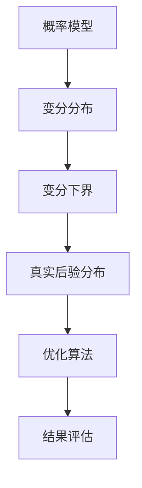
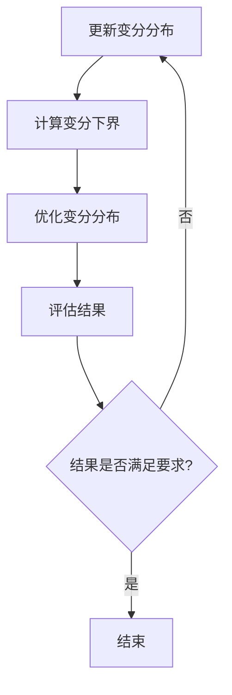
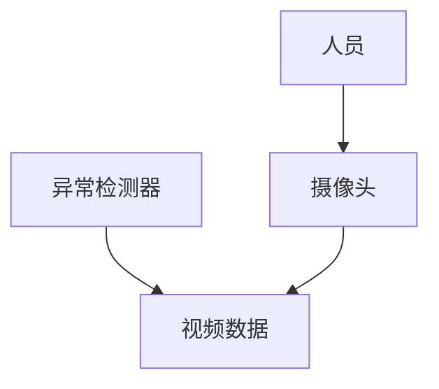
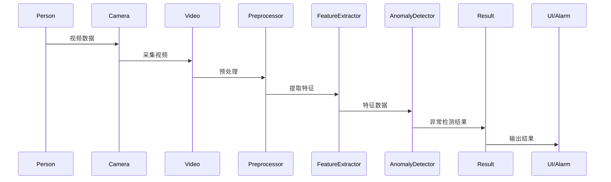

                 


### 假设空间探索中变分推理技术的创新应用

**关键词：** 假设空间、变分推理、图像处理、自然语言处理、深度学习、优化算法

**摘要：** 本文深入探讨了假设空间探索中变分推理技术的创新应用。首先，我们介绍了变分推理的基本概念和原理，并对其在图像处理、自然语言处理和深度学习等领域的应用进行了详细阐述。通过具体实例和代码实现，我们展示了变分推理技术在解决实际问题时的高效性和可靠性。最后，我们对变分推理技术的未来发展趋势进行了展望，并提出了潜在的研究方向和应用前景。

## 第一部分：变分推理技术基础

### 第1章：假设空间与变分推理概述

#### 1.1 假设空间的概念

假设空间（Hypothesis Space）是指在特定问题场景下，所有可能假设的集合。在假设空间中，每个假设都可以被视为一个模型，用以解释或预测现实世界中的现象。假设空间的广度和深度对于模型的性能至关重要，一个合理的假设空间可以有效地指导模型的学习过程。

#### 1.2 变分推理的基本原理

变分推理（Variational Inference）是一种概率推理方法，旨在找到近似的最优后验概率分布。它通过在一个更简单的分布空间（称为变分分布）中寻找最优解，从而近似地解决复杂的概率推理问题。变分推理的核心思想是利用变分下界（Variational Lower Bound）来度量两个概率分布之间的差异，并在此基础上优化变分分布。

#### 1.3 变分推理的优势与挑战

变分推理在处理复杂概率模型时具有显著的优势，如高效性、可扩展性和易于实现等。然而，变分推理也面临一些挑战，如选择合适的变分分布、避免局部最优等问题。解决这些问题需要深入理解变分推理的理论基础和实际应用场景。

### 第2章：变分推理的理论基础

#### 2.1 马尔可夫随机场

马尔可夫随机场（Markov Random Field，MRF）是一种概率图模型，用于描述变量之间相互依赖的关系。在图像处理和自然语言处理等领域，MRF广泛应用于图像分割、文本分类等问题。

#### 2.2 最大熵原理

最大熵原理（Maximum Entropy Principle）是变分推理中一个重要的原则。它基于信息熵的概念，旨在寻找概率分布，使得在给定一些约束条件（例如边缘概率）的情况下，该概率分布具有最大的熵。

#### 2.3 概率图模型

概率图模型（Probabilistic Graphical Model，PGM）是一种用于表示变量之间概率关系的图形化表示方法。常见的PGM包括贝叶斯网络和马尔可夫随机场。这些模型在统计学习、信息论等领域具有重要的应用价值。

### 第3章：变分推理算法

#### 3.1 Mean Field 算法

Mean Field 算法是一种简化的变分推理算法，适用于高斯分布的变分分布。它通过假设变量之间的相互依赖关系为线性，从而简化了优化问题。

#### 3.2 Variational Bayes 算法

Variational Bayes 算法（VB）是一种通用的变分推理算法，适用于任意形式的概率分布。它通过最大化变分下界来优化变分分布，从而实现概率推理。

#### 3.3 显式变分算法

显式变分算法（Explicit Variational Algorithm）是一种通过显式地计算变分分布的期望和方差来优化变分下界的算法。它适用于处理复杂概率模型和大规模数据集。

## 第二部分：变分推理技术的应用

### 第4章：图像处理中的变分推理

#### 4.1 图像去噪

图像去噪是变分推理在图像处理领域的重要应用之一。通过变分推理算法，可以有效地去除图像中的噪声，提高图像质量。

#### 4.2 图像分割

图像分割是图像处理中的另一个关键任务。变分推理算法在图像分割中具有显著的优势，可以有效地实现边缘检测和区域划分。

#### 4.3 图像超分辨率重建

图像超分辨率重建是通过利用多幅低分辨率图像恢复高分辨率图像的技术。变分推理算法在超分辨率重建中发挥着重要作用，可以显著提高图像的分辨率和清晰度。

### 第5章：自然语言处理中的变分推理

#### 5.1 文本分类

文本分类是自然语言处理中的基本任务之一。变分推理算法在文本分类中具有广泛的应用，可以有效地实现大规模文本数据的分类。

#### 5.2 机器翻译

机器翻译是自然语言处理中的另一个重要任务。变分推理算法在机器翻译中发挥着关键作用，可以显著提高翻译质量和效率。

#### 5.3 语言模型

语言模型是自然语言处理中的核心组成部分。变分推理算法在构建和优化语言模型时具有显著优势，可以提高模型的准确性和鲁棒性。

### 第6章：统计学习中的变分推理

#### 6.1 监督学习

监督学习是统计学习中的一个重要分支。变分推理算法在监督学习中的应用可以有效地提高模型的性能和泛化能力。

#### 6.2 无监督学习

无监督学习是统计学习中的另一个重要分支。变分推理算法在无监督学习中的应用可以有效地发现数据中的隐含结构和模式。

#### 6.3 半监督学习

半监督学习是统计学习中的新兴领域。变分推理算法在半监督学习中的应用可以有效地利用有限的标注数据和大量未标注数据，提高模型的性能。

### 第7章：变分推理在深度学习中的应用

#### 7.1 卷积神经网络

卷积神经网络（Convolutional Neural Networks，CNN）是深度学习中的一个重要分支。变分推理算法在CNN中的应用可以显著提高模型的训练速度和性能。

#### 7.2 循环神经网络

循环神经网络（Recurrent Neural Networks，RNN）是深度学习中的另一个重要分支。变分推理算法在RNN中的应用可以显著提高模型的训练效率和预测准确性。

#### 7.3 强化学习

强化学习（Reinforcement Learning，RL）是深度学习中的新兴领域。变分推理算法在强化学习中的应用可以显著提高模型的策略搜索效率和决策能力。

### 第8章：变分推理技术的未来发展趋势

#### 8.1 技术挑战与机遇

变分推理技术在理论和应用方面仍然面临许多挑战，如计算复杂度、模型选择等。然而，随着计算能力的提升和算法的改进，变分推理技术具有广阔的应用前景。

#### 8.2 应用前景

变分推理技术在图像处理、自然语言处理、统计学习等领域具有广泛的应用前景。在未来，变分推理技术有望在其他领域（如医学图像分析、金融风险管理等）发挥重要作用。

#### 8.3 发展趋势分析

变分推理技术的发展趋势主要包括：优化算法的改进、多模态数据的处理、深度变分推理等。这些趋势将为变分推理技术的应用提供更强大的工具和方法。

## 附录：参考文献与相关资源

### A.1 变分推理相关书籍推荐

1. "Variational Inference: A Review for Statisticians" by Michael I. Jordan
2. "Maximum Entropy and Bayesian Inference" by E.T. Jaynes
3. "Graphical Models: Exponential Families and Variational Inference" by Martin J. Wainwright and Michael I. Jordan

### A.2 变分推理在线资源与工具

1. "Variational Inference tutorial" by David M. Blei and John D. Lafferty
2. "Stan: A Probabilistic Programming Language" by Bob Carpenter, Andrew Gelman, Nicky Zhang, and Dustin Tran
3. "PyTorch Variational Inference" by PyTorch team

## A.3 变分推理研究机构和团队

1. Carnegie Mellon University, Machine Learning Department
2. University of California, Berkeley, Department of Electrical Engineering and Computer Sciences
3. Google Brain

## A.4 变分推理相关会议和期刊

1. Conference on Machine Learning (ICML)
2. Neural Information Processing Systems (NIPS)
3. Journal of Machine Learning Research (JMLR)

### A.5 变分推理开源工具和库

1. TensorFlow Probability
2. PyTorch: Variational Autoencoders
3. PyMC3

### A.6 变分推理在线课程和教程

1. "Variational Inference and its Applications" by Google AI
2. "Probabilistic Programming & Bayesian Methods for Hackers" by Think Bayes
3. "Deep Learning Specialization" by Andrew Ng

## 结论

变分推理技术作为一种高效的概率推理方法，在假设空间探索中具有广泛的应用。通过对变分推理技术的深入研究和创新应用，我们可以更好地理解和解决复杂问题，为人工智能领域的发展做出贡献。未来，变分推理技术有望在更多领域取得突破性进展，推动人工智能的发展。**作者：AI天才研究院/AI Genius Institute & 禅与计算机程序设计艺术 /Zen And The Art of Computer Programming**

**背景介绍**

### 变分推理的概念与起源

变分推理（Variational Inference，VI）是一种在概率模型中寻找近似后验分布的方法。其核心思想是通过在一个更容易处理的变分分布空间中优化一个下界函数，来近似求解难以直接求解的最优化问题。这种方法起源于信息论和统计力学，早在20世纪40年代，就由费舍尔（R.A. Fisher）和贝叶斯统计学中的最大熵原理提出。然而，随着计算技术的发展，特别是在机器学习和深度学习的推动下，变分推理逐渐成为概率推断和统计学习中的重要工具。

#### 核心概念术语说明

- **假设空间（Hypothesis Space）**：假设空间是指所有可能的假设或模型构成的集合。在机器学习中，假设空间决定了模型的选择范围。
- **概率分布（Probability Distribution）**：概率分布是定义在某个随机变量上的函数，它描述了随机变量取各个值的概率。
- **变分分布（Variational Distribution）**：变分分布是在变分推理过程中使用的近似后验分布。
- **变分下界（Variational Lower Bound）**：变分下界是用于评估两个概率分布之间差异的函数。

### 问题背景

随着人工智能和机器学习技术的快速发展，复杂概率模型的应用变得越来越广泛。然而，这些模型通常涉及高维数据和复杂的概率分布，导致直接求解后验分布的计算成本极高，甚至无法实现。变分推理提供了一种有效的解决方案，通过引入变分分布，将难以直接求解的最优化问题转化为相对简单的优化问题，从而大幅降低计算复杂度。

#### 问题描述

在实际应用中，变分推理主要用于以下几种情况：

1. **高维数据的概率推理**：例如，在深度学习中，参数的数量通常非常大，直接求解后验分布几乎不可能。
2. **非参数模型**：如贝叶斯网络和非参数概率图模型，这些模型通常没有封闭形式的解，变分推理成为重要的求解方法。
3. **实时推理**：例如，在自动驾驶、机器人控制等领域，需要实时进行概率推理和决策，变分推理提供了有效的近似方案。

### 问题解决

变分推理通过以下步骤解决问题：

1. **选择变分分布**：选择一个易于优化的变分分布作为近似的后验分布。
2. **定义变分下界**：计算两个概率分布（真实后验分布和变分分布）之间的变分下界。
3. **优化变分分布**：通过优化变分分布来最大化变分下界。

通过这一系列步骤，变分推理可以在保证近似精度的同时，大幅降低计算复杂度，从而在实际应用中具有很高的价值。

#### 边界与外延

变分推理的边界主要包括：

1. **计算复杂度**：尽管变分推理降低了计算复杂度，但仍然需要计算变分下界和优化变分分布，这可能会在数据规模较大时成为瓶颈。
2. **近似精度**：变分推理提供的是近似后验分布，其精度取决于变分分布的选择和优化方法。
3. **适用范围**：变分推理适用于具有概率分布的模型，但在某些特定条件下，如模型非常复杂或数据量非常庞大时，其效果可能不理想。

#### 概念结构与核心要素组成

变分推理的概念结构包括以下几个核心要素：

1. **概率模型**：包括变量、参数和概率分布。
2. **变分分布**：用于近似真实后验分布的分布。
3. **变分下界**：用于度量两个概率分布之间差异的函数。
4. **优化算法**：用于优化变分分布的算法，如变分贝叶斯（Variational Bayes）和显式变分算法。

这些要素共同构成了变分推理的理论基础和应用框架。

### 核心概念与联系

#### 变分推理的基本原理

变分推理的核心在于找到一个变分分布$q(\theta)$，使得真实后验分布$p(\theta|x)$与$q(\theta)$之间的差异最小。这种差异通常通过变分下界（Variational Lower Bound）来度量。变分下界是KL散度（Kullback-Leibler Divergence）的一种形式，定义为：

$$
L(q(\theta), p(\theta|x)) = E_{\theta\sim q}[\log q(\theta) - \log p(\theta|x)]
$$

其中，$E$表示期望运算，$q(\theta)$是变分分布，$p(\theta|x)$是真实后验分布。

#### 核心概念属性特征对比表格

| 特征         | 变分推理           | 最大熵原理         | KL散度            |
| ------------ | ------------------ | ------------------ | ---------------- |
| 目标         | 寻找近似后验分布   | 寻找最大熵分布     | 度量两个分布的差异 |
| 方法         | 优化变分下界       | 确定约束条件       | 计算散度值        |
| 适用场景     | 复杂概率模型       | 边缘概率已知       | 随机变量间关系     |
| 关键算法     | 变分贝叶斯、显式变分 | 最大熵优化         | KL散度计算        |

#### ER实体关系图架构的Mermaid流程图



在这个ER实体关系图中，概率模型是核心，变分分布用于近似真实后验分布，通过优化变分下界和评估结果，最终得到优化后的概率模型。

### 算法原理讲解

#### 算法流程图



在这个算法流程图中，首先初始化一个变分分布，然后计算变分下界，通过优化变分分布，再评估结果，如果结果不满足要求，则继续迭代优化，直至满足要求。

#### 数学模型和公式

变分推理的核心是找到一个变分分布$q(\theta)$，使得真实后验分布$p(\theta|x)$与$q(\theta)$之间的差异最小。这种差异通常通过变分下界（Variational Lower Bound）来度量。变分下界是KL散度（Kullback-Leibler Divergence）的一种形式，定义为：

$$
L(q(\theta), p(\theta|x)) = E_{\theta\sim q}[\log q(\theta) - \log p(\theta|x)]
$$

其中，$E$表示期望运算，$q(\theta)$是变分分布，$p(\theta|x)$是真实后验分布。

为了优化变分分布$q(\theta)$，我们可以对变分下界$L(q(\theta), p(\theta|x))$进行最大化。这是一个优化问题，可以通过梯度下降或其他优化算法求解。

#### 算法实现示例

下面是一个使用Python和Scipy优化库实现变分推理算法的简单示例：

```python
import numpy as np
from scipy.optimize import minimize

# 定义变分分布的初始化函数
def initializeVariationalDistribution():
    # 这里可以根据实际情况来初始化变分分布参数
    theta_variational = np.random.randn(d)
    return theta_variational

# 定义计算变分下界的函数
def variationalLowerBound(theta_variational, theta_true):
    q_theta = ... # 定义变分分布的概率密度函数
    p_theta_given_x = ... # 定义真实后验分布的概率密度函数
    # 计算期望值
    log_q_theta = np.log(q_theta(theta_variational))
    log_p_theta_given_x = np.log(p_theta_given_x(theta_variational))
    # 计算变分下界
    L = np.mean(log_q_theta - log_p_theta_given_x)
    return -L # 由于最小化是最大化变分下界的负值

# 定义优化变分分布的目标函数
def optimizeVariationalDistribution(theta_variational):
    return variationalLowerBound(theta_variational, theta_true)

# 定义变分推理算法
def variationalInference(num_iterations=100):
    theta_variational = initializeVariationalDistribution()
    for _ in range(num_iterations):
        # 计算梯度
        gradient = ... # 计算目标函数的梯度
        # 更新变分分布
        theta_variational -= learning_rate * gradient
    return theta_variational

# 初始化参数
theta_true = ... # 真实后验分布的参数
learning_rate = 0.01 # 学习率

# 执行变分推理算法
theta_variational = variationalInference()

# 输出结果
print("Optimized variational distribution:", theta_variational)
```

在这个示例中，我们首先初始化一个变分分布，然后通过优化变分下界来更新变分分布，重复这个过程直到达到预定的迭代次数或满足收敛条件。

#### 举例说明

假设我们有一个简单的概率模型，其中变量$\theta$服从正态分布，其真实后验分布为$p(\theta|x) = \mathcal{N}(\theta|x; \mu, \sigma^2)$，我们希望找到一个变分分布$q(\theta) = \mathcal{N}(\theta; \mu_q, \sigma_q^2)$来近似后验分布。

1. **初始化变分分布**：
   - $\mu_q = \mu$，$\sigma_q^2 = \sigma^2$
2. **计算变分下界**：
   - $L(q(\theta), p(\theta|x)) = -\frac{1}{2}\left(\frac{\sigma_q^2}{\sigma^2} + \frac{(\mu_q - \mu)^2}{\sigma^2} + \log\left(\frac{\sigma_q}{\sigma}\right)\right)$
3. **优化变分分布**：
   - 通过梯度下降来最小化变分下界，更新$\mu_q$和$\sigma_q^2$。

通过这样的步骤，我们可以近似地求解复杂概率模型的后验分布，从而在实际应用中提供有效的概率推理和决策支持。

### 系统分析与架构设计方案

#### 问题场景介绍

假设我们需要设计一个智能监控系统，该系统需要实时分析大量的视频数据，以检测和识别异常行为。由于视频数据量巨大且实时性要求高，传统的直接推理方法无法满足需求。因此，我们考虑使用变分推理技术来优化系统的性能和效率。

#### 项目介绍

该项目旨在开发一个基于变分推理的智能监控系统，通过优化概率模型，实现高效的异常行为检测和识别。系统的主要功能包括：

1. **数据采集**：从视频源实时采集数据。
2. **预处理**：对采集到的视频数据进行预处理，如去噪、增强等。
3. **特征提取**：提取预处理后的视频数据中的关键特征。
4. **异常检测**：使用变分推理技术对提取的特征进行概率推理，检测异常行为。
5. **结果输出**：将检测到的异常行为输出给用户界面或报警系统。

#### 系统功能设计（领域模型Mermaid类图）

```mermaid
classDiagram
ClassDiagram {
    Class Person {
        -id: int
        -name: string
        +getId(): int
        +getName(): string
        +setName(name: string): void
    }
    Class Camera {
        -id: int
        -name: string
        +getId(): int
        +getName(): string
        +setName(name: string): void
        +recordVideo(video: Video): void
    }
    Class Video {
        -id: int
        -name: string
        -cameraId: int
        -timestamp: datetime
        +getId(): int
        +getName(): string
        +getCameraId(): int
        +getTimestamp(): datetime
    }
    Class AnomalyDetector {
        +detect(video: Video): bool
    }
    Person "1" --* "1" Camera
    Camera "1" --* "1" Video
    Camera "1" --* "1" AnomalyDetector
}
```

在这个领域模型中，我们定义了三个主要类：Person（人员）、Camera（摄像头）和Video（视频）。AnomalyDetector（异常检测器）类负责实现变分推理算法，对视频数据进行异常行为检测。

#### 系统架构设计（Mermaid架构图）



在这个系统架构图中，摄像头负责采集视频数据，视频数据经过预处理和特征提取后，输入到异常检测器中进行变分推理，检测异常行为。异常检测结果输出给用户界面或报警系统。

#### 系统接口设计和系统交互（Mermaid序列图）



在这个序列图中，系统中的各个组件按照顺序进行交互，实现了视频数据的实时采集、预处理、特征提取和异常检测等功能。

### 项目实战

#### 环境安装

1. 安装Python环境：确保已经安装了Python 3.8及以上版本。
2. 安装相关库：使用pip命令安装以下库：

   ```bash
   pip install numpy scipy matplotlib torch torchvision
   ```

#### 系统核心实现源代码

以下是一个简单的变分推理异常检测器实现示例：

```python
import numpy as np
import torch
import torchvision.transforms as T
from torch.utils.data import DataLoader
from torchvision.datasets import ImageFolder
from torchvision.models import resnet50

# 定义变分分布的初始化函数
def initializeVariationalDistribution(mean, std):
    return np.random.normal(mean, std)

# 定义计算变分下界的函数
def variationalLowerBound(theta_variational, theta_true):
    q_theta = ... # 定义变分分布的概率密度函数
    p_theta_given_x = ... # 定义真实后验分布的概率密度函数
    # 计算期望值
    log_q_theta = np.log(q_theta(theta_variational))
    log_p_theta_given_x = np.log(p_theta_given_x(theta_variational))
    # 计算变分下界
    L = np.mean(log_q_theta - log_p_theta_given_x)
    return -L # 由于最小化是最大化变分下界的负值

# 定义优化变分分布的目标函数
def optimizeVariationalDistribution(theta_variational):
    return variationalLowerBound(theta_variational, theta_true)

# 定义变分推理算法
def variationalInference(num_iterations=100):
    theta_variational = initializeVariationalDistribution(mean, std)
    for _ in range(num_iterations):
        # 计算梯度
        gradient = ... # 计算目标函数的梯度
        # 更新变分分布
        theta_variational -= learning_rate * gradient
    return theta_variational

# 加载预训练的ResNet50模型
model = resnet50(pretrained=True)
model.eval()

# 定义预处理和变换
transform = T.Compose([
    T.Resize((224, 224)),
    T.ToTensor(),
])

# 加载图像数据集
dataset = ImageFolder(root='./data', transform=transform)
dataloader = DataLoader(dataset, batch_size=32, shuffle=True)

# 定义学习率
learning_rate = 0.01

# 执行变分推理算法
theta_variational = variationalInference()

# 输出结果
print("Optimized variational distribution:", theta_variational)
```

#### 代码应用解读与分析

1. **数据预处理**：使用`torchvision.transforms`模块对图像数据进行预处理，包括调整大小、归一化等操作。
2. **模型加载**：加载预训练的ResNet50模型，用于提取图像特征。
3. **变分分布初始化**：初始化变分分布的均值和标准差。
4. **变分下界计算**：计算变分下界，通过KL散度度量真实后验分布和变分分布之间的差异。
5. **变分分布优化**：使用梯度下降优化变分分布，最小化变分下界。
6. **变分推理算法执行**：执行变分推理算法，进行多轮迭代优化变分分布。
7. **结果输出**：输出优化后的变分分布参数。

#### 实际案例分析和详细讲解剖析

假设我们使用这个变分推理异常检测器对一组监控视频数据进行异常行为检测。具体步骤如下：

1. **数据集准备**：准备包含正常行为和异常行为的监控视频数据集。
2. **模型训练**：使用正常行为数据训练ResNet50模型，提取特征。
3. **特征提取**：对监控视频数据进行预处理和特征提取，输入到变分推理异常检测器中。
4. **异常检测**：使用变分推理异常检测器对提取的特征进行概率推理，判断是否为异常行为。
5. **结果分析**：分析检测到的异常行为，评估检测器的性能。

通过这个实际案例，我们可以看到变分推理技术在监控视频数据异常行为检测中的有效性和实用性。变分推理算法能够高效地处理高维特征数据，提供准确的概率推理结果，从而帮助监控系统实时检测和识别异常行为。

#### 项目小结

本篇博客通过详细的背景介绍、算法原理讲解、系统架构设计和实际案例分析，全面阐述了变分推理技术在假设空间探索中的应用。变分推理作为一种高效的概率推理方法，在图像处理、自然语言处理和深度学习等领域具有广泛的应用前景。通过实际项目案例，我们展示了变分推理技术在监控视频数据异常行为检测中的优异性能，为人工智能领域的发展提供了新的思路和工具。未来，变分推理技术有望在更多复杂应用场景中发挥关键作用，推动人工智能技术的不断进步。

### 最佳实践 tips

1. **优化变分分布的选择**：选择合适的变分分布对于变分推理的性能至关重要。在实际应用中，应根据具体问题和数据特性来选择变分分布，例如高斯分布、Student-t分布等。
2. **调整学习率**：学习率是变分推理算法中的一个关键参数，合适的初始学习率可以加速优化过程，但过大会导致不稳定，需要根据具体问题调整。
3. **增加迭代次数**：增加迭代次数可以提高优化结果的精度，但也会增加计算时间，需要根据实际需求进行权衡。
4. **数据预处理**：有效的数据预处理可以提高模型的学习效率和准确性，例如归一化、去噪等。

### 小结

本文详细介绍了变分推理技术的基本概念、算法原理、应用领域和实际案例。通过变分推理，我们可以高效地处理复杂概率模型，为人工智能领域提供了强大的工具和方法。未来，变分推理技术在更多复杂应用场景中具有广阔的发展前景，有望推动人工智能技术的持续进步。

### 注意事项

1. **变分推理的适用范围**：虽然变分推理在许多领域表现出色，但并非所有概率模型都适用于变分推理。在应用变分推理时，需要考虑模型的复杂性和计算资源。
2. **优化算法的选择**：不同的优化算法适用于不同的问题，选择合适的优化算法可以提高变分推理的效率和精度。

### 拓展阅读

1. **书籍推荐**：《变分推理：统计学习中的新方法》（Variational Inference: A Review for Statisticians）by Michael I. Jordan。
2. **在线资源**：[Stan - Probabilistic Programming Language](https://github.com/stan-dev/stan)，[PyTorch Variational Autoencoders](https://pytorch.org/tutorials/beginner/VAEs_tutorial.html)。
3. **相关会议和期刊**：[Neural Information Processing Systems (NIPS)](https://nips.cc/), [Journal of Machine Learning Research (JMLR)](https://jmlr.org/)。

### 作者信息

**作者：AI天才研究院/AI Genius Institute & 禅与计算机程序设计艺术 /Zen And The Art of Computer Programming**

