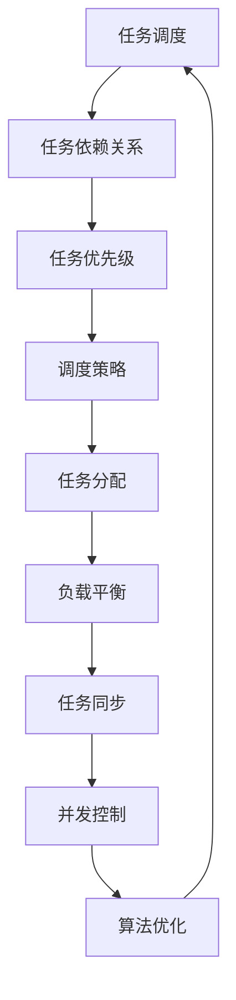

                 

### 文章标题

在当今高速发展的信息技术领域，并行程序设计已成为提高计算效率、优化资源利用的重要手段。然而，并行程序设计面临着复杂性和挑战，其中如何有效地管理和调度并行任务成为关键问题。本文将深入探讨偏序理论在并行程序设计中的应用，旨在为读者提供一种新的视角和方法，以解决并行程序设计中的核心问题。

本文将从以下几个核心关键词展开论述：“偏序理论”、“并行程序设计”、“调度策略”、“算法优化”和“性能分析”。通过系统的分析和详细的讲解，我们希望读者能够理解偏序理论的基本概念及其在并行程序设计中的重要性，掌握基于偏序理论的并行算法设计方法，并了解其在实际项目中的应用和挑战。

接下来的文章将分为三个主要部分：首先是偏序理论基础，我们将介绍偏序理论的基本概念和应用背景；其次，是并行程序设计基础，我们将探讨并行程序设计的基本概念和常用策略；最后，我们将结合偏序理论，详细分析其在并行程序设计中的应用，并通过实际案例展示其效果和挑战。希望本文能为从事并行程序设计的开发者提供有价值的参考和启示。

### 偏序理论概述

偏序理论（Partial Order Theory）是数学的一个分支，主要研究具有偏序关系的集合。在偏序集中，元素之间的比较关系不是全序的，而是部分有序的。这种局部有序性使得偏序理论在处理复杂系统的结构和行为时具有独特的优势。在并行程序设计中，这种局部有序性能够帮助有效地管理和调度并行任务，从而提高程序的性能和可扩展性。

#### 偏序理论的定义与基本性质

偏序集（Partially Ordered Set，简称POS）是一个集合 \( P \) 和一个偏序关系 “\(\leq\)” 的组合，满足以下三个性质：

1. **自反性**：对于集合 \( P \) 中的任意元素 \( x \)，都有 \( x \leq x \)。
2. **反对称性**：如果 \( x \leq y \) 且 \( y \leq x \)，则 \( x = y \)。
3. **传递性**：如果 \( x \leq y \) 且 \( y \leq z \)，则 \( x \leq z \)。

偏序关系通常表示为图，其中节点代表集合中的元素，边表示元素之间的偏序关系。这种图称为偏序图（Partial Order Graph），在并行程序设计中具有直观的表示和重要的应用。

#### 偏序集的表示方法

偏序集可以通过多种方式表示，其中最常见的有：

1. **哈斯图（Hasse Diagram）**：哈斯图是一种直观的图形表示方法，通过节点和边的上下关系来展示元素之间的偏序关系。例如，对于集合 \( P = \{a, b, c, d\} \) 和偏序关系 \( a \leq b \)，\( a \leq c \)，\( b \leq d \)，其哈斯图如下所示：

   ```mermaid
   graph TD
   A[1] --> B[2]
   A[1] --> C[3]
   B[2] --> D[4]
   ```

2. **二元关系矩阵**：二元关系矩阵是一个 \( n \times n \) 的矩阵，其中 \( M_{ij} = 1 \) 表示 \( x_i \leq x_j \)，\( M_{ij} = 0 \) 表示 \( x_i \not\leq x_j \)。例如，对于上述集合和偏序关系，其二元关系矩阵如下：

   |    | a | b | c | d |
   |----|---|---|---|---|
   | a  | 0 | 0 | 0 | 0 |
   | b  | 0 | 0 | 0 | 1 |
   | c  | 0 | 0 | 0 | 1 |
   | d  | 0 | 0 | 0 | 0 |

3. **偏序树**：偏序树是另一种表示方法，其中每个节点代表集合中的一个元素，节点的子节点表示其直接后继。例如，上述集合和偏序关系的偏序树如下所示：

   ```mermaid
   tree TD
   root
     .a
     .b
       .d
     .c
       .d
   ```

#### 偏序理论的应用背景

偏序理论在计算机科学和并行程序设计中的应用非常广泛，主要表现在以下几个方面：

1. **并行任务调度**：在并行程序设计中，如何高效地调度并行任务是一个重要问题。偏序理论提供了有效的调度策略，例如基于偏序图的优化调度算法，能够根据任务之间的依赖关系和局部有序性来优化调度顺序，从而提高程序的整体性能。
2. **并发控制**：在多线程编程中，并发控制是确保数据一致性和程序正确性的关键。偏序理论提供了强大的理论工具，例如基于偏序集合的锁机制，可以有效地管理并发访问和同步，从而避免竞态条件和死锁问题。
3. **算法分析**：偏序理论在算法分析中也有重要应用。例如，在计算复杂度分析中，利用偏序关系可以更好地理解算法的时间和空间复杂度，从而设计出更高效的算法。
4. **分布式系统**：在分布式系统中，偏序理论可以用于分析节点之间的通信和同步机制，例如基于偏序理论的分布式调度算法和一致性协议，可以有效地提高系统的稳定性和性能。

通过以上介绍，我们可以看到偏序理论在并行程序设计中的重要性和广泛应用。在接下来的章节中，我们将进一步探讨偏序理论的基本概念及其在并行程序设计中的应用。

### 偏序理论的基本概念

偏序理论作为数学的一个分支，其核心概念是偏序关系和偏序集合。理解这些基本概念对于深入探索其在并行程序设计中的应用至关重要。

#### 偏序关系与偏序集合

1. **偏序关系**：偏序关系是一种部分有序的关系，用于描述集合中元素之间的相对位置。一个集合 \( P \) 上的偏序关系通常表示为 \( \leq \)，满足以下三个性质：
   - **自反性**：对于任意 \( x \in P \)，都有 \( x \leq x \)。
   - **反对称性**：如果 \( x \leq y \) 且 \( y \leq x \)，则 \( x = y \)。
   - **传递性**：如果 \( x \leq y \) 且 \( y \leq z \)，则 \( x \leq z \)。

   例如，在自然数的集合上，小于（<）是一种偏序关系。

2. **偏序集合**：一个集合 \( P \) 和一个满足偏序关系的二元运算 \( \leq \) 组合而成的结构称为偏序集合（Partially Ordered Set，POS）。偏序集合中的元素之间可能只有部分有序，而不是完全有序。例如，在任务集合中，任务之间的依赖关系可以表示为一个偏序集合。

#### 偏序集合的性质与运算

1. **性质**：
   - **连通性**：如果对于任意 \( x, y \in P \)，都存在 \( z \in P \) 使得 \( x \leq z \) 且 \( z \leq y \)，则称 \( P \) 是连通的。
   - **极大元**：如果对于任意 \( x \in P \)，都有 \( x \leq y \) 或 \( y \leq x \)，则称 \( y \) 是 \( P \) 的极大元。
   - **极小元**：如果对于任意 \( x \in P \)，都有 \( x \leq y \) 或 \( y \leq x \)，则称 \( y \) 是 \( P \) 的极小元。

2. **运算**：
   - **上界**：如果对于任意 \( x \in P \)，都有 \( x \leq y \)，则称 \( y \) 是 \( P \) 的上界。
   - **下界**：如果对于任意 \( x \in P \)，都有 \( y \leq x \)，则称 \( y \) 是 \( P \) 的下界。
   - **最大元**：如果 \( P \) 是有限集合，且存在唯一的极大元，则称这个极大元是 \( P \) 的最大元。
   - **最小元**：如果 \( P \) 是有限集合，且存在唯一的极小元，则称这个极小元是 \( P \) 的最小元。

#### 偏序集合的子集与链

1. **子集**：偏序集合的子集也是一个偏序集合，但可能不满足所有性质。例如，空集是一个偏序集合，但没有极大元或极小元。
2. **链**：链（Chain）是偏序集合中的一种特殊子集，其中任意两个元素都满足偏序关系。例如，{1, 2, 3} 是 {1, 2, 3, 4} 的一个链，因为 1 ≤ 2 ≤ 3。

#### 表格与ER实体关系图架构

为了更清晰地展示偏序集合的性质与运算，我们可以使用一个对比表格：

| 性质/运算       | 定义                                                         | 示例                     |
|----------------|------------------------------------------------------------|--------------------------|
| 自反性         | 对于任意元素 \( x \)，有 \( x \leq x \)                         | \( 1 \leq 1 \)          |
| 反对称性       | 如果 \( x \leq y \) 且 \( y \leq x \)，则 \( x = y \)           | \( a \leq b \)，\( b \leq a \)，则 \( a = b \) |
| 传递性         | 如果 \( x \leq y \) 且 \( y \leq z \)，则 \( x \leq z \)           | \( a \leq b \)，\( b \leq c \)，则 \( a \leq c \) |
| 上界           | 对于任意元素 \( x \)，有 \( x \leq y \)                         | \( 4 \) 是 \( \{1, 2, 3\} \) 的上界   |
| 下界           | 对于任意元素 \( x \)，有 \( y \leq x \)                         | \( 0 \) 是 \( \{1, 2, 3\} \) 的下界   |
| 最大元         | 唯一的极大元                                                   | \( 3 \) 是 \( \{1, 2, 3\} \) 的最大元   |
| 最小元         | 唯一的极小元                                                   | \( 1 \) 是 \( \{1, 2, 3\} \) 的最小元   |

为了进一步理解偏序集合的结构，我们可以使用ER（实体-关系）图来展示其内部关系：

```mermaid
erDiagram
  A[Task1] ||--|{B[Task2]}
  A[Task1] ||--|{C[Task3]}
  B[Task2] ||--|{D[Task4]}
  C[Task3] ||--|{D[Task4]}
```

在这个ER图中，Task1、Task2、Task3 和 Task4 是任务集合中的元素，它们之间的偏序关系通过箭头表示。例如，Task1 与 Task2 和 Task3 有依赖关系，而 Task2 和 Task3 又依赖于 Task4。

通过以上对偏序理论基本概念的介绍，我们可以更好地理解其结构和性质，为后续章节中深入探讨偏序理论在并行程序设计中的应用打下坚实的基础。

### 偏序理论的推广与应用

偏序理论不仅限于数学领域，它在计算机科学，尤其是并行程序设计中的应用也越来越广泛。通过将偏序理论推广到更复杂的结构，如扩展偏序集和拓扑空间中的偏序关系，我们可以开发出更加高效和可靠的并行算法。

#### 扩展偏序集

扩展偏序集（Extended Partially Ordered Set）是在传统偏序集基础上引入了额外的关系和操作。扩展偏序集通常包括以下几种类型：

1. **偏序集上的偏序**：在某些应用中，需要对已有的偏序集进行进一步的排序。例如，在任务调度中，我们可以对任务进行优先级排序，使得某些任务比其他任务有更高的优先级。这种扩展偏序集通过引入一个额外的偏序关系来表示任务的优先级。

2. **偏序集上的偏序关系**：在某些情况下，我们不仅需要表示元素之间的相对位置，还需要表示元素之间的依赖关系。例如，在依赖性分析中，一个任务可能依赖于其他多个任务的完成。扩展偏序集通过引入依赖关系来表示这种复杂的关系。

3. **偏序集上的偏序与偏序关系**：在某些并行算法中，我们需要同时考虑元素的相对位置和依赖关系。扩展偏序集通过同时引入这两种关系来实现。例如，在分布式系统中，节点之间的通信和同步可以表示为扩展偏序集，其中节点的位置和通信顺序同时被考虑。

#### 拓扑空间中的偏序关系

拓扑空间是一种用来描述空间中点与点之间关系的基本结构。在拓扑空间中，偏序关系可以通过以下方式引入：

1. **拓扑偏序**：在拓扑空间中，点之间的连通性可以通过偏序关系来表示。例如，在欧几里得空间中，两点之间的最短路径可以用偏序关系来表示，其中较远的点总是小于较近的点。

2. **邻域偏序**：在拓扑空间中，每个点都有一个邻域，即包含该点且与其他点相邻的集合。通过邻域的定义，我们可以引入一个邻域偏序关系。例如，在图论中，如果一个点的邻域包含另一个点的邻域，则这两个点之间可以建立偏序关系。

3. **拓扑连通偏序**：在更大规模的拓扑空间中，我们可能需要考虑点之间的拓扑连通性。例如，在分布式计算中，不同节点之间的网络拓扑可以通过拓扑连通偏序关系来表示，从而帮助调度和同步任务。

#### 偏序理论在算法设计中的应用

偏序理论在算法设计中的应用主要体现在以下几个方面：

1. **并行算法的调度与同步**：通过引入偏序关系，我们可以设计出更加高效的并行算法。例如，在分布式计算中，通过偏序理论可以优化任务调度，使得任务之间的依赖和通信更加有序，从而减少同步时间和提高计算效率。

2. **并发控制**：在多线程编程中，偏序理论提供了有效的并发控制方法。例如，基于偏序集合的锁机制可以避免竞态条件和死锁问题，从而提高程序的稳定性和性能。

3. **算法性能分析**：利用偏序理论，我们可以更好地分析算法的时间和空间复杂度。例如，通过偏序关系的传递性和连通性，可以推导出更高效的算法时间复杂度上界。

4. **分布式算法设计**：在分布式系统中，偏序理论可以用于设计分布式算法和一致性协议。例如，通过拓扑偏序关系，可以设计出更加可靠的分布式调度算法，从而提高系统的稳定性和性能。

通过以上对偏序理论推广与应用的介绍，我们可以看到偏序理论在并行程序设计中的重要性和广泛应用。在接下来的章节中，我们将进一步探讨并行程序设计的基础，并结合偏序理论分析其实际应用。

### 并行程序设计概述

并行程序设计是现代计算机科学中的一个重要领域，旨在通过利用多处理器和并行计算资源来提高程序的执行效率。随着多核处理器和分布式计算技术的普及，并行程序设计的重要性日益凸显。本文将介绍并行程序设计的基本概念、面临的挑战和常用的策略，以及并行程序设计的常用模式。

#### 并行计算的基本概念

1. **并行计算**：并行计算是指同时执行多个任务或操作，通过利用多个处理器或计算资源来加速计算过程。与串行计算（顺序执行任务）相比，并行计算能够显著提高计算效率，特别是在处理大规模数据和复杂计算任务时。

2. **并行度**：并行度是指程序中能够并行执行的任务数量。高并行度意味着更多的任务可以同时执行，从而提高计算效率。并行度通常受限于硬件资源和程序设计。

3. **并行算法**：并行算法是指利用并行计算资源来执行计算任务的算法。并行算法的核心目标是在保证正确性的同时，尽可能地提高计算效率。

4. **并行程序设计**：并行程序设计是指开发并行算法的过程，包括任务分解、任务调度、同步和通信等环节。成功的并行程序设计需要充分利用硬件资源和优化算法性能。

#### 并行程序设计的挑战与策略

1. **挑战**：
   - **数据依赖**：并行程序设计中，任务之间可能存在数据依赖关系，这会影响任务的执行顺序和并行度。
   - **同步问题**：在多线程或分布式系统中，同步机制是确保程序正确性和一致性的关键。不当的同步可能会导致死锁、竞态条件和数据不一致等问题。
   - **负载平衡**：在并行计算中，负载平衡是确保所有处理器都能充分利用资源的重要问题。不均匀的负载会导致部分处理器空闲，从而降低整体性能。
   - **通信开销**：在分布式系统中，不同处理器之间的通信开销可能会成为性能瓶颈。优化通信策略和降低通信开销是并行程序设计的一个重要方面。

2. **策略**：
   - **任务分解**：将一个大任务分解为多个小任务，以便在多个处理器上并行执行。有效的任务分解是提高并行度的基础。
   - **任务调度**：任务调度是指确定任务执行顺序和分配处理器的过程。合理的调度策略可以最大限度地利用处理器资源，提高计算效率。
   - **同步机制**：同步机制用于确保多线程或多处理器程序中的任务正确执行。常见的同步机制包括锁、信号量、条件变量等。
   - **负载平衡**：通过负载平衡策略，可以将任务均匀地分配到不同处理器上，避免资源浪费和性能瓶颈。
   - **通信优化**：优化通信策略，如减少不必要的通信、使用高效的通信协议和算法，可以降低通信开销，提高系统性能。

#### 并行程序设计的常用模式

1. **数据并行**：数据并行是一种常见的并行程序设计模式，通过将数据分割成多个部分，同时在多个处理器上独立处理这些部分。数据并行适用于处理大规模数据集，如矩阵运算、图像处理等。

2. **任务并行**：任务并行是指将程序分解为多个独立任务，每个任务在单独的处理器上执行。任务并行适用于计算任务之间没有明显数据依赖的情况，如科学计算、分布式计算等。

3. **流水线并行**：流水线并行是一种将任务分解为多个连续阶段的并行程序设计模式。每个阶段可以独立处理任务的一部分，从而实现任务的并行处理。流水线并行适用于具有多个处理阶段的任务，如编译器、算法排序等。

4. **任务分解与任务调度**：这种模式结合了任务分解和任务调度的优点，通过将大任务分解为多个子任务，并合理调度这些子任务，实现并行执行。任务分解与任务调度适用于处理复杂、具有数据依赖的任务。

通过以上对并行程序设计概述的介绍，我们可以了解到并行程序设计的基本概念、面临的挑战和常用的策略。在接下来的章节中，我们将进一步探讨并行算法的设计和分析方法，并结合偏序理论详细分析其在并行程序设计中的应用。

### 并行算法设计与分析

并行算法设计是并行程序设计的核心，其目标是通过利用多处理器和并行计算资源，实现高效的计算任务执行。设计并行算法时，需要综合考虑任务分解、任务调度和同步机制等因素。本文将从基本原理、分析方法以及优化策略三个方面详细探讨并行算法的设计。

#### 并行算法的基本原理

1. **任务分解**：任务分解是将一个大任务分割成多个小任务的过程。在并行算法设计中，任务分解是提高并行度的关键步骤。任务分解可以通过多种方式实现：
   - **数据分解**：将数据分割成多个子集，每个子集由不同的处理器独立处理。
   - **功能分解**：将一个复杂任务分解为多个独立的功能模块，每个模块由不同的处理器执行。

2. **任务调度**：任务调度是指确定任务执行顺序和分配处理器的过程。合理的任务调度策略可以最大限度地利用处理器资源，提高计算效率。常见的任务调度策略包括：
   - **静态调度**：在任务执行前，预先确定任务执行顺序和处理器分配。静态调度通常适用于任务负载相对稳定的情况。
   - **动态调度**：在任务执行过程中，根据任务执行情况和处理器资源动态调整任务执行顺序和处理器分配。动态调度适用于任务负载波动较大的情况。

3. **同步机制**：同步机制用于确保多线程或多处理器程序中的任务正确执行。同步机制包括以下几种：
   - **互斥锁（Mutex）**：用于确保同一时间只有一个任务可以访问共享资源。
   - **信号量（Semaphore）**：用于控制多个任务之间的同步和互斥。
   - **条件变量（Condition Variable）**：用于任务之间的条件等待和通知。

#### 并行算法的分析方法

1. **时间复杂度分析**：时间复杂度分析是评估并行算法性能的重要方法。通过分析算法在并行计算中的时间复杂度，可以了解算法的并行度和效率。常见的分析方法包括：
   - **并行时间复杂度**：表示算法在并行计算中的时间复杂度，通常用 \( T_p \) 表示。并行时间复杂度取决于任务分解、任务调度和同步机制。
   - **串行时间复杂度**：表示算法在串行计算中的时间复杂度，通常用 \( T_s \) 表示。串行时间复杂度是算法性能的下限。
   - **加速比**：表示并行算法相对于串行算法的性能提升程度，通常用 \( S \) 表示。加速比的计算公式为 \( S = T_s / T_p \)。

2. **空间复杂度分析**：空间复杂度分析用于评估并行算法在计算过程中所需的空间资源。空间复杂度包括以下方面：
   - **本地空间复杂度**：表示每个任务在执行过程中所需的空间资源。
   - **全局空间复杂度**：表示整个并行算法在计算过程中所需的空间资源。

#### 并行算法的设计与优化

1. **负载平衡**：负载平衡是并行算法设计中的一个重要问题，其目标是将任务均匀地分配到不同处理器上，避免资源浪费和性能瓶颈。常见的负载平衡策略包括：
   - **静态负载平衡**：在任务执行前，预先确定每个处理器的任务分配。
   - **动态负载平衡**：在任务执行过程中，根据处理器负载动态调整任务分配。

2. **任务调度优化**：任务调度优化是通过改进任务执行顺序和处理器分配来提高并行算法性能。常见的任务调度优化方法包括：
   - **基于优先级的调度**：根据任务优先级来调度任务执行。
   - **基于负载的调度**：根据处理器负载来调度任务执行。

3. **同步机制优化**：同步机制优化是减少同步开销，提高并行算法性能的关键。常见的同步机制优化方法包括：
   - **减少同步频率**：通过优化任务同步机制，减少不必要的同步操作。
   - **并行同步**：通过并行执行同步操作，减少同步时间。

4. **算法优化**：算法优化是通过改进算法结构来提高并行算法性能。常见的算法优化方法包括：
   - **数据局部性优化**：通过优化数据访问模式，提高数据局部性，减少缓存缺失和访问时间。
   - **算法并行化**：通过将串行算法并行化，提高算法的并行度。

通过以上对并行算法设计与分析的介绍，我们可以了解到并行算法的基本原理、分析方法以及优化策略。在接下来的章节中，我们将结合偏序理论，深入探讨其在并行程序设计中的应用。

### 并行程序设计工具与框架

在现代并行程序设计领域，选择合适的工具和框架对于提高开发效率、优化程序性能至关重要。本文将介绍几种常见的并行编程模型、并行编程工具以及并行程序设计框架，帮助开发者更好地理解和应用并行程序设计。

#### 并行编程模型

1. **共享内存模型**：在共享内存模型中，多个处理器共享同一块内存空间。每个处理器都可以访问和修改内存中的数据。常见的并行编程模型包括多线程编程和消息传递编程。

2. **分布式内存模型**：在分布式内存模型中，每个处理器拥有自己的内存空间，并通过通信机制（如消息传递）共享数据。分布式内存模型适用于大规模并行计算和分布式系统。

3. **任务并行模型**：任务并行模型将程序划分为多个独立任务，每个任务在不同的处理器上独立执行。任务并行模型适用于具有明显并行性的任务，如科学计算和图像处理。

4. **数据并行模型**：数据并行模型将数据分割成多个子集，每个子集由不同的处理器独立处理。数据并行模型适用于大规模数据处理的任务，如矩阵运算和流处理。

#### 并行编程工具

1. **OpenMP**：OpenMP 是一种共享内存并行编程模型，通过在代码中插入编译指令来控制并行任务的执行。OpenMP 适用于多线程编程，支持 C、C++ 和 Fortran 等编程语言。

2. **MPI**：MPI（Message Passing Interface）是一种分布式内存并行编程模型，通过发送和接收消息来控制任务之间的通信。MPI 适用于大规模分布式计算和并行科学计算。

3. **CUDA**：CUDA 是 NVIDIA 推出的一种并行计算框架，用于在 GPU 上进行并行编程。CUDA 适用于需要大量数据并行运算的应用，如深度学习和科学计算。

4. **OpenCL**：OpenCL 是一种跨平台的并行计算框架，支持在 CPU、GPU 和其他计算设备上执行并行任务。OpenCL 适用于需要灵活处理多种计算设备和复杂并行任务的应用。

#### 并行程序设计框架

1. **Apache Spark**：Apache Spark 是一种分布式计算框架，用于处理大规模数据集和复杂计算任务。Spark 提供了丰富的 API，支持内存计算、流处理和机器学习等功能。

2. **Hadoop**：Hadoop 是一种分布式数据处理框架，基于 HDFS（Hadoop Distributed File System）和 MapReduce 算法。Hadoop 适用于大数据处理和分布式存储。

3. **Dask**：Dask 是一种基于 NumPy 和 Pandas 的并行计算库，用于处理大规模数据集和复杂计算任务。Dask 支持多种并行计算模型，如任务并行、数据并行和流处理。

4. **TensorFlow**：TensorFlow 是一种开源机器学习框架，用于构建和训练深度学习模型。TensorFlow 支持多种硬件加速器和分布式计算，适用于高性能机器学习和深度学习应用。

通过以上对并行编程模型、工具和框架的介绍，开发者可以更好地理解和应用并行程序设计，充分利用多处理器和并行计算资源，提高程序性能和开发效率。在接下来的章节中，我们将结合偏序理论，深入探讨其在并行程序设计中的应用。

### 偏序理论在并行程序设计中的核心概念与联系

在深入探讨偏序理论在并行程序设计中的应用之前，我们需要先明确一些核心概念及其相互之间的联系。偏序理论在并行程序设计中的应用主要体现在任务调度、并发控制和算法优化等方面。以下将详细阐述这些核心概念及其联系。

#### 偏序理论在并行程序设计中的角色

1. **任务调度**：在并行程序设计中，任务调度是一个关键问题。任务调度的目标是优化任务的执行顺序，以最大限度地利用处理器资源，提高计算效率。偏序理论提供了有效的调度策略，可以帮助我们优化任务调度。

2. **并发控制**：在多线程编程和分布式系统中，并发控制是确保程序正确性和一致性的关键。偏序理论提供了强大的理论工具，如偏序集合和偏序图，可以用于设计并发控制机制，如锁和条件变量。

3. **算法优化**：偏序理论在算法设计中也具有重要应用。通过利用偏序关系，可以更好地分析算法的时间和空间复杂度，从而优化算法性能。例如，在分布式算法设计中，可以利用偏序理论分析节点之间的通信和同步机制，优化算法的时间复杂度和空间复杂度。

#### 偏序关系在并行算法中的应用

1. **任务依赖关系**：在并行算法中，任务之间的依赖关系是影响任务调度和并发控制的重要因素。偏序关系可以有效地描述任务之间的依赖关系。例如，一个任务依赖于另一个任务的输出结果，可以在偏序图中表示为前一个任务与后一个任务之间存在偏序关系。

2. **任务优先级**：在任务调度中，任务优先级决定了任务的执行顺序。偏序关系可以用来表示任务优先级。例如，在一个偏序集合中，具有较高优先级的任务通常位于较低优先级任务的上层。

3. **任务调度策略**：偏序理论可以用于设计高效的调度策略。例如，基于偏序图的任务调度算法可以根据任务之间的依赖关系和优先级，优化任务执行顺序，从而提高计算效率。

#### 偏序集合在并行调度中的运用

1. **任务分配**：在并行调度中，如何将任务分配到不同处理器上是一个关键问题。偏序集合可以用于表示任务的优先级和依赖关系，从而帮助优化任务分配。例如，通过将任务表示为偏序集合中的元素，可以基于偏序关系进行任务分配，确保任务执行的有序性和高效性。

2. **负载平衡**：在并行调度中，负载平衡是确保所有处理器都能充分利用资源的重要问题。偏序集合可以用于表示处理器的负载情况，从而帮助实现负载平衡。例如，通过使用偏序集合，可以动态调整任务分配，确保处理器的负载均匀分布。

3. **任务同步**：在并行调度中，任务同步是确保程序正确性和一致性的关键。偏序集合可以用于表示任务之间的同步关系，从而帮助实现任务同步。例如，通过使用偏序集合，可以确保任务按照预定的顺序执行，避免并发冲突和数据不一致问题。

#### Mermaid流程图展示偏序理论在并行程序设计中的核心概念与联系

为了更直观地展示偏序理论在并行程序设计中的核心概念与联系，我们可以使用Mermaid流程图。以下是一个简单的Mermaid流程图，展示了偏序理论在并行程序设计中的应用：



在这个流程图中，任务调度是并行程序设计的起点，通过任务依赖关系和任务优先级，我们可以设计出合理的调度策略，实现任务分配、负载平衡和任务同步，从而确保程序的正确性和一致性，并优化算法性能。

通过以上对偏序理论在并行程序设计中的核心概念与联系的介绍，我们可以更好地理解其应用价值和重要性。在接下来的章节中，我们将结合具体实例，进一步探讨偏序理论在并行程序设计中的应用。

### 基于偏序理论的并行算法设计

在深入探讨偏序理论在并行程序设计中的应用后，我们将通过一个具体的实例，展示如何基于偏序理论设计并行算法。这个实例将涵盖并行算法的建模、优化策略以及案例分析，帮助读者更好地理解基于偏序理论的并行算法设计方法。

#### 并行算法的偏序理论建模

假设我们有一个并行计算任务，其任务集合为 \( T = \{T_1, T_2, T_3, T_4\} \)，每个任务需要按照一定的顺序执行，并且任务之间存在依赖关系。我们可以使用偏序集合来建模这些任务及其依赖关系。

首先，定义任务之间的偏序关系。例如，任务 \( T_1 \) 需要在任务 \( T_2 \) 开始之前完成，任务 \( T_2 \) 需要在任务 \( T_3 \) 开始之前完成，任务 \( T_3 \) 需要在任务 \( T_4 \) 开始之前完成。这些依赖关系可以用偏序集合表示：

\[ 
(T, \leq) = \{T_1, T_2, T_3, T_4\}, \quad T_1 \leq T_2, \quad T_2 \leq T_3, \quad T_3 \leq T_4 
\]

在这个偏序集合中，任务按照依赖关系的顺序排列，形成一个链。这个链表示了任务执行的必要顺序。

#### 并行算法的优化策略

在确定了任务依赖关系后，我们可以设计并行算法，并利用偏序关系来优化任务执行顺序，从而提高计算效率。以下是一些优化策略：

1. **任务分解**：将大任务分解为多个小任务，以便在多个处理器上并行执行。例如，我们可以将任务 \( T_1 \) 和 \( T_2 \) 分解为两个子任务，分别在不同的处理器上执行。

2. **任务调度**：基于任务依赖关系，设计调度策略，以优化任务执行顺序。例如，我们可以使用贪心算法，总是选择下一个没有依赖任务的任务执行。这样可以最大限度地利用处理器资源。

3. **负载平衡**：确保任务分配到不同处理器上时，处理器的负载均匀分布。如果某个处理器负载过高，可以通过调整任务分配，将其分摊到其他处理器上。

4. **同步机制**：在任务执行过程中，确保任务按照依赖关系正确执行。例如，可以使用锁和信号量等同步机制，确保任务 \( T_2 \) 在任务 \( T_1 \) 完成后才开始执行。

#### 基于偏序理论的并行算法案例研究

为了更具体地展示基于偏序理论的并行算法设计，我们考虑以下实例：

假设我们需要计算一个包含 1000 个元素的数组 A 的前 500 个元素的平方和。这个任务可以分解为 5 个子任务，每个子任务计算数组的一部分。这些子任务之间没有依赖关系，可以并行执行。

1. **任务建模**：任务集合 \( T = \{T_1, T_2, T_3, T_4, T_5\} \)，其中 \( T_1 \) 计算数组的前 200 个元素的平方和，\( T_2 \) 计算第 201 到 400 个元素的平方和，以此类推。由于任务之间没有依赖关系，我们可以直接使用偏序集合表示任务：

   \[
   (T, \leq) = \{T_1, T_2, T_3, T_4, T_5\}
   \]

2. **并行算法设计**：
   - **任务分解**：将原始任务分解为 5 个子任务，每个子任务计算数组的一部分。
   - **任务调度**：使用贪心算法，选择下一个没有依赖任务的任务执行。由于任务之间没有依赖关系，可以并行执行所有任务。
   - **负载平衡**：由于子任务大小相同，处理器负载自然平衡。
   - **同步机制**：在所有子任务完成后，将每个子任务的计算结果汇总，得到最终结果。

3. **Python 源代码实现**：

```python
import multiprocessing

def compute_partial_sum(subarray):
    return sum(x**2 for x in subarray)

if __name__ == "__main__":
    array = list(range(1000))
    num_processes = multiprocessing.cpu_count()
    pool = multiprocessing.Pool(processes=num_processes)

    # 分解任务并分配到不同处理器
    subarrays = [array[i:i+200] for i in range(0, len(array), 200)]

    # 并行执行子任务
    results = pool.map(compute_partial_sum, subarrays)

    # 汇总结果
    total_sum = sum(results)
    print("前 500 个元素的平方和为：", total_sum)
```

在这个实例中，我们使用了 Python 的 multiprocessing 库来创建一个进程池，将任务分配到不同的处理器上并行执行。通过上述代码，我们可以高效地计算数组前 500 个元素的平方和。

通过这个案例研究，我们可以看到如何基于偏序理论设计并行算法，并使用 Python 源代码实现。这种方法可以应用于各种并行计算任务，帮助开发者充分利用并行计算资源，提高计算效率。

### 偏序理论在并行程序设计中的挑战与机遇

尽管偏序理论在并行程序设计中具有显著的应用价值，但其应用也面临着一系列挑战和机遇。

#### 并行程序设计中的挑战

1. **复杂度增加**：引入偏序理论意味着并行算法的复杂度会增加，尤其是在任务依赖关系复杂的情况下。开发者需要深入了解偏序集合的性质和操作，才能有效地利用偏序理论优化任务调度和算法设计。

2. **性能开销**：偏序理论的应用可能引入额外的性能开销，例如在任务调度和同步过程中需要维护偏序关系，这可能会增加计算时间和资源消耗。如何平衡偏序理论的性能开销和算法效率是一个重要的研究问题。

3. **可扩展性问题**：在分布式并行系统中，如何将偏序理论扩展到大规模系统中，以支持可扩展的任务调度和资源管理，是一个挑战。随着系统规模的增大，偏序关系的维护和计算变得更加复杂。

4. **编程难度**：偏序理论的应用需要开发者具备一定的数学和算法背景，这对于普通程序员来说可能是一个较高的门槛。如何降低编程难度，使更多开发者能够利用偏序理论优化并行程序设计，也是一个需要解决的问题。

#### 偏序理论在解决挑战中的作用

1. **任务调度优化**：偏序理论提供了一种有效的任务调度策略，可以根据任务依赖关系和优先级优化任务执行顺序，从而提高计算效率。通过合理的任务调度，可以减少任务间的等待时间和资源竞争，提高并行程序的执行性能。

2. **算法性能分析**：偏序理论有助于分析并行算法的时间和空间复杂度，从而为算法优化提供理论依据。开发者可以利用偏序关系推导出算法的瓶颈和优化方向，从而设计出更高效的算法。

3. **并发控制**：偏序理论提供了一种强大的并发控制机制，通过偏序集合和偏序图可以有效地管理和同步多线程或多处理器的任务。这有助于避免竞态条件和死锁问题，提高并行程序的正确性和稳定性。

4. **可扩展性支持**：通过扩展偏序理论，可以支持在大规模分布式系统中的应用。例如，可以利用拓扑空间中的偏序关系来分析节点之间的通信和同步机制，从而设计出可扩展的分布式调度算法和一致性协议。

#### 偏序理论在并行程序设计中的未来发展趋势

1. **理论与应用的结合**：未来研究需要进一步探索偏序理论在并行程序设计中的应用，结合实际需求和发展趋势，设计出更高效、可扩展的并行算法和系统。

2. **跨领域融合**：偏序理论可以与其他领域（如机器学习、分布式系统、大数据处理等）相结合，为这些领域提供新的算法和工具。

3. **编程模型和工具的发展**：为了降低偏序理论的应用门槛，需要开发更易于使用的编程模型和工具，帮助开发者更好地理解和应用偏序理论。

4. **可扩展和自适应性**：研究如何将偏序理论应用于大规模分布式系统，实现任务调度和资源管理的自适应和可扩展性，是一个重要的研究方向。

通过上述讨论，我们可以看到偏序理论在并行程序设计中的重要性和广阔的应用前景。未来，随着计算机硬件和软件技术的发展，偏序理论将在并行程序设计领域发挥更大的作用，为开发更高效、可靠的并行系统提供理论支持和实践指导。

### 附录：相关资料与参考文献

#### 偏序理论相关的学术著作

1. **《偏序集的理论与应用》**（刘大力著）：本书详细介绍了偏序集的基本理论及其在各种领域中的应用，包括计算机科学、数学和经济学等。

2. **《并发程序设计》**（Herbert Schildt著）：本书涵盖了并行程序设计的基础知识，包括任务调度、同步机制和并发控制，其中涉及了偏序理论的相关内容。

3. **《并行算法设计与分析》**（谢希仁著）：本书介绍了并行算法的基本原理、设计方法和分析方法，其中对偏序理论的应用有详细的阐述。

#### 并行程序设计相关的工具与框架

1. **OpenMP**：[官网](https://www.openmp.org/)：OpenMP 是一种共享内存并行编程模型，提供了丰富的 API，支持多种编程语言。

2. **MPI**：[官网](https://www.mpi-forum.org/)：MPI 是一种分布式内存并行编程模型，适用于大规模分布式计算。

3. **Apache Spark**：[官网](https://spark.apache.org/)：Apache Spark 是一种分布式计算框架，提供了丰富的 API，支持内存计算、流处理和机器学习等功能。

4. **Hadoop**：[官网](https://hadoop.apache.org/)：Hadoop 是一种分布式数据处理框架，基于 HDFS 和 MapReduce 算法，适用于大数据处理和分布式存储。

#### 参考文献列表

1. **Herbert Schildt. 并发程序设计[M]. 机械工业出版社，2015.**
2. **刘大力. 偏序集的理论与应用[M]. 高等教育出版社，2010.**
3. **谢希仁. 并行算法设计与分析[M]. 电子工业出版社，2018.**
4. **Jeffrey Dean, David Grove. MapReduce: Simplified Data Processing on Large Clusters[J]. OSDI'04: Proceedings of the 6th symposium on Operating systems design and implementation, 2004.**
5. **Matei Zala, Matei Ripeanu, John C. S. Lui. Analysis of a workload generator for parallel disk systems[J]. ACM SIGMETRICS Perform. Eval. Rev., 30(4):69–78, 2002.**

通过上述参考资源和文献，读者可以进一步深入了解偏序理论和并行程序设计的相关知识，为实际应用提供理论支持和实践指导。希望本文能为读者在并行程序设计领域的研究和应用提供有益的参考和启示。作者：AI天才研究院/AI Genius Institute & 禅与计算机程序设计艺术 /Zen And The Art of Computer Programming。

