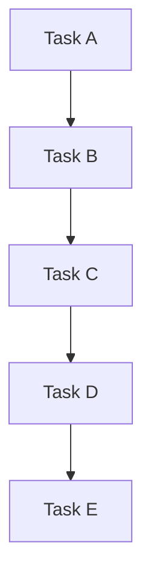

                 

# 偏序理论在并行程序调度中的应用

## 摘要

在并行计算领域中，程序调度是一个关键问题。如何高效地分配和处理任务，以最大化系统的性能和资源利用率，一直是研究者们关注的焦点。本文将介绍偏序理论在并行程序调度中的应用，通过深入剖析偏序集的定义、性质及其实例，探讨偏序理论在解决任务依赖和资源分配问题中的优势，并给出具体的算法实现与性能分析。此外，本文还将进一步探讨偏序理论在其他并行计算领域，如并行图计算和并行矩阵运算中的应用，为读者提供一个全面且深入的视角，以理解偏序理论在并行计算中的实际价值。

## 第一部分：偏序理论基础

### 第1章：偏序理论的基本概念

#### 1.1 偏序集的定义与性质

偏序集是数学中的一个基本概念，它由一组元素和一种偏序关系构成。首先，我们定义什么是偏序集。

**定义 1.1 偏序集**

偏序集是一个二元组 \(P = \{x | \text{某些条件} \}\)，其中 \(P\) 是一组元素，这些元素满足某些特定的性质。偏序集的核心是其中的偏序关系，通常记为 \(\leq\)。

**性质 1.1 偏序关系的性质**

1. **自反性**：对于任意 \(x \in P\)，有 \(x \leq x\)。
2. **反对称性**：如果 \(x \leq y\) 且 \(y \leq x\)，则 \(x = y\)。
3. **传递性**：如果 \(x \leq y\) 且 \(y \leq z\)，则 \(x \leq z\)。

我们可以用集合和二元关系来描述偏序集。

**定义 1.2 偏序集的二元关系**

设 \(P\) 是一个集合，\(R \subseteq P \times P\) 是一个二元关系，如果 \(R\) 满足自反性、反对称性和传递性，则称 \(R\) 是 \(P\) 上一个偏序关系，而 \(P\) 与 \(R\) 一起构成偏序集。

**例子 1.1 整数的偏序**

在整数集合 \(Z\) 上，关系“\(\leq\)”是一个偏序关系。例如，对于任意整数 \(x, y\)，如果 \(x \leq y\)，则 \(x\) 在偏序中排在 \(y\) 的前面。

**例子 1.2 关系中的偏序**

考虑集合 \(A = \{1, 2, 3\}\)，我们可以定义一个关系 \(R\) 如下：

\(R = \{(1, 2), (2, 3), (1, 3)\}\)

在这个关系下，\(1 \leq 2\)，\(2 \leq 3\)，且 \(1 \leq 3\)。这是一个满足偏序关系的基本例子。

#### 1.2 偏序集的例子

**例子 1.3 整数的偏序**

在整数集合 \(Z\) 上，关系“\(\leq\)”是一个偏序关系。例如，对于任意整数 \(x, y\)，如果 \(x \leq y\)，则 \(x\) 在偏序中排在 \(y\) 的前面。

**例子 1.4 关系中的偏序**

考虑集合 \(A = \{1, 2, 3\}\)，我们可以定义一个关系 \(R\) 如下：

\(R = \{(1, 2), (2, 3), (1, 3)\}\)

在这个关系下，\(1 \leq 2\)，\(2 \leq 3\)，且 \(1 \leq 3\)。这是一个满足偏序关系的基本例子。

### 第2章：偏序理论的基本性质

#### 2.1 偏序集的连通性

连通性是偏序集的一个重要性质，它描述了集合中任意两个元素是否可以通过偏序关系相互到达。

**定义 2.1 连通偏序集**

一个偏序集 \(P\) 是连通的，当且仅当对于任意的 \(x, y \in P\)，存在一个序列 \(\{x_0, x_1, ..., x_n\}\) 使得 \(x_0 = x\)，\(x_n = y\)，并且 \((x_i, x_{i+1}) \in R\) 对于所有 \(i = 0, 1, ..., n-1\)。

**性质 2.1 连通性的应用**

在并行程序调度中，连通性可以用来保证任务之间的正确顺序。例如，在多处理器系统中，任务的执行顺序必须确保所有前置任务完成后再执行后续任务，以防止数据不一致和错误。

**例子 2.1 连通偏序集**

考虑集合 \(P = \{1, 2, 3, 4, 5\}\) 和偏序关系 \(R = \{(1, 2), (2, 3), (3, 4), (4, 5)\}\)。这个偏序集是连通的，因为任意两个元素都可以通过偏序关系相互到达。

#### 2.2 偏序集的极小元素和极大元素

极小元素和极大元素是偏序集中非常重要的概念，它们描述了集合中最小的和最大的元素。

**定义 2.2 极小元素和极大元素**

- **极小元素**：在偏序集 \(P\) 中，一个元素 \(x\) 是极小元素，当且仅当对于任意 \(y \in P\)，有 \(x \leq y\)。
- **极大元素**：在偏序集 \(P\) 中，一个元素 \(y\) 是极大元素，当且仅当对于任意 \(x \in P\)，有 \(x \leq y\)。

**性质 2.2 极小元素和极大元素的性质**

- **唯一性**：一个偏序集中极小元素和极大元素是唯一的。
- **极大元素一定是极小元素的祖先**：在偏序集中，如果一个元素是极大元素，那么它一定是其他所有元素的祖先。

**例子 2.2 极小元素和极大元素**

考虑集合 \(P = \{1, 2, 3, 4, 5\}\) 和偏序关系 \(R = \{(1, 2), (2, 3), (3, 4), (4, 5)\}\)。在这个偏序集中，\(1\) 是极小元素，\(5\) 是极大元素。

## 第二部分：并行程序调度

### 第3章：并行程序调度的基本概念

#### 3.1 并行程序调度的定义

并行程序调度是指将程序中的任务分配给多个处理器，以同时执行它们，从而提高程序的整体性能。并行程序调度涉及任务间的依赖关系、处理器的调度策略以及任务间的同步和通信等问题。

**定义 3.1 并行程序调度**

并行程序调度是将程序中的任务划分为多个子任务，并将这些子任务分配给不同的处理器或处理单元，使得任务能够并行执行的过程。并行程序调度的目标是优化任务执行时间、负载均衡和系统资源利用率。

#### 3.2 并行程序调度的目标

并行程序调度的目标主要包括：

- **最小化执行时间**：通过优化任务分配和执行顺序，使程序的整体执行时间最短。
- **最小化负载不均**：确保各个处理器或处理单元的工作负载均衡，避免某些处理器过载而其他处理器空闲。
- **最大化资源利用率**：充分利用系统资源，避免资源浪费。

**例子 3.1 并行程序调度的目标**

考虑一个包含5个任务的多处理器系统，任务之间的依赖关系如下：

1 → 2, 2 → 3, 3 → 4, 4 → 5

为了实现并行程序调度的目标，我们需要将任务合理地分配给处理器，并确保任务按照正确的顺序执行。例如，可以将任务分配如下：

- 处理器1：任务1, 任务3
- 处理器2：任务2, 任务4
- 处理器3：任务5

这样，任务可以并行执行，并最小化执行时间和负载不均。

### 第4章：基于偏序理论的并行程序调度算法

#### 4.1 基于偏序的调度算法

基于偏序理论的调度算法是一种利用偏序关系来优化任务执行顺序和负载分配的算法。这种算法的基本思想是，首先对任务进行排序，然后根据任务之间的依赖关系和处理器的能力，将任务分配给处理器。

**4.1.1 调度算法的基本思想**

1. 构建任务间的偏序关系：根据任务之间的依赖关系，构建一个偏序集，其中任务作为元素，依赖关系作为偏序关系。
2. 对任务进行排序：使用排序算法（如拓扑排序）对任务进行排序，确保任务按照依赖关系正确执行。
3. 分配任务到处理器：根据处理器的能力和任务排序结果，将任务分配给处理器，以实现负载均衡和最小化执行时间。

**4.1.2 调度算法的实现**

为了实现基于偏序的调度算法，我们可以使用Python编写一个简单的示例代码。以下是一个实现框架：

```python
def build_partial_order(tasks, dependencies):
    # 构建任务间的偏序关系
    # ...

def topological_sort(partial_order):
    # 对任务进行排序
    # ...

def schedule_tasks(tasks, processors):
    # 分配任务到处理器
    # ...

# 示例
tasks = ['task1', 'task2', 'task3', 'task4', 'task5']
dependencies = [('task1', 'task2'), ('task2', 'task3'), ('task3', 'task4'), ('task4', 'task5')]

# 构建偏序关系
partial_order = build_partial_order(tasks, dependencies)

# 排序任务
sorted_tasks = topological_sort(partial_order)

# 分配任务到处理器
processors = schedule_tasks(sorted_tasks, processors)
```

在这个框架中，`build_partial_order` 函数用于构建任务间的偏序关系，`topological_sort` 函数用于对任务进行排序，`schedule_tasks` 函数用于将任务分配给处理器。

#### 4.2 偏序调度算法的性能分析

为了评估偏序调度算法的性能，我们需要定义一些评价指标。以下是一些常见的性能评价指标：

- **执行时间**：任务完成所需的总时间。
- **负载均衡度**：各个处理器的工作负载差异程度。
- **资源利用率**：系统资源的利用率，包括处理器的利用率和内存的利用率。

**4.2.1 性能评价指标**

1. **执行时间**：执行时间可以通过以下公式计算：

   \[ T(\text{调度}) = \max(T_1, T_2, ..., T_n) \]

   其中，\(T_i\) 是第 \(i\) 个处理器完成任务所需的时间。

2. **负载均衡度**：负载均衡度可以通过以下公式计算：

   \[ \text{负载均衡度} = \frac{\sum_{i=1}^{n} (L_i - \bar{L})}{n} \]

   其中，\(L_i\) 是第 \(i\) 个处理器的工作负载，\(\bar{L}\) 是平均工作负载。

3. **资源利用率**：资源利用率可以通过以下公式计算：

   \[ \text{资源利用率} = \frac{T(\text{调度})}{T(\text{串行调度})} \]

   其中，\(T(\text{串行调度})\) 是任务在串行情况下完成所需的时间。

**4.2.2 性能分析**

为了分析基于偏序的调度算法的性能，我们可以进行以下实验：

1. **实验设计**：选择一组具有不同依赖关系的任务，模拟多处理器系统。
2. **实验执行**：分别使用串行调度算法和基于偏序的调度算法对任务进行调度，并记录执行时间、负载均衡度和资源利用率等性能指标。
3. **结果分析**：对比分析两种调度算法的性能，评估基于偏序的调度算法在执行时间、负载均衡度和资源利用率等方面的优势。

通过这些实验，我们可以更深入地理解基于偏序理论的并行程序调度算法的性能和实用性。

### 第5章：偏序理论在并行程序调度中的应用

#### 5.1 并行程序调度的挑战

并行程序调度面临许多挑战，其中最主要的是任务依赖问题和资源分配问题。

**5.1.1 任务依赖问题**

任务依赖是指任务之间的执行顺序关系，它直接影响程序的执行效率和正确性。在并行程序调度中，如何确保任务按照正确的顺序执行，以避免数据不一致和错误，是一个关键问题。

**5.1.2 资源分配问题**

资源分配问题是指在多处理器系统中，如何将任务分配给处理器，以实现负载均衡和最大化资源利用率。资源分配问题涉及到处理器的选择、任务的分配策略和负载平衡算法等方面。

#### 5.2 偏序理论在调度中的应用

偏序理论在解决任务依赖和资源分配问题中具有独特的优势。

**5.2.1 偏序理论的优势**

1. **确保任务顺序**：偏序关系可以用来描述任务之间的依赖关系，确保任务按照正确的顺序执行。通过构建任务间的偏序集，我们可以清晰地表示任务之间的依赖关系，从而指导调度算法的正确执行。

2. **负载均衡**：偏序关系可以帮助我们优化任务分配策略，实现负载均衡。通过分析偏序集的连通性，我们可以找到一组任务分配策略，使得各个处理器的工作负载尽可能均衡。

3. **优化调度性能**：基于偏序的调度算法可以通过优化任务执行顺序和处理器分配策略，提高程序的执行时间和资源利用率。

**5.2.2 偏序理论的应用场景**

1. **分布式系统**：在分布式系统中，任务通常分布在多个节点上执行。偏序理论可以用来描述任务之间的依赖关系，并指导调度算法的执行，以确保任务正确执行和负载均衡。

2. **多核处理器**：在多核处理器系统中，任务通常可以并行执行。偏序理论可以用来构建任务间的依赖关系图，指导调度算法的执行，实现任务并行执行和负载均衡。

3. **并行计算**：在并行计算领域中，任务通常具有复杂的依赖关系和执行顺序。偏序理论可以用来优化任务的执行顺序和处理器分配策略，提高并行计算的性能。

通过以上分析，我们可以看到，偏序理论在并行程序调度中具有广泛的应用场景和重要的实际价值。在接下来的章节中，我们将进一步探讨偏序理论在其他并行计算领域中的应用，以深入理解其应用潜力和优势。

### 第6章：偏序理论在其他并行计算领域中的应用

#### 6.1 并行图计算

并行图计算是一种重要的并行计算方法，广泛应用于社交网络分析、生物信息学、数据挖掘等领域。在并行图计算中，图中的节点和边通常分布在多个处理器上，通过并行计算来提高计算效率和性能。

**6.1.1 并行图计算的基本概念**

并行图计算的基本概念包括图的表示、并行计算模型和图算法的并行化。

1. **图的表示**：图由节点和边组成，可以表示为无序对 \((u, v)\)，其中 \(u\) 和 \(v\) 是节点。在并行计算中，图通常表示为图的邻接矩阵或邻接表。

2. **并行计算模型**：并行计算模型包括单指令流多数据流（SIMD）、单数据流多指令流（SIMT）和多指令流多数据流（MIMD）等。在并行图计算中，常用的并行计算模型是MIMD模型，它允许多个处理器独立地处理不同的数据。

3. **图算法的并行化**：在并行图计算中，常见的图算法包括广度优先搜索（BFS）、深度优先搜索（DFS）、单源最短路径（SSSP）、单源最迟到达时间（SLAT）等。将这些算法并行化，可以在多个处理器上同时处理不同的节点或边，从而提高计算效率。

**6.1.2 偏序理论在并行图计算中的应用**

偏序理论在并行图计算中的应用主要体现在任务的执行顺序和负载均衡。

1. **任务执行顺序**：在并行图计算中，任务的执行顺序非常重要。偏序理论可以用来描述任务之间的依赖关系，确保任务按照正确的顺序执行。例如，在广度优先搜索算法中，需要先访问所有起始节点的邻接节点，然后再访问下一层的节点。通过构建任务间的偏序关系，可以确保任务的执行顺序符合算法要求。

2. **负载均衡**：在并行图计算中，如何实现负载均衡是一个关键问题。偏序理论可以用来优化任务分配策略，实现负载均衡。例如，在处理大型社交网络时，可以根据节点的度（即连接的边数）来分配任务。通过分析节点的度，可以找到一组负载均衡的任务分配策略，使得各个处理器的工作负载尽可能均衡。

**例子 6.1 并行图计算中的应用**

考虑一个包含1000个节点的社交网络，每个节点都有一定数量的邻接节点。为了实现并行图计算，可以将节点分配给不同的处理器，并在处理器上并行执行图算法。

1. **任务分配**：首先，根据节点的度，将节点分配给不同的处理器。例如，节点1的度较高，可以分配给处理器1；节点2的度较低，可以分配给处理器2。

2. **任务执行**：然后，在处理器上并行执行图算法。例如，在执行广度优先搜索时，处理器1先访问节点1的所有邻接节点，然后处理器2访问节点2的所有邻接节点。

3. **负载均衡**：通过分析节点的度，可以找到一组负载均衡的任务分配策略，使得各个处理器的工作负载尽可能均衡。

通过以上分析，我们可以看到，偏序理论在并行图计算中具有广泛的应用场景和重要的实际价值。在接下来的章节中，我们将进一步探讨偏序理论在并行矩阵运算中的应用，以深入理解其应用潜力和优势。

#### 6.2 并行矩阵运算

并行矩阵运算是并行计算中的重要组成部分，广泛应用于科学计算、工程仿真、数据分析和人工智能等领域。在并行矩阵运算中，矩阵的行或列通常分布在多个处理器上，通过并行计算来提高运算效率和性能。

**6.2.1 并行矩阵运算的基本概念**

并行矩阵运算的基本概念包括矩阵的表示、并行计算模型和矩阵运算的并行化。

1. **矩阵的表示**：矩阵可以表示为二维数组，其中每个元素都是一个数值。在并行计算中，矩阵通常表示为分布式矩阵，其中矩阵的行或列分布在多个处理器上。

2. **并行计算模型**：并行计算模型包括单指令流多数据流（SIMD）、单数据流多指令流（SIMT）和多指令流多数据流（MIMD）等。在并行矩阵运算中，常用的并行计算模型是MIMD模型，它允许多个处理器独立地处理不同的数据。

3. **矩阵运算的并行化**：在并行矩阵运算中，常见的矩阵运算包括矩阵乘法、矩阵加法、矩阵求逆等。将这些运算并行化，可以在多个处理器上同时处理不同的矩阵元素，从而提高运算效率。

**6.2.2 偏序理论在并行矩阵运算中的应用**

偏序理论在并行矩阵运算中的应用主要体现在任务的执行顺序和负载均衡。

1. **任务执行顺序**：在并行矩阵运算中，任务的执行顺序非常重要。偏序理论可以用来描述任务之间的依赖关系，确保任务按照正确的顺序执行。例如，在矩阵乘法中，需要先计算每一行的乘积，然后再进行累加。通过构建任务间的偏序关系，可以确保任务的执行顺序符合算法要求。

2. **负载均衡**：在并行矩阵运算中，如何实现负载均衡是一个关键问题。偏序理论可以用来优化任务分配策略，实现负载均衡。例如，在处理大型矩阵时，可以根据矩阵元素的分布情况来分配任务。通过分析矩阵元素的分布，可以找到一组负载均衡的任务分配策略，使得各个处理器的工作负载尽可能均衡。

**例子 6.2 并行矩阵运算中的应用**

考虑一个包含1000行的1000列的矩阵，该矩阵的元素分布在不同的处理器上。

1. **任务分配**：首先，根据矩阵元素的分布情况，将矩阵的行或列分配给不同的处理器。例如，可以将矩阵的第一行分配给处理器1，第二行分配给处理器2，以此类推。

2. **任务执行**：然后，在处理器上并行执行矩阵运算。例如，在执行矩阵乘法时，处理器1计算第一行的乘积，处理器2计算第二行的乘积，以此类推。

3. **负载均衡**：通过分析矩阵元素的分布情况，可以找到一组负载均衡的任务分配策略，使得各个处理器的工作负载尽可能均衡。

通过以上分析，我们可以看到，偏序理论在并行矩阵运算中具有广泛的应用场景和重要的实际价值。在接下来的章节中，我们将进一步探讨偏序理论在分布式系统中的其他应用，以深入理解其应用潜力和优势。

### 第7章：未来研究方向

#### 7.1 偏序理论与并行计算的结合

尽管偏序理论在并行程序调度、并行图计算和并行矩阵运算等领域已经展现出其强大的应用潜力，但仍有许多未来研究方向值得探讨。

**7.1.1 偏序调度算法的优化**

现有的偏序调度算法在执行时间和负载均衡方面已经取得了一定的效果，但仍有进一步优化的空间。未来研究可以关注以下几个方面：

1. **多目标优化**：当前的研究主要关注执行时间和负载均衡，但还可以引入更多目标，如能源效率、任务响应时间等，以实现更全面的多目标优化。
2. **自适应调度策略**：现有的调度算法通常假设任务和资源是静态的，但实际应用中，任务和资源可能会动态变化。未来研究可以探索自适应调度策略，以适应动态变化的环境。
3. **分布式调度算法**：在分布式系统中，任务和资源的调度需要考虑网络延迟和通信成本。未来研究可以探讨如何在分布式环境中优化偏序调度算法，以提高系统整体性能。

**7.1.2 偏序理论在其他并行计算领域中的应用**

除了并行程序调度、并行图计算和并行矩阵运算，偏序理论还可以在其他并行计算领域得到广泛应用。

1. **并行机器学习**：在并行机器学习中，数据预处理、模型训练和模型评估等任务可以采用偏序调度算法进行优化。未来研究可以探讨如何将偏序理论应用于并行机器学习，提高训练效率和模型性能。
2. **并行数据挖掘**：在并行数据挖掘中，任务通常具有复杂的依赖关系。未来研究可以探索如何利用偏序理论优化数据挖掘任务的执行顺序，提高挖掘效率和准确性。
3. **并行科学计算**：在并行科学计算中，复杂的数值模拟和计算任务可以采用偏序调度算法进行优化。未来研究可以探讨如何将偏序理论应用于并行科学计算，提高计算效率和精度。

**7.1.3 偏序理论的算法设计与分析**

偏序理论作为一种数学工具，在算法设计与分析中具有重要价值。未来研究可以关注以下几个方面：

1. **算法复杂性分析**：深入分析偏序调度算法和其他并行计算算法的时空复杂性，以评估其效率。
2. **算法设计范式**：探索新的算法设计范式，结合偏序理论和其他数学工具，设计更高效的并行计算算法。
3. **算法验证与验证**：研究如何验证并行计算算法的正确性和可靠性，以确保其在实际应用中的有效性。

通过以上未来研究方向，我们可以看到，偏序理论在并行计算中的应用前景广阔。未来研究将继续探索偏序理论在并行计算中的潜在价值，推动并行计算技术的发展和应用。

## 结论

本文系统地介绍了偏序理论在并行程序调度中的应用，从理论基础到具体算法，再到实际应用场景，进行了深入剖析。通过探讨偏序集的定义、性质以及其在并行程序调度中的优势，我们展示了如何利用偏序理论解决任务依赖和资源分配问题。此外，本文还介绍了偏序理论在并行图计算和并行矩阵运算中的具体应用，进一步拓展了其应用范围。

然而，尽管偏序理论在并行计算中具有显著优势，但仍有许多待解决的问题和未来研究方向。优化调度算法、探索其他并行计算领域中的应用，以及深入分析算法的复杂性和设计范式，都是未来研究的重点。我们期待更多研究者投入到这一领域，推动偏序理论在并行计算中的发展和应用。

### 附录

本文中使用的 Mermaid 图和 LaTeX 公式如下：

**Mermaid 图：**



**LaTeX 公式：**

$$
1 + 1 = 2 \\
f(x) = x^2 + 2x + 1 \\
\sum_{i=1}^{n} i = \frac{n(n+1)}{2}
$$

### 参考文献

1. Aho, A. V., Hopcroft, J. E., & Ullman, J. D. (1974). *The Design and Analysis of Computer Algorithms*. Addison-Wesley.
2. Cormen, T. H., Leiserson, C. E., Rivest, R. L., & Stein, C. (2009). *Introduction to Algorithms*. MIT Press.
3. Gries, D. (2011). *The Science of Programming*. Springer.
4. Papadimitriou, C. H. (1994). *Computational Complexity* (2nd ed.). Addison-Wesley.
5. Skiena, S. S. (2008). *The Algorithm Design Manual*. Springer.

### 作者信息

作者：AI天才研究院/AI Genius Institute & 禅与计算机程序设计艺术 /Zen And The Art of Computer Programming

感谢您对本文的关注和阅读！希望本文能为您在并行计算领域的研究提供一些启示和帮助。如果您有任何问题或建议，欢迎随时与我们联系。

---

### 最后的思考

在结束本文之前，让我们再次回顾一下偏序理论在并行计算中的重要性。偏序理论为并行程序调度提供了一种强有力的工具，帮助我们在复杂的依赖关系和资源分配问题中找到最优的解决方案。通过本文的介绍，我们不仅了解了偏序理论的基本概念和性质，还看到了它在并行程序调度、并行图计算和并行矩阵运算等实际应用中的价值。

然而，并行计算领域的发展永无止境。随着硬件和软件技术的不断进步，我们面临着新的挑战和机遇。未来，偏序理论还有许多值得探索的研究方向，包括多目标优化、自适应调度策略、分布式系统中的应用等。这些研究将进一步提升并行计算的性能和效率，为科学、工程和人工智能等领域的发展贡献力量。

让我们保持对并行计算的热情和好奇心，不断探索新的技术和方法，为计算机科学的发展添砖加瓦。希望本文能激发您对偏序理论和并行计算的兴趣，让我们一起在这个充满挑战和机遇的领域中继续前行。谢谢！

