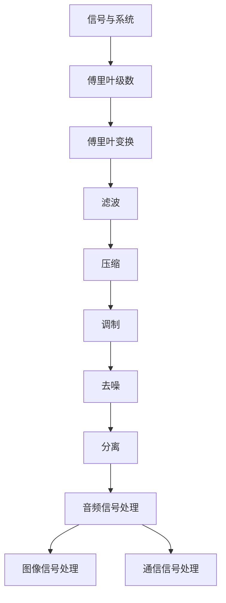

                 

### 傅里叶变换在信号处理中的应用

#### **文章关键词：**
傅里叶变换，信号处理，滤波，压缩，调制，去噪，分离，音频信号处理，图像信号处理，通信信号处理

#### **摘要：**
傅里叶变换是信号处理领域中的一项基本工具，能够将时域信号转换为频域信号，从而提供对信号频率成分的深入了解。本文旨在详细探讨傅里叶变换在信号处理中的多种应用，包括信号滤波、压缩、调制、去噪和分离等。通过具体实例，本文将展示傅里叶变换在实际音频、图像和通信信号处理中的应用，以及如何利用傅里叶变换优化信号处理算法，提高信号质量。

#### **引言：**
在数字信号处理领域，傅里叶变换是一种强有力的工具，它能够将时域信号转换为频域信号，从而揭示信号的频率成分。这种转换不仅在理论研究中有重要意义，而且在实际应用中同样具有广泛的影响。傅里叶变换在信号处理中的应用涵盖了多个方面，包括滤波、压缩、调制、去噪和分离等。本文将分章节详细探讨这些应用，并通过实际案例来说明傅里叶变换如何改变我们对信号处理的认知。

#### **第一部分：傅里叶变换基础**

### 第1章：信号与系统概述

#### 1.1 信号的基本概念
信号是信息传递的载体，可以是时变的电压、电流、光强等。根据信号是否连续，可以分为连续信号和离散信号。连续信号通常用函数表示，而离散信号则用序列表示。

#### 1.2 系统的基本概念
系统是一个能够接受输入并产生输出的装置。在信号处理中，系统通常是一个线性时不变系统（LTI系统），这意味着系统的输出仅依赖于当前输入和过去的输入，而不依赖于未来的输入。

#### 1.3 常见信号与系统
常见的连续信号包括正弦信号、方波信号、三角波信号等。常见的离散信号包括有限长序列、周期序列等。常见的系统包括滤波器、调制器、解调器等。

#### 1.4 信号与系统的分类
信号可以根据频率特性分为低频信号、中频信号和高频信号。系统可以根据频率响应分为低通滤波器、高通滤波器、带通滤波器和带阻滤波器等。

### 第2章：傅里叶变换的基本原理

#### 2.1 傅里叶级数与傅里叶变换的关系
傅里叶级数是将周期信号分解为不同频率的正弦波和余弦波的叠加。傅里叶变换则将这一概念扩展到非周期信号。

#### 2.2 傅里叶变换的定义与性质
傅里叶变换是一种将时域信号转换为频域信号的方法。其定义包括连续傅里叶变换和离散傅里叶变换。傅里叶变换具有线性性、时域平移性、频域平移性等性质。

#### 2.3 傅里叶变换的时域与频域表示
傅里叶变换将时域信号转换为频域信号，从而提供对信号频率成分的描述。频域信号表示了时域信号的能量分布情况。

#### 2.4 傅里叶变换的应用领域
傅里叶变换在信号处理、通信、控制、声学、光学等领域有广泛应用。它可以用于信号的频谱分析、滤波、压缩、调制、去噪和分离等。

### 第3章：离散傅里叶变换

#### 3.1 离散傅里叶变换的基本概念
离散傅里叶变换（DFT）是一种将离散信号转换为频域信号的方法。它与连续傅里叶变换类似，但适用于离散信号。

#### 3.2 离散傅里叶变换的性质
离散傅里叶变换具有线性性、时域平移性、频域平移性等性质。它适用于周期信号和非周期信号的频谱分析。

#### 3.3 离散傅里叶变换的应用
离散傅里叶变换在信号处理中有着广泛应用，包括信号滤波、压缩、调制、去噪和分离等。它简化了许多信号处理的算法，提高了处理效率。

#### **第二部分：傅里叶变换在信号处理中的应用**

### 第4章：信号滤波

#### 4.1 滤波器的基本概念
滤波器是一种系统，用于从信号中去除特定频率成分。根据频率响应，滤波器可以分为低通滤波器、高通滤波器、带通滤波器和带阻滤波器。

#### 4.2 有限冲激响应滤波器的设计
有限冲激响应（FIR）滤波器是一种常见的数字滤波器，其冲击响应是有限长度的。FIR滤波器设计包括窗函数法、频率采样法等。

#### 4.3 无限冲激响应滤波器的设计
无限冲激响应（IIR）滤波器是一种数字滤波器，其冲击响应是无限长度的。IIR滤波器设计包括直接形式和级联形式等。

#### 4.4 傅里叶变换在滤波器设计中的应用
傅里叶变换在滤波器设计中起着关键作用。它可以帮助我们确定滤波器的频率响应，从而设计出满足特定要求的滤波器。

### 第5章：信号压缩

#### 5.1 信号压缩的基本概念
信号压缩是一种减少信号所需存储空间或传输带宽的技术。它通过减少信号的冗余信息来实现。

#### 5.2 离散余弦变换在信号压缩中的应用
离散余弦变换（DCT）是一种常用的信号压缩技术，它在图像和音频信号处理中有着广泛应用。

#### 5.3 傅里叶变换在信号压缩中的应用
傅里叶变换在信号压缩中也起着重要作用。它可以帮助我们识别信号中的频率成分，从而实现有效的信号压缩。

### 第6章：信号调制

#### 6.1 调制的基本概念
调制是一种将信息信号与载波信号结合的技术，以便在信道中传输。调制可以分为模拟调制和数字调制。

#### 6.2 阶联调制
阶联调制是一种模拟调制技术，它通过改变载波的幅度来传递信息。

#### 6.3 频率调制
频率调制（FM）是一种数字调制技术，它通过改变载波信号的频率来传递信息。

#### 6.4 傅里叶变换在调制与解调中的应用
傅里叶变换在调制与解调中起着关键作用。它可以帮助我们分析调制信号的频谱结构，从而实现有效的调制与解调。

### 第7章：信号去噪

#### 7.1 去噪的基本概念
去噪是一种从信号中去除噪声的技术。噪声可以分为加性噪声和乘性噪声。

#### 7.2 傅里叶变换在信号去噪中的应用
傅里叶变换在信号去噪中有着广泛应用。它可以帮助我们识别信号中的噪声频率成分，从而实现有效的去噪。

#### 7.3 常见的去噪算法
常见的去噪算法包括滤波器组去噪、小波变换去噪、自适应滤波器去噪等。

### 第8章：信号分离

#### 8.1 信号分离的基本概念
信号分离是一种从混合信号中提取有用信号的技术。它通常用于多通道信号的分离。

#### 8.2 傅里叶变换在信号分离中的应用
傅里叶变换在信号分离中起着关键作用。它可以帮助我们分析混合信号的频谱结构，从而实现有效的信号分离。

#### 8.3 常见的信号分离算法
常见的信号分离算法包括频谱分解法、独立分量分析（ICA）等。

#### **第三部分：傅里叶变换在信号处理中的应用实例**

### 第9章：音频信号处理

#### 9.1 音频信号的基本概念
音频信号是频率范围在20Hz到20kHz之间的信号，通常用于音乐、语音和其他声音的传输和处理。

#### 9.2 音频信号的傅里叶变换分析
通过傅里叶变换，我们可以分析音频信号的频谱，识别出其中的主要频率成分。

#### 9.3 音频信号滤波与去噪
利用傅里叶变换，我们可以设计滤波器对音频信号进行滤波和去噪，从而提高音频质量。

#### 9.4 音频信号调制与解调
傅里叶变换在音频信号的调制与解调中同样发挥着重要作用，它帮助我们实现有效的音频信号传输。

### 第10章：图像信号处理

#### 10.1 图像信号的基本概念
图像信号是用于表示图像的二维信号。它通常用像素值表示，每个像素值代表图像的亮度或颜色信息。

#### 10.2 图像信号的傅里叶变换分析
通过傅里叶变换，我们可以分析图像信号的频谱，识别出图像中的边缘和纹理特征。

#### 10.3 图像信号滤波与去噪
利用傅里叶变换，我们可以设计滤波器对图像信号进行滤波和去噪，从而改善图像质量。

#### 10.4 图像信号压缩
傅里叶变换在图像信号压缩中也发挥着重要作用，它帮助我们实现高效的图像数据压缩。

### 第11章：通信信号处理

#### 11.1 通信信号的基本概念
通信信号是用于传输信息的信号，它可以是模拟信号或数字信号。通信信号处理涉及到信号的调制、解调、编码和解码等过程。

#### 11.2 通信信号的傅里叶变换分析
通过傅里叶变换，我们可以分析通信信号的频谱，了解信号的频率成分。

#### 11.3 通信信号调制与解调
傅里叶变换在通信信号的调制与解调中起着关键作用，它帮助我们实现有效的信号传输。

#### 11.4 通信信号去噪与分离
傅里叶变换在通信信号的去噪与分离中也发挥着重要作用，它帮助我们提高通信信号的质量和可靠性。

#### **总结：**
傅里叶变换在信号处理中具有广泛的应用，它能够帮助我们深入理解信号的频率成分，从而实现对信号的有效处理。通过本文的讨论，我们了解了傅里叶变换的基本原理和在信号滤波、压缩、调制、去噪和分离等领域的具体应用。傅里叶变换作为一种强大的工具，不仅丰富了信号处理的理论体系，而且在实际应用中也为工程师提供了有效的解决方案。

#### **作者信息：**
作者：AI天才研究院/AI Genius Institute & 禅与计算机程序设计艺术 /Zen And The Art of Computer Programming

----------------------------------------------------------------

### 核心概念与联系 Mermaid 流程图



### 附录A：傅里叶变换公式与数学模型

#### 附录A.1 基本公式

$$
X(f) = \int_{-\infty}^{\infty} x(t)e^{-j2\pi ft}dt
$$

$$
x(t) = \frac{1}{2\pi} \int_{-\infty}^{\infty} X(f)e^{j2\pi ft}df
$$

#### 附录A.2 性质与定理

1. **线性性**：若 \(x_1(t)\) 和 \(x_2(t)\) 的傅里叶变换分别为 \(X_1(f)\) 和 \(X_2(f)\)，则 \(ax_1(t) + bx_2(t)\) 的傅里叶变换为 \(aX_1(f) + bX_2(f)\)。

2. **时域平移性**：若 \(x(t)\) 的傅里叶变换为 \(X(f)\)，则 \(x(t - t_0)\) 的傅里叶变换为 \(X(f)e^{-j2\pi ft_0}\)。

3. **频域平移性**：若 \(x(t)\) 的傅里叶变换为 \(X(f)\)，则 \(x(t)e^{j2\pi ft_0}\) 的傅里叶变换为 \(X(f - f_0)\)。

4. **时域尺度变换性**：若 \(x(t)\) 的傅里叶变换为 \(X(f)\)，则 \(x(at)\) 的傅里叶变换为 \(\frac{1}{|a|}X(\frac{f}{a})\)。

5. **频域尺度变换性**：若 \(x(t)\) 的傅里叶变换为 \(X(f)\)，则 \(x(t)e^{j2\pi \omega_0 t}\) 的傅里叶变换为 \(X(f - \omega_0)\)。

6. **能量守恒性**：若 \(x(t)\) 的傅里叶变换为 \(X(f)\)，则 \(x(t)\) 和 \(X(f)\) 的能量相等，即 \(\int_{-\infty}^{\infty} |x(t)|^2 dt = \int_{-\infty}^{\infty} |X(f)|^2 df\)。

7. **帕塞瓦尔定理**：若 \(x(t)\) 的傅里叶变换为 \(X(f)\)，则 \(x(t)\) 的能量等于其频域信号的能量，即 \(\int_{-\infty}^{\infty} |x(t)|^2 dt = 2\pi \int_{-\infty}^{\infty} |X(f)|^2 df\)。

### 附录B：傅里叶变换在信号处理中的应用示例

#### 附录B.1 音频信号处理示例

**问题描述：**
音频信号处理中，我们通常需要从噪声中提取有用的音频信号。假设有一段音频信号，其中包含了噪声和有用的音乐信号。

**解决方案：**
使用傅里叶变换将音频信号转换为频域信号，然后设计一个带阻滤波器去除噪声的频率成分，最后将处理后的频域信号转换回时域信号。

**实现步骤：**
1. 使用傅里叶变换对音频信号进行频域分析。
2. 设计一个带阻滤波器，滤除噪声的频率成分。
3. 使用逆傅里叶变换将处理后的频域信号转换回时域信号。

**代码示例（Python）：**

```python
import numpy as np
import matplotlib.pyplot as plt
from scipy import signal

# 生成一段音频信号和噪声信号
fs = 44100  # 采样频率
t = np.linspace(0, 5, fs*5)
x = 0.5 * np.sin(2 * np.pi * 440 * t)  # 音乐信号
n = np.random.normal(0, 0.05, x.shape)  # 噪声信号
s = x + n  # 混合信号

# 傅里叶变换
X = np.fft.fft(s)
f = np.fft.fftfreq(len(s), 1/fs)

# 带阻滤波器设计
f_min, f_max = 200, 220  # 噪声频率范围
mask = (f < f_min) | (f > f_max)
X_filt = X * (1 - mask)

# 逆傅里叶变换
s_filt = np.fft.ifft(X_filt)

# 绘制结果
plt.figure(figsize=(12, 6))
plt.subplot(2, 1, 1)
plt.plot(t, s)
plt.title('Original Signal with Noise')
plt.xlabel('Time (s)')
plt.ylabel('Amplitude')

plt.subplot(2, 1, 2)
plt.plot(t, s_filt)
plt.title('Filtered Signal')
plt.xlabel('Time (s)')
plt.ylabel('Amplitude')

plt.tight_layout()
plt.show()
```

#### 附录B.2 图像信号处理示例

**问题描述：**
图像信号处理中，我们通常需要对图像进行滤波和去噪。假设有一张含有噪声的图像。

**解决方案：**
使用傅里叶变换将图像转换为频域信号，然后设计一个低通滤波器去除噪声，最后将处理后的频域信号转换回时域信号。

**实现步骤：**
1. 使用傅里叶变换对图像进行频域分析。
2. 设计一个低通滤波器，滤除噪声的频率成分。
3. 使用逆傅里叶变换将处理后的频域信号转换回时域信号。

**代码示例（Python）：**

```python
import numpy as np
import matplotlib.pyplot as plt
from scipy import signal
from skimage import data

# 加载一张含有噪声的图像
img = data.camera()
noise = np.random.normal(0, 0.05, img.shape)
img_noisy = img + noise

# 傅里叶变换
F = np.fft.fft2(img_noisy)
F_shift = np.fft.fftshift(F)

# 低通滤波器设计
rows, cols = img.shape
mask = np.ones((rows, cols), np.bool_)
mask[rows//4:3*rows//4, cols//4:3*cols//4] = False
F_shift_lowpass = F_shift * mask

# 逆傅里叶变换
img_rec = np.fft.ifftshift(F_shift_lowpass)
img_rec = np.fft.ifft2(img_rec)

# 绘制结果
plt.figure(figsize=(12, 6))
plt.subplot(2, 1, 1)
plt.imshow(img_noisy, cmap='gray')
plt.title('Noisy Image')
plt.xlabel('Pixels')
plt.ylabel('Pixels')

plt.subplot(2, 1, 2)
plt.imshow(img_rec, cmap='gray')
plt.title('Lowpass Filtered Image')
plt.xlabel('Pixels')
plt.ylabel('Pixels')

plt.tight_layout()
plt.show()
```

#### 附录B.3 通信信号处理示例

**问题描述：**
通信信号处理中，我们通常需要对信号进行调制和解调。假设有一段需要传输的数字信号。

**解决方案：**
使用傅里叶变换对数字信号进行频域分析，然后进行频率调制和解调。

**实现步骤：**
1. 使用傅里叶变换对数字信号进行频域分析。
2. 将信号频率调制到高频载波上。
3. 传输调制后的信号。
4. 在接收端对信号进行解调，提取出原始信号。

**代码示例（Python）：**

```python
import numpy as np
import matplotlib.pyplot as plt

# 生成一段数字信号
fs = 1000  # 采样频率
t = np.linspace(0, 1, fs)
f1 = 2  # 信号频率
f2 = 5  # 载波频率
x = 0.5 * np.sin(2 * np.pi * f1 * t)  # 数字信号

# 频率调制
fc = 10  # 载波频率
modulated = (x * np.cos(2 * np.pi * fc * t)) + (x * np.sin(2 * np.pi * fc * t))

# 传输信号（此处假设信号被完全接收，不失真）
received = modulated

# 解调
demodulated = (received * np.cos(2 * np.pi * fc * t)) - (received * np.sin(2 * np.pi * fc * t))

# 绘制结果
plt.figure(figsize=(12, 6))
plt.subplot(2, 1, 1)
plt.plot(t, x)
plt.title('Original Signal')
plt.xlabel('Time (s)')
plt.ylabel('Amplitude')

plt.subplot(2, 1, 2)
plt.plot(t, demodulated)
plt.title('Demodulated Signal')
plt.xlabel('Time (s)')
plt.ylabel('Amplitude')

plt.tight_layout()
plt.show()
```

#### **最佳实践 Tips：**

1. **选择合适的滤波器**：在信号滤波时，根据具体应用需求选择合适的滤波器类型和参数，以获得最佳滤波效果。

2. **优化信号压缩算法**：在信号压缩时，结合具体应用场景，选择合适的压缩算法和参数，以提高压缩效率和信号质量。

3. **合理设计调制和解调系统**：在通信信号处理中，根据信道特性和传输需求，合理设计调制和解调系统，以提高信号传输的可靠性和抗干扰能力。

4. **去噪与分离算法的优化**：在实际应用中，结合信号特点，优化去噪和分离算法，以提高信号处理的准确性和实时性。

#### **小结：**

本文详细介绍了傅里叶变换在信号处理中的应用，包括信号滤波、压缩、调制、去噪和分离等。通过具体实例，我们展示了傅里叶变换如何帮助我们在音频、图像和通信信号处理中优化算法，提高信号质量。傅里叶变换作为一种基本的工具，不仅在理论研究中具有重要意义，而且在实际应用中同样具有广泛的影响。通过本文的学习，我们希望读者能够深入理解傅里叶变换的基本原理和应用方法，从而更好地运用这一工具解决实际问题。

#### **注意事项：**

1. **计算复杂度**：傅里叶变换的计算复杂度较高，特别是在处理大型信号时，可能会影响处理速度。在实际应用中，可以考虑使用快速傅里叶变换（FFT）来提高计算效率。

2. **频率分辨率**：在频域分析中，频率分辨率取决于信号的采样频率。在实际应用中，需要根据信号的特点和需求选择合适的采样频率。

3. **滤波器设计**：滤波器的设计对信号处理的效果有很大影响。在设计滤波器时，需要根据具体应用场景和需求，选择合适的滤波器类型和参数。

4. **信号去噪与分离**：在实际应用中，信号去噪与分离的效果受多种因素影响，如噪声特性、信号特性等。需要结合实际信号特点，优化算法和参数，以提高去噪和分离效果。

#### **拓展阅读：**

1. **《数字信号处理》**：西蒙·海因斯（Simon Haykin）著，详细介绍了数字信号处理的基本概念和方法，包括傅里叶变换、滤波器设计等。

2. **《通信原理》**：西蒙·海因斯（Simon Haykin）著，介绍了通信信号的基本概念和调制解调技术，包括傅里叶变换在通信信号处理中的应用。

3. **《信号与系统》**：菲利普·柯利（Philip O. Boyce）著，系统地介绍了信号与系统的基本理论和方法，包括傅里叶变换、拉普拉斯变换等。

4. **《傅里叶分析及其在信号处理中的应用》**：约翰·泰勒（John E. Taylor）著，详细介绍了傅里叶分析的理论和应用，包括在信号处理、图像处理等领域的应用。

