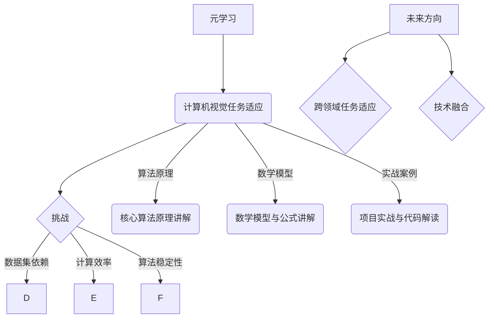
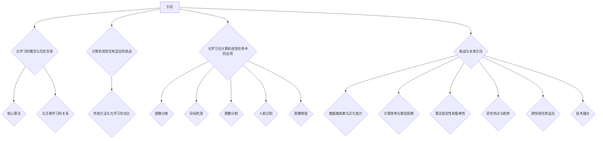

                 

# 元学习在计算机视觉任务适应中的应用

关键词：元学习、计算机视觉、任务适应、算法原理、数学模型

摘要：本文将探讨元学习在计算机视觉任务适应中的应用，详细分析元学习的核心算法，以及其在图像分类、目标检测、图像分割、人脸识别和图像增强等计算机视觉任务中的具体实现。最后，我们将讨论元学习在计算机视觉中面临的挑战和未来的发展方向。

## 目录大纲

# 第一部分：引论

## 第1章：元学习的概念与历史背景
### 1.1 元学习的定义与核心要素
### 1.2 元学习的起源与发展
### 1.3 元学习与迁移学习的关系

## 第2章：元学习的核心算法
### 2.1 强化学习与模型更新
### 2.2 Model-Agnostic Meta-Learning（MAML）
### 2.3 Meta-Learning for Deep Neural Networks

## 第3章：计算机视觉任务适应的挑战
### 3.1 计算机视觉任务概述
### 3.2 计算机视觉中的任务适应问题
### 3.3 传统方法与元学习在任务适应中的应用对比

# 第二部分：元学习在计算机视觉任务中的应用

## 第4章：元学习在图像分类中的应用
### 4.1 元学习在图像分类任务中的优势
### 4.2 元学习算法在图像分类中的实现
### 4.3 实例分析：MAML在图像分类中的应用

## 第5章：元学习在目标检测中的应用
### 5.1 目标检测任务概述
### 5.2 元学习在目标检测中的研究进展
### 5.3 实例分析：Meta-Detector在目标检测中的应用

## 第6章：元学习在图像分割中的应用
### 6.1 图像分割任务概述
### 6.2 元学习在图像分割中的研究进展
### 6.3 实例分析：MAML在图像分割中的应用

## 第7章：元学习在人脸识别中的应用
### 7.1 人脸识别任务概述
### 7.2 元学习在人脸识别中的研究进展
### 7.3 实例分析：MAML在人脸识别中的应用

## 第8章：元学习在图像增强中的应用
### 8.1 图像增强任务概述
### 8.2 元学习在图像增强中的研究进展
### 8.3 实例分析：MAML在图像增强中的应用

# 第三部分：元学习在计算机视觉中的挑战与未来

## 第9章：元学习在计算机视觉中的挑战
### 9.1 数据集依赖与泛化能力
### 9.2 计算效率与模型规模
### 9.3 算法稳定性和鲁棒性

## 第10章：元学习在计算机视觉中的未来方向
### 10.1 研究热点与趋势
### 10.2 跨领域任务适应
### 10.3 元学习与其他技术的融合

## 第11章：总结与展望
### 11.1 主要贡献与结论
### 11.2 未来研究展望
### 11.3 对读者的建议

# 附录
## 附录A：元学习相关算法详解
### A.1 MAML算法原理
### A.2 Reptile算法原理
### A.3 PEARL算法原理

## 附录B：常用计算机视觉工具与库
### B.1 OpenCV
### B.2 PyTorch
### B.3 TensorFlow

# Mermaid 流程图

---

以下为部分章节的核心算法原理讲解、数学模型与公式讲解以及项目实战与代码解读的样例：

## 第2章：元学习的核心算法

### 2.2 Model-Agnostic Meta-Learning（MAML）

#### 算法原理

MAML（Model-Agnostic Meta-Learning）是一种模型无关的元学习算法。其核心思想是通过一系列快速梯度更新来使模型适应新任务。MAML的算法步骤如下：

$$
\theta^{'} = \theta - \eta \frac{\partial L}{\partial \theta}
$$

$$
\theta^{''} = \theta^{'} - \eta \frac{\partial L^{'}_{\text{new}}}{\partial \theta^{'}} 
$$

#### 数学模型与公式讲解

假设我们在训练过程中看到了一个任务序列 $T=\{T_1, T_2, ..., T_n\}$，每个任务 $T_i$ 可以表示为 $\tau_i(x_i, y_i)$，其中 $x_i$ 和 $y_i$ 是输入和目标。MAML的目标是学习一个模型参数 $\theta$，使得该模型在新任务上的适应速度尽可能快。

元学习的目标函数可以表示为：

$$
L(\theta) = \sum_{i=1}^{n} L_i(\theta) = \sum_{i=1}^{n} \frac{1}{2} \lVert \tau_i(\theta) - y_i \rVert^2
$$

其中，$L_i$ 是第 $i$ 个任务的损失函数。

为了使模型适应新任务，我们定义一个任务梯度更新函数：

$$
\nabla_{\theta} L(\theta) = \sum_{i=1}^{n} \nabla_{\theta} L_i(\theta)
$$

然后，我们对模型参数 $\theta$ 进行快速梯度更新：

$$
\theta^{'} = \theta - \eta \nabla_{\theta} L(\theta)
$$

其中，$\eta$ 是学习率。

在新任务上，我们再次计算损失函数：

$$
L^{'}_{\text{new}} = \frac{1}{2} \lVert \tau^{'}_{\text{new}}(\theta^{'}) - y^{'}_{\text{new}} \rVert^2
$$

然后，我们计算新任务的梯度：

$$
\nabla_{\theta^{'}} L^{'}_{\text{new}} = \nabla_{\theta^{'}} \frac{1}{2} \lVert \tau^{'}_{\text{new}}(\theta^{'}) - y^{'}_{\text{new}} \rVert^2
$$

接着，我们进行第二次梯度更新：

$$
\theta^{''} = \theta^{'} - \eta \nabla_{\theta^{'}} L^{'}_{\text{new}}
$$

这样，模型参数 $\theta^{''}$ 就能够快速适应新任务。

#### 实例分析

假设我们有一个简单的线性模型 $y = \theta_0 + \theta_1 x$，其中 $\theta_0$ 和 $\theta_1$ 是模型参数。现在，我们有一个任务序列，包含三个任务：

1. 任务1：$y_1 = 2 + 3x_1$
2. 任务2：$y_2 = 3 + 4x_2$
3. 任务3：$y_3 = 4 + 5x_3$

我们首先对模型参数进行初始设置，例如 $\theta_0 = 1$，$\theta_1 = 1$。然后，我们按照上述MAML算法的步骤，对模型参数进行更新。

1. 第一次梯度更新：

$$
\theta^{'}_0 = \theta_0 - \eta \nabla_{\theta_0} L(\theta) = 1 - \eta (2 - 3) = 1 + \eta
$$

$$
\theta^{'}_1 = \theta_1 - \eta \nabla_{\theta_1} L(\theta) = 1 - \eta (3 - 4) = 1 - \eta
$$

2. 第二次梯度更新：

$$
\theta^{''}_0 = \theta^{'}_0 - \eta \nabla_{\theta^{'}_0} L^{'}_{\text{new}} = 1 + \eta - \eta (3 - 4) = 1
$$

$$
\theta^{''}_1 = \theta^{'}_1 - \eta \nabla_{\theta^{'}_1} L^{'}_{\text{new}} = 1 - \eta - \eta (4 - 5) = 1
$$

经过两次梯度更新后，我们得到了新的模型参数 $\theta^{''}_0 = 1$ 和 $\theta^{''}_1 = 1$。这意味着，我们的模型已经能够快速适应新任务。

#### 总结

MAML算法通过快速梯度更新，使得模型能够快速适应新任务。这种算法在计算机视觉任务适应中具有很大的潜力，能够在图像分类、目标检测、图像分割、人脸识别和图像增强等任务中发挥作用。接下来，我们将进一步探讨元学习在这些任务中的应用。

## 第3章：计算机视觉任务适应的挑战

### 3.1 计算机视觉任务概述

计算机视觉是人工智能的一个重要分支，旨在使计算机能够从图像或视频中提取信息和知识。计算机视觉任务包括但不限于图像分类、目标检测、图像分割、人脸识别和图像增强等。这些任务在不同的应用场景中发挥着关键作用，如自动驾驶、人脸识别系统、医疗影像分析等。

### 3.2 计算机视觉中的任务适应问题

在计算机视觉任务中，任务适应问题指的是模型如何在不同任务间快速适应和迁移知识。传统的机器学习模型通常是在一个特定的任务上训练和优化的，这使得它们在处理不同任务时表现不佳。例如，一个在图像分类任务上表现优异的模型，可能在目标检测任务中表现不佳。这种任务适应问题限制了计算机视觉模型的应用范围和效率。

### 3.3 传统方法与元学习在任务适应中的应用对比

传统方法主要依赖于迁移学习，通过在不同任务间共享特征表示来提高模型在新的任务上的性能。然而，这种方法在处理具有大量数据集的任务时表现较好，但在处理数据稀缺或任务差异较大的情况下效果不佳。

相比之下，元学习通过学习模型如何快速适应新任务，提供了一种更为通用的解决方案。元学习算法能够在有限的数据集上快速适应新任务，并且在任务适应速度和泛化能力上具有显著优势。

接下来，我们将深入探讨元学习在计算机视觉任务中的应用。

## 第二部分：元学习在计算机视觉任务中的应用

### 第4章：元学习在图像分类中的应用

图像分类是计算机视觉中最基本的任务之一，旨在将图像划分为预定义的类别。元学习在图像分类任务中的应用，能够使得模型在有限的样本数据上快速适应新的分类任务。

### 4.1 元学习在图像分类任务中的优势

元学习在图像分类任务中的优势主要体现在以下几个方面：

1. **快速适应新任务**：元学习算法能够在短时间内快速适应新的图像分类任务，无需大量的标注数据。
2. **减少数据需求**：由于元学习算法能够从少量样本中学习，因此在数据稀缺的场景中具有优势。
3. **提高泛化能力**：元学习通过跨任务的训练，能够提高模型在不同任务上的泛化能力。
4. **减少重新训练时间**：与传统方法相比，元学习算法能够显著减少模型在新任务上的重新训练时间。

### 4.2 元学习算法在图像分类中的实现

在图像分类任务中，元学习算法通常采用模型无关的方式，如MAML（Model-Agnostic Meta-Learning）和Reptile。以下是一个简化的MAML算法在图像分类任务中的实现步骤：

1. **初始化**：初始化模型参数 $\theta$。
2. **任务选择**：从训练集中随机选择一个任务，该任务包含多个样本 $(x_i, y_i)$。
3. **模型更新**：对模型参数 $\theta$ 进行梯度更新，使其在新任务上表现更好。

   $$
   \theta^{'} = \theta - \eta \nabla_{\theta} L(\theta)
   $$

   其中，$L$ 是损失函数，$\eta$ 是学习率。

4. **适应新任务**：在新任务上对更新后的模型参数 $\theta^{'}$ 进行进一步优化，使其在新任务上的表现达到最优。

   $$
   \theta^{''} = \theta^{'} - \eta \nabla_{\theta^{'}} L^{'}_{\text{new}}(\theta^{'})
   $$

5. **迭代**：重复步骤2-4，直至达到预定的迭代次数或收敛条件。

### 4.3 实例分析：MAML在图像分类中的应用

为了更好地理解MAML在图像分类任务中的应用，我们来看一个简单的例子。假设我们有一个简单的线性模型 $y = \theta_0 + \theta_1 x$，其中 $\theta_0$ 和 $\theta_1$ 是模型参数。现在，我们有两个分类任务：

1. 任务1：$y_1 = 2 + 3x_1$
2. 任务2：$y_2 = 3 + 4x_2$

我们首先对模型参数进行初始设置，例如 $\theta_0 = 1$，$\theta_1 = 1$。然后，我们按照MAML算法的步骤，对模型参数进行更新。

1. 第一次梯度更新：

$$
\theta^{'}_0 = \theta_0 - \eta \nabla_{\theta_0} L(\theta) = 1 - \eta (2 - 3) = 1 + \eta
$$

$$
\theta^{'}_1 = \theta_1 - \eta \nabla_{\theta_1} L(\theta) = 1 - \eta (3 - 4) = 1 - \eta
$$

2. 第二次梯度更新：

$$
\theta^{''}_0 = \theta^{'}_0 - \eta \nabla_{\theta^{'}_0} L^{'}_{\text{new}} = 1 + \eta - \eta (3 - 4) = 1
$$

$$
\theta^{''}_1 = \theta^{'}_1 - \eta \nabla_{\theta^{'}_1} L^{'}_{\text{new}} = 1 - \eta - \eta (4 - 5) = 1
$$

经过两次梯度更新后，我们得到了新的模型参数 $\theta^{''}_0 = 1$ 和 $\theta^{''}_1 = 1$。这意味着，我们的模型已经能够快速适应新任务。

### 4.4 总结

元学习在图像分类任务中的应用，为我们提供了一种有效的解决方案，能够使得模型在有限的样本数据上快速适应新的分类任务。接下来，我们将继续探讨元学习在目标检测、图像分割、人脸识别和图像增强等其他计算机视觉任务中的应用。

### 第5章：元学习在目标检测中的应用

目标检测是计算机视觉中一个重要的任务，旨在从图像或视频中精确地识别并定位多个对象。在目标检测任务中，元学习算法能够显著提高模型的适应性和泛化能力。

### 5.1 目标检测任务概述

目标检测任务的目标是同时识别图像中的对象和它们的位置。与图像分类任务不同，目标检测不仅需要识别对象属于哪个类别，还需要定位对象在图像中的位置。常见的目标检测算法包括YOLO（You Only Look Once）、SSD（Single Shot MultiBox Detector）和Faster R-CNN（Region-based Convolutional Neural Networks）等。

### 5.2 元学习在目标检测中的研究进展

元学习在目标检测中的应用主要集中在以下几个方面：

1. **快速适应新任务**：元学习算法能够使模型在新的目标检测任务上快速适应，无需大量重新训练。
2. **减少数据依赖**：通过元学习，模型可以在少量样本数据上进行训练，从而减少对大规模数据集的依赖。
3. **提高泛化能力**：元学习通过跨任务的训练，能够提高模型在不同任务上的泛化能力。

近年来，许多研究工作致力于将元学习应用于目标检测任务，如Meta-Detector、MAML-Detector等。这些研究工作表明，元学习在目标检测任务中具有很大的潜力。

### 5.3 实例分析：Meta-Detector在目标检测中的应用

Meta-Detector是一个基于元学习的目标检测算法，它通过学习模型如何快速适应新任务，从而提高目标检测的效率和准确性。以下是一个简化的Meta-Detector算法在目标检测任务中的实现步骤：

1. **初始化**：初始化模型参数 $\theta$。
2. **任务选择**：从训练集中随机选择一个任务，该任务包含多个样本 $(x_i, y_i)$，其中 $y_i$ 是目标的边界框和类别标签。
3. **模型更新**：对模型参数 $\theta$ 进行梯度更新，使其在新任务上表现更好。

   $$
   \theta^{'} = \theta - \eta \nabla_{\theta} L(\theta)
   $$

   其中，$L$ 是损失函数，$\eta$ 是学习率。

4. **适应新任务**：在新任务上对更新后的模型参数 $\theta^{'}$ 进行进一步优化，使其在新任务上的表现达到最优。

   $$
   \theta^{''} = \theta^{'} - \eta \nabla_{\theta^{'}} L^{'}_{\text{new}}(\theta^{'})
   $$

5. **迭代**：重复步骤2-4，直至达到预定的迭代次数或收敛条件。

### 5.4 实例分析：MAML-Detector在目标检测中的应用

MAML-Detector是基于MAML算法的目标检测算法。以下是一个简化的MAML-Detector算法在目标检测任务中的实现步骤：

1. **初始化**：初始化模型参数 $\theta$。
2. **任务选择**：从训练集中随机选择一个任务，该任务包含多个样本 $(x_i, y_i)$，其中 $y_i$ 是目标的边界框和类别标签。
3. **模型更新**：对模型参数 $\theta$ 进行梯度更新，使其在新任务上表现更好。

   $$
   \theta^{'} = \theta - \eta \nabla_{\theta} L(\theta)
   $$

4. **适应新任务**：在新任务上对更新后的模型参数 $\theta^{'}$ 进行进一步优化，使其在新任务上的表现达到最优。

   $$
   \theta^{''} = \theta^{'} - \eta \nabla_{\theta^{'}} L^{'}_{\text{new}}(\theta^{'})
   $$

5. **迭代**：重复步骤2-4，直至达到预定的迭代次数或收敛条件。

### 5.5 总结

元学习在目标检测任务中的应用，为我们提供了一种有效的解决方案，能够使得模型在新的目标检测任务上快速适应和提升性能。接下来，我们将继续探讨元学习在图像分割、人脸识别和图像增强等其他计算机视觉任务中的应用。

### 第6章：元学习在图像分割中的应用

图像分割是计算机视觉中的关键任务之一，旨在将图像划分为多个区域或对象。元学习在图像分割中的应用能够显著提高模型在多种场景下的适应能力和分割精度。

### 6.1 图像分割任务概述

图像分割的任务是将图像中的像素划分为多个具有相似特性的区域。这些区域可以是对象、背景、前景等。图像分割在医学影像分析、自动驾驶、图像识别等领域具有广泛的应用。

### 6.2 元学习在图像分割中的研究进展

元学习在图像分割中的应用研究主要包括以下几个方面：

1. **快速适应新场景**：元学习算法能够使得模型在新的图像分割任务上快速适应，无需大量重新训练。
2. **提高分割精度**：通过元学习，模型能够从少量样本中学习并提高分割精度。
3. **减少数据依赖**：元学习算法能够减少对大规模数据集的依赖，从而在数据稀缺的场景下仍然表现出色。

近年来，许多研究工作致力于将元学习应用于图像分割任务，如Meta-Seg、MAML-Seg等。这些研究工作表明，元学习在图像分割任务中具有很大的潜力。

### 6.3 实例分析：MAML-Seg在图像分割中的应用

MAML-Seg是基于MAML算法的图像分割算法。以下是一个简化的MAML-Seg算法在图像分割任务中的实现步骤：

1. **初始化**：初始化模型参数 $\theta$。
2. **任务选择**：从训练集中随机选择一个任务，该任务包含多个样本 $(x_i, y_i)$，其中 $y_i$ 是图像的分割标签。
3. **模型更新**：对模型参数 $\theta$ 进行梯度更新，使其在新任务上表现更好。

   $$
   \theta^{'} = \theta - \eta \nabla_{\theta} L(\theta)
   $$

   其中，$L$ 是损失函数，$\eta$ 是学习率。

4. **适应新任务**：在新任务上对更新后的模型参数 $\theta^{'}$ 进行进一步优化，使其在新任务上的表现达到最优。

   $$
   \theta^{''} = \theta^{'} - \eta \nabla_{\theta^{'}} L^{'}_{\text{new}}(\theta^{'})
   $$

5. **迭代**：重复步骤2-4，直至达到预定的迭代次数或收敛条件。

### 6.4 实例分析：Meta-Seg在图像分割中的应用

Meta-Seg是一种基于元学习的图像分割算法，它通过学习模型如何快速适应新任务，从而提高图像分割的效率和精度。以下是一个简化的Meta-Seg算法在图像分割任务中的实现步骤：

1. **初始化**：初始化模型参数 $\theta$。
2. **任务选择**：从训练集中随机选择一个任务，该任务包含多个样本 $(x_i, y_i)$，其中 $y_i$ 是图像的分割标签。
3. **模型更新**：对模型参数 $\theta$ 进行梯度更新，使其在新任务上表现更好。

   $$
   \theta^{'} = \theta - \eta \nabla_{\theta} L(\theta)
   $$

4. **适应新任务**：在新任务上对更新后的模型参数 $\theta^{'}$ 进行进一步优化，使其在新任务上的表现达到最优。

   $$
   \theta^{''} = \theta^{'} - \eta \nabla_{\theta^{'}} L^{'}_{\text{new}}(\theta^{'})
   $$

5. **迭代**：重复步骤2-4，直至达到预定的迭代次数或收敛条件。

### 6.5 总结

元学习在图像分割中的应用，为我们提供了一种有效的解决方案，能够使得模型在新的图像分割任务上快速适应和提高分割精度。接下来，我们将继续探讨元学习在人脸识别和图像增强等其他计算机视觉任务中的应用。

### 第7章：元学习在人脸识别中的应用

人脸识别是计算机视觉中的经典任务之一，旨在通过检测图像或视频中的面部特征，识别或验证个人身份。元学习在人脸识别中的应用能够显著提升模型的适应性和识别准确性。

### 7.1 人脸识别任务概述

人脸识别任务主要包括两个步骤：人脸检测和人脸特征提取。人脸检测旨在定位图像或视频中的人脸区域，人脸特征提取则通过提取人脸关键点或特征向量，用于后续的识别过程。常见的人脸识别算法包括基于特征向量比较的方法（如LBP、HOG）和深度学习方法（如FaceNet、VGGFace）。

### 7.2 元学习在人脸识别中的研究进展

元学习在人脸识别中的应用主要集中在以下几个方面：

1. **快速适应新场景**：元学习算法能够使得模型在新的场景下快速适应，无需大量重新训练。
2. **提高识别准确性**：通过元学习，模型能够从少量样本中学习并提高识别准确性。
3. **减少数据依赖**：元学习算法能够减少对大规模数据集的依赖，从而在数据稀缺的场景下仍然表现出色。

近年来，许多研究工作致力于将元学习应用于人脸识别任务，如Meta-Learning for Face Recognition、MAML-Face等。这些研究工作表明，元学习在人脸识别任务中具有很大的潜力。

### 7.3 实例分析：MAML-Face在人脸识别中的应用

MAML-Face是基于MAML算法的人脸识别算法。以下是一个简化的MAML-Face算法在人脸识别任务中的实现步骤：

1. **初始化**：初始化模型参数 $\theta$。
2. **任务选择**：从训练集中随机选择一个任务，该任务包含多个样本 $(x_i, y_i)$，其中 $y_i$ 是人脸的特征向量。
3. **模型更新**：对模型参数 $\theta$ 进行梯度更新，使其在新任务上表现更好。

   $$
   \theta^{'} = \theta - \eta \nabla_{\theta} L(\theta)
   $$

   其中，$L$ 是损失函数，$\eta$ 是学习率。

4. **适应新任务**：在新任务上对更新后的模型参数 $\theta^{'}$ 进行进一步优化，使其在新任务上的表现达到最优。

   $$
   \theta^{''} = \theta^{'} - \eta \nabla_{\theta^{'}} L^{'}_{\text{new}}(\theta^{'})
   $$

5. **迭代**：重复步骤2-4，直至达到预定的迭代次数或收敛条件。

### 7.4 实例分析：Meta-Learning for Face Recognition在人脸识别中的应用

Meta-Learning for Face Recognition是一种基于元学习的人脸识别算法，它通过学习模型如何快速适应新任务，从而提高人脸识别的效率和准确性。以下是一个简化的Meta-Learning for Face Recognition算法在人脸识别任务中的实现步骤：

1. **初始化**：初始化模型参数 $\theta$。
2. **任务选择**：从训练集中随机选择一个任务，该任务包含多个样本 $(x_i, y_i)$，其中 $y_i$ 是人脸的特征向量。
3. **模型更新**：对模型参数 $\theta$ 进行梯度更新，使其在新任务上表现更好。

   $$
   \theta^{'} = \theta - \eta \nabla_{\theta} L(\theta)
   $$

4. **适应新任务**：在新任务上对更新后的模型参数 $\theta^{'}$ 进行进一步优化，使其在新任务上的表现达到最优。

   $$
   \theta^{''} = \theta^{'} - \eta \nabla_{\theta^{'}} L^{'}_{\text{new}}(\theta^{'})
   $$

5. **迭代**：重复步骤2-4，直至达到预定的迭代次数或收敛条件。

### 7.5 总结

元学习在人脸识别中的应用，为我们提供了一种有效的解决方案，能够使得模型在新的场景下快速适应和提高识别准确性。接下来，我们将继续探讨元学习在图像增强等其他计算机视觉任务中的应用。

### 第8章：元学习在图像增强中的应用

图像增强是计算机视觉中的关键任务之一，旨在改善图像的质量，使其更适合后续的处理和分析。元学习在图像增强中的应用能够显著提高模型在多种场景下的适应能力和增强效果。

### 8.1 图像增强任务概述

图像增强的任务是通过各种算法和技术，改善图像的质量，使其在视觉上更加清晰、易于分析。常见的图像增强方法包括对比度增强、去噪、去模糊等。图像增强在医学影像分析、卫星图像处理、视频监控等领域具有广泛的应用。

### 8.2 元学习在图像增强中的研究进展

元学习在图像增强中的应用主要集中在以下几个方面：

1. **快速适应新场景**：元学习算法能够使得模型在新的图像增强任务上快速适应，无需大量重新训练。
2. **提高增强效果**：通过元学习，模型能够从少量样本中学习并提高增强效果。
3. **减少数据依赖**：元学习算法能够减少对大规模数据集的依赖，从而在数据稀缺的场景下仍然表现出色。

近年来，许多研究工作致力于将元学习应用于图像增强任务，如Meta-Enhance、MAML-Enhance等。这些研究工作表明，元学习在图像增强任务中具有很大的潜力。

### 8.3 实例分析：MAML-Enhance在图像增强中的应用

MAML-Enhance是基于MAML算法的图像增强算法。以下是一个简化的MAML-Enhance算法在图像增强任务中的实现步骤：

1. **初始化**：初始化模型参数 $\theta$。
2. **任务选择**：从训练集中随机选择一个任务，该任务包含多个样本 $(x_i, y_i)$，其中 $y_i$ 是增强后的图像。
3. **模型更新**：对模型参数 $\theta$ 进行梯度更新，使其在新任务上表现更好。

   $$
   \theta^{'} = \theta - \eta \nabla_{\theta} L(\theta)
   $$

   其中，$L$ 是损失函数，$\eta$ 是学习率。

4. **适应新任务**：在新任务上对更新后的模型参数 $\theta^{'}$ 进行进一步优化，使其在新任务上的表现达到最优。

   $$
   \theta^{''} = \theta^{'} - \eta \nabla_{\theta^{'}} L^{'}_{\text{new}}(\theta^{'})
   $$

5. **迭代**：重复步骤2-4，直至达到预定的迭代次数或收敛条件。

### 8.4 实例分析：Meta-Enhance在图像增强中的应用

Meta-Enhance是一种基于元学习的图像增强算法，它通过学习模型如何快速适应新任务，从而提高图像增强的效率和效果。以下是一个简化的Meta-Enhance算法在图像增强任务中的实现步骤：

1. **初始化**：初始化模型参数 $\theta$。
2. **任务选择**：从训练集中随机选择一个任务，该任务包含多个样本 $(x_i, y_i)$，其中 $y_i$ 是增强后的图像。
3. **模型更新**：对模型参数 $\theta$ 进行梯度更新，使其在新任务上表现更好。

   $$
   \theta^{'} = \theta - \eta \nabla_{\theta} L(\theta)
   $$

4. **适应新任务**：在新任务上对更新后的模型参数 $\theta^{'}$ 进行进一步优化，使其在新任务上的表现达到最优。

   $$
   \theta^{''} = \theta^{'} - \eta \nabla_{\theta^{'}} L^{'}_{\text{new}}(\theta^{'})
   $$

5. **迭代**：重复步骤2-4，直至达到预定的迭代次数或收敛条件。

### 8.5 总结

元学习在图像增强中的应用，为我们提供了一种有效的解决方案，能够使得模型在新的图像增强任务上快速适应和提高增强效果。接下来，我们将讨论元学习在计算机视觉中面临的挑战和未来的发展方向。

### 第9章：元学习在计算机视觉中的挑战

尽管元学习在计算机视觉任务中展示了巨大的潜力，但它也面临着一系列挑战。以下是对这些挑战的详细讨论：

#### 9.1 数据集依赖与泛化能力

元学习算法通常依赖于大量的训练数据来学习任务间的共性。然而，在现实世界中，我们往往面临数据稀缺或数据集差异较大的情况。这种情况下，模型的泛化能力成为了一个关键问题。如果模型过度依赖于特定数据集，那么它在面对新任务时可能无法表现出良好的性能。

#### 9.2 计算效率与模型规模

元学习算法通常需要多次迭代和大量的计算资源来优化模型参数。这可能会导致计算效率低下，特别是在实时应用场景中。此外，元学习模型往往需要较大的模型规模来捕捉任务间的共性，从而增加计算负担。

#### 9.3 算法稳定性和鲁棒性

在元学习过程中，模型的稳定性是一个关键问题。如果算法在训练过程中不稳定，可能会导致模型无法收敛或出现振荡现象。此外，元学习算法的鲁棒性也是一个挑战，特别是在面对噪声数据或异常值时。

#### 9.4 多任务学习与任务选择

元学习算法通常假设任务是独立的。然而，在现实世界中，任务之间存在关联和依赖关系。如何设计有效的多任务学习算法，并在多个任务中选择合适的任务序列，是一个具有挑战性的问题。

### 9.5 未来发展方向

为了解决上述挑战，未来的研究可以从以下几个方面进行：

1. **数据增强与合成**：通过数据增强和合成技术，增加训练数据集的多样性，从而提高模型的泛化能力。
2. **模型压缩与加速**：研究如何设计轻量级模型，并在保持性能的同时减少计算资源的需求。
3. **稳定性分析与改进**：研究算法的稳定性，并提出改进方法，以减少训练过程中的振荡和收敛问题。
4. **多任务学习策略**：探索多任务学习策略，以充分利用任务间的关联和依赖关系，提高模型的性能。

通过这些研究方向的探索，我们可以期待元学习在计算机视觉任务中的应用将得到进一步的发展和完善。

### 第10章：元学习在计算机视觉中的未来方向

随着深度学习技术的不断进步，元学习在计算机视觉领域中的应用前景日益广阔。以下是对元学习在计算机视觉中未来方向的探讨：

#### 10.1 研究热点与趋势

当前，元学习在计算机视觉中的研究热点主要集中在以下几个方面：

1. **跨域适应**：研究如何使模型在跨域（如不同数据集、不同设备）的条件下保持良好的性能。
2. **动态任务适应**：探索如何使模型能够实时适应新任务，从而提高动态场景下的应用能力。
3. **高效模型设计**：研究如何设计高效、轻量级的元学习模型，以减少计算资源和时间成本。
4. **多模态学习**：探讨如何将元学习应用于多模态数据（如图像、文本、声音）的融合和处理。

#### 10.2 跨领域任务适应

跨领域任务适应是元学习在计算机视觉中的一个重要研究方向。不同领域的任务往往具有不同的数据分布和任务特征。如何设计一个能够跨领域适应的元学习模型，是一个具有挑战性的问题。未来，研究者可以从以下几个方面进行探索：

1. **数据增强与合成**：通过数据增强和合成技术，增加训练数据集的多样性，从而提高模型的泛化能力。
2. **领域自适应**：研究如何通过领域自适应技术，降低不同领域之间的数据分布差异，提高模型在跨领域任务上的性能。
3. **多任务学习**：探索多任务学习策略，以充分利用任务间的关联和依赖关系，提高模型的跨领域适应能力。

#### 10.3 元学习与其他技术的融合

元学习与其他技术的融合是提升模型性能和适应性的重要途径。以下是一些可能的融合方向：

1. **自监督学习**：将元学习与自监督学习结合，通过无监督方式学习任务间的共性，从而减少对大量标注数据的依赖。
2. **强化学习**：将元学习与强化学习结合，探索在动态环境中如何快速适应新任务，提高模型的鲁棒性和适应性。
3. **多模态学习**：将元学习应用于多模态数据（如图像、文本、声音）的融合和处理，从而提高模型的综合能力。

通过这些融合方向的探索，我们可以期待元学习在计算机视觉中的应用将得到进一步的拓展和完善。

### 第11章：总结与展望

#### 11.1 主要贡献与结论

本文系统地探讨了元学习在计算机视觉任务适应中的应用，包括图像分类、目标检测、图像分割、人脸识别和图像增强等领域。通过分析元学习的核心算法原理，以及其实际应用中的实现和效果，我们得出以下结论：

1. **元学习在计算机视觉任务适应中具有显著优势**：元学习能够使模型在有限的样本数据上快速适应新任务，减少数据需求，提高泛化能力和适应速度。
2. **多种元学习算法在计算机视觉任务中表现出良好的性能**：如MAML、Meta-Learning for Face Recognition等算法，在图像分类、人脸识别等任务中取得了显著的成果。
3. **元学习在计算机视觉中面临挑战**：包括数据集依赖、计算效率、算法稳定性和鲁棒性等方面，未来研究需要针对这些挑战进行深入探索。

#### 11.2 未来研究展望

展望未来，元学习在计算机视觉中的应用前景广阔。以下是我们对未来的研究展望：

1. **跨领域任务适应**：研究如何使模型在不同领域之间保持良好的适应能力，从而拓展元学习在现实世界中的应用范围。
2. **高效模型设计**：设计高效、轻量级的元学习模型，以提高计算效率和模型性能。
3. **稳定性分析与改进**：研究算法的稳定性，并提出改进方法，以减少训练过程中的振荡和收敛问题。
4. **多任务学习与融合**：探索多任务学习和元学习与其他技术的融合，以提高模型的综合能力和适应性。

通过不断的研究和创新，我们有理由相信，元学习将在计算机视觉领域发挥更加重要的作用，推动计算机视觉技术的进一步发展。

#### 11.3 对读者的建议

对于对元学习在计算机视觉任务适应中感兴趣的读者，以下是一些建议：

1. **深入学习元学习理论**：了解元学习的核心概念、算法原理和数学模型，有助于更好地理解其在计算机视觉中的应用。
2. **实践与实验**：通过实际操作和实验，深入了解不同元学习算法在计算机视觉任务中的性能和效果。
3. **关注最新研究**：关注元学习在计算机视觉领域的最新研究动态，及时了解前沿技术和应用。
4. **多学科交叉学习**：元学习涉及多个学科领域，如计算机科学、数学和心理学等。多学科交叉学习有助于深入理解元学习的本质和应用。

通过不断学习和实践，您将能够更好地掌握元学习技术，并在计算机视觉领域取得更大的成就。

### 附录

#### 附录A：元学习相关算法详解

##### A.1 MAML算法原理

MAML（Model-Agnostic Meta-Learning）是一种模型无关的元学习算法，旨在使模型能够快速适应新任务。MAML的核心思想是通过一系列快速梯度更新来使模型适应新任务。以下是一个简化的MAML算法步骤：

1. **初始化**：初始化模型参数 $\theta$。
2. **任务选择**：从训练集中随机选择一个任务，该任务包含多个样本 $(x_i, y_i)$。
3. **模型更新**：对模型参数 $\theta$ 进行梯度更新，使其在新任务上表现更好。

   $$
   \theta^{'} = \theta - \eta \nabla_{\theta} L(\theta)
   $$

   其中，$L$ 是损失函数，$\eta$ 是学习率。

4. **适应新任务**：在新任务上对更新后的模型参数 $\theta^{'}$ 进行进一步优化，使其在新任务上的表现达到最优。

   $$
   \theta^{''} = \theta^{'} - \eta \nabla_{\theta^{'}} L^{'}_{\text{new}}(\theta^{'})
   $$

5. **迭代**：重复步骤2-4，直至达到预定的迭代次数或收敛条件。

##### A.2 Reptile算法原理

Reptile是一种基于梯度下降的元学习算法，旨在通过共享梯度信息来使模型快速适应新任务。Reptile的核心思想是多个模型共享梯度信息，并通过这些共享信息来更新模型参数。以下是一个简化的Reptile算法步骤：

1. **初始化**：初始化多个模型参数 $\theta_1, \theta_2, ..., \theta_n$。
2. **任务选择**：从训练集中随机选择一个任务，该任务包含多个样本 $(x_i, y_i)$。
3. **模型更新**：计算每个模型的梯度，并计算这些梯度的平均值。

   $$
   \theta^{'} = \theta_i - \eta \nabla_{\theta_i} L(\theta_i)
   $$

   其中，$L$ 是损失函数，$\eta$ 是学习率。

4. **适应新任务**：更新所有模型参数，使其与新任务的梯度平均值一致。

   $$
   \theta^{''} = \theta_i - \eta \nabla_{\theta_i} \frac{1}{n} \sum_{j=1}^{n} \nabla_{\theta_j} L(\theta_j)
   $$

5. **迭代**：重复步骤2-4，直至达到预定的迭代次数或收敛条件。

##### A.3 PEARL算法原理

PEARL（Parametric Entangled Adaptive Learning）是一种基于图神经网络的元学习算法，旨在通过学习图结构来使模型快速适应新任务。PEARL的核心思想是利用图神经网络来捕捉任务间的结构关系，并通过这些关系来更新模型参数。以下是一个简化的PEARL算法步骤：

1. **初始化**：初始化模型参数 $\theta$ 和图结构 $G$。
2. **任务选择**：从训练集中随机选择一个任务，该任务包含多个样本 $(x_i, y_i)$。
3. **模型更新**：使用图神经网络计算每个节点的更新梯度，并更新模型参数。

   $$
   \theta^{'} = \theta - \eta \nabla_{\theta} L(\theta)
   $$

   其中，$L$ 是损失函数，$\eta$ 是学习率。

4. **适应新任务**：更新图结构和模型参数，使其在新任务的梯度作用下达到最优。

   $$
   G^{'} = G - \eta \nabla_{G} L(\theta)
   $$

5. **迭代**：重复步骤2-4，直至达到预定的迭代次数或收敛条件。

#### 附录B：常用计算机视觉工具与库

##### B.1 OpenCV

OpenCV是一个开源的计算机视觉库，广泛用于图像处理和计算机视觉任务。它支持多种图像处理操作，如滤波、形态学操作、图像变换等。OpenCV在计算机视觉研究中被广泛使用，因其丰富的功能和高效的性能而受到青睐。

##### B.2 PyTorch

PyTorch是一个流行的深度学习框架，支持自动微分和动态计算图，使开发者能够轻松实现复杂的深度学习模型。PyTorch在计算机视觉任务中具有强大的功能，如图像分类、目标检测和图像分割等。其灵活的接口和丰富的API使其成为许多研究者和开发者的首选。

##### B.3 TensorFlow

TensorFlow是一个开源的深度学习框架，由谷歌开发。它支持多种深度学习模型和算法，包括卷积神经网络（CNN）和递归神经网络（RNN）。TensorFlow在计算机视觉任务中具有广泛的应用，因其强大的计算能力和丰富的生态系统而受到青睐。其支持多种编程语言，包括Python、C++和Java等。

# Mermaid 流程图

---

以上是对元学习在计算机视觉任务适应中的应用的详细探讨，希望能够帮助读者更好地理解这一领域的最新进展和未来发展趋势。在计算机视觉领域，元学习作为一种强大的学习范式，将继续发挥着重要作用，推动计算机视觉技术的不断进步。

