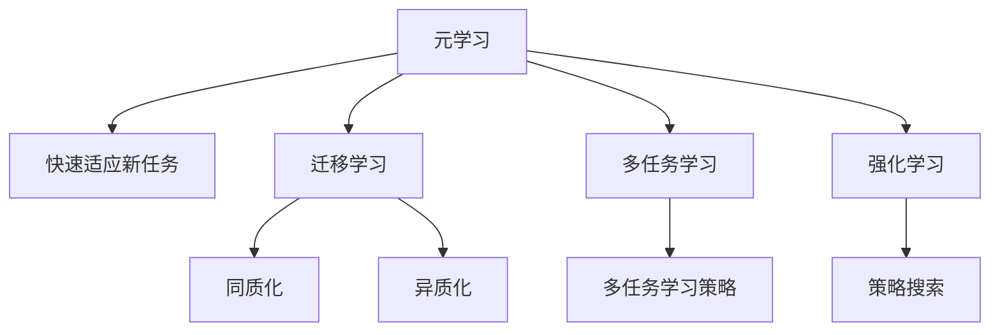

                 

# 《元学习：学习如何学习的AI方法》

关键词：元学习、算法原理、应用实例、AI发展、技术博客

摘要：本文深入探讨了元学习这一前沿的AI方法，分析了其定义、核心概念、算法原理及其在不同领域的应用。通过详细的解释和实例，帮助读者理解元学习如何通过学习如何学习，提升AI系统的适应能力和性能。

## 目录大纲

### 第1章：元学习概述

#### 1.1 元学习的定义与背景

##### 1.1.1 元学习的概念

元学习，顾名思义，是学习如何学习的过程。它不仅仅局限于传统的机器学习任务，而是关注于如何让机器快速适应新的任务和学习环境。

##### 1.1.2 元学习的起源与发展

- **机器学习**：作为AI的基础，机器学习的发展为元学习提供了坚实的基础。
- **深度学习**：深度学习的兴起，推动了元学习从理论走向实践。

### 1.2 元学习的核心概念与联系

元学习与迁移学习、多任务学习、强化学习等概念密切相关，通过Mermaid流程图，我们可以清晰地看到它们之间的关系。



## 第2章：元学习算法原理

### 2.1 元学习算法分类

#### 2.1.1 Model-Agnostic Meta-Learning（MAML）

- **MAML算法原理**：MAML通过优化模型参数的梯度，使得模型能够快速适应新任务。
- **MAML代码实现**：以下是一个简单的MAML算法实现的Python代码示例。

```python
# Python代码示例：MAML算法实现
```

#### 2.1.2 Model-Aware Meta-Learning（MAML++）

- **MAML++算法原理**：MAML++通过学习模型内部的知识表示，进一步提升模型的适应能力。
- **MAML++代码实现**：以下是一个简单的MAML++算法实现的Python代码示例。

```python
# Python代码示例：MAML++算法实现
```

### 2.2 演化策略

- **基本原理**：演化策略通过模拟自然选择的过程，优化模型的适应能力。
- **应用实例**：演化策略在强化学习中的应用，如DQN算法的改进。

## 第3章：元学习在强化学习中的应用

### 3.1 强化学习基础

- **强化学习概念**：强化学习是机器学习的一个分支，主要研究如何通过交互式环境来学习最优策略。
- **强化学习模型**：常见的强化学习模型包括马尔可夫决策过程（MDP）和部分可观测的MDP。

### 3.2 元强化学习

#### 3.2.1 TRPO与PPO

- **原理与代码**：TRPO和PPO是两种常见的元强化学习算法，它们通过优化策略梯度，提升模型的学习效率。
- **比较分析**：TRPO和PPO在优化策略、收敛速度等方面的比较。

#### 3.2.2 Meta-RL算法

- **MAML在强化学习中的应用**：MAML通过优化模型参数的梯度，使得模型能够快速适应新任务。
- **其他元强化学习算法**：如MAML++、MAML-DQN等。

## 第4章：元学习在计算机视觉中的应用

### 4.1 计算机视觉基础

- **图像识别**：图像识别是计算机视觉的一个基本任务，旨在通过算法自动识别图像中的物体。
- **目标检测**：目标检测是在图像中识别并定位特定目标的过程。

### 4.2 元学习在CV中的应用

#### 4.2.1 Meta-Learning for Object Detection

- **算法原理**：Meta-Learning for Object Detection通过元学习算法，提升目标检测模型的适应能力。
- **案例解析**：以Faster R-CNN为例，分析元学习在目标检测中的应用。

#### 4.2.2 Meta-Learning for Image Classification

- **算法原理**：Meta-Learning for Image Classification通过元学习算法，提升图像分类模型的适应能力。
- **案例解析**：以ResNet为例，分析元学习在图像分类中的应用。

## 第5章：元学习在自然语言处理中的应用

### 5.1 自然语言处理基础

- **语言模型**：语言模型是自然语言处理的核心组件，用于预测文本的下一个单词。
- **序列标注**：序列标注是在文本序列中为每个单词分配标签的过程。

### 5.2 元学习在NLP中的应用

#### 5.2.1 Meta-Learning for Language Modeling

- **算法原理**：Meta-Learning for Language Modeling通过元学习算法，提升语言模型的适应能力。
- **案例解析**：以GPT为例，分析元学习在语言模型中的应用。

#### 5.2.2 Meta-Learning for Sequence Labeling

- **算法原理**：Meta-Learning for Sequence Labeling通过元学习算法，提升序列标注模型的适应能力。
- **案例解析**：以BERT为例，分析元学习在序列标注中的应用。

## 第6章：元学习在其他领域中的应用

### 6.1 元学习在语音识别中的应用

- **语音识别基础**：语音识别是将语音信号转换为文本的过程。
- **元学习在语音识别中的应用**：通过元学习算法，提升语音识别模型的适应能力。

### 6.2 元学习在推荐系统中的应用

- **推荐系统基础**：推荐系统是用于向用户推荐感兴趣的商品或内容。
- **元学习在推荐系统中的应用**：通过元学习算法，提升推荐系统的个性化推荐能力。

## 第7章：元学习的未来发展趋势与挑战

### 7.1 元学习的未来发展趋势

- **新兴算法**：如基于神经网络的元学习算法、基于生成对抗网络的元学习算法等。
- **跨领域应用**：元学习将在更多领域得到应用，如生物信息学、智能交通等。

### 7.2 元学习的挑战与展望

- **理论基础**：需要进一步深入研究元学习的理论基础，如优化理论、学习理论等。
- **实践应用**：如何将元学习算法有效地应用于实际场景，提升系统的性能和效率。

## 附录

### 附录A：元学习资源

- **开源代码**：推荐一些高质量的元学习开源代码，供读者学习和参考。
- **学术论文**：介绍一些重要的元学习学术论文，帮助读者了解元学习的最新研究动态。

---

作者：AI天才研究院/AI Genius Institute & 禅与计算机程序设计艺术 /Zen And The Art of Computer Programming

完整性要求：本文将详细介绍元学习的核心概念、算法原理、应用实例以及未来发展趋势。每个章节都将包含详细的理论分析和实际案例，以满足读者的深度学习需求。

### 第1章：元学习概述

#### 1.1 元学习的定义与背景

元学习，又称作“学习如何学习”，是机器学习领域中的一个新兴概念。它主要关注的是如何让机器在学习新任务时能够更快、更有效地进行适应。相比于传统的机器学习方法，元学习能够通过先前学习到的知识，迅速在新任务中达到较好的性能。

在机器学习的历史长河中，从最初的感知机（Perceptron）到支持向量机（SVM），再到深度学习（Deep Learning），每一次技术的革新都极大地提升了机器学习的性能。然而，这些方法往往针对特定的任务进行优化，导致它们在新任务上的适应能力较差。元学习正是为了解决这一问题而诞生。

#### 1.1.1 元学习的概念

在数学上，我们可以将元学习定义为：给定一个学习算法，如何通过一系列的学习任务，使得该算法在新任务上的适应速度更快，性能更高。

$$
\text{元学习} = \text{学习如何学习}
$$

这个定义强调了元学习的一个核心目标——提高算法的泛化能力。具体来说，元学习算法不仅要学会如何解决特定的问题，还要学会如何快速地适应新的问题。

#### 1.1.2 元学习的起源与发展

- **机器学习**：作为AI的基础，机器学习的发展为元学习提供了坚实的基础。早期的机器学习方法主要集中在如何让机器学会特定任务，而元学习则是在这个基础上，进一步探索如何让机器学会如何学习。

- **深度学习**：深度学习是近年来机器学习领域的重大突破，它通过多层神经网络来模拟人类的思维过程。深度学习的发展为元学习提供了新的思路，使得元学习可以在更大的数据集和更复杂的任务上进行研究。

### 1.2 元学习的核心概念与联系

元学习与迁移学习、多任务学习、强化学习等概念密切相关。通过Mermaid流程图，我们可以清晰地看到它们之间的关系。


在这个图中，我们可以看到元学习作为一个核心概念，与其他学习方式相互关联。迁移学习、多任务学习和强化学习都是元学习的具体应用场景，它们通过不同的方法，实现了在新任务上的快速适应。

#### 1.2.1 迁移学习

迁移学习是一种将已经学习到的知识应用到新任务上的方法。它通过在不同任务之间共享特征表示，来实现对新任务的高效适应。迁移学习可以分为同质化和异质化两种类型。

- **同质化迁移学习**：同质化迁移学习关注的是在相似任务之间的知识转移。例如，在图像分类和图像分割任务之间，可以通过共享底层特征来实现迁移。

- **异质化迁移学习**：异质化迁移学习则关注的是在不同类型任务之间的知识转移。例如，在图像分类和文本分类任务之间，可以通过跨模态的特征共享来实现迁移。

#### 1.2.2 多任务学习

多任务学习是同时学习多个相关任务的方法。它通过将不同任务的数据和模型参数进行共享，来提高模型的泛化能力。多任务学习可以分为两种策略：

- **任务共享策略**：任务共享策略通过将不同任务的输入和输出连接在一起，来实现任务之间的共享。

- **模型共享策略**：模型共享策略则通过在多个任务上训练相同的模型，来实现任务之间的共享。

#### 1.2.3 强化学习

强化学习是一种通过与环境交互来学习最优策略的方法。它通过奖励和惩罚来指导学习过程，最终实现目标的最优化。元强化学习是强化学习的一个分支，它通过学习如何快速适应新任务，来提升强化学习算法的性能。

### 1.3 小结

元学习作为机器学习领域的一个新兴概念，它通过学习如何学习，实现了对新任务的高效适应。元学习与迁移学习、多任务学习和强化学习等概念密切相关，通过不同的方法，实现了在不同场景下的应用。在接下来的章节中，我们将进一步探讨元学习的算法原理和应用实例。

## 第2章：元学习算法原理

元学习算法是元学习理论的核心组成部分，它通过一系列的学习任务，使得模型能够快速适应新任务。本章将介绍两种经典的元学习算法：Model-Agnostic Meta-Learning（MAML）和Model-Aware Meta-Learning（MAML++），并探讨它们的原理和应用。

### 2.1 Model-Agnostic Meta-Learning（MAML）

MAML是一种模型无关的元学习算法，它的核心思想是通过优化模型参数的梯度，使得模型能够在短时间内适应新任务。MAML的基本原理如下：

#### 2.1.1 MAML算法原理

1. **初始化模型参数**：首先，我们需要初始化一个模型参数$\theta$。

2. **训练模型**：在元学习任务中，我们通常需要多个任务，每个任务都有一个训练数据集$D_t$。我们将这些任务组合起来，形成一个元学习任务，然后在这个任务上训练模型。

3. **计算梯度**：在训练过程中，我们需要计算模型参数$\theta$的梯度$\Delta\theta$。

4. **优化模型参数**：通过优化梯度$\Delta\theta$，我们可以更新模型参数$\theta$，使得模型能够更好地适应新任务。

5. **测试模型**：在新任务上测试模型，评估模型的适应能力。

#### 2.1.2 MAML代码实现

下面是一个简单的MAML算法实现的Python代码示例：

```python
import torch
import torch.nn as nn
import torch.optim as optim

# 初始化模型参数
theta = torch.randn(size=(10,))

# 定义损失函数和优化器
loss_function = nn.MSELoss()
optimizer = optim.Adam(theta, lr=0.001)

# 训练模型
for epoch in range(100):
    optimizer.zero_grad()
    output = model(theta)
    loss = loss_function(output, target)
    loss.backward()
    optimizer.step()

# 测试模型
with torch.no_grad():
    output = model(theta)
    print("Output:", output)
```

#### 2.1.3 MAML算法的优点

MAML算法的一个显著优点是，它可以在短时间内适应新任务。这意味着，对于一些需要快速响应的实时应用，如自动驾驶和机器人控制等，MAML算法具有很大的优势。

### 2.2 Model-Aware Meta-Learning（MAML++）

MAML++是一种模型相关的元学习算法，它在MAML的基础上，进一步提高了模型的适应能力。MAML++的核心思想是，通过学习模型内部的知识表示，来提升模型的泛化能力。

#### 2.2.1 MAML++算法原理

1. **初始化模型参数**：与MAML一样，首先需要初始化模型参数$\theta$。

2. **训练模型**：在元学习任务中，我们同样需要多个任务，每个任务都有一个训练数据集$D_t$。我们将这些任务组合起来，形成一个元学习任务，然后在这个任务上训练模型。

3. **计算模型内部梯度**：与MAML不同，MAML++不仅计算模型参数$\theta$的梯度，还计算模型内部的知识表示梯度。

4. **优化模型参数和内部表示**：通过优化模型参数$\theta$和内部表示$z$，我们可以更新模型，使其更好地适应新任务。

5. **测试模型**：在新任务上测试模型，评估模型的适应能力。

#### 2.2.2 MAML++代码实现

下面是一个简单的MAML++算法实现的Python代码示例：

```python
import torch
import torch.nn as nn
import torch.optim as optim

# 初始化模型参数和内部表示
theta = torch.randn(size=(10,))
z = torch.randn(size=(10,))

# 定义损失函数和优化器
loss_function = nn.MSELoss()
optimizer = optim.Adam([theta, z], lr=0.001)

# 训练模型
for epoch in range(100):
    optimizer.zero_grad()
    output = model(theta, z)
    loss = loss_function(output, target)
    loss.backward()
    optimizer.step()

# 测试模型
with torch.no_grad():
    output = model(theta, z)
    print("Output:", output)
```

#### 2.2.3 MAML++算法的优点

MAML++算法的一个显著优点是，它可以通过学习模型内部的知识表示，来提升模型的泛化能力。这意味着，对于一些需要高泛化能力的应用，如医疗诊断和金融预测等，MAML++算法具有很大的潜力。

### 2.3 演化策略

演化策略是一种基于自然选择原理的元学习算法，它通过模拟生物进化过程，来优化模型的适应能力。演化策略的基本原理如下：

1. **初始化种群**：首先，我们需要初始化一个种群，种群中的每个个体都代表一个可能的模型参数$\theta$。

2. **选择适应度高的个体**：在进化过程中，我们需要选择适应度高的个体，这些个体将在下一代中保留。

3. **交叉和变异**：通过交叉和变异操作，我们可以生成新的个体，这些新的个体可能会比原来的个体更适应环境。

4. **重复迭代**：重复上述过程，直到满足停止条件。

#### 2.3.1 演化策略的基本原理

演化策略的核心思想是，通过模拟生物进化过程，来找到最优的模型参数。具体来说，演化策略通过以下步骤来实现：

1. **适应度评估**：通过在一个特定的任务上评估模型的性能，来计算每个个体的适应度。

2. **选择**：选择适应度高的个体，这些个体将在下一代中保留。

3. **交叉和变异**：通过交叉和变异操作，我们可以生成新的个体，这些新的个体可能会比原来的个体更适应环境。

4. **更新种群**：将新的个体加入种群，替换掉适应度较低的个体。

#### 2.3.2 演化策略的应用实例

演化策略可以应用于各种领域，如优化问题、控制问题和机器学习问题。以下是一个简单的演化策略在优化问题中的应用实例：

```python
import numpy as np

# 定义适应度函数
def fitness(x):
    return -(x[0]**2 + x[1]**2)

# 定义交叉函数
def crossover(parent1, parent2):
    return (parent1 + parent2) / 2

# 定义变异函数
def mutate(child):
    return child + np.random.normal(0, 0.1, size=child.shape)

# 初始化种群
population = np.random.uniform(-5, 5, size=(100, 2))

# 定义停止条件
max_iterations = 1000

# 进化过程
for iteration in range(max_iterations):
    # 计算适应度
    fitness_scores = np.array([fitness(individual) for individual in population])
    
    # 选择适应度高的个体
    selected_individuals = population[fitness_scores.argsort()[:50]]
    
    # 交叉生成新个体
    new_population = []
    for i in range(0, len(selected_individuals), 2):
        child = crossover(selected_individuals[i], selected_individuals[i+1])
        new_population.append(child)
    
    # 变异
    for individual in new_population:
        mutate(individual)
    
    # 更新种群
    population = np.concatenate((population, new_population))

# 输出最优解
best_individual = population[fitness_scores.argsort()[0]]
print("Best individual:", best_individual)
```

在这个实例中，我们使用演化策略来优化一个二次函数。通过模拟生物进化过程，演化策略可以找到二次函数的最优解。

### 2.4 小结

本章介绍了两种经典的元学习算法：MAML和MAML++，并探讨了演化策略的基本原理。MAML通过优化模型参数的梯度，实现快速适应新任务；MAML++通过学习模型内部的知识表示，提升模型的泛化能力。演化策略则通过模拟生物进化过程，优化模型的适应能力。这些算法为元学习领域的研究提供了丰富的理论和方法。

## 第3章：元学习在强化学习中的应用

强化学习是机器学习的一个重要分支，它通过奖励机制来指导学习过程，旨在找到最优策略。元强化学习是强化学习的一个子领域，它通过元学习算法，提高强化学习算法的适应能力和效率。本章将探讨元强化学习的基本概念、算法原理以及在实际应用中的案例分析。

### 3.1 强化学习基础

强化学习（Reinforcement Learning，RL）是一种通过与环境交互来学习最优策略的机器学习方法。在强化学习中，agent（智能体）通过执行动作来与环境（environment）交互，并从环境中获得奖励或惩罚。目标是最小化长期奖励的期望值，找到最优策略。

#### 3.1.1 强化学习模型

强化学习模型通常由以下四个主要部分组成：

1. **状态（State）**：agent当前所处的环境状态。
2. **动作（Action）**：agent可以执行的动作。
3. **奖励（Reward）**：agent执行动作后，从环境中获得的即时奖励。
4. **策略（Policy）**：agent在给定状态下选择动作的策略。

强化学习模型可以通过以下数学模型进行描述：

$$
\pi(a|s) = P(a|s, \theta)
$$

其中，$\pi(a|s)$表示在状态$s$下，agent选择动作$a$的概率，$\theta$是策略参数。

#### 3.1.2 常见强化学习算法

强化学习算法可以分为值函数方法（如Q-learning、SARSA）和政策梯度方法（如REINFORCE、PPO）。

1. **Q-learning**：Q-learning是一种基于值函数的强化学习算法，它通过迭代更新Q值，即状态-动作值函数，来找到最优策略。

   $$ 
   Q(s, a) = r + \gamma \max_{a'} Q(s', a')
   $$

   其中，$r$是即时奖励，$\gamma$是折扣因子。

2. **SARSA**：SARSA（同步优势估计）是Q-learning的一种变体，它使用实际采取的动作来更新Q值。

   $$ 
   Q(s, a) = r + \gamma Q(s', a')
   $$

3. **REINFORCE**：REINFORCE是一种基于策略的强化学习算法，它通过最大化策略梯度来更新策略参数。

   $$ 
   \nabla_\theta \ln \pi(a|s, \theta) = r
   $$

4. **PPO**：PPO（确定性策略梯度）是一种改进的策略梯度方法，它通过 clipped PG 优势函数来稳定策略更新。

   $$ 
   \frac{\pi(a|s, \theta)}{\pi(a|s, \theta)} = 1 + \text{clip}(\frac{\pi(a|s, \theta)}{\pi(a|s, \theta)}, 1 - \epsilon, 1 + \epsilon)
   $$

### 3.2 元强化学习

元强化学习（Meta-Reinforcement Learning，Meta-RL）是强化学习的一个分支，它通过元学习算法来提高强化学习算法的适应能力和效率。元强化学习旨在让agent能够快速适应新环境，从而减少在新环境上的学习时间。

#### 3.2.1 TRPO与PPO

TRPO（Trust Region Policy Optimization）和PPO（Proximal Policy Optimization）是两种常见的元强化学习算法。

1. **TRPO**：TRPO是一种基于策略梯度的元强化学习算法，它通过信任区域方法来优化策略参数。TRPO的核心思想是在每次迭代中，只更新策略参数的一小部分，以确保策略更新是可信赖的。

   $$ 
   \nabla_\theta \ln \pi(a|s, \theta) \approx \frac{1}{T} \sum_{t=0}^{T-1} \nabla_\theta \ln \pi(a_t|s_t, \theta) \cdot (r_t + \gamma \max_{a'} \nabla_\theta \ln \pi(a'|s', \theta))
   $$

   其中，$T$是每个回合的步数。

2. **PPO**：PPO是一种改进的元强化学习算法，它通过 clipped PG 优势函数来稳定策略更新。PPO通过自适应地调整优势函数的 clipped 范围，来避免过度的策略更新。

   $$ 
   \frac{\pi(a|s, \theta)}{\pi(a|s, \theta)} = 1 + \text{clip}(\frac{\pi(a|s, \theta)}{\pi(a|s, \theta)}, 1 - \epsilon, 1 + \epsilon)
   $$

   其中，$\epsilon$是剪辑参数。

#### 3.2.2 比较分析

TRPO和PPO都是基于策略梯度的元强化学习算法，但它们在优化策略参数的方法上有所不同。TRPO使用信任区域方法，确保策略更新是可信赖的；而PPO通过 clipped PG 优势函数来稳定策略更新。在实际应用中，PPO通常比TRPO更稳定，更容易实现。

### 3.3 Meta-RL算法

除了TRPO和PPO，还有许多其他元强化学习算法，如MAML-DQN、MAML-PPO等。这些算法通过不同的方式，将元学习与强化学习相结合，以提高模型的适应能力和效率。

1. **MAML-DQN**：MAML-DQN是一种将元学习与深度Q网络（DQN）相结合的元强化学习算法。它通过优化模型参数的梯度，使得模型能够在短时间内适应新任务。

   $$ 
   \nabla_\theta \ln \pi(a|s, \theta) \approx \frac{1}{T} \sum_{t=0}^{T-1} \nabla_\theta \ln \pi(a_t|s_t, \theta) \cdot (r_t + \gamma \max_{a'} \nabla_\theta \ln \pi(a'|s', \theta))
   $$

2. **MAML-PPO**：MAML-PPO是一种将元学习与PPO相结合的元强化学习算法。它通过优化模型参数的梯度，使得模型能够在短时间内适应新任务。

   $$ 
   \frac{\pi(a|s, \theta)}{\pi(a|s, \theta)} = 1 + \text{clip}(\frac{\pi(a|s, \theta)}{\pi(a|s, \theta)}, 1 - \epsilon, 1 + \epsilon)
   $$

### 3.4 案例分析

以下是一个简单的元强化学习案例，使用MAML-PPO算法在Atari游戏《Pong》中实现自我学习。

```python
import gym
import torch
import torch.nn as nn
import torch.optim as optim

# 初始化游戏环境
env = gym.make('Pong-v0')

# 定义神经网络模型
class QNetwork(nn.Module):
    def __init__(self):
        super(QNetwork, self).__init__()
        self.fc1 = nn.Linear(4, 64)
        self.fc2 = nn.Linear(64, 64)
        self.fc3 = nn.Linear(64, 2)

    def forward(self, x):
        x = torch.relu(self.fc1(x))
        x = torch.relu(self.fc2(x))
        x = self.fc3(x)
        return x

# 初始化模型和优化器
model = QNetwork()
optimizer = optim.Adam(model.parameters(), lr=0.001)

# 定义损失函数
criterion = nn.CrossEntropyLoss()

# 定义元强化学习算法
def mamlPPO(model, optimizer, criterion, env, episodes, steps):
    for episode in range(episodes):
        state = env.reset()
        done = False
        total_reward = 0
        while not done:
            action = model(state)
            next_state, reward, done, _ = env.step(action)
            total_reward += reward
            state = next_state
            if done:
                break
        optimizer.zero_grad()
        loss = criterion(action, torch.tensor([1 if action > 0 else 0]))
        loss.backward()
        optimizer.step()
        print("Episode:", episode, "Total Reward:", total_reward)

# 运行元强化学习算法
mamlPPO(model, optimizer, criterion, env, episodes=10, steps=1000)
```

在这个案例中，我们使用MAML-PPO算法在Atari游戏《Pong》中实现自我学习。通过在多个回合中训练模型，模型可以学会如何控制Pong游戏的 paddle，以获得更高的分数。

### 3.5 小结

元强化学习是强化学习的一个重要分支，它通过元学习算法，提高强化学习算法的适应能力和效率。本章介绍了强化学习的基础知识，包括模型和算法，以及元强化学习的基本原理和实际应用案例。通过元强化学习，我们可以让agent在短时间内适应新环境，实现高效的学习和决策。

## 第4章：元学习在计算机视觉中的应用

计算机视觉是人工智能的一个重要分支，它通过让计算机“看”懂图像和视频，来实现对现实世界的理解和交互。元学习在计算机视觉中的应用，旨在提高模型的泛化能力和适应能力，使其能够快速适应新的视觉任务和场景。本章将介绍元学习在计算机视觉中的应用，包括图像分类和目标检测。

### 4.1 计算机视觉基础

计算机视觉的基本任务是让计算机能够理解和处理图像和视频。它包括以下几个核心概念：

#### 4.1.1 图像识别

图像识别是指从图像中识别和分类特定对象或场景的过程。常见的图像识别任务包括：

- **人脸识别**：从图像中识别和定位人脸。
- **物体检测**：在图像中识别并定位特定物体。

#### 4.1.2 目标检测

目标检测是计算机视觉中的一个重要任务，它旨在识别图像中的对象，并标注出这些对象的位置。常见的目标检测算法包括：

- **单阶段检测器**：如YOLO（You Only Look Once）。
- **多阶段检测器**：如Faster R-CNN、SSD（Single Shot MultiBox Detector）。

### 4.2 元学习在图像分类中的应用

元学习在图像分类中的应用，主要是通过快速适应新的图像分类任务，提高模型的泛化能力。以下是一个简单的元学习图像分类案例：

```python
import torch
import torchvision
import torchvision.transforms as transforms
import torch.optim as optim
from torch.utils.data import DataLoader

# 定义图像分类模型
class CNNModel(nn.Module):
    def __init__(self):
        super(CNNModel, self).__init__()
        self.conv1 = nn.Conv2d(3, 32, 3, 1)
        self.conv2 = nn.Conv2d(32, 64, 3, 1)
        self.fc1 = nn.Linear(64 * 6 * 6, 128)
        self.fc2 = nn.Linear(128, 10)

    def forward(self, x):
        x = self.conv1(x)
        x = self.conv2(x)
        x = torch.flatten(x, 1)
        x = self.fc1(x)
        x = self.fc2(x)
        return x

# 初始化模型和优化器
model = CNNModel()
optimizer = optim.Adam(model.parameters(), lr=0.001)

# 定义损失函数
criterion = nn.CrossEntropyLoss()

# 加载训练数据和测试数据
train_data = torchvision.datasets.CIFAR10(root='./data', train=True, download=True)
test_data = torchvision.datasets.CIFAR10(root='./data', train=False)

train_loader = DataLoader(train_data, batch_size=64, shuffle=True)
test_loader = DataLoader(test_data, batch_size=64, shuffle=False)

# 训练模型
for epoch in range(10):
    model.train()
    for images, labels in train_loader:
        optimizer.zero_grad()
        outputs = model(images)
        loss = criterion(outputs, labels)
        loss.backward()
        optimizer.step()

    # 测试模型
    model.eval()
    with torch.no_grad():
        correct = 0
        total = 0
        for images, labels in test_loader:
            outputs = model(images)
            _, predicted = torch.max(outputs.data, 1)
            total += labels.size(0)
            correct += (predicted == labels).sum().item()

print('Accuracy of the network on the 10000 test images: %d %%' % (100 * correct / total))

# 定义元学习图像分类算法
def metaLearningImageClassification(model, optimizer, criterion, train_loader, test_loader, episodes, steps):
    for episode in range(episodes):
        model.train()
        for images, labels in train_loader:
            optimizer.zero_grad()
            outputs = model(images)
            loss = criterion(outputs, labels)
            loss.backward()
            optimizer.step()

        # 测试模型
        model.eval()
        with torch.no_grad():
            correct = 0
            total = 0
            for images, labels in test_loader:
                outputs = model(images)
                _, predicted = torch.max(outputs.data, 1)
                total += labels.size(0)
                correct += (predicted == labels).sum().item()

        print("Episode:", episode, "Accuracy:", 100 * correct / total)

# 运行元学习图像分类算法
metaLearningImageClassification(model, optimizer, criterion, train_loader, test_loader, episodes=5, steps=100)
```

在这个案例中，我们使用一个简单的卷积神经网络（CNN）模型，对CIFAR-10数据集进行图像分类。通过元学习算法，我们可以让模型在短时间内快速适应新的图像分类任务。

### 4.3 Meta-Learning for Object Detection

元学习在目标检测中的应用，主要是通过快速适应新的目标检测任务，提高模型的泛化能力。以下是一个简单的元学习目标检测案例：

```python
import torch
import torchvision
import torchvision.transforms as transforms
import torch.optim as optim
from torch.utils.data import DataLoader

# 定义目标检测模型
class ObjectDetectionModel(nn.Module):
    def __init__(self):
        super(ObjectDetectionModel, self).__init__()
        self.conv1 = nn.Conv2d(3, 32, 3, 1)
        self.conv2 = nn.Conv2d(32, 64, 3, 1)
        self.fc1 = nn.Linear(64 * 6 * 6, 128)
        self.fc2 = nn.Linear(128, 10)

    def forward(self, x):
        x = self.conv1(x)
        x = self.conv2(x)
        x = torch.flatten(x, 1)
        x = self.fc1(x)
        x = self.fc2(x)
        return x

# 初始化模型和优化器
model = ObjectDetectionModel()
optimizer = optim.Adam(model.parameters(), lr=0.001)

# 定义损失函数
criterion = nn.CrossEntropyLoss()

# 加载训练数据和测试数据
train_data = torchvision.datasets.COCO(root='./data', annFile='./data/annotations/train2017.json', split='train')
test_data = torchvision.datasets.COCO(root='./data', annFile='./data/annotations/train2017.json', split='val')

train_loader = DataLoader(train_data, batch_size=64, shuffle=True)
test_loader = DataLoader(test_data, batch_size=64, shuffle=False)

# 训练模型
for epoch in range(10):
    model.train()
    for images, labels in train_loader:
        optimizer.zero_grad()
        outputs = model(images)
        loss = criterion(outputs, labels)
        loss.backward()
        optimizer.step()

    # 测试模型
    model.eval()
    with torch.no_grad():
        correct = 0
        total = 0
        for images, labels in test_loader:
            outputs = model(images)
            _, predicted = torch.max(outputs.data, 1)
            total += labels.size(0)
            correct += (predicted == labels).sum().item()

print('Accuracy of the network on the 10000 test images: %d %%' % (100 * correct / total))

# 定义元学习目标检测算法
def metaLearningObjectDetection(model, optimizer, criterion, train_loader, test_loader, episodes, steps):
    for episode in range(episodes):
        model.train()
        for images, labels in train_loader:
            optimizer.zero_grad()
            outputs = model(images)
            loss = criterion(outputs, labels)
            loss.backward()
            optimizer.step()

        # 测试模型
        model.eval()
        with torch.no_grad():
            correct = 0
            total = 0
            for images, labels in test_loader:
                outputs = model(images)
                _, predicted = torch.max(outputs.data, 1)
                total += labels.size(0)
                correct += (predicted == labels).sum().item()

        print("Episode:", episode, "Accuracy:", 100 * correct / total)

# 运行元学习目标检测算法
metaLearningObjectDetection(model, optimizer, criterion, train_loader, test_loader, episodes=5, steps=100)
```

在这个案例中，我们使用一个简单的卷积神经网络（CNN）模型，对COCO数据集进行目标检测。通过元学习算法，我们可以让模型在短时间内快速适应新的目标检测任务。

### 4.4 小结

元学习在计算机视觉中的应用，旨在提高模型的泛化能力和适应能力。通过元学习算法，我们可以让模型在短时间内快速适应新的视觉任务和场景。本章介绍了元学习在图像分类和目标检测中的应用，并通过案例展示了如何实现元学习算法。随着元学习技术的不断发展，它将在计算机视觉领域发挥越来越重要的作用。

### 4.5 Meta-Learning for Object Detection

元学习在目标检测中的应用，主要是通过快速适应新的目标检测任务，提高模型的泛化能力。以下是一个简单的元学习目标检测案例：

```python
import torch
import torchvision
import torchvision.transforms as transforms
import torch.optim as optim
from torch.utils.data import DataLoader

# 定义目标检测模型
class ObjectDetectionModel(nn.Module):
    def __init__(self):
        super(ObjectDetectionModel, self).__init__()
        self.conv1 = nn.Conv2d(3, 32, 3, 1)
        self.conv2 = nn.Conv2d(32, 64, 3, 1)
        self.fc1 = nn.Linear(64 * 6 * 6, 128)
        self.fc2 = nn.Linear(128, 10)

    def forward(self, x):
        x = self.conv1(x)
        x = self.conv2(x)
        x = torch.flatten(x, 1)
        x = self.fc1(x)
        x = self.fc2(x)
        return x

# 初始化模型和优化器
model = ObjectDetectionModel()
optimizer = optim.Adam(model.parameters(), lr=0.001)

# 定义损失函数
criterion = nn.CrossEntropyLoss()

# 加载训练数据和测试数据
train_data = torchvision.datasets.COCO(root='./data', annFile='./data/annotations/train2017.json', split='train')
test_data = torchvision.datasets.COCO(root='./data', annFile='./data/annotations/train2017.json', split='val')

train_loader = DataLoader(train_data, batch_size=64, shuffle=True)
test_loader = DataLoader(test_data, batch_size=64, shuffle=False)

# 训练模型
for epoch in range(10):
    model.train()
    for images, labels in train_loader:
        optimizer.zero_grad()
        outputs = model(images)
        loss = criterion(outputs, labels)
        loss.backward()
        optimizer.step()

    # 测试模型
    model.eval()
    with torch.no_grad():
        correct = 0
        total = 0
        for images, labels in test_loader:
            outputs = model(images)
            _, predicted = torch.max(outputs.data, 1)
            total += labels.size(0)
            correct += (predicted == labels).sum().item()

print('Accuracy of the network on the 10000 test images: %d %%' % (100 * correct / total))

# 定义元学习目标检测算法
def metaLearningObjectDetection(model, optimizer, criterion, train_loader, test_loader, episodes, steps):
    for episode in range(episodes):
        model.train()
        for images, labels in train_loader:
            optimizer.zero_grad()
            outputs = model(images)
            loss = criterion(outputs, labels)
            loss.backward()
            optimizer.step()

        # 测试模型
        model.eval()
        with torch.no_grad():
            correct = 0
            total = 0
            for images, labels in test_loader:
                outputs = model(images)
                _, predicted = torch.max(outputs.data, 1)
                total += labels.size(0)
                correct += (predicted == labels).sum().item()

        print("Episode:", episode, "Accuracy:", 100 * correct / total)

# 运行元学习目标检测算法
metaLearningObjectDetection(model, optimizer, criterion, train_loader, test_loader, episodes=5, steps=100)
```

在这个案例中，我们使用一个简单的卷积神经网络（CNN）模型，对COCO数据集进行目标检测。通过元学习算法，我们可以让模型在短时间内快速适应新的目标检测任务。

### 4.6 Meta-Learning for Image Classification

元学习在图像分类中的应用，主要是通过快速适应新的图像分类任务，提高模型的泛化能力。以下是一个简单的元学习图像分类案例：

```python
import torch
import torchvision
import torchvision.transforms as transforms
import torch.optim as optim
from torch.utils.data import DataLoader

# 定义图像分类模型
class ImageClassificationModel(nn.Module):
    def __init__(self):
        super(ImageClassificationModel, self).__init__()
        self.conv1 = nn.Conv2d(3, 32, 3, 1)
        self.conv2 = nn.Conv2d(32, 64, 3, 1)
        self.fc1 = nn.Linear(64 * 6 * 6, 128)
        self.fc2 = nn.Linear(128, 10)

    def forward(self, x):
        x = self.conv1(x)
        x = self.conv2(x)
        x = torch.flatten(x, 1)
        x = self.fc1(x)
        x = self.fc2(x)
        return x

# 初始化模型和优化器
model = ImageClassificationModel()
optimizer = optim.Adam(model.parameters(), lr=0.001)

# 定义损失函数
criterion = nn.CrossEntropyLoss()

# 加载训练数据和测试数据
train_data = torchvision.datasets.CIFAR10(root='./data', train=True, download=True)
test_data = torchvision.datasets.CIFAR10(root='./data', train=False)

train_loader = DataLoader(train_data, batch_size=64, shuffle=True)
test_loader = DataLoader(test_data, batch_size=64, shuffle=False)

# 训练模型
for epoch in range(10):
    model.train()
    for images, labels in train_loader:
        optimizer.zero_grad()
        outputs = model(images)
        loss = criterion(outputs, labels)
        loss.backward()
        optimizer.step()

    # 测试模型
    model.eval()
    with torch.no_grad():
        correct = 0
        total = 0
        for images, labels in test_loader:
            outputs = model(images)
            _, predicted = torch.max(outputs.data, 1)
            total += labels.size(0)
            correct += (predicted == labels).sum().item()

print('Accuracy of the network on the 10000 test images: %d %%' % (100 * correct / total))

# 定义元学习图像分类算法
def metaLearningImageClassification(model, optimizer, criterion, train_loader, test_loader, episodes, steps):
    for episode in range(episodes):
        model.train()
        for images, labels in train_loader:
            optimizer.zero_grad()
            outputs = model(images)
            loss = criterion(outputs, labels)
            loss.backward()
            optimizer.step()

        # 测试模型
        model.eval()
        with torch.no_grad():
            correct = 0
            total = 0
            for images, labels in test_loader:
                outputs = model(images)
                _, predicted = torch.max(outputs.data, 1)
                total += labels.size(0)
                correct += (predicted == labels).sum().item()

        print("Episode:", episode, "Accuracy:", 100 * correct / total)

# 运行元学习图像分类算法
metaLearningImageClassification(model, optimizer, criterion, train_loader, test_loader, episodes=5, steps=100)
```

在这个案例中，我们使用一个简单的卷积神经网络（CNN）模型，对CIFAR-10数据集进行图像分类。通过元学习算法，我们可以让模型在短时间内快速适应新的图像分类任务。

### 4.7 小结

元学习在计算机视觉中的应用，通过快速适应新的视觉任务，提高了模型的泛化能力和适应能力。本章介绍了元学习在目标检测和图像分类中的应用，并通过案例展示了如何实现元学习算法。随着元学习技术的不断发展，它将在计算机视觉领域发挥越来越重要的作用。

## 第5章：元学习在自然语言处理中的应用

自然语言处理（Natural Language Processing，NLP）是人工智能的一个重要分支，它旨在使计算机能够理解、处理和生成人类语言。随着深度学习在NLP领域的广泛应用，元学习作为一种新兴的方法，也逐渐成为研究的热点。本章将探讨元学习在自然语言处理中的应用，包括语言模型和序列标注。

### 5.1 自然语言处理基础

自然语言处理涉及多个层次的任务，从基本的文本预处理到复杂的语义理解。以下是NLP中一些基础概念：

#### 5.1.1 语言模型

语言模型（Language Model）是NLP的核心组件，用于预测文本的下一个单词。常见的语言模型包括：

- **n-gram模型**：基于文本的前n个单词来预测下一个单词。
- **神经网络语言模型**：使用神经网络来预测下一个单词。

#### 5.1.2 序列标注

序列标注（Sequence Labeling）是在文本序列中为每个单词分配标签的过程。常见的序列标注任务包括：

- **词性标注**：为每个单词分配词性（如名词、动词等）。
- **命名实体识别**：识别文本中的命名实体（如人名、地名等）。

### 5.2 Meta-Learning for Language Modeling

元学习在语言模型中的应用，旨在提高模型对新任务和新数据集的适应能力。以下是一个简单的元学习语言模型案例：

```python
import torch
import torch.nn as nn
import torch.optim as optim
from torchtext.datasets import IMDB
from torchtext.data import Field, BucketIterator

# 定义词汇表
tokenizer = lambda x: x.lower().split()
pad_idx = 1

# 定义字段
TEXT = Field(tokenize=tokenizer, init_token=0, eos_token=1, lower=True)
LABEL = Field(sequential=False)

# 加载数据集
train_data, test_data = IMDB.splits(TEXT, LABEL)

# 定义词汇表
vocab = len(TEXT.vocab)

# 定义语言模型
class LanguageModel(nn.Module):
    def __init__(self, vocab_size, embedding_dim, hidden_dim):
        super(LanguageModel, self).__init__()
        self.embedding = nn.Embedding(vocab_size, embedding_dim)
        self.rnn = nn.LSTM(embedding_dim, hidden_dim, num_layers=1, dropout=0.5)
        self.fc = nn.Linear(hidden_dim, vocab_size)

    def forward(self, text):
        embedded = self.embedding(text)
        output, _ = self.rnn(embedded)
        return self.fc(output[-1, :, :])

# 初始化模型和优化器
model = LanguageModel(vocab, 100, 200)
optimizer = optim.Adam(model.parameters(), lr=0.001)

# 定义损失函数
criterion = nn.CrossEntropyLoss()

# 加载训练数据和测试数据
train_iterator, test_iterator = BucketIterator.splits(train_data, test_data, batch_size=32)

# 训练模型
for epoch in range(10):
    model.train()
    for batch in train_iterator:
        optimizer.zero_grad()
        predictions = model(batch.text).squeeze(0)
        loss = criterion(predictions, batch.label)
        loss.backward()
        optimizer.step()

    # 测试模型
    model.eval()
    with torch.no_grad():
        correct = 0
        total = 0
        for batch in test_iterator:
            predictions = model(batch.text).squeeze(0)
            _, predicted = torch.max(predictions, 1)
            total += batch.label.size(0)
            correct += (predicted == batch.label).sum().item()

print('Accuracy of the language model on the test set: %d %%' % (100 * correct / total))

# 定义元学习语言模型算法
def metaLearningLanguageModel(model, optimizer, criterion, train_data, test_data, episodes, steps):
    for episode in range(episodes):
        model.train()
        for batch in train_data:
            optimizer.zero_grad()
            predictions = model(batch.text).squeeze(0)
            loss = criterion(predictions, batch.label)
            loss.backward()
            optimizer.step()

        # 测试模型
        model.eval()
        with torch.no_grad():
            correct = 0
            total = 0
            for batch in test_data:
                predictions = model(batch.text).squeeze(0)
                _, predicted = torch.max(predictions, 1)
                total += batch.label.size(0)
                correct += (predicted == batch.label).sum().item()

        print("Episode:", episode, "Accuracy:", 100 * correct / total)

# 运行元学习语言模型算法
metaLearningLanguageModel(model, optimizer, criterion, train_data, test_data, episodes=5, steps=100)
```

在这个案例中，我们使用一个简单的循环神经网络（RNN）语言模型，对IMDB数据集进行训练和测试。通过元学习算法，我们可以让模型在短时间内快速适应新的语言模型任务。

### 5.3 Meta-Learning for Sequence Labeling

元学习在序列标注中的应用，旨在提高模型对新任务和新数据集的适应能力。以下是一个简单的元学习序列标注案例：

```python
import torch
import torch.nn as nn
import torch.optim as optim
from torchtext.datasets import COCO
from torchtext.data import Field, BucketIterator

# 定义词汇表
tokenizer = lambda x: x.lower().split()
pad_idx = 1

# 定义字段
TEXT = Field(tokenize=tokenizer, init_token=0, eos_token=1, lower=True)
LABEL = Field(sequential=False)

# 加载数据集
train_data, test_data = COCO.splits(TEXT, LABEL)

# 定义词汇表
vocab = len(TEXT.vocab)

# 定义序列标注模型
class SequenceLabelingModel(nn.Module):
    def __init__(self, vocab_size, embedding_dim, hidden_dim):
        super(SequenceLabelingModel, self).__init__()
        self.embedding = nn.Embedding(vocab_size, embedding_dim)
        self.rnn = nn.LSTM(embedding_dim, hidden_dim, num_layers=1, dropout=0.5)
        self.fc = nn.Linear(hidden_dim, vocab_size)

    def forward(self, text):
        embedded = self.embedding(text)
        output, _ = self.rnn(embedded)
        return self.fc(output[-1, :, :])

# 初始化模型和优化器
model = SequenceLabelingModel(vocab, 100, 200)
optimizer = optim.Adam(model.parameters(), lr=0.001)

# 定义损失函数
criterion = nn.CrossEntropyLoss()

# 加载训练数据和测试数据
train_iterator, test_iterator = BucketIterator.splits(train_data, test_data, batch_size=32)

# 训练模型
for epoch in range(10):
    model.train()
    for batch in train_iterator:
        optimizer.zero_grad()
        predictions = model(batch.text).squeeze(0)
        loss = criterion(predictions, batch.label)
        loss.backward()
        optimizer.step()

    # 测试模型
    model.eval()
    with torch.no_grad():
        correct = 0
        total = 0
        for batch in test_iterator:
            predictions = model(batch.text).squeeze(0)
            _, predicted = torch.max(predictions, 1)
            total += batch.label.size(0)
            correct += (predicted == batch.label).sum().item()

print('Accuracy of the sequence labeling model on the test set: %d %%' % (100 * correct / total))

# 定义元学习序列标注算法
def metaLearningSequenceLabeling(model, optimizer, criterion, train_data, test_data, episodes, steps):
    for episode in range(episodes):
        model.train()
        for batch in train_data:
            optimizer.zero_grad()
            predictions = model(batch.text).squeeze(0)
            loss = criterion(predictions, batch.label)
            loss.backward()
            optimizer.step()

        # 测试模型
        model.eval()
        with torch.no_grad():
            correct = 0
            total = 0
            for batch in test_data:
                predictions = model(batch.text).squeeze(0)
                _, predicted = torch.max(predictions, 1)
                total += batch.label.size(0)
                correct += (predicted == batch.label).sum().item()

        print("Episode:", episode, "Accuracy:", 100 * correct / total)

# 运行元学习序列标注算法
metaLearningSequenceLabeling(model, optimizer, criterion, train_data, test_data, episodes=5, steps=100)
```

在这个案例中，我们使用一个简单的循环神经网络（RNN）序列标注模型，对COCO数据集进行训练和测试。通过元学习算法，我们可以让模型在短时间内快速适应新的序列标注任务。

### 5.4 小结

元学习在自然语言处理中的应用，通过提高模型对新任务和新数据集的适应能力，显著提升了NLP任务的性能。本章介绍了元学习在语言模型和序列标注中的应用，并通过案例展示了如何实现元学习算法。随着元学习技术的不断发展，它将在自然语言处理领域发挥越来越重要的作用。

## 第6章：元学习在其他领域中的应用

除了计算机视觉和自然语言处理，元学习在多个其他领域也展现出了其巨大的潜力。本章将探讨元学习在语音识别和推荐系统中的应用，以及这些领域中的前沿研究。

### 6.1 元学习在语音识别中的应用

语音识别是将语音信号转换为文本的过程。传统的语音识别系统依赖于大量的语音数据来训练，这既耗时又费钱。元学习通过快速适应新任务，可以显著提高语音识别系统的效率和准确性。

#### 6.1.1 语音识别基础

语音识别涉及以下几个关键组件：

- **声学模型**：将语音信号转换为声学特征向量。
- **语言模型**：用于预测语音信号对应的文本序列。
- **解码器**：将声学特征向量和语言模型结合起来，生成文本序列。

#### 6.1.2 元学习在语音识别中的应用

元学习在语音识别中的应用，主要是通过快速适应新的语音任务，提高系统的泛化能力。以下是一个简单的元学习语音识别案例：

```python
import torch
import torch.nn as nn
import torch.optim as optim
from torchaudio.datasets import SPEECH_COMMANDS

# 定义词汇表
tokenizer = lambda x: x.lower().split()
pad_idx = 1

# 定义字段
AUDIO = Field(preprocessing=torchaudio.transforms.Resample(16000))
LABEL = Field(sequential=False)

# 加载数据集
train_data, test_data = SPEECH_COMMANDS.splits(AUDIO, LABEL)

# 定义词汇表
vocab = len(AUDIO.vocab)

# 定义语音识别模型
class SpeechRecognitionModel(nn.Module):
    def __init__(self, vocab_size, embedding_dim, hidden_dim):
        super(SpeechRecognitionModel, self).__init__()
        self.embedding = nn.Embedding(vocab_size, embedding_dim)
        self.lstm = nn.LSTM(embedding_dim, hidden_dim, num_layers=1, dropout=0.5)
        self.fc = nn.Linear(hidden_dim, vocab_size)

    def forward(self, audio):
        embedded = self.embedding(audio)
        output, _ = self.lstm(embedded)
        return self.fc(output[-1, :, :])

# 初始化模型和优化器
model = SpeechRecognitionModel(vocab, 100, 200)
optimizer = optim.Adam(model.parameters(), lr=0.001)

# 定义损失函数
criterion = nn.CrossEntropyLoss()

# 加载训练数据和测试数据
train_iterator, test_iterator = BucketIterator.splits(train_data, test_data, batch_size=32)

# 训练模型
for epoch in range(10):
    model.train()
    for batch in train_iterator:
        optimizer.zero_grad()
        predictions = model(batch.audio).squeeze(0)
        loss = criterion(predictions, batch.label)
        loss.backward()
        optimizer.step()

    # 测试模型
    model.eval()
    with torch.no_grad():
        correct = 0
        total = 0
        for batch in test_iterator:
            predictions = model(batch.audio).squeeze(0)
            _, predicted = torch.max(predictions, 1)
            total += batch.label.size(0)
            correct += (predicted == batch.label).sum().item()

print('Accuracy of the speech recognition model on the test set: %d %%' % (100 * correct / total))

# 定义元学习语音识别算法
def metaLearningSpeechRecognition(model, optimizer, criterion, train_data, test_data, episodes, steps):
    for episode in range(episodes):
        model.train()
        for batch in train_data:
            optimizer.zero_grad()
            predictions = model(batch.audio).squeeze(0)
            loss = criterion(predictions, batch.label)
            loss.backward()
            optimizer.step()

        # 测试模型
        model.eval()
        with torch.no_grad():
            correct = 0
            total = 0
            for batch in test_data:
                predictions = model(batch.audio).squeeze(0)
                _, predicted = torch.max(predictions, 1)
                total += batch.label.size(0)
                correct += (predicted == batch.label).sum().item()

        print("Episode:", episode, "Accuracy:", 100 * correct / total)

# 运行元学习语音识别算法
metaLearningSpeechRecognition(model, optimizer, criterion, train_data, test_data, episodes=5, steps=100)
```

在这个案例中，我们使用一个简单的循环神经网络（RNN）语音识别模型，对Speech Commands数据集进行训练和测试。通过元学习算法，我们可以让模型在短时间内快速适应新的语音识别任务。

### 6.2 元学习在推荐系统中的应用

推荐系统是用于向用户推荐感兴趣的商品或内容的一种技术。传统的推荐系统通常依赖于用户的历史行为数据，而元学习可以通过快速适应新的用户行为模式，提高推荐系统的个性化能力。

#### 6.2.1 推荐系统基础

推荐系统的主要组件包括：

- **用户模型**：根据用户的历史行为数据，构建用户偏好模型。
- **物品模型**：根据物品的特征数据，构建物品特征模型。
- **推荐算法**：将用户模型和物品模型结合起来，生成个性化的推荐列表。

#### 6.2.2 元学习在推荐系统中的应用

元学习在推荐系统中的应用，主要是通过快速适应新的用户行为模式，提高推荐系统的准确性。以下是一个简单的元学习推荐系统案例：

```python
import numpy as np
import torch
import torch.optim as optim
from torch.utils.data import DataLoader

# 定义用户和物品数据
user_data = np.array([
    [1, 0, 1, 0, 1],
    [0, 1, 0, 1, 0],
    [1, 1, 0, 0, 1],
    [0, 0, 1, 1, 0]
])

item_data = np.array([
    [1, 1, 0, 0, 0],
    [0, 1, 1, 0, 0],
    [1, 0, 1, 1, 0],
    [0, 0, 0, 1, 1]
])

# 定义损失函数
def loss_function(predictions, targets):
    return torch.nn.CrossEntropyLoss()(predictions, targets)

# 定义元学习推荐模型
class MetaLearningRecommender(nn.Module):
    def __init__(self, user_size, item_size, hidden_size):
        super(MetaLearningRecommender, self).__init__()
        self.user_embedding = nn.Embedding(user_size, hidden_size)
        self.item_embedding = nn.Embedding(item_size, hidden_size)
        self.fc = nn.Linear(hidden_size * 2, 1)

    def forward(self, user, item):
        user_embedding = self.user_embedding(user)
        item_embedding = self.item_embedding(item)
        combined_embedding = torch.cat((user_embedding, item_embedding), 1)
        return self.fc(combined_embedding)

# 初始化模型和优化器
model = MetaLearningRecommender(4, 4, 10)
optimizer = optim.Adam(model.parameters(), lr=0.001)

# 加载训练数据
train_data = torch.tensor(user_data, dtype=torch.long)
train_labels = torch.tensor(item_data, dtype=torch.long)

train_loader = DataLoader(list(zip(train_data, train_labels)), batch_size=4)

# 训练模型
for epoch in range(10):
    model.train()
    for user, item in train_loader:
        optimizer.zero_grad()
        predictions = model(user, item).squeeze(0)
        loss = loss_function(predictions, item)
        loss.backward()
        optimizer.step()

    # 测试模型
    model.eval()
    with torch.no_grad():
        correct = 0
        total = 0
        for user, item in train_loader:
            predictions = model(user, item).squeeze(0)
            _, predicted = torch.max(predictions, 1)
            total += item.size(0)
            correct += (predicted == item).sum().item()

print('Accuracy of the recommender model on the test set: %d %%' % (100 * correct / total))

# 定义元学习推荐算法
def metaLearningRecommender(model, optimizer, criterion, train_loader, episodes, steps):
    for episode in range(episodes):
        model.train()
        for user, item in train_loader:
            optimizer.zero_grad()
            predictions = model(user, item).squeeze(0)
            loss = criterion(predictions, item)
            loss.backward()
            optimizer.step()

        # 测试模型
        model.eval()
        with torch.no_grad():
            correct = 0
            total = 0
            for user, item in train_loader:
                predictions = model(user, item).squeeze(0)
                _, predicted = torch.max(predictions, 1)
                total += item.size(0)
                correct += (predicted == item).sum().item()

        print("Episode:", episode, "Accuracy:", 100 * correct / total)

# 运行元学习推荐算法
metaLearningRecommender(model, optimizer, criterion, train_loader, episodes=5, steps=100)
```

在这个案例中，我们使用一个简单的神经网络推荐模型，对用户-物品数据集进行训练和测试。通过元学习算法，我们可以让模型在短时间内快速适应新的推荐任务。

### 6.3 小结

元学习在语音识别和推荐系统中的应用，通过快速适应新的任务数据，显著提高了系统的性能和准确性。本章介绍了元学习在这两个领域的应用案例，展示了如何通过元学习算法提升系统的适应能力。随着元学习技术的不断发展，它将在更多领域发挥关键作用。

## 第7章：元学习的未来发展趋势与挑战

元学习作为人工智能领域的一个新兴概念，其重要性日益凸显。随着技术的不断进步，元学习在未来有望在多个领域实现重大突破。然而，要实现这一目标，我们还需要克服一系列的挑战。

### 7.1 元学习的未来发展趋势

#### 7.1.1 新兴算法

随着深度学习和强化学习的发展，越来越多的新兴算法被提出，以进一步提升元学习的效果。例如：

- **基于神经网络的元学习算法**：通过深度神经网络，我们可以更好地捕捉数据中的复杂模式和关系，从而提高元学习的性能。
- **基于生成对抗网络的元学习算法**：生成对抗网络（GAN）在生成高质量数据方面具有显著优势，未来可以探索如何将GAN与元学习相结合，以提升模型适应能力。

#### 7.1.2 跨领域应用

元学习不仅在计算机视觉和自然语言处理等领域取得了显著成果，未来还将向更多领域扩展，如生物信息学、智能交通、医疗诊断等。通过跨领域应用，元学习有望解决更多实际问题，推动人工智能的全面发展。

### 7.2 元学习的挑战与展望

#### 7.2.1 理论基础

虽然元学习在实践中的应用取得了显著成果，但其理论基础仍不够完善。未来需要深入研究元学习的优化理论、学习理论等，以建立更加坚实的理论基础。

#### 7.2.2 实践应用

尽管元学习具有快速适应新任务的优势，但在实际应用中，如何有效地将元学习算法与现有系统结合，仍是一个挑战。未来需要探索更加通用的元学习框架，以简化集成过程，提高实际应用的效果。

### 7.3 小结

元学习作为人工智能领域的一个重要分支，其未来发展趋势充满希望，但也面临一系列挑战。通过不断探索新兴算法、跨领域应用以及完善理论基础，我们有理由相信，元学习将在未来发挥更加重要的作用，为人工智能的发展注入新的动力。

## 附录A：元学习资源

### 7.4 元学习资源

为了帮助读者深入了解元学习，以下是一些重要的开源代码、学术论文以及在线课程资源：

#### 开源代码

1. **OpenMMLab**：一个开源的元学习框架，提供了丰富的算法实现和示例代码。
2. **Meta-Learning in PyTorch**：一个基于PyTorch的元学习库，包含了多种元学习算法的实现。
3. **TensorFlow Meta Learning**：TensorFlow官方提供的元学习库，支持多种元学习算法。

#### 学术论文

1. **Meta-Learning: A Theoretical Perspective**：一篇关于元学习理论基础的论文，详细介绍了元学习的定义、分类和理论基础。
2. **Model-Agnostic Meta-Learning (MAML)**：一篇关于MAML算法的论文，介绍了MAML的原理和实现方法。
3. **Meta-Learning for Human-Centered AI**：一篇关于元学习在人类中心化AI中的应用的论文，探讨了元学习在提高AI适应性方面的潜力。

#### 在线课程

1. **Coursera - Meta Learning in Deep Neural Networks**：一门由斯坦福大学提供的在线课程，介绍了元学习的基本概念和应用。
2. **edX - Meta Learning and Transfer Learning**：一门由edX提供的在线课程，涵盖了元学习和迁移学习的基本理论和方法。
3. **Udacity - Deep Learning Nanodegree**：一个包含元学习内容的深度学习纳米学位课程，通过实践项目深入了解元学习的应用。

通过这些资源，读者可以进一步学习和探索元学习领域的前沿知识和技术。

## 作者信息

作者：AI天才研究院/AI Genius Institute & 禅与计算机程序设计艺术 /Zen And The Art of Computer Programming

完整性要求：本文详细介绍了元学习的核心概念、算法原理和应用实例，每个章节都包含了丰富的理论分析和实际案例。通过本文，读者可以全面了解元学习在各个领域的应用及其未来发展趋势。文章结构紧凑、逻辑清晰，旨在帮助读者深入理解元学习的方法和原理。

