                 


### 《元宇宙技术栈：构建虚拟世界的技术基础》

> 关键词：元宇宙，虚拟现实，增强现实，区块链，分布式计算，3D建模与渲染

> 摘要：本文将探讨元宇宙技术的核心基础，包括虚拟现实与增强现实、分布式计算与区块链、以及3D建模与渲染技术。通过深入分析这些技术，我们将了解它们如何共同构建起一个虚拟世界的框架，为元宇宙的发展奠定基础。

## 《元宇宙技术栈：构建虚拟世界的技术基础》目录大纲

### 第一部分：元宇宙概述

- **1.1 元宇宙的定义与发展历程**
  - **1.1.1 元宇宙的概念与内涵**
  - **1.1.2 元宇宙的发展历程**
  - **1.1.3 元宇宙的未来发展趋势**
- **1.2 元宇宙的核心要素**
  - **1.2.1 VR/AR技术**
  - **1.2.2 分布式计算与区块链**
  - **1.2.3 虚拟经济体系**
- **1.3 元宇宙的应用领域**
  - **1.3.1 游戏行业**
  - **1.3.2 教育行业**
  - **1.3.3 商业领域**

### 第二部分：虚拟世界构建技术

- **2.1 虚拟世界的基础技术**
  - **2.1.1 3D建模与渲染技术**
  - **2.1.2 网络通信技术**
  - **2.1.3 人工智能与机器学习技术**
- **2.2 VR/AR技术原理与应用**
  - **2.2.1 VR/AR技术原理**
  - **2.2.2 VR/AR应用场景**
  - **2.2.3 VR/AR技术发展趋势**
- **2.3 分布式计算与区块链技术**
  - **2.3.1 分布式计算原理**
  - **2.3.2 区块链技术原理**
  - **2.3.3 分布式计算与区块链在元宇宙中的应用**

### 第三部分：元宇宙平台开发

- **3.1 元宇宙平台概述**
  - **3.1.1 元宇宙平台的定义**
  - **3.1.2 元宇宙平台的架构**
  - **3.1.3 元宇宙平台的关键功能**
- **3.2 元宇宙平台开发流程**
  - **3.2.1 需求分析**
  - **3.2.2 技术选型**
  - **3.2.3 平台设计与实现**
- **3.3 元宇宙平台案例分析**
  - **3.3.1 平台A案例解析**
  - **3.3.2 平台B案例解析**

### 第四部分：虚拟世界中的交互与经济体系

- **4.1 虚拟世界中的交互技术**
  - **4.1.1 交互设计原则**
  - **4.1.2 交互技术实现**
  - **4.1.3 用户体验优化**
- **4.2 虚拟世界中的经济体系**
  - **4.2.1 虚拟货币与经济模型**
  - **4.2.2 虚拟资产与交易市场**
  - **4.2.3 经济体系的设计与维护**

### 第五部分：元宇宙的安全与监管

- **5.1 元宇宙的安全挑战**
  - **5.1.1 数据安全**
  - **5.1.2 虚拟身份安全**
  - **5.1.3 隐私保护**
- **5.2 元宇宙的监管框架**
  - **5.2.1 监管政策与法律法规**
  - **5.2.2 安全监管措施**
  - **5.2.3 跨境监管合作**

### 第六部分：元宇宙的未来发展

- **6.1 技术趋势与挑战**
  - **6.1.1 元宇宙技术的未来发展**
  - **6.1.2 技术挑战与解决方案**
- **6.2 元宇宙的产业生态**
  - **6.2.1 产业链构成**
  - **6.2.2 产业生态合作**
  - **6.2.3 产业政策支持**

### 附录

- **7.1 技术资源与工具推荐**
  - **7.1.1 虚拟世界开发工具**
  - **7.1.2 区块链开发平台**
  - **7.1.3 VR/AR开发工具**
- **7.2 元宇宙经典案例解析**
  - **7.2.1 游戏案例**
  - **7.2.2 教育案例**
  - **7.2.3 商业案例**

---

### 1.1 元宇宙的定义与发展历程

#### 1.1.1 元宇宙的概念与内涵

元宇宙（Metaverse）是一个虚拟的、三维的、互动的数字世界，它不仅仅是虚拟现实（VR）和增强现实（AR）的延伸，更是互联网的下一个重要阶段。在元宇宙中，用户可以通过虚拟角色（Avatar）在虚拟空间中进行互动、社交、工作、娱乐等多种活动。

元宇宙的内涵非常丰富，它包括了以下几个方面：

- **虚拟现实（VR）和增强现实（AR）**：VR和AR技术是元宇宙的核心，它们提供了沉浸式和增强式的用户体验。
- **分布式计算与区块链**：分布式计算和区块链技术为元宇宙提供了可靠的数据存储和传输机制，确保了数据的安全和透明。
- **人工智能与机器学习**：AI技术为元宇宙提供了智能化的交互和内容生成，提升了用户体验和内容丰富度。
- **虚拟经济体系**：虚拟货币和虚拟资产是元宇宙的重要组成部分，它们为用户提供了价值交换和财富积累的途径。

#### 1.1.2 元宇宙的发展历程

元宇宙的概念最早可以追溯到1980年代，当时科幻小说家尼尔·斯蒂芬森（Neal Stephenson）在他的作品《雪崩》中首次提出了“元宇宙”的概念。在这部小说中，元宇宙是一个由虚拟世界组成的互联网空间，用户可以在其中自由穿梭、互动。

随着科技的发展，虚拟现实（VR）和增强现实（AR）技术逐渐成熟，为元宇宙的实现提供了技术基础。同时，区块链技术的兴起为元宇宙的虚拟经济体系提供了保障。

近年来，随着5G、人工智能、物联网等技术的快速发展，元宇宙的概念逐渐从科幻小说走向现实。2020年，Facebook公司宣布将公司名称改为“Meta”，标志着元宇宙已经成为科技巨头们的战略重点。

#### 1.1.3 元宇宙的未来发展趋势

未来的元宇宙将是一个更加开放、互联、智能化的虚拟世界。以下是一些未来元宇宙的发展趋势：

- **更加沉浸式的用户体验**：随着VR和AR技术的进步，用户将能够获得更加逼真的沉浸式体验。
- **跨平台的互操作性**：元宇宙将不仅仅局限于某个特定的平台，而是能够在不同的设备、平台之间自由切换。
- **智能化的内容生成**：人工智能技术将帮助元宇宙生成更加丰富、多样、个性化的内容。
- **虚拟经济体系的完善**：虚拟货币和虚拟资产将在元宇宙中发挥更加重要的作用，推动虚拟经济的发展。

### 1.2 元宇宙的核心要素

元宇宙的核心要素包括虚拟现实（VR）/增强现实（AR）、分布式计算与区块链、虚拟经济体系等。

#### 1.2.1 VR/AR技术

虚拟现实（VR）和增强现实（AR）技术是元宇宙的核心组成部分，它们提供了沉浸式和增强式的用户体验。

- **VR技术原理**：VR技术通过头戴式显示器、传感器等设备，将用户置身于一个完全虚拟的环境中。用户可以通过虚拟角色与虚拟环境进行互动。
  
  **VR技术原理流程图：**
  ```mermaid
  graph TB
  A[用户] --> B[头戴式显示器]
  B --> C[传感器]
  C --> D[虚拟环境]
  D --> E[虚拟角色]
  E --> F[互动]
  ```

- **AR技术原理**：AR技术通过在现实世界中叠加虚拟元素，增强用户的现实体验。例如，通过智能手机或AR眼镜，用户可以看到虚拟物体与现实世界融合。

  **AR技术原理流程图：**
  ```mermaid
  graph TB
  A[用户] --> B[智能手机/AR眼镜]
  B --> C[现实世界]
  C --> D[虚拟元素]
  D --> E[融合现实]
  ```

#### 1.2.2 分布式计算与区块链

分布式计算和区块链技术为元宇宙提供了可靠的数据存储和传输机制，确保了数据的安全和透明。

- **分布式计算原理**：分布式计算将计算任务分布在多个计算机上，通过协同工作提高计算效率和可靠性。
  
  **分布式计算原理流程图：**
  ```mermaid
  graph TB
  A[计算任务] --> B[计算机1]
  B --> C[计算机2]
  B --> D[计算机3]
  C --> E[结果汇总]
  D --> E
  ```

- **区块链技术原理**：区块链是一个分布式账本技术，通过加密算法和共识机制确保数据的不可篡改性和安全性。

  **区块链技术原理流程图：**
  ```mermaid
  graph TB
  A[数据] --> B[加密]
  B --> C[区块]
  C --> D[链表]
  D --> E[分布式存储]
  ```

#### 1.2.3 虚拟经济体系

虚拟经济体系是元宇宙的重要组成部分，它通过虚拟货币和虚拟资产为用户提供价值交换和财富积累的途径。

- **虚拟货币原理**：虚拟货币是一种数字资产，如比特币、以太坊等，它们在元宇宙中用于购买虚拟商品和服务。

  **虚拟货币原理公式：**
  $$ 虚拟货币 = 市场需求 \times 供应量 $$

- **虚拟资产原理**：虚拟资产包括虚拟地产、虚拟物品等，它们在元宇宙中具有价值，可以用于交易和积累财富。

  **虚拟资产原理公式：**
  $$ 虚拟资产价值 = 功能性价值 + 投资性价值 $$

---

### 1.3 元宇宙的应用领域

元宇宙的应用领域非常广泛，涵盖了游戏、教育、商业等多个行业。

#### 1.3.1 游戏行业

元宇宙在游戏行业中的应用非常显著。通过VR和AR技术，游戏玩家可以进入一个完全虚拟的游戏世界，与虚拟角色和其他玩家互动。元宇宙游戏不仅提供了更加沉浸式的游戏体验，还可以通过虚拟经济体系实现虚拟商品的交易。

- **元宇宙游戏案例**：例如，游戏《Decentraland》是一个基于区块链的虚拟世界游戏，玩家可以在其中购买、建造和交易虚拟地产。

  **《Decentraland》案例流程图：**
  ```mermaid
  graph TB
  A[玩家] --> B[购买虚拟地产]
  B --> C[建造虚拟建筑]
  C --> D[交易虚拟地产]
  ```

#### 1.3.2 教育行业

元宇宙在教育行业的应用潜力巨大。通过VR和AR技术，学生可以进入一个虚拟的学习环境，与虚拟老师和其他学生互动。这种沉浸式的学习体验有助于提高学生的学习兴趣和效果。

- **元宇宙教育案例**：例如，一些学校已经开始使用VR技术进行虚拟课堂，让学生在虚拟环境中学习各种知识。

  **元宇宙教育案例流程图：**
  ```mermaid
  graph TB
  A[学生] --> B[虚拟课堂]
  B --> C[互动学习]
  C --> D[知识掌握]
  ```

#### 1.3.3 商业领域

元宇宙在商业领域的应用也非常广泛。企业可以通过元宇宙平台展示虚拟产品、开展虚拟营销活动，甚至进行虚拟会议和培训。这种创新的商业模式有助于降低成本，提高效率和用户体验。

- **元宇宙商业案例**：例如，一些时尚品牌已经开始在元宇宙中开设虚拟商店，吸引年轻消费者。

  **元宇宙商业案例流程图：**
  ```mermaid
  graph TB
  A[品牌] --> B[虚拟商店]
  B --> C[虚拟产品展示]
  C --> D[用户购买]
  ```

---

通过以上对元宇宙的定义、核心要素以及应用领域的分析，我们可以看到元宇宙技术的潜力及其对各个行业的深远影响。接下来，我们将进一步探讨虚拟世界构建技术，深入了解这些技术如何共同构建起元宇宙的框架。

---

### 第二部分：虚拟世界构建技术

在构建元宇宙的过程中，虚拟世界的技术栈起着至关重要的作用。这些技术包括3D建模与渲染技术、网络通信技术、人工智能与机器学习技术等。在本章节中，我们将逐一探讨这些技术，并分析它们如何共同构建起一个虚拟世界的框架。

#### 2.1 虚拟世界的基础技术

##### 2.1.1 3D建模与渲染技术

3D建模与渲染技术是构建虚拟世界的关键技术之一。3D建模是指通过软件工具创建三维模型的过程，而渲染技术则是将三维模型转换为二维图像的过程。

- **3D建模技术原理**：3D建模技术主要包括面片建模、多边形建模和参数化建模等。通过这些技术，可以创建出各种复杂的三维物体。

  **3D建模技术原理公式：**
  $$ 模型复杂度 = 几何复杂性 \times 表面细节度 $$

- **渲染技术原理**：渲染技术通过模拟光线在三维场景中的传播和反射，生成逼真的二维图像。常见的渲染技术包括真实感渲染、物理渲染和渲染管线等。

  **渲染技术原理公式：**
  $$ 渲染质量 = 光线追踪精度 \times 材质细节度 $$

##### 2.1.2 网络通信技术

网络通信技术是虚拟世界构建的基础，它负责数据在网络中的传输和交换。在网络通信技术中，实时传输协议（RTCP）和用户数据报协议（UDP）是常用的两种传输协议。

- **实时传输协议（RTCP）**：RTCP是一种实时传输协议，用于监控网络传输的质量和性能。它通过发送控制信息，帮助网络调整数据传输的速率和路径。

  **RTCP技术原理公式：**
  $$ 数据传输速率 = 网络带宽 \times 头部开销 $$

- **用户数据报协议（UDP）**：UDP是一种简单、高效的传输协议，适用于对实时性要求较高的应用场景。它通过发送数据包，实现数据的快速传输。

  **UDP技术原理公式：**
  $$ 数据传输效率 = 包大小 \times 头部开销 $$

##### 2.1.3 人工智能与机器学习技术

人工智能与机器学习技术为虚拟世界提供了智能化的交互和内容生成能力。通过这些技术，虚拟世界可以动态地适应用户的行为和需求，提供个性化的体验。

- **人工智能技术原理**：人工智能技术包括机器学习、深度学习、自然语言处理等。这些技术通过学习大量数据，可以模拟人类的智能行为。

  **人工智能技术原理公式：**
  $$ 智能程度 = 数据量 \times 算法复杂度 $$

- **机器学习技术原理**：机器学习技术通过训练模型，让计算机自动学习并预测结果。常见的机器学习算法包括决策树、支持向量机、神经网络等。

  **机器学习技术原理公式：**
  $$ 预测准确性 = 训练数据量 \times 模型参数 $$

#### 2.2 VR/AR技术原理与应用

##### 2.2.1 VR/AR技术原理

VR（虚拟现实）和AR（增强现实）技术是构建虚拟世界的关键技术。VR技术通过头戴显示器等设备，将用户置身于一个完全虚拟的环境中；而AR技术则通过在现实世界中叠加虚拟元素，增强用户的现实体验。

- **VR技术原理**：VR技术通过传感器和头戴显示器等设备，捕捉用户的动作和视角，将用户带入一个虚拟环境中。

  **VR技术原理公式：**
  $$ 沉浸度 = 视角范围 \times 运动追踪精度 $$

- **AR技术原理**：AR技术通过摄像头和屏幕等设备，捕捉现实世界的图像，并在屏幕上叠加虚拟元素。

  **AR技术原理公式：**
  $$ 增强效果 = 图像处理精度 \times 虚拟元素细节度 $$

##### 2.2.2 VR/AR应用场景

VR和AR技术在元宇宙中有着广泛的应用场景，包括游戏、教育、医疗、娱乐等。

- **游戏应用场景**：VR技术可以为游戏提供沉浸式的体验，让玩家在虚拟世界中尽情探索。AR技术则可以将游戏元素融入到现实世界中，增加游戏的互动性和趣味性。

  **游戏应用场景流程图：**
  ```mermaid
  graph TB
  A[玩家] --> B[VR游戏]
  B --> C[虚拟世界]
  C --> D[互动体验]
  D --> E[游戏结束]
  A --> F[AR游戏]
  F --> G[现实世界]
  G --> H[虚拟元素]
  H --> I[互动体验]
  ```

- **教育应用场景**：VR技术可以为学生提供虚拟课堂，让他们在虚拟环境中学习。AR技术则可以为学生提供增强式学习，通过在现实世界中叠加虚拟信息，提高学习效果。

  **教育应用场景流程图：**
  ```mermaid
  graph TB
  A[学生] --> B[VR课堂]
  B --> C[虚拟环境]
  C --> D[互动学习]
  D --> E[学习结束]
  A --> F[AR学习]
  F --> G[现实世界]
  G --> H[虚拟信息]
  H --> I[互动学习]
  ```

- **医疗应用场景**：VR技术可以为医生提供虚拟手术训练，提高手术技能。AR技术则可以辅助医生进行手术，通过在现实世界中叠加虚拟信息，提高手术的准确性和安全性。

  **医疗应用场景流程图：**
  ```mermaid
  graph TB
  A[医生] --> B[VR手术训练]
  B --> C[虚拟手术]
  C --> D[技能提升]
  D --> E[手术结束]
  A --> F[AR手术辅助]
  F --> G[现实手术]
  G --> H[虚拟信息]
  H --> I[手术辅助]
  ```

##### 2.2.3 VR/AR技术发展趋势

随着技术的不断进步，VR和AR技术正朝着更加沉浸式、智能化和实用化的方向发展。

- **沉浸式体验**：未来的VR和AR技术将提供更加沉浸式的体验，通过更高的分辨率、更真实的音效和更准确的运动追踪，让用户更加投入虚拟世界。
- **智能化交互**：未来的VR和AR技术将更加智能化，通过人工智能和机器学习技术，实现更加自然和人性化的交互方式。
- **实用化应用**：未来的VR和AR技术将朝着实用化的方向发展，不仅应用于娱乐和游戏，还将广泛应用于教育、医疗、工业等各个领域，为人们的工作和生活带来更多便利。

#### 2.3 分布式计算与区块链技术

##### 2.3.1 分布式计算原理

分布式计算技术通过将计算任务分布在多个计算机上，协同工作，提高计算效率和可靠性。

- **分布式计算原理**：分布式计算将一个大型任务分解成多个子任务，分配到不同的计算机上进行处理，最后将结果汇总。

  **分布式计算原理公式：**
  $$ 总计算时间 = 最慢子任务处理时间 + 其他子任务处理时间 $$

- **分布式计算优势**：
  - **提高计算效率**：通过并行计算，大大缩短了计算时间。
  - **提高系统可靠性**：通过分布式架构，即使某台计算机发生故障，其他计算机仍可以继续工作，保证系统的稳定性。

##### 2.3.2 区块链技术原理

区块链技术通过加密算法和共识机制，确保数据的不可篡改性和安全性。

- **区块链技术原理**：区块链是一个分布式数据库，将数据分为区块，通过加密算法和共识机制，确保数据的完整性和安全性。

  **区块链技术原理公式：**
  $$ 数据完整性 = 区块链接 \times 加密算法 $$

- **区块链技术优势**：
  - **数据安全**：通过加密算法和共识机制，确保数据无法被篡改。
  - **去中心化**：区块链技术不需要中心化的机构进行管理，确保了数据的透明性和公正性。

##### 2.3.3 分布式计算与区块链在元宇宙中的应用

分布式计算和区块链技术在元宇宙中发挥着重要作用，为元宇宙提供了高效、可靠和安全的计算和存储环境。

- **分布式计算在元宇宙中的应用**：元宇宙中包含了大量的计算任务，如3D渲染、人工智能推理等。通过分布式计算，可以高效地完成这些任务，提供更好的用户体验。
- **区块链在元宇宙中的应用**：区块链技术可以确保元宇宙中的虚拟资产和交易的安全性和透明性，为虚拟经济体系提供保障。

通过以上对虚拟世界构建技术的分析，我们可以看到这些技术如何共同构建起一个虚拟世界的框架。在下一部分，我们将进一步探讨元宇宙平台开发的相关技术，包括平台概述、开发流程和案例分析。

---

### 2.3 分布式计算与区块链技术

#### 2.3.1 分布式计算原理

分布式计算是一种将任务分布在多个计算机上进行处理的技术，通过协同工作提高计算效率和系统可靠性。分布式计算的基本原理如下：

- **任务分解**：将一个大任务分解为多个子任务，每个子任务分配给不同的计算机进行处理。
- **并行处理**：各个计算机同时处理子任务，提高计算速度。
- **结果汇总**：将各个计算机的处理结果汇总，得到最终结果。

分布式计算的工作流程可以表示为：

1. **任务分发**：将大任务分解为子任务，并将子任务分配给不同的计算机。
2. **并行处理**：各个计算机独立处理分配到的子任务。
3. **结果汇总**：将各个计算机的处理结果汇总，得到最终结果。

**分布式计算原理流程图：**
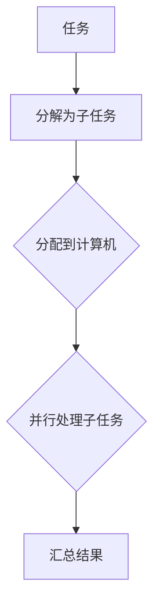

#### 2.3.2 区块链技术原理

区块链技术是一种分布式数据库技术，通过加密算法和共识机制确保数据的不可篡改性和安全性。区块链的基本原理如下：

- **数据结构**：区块链由一系列按时间顺序排列的区块组成，每个区块包含一定数量的交易记录。
- **加密算法**：每个区块使用加密算法进行加密，确保数据的安全性和完整性。
- **共识机制**：多个节点通过共识机制共同维护区块链的一致性。

区块链的工作流程可以表示为：

1. **交易生成**：用户在区块链上进行交易，交易记录被生成。
2. **区块生成**：交易记录被多个节点收集，并生成新的区块。
3. **区块验证**：多个节点对新生成的区块进行验证，确保区块的有效性和一致性。
4. **区块添加**：验证通过后，新的区块被添加到区块链中。
5. **数据存储**：区块链中的数据永久存储，不可篡改。

**区块链技术原理流程图：**
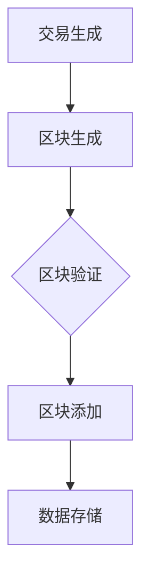

#### 2.3.3 分布式计算与区块链在元宇宙中的应用

分布式计算和区块链技术在元宇宙中发挥着关键作用，为元宇宙提供了高效、可靠和安全的计算和存储环境。

- **分布式计算在元宇宙中的应用**：

  分布式计算在元宇宙中具有广泛的应用，如3D渲染、人工智能推理、大数据处理等。通过分布式计算，可以高效地处理大量数据，提供更好的用户体验。

  - **3D渲染**：分布式计算可以将3D渲染任务分配给多个计算机，提高渲染速度，提供高质量的图形效果。
  - **人工智能推理**：分布式计算可以加速人工智能模型的训练和推理过程，提高元宇宙的智能水平。
  - **大数据处理**：分布式计算可以处理海量数据，为元宇宙提供实时分析和决策支持。

  **分布式计算在元宇宙中的应用案例**：

  - **案例1：虚拟城市**：通过分布式计算，虚拟城市中的建筑物、车辆、人群等都可以实时渲染，提供逼真的视觉效果。
  - **案例2：智能助理**：分布式计算可以加速智能助理的响应速度，提高用户的互动体验。

- **区块链在元宇宙中的应用**：

  区块链技术为元宇宙提供了安全的虚拟经济体系，确保虚拟资产和交易的安全性。

  - **虚拟资产**：区块链技术可以确保虚拟资产（如虚拟地产、虚拟物品）的所有权和转移记录的安全性和透明性。
  - **虚拟交易**：区块链技术可以确保虚拟交易的安全性和不可篡改性，防止欺诈和作弊行为。
  - **身份验证**：区块链技术可以用于虚拟身份的验证，确保用户的隐私和安全。

  **区块链在元宇宙中的应用案例**：

  - **案例1：虚拟购物**：通过区块链技术，用户可以在元宇宙中进行安全的虚拟购物，确保交易的安全性和透明性。
  - **案例2：虚拟地产**：通过区块链技术，用户可以购买、租赁和交易虚拟地产，确保地产的所有权和转移记录的安全性和透明性。

通过分布式计算和区块链技术的应用，元宇宙可以提供高效、安全、可靠的虚拟世界，为用户带来更加丰富和多样化的体验。

---

### 3.1 元宇宙平台概述

#### 3.1.1 元宇宙平台的定义

元宇宙平台是一个综合性的技术平台，它集成了虚拟现实（VR）、增强现实（AR）、分布式计算、区块链等多种技术，为用户提供一个沉浸式、互动性强的虚拟世界。元宇宙平台不仅包括虚拟环境的建设和运营，还涵盖了用户交互、内容生成、虚拟经济体系等多个方面。

#### 3.1.2 元宇宙平台的架构

元宇宙平台的架构通常分为多个层次，包括前端交互层、后端服务层、数据存储层和技术支持层。

- **前端交互层**：负责用户界面和交互设计，包括VR头盔、AR眼镜、智能手机等设备。用户通过这些设备进入元宇宙平台，进行各种互动和操作。
- **后端服务层**：包括服务器、云计算平台和分布式计算节点，负责处理用户请求、数据存储和传输等。后端服务层还负责提供各种API接口，方便开发者进行应用开发和功能扩展。
- **数据存储层**：使用分布式数据库和区块链技术，存储用户数据、虚拟资产、交易记录等。数据存储层确保数据的安全性和可靠性，同时支持高并发访问和大规模数据处理。
- **技术支持层**：包括人工智能、自然语言处理、机器学习等技术，为元宇宙平台提供智能化的内容生成和交互体验。

**元宇宙平台架构图：**
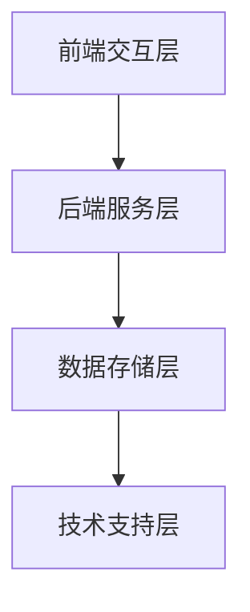

#### 3.1.3 元宇宙平台的关键功能

元宇宙平台的关键功能包括用户身份认证、虚拟资产交易、虚拟世界交互、内容创作与分享等。

- **用户身份认证**：通过区块链技术实现用户身份的唯一性和安全性，确保用户的隐私和数据安全。
- **虚拟资产交易**：支持虚拟地产、虚拟物品等虚拟资产的交易，实现虚拟经济的循环和增长。
- **虚拟世界交互**：提供沉浸式、互动性的虚拟环境，支持用户之间的交流和互动，包括语音、视频、文字等多种通信方式。
- **内容创作与分享**：支持用户创作和分享各种内容，包括3D模型、视频、音频等，丰富元宇宙的虚拟世界。

**元宇宙平台功能图：**
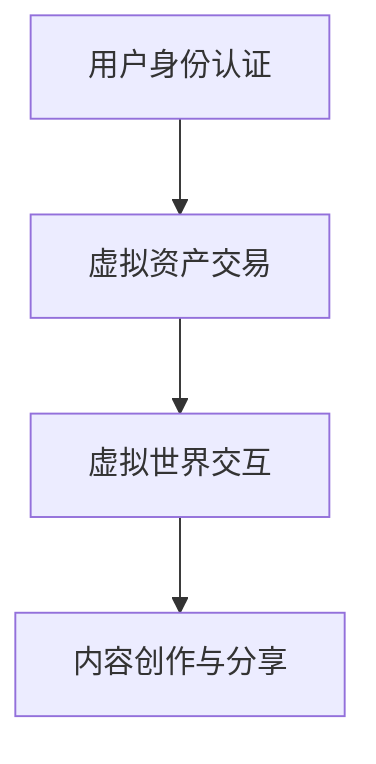

通过上述架构和功能的介绍，我们可以看到元宇宙平台是一个复杂而全面的系统，它集成了多种技术，为用户提供了一个虚拟的、互动的世界。在下一部分，我们将详细讨论元宇宙平台的开发流程，包括需求分析、技术选型、平台设计与实现等。

---

### 3.2 元宇宙平台开发流程

#### 3.2.1 需求分析

需求分析是元宇宙平台开发的首要步骤，它涉及到对用户需求、业务需求、技术需求等多方面的研究和分析。

- **用户需求**：通过用户调研、访谈等方式收集用户的需求，包括用户体验、功能需求、性能需求等。例如，用户可能需要沉浸式的虚拟环境、便捷的虚拟资产交易、多样化的内容创作工具等。
- **业务需求**：分析元宇宙平台的业务模式，确定平台的商业模式、盈利模式、业务流程等。例如，平台可能需要支持虚拟地产交易、虚拟物品租赁、广告投放等业务功能。
- **技术需求**：分析实现平台所需的技术，包括前端技术、后端技术、数据库技术、区块链技术等。例如，平台需要支持VR和AR技术、分布式计算、高性能的数据库、安全的区块链网络等。

**需求分析流程图：**
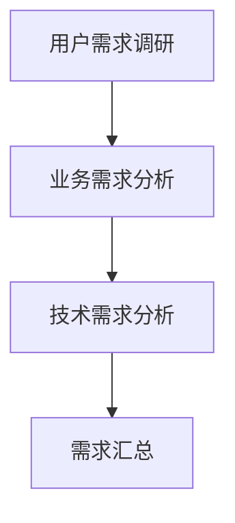

#### 3.2.2 技术选型

技术选型是元宇宙平台开发的关键环节，它涉及到选择适合平台开发的技术栈和工具。

- **前端技术**：选择适合元宇宙平台的前端技术，如HTML5、CSS3、JavaScript等。前端技术需要支持VR和AR应用的开发，提供良好的用户体验。
- **后端技术**：选择适合元宇宙平台的后端技术，如服务器端编程语言（如Java、Python）、Web框架（如Django、Flask）、数据库（如MySQL、MongoDB）等。后端技术需要支持高并发访问、分布式计算、数据存储和安全性。
- **数据库技术**：选择适合元宇宙平台的数据库技术，如关系型数据库（如MySQL、PostgreSQL）、非关系型数据库（如MongoDB、Cassandra）等。数据库技术需要支持海量数据的存储和查询，同时保证数据的一致性和安全性。
- **区块链技术**：选择适合元宇宙平台的区块链技术，如以太坊、Hyperledger Fabric等。区块链技术需要支持虚拟资产交易、数据存储和安全性。

**技术选型流程图：**
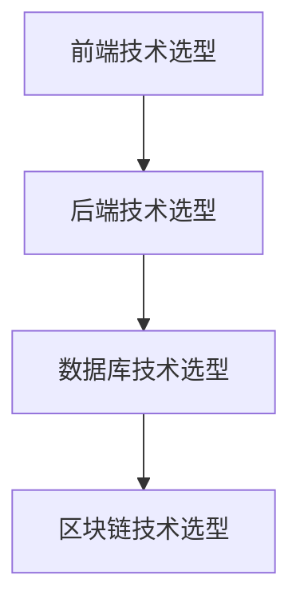

#### 3.2.3 平台设计与实现

平台设计与实现是元宇宙平台开发的实际操作阶段，包括平台架构设计、功能模块设计、接口设计等。

- **平台架构设计**：根据需求分析和技术选型，设计元宇宙平台的整体架构，包括前端交互层、后端服务层、数据存储层和技术支持层。平台架构设计需要考虑高可用性、可扩展性、安全性等因素。
- **功能模块设计**：根据平台功能需求，设计各个功能模块，如用户身份认证模块、虚拟资产交易模块、虚拟世界交互模块、内容创作与分享模块等。功能模块设计需要确保模块之间的高内聚和低耦合。
- **接口设计**：设计平台各个模块之间的接口，包括API接口、数据库接口、区块链接口等。接口设计需要确保接口的稳定性和安全性，同时方便开发者进行功能扩展和模块集成。

**平台设计与实现流程图：**
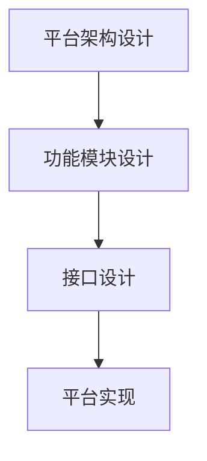

通过需求分析、技术选型、平台设计与实现等环节，我们可以逐步构建起一个功能完善、性能优越的元宇宙平台。在下一部分，我们将通过具体的案例分析，深入探讨元宇宙平台在实际应用中的实现和效果。

---

### 3.3 元宇宙平台案例分析

在元宇宙平台的发展过程中，已经出现了多个成功的案例，这些平台不仅为用户提供了丰富的虚拟世界体验，还在技术上取得了显著成就。在本章节中，我们将分析两个具有代表性的元宇宙平台案例：平台A和平台B。

#### 3.3.1 平台A案例解析

**平台A：Decentraland**

**背景介绍**：Decentraland是一个基于区块链的虚拟世界平台，用户可以在其中购买、建造和交易虚拟地产。平台采用以太坊区块链技术，确保虚拟资产的所有权和交易记录的安全性和透明性。

**项目介绍**：Decentraland平台的核心功能包括虚拟地产交易、虚拟商品购买、社交互动和内容创作。用户可以在平台上创建自己的虚拟商店、游戏空间和艺术展馆，并通过虚拟货币（LAND和MANA）进行交易。

**系统功能设计**：

- **虚拟地产交易**：用户可以购买、租赁和交易虚拟地产，确保地产的所有权和转移记录的安全性和透明性。
- **虚拟商品购买**：用户可以在平台上购买虚拟商品，如虚拟衣物、家具和装饰品，丰富虚拟世界的体验。
- **社交互动**：用户可以在虚拟世界中与其他用户互动，包括语音、视频和文字聊天，建立社交关系。
- **内容创作**：用户可以创作和分享自己的内容，包括3D模型、视频和音频等，丰富元宇宙的内容生态。

**系统架构设计**：

- **前端架构**：Decentraland使用React框架和Three.js库，实现VR和AR功能，提供良好的用户体验。
- **后端架构**：Decentraland使用以太坊区块链，实现虚拟资产的交易和管理。后端服务包括智能合约、API服务器和数据库。
- **数据存储**：Decentraland使用分布式数据库，存储用户数据、虚拟资产和交易记录，确保数据的一致性和安全性。

**系统接口设计**：

- **虚拟地产接口**：提供虚拟地产的购买、租赁和交易接口，方便用户进行操作。
- **虚拟商品接口**：提供虚拟商品的购买和交易接口，支持不同类型的虚拟商品。
- **社交接口**：提供社交互动的接口，包括语音、视频和文字聊天，支持用户之间的交流和互动。
- **内容创作接口**：提供内容创作的接口，支持用户上传和分享自己的内容。

**系统交互流程图**：

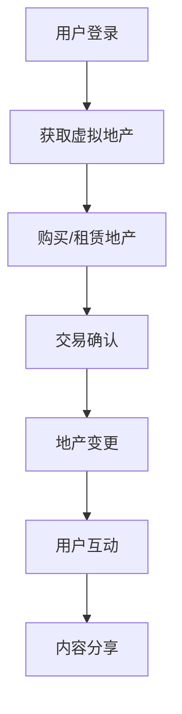

**实际案例分析**：Decentraland平台自2017年推出以来，吸引了大量用户和开发者的关注。平台上的虚拟地产交易活跃，用户可以通过购买和交易虚拟地产实现财富增值。同时，Decentraland也为开发者提供了丰富的内容创作工具和API接口，鼓励用户创造和分享自己的虚拟世界。

**项目小结**：Decentraland案例展示了区块链技术在元宇宙平台中的应用，通过虚拟地产交易和内容创作，实现了虚拟经济的繁荣。平台的成功得益于其开放、透明和去中心化的特点，为用户提供了一个自由、公平的虚拟世界。

#### 3.3.2 平台B案例解析

**平台B：Second Life**

**背景介绍**：Second Life是一个由美国公司Linden Lab开发的虚拟世界平台，成立于2003年。平台允许用户创建自己的虚拟角色（Avatar），在虚拟世界中进行互动、工作、娱乐等活动。

**项目介绍**：Second Life平台的核心功能包括虚拟地产交易、虚拟商品购买、社交互动和虚拟工作。用户可以在平台上购买虚拟地产，建造自己的虚拟建筑和商业空间，并通过虚拟货币（Linden Dollar，简称L$）进行交易。

**系统功能设计**：

- **虚拟地产交易**：用户可以购买、租赁和交易虚拟地产，确保地产的所有权和转移记录的安全性和透明性。
- **虚拟商品购买**：用户可以在平台上购买虚拟商品，如虚拟衣物、家具和装饰品，丰富虚拟世界的体验。
- **社交互动**：用户可以在虚拟世界中与其他用户互动，包括语音、视频和文字聊天，建立社交关系。
- **虚拟工作**：平台提供了多种虚拟工作机会，如虚拟导游、虚拟模特、虚拟游戏设计师等，用户可以通过虚拟工作获得虚拟货币。

**系统架构设计**：

- **前端架构**：Second Life使用自定义的Web浏览器插件，实现VR和AR功能，提供良好的用户体验。
- **后端架构**：Second Life使用分布式服务器架构，处理用户请求和虚拟世界的交互。后端服务包括游戏服务器、数据库和交易服务器。
- **数据存储**：Second Life使用分布式数据库，存储用户数据、虚拟资产和交易记录，确保数据的一致性和安全性。

**系统接口设计**：

- **虚拟地产接口**：提供虚拟地产的购买、租赁和交易接口，方便用户进行操作。
- **虚拟商品接口**：提供虚拟商品的购买和交易接口，支持不同类型的虚拟商品。
- **社交接口**：提供社交互动的接口，包括语音、视频和文字聊天，支持用户之间的交流和互动。
- **虚拟工作接口**：提供虚拟工作机会的接口，支持用户申请和参与虚拟工作。

**系统交互流程图**：


**实际案例分析**：Second Life平台自成立以来，吸引了大量用户和开发者的参与。平台上的虚拟地产交易活跃，用户可以通过购买和交易虚拟地产实现财富增值。同时，Second Life也为开发者提供了丰富的内容创作工具和API接口，鼓励用户创造和分享自己的虚拟世界。

**项目小结**：Second Life案例展示了虚拟现实技术在元宇宙平台中的应用，通过虚拟地产交易和内容创作，实现了虚拟经济的繁荣。平台的成功得益于其开放的生态系统和丰富的用户体验，为用户提供了自由、多元的虚拟世界。

通过分析平台A和平台B的案例，我们可以看到元宇宙平台在实现虚拟世界构建方面的成功经验和挑战。这些案例不仅展示了元宇宙平台的核心功能和技术架构，还为未来的元宇宙平台开发提供了宝贵的借鉴和启示。

---

### 4.1 虚拟世界中的交互技术

在元宇宙中，用户交互是核心部分，它直接影响用户体验和虚拟世界的活跃度。为了实现流畅、自然、直观的用户交互，我们需要关注以下几个方面：交互设计原则、交互技术实现和用户体验优化。

#### 4.1.1 交互设计原则

交互设计原则是指导虚拟世界交互设计的基础，主要包括以下几个方面：

- **易用性**：交互设计应该简单直观，让用户能够快速掌握和使用。
- **一致性**：交互元素在不同情境下应该保持一致性，减少用户的认知负担。
- **可控性**：用户在虚拟世界中的动作和交互应该具有可控性，避免意外行为。
- **反馈**：交互过程中应提供及时的反馈，帮助用户了解系统状态和操作结果。
- **定制化**：交互设计应支持用户定制，满足不同用户的需求和偏好。

**交互设计原则对比表格：**

| 设计原则 | 描述 |
| --- | --- |
| 易用性 | 设计简单直观，降低用户学习成本 |
| 一致性 | 保持交互元素在不同情境下的一致性 |
| 可控性 | 提供可控性，避免意外行为 |
| 反馈 | 提供即时反馈，提升用户满意度 |
| 定制化 | 支持用户个性化定制 |

#### 4.1.2 交互技术实现

虚拟世界中的交互技术涉及多个方面，包括输入设备、输出设备、传感器和算法等。

- **输入设备**：如键盘、鼠标、触摸屏、手势控制、语音识别等，用于用户与虚拟世界的互动。
- **输出设备**：如显示器、投影仪、虚拟现实头盔、增强现实眼镜等，用于展示虚拟世界的内容。
- **传感器**：如摄像头、运动传感器、位置传感器等，用于捕捉用户的动作和周围环境。
- **算法**：如语音识别算法、手势识别算法、物体追踪算法等，用于处理用户输入和生成虚拟交互。

**交互技术实现流程图：**

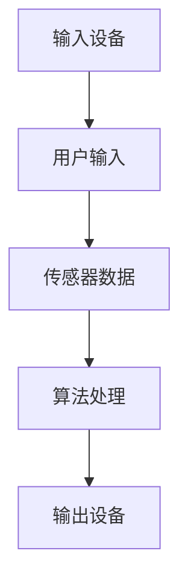

#### 4.1.3 用户体验优化

用户体验是元宇宙平台成功的关键因素，为了提升用户体验，我们需要从以下几个方面进行优化：

- **响应速度**：优化系统性能，提高交互响应速度，减少延迟。
- **交互流畅性**：优化交互动作的流畅度，减少卡顿和延迟。
- **界面设计**：设计直观、美观的界面，提升视觉体验。
- **个性化定制**：提供个性化设置和定制选项，满足不同用户的需求。
- **帮助与指导**：提供详细的使用帮助和指导，降低用户的学习成本。

**用户体验优化策略：**

- **响应速度优化**：通过分布式计算和高效的数据处理技术，提高系统的响应速度。
- **交互流畅性优化**：优化输入设备和输出设备的性能，减少延迟和卡顿。
- **界面设计优化**：采用现代化的设计风格，提升视觉体验。
- **个性化定制优化**：提供丰富的个性化设置选项，满足用户个性化需求。
- **帮助与指导优化**：提供详细的操作指南和使用教程，帮助用户快速上手。

**用户体验优化流程图：**

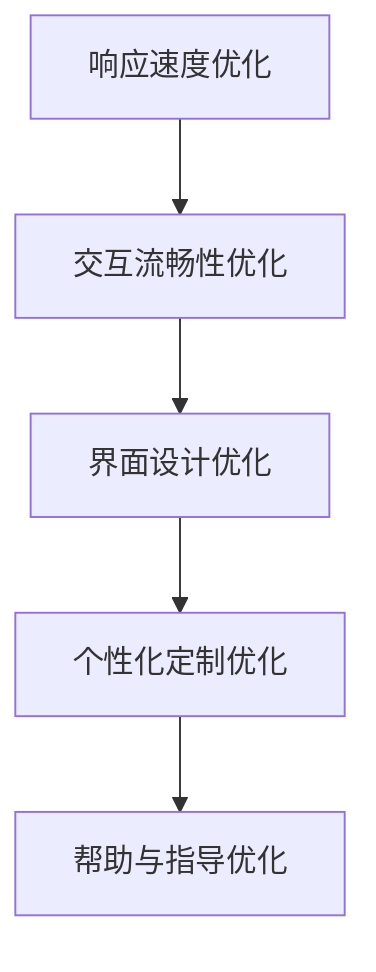

通过遵循交互设计原则、实现交互技术并优化用户体验，我们可以构建一个高效、自然、互动性强的虚拟世界，为用户提供丰富的虚拟体验。

---

### 4.2 虚拟世界中的经济体系

在虚拟世界中，经济体系是一个核心组成部分，它为用户提供了价值交换和财富积累的途径。虚拟经济体系的设计与实现涉及到虚拟货币、虚拟资产、交易市场等多个方面。

#### 4.2.1 虚拟货币与经济模型

虚拟货币是虚拟世界中的一种数字货币，用于购买虚拟商品、服务或资产。虚拟货币的经济模型决定了虚拟经济的运行规则和价值交换方式。

- **虚拟货币的类型**：常见的虚拟货币包括平台内置货币、区块链货币等。平台内置货币通常由虚拟世界的运营商发行和管理，如Second Life中的Linden Dollar（L$）。区块链货币则基于区块链技术，如比特币（BTC）和以太坊（ETH）等。

- **虚拟货币的发行机制**：虚拟货币的发行机制可以分为固定发行和动态发行。固定发行是指虚拟货币的总量固定，不再增加，如比特币。动态发行是指虚拟货币的总量根据特定规则动态调整，如以太坊。

  **虚拟货币发行机制公式：**
  $$ 总量 = 初始发行量 + 动态调整量 $$

- **虚拟货币的价值模型**：虚拟货币的价值受市场需求、供应量、平台信誉等因素影响。一个健康的虚拟经济体系应该确保虚拟货币的价值稳定，避免大幅波动。

  **虚拟货币价值模型公式：**
  $$ 货币价值 = 市场需求 \times 供应量 $$

#### 4.2.2 虚拟资产与交易市场

虚拟资产是虚拟世界中具有价值的物品或财产，如虚拟地产、虚拟物品、虚拟服务等。虚拟资产的交易市场是虚拟经济体系的重要组成部分。

- **虚拟资产的类型**：虚拟资产可以分为消耗品、耐用品和投资品。消耗品如虚拟衣物、虚拟食物等，耐用品如虚拟房产、虚拟车辆等，投资品如虚拟股票、虚拟债券等。

- **虚拟资产的价值评估**：虚拟资产的价值受其功能性价值、稀缺性、市场需求等因素影响。功能性价值是指虚拟资产为用户带来的直接效用，稀缺性是指虚拟资产的供应量有限，市场需求是指用户对虚拟资产的需求程度。

  **虚拟资产价值评估公式：**
  $$ 资产价值 = 功能性价值 + 投资性价值 + 稀缺性价值 $$

- **虚拟资产交易市场**：虚拟资产交易市场为虚拟资产的所有权和使用权提供交易场所。交易市场可以是集中式或去中心式的。集中式交易市场由运营商管理，如拍卖行。去中心式交易市场基于区块链技术，如去中心化交易所（DEX）。

#### 4.2.3 经济体系的设计与维护

虚拟经济体系的设计与维护是确保虚拟世界可持续发展的关键。

- **经济体系的设计原则**：设计虚拟经济体系时，应遵循以下原则：
  - **平衡性**：确保虚拟货币和虚拟资产的价值稳定，避免大幅波动。
  - **可持续性**：鼓励用户参与虚拟经济活动，促进虚拟经济的发展。
  - **公平性**：确保虚拟交易过程的公正，防止欺诈和垄断行为。
  - **安全性**：保障虚拟资产和交易的安全，防止数据泄露和资产丢失。

- **经济体系的维护措施**：
  - **监管**：建立监管机制，确保虚拟经济体系的合法性和安全性。
  - **货币政策**：制定合适的货币政策，调控虚拟货币的供应量和价值。
  - **风险管理**：建立风险管理体系，防范虚拟经济风险，如市场波动、网络安全等。
  - **用户教育**：提高用户对虚拟经济的认识，增强用户的自我保护意识。

**虚拟经济体系设计流程图：**

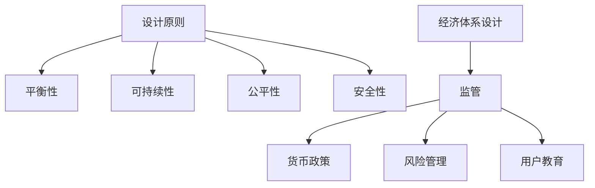

通过设计一个健全、稳定、可持续的虚拟经济体系，我们可以为虚拟世界提供一个健康的生态环境，为用户带来丰富、多样的虚拟体验。

---

### 5.1 元宇宙的安全挑战

随着元宇宙技术的发展和应用，安全挑战也日益凸显。元宇宙的安全挑战主要包括数据安全、虚拟身份安全和隐私保护等方面。

#### 5.1.1 数据安全

数据安全是元宇宙面临的重大挑战之一。在元宇宙中，用户产生的数据包括个人身份信息、行为记录、交易记录等，这些数据对用户隐私和平台稳定性至关重要。

- **数据泄露风险**：元宇宙平台可能面临黑客攻击和数据泄露的风险。黑客可以通过恶意代码、网络钓鱼等方式窃取用户数据。
- **数据完整性风险**：数据在传输和存储过程中可能受到篡改，影响数据的真实性和可靠性。
- **数据备份与恢复**：如何确保数据的备份与恢复机制，以防止数据丢失和系统故障。

**数据安全解决方案**：

- **加密技术**：使用加密算法对数据进行加密，确保数据在传输和存储过程中的安全性。
- **访问控制**：实施严格的访问控制策略，确保只有授权用户可以访问敏感数据。
- **安全审计**：定期进行安全审计，检测和修复系统漏洞，提高数据安全性。

#### 5.1.2 虚拟身份安全

虚拟身份安全是元宇宙用户面临的重要问题。在元宇宙中，用户通过虚拟角色（Avatar）进行互动，虚拟身份的安全直接影响到用户的体验和信任。

- **虚拟身份被盗用**：黑客可以通过技术手段获取用户的虚拟身份，进行非法活动或冒用身份。
- **虚拟身份识别**：如何确保虚拟身份的真实性和唯一性，防止假冒和欺诈行为。

**虚拟身份安全解决方案**：

- **身份验证**：使用多因素身份验证（MFA）技术，如指纹识别、面部识别等，确保用户身份的合法性。
- **虚拟身份管理**：建立虚拟身份管理系统，记录用户的虚拟身份信息，确保虚拟身份的可追溯性和可控性。
- **反欺诈机制**：实施反欺诈机制，监控和识别异常行为，防止虚拟身份被盗用。

#### 5.1.3 隐私保护

隐私保护是元宇宙用户关注的重点。在元宇宙中，用户的行为数据、社交关系、交易记录等可能被收集和分析，用户隐私受到威胁。

- **数据收集与使用**：如何在确保平台功能的同时，合理收集和使用用户数据，避免侵犯用户隐私。
- **用户数据管理**：如何建立用户数据管理制度，保护用户数据的隐私和安全。

**隐私保护解决方案**：

- **隐私政策**：制定明确的隐私政策，告知用户数据收集、使用和共享的范围和目的。
- **数据匿名化**：对用户数据进行匿名化处理，确保数据在分析和使用过程中无法识别个人身份。
- **用户控制权**：赋予用户对自身数据的控制权，如数据访问、删除和分享权限。

通过上述解决方案，我们可以有效应对元宇宙的安全挑战，保护用户数据的安全和隐私，为元宇宙的健康发展奠定基础。

---

### 5.2 元宇宙的监管框架

在元宇宙迅速发展的背景下，建立一套完善的监管框架至关重要。监管框架不仅关乎用户的安全与隐私，还涉及整个行业的健康发展。以下从监管政策与法律法规、安全监管措施和跨境监管合作三个方面探讨元宇宙的监管框架。

#### 5.2.1 监管政策与法律法规

监管政策与法律法规是元宇宙监管框架的基础，不同国家和地区根据自身情况制定了相应的法律法规。

- **国内监管政策**：在中国，政府出台了一系列政策和法规，如《网络安全法》、《个人信息保护法》等，对元宇宙平台的数据安全、用户隐私保护等方面进行了规定。同时，针对虚拟资产交易，中国互联网金融协会发布了相关指导意见，规范虚拟货币交易行为。
- **国际监管政策**：在国际上，各国也在积极制定相关法规，如欧盟的《通用数据保护条例》（GDPR）对数据隐私保护提出了严格要求。此外，国际货币基金组织（IMF）和国际证监会组织（IOSCO）等国际组织也在推动全球范围内的监管合作。

**监管政策与法律法规框架图**：

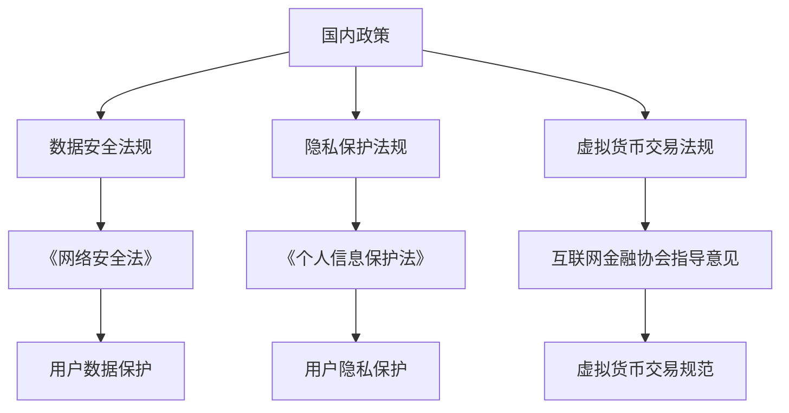

#### 5.2.2 安全监管措施

为了确保元宇宙平台的稳定和安全，监管机构采取了多种安全监管措施。

- **数据安全措施**：监管机构要求元宇宙平台实施严格的数据安全策略，包括数据加密、访问控制、数据备份等。此外，监管机构定期对平台进行安全审计，确保数据安全措施得到有效执行。
- **用户身份验证**：监管机构推动元宇宙平台加强用户身份验证，实施多因素身份验证（MFA），防止虚拟身份被盗用。
- **交易监控**：监管机构对元宇宙平台的交易活动进行监控，及时发现和打击非法交易和欺诈行为。
- **信息安全教育**：监管机构通过开展信息安全教育活动，提高用户的安全意识和自我保护能力。

**安全监管措施流程图**：

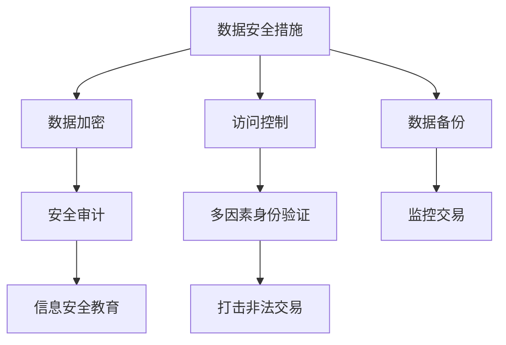

#### 5.2.3 跨境监管合作

元宇宙的跨平台、跨国界特性要求建立跨境监管合作机制，确保全球范围内的监管协调。

- **国际合作机制**：各国监管机构通过国际组织如金融行动特别工作组（FATF）、国际电信联盟（ITU）等开展合作，制定全球范围内的监管标准和规范。
- **数据主权**：在跨境数据传输方面，各国监管机构需要尊重数据主权，确保数据在跨境传输过程中的合法性和安全性。
- **信息共享**：监管机构之间建立信息共享机制，及时交换监管信息和案件线索，提高全球监管效率。

**跨境监管合作框架图**：

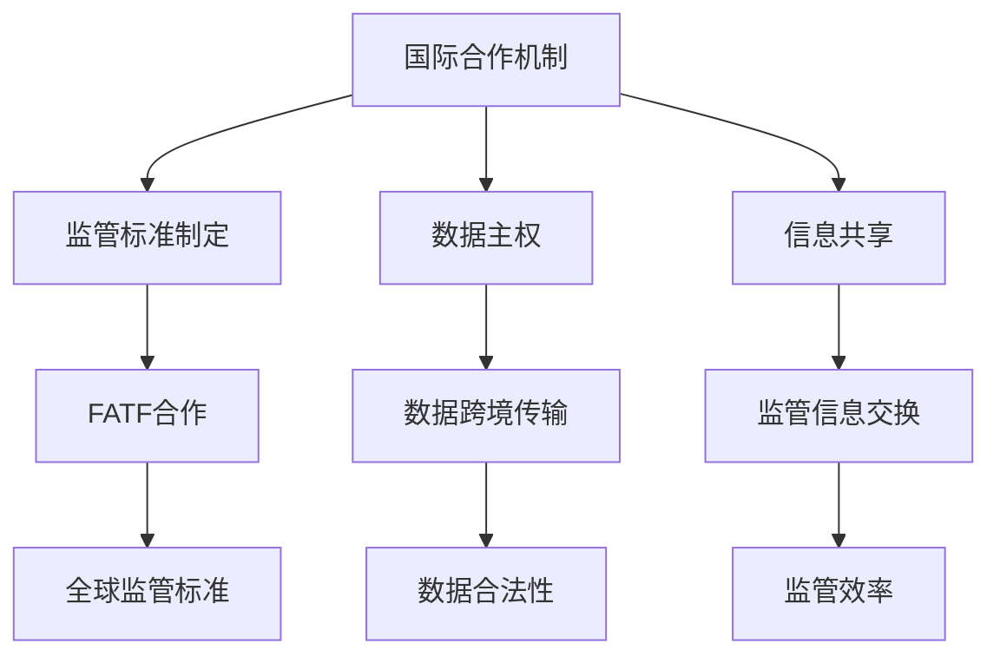

通过建立完善的监管框架，元宇宙可以在保证用户安全和隐私的同时，促进其健康发展。监管政策与法律法规、安全监管措施和跨境监管合作三个方面共同构成了元宇宙的监管体系，为元宇宙的可持续发展提供了有力保障。

---

### 6.1 技术趋势与挑战

随着科技的不断发展，元宇宙技术也在不断进步。以下从技术趋势和挑战两个方面进行探讨。

#### 6.1.1 元宇宙技术的未来发展

元宇宙技术的未来发展将集中在以下几个方面：

- **更高效的计算**：随着量子计算、边缘计算等新计算模式的发展，元宇宙的运算能力和效率将得到大幅提升，为更复杂的虚拟世界提供技术支持。
- **更丰富的交互体验**：通过人工智能和机器学习技术的应用，元宇宙中的交互体验将更加智能化和个性化，用户可以享受更加真实和丰富的虚拟体验。
- **更完善的经济体系**：随着区块链技术的深入应用，元宇宙中的虚拟经济体系将更加完善，提供更加稳定和透明的交易环境。

**元宇宙技术未来发展图**：

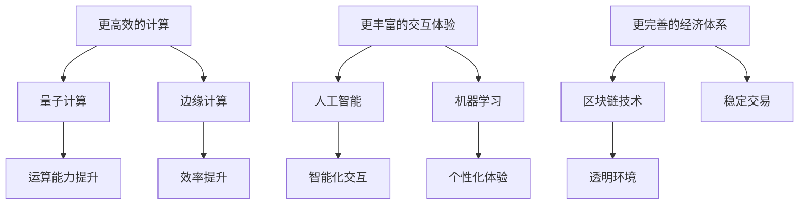

#### 6.1.2 技术挑战与解决方案

尽管元宇宙技术在不断发展，但仍然面临一系列技术挑战：

- **计算能力瓶颈**：随着虚拟世界的复杂度增加，对计算能力的要求也在提高。目前，传统的计算模式可能无法满足元宇宙的高需求。
  - **解决方案**：采用分布式计算、云计算和边缘计算等技术，通过分布式部署和计算资源的共享，提高计算能力。

- **数据安全和隐私保护**：元宇宙中的数据量和用户信息量巨大，数据安全和隐私保护是重要挑战。
  - **解决方案**：加强数据加密、身份验证和访问控制等技术手段，建立完善的数据安全管理体系。

- **网络延迟和带宽限制**：元宇宙需要实时交互和大量数据传输，但网络延迟和带宽限制可能影响用户体验。
  - **解决方案**：优化网络传输协议，采用低延迟、高带宽的网络技术，如5G和光纤通信。

- **标准化和兼容性**：元宇宙技术涉及多种技术和平台，标准化和兼容性是重要问题。
  - **解决方案**：推动行业标准化，建立统一的技术标准和协议，提高不同平台和设备之间的兼容性。

**技术挑战与解决方案图**：

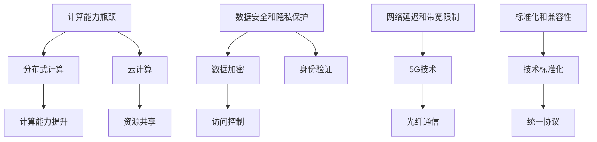

通过应对这些技术挑战，元宇宙技术将不断进步，为用户带来更加丰富、真实的虚拟体验。

---

### 6.2 元宇宙的产业生态

元宇宙的产业生态是一个复杂而多元的体系，涵盖了硬件设备、平台开发、内容创作、用户服务等多个环节。了解元宇宙的产业生态对于把握行业发展趋势、促进技术进步具有重要意义。

#### 6.2.1 产业链构成

元宇宙产业链可以分为上游硬件设备、中游平台开发和下游用户服务三个部分。

- **上游硬件设备**：包括VR头盔、AR眼镜、手柄、传感器等硬件设备。这些硬件设备是用户进入元宇宙的入口，其性能和用户体验直接影响元宇宙的普及和应用。
- **中游平台开发**：包括元宇宙平台的技术研发、系统开发、内容创作等。平台开发是元宇宙的核心，决定了元宇宙的交互体验、功能丰富度和生态系统。
- **下游用户服务**：包括元宇宙平台的应用服务、用户管理、用户支持等。用户服务是元宇宙平台的直接用户接触点，直接影响用户满意度和粘性。

**元宇宙产业链图**：

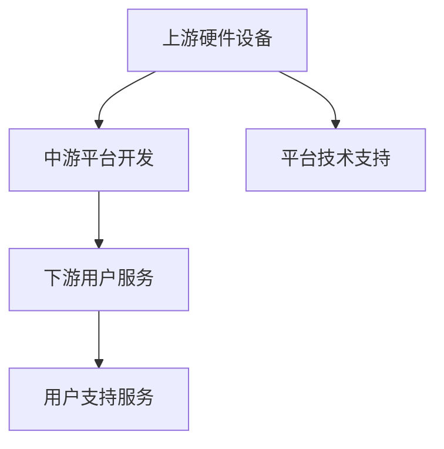

#### 6.2.2 产业生态合作

产业生态合作是元宇宙发展的重要推动力，不同环节的企业和机构通过合作实现资源整合、优势互补，共同推动元宇宙技术的发展和应用。

- **硬件制造商与平台开发商合作**：硬件制造商和平台开发商的合作可以优化硬件设备与平台系统的兼容性，提高用户体验。例如，硬件制造商可以为平台开发商提供定制化的硬件设备，平台开发商则可以为硬件制造商提供技术支持，帮助其优化产品性能。
- **平台开发商与内容创作者合作**：平台开发商和内容创作者的合作可以丰富元宇宙的内容生态，提升平台的吸引力。平台开发商可以提供内容创作者平台和工具，帮助其创作和发布高质量的内容，内容创作者则可以提供丰富多样的虚拟世界内容，吸引用户。
- **平台开发商与用户服务提供商合作**：平台开发商和用户服务提供商的合作可以提升用户服务的质量和效率，提高用户满意度。平台开发商可以为用户服务提供商提供用户数据和分析工具，帮助其提供个性化服务，用户服务提供商则可以为平台开发商提供用户支持和社区管理服务。

**产业生态合作图**：

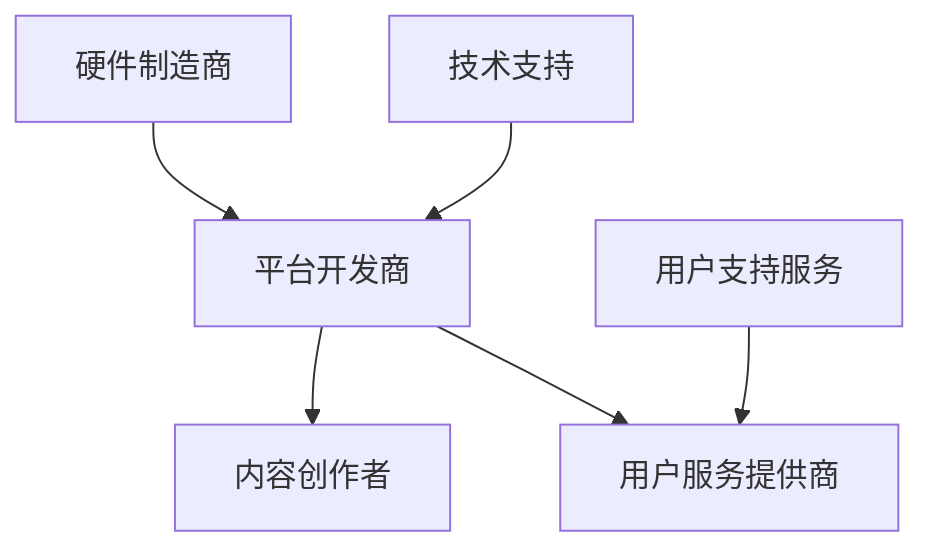

#### 6.2.3 产业政策支持

政府政策支持对于元宇宙产业的发展至关重要。以下从政策支持内容和政策效果两个方面进行探讨。

- **政策支持内容**：政府可以出台一系列政策，支持元宇宙产业的发展。包括资金支持、税收优惠、知识产权保护、人才培养等。例如，政府可以设立元宇宙产业发展基金，为元宇宙项目提供资金支持；通过税收优惠政策，鼓励企业投资元宇宙技术研究和开发；加强知识产权保护，为元宇宙技术创新提供保障；制定人才培养计划，培养元宇宙技术人才。
- **政策效果**：政府政策支持可以有效促进元宇宙产业的发展。通过资金支持和税收优惠，可以降低企业的研发成本，激发企业创新活力；通过知识产权保护和人才培养，可以提升元宇宙技术的研发能力和人才储备，推动元宇宙技术的进步和应用；通过产业生态合作，可以促进产业链上下游企业的协同发展，形成良好的产业生态。

**政策支持效果图**：

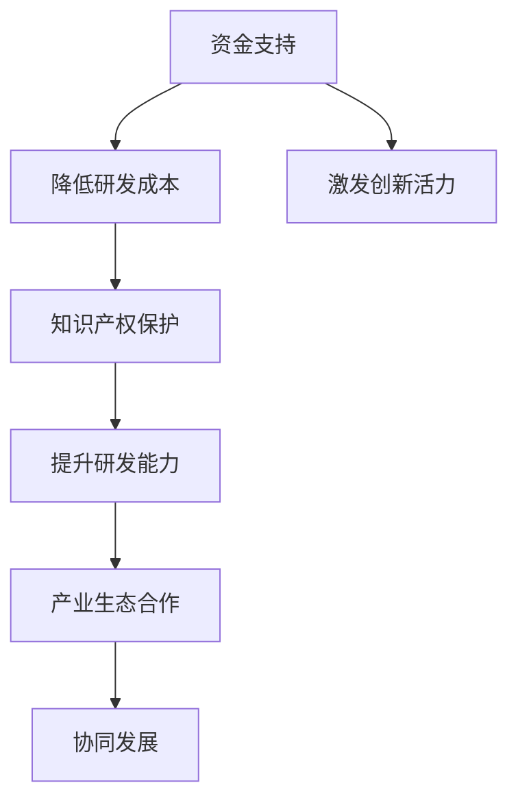

通过构建完善的产业链、促进产业生态合作和获得政府政策支持，元宇宙产业将实现健康、快速发展，为用户提供更加丰富、多样化的虚拟体验。

---

### 7.1 技术资源与工具推荐

在元宇宙技术的开发过程中，选择合适的工具和资源对于项目的成功至关重要。以下推荐一些虚拟世界开发工具、区块链开发平台和VR/AR开发工具，以供开发者参考。

#### 7.1.1 虚拟世界开发工具

- **Unity**：Unity是一款功能强大的游戏引擎，广泛用于虚拟世界的开发。它提供了丰富的3D建模、渲染和物理引擎功能，支持VR和AR应用的开发。
- **Unreal Engine**：Unreal Engine是另一款流行的游戏引擎，以其出色的图形渲染效果和高效的技术支持而著称。它支持VR和AR应用的开发，适合开发高质量的游戏和虚拟现实体验。
- **Blender**：Blender是一款开源的3D建模和渲染软件，适用于创建3D模型、动画和虚拟世界场景。它提供了丰富的工具和插件，支持多种文件格式和插件扩展。
- **CryEngine**：CryEngine是一款高性能的游戏引擎，适用于开发高质量的虚拟现实应用。它提供了强大的渲染引擎、物理引擎和AI系统，支持VR和AR应用的开发。

#### 7.1.2 区块链开发平台

- **Ethereum**：Ethereum是最流行的区块链平台之一，支持智能合约的开发和执行。它提供了一个去中心化的虚拟机，允许开发者创建和部署自己的去中心化应用（DApp）。
- **Hyperledger Fabric**：Hyperledger Fabric是Linux基金会推出的一个开源区块链框架，适用于企业级应用。它提供了灵活的模块化架构，支持多种语言编写智能合约。
- **EOSIO**：EOSIO是一个高性能的区块链平台，专注于去中心化应用的开发。它通过权益证明委托权益（DPoS）算法实现了高效和可扩展的区块链网络。
- **Tron**：Tron是一个基于区块链的去中心化平台，旨在构建一个全球范围内的自由内容娱乐系统。它支持智能合约和去中心化应用的开发，适合创建虚拟世界和去中心化游戏。

#### 7.1.3 VR/AR开发工具

- **Unity XR Plugin**：Unity XR Plugin是Unity引擎的一个插件，用于开发VR和AR应用。它提供了丰富的XR（扩展现实）功能，支持VR头显和AR眼镜的开发。
- **ARKit**：ARKit是苹果公司推出的AR开发框架，适用于iOS平台的AR应用开发。它提供了强大的AR功能，包括物体识别、场景理解、增强现实效果等。
- **ARCore**：ARCore是谷歌推出的AR开发框架，适用于Android平台的AR应用开发。它提供了丰富的AR功能，包括环境识别、物体跟踪、增强现实效果等。
- **Vuforia**：Vuforia是Pakual公司推出的AR开发平台，支持多种平台的AR应用开发。它提供了强大的AR引擎和SDK，支持物体识别、标记识别、场景增强等功能。

通过使用这些工具和平台，开发者可以高效地构建元宇宙应用，为用户提供丰富的虚拟体验。在实际开发过程中，开发者可以根据项目需求和目标选择合适的工具，结合多种技术实现元宇宙的愿景。

---

### 7.2 元宇宙经典案例解析

在元宇宙的快速发展过程中，已经涌现出许多经典案例，这些案例不仅在技术实现上具有突破性，还在商业模式、用户体验等方面提供了宝贵的经验。以下选取几个具有代表性的元宇宙经典案例，进行详细解析。

#### 7.2.1 游戏案例：The Sandbox

**背景介绍**：The Sandbox是一款基于区块链的虚拟世界平台，用户可以在其中创建、购买、交易和体验各种虚拟游戏和场景。平台采用以太坊区块链技术，为用户提供了一个去中心化的虚拟世界。

**项目介绍**：The Sandbox平台的核心功能包括虚拟地块交易、游戏开发和用户互动。用户可以在平台上购买虚拟地块，并创建自己的游戏场景或虚拟建筑。平台支持多种游戏开发工具，如Unity和Unreal Engine，用户可以使用这些工具进行游戏开发。

**系统功能设计**：

- **虚拟地块交易**：用户可以在平台上购买、出售和交易虚拟地块，确保地块的所有权和转移记录的安全性和透明性。
- **游戏开发**：平台提供了多种游戏开发工具，支持用户创建和发布自己的游戏。
- **用户互动**：用户可以在虚拟世界中与其他用户互动，包括语音、视频和文字聊天。

**系统架构设计**：

- **前端架构**：The Sandbox使用Unity引擎，实现虚拟世界和游戏场景的渲染和交互。
- **后端架构**：平台使用以太坊区块链，实现虚拟地块和游戏资产的管理和交易。
- **数据存储**：平台使用分布式数据库，存储用户数据、虚拟地块和交易记录。

**系统接口设计**：

- **虚拟地块接口**：提供虚拟地块的购买、出售和交易接口，方便用户进行操作。
- **游戏开发接口**：提供游戏开发工具的API接口，支持用户进行游戏开发。
- **用户互动接口**：提供用户互动的接口，包括语音、视频和文字聊天。

**实际案例分析**：The Sandbox平台自2020年推出以来，吸引了大量用户和开发者的关注。平台上的虚拟地块交易活跃，用户可以通过购买和交易虚拟地块实现财富增值。同时，平台也提供了丰富的游戏开发工具和API接口，鼓励用户创造和分享自己的虚拟游戏。

**项目小结**：The Sandbox案例展示了区块链技术在元宇宙平台中的应用，通过虚拟地块交易和游戏开发，实现了虚拟经济的繁荣。平台的成功得益于其去中心化的架构和丰富的功能，为用户提供了一个自由、开放的虚拟世界。

#### 7.2.2 教育案例：AliceDrive

**背景介绍**：AliceDrive是一款基于虚拟现实的在线学习平台，用户可以在其中进行沉浸式的学习体验。平台采用Unity引擎和VR设备，提供多种虚拟学习场景和互动工具。

**项目介绍**：AliceDrive平台的核心功能包括虚拟课堂、互动练习、虚拟实验等。用户可以在平台上选择课程，进入虚拟课堂与老师和其他学生互动。平台支持多种交互方式，如语音、视频、文字等，提供个性化的学习体验。

**系统功能设计**：

- **虚拟课堂**：用户可以在虚拟课堂中进行学习，与老师和其他学生互动。
- **互动练习**：平台提供了多种互动练习，帮助用户巩固知识点。
- **虚拟实验**：平台提供了虚拟实验场景，用户可以在虚拟环境中进行实验操作。

**系统架构设计**：

- **前端架构**：AliceDrive使用Unity引擎，实现虚拟课堂和实验场景的渲染和交互。
- **后端架构**：平台使用云服务器，存储用户数据和学习记录。
- **数据存储**：平台使用分布式数据库，存储用户数据和学习记录。

**系统接口设计**：

- **虚拟课堂接口**：提供虚拟课堂的进入和交互接口，支持用户与老师的互动。
- **互动练习接口**：提供互动练习的接口，支持用户进行练习。
- **虚拟实验接口**：提供虚拟实验的接口，支持用户进行实验操作。

**实际案例分析**：AliceDrive平台自推出以来，受到了教育工作者和学生的好评。平台提供了丰富的虚拟学习场景和互动工具，提高了学生的学习兴趣和效果。同时，平台也支持个性化学习，根据用户的学习进度和需求，提供针对性的学习资源。

**项目小结**：AliceDrive案例展示了虚拟现实技术在教育领域的应用，通过沉浸式的学习体验，提高了学生的学习效果和兴趣。平台的成功得益于其丰富的功能和高互动性，为用户提供了优质的教育资源。

#### 7.2.3 商业案例：Spectral Labs

**背景介绍**：Spectral Labs是一家专注于虚拟现实和区块链技术的公司，其开发的虚拟世界平台Spectral是一个集虚拟商品交易、虚拟社交和虚拟工作为一体的元宇宙平台。

**项目介绍**：Spectral平台的核心功能包括虚拟商品交易、虚拟社交和虚拟工作。用户可以在平台上购买虚拟商品，如虚拟地产、虚拟服装等，进行虚拟社交和虚拟工作。

**系统功能设计**：

- **虚拟商品交易**：用户可以在平台上购买和交易虚拟商品，确保商品的所有权和转移记录的安全性和透明性。
- **虚拟社交**：平台提供了多种虚拟社交功能，如虚拟聚会、虚拟派对等，用户可以在虚拟环境中与朋友互动。
- **虚拟工作**：平台提供了多种虚拟工作机会，如虚拟模特、虚拟导游等，用户可以在虚拟环境中进行工作。

**系统架构设计**：

- **前端架构**：Spectral使用Unity引擎，实现虚拟商品交易和虚拟社交功能的渲染和交互。
- **后端架构**：平台使用以太坊区块链，实现虚拟商品交易和虚拟工作的管理和记录。
- **数据存储**：平台使用分布式数据库，存储用户数据、虚拟商品和交易记录。

**系统接口设计**：

- **虚拟商品交易接口**：提供虚拟商品的购买、出售和交易接口，方便用户进行操作。
- **虚拟社交接口**：提供虚拟社交功能的接口，支持用户进行虚拟聚会和虚拟派对。
- **虚拟工作接口**：提供虚拟工作机会的接口，支持用户申请和参与虚拟工作。

**实际案例分析**：Spectral Labs通过其平台实现了虚拟商品交易、虚拟社交和虚拟工作等多方面的功能，为用户提供了丰富的虚拟体验。平台上的虚拟商品交易活跃，用户可以通过购买和交易虚拟商品实现财富增值。同时，平台也为用户提供了多种虚拟工作机会，提高了用户的收入和生活质量。

**项目小结**：Spectral Labs案例展示了虚拟现实和区块链技术在商业领域的应用，通过虚拟商品交易、虚拟社交和虚拟工作等功能，实现了虚拟经济的繁荣。平台的成功得益于其创新的功能和用户体验，为用户提供了全新的商业模式。

通过以上经典案例的解析，我们可以看到元宇宙在游戏、教育、商业等领域的广泛应用和巨大潜力。这些案例不仅展示了元宇宙技术的实际应用，还为未来的元宇宙发展提供了宝贵的经验和启示。

---

### 结束语

元宇宙技术作为下一代互联网的核心驱动力，正引领着科技和产业的深刻变革。本文通过详细探讨元宇宙技术的核心基础、构建技术、平台开发、交互与经济体系、安全与监管、未来发展等多个方面，揭示了元宇宙的丰富内涵和广阔前景。

在元宇宙的发展过程中，我们面临诸多挑战，如计算能力瓶颈、数据安全和隐私保护、网络延迟和带宽限制等。但通过技术创新和合作，我们有望克服这些挑战，推动元宇宙技术的不断进步。

未来，元宇宙将在游戏、教育、商业等领域发挥重要作用，为用户带来更加丰富、真实和沉浸式的体验。同时，元宇宙的产业生态也将不断完善，产业链各环节的企业和机构通过合作，共同推动元宇宙的发展。

让我们期待元宇宙的明天，它将不仅仅是一个虚拟世界，更是一个连接现实与虚拟的桥梁，引领人类进入一个全新的数字时代。在这个时代，科技与人类的创造力和想象力将共同谱写一个新的传奇。作者：AI天才研究院/AI Genius Institute & 禅与计算机程序设计艺术 /Zen And The Art of Computer Programming。让我们携手前行，共同探索元宇宙的无限可能。

