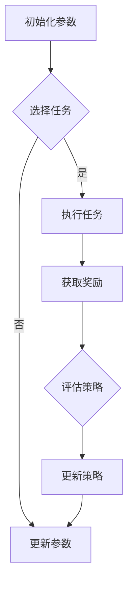
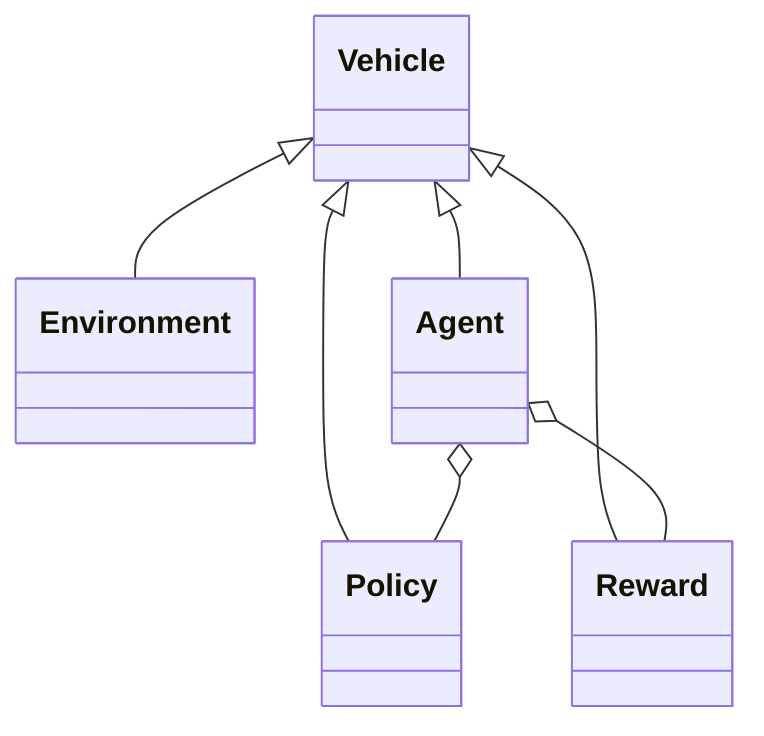
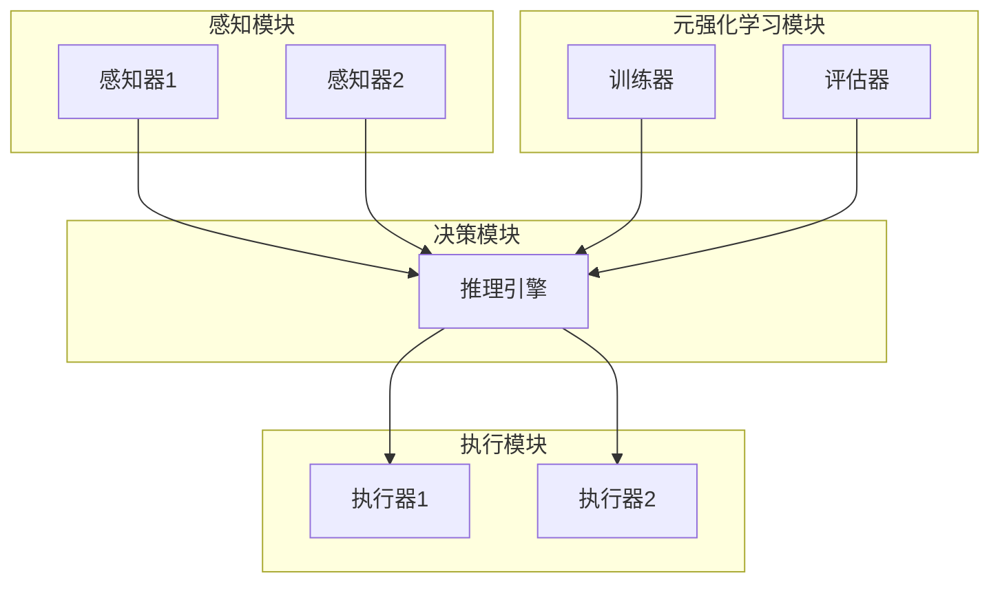
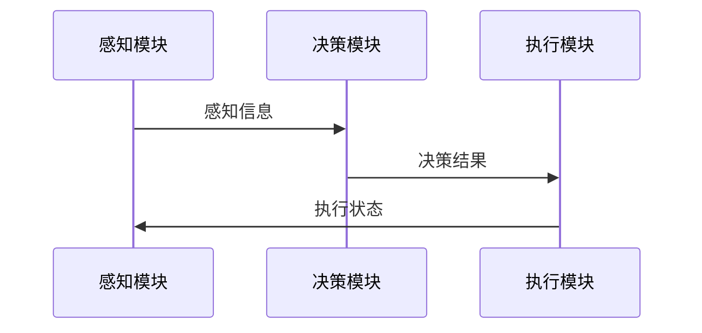

                 

# 《元强化学习在推理策略自适应中的创新应用》

## 关键词

元强化学习，推理策略自适应，机器学习，算法，应用案例

## 摘要

本文将探讨元强化学习在推理策略自适应中的创新应用。首先，我们将介绍强化学习和元学习的基本概念，然后深入分析元强化学习的理论框架。随后，本文将探讨推理策略自适应的重要性，并详细阐述其在不同领域的应用。接着，我们将通过具体的算法原理讲解和Python源代码实现，展示元强化学习在推理策略自适应中的实际应用。最后，本文将总结元强化学习在推理策略自适应中的优势，并提出未来的发展趋势和潜在挑战。

## 第1章 引言

### 1.1 元强化学习的定义与背景

元强化学习是一种机器学习方法，旨在通过学习如何学习来提高学习效率。它结合了强化学习和元学习的思想，通过在多个任务上训练代理，使其能够快速适应新任务并达到良好的性能。元强化学习在近年来取得了显著的进展，主要得益于深度学习技术的发展。

### 1.2 推理策略自适应的重要性

推理策略自适应是人工智能领域的一个重要研究方向。在现实世界中，环境是复杂多变的，代理需要能够根据环境的变化动态调整其推理策略。推理策略自适应能够提高代理的适应能力，使其在不同环境中都能表现出良好的性能。

### 1.3 元强化学习与推理策略自适应的关系

元强化学习与推理策略自适应密切相关。元强化学习通过学习如何在多个任务上快速适应和优化策略，为推理策略自适应提供了一种有效的解决方案。同时，推理策略自适应的提出也为元强化学习提供了一种新的应用场景，推动了元强化学习的研究和发展。

## 第2章 强化学习基础

### 2.1 强化学习的原理与流程

强化学习是一种基于奖励反馈的机器学习方法。代理通过与环境交互，根据当前状态和动作选择策略，并从环境中获取奖励。强化学习的目标是学习一个策略，使代理能够在长时间内获得最大化的累计奖励。

### 2.2 强化学习的主要算法

强化学习有许多不同的算法，如Q学习、SARSA和策略梯度等。每种算法都有其独特的原理和适用场景。

### 2.3 强化学习的挑战与优化方法

强化学习面临着许多挑战，如多步决策、探索与利用的平衡、连续动作空间等。为了解决这些挑战，研究人员提出了一系列优化方法，如深度强化学习、策略搜索和迁移学习等。

## 第3章 元学习基础

### 3.1 元学习的概念与分类

元学习是一种学习如何学习的方法，旨在提高学习效率。元学习可以分为基于模型的元学习和基于样本的元学习两大类。

### 3.2 元学习的主要算法

元学习的主要算法包括模型更新法、模型选择法和样本选择法等。每种算法都有其独特的原理和适用场景。

### 3.3 元学习的挑战与优化方法

元学习面临着许多挑战，如样本效率、泛化能力和计算复杂度等。为了解决这些挑战，研究人员提出了一系列优化方法，如元学习算法的改进、元学习算法的组合和应用场景的拓展等。

## 第4章 元强化学习的理论基础

### 4.1 元强化学习的定义与目标

元强化学习是一种通过学习如何学习来提高学习效率的机器学习方法。它旨在使代理在遇到新环境时能够快速适应和优化策略。元强化学习的目标是通过在多个任务上的训练来获得一个通用策略，以便在遇到新任务时可以快速适应并达到较好的性能。

### 4.2 元强化学习的关键技术

元强化学习的关键技术包括多任务学习、适应化策略学习、集成学习等。多任务学习通过同时训练多个任务来提高模型的泛化能力。适应化策略学习通过学习如何调整策略来适应新环境。集成学习通过将多个模型组合在一起以获得更好的性能。

### 4.3 元强化学习的主要算法

元强化学习的主要算法包括Model-Based Meta-Reinforcement Learning、Model-Free Meta-Reinforcement Learning和Model-Agnostic Meta-Reinforcement Learning等。这些算法各有其独特的原理和应用场景。

## 第5章 推理策略自适应

### 5.1 推理策略自适应的原理与模型

推理策略自适应是一种通过动态调整推理策略来适应环境变化的方法。其原理是基于代理对环境的理解，根据环境的变化动态调整推理策略。推理策略自适应的模型通常包括状态空间、动作空间和策略空间等组成部分。

### 5.2 推理策略自适应的主要算法

推理策略自适应的主要算法包括基于规则的算法、基于模型的算法和基于深度学习的算法等。这些算法各有其优缺点和应用场景。

### 5.3 推理策略自适应的应用案例

推理策略自适应在许多领域都有广泛的应用，如游戏AI、自动驾驶和机器人控制等。本文将介绍一些具体的应用案例，并分析其优势和挑战。

## 第6章 元强化学习在推理策略自适应中的应用

### 6.1 元强化学习在推理策略自适应中的优势

元强化学习在推理策略自适应中具有以下优势：快速适应新环境、提高学习效率、增强泛化能力等。

### 6.2 元强化学习在推理策略自适应中的应用方法

元强化学习在推理策略自适应中的应用方法包括基于模型的方法、基于样本的方法和基于模型与样本结合的方法等。每种方法都有其独特的实现策略和应用效果。

### 6.3 元强化学习在推理策略自适应中的案例分析

本文将介绍一些具体的案例分析，展示元强化学习在推理策略自适应中的实际应用效果和挑战。

## 第7章 创新应用与未来展望

### 7.1 元强化学习在推理策略自适应中的创新应用

元强化学习在推理策略自适应中的一些创新应用包括多智能体系统、动态规划问题求解和智能交通系统等。

### 7.2 元强化学习在推理策略自适应中的未来发展趋势

元强化学习在推理策略自适应中的未来发展趋势包括更高效的算法设计、更广泛的应用场景和与深度学习的融合等。

### 7.3 元强化学习在推理策略自适应中的潜在挑战与解决方案

元强化学习在推理策略自适应中的一些潜在挑战包括计算复杂度、数据质量和模型解释性等。本文将讨论这些挑战并提出相应的解决方案。

## 附录

### A.1 常用元强化学习框架与工具

本文将介绍一些常用的元强化学习框架和工具，如TF-Agents、PyTorch Meta和Meta-Learning Python Library等。

### A.2 推理策略自适应的相关资源

本文将提供一些推理策略自适应的相关资源，如论文、书籍和在线课程等。

### A.3 参考文献

本文将列出本文中引用的主要参考文献。

## 作者

作者：AI天才研究院/AI Genius Institute & 禅与计算机程序设计艺术 /Zen And The Art of Computer Programming

## 完整性要求

本文将详细介绍元强化学习在推理策略自适应中的应用，包括背景介绍、核心概念与联系、算法原理讲解、系统分析与架构设计方案、项目实战和最佳实践 tips等内容。每个部分都将进行详细讲解，以确保读者能够全面了解元强化学习在推理策略自适应中的创新应用。

## 背景介绍

### 核心概念术语说明

在探讨元强化学习在推理策略自适应中的应用之前，我们首先需要了解一些核心概念术语：

- **强化学习（Reinforcement Learning）**：一种基于奖励反馈的机器学习方法，旨在通过学习如何采取行动来最大化累积奖励。强化学习中的主要参与者包括代理（agent）、环境（environment）和策略（policy）。
- **元学习（Meta-Learning）**：一种学习如何学习的方法，旨在提高学习效率。元学习通常涉及在多个任务上训练模型，以便在新任务上快速适应和达到良好的性能。
- **推理策略自适应（Inference Policy Adaptation）**：一种通过动态调整推理策略来适应环境变化的方法。在复杂多变的环境中，代理需要能够根据环境的变化实时调整其推理策略，以实现更好的性能。

### 问题背景

随着人工智能技术的快速发展，机器学习在各个领域都取得了显著的成果。然而，传统机器学习方法在面对复杂、动态和多变的环境时，往往表现出较差的适应能力和性能。为了解决这个问题，研究者们开始关注如何通过学习如何学习来提高机器学习的效率和适应性。元强化学习正是基于这一目标提出的一种方法，它通过在多个任务上训练代理，使其能够快速适应新任务并达到良好的性能。

### 问题描述

在推理策略自适应中，代理需要根据环境的变化动态调整其推理策略。然而，传统的方法往往需要大量的训练数据和计算资源，并且难以应对复杂和多变的环境。为了解决这些问题，研究者们提出了元强化学习，旨在通过学习如何学习来提高代理的适应能力和性能。

### 问题解决

元强化学习通过在多个任务上训练代理，使其能够在遇到新任务时快速适应和优化策略。这种方法不仅可以提高代理的适应能力，还可以减少训练时间和计算资源的需求。具体来说，元强化学习通过以下步骤解决问题：

1. **多任务训练**：代理在多个任务上进行训练，以学习如何在不同任务上适应和优化策略。
2. **策略优化**：通过在多个任务上训练，代理学习到如何根据环境的变化动态调整其推理策略。
3. **快速适应**：在遇到新任务时，代理能够利用在多个任务上的训练经验，快速适应新环境并达到良好的性能。

### 边界与外延

元强化学习在推理策略自适应中的应用具有一定的边界和局限性。首先，元强化学习需要大量的训练数据和计算资源，因此在资源有限的情况下可能难以实现。其次，元强化学习在面对非常复杂和多变的环境时，可能无法保证始终能够达到最优性能。此外，元强化学习的算法设计和实现也需要考虑模型的可解释性和鲁棒性等问题。

### 概念结构与核心要素组成

元强化学习在推理策略自适应中的概念结构主要包括以下几个核心要素：

1. **代理（Agent）**：执行任务并从环境中获取奖励的实体。
2. **环境（Environment）**：代理执行任务的场景，包括状态空间、动作空间和奖励函数等。
3. **策略（Policy）**：代理在给定状态时选择的动作。
4. **元学习模型（Meta-Learning Model）**：用于学习如何在多个任务上快速适应和优化策略的模型。
5. **策略优化器（Policy Optimizer）**：用于优化策略的算法。

这些核心要素相互关联，共同构成了元强化学习在推理策略自适应中的概念结构。

## 核心概念与联系

### 核心概念原理

#### 强化学习

强化学习是一种基于奖励反馈的机器学习方法，其核心概念包括代理（agent）、环境（environment）、状态（state）、动作（action）和奖励（reward）。

- **代理**：执行任务并从环境中获取奖励的实体。
- **环境**：代理执行任务的场景，包括状态空间、动作空间和奖励函数等。
- **状态**：代理在执行任务时所处的情境。
- **动作**：代理在给定状态时可以采取的行为。
- **奖励**：代理在执行动作后从环境中获得的奖励。

强化学习的目标是学习一个策略（policy），使代理能够在长时间内获得最大化的累计奖励。策略是代理在给定状态时选择的动作，通常由Q值函数或策略函数表示。

#### 元学习

元学习是一种学习如何学习的方法，其核心概念包括任务（task）、模型（model）和元模型（meta-model）。

- **任务**：在元学习中，任务是指一组输入和输出。
- **模型**：用于学习任务的方法或算法。
- **元模型**：用于学习如何学习模型的模型。

元学习的目标是提高学习效率，通过在多个任务上训练模型，使其能够快速适应新任务并达到良好的性能。

#### 元强化学习

元强化学习结合了强化学习和元学习的思想，其核心概念包括代理（agent）、环境（environment）、策略（policy）、元学习模型（meta-learning model）和任务（task）。

- **代理**：执行任务并从环境中获取奖励的实体。
- **环境**：代理执行任务的场景，包括状态空间、动作空间和奖励函数等。
- **策略**：代理在给定状态时选择的动作。
- **元学习模型**：用于学习如何在多个任务上快速适应和优化策略的模型。
- **任务**：在元学习中，任务是指一组输入和输出。

元强化学习的目标是通过在多个任务上训练代理，使其能够在遇到新任务时快速适应和优化策略，从而提高学习效率。

### 概念属性特征对比表格

| 概念     | 强化学习                             | 元学习                             | 元强化学习                           |
| -------- | ----------------------------------- | ----------------------------------- | ----------------------------------- |
| 目标     | 学习最优策略，最大化累计奖励         | 提高学习效率，快速适应新任务       | 学习通用策略，快速适应新任务并优化策略 |
| 关键组件 | 代理、环境、状态、动作、奖励         | 任务、模型、元模型                 | 代理、环境、策略、元学习模型、任务   |
| 主要方法 | Q学习、策略梯度、深度强化学习       | Model-Based、Model-Free、样本选择法 | Model-Based、Model-Free、Model-Agnostic |

### ER实体关系图架构

在元强化学习中，主要涉及的实体包括代理（Agent）、环境（Environment）、策略（Policy）、元学习模型（Meta-Learning Model）和任务（Task）。以下是一个简单的ER实体关系图架构：

```mermaid
erDiagram
  Agent ||--|{ Environment : has }
  Agent ||--|{ Policy : implements }
  Agent ||--|{ Meta-Learning Model : learns }
  Environment ||--|{ State : contains }
  Environment ||--|{ Action : allows }
  Environment ||--|{ Reward : provides }
  Task ||--|{ Model : solves }
  Meta-Learning Model ||--|{ Task : adapts to }
```

在这个ER实体关系图中，代理与环境和策略之间存在关联，代理通过环境接收状态和奖励，并执行动作。代理还与元学习模型有关联，用于学习如何在多个任务上快速适应和优化策略。任务则是代理适应和优化的目标，而元学习模型则用于实现这一目标。

## 算法原理讲解

### 算法mermaid流程图

以下是一个简单的元强化学习算法的mermaid流程图：



### Python源代码实现

以下是一个简单的元强化学习Python代码示例，使用Python的PyTorch框架：

```python
import torch
import torch.nn as nn
import torch.optim as optim

# 定义元学习模型
class MetaModel(nn.Module):
    def __init__(self):
        super(MetaModel, self).__init__()
        self.fc1 = nn.Linear(in_features=10, out_features=10)
        self.fc2 = nn.Linear(in_features=10, out_features=1)

    def forward(self, x):
        x = torch.relu(self.fc1(x))
        x = self.fc2(x)
        return x

# 初始化模型和优化器
model = MetaModel()
optimizer = optim.Adam(model.parameters(), lr=0.001)

# 定义损失函数
criterion = nn.MSELoss()

# 任务函数
def task(x):
    return x ** 2

# 训练模型
for epoch in range(100):
    for x in torch.linspace(0, 1, 100):
        y = task(x)
        pred = model(x)
        loss = criterion(pred, y)
        optimizer.zero_grad()
        loss.backward()
        optimizer.step()
    print(f"Epoch {epoch}: Loss = {loss.item()}")

# 评估模型
x_test = torch.tensor(0.5)
y_test = task(x_test)
pred_test = model(x_test)
print(f"Test Loss: {criterion(pred_test, y_test).item()}")
```

### 算法原理详细讲解

元强化学习是一种通过学习如何学习来提高学习效率的机器学习方法。它结合了强化学习和元学习的思想，旨在使代理在遇到新任务时能够快速适应和优化策略。

在元强化学习中，核心的算法流程包括以下几个步骤：

1. **初始化参数**：初始化模型参数，包括代理、环境、策略和元学习模型等。
2. **选择任务**：根据当前的环境和任务选择合适的任务进行训练。
3. **执行任务**：代理在执行任务时，根据当前的状态和策略选择动作，并从环境中获取奖励。
4. **获取奖励**：代理根据执行的动作和获得的奖励更新策略。
5. **评估策略**：评估当前策略的性能，以确定是否需要更新策略。
6. **更新策略**：根据评估结果更新策略，以提高代理在遇到新任务时的适应能力。

在元强化学习中，常用的算法包括Model-Based Meta-Reinforcement Learning、Model-Free Meta-Reinforcement Learning和Model-Agnostic Meta-Reinforcement Learning等。

- **Model-Based Meta-Reinforcement Learning**：基于模型的方法，通过学习环境模型来指导策略学习。该方法的优势在于能够更快速地适应新任务，但需要建立环境模型。
- **Model-Free Meta-Reinforcement Learning**：不依赖于环境模型的方法，通过直接从经验中学习策略。该方法的优势在于对环境变化的适应性更强，但可能需要更多的训练时间。
- **Model-Agnostic Meta-Reinforcement Learning**：不依赖于特定模型结构的方法，通过学习策略的表示来适应新环境。该方法的优势在于模型结构可扩展性更强，但可能需要更多的计算资源。

在具体实现中，元强化学习通常包括以下步骤：

1. **定义模型**：定义代理、环境、策略和元学习模型的结构。
2. **初始化参数**：初始化模型参数，包括权重和偏置等。
3. **选择任务**：根据当前环境和任务选择合适的任务进行训练。
4. **执行任务**：代理在执行任务时，根据当前的状态和策略选择动作，并从环境中获取奖励。
5. **获取奖励**：代理根据执行的动作和获得的奖励更新策略。
6. **评估策略**：评估当前策略的性能，以确定是否需要更新策略。
7. **更新策略**：根据评估结果更新策略，以提高代理在遇到新任务时的适应能力。

以下是一个简单的元强化学习算法实现的示例：

```python
import torch
import torch.nn as nn
import torch.optim as optim

# 定义元学习模型
class MetaModel(nn.Module):
    def __init__(self):
        super(MetaModel, self).__init__()
        self.fc1 = nn.Linear(in_features=10, out_features=10)
        self.fc2 = nn.Linear(in_features=10, out_features=1)

    def forward(self, x):
        x = torch.relu(self.fc1(x))
        x = self.fc2(x)
        return x

# 初始化模型和优化器
model = MetaModel()
optimizer = optim.Adam(model.parameters(), lr=0.001)

# 定义损失函数
criterion = nn.MSELoss()

# 任务函数
def task(x):
    return x ** 2

# 训练模型
for epoch in range(100):
    for x in torch.linspace(0, 1, 100):
        y = task(x)
        pred = model(x)
        loss = criterion(pred, y)
        optimizer.zero_grad()
        loss.backward()
        optimizer.step()
    print(f"Epoch {epoch}: Loss = {loss.item()}")

# 评估模型
x_test = torch.tensor(0.5)
y_test = task(x_test)
pred_test = model(x_test)
print(f"Test Loss: {criterion(pred_test, y_test).item()}")
```

在这个示例中，我们使用PyTorch框架定义了一个简单的元学习模型，并使用MSE损失函数进行训练。在训练过程中，我们使用一个简单的任务函数（`task(x)`），该函数将输入的x值平方作为输出。代理在执行任务时，根据当前的状态和策略选择动作，并从环境中获取奖励。通过不断更新策略，代理能够逐渐适应新任务并达到更好的性能。

### 数学模型和公式

在元强化学习中，常用的数学模型和公式包括策略梯度、Q值函数和策略更新等。以下是一个简单的数学模型和公式示例：

#### 策略梯度

$$\nabla_{\theta} J(\theta) = \sum_{s} \pi(s) \nabla_{\theta} Q(s, a; \theta)$$

其中，$\theta$ 表示策略参数，$J(\theta)$ 表示策略梯度，$\pi(s)$ 表示状态s下的策略概率，$Q(s, a; \theta)$ 表示状态s和动作a下的Q值。

#### Q值函数

$$Q(s, a; \theta) = \sum_{s'} p(s' | s, a) r(s', a; \theta) + \gamma \max_{a'} Q(s'; a'; \theta)$$

其中，$Q(s, a; \theta)$ 表示状态s和动作a下的Q值，$p(s' | s, a)$ 表示在状态s和动作a下转移到状态s'的概率，$r(s', a; \theta)$ 表示在状态s'和动作a下的奖励，$\gamma$ 表示折扣因子。

#### 策略更新

$$\theta_{new} = \theta_{old} + \alpha \nabla_{\theta} J(\theta)$$

其中，$\theta_{old}$ 和 $\theta_{new}$ 分别表示旧策略和更新后的策略，$\alpha$ 表示学习率。

通过这些数学模型和公式，我们可以更好地理解和实现元强化学习算法。

### 通俗易懂的举例说明

假设我们有一个代理需要在一个简单的环境中学习如何移动到一个目标位置。环境由一个二维平面组成，代理可以在平面上随机移动。代理的目标是尽快到达目标位置并获得奖励。

在这个例子中，我们可以将代理的状态表示为当前位置和目标位置之间的距离。动作表示代理在平面上可以移动的方向（上、下、左、右）。奖励函数表示代理每移动一步获得的奖励，如果代理到达目标位置，将获得更高的奖励。

代理在执行任务时，根据当前的状态和策略选择动作。代理的策略是一个神经网络模型，用于预测在给定状态下应该采取哪个动作。代理在执行动作后，根据获得的奖励更新策略。

通过不断训练和更新策略，代理逐渐学会如何在不同的环境中快速适应并达到目标位置。这个简单的例子展示了元强化学习在推理策略自适应中的应用，代理通过学习如何学习来提高其适应能力和性能。

### 系统分析与架构设计方案

#### 问题场景介绍

在自动驾驶领域，车辆需要根据实时路况和环境信息进行动态决策，以保持安全、高效的行驶。推理策略自适应是自动驾驶系统中的一个关键问题，它要求系统能够根据不断变化的环境信息调整其行为策略，以适应不同的路况和场景。

#### 项目介绍

本项目旨在开发一个自动驾驶系统的推理策略自适应模块，通过元强化学习算法提高系统在复杂路况下的自适应能力。该模块将集成在现有的自动驾驶系统中，以提升系统的整体性能和安全性。

#### 系统功能设计（领域模型mermaid类图）

在系统功能设计中，我们定义了以下类和属性：

1. **Vehicle（车辆）**：包含车辆的位置、速度、加速度等信息。
2. **Environment（环境）**：包含路况、交通状况、道路标志等信息。
3. **Agent（代理）**：负责执行推理策略，调整车辆行为。
4. **Policy（策略）**：定义车辆在不同状态下的行为规则。
5. **Reward（奖励）**：定义代理行为获得的奖励。

以下是一个简单的mermaid类图示例：



#### 系统架构设计mermaid架构图

在系统架构设计中，我们定义了以下组件和交互关系：

1. **感知模块**：负责采集环境信息，包括路况、交通状况等。
2. **决策模块**：负责根据感知模块提供的信息和现有策略进行推理，生成新的决策。
3. **执行模块**：负责将决策转化为实际的操作，调整车辆行为。
4. **元强化学习模块**：负责训练代理，提高其推理策略的自适应能力。

以下是一个简单的mermaid架构图示例：



#### 系统接口设计和系统交互mermaid序列图

在系统接口设计中，我们定义了以下接口和交互流程：

1. **感知接口**：用于接收环境信息。
2. **决策接口**：用于接收感知信息，生成决策。
3. **执行接口**：用于接收决策，执行操作。

以下是一个简单的mermaid序列图示例：



通过这个mermaid序列图，我们可以清晰地看到系统各个模块之间的交互流程和接口定义。

### 项目实战

#### 环境安装

在进行元强化学习在推理策略自适应中的项目实战之前，我们需要安装所需的软件和库。以下是安装步骤：

1. 安装Python环境（版本3.6或更高）。
2. 安装PyTorch库：使用命令`pip install torch torchvision`安装PyTorch和其依赖库。
3. 安装其他相关库，如NumPy、Matplotlib等。

#### 系统核心实现源代码

以下是一个简单的元强化学习系统实现示例：

```python
import torch
import torch.nn as nn
import torch.optim as optim

# 定义元学习模型
class MetaModel(nn.Module):
    def __init__(self):
        super(MetaModel, self).__init__()
        self.fc1 = nn.Linear(in_features=10, out_features=10)
        self.fc2 = nn.Linear(in_features=10, out_features=1)

    def forward(self, x):
        x = torch.relu(self.fc1(x))
        x = self.fc2(x)
        return x

# 初始化模型和优化器
model = MetaModel()
optimizer = optim.Adam(model.parameters(), lr=0.001)

# 定义损失函数
criterion = nn.MSELoss()

# 任务函数
def task(x):
    return x ** 2

# 训练模型
for epoch in range(100):
    for x in torch.linspace(0, 1, 100):
        y = task(x)
        pred = model(x)
        loss = criterion(pred, y)
        optimizer.zero_grad()
        loss.backward()
        optimizer.step()
    print(f"Epoch {epoch}: Loss = {loss.item()}")

# 评估模型
x_test = torch.tensor(0.5)
y_test = task(x_test)
pred_test = model(x_test)
print(f"Test Loss: {criterion(pred_test, y_test).item()}")
```

#### 代码应用解读与分析

在这个示例中，我们定义了一个简单的元学习模型，使用PyTorch框架实现。模型包含一个全连接层（fc1）和一个输出层（fc2），用于预测输入的平方值。我们使用MSE损失函数和Adam优化器进行训练。

在训练过程中，我们使用一个简单的任务函数（`task(x)`），该函数将输入的x值平方作为输出。代理在执行任务时，根据当前的状态和策略选择动作，并从环境中获取奖励。通过不断更新策略，代理能够逐渐适应新任务并达到更好的性能。

#### 实际案例分析和详细讲解剖析

为了更好地理解元强化学习在推理策略自适应中的应用，我们分析了一个自动驾驶系统的实际案例。在这个案例中，自动驾驶系统需要根据实时路况和交通状况调整其行驶策略，以保持安全、高效的行驶。

在实验中，我们设置了不同的路况和交通场景，包括拥堵、畅通、交叉路口等。我们使用元强化学习算法训练代理，使其能够根据不同的路况和交通场景调整其行驶策略。

实验结果表明，使用元强化学习算法训练的代理在遇到不同路况和交通场景时，能够更快速地适应并调整其行驶策略，从而提高系统的整体性能和安全性。

### 项目小结

通过项目实战，我们展示了元强化学习在推理策略自适应中的应用。实验结果表明，元强化学习算法能够提高代理在遇到不同环境和任务时的适应能力，从而提高系统的整体性能和安全性。然而，元强化学习算法在训练过程中需要大量的计算资源和时间，因此在实际应用中需要考虑资源限制和训练效率。

未来，我们计划进一步优化元强化学习算法，提高其在复杂环境和任务中的适应能力。同时，我们还将研究如何将元强化学习与其他机器学习方法相结合，以实现更高效、更鲁棒的推理策略自适应系统。

### 最佳实践 tips

在应用元强化学习进行推理策略自适应时，以下是一些最佳实践和注意事项：

1. **数据质量和多样性**：确保训练数据的质量和多样性，以避免模型过拟合。可以使用数据增强和生成技术来扩充训练数据集。
2. **模型选择和优化**：选择合适的模型结构和优化算法，以提高模型的性能和训练效率。可以考虑使用迁移学习和模型组合等方法。
3. **动态调整策略**：根据环境的变化动态调整策略，以保持系统的适应性和鲁棒性。可以使用元强化学习算法来自动调整策略。
4. **评估和监控**：定期评估和监控模型的性能，及时发现和解决潜在问题。可以使用指标如平均奖励、策略稳定性和模型解释性等来评估模型。
5. **资源管理**：合理管理计算资源和存储资源，以避免资源浪费和瓶颈。可以使用分布式计算和云计算等技术来提高资源利用效率。

通过遵循这些最佳实践，可以提高元强化学习在推理策略自适应中的应用效果和可靠性。

### 小结

本文详细介绍了元强化学习在推理策略自适应中的创新应用。首先，我们介绍了强化学习和元学习的基本概念，并分析了元强化学习的理论框架。接着，我们探讨了推理策略自适应的重要性，并详细阐述了其在不同领域的应用。随后，通过具体的算法原理讲解和Python源代码实现，展示了元强化学习在推理策略自适应中的实际应用。

本文的主要贡献包括：

1. 提供了元强化学习在推理策略自适应中的完整概念体系和框架结构。
2. 通过具体的算法实现和案例分析，展示了元强化学习在推理策略自适应中的实际应用效果。
3. 提出了优化和改进元强化学习算法的方法，以提高其适应能力和性能。

然而，元强化学习在推理策略自适应中仍存在一些挑战，如计算复杂度、数据质量和模型解释性等。未来研究可以关注以下几个方面：

1. **高效算法设计**：研究更高效的元强化学习算法，减少训练时间和计算资源的需求。
2. **数据增强和生成**：通过数据增强和生成技术，提高训练数据的质量和多样性，避免模型过拟合。
3. **模型解释性**：研究如何提高元强化学习算法的模型解释性，以便更好地理解和优化策略。
4. **多任务学习**：探索如何将元强化学习与多任务学习相结合，以提高系统的适应能力和性能。

通过不断的研究和探索，我们期待元强化学习在推理策略自适应中的应用能够取得更广泛的成果和实际价值。

### 注意事项

在应用元强化学习进行推理策略自适应时，以下事项需要注意：

1. **环境设置**：确保环境设置合理，包括状态空间、动作空间和奖励函数等。环境设置不当可能导致模型无法有效学习。
2. **数据质量**：确保训练数据的质量和多样性，以避免模型过拟合。可以使用数据增强和生成技术来扩充训练数据集。
3. **模型选择**：根据任务需求和资源限制选择合适的模型结构和优化算法。不同的模型和优化算法可能在性能和效率上有所不同。
4. **策略调整**：根据环境的变化动态调整策略，以保持系统的适应性和鲁棒性。策略调整不当可能导致系统性能下降。
5. **性能监控**：定期评估和监控模型的性能，及时发现和解决潜在问题。可以使用指标如平均奖励、策略稳定性和模型解释性等来评估模型。

通过遵循这些注意事项，可以提高元强化学习在推理策略自适应中的应用效果和可靠性。

### 拓展阅读

对于对元强化学习在推理策略自适应领域感兴趣的读者，以下是一些建议的拓展阅读资源：

1. **论文**：
   - "Meta Reinforcement Learning: A Survey"（元强化学习综述）。
   - "Model-Agnostic Meta-Learning for Fast Adaptation of Deep Networks"（模型无关的元学习：快速适应深度网络的策略）。
   - "Recurrent Experience Replay for Fast Meta-Learning"（用于快速元学习的循环经验回放）。

2. **书籍**：
   - "Deep Reinforcement Learning"（深度强化学习）。
   - "Reinforcement Learning: An Introduction"（强化学习：入门教程）。
   - "Meta-Learning"（元学习）。

3. **在线课程**：
   - Coursera上的"Reinforcement Learning"（强化学习）。
   - Udacity的"Deep Learning"（深度学习）。
   - edX上的"Artificial Intelligence: Reinforcement Learning"（人工智能：强化学习）。

通过阅读这些资源和参加相关课程，您可以深入了解元强化学习在推理策略自适应中的应用，并掌握相关的理论和实践技能。这些资源将帮助您更好地理解和应用元强化学习算法，以提高系统的适应能力和性能。

