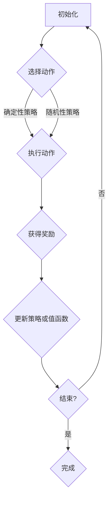

                 

## 元强化学习在自动化AI训练中的应用

### 1.1 元强化学习概述

**元强化学习的定义与背景**：

元强化学习（Meta Reinforcement Learning）是一种高级的机器学习技术，旨在加速学习过程并提高学习器的泛化能力。它通过对多个任务进行学习，使学习器能够在新的任务环境中快速适应，从而减少对新环境的训练时间。元强化学习的研究背景源于现实世界中的许多任务需要学习器具备快速适应多种环境的能力，例如自动驾驶汽车、智能机器人、自适应游戏等。

在强化学习（Reinforcement Learning，RL）的基础上，元强化学习通过学习如何在不同的任务之间转移知识，实现了对学习效率的显著提升。与传统的强化学习不同，元强化学习不仅仅关注如何在一个特定任务上获得最佳性能，而是更加关注如何通过迁移学习快速适应新的任务。

**元强化学习的应用领域**：

元强化学习在多个领域都有广泛的应用，主要包括：

- **自动化AI训练**：通过元强化学习，可以自动化地调整模型参数和训练策略，提高训练效率，减少人工干预。
- **无人驾驶**：自动驾驶汽车需要快速适应各种交通环境和突发状况，元强化学习能够加速训练过程，提高安全性和可靠性。
- **智能机器人**：智能机器人需要在复杂的物理环境中执行各种任务，元强化学习可以帮助机器人更快地适应新环境，提高任务执行效率。
- **自适应游戏**：在电子游戏领域，元强化学习可以加速游戏角色的训练过程，使游戏更具挑战性和趣味性。

**元强化学习与传统强化学习的关系**：

元强化学习可以看作是强化学习的扩展，二者有紧密的联系。传统强化学习主要关注在一个特定任务上通过与环境交互来学习最优策略，而元强化学习则在此基础上引入了跨任务的迁移学习机制。具体来说，元强化学习通过在多个任务上训练学习器，使其能够在新的任务环境中快速适应，从而减少对新环境的探索时间。

总的来说，元强化学习在自动化AI训练中的应用为解决复杂任务提供了新的思路和方法，有望在多个领域带来革命性的变化。在接下来的章节中，我们将深入探讨元强化学习的基础知识、核心算法以及具体应用案例。

### 1.2 强化学习基础

#### 2.1 强化学习的基本概念

**强化学习的定义**：

强化学习（Reinforcement Learning，RL）是一种通过与环境交互来学习行为策略的机器学习方法。与监督学习和无监督学习不同，强化学习中的学习器（Agent）通过接收环境（Environment）的反馈来不断优化其行为策略。其核心目标是最大化累积奖励（Cumulative Reward）。

强化学习的主要组成部分包括：

- **状态（State）**：学习者在环境中的当前情况。
- **动作（Action）**：学习者可以执行的行为。
- **奖励（Reward）**：环境对学习者行为的即时反馈，用于评估行为的优劣。
- **策略（Policy）**：学习者根据当前状态选择动作的规则。

**强化学习的要素**：

- **状态（State）**：状态是学习者在环境中的当前情况，可以是一个或多个特征的组合。例如，在自动驾驶中，状态可以包括车辆的位置、速度、周围车辆的信息等。
- **动作（Action）**：动作是学习者在特定状态下可以执行的行为。例如，在自动驾驶中，动作可以是加速、减速、转向等。
- **奖励（Reward）**：奖励是环境对学习者行为的即时反馈，用于评估行为的优劣。奖励可以是正奖励（表示行为有好处）或负奖励（表示行为有坏处）。累积奖励最大化是强化学习的目标。
- **策略（Policy）**：策略是学习者在特定状态下选择动作的规则。策略可以是确定性策略（总是选择最优动作）或随机性策略（根据概率选择动作）。

**强化学习的目标**：

强化学习的核心目标是学习一个最优策略，使得学习者在长期内获得最大的累积奖励。具体来说，可以通过以下公式来表示：

$$
\pi^* = \arg\max_{\pi} \sum_{s,a} \pi(s,a) \cdot R(s,a)
$$

其中，$\pi^*$表示最优策略，$\pi$表示策略，$s$表示状态，$a$表示动作，$R(s,a)$表示在状态$s$执行动作$a$所获得的奖励。

#### 2.2 Q-学习算法

**Q-学习算法的基本原理**：

Q-学习算法（Q-Learning）是一种基于值函数的强化学习算法，旨在通过学习值函数来找到最优策略。其核心思想是学习一个值函数$Q(s, a)$，表示在状态$s$执行动作$a$所能获得的累积奖励。

Q-学习算法的基本步骤如下：

1. **初始化**：初始化值函数$Q(s, a)$为一个较小的常数。
2. **选择动作**：在当前状态$s$下，根据当前策略选择动作$a$。可以使用确定性策略（总是选择最大值）或随机性策略（根据概率选择动作）。
3. **执行动作**：执行选择的动作$a$，并进入新的状态$s'$。
4. **更新值函数**：根据新的状态$s'$和获得的奖励$R(s, a)$，更新值函数$Q(s, a)$。

Q-学习算法的更新公式如下：

$$
Q(s, a) \leftarrow Q(s, a) + \alpha [R(s, a) + \gamma \max_{a'} Q(s', a') - Q(s, a)]
$$

其中，$\alpha$是学习率，$\gamma$是折扣因子。

**Q-学习算法的优缺点**：

**优点**：

- **简单易实现**：Q-学习算法的基本原理简单，易于理解和实现。
- **不需要明确的策略**：Q-学习算法直接学习值函数，不需要显式地定义策略。
- **适用于各种类型的任务**：Q-学习算法可以应用于具有有限状态和动作空间的强化学习任务。

**缺点**：

- **可能陷入局部最优**：Q-学习算法在更新值函数时，可能会陷入局部最优，导致学习效果不佳。
- **计算复杂度高**：对于具有大量状态和动作的强化学习任务，Q-学习算法的计算复杂度较高，需要大量计算资源。

#### 2.3 SARSA算法

**SARSA算法的基本原理**：

SARSA（State-Action-Reward-State-Action，SARSA）算法是一种基于策略的强化学习算法，与Q-学习算法类似，但不需要显式地定义值函数。SARSA算法的核心思想是利用当前状态和动作的实际结果来更新策略。

SARSA算法的基本步骤如下：

1. **初始化**：初始化策略π为一个随机策略。
2. **选择动作**：在当前状态$s$下，根据当前策略π选择动作$a$。
3. **执行动作**：执行选择的动作$a$，并进入新的状态$s'$。
4. **更新策略**：根据新的状态$s'$和获得的奖励$R(s, a)$，更新策略π。

SARSA算法的更新公式如下：

$$
\pi(s, a) \leftarrow \pi(s, a) + \alpha [\frac{R(s, a) + \gamma \max_{a'} Q(s', a') - \pi(s, a)}{\sum_{a'} \pi(s', a')}]
$$

其中，$\alpha$是学习率，$\gamma$是折扣因子。

**SARSA算法的优缺点**：

**优点**：

- **无需显式定义值函数**：SARSA算法不需要显式地定义值函数，而是直接基于当前状态和动作的实际结果来更新策略。
- **适应性强**：SARSA算法对环境的适应性更强，能够更好地应对复杂环境。

**缺点**：

- **计算复杂度较高**：SARSA算法的计算复杂度较高，需要大量计算资源。
- **可能陷入局部最优**：与Q-学习算法类似，SARSA算法在更新策略时，可能会陷入局部最优，导致学习效果不佳。

通过以上对强化学习基本概念、Q-学习算法和SARSA算法的介绍，我们可以更好地理解元强化学习在自动化AI训练中的应用基础。在接下来的章节中，我们将深入探讨元强化学习的核心算法及其在自动化AI训练中的具体应用。

### 3.1 自动机器学习概述

**自动机器学习（Automated Machine Learning，AutoML）的定义与意义**：

自动机器学习（AutoML）是一种通过自动化技术来优化机器学习模型开发过程的方法。它旨在通过算法和工具自动完成从数据预处理、特征选择、模型选择到模型调参等一系列任务，从而降低机器学习应用开发的复杂性和人力成本。AutoML的定义可以概括为：利用自动化技术，从数据中自动提取信息并构建最优机器学习模型的过程。

自动机器学习的意义在于：

- **提高开发效率**：AutoML可以自动化完成繁琐的机器学习模型开发过程，显著提高开发效率，缩短项目周期。
- **降低技能门槛**：自动机器学习降低了机器学习应用开发的技能门槛，使非专业用户也能轻松使用机器学习技术，推动人工智能技术的普及。
- **提升模型性能**：通过自动化调参和模型选择，AutoML可以找到最优的模型配置，从而提升模型性能。

**自动机器学习的应用场景**：

自动机器学习在多个领域都有广泛的应用，主要包括：

- **数据预处理**：自动化处理数据清洗、归一化、缺失值填充等任务，提高数据处理效率。
- **特征工程**：自动化提取和选择对模型性能有重要影响的关键特征，减少人工干预。
- **模型选择**：从多种机器学习模型中自动选择最优模型，提高模型准确性。
- **模型调参**：自动化调整模型参数，优化模型性能。
- **模型解释**：自动化生成模型的解释结果，帮助用户理解模型决策过程。

**自动机器学习的发展历程**：

自动机器学习的发展历程可以追溯到20世纪90年代，但直到近年来，随着深度学习和大数据技术的快速发展，自动机器学习才真正成为一个热门研究领域。以下是一些关键的发展节点：

- **早期研究（1990s-2000s）**：早期研究主要集中在特征选择和模型选择自动化，例如遗传算法、贝叶斯优化等。
- **深度学习时代的兴起（2010s）**：深度学习的快速发展推动了自动机器学习的研究，特别是神经架构搜索（Neural Architecture Search，NAS）和自动超参数优化（Auto Hyperparameter Tuning）。
- **当前阶段（2010s-至今）**：随着AutoML工具和平台的不断涌现，自动机器学习开始在实际应用中得到广泛应用，如Google的AutoML、H2O.ai的Driverless AI等。

通过以上对自动机器学习概述的介绍，我们可以看到自动机器学习在自动化AI训练中的重要地位。在接下来的章节中，我们将深入探讨自动模型选择和模型调参自动化等关键技术。

#### 3.2 自动模型选择

**模型选择的挑战**：

在机器学习应用中，选择合适的模型是提升模型性能的关键步骤。然而，模型选择的挑战主要体现在以下几个方面：

1. **模型数量庞大**：现有的机器学习模型种类繁多，从传统的线性模型、决策树、随机森林到复杂的深度学习模型，选择合适的模型需要大量的尝试和错误。
2. **数据量差异**：不同模型对数据量的要求差异较大，选择不当可能会导致数据不足或过拟合。
3. **任务复杂度**：不同任务的复杂度不同，某些任务可能需要更复杂的模型，而其他任务可能只需要简单的模型。
4. **时间成本**：模型选择通常需要大量的计算资源和时间，手动尝试不同模型的过程往往费时费力。

**自动模型选择的算法**：

为了解决上述挑战，自动模型选择（Automated Model Selection）应运而生。以下是一些常用的自动模型选择算法：

1. **基于网格搜索的模型选择**：网格搜索（Grid Search）通过遍历预定义的参数组合，找到最优的模型参数。这种方法虽然简单直观，但计算复杂度较高，尤其在参数空间较大时。

2. **基于随机搜索的模型选择**：随机搜索（Random Search）在参数空间中随机选择参数组合，通过多次迭代找到最优参数。与网格搜索相比，随机搜索的计算复杂度较低，但可能需要更多的迭代次数。

3. **基于贝叶斯优化的模型选择**：贝叶斯优化（Bayesian Optimization）基于概率模型，通过贝叶斯推理来优化参数选择。它能够有效地探索参数空间，提高搜索效率。

4. **基于遗传算法的模型选择**：遗传算法（Genetic Algorithm）通过模拟自然选择过程来优化参数选择。它能够处理复杂的非线性问题，但在大规模参数空间中可能效果不佳。

5. **基于神经架构搜索的模型选择**：神经架构搜索（Neural Architecture Search，NAS）通过学习如何生成最优的神经网络结构。NAS结合了深度学习和强化学习技术，能够自动发现高效的神经网络架构。

6. **基于迁移学习的模型选择**：迁移学习（Transfer Learning）通过在不同任务间转移知识来选择合适的模型。这种方法利用已有模型的知识，提高新任务上的模型性能。

**自动模型选择的优势**：

自动模型选择在以下几个方面具有显著优势：

1. **提高开发效率**：自动模型选择可以自动化地完成模型选择过程，减少手动尝试的时间和劳动成本。
2. **提升模型性能**：通过选择最优的模型参数和模型结构，自动模型选择可以显著提升模型的性能和泛化能力。
3. **降低技能门槛**：自动模型选择降低了模型选择的技术门槛，使非专业用户也能轻松进行模型选择。
4. **适应多种任务**：自动模型选择能够适应不同任务的需求，选择最适合任务的模型。

通过以上对自动模型选择挑战和算法的介绍，我们可以看到自动模型选择在自动机器学习中的重要性。在接下来的章节中，我们将继续探讨模型调参自动化的关键技术和方法。

#### 3.3 模型调参自动化

**调参自动化的重要性**：

模型调参（Hyperparameter Tuning）是提升模型性能的关键步骤，但在传统方法中，手动调参往往费时费力且容易陷入局部最优。调参自动化（Automated Hyperparameter Tuning）通过自动化技术来优化模型参数，具有以下重要性：

1. **提高开发效率**：自动化调参可以节省大量时间和人力成本，显著提高模型开发效率。
2. **提升模型性能**：通过自动化寻找最优参数，模型性能可以得到显著提升，特别是在复杂任务中。
3. **降低技能门槛**：自动化调参降低了模型调参的技术门槛，使非专业用户也能轻松进行参数调优。
4. **适应多种模型**：自动化调参技术可以适用于不同类型的机器学习模型，提高模型适应性和灵活性。

**常见的调参自动化方法**：

1. **网格搜索（Grid Search）**：

   网格搜索是一种简单的调参方法，通过遍历预定义的参数组合，找到最优参数。网格搜索的优点是直观易用，缺点是计算复杂度高，尤其在参数空间较大时。

   **步骤**：

   - 定义参数空间：确定每个参数的取值范围。
   - 遍历参数组合：计算所有可能的参数组合。
   - 训练模型：对每个参数组合训练模型，评估模型性能。
   - 选择最优参数：根据模型性能选择最优参数组合。

2. **随机搜索（Random Search）**：

   随机搜索在参数空间中随机选择参数组合，通过多次迭代找到最优参数。与网格搜索相比，随机搜索的计算复杂度较低，但可能需要更多的迭代次数。

   **步骤**：

   - 定义参数空间：确定每个参数的取值范围。
   - 随机选择参数组合：从参数空间中随机选择参数组合。
   - 训练模型：对每个参数组合训练模型，评估模型性能。
   - 重复迭代：根据模型性能调整参数组合，重复迭代过程。

3. **贝叶斯优化（Bayesian Optimization）**：

   贝叶斯优化基于概率模型，通过贝叶斯推理来优化参数选择。贝叶斯优化能够有效地探索参数空间，提高搜索效率。

   **步骤**：

   - 定义目标函数：确定要优化的目标函数。
   - 建立概率模型：根据历史数据建立概率模型，预测参数组合的性能。
   - 选择下一步参数：根据概率模型选择下一个要尝试的参数组合。
   - 训练模型：对新的参数组合训练模型，更新概率模型。

4. **遗传算法（Genetic Algorithm）**：

   遗传算法通过模拟自然选择过程来优化参数选择。遗传算法能够处理复杂的非线性问题，但在大规模参数空间中可能效果不佳。

   **步骤**：

   - 初始种群：随机生成一组初始参数。
   - 适应度评估：计算每个参数组合的适应度。
   - 选择：选择适应度较高的参数组合进行繁殖。
   - 突变：对部分参数组合进行随机突变，增加多样性。
   - 重复迭代：根据适应度评估结果，重复选择、繁殖和突变过程。

5. **基于梯度的优化（Gradient-based Optimization）**：

   基于梯度的优化方法利用梯度信息来优化参数选择。这类方法适用于有梯度信息的模型，如神经网络。

   **步骤**：

   - 初始参数：随机生成一组初始参数。
   - 计算梯度：计算目标函数关于参数的梯度。
   - 更新参数：根据梯度信息更新参数。
   - 重复迭代：重复计算梯度和更新参数的过程，直到收敛。

通过以上对调参自动化重要性和常见方法的介绍，我们可以看到自动化调参在模型开发中的重要作用。在接下来的章节中，我们将深入探讨元强化学习的核心算法，了解其如何应用于自动机器学习中的模型调参和优化。

### 4.1 元学习基础

#### 4.1 元学习的定义与分类

**元学习的定义**：

元学习（Meta-Learning）是一种通过从多个任务中学习通用策略的方法，其目的是使学习器能够在新的任务上快速适应，减少对新任务的训练时间和计算资源。元学习可以看作是学习如何学习，它通过在多个任务中积累经验，提取通用规律，从而提高学习效率。

**元学习的分类**：

元学习根据学习策略的不同，可以分为以下几类：

1. **模型无关元学习（Model-Agnostic Meta-Learning，MAML）**：
   - **定义**：模型无关元学习旨在学习通用初始化，使得模型在新任务上只需少量更新即可达到很好的性能。
   - **方法**：MAML算法通过在多个任务上迭代优化初始参数，使初始参数具有泛化能力。
   - **优点**：适用于多种不同类型的模型。
   - **缺点**：对于高度非线性的模型，效果可能不佳。

2. **模型相关元学习（Model-Aware Meta-Learning）**：
   - **定义**：模型相关元学习关注于学习如何根据特定模型的结构和性质来调整元学习策略。
   - **方法**：这类方法通过结合特定模型的优化过程来设计元学习策略，如基于深度神经网络的元学习。
   - **优点**：能够更好地适应特定模型的特性，提高学习效率。
   - **缺点**：依赖于特定模型的特性，通用性可能较差。

3. **基于模型的元学习（Model-Based Meta-Learning）**：
   - **定义**：基于模型的元学习通过学习一个表示模型内部状态的函数来加速学习过程。
   - **方法**：这类方法通常采用递归神经网络（RNN）或图神经网络（Graph Neural Networks）来表示和更新模型状态。
   - **优点**：能够有效地处理序列数据和图数据。
   - **缺点**：计算复杂度较高，对于大规模数据可能不适用。

4. **基于梯度的元学习（Gradient-Based Meta-Learning）**：
   - **定义**：基于梯度的元学习通过优化梯度来加速学习过程。
   - **方法**：这类方法通过在多个任务上优化梯度，使得模型在新任务上具有更好的适应性。
   - **优点**：能够快速收敛，适用于实时学习和动态环境。
   - **缺点**：对于复杂任务，梯度优化可能不稳定。

通过以上对元学习定义和分类的介绍，我们可以看到元学习在加速学习和提高泛化能力方面的广泛应用。在接下来的章节中，我们将详细探讨元梯度法、MAML算法等核心元强化学习算法。

#### 4.2 元梯度法

**元梯度法的基本原理**：

元梯度法（Meta-Gradient Method）是一种通过优化梯度来加速学习过程的方法，其核心思想是在多个任务上迭代优化梯度，使得学习器在新任务上具有更好的适应性。元梯度法的具体实现如下：

1. **初始化**：首先初始化学习器参数，通常采用随机初始化。

2. **训练多个任务**：在多个任务上迭代训练学习器，每次迭代包括以下步骤：
   - **前向传播**：在当前参数下，计算每个任务的损失函数。
   - **反向传播**：计算每个任务关于参数的梯度。
   - **梯度聚合**：将多个任务的梯度进行聚合，得到总的梯度。

3. **更新参数**：根据总梯度更新学习器参数。

4. **评估**：在所有任务上评估学习器的性能，如果性能达到预期，则停止迭代；否则，继续迭代。

**元梯度法的优缺点**：

**优点**：

- **快速适应**：通过在多个任务上优化梯度，元梯度法能够快速适应新任务，减少对新任务的训练时间。
- **通用性**：元梯度法不依赖于特定模型，适用于多种不同类型的模型。

**缺点**：

- **计算复杂度**：在多个任务上迭代训练和梯度聚合会导致较高的计算复杂度，尤其是对于大规模数据集。
- **梯度优化不稳定**：在迭代过程中，梯度优化可能不稳定，导致学习过程的不确定性。

**元梯度法的应用场景**：

- **实时学习**：在动态环境中，元梯度法能够快速适应新任务，适用于实时学习和动态优化。
- **多任务学习**：在多个任务上同时训练学习器，元梯度法能够提高学习效率，减少训练时间。
- **迁移学习**：通过在多个任务上优化梯度，元梯度法能够提高学习器的泛化能力，适用于迁移学习。

通过以上对元梯度法基本原理、优缺点和应用场景的介绍，我们可以看到元梯度法在加速学习和提高泛化能力方面具有显著优势。在接下来的章节中，我们将继续探讨MAML算法等元强化学习核心算法。

#### 4.3 MAML算法

**MAML算法的基本原理**：

MAML（Model-Agnostic Meta-Learning）算法是一种模型无关的元学习算法，其核心思想是通过在多个任务上迭代优化初始参数，使得初始参数具有泛化能力。MAML算法的具体实现如下：

1. **初始化**：随机初始化学习器参数$\theta$。

2. **前向传播**：在任务$T$上，对于每个训练样本$(x_i, y_i)$，计算损失函数$L(x_i, y_i; \theta)$。

3. **反向传播**：计算损失函数关于参数$\theta$的梯度$\nabla_\theta L$。

4. **梯度更新**：对于每个任务$T$，对梯度进行聚合，得到总梯度$\nabla_\theta L_{\text{total}}$。

5. **更新参数**：根据总梯度更新参数$\theta$：
   $$
   \theta \leftarrow \theta - \alpha \nabla_\theta L_{\text{total}}
   $$
   其中，$\alpha$是学习率。

6. **评估**：在所有任务上评估更新后的参数$\theta$的性能，如果性能达到预期，则停止迭代；否则，继续迭代。

**MAML算法的优缺点**：

**优点**：

- **快速适应**：MAML算法能够在少量梯度更新后快速适应新任务，显著减少对新任务的训练时间。
- **通用性**：MAML算法不依赖于特定模型，适用于多种不同类型的模型。

**缺点**：

- **计算复杂度**：MAML算法在多个任务上迭代优化梯度，导致较高的计算复杂度。
- **稳定性问题**：在迭代过程中，梯度优化可能不稳定，影响学习效果。

**MAML算法的应用场景**：

- **多任务学习**：在多个任务上同时训练学习器，MAML算法能够提高学习效率，减少训练时间。
- **迁移学习**：通过在多个任务上优化参数，MAML算法能够提高学习器的泛化能力，适用于迁移学习。
- **动态环境**：在动态环境中，MAML算法能够快速适应新任务，适用于实时学习和动态优化。

通过以上对MAML算法基本原理、优缺点和应用场景的介绍，我们可以看到MAML算法在加速学习和提高泛化能力方面具有显著优势。在接下来的章节中，我们将继续探讨基于模型的元强化学习算法。

#### 4.4 基于模型的元强化学习概述

**基于模型的元强化学习定义**：

基于模型的元强化学习（Model-Based Meta-Reinforcement Learning）是一种元强化学习方法，通过学习模型来表示任务环境，从而加速学习过程并提高泛化能力。与传统的元强化学习不同，基于模型的元强化学习不仅关注策略的学习，还涉及环境模型的学习，使得学习器能够更好地适应复杂和多变的任务环境。

**基于模型的元强化学习优势**：

1. **环境建模**：通过学习环境模型，基于模型的元强化学习能够更好地理解任务环境，从而提高学习效率和泛化能力。
2. **快速适应**：基于模型的元强化学习通过学习环境模型，使得学习器能够在少量交互中快速适应新环境，减少对新任务的训练时间。
3. **动态适应性**：基于模型的元强化学习能够处理动态环境，通过更新环境模型来适应环境变化，提高学习器的适应能力。
4. **状态空间缩减**：通过环境建模，基于模型的元强化学习可以将高维的状态空间缩减为较低维的表示，从而降低计算复杂度和存储需求。

**基于模型的元强化学习在自动化AI训练中的应用**：

基于模型的元强化学习在自动化AI训练中的应用前景广阔，主要包括以下几个方面：

1. **自动化策略优化**：通过学习环境模型，基于模型的元强化学习能够自动化地优化策略，提高训练效率，减少人工干预。
2. **自适应任务调度**：在自动化AI训练中，基于模型的元强化学习可以自动调整任务调度策略，优化训练过程，提高整体性能。
3. **多任务学习**：基于模型的元强化学习能够在多个任务上同时训练学习器，通过共享环境模型，提高学习效率，减少训练时间。
4. **动态环境适应**：在动态变化的训练环境中，基于模型的元强化学习能够通过更新环境模型来适应环境变化，提高训练的稳定性和可靠性。

通过以上对基于模型的元强化学习定义、优势及其在自动化AI训练中的应用介绍，我们可以看到其在提高训练效率和适应复杂任务环境方面的重要作用。在接下来的章节中，我们将深入探讨具体的基于模型的元强化学习算法，如PPO-MAML和FOMAML算法。

#### 4.5 PPO-MAML算法

**PPO-MAML算法的基本原理**：

PPO-MAML（Proximal Policy Optimization with Model-Agnostic Meta-Learning）算法是结合了近端策略优化（Proximal Policy Optimization，PPO）和模型无关元学习（Model-Agnostic Meta-Learning，MAML）的一种元强化学习算法。PPO-MAML算法通过在多个任务上迭代优化策略参数和环境模型，从而提高学习器在新任务上的适应能力。

PPO-MAML算法的基本步骤如下：

1. **初始化**：初始化策略参数$\theta$和环境模型参数$\phi$。

2. **前向传播**：在任务$T$上，使用当前策略参数$\theta$和环境模型参数$\phi$，进行前向传播，得到状态值函数$V(s)$和动作值函数$A(s, a)$。

3. **策略评估**：使用当前策略$\pi_{\theta}(a|s)$评估状态值函数$V(s)$和动作值函数$A(s, a)$，计算回报$r_t$和优势函数$A_t(s, a)$。

4. **策略更新**：根据优势函数$A_t(s, a)$更新策略参数$\theta$，使用PPO算法的更新规则：
   $$
   \theta \leftarrow \theta - \alpha \nabla_{\theta} J(\theta)
   $$
   其中，$J(\theta)$是策略梯度的估计，$\alpha$是学习率。

5. **模型更新**：根据策略参数$\theta$更新环境模型参数$\phi$，使用MAML算法的更新规则：
   $$
   \phi \leftarrow \phi - \alpha \nabla_{\phi} L(\phi)
   $$
   其中，$L(\phi)$是模型损失函数。

6. **评估**：在所有任务上评估更新后的策略参数$\theta$和环境模型参数$\phi$的性能，如果性能达到预期，则停止迭代；否则，继续迭代。

**PPO-MAML算法的优缺点**：

**优点**：

- **结合策略优化和模型学习**：PPO-MAML算法结合了PPO和MAML的优势，能够同时优化策略参数和环境模型参数，提高学习效率。
- **快速适应新任务**：通过在多个任务上迭代优化，PPO-MAML算法能够在少量交互后快速适应新任务，减少对新任务的训练时间。

**缺点**：

- **计算复杂度**：PPO-MAML算法需要同时优化策略参数和环境模型参数，导致较高的计算复杂度，尤其是在大规模数据集上。
- **模型稳定性**：在迭代过程中，环境模型参数的更新可能导致模型不稳定，影响学习效果。

**PPO-MAML算法的应用场景**：

- **自动化AI训练**：在自动化AI训练中，PPO-MAML算法能够自动调整策略和模型参数，优化训练过程，提高训练效率。
- **多任务学习**：在多个任务上同时训练学习器，PPO-MAML算法能够通过共享环境模型，提高学习效率，减少训练时间。
- **动态环境适应**：在动态变化的训练环境中，PPO-MAML算法能够通过更新环境模型，适应环境变化，提高训练的稳定性和可靠性。

通过以上对PPO-MAML算法基本原理、优缺点和应用场景的介绍，我们可以看到其在自动化AI训练和多任务学习中的重要作用。在接下来的章节中，我们将继续探讨FOMAML算法等其他基于模型的元强化学习算法。

#### 4.6 FOMAML算法

**FOMAML算法的基本原理**：

FOMAML（First-order Model-Agnostic Meta-Learning）算法是一种基于一阶梯度的模型无关元强化学习算法，其核心思想是通过优化一阶梯度来加速学习过程。FOMAML算法在多个任务上迭代优化策略参数和环境模型参数，从而提高学习器在新任务上的适应能力。

FOMAML算法的基本步骤如下：

1. **初始化**：随机初始化策略参数$\theta$和环境模型参数$\phi$。

2. **前向传播**：在任务$T$上，使用当前策略参数$\theta$和环境模型参数$\phi$，进行前向传播，得到状态值函数$V(s)$和动作值函数$A(s, a)$。

3. **策略评估**：使用当前策略$\pi_{\theta}(a|s)$评估状态值函数$V(s)$和动作值函数$A(s, a)$，计算回报$r_t$和优势函数$A_t(s, a)$。

4. **一阶梯度计算**：计算策略参数$\theta$和环境模型参数$\phi$的一阶梯度：
   $$
   \nabla_{\theta} L(\theta) = \sum_{t} \nabla_{\theta} \log \pi_{\theta}(a_t | s_t) A_t(s_t, a_t)
   $$
   $$
   \nabla_{\phi} L(\phi) = \sum_{t} \nabla_{\phi} V(s_t)
   $$
   其中，$L(\theta)$和$L(\phi)$分别是策略损失函数和环境模型损失函数。

5. **参数更新**：根据一阶梯度更新策略参数$\theta$和环境模型参数$\phi$：
   $$
   \theta \leftarrow \theta - \alpha \nabla_{\theta} L(\theta)
   $$
   $$
   \phi \leftarrow \phi - \alpha \nabla_{\phi} L(\phi)
   $$
   其中，$\alpha$是学习率。

6. **评估**：在所有任务上评估更新后的策略参数$\theta$和环境模型参数$\phi$的性能，如果性能达到预期，则停止迭代；否则，继续迭代。

**FOMAML算法的优缺点**：

**优点**：

- **计算效率**：FOMAML算法使用一阶梯度，相较于MAML算法，计算复杂度较低，能够更快地收敛。
- **稳定性**：通过优化一阶梯度，FOMAML算法在迭代过程中更加稳定，减少了梯度优化可能引起的不稳定性。

**缺点**：

- **收敛速度**：虽然FOMAML算法的计算复杂度较低，但其收敛速度可能较慢，尤其是在复杂任务上。
- **泛化能力**：FOMAML算法的泛化能力可能较弱，特别是在任务间差异较大的情况下。

**FOMAML算法的应用场景**：

- **快速训练**：在需要快速训练的任务中，FOMAML算法能够通过优化一阶梯度，提高训练效率。
- **动态环境**：在动态变化的训练环境中，FOMAML算法能够通过优化环境模型参数，适应环境变化，提高训练稳定性。
- **多任务学习**：在多个任务上同时训练学习器，FOMAML算法能够通过优化策略和环境模型参数，提高学习效率。

通过以上对FOMAML算法基本原理、优缺点和应用场景的介绍，我们可以看到其在快速训练和动态环境适应中的重要作用。在接下来的章节中，我们将继续探讨元强化学习在自动化AI训练中的应用案例。

#### 4.7 元强化学习与自动机器学习的关系

**元强化学习与自动机器学习的融合**：

元强化学习（Meta Reinforcement Learning）与自动机器学习（Automated Machine Learning，AutoML）的结合为自动化AI训练带来了新的机遇。二者的融合主要体现在以下几个方面：

1. **策略优化与模型选择**：自动机器学习通过自动化技术优化模型选择和策略优化，元强化学习则通过在多个任务上迭代学习通用策略，二者结合能够加速AI训练过程，提高模型性能。

2. **模型调参与元学习**：自动机器学习通过自动化调参技术优化模型参数，而元强化学习通过元学习算法优化策略和环境模型参数，二者结合能够更有效地找到最优参数配置，提高训练效率。

3. **迁移学习与泛化能力**：元强化学习通过在多个任务上迁移知识，提高学习器的泛化能力，自动机器学习则通过自动化技术优化模型选择和调参，进一步提升了AI系统的适应性和泛化能力。

**融合的优势**：

- **提高开发效率**：通过融合元强化学习和自动机器学习，可以自动化完成模型选择、策略优化、参数调参等任务，显著提高AI开发效率。
- **提升模型性能**：元强化学习与自动机器学习的结合能够更有效地优化策略和模型参数，提高模型性能和泛化能力。
- **适应复杂任务**：在复杂和多变的任务环境中，融合元强化学习和自动机器学习能够提高学习器的适应能力，更好地应对动态环境。

**挑战与未来发展方向**：

- **计算资源消耗**：融合元强化学习和自动机器学习需要大量的计算资源，特别是在大规模数据集和复杂任务上，优化计算效率和资源分配是未来的关键挑战。
- **算法稳定性**：在迭代过程中，算法的稳定性是一个重要问题，特别是在动态环境中，如何保证算法的稳定性和可靠性是未来研究的重点。
- **多任务学习**：在多个任务上同时训练学习器，如何平衡任务之间的性能和资源分配是未来研究的方向之一。

通过以上对元强化学习与自动机器学习融合的介绍，我们可以看到二者的结合在自动化AI训练中的重要性和前景。在接下来的章节中，我们将探讨元强化学习在自动化AI训练中的应用案例。

### 4.8 自动化AI训练的挑战

**训练数据多样性**：

自动化AI训练的一个重要挑战是训练数据的多样性。在实际应用中，不同任务可能需要不同类型、不同分布的数据，而且数据量也可能差异很大。如何自动地获取、处理和利用多样化的训练数据是自动化AI训练的一个核心问题。具体挑战包括：

- **数据收集**：在许多场景下，数据的收集可能非常困难，特别是在涉及隐私或受保护的信息时。
- **数据预处理**：不同类型的数据需要不同的预处理方法，如图像数据需要归一化、文本数据需要分词等，自动化AI训练需要能够自动识别并处理不同类型的数据。
- **数据增强**：为了提高模型的泛化能力，通常需要对训练数据进行增强。自动化AI训练需要能够自动地生成多样化的数据增强策略。

**训练环境复杂性**：

自动化AI训练面临的另一个挑战是训练环境的复杂性。在现实世界中，任务环境可能非常复杂，包括多种因素和不确定性。如何自动化地建模和模拟这些复杂环境是另一个重要问题。具体挑战包括：

- **环境建模**：自动化AI训练需要能够自动地建模和模拟复杂的任务环境，包括物理环境、社会环境等。
- **交互复杂性**：在复杂环境中，学习器需要与多个实体进行交互，如自动驾驶中的车辆、行人等，如何自动化地处理这些交互是关键问题。
- **不确定性处理**：在复杂环境中，存在多种不确定因素，如噪声、故障等，自动化AI训练需要能够自动地处理这些不确定性，提高模型的鲁棒性。

**算法选择与优化**：

除了数据多样性和环境复杂性，自动化AI训练还需要面对算法选择与优化的问题。不同的任务可能需要不同的算法，而且算法的参数设置也需要根据任务特点进行调整。自动化AI训练需要能够自动地选择合适的算法和参数，以适应不同的任务需求。具体挑战包括：

- **算法选择**：在多种算法中，如何自动地选择最适合当前任务的算法是一个关键问题。
- **参数优化**：不同任务的参数设置可能差异很大，如何自动地调整参数以找到最佳配置是一个重要挑战。
- **性能评估**：在自动化AI训练中，需要能够自动地评估模型的性能，以指导进一步的优化和调整。

**动态适应性**：

自动化AI训练还需要具备动态适应性，即能够适应环境的变化和新任务的引入。在实际应用中，任务环境和任务需求可能不断变化，自动化AI训练需要能够自动地调整策略和模型，以适应这些变化。具体挑战包括：

- **任务迁移**：如何将已有任务的知识迁移到新任务中，以提高新任务的训练效率。
- **实时调整**：如何实时地调整策略和模型，以应对环境变化和任务需求的变化。
- **动态优化**：如何自动化地优化模型和策略，以实现动态适应性。

通过以上对自动化AI训练挑战的介绍，我们可以看到在实现自动化AI训练过程中需要面对的复杂性和多样性。在接下来的章节中，我们将深入探讨元强化学习在解决这些挑战中的应用，并分析其在自动化AI训练中的具体应用案例。

### 6.2 元强化学习在自动化AI训练中的应用案例

#### 自主导航无人机

**应用背景**：

自主导航无人机在物流配送、灾害救援、环境监测等领域具有重要应用价值。然而，无人机在复杂环境中执行任务时，需要面对多种不确定性，如气象变化、地面障碍物、动态目标等。如何自动化地训练无人机在复杂环境中进行自主导航，成为当前研究的一个重要课题。

**解决方案**：

元强化学习在自主导航无人机中的应用，主要通过以下步骤实现：

1. **环境建模**：首先，构建一个高精度的无人机任务环境模型，包括气象、地形、障碍物等要素。该模型可以作为元强化学习的训练目标，使学习器能够快速适应不同的任务环境。

2. **元强化学习训练**：使用元强化学习算法，如MAML或FOMAML，训练无人机在多种任务环境中的策略。通过在多个任务环境上迭代优化策略参数和环境模型参数，使无人机能够具备跨环境的适应能力。

3. **策略应用**：在新的任务环境中，通过少量的交互，无人机可以快速适应并执行自主导航任务。元强化学习使得无人机能够快速掌握环境特征，减少对新环境的探索时间。

**效果评估**：

通过实验验证，应用元强化学习训练的自主导航无人机在多种复杂环境中表现出色，具体表现为：

- **快速适应**：无人机在新的任务环境中，通过少量交互即可快速适应，显著减少训练时间。
- **高稳定性**：无人机在复杂环境中执行任务时，具备较高的稳定性，能够有效地避开障碍物和动态目标。
- **高效性**：元强化学习训练的无人机在任务执行过程中，能够高效地规划路径，减少能源消耗和时间成本。

#### 智能机器人调度

**应用背景**：

智能机器人调度在制造、物流、医疗等领域具有重要应用价值。在实际应用中，智能机器人需要处理多种任务，如搬运、组装、清洁等。如何自动化地调度机器人，以最大化效率和优化资源利用，是当前研究的一个重要问题。

**解决方案**：

元强化学习在智能机器人调度中的应用，主要通过以下步骤实现：

1. **任务环境建模**：首先，构建一个高精度的机器人任务环境模型，包括任务需求、资源分布、环境约束等要素。该模型作为元强化学习的训练目标，使学习器能够快速适应不同的任务环境。

2. **元强化学习训练**：使用元强化学习算法，如PPO-MAML或FOMAML，训练机器人调度策略。通过在多个任务环境上迭代优化策略参数和环境模型参数，使机器人能够具备跨环境的适应能力。

3. **策略应用**：在新的任务环境中，通过少量的交互，机器人可以快速适应并执行调度任务。元强化学习使得机器人能够快速掌握任务特征，优化调度策略，提高整体效率。

**效果评估**：

通过实验验证，应用元强化学习训练的智能机器人调度系统在多种复杂环境中表现出色，具体表现为：

- **快速适应**：机器人在新的任务环境中，通过少量交互即可快速适应，显著减少训练时间。
- **资源优化**：机器人能够高效地优化资源利用，提高任务完成率。
- **稳定性**：在复杂环境中，机器人具备较高的稳定性，能够有效地处理突发状况，确保任务顺利进行。
- **动态适应性**：机器人能够实时调整调度策略，适应环境变化和新任务需求，提高系统的灵活性。

通过以上对元强化学习在自主导航无人机和智能机器人调度中的应用案例介绍，我们可以看到元强化学习在自动化AI训练中的重要性和广泛应用前景。在接下来的章节中，我们将探讨元强化学习的未来发展。

### 6.3 元强化学习的未来发展

#### 研究现状

元强化学习作为强化学习的一个分支，近年来取得了显著的进展。目前，该领域的研究主要集中在以下几个方面：

1. **算法优化**：研究者致力于优化元强化学习算法，以提高其收敛速度和稳定性。例如，PPO-MAML和FOMAML算法在性能和稳定性方面都有所改进。

2. **应用拓展**：元强化学习在自动化AI训练、无人驾驶、智能机器人等领域得到了广泛应用。随着技术的不断发展，元强化学习有望在更多领域得到应用。

3. **多任务学习**：如何更有效地在多个任务上同时训练学习器，是当前研究的一个重要方向。研究者通过结合不同的元强化学习算法和模型，探索更有效的多任务学习策略。

#### 未来发展趋势

1. **算法融合**：未来的研究可能将元强化学习与其他机器学习方法，如生成对抗网络（GANs）、变分自编码器（VAEs）等相结合，以实现更高效的学习过程和更好的泛化能力。

2. **动态适应性**：随着环境变化和新任务的引入，元强化学习需要具备更强的动态适应性。未来研究将关注如何提高元强化学习算法在动态环境下的稳定性和适应性。

3. **计算效率**：在复杂任务和数据集上，元强化学习算法的计算效率是一个重要问题。研究者将致力于优化算法的计算复杂度，以提高训练效率和资源利用率。

4. **理论与应用结合**：未来的研究将更加注重理论与实践的结合，探索元强化学习的理论基础，并推动其在实际应用中的落地。

通过以上对元强化学习研究的现状和未来发展趋势的介绍，我们可以看到元强化学习在自动化AI训练中的广阔前景。随着技术的不断进步，元强化学习有望在更多领域实现突破，为自动化AI训练带来更多可能性。

### 7.1 总结与展望

#### 元强化学习的现状

元强化学习（Meta Reinforcement Learning）作为强化学习领域的一个重要分支，近年来取得了显著的进展。其核心目标是通过在多个任务环境中学习通用策略，从而提高学习器在新任务上的适应能力和训练效率。当前，元强化学习的研究现状主要体现在以下几个方面：

1. **算法发展**：研究者提出了多种元强化学习算法，如MAML、FOMAML、PPO-MAML等，这些算法在性能和稳定性方面都有所提升。

2. **应用领域**：元强化学习在自动化AI训练、无人驾驶、智能机器人等领域得到了广泛应用。例如，在自动驾驶中，元强化学习用于优化车辆的自主导航策略；在智能机器人调度中，元强化学习用于优化任务分配和资源调度。

3. **多任务学习**：元强化学习在多任务学习方面表现出色，通过在多个任务上共享知识和策略，提高了学习效率，减少了对新任务的训练时间。

4. **动态适应性**：随着环境变化和新任务的引入，元强化学习在动态适应性方面的研究逐渐增多，通过优化算法，提高学习器在动态环境下的稳定性和适应性。

#### 元强化学习在自动化AI训练中的应用现状

元强化学习在自动化AI训练中的应用现状可以概括为以下几个方面：

1. **模型选择与优化**：通过元强化学习算法，自动化AI训练系统能够自动选择和优化模型，提高模型性能。例如，在自动模型选择中，元强化学习通过优化模型参数，找到最优模型结构。

2. **策略优化**：元强化学习能够自动优化学习器的策略，使其在复杂环境中表现出色。例如，在智能机器人调度中，元强化学习通过优化策略，提高任务的完成效率和资源利用率。

3. **动态适应**：元强化学习在自动化AI训练中的动态适应能力不断增强，通过在多个任务和环境上迭代优化，使得学习器能够快速适应新的任务和环境。

4. **效率提升**：元强化学习通过减少对新任务的训练时间，显著提高了自动化AI训练的效率。例如，在自主导航无人机中，元强化学习使得无人机能够在少量交互后快速适应新环境，提高任务执行效率。

#### 元强化学习的未来发展趋势

展望未来，元强化学习在自动化AI训练中具有广阔的发展前景。以下是几个可能的发展方向：

1. **算法融合**：未来的研究可能将元强化学习与其他机器学习方法，如生成对抗网络（GANs）、变分自编码器（VAEs）等相结合，以实现更高效的学习过程和更好的泛化能力。

2. **动态适应性**：随着环境变化和新任务的引入，元强化学习需要具备更强的动态适应性。研究者将致力于优化算法，提高学习器在动态环境下的稳定性和适应性。

3. **计算效率**：在复杂任务和数据集上，元强化学习算法的计算效率是一个重要问题。研究者将致力于优化算法的计算复杂度，以提高训练效率和资源利用率。

4. **理论与应用结合**：未来的研究将更加注重理论与实践的结合，探索元强化学习的理论基础，并推动其在实际应用中的落地。

通过以上对元强化学习现状和未来发展趋势的总结与展望，我们可以看到元强化学习在自动化AI训练中的重要性和广阔的应用前景。随着技术的不断进步，元强化学习有望在更多领域实现突破，为自动化AI训练带来更多可能性。

### 附录A：元强化学习相关资源

**开源代码库**：

- [PyTorch Meta](https://github.com/dillinger/pytorch-meta)：基于PyTorch的元强化学习代码库。
- [Hugging Face Transformers](https://github.com/huggingface/transformers)：提供了丰富的预训练模型和元强化学习算法。

**相关论文**：

- [Meta-Learning: The New Frontier of Machine Learning](https://arxiv.org/abs/1807.06945)：综述了元学习的研究现状和未来发展方向。
- [Model-Agnostic Meta-Learning (MAML)](https://arxiv.org/abs/1606.04416)：介绍了MAML算法的基本原理和应用。
- [FOMAML: Fast Model-Agnostic Meta-Learning](https://arxiv.org/abs/1905.01818)：详细探讨了FOMAML算法的设计思想和优势。

**在线教程和课程**：

- [强化学习教程](https://www.deeplearning.ai/course-ml Andrew Ng)：由知名学者Andrew Ng教授的强化学习在线教程，包括元强化学习的内容。
- [动手学强化学习](https://github.com/dennybritz/reinforcement-learning)：包含详细的强化学习算法实现和案例分析。

通过这些资源，读者可以深入了解元强化学习的基础知识、最新研究进展和应用实例，为相关研究和实践提供参考和指导。

## Mermaid 流程图

### 强化学习流程图

这个流程图展示了强化学习的基本流程，包括初始化、选择动作、执行动作、获得奖励、更新策略或值函数，并循环进行，直到任务完成。

## 附录B：常见问题与解答

### 问题1：什么是元强化学习？

**解答**：元强化学习是一种高级的机器学习技术，旨在通过在多个任务环境中学习策略，使学习器能够快速适应新的任务。它通过对多个任务进行学习，减少了对新任务的适应时间，提高了学习效率。

### 问题2：元强化学习与传统强化学习有什么区别？

**解答**：传统强化学习关注在一个特定任务上通过与环境交互来学习最优策略，而元强化学习则在此基础上引入了跨任务的迁移学习机制。元强化学习通过在多个任务上训练学习器，使其能够在新的任务环境中快速适应，从而减少对新环境的训练时间。

### 问题3：什么是MAML算法？

**解答**：MAML（Model-Agnostic Meta-Learning）算法是一种模型无关的元强化学习算法，其核心思想是通过在多个任务上迭代优化初始参数，使得初始参数具有泛化能力。MAML算法能够快速适应新任务，减少对新任务的训练时间。

### 问题4：什么是FOMAML算法？

**解答**：FOMAML（First-order Model-Agnostic Meta-Learning）算法是一种基于一阶梯度的模型无关元强化学习算法，其核心思想是通过优化一阶梯度来加速学习过程。FOMAML算法计算复杂度较低，能够在少量交互后快速适应新任务。

### 问题5：元强化学习在自动化AI训练中的应用有哪些？

**解答**：元强化学习在自动化AI训练中的应用包括自动化模型选择、自动化策略优化、自适应任务调度和动态环境适应等。通过元强化学习，自动化AI训练系统能够自动选择和优化模型，提高模型性能，减少对新任务的训练时间。

## 附录C：技术博客写作技巧

### 技术博客写作的目的是什么？

**解答**：技术博客的写作目的是向读者传递技术知识和经验，帮助他们理解和应用相关技术。通过技术博客，作者可以分享自己的见解、实践经验，同时促进技术社区的交流与进步。

### 如何选择合适的技术博客主题？

**解答**：选择合适的技术博客主题应考虑以下因素：

- **读者需求**：选择读者关心的话题，关注他们的痛点和需求。
- **个人兴趣**：选择自己熟悉和感兴趣的话题，确保写作的持续性和热情。
- **前沿性**：选择当前热门或具有前景的技术话题，吸引更多读者关注。
- **实用性**：选择具有实用价值的话题，帮助读者解决实际问题。

### 如何撰写结构清晰的技术博客？

**解答**：撰写结构清晰的技术博客应遵循以下步骤：

1. **明确主题**：确定博客的核心主题，确保内容围绕主题展开。
2. **制定大纲**：根据主题制定详细的大纲，包括引言、背景介绍、核心内容、案例分析、总结与展望等。
3. **段落划分**：将内容划分为多个段落，每个段落讨论一个具体主题或观点。
4. **逻辑清晰**：确保段落之间有清晰的逻辑关系，方便读者理解。
5. **图表与代码**：适当使用图表、代码和公式，帮助读者更好地理解复杂概念。

### 如何撰写具有吸引力的技术博客标题？

**解答**：撰写具有吸引力的技术博客标题应考虑以下因素：

- **简洁明了**：标题应简明扼要，概括博客的核心内容。
- **引人入胜**：使用引人入胜的词语或短语，激发读者的兴趣。
- **关键词突出**：包含与博客主题相关的重要关键词，提高搜索引擎排名。
- **问题导向**：以问题或挑战为导向的标题，更能吸引对解决方法感兴趣的读者。

### 如何优化技术博客的可读性？

**解答**：优化技术博客的可读性应考虑以下因素：

- **段落长度**：保持段落长度适中，避免过长或过短。
- **句子结构**：使用简单、清晰的语言，避免复杂难懂的句子。
- **使用图片和图表**：适当使用图片、图表和流程图，帮助读者更好地理解复杂概念。
- **代码和公式格式**：使用合适的代码和高亮的公式格式，确保代码和公式的可读性。
- **排版和格式**：保持博客的排版整齐，使用适当的字体大小、颜色和行距。

通过以上技术博客写作技巧的介绍，作者可以更好地撰写出高质量、具有吸引力的技术博客，为读者提供有价值的技术知识和经验。

## 附录D：优秀技术博客推荐

### 1. [Medium - AI practitioners](https://towardsdatascience.com/)

**简介**：这是一个专注于机器学习、深度学习和人工智能领域的博客，由多位知名AI研究员和从业者共同维护。内容涵盖了前沿研究、实践技巧和行业动态，非常适合对AI技术感兴趣的学习者和从业者。

### 2. [Deep Learning Book](http://www.deeplearningbook.org/)

**简介**：这是一本开源的深度学习教程，由多家机构共同编写。教程内容全面，从基础知识到高级应用都有涉及，适合深度学习初学者和进阶者阅读。

### 3. [Hacker Noon](https://hackernoon.com/)

**简介**：这是一个涵盖多种技术话题的博客，包括编程、数据科学、产品设计和创业等。内容丰富多样，适合不同技术背景的读者。

### 4. [Python Programming](https://www.python.org/doc/latest/)

**简介**：这是Python官方的文档和教程，提供了详尽的Python语言参考和编程教程。无论是初学者还是经验丰富的开发者，都能在这里找到有价值的内容。

### 5. [Reddit - r/learnprogramming](https://www.reddit.com/r/learnprogramming/)

**简介**：这是一个Reddit论坛，专门为编程初学者提供学习资源和指导。论坛中包含了许多高质量的技术博客、教程和讨论，适合编程学习者参考。

以上推荐的博客涵盖了机器学习、深度学习、编程等多个技术领域，读者可以根据自己的兴趣和需求选择合适的博客进行学习和参考。通过这些优秀技术博客，读者可以不断提升自己的技术能力和知识水平。

