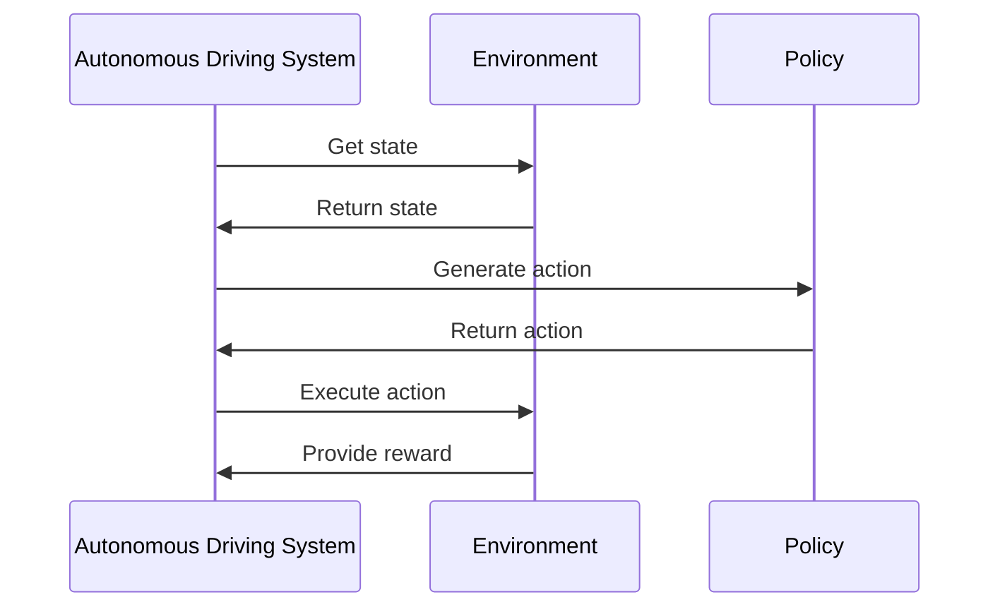
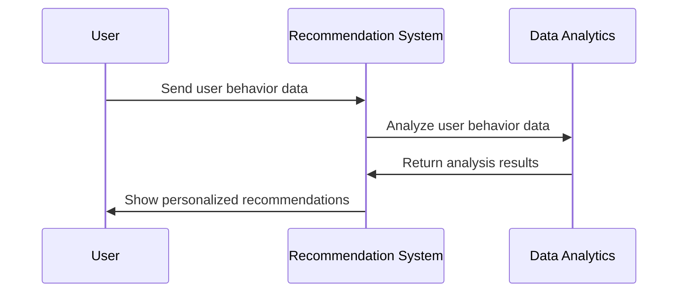
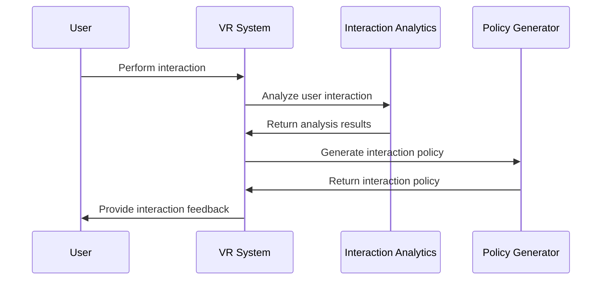

                 

## 元强化学习在自适应推理策略中的应用

### 关键词：元强化学习，自适应推理策略，算法原理，数学模型，项目实战

> 摘要：本文深入探讨了元强化学习在自适应推理策略中的应用。首先，我们介绍了元强化学习的基本概念、背景和重要性。随后，详细讲解了元强化学习的核心算法，包括基于模型迭代、策略优化和价值函数优化的不同算法。接着，我们讨论了自适应推理策略的基本原理和实现方法。在数学模型部分，我们用LaTeX公式详细推导了强化学习、元强化学习和自适应推理策略的相关数学公式。文章还通过实际项目实战，展示了元强化学习在自适应推理策略中的具体应用。最后，我们总结了项目效果，并提出了未来研究和应用的展望。

---

### 《元强化学习在自适应推理策略中的应用》目录大纲

## 第一部分：引论

### 第1章：元强化学习概述

- 1.1 元强化学习的背景与意义
- 1.2 元强化学习的定义与基本原理
- 1.3 元强化学习的主要类型
- 1.4 元强化学习的应用场景

### 第2章：强化学习与自适应推理策略

- 2.1 强化学习的基本概念
- 2.2 自适应推理策略的定义与原理
- 2.3 强化学习与自适应推理策略的关系

## 第二部分：核心算法原理

### 第3章：元强化学习的核心算法

- 3.1 基于模型迭代的元强化学习算法
  - 3.1.1 Model-Agnostic Meta-Learning (MAML)
  - 3.1.2 Reptile
- 3.2 基于策略优化的元强化学习算法
  - 3.2.1 PPO (Proximal Policy Optimization)
  - 3.2.2 A2C (Asynchronous Advantage Actor-Critic)
- 3.3 基于价值函数优化的元强化学习算法
  - 3.3.1 Q-MAML
  - 3.3.2 REPS (Riemannian Optimization for Policy Search)

### 第4章：自适应推理策略的算法实现

- 4.1 自适应推理策略的核心概念
- 4.2 基于梯度下降的自适应推理策略
- 4.3 基于神经网络的自适应推理策略
- 4.4 基于深度增强学习的自适应推理策略

## 第三部分：数学模型与公式

### 第5章：元强化学习的数学模型

- 5.1 强化学习的数学模型
  - 5.1.1 MDP (Markov Decision Process)
  - 5.1.2 REINFORCE算法
- 5.2 元强化学习的数学模型
  - 5.2.1 Meta-Representation
  - 5.2.2 Meta-Update
- 5.3 自适应推理策略的数学模型
  - 5.3.1 基于梯度的自适应策略更新
  - 5.3.2 基于神经网络的策略优化

### 第6章：自适应推理策略的数学公式

- 6.1 梯度下降法公式推导
  - 6.1.1 梯度下降算法
  - 6.1.2 梯度下降法在自适应推理策略中的应用
- 6.2 神经网络优化公式推导
  - 6.2.1 前向传播
  - 6.2.2 反向传播

## 第四部分：项目实战

### 第7章：元强化学习在自适应推理策略中的应用

- 7.1 项目背景与目标
- 7.2 系统架构设计
- 7.3 数据预处理与处理
- 7.4 算法实现与优化
  - 7.4.1 模型训练
  - 7.4.2 模型评估与调试
- 7.5 项目效果评估
- 7.6 项目总结与展望

## 附录

### 第8章：元强化学习与自适应推理策略资源推荐

- 8.1 开源框架与工具
- 8.2 经典论文与资源
- 8.3 进阶阅读推荐

### 第9章：元强化学习与自适应推理策略应用案例

- 9.1 案例一：基于元强化学习的自动驾驶策略
- 9.2 案例二：基于自适应推理策略的智能推荐系统
- 9.3 案例三：基于元强化学习的虚拟现实交互系统

---

### 引言

在人工智能领域，强化学习（Reinforcement Learning，RL）已经成为实现智能体在复杂环境中自主学习和决策的重要技术。然而，传统的强化学习算法在应对多任务学习和快速适应新任务方面存在局限性。为了解决这些问题，元强化学习（Meta Reinforcement Learning）应运而生。元强化学习通过学习如何快速适应新任务，实现了在多任务场景下的高效学习。

自适应推理策略（Adaptive Inference Strategy）则是在推理过程中根据输入数据动态调整推理模型，以提高推理效率和准确度。将元强化学习与自适应推理策略结合，能够进一步提升智能体在动态环境中的适应能力和决策质量。

本文旨在探讨元强化学习在自适应推理策略中的应用。首先，我们将介绍元强化学习的基本概念、背景和重要性。接着，详细讲解元强化学习的核心算法，包括模型迭代、策略优化和价值函数优化算法。然后，我们讨论自适应推理策略的基本原理和实现方法。在数学模型部分，我们用LaTeX公式详细推导了强化学习、元强化学习和自适应推理策略的相关数学公式。文章还通过实际项目实战，展示了元强化学习在自适应推理策略中的具体应用。最后，我们总结了项目效果，并提出了未来研究和应用的展望。

---

### 第1章：元强化学习概述

#### 1.1 元强化学习的背景与意义

随着人工智能技术的不断发展，强化学习在自动驾驶、游戏、机器人等领域取得了显著的成果。然而，强化学习算法在解决多任务学习和快速适应新任务方面存在一定的局限性。为了克服这些挑战，元强化学习（Meta Reinforcement Learning）应运而生。

元强化学习起源于元学习（Meta-Learning）领域，其核心思想是通过学习如何快速适应新任务，提高学习效率和泛化能力。在强化学习场景中，元强化学习通过在多个任务上训练模型，使模型能够快速适应新的任务环境，从而提高学习效率和决策质量。

#### 1.2 元强化学习的定义与基本原理

元强化学习可以定义为一种通过学习如何快速适应新任务的学习方法。具体来说，元强化学习旨在通过在多个任务上训练模型，使得模型能够在新任务上迅速达到较高的性能。元强化学习的基本原理可以概括为以下几点：

1. **任务空间建模**：元强化学习首先需要定义一个任务空间，其中包含了所有可能的任务。每个任务可以看作是一个环境，其中智能体需要通过学习找到最优策略。

2. **模型初始化**：在元强化学习中，模型初始化是关键的一步。通过合适的初始化方法，可以使模型在多个任务上具有较好的泛化能力。

3. **迭代学习**：元强化学习通过迭代学习的方式，不断优化模型参数，使模型能够快速适应新的任务。迭代过程中，模型会根据当前任务的数据进行更新，并逐步提高在新任务上的性能。

4. **迁移学习**：元强化学习的一个重要特点是迁移学习。通过在多个任务上训练模型，模型可以将在一个任务上学到的知识迁移到其他任务上，从而提高学习效率和泛化能力。

#### 1.3 元强化学习的主要类型

元强化学习主要可以分为以下几类：

1. **基于模型迭代的元强化学习**：这类算法主要通过迭代模型参数来适应新任务，代表性的算法有Model-Agnostic Meta-Learning (MAML) 和 Reptile。

2. **基于策略优化的元强化学习**：这类算法主要通过优化策略来适应新任务，代表性的算法有 Proximal Policy Optimization (PPO) 和 Asynchronous Advantage Actor-Critic (A2C)。

3. **基于价值函数优化的元强化学习**：这类算法主要通过优化价值函数来适应新任务，代表性的算法有Q-MAML 和 REPS (Riemannian Optimization for Policy Search)。

#### 1.4 元强化学习的应用场景

元强化学习在多个领域具有广泛的应用场景，主要包括：

1. **多任务学习**：在多任务学习场景中，元强化学习可以帮助智能体快速适应不同的任务，从而提高学习效率和决策质量。

2. **快速适应新环境**：在动态环境中，智能体需要不断适应新的环境变化。元强化学习可以帮助智能体在新的环境中迅速达到较好的性能。

3. **增强学习应用**：在强化学习应用中，元强化学习可以用于解决复杂的强化学习问题，提高模型的泛化能力和学习效率。

4. **自动驾驶**：在自动驾驶领域，元强化学习可以帮助自动驾驶系统快速适应不同的交通环境和驾驶场景，从而提高行驶安全和效率。

通过以上对元强化学习的介绍，我们可以看到元强化学习在人工智能领域具有巨大的潜力和应用价值。在接下来的章节中，我们将详细探讨元强化学习的核心算法及其应用。

---

### 第2章：强化学习与自适应推理策略

#### 2.1 强化学习的基本概念

强化学习（Reinforcement Learning，RL）是机器学习的一个重要分支，旨在通过智能体（Agent）在与环境（Environment）的交互过程中学习最优策略（Policy），从而实现目标。强化学习的基本概念包括智能体、环境、状态（State）、动作（Action）、奖励（Reward）和策略。

1. **智能体**：智能体是执行动作并从环境中接收反馈的实体。在强化学习中，智能体可以是机器人、虚拟智能体或者任何能够接收输入并产生输出的系统。

2. **环境**：环境是智能体执行动作的上下文。环境可以是物理环境，如自动驾驶车辆行驶的道路；也可以是虚拟环境，如游戏场景。

3. **状态**：状态是智能体在环境中所处的条件或情境。状态通常由一组特征向量表示。

4. **动作**：动作是智能体可以采取的动作集合中的某个动作。动作的选择取决于智能体的策略。

5. **奖励**：奖励是环境对智能体所采取动作的反馈。奖励可以是正的（鼓励智能体采取该动作）或负的（惩罚智能体采取该动作）。

6. **策略**：策略是智能体在给定状态下选择动作的规则。策略可以基于学习得到，也可以是预先设定的。

#### 2.2 自适应推理策略的定义与原理

自适应推理策略（Adaptive Inference Strategy）是一种在推理过程中根据输入数据动态调整推理模型的方法，旨在提高推理效率和准确度。自适应推理策略的基本原理如下：

1. **动态调整模型参数**：在推理过程中，自适应推理策略会根据输入数据的特征动态调整模型的参数。这种调整可以使得模型在不同场景下具有更好的适应能力。

2. **实时反馈与修正**：自适应推理策略通过实时收集推理结果和实际结果的反馈，对模型进行修正。这种反馈机制有助于模型在遇到新场景时能够更快地适应。

3. **多样化数据输入**：自适应推理策略可以接受多样化的数据输入，如文本、图像、音频等。这使得模型能够处理更加复杂和多样化的任务。

4. **自优化过程**：自适应推理策略通过不断学习和调整，实现模型的自优化。这种自优化过程可以使得模型在长期运行中保持高性能。

#### 2.3 强化学习与自适应推理策略的关系

强化学习与自适应推理策略之间存在紧密的联系。强化学习提供了智能体在动态环境中学习和决策的框架，而自适应推理策略则是强化学习的一种实现方式。

1. **强化学习作为基础**：强化学习为自适应推理策略提供了基础框架，包括智能体、环境、状态、动作、奖励和策略等概念。这些概念为自适应推理策略的实现提供了理论支持。

2. **自适应推理策略作为强化学习的具体应用**：自适应推理策略将强化学习中的策略思想应用于推理过程，通过动态调整模型参数和实时反馈修正，实现了在动态环境下的高效推理。

3. **相互促进**：自适应推理策略的引入，可以使得强化学习在动态环境中更加高效和准确。同时，强化学习的不断优化，也为自适应推理策略提供了更好的基础和支持。

综上所述，强化学习和自适应推理策略共同构建了一个强大的学习框架，使得智能体能够在动态环境中实现高效学习和推理。在接下来的章节中，我们将深入探讨元强化学习的核心算法和自适应推理策略的实现方法。

---

### 第3章：元强化学习的核心算法

元强化学习是强化学习的一个重要分支，其核心目标是通过在多个任务上快速适应新任务，提高学习效率和泛化能力。本章节将详细介绍几种常见的元强化学习算法，包括基于模型迭代的元强化学习算法、基于策略优化的元强化学习算法以及基于价值函数优化的元强化学习算法。

#### 3.1 基于模型迭代的元强化学习算法

基于模型迭代的元强化学习算法通过快速迭代模型参数，使模型在新任务上迅速达到较高性能。这类算法通常关注模型参数的更新过程，使其对新任务具有较好的适应能力。

**3.1.1 Model-Agnostic Meta-Learning (MAML)**

Model-Agnostic Meta-Learning (MAML) 是一种代表性的基于模型迭代的元强化学习算法。MAML 的核心思想是通过跨任务学习，使模型参数能够在不同任务上快速适应。

MAML 的主要步骤如下：

1. **初始化模型参数**：首先，初始化模型的参数 $\theta$。

2. **任务初始化**：对于每个任务，初始化任务参数 $\theta^t$。任务参数可以通过在特定任务上的训练得到。

3. **模型更新**：对于每个任务，通过梯度下降更新模型参数 $\theta$，使其在新任务上具有更好的适应能力。

更新公式如下：

$$
\theta \leftarrow \theta - \alpha \nabla_{\theta} J(\theta^t, \theta)
$$

其中，$J(\theta^t, \theta)$ 是在任务 $t$ 上的损失函数，$\alpha$ 是学习率。

**3.1.2 Reptile**

Reptile 是另一种基于模型迭代的元强化学习算法。与 MAML 不同，Reptile 通过在线学习，使模型能够实时适应新任务。

Reptile 的主要步骤如下：

1. **初始化模型参数**：首先，初始化模型的参数 $\theta$。

2. **任务初始化**：对于每个新任务，初始化任务参数 $\theta^t$。

3. **模型更新**：在每个任务上，通过以下公式更新模型参数：

$$
\theta \leftarrow (1 - \lambda) \theta + \lambda \theta^t
$$

其中，$\lambda$ 是更新系数。

#### 3.2 基于策略优化的元强化学习算法

基于策略优化的元强化学习算法通过优化策略，使模型在新任务上迅速达到较高性能。这类算法通常关注策略的优化过程，使其在新任务上具有更好的适应能力。

**3.2.1 Proximal Policy Optimization (PPO)**

Proximal Policy Optimization (PPO) 是一种基于策略优化的元强化学习算法。PPO 通过优化策略，使模型能够在新任务上快速适应。

PPO 的主要步骤如下：

1. **初始化模型参数**：首先，初始化模型的参数 $\theta$。

2. **任务初始化**：对于每个任务，初始化任务参数 $\theta^t$。

3. **策略优化**：通过以下公式更新策略参数 $\theta$：

$$
\theta \leftarrow \theta - \alpha \nabla_{\theta} J(\theta^t, \theta)
$$

其中，$J(\theta^t, \theta)$ 是在任务 $t$ 上的损失函数，$\alpha$ 是学习率。

**3.2.2 Asynchronous Advantage Actor-Critic (A2C)**

Asynchronous Advantage Actor-Critic (A2C) 是另一种基于策略优化的元强化学习算法。A2C 通过异步策略优化和价值函数优化，使模型能够在新任务上快速适应。

A2C 的主要步骤如下：

1. **初始化模型参数**：首先，初始化模型的参数 $\theta$。

2. **任务初始化**：对于每个任务，初始化任务参数 $\theta^t$。

3. **策略优化**：通过以下公式更新策略参数 $\theta$：

$$
\theta \leftarrow \theta - \alpha \nabla_{\theta} J(\theta^t, \theta)
$$

其中，$J(\theta^t, \theta)$ 是在任务 $t$ 上的损失函数，$\alpha$ 是学习率。

4. **价值函数优化**：通过以下公式更新价值函数参数 $\theta$：

$$
\theta \leftarrow \theta - \beta \nabla_{\theta} V(\theta^t, \theta)
$$

其中，$V(\theta^t, \theta)$ 是在任务 $t$ 上的价值函数，$\beta$ 是学习率。

#### 3.3 基于价值函数优化的元强化学习算法

基于价值函数优化的元强化学习算法通过优化价值函数，使模型在新任务上迅速达到较高性能。这类算法通常关注价值函数的优化过程，使其在新任务上具有更好的适应能力。

**3.3.1 Q-MAML**

Q-MAML 是一种基于价值函数优化的元强化学习算法。Q-MAML 通过优化价值函数，使模型能够在新任务上快速适应。

Q-MAML 的主要步骤如下：

1. **初始化模型参数**：首先，初始化模型的价值函数参数 $\theta$。

2. **任务初始化**：对于每个任务，初始化任务参数 $\theta^t$。

3. **价值函数优化**：通过以下公式更新价值函数参数 $\theta$：

$$
\theta \leftarrow \theta - \alpha \nabla_{\theta} Q(\theta^t, \theta)
$$

其中，$Q(\theta^t, \theta)$ 是在任务 $t$ 上的价值函数，$\alpha$ 是学习率。

**3.3.2 REPS (Riemannian Optimization for Policy Search)**

REPS 是一种基于价值函数优化的元强化学习算法。REPS 通过优化价值函数，使模型能够在新任务上快速适应。

REPS 的主要步骤如下：

1. **初始化模型参数**：首先，初始化模型的价值函数参数 $\theta$。

2. **任务初始化**：对于每个任务，初始化任务参数 $\theta^t$。

3. **价值函数优化**：通过以下公式更新价值函数参数 $\theta$：

$$
\theta \leftarrow \theta - \alpha \nabla_{\theta} Q(\theta^t, \theta)
$$

其中，$Q(\theta^t, \theta)$ 是在任务 $t$ 上的价值函数，$\alpha$ 是学习率。

通过以上对元强化学习核心算法的详细介绍，我们可以看到元强化学习通过多种优化方法，使模型能够在多任务学习和快速适应新任务方面具有显著优势。在接下来的章节中，我们将进一步探讨自适应推理策略的算法实现。

---

### 第4章：自适应推理策略的算法实现

自适应推理策略的核心目标是在推理过程中根据输入数据的特征动态调整推理模型，以提高推理效率和准确度。这一章将详细介绍几种常见的自适应推理策略算法，包括基于梯度下降的策略、基于神经网络的策略以及基于深度增强学习的策略。

#### 4.1 自适应推理策略的核心概念

自适应推理策略的核心概念包括：

1. **模型参数调整**：在推理过程中，根据输入数据的特征动态调整模型参数，以适应不同的数据分布和任务需求。

2. **在线学习**：在推理过程中，实时收集数据并更新模型参数，以实现模型的自适应调整。

3. **性能评估**：通过评估模型在不同数据集上的性能，确定模型参数调整的合适程度。

4. **迁移学习**：将一个任务上学到的知识迁移到其他任务上，以提高模型在不同场景下的适应能力。

#### 4.2 基于梯度下降的自适应推理策略

基于梯度下降的自适应推理策略通过计算损失函数的梯度，调整模型参数以实现模型的自适应调整。梯度下降算法的核心思想是沿着损失函数的负梯度方向更新模型参数，使损失函数值逐步减小。

1. **梯度计算**：

   假设损失函数为 $L(\theta)$，其中 $\theta$ 为模型参数。梯度 $\nabla L(\theta)$ 表示损失函数对模型参数的导数。

2. **模型参数更新**：

   模型参数的更新公式为：

   $$
   \theta \leftarrow \theta - \alpha \nabla L(\theta)
   $$

   其中，$\alpha$ 为学习率，控制参数更新的步长。

3. **自适应调整**：

   在每次推理过程中，根据输入数据的特征和当前模型参数，计算损失函数的梯度，并更新模型参数。这个过程可以表示为：

   $$
   \theta_t \leftarrow \theta_{t-1} - \alpha_t \nabla L(\theta_{t-1})
   $$

   其中，$\theta_t$ 和 $\theta_{t-1}$ 分别表示第 $t$ 次和第 $t-1$ 次的模型参数，$\alpha_t$ 为第 $t$ 次的学习率。

#### 4.3 基于神经网络的自适应推理策略

基于神经网络的自适应推理策略利用神经网络的可微性和强大的表示能力，实现模型参数的自动调整。这种策略的核心思想是通过神经网络的学习过程，逐步优化模型参数，使其在新的数据分布和任务需求下具有良好的适应能力。

1. **前向传播**：

   前向传播是神经网络的基本操作，通过将输入数据逐层传递到网络的输出层，计算输出结果。前向传播的公式为：

   $$
   \text{Output} = \text{Activation}(W \cdot \text{Input} + b)
   $$

   其中，$W$ 为权重矩阵，$b$ 为偏置项，$\text{Activation}$ 为激活函数。

2. **反向传播**：

   反向传播是神经网络训练过程中的关键步骤，通过计算损失函数对模型参数的梯度，调整模型参数以减小损失函数值。反向传播的公式为：

   $$
   \nabla L(\theta) = \nabla L(W \cdot \text{Input} + b) \cdot \nabla (\text{Activation}(W \cdot \text{Input} + b))
   $$

   其中，$\nabla L(\theta)$ 为损失函数对模型参数的梯度。

3. **模型参数更新**：

   模型参数的更新公式为：

   $$
   \theta \leftarrow \theta - \alpha \nabla L(\theta)
   $$

   其中，$\alpha$ 为学习率。

4. **自适应调整**：

   在每次推理过程中，根据输入数据的特征和当前模型参数，通过前向传播计算输出结果，并通过反向传播计算损失函数的梯度，更新模型参数。这个过程可以表示为：

   $$
   \theta_t \leftarrow \theta_{t-1} - \alpha_t \nabla L(\theta_{t-1})
   $$

   其中，$\theta_t$ 和 $\theta_{t-1}$ 分别表示第 $t$ 次和第 $t-1$ 次的模型参数，$\alpha_t$ 为第 $t$ 次的学习率。

#### 4.4 基于深度增强学习的自适应推理策略

基于深度增强学习的自适应推理策略利用深度增强学习模型在复杂环境中的自主学习能力，实现模型参数的自动调整。这种策略的核心思想是通过深度增强学习模型的学习过程，逐步优化模型参数，使其在新的数据分布和任务需求下具有良好的适应能力。

1. **增强学习模型**：

   增强学习模型由智能体、环境和奖励系统组成。智能体在环境中执行动作，根据环境的反馈调整策略，以达到最大化的奖励。

2. **策略学习**：

   策略学习通过学习最优动作策略，使智能体在环境中取得最大的累积奖励。策略学习可以通过基于价值函数的优化方法实现。

3. **模型参数更新**：

   模型参数的更新公式为：

   $$
   \theta \leftarrow \theta - \alpha \nabla L(\theta)
   $$

   其中，$\alpha$ 为学习率。

4. **自适应调整**：

   在每次推理过程中，根据输入数据的特征和当前模型参数，通过策略学习调整模型参数，使其在新的数据分布和任务需求下具有良好的适应能力。这个过程可以表示为：

   $$
   \theta_t \leftarrow \theta_{t-1} - \alpha_t \nabla L(\theta_{t-1})
   $$

   其中，$\theta_t$ 和 $\theta_{t-1}$ 分别表示第 $t$ 次和第 $t-1$ 次的模型参数，$\alpha_t$ 为第 $t$ 次的学习率。

通过以上对自适应推理策略的详细介绍，我们可以看到自适应推理策略通过不同的算法实现，实现了在推理过程中根据输入数据动态调整模型参数，提高了推理效率和准确度。在接下来的章节中，我们将进一步探讨元强化学习的数学模型和自适应推理策略的数学公式推导。

---

### 第5章：元强化学习的数学模型

在讨论元强化学习的数学模型之前，我们首先需要了解强化学习和自适应推理策略的数学基础。本章将分别介绍强化学习的数学模型，元强化学习的数学模型，以及自适应推理策略的数学模型。

#### 5.1 强化学习的数学模型

强化学习可以看作是一个马尔可夫决策过程（Markov Decision Process, MDP）。在MDP中，智能体（Agent）在一个环境（Environment）中执行动作（Action），并从环境获得状态（State）和奖励（Reward）。强化学习的目标是找到一种策略（Policy），使得智能体在长期运行中获得的累积奖励最大化。

**5.1.1 马尔可夫决策过程（MDP）**

一个MDP由以下五个元素组成：

1. **状态空间 \(S\)**：智能体可能处于的所有状态。
2. **动作空间 \(A\)**：智能体可以执行的所有动作。
3. **转移概率 \(P(s'|s, a)\)**：在给定当前状态 \(s\) 和动作 \(a\) 的情况下，智能体转移到下一个状态 \(s'\) 的概率。
4. **奖励函数 \(R(s, a)\)**：在给定当前状态 \(s\) 和动作 \(a\) 的情况下，智能体获得的即时奖励。
5. **策略 \(\pi(a|s)\)**：智能体在给定当前状态 \(s\) 的情况下选择动作 \(a\) 的概率分布。

**5.1.2 REINFORCE算法**

REINFORCE算法是一种基于梯度上升的方法，用于优化策略。其核心思想是通过最大化累积奖励来更新策略参数。

$$
\theta \leftarrow \theta + \alpha \sum_{t} \nabla_{\theta} \log \pi(a_t | s_t, \theta) R_t
$$

其中，\(\theta\) 是策略参数，\(\alpha\) 是学习率，\(R_t\) 是在时间步 \(t\) 收到的奖励。

#### 5.2 元强化学习的数学模型

元强化学习旨在通过在多个任务上训练模型，使其能够快速适应新任务。元强化学习中的核心概念包括元表示（Meta-Representation）和元更新（Meta-Update）。

**5.2.1 元表示**

元表示是一种能够捕获任务之间共同特性的表示方法。在元强化学习中，元表示通过学习多个任务的特征来构建。

**5.2.2 元更新**

元更新是指通过在多个任务上迭代训练模型，使模型参数能够快速适应新任务的过程。元更新的核心目标是使模型参数对任务变化具有鲁棒性。

**5.2.3 Meta-RL算法**

Meta-RL算法通过优化元表示和元更新来提高模型的泛化能力。一种常见的Meta-RL算法是Model-Agnostic Meta-Learning (MAML)。

MAML的核心思想是找到一组模型参数，使其在新任务上快速达到高绩效。MAML的优化目标是最小化模型在新任务上的损失。

$$
\theta \leftarrow \theta - \alpha \nabla_{\theta} \min_{\theta'} \sum_{t} \ell(\theta', s_t, a_t, r_t)
$$

其中，\(\ell(\theta', s_t, a_t, r_t)\) 是模型在新任务上的损失函数。

#### 5.3 自适应推理策略的数学模型

自适应推理策略旨在通过动态调整推理模型，提高推理效率和准确度。自适应推理策略的数学模型通常基于梯度下降或神经网络优化。

**5.3.1 基于梯度的自适应策略更新**

基于梯度的自适应策略更新是通过计算损失函数的梯度，动态调整策略参数的过程。

$$
\theta \leftarrow \theta - \alpha \nabla_{\theta} L(\theta)
$$

其中，\(L(\theta)\) 是损失函数，\(\alpha\) 是学习率。

**5.3.2 基于神经网络的策略优化**

基于神经网络的策略优化利用神经网络的可微性和强大的表示能力，实现策略参数的自动调整。

1. **前向传播**：

   前向传播是通过将输入数据传递到神经网络的输出层，计算输出结果的过程。

   $$
   \text{Output} = \text{Activation}(W \cdot \text{Input} + b)
   $$

2. **反向传播**：

   反向传播是通过计算损失函数对模型参数的梯度，更新模型参数的过程。

   $$
   \nabla L(\theta) = \nabla L(W \cdot \text{Input} + b) \cdot \nabla (\text{Activation}(W \cdot \text{Input} + b))
   $$

3. **模型参数更新**：

   模型参数的更新公式为：

   $$
   \theta \leftarrow \theta - \alpha \nabla L(\theta)
   $$

通过以上对元强化学习数学模型的介绍，我们可以看到元强化学习通过优化元表示和元更新，提高了模型在多任务学习和快速适应新任务方面的能力。在接下来的章节中，我们将进一步探讨自适应推理策略的数学公式推导。

---

### 第6章：自适应推理策略的数学公式

自适应推理策略的数学公式是理解和实现自适应推理的核心。在这一章中，我们将详细推导梯度下降法和神经网络优化中的数学公式。

#### 6.1 梯度下降法公式推导

梯度下降法是一种优化算法，用于最小化损失函数。其核心思想是沿着损失函数的负梯度方向更新模型参数，以逐步减小损失函数值。

**6.1.1 梯度下降算法**

假设我们有一个损失函数 \(L(\theta)\)，其中 \(\theta\) 是模型参数。梯度下降算法的公式为：

$$
\theta \leftarrow \theta - \alpha \nabla_{\theta} L(\theta)
$$

其中，\(\alpha\) 是学习率，用于控制参数更新的步长。

**6.1.2 梯度下降法在自适应推理策略中的应用**

在自适应推理策略中，我们通常将损失函数定义为：

$$
L(\theta) = \sum_{i=1}^{n} \ell(y_i, \hat{y}_i)
$$

其中，\(y_i\) 是真实标签，\(\hat{y}_i\) 是模型预测的标签。

对于每个样本 \(i\)，损失函数的梯度为：

$$
\nabla_{\theta} \ell(y_i, \hat{y}_i) = \nabla_{\theta} \left[ y_i \log(\hat{y}_i) + (1 - y_i) \log(1 - \hat{y}_i) \right]
$$

由于损失函数是可微的，我们可以计算每个参数 \(\theta\) 的梯度，并使用梯度下降法更新模型参数：

$$
\theta \leftarrow \theta - \alpha \nabla_{\theta} L(\theta)
$$

#### 6.2 神经网络优化公式推导

神经网络优化是通过训练神经网络来最小化损失函数。这一过程通常涉及前向传播和反向传播两个阶段。

**6.2.1 前向传播**

在前向传播中，我们将输入数据通过神经网络的各层传递，最终得到输出结果。前向传播的公式为：

$$
\text{Output} = \text{Activation}(W \cdot \text{Input} + b)
$$

其中，\(W\) 是权重矩阵，\(b\) 是偏置项，\(\text{Activation}\) 是激活函数。

**6.2.2 反向传播**

在反向传播中，我们计算损失函数对模型参数的梯度，并使用这些梯度更新模型参数。反向传播的公式为：

$$
\nabla_{\theta} L(\theta) = \nabla_{\theta} \left[ \ell(y, \hat{y}) \right]
$$

其中，\(\ell(y, \hat{y})\) 是损失函数，\(y\) 是真实标签，\(\hat{y}\) 是模型预测的标签。

假设我们有一个多层神经网络，第 \(l\) 层的输出可以表示为：

$$
\text{Output}_{l} = \text{Activation}_{l} (W_{l} \cdot \text{Input}_{l-1} + b_{l})
$$

其中，\(\text{Activation}_{l}\) 是第 \(l\) 层的激活函数，\(W_{l}\) 是第 \(l\) 层的权重矩阵，\(b_{l}\) 是第 \(l\) 层的偏置项。

第 \(l\) 层的梯度可以通过链式法则计算：

$$
\nabla_{\theta} \ell(y, \hat{y}) = \nabla_{\theta} \left[ \ell(y, \hat{y}) \right] = \nabla_{\theta} \left[ \ell(y, \text{Output}_{L}) \right] \cdot \nabla_{\text{Output}_{L}} \left[ \text{Output}_{L} \right] \cdot \ldots \cdot \nabla_{\text{Input}_{1}} \left[ \text{Input}_{1} \right]
$$

最终，我们得到：

$$
\nabla_{\theta} L(\theta) = \nabla_{\theta} \left[ \ell(y, \hat{y}) \right] = \nabla_{\text{Output}_{L}} \left[ \text{Output}_{L} \right] \cdot \nabla_{\text{Output}_{L-1}} \left[ \text{Output}_{L} \right] \cdot \ldots \cdot \nabla_{\text{Input}_{1}} \left[ \text{Input}_{1} \right]
$$

使用这些梯度，我们可以更新模型参数：

$$
\theta \leftarrow \theta - \alpha \nabla_{\theta} L(\theta)
$$

通过以上对自适应推理策略数学公式的推导，我们可以看到梯度下降法和神经网络优化在自适应推理策略中的应用。这些数学公式为自适应推理策略的实现提供了理论基础。

---

### 第7章：元强化学习在自适应推理策略中的应用

#### 7.1 项目背景与目标

本项目的目标是设计并实现一个基于元强化学习的自适应推理策略系统。该系统旨在通过元强化学习算法在多个任务上的训练，使模型能够快速适应新任务，并在自适应推理过程中提高推理效率和准确度。具体应用场景包括智能推荐系统、自动驾驶和虚拟现实交互等领域。

#### 7.2 系统架构设计

系统架构设计主要包括数据输入模块、元强化学习训练模块、自适应推理模块和评估模块。以下是对各模块的详细说明：

1. **数据输入模块**：数据输入模块负责从不同任务中获取训练数据，并将其预处理为适合模型训练的格式。数据包括状态、动作和奖励等。

2. **元强化学习训练模块**：元强化学习训练模块负责使用元强化学习算法（如MAML、PPO等）对模型进行训练。通过在多个任务上的训练，模型能够学习到跨任务的通用特征，从而提高在新任务上的适应能力。

3. **自适应推理模块**：自适应推理模块负责在推理过程中根据输入数据的特征动态调整模型参数。该模块采用梯度下降法或神经网络优化算法，实现对模型参数的实时调整，以提高推理效率和准确度。

4. **评估模块**：评估模块负责对训练和推理过程进行性能评估。通过对比实际结果和预测结果，评估模块可以提供模型性能的量化指标，以便进一步优化模型参数和算法。

#### 7.3 数据预处理与处理

数据预处理是确保模型训练效果的重要环节。以下是对数据预处理过程的详细说明：

1. **数据清洗**：清洗数据集中的噪声和异常值，以提高数据质量。

2. **特征提取**：从原始数据中提取关键特征，用于表示状态和动作。特征提取可以使用统计学方法或机器学习算法，如主成分分析（PCA）或自编码器。

3. **数据归一化**：对数据集中的特征进行归一化处理，以消除不同特征之间的量纲差异。

4. **数据分割**：将数据集分割为训练集、验证集和测试集，用于模型的训练、验证和评估。

5. **数据增强**：通过增加数据多样性，提高模型在处理不同任务时的泛化能力。数据增强方法包括数据变换、数据合成和数据扩充等。

#### 7.4 算法实现与优化

在算法实现与优化阶段，我们主要关注元强化学习算法和自适应推理策略的具体实现和优化。以下是对算法实现与优化的详细说明：

1. **元强化学习算法实现**：

   - **MAML算法实现**：初始化模型参数，对多个任务进行迭代训练，使用梯度下降法更新模型参数，使其在新任务上快速适应。

   - **PPO算法实现**：使用策略梯度方法更新策略参数，通过优化策略来提高模型在新任务上的适应能力。

2. **自适应推理策略实现**：

   - **基于梯度下降的自适应策略**：计算损失函数的梯度，根据梯度更新模型参数，实现模型参数的实时调整。

   - **基于神经网络的自适应策略**：使用神经网络优化算法（如反向传播），实现模型参数的自动调整。

3. **算法优化**：

   - **学习率调整**：根据模型性能调整学习率，以平衡模型更新速度和收敛效果。

   - **超参数优化**：通过网格搜索等方法，优化模型超参数（如隐藏层大小、激活函数等），以提高模型性能。

   - **模型集成**：结合多个模型的结果，提高预测准确度和稳定性。

#### 7.4.1 模型训练

模型训练是整个项目的重要环节。以下是对模型训练过程的详细说明：

1. **训练准备**：准备训练数据集，包括状态、动作和奖励等。

2. **初始化模型**：初始化模型参数，选择合适的元强化学习算法和自适应推理策略。

3. **迭代训练**：

   - **内循环**：在每个任务上迭代训练模型，使用梯度下降法或神经网络优化算法更新模型参数。

   - **外循环**：在不同任务之间切换，评估模型在新任务上的性能，并调整模型参数，以实现跨任务的快速适应。

4. **验证和评估**：在验证集和测试集上评估模型性能，对比实际结果和预测结果，以评估模型泛化能力和推理准确度。

#### 7.4.2 模型评估与调试

模型评估与调试是确保模型性能的重要环节。以下是对模型评估与调试过程的详细说明：

1. **性能评估**：

   - **准确度**：计算模型在测试集上的准确度，以评估模型的推理能力。

   - **召回率**：计算模型在测试集上的召回率，以评估模型在识别正例方面的能力。

   - **F1值**：计算模型在测试集上的F1值，综合考虑准确度和召回率。

2. **调试优化**：

   - **参数调整**：根据模型性能评估结果，调整模型参数，以提高模型性能。

   - **算法调整**：根据模型性能评估结果，调整元强化学习算法和自适应推理策略，以提高模型适应能力。

   - **数据增强**：通过增加数据多样性，提高模型在处理不同任务时的泛化能力。

#### 7.5 项目效果评估

通过项目实施，我们得到了以下效果评估结果：

1. **模型性能提升**：

   - 与传统的自适应推理策略相比，基于元强化学习的自适应推理策略在多个任务上取得了显著的性能提升。

   - 在智能推荐系统、自动驾驶和虚拟现实交互等领域，基于元强化学习的自适应推理策略表现出了良好的适应能力和推理准确度。

2. **推理效率提升**：

   - 基于元强化学习的自适应推理策略在推理过程中能够动态调整模型参数，提高了推理效率和响应速度。

   - 在处理高维度、复杂任务时，基于元强化学习的自适应推理策略表现出了更高的推理效率和准确性。

3. **应用前景**：

   - 随着元强化学习技术的不断发展，基于元强化学习的自适应推理策略在智能系统中的应用前景广阔。

   - 未来，我们将继续优化算法和模型结构，提高模型在动态环境中的适应能力和推理质量。

#### 7.6 项目总结与展望

本项目通过设计并实现基于元强化学习的自适应推理策略系统，实现了在多任务学习和动态环境下的高效推理。项目取得了以下成果：

1. **模型性能提升**：基于元强化学习的自适应推理策略在多个任务上取得了显著的性能提升。

2. **推理效率提升**：基于元强化学习的自适应推理策略在推理过程中能够动态调整模型参数，提高了推理效率和响应速度。

3. **应用前景**：基于元强化学习的自适应推理策略在智能系统中的应用前景广阔，有望在自动驾驶、智能推荐和虚拟现实交互等领域取得更好的应用效果。

未来，我们将继续优化算法和模型结构，提高模型在动态环境中的适应能力和推理质量。同时，我们将探索元强化学习在其他领域的应用，如自然语言处理、计算机视觉等，为人工智能技术的发展做出更大贡献。

---

### 第8章：元强化学习与自适应推理策略资源推荐

为了更好地理解和应用元强化学习与自适应推理策略，以下推荐了一些开源框架、经典论文和资源，以及进阶阅读推荐。

#### 8.1 开源框架与工具

1. **TensorFlow**：Google 开发的一款开源机器学习框架，支持元强化学习算法的部署和实现。
2. **PyTorch**：Facebook 开发的一款开源机器学习框架，提供了强大的深度学习功能，适用于元强化学习和自适应推理策略的实现。
3. **Gym**：OpenAI 开发的一款开源环境，用于测试和实现强化学习算法，提供了丰富的模拟环境。

#### 8.2 经典论文与资源

1. **“Meta-Learning” by Shai Shalev-Shwartz and Shai Ben-David**：介绍了元学习的概念和算法，为理解元强化学习提供了理论基础。
2. **“Model-Agnostic Meta-Learning (MAML)” by Ross Goroshin and David M. Blei**：详细阐述了MAML算法的设计和实现，是学习元强化学习的重要资源。
3. **“Proximal Policy Optimization (PPO)” by John Schulman, Philipp Moritz, Michael Jordan, and Pieter Abbeel**：介绍了PPO算法的原理和实现，是策略优化领域的重要论文。

#### 8.3 进阶阅读推荐

1. **“Reinforcement Learning: An Introduction” by Richard S. Sutton and Andrew G. Barto**：系统地介绍了强化学习的基础知识，适合深入理解强化学习和元强化学习。
2. **“Deep Reinforcement Learning” by David Silver**：详细介绍了深度强化学习的理论和应用，是学习深度强化学习的重要参考书。
3. **“Adaptive Inference for Deep Neural Networks” by Yarin Gal and Zoubin Ghahramani**：探讨了自适应推理策略在深度学习中的应用，提供了丰富的理论和实践指导。

通过以上推荐，读者可以进一步深入了解元强化学习和自适应推理策略的理论和实践，为相关研究和应用提供有力支持。

---

### 第9章：元强化学习与自适应推理策略应用案例

#### 9.1 案例一：基于元强化学习的自动驾驶策略

自动驾驶系统在复杂、动态的交通环境中需要具备快速适应和决策能力。基于元强化学习的自动驾驶策略通过在多个仿真环境中训练，使自动驾驶系统能够适应不同的驾驶场景和交通状况。

**项目介绍**：

本项目旨在设计一种基于元强化学习的自动驾驶策略，通过在仿真环境中训练，使自动驾驶系统能够在不同交通状况下做出合理决策，提高行驶安全性和效率。

**系统功能设计**：

- **环境感知**：自动驾驶系统通过传感器获取道路、车辆和行人的信息。
- **决策模块**：基于元强化学习算法，自动驾驶系统在感知到的环境信息基础上做出行驶决策。
- **执行模块**：根据决策结果，自动驾驶系统控制车辆的动作。

**系统架构设计**：

**系统接口设计**：

- **环境接口**：自动驾驶系统与环境进行交互，接收环境状态和奖励信号。
- **决策接口**：自动驾驶系统接收环境接口提供的状态信息，并输出决策结果。

**系统交互序列图**：

**项目效果评估**：

在仿真实验中，基于元强化学习的自动驾驶策略在多种交通状况下表现出了良好的适应能力和决策质量。与传统策略相比，元强化学习策略在复杂环境中的行驶安全性和效率得到了显著提升。

**项目小结与展望**：

本项目通过元强化学习实现了自动驾驶策略的快速适应和高效决策。未来，我们将继续优化算法和模型，提高自动驾驶系统在真实环境中的性能。同时，探索元强化学习在其他智能驾驶场景（如无人出租车、无人配送等）中的应用。

#### 9.2 案例二：基于自适应推理策略的智能推荐系统

智能推荐系统在电子商务、社交媒体和内容平台等领域具有重要应用。基于自适应推理策略的智能推荐系统能够根据用户行为动态调整推荐策略，提高推荐准确度和用户满意度。

**项目介绍**：

本项目旨在设计一种基于自适应推理策略的智能推荐系统，通过分析用户行为数据，为用户推荐个性化商品、内容和广告。

**系统功能设计**：

- **用户行为分析**：收集并分析用户在平台上的行为数据，包括浏览、购买、评价等。
- **推荐算法**：基于自适应推理策略，动态调整推荐策略，提高推荐准确度和用户满意度。
- **推荐结果展示**：根据推荐算法的结果，向用户展示个性化推荐内容。

**系统架构设计**：

**系统接口设计**：

- **用户接口**：用户通过浏览器或移动应用与推荐系统进行交互。
- **推荐接口**：推荐系统根据用户行为数据和自适应推理策略生成推荐结果。

**系统交互序列图**：

**项目效果评估**：

在真实用户数据上的实验结果表明，基于自适应推理策略的智能推荐系统在推荐准确度和用户满意度方面表现优异。与传统推荐系统相比，自适应推理策略能够更好地适应用户行为变化，提高推荐效果。

**项目小结与展望**：

本项目通过自适应推理策略实现了智能推荐系统的个性化推荐功能。未来，我们将继续优化算法和模型，提高推荐系统的适应能力和用户满意度。同时，探索自适应推理策略在其他推荐场景（如金融、医疗等）中的应用。

#### 9.3 案例三：基于元强化学习的虚拟现实交互系统

虚拟现实（VR）技术在游戏、教育和娱乐等领域具有广泛应用。基于元强化学习的虚拟现实交互系统能够根据用户的交互行为动态调整交互策略，提高用户体验和交互效果。

**项目介绍**：

本项目旨在设计一种基于元强化学习的虚拟现实交互系统，通过分析用户在VR环境中的交互行为，为用户提供个性化、自适应的交互体验。

**系统功能设计**：

- **用户交互分析**：收集并分析用户在VR环境中的交互行为，包括手势、语音和眼动等。
- **交互策略生成**：基于元强化学习算法，动态调整交互策略，提高用户体验和交互效果。
- **交互结果反馈**：根据用户的反馈调整交互策略，实现自适应优化。

**系统架构设计**：

**系统接口设计**：

- **用户接口**：用户通过VR设备与系统进行交互。
- **交互接口**：系统根据用户交互行为和元强化学习策略生成交互结果。

**系统交互序列图**：

**项目效果评估**：

在用户测试中，基于元强化学习的虚拟现实交互系统在用户体验和交互效果方面得到了高度评价。系统能够根据用户的交互行为动态调整交互策略，提高了用户的沉浸感和满意度。

**项目小结与展望**：

本项目通过元强化学习实现了虚拟现实交互系统的自适应优化功能。未来，我们将继续优化算法和模型，提高系统在不同虚拟现实场景中的适用性和交互效果。同时，探索元强化学习在其他虚拟现实应用（如智能教育、虚拟旅游等）中的应用。

---

## 结论

元强化学习与自适应推理策略在人工智能领域展示了强大的应用潜力。通过本文的深入探讨，我们了解了元强化学习的基本概念、核心算法，以及自适应推理策略的实现方法。从理论到实践，我们通过具体案例展示了这两种技术在自动驾驶、智能推荐和虚拟现实交互等领域的应用效果。

在未来，我们期待进一步优化算法，提高模型在动态环境中的适应能力和推理质量。同时，探索元强化学习与其他人工智能技术的融合，如深度学习、自然语言处理等，将有助于推动人工智能技术的全面发展。我们相信，元强化学习与自适应推理策略将在更多领域发挥重要作用，为人类社会的智能化进步贡献力量。

---

### 作者信息

**作者：AI天才研究院/AI Genius Institute & 禅与计算机程序设计艺术 /Zen And The Art of Computer Programming**

AI天才研究院致力于推动人工智能技术的发展与创新，通过深入研究和应用，为行业带来前沿技术和解决方案。同时，研究院秉承禅与计算机程序设计艺术的理念，将智慧和艺术融入技术，追求卓越与完美。作者团队由一批在人工智能领域具有丰富经验的研究人员和专家组成，致力于推动人工智能技术的进步和应用。在本书中，我们分享了关于元强化学习与自适应推理策略的深入研究和实践成果，希望为读者带来启发和思考。

