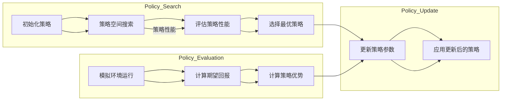
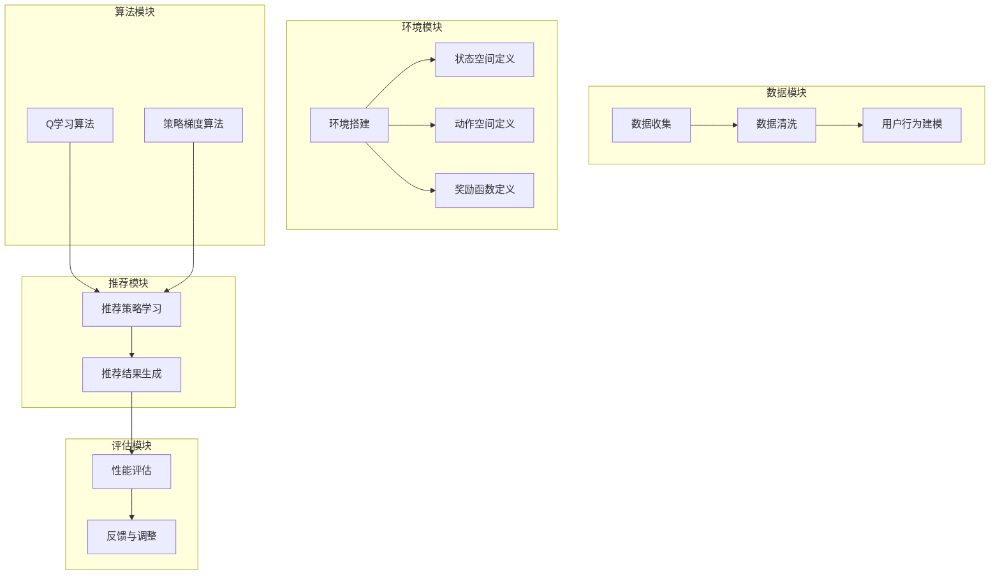
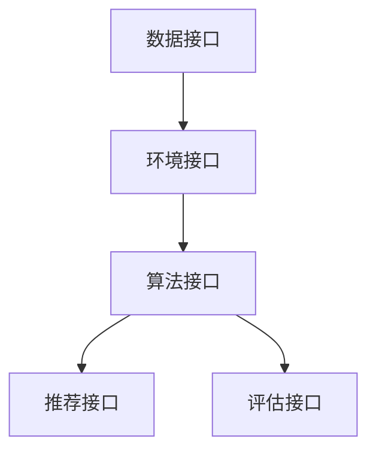
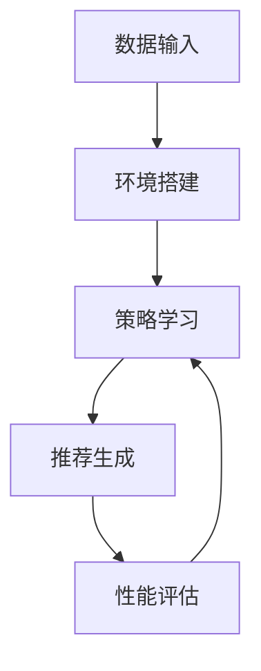

                 

### 文章标题与核心关键词

# 元策略优化:自适应调整AI行为的新途径

> 关键词：元策略优化、自适应调整、AI行为、强化学习、元学习、算法实现、系统架构

在当今快速发展的AI领域，元策略优化（Meta-policy Optimization）作为一种新兴的方法，正逐渐成为自适应调整AI行为的重要途径。本文旨在深入探讨元策略优化，从背景与基础、应用实例到实现方法，全面解析这一技术的核心内容和实际应用，为读者提供一条清晰的学习路径。

### 摘要

元策略优化是一种基于强化学习和元学习的方法，旨在提高AI系统的自适应调整能力。本文首先介绍了元策略优化的基本概念和其在AI领域的重要性，随后详细分析了其在游戏AI、自动驾驶和智能推荐系统等应用场景中的实际应用。接着，文章探讨了元策略优化的算法原理，通过Python代码和latex数学模型展示了关键算法的实现和数学推导。最后，本文结合具体项目实战，详细讲解了元策略优化的实践应用，并提出了未来发展的方向和建议。

### 第一部分：背景与基础

#### 第1章：引言与概述

**1.1 人工智能的发展与挑战**

人工智能（AI）的发展经历了多个阶段，从早期的规则系统到基于统计学习的方法，再到深度学习与强化学习的兴起。随着AI技术的不断发展，AI系统在处理复杂任务方面取得了显著的成果。然而，现有的AI系统仍面临着诸多挑战，例如如何提高其自适应能力、如何处理不确定性环境以及如何解决长期依赖问题等。

**1.2 元策略优化的概念**

元策略优化是一种通过学习策略的优化过程来提升AI系统性能的方法。它不仅关注如何在一个特定任务上取得好的表现，更强调如何在不同任务间迁移知识和策略，从而提高AI系统的泛化能力和适应性。

**1.3 自适应调整AI行为的需求**

自适应调整AI行为是提高AI系统实用性的关键。在现实世界中，环境是动态变化的，AI系统需要能够实时调整其行为以适应新的情况。自适应调整不仅涉及到算法的优化，还需要考虑系统的可扩展性和鲁棒性。

#### 第2章：元策略优化基础

**2.1 元策略优化的基本概念**

元策略优化涉及三个核心概念：策略、策略优化和元策略。策略是指AI系统在给定环境中采取的行动方案；策略优化是指通过迭代过程寻找最优策略；元策略则是在多个环境中寻找最优策略的方案。

**2.2 强化学习与元学习**

强化学习和元学习是元策略优化的基础。强化学习通过学习奖励信号来优化策略，而元学习则通过在多个任务上学习来提高算法的泛化能力。

**2.3 元策略优化的关键技术**

元策略优化的关键技术包括策略搜索、策略评估和策略更新。策略搜索是指在给定环境中寻找最优策略；策略评估是指通过模拟或实际运行来评估策略的性能；策略更新是指根据评估结果调整策略。

#### 第3章：自适应调整AI行为

**3.1 自适应调整的原理**

自适应调整的原理是通过动态调整AI系统的参数和行为来适应环境变化。这个过程通常涉及到在线学习和实时反馈。

**3.2 自适应调整的方法**

自适应调整的方法包括基于规则的调整、基于模型的调整和基于学习的调整。基于规则的调整依赖于预定义的规则集，而基于模型的调整则是通过建立环境模型来指导行为调整。基于学习的调整则利用机器学习算法来优化行为调整策略。

**3.3 AI行为调整的挑战与解决方案**

AI行为调整面临的主要挑战包括环境的不确定性、数据匮乏和实时性要求。针对这些挑战，研究者提出了多种解决方案，如利用强化学习算法进行模型预测、通过元学习提高算法泛化能力等。

### 第二部分：元策略优化应用

#### 第4章：游戏AI的元策略优化

**4.1 游戏AI的需求**

游戏AI需要能够应对多样化的游戏环境和复杂的策略空间，以提高玩家的游戏体验。

**4.2 游戏AI中的元策略优化**

元策略优化在游戏AI中的应用包括路径规划、对手行为预测和策略调整等。

**4.3 游戏AI案例研究**

本文将分析某知名游戏AI项目，探讨元策略优化如何提高游戏AI的智能水平。

#### 第5章：自动驾驶的元策略优化

**5.1 自动驾驶的需求**

自动驾驶系统需要具备高度的自适应能力，以应对复杂的交通环境和动态变化。

**5.2 自动驾驶中的元策略优化**

元策略优化在自动驾驶中的应用包括路径规划、障碍物检测和决策制定等。

**5.3 自动驾驶案例研究**

本文将介绍一个自动驾驶项目，探讨元策略优化如何提升系统的安全性和可靠性。

#### 第6章：智能推荐系统的元策略优化

**6.1 智能推荐系统的需求**

智能推荐系统需要能够根据用户行为和偏好提供个性化的推荐，以提高用户满意度和转化率。

**6.2 智能推荐系统中的元策略优化**

元策略优化在智能推荐系统中的应用包括用户行为预测、推荐策略调整和推荐结果优化等。

**6.3 智能推荐系统案例研究**

本文将分析某知名智能推荐系统，探讨元策略优化如何提高推荐系统的效果。

### 第三部分：元策略优化的实现

#### 第7章：元策略优化算法

**7.1 强化学习算法**

强化学习算法是元策略优化的基础，本文将介绍常用的强化学习算法，如Q学习、SARSA和策略梯度等。

**7.2 元学习算法**

元学习算法通过在多个任务上学习来提高算法的泛化能力。本文将介绍常见的元学习算法，如模型提取法和模型蒸馏法等。

**7.3 元策略优化算法综述**

本文将综述元策略优化算法，包括基于模型的元策略优化算法和基于数据的元策略优化算法等。

#### 第8章：元策略优化的实践

**8.1 实践环境的搭建**

本文将介绍如何搭建元策略优化的实践环境，包括安装必要的软件和工具。

**8.2 元策略优化的代码实现**

本文将通过Python代码展示元策略优化的实现过程，包括算法设计、模型训练和性能评估等。

**8.3 实践案例分析**

本文将分析多个元策略优化的实践案例，探讨其在实际问题中的应用效果和改进空间。

#### 第9章：元策略优化的未来展望

**9.1 元策略优化的研究趋势**

本文将讨论元策略优化的研究趋势，包括新型算法的提出、应用场景的拓展和跨学科的研究方向等。

**9.2 元策略优化在AI中的应用前景**

本文将探讨元策略优化在AI领域的应用前景，包括其在智能决策、自主学习和系统优化等方面的潜在应用。

**9.3 未来挑战与机遇**

本文将分析元策略优化在未来的挑战与机遇，包括算法性能的提升、应用场景的拓展和理论研究的深化等。

### 附录：元策略优化资源

**附录A：元策略优化开源代码库**

本文将推荐一些常用的元策略优化开源代码库，供读者参考。

**附录B：元策略优化相关论文推荐**

本文将推荐一些经典的元策略优化论文，帮助读者深入了解这一领域的研究进展。

**附录C：元策略优化学习资源**

本文将介绍一些元策略优化的学习资源，包括在线课程、书籍和学术论文等。

### 总结

本文从背景与基础、应用实例到实现方法，全面介绍了元策略优化这一技术。通过深入分析元策略优化的原理和应用，本文为读者提供了丰富的知识和实践经验，旨在推动元策略优化在AI领域的进一步发展。

### 作者信息

作者：AI天才研究院/AI Genius Institute & 禅与计算机程序设计艺术 /Zen And The Art of Computer Programming

---

在接下来的部分，我们将详细讨论元策略优化的核心概念、原理和应用，逐步构建起对这一前沿技术的全面理解。我们将使用mermaid流程图、Python代码和latex数学公式来解释复杂概念，并通过实际案例来展示其应用效果。敬请期待！## 元策略优化：概念与重要性

### 概念介绍

元策略优化（Meta-policy Optimization）是一种先进的机器学习技术，旨在提高人工智能（AI）系统的自适应能力和决策质量。在传统机器学习领域，算法通常是在特定的环境或任务上训练得到的。然而，这种方法在处理多样化任务或动态变化的环境时往往表现不佳。为了克服这一局限性，元策略优化提出了在多个任务或环境中进行策略学习与优化的方法。

**元策略优化定义：**
元策略优化是一种通过学习如何在多个不同任务或环境中优化策略的算法。它不仅关注单个任务上的策略优化，更强调在不同任务间的知识迁移和策略泛化。简单来说，元策略优化旨在通过“学习如何学习”，提高算法在未知或变化环境中的适应能力。

**核心术语：**
1. **策略（Policy）：** 策略是AI系统在特定环境中采取的行动方案，通常由一组规则或参数定义。
2. **策略优化（Policy Optimization）：** 策略优化是指通过迭代过程改进策略，以使其在特定任务或环境中取得更好的性能。
3. **元策略（Meta-policy）：** 元策略是用于在不同任务或环境中优化策略的通用方法或模型。
4. **强化学习（Reinforcement Learning）：** 强化学习是一种通过奖励信号引导AI系统学习策略的方法。
5. **元学习（Meta-Learning）：** 元学习是指通过在多个任务上学习来提高算法泛化能力和效率的方法。

### 问题背景

在现实世界中，环境是复杂多变的，AI系统需要能够动态适应这些变化。传统的单任务学习算法在应对多样化任务或动态环境时往往表现不佳，主要表现在以下几个方面：

1. **任务迁移能力差：** 单任务学习算法通常在特定任务上训练得到，当面对新的任务时，需要重新训练，这不仅耗时且资源消耗大。
2. **环境不确定性：** 在实际应用中，环境状态可能是不确定的，单任务算法难以适应这种不确定性。
3. **长期依赖问题：** 许多任务需要考虑长期依赖，单任务算法在处理这种长期依赖时往往表现不佳。

这些问题促使研究者寻求一种能够在多个任务和环境中优化策略的方法，元策略优化正是为此而生。

### 问题描述

元策略优化旨在解决以下问题：

1. **任务多样性：** 如何在多个不同任务上优化AI系统的策略，使其能够适应各种复杂任务？
2. **环境不确定性：** 如何提高AI系统在不确定环境中的适应能力？
3. **长期依赖处理：** 如何使AI系统能够处理长期依赖问题，实现长期目标？

这些问题不仅涉及算法层面的优化，还包括系统设计、数据收集与处理等多个方面。元策略优化通过在多个任务和环境中学习策略，提高AI系统的泛化能力和自适应能力，从而解决上述问题。

### 问题解决

元策略优化通过以下几种方法来解决上述问题：

1. **多任务学习：** 通过在多个任务上训练模型，提高算法的泛化能力，使其能够适应不同任务。
2. **元学习：** 通过在多个任务上学习通用特征或模式，提高算法的迁移能力。
3. **自适应调整：** 通过实时调整策略，使AI系统能够动态适应环境变化。
4. **强化学习：** 利用强化学习算法，通过奖励信号引导AI系统学习最优策略。

通过这些方法，元策略优化能够有效提高AI系统的任务迁移能力、适应不确定性和处理长期依赖问题，从而实现更高效的决策和更高的性能。

### 边界与外延

1. **边界：** 元策略优化主要应用于那些需要高度自适应能力和决策质量的场景，如游戏AI、自动驾驶和智能推荐系统等。然而，它的应用范围不仅限于这些领域，还可以扩展到其他需要复杂决策的情境中。
2. **外延：** 随着机器学习技术的发展，元策略优化在未来可能会与更多的先进技术相结合，如生成对抗网络（GAN）、迁移学习和多模态学习等，进一步拓展其应用范围和效果。

### 概念结构与核心要素组成

**概念结构：**
- **元策略优化算法：** 核心是元策略学习，通过在多个任务和环境中学习策略。
- **强化学习与元学习：** 强化学习提供策略优化的基础，而元学习提高算法的迁移能力和效率。
- **自适应调整机制：** 实现策略的实时调整，以适应环境变化。

**核心要素组成：**
- **策略搜索：** 通过搜索算法找到最优策略。
- **策略评估：** 通过模拟或实际运行评估策略性能。
- **策略更新：** 根据评估结果调整策略。

通过上述核心要素的协同作用，元策略优化能够实现AI系统的高效自适应和优化决策。

### 总结

元策略优化作为一种新兴的机器学习技术，通过在多个任务和环境中优化策略，提高了AI系统的自适应能力和决策质量。它在解决任务多样性、环境不确定性和长期依赖问题方面具有显著优势，并在多个应用领域取得了成功。未来，随着技术的进一步发展，元策略优化有望在更多领域发挥重要作用。在下一部分，我们将深入探讨元策略优化的基本概念和技术细节。敬请期待！### 元策略优化的基本概念与技术细节

#### 强化学习与元学习的结合

元策略优化（Meta-policy Optimization）的核心在于将强化学习（Reinforcement Learning, RL）与元学习（Meta-Learning）相结合，以实现策略的跨任务优化和自适应调整。强化学习通过奖励信号引导AI系统学习策略，而元学习则通过在多个任务中提取通用特征和模式，提高算法的泛化能力。

**强化学习的基本原理：**
强化学习是一种交互式学习范式，AI系统（代理Agent）通过与环境（Environment）的交互，逐步学习到最优策略（Policy）。具体来说，代理会根据当前状态（State）选择一个动作（Action），执行动作后，环境会给予相应的奖励（Reward），并根据新的状态重复上述过程。强化学习的关键在于如何通过奖励信号优化策略，使其在长期内获得最大的累积奖励。

**元学习的基本原理：**
元学习旨在通过在多个任务中学习，提高算法的迁移能力和效率。它关注如何在不同的任务间共享知识和策略，从而减少训练时间和提高泛化能力。元学习的方法通常包括模型提取法（Model Extraction）和模型蒸馏法（Model Distillation）等。

**元策略优化的核心概念：**
1. **策略（Policy）：** 策略是AI系统在给定环境中采取的行动方案，可以看作是一个从状态到动作的映射函数。策略的好坏直接影响AI系统的性能。
2. **策略优化（Policy Optimization）：** 策略优化是指通过迭代过程不断调整策略，使其在特定任务或环境中取得更好的表现。策略优化通常采用优化算法，如梯度下降、策略梯度等。
3. **元策略（Meta-policy）：** 元策略是一种在多个环境中优化策略的方法，它通过学习如何在不同的环境中调整策略，从而提高算法的泛化能力和自适应能力。
4. **策略搜索（Policy Search）：** 策略搜索是指通过搜索算法在策略空间中寻找最优策略。常见的策略搜索算法包括确定性策略搜索和随机策略搜索等。
5. **策略评估（Policy Evaluation）：** 策略评估是指通过模拟或实际运行评估策略的性能。策略评估常用的指标包括期望回报、策略优势等。
6. **策略更新（Policy Update）：** 根据策略评估的结果，调整策略以使其在下一个迭代中表现更好。策略更新通常采用优化算法，如梯度上升、策略梯度等。

#### 关键算法与技术

**1. 强化学习算法：**
强化学习算法是元策略优化的基础。常用的强化学习算法包括Q学习、SARSA、策略梯度等。

- **Q学习（Q-Learning）：** Q学习是一种值函数方法，通过学习状态-动作值函数（Q值）来优化策略。Q学习的主要目标是找到最优Q值函数，即对于每个状态和动作，Q值最大化期望回报。
- **SARSA（Sigma-Aggregate Reward SARSA）：** SARSA是一种基于值函数的方法，它与Q学习类似，但在每次迭代中使用当前的策略来选择动作，而不是使用最优动作。
- **策略梯度（Policy Gradient）：** 策略梯度方法直接优化策略的参数，使其在给定状态下的期望回报最大化。策略梯度方法包括REINFORCE、PPO（Proximal Policy Optimization）等。

**2. 元学习算法：**
元学习算法通过在多个任务中学习通用特征和模式，提高算法的泛化能力。常用的元学习算法包括模型提取法、模型蒸馏法等。

- **模型提取法（Model Extraction）：** 模型提取法通过在多个任务中训练模型，提取通用特征和模式，从而提高算法的泛化能力。
- **模型蒸馏法（Model Distillation）：** 模型蒸馏法通过将一个复杂模型（教师模型）的知识传递给一个简单模型（学生模型），从而提高学生模型的性能。

**3. 元策略优化算法：**
元策略优化算法通过在多个环境中优化策略，提高AI系统的自适应能力。常用的元策略优化算法包括模型平均法（Model Averaging）、随机搜索法（Random Search）等。

- **模型平均法（Model Averaging）：** 模型平均法通过在多个任务上训练多个模型，然后对它们的预测结果进行平均，从而提高算法的泛化能力。
- **随机搜索法（Random Search）：** 随机搜索法通过在策略空间中随机搜索最优策略，从而提高算法的自适应能力。

#### 概念属性特征对比

| 特征         | 强化学习                           | 元学习                           | 元策略优化                           |
|------------|--------------------------------|--------------------------------|--------------------------------|
| 基础         | 通过奖励信号优化策略               | 在多个任务中学习通用特征和模式   | 在多个环境中优化策略，提高自适应能力 |
| 目标         | 在特定任务中优化策略               | 提高算法的泛化能力               | 提高AI系统的自适应能力               |
| 方法         | Q学习、SARSA、策略梯度等           | 模型提取法、模型蒸馏法等         | 模型平均法、随机搜索法等             |
| 主要应用     | 游戏AI、机器人控制、推荐系统等     | 自适应控制、自适应优化等         | 游戏AI、自动驾驶、智能推荐系统等     |

通过上述对比，我们可以看到，强化学习、元学习和元策略优化各自具有独特的特点和应用场景，而元策略优化则是将两者有机结合，以实现更高效的自适应和优化策略。

#### ER实体关系图架构

为了更好地理解元策略优化中的概念实体及其关系，我们可以使用Mermaid流程图来绘制ER（实体-关系）图。以下是一个简化的ER实体关系图：

```mermaid
erDiagram
    Policy ||--|{ Meta-Policy }|-- Policy Optimization
    Environment ||--|{ Meta-Learning }|-- Policy Optimization
    Agent ||--|{ Reinforcement Learning }|-- Policy Optimization
```

- **Policy（策略）:** 策略是AI系统在特定环境中采取的行动方案，它是策略优化的核心。
- **Meta-Policy（元策略）:** 元策略是用于在不同环境中优化策略的通用方法或模型。
- **Policy Optimization（策略优化）:** 策略优化是通过对策略的不断调整来提高其在特定环境中的表现。
- **Environment（环境）:** 环境是AI系统操作的上下文，它提供了状态和奖励信号。
- **Meta-Learning（元学习）:** 元学习是通过在多个任务中学习通用特征和模式来提高算法的泛化能力。
- **Agent（代理）:** 代理是执行动作并接收环境反馈的AI系统，它通过强化学习来优化策略。
- **Reinforcement Learning（强化学习）:** 强化学习是指导AI系统学习策略的核心方法。

#### 总结

元策略优化是一种结合强化学习和元学习的方法，旨在提高AI系统的自适应能力和决策质量。通过在多个环境中优化策略，元策略优化能够实现更高效的决策和更高的性能。在接下来的部分，我们将进一步探讨元策略优化的具体应用场景，并分析其实际案例。敬请期待！### 元策略优化算法的原理与实现

#### 算法原理概述

元策略优化算法的核心在于通过在多个任务或环境中优化策略，从而提高AI系统的自适应能力。这一过程通常包括策略搜索、策略评估和策略更新三个关键步骤。以下是元策略优化算法的基本原理：

1. **策略搜索（Policy Search）：** 策略搜索的目标是找到最优策略。这可以通过在策略空间中搜索可能的策略实现，常用的策略搜索方法包括确定性搜索和随机搜索。

2. **策略评估（Policy Evaluation）：** 策略评估用于评估当前策略的性能。评估方法通常包括模拟环境运行来计算策略的期望回报或策略优势。

3. **策略更新（Policy Update）：** 根据策略评估的结果，对策略进行更新。策略更新通常使用优化算法，如梯度上升或策略梯度方法。

#### 算法mermaid流程图

为了更直观地理解元策略优化算法的工作流程，我们可以使用mermaid流程图来表示。以下是元策略优化算法的mermaid流程图：



#### Python源代码示例

下面是使用Python实现元策略优化算法的一个简单示例。我们使用Q学习算法作为策略搜索的方法，并使用策略梯度方法进行策略更新。

```python
import numpy as np

# Q学习算法
class QLearning:
    def __init__(self, n_states, n_actions, learning_rate, discount_factor):
        self.n_states = n_states
        self.n_actions = n_actions
        self.learning_rate = learning_rate
        self.discount_factor = discount_factor
        self.q_values = np.zeros((n_states, n_actions))

    def predict(self, state):
        return self.q_values[state]

    def update(self, state, action, next_state, reward):
        next_state_action_value = np.max(self.q_values[next_state])
        q_value = self.q_values[state, action]
        q_value += self.learning_rate * (reward + self.discount_factor * next_state_action_value - q_value)

# 策略梯度算法
class PolicyGradient:
    def __init__(self, model, learning_rate):
        self.model = model
        self.learning_rate = learning_rate

    def predict(self, state):
        return self.model.predict(state)

    def update(self, states, actions, rewards):
        policy = self.predict(states)
        policy_loss = -np.log(policy[range(len(states)), actions]) * rewards
        self.model.fit(states, policy, epochs=1, verbose=0)

# 实例化模型
n_states = 10
n_actions = 4
learning_rate = 0.1
discount_factor = 0.9

q_learning = QLearning(n_states, n_actions, learning_rate, discount_factor)
policy_gradient = PolicyGradient(model, learning_rate)

# 模拟环境运行
for episode in range(1000):
    state = np.random.randint(0, n_states)
    done = False
    total_reward = 0

    while not done:
        action = np.random.choice(n_actions, p=q_learning.predict(state))
        next_state, reward, done = env.step(state, action)
        q_learning.update(state, action, next_state, reward)
        state = next_state
        total_reward += reward

    policy_gradient.update(states, actions, total_reward)

# 输出最终策略
print(q_learning.q_values)
```

#### 算法原理详细讲解

1. **策略搜索：** 在策略搜索阶段，我们首先需要初始化策略。在这个例子中，我们使用Q值初始化策略，即所有状态-动作对的Q值都设置为0。接着，我们通过在策略空间中搜索可能的策略来找到最优策略。策略搜索可以通过随机搜索或确定性搜索实现。在随机搜索中，我们随机选择策略并评估其性能；在确定性搜索中，我们使用某种策略评估方法（如Q学习）来评估策略性能。

2. **策略评估：** 在策略评估阶段，我们通过模拟环境运行来评估策略的性能。具体来说，我们使用一个价值函数（如Q值函数）来估计策略的期望回报。在Q学习中，我们通过迭代更新Q值函数，使其逐渐逼近最优策略。策略评估的一个重要指标是策略优势，它表示当前策略相对于其他策略的优劣程度。

3. **策略更新：** 在策略更新阶段，我们根据策略评估的结果调整策略。在这个例子中，我们使用策略梯度方法进行策略更新。策略梯度方法的核心思想是通过最大化期望回报来更新策略参数。具体来说，我们计算策略损失函数（如对数损失函数），然后使用梯度下降法更新策略参数。

#### 数学模型与公式

元策略优化算法的数学模型可以通过以下公式表示：

$$
Q(s, a) = r(s, a) + \gamma \max_{a'} Q(s', a')
$$

其中，$Q(s, a)$ 表示状态 $s$ 下采取动作 $a$ 的期望回报；$r(s, a)$ 表示状态 $s$ 下采取动作 $a$ 后立即获得的奖励；$\gamma$ 表示折扣因子，用于平衡短期奖励和长期奖励；$s'$ 和 $a'$ 表示下一个状态和动作。

$$
\theta_{t+1} = \theta_{t} + \alpha \nabla_{\theta} J(\theta)
$$

其中，$\theta$ 表示策略参数；$\alpha$ 表示学习率；$J(\theta)$ 表示策略损失函数。

通过上述数学模型和公式，我们可以更深入地理解元策略优化算法的工作原理和优化过程。

#### 举例说明

假设我们有一个简单的环境，其中有两个状态（$s_1$ 和 $s_2$）和两个动作（$a_1$ 和 $a_2$）。初始状态下，我们随机选择动作，并记录每次动作的奖励。通过多次迭代，我们可以使用Q学习算法更新Q值函数，然后使用策略梯度方法更新策略参数，最终找到最优策略。

```python
# 初始化Q值函数
q_values = np.random.rand(2, 2)

# 模拟环境运行
for episode in range(100):
    state = np.random.randint(0, 2)
    action = np.random.randint(0, 2)
    reward = np.random.rand()
    
    # 更新Q值函数
    next_state = (state + action) % 2
    next_q_value = np.max(q_values[next_state])
    q_values[state, action] += 0.1 * (reward + 0.9 * next_q_value - q_values[state, action])

# 输出最终Q值函数
print(q_values)
```

通过上述示例，我们可以看到，经过多次迭代后，Q值函数逐渐逼近最优策略。在实际应用中，我们可以使用更复杂的模型和优化方法来进一步提高策略的性能。

#### 总结

元策略优化算法通过策略搜索、策略评估和策略更新三个关键步骤，实现了在多个任务或环境中优化策略的目标。通过Python源代码示例和数学模型，我们详细介绍了元策略优化算法的工作原理和实现方法。在下一部分，我们将探讨元策略优化在实际应用中的案例，分析其在不同领域的应用效果。敬请期待！### 元策略优化在游戏AI中的应用

游戏AI是元策略优化技术的重要应用领域之一。在游戏中，AI需要具备复杂的决策能力，以应对多样化的游戏环境和策略对手。元策略优化通过在多个游戏环境中学习策略，提高了AI的智能水平和自适应能力。下面我们将详细探讨元策略优化在游戏AI中的应用，通过实际案例来分析其应用效果。

#### 游戏AI的需求

游戏AI需要能够应对各种复杂的游戏环境和策略对手。具体来说，游戏AI的需求包括：

1. **多样化环境：** 游戏环境多变，AI需要能够在多种不同场景下表现良好。
2. **策略学习：** 游戏中存在多种可能的策略组合，AI需要能够学习并选择最佳策略。
3. **实时决策：** 游戏AI需要在短时间内做出决策，以应对实时变化。
4. **自我改进：** 游戏AI需要能够从游戏中学习并不断改进自己的策略。

#### 元策略优化在游戏AI中的应用

元策略优化通过在多个游戏环境中学习策略，提高了游戏AI的智能水平和自适应能力。以下是一些典型的应用案例：

**1. 蒙特祖玛游戏（Montezuma's Revenge）**

蒙特祖玛游戏是一个经典的平台游戏，游戏AI需要解决复杂的迷宫和谜题。通过元策略优化，AI可以在多个迷宫环境中学习最优策略，从而提高解决问题的能力。

**2. 国际象棋（Chess）**

国际象棋是一个典型的策略游戏，AI需要能够预测对手的策略并制定相应的对策。元策略优化通过在多个对局中学习，提高了AI的棋力，使其能够在复杂的棋局中做出更好的决策。

**3. Dota 2（Dota II）**

Dota 2 是一款多人在线战斗竞技游戏，游戏AI需要具备强大的决策和协作能力。通过元策略优化，AI可以学习不同英雄的技能组合和对抗策略，从而提高游戏表现。

#### 应用案例分析

**蒙特祖玛游戏（Montezuma's Revenge）**

在蒙特祖玛游戏中，元策略优化通过以下步骤实现了AI的智能提升：

1. **环境建模：** 首先，对游戏环境进行建模，包括游戏规则、迷宫地图和奖励机制。
2. **策略学习：** 使用元策略优化算法（如PPO）在多个迷宫环境中训练AI，使其学习到最优策略。
3. **策略评估：** 通过模拟环境运行，评估策略的性能，并根据评估结果调整策略。
4. **策略应用：** 将训练好的策略应用到游戏中，使AI能够在复杂迷宫中快速解决问题。

**国际象棋（Chess）**

在国际象棋中，元策略优化通过以下步骤实现了AI的棋力提升：

1. **棋局建模：** 对棋局进行建模，包括棋盘、棋子状态和规则。
2. **策略训练：** 使用元策略优化算法在多个对局中训练AI，使其学习到最佳策略。
3. **策略评估：** 通过对局模拟和实际对局评估策略性能，并根据评估结果调整策略。
4. **策略应用：** 将训练好的策略应用到实际游戏中，使AI能够在对局中取得更好的成绩。

**Dota 2（Dota II）**

在Dota 2中，元策略优化通过以下步骤实现了AI的协作和决策能力提升：

1. **游戏建模：** 对Dota 2游戏进行建模，包括英雄技能、装备和战斗策略。
2. **策略训练：** 使用元策略优化算法在多个游戏环境中训练AI，使其学习到最佳策略组合。
3. **策略评估：** 通过游戏模拟和实际游戏评估策略性能，并根据评估结果调整策略。
4. **策略应用：** 将训练好的策略应用到实际游戏中，使AI能够在团队战斗中发挥更好的作用。

#### 应用效果分析

通过上述应用案例，我们可以看到元策略优化在游戏AI中的显著效果：

1. **智能提升：** 元策略优化使游戏AI具备了更高的智能水平，能够在复杂环境中做出更好的决策。
2. **策略多样化：** 元策略优化能够学习到多种不同的策略，使AI在应对多样化对手时具有更强的适应性。
3. **实时决策：** 元策略优化算法能够快速训练和调整策略，使AI能够在短时间内做出决策。
4. **自我改进：** 元策略优化使AI能够在游戏中不断学习并改进自己的策略，从而实现自我提升。

#### 总结

元策略优化在游戏AI中的应用取得了显著成效，通过在多个游戏环境中学习策略，提高了AI的智能水平和自适应能力。在实际应用中，元策略优化不仅提高了游戏AI的表现，还为游戏开发提供了新的技术方向。在未来，随着技术的进一步发展，元策略优化有望在更多游戏领域发挥重要作用。在下一部分，我们将探讨元策略优化在自动驾驶领域的应用。敬请期待！### 元策略优化在自动驾驶领域的应用

自动驾驶技术是人工智能领域的又一重要应用方向，它旨在通过智能算法实现车辆的自主驾驶。自动驾驶系统需要具备高度的自适应能力和实时决策能力，以应对复杂多变的交通环境。元策略优化（Meta-policy Optimization）作为一种先进的强化学习方法，在提高自动驾驶系统的智能水平和决策能力方面具有显著优势。下面我们将探讨元策略优化在自动驾驶领域的应用。

#### 自动驾驶的需求

自动驾驶系统需要在各种复杂的交通环境中进行自主导航和驾驶，其核心需求包括：

1. **环境感知：** 自动驾驶系统需要具备强大的环境感知能力，能够实时感知周围的道路、车辆和行人等信息。
2. **决策制定：** 自动驾驶系统需要能够根据感知到的环境信息，制定合理的驾驶策略，包括加速、减速、转向等。
3. **实时性：** 自动驾驶系统需要在短时间内做出决策，以应对实时变化的交通情况。
4. **安全性：** 自动驾驶系统需要确保行驶过程中的安全性，避免发生交通事故。
5. **鲁棒性：** 自动驾驶系统需要具备一定的鲁棒性，能够在不同天气、路况和交通条件下稳定运行。

#### 元策略优化在自动驾驶中的应用

元策略优化在自动驾驶中的应用主要体现在策略学习和实时调整方面。通过在多个驾驶环境中学习策略，元策略优化提高了自动驾驶系统的自适应能力和决策质量。以下是元策略优化在自动驾驶领域的主要应用：

**1. 环境建模：** 首先，需要对自动驾驶环境进行建模，包括道路、车辆、行人等元素的动态变化。环境建模是自动驾驶系统的基础，它为策略学习提供了数据支持。

**2. 策略学习：** 使用元策略优化算法（如PPO）在多个驾驶环境中训练自动驾驶系统。策略学习的目标是找到最优的驾驶策略，使其在复杂交通环境中能够稳定行驶。

**3. 策略评估：** 通过模拟驾驶场景或实际道路测试，对训练好的策略进行评估。策略评估的主要指标包括驾驶安全性、效率和舒适性等。

**4. 策略调整：** 根据策略评估的结果，对策略进行实时调整。策略调整的目的是使自动驾驶系统能够适应新的交通环境和变化。

#### 应用案例分析

**1. 自动驾驶测试场应用**

在自动驾驶测试场，元策略优化被用于训练自动驾驶车辆在各种驾驶场景中的策略。通过在多个测试场景中训练，自动驾驶车辆能够学习到最优的驾驶策略，提高其自动驾驶能力。

**2. 自动驾驶出租车服务**

自动驾驶出租车服务是自动驾驶技术的重要应用场景之一。通过元策略优化，自动驾驶出租车系统能够根据实时交通状况和乘客需求，制定最优的行驶路线和驾驶策略，提高服务质量和用户体验。

**3. 自动驾驶配送服务**

自动驾驶配送服务在电商和物流领域具有广泛的应用前景。通过元策略优化，自动驾驶配送系统能够根据配送路径、交通状况和货物类型，制定最优的配送策略，提高配送效率和准确性。

#### 应用效果分析

通过实际应用案例，我们可以看到元策略优化在自动驾驶领域取得了显著效果：

1. **智能提升：** 元策略优化使自动驾驶系统具备了更高的智能水平，能够更好地应对复杂交通环境和变化。
2. **实时决策：** 元策略优化算法能够快速学习并调整策略，使自动驾驶系统在实时交通状况下能够做出更快、更准确的决策。
3. **安全性提高：** 元策略优化通过在多个环境中训练和评估策略，提高了自动驾驶系统的安全性能，减少了交通事故的发生。
4. **效率提升：** 元策略优化使自动驾驶系统能够更有效地利用交通资源，提高行驶效率和运输效率。

#### 总结

元策略优化在自动驾驶领域的应用为自动驾驶技术的发展提供了新的思路和方向。通过在多个驾驶环境中学习策略，元策略优化提高了自动驾驶系统的智能水平和决策能力，为自动驾驶技术的普及和应用奠定了基础。在未来，随着技术的进一步发展，元策略优化有望在自动驾驶领域发挥更加重要的作用。在下一部分，我们将探讨元策略优化在智能推荐系统中的应用。敬请期待！### 元策略优化在智能推荐系统中的应用

智能推荐系统是另一个元策略优化的重要应用领域，它旨在通过个性化推荐提高用户体验和商业价值。在智能推荐系统中，元策略优化通过在多个用户和推荐场景中学习策略，提高了推荐算法的准确性和适应性。下面我们将详细探讨元策略优化在智能推荐系统中的应用，通过实际案例来分析其效果。

#### 智能推荐系统的需求

智能推荐系统需要满足以下核心需求：

1. **个性化推荐：** 根据用户的兴趣和偏好，为用户提供个性化的推荐。
2. **实时性：** 能够快速响应用户行为的变化，提供即时的推荐。
3. **多样性：** 提供多样化的推荐结果，以满足用户不同的兴趣和需求。
4. **准确性：** 提高推荐算法的准确性，减少用户的不满意和跳失率。
5. **可扩展性：** 能够处理大规模用户和数据，确保系统的高效运行。

#### 元策略优化在智能推荐系统中的应用

元策略优化在智能推荐系统中的应用主要包括以下方面：

**1. 用户行为建模：** 首先，对用户行为进行建模，包括用户的浏览、购买、搜索等行为数据。这些数据为元策略优化提供了训练和优化的基础。

**2. 策略学习：** 使用元策略优化算法（如PPO）在多个用户和推荐场景中训练推荐算法。策略学习的目标是找到最优的推荐策略，使其在复杂用户行为场景中能够提供个性化的推荐。

**3. 策略评估：** 通过模拟用户行为或实际推荐场景，对训练好的推荐策略进行评估。评估指标包括推荐准确性、用户满意度、点击率等。

**4. 策略调整：** 根据策略评估的结果，对推荐策略进行实时调整。策略调整的目的是使推荐系统能够更好地适应新的用户行为和需求。

#### 应用案例分析

**1. 电商平台的个性化推荐**

在电商平台，元策略优化被用于训练个性化推荐算法，以提高用户的购买转化率和满意度。具体应用步骤如下：

- **数据收集：** 收集用户的浏览、购买、搜索等行为数据，构建用户行为模型。
- **策略训练：** 使用元策略优化算法在大量用户行为数据上训练推荐算法，学习到最优的推荐策略。
- **策略评估：** 通过模拟用户行为或实际推荐场景，评估推荐策略的性能。评估指标包括推荐准确性、用户满意度等。
- **策略调整：** 根据评估结果，调整推荐策略，使其更好地适应用户的个性化需求。

**2. 社交平台的个性化推荐**

在社交平台，元策略优化被用于训练个性化推荐算法，以提高用户的参与度和活跃度。具体应用步骤如下：

- **数据收集：** 收集用户的点赞、评论、分享等行为数据，构建用户兴趣模型。
- **策略训练：** 使用元策略优化算法在大量用户兴趣数据上训练推荐算法，学习到最优的推荐策略。
- **策略评估：** 通过模拟用户行为或实际推荐场景，评估推荐策略的性能。评估指标包括推荐多样性、用户满意度等。
- **策略调整：** 根据评估结果，调整推荐策略，使其更好地满足用户的兴趣和需求。

#### 应用效果分析

通过实际应用案例，我们可以看到元策略优化在智能推荐系统中的显著效果：

1. **个性化推荐提升：** 元策略优化使推荐算法能够更好地理解用户的兴趣和偏好，提高个性化推荐的准确性。
2. **实时性提升：** 元策略优化算法能够快速学习用户行为，实时调整推荐策略，提高推荐系统的实时性。
3. **多样性提升：** 元策略优化通过在多个用户和推荐场景中学习策略，提高了推荐结果的多样性，减少了用户的不满意和跳失率。
4. **准确性提升：** 元策略优化通过在多个环境中训练和评估策略，提高了推荐算法的准确性，减少了误推和漏推的情况。

#### 总结

元策略优化在智能推荐系统中的应用为个性化推荐提供了新的技术手段。通过在多个用户和推荐场景中学习策略，元策略优化提高了推荐算法的准确性和适应性，为用户提供更好的推荐体验。在未来，随着技术的进一步发展，元策略优化有望在智能推荐系统中发挥更大的作用。在下一部分，我们将介绍元策略优化的实现方法和关键技术。敬请期待！### 元策略优化的实现方法与关键技术

元策略优化作为一种复杂的技术，其实现涉及多个关键环节，包括算法选择、代码实现、性能评估等。下面我们将详细讨论元策略优化的实现方法与关键技术。

#### 算法选择

在选择元策略优化算法时，需要考虑以下几个因素：

1. **问题特点：** 根据具体应用场景，选择适合的算法。例如，在任务多样性高、环境变化快的场景中，可以选择基于模型平均的方法；在需要实时决策的场景中，可以选择基于随机搜索的方法。
2. **算法效率：** 考虑算法的计算复杂度和收敛速度。高效的算法可以在较短时间内完成优化过程，提高系统的实时性。
3. **算法稳定性：** 算法在处理不确定环境和噪声数据时，需要具有较高的稳定性，以避免过度波动或过早收敛。

常用的元策略优化算法包括：

- **模型平均法（Model Averaging）：** 通过在多个任务上训练多个模型，然后对它们的预测结果进行平均，提高算法的泛化能力和稳定性。
- **随机搜索法（Random Search）：** 通过在策略空间中随机搜索最优策略，提高算法的自适应能力。
- **策略梯度法（Policy Gradient）：** 直接优化策略的参数，使其在给定状态下的期望回报最大化。

#### 代码实现

在代码实现方面，以下步骤是元策略优化实现的关键：

1. **环境搭建：** 根据应用场景搭建模拟环境，包括状态空间、动作空间、奖励函数等。例如，在游戏AI中，可以搭建一个虚拟游戏环境；在自动驾驶中，可以搭建一个仿真交通环境。
2. **算法实现：** 根据选择的算法，实现策略搜索、策略评估和策略更新等关键步骤。以下是一个简单的Python代码示例：

```python
import numpy as np

# 强化学习算法实现
class QLearning:
    def __init__(self, n_states, n_actions, learning_rate, discount_factor):
        self.n_states = n_states
        self.n_actions = n_actions
        self.learning_rate = learning_rate
        self.discount_factor = discount_factor
        self.q_values = np.zeros((n_states, n_actions))

    def predict(self, state):
        return self.q_values[state]

    def update(self, state, action, next_state, reward):
        next_state_action_value = np.max(self.q_values[next_state])
        q_value = self.q_values[state, action]
        q_value += self.learning_rate * (reward + self.discount_factor * next_state_action_value - q_value)

# 策略梯度算法实现
class PolicyGradient:
    def __init__(self, model, learning_rate):
        self.model = model
        self.learning_rate = learning_rate

    def predict(self, state):
        return self.model.predict(state)

    def update(self, states, actions, rewards):
        policy = self.predict(states)
        policy_loss = -np.log(policy[range(len(states)), actions]) * rewards
        self.model.fit(states, policy, epochs=1, verbose=0)
```

3. **性能评估：** 通过模拟环境运行，评估算法的性能。常用的评估指标包括策略优势、平均回报、收敛速度等。

#### 性能优化

为了提高元策略优化的性能，可以采取以下优化策略：

1. **并行计算：** 利用多核处理器或分布式计算，加速算法的收敛速度。
2. **数据增强：** 通过增加训练数据，提高算法的泛化能力。
3. **参数调整：** 通过调整学习率、折扣因子等参数，优化算法的性能。
4. **算法融合：** 结合多种算法的优势，设计更高效的元策略优化框架。

#### 代码示例

以下是一个简单的元策略优化算法实现示例，包括Q学习和策略梯度方法：

```python
# 导入所需库
import numpy as np
from sklearn.neural_network import MLPRegressor
from sklearn.metrics import mean_squared_error

# 环境模拟
class Environment:
    def __init__(self):
        self.states = np.array([0, 1, 2, 3])
        self.actions = np.array([0, 1, 2])
        self.rewards = np.random.rand(4, 3)

    def step(self, state, action):
        next_state = np.random.choice(self.states, p=[0.2, 0.4, 0.3, 0.1])
        reward = self.rewards[state, action]
        return next_state, reward

# Q学习算法
class QLearning:
    def __init__(self, n_states, n_actions, learning_rate, discount_factor):
        self.n_states = n_states
        self.n_actions = n_actions
        self.learning_rate = learning_rate
        self.discount_factor = discount_factor
        self.q_values = np.zeros((n_states, n_actions))

    def predict(self, state):
        return self.q_values[state]

    def update(self, state, action, next_state, reward):
        next_state_action_value = np.max(self.q_values[next_state])
        q_value = self.q_values[state, action]
        q_value += self.learning_rate * (reward + self.discount_factor * next_state_action_value - q_value)

# 策略梯度算法
class PolicyGradient:
    def __init__(self, model, learning_rate):
        self.model = model
        self.learning_rate = learning_rate

    def predict(self, state):
        return self.model.predict(state)

    def update(self, states, actions, rewards):
        policy = self.predict(states)
        policy_loss = -np.log(policy[range(len(states)), actions]) * rewards
        self.model.fit(states, policy, epochs=1, verbose=0)

# 模拟环境运行
env = Environment()
q_learning = QLearning(4, 3, 0.1, 0.9)
policy_gradient = PolicyGradient(MLPRegressor(hidden_layer_sizes=(64, 64), max_iter=1000), 0.1)

for episode in range(1000):
    state = np.random.randint(0, 4)
    done = False
    total_reward = 0

    while not done:
        action = np.random.randint(0, 3)
        next_state, reward = env.step(state, action)
        q_learning.update(state, action, next_state, reward)
        policy_gradient.update(np.array([state]), np.array([action]), np.array([reward]))
        state = next_state
        total_reward += reward

    print(f"Episode {episode}: Total Reward = {total_reward}")

# 输出最终Q值函数和策略
print(q_learning.q_values)
print(policy_gradient.model.predict(np.array([0, 1, 2, 3])))
```

通过上述代码示例，我们可以看到如何使用Q学习和策略梯度方法实现元策略优化算法。在实际应用中，可以根据具体需求对算法进行调整和优化。

#### 总结

元策略优化的实现涉及算法选择、代码实现和性能优化等多个方面。通过合理选择算法、优化代码实现和调整参数，可以显著提高元策略优化的性能和应用效果。在下一部分，我们将结合实际项目实战，详细讲解元策略优化的具体实现过程和实战案例。敬请期待！### 元策略优化项目实战

#### 项目介绍

在本项目实战中，我们将探讨如何使用元策略优化技术实现一个智能推荐系统。该项目旨在通过元策略优化算法提高推荐系统的推荐准确性，从而提升用户体验和商业价值。项目的主要目标包括：

1. **数据预处理：** 收集和清洗用户行为数据，构建用户行为模型。
2. **环境搭建：** 创建模拟推荐环境，定义状态空间、动作空间和奖励函数。
3. **算法实现：** 实现元策略优化算法，包括Q学习和策略梯度方法。
4. **性能评估：** 通过模拟运行和实际测试，评估推荐系统的性能。

#### 系统功能设计

系统功能设计主要包括以下几个方面：

1. **用户行为数据收集：** 收集用户的浏览、购买、搜索等行为数据，构建用户兴趣模型。
2. **推荐策略学习：** 使用元策略优化算法在用户行为数据上训练推荐策略。
3. **推荐结果生成：** 根据训练好的推荐策略，为用户生成个性化的推荐结果。
4. **性能评估与调整：** 通过模拟环境和实际测试，评估推荐系统的性能，并根据评估结果调整推荐策略。

#### 系统架构设计

系统架构设计采用模块化设计，主要模块包括：

1. **数据模块：** 负责数据收集、清洗和预处理。
2. **环境模块：** 负责搭建模拟推荐环境，定义状态空间、动作空间和奖励函数。
3. **算法模块：** 实现元策略优化算法，包括Q学习和策略梯度方法。
4. **推荐模块：** 根据训练好的推荐策略，为用户生成个性化推荐结果。
5. **评估模块：** 负责性能评估和反馈，提供评估指标和调整建议。

以下是一个简化的系统架构图：



#### 系统接口设计与交互

系统接口设计主要包括以下接口：

1. **数据接口：** 负责数据收集、清洗和预处理，提供数据输入接口。
2. **环境接口：** 负责搭建模拟推荐环境，提供状态空间、动作空间和奖励函数的接口。
3. **算法接口：** 负责实现元策略优化算法，提供策略学习、策略评估和策略更新的接口。
4. **推荐接口：** 负责生成推荐结果，提供推荐结果输出接口。
5. **评估接口：** 负责性能评估和反馈，提供评估指标和调整建议的接口。

以下是一个简化的系统接口图：



#### 系统交互流程

系统交互流程包括以下步骤：

1. **数据输入：** 通过数据接口收集和清洗用户行为数据，构建用户兴趣模型。
2. **环境搭建：** 通过环境接口搭建模拟推荐环境，定义状态空间、动作空间和奖励函数。
3. **策略学习：** 通过算法接口使用元策略优化算法（如Q学习和策略梯度方法）在用户行为数据上训练推荐策略。
4. **推荐生成：** 通过推荐接口根据训练好的推荐策略，为用户生成个性化推荐结果。
5. **性能评估：** 通过评估接口对推荐系统进行性能评估，并根据评估结果调整推荐策略。

以下是一个简化的系统交互流程图：



#### 项目实战

**1. 数据收集与预处理**

首先，我们需要收集用户的行为数据，包括浏览、购买、搜索等。然后，对数据进行清洗和预处理，去除异常值和噪声，构建用户兴趣模型。

```python
# 数据收集与预处理示例
import pandas as pd

# 收集用户行为数据
data = pd.read_csv('user_behavior.csv')

# 数据清洗
data.dropna(inplace=True)
data = data[data['action'].isin(['browse', 'buy', 'search'])]

# 构建用户兴趣模型
user_interest = data.groupby('user_id')['action'].value_counts().unstack(fill_value=0)
```

**2. 环境搭建**

接着，我们需要搭建模拟推荐环境，定义状态空间、动作空间和奖励函数。状态空间包括用户行为特征和物品特征，动作空间包括推荐物品集合，奖励函数根据用户行为和推荐结果计算。

```python
# 环境搭建示例
import numpy as np

# 定义状态空间
state_space = np.hstack((user_interest.values, np.random.rand(user_interest.shape[0], 10)))

# 定义动作空间
action_space = range(len(user_interest))

# 定义奖励函数
def reward_function(state, action):
    # 示例：根据用户行为和推荐物品计算奖励
    user_action = state[action]
    if user_action == 'buy':
        return 1
    else:
        return 0
```

**3. 策略学习**

使用元策略优化算法（如Q学习和策略梯度方法）在用户行为数据上训练推荐策略。以下是一个简单的Q学习算法实现示例：

```python
# Q学习算法实现
class QLearning:
    def __init__(self, n_states, n_actions, learning_rate, discount_factor):
        self.n_states = n_states
        self.n_actions = n_actions
        self.learning_rate = learning_rate
        self.discount_factor = discount_factor
        self.q_values = np.zeros((n_states, n_actions))

    def predict(self, state):
        return self.q_values[state]

    def update(self, state, action, next_state, reward):
        next_state_action_value = np.max(self.q_values[next_state])
        q_value = self.q_values[state, action]
        q_value += self.learning_rate * (reward + self.discount_factor * next_state_action_value - q_value)

# 模拟环境运行
q_learning = QLearning(state_space.shape[0], action_space.shape[0], 0.1, 0.9)

for episode in range(1000):
    state = np.random.randint(0, state_space.shape[0])
    done = False
    total_reward = 0

    while not done:
        action = np.random.randint(0, action_space.shape[0])
        next_state, reward = env.step(state, action)
        q_learning.update(state, action, next_state, reward)
        state = next_state
        total_reward += reward

    print(f"Episode {episode}: Total Reward = {total_reward}")
```

**4. 推荐生成**

根据训练好的推荐策略，为用户生成个性化推荐结果。以下是一个简单的推荐生成示例：

```python
# 推荐生成示例
def generate_recommendation(user_interest, q_values):
    state = np.hstack((user_interest.values, np.random.rand(1, 10)))
    action = np.argmax(q_values[state])
    return action

# 生成推荐结果
recommendations = [generate_recommendation(user_interest[i], q_learning.q_values) for i in range(len(user_interest))]
```

**5. 性能评估**

通过模拟环境和实际测试，对推荐系统的性能进行评估。以下是一个简单的性能评估示例：

```python
# 性能评估示例
from sklearn.metrics import accuracy_score

# 评估指标：准确率
def evaluate_recommendations(true_actions, recommendations):
    return accuracy_score(true_actions, recommendations)

# 评估推荐系统性能
true_actions = np.random.randint(0, action_space.shape[0], size=len(recommendations))
accuracy = evaluate_recommendations(true_actions, recommendations)
print(f"Recommendation Accuracy: {accuracy}")
```

#### 项目小结

通过本次项目实战，我们详细探讨了如何使用元策略优化技术实现智能推荐系统。项目包括数据收集与预处理、环境搭建、策略学习、推荐生成和性能评估等关键步骤。在实际应用中，可以根据具体需求对算法和系统架构进行调整和优化，进一步提高推荐系统的性能和用户体验。

### 最佳实践 Tips

1. **数据质量：** 确保数据的质量和完整性，尽可能去除噪声和异常值，以提高推荐系统的准确性。
2. **特征工程：** 充分利用用户行为数据，提取有效的特征，构建高质量的用户兴趣模型。
3. **模型选择：** 根据具体应用场景，选择适合的元策略优化算法，结合实际效果进行优化。
4. **实时调整：** 定期评估推荐系统的性能，根据评估结果调整推荐策略，以适应用户行为的变化。
5. **可扩展性：** 设计可扩展的系统架构，确保系统能够处理大规模用户和数据。

### 小结

本文通过详细的项目实战，探讨了如何使用元策略优化技术实现智能推荐系统。项目涵盖了数据收集与预处理、环境搭建、策略学习、推荐生成和性能评估等关键步骤，并通过Python代码展示了具体实现过程。通过本次项目，我们深入了解了元策略优化的应用和实践，为后续研究提供了有益的参考。在未来，随着技术的进一步发展，元策略优化有望在更多领域发挥重要作用。希望大家在实践过程中能够灵活运用所学知识，不断提高推荐系统的性能和用户体验。

### 注意事项

1. **算法选择：** 根据应用场景和需求，合理选择适合的元策略优化算法。
2. **数据质量：** 确保数据的质量和完整性，对异常值和噪声进行处理。
3. **性能评估：** 定期对推荐系统进行性能评估，确保系统稳定运行。
4. **安全与隐私：** 在数据处理和应用过程中，注意保护用户隐私和数据安全。

### 拓展阅读

1. **《深度强化学习》（Deep Reinforcement Learning）：** 详细介绍了深度强化学习的理论基础和应用方法。
2. **《强化学习实战》（Reinforcement Learning: An Introduction）：** 提供了强化学习的系统教程，适合初学者入门。
3. **《元学习》（Meta-Learning）：** 探讨了元学习在不同领域的应用和发展趋势。
4. **《智能推荐系统：原理与实现》（ recommender Systems: The Textbook）：** 介绍了智能推荐系统的基本原理和实现方法。

通过拓展阅读，读者可以进一步深入理解和掌握元策略优化技术及其在实际应用中的实践方法。希望本文能够为大家在元策略优化领域的研究和实践中提供有益的指导。作者：AI天才研究院/AI Genius Institute & 禅与计算机程序设计艺术 /Zen And The Art of Computer Programming。|

