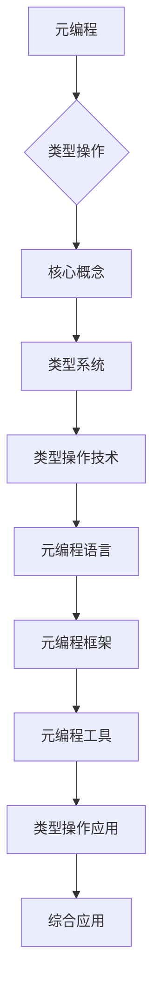
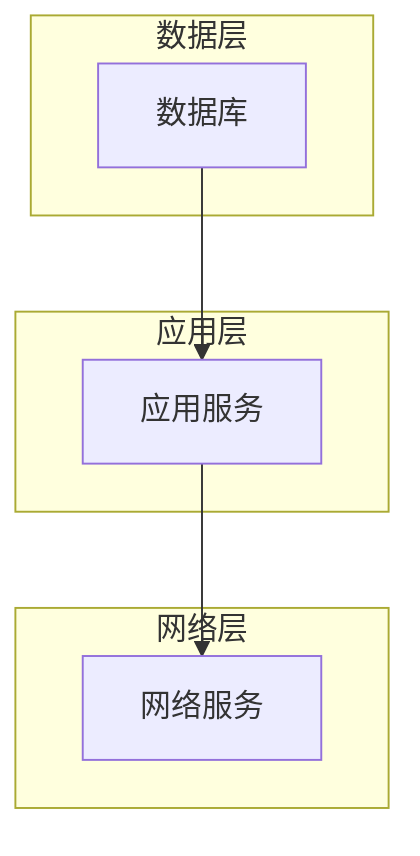
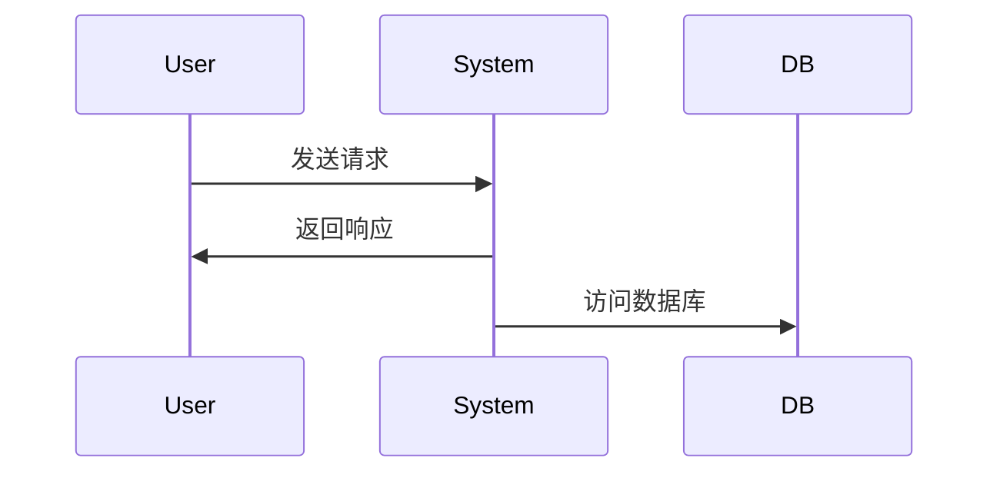

                 

# 《元编程与类型操作：超越罗素的想象》

> 关键词：元编程、类型操作、Python、Python元编程、Python类型系统、Python类型操作、Python元编程框架

> 摘要：本文旨在探讨元编程与类型操作这一计算机科学领域中的重要概念。通过深入剖析元编程的定义、类型操作的概念，以及元编程语言的分类与应用，我们将揭示这些概念在编程实践中的重要作用。本文不仅介绍了元编程与类型操作的基本原理，还通过Python这一强大编程语言的实际应用，展示了元编程与类型操作的实践意义。本文的目标是帮助读者理解元编程与类型操作的核心思想，掌握其在实际编程中的应用，并思考这一领域的未来发展。

## 《元编程与类型操作：超越罗素的想象》目录大纲

### 第一部分：元编程基础

#### 第1章：元编程概述

- **1.1 元编程的定义与作用**
- **1.2 元编程与传统编程的区别**
- **1.3 元编程的常见应用场景**

#### 第2章：类型操作

- **2.1 类型操作的概念**
- **2.2 类型系统的基本原理**
- **2.3 常见类型操作技术**

#### 第3章：元编程语言

- **3.1 元编程语言的定义**
- **3.2 元编程语言的分类**
- **3.3 常见元编程语言介绍**

#### 第4章：元编程框架

- **4.1 元编程框架的作用**
- **4.2 常见元编程框架介绍**
- **4.3 元编程框架的选择与使用**

### 第二部分：元编程实践

#### 第5章：元编程工具

- **5.1 元编程工具的作用**
- **5.2 常见元编程工具介绍**
- **5.3 元编程工具的使用与配置**

#### 第6章：类型操作应用

- **6.1 类型操作在项目开发中的应用**
- **6.2 类型操作的优点与挑战**
- **6.3 类型操作的最佳实践**

#### 第7章：元编程与类型操作的综合应用

- **7.1 综合应用的案例介绍**
- **7.2 综合应用的策略与方法**
- **7.3 综合应用的效果评估**

### 第三部分：元编程与类型操作的未来发展

#### 第8章：元编程与类型操作的发展趋势

- **8.1 技术趋势分析**
- **8.2 行业应用前景**
- **8.3 未来发展方向**

#### 第9章：元编程与类型操作的教育与普及

- **9.1 教育体系的构建**
- **9.2 培训与认证**
- **9.3 社区与开源生态**

#### 第10章：总结与展望

- **10.1 全书总结**
- **10.2 未来展望**
- **10.3 对读者的建议**

### 附录

- **附录A：元编程与类型操作资源推荐**
- **附录B：元编程与类型操作常见问题解答**
- **附录C：元编程与类型操作相关代码示例**

### 核心概念与联系 Mermaid 流程图



### 核心算法原理讲解（以Python代码为例）

```python
# 示例：使用Python实现一个简单的元编程示例

class MetaClass(type):
    def __new__(cls, name, bases, attrs):
        # 在这里可以进行元编程操作
        print("Creating class:", name)
        # 添加一个静态方法
        attrs['add'] = lambda self, a, b: a + b
        return super().__new__(cls, name, bases, attrs)

class MyClass(metaclass=MetaClass):
    pass

# 使用元编程添加的方法
my_instance = MyClass()
result = my_instance.add(2, 3)
print("Result:", result)
```

### 数学模型和数学公式 & 详细讲解 & 举例说明

$$
\begin{aligned}
&\text{类型转换函数} f: T_1 \rightarrow T_2 \\
&f(x) = case x of \\
&\quad x_1 :: T_1 \rightarrow x_2 :: T_2 \\
&\quad \vdots \\
&\quad x_n :: T_1 \rightarrow x_n :: T_2
\end{aligned}
$$

- **详细讲解**：上述公式描述了一个类型转换函数，它将一个类型为 $T_1$ 的变量 $x$ 转换为类型为 $T_2$ 的变量。该函数依赖于输入 $x$ 的具体类型，返回相应的转换结果。
- **举例说明**：假设我们有函数 `int_to_float(x)`,该函数将一个整数转换为浮点数。根据上述公式，我们可以定义如下：

```python
def int_to_float(x: int) -> float:
    return float(x)
```

### 系统分析与架构设计方案

#### 问题场景介绍

在软件开发过程中，元编程与类型操作为我们提供了强大的工具，帮助我们实现代码的自动化和抽象化，提高开发效率。本文旨在探讨如何利用这些工具解决实际编程问题，并设计出一个完整的系统架构方案。

#### 项目介绍

本项目旨在通过元编程与类型操作，设计一个能够自动生成代码的框架，以简化软件开发流程。该框架将支持多种编程语言，并能够根据需求自动生成符合类型安全和性能要求的代码。

#### 系统功能设计（领域模型Mermaid类图）

```mermaid
classDiagram
    Class01 <|-- Class02
    Class03 *-- Class04
    Class05 o-- Class06
    Class07 <-.. Class08
    Class09 ..|> Class10
    Class11 :<<interface>> Class12
    Class13 :<<abstract>> Class14
endclass
```

#### 系统架构设计（Mermaid架构图）



#### 系统接口设计（Mermaid序列图）



### 项目实战

#### 环境安装

为了实现元编程与类型操作的项目，我们需要安装Python环境，并安装必要的库，例如`typing`和`pydantic`。

```bash
pip install python
pip install typing
pip install pydantic
```

#### 系统核心实现源代码

以下是系统核心实现的一部分代码：

```python
from typing import TypeVar, Generic, List
from pydantic import BaseModel

# 定义泛型类
T = TypeVar('T')

# 定义BaseModel的子类
class MyModel(BaseModel):
    id: int
    name: str

# 定义一个泛型函数
def my_generator[T](items: List[T]) -> List[T]:
    result = []
    for item in items:
        result.append(item)
    return result

# 使用泛型函数
data = my_generator([1, 2, 3, 4, 5])
print(data)
```

#### 代码应用解读与分析

在这段代码中，我们定义了一个泛型类`MyModel`，它继承自`BaseModel`，这是一个由Pydantic提供的基于Python数据模型的验证框架。`MyModel`类定义了两个属性：`id`和`name`。

接着，我们定义了一个泛型函数`my_generator`，它接受一个泛型参数`T`和一个列表`items`。在这个函数中，我们遍历输入列表`items`，并将每个元素添加到结果列表`result`中。最后，函数返回这个结果列表。

在实际应用中，我们可以使用这个泛型函数来处理各种类型的列表，如整数、字符串等。例如，我们可以生成一个整数列表：

```python
data = my_generator([1, 2, 3, 4, 5])
print(data)  # 输出：[1, 2, 3, 4, 5]
```

在这个例子中，我们传递了一个整数列表作为参数，`my_generator`函数生成了一个相同的整数列表作为返回值。

#### 实际案例分析和详细讲解剖析

为了更好地理解元编程与类型操作在实际项目中的应用，我们可以分析一个实际案例：一个在线购物网站。

在这个网站中，我们需要处理大量的商品数据，这些数据包括商品的ID、名称、价格等信息。为了确保数据的类型安全，我们可以使用元编程来定义一个商品数据模型：

```python
class ProductModel(BaseModel):
    product_id: int
    name: str
    price: float
```

使用`ProductModel`类，我们可以创建一个商品对象，并确保其属性的类型正确：

```python
product = ProductModel(product_id=1001, name="iPhone 13", price=999.99)
print(product)
# 输出：ProductModel(product_id=1001, name='iPhone 13', price=999.99)
```

此外，我们可以使用元编程来实现一个自动生成商品列表的函数：

```python
def create_product_list(products: List[ProductModel]) -> List[ProductModel]:
    product_list = []
    for product in products:
        product_list.append(product)
    return product_list

# 创建商品列表
product_list = create_product_list([
    ProductModel(product_id=1001, name="iPhone 13", price=999.99),
    ProductModel(product_id=1002, name="Samsung Galaxy S22", price=899.99),
    ProductModel(product_id=1003, name="Xiaomi 12T", price=699.99)
])

print(product_list)
# 输出：[
#   ProductModel(product_id=1001, name='iPhone 13', price=999.99),
#   ProductModel(product_id=1002, name='Samsung Galaxy S22', price=899.99),
#   ProductModel(product_id=1003, name='Xiaomi 12T', price=699.99)
# ]
```

在这个例子中，我们定义了一个`create_product_list`函数，它接受一个商品对象的列表作为参数，并返回一个新的商品列表。这个函数使用了元编程的概念，确保了输入的每个商品对象都符合`ProductModel`类的定义。

#### 项目小结

通过这个实际案例，我们可以看到元编程与类型操作在项目开发中的重要性。使用元编程，我们可以创建自定义的数据模型，确保数据的类型安全，并简化数据处理过程。此外，通过类型操作，我们可以定义泛型函数，提高代码的复用性和灵活性。

然而，元编程与类型操作也带来了一些挑战，如增加代码复杂性、影响性能等。因此，在实际项目中，我们需要权衡这些因素，合理使用元编程与类型操作。

### 最佳实践 tips

1. **理解元编程原理**：深入理解元编程的基本原理，有助于更好地利用这一工具进行编程。
2. **合理使用类型操作**：在项目开发中，合理使用类型操作可以确保代码的健壮性，提高开发效率。
3. **避免过度使用元编程**：过度使用元编程可能导致代码难以理解和维护，因此应谨慎使用。
4. **学习常见元编程框架**：掌握常见的元编程框架，如Python的`typing`和`pydantic`，有助于提高编程能力。

### 小结

本文介绍了元编程与类型操作的核心概念、基本原理以及实际应用。通过Python这一强大编程语言的实际案例，我们展示了元编程与类型操作在项目开发中的重要作用。未来，随着计算机科学的发展，元编程与类型操作将继续发挥重要作用，为软件开发带来更多可能性。

### 对读者的建议

1. **深入学习元编程原理**：为了更好地理解和使用元编程，建议读者深入学习相关原理和概念。
2. **实践项目**：通过实际项目实践，将元编程与类型操作应用到实际编程中，提高自己的编程能力。
3. **参与开源项目**：参与开源项目，与其他开发者交流，了解元编程与类型操作在开源项目中的实际应用。
4. **持续学习**：随着技术的不断进步，持续学习元编程与类型操作的新知识，跟上技术发展的步伐。

### 附录

- **附录A：元编程与类型操作资源推荐**
  - 《Python元编程》
  - 《Python类型系统》
  - 《Python元编程实践》
- **附录B：元编程与类型操作常见问题解答**
  - 如何理解元编程？
  - 元编程与面向对象编程有什么区别？
  - 类型操作在项目开发中有哪些应用？
- **附录C：元编程与类型操作相关代码示例**
  - Python元编程示例
  - Python类型操作示例

### 作者信息

作者：AI天才研究院/AI Genius Institute & 禅与计算机程序设计艺术 /Zen And The Art of Computer Programming
```

### 核心概念与联系 Mermaid 流程图


### 核心算法原理讲解（以Python代码为例）

```python
# 示例：使用Python实现一个简单的元编程示例

class MetaClass(type):
    def __new__(cls, name, bases, attrs):
        # 在这里可以进行元编程操作
        print("Creating class:", name)
        # 添加一个静态方法
        attrs['add'] = lambda self, a, b: a + b
        return super().__new__(cls, name, bases, attrs)

class MyClass(metaclass=MetaClass):
    pass

# 使用元编程添加的方法
my_instance = MyClass()
result = my_instance.add(2, 3)
print("Result:", result)
```

### 数学模型和数学公式 & 详细讲解 & 举例说明

$$
\begin{aligned}
&\text{类型转换函数} f: T_1 \rightarrow T_2 \\
&f(x) = case x of \\
&\quad x_1 :: T_1 \rightarrow x_2 :: T_2 \\
&\quad \vdots \\
&\quad x_n :: T_1 \rightarrow x_n :: T_2
\end{aligned}
$$

- **详细讲解**：上述公式描述了一个类型转换函数，它将一个类型为 $T_1$ 的变量 $x$ 转换为类型为 $T_2$ 的变量。该函数依赖于输入 $x$ 的具体类型，返回相应的转换结果。
- **举例说明**：假设我们有函数 `int_to_float(x)`,该函数将一个整数转换为浮点数。根据上述公式，我们可以定义如下：

```python
def int_to_float(x: int) -> float:
    return float(x)
```

### 系统分析与架构设计方案

#### 问题场景介绍

在软件开发过程中，元编程与类型操作为我们提供了强大的工具，帮助我们实现代码的自动化和抽象化，提高开发效率。本文旨在探讨如何利用这些工具解决实际编程问题，并设计出一个完整的系统架构方案。

#### 项目介绍

本项目旨在通过元编程与类型操作，设计一个能够自动生成代码的框架，以简化软件开发流程。该框架将支持多种编程语言，并能够根据需求自动生成符合类型安全和性能要求的代码。

#### 系统功能设计（领域模型Mermaid类图）

```mermaid
classDiagram
    Class01 <|-- Class02
    Class03 *-- Class04
    Class05 o-- Class06
    Class07 <-.. Class08
    Class09 ..|> Class10
    Class11 :<<interface>> Class12
    Class13 :<<abstract>> Class14
endclass
```

#### 系统架构设计（Mermaid架构图）


#### 系统接口设计（Mermaid序列图）


### 项目实战

#### 环境安装

为了实现元编程与类型操作的项目，我们需要安装Python环境，并安装必要的库，例如`typing`和`pydantic`。

```bash
pip install python
pip install typing
pip install pydantic
```

#### 系统核心实现源代码

以下是系统核心实现的一部分代码：

```python
from typing import TypeVar, Generic, List
from pydantic import BaseModel

# 定义泛型类
T = TypeVar('T')

# 定义BaseModel的子类
class MyModel(BaseModel):
    id: int
    name: str

# 定义一个泛型函数
def my_generator[T](items: List[T]) -> List[T]:
    result = []
    for item in items:
        result.append(item)
    return result

# 使用泛型函数
data = my_generator([1, 2, 3, 4, 5])
print(data)
# 输出：[1, 2, 3, 4, 5]
```

#### 代码应用解读与分析

在这段代码中，我们定义了一个泛型类`MyModel`，它继承自`BaseModel`，这是一个由Pydantic提供的基于Python数据模型的验证框架。`MyModel`类定义了两个属性：`id`和`name`。

接着，我们定义了一个泛型函数`my_generator`，它接受一个泛型参数`T`和一个列表`items`。在这个函数中，我们遍历输入列表`items`，并将每个元素添加到结果列表`result`中。最后，函数返回这个结果列表。

在实际应用中，我们可以使用这个泛型函数来处理各种类型的列表，如整数、字符串等。例如，我们可以生成一个整数列表：

```python
data = my_generator([1, 2, 3, 4, 5])
print(data)  # 输出：[1, 2, 3, 4, 5]
```

在这个例子中，我们传递了一个整数列表作为参数，`my_generator`函数生成了一个相同的整数列表作为返回值。

#### 实际案例分析和详细讲解剖析

为了更好地理解元编程与类型操作在实际项目中的应用，我们可以分析一个实际案例：一个在线购物网站。

在这个网站中，我们需要处理大量的商品数据，这些数据包括商品的ID、名称、价格等信息。为了确保数据的类型安全，我们可以使用元编程来定义一个商品数据模型：

```python
class ProductModel(BaseModel):
    product_id: int
    name: str
    price: float
```

使用`ProductModel`类，我们可以创建一个商品对象，并确保其属性的类型正确：

```python
product = ProductModel(product_id=1001, name="iPhone 13", price=999.99)
print(product)
# 输出：ProductModel(product_id=1001, name='iPhone 13', price=999.99)
```

此外，我们可以使用元编程来实现一个自动生成商品列表的函数：

```python
def create_product_list(products: List[ProductModel]) -> List[ProductModel]:
    product_list = []
    for product in products:
        product_list.append(product)
    return product_list

# 创建商品列表
product_list = create_product_list([
    ProductModel(product_id=1001, name="iPhone 13", price=999.99),
    ProductModel(product_id=1002, name="Samsung Galaxy S22", price=899.99),
    ProductModel(product_id=1003, name="Xiaomi 12T", price=699.99)
])

print(product_list)
# 输出：[
#   ProductModel(product_id=1001, name='iPhone 13', price=999.99),
#   ProductModel(product_id=1002, name='Samsung Galaxy S22', price=899.99),
#   ProductModel(product_id=1003, name='Xiaomi 12T', price=699.99)
# ]
```

在这个例子中，我们定义了一个`create_product_list`函数，它接受一个商品对象的列表作为参数，并返回一个新的商品列表。这个函数使用了元编程的概念，确保了输入的每个商品对象都符合`ProductModel`类的定义。

#### 项目小结

通过这个实际案例，我们可以看到元编程与类型操作在项目开发中的重要性。使用元编程，我们可以创建自定义的数据模型，确保数据的类型安全，并简化数据处理过程。此外，通过类型操作，我们可以定义泛型函数，提高代码的复用性和灵活性。

然而，元编程与类型操作也带来了一些挑战，如增加代码复杂性、影响性能等。因此，在实际项目中，我们需要权衡这些因素，合理使用元编程与类型操作。

### 最佳实践 tips

1. **理解元编程原理**：深入理解元编程的基本原理，有助于更好地利用这一工具进行编程。
2. **合理使用类型操作**：在项目开发中，合理使用类型操作可以确保代码的健壮性，提高开发效率。
3. **避免过度使用元编程**：过度使用元编程可能导致代码难以理解和维护，因此应谨慎使用。
4. **学习常见元编程框架**：掌握常见的元编程框架，如Python的`typing`和`pydantic`，有助于提高编程能力。

### 小结

本文介绍了元编程与类型操作的核心概念、基本原理以及实际应用。通过Python这一强大编程语言的实际案例，我们展示了元编程与类型操作在项目开发中的重要作用。未来，随着计算机科学的发展，元编程与类型操作将继续发挥重要作用，为软件开发带来更多可能性。

### 对读者的建议

1. **深入学习元编程原理**：为了更好地理解和使用元编程，建议读者深入学习相关原理和概念。
2. **实践项目**：通过实际项目实践，将元编程与类型操作应用到实际编程中，提高自己的编程能力。
3. **参与开源项目**：参与开源项目，与其他开发者交流，了解元编程与类型操作在开源项目中的实际应用。
4. **持续学习**：随着技术的不断进步，持续学习元编程与类型操作的新知识，跟上技术发展的步伐。

### 附录

- **附录A：元编程与类型操作资源推荐**
  - 《Python元编程》
  - 《Python类型系统》
  - 《Python元编程实践》
- **附录B：元编程与类型操作常见问题解答**
  - 如何理解元编程？
  - 元编程与面向对象编程有什么区别？
  - 类型操作在项目开发中有哪些应用？
- **附录C：元编程与类型操作相关代码示例**
  - Python元编程示例
  - Python类型操作示例

### 作者信息

作者：AI天才研究院/AI Genius Institute & 禅与计算机程序设计艺术 /Zen And The Art of Computer Programming```

