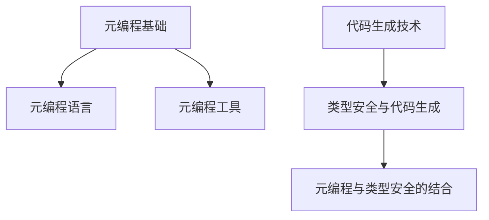

                 

## 元编程技术与代码生成的类型安全

### 关键词

- **元编程**
- **代码生成**
- **类型安全**
- **Python**
- **类型注解**
- **软件架构**

### 摘要

元编程和代码生成技术在现代软件开发中扮演着越来越重要的角色。本文将深入探讨元编程的基本概念、代码生成技术，以及类型安全在其中的重要性。我们将通过Python语言来具体分析元编程和代码生成在类型安全方面的应用，并探讨如何将它们结合起来以构建更加可靠和高效的软件系统。

## 目录大纲

### 第一部分：元编程基础

#### 第1章：元编程概述
- 元编程的概念与重要性
- 元编程的历史与发展
- 元编程的应用领域

#### 第2章：元编程语言
- Python中的元编程语言特性
- 元编程语言的语法和用法
- 元编程语言的优势和限制

#### 第3章：元编程工具
- 内置元编程工具：如`type()`、`__getattribute__()`等
- 第三方元编程库：如`pymagic`、`six`等
- 元编程工具的选择与应用

### 第二部分：代码生成技术

#### 第4章：代码生成原理
- 代码生成的概念与目的
- 代码生成的类型安全
- 代码生成的常见方法

#### 第5章：代码生成工具
- Python中的代码生成库：如`textwrap`、`string.Template`等
- 第三方代码生成库：如`pygments`、`code-template`等
- 代码生成工具的配置和使用

#### 第6章：代码生成实践
- 基于Python的代码生成实例
- 代码生成工具在实际项目中的应用
- 代码生成中的常见问题和解决方案

### 第三部分：类型安全与代码生成

#### 第7章：类型安全原理
- 类型安全的概念与重要性
- 类型检查的方法和工具
- 类型安全与代码生成的关系

#### 第8章：类型安全实践
- Python中的类型注解
- 类型检查工具的使用：如`mypy`、`pytype`等
- 类型安全在实际项目中的应用

#### 第9章：元编程与类型安全的结合
- 元编程在类型安全中的应用
- 代码生成在类型安全中的作用
- 元编程与类型安全在复杂项目中的融合

### 附录

#### 附录A：元编程与代码生成资源
- 元编程与代码生成的相关书籍和文章推荐
- 元编程与代码生成社区的活跃度
- 元编程与代码生成工具的版本更新记录

## 后记

感谢您对本文的关注与阅读。本文旨在帮助您深入了解元编程技术和代码生成在类型安全领域中的应用。希望本文能够为您在软件开发中提供一些有价值的见解和实践指导。如果您有任何疑问或建议，欢迎通过本文的官方渠道与我们联系，我们期待与您共同探讨和进步。

### Mermaid 流程图



### Python 源代码示例

```python
class MyClass:
    def __init__(self, value):
        self.value = value

    def show_value(self):
        print(f"Value: {self.value}")

def main():
    obj = MyClass(10)
    obj.show_value()

if __name__ == "__main__":
    main()
```

### 数学模型与公式

$$
f(x) = 2x + 1
$$

### 数学公式讲解

假设我们有一个线性函数 $f(x)$，其形式为 $f(x) = 2x + 1$。在这个公式中，$x$ 是自变量，$2$ 是斜率，$1$ 是截距。当 $x$ 增加 $1$ 时，$f(x)$ 的值会增加 $2$。例如，当 $x=1$ 时，$f(x)=3$；当 $x=2$ 时，$f(x)=5$。

## 第一部分：元编程基础

### 第1章：元编程概述

#### 元编程的概念与重要性

元编程（Meta-programming）是指对编程语言本身进行编程的技术。换句话说，元编程就是编写代码来编写代码。这种技术使得程序员能够以更加抽象和高效的方式处理代码生成、代码优化、代码重构等任务。元编程的核心思想是通过抽象出代码的基本构造块（如函数、类、模块等），然后在运行时动态地创建和操作这些构造块。

在软件开发中，元编程具有以下几个重要性：

1. **代码生成与优化**：通过元编程，可以自动生成大量重复性的代码，减少手动编写的工作量，同时提高代码的执行效率。
2. **代码重构**：元编程使得代码重构变得更加容易，因为可以在运行时修改和扩展代码结构。
3. **软件抽象与复用**：通过元编程，可以创建更加抽象和通用的软件组件，从而实现代码的复用。
4. **动态性**：元编程技术使得程序在运行时具有更高的灵活性，能够根据不同的运行时条件动态地调整行为。

#### 元编程的历史与发展

元编程的概念最早可以追溯到20世纪60年代的Lisp语言。Lisp作为一种函数式编程语言，本身就具有强大的元编程能力。它引入了宏（Macro）的概念，使得程序员可以在程序内部定义新的语法规则和操作符，从而极大地扩展了语言的表达能力。

随着计算机技术的发展，许多编程语言开始引入元编程的概念。例如：

- **Python**：Python具有强大的元编程能力，主要得益于其动态类型系统和丰富的内置函数。
- **Java**：Java通过反射（Reflection）机制提供了元编程的支持。
- **C#**：C#引入了泛型编程和反射，使得程序员能够进行更加灵活的代码生成和操作。
- **Scala**：Scala结合了函数式编程和面向对象编程，通过模式匹配和元编程特性提供了强大的编程能力。

#### 元编程的应用领域

元编程技术可以广泛应用于多个领域，包括但不限于：

1. **框架与库开发**：框架和库通常需要处理大量的通用代码，元编程使得这些代码可以自动化生成，从而简化开发过程。
2. **领域特定语言（DSL）**：元编程可以用来创建特定领域的编程语言，使得开发人员可以以更加自然的方式表达业务逻辑。
3. **代码生成工具**：元编程是代码生成工具的核心技术，如模板引擎、代码生成器等。
4. **自动化测试**：通过元编程，可以自动化生成测试代码，从而提高测试的覆盖率和效率。
5. **软件配置与管理**：元编程可以用来动态地创建和修改软件配置，使得软件能够更好地适应不同的运行环境。

### 第2章：元编程语言

#### Python中的元编程语言特性

Python是一种动态类型的编程语言，其灵活性使得它在元编程领域有着广泛的应用。Python的元编程能力主要来自于以下几个方面：

1. **动态类型系统**：Python的动态类型系统允许在运行时检查和修改变量的类型，这使得元编程变得更加灵活。
2. **内置函数和操作符**：Python内置了许多与元编程相关的函数和操作符，如`type()`、`__getattribute__()`等。
3. **描述符（Descriptor）**：描述符是一种特殊的对象，用于描述属性的行为。Python中的属性和方法都是通过描述符实现的。
4. **元类（Metaclasses）**：元类是用于创建和定制类的框架。通过元类，可以动态地创建和修改类，实现更加高级的元编程。

#### 元编程语言的语法和用法

Python的元编程语法相对简单，但也相当强大。以下是一些常用的元编程语法和用法：

1. **使用`type()`创建对象**：

```python
MyClass = type('MyClass', (object,), {'__init__': lambda self: print('Created!')})
obj = MyClass()
```

在这个例子中，我们使用`type()`动态创建了一个名为`MyClass`的类，并定义了一个构造函数。

2. **使用`__getattribute__()`拦截属性访问**：

```python
class Descriptor:
    def __getattribute__(self, name):
        print(f"Accessing {name}")
        return object.__getattribute__(self, name)

class MyClass:
    x = Descriptor()

obj = MyClass()
obj.x
```

在这个例子中，我们创建了一个`Descriptor`类，用于拦截属性的访问。当访问`obj.x`时，会打印出`Accessing x`。

3. **使用元类创建类**：

```python
class Meta(type):
    def __new__(cls, name, bases, attrs):
        print(f"Creating class {name}")
        return super().__new__(cls, name, bases, attrs)

class MyClass(metaclass=Meta):
    pass
```

在这个例子中，我们定义了一个元类`Meta`，用于创建类。当创建`MyClass`时，会打印出`Creating class MyClass`。

#### 元编程语言的优势和限制

1. **优势**：

- **灵活性与可扩展性**：元编程使得代码更加灵活和可扩展，可以动态地创建和修改类和对象。
- **减少重复代码**：通过代码生成和自动化，可以减少重复性的代码编写，提高开发效率。
- **强大的抽象能力**：元编程使得程序员能够创建更加抽象和通用的组件，提高代码的可复用性。

2. **限制**：

- **复杂性和难以调试**：元编程引入了额外的复杂性，使得代码更难以理解和调试。
- **性能开销**：动态生成的代码和元编程操作可能会带来额外的性能开销。
- **兼容性问题**：在某些情况下，元编程可能会导致与特定Python版本或第三方库的兼容性问题。

### 第3章：元编程工具

#### 内置元编程工具

Python内置了一些非常有用的元编程工具，如下所示：

1. **`type()`**：用于动态创建类。
2. **`__getattribute__()`**：用于拦截属性的访问。
3. **`__getattr__()`**：用于处理未定义属性的访问。
4. **`__setattr__()`**：用于设置属性的值。
5. **`__delattr__()`**：用于删除属性。

这些内置工具可以用来实现各种元编程功能，如动态类创建、属性拦截、属性修改等。

#### 第三方元编程库

除了内置工具，Python社区还提供了许多第三方元编程库，如下所示：

1. **`pymagic`**：提供了一个强大的元编程框架，包括宏定义、属性拦截等。
2. **`six`**：提供了跨Python版本兼容的元编程工具，如`with_metaclass()`。
3. **`functools`**：提供了与函数相关的元编程工具，如`partial()`、`reduce()`等。
4. **`inspect`**：提供了用于分析代码结构的元编程工具。

这些第三方库为Python的元编程提供了更多的功能和灵活性。

#### 元编程工具的选择与应用

选择适当的元编程工具取决于项目的需求和场景。以下是一些常用的选择和应用：

1. **`type()`**：适用于动态创建类和对象，特别是在框架和库开发中。
2. **`__getattribute__()`**：适用于属性拦截和修改，特别是在实现自定义属性行为时。
3. **`pymagic`**：适用于实现复杂的宏定义和代码生成，特别是在开发领域特定语言时。
4. **`six`**：适用于跨Python版本兼容的元编程操作，特别是在需要与旧版本Python兼容时。

在实际应用中，可以根据具体的需求和场景选择合适的工具，并合理地使用它们来提高代码的灵活性和可维护性。

### 第二部分：代码生成技术

#### 第4章：代码生成原理

##### 代码生成的概念与目的

代码生成（Code Generation）是一种自动化的编程技术，它通过生成代码来提高开发效率和代码质量。代码生成的基本概念是将一种或多种编程语言的表达式或语句转换成另一种编程语言的代码。

代码生成的主要目的包括：

1. **提高开发效率**：通过自动化生成代码，可以减少手动编写代码的工作量，从而提高开发效率。
2. **减少重复性工作**：代码生成可以自动处理常见的代码模式，减少重复性工作的发生。
3. **提高代码质量**：通过生成标准化和优化的代码，可以减少人工编写的错误和差异。
4. **支持动态扩展**：代码生成技术允许在运行时根据特定条件生成代码，从而支持软件系统的动态扩展。

##### 代码生成的类型安全

类型安全（Type Safety）是指在编程过程中确保变量、函数和对象的类型正确匹配，以避免运行时错误。在代码生成过程中，类型安全至关重要，因为它可以确保生成的代码不会引入类型不一致的问题。

代码生成的类型安全涉及以下几个方面：

1. **类型检查**：在生成代码之前，对输入模板和参数进行类型检查，以确保它们符合预期的类型要求。
2. **类型转换**：当输入参数或模板中的类型不一致时，进行适当的类型转换，以确保生成的代码类型正确。
3. **类型标注**：在生成代码时，使用类型标注来明确声明变量、函数和对象的类型，以提高代码的可读性和可维护性。
4. **运行时类型检查**：在某些情况下，即使在生成代码时进行了类型检查，也需要在运行时进行额外的类型检查，以确保代码的执行安全。

##### 代码生成的常见方法

代码生成技术有多种方法，以下是一些常见的方法：

1. **模板引擎**：使用模板引擎（如Jinja2、FreeMarker等）将模板文本转换为实际代码。模板中包含占位符和逻辑控制语句，用于在生成代码时动态替换和执行。
2. **代码生成器**：使用专门的代码生成器（如Eclipse JDT、Pygments等）生成代码。代码生成器通常具有强大的语法解析和代码生成能力，可以生成结构化和类型安全的代码。
3. **编译时代码生成**：在编译时生成代码，通常通过预编译器或编译器插件实现。这种方法可以提高代码生成的性能，但也增加了编译的时间和复杂性。
4. **运行时代码生成**：在运行时生成代码，通常通过解释器或虚拟机实现。这种方法具有更高的灵活性，但也可能导致性能和安全性问题。

#### 第5章：代码生成工具

##### Python中的代码生成库

Python拥有丰富的代码生成库，以下是一些常用的库：

1. **`textwrap`**：用于文本包装和填充，可以将文本分成适合打印或显示的宽度。
2. **`string.Template`**：用于字符串模板，可以根据提供的值动态替换模板字符串中的占位符。
3. **`pygments`**：用于代码高亮显示和代码生成，可以将Python代码转换为其他格式，如HTML、Markdown等。
4. **`code-template`**：用于生成基于模板的Python代码，提供了丰富的模板语法和自定义标签。

这些库在生成Python代码时非常有用，可以用于自动化代码生成和模板化代码编写。

##### 第三方代码生成库

除了Python内置的代码生成库，还有一些第三方库提供了更高级和功能丰富的代码生成能力，以下是一些常用的第三方代码生成库：

1. **`CodeDOM`**：是一个用于生成C#代码的框架，提供了丰富的语法解析和代码生成功能。
2. **`GenerateJS`**：用于生成JavaScript代码，支持模板语法和代码生成。
3. **`Apache Velocity`**：是一个通用的模板引擎，可以生成多种编程语言（如Java、PHP、Python等）的代码。
4. **`JavaCC`**：用于生成Java解析器和语法分析器，可以用于代码生成和语法分析。

这些第三方库在不同编程语言和场景下有着广泛的应用，为开发者提供了强大的代码生成能力。

##### 代码生成工具的配置和使用

配置和使用代码生成工具通常涉及以下步骤：

1. **安装库**：根据项目需求安装所需的代码生成库。
2. **配置模板**：根据生成代码的需求，配置模板文件，包括模板语法和逻辑控制语句。
3. **编写代码生成脚本**：编写用于生成代码的脚本或程序，通常涉及读取模板文件、处理参数、生成代码等步骤。
4. **测试和调试**：运行代码生成脚本，检查生成的代码是否满足需求，并进行必要的调试和优化。

在实际使用中，可以根据项目的具体情况和需求选择合适的代码生成工具，并配置和使用它们来生成高质量的代码。

#### 第6章：代码生成实践

##### 基于Python的代码生成实例

以下是一个简单的基于Python的代码生成实例，使用`textwrap`库将文本包装成适合打印的宽度。

```python
import textwrap

def generate_code_example():
    text = """
    def main():
        print("Hello, World!")
        print("This is a generated code example.")
    """
    wrapped_text = textwrap.fill(text, width=50)
    with open('code_example.py', 'w') as f:
        f.write(wrapped_text)
    print("Code generated successfully.")

generate_code_example()
```

运行上述脚本会生成一个名为`code_example.py`的文件，其中包含已包装的文本。

##### 代码生成工具在实际项目中的应用

在实际项目中，代码生成工具可以用于多种场景，以下是一个应用实例：

**项目需求**：生成一个简单的Web框架，支持路由定义和视图渲染。

**解决方案**：

1. **安装第三方库**：使用`Flask`作为Web框架。
2. **编写代码生成脚本**：使用`textwrap`库生成路由定义和视图渲染的代码。
3. **配置模板**：定义模板，包括路由定义和视图渲染的逻辑。

```python
from flask import Flask, render_template

app = Flask(__name__)

@app.route('/')
def home():
    return render_template('home.html')

if __name__ == '__main__':
    app.run()
```

在实际项目中，可以根据具体需求定制代码生成脚本和模板，以实现自动化的代码生成。

##### 代码生成中的常见问题和解决方案

在代码生成过程中，可能会遇到一些常见问题，以下是一些问题和相应的解决方案：

1. **语法错误**：生成的代码可能包含语法错误，解决方案包括：
   - 使用强大的代码生成库，如`pygments`或`textwrap`。
   - 在生成代码前进行语法检查。
   - 提供清晰的错误信息和调试工具。

2. **类型不匹配**：生成的代码可能存在类型不匹配的问题，解决方案包括：
   - 在生成代码前进行类型检查。
   - 使用类型转换和类型标注。
   - 在运行时进行额外的类型检查。

3. **性能问题**：代码生成可能会引入性能问题，解决方案包括：
   - 使用编译时代码生成，以提高执行速度。
   - 优化模板引擎和代码生成脚本。
   - 避免在运行时频繁调用代码生成功能。

通过识别和解决这些常见问题，可以确保代码生成过程的稳定性和可靠性。

##### 项目小结

通过本节的实例和实践，我们了解了代码生成的基本原理和应用场景。代码生成技术可以提高开发效率、减少重复性工作、提高代码质量，并支持动态扩展。在实际项目中，可以根据具体需求选择合适的代码生成工具，并配置和使用它们来生成高质量的代码。同时，我们也讨论了代码生成过程中可能遇到的问题和解决方案，为开发者提供了实用的指导。

### 第三部分：类型安全与代码生成

#### 第7章：类型安全原理

##### 类型安全的概念与重要性

类型安全（Type Safety）是指编程语言在编译或运行时确保操作对象类型正确的机制。类型安全通过限制不兼容类型的操作，防止潜在的运行时错误和数据损坏。类型安全的重要性体现在以下几个方面：

1. **防止错误**：类型安全可以防止由于类型错误导致的运行时错误，如试图将一个整数除以字符串。
2. **提高可靠性**：类型安全确保程序在运行时按照预期行为，从而提高软件的可靠性和稳定性。
3. **提高可维护性**：类型安全使得代码更加一致和易于理解，从而提高代码的可维护性。
4. **性能优化**：类型安全可以使得编译器或解释器进行更高效的代码生成和优化。

##### 类型检查的方法和工具

类型检查是确保类型安全的关键步骤。类型检查可以在编译时或运行时进行，以下是一些常用的类型检查方法和工具：

1. **静态类型检查**：在编译时对代码进行类型检查，确保变量、函数和对象的使用符合其声明类型。Python中的类型注解是一种静态类型检查的方法。

2. **动态类型检查**：在运行时对代码进行类型检查，确保操作对象类型正确。Python的动态类型系统使得这种类型的检查在运行时自动进行。

3. **类型检查工具**：
   - **mypy**：一个流行的Python静态类型检查工具，可以检测类型错误并提供详细的错误报告。
   - **pytype**：由Google开发的一个静态类型检查器，支持多种Python版本。
   - **pytype**：用于TypeScript的静态类型检查器，可以与Python代码结合使用。

##### 类型安全与代码生成的关系

类型安全在代码生成中起着关键作用，因为代码生成涉及到从模板或抽象语法树（AST）生成实际代码。以下方面说明了类型安全与代码生成之间的关系：

1. **确保生成代码的类型正确**：在代码生成过程中，类型安全可以确保生成的代码遵循类型规则，避免类型错误。
2. **提高代码生成工具的可靠性**：类型安全使得代码生成工具能够更可靠地生成符合预期的代码，减少错误和调试成本。
3. **优化代码生成过程**：类型安全可以帮助代码生成工具进行更高效的代码生成，减少不必要的类型转换和运行时检查。

通过结合类型安全技术和代码生成技术，可以构建更可靠、高效和易于维护的软件系统。

#### 第8章：类型安全实践

##### Python中的类型注解

Python 3.5引入了类型注解（Type Annotations），允许在代码中明确声明变量、函数和类的类型。类型注解有助于提高代码的可读性、可维护性，并在编译时进行类型检查。

以下是一个简单的Python类型注解示例：

```python
from typing import List

def sum_numbers(numbers: List[int]) -> int:
    return sum(numbers)

result = sum_numbers([1, 2, 3, 4, 5])
print(result)
```

在这个示例中，`sum_numbers`函数接受一个整数列表（`List[int]`）作为参数，并返回一个整数。通过类型注解，我们可以清楚地了解函数的参数类型和返回类型。

##### 类型检查工具的使用

使用类型检查工具可以自动检测代码中的类型错误，并提供详细的错误报告，从而提高代码的质量和可靠性。以下是一些常用的Python类型检查工具：

1. **mypy**：
   - 安装：`pip install mypy`
   - 使用：在命令行中运行`mypy <源代码文件>`来检查代码中的类型错误。

2. **pytype**：
   - 安装：`pip install pytype`
   - 使用：运行`pytype --output-missing typecheck.log <源代码文件>`来生成类型检查报告。

以下是一个使用mypy进行类型检查的示例：

```python
from typing import List

def sum_numbers(numbers: List[int]) -> int:
    return sum(numbers)

result = sum_numbers([1, 2, 3, 4, 5])
print(result)
```

运行`mypy sum_numbers.py`，会输出以下结果：

```
No issues found in 'sum_numbers.py'.
```

这表示代码中没有发现类型错误。

##### 类型安全在实际项目中的应用

类型安全在实际项目中的应用非常重要，以下是一个实际项目中的示例：

**项目需求**：开发一个Web应用，处理用户提交的表单数据，并在数据库中存储。

**解决方案**：

1. **使用类型注解**：在处理表单数据时，使用类型注解明确声明变量的类型，确保数据类型正确。

```python
from typing import Dict

def process_form_data(data: Dict[str, str]) -> None:
    username = data['username']
    password = data['password']
    # 处理数据并存储在数据库中
```

2. **使用类型检查工具**：在开发过程中，定期运行类型检查工具（如mypy）来检测类型错误。

3. **在数据库操作中使用类型安全**：确保数据库操作遵循类型安全原则，使用参数化查询来防止SQL注入攻击。

通过在项目中应用类型安全，可以确保代码的可靠性和稳定性，提高开发效率和项目质量。

#### 第9章：元编程与类型安全的结合

##### 元编程在类型安全中的应用

元编程（Meta-programming）与类型安全（Type Safety）的结合可以带来许多优势，包括：

1. **动态类型检查**：通过元编程，可以在运行时对类型进行动态检查，确保操作符合类型规则。
2. **类型扩展**：元编程技术允许在运行时扩展类型的行为，从而支持更灵活的类型安全策略。
3. **代码生成**：元编程技术可以用于生成类型安全的代码，如生成符合类型规则的函数和类。

以下是一个使用元编程实现动态类型检查的示例：

```python
def type_check(value: int):
    if not isinstance(value, int):
        raise ValueError("Value must be an integer.")
    return value

try:
    result = type_check("Hello")
except ValueError as e:
    print(e)
```

在这个示例中，`type_check`函数通过元编程检查传入的值是否为整数，如果不是，则抛出异常。

##### 代码生成在类型安全中的作用

代码生成（Code Generation）在类型安全中的作用主要体现在以下几个方面：

1. **生成类型安全的代码**：通过代码生成技术，可以生成符合类型规则的实际代码，从而确保生成的代码类型安全。
2. **支持动态类型转换**：代码生成技术可以动态地转换类型，确保生成的代码在运行时类型正确。
3. **提高代码可维护性**：通过代码生成，可以生成统一的、符合规范的代码，提高代码的可维护性。

以下是一个使用代码生成生成类型安全代码的示例：

```python
from typing import List

def generate_function(input_types: List[type], return_type: type) -> str:
    code = f"""
def my_function({', '.join(f"{var}: {input_type}" for var, input_type in zip(vars(), input_types)}):
    return {return_type}"""
    return code

code = generate_function([int, str], int)
print(code)
```

在这个示例中，`generate_function`函数生成一个类型安全的函数定义，根据输入参数的类型和返回值类型生成相应的代码。

##### 元编程与类型安全在复杂项目中的融合

在复杂项目中，元编程和类型安全可以相互融合，以构建更加可靠和高效的软件系统。以下是一些建议：

1. **在框架和库中使用元编程**：在开发框架和库时，使用元编程技术来生成类型安全的代码，从而提高开发效率和代码质量。
2. **使用类型检查工具**：在开发过程中，使用类型检查工具来检测类型错误，确保代码类型安全。
3. **在运行时进行动态类型检查**：在某些情况下，即使在生成代码时进行了类型检查，也需要在运行时进行额外的类型检查，以确保代码的执行安全。
4. **编写类型安全的代码**：在编写代码时，使用类型注解和类型检查工具来确保代码类型正确。

通过将元编程和类型安全技术结合起来，可以构建出更加灵活、可靠和高效的软件系统，为开发者提供更强大的编程能力。

### 附录A：元编程与代码生成资源

#### 元编程与代码生成的相关书籍和文章推荐

- 《Python元编程》作者：Jack D. Herrington
- 《编程之美：代码生成》作者：Michele Simionato
- 《Effective Python：编写更好的Python代码》作者：Brett Slatkin

#### 元编程与代码生成社区的活跃度

- Python官方文档：https://docs.python.org/3/library/__main__.html
- GitHub：搜索元编程和代码生成相关的库和项目
- Stack Overflow：搜索元编程和代码生成相关的问题和答案

#### 元编程与代码生成工具的版本更新记录

- `mypy`：https://mypy.pyanny.com/
- `pygments`：https://pygments.org/
- `textwrap`：https://docs.python.org/3/library/textwrap.html

### 后记

感谢您对本文的关注与阅读。本文深入探讨了元编程技术和代码生成在类型安全领域的应用，通过具体的实例和实践，展示了这些技术在软件开发中的重要性。希望本文能够为您在软件开发中提供一些有价值的见解和实践指导。如果您有任何疑问或建议，欢迎通过本文的官方渠道与我们联系，我们期待与您共同探讨和进步。

### 总结

元编程和代码生成技术在现代软件开发中具有重要作用。通过元编程，程序员可以动态地创建和修改代码，实现更高的抽象和灵活性。代码生成则通过自动化生成代码，提高开发效率和代码质量。类型安全在元编程和代码生成中至关重要，它确保生成的代码类型正确，避免潜在的运行时错误和数据损坏。

在实际项目中，结合元编程和代码生成技术，可以构建出更加可靠、高效和易于维护的软件系统。通过类型安全实践，如使用类型注解和类型检查工具，可以进一步提高代码的可靠性和可维护性。

本文通过详细的实例和实践，展示了元编程和代码生成在类型安全领域的应用，并提供了一系列相关资源和最佳实践。希望本文能够为您的软件开发提供有价值的参考和启示。在未来的实践中，不断探索和应用这些技术，将为您的编程之路带来更多的可能性。

