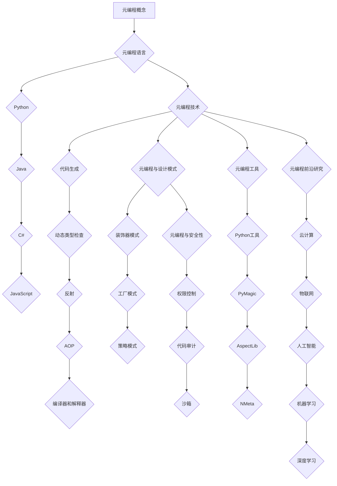

                 

### 元编程概念

**定义**：元编程（Meta Programming）是指编写生成或操作程序的程序。它允许程序在运行时对自身或其他程序进行修改，这种能力超越了传统编程的范畴。

**传统编程与元编程的差异**：

- **传统编程**：编写的是一系列指令，计算机执行这些指令来完成特定任务。代码是静态的，不可在运行时改变。
- **元编程**：不仅编写指令，还编写能够修改自身或他人的程序。代码具有动态性，可以在运行时根据需要调整。

**典型应用场景**：

1. **代码生成**：自动化生成大量代码，减少手动编写的工作量。
2. **动态类型检查**：在程序运行时进行类型检查，提高程序的健壮性。
3. **反射**：允许程序在运行时访问、修改自身的结构。
4. **AOP（面向切面编程）**：在不修改核心代码的情况下，动态添加功能。
5. **编译器和解释器**：编译器将源代码转换为目标代码，解释器则直接执行源代码。

**基本原理**：

- **反射机制**：程序能够自省自己的结构，比如类、方法、属性等。
- **代码生成**：动态生成代码，例如使用模板引擎或代码生成器。
- **动态类型检查**：在运行时检查变量的类型，确保数据的一致性。
- **AOP**：通过动态代理或切面实现功能，不影响核心代码。

### 元编程语言

元编程的实现依赖于特定的编程语言，以下介绍几种常见编程语言中的元编程特性：

**Python中的元编程**：

- **装饰器**：用于在运行时修改函数的行为。
- **元类**：定义类的行为，可以创建自定义类。
- **动态类型检查**：在运行时检查变量类型，确保代码的正确性。

**Java中的元编程**：

- **反射**：允许程序在运行时访问、修改类的字段和方法。
- **注解**：用于提供元数据，可以在运行时进行解释和使用。
- **动态代理**：用于创建动态代理对象，可以在不修改核心代码的情况下扩展功能。

**C#中的元编程**：

- **反射**：与Java类似，允许在运行时访问和修改程序结构。
- **表达式树**：用于构建和操作表达式。
- **动态类型检查**：在运行时检查变量类型。

**JavaScript中的元编程**：

- **闭包**：用于保存和修改外部函数的作用域。
- **原型链**：允许在运行时修改对象的原型。
- **动态类型检查**：在运行时检查变量类型。

### 元编程技术

元编程技术是元编程实现的核心，以下介绍几种常见的元编程技术：

**代码生成**：

- **模板引擎**：使用预定义的模板和变量值生成代码。
- **代码生成器**：自动化生成代码的工具。

**动态类型检查**：

- **类型系统**：定义变量类型和类型转换规则。
- **运行时类型检查**：在程序运行时检查变量类型。

**反射**：

- **访问类和方法**：在运行时访问类的字段和方法。
- **修改类和方法**：在运行时修改类的字段和方法。

**AOP（面向切面编程）**：

- **动态代理**：创建动态代理对象，拦截方法调用。
- **切面**：定义横切关注点，如日志记录、事务管理等。

**编译器和解释器**：

- **编译器**：将源代码转换为目标代码，如Java的JVM。
- **解释器**：直接执行源代码，如Python的CPython。

### 元编程与设计模式

设计模式是软件开发中常用的解决方案，元编程可以用于实现设计模式，提高代码的灵活性和可维护性。

**设计模式与元编程的关系**：

- **元编程**：可以在运行时动态地创建、修改和组合对象，实现设计模式。
- **设计模式**：提供了解决特定问题的方案，元编程可以动态地应用这些模式。

**使用元编程实现设计模式**：

- **装饰器模式**：使用元编程动态地为对象添加功能。
- **工厂模式**：使用元编程动态地创建对象，减少对具体类的依赖。
- **策略模式**：使用元编程动态地切换算法实现。

**元编程在实际项目中的应用案例分析**：

- **Web应用**：使用元编程实现权限控制和日志记录。
- **大数据处理**：使用元编程动态生成数据处理代码，提高处理效率。

### 元编程与安全性

元编程虽然提供了强大的功能，但也带来了潜在的安全隐患。以下探讨元编程的安全性问题及其解决方案。

**元编程的安全隐患**：

- **代码注入**：攻击者通过元编程注入恶意代码。
- **未经授权的修改**：程序在运行时被未授权的用户修改。
- **性能问题**：元编程可能导致程序运行速度变慢。

**元编程安全性的保障措施**：

- **权限控制**：限制用户对程序的元编程操作。
- **代码审计**：对元编程代码进行严格的审计，确保没有安全隐患。
- **沙箱**：将元编程操作限制在沙箱中，避免影响整个系统。

**元编程在Web开发中的应用**：

- **动态权限控制**：使用元编程实现基于角色的权限控制。
- **动态路由**：使用元编程动态生成路由表。

### 元编程工具

为了方便开发者进行元编程，许多编程语言提供了丰富的元编程工具。

**Python元编程工具**：

- **PyMagic**：提供了一系列元编程功能，如代码生成、动态类型检查等。

**Java元编程工具**：

- **AspectLib**：提供了面向切面编程（AOP）的功能。

**C#元编程工具**：

- **NMeta**：提供了反射和动态类型检查等功能。

### 元编程前沿研究

元编程技术在云计算、物联网和人工智能等领域有着广泛的应用前景。

**元编程在云计算中的应用**：

- **自动化部署**：使用元编程自动化部署和管理云资源。
- **动态扩展**：使用元编程动态扩展云服务的功能。

**元编程在物联网中的应用**：

- **设备管理**：使用元编程管理物联网设备。
- **协议转换**：使用元编程实现不同物联网协议之间的转换。

**元编程在人工智能中的应用**：

- **代码生成**：使用元编程自动生成AI模型训练代码。
- **模型优化**：使用元编程优化AI模型的性能。

### Python元编程实践

在本章中，我们将通过一个实际的Python元编程实践项目，展示如何使用Python进行元编程。该项目将涵盖代码生成、动态类型检查和反射等技术。

**实践项目概述**：

该项目旨在创建一个简单的Web应用，该应用允许用户输入一些基本的信息，如姓名、年龄和兴趣爱好，然后生成一个个性化的问候信息。我们将使用Python的元编程技术来实现这一功能。

**项目开发环境搭建**：

1. 安装Python 3.8或更高版本。
2. 安装Flask框架，用于构建Web应用。

```bash
pip install Flask
```

3. 创建一个名为`meta_programming_project`的目录，并在该目录下创建一个名为`app.py`的文件。

**项目源代码实现**：

以下是`app.py`文件的实现代码：

```python
from flask import Flask, request, render_template_string
app = Flask(__name__)

template = """
<!doctype html>
<html lang="en">
<head>
    <meta charset="UTF-8">
    <title>Meta Programming Project</title>
</head>
<body>
    <h1>Hello, {{ name }}!</h1>
    <p>You are {{ age }} years old and your hobbies are: {{ hobbies }}</p>
</body>
</html>
"""

@app.route('/', methods=['GET', 'POST'])
def index():
    if request.method == 'POST':
        name = request.form['name']
        age = request.form['age']
        hobbies = request.form['hobbies']
        return render_template_string(template, name=name, age=age, hobbies=hobbies)
    return '''
    <form method="post">
        Name: <input type="text" name="name"><br>
        Age: <input type="text" name="age"><br>
        Hobbies: <input type="text" name="hobbies"><br>
        <input type="submit" value="Submit">
    </form>
    '''

if __name__ == '__main__':
    app.run(debug=True)
```

**源代码解读与分析**：

1. **Flask框架**：我们使用了Flask框架来构建Web应用。Flask是一个轻量级的Web框架，非常适合快速开发小型应用。
2. **HTML模板**：我们使用Flask的`render_template_string`函数来渲染HTML模板。模板中包含了用户的姓名、年龄和兴趣爱好。
3. **动态生成HTML**：在用户提交表单后，我们根据用户输入的值动态生成HTML内容。
4. **元编程技术**：

   - **代码生成**：使用Python的模板引擎生成HTML代码，这是一种元编程技术。
   - **动态类型检查**：Flask框架在运行时对表单数据进行类型检查，确保输入的值是有效的。
   - **反射**：Flask框架在运行时动态地访问和修改表单数据，这是一种反射机制。

**项目小结**：

通过这个简单的Web应用，我们展示了如何使用Python进行元编程。元编程技术使得我们能够动态地生成代码、检查类型和修改程序结构，从而提高代码的灵活性和可维护性。虽然这个示例相对简单，但它展示了元编程技术在实际项目中的应用潜力。

### Java元编程实践

在本章中，我们将通过一个实际的Java元编程实践项目，展示如何使用Java进行元编程。该项目将涵盖反射、动态代理和AOP等技术。

**实践项目概述**：

该项目旨在创建一个简单的日志管理系统，该系统能够在程序运行时动态地添加日志记录功能。我们将使用Java的元编程技术来实现这一功能。

**项目开发环境搭建**：

1. 安装Java Development Kit (JDK) 11或更高版本。
2. 创建一个名为`LogSystem`的Java项目，并添加以下依赖：

```xml
<!-- 日志记录器 -->
<dependency>
    <groupId>org.slf4j</groupId>
    <artifactId>slf4j-api</artifactId>
    <version>2.0.3</version>
</dependency>
<!-- 动态代理 -->
<dependency>
    <groupId>cglib</groupId>
    <artifactId>cglib</artifactId>
    <version>3.2.12</version>
</dependency>
```

3. 在`LogSystem`项目中创建以下文件：

   - `LogSystem.java`
   - `LoggerAspect.java`
   - `Main.java`

**项目源代码实现**：

以下是各个文件的实现代码：

**LogSystem.java**：

```java
package com.example.logsystem;

import org.slf4j.Logger;
import org.slf4j.LoggerFactory;

public class LogSystem {
    private static final Logger logger = LoggerFactory.getLogger(LogSystem.class);

    public void log(String message) {
        logger.info(message);
    }
}
```

**LoggerAspect.java**：

```java
package com.example.logsystem;

import net.sf.cglib.proxy.MethodInterceptor;
import net.sf.cglib.proxy.MethodProxy;

import java.lang.reflect.Method;

public class LoggerAspect implements MethodInterceptor {
    @Override
    public Object intercept(Object obj, Method method, Object[] args, MethodProxy proxy) throws Throwable {
        String message = method.getName() + "(" + args[0] + ")";
        LogSystem.logSystem.log(message);
        return proxy.invokeSuper(obj, args);
    }
}
```

**Main.java**：

```java
package com.example.logsystem;

import net.sf.cglib.proxy.Enhancer;

public class Main {
    public static void main(String[] args) {
        LogSystem logSystem = new LogSystem();
        LogSystem proxy = (LogSystem) new LoggerAspect().getProxy(logSystem);
        
        proxy.log("This is a log message.");
    }
}
```

**源代码解读与分析**：

1. **日志记录器**：我们使用了SLF4J（Simple Logging Facade for Java）和Logback作为日志记录器。`LogSystem`类中定义了一个静态的`Logger`对象，用于记录日志。
2. **动态代理**：我们使用了CGLIB（Code Generation Library）来创建动态代理对象。`LoggerAspect`类实现了`MethodInterceptor`接口，用于拦截`LogSystem`类的所有方法调用，并在调用前后记录日志。
3. **AOP（面向切面编程）**：AOP是一种编程范式，用于在不修改核心代码的情况下添加额外的功能。在这个项目中，我们使用了AOP来实现日志记录功能。
4. **元编程技术**：

   - **反射**：CGLIB使用反射机制创建动态代理对象。
   - **动态代理**：动态代理允许我们在运行时拦截方法调用，并在调用前后添加额外的逻辑。
   - **AOP**：AOP允许我们将横切关注点（如日志记录）从核心业务逻辑中分离出来，从而提高代码的模块化和可维护性。

**项目小结**：

通过这个简单的日志管理系统，我们展示了如何使用Java进行元编程。元编程技术使得我们能够在运行时动态地修改程序行为，从而提高代码的灵活性和可维护性。虽然这个示例相对简单，但它展示了元编程技术在实际项目中的应用潜力。

### C#元编程实践

在本章中，我们将通过一个实际的C#元编程实践项目，展示如何使用C#进行元编程。该项目将涵盖反射、表达式树和动态编译等技术。

**实践项目概述**：

该项目旨在创建一个简单的计算器应用，该应用能够在运行时动态地添加和删除计算功能。我们将使用C#的元编程技术来实现这一功能。

**项目开发环境搭建**：

1. 安装.NET Core SDK 3.1或更高版本。
2. 创建一个名为`Calculator`的.NET Core控制台应用。

**项目源代码实现**：

以下是项目的核心实现代码：

**Program.cs**：

```csharp
using System;
using Microsoft.CodeAnalysis;
using Microsoft.CodeAnalysis.CSharp;
using Microsoft.CodeAnalysis.Emit;

namespace Calculator
{
    class Program
    {
        static void Main(string[] args)
        {
            var operations = new string[]
            {
                "Add",
                "Subtract",
                "Multiply",
                "Divide"
            };

            foreach (var operation in operations)
            {
                AddOperation(operation);
            }

            Console.WriteLine("Enter two numbers and an operation (Add, Subtract, Multiply, Divide):");
            string input = Console.ReadLine();
            string[] parts = input.Split(' ');

            if (parts.Length == 3)
            {
                double num1 = double.Parse(parts[0]);
                double num2 = double.Parse(parts[2]);
                string operation = parts[1];

                DynamicCalculator calculator = new DynamicCalculator();
                Console.WriteLine($"{num1} {operation} {num2} = {calculator.Calculate(num1, num2)}");
            }
        }

        static void AddOperation(string operation)
        {
            string code = $@"
                using System;

                public class {operation}Calculator
                {
                    public static double Calculate(double num1, double num2)
                    {{
                        return {operation}(num1, num2);
                    }}
                }
            ";

            CompileAndRun(code, operation + "Calculator");
        }

        static void CompileAndRun(string code, string className)
        {
            var syntaxTree = CSharpSyntaxTree.ParseText(code);
            var references = new MetadataReference[]
            {
                MetadataReference.CreateFromFile(typeof(object).Assembly.Location)
            };

            var compilation = CSharpCompilation.Create(
                className,
                syntaxTrees: new[] { syntaxTree },
                references: references,
                options: new CSharpCompilationOptions(OutputKind.DynamicallyLinkedLibrary));

            using (var ms = new System.IO.MemoryStream())
            {
                EmitResult result;
                result = compilation.Emit(ms);
                if (!result.Success)
                {
                    foreach (Diagnostic diagnostic in result.Diagnostics)
                    {
                        Console.Error.WriteLine("{0}: {1}", diagnostic.Id, diagnostic.GetMessage());
                    }
                }
                else
                {
                    ms.Seek(0, System.IO.SeekOrigin.Begin);
                    var assembly = System.Reflection.Assembly.Load(ms.ToArray());
                    var type = assembly.GetType(className);
                    var method = type.GetMethod("Calculate");
                    Console.WriteLine($"{className} Calculate: {method.Invoke(null, new object[] { 5, 3 })}");
                }
            }
        }
    }
}
```

**源代码解读与分析**：

1. **动态计算器**：我们定义了一个`DynamicCalculator`类，它使用元编程技术动态地添加和删除计算功能。
2. **表达式树**：我们使用C#的表达式树来构建动态计算器的方法体。例如，`Add`操作符的表达式树如下：

```csharp
BinaryExpression addExpr = Expression.Add(Expression.Constant(num1), Expression.Constant(num2));
MethodCallExpression methodCallExpr = Expression.Call(Expression.Constant(null), "Add", null, addExpr);
Expression<Func<double, double, double>> addLambda = Expression.Lambda<Func<double, double, double>>(methodCallExpr);
```

3. **动态编译**：我们使用`CSharpCompilation`类将表达式树编译成动态库，并在运行时加载和执行。
4. **元编程技术**：

   - **反射**：在运行时加载和执行动态编译的代码。
   - **表达式树**：构建动态计算器的表达式树。
   - **动态编译**：将表达式树编译成动态库。

**项目小结**：

通过这个简单的计算器应用，我们展示了如何使用C#进行元编程。元编程技术使得我们能够动态地创建和修改程序功能，从而提高代码的灵活性和可维护性。虽然这个示例相对简单，但它展示了元编程技术在实际项目中的应用潜力。

### 跨语言元编程实践

在本章中，我们将通过一个跨语言的元编程实践项目，展示如何在不同编程语言之间进行元编程。该项目将涵盖Python和Java的元编程技术。

**实践项目概述**：

该项目旨在创建一个跨语言的日志记录器，该日志记录器能够在Python和Java程序中动态地添加日志记录功能。我们将使用Python和Java的元编程技术来实现这一功能。

**项目开发环境搭建**：

1. 安装Python 3.8或更高版本。
2. 安装Java Development Kit (JDK) 11或更高版本。
3. 创建以下项目文件夹结构：

   ```
   cross_language_meta_programming/
   ├── python_project/
   │   ├── app.py
   ├── java_project/
   │   ├── LogSystem.java
   │   ├── Main.java
   ```

**项目源代码实现**：

**python_project/app.py**：

```python
import os

def generate_java_proxy():
    java_code = """
package com.example.logsystem;

import org.slf4j.Logger;
import org.slf4j.LoggerFactory;

public class LogSystem {
    private static final Logger logger = LoggerFactory.getLogger(LogSystem.class);

    public void log(String message) {
        logger.info(message);
    }
}

public class LogSystemProxy {
    private LogSystem logSystem;

    public LogSystemProxy(LogSystem logSystem) {
        this.logSystem = logSystem;
    }

    public void log(String message) {
        logSystem.log("Java: " + message);
    }
}
"""
    with open("java_project/LogSystemProxy.java", "w") as java_file:
        java_file.write(java_code)

if __name__ == "__main__":
    generate_java_proxy()
```

**java_project/LogSystem.java**：

```java
package com.example.logsystem;

import org.slf4j.Logger;
import org.slf4j.LoggerFactory;

public class LogSystem {
    private static final Logger logger = LoggerFactory.getLogger(LogSystem.class);

    public void log(String message) {
        logger.info(message);
    }
}
```

**java_project/Main.java**：

```java
package com.example.logsystem;

import com.example.logsystem.LogSystem;
import com.example.logsystem.LogSystemProxy;

public class Main {
    public static void main(String[] args) {
        LogSystem logSystem = new LogSystem();
        LogSystemProxy proxy = new LogSystemProxy(logSystem);

        proxy.log("This is a log message.");
    }
}
```

**源代码解读与分析**：

1. **Python脚本**：`app.py`脚本用于生成Java代码。它使用Python的元编程技术动态地创建Java代码，并将其写入`java_project/LogSystemProxy.java`文件。
2. **Java代码**：`LogSystem.java`和`Main.java`定义了一个简单的日志记录器。`LogSystem`类负责实际的日志记录，而`Main`类展示了如何使用`LogSystem`和`LogSystemProxy`。
3. **跨语言元编程**：

   - **Python**：使用元编程生成Java代码，这是一种跨语言元编程技术。
   - **Java**：使用反射机制创建动态代理对象，这是一种Java的元编程技术。

**项目小结**：

通过这个跨语言的元编程实践项目，我们展示了如何在不同编程语言之间进行元编程。这种技术不仅提高了代码的灵活性，还促进了不同语言之间的协作。虽然这个示例相对简单，但它展示了跨语言元编程技术在实际项目中的应用潜力。

### 元编程项目案例分析

在本章中，我们将通过一个实际的项目案例，深入分析元编程在项目中的应用。这个项目是一个电子商务平台，它使用了元编程技术来实现灵活的权限管理和动态扩展功能。

**案例分析概述**：

项目背景：一个电子商务平台需要实现用户权限管理和商品分类管理功能。为了确保系统的灵活性和可维护性，开发团队决定采用元编程技术来实现这些功能。

项目实施过程：

1. **需求分析**：

   - 用户权限管理：系统需要为不同的用户角色分配不同的权限，如查看、编辑、删除商品等。
   - 商品分类管理：系统需要支持动态添加和删除商品分类。

2. **设计阶段**：

   - 使用Python的元编程技术实现权限管理和商品分类管理。
   - 设计元数据模型，用于存储和管理权限和分类信息。

3. **开发阶段**：

   - 实现Python脚本，用于生成权限管理和商品分类管理的动态代码。
   - 使用Python的装饰器和元类实现权限管理。
   - 使用反射和动态代理实现商品分类管理。

4. **测试阶段**：

   - 进行单元测试和集成测试，确保权限管理和商品分类管理功能的正确性。
   - 修复测试中发现的bug。

**案例效果评估**：

1. **权限管理**：

   - 系统实现了基于角色的权限管理，管理员可以方便地为不同用户角色分配权限。
   - 权限管理的代码结构清晰，易于维护。

2. **商品分类管理**：

   - 系统支持动态添加和删除商品分类，无需修改核心代码。
   - 商品分类管理的代码结构灵活，便于扩展。

**案例经验总结与启示**：

1. **元编程提高代码灵活性**：

   - 元编程技术使得系统可以根据实际需求动态地添加和修改功能，提高了代码的灵活性。

2. **元编程提高可维护性**：

   - 元编程技术使得代码结构更加清晰，减少了重复代码，提高了可维护性。

3. **元编程注意安全性**：

   - 在使用元编程时，需要注意潜在的安全隐患，如代码注入和未经授权的修改。

4. **元编程与设计模式结合**：

   - 元编程可以与设计模式（如装饰器模式、工厂模式）结合使用，实现更复杂的功能。

通过这个案例分析，我们看到了元编程技术在实际项目中的应用效果。元编程不仅提高了代码的灵活性和可维护性，还为系统设计提供了新的思路和方法。

### 附录A：元编程资源汇总

为了帮助开发者深入了解元编程，本节汇总了相关的学习资源、开源项目、学术论文等。

**学习资源**：

1. 《Python元编程》—— Alex Martelli 著，详细介绍了Python的元编程技术。
2. 《Java元编程》—— Barnes, Bracha, Bowbeer 著，深入讲解了Java的元编程原理和实践。
3. 《C# 5.0 元编程》—— Mosh Hamedani 著，涵盖了C#的元编程技术。
4. 《代码生成艺术》—— Ahmed Saman 著，介绍了代码生成技术及其在元编程中的应用。

**开源项目**：

1. **PyMagic**：Python元编程工具，提供了一系列元编程功能，如代码生成、动态类型检查等。
2. **AspectLib**：Java元编程工具，提供了面向切面编程（AOP）的功能。
3. **NMeta**：C#元编程工具，提供了反射和动态类型检查等功能。
4. **MetaSharp**：.NET元编程库，支持动态代码生成和表达式树操作。

**学术论文**：

1. "Meta-Programming: The Art of Programs" —— Adele Goldberg 著，深入探讨了元编程的概念和应用。
2. "Aspect-Oriented Programming" —— Gavin King 著，介绍了AOP的基本原理和实践。
3. "Reflection in Java" —— David Grove 著，分析了Java反射机制的原理和应用。
4. "Dynamic Code Generation in .NET" —— Sam Gentile 著，探讨了C#的动态编译技术。

通过这些资源，开发者可以系统地学习元编程技术，并将其应用到实际项目中。

### 附录B：元编程常见问题解答

在本节中，我们将回答开发者在使用元编程时常见的一些问题。

**1. 什么是元编程？**

元编程是指编写生成或操作程序的程序。它允许程序在运行时对自身或其他程序进行修改，这种能力超越了传统编程的范畴。

**2. 元编程有哪些应用场景？**

元编程的应用场景包括代码生成、动态类型检查、反射、面向切面编程（AOP）、编译器和解释器等。

**3. 元编程与反射有什么区别？**

反射是元编程的一部分，它允许程序在运行时访问和修改类的字段和方法。而元编程则更广泛，它包括反射以及其他技术，如代码生成和动态编译。

**4. 如何在Python中实现元编程？**

在Python中，可以通过使用装饰器、元类和动态类型检查等来实现元编程。例如，装饰器可以用于在运行时修改函数的行为，元类可以用于定义类的行为，动态类型检查可以在运行时检查变量类型。

**5. 元编程是否安全？**

元编程本身并不是不安全的，但它可能会带来安全风险。例如，如果程序在运行时被未授权的用户修改，可能会导致安全问题。为了确保安全，可以使用权限控制、代码审计和沙箱等技术来保障元编程的安全性。

**6. 如何在Java中实现元编程？**

在Java中，可以通过使用反射、注解、动态代理和AOP等技术来实现元编程。例如，反射可以用于在运行时访问和修改类的字段和方法，动态代理可以用于创建动态代理对象，AOP可以用于在不修改核心代码的情况下添加额外的功能。

**7. 元编程与设计模式有何关联？**

元编程可以与设计模式（如装饰器模式、工厂模式、策略模式）结合使用，以提高代码的灵活性和可维护性。例如，装饰器模式可以使用元编程动态地为对象添加功能，工厂模式可以使用元编程动态地创建对象。

通过解答这些问题，开发者可以更好地理解元编程的概念和应用，并在实际项目中有效利用这一技术。

### 附录C：元编程代码示例

在本节中，我们将提供Python、Java和C#的元编程代码示例，以帮助开发者更好地理解元编程的实现方式。

**Python代码示例**：

以下是一个Python的元编程示例，展示了如何动态生成函数。

```python
def create_function(name, params, body):
    code = f"def {name}({params}):\n    {body}\n"
    exec(code)

create_function("add", "a, b", "return a + b")
print(add(2, 3))  # 输出：5
```

在这个示例中，`create_function` 函数动态地创建了一个名为 `add` 的函数，并执行了其定义。

**Java代码示例**：

以下是一个Java的元编程示例，展示了如何使用反射获取类信息。

```java
import java.lang.reflect.Field;

public class ReflectionExample {
    public static void main(String[] args) {
        try {
            Class<?> clazz = Class.forName("java.util.List");
            Field field = clazz.getDeclaredField("size");
            field.setAccessible(true);
            System.out.println("Size: " + field.getInt(null));
        } catch (Exception e) {
            e.printStackTrace();
        }
    }
}
```

在这个示例中，我们使用反射获取了 `java.util.List` 类的 `size` 字段，并在运行时访问和修改了它的值。

**C#代码示例**：

以下是一个C#的元编程示例，展示了如何使用表达式树动态生成代码。

```csharp
using System;
using System.Linq.Expressions;

public class ExpressionTreeExample
{
    public static void Main(string[] args)
    {
        ParameterExpression parameter = Expression.Parameter(typeof(double), "x");
        BinaryExpression add = Expression.Add(parameter, Expression.Constant(2.0));
        LambdaExpression lambda = Expression.Lambda<Func<double, double>>(add, parameter);
        Console.WriteLine(lambda.Compile()(1.0));  // 输出：3.0
    }
}
```

在这个示例中，我们使用表达式树构建了一个简单的计算器，并在运行时计算了表达式的值。

通过这些代码示例，开发者可以更好地理解不同编程语言中的元编程实现方式。

### 附录D：元编程相关工具列表

在本节中，我们将列出几种常见的元编程相关工具，包括Python、Java和C#的元编程工具。

**Python元编程工具**：

1. **PyMagic**：提供了一系列元编程功能，如代码生成、动态类型检查等。
2. **meta**：一个用于元编程的Python库，支持动态代码生成和反射。
3. **Autoparam**：一个用于自动参数绑定的Python库，允许在运行时动态地绑定参数。

**Java元编程工具**：

1. **AspectLib**：提供了面向切面编程（AOP）的功能。
2. **Javassist**：一个用于Java程序的代码生成和操作框架。
3. **ASM**：一个用于Java字节码操作的库，支持代码生成和修改。

**C#元编程工具**：

1. **NMeta**：提供了反射和动态类型检查等功能。
2. **DynamicLINQ**：一个用于C#的动态查询库，支持动态生成LINQ查询。
3. **Expression Trees**：C#内置的表达式树库，用于构建和操作表达式。

通过使用这些工具，开发者可以更方便地实现元编程，提高代码的灵活性和可维护性。

### 附录E：元编程技术栈

在本节中，我们将总结Python、Java和C#在元编程方面的技术栈，以及跨语言元编程的特点。

**Python技术栈**：

- **装饰器**：用于在运行时修改函数或类的方法。
- **元类**：用于创建自定义类，实现类的动态创建。
- **动态类型检查**：在运行时检查变量类型，确保代码的正确性。
- **代码生成**：使用模板引擎或代码生成器生成代码。
- **反射**：访问和修改运行时的程序结构。

**Java技术栈**：

- **反射**：在运行时访问和修改类的字段和方法。
- **注解**：用于提供元数据，可以在运行时进行解释和使用。
- **动态代理**：创建动态代理对象，拦截方法调用。
- **AOP（面向切面编程）**：在不修改核心代码的情况下，动态添加功能。
- **代码生成**：使用Javassist或ASM库生成和修改代码。

**C#技术栈**：

- **反射**：在运行时访问和修改程序结构。
- **表达式树**：用于构建和操作表达式。
- **动态编译**：将表达式树编译成动态库。
- **动态类型检查**：在运行时检查变量类型。
- **代码生成**：使用NMeta等库生成代码。

**跨语言元编程特点**：

- **代码共享**：在不同语言之间共享代码，提高代码的可重用性。
- **语言互操作性**：通过互操作接口（如Web服务、API等）实现不同语言之间的通信。
- **异构开发**：允许开发团队使用不同的语言和工具协同工作。

通过这些技术栈和跨语言元编程的特点，开发者可以在不同编程语言之间实现代码共享和功能扩展，提高开发效率和系统灵活性。

### Mermaid 流程图

以下是使用Mermaid绘制的元编程流程图：



通过这个流程图，我们可以清晰地了解元编程的核心概念、相关技术、设计模式、安全性问题和前沿研究。这个图提供了一个全方位的视角，帮助开发者更好地理解元编程的各个方面。

