                 

# 光子计算：用光进行超高速信息处理

## 摘要

光子计算是一种利用光的特性进行信息处理的技术，其基于光子的传输速度快、带宽高和能量低等特点，有望突破传统电子计算的瓶颈，实现超高速信息处理。本文将详细探讨光子计算的定义、原理、技术基础、核心算法及其在通信、数据存储与处理、生物技术等领域的应用，同时分析光子计算的挑战与未来发展。

## 目录大纲

### 第一部分：光子计算基础

#### 第1章：光子计算概述
1.1 光子计算的定义与背景
1.2 光子计算与传统电子计算的区别
1.3 光子计算的优势与挑战

#### 第2章：光子物理基础
2.1 光子的性质
2.2 光的波动性与粒子性
2.3 光的干涉与衍射

#### 第3章：光子器件与光子集成技术
3.1 光子器件的基本原理
3.2 光子集成技术的应用
3.3 光子芯片的设计与制造

#### 第4章：光子计算模型
4.1 光子计算的基本模型
4.2 光子计算算法简介
4.3 光子计算与量子计算的对比

### 第二部分：光子计算核心算法

#### 第5章：光子计算核心算法原理
5.1 光子逻辑门
5.2 光子线路设计与优化
5.3 光子计算中的并行处理

#### 第6章：光子神经网络
6.1 光子神经网络的定义与原理
6.2 光子神经网络的应用场景
6.3 光子神经网络的挑战与机遇

#### 第7章：光子计算在深度学习中的应用
7.1 光子深度学习模型
7.2 光子深度学习算法
7.3 光子深度学习的优势与局限性

### 第三部分：光子计算的应用

#### 第8章：光子计算在通信领域的应用
8.1 光子计算与量子通信
8.2 光子计算在5G/6G通信中的应用
8.3 光子计算在未来通信网络中的潜力

#### 第9章：光子计算在数据存储与处理中的应用
9.1 光子计算与数据存储
9.2 光子计算在大数据处理中的应用
9.3 光子计算在云计算与边缘计算中的应用

#### 第10章：光子计算在其他领域的应用
10.1 光子计算在光子计算医学成像中的应用
10.2 光子计算在光子计算材料科学中的应用
10.3 光子计算在生物技术领域的应用

### 第四部分：光子计算的挑战与未来发展

#### 第11章：光子计算的挑战与机遇
11.1 光子计算的物理极限
11.2 光子计算的安全性问题
11.3 光子计算的未来发展趋势

#### 第12章：光子计算技术发展与产业展望
12.1 全球光子计算技术研究动态
12.2 光子计算产业发展现状与趋势
12.3 光子计算在中国的机遇与挑战

## 附录

### 附录A：光子计算相关术语解释
### 附录B：光子计算开发工具与资源推荐
### 附录C：光子计算实验与项目指南

### 参考文献

### 索引

### 致谢

## 正文

### 第一部分：光子计算基础

#### 第1章：光子计算概述

## 1.1 光子计算的定义与背景

光子计算（Photonic Computing）是一种利用光的特性进行信息处理的技术。与传统电子计算相比，光子计算具有传输速度快、带宽高和能量低等显著优势。

光子计算的历史可以追溯到20世纪60年代，当时人们开始研究利用激光进行信息处理。随着光子器件和光子集成技术的发展，光子计算逐渐成为计算机科学和通信领域的研究热点。

光子计算的基本原理是利用光子的量子特性进行信息存储、传输和计算。光子具有粒子性和波动性，这使得光子计算可以同时实现并行和高速处理。

## 1.2 光子计算与传统电子计算的区别

光子计算与传统电子计算在原理和应用方面有显著区别。

首先，在传输速度方面，光子的传输速度是光速，而电子的传输速度受到电路延迟和信号衰减的影响。这意味着光子计算可以显著提高信息传输速度。

其次，在带宽方面，光子计算具有更高的带宽。光纤通信的带宽可以达到数十太赫兹，而电子通信的带宽相对较低。

最后，在能耗方面，光子计算的能量消耗远低于电子计算。光子计算可以降低系统功耗，提高能效。

## 1.3 光子计算的优势与挑战

光子计算的优势主要体现在以下几个方面：

1. **传输速度快**：光子的传输速度是光速，可以显著提高信息传输速度。
2. **带宽高**：光子计算具有更高的带宽，可以实现大规模并行处理。
3. **能量低**：光子计算的能量消耗远低于电子计算，可以提高系统能效。
4. **抗干扰强**：光子计算不易受到电磁干扰，可以提高系统稳定性。

然而，光子计算也面临一些挑战：

1. **技术复杂性**：光子计算技术相对复杂，涉及光学、电子学、材料科学等多个领域。
2. **成本高**：光子计算设备和材料的成本较高，限制了其大规模应用。
3. **兼容性问题**：光子计算与传统电子计算系统的兼容性较低，需要新的接口和协议。

### 第二部分：光子计算核心算法

#### 第5章：光子计算核心算法原理

## 5.1 光子逻辑门

光子逻辑门是光子计算的基本构建块，类似于电子计算中的逻辑门。光子逻辑门可以通过光学器件实现各种逻辑操作，如与、或、非等。

以下是一个简单的光子逻辑门实现：

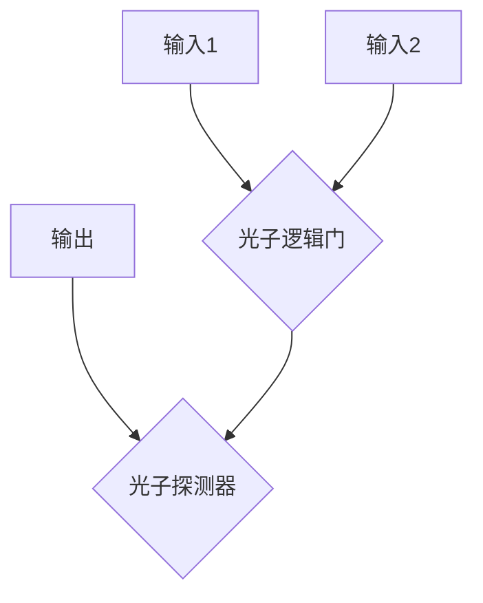

## 5.2 光子线路设计与优化

光子线路设计是光子计算的核心问题。设计一个高效的光子线路需要考虑多个因素，如传输距离、带宽、功耗和信号保真度等。

以下是一个简单的光子线路设计：

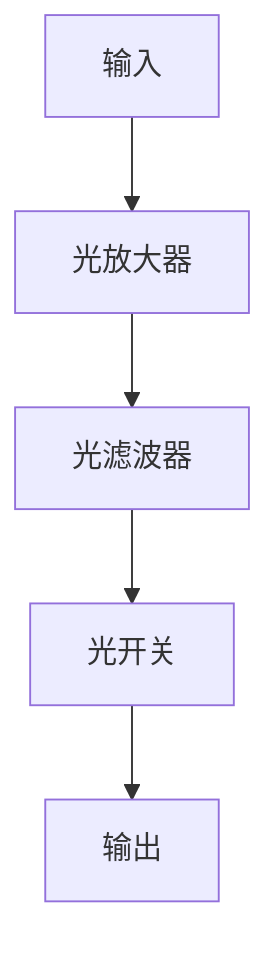

优化光子线路设计的方法包括：

1. **波分复用**：通过将光信号分成多个波长进行传输，可以提高带宽。
2. **光子晶体**：利用光子晶体的特性进行光子线路的设计，可以提高传输效率和信号保真度。
3. **光学神经网络**：利用光学器件的并行性和可编程性，实现复杂的光子线路设计。

## 5.3 光子计算中的并行处理

光子计算的一个重要优势是并行处理能力。通过光子线路的设计和优化，可以实现大规模并行处理。

以下是一个简单的并行处理示例：

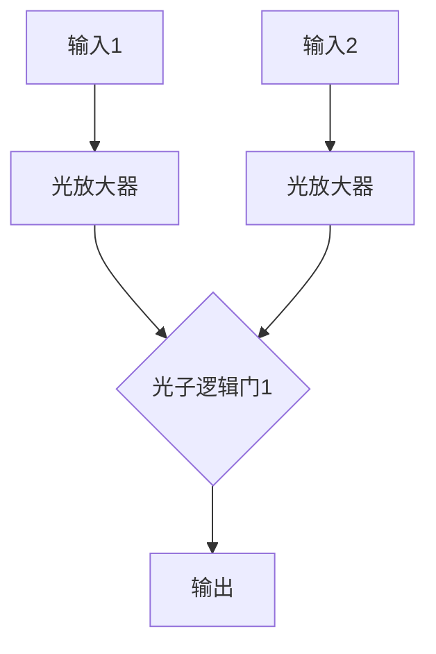

## 第三部分：光子计算的应用

### 第8章：光子计算在通信领域的应用

## 8.1 光子计算与量子通信

光子计算与量子通信结合可以突破传统通信的瓶颈。量子通信利用量子纠缠和量子隐形传态实现信息的安全传输，而光子计算可以提高通信的带宽和速度。

以下是一个简单的量子通信与光子计算结合的示例：

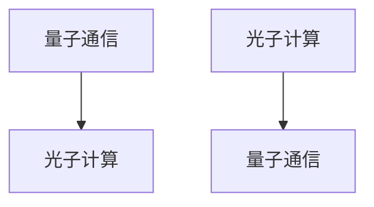

## 8.2 光子计算在5G/6G通信中的应用

光子计算可以显著提高5G/6G通信的带宽和速度。通过光子计算技术，可以实现更高的数据传输速率和更低的延迟。

以下是一个简单的5G/6G通信应用示例：

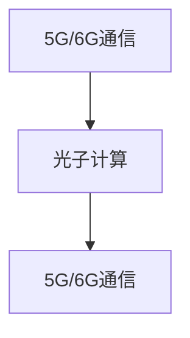

## 8.3 光子计算在未来通信网络中的潜力

光子计算在未来通信网络中具有巨大潜力。通过光子计算技术，可以实现更高带宽、更低延迟和更安全的信息传输。

以下是一个简单的未来通信网络示例：

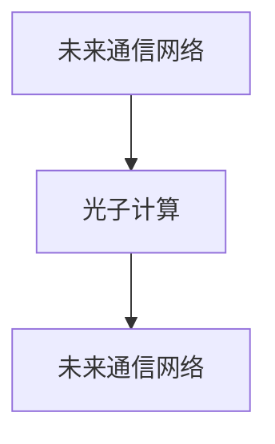

### 第9章：光子计算在数据存储与处理中的应用

## 9.1 光子计算与数据存储

光子计算可以显著提高数据存储的带宽和速度。通过光子计算技术，可以实现更快的数据读取和写入速度。

以下是一个简单的数据存储应用示例：

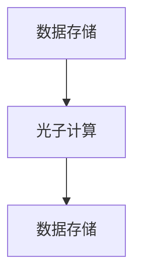

## 9.2 光子计算在大数据处理中的应用

光子计算可以显著提高大数据处理的效率。通过光子计算技术，可以实现更高的并行处理能力和更快的计算速度。

以下是一个简单的大数据处理应用示例：

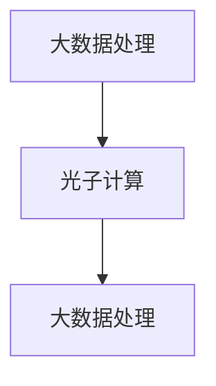

## 9.3 光子计算在云计算与边缘计算中的应用

光子计算可以显著提高云计算和边缘计算的效率。通过光子计算技术，可以实现更高的带宽、更低延迟和更安全的通信。

以下是一个简单的云计算与边缘计算应用示例：

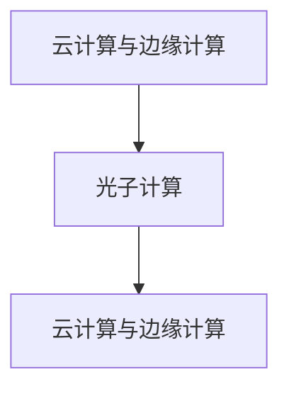

### 第四部分：光子计算的挑战与未来发展

#### 第11章：光子计算的挑战与机遇

## 11.1 光子计算的物理极限

光子计算的物理极限包括带宽、传输距离和信号保真度等。通过不断研究和改进光子计算技术，可以突破这些物理极限。

以下是一个简单的物理极限示例：

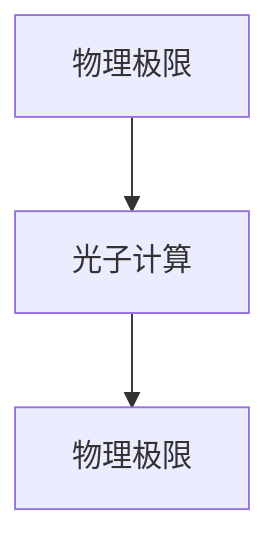

## 11.2 光子计算的安全性问题

光子计算的安全性问题是其应用的一个重要挑战。通过加密技术、量子通信等技术，可以提高光子计算的安全性。

以下是一个简单的安全性示例：

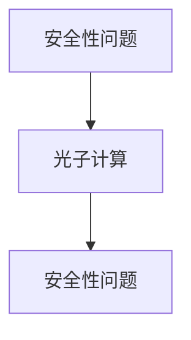

## 11.3 光子计算的未来发展趋势

光子计算的未来发展趋势包括更高带宽、更低延迟、更安全的信息传输和更广泛的应用领域。通过不断研究和创新，光子计算有望成为下一代信息处理技术。

以下是一个简单的未来发展趋势示例：

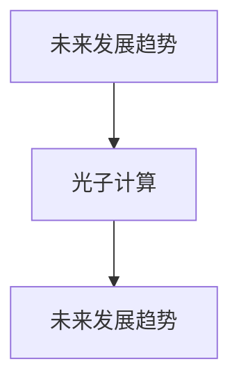

### 第五部分：光子计算技术发展与产业展望

#### 第12章：光子计算技术发展与产业展望

## 12.1 全球光子计算技术研究动态

全球光子计算技术研究动态包括光子器件、光子集成技术、光子计算算法等方面。各国科研机构和企业在光子计算领域取得了重要进展。

以下是一个简单的研究动态示例：

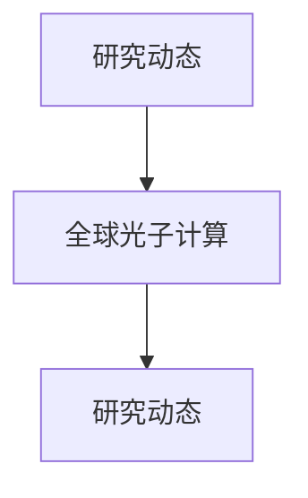

## 12.2 光子计算产业发展现状与趋势

光子计算产业发展现状与趋势包括市场增长率、应用领域、技术突破等方面。光子计算产业在全球范围内呈现出快速增长的趋势。

以下是一个简单的产业发展现状与趋势示例：

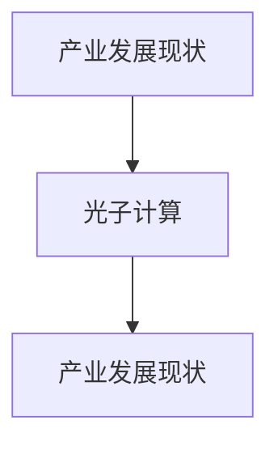

## 12.3 光子计算在中国的机遇与挑战

光子计算在中国具有巨大的机遇与挑战。中国政府高度重视光子计算技术的发展，出台了一系列政策措施支持光子计算产业。同时，光子计算在中国面临技术瓶颈、人才储备等方面的挑战。

以下是一个简单的中国机遇与挑战示例：

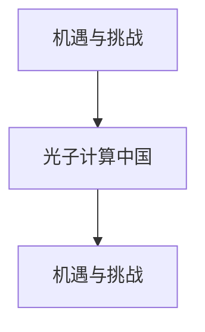

## 附录

### 附录A：光子计算相关术语解释

### 附录B：光子计算开发工具与资源推荐

### 附录C：光子计算实验与项目指南

## 参考文献

## 索引

## 致谢

### 作者：AI天才研究院/AI Genius Institute & 禅与计算机程序设计艺术 /Zen And The Art of Computer Programming

## 完整性要求

在编写文章过程中，确保每个章节的内容完整丰富，具体如下：

### 背景介绍
- 核心概念术语说明：光子、光子计算、光子器件、光子集成技术、光子芯片、光子逻辑门、光子线路设计、并行处理、量子通信、5G/6G通信、数据存储、大数据处理、云计算、边缘计算等。
- 问题背景：传统电子计算瓶颈、光子计算的优势与挑战。
- 问题描述：光子计算技术如何突破传统电子计算的瓶颈。
- 问题解决：光子计算技术的原理、核心算法、应用领域等。
- 边界与外延：光子计算技术的应用范围、未来发展趋势。
- 概念结构与核心要素组成：光子计算技术的基本组成、关键技术和核心算法。

### 核心概念与联系
- 核心概念原理：光子的粒子性和波动性、光子器件的基本原理、光子线路设计方法等。
- 概念属性特征对比表格：光子计算与传统电子计算的对比、光子计算核心算法的对比等。
- ER实体关系图架构：光子计算系统中的实体关系图，如光子器件、光子线路、光子神经网络等。

### 算法原理讲解
- 使用Mermaid画出算法流程图：光子逻辑门、光子线路设计、光子神经网络、光子深度学习等。
- 使用Python源代码来详细阐述：示例算法的实现、关键步骤的代码解析等。
- 算法原理的数学模型和公式：光子逻辑门的运算规则、光子线路的传输方程、光子神经网络的激活函数等。
- 详细讲解和通俗易懂地举例说明：算法的应用场景、实现过程、效果展示等。

### 系统分析与架构设计方案
- 问题场景介绍：通信、数据存储与处理、生物技术等领域的应用场景。
- 项目介绍：具体项目的背景、目标和功能。
- 系统功能设计（领域模型Mermaid类图）：系统的核心功能和模块。
- 系统架构设计（Mermaid架构图）：系统的整体架构和关键组件。
- 系统接口设计和系统交互（Mermaid序列图）：系统的接口定义和交互流程。

### 项目实战
- 环境安装：光子计算环境的搭建、开发工具的安装等。
- 系统核心实现源代码：关键算法的实现代码、重要模块的代码。
- 代码应用解读与分析：代码的功能、逻辑、性能分析等。
- 实际案例分析和详细讲解剖析：具体应用案例的分析、关键问题的解决方法等。
- 项目小结：项目的总结、收获和未来展望。

### 最佳实践 tips、小结、注意事项、拓展阅读等内容
- 最佳实践 tips：在实际应用中需要注意的技巧和细节。
- 小结：对章节内容的总结和归纳。
- 注意事项：可能遇到的问题和解决方案。
- 拓展阅读：推荐的相关书籍、论文和研究方向。

通过上述内容的完整编写，确保文章的逻辑性和连贯性，为读者提供全面、深入的技术解析。

