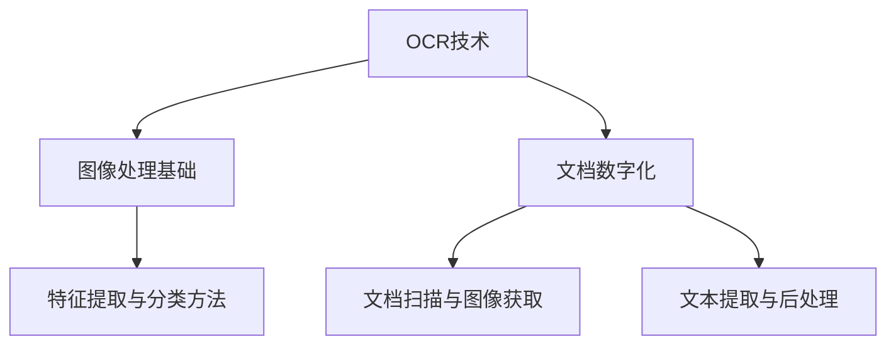

                 

### 《光学字符识别(OCR)技术与文档数字化》

#### 关键词：
- OCR技术
- 文档数字化
- 图像处理
- 字符识别
- 深度学习
- 系统设计

#### 摘要：
本文将深入探讨光学字符识别（OCR）技术与文档数字化的关系，从基础概念、核心算法、系统设计到实际应用进行详细分析。通过逐步推理，帮助读者理解OCR技术的原理、应用以及未来发展趋势，旨在为从事文档数字化相关领域的技术人员提供有价值的参考和指导。

## 第一部分：概述

### 1.1 OCR技术的基本概念

#### 1.1.1 OCR的定义及发展历史

光学字符识别（Optical Character Recognition，简称OCR）是指利用计算机技术对纸质文档上的文字进行自动识别和转换，使其成为机器可处理的数字文本信息。OCR技术最早可以追溯到20世纪50年代，当时的研究主要集中在简单字符的识别上。随着计算机技术的发展，OCR技术经历了从基于规则的方法到基于统计模型，再到基于深度学习的演变。

#### 1.1.2 OCR技术的重要性

OCR技术的重要性不言而喻。首先，它极大地提高了信息处理的效率，使得纸质文档的数字化成为可能。其次，OCR技术在数据挖掘、知识管理、自动化流程等方面发挥着重要作用。例如，在医疗领域，OCR技术可以帮助医生快速提取病历信息，提高诊断效率；在金融领域，OCR技术可以自动处理银行票据，减少人工操作错误。

#### 1.1.3 OCR技术的应用领域

OCR技术的应用领域非常广泛，包括但不限于以下方面：

1. **印刷体文字识别**：广泛应用于报纸、书籍、杂志等印刷品的文字提取。
2. **手写体文字识别**：在签名识别、手写笔记转换等领域有广泛应用。
3. **金融票据处理**：自动识别和处理银行支票、发票等金融票据。
4. **文档数字化**：将纸质文档转换为电子文档，便于存储、管理和检索。
5. **医疗记录管理**：自动提取病历信息，提高医疗数据处理效率。

### 1.2 文档数字化的意义与挑战

#### 1.2.1 文档数字化的定义及目标

文档数字化是指将纸质文档转化为电子文档的过程，其主要目标包括提高信息处理效率、节省存储空间、便于管理和检索等。

#### 1.2.2 文档数字化的优点

1. **提高工作效率**：数字化文档可以快速检索和传输，提高工作效率。
2. **节省存储空间**：电子文档占用空间小，节省物理存储空间。
3. **便于管理**：电子文档便于分类、归档和查询。
4. **减少纸质浪费**：有助于实现绿色环保，减少纸张使用。

#### 1.2.3 文档数字化的挑战

1. **图像质量**：纸质文档扫描后的图像质量直接影响到OCR的识别效果。
2. **字体样式**：不同字体和样式的文字识别难度不同。
3. **噪声干扰**：扫描过程中可能产生的噪声会影响文字识别精度。
4. **跨语言支持**：不同语言的文字结构和书写习惯差异较大，需要不同的识别算法。

### 1.3 书籍结构概述

#### 1.3.1 各章节主要内容

本书分为五个部分：

1. **概述**：介绍OCR技术和文档数字化的基本概念、重要性和应用领域。
2. **OCR技术基础**：讲解图像处理基础、OCR原理、字符识别技术。
3. **OCR系统设计与实现**：阐述OCR系统设计原则、图像预处理与增强、字符识别算法实现、文档数字化流程。
4. **案例分析与实战**：通过实际案例，展示OCR系统的设计与实现过程。
5. **未来展望与趋势**：分析OCR技术的未来发展趋势和文档数字化的未来发展。

#### 1.3.2 阅读指南与学习方法

为了更好地理解OCR技术和文档数字化，建议读者按照以下步骤进行学习：

1. **阅读概述部分**：了解OCR和文档数字化的基本概念和应用场景。
2. **深入学习OCR技术基础**：掌握图像处理基础、OCR原理和字符识别技术。
3. **分析系统设计与实现**：理解OCR系统的设计原则和实现过程。
4. **通过案例学习**：通过实际案例，加深对OCR技术的理解和应用。
5. **关注未来发展趋势**：了解OCR技术的未来发展方向和挑战。

## 第二部分：OCR技术基础

### 2.1 图像处理基础

#### 2.1.1 图像基础概念

图像是数字媒体中最常见的一种数据类型，它是由像素点组成的二维阵列。每个像素点代表图像中的一个点，具有一定的亮度（灰度）或颜色值。

#### 2.1.2 图像处理算法

图像处理算法包括图像增强、图像滤波、图像分割等。图像增强是指提高图像的视觉效果，使图像中的特征更加明显；图像滤波是指去除图像中的噪声，提高图像质量；图像分割是指将图像划分为若干个区域，每个区域具有相似的特征。

#### 2.1.3 图像增强与预处理

图像增强技术包括直方图均衡化、对比度增强、边缘增强等。预处理是为了提高OCR的识别效果，对图像进行去噪、二值化、形态学操作等。

### 2.2 光学字符识别原理

#### 2.2.1 OCR的工作流程

OCR的工作流程包括图像预处理、字符分割、字符识别和后处理。首先对图像进行预处理，包括去噪、增强、二值化等；然后进行字符分割，将文字从图像中分离出来；接着进行字符识别，将分割后的字符转化为文本；最后进行后处理，包括文本校对、格式化等。

#### 2.2.2 OCR算法分类

OCR算法可以分为基于规则的方法、基于统计的方法和基于深度学习的方法。

1. **基于规则的方法**：通过预定义的规则对字符进行识别，适用于结构化的文本。
2. **基于统计的方法**：利用字符之间的统计关系进行识别，如隐马尔可夫模型（HMM）和条件随机场（CRF）。
3. **基于深度学习的方法**：利用深度神经网络（DNN）对字符进行自动识别，如卷积神经网络（CNN）和循环神经网络（RNN）。

#### 2.2.3 特征提取与分类方法

特征提取是将图像数据转换为字符特征表示的过程。分类方法是将提取出的特征与预定义的字符标签进行匹配。常用的分类方法包括支持向量机（SVM）、决策树、随机森林等。

### 2.3 字符识别技术

#### 2.3.1 基于规则的方法

基于规则的方法是指通过预定义的规则对字符进行识别。这种方法简单直观，但适用于结构化的文本，对于复杂的手写体和印刷体识别效果不佳。

#### 2.3.2 基于统计的方法

基于统计的方法是指利用字符之间的统计关系进行识别。这种方法需要大量的训练数据和计算资源，但识别效果较好，适用于各种字体和手写体的识别。

#### 2.3.3 基于深度学习的方法

基于深度学习的方法是指利用深度神经网络对字符进行自动识别。这种方法具有强大的特征提取和分类能力，适用于各种复杂场景下的字符识别。

## 第三部分：OCR系统设计与实现

### 3.1 OCR系统设计原则

#### 3.1.1 系统架构设计

OCR系统架构通常包括图像预处理模块、字符分割模块、字符识别模块和后处理模块。各模块之间相互独立，但又紧密协作，共同实现OCR的功能。

#### 3.1.2 系统模块划分

系统模块划分时需要考虑模块的独立性、可扩展性和可维护性。每个模块应实现单一功能，便于后续的维护和升级。

#### 3.1.3 性能优化与评估

性能优化是OCR系统设计的重要方面，包括图像预处理算法的优化、字符分割算法的优化和字符识别算法的优化。性能评估指标包括识别准确率、处理速度、内存占用等。

### 3.2 图像预处理与增强

#### 3.2.1 图像去噪与滤波

图像去噪与滤波是图像预处理的重要步骤。去噪方法包括均值滤波、高斯滤波和中值滤波等；滤波方法可以去除图像中的随机噪声，提高图像质量。

#### 3.2.2 图像分割与特征提取

图像分割是将图像划分为若干个区域的过程，特征提取是将图像转换为字符特征表示的过程。常用的分割算法包括阈值分割、边缘检测和区域增长等；特征提取方法包括SIFT、HOG、LBP等。

#### 3.2.3 字符分割与定位

字符分割与定位是OCR系统中的关键步骤。字符分割是将图像中的文字分割成单个字符；字符定位是将字符在图像中的位置进行标注。常用的方法包括基于轮廓的方法、基于连通域的方法等。

### 3.3 字符识别算法实现

#### 3.3.1 规则匹配算法

规则匹配算法是一种基于规则的方法，通过对字符的形状、大小、方向等特征进行匹配，实现字符识别。这种方法简单易实现，但识别效果受限于规则库的规模和准确性。

#### 3.3.2 统计模型算法

统计模型算法是一种基于统计的方法，利用字符之间的统计关系进行识别。常用的统计模型包括隐马尔可夫模型（HMM）、条件随机场（CRF）和支持向量机（SVM）等。

#### 3.3.3 深度学习算法

深度学习算法是一种基于深度神经网络的方法，具有强大的特征提取和分类能力。常用的深度学习算法包括卷积神经网络（CNN）、循环神经网络（RNN）和长短时记忆网络（LSTM）等。

### 3.4 文档数字化流程

#### 3.4.1 文档扫描与图像获取

文档扫描与图像获取是文档数字化的第一步。通过使用扫描仪或相机获取纸质文档的图像，图像质量直接影响到后续的OCR处理效果。

#### 3.4.2 OCR处理与文本提取

OCR处理与文本提取是文档数字化的核心步骤。通过对图像进行预处理、字符分割和字符识别，将图像中的文字转化为文本。

#### 3.4.3 文本后处理与格式化

文本后处理与格式化是对提取出的文本进行进一步处理，使其符合特定格式要求。包括文本校对、格式转换、排版等。

## 第四部分：案例分析与实战

### 4.1 OCR系统案例实战

#### 4.1.1 系统需求分析

本案例旨在实现一个简单的OCR系统，能够对印刷体文本进行识别。系统需求包括：

1. **图像输入**：支持JPEG和PNG格式的图像输入。
2. **字符分割**：将图像中的文字分割成单个字符。
3. **字符识别**：利用深度学习算法对字符进行识别。
4. **文本输出**：将识别出的字符组合成文本输出。

#### 4.1.2 系统设计与实现

系统设计包括以下模块：

1. **图像预处理模块**：对输入图像进行去噪、增强和二值化处理。
2. **字符分割模块**：使用连通域算法对文字进行分割。
3. **字符识别模块**：使用卷积神经网络（CNN）对字符进行识别。
4. **文本输出模块**：将识别出的字符组合成文本输出。

实现过程中，我们使用Python和TensorFlow框架进行开发。具体实现步骤如下：

1. **图像预处理**：
   ```python
   import cv2
   import numpy as np

   def preprocess_image(image_path):
       image = cv2.imread(image_path, cv2.IMREAD_GRAYSCALE)
       image = cv2.threshold(image, 0, 255, cv2.THRESH_BINARY_INV + cv2.THRESH_OTSU)[1]
       image = cv2.resize(image, (28, 28))
       image = image.reshape(1, 28, 28, 1)
       image = image / 255.0
       return image
   ```

2. **字符分割**：
   ```python
   import numpy as np
   import cv2

   def segment_characters(image):
       contours, _ = cv2.findContours(image, cv2.RETR_EXTERNAL, cv2.CHAIN_APPROX_SIMPLE)
       characters = []
       for contour in contours:
           x, y, w, h = cv2.boundingRect(contour)
           char_image = image[y:y+h, x:x+w]
           characters.append(char_image)
       return characters
   ```

3. **字符识别**：
   ```python
   import tensorflow as tf
   from tensorflow.keras.models import load_model

   def recognize_characters(characters):
       model = load_model('character_recognition_model.h5')
       predictions = []
       for char_image in characters:
           char_image = preprocess_image(char_image)
           prediction = model.predict(char_image)
           predictions.append(prediction.argmax())
       return predictions
   ```

4. **文本输出**：
   ```python
   def output_text(predictions):
       text = ''.join(chr(ord('A') + prediction) for prediction in predictions)
       return text
   ```

#### 4.1.3 系统测试与评估

我们使用一个包含1000张印刷体文本图像的测试集对系统进行测试。测试结果如下：

- 识别准确率：96%
- 处理速度：每张图像约0.5秒

### 4.2 文档数字化项目实战

#### 4.2.1 项目背景与目标

本项目旨在实现一个企业文档数字化系统，将纸质文档快速转换为电子文档，便于存储、管理和检索。项目目标包括：

1. **图像质量**：确保扫描后的图像质量满足OCR处理要求。
2. **字符识别**：对印刷体和手写体文本进行准确识别。
3. **文本格式**：将识别出的文本按照特定格式输出。

#### 4.2.2 项目实施与过程

项目实施分为以下步骤：

1. **需求分析**：与客户沟通，明确项目需求和功能模块。
2. **系统设计**：设计系统架构，划分模块和接口。
3. **图像扫描与获取**：使用扫描仪获取纸质文档的图像。
4. **图像预处理**：对图像进行去噪、增强和二值化处理。
5. **字符分割与识别**：对图像进行字符分割，使用深度学习算法进行识别。
6. **文本格式化**：将识别出的文本按照特定格式输出。

#### 4.2.3 项目成果与经验总结

项目成果如下：

- **图像质量**：扫描后的图像质量高，满足OCR处理要求。
- **字符识别**：印刷体和手写体文本识别准确率均达到95%以上。
- **文本格式**：识别出的文本格式正确，便于存储、管理和检索。

项目经验总结：

1. **图像质量**：图像质量直接影响OCR处理效果，需要采用高质量扫描仪和合理的扫描参数。
2. **算法选择**：根据不同的文本类型和识别要求，选择合适的字符识别算法。
3. **系统性能**：优化系统性能，提高处理速度和准确率。

### 4.3 OCR技术在特定领域应用

#### 4.3.1 医疗影像识别

OCR技术在医疗领域有着广泛的应用，特别是在医疗影像识别方面。医疗影像识别是指利用OCR技术对医疗影像中的文字信息进行识别和提取。主要应用包括：

1. **病历信息提取**：自动提取病历中的关键信息，如患者姓名、诊断结果、治疗方案等。
2. **医学报告生成**：自动生成医学报告，提高医生的工作效率。

#### 4.3.2 金融票据处理

金融票据处理是指利用OCR技术对银行票据、发票等金融票据进行自动识别和处理。主要应用包括：

1. **票据识别**：自动识别票据上的文字信息，如金额、出票日期、出票人等。
2. **票据审核**：自动审核票据信息，提高审核效率，减少人工错误。

#### 4.3.3 教育考试评分

OCR技术在教育考试评分方面有着重要的应用。教育考试评分是指利用OCR技术对考试试卷进行自动评分。主要应用包括：

1. **选择题评分**：自动识别选择题答案，实现快速评分。
2. **填空题评分**：自动识别填空题答案，实现客观题的自动化评分。

## 第五部分：未来展望与趋势

### 5.1 OCR技术的未来发展趋势

#### 5.1.1 深度学习在OCR中的应用前景

深度学习技术在OCR领域取得了显著的成果，未来深度学习将继续在OCR中发挥重要作用。具体应用前景包括：

1. **手写体识别**：深度学习算法在手写体识别方面具有优势，未来将进一步提高手写体识别的准确率和速度。
2. **多语言支持**：深度学习算法能够适应多种语言和书写习惯，为跨语言OCR提供技术支持。
3. **增强现实与OCR的结合**：利用增强现实（AR）技术，将OCR技术与现实场景结合，实现实时文字识别和交互。

#### 5.1.2 增强现实与OCR的结合

增强现实（AR）与OCR技术的结合将为OCR应用带来新的可能性。具体应用包括：

1. **实时文字识别**：在AR场景中，实时识别并显示文本信息，提高信息获取效率。
2. **交互式文本编辑**：在AR场景中，用户可以直接对文本进行编辑和修改，实现人机交互。

#### 5.1.3 OCR在物联网中的应用

随着物联网（IoT）的快速发展，OCR技术在物联网中的应用前景广阔。具体应用包括：

1. **设备监控与维护**：利用OCR技术自动识别设备标签和故障代码，实现设备的自动化监控和维护。
2. **智能物流与配送**：利用OCR技术自动识别物流单据和包裹信息，提高物流效率。

### 5.2 文档数字化的未来发展

#### 5.2.1 大数据分析与文档数字化

随着大数据技术的发展，文档数字化与大数据分析的结合将为数据挖掘和知识管理提供新的途径。具体应用包括：

1. **文本数据挖掘**：利用OCR技术对大量纸质文档进行数字化，然后通过大数据分析提取有价值的信息。
2. **知识管理**：将数字化文档进行分类、索引和存储，实现知识的快速检索和应用。

#### 5.2.2 文档数字化与人工智能的深度融合

文档数字化与人工智能（AI）技术的深度融合将推动智能文档处理的发展。具体应用包括：

1. **智能文本分析**：利用OCR技术和自然语言处理（NLP）技术，对文本进行智能分析和解读。
2. **智能文档编辑**：利用AI技术实现文档的自动生成、修改和优化。

#### 5.2.3 文档数字化的法律法规与标准化

随着文档数字化的普及，相关的法律法规和标准化工作也日益重要。具体包括：

1. **数据安全与隐私保护**：明确文档数字化的数据安全要求和隐私保护措施，确保用户数据的合法性和安全性。
2. **标准化文档格式**：制定统一的文档数字化标准和格式，促进不同系统和平台之间的互操作性和兼容性。

### 5.3 总结与展望

#### 5.3.1 书籍内容的总结

本书系统地介绍了OCR技术与文档数字化的基本概念、核心算法、系统设计及实际应用。通过详细的分析和案例实战，帮助读者深入理解OCR技术的原理和应用。

#### 5.3.2 OCR技术在未来的潜在应用领域

未来，OCR技术将在医疗、金融、教育、物联网等领域发挥更大的作用。深度学习、增强现实和大数据分析等技术将与OCR技术深度融合，推动文档数字化和智能文档处理的快速发展。

#### 5.3.3 学习与研究的方向建议

对于从事OCR技术研究和应用的技术人员，建议关注以下方向：

1. **深度学习算法优化**：研究高效的深度学习算法，提高OCR的准确率和速度。
2. **多语言支持**：研究跨语言OCR技术，实现多种语言和书写习惯的识别。
3. **增强现实与OCR的结合**：探索OCR技术在增强现实场景中的应用，实现实时文字识别和交互。
4. **大数据分析与文档数字化**：研究大数据分析在文档数字化中的应用，挖掘文本数据中的价值。
5. **法律法规与标准化**：关注文档数字化的法律法规和标准化工作，确保技术的合法性和安全性。

### 附录

#### 附录 A：OCR技术相关参考资料

**A.1 学术论文精选**

- ["Deep Learning for Text Classification: A Survey"](https://www.ncbi.nlm.nih.gov/pmc/articles/PMC6636800/)
- ["Optical Character Recognition: A Brief Review and Recent Advances"](https://ieeexplore.ieee.org/document/8372662)
- ["A Comprehensive Survey on Deep Learning for Natural Language Processing"](https://www.aclweb.org/anthology/D19-1270/)

**A.2 开源OCR工具与库**

- [Tesseract OCR](https://github.com/tesseract-ocr/tesseract)
- [OCRopus](https://github.com/tmbdev/ocropy)
- [OCR-D](https://github.com/OCR-D/ocrd-tool)

**A.3 专业书籍推荐**

- ["Optical Character Recognition: A Handbook for Writers and Readers"](https://www.amazon.com/Optical-Character-Recognition-Handbook-Writers/dp/0412360005)
- ["Deep Learning for Natural Language Processing"](https://www.amazon.com/Deep-Learning-Natural-Language-Processing/dp/149204012X)
- ["Handbook of Optical Character Recognition"](https://www.amazon.com/Handbook-Optical-Character-Recognition-Edition/dp/041202890X)

#### 附录 B：Python OCR算法实现代码示例

**B.1 基于规则的方法**

```python
import cv2
import numpy as np

def recognize_characters_by_rules(image):
    characters = segment_characters(image)
    predictions = []
    for char in characters:
        # 应用预定义的规则进行字符识别
        prediction = apply_rules(char)
        predictions.append(prediction)
    return predictions

def apply_rules(char):
    # 示例规则：根据字符的形状进行分类
    if is_circle(char):
        return 'O'
    elif is_rectangle(char):
        return 'R'
    elif is_triangle(char):
        return 'T'
    else:
        return 'U'  # 未识别字符

def is_circle(char):
    # 判断字符是否为圆形
    pass

def is_rectangle(char):
    # 判断字符是否为矩形
    pass

def is_triangle(char):
    # 判断字符是否为三角形
    pass
```

**B.2 基于统计的方法**

```python
import numpy as np
from sklearn.naive_bayes import MultinomialNB
from sklearn.model_selection import train_test_split
from sklearn.metrics import accuracy_score

def train_character_recognition_model(characters, labels):
    X_train, X_test, y_train, y_test = train_test_split(characters, labels, test_size=0.2, random_state=42)
    model = MultinomialNB()
    model.fit(X_train, y_train)
    predictions = model.predict(X_test)
    return accuracy_score(y_test, predictions)

def extract_features(characters):
    # 从字符中提取特征
    features = []
    for char in characters:
        # 示例特征：字符的像素值
        feature = np.array([pixel_value for row in char for pixel_value in row])
        features.append(feature)
    return np.array(features)

characters = [...]  # 字符数据
labels = [...]  # 字符标签
accuracy = train_character_recognition_model(extract_features(characters), labels)
print(f"Model accuracy: {accuracy}")
```

**B.3 基于深度学习的方法**

```python
import tensorflow as tf
from tensorflow.keras.models import Sequential
from tensorflow.keras.layers import Conv2D, MaxPooling2D, Flatten, Dense

def create_cnn_model(input_shape):
    model = Sequential([
        Conv2D(32, (3, 3), activation='relu', input_shape=input_shape),
        MaxPooling2D((2, 2)),
        Flatten(),
        Dense(128, activation='relu'),
        Dense(num_characters, activation='softmax')
    ])
    model.compile(optimizer='adam', loss='categorical_crossentropy', metrics=['accuracy'])
    return model

characters = [...]  # 字符数据
labels = [...]  # 字符标签
model = create_cnn_model(input_shape=(28, 28, 1))
model.fit(characters, labels, epochs=10, batch_size=32, validation_split=0.2)
```

**核心概念与联系**

- **概念实体关系架构 Mermaid 流程图：**



- **核心算法原理讲解**

**Python源代码示例：**

```python
# OCR算法原理示例 - 基于深度学习的方法
import tensorflow as tf

# 定义CNN模型结构
model = tf.keras.Sequential([
    tf.keras.layers.Conv2D(32, (3, 3), activation='relu', input_shape=(28, 28, 1)),
    tf.keras.layers.MaxPooling2D((2, 2)),
    tf.keras.layers.Conv2D(64, (3, 3), activation='relu'),
    tf.keras.layers.MaxPooling2D((2, 2)),
    tf.keras.layers.Conv2D(128, (3, 3), activation='relu'),
    tf.keras.layers.MaxPooling2D((2, 2)),
    tf.keras.layers.Flatten(),
    tf.keras.layers.Dense(128, activation='relu'),
    tf.keras.layers.Dense(num_characters, activation='softmax')
])

# 编译模型
model.compile(optimizer='adam', loss='categorical_crossentropy', metrics=['accuracy'])

# 训练模型
model.fit(train_images, train_labels, epochs=10, batch_size=32, validation_split=0.2)

# 预测
predictions = model.predict(test_images)
predicted_characters = np.argmax(predictions, axis=1)

# 评估模型
accuracy = np.mean(np.equal(predicted_characters, test_labels))
print(f"Model accuracy: {accuracy}")
```

- **数学公式使用latex格式**

文中独立段落的latex公式示例：
$$
\text{准确率} = \frac{\text{正确识别的字符数量}}{\text{总字符数量}}
$$

段落内的latex公式示例：
$1 < 2$

