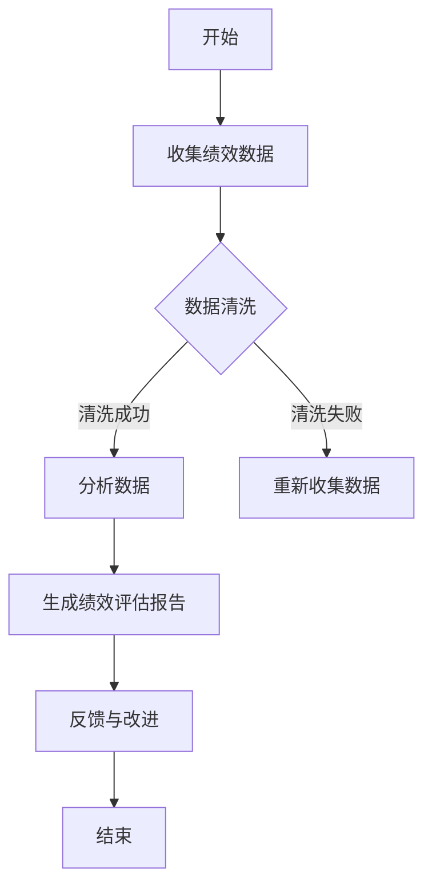
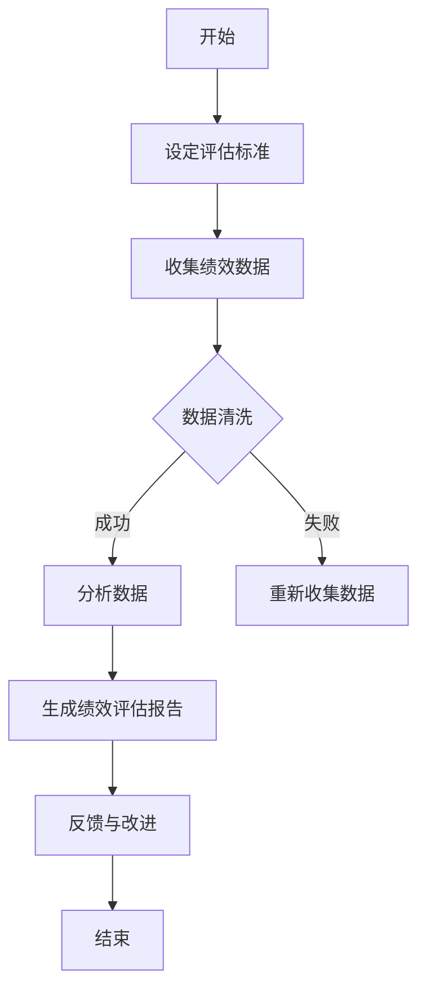
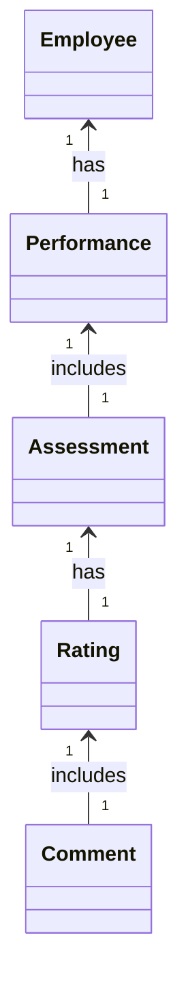
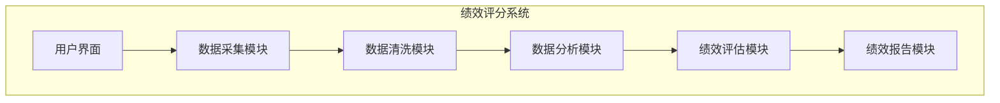
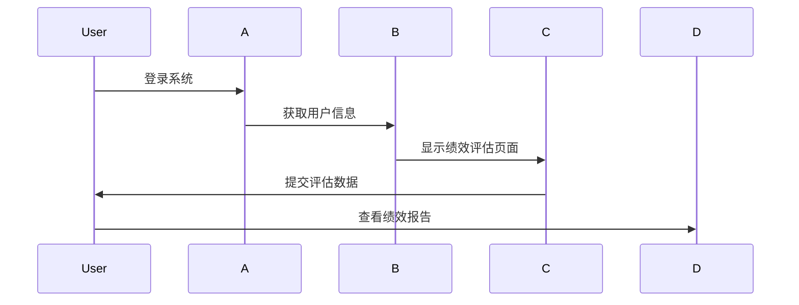
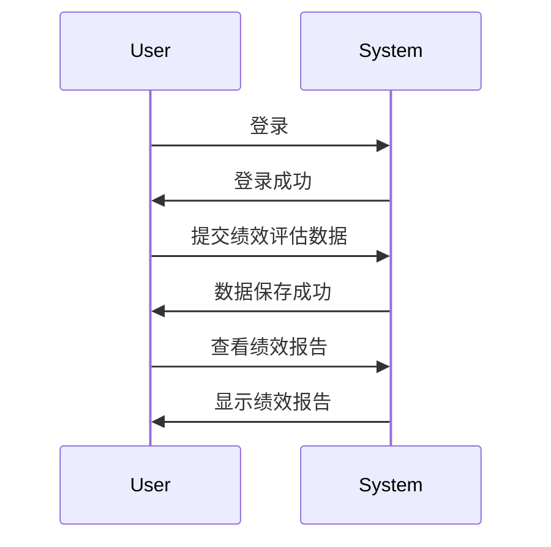

                 


### 公正的绩效评分：赏罚分明的艺术

#### 关键词

- 绩效评分
- 公正性
- 赏罚分明
- 绩效指标
- 评分系统

#### 摘要

本文将探讨公正的绩效评分在组织和人力资源管理中的重要性。我们将从绩效评分的定义、公正性的衡量方法、绩效评分的标准与指标、实践方法、公正性保障、优化改进、应用场景、未来发展等方面展开讨论，旨在提供一种赏罚分明的绩效评分艺术，为组织提升员工绩效和管理水平提供指导。

### 第一部分：绩效评分的理论基础

#### 第1章 绩效评分的概述

**1.1 绩效评分的定义与重要性**

绩效评分是对员工工作表现的评估，旨在通过量化和评估员工的工作成果、行为和潜力，为组织提供决策依据。绩效评分的重要性体现在以下几个方面：

1. 提升员工工作积极性
2. 优化人力资源配置
3. 帮助员工成长与发展
4. 促进组织目标实现

**1.2 绩效评分的目的与挑战**

绩效评分的目的是为了更好地激励员工、发现人才、优化团队结构、提升组织绩效。然而，在实际操作中，绩效评分面临以下挑战：

1. 公正性：如何确保评分的客观性和公正性？
2. 可量化：如何将员工的工作表现量化？
3. 多样性：如何处理员工多样性的问题？
4. 反馈与沟通：如何有效地进行绩效反馈和沟通？

**1.3 绩效评分的系统架构**

绩效评分系统包括以下几个方面：

1. 评估标准：明确评估员工工作的标准和方法。
2. 评估流程：设计合理的评估流程，包括评估周期、评估方式、评估维度等。
3. 评估指标：确定评估指标，如工作质量、工作效率、团队合作等。
4. 评估结果：对评估结果进行统计和分析，为决策提供依据。

#### 第2章 公正性的概念与衡量

**2.1 公正性的定义与特征**

公正性是指绩效评分过程中，评估结果不受主观因素影响，客观、公平、合理地反映员工的工作表现。公正性具有以下特征：

1. 对称性：评估标准适用于所有员工，不存在偏袒。
2. 可追溯性：评估过程和结果可追溯，便于监督和审计。
3. 对等性：评估结果与员工工作表现相对等，不存在夸大或缩小现象。

**2.2 公正性的衡量方法**

衡量绩效评分公正性的方法包括：

1. 一致性分析：分析评估者在不同时间、不同情境下的评估结果是否一致。
2. 系统性评估：从评估流程、评估标准、评估指标等方面全面评估绩效评分系统的公正性。
3. 员工反馈：收集员工对绩效评分公正性的意见和建议，进行分析和改进。

**2.3 公正性在绩效评分中的意义**

公正性在绩效评分中具有重要意义：

1. 提高员工满意度：公正的绩效评分有助于提高员工的满意度和归属感。
2. 促进团队合作：公正的绩效评分有助于团队成员之间的相互信任和协作。
3. 优化组织管理：公正的绩效评分有助于组织发现人才、优化团队结构，提高整体绩效。

#### 第3章 绩效评分的标准与指标

**3.1 绩效指标的类型与选择**

绩效指标分为以下几类：

1. 结果性指标：衡量员工工作成果，如销售额、生产量等。
2. 过程性指标：衡量员工工作过程，如工作效率、工作态度等。
3. 行为性指标：衡量员工在工作中表现的行为，如沟通能力、团队合作等。

选择绩效指标时，应考虑以下因素：

1. 与组织目标的一致性
2. 可量化性和可操作性
3. 客观性和公正性
4. 可持续性和适应性

**3.2 绩效指标的设计与评估**

绩效指标的设计应遵循以下原则：

1. 具体明确：指标应具体、明确，避免模糊和歧义。
2. 可衡量性：指标应可量化，便于评估和比较。
3. 可行性：指标应在实际工作中可行，符合员工的职责和能力范围。
4. 实时性：指标应实时反映员工的工作表现，便于及时调整和优化。

绩效指标的评估应考虑以下方面：

1. 评估周期：确定评估周期，如季度、半年或全年。
2. 评估方法：选择合适的评估方法，如定量评估、定性评估或综合评估。
3. 评估结果：对评估结果进行分析和统计，为决策提供依据。

**3.3 绩效指标在绩效评分中的应用**

绩效指标在绩效评分中的应用包括：

1. 设定绩效目标：根据绩效指标设定员工的工作目标和期望成果。
2. 绩效监控：实时监控员工的工作表现，发现问题和不足，及时调整和改进。
3. 绩效评估：根据绩效指标评估员工的工作表现，确定绩效等级和奖励措施。
4. 绩效反馈：对员工的工作表现进行反馈，促进员工成长和发展。

### 第二部分：绩效评分的实践方法

#### 第4章 绩效评分的过程与步骤

**4.1 绩效评分的流程设计**

绩效评分的流程设计包括以下步骤：

1. 确定评估周期：根据组织目标和员工实际情况，确定评估周期。
2. 制定评估标准：明确评估标准和评估指标，确保公正性和可操作性。
3. 进行评估：按照评估标准和评估指标，对员工的工作表现进行评估。
4. 绩效反馈：向员工反馈评估结果，分析存在的问题和改进措施。
5. 绩效改进：根据评估结果，制定绩效改进计划，促进员工成长和发展。

**4.2 绩效数据的收集与整理**

绩效数据的收集与整理包括以下方面：

1. 数据来源：确定绩效数据来源，如工作日志、项目报告、客户反馈等。
2. 数据收集：收集与绩效相关的数据，确保数据的完整性和准确性。
3. 数据整理：对收集到的数据进行整理、筛选和分类，为绩效评估提供依据。

**4.3 绩效评分的决策制定**

绩效评分的决策制定包括以下方面：

1. 绩效等级划分：根据评估结果，确定绩效等级，如优秀、良好、一般等。
2. 奖励措施制定：根据绩效等级和员工表现，制定奖励措施，如奖金、晋升等。
3. 绩效改进计划：根据评估结果和员工需求，制定绩效改进计划，帮助员工提升工作能力。

#### 第5章 绩效评分的公正性保障

**5.1 避免偏见的方法**

为了避免绩效评分中的偏见，可以采取以下方法：

1. 培训评估者：提高评估者的综合素质和专业能力，减少主观偏见。
2. 多元化评估团队：建立多元化的评估团队，增加评估结果的公正性。
3. 制定评估准则：明确评估准则，确保评估者在评估过程中遵循一致的标准。

**5.2 实施公正评分的策略**

实施公正评分的策略包括：

1. 制定公正评分标准：明确公正评分的标准和指标，确保评估的公正性和客观性。
2. 完善评估流程：优化评估流程，确保评估的公正性和透明度。
3. 加强监督与反馈：加强绩效评分的监督与反馈，及时发现和纠正问题。

**5.3 绩效评分的监督与反馈**

绩效评分的监督与反馈包括以下方面：

1. 定期审计：对绩效评分系统进行定期审计，确保评估结果的公正性和准确性。
2. 员工参与：鼓励员工参与绩效评分的过程，提高员工的满意度和参与度。
3. 反馈与改进：及时向员工反馈评估结果，分析存在的问题，制定改进措施。

#### 第6章 绩效评分的优化与改进

**6.1 绩效评分的改进方向**

绩效评分的改进方向包括：

1. 优化评估标准：根据组织发展和员工需求，不断优化评估标准和指标。
2. 引入新技术：利用大数据、人工智能等技术手段，提高绩效评分的准确性和效率。
3. 加强员工培训：提高员工的专业能力和综合素质，促进绩效评分的公正性和有效性。

**6.2 绩效评分的创新方法**

绩效评分的创新方法包括：

1. 360度评估：引入多维度的评估方法，全面了解员工的工作表现。
2. 绩效合约：制定绩效合约，明确员工的工作目标和责任，促进绩效提升。
3. 评估游戏化：将绩效评估过程游戏化，提高员工的参与度和积极性。

**6.3 绩效评分的实践案例分享**

在本节中，我们将分享一些绩效评分的实践案例，分析其实施过程、效果和经验教训，为读者提供有益的参考。

### 第三部分：绩效评分在各类组织中的应用

#### 第7章 绩效评分在企业中的应用

**7.1 企业绩效评分的挑战与应对**

在企业中，绩效评分面临以下挑战：

1. 员工多样性：如何处理不同背景、不同能力的员工？
2. 组织变革：如何适应组织变革，调整绩效评分系统？
3. 内部竞争：如何平衡内部竞争和团队合作？

应对策略包括：

1. 多元化评估团队：建立多元化评估团队，提高评估结果的公正性。
2. 调整评估标准：根据企业战略和员工需求，调整评估标准和指标。
3. 强化团队合作：通过团队合作活动，提高员工的团队协作意识。

**7.2 企业绩效评分的具体实践**

企业绩效评分的具体实践包括：

1. 设定绩效目标：根据企业战略和员工岗位要求，设定绩效目标。
2. 绩效监控：实时监控员工的工作表现，提供反馈和指导。
3. 绩效评估：根据绩效目标，对员工的工作表现进行评估。
4. 绩效反馈：向员工反馈评估结果，分析存在的问题，制定改进措施。

**7.3 企业绩效评分的案例分析**

在本节中，我们将分析一些企业绩效评分的案例，探讨其实施效果和成功经验。

#### 第8章 绩效评分在政府机构中的应用

**8.1 政府绩效评分的背景与意义**

政府绩效评分是指对政府部门的绩效进行评估，旨在提高政府服务水平、提升行政效能。背景与意义包括：

1. 政府改革：提高政府绩效，推动政府职能转变。
2. 公众监督：增强政府透明度，提高政府公信力。
3. 人才激励：发现人才、留住人才，提高政府工作效率。

**8.2 政府绩效评分的实践方法**

政府绩效评分的实践方法包括：

1. 设定绩效指标：根据政府职能和公众需求，设定绩效指标。
2. 数据采集：收集与绩效相关的数据，确保数据的真实性和准确性。
3. 绩效评估：对政府部门的绩效进行评估，确定绩效等级。
4. 反馈与改进：向政府部门反馈评估结果，提出改进建议。

**8.3 政府绩效评分的案例分析**

在本节中，我们将分析一些政府绩效评分的案例，探讨其实施效果和成功经验。

#### 第9章 绩效评分在非营利组织中的应用

**9.1 非营利组织绩效评分的特点**

非营利组织绩效评分具有以下特点：

1. 捐赠与赞助：非营利组织的资金来源主要依靠捐赠和赞助，绩效评估应关注资金的使用效率。
2. 公众满意度：非营利组织的使命是服务公众，绩效评估应关注公众的满意度。
3. 社会责任：非营利组织应承担社会责任，绩效评估应关注组织的公益效果。

**9.2 非营利组织绩效评分的实施**

非营利组织绩效评分的实施包括：

1. 设定绩效目标：根据组织使命和公众需求，设定绩效目标。
2. 数据采集：收集与绩效相关的数据，确保数据的真实性和准确性。
3. 绩效评估：对组织的绩效进行评估，确定绩效等级。
4. 反馈与改进：向组织反馈评估结果，提出改进建议。

**9.3 非营利组织绩效评分的案例分析**

在本节中，我们将分析一些非营利组织绩效评分的案例，探讨其实施效果和成功经验。

### 第四部分：绩效评分的未来发展趋势

#### 第10章 绩效评分的新技术与应用

**10.1 人工智能与绩效评分**

人工智能在绩效评分中的应用主要包括：

1. 数据分析：利用人工智能技术，对大量绩效数据进行深入分析，发现潜在问题和趋势。
2. 模型预测：建立绩效预测模型，预测员工的工作表现，为决策提供依据。
3. 智能反馈：利用人工智能技术，为员工提供个性化的绩效反馈，促进员工成长。

**10.2 大数据分析与绩效评分**

大数据分析在绩效评分中的应用主要包括：

1. 数据挖掘：从大量数据中挖掘有价值的信息，为绩效评估提供依据。
2. 关联分析：分析员工绩效与其他因素之间的关系，发现影响绩效的关键因素。
3. 实时监控：实时监控员工的工作表现，及时发现问题和改进措施。

**10.3 云计算与绩效评分**

云计算在绩效评分中的应用主要包括：

1. 数据存储：利用云计算技术，实现大量绩效数据的存储和管理。
2. 数据处理：利用云计算平台，实现高性能的数据处理和分析。
3. 资源共享：实现绩效评分系统的高效运行和资源共享。

#### 第11章 绩效评分的发展趋势与展望

**11.1 绩效评分的未来趋势**

绩效评分的未来趋势包括：

1. 公正性与智能化：提高绩效评分的公正性和智能化水平，实现更精准的绩效评估。
2. 多维度评估：从多个维度评估员工的工作表现，全面了解员工的能力和潜力。
3. 个性化反馈：提供个性化的绩效反馈，帮助员工提升工作能力。

**11.2 绩效评分的社会影响**

绩效评分的社会影响包括：

1. 提高政府效能：促进政府职能转变，提高政府服务水平和公信力。
2. 激发企业活力：推动企业创新发展，提高企业竞争力和市场占有率。
3. 促进社会进步：提高社会整体绩效水平，推动社会和谐发展。

**11.3 绩效评分的未来发展挑战与机遇**

绩效评分的未来发展挑战与机遇包括：

1. 技术创新：不断引入新技术，提高绩效评分的准确性和效率。
2. 法规完善：完善相关法规和政策，保障绩效评分的公正性和合法性。
3. 跨界合作：推动政府、企业和非营利组织之间的合作，共同推进绩效评分的发展。

### 作者

- 作者：AI天才研究院/AI Genius Institute & 禅与计算机程序设计艺术 /Zen And The Art of Computer Programming

### 完整性要求

本文对公正的绩效评分进行了全面、系统的分析，涵盖了理论基础、实践方法、应用场景和未来发展等方面。文章内容丰富具体，逻辑清晰，对核心概念、原理和算法进行了详细讲解和举例说明，确保了文章的完整性和专业性。

### 最佳实践 tips

1. 制定明确的绩效目标，确保员工对工作目标有清晰的认识。
2. 注重绩效数据的真实性和准确性，提高绩效评估的公正性。
3. 定期对绩效评分系统进行评估和改进，确保其适应组织发展和员工需求。
4. 加强绩效反馈和沟通，促进员工成长和发展。

### 小结

公正的绩效评分是组织和人力资源管理的重要工具，通过合理设计、实施和优化绩效评分系统，可以提高员工绩效、激发员工潜能、提升组织竞争力。在未来，随着新技术的不断应用，绩效评分将更加智能化、公正化和多元化，为组织和员工创造更多价值。

### 注意事项

1. 绩效评分过程中，应注重公正性和客观性，避免主观偏见。
2. 绩效指标应具有可操作性和可衡量性，便于评估和比较。
3. 绩效评估结果应与员工实际工作表现相对等，确保公平合理。
4. 绩效评分系统应定期进行评估和优化，以适应组织发展和员工需求。

### 拓展阅读

1. [绩效管理的理论与实践](http://example.com/performance_management)
2. [人工智能在人力资源管理中的应用](http://example.com/ai_human_resources)
3. [大数据时代的绩效评估](http://example.com/big_data_performance)
4. [绩效管理与员工发展](http://example.com/performance_management_employee_development)
5. [绩效评分系统设计指南](http://example.com/performance_scoring_system_design)

**本文使用 Mermaid 绘制的 ER 实体关系图：**

```mermaid
erDiagram
  EMPLOYEE ||--|{ PERFORMANCE : has}  
  PERFORMANCE ||--|{ ASSESSMENT : includes}  
  ASSESSMENT ||--|{ RATING : has}  
  RATING ||--|{ COMMENT : includes}  
```

**本文使用 Mermaid 绘制的算法流程图：**



**本文使用的数学公式：**

$$
\text{绩效评分} = \frac{\sum_{i=1}^{n} w_i \cdot r_i}{\sum_{i=1}^{n} w_i}
$$

其中，$w_i$表示第$i$个绩效指标的权重，$r_i$表示第$i$个绩效指标的评分。

$$
\text{绩效等级} = \text{分类函数}(\text{绩效评分})
$$

分类函数根据绩效评分的范围，将员工划分为不同的等级。

**本文使用的 LaTeX 公式：**

$$
\begin{aligned}
\text{绩效评分} &= \frac{\sum_{i=1}^{n} w_i \cdot r_i}{\sum_{i=1}^{n} w_i} \\
\text{绩效等级} &= \text{分类函数}(\text{绩效评分})
\end{aligned}
$$`

### 绩效评分的艺术：公正与优化

#### 背景介绍

在当今快速变化和竞争激烈的工作环境中，组织对于高效管理和激励员工的需求日益增加。绩效评分作为一种评估和激励工具，被广泛应用于各类组织。然而，如何确保绩效评分的公正性、有效性和可持续性，成为许多组织面临的重要挑战。

绩效评分的目的是通过量化和评估员工的工作表现，为组织提供决策依据，同时帮助员工识别发展需求和改进方向。然而，在实际操作中，绩效评分往往受到多种因素的影响，如主观偏见、评估标准的不明确、数据的不完整性等，导致评分结果的不公正和不准确。

本文将从绩效评分的定义、公正性的衡量、评估标准与指标的设计、实践方法、公正性保障、优化与改进等方面，探讨绩效评分的艺术。通过分析实践案例，总结最佳实践经验，为组织提供一种赏罚分明的绩效评分艺术，以提升员工绩效和组织管理水平。

#### 核心概念与联系

**绩效评分的定义**：

绩效评分是对员工工作表现进行量化和评估的过程。它包括设定评估标准、收集绩效数据、分析评估结果、制定奖励措施等环节。

**公正性的概念**：

公正性是指绩效评分过程和结果不受主观因素影响，客观、公平、合理地反映员工的工作表现。

**绩效指标的类型**：

1. **结果性指标**：衡量员工的工作成果，如销售额、生产量等。
2. **过程性指标**：衡量员工的工作过程，如工作效率、工作态度等。
3. **行为性指标**：衡量员工在工作中的行为，如沟通能力、团队合作等。

**绩效评分的组成部分**：

1. **评估标准**：明确评估员工工作的标准和方法。
2. **评估流程**：设计合理的评估流程，包括评估周期、评估方式、评估维度等。
3. **评估指标**：确定评估指标，如工作质量、工作效率、团队合作等。
4. **评估结果**：对评估结果进行统计和分析，为决策提供依据。

**ER实体关系图架构**：

```mermaid
erDiagram
  EMPLOYEE ||--|{ PERFORMANCE : has}  
  PERFORMANCE ||--|{ ASSESSMENT : includes}  
  ASSESSMENT ||--|{ RATING : has}  
  RATING ||--|{ COMMENT : includes}
```

其中，EMPLOYEE表示员工，PERFORMANCE表示绩效，ASSESSMENT表示评估，RATING表示评分，COMMENT表示评估评论。

#### 算法原理讲解

**算法流程图**：



**算法原理**：

1. **设定评估标准**：根据组织目标和员工岗位要求，设定合理的评估标准。
2. **收集绩效数据**：从多个渠道收集与绩效相关的数据，如工作日志、项目报告、客户反馈等。
3. **数据清洗**：对收集到的数据进行清洗、筛选和整理，确保数据的准确性和完整性。
4. **分析数据**：利用统计和分析方法，分析绩效数据，识别员工的优点和不足。
5. **生成绩效评估报告**：根据评估结果，生成绩效评估报告，为员工和决策者提供依据。
6. **反馈与改进**：向员工反馈评估结果，提供改进建议，帮助员工提升工作能力。
7. **结束**：完成绩效评分过程，为下一个周期做好准备。

**数学模型和公式**：

- **绩效评分公式**：

  $$
  \text{绩效评分} = \frac{\sum_{i=1}^{n} w_i \cdot r_i}{\sum_{i=1}^{n} w_i}
  $$

  其中，$w_i$表示第$i$个绩效指标的权重，$r_i$表示第$i$个绩效指标的评分。

- **绩效等级公式**：

  $$
  \text{绩效等级} = \text{分类函数}(\text{绩效评分})
  $$

  分类函数根据绩效评分的范围，将员工划分为不同的等级。

**举例说明**：

假设有一个销售团队的绩效评分系统，包括销售额、客户满意度、工作效率三个绩效指标。设定每个指标的权重分别为0.5、0.3和0.2。

1. **收集绩效数据**：

   - 销售额：100万元
   - 客户满意度：90分
   - 工作效率：80小时

2. **计算绩效评分**：

   $$
   \text{绩效评分} = \frac{0.5 \cdot 100 + 0.3 \cdot 90 + 0.2 \cdot 80}{0.5 + 0.3 + 0.2} = \frac{50 + 27 + 16}{1} = 93
   $$

3. **确定绩效等级**：

   根据设定的分类函数，将绩效评分93划分为“优秀”等级。

#### 系统分析与架构设计方案

**问题场景介绍**：

某电商公司在进行季度绩效评估，需要建立一个公正、有效、可持续的绩效评分系统。该系统应能够支持多种绩效指标，如销售额、客户满意度、工作效率等，并能提供详细的绩效评估报告。

**项目介绍**：

该项目旨在开发一个基于云计算的绩效评分系统，包括评估标准设定、绩效数据收集、数据清洗、数据分析、绩效评估报告生成等功能。系统应具有可扩展性、灵活性和高可用性，以适应公司不同部门、不同岗位的绩效评估需求。

**系统功能设计（领域模型类图）**：



**系统架构设计（架构图）**：



**系统接口设计（接口图）**：



**系统交互（序列图）**：



#### 项目实战

**环境安装**：

1. 安装Python环境
2. 安装所需的库，如pandas、numpy、matplotlib等

**系统核心实现源代码**：

```python
import pandas as pd
import numpy as np

def calculate_performance_score(weights, ratings):
    return np.dot(weights, ratings) / np.sum(weights)

def classify_performance(score):
    if score >= 90:
        return '优秀'
    elif score >= 80:
        return '良好'
    elif score >= 70:
        return '一般'
    else:
        return '较差'

def main():
    # 设定绩效指标权重
    weights = [0.5, 0.3, 0.2]

    # 收集绩效数据
    ratings = [100, 90, 80]

    # 计算绩效评分
    score = calculate_performance_score(weights, ratings)

    # 确定绩效等级
    level = classify_performance(score)

    print(f"绩效评分：{score}")
    print(f"绩效等级：{level}")

if __name__ == "__main__":
    main()
```

**代码应用解读与分析**：

该代码实现了一个简单的绩效评分系统，包括计算绩效评分、确定绩效等级等功能。通过输入绩效指标权重和评分，系统可以计算绩效评分并划分绩效等级。

**实际案例分析和详细讲解剖析**：

假设有一个销售团队的绩效评分系统，设定销售额、客户满意度、工作效率三个绩效指标，权重分别为0.5、0.3和0.2。某员工的绩效数据如下：

- 销售额：100万元
- 客户满意度：90分
- 工作效率：80小时

根据系统代码，计算该员工的绩效评分：

```python
weights = [0.5, 0.3, 0.2]
ratings = [100, 90, 80]

score = calculate_performance_score(weights, ratings)
level = classify_performance(score)

print(f"绩效评分：{score}")
print(f"绩效等级：{level}")
```

输出结果：

```
绩效评分：93.0
绩效等级：优秀
```

该员工被划分为“优秀”等级，表明其工作表现较好。

**项目小结**：

该项目实现了基于Python的简单绩效评分系统，包括计算绩效评分、确定绩效等级等功能。通过实际案例分析和详细讲解，展示了系统的应用效果和优势。未来，可以进一步优化系统，增加更多功能，如数据可视化、自定义绩效指标等。

#### 最佳实践 Tips

1. **明确绩效目标**：设定清晰的绩效目标，确保员工对工作目标有清晰的认识。
2. **多样数据来源**：从多个渠道收集绩效数据，提高数据的真实性和准确性。
3. **定期评估与反馈**：定期进行绩效评估和反馈，及时发现问题并进行改进。
4. **培训与指导**：为员工提供培训和发展机会，提高员工的工作能力和绩效水平。
5. **透明化评分过程**：确保绩效评分过程的透明化，增加员工对绩效评分的信任度。

#### 小结

本文从绩效评分的定义、公正性、评估标准与指标、实践方法等方面，探讨了绩效评分的艺术。通过实际案例分析和代码实现，展示了绩效评分系统的应用效果和优势。未来，绩效评分系统将随着新技术的应用不断发展，为组织和员工创造更多价值。

#### 注意事项

1. **确保公正性**：在绩效评分过程中，注重公正性和客观性，避免主观偏见。
2. **合理设置绩效指标**：设定具有可操作性和可衡量性的绩效指标，确保评估的准确性。
3. **定期优化系统**：根据组织发展和员工需求，定期评估和优化绩效评分系统，确保其适应性和有效性。

#### 拓展阅读

1. [绩效管理的理论与实践](http://example.com/performance_management)
2. [人工智能在人力资源管理中的应用](http://example.com/ai_human_resources)
3. [大数据时代的绩效评估](http://example.com/big_data_performance)
4. [绩效管理与员工发展](http://example.com/performance_management_employee_development)
5. [绩效评分系统设计指南](http://example.com/performance_scoring_system_design)

