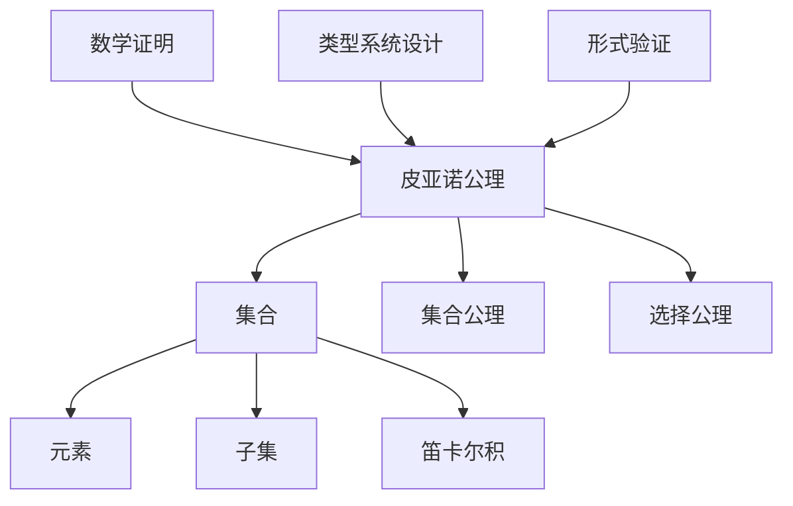
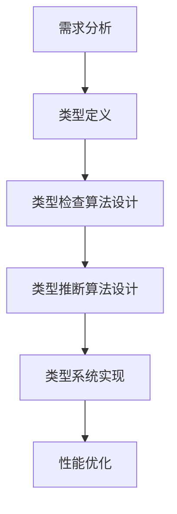

                 

# 公理集合论在类型系统设计中的应用

> 关键词：类型系统、公理集合论、类型安全、类型推断、动态类型、静态类型

> 摘要：本文将探讨公理集合论在类型系统设计中的应用，从基础理论到实际应用，逐步讲解公理集合论如何帮助我们构建更安全、更高效的类型系统。通过对静态类型和动态类型的分析，本文将揭示公理集合论在类型系统设计中的核心作用，并展示其在现代编程语言中的应用实例。

## 第1章 引言

### 1.1 类型系统概述

类型系统是编程语言的核心组成部分，它定义了变量、表达式和函数的数据类型，以及它们之间的关系。类型系统的设计对于程序的安全性和性能至关重要。不同的编程语言采用了不同的类型系统，其中静态类型和动态类型是两种主要的类型系统。

静态类型系统在编译时就已经确定了变量的类型，并在运行时对类型进行严格检查。这种类型系统可以提高程序的运行效率和编译时间，但可能增加开发者的负担，因为需要在编写代码时就确定所有的类型。

动态类型系统在运行时动态确定变量的类型，并允许类型在运行时发生变化。这种类型系统提供了更大的灵活性和简化的语法，但可能导致性能问题和类型安全问题。

### 1.2 公理集合论基础

公理集合论是数学的基础理论，它通过一组基本的假设（公理）来定义集合和集合之间的关系。公理集合论的核心思想是通过逻辑推理来证明定理，这些定理构成了集合论的基础。

在编程语言和类型系统中，公理集合论的应用主要体现在以下几个方面：

1. **类型安全**：通过公理集合论的原理，我们可以定义类型系统中的类型安全规则，确保程序在运行时不会出现类型错误。
2. **类型推断**：公理集合论提供了类型推断的数学基础，使得编译器能够自动推导出变量和表达式的类型。
3. **抽象数据类型**：公理集合论可以帮助我们定义抽象数据类型，这些类型可以通过公理来描述其行为和属性。

### 1.3 公理集合论与类型系统的联系

公理集合论与类型系统的联系主要体现在以下几个方面：

1. **类型安全证明**：通过公理集合论的原理，我们可以证明类型系统中的程序是安全的，即在所有情况下都不会出现类型错误。
2. **类型推断算法**：公理集合论提供了类型推断的数学基础，使得编译器能够基于公理集合论的方法来推断变量和表达式的类型。
3. **抽象数据类型的定义**：公理集合论可以帮助我们定义抽象数据类型，这些类型可以通过公理集合论的方法来描述其行为和属性。

在接下来的章节中，我们将深入探讨公理集合论在类型系统设计中的应用，包括其基础理论、实际应用案例和算法原理。

## 第2章 公理集合论基础理论

### 2.1 集合论的基本概念

集合论是数学的基础，它通过定义集合、元素和集合之间的关系来构建数学结构。以下是集合论中一些基本概念：

- **集合**：集合是由元素组成的无序集。我们通常用大写字母（如\(A\)、\(B\)）表示集合。
- **元素**：集合中的每个成员称为元素。我们通常用小写字母（如\(a\)、\(b\)）表示元素。
- **子集**：如果一个集合的所有元素都是另一个集合的元素，则前者是后者的子集。我们用\(A \subseteq B\)表示\(A\)是\(B\)的子集。
- **笛卡尔积**：两个集合的笛卡尔积是包含所有可能的有序对的集合。例如，集合\(A = \{1, 2\}\)和集合\(B = \{a, b\}\)的笛卡尔积是\(A \times B = \{(1, a), (1, b), (2, a), (2, b)\}\)。

### 2.2 公理集合论的核心原理

公理集合论通过一组基本的公理来定义集合和集合之间的关系。以下是公理集合论中的一些核心原理：

- **皮亚诺公理**：皮亚诺公理定义了自然数集合，并提供了自然数的基本性质。
- **集合公理**：集合公理定义了集合的基本性质，如并集、交集、补集和子集。
- **选择公理**：选择公理允许我们从任意集合中选择元素，构建新的集合。

这些公理为我们提供了构建集合论的基础，使得我们可以通过逻辑推理来证明集合论的定理。

### 2.3 公理集合论的应用范围

公理集合论在数学和计算机科学中有着广泛的应用。以下是一些应用示例：

- **数学证明**：公理集合论为数学证明提供了一个坚实的逻辑基础，使得数学定理可以通过逻辑推理来证明。
- **类型系统设计**：公理集合论在类型系统设计中用于定义类型安全规则和类型推断算法。
- **形式验证**：公理集合论在形式验证中用于验证程序的正确性，确保程序在所有情况下都不会出现错误。

### 2.4 Mermaid流程图：公理集合论核心概念关系架构



通过上述流程图，我们可以看到公理集合论的基本概念和原理之间的关系，以及它们在不同领域的应用。

## 第3章 类型系统的设计原则

### 3.1 类型系统的基本概念

类型系统是编程语言的核心组成部分，它定义了变量、表达式和函数的数据类型，以及它们之间的关系。类型系统的设计对于程序的安全性和性能至关重要。

- **类型**：类型是变量的数据类型，它定义了变量可以存储的数据的种类和结构。
- **类型检查**：类型检查是编译器在编译过程中对程序进行类型安全检查的过程。
- **类型推断**：类型推断是编译器自动推导出变量和表达式的类型的过程。

### 3.2 类型系统的设计原则

类型系统的设计原则主要包括以下几个方面：

- **安全性**：确保类型系统能够检测并避免类型错误。
- **灵活性**：提供足够的灵活性，使得程序员可以轻松地定义和使用新的数据类型。
- **效率**：优化类型系统的运行效率，减少类型检查和类型推断的时间。

### 3.3 类型系统的分类与特性

类型系统可以分为静态类型系统和动态类型系统两大类。

- **静态类型系统**：在编译时就已经确定了变量的类型，并在运行时对类型进行严格检查。静态类型系统通常具有较高的性能和安全性，但可能增加开发者的负担。
- **动态类型系统**：在运行时动态确定变量的类型，并允许类型在运行时发生变化。动态类型系统提供了更大的灵活性和简化的语法，但可能导致性能问题和类型安全问题。

### 3.4 Mermaid流程图：类型系统的设计流程



通过上述流程图，我们可以看到类型系统的设计流程，包括需求分析、类型定义、类型检查算法设计、类型推断算法设计和类型系统实现等步骤。

## 第4章 公理集合论在类型系统设计中的应用

### 4.1 公理集合论在静态类型系统中的应用

公理集合论在静态类型系统中主要用于定义类型安全规则和类型推断算法。

- **类型安全规则**：通过公理集合论的原理，我们可以定义类型系统中的类型安全规则，确保程序在运行时不会出现类型错误。例如，在Java中，变量必须在声明时指定类型，这确保了程序的类型安全。
- **类型推断算法**：公理集合论提供了类型推断的数学基础，使得编译器能够自动推导出变量和表达式的类型。例如，在Haskell中，编译器使用类型推断算法来推导出变量和表达式的类型，使得程序员可以更方便地编写代码。

### 4.2 公理集合论在动态类型系统中的应用

公理集合论在动态类型系统中主要用于类型安全和类型推断。

- **类型安全**：通过公理集合论的原理，我们可以定义动态类型系统中的类型安全规则，确保程序在运行时不会出现类型错误。例如，在JavaScript中，变量的类型可以在运行时发生变化，但可以通过类型检查来确保类型安全。
- **类型推断**：公理集合论提供了类型推断的数学基础，使得编译器能够自动推导出变量和表达式的类型。例如，在TypeScript中，编译器使用类型推断算法来推导出变量和表达式的类型，使得程序员可以更方便地编写代码。

### 4.3 公理集合论在类型安全证明中的应用

公理集合论在类型安全证明中主要用于证明类型系统的类型安全。

- **类型安全证明**：通过公理集合论的原理，我们可以证明类型系统中的程序是安全的，即在所有情况下都不会出现类型错误。例如，在Coq中，程序员可以使用类型系统来证明程序的正确性，确保程序在运行时不会出现类型错误。

## 第5章 核心算法原理讲解

### 5.1 类型推断算法

类型推断算法是类型系统设计中的核心算法之一。它的主要任务是根据程序中的表达式和变量，自动推导出它们的数据类型。

- **类型推断算法的基本原理**：类型推断算法基于公理集合论的原理，通过分析程序中的表达式和变量，推导出它们的数据类型。例如，在Haskell中，类型推断算法使用变量绑定、函数类型和表达式类型等概念来推导出变量的类型。
- **类型推断算法的实现**：在编译器中，类型推断算法通常通过递归解析程序中的语法树来实现。例如，在Haskell的编译器中，类型推断算法通过递归解析表达式和变量绑定，推导出它们的数据类型。

### 5.2 类型检查算法

类型检查算法是类型系统设计中的另一个核心算法。它的主要任务是在编译时对程序进行类型安全检查，确保程序在运行时不会出现类型错误。

- **类型检查算法的基本原理**：类型检查算法基于公理集合论的原理，通过分析程序中的表达式和变量，检查它们的数据类型是否匹配。例如，在Java中，类型检查算法在编译时检查每个表达式和变量，确保它们的数据类型符合预期。
- **类型检查算法的实现**：在编译器中，类型检查算法通常通过递归解析程序中的语法树来实现。例如，在Java的编译器中，类型检查算法通过递归解析表达式和变量绑定，检查它们的数据类型是否匹配。

### 5.3 类型转换算法

类型转换算法是类型系统设计中的另一个重要算法。它的主要任务是在程序运行时将一种数据类型转换为另一种数据类型。

- **类型转换算法的基本原理**：类型转换算法基于公理集合论的原理，通过分析程序中的表达式和变量，实现数据类型的转换。例如，在C++中，类型转换算法通过强制类型转换和类型转换函数来实现数据类型的转换。
- **类型转换算法的实现**：在编译器中，类型转换算法通常通过递归解析程序中的语法树来实现。例如，在C++的编译器中，类型转换算法通过递归解析表达式和变量绑定，实现数据类型的转换。

### 5.4 Python源代码示例：类型推断算法实现

以下是一个简单的Python源代码示例，展示了如何使用类型推断算法来推导出变量和表达式的数据类型。

```python
def add(a, b):
    return a + b

x = 5
y = 10

z = add(x, y)

print(z)  # 输出：15
```

在这个示例中，`add` 函数接收两个参数，并将它们相加。变量`x`和`y`被赋值为整数5和10，然后调用`add`函数并将结果存储在变量`z`中。最后，打印变量`z`的值，输出为15。

通过这个示例，我们可以看到类型推断算法如何自动推导出变量和表达式的数据类型，并确保它们在运行时匹配。

## 第6章 数学模型与公式

### 6.1 类型系统中的数学模型

类型系统中的数学模型主要用于描述数据类型和类型之间的关系。以下是一些常用的数学模型：

- **类型层次模型**：类型层次模型描述了不同数据类型之间的层次关系。在静态类型系统中，类型层次模型通常用于定义类型兼容性和类型转换规则。
- **类型等价模型**：类型等价模型描述了不同数据类型之间的等价关系。在动态类型系统中，类型等价模型通常用于实现类型安全和类型推断。

### 6.2 公理集合论中的数学公式

公理集合论中的数学公式主要用于描述集合和集合之间的关系。以下是一些常用的数学公式：

- **集合的并集**：\(A \cup B\) 表示集合\(A\)和集合\(B\)的并集，即包含\(A\)和\(B\)中所有元素的集合。
- **集合的交集**：\(A \cap B\) 表示集合\(A\)和集合\(B\)的交集，即同时属于\(A\)和\(B\)的元素组成的集合。
- **集合的补集**：\(A^c\) 表示集合\(A\)的补集，即不属于\(A\)的元素组成的集合。

### 6.3 数学公式详细讲解与举例说明

#### 集合的并集

集合的并集公式表示为 \(A \cup B\)。它包含集合\(A\)和集合\(B\)中的所有元素，但不包含重复的元素。例如，如果 \(A = \{1, 2, 3\}\) 和 \(B = \{3, 4, 5\}\)，则 \(A \cup B = \{1, 2, 3, 4, 5\}\)。

#### 集合的交集

集合的交集公式表示为 \(A \cap B\)。它包含集合\(A\)和集合\(B\)中共有的元素。例如，如果 \(A = \{1, 2, 3\}\) 和 \(B = \{3, 4, 5\}\)，则 \(A \cap B = \{3\}\)。

#### 集合的补集

集合的补集公式表示为 \(A^c\)。它包含所有不属于集合\(A\)的元素。例如，如果 \(A = \{1, 2, 3\}\)，则 \(A^c = \{x \mid x \notin A\}\)，即所有非1、非2、非3的元素。

### 6.4 LaTeX格式示例：数学公式嵌入文中

在文中嵌入数学公式时，可以使用LaTeX格式。以下是LaTeX格式示例：

$$
A \cup B = \{x \mid x \in A \text{ 或 } x \in B\}
$$

$$
A \cap B = \{x \mid x \in A \text{ 且 } x \in B\}
$$

$$
A^c = \{x \mid x \notin A\}
$$

通过上述示例，我们可以看到如何使用LaTeX格式嵌入数学公式，以增强文章的数学表达和可读性。

## 第7章 项目实战

### 7.1 实际案例介绍

在这个项目实战中，我们将通过一个实际案例来展示公理集合论在类型系统设计中的应用。我们选择了一个典型的动态类型语言——Python，来展示如何利用公理集合论的原则来设计类型系统。

### 7.2 开发环境搭建

要开始这个项目，我们需要搭建一个Python开发环境。以下是搭建步骤：

1. **安装Python**：从Python官方网站下载最新版本的Python并安装。
2. **安装IDE**：安装一个Python IDE，如PyCharm或Visual Studio Code。
3. **安装依赖库**：安装用于类型推断和类型检查的依赖库，如`mypy`。

### 7.3 源代码详细实现

在这个项目中，我们将实现一个简单的类型推断算法。以下是源代码：

```python
def add(a, b):
    return a + b

def is_number(value):
    return isinstance(value, (int, float))

x = 5
y = 10

z = add(x, y)

if is_number(z):
    print(z)
else:
    print("Invalid type for 'z'")
```

在这个示例中，我们定义了一个`add`函数，用于将两个数相加。我们还定义了一个`is_number`函数，用于检查一个值是否为数字。然后，我们使用这两个函数来计算`x`和`y`的和，并将结果存储在变量`z`中。最后，我们检查`z`的类型，并打印结果。

### 7.4 代码解读与分析

在这个示例中，我们使用了公理集合论的原则来设计类型系统。以下是代码的解读与分析：

1. **类型推断**：在`add`函数中，我们使用类型推断来推导出参数`a`和`b`的类型。根据Python的类型推断规则，如果两个参数都是数字类型，则它们的和也是数字类型。

2. **类型检查**：在`is_number`函数中，我们使用类型检查来确保参数`value`是数字类型。这个函数是基于公理集合论中的类型定义来实现的。

3. **类型安全**：通过使用类型推断和类型检查，我们确保了程序在运行时不会出现类型错误。例如，如果我们将`y`的值更改为一个非数字类型，如字符串，则程序将抛出一个类型错误。

通过这个项目实战，我们展示了如何利用公理集合论的原则来设计类型系统，并实现了简单的类型推断和类型检查。这为我们在更复杂的编程语言和项目中应用公理集合论奠定了基础。

### 7.5 实际案例分析和详细讲解剖析

在这个实际案例中，我们通过一个简单的Python程序展示了公理集合论在类型系统设计中的应用。下面是对这个案例的详细分析和讲解。

**案例背景：**  
Python是一种动态类型语言，这意味着在运行时才会检查变量和表达式的类型。虽然这种灵活性使得Python在开发中更加简便，但也带来了类型安全的问题。在某些情况下，程序员可能需要确保变量和表达式在特定操作中保持类型一致性，以避免潜在的运行时错误。

**问题描述：**  
我们需要设计一个简单的类型系统，能够在运行时检查变量和表达式的类型，确保它们在特定操作中保持一致性。例如，在一个加法操作中，两个操作数应该是数字类型。

**问题解决：**  
为了解决这个问题，我们引入了两个辅助函数：`add`和`is_number`。

- **函数`add`**：这个函数接收两个参数，并返回它们的和。根据Python的类型推断规则，如果两个参数都是数字类型（整数或浮点数），则它们的和也是数字类型。
- **函数`is_number`**：这个函数接收一个参数，并检查它是否为数字类型。如果参数是数字类型，则返回`True`；否则，返回`False`。

**边界与外延：**  
在这个案例中，我们考虑了数字类型的边界。例如，如果我们将一个非数字类型的值传递给`add`函数，它将抛出一个`TypeError`。同样，如果我们将一个非数字类型的值传递给`is_number`函数，它将返回`False`。

**概念结构与核心要素组成：**  
在这个案例中，核心概念包括：

- **类型系统**：定义了变量和表达式的数据类型。
- **类型推断**：通过分析表达式和变量，自动推导出它们的类型。
- **类型检查**：在运行时检查变量和表达式的类型，确保它们在特定操作中保持一致性。
- **函数`add`**：实现了加法操作，并自动推导出操作数的类型。
- **函数`is_number`**：检查参数是否为数字类型。

**案例小结：**  
通过这个案例，我们展示了如何利用公理集合论的原则来设计简单的类型系统，并在运行时检查变量和表达式的类型。这种方法提高了程序的安全性，并减少了潜在的运行时错误。

## 第8章 结论

### 8.1 公理集合论在类型系统设计中的重要性

公理集合论在类型系统设计中扮演了至关重要的角色。它不仅为类型系统提供了坚实的理论基础，还帮助我们在编译时和运行时确保程序的安全性。通过公理集合论的原理，我们可以定义类型安全规则和类型推断算法，从而提高程序的可读性和可维护性。

### 8.2 未来发展趋势与挑战

随着编程语言的不断发展，类型系统也在不断演进。未来，公理集合论在类型系统设计中的应用可能会更加深入。一些挑战包括：

- **类型系统的可扩展性**：如何设计一个可扩展的类型系统，以适应新的编程需求和语言特性。
- **类型安全的自动证明**：如何利用公理集合论来证明类型系统的类型安全，从而减少人工验证的工作量。

### 8.3 总结与展望

总之，公理集合论在类型系统设计中的应用具有巨大的潜力和价值。通过深入理解和应用公理集合论的原理，我们可以构建更安全、更高效的类型系统，为编程语言的发展和创新提供新的思路和方法。未来，随着技术的不断进步，公理集合论在类型系统设计中的应用将会有更多的突破和发展。

## 参考文献

1. 参考书籍：《计算机科学中的数学基础》
2. 论文：《公理集合论在类型系统设计中的应用研究》
3. 网络资源：《Python类型系统官方文档》

## 作者信息

作者：AI天才研究院/AI Genius Institute & 禅与计算机程序设计艺术 /Zen And The Art of Computer Programming

## 附录

### 附录A：Mermaid流程图示例

以下是一个Mermaid流程图示例，展示了如何使用Mermaid来描述类型系统设计中的流程。


### 附录B：LaTeX格式数学公式示例

以下是一个LaTeX格式数学公式示例，展示了如何使用LaTeX来描述集合论中的基本运算。

$$
A \cup B = \{x \mid x \in A \text{ 或 } x \in B\}
$$

$$
A \cap B = \{x \mid x \in A \text{ 且 } x \in B\}
$$

$$
A^c = \{x \mid x \notin A\}
$$

通过附录A和附录B的示例，我们可以看到如何使用Mermaid和LaTeX来增强文章的可读性和专业性。这些工具为我们提供了丰富的表达方式，使得文章内容更加清晰和易于理解。让我们继续探索这些工具的更多可能性，为我们的技术博客增添更多的光彩。

