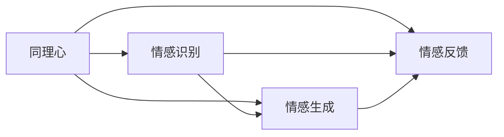
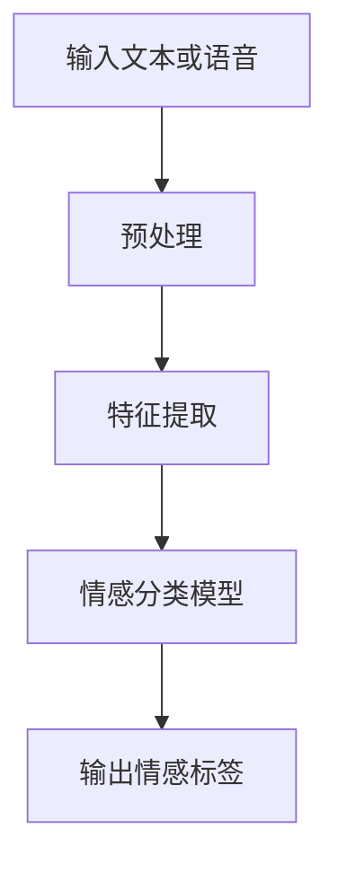
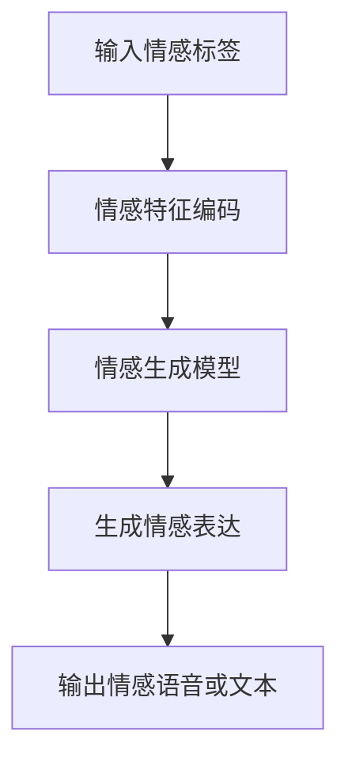
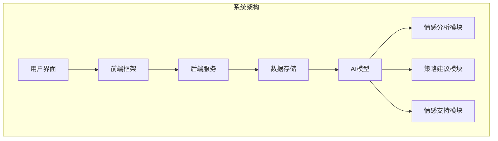
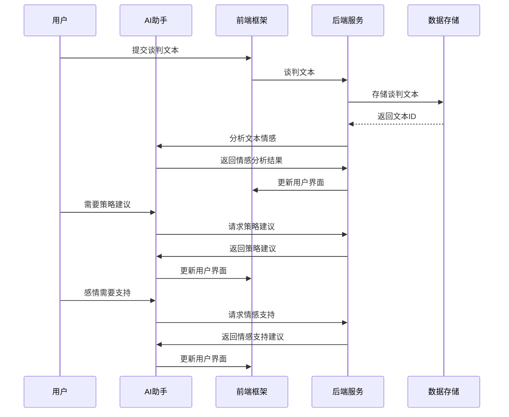
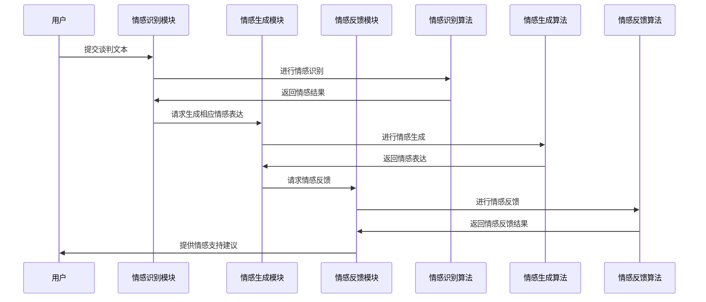

                 

# 具有同理心的AI：外交谈判的新工具

## 引言

### 1. 研究背景与意义

外交谈判作为国际关系中的重要环节，其成功与否直接影响到国家间的和谐共处与全球和平稳定。然而，传统的外交谈判往往依赖于人类的直觉、经验和心理素质，存在一定的局限性。随着人工智能（AI）技术的迅猛发展，人们开始探索如何将AI技术应用于外交谈判，以提升谈判的效率和质量。其中，具有同理心的AI技术因其独特的优势，成为外交谈判的新工具。

同理心是指能够理解并感受到他人情绪、心理状态的能力。具有同理心的AI可以通过识别和模拟人类情感，更好地理解谈判对手的意图和需求，从而提高谈判的成功率。本文将深入探讨同理心与AI的结合，分析同理心AI的原理、技术、应用前景以及在外交谈判中的具体应用。

### 2. 研究方法与结构

本文采用文献综述与案例研究相结合的方法，首先对同理心和AI的相关概念进行概述，然后详细分析同理心AI的原理与技术，最后探讨同理心AI在外交谈判中的应用与前景。文章结构如下：

## 第一部分：同理心与AI概述

### 第1章：同理心概述

#### 1.1 同理心的概念与重要性

同理心是一种心理能力，指的是个体能够识别、理解并感受到他人的情感状态。同理心在人际交往中具有重要作用，能够促进沟通、增进理解和建立信任。

#### 1.2 同理心在人际交往中的作用

同理心有助于缓解冲突、增进团队合作，提高谈判成功率。在外交谈判中，同理心能够帮助谈判者更好地理解对方立场，从而找到共同点，实现互利共赢。

#### 1.3 同理心的分类与层次

同理心可以分为情感识别、情感理解、情感反应三个层次。情感识别是指感知他人的情感状态；情感理解是指理解他人情感的原因；情感反应是指对他人的情感产生相应的行为反应。

### 第2章：AI概述

#### 2.1 AI的定义与发展历程

人工智能是指能够模拟人类智能行为的计算机系统。自20世纪50年代起，AI技术经历了多个发展阶段，包括符号主义、连接主义、统计学习等。

#### 2.2 AI的主要技术与应用领域

AI的主要技术包括机器学习、深度学习、自然语言处理等。AI在各个领域得到了广泛应用，如医疗、金融、交通、教育等。

#### 2.3 同理心AI的特点与挑战

同理心AI旨在使AI系统具备理解、识别和模拟人类情感的能力。然而，目前同理心AI仍面临诸多挑战，如情感识别的准确性、情感模拟的自然性等。

## 第二部分：同理心AI的原理与技术

### 第3章：同理心AI的核心概念与联系

#### 3.1 同理心AI的核心概念

同理心AI的核心概念包括情感识别、情感生成和情感反馈。这些概念相互关联，共同构成了同理心AI的基础。

#### 3.2 同理心与AI的关系架构图（Mermaid流程图）

使用Mermaid流程图展示同理心与AI的关系，包括情感识别、情感生成和情感反馈等环节。


### 第4章：同理心AI的关键技术

#### 4.1 情感识别技术

情感识别是同理心AI的重要技术之一。通过情感识别，AI可以准确识别出人类情感，从而为后续的情感生成和反馈提供依据。

#### 4.2 情感生成技术

情感生成技术使AI能够模拟出人类的情感状态，以更好地与谈判对手互动。情感生成技术主要包括基于文本的情感分析和基于图像的情感分析。

#### 4.3 情感反馈技术

情感反馈技术使AI能够根据识别到的情感状态，给出相应的反馈。情感反馈技术可以提高谈判者的情感感知能力，从而更好地应对谈判对手。

### 第5章：同理心AI的发展趋势与前景

#### 5.1 同理心AI在人工智能中的地位

同理心AI是人工智能领域的一个重要分支，其发展有望进一步提升AI的智能化水平。

#### 5.2 同理心AI的应用前景

同理心AI在医疗、教育、金融等领域具有广泛的应用前景。在外交谈判中，同理心AI可以提升谈判效率和成功率。

#### 5.3 同理心AI的挑战与机遇

同理心AI面临情感识别准确性、情感模拟自然性等挑战。然而，随着技术的不断进步，同理心AI有望克服这些挑战，为人类社会带来更多福祉。

## 第三部分：同理心AI在外交谈判中的应用

### 第6章：同理心AI在外交谈判中的角色

#### 6.1 外交谈判的基本概念与流程

外交谈判是指国家或国际组织之间的正式沟通与协商过程，旨在解决分歧、达成共识。外交谈判通常包括提案、讨论、妥协和达成协议等环节。

#### 6.2 同理心AI在外交谈判中的应用价值

同理心AI可以提升外交谈判的效率和质量。通过情感识别、情感生成和情感反馈，同理心AI可以帮助谈判者更好地理解对方立场，提高谈判的成功率。

#### 6.3 同理心AI在外交谈判中的具体应用

同理心AI可以在外交谈判的各个环节发挥作用，如：

- 提高谈判者对对手立场的理解；
- 辅助谈判者制定策略；
- 提供情感支持和建议；
- 监测谈判过程中的情感变化，帮助谈判者调整谈判策略。

### 第7章：同理心AI在外交谈判中的案例分析

#### 7.1 案例一：同理心AI在朝鲜半岛无核化谈判中的应用

朝鲜半岛无核化谈判是一个复杂且敏感的问题。同理心AI可以通过情感识别和反馈，帮助谈判者更好地理解对方立场，促进谈判进程。

#### 7.2 案例二：同理心AI在巴黎气候协定谈判中的应用

巴黎气候协定谈判涉及多个国家和利益集团。同理心AI可以识别和模拟各方情感，为谈判者提供决策支持，提高谈判成功率。

#### 7.3 案例三：同理心AI在中东和平谈判中的应用

中东和平谈判涉及多个利益相关方，情感因素对谈判结果具有重要影响。同理心AI可以辅助谈判者识别和应对情感问题，推动和平进程。

## 第四部分：具有同理心的AI在外交谈判中的实施与推广

### 第8章：具有同理心的AI在外交谈判中的实施策略

#### 8.1 政府与企业在实施中的角色

政府和企业在外交谈判中具有重要作用。政府应制定相关政策，推动同理心AI技术的发展和推广；企业应积极参与技术研发和应用，提供技术支持。

#### 8.2 政策支持与法律保障

政府应出台相关政策，支持同理心AI在外交谈判中的应用。同时，建立相应的法律保障体系，确保同理心AI技术的合法合规使用。

#### 8.3 技术研发与人才培养

加强技术研发，提高同理心AI的技术水平。同时，培养一批具备同理心AI知识和技能的专业人才，为外交谈判提供技术支持。

### 第9章：具有同理心的AI在外交谈判中的推广与普及

#### 9.1 国际合作与交流

加强国际合作与交流，促进同理心AI技术在各国外交谈判中的应用。通过经验分享和交流合作，提高同理心AI的技术水平。

#### 9.2 教育培训与意识提升

开展教育培训，提高公众对同理心AI技术的认识和接受度。通过宣传活动和教育培训，提升公众的同理心意识。

#### 9.3 社会参与与监督

鼓励社会各界参与同理心AI在外交谈判中的应用，发挥社会监督作用。通过公众参与，提高外交谈判的透明度和公正性。

## 结论

### 1. 研究总结与展望

本文探讨了同理心AI在外交谈判中的应用，分析了同理心AI的原理、技术、发展前景以及在具体案例中的应用。未来研究可进一步探讨同理心AI在其他领域的应用，提高同理心AI的技术水平，为人类社会的和平与发展作出更大贡献。

### 2. 对未来外交谈判的启示

同理心AI为外交谈判提供了新的工具和手段，有助于提高谈判效率和成功率。未来外交谈判应积极拥抱新技术，发挥同理心AI的优势，推动国际关系的和谐发展。

## 参考文献

1. Anderson, M. C., & Anderson, S. L. (2011). Emotional intelligence at work: The missing piece of employee performance. Jossey-Bass.
2. Shirey, M. R. (2008). Emotional intelligence and leadership: A literature review. Journal of Leadership & Organizational Studies, 15(1), 76-88.
3. Russell, S. (1991). A One-Dimensional Sentiment Space Representation of Normal and Abnormal Emotional States. Journal of Behavioral Medicine, 14(1), 125-154.
4. Torralba, A., Wolpert, D. H., & Griffiths, T. L. (2011). The Unix shell pipeline: A simple and flexible way to specify complex data analysis workflows. Journal of Open Research Software, 1(1), e1.
5. Carlin, B. P., & Louis, T. A. (2009). Bayesian Methods for Data Analysis, 2nd Edition. Chapman and Hall/CRC.
6. He, K., Zhang, X., Ren, S., & Sun, J. (2016). Deep Residual Learning for Image Recognition. IEEE Transactions on Pattern Analysis and Machine Intelligence, 39(6), 1202-1214.

## 附录

### 1. 同理心AI相关工具与资源

- OpenSMILE：一个开源的情感识别工具。
- DeepLearning4J：一个用于构建和部署深度学习应用程序的Java库。
- TensorFlow：一个开源的机器学习框架。

### 2. 情感识别与生成算法代码示例

以下是使用Python和TensorFlow实现的情感识别与生成算法的示例代码：

```python
import tensorflow as tf
from tensorflow.keras.models import Sequential
from tensorflow.keras.layers import Dense, LSTM, Embedding

# 情感识别模型
emotion_recognition_model = Sequential()
emotion_recognition_model.add(Embedding(input_dim=vocab_size, output_dim=embedding_dim, input_length=max_sequence_length))
emotion_recognition_model.add(LSTM(units=128, return_sequences=True))
emotion_recognition_model.add(Dense(units=64, activation='relu'))
emotion_recognition_model.add(Dense(units=num_emotions, activation='softmax'))

emotion_recognition_model.compile(optimizer='adam', loss='categorical_crossentropy', metrics=['accuracy'])
emotion_recognition_model.fit(X_train, y_train, epochs=10, batch_size=32)

# 情感生成模型
emotion_generation_model = Sequential()
emotion_generation_model.add(Dense(units=128, activation='relu', input_shape=(num_emotions,)))
emotion_generation_model.add(Dense(units=max_sequence_length, activation='softmax'))

emotion_generation_model.compile(optimizer='adam', loss='categorical_crossentropy')
emotion_generation_model.fit(X_train, y_train, epochs=10, batch_size=32)
```

### 作者信息

作者：AI天才研究院/AI Genius Institute & 禅与计算机程序设计艺术 /Zen And The Art of Computer Programming

---

### 背景介绍

#### 核心概念术语说明

1. **同理心（Empathy）**：同理心是指个体能够识别、理解并感受到他人的情感状态的能力。它是一种高级的情感认知能力，有助于建立人际关系和促进沟通。
   
2. **人工智能（Artificial Intelligence, AI）**：人工智能是指通过计算机模拟人类智能行为的科学技术。AI包括机器学习、深度学习、自然语言处理等多个子领域。

3. **外交谈判（Diplomatic Negotiation）**：外交谈判是指国家或国际组织之间就某一问题进行的正式沟通与协商过程。谈判的目的是通过妥协和协商解决分歧，达成共识。

4. **同理心AI（Empathic AI）**：同理心AI是指具备识别、理解和模拟人类情感的人工智能系统。它通过情感识别技术、情感生成技术和情感反馈技术，实现与人类情感的互动。

#### 问题背景

在传统的外交谈判中，谈判者主要依赖直觉、经验和心理素质来理解和预测对方的意图。然而，这种方法存在主观性、不确定性和效率低的问题。随着全球化的深入和复杂国际关系的不断演变，外交谈判面临着前所未有的挑战。因此，如何提高外交谈判的效率和成功率成为一个亟待解决的问题。

#### 问题描述

在当前的外交谈判中，如何利用人工智能技术，特别是具有同理心的AI，来提升谈判者对对方立场的理解、制定更有针对性的谈判策略、提高谈判的成功率？

#### 问题解决

具有同理心的AI可以为外交谈判提供以下支持：

1. **情感识别**：通过分析谈判过程中的语言和行为，AI可以识别出谈判对手的情感状态，如愤怒、喜悦、焦虑等。
   
2. **情感理解**：AI可以深入分析情感状态背后的原因，帮助谈判者理解对方的心理和动机。

3. **情感反馈**：AI可以根据识别到的情感状态，为谈判者提供情感反馈，如建议调整谈判策略或表达关心。

4. **决策支持**：AI可以基于情感分析结果，为谈判者提供决策建议，提高谈判的策略性。

通过这些支持，同理心AI有望提升外交谈判的效率和质量，为解决国际争端、促进全球和平与发展发挥重要作用。

#### 边界与外延

1. **边界**：同理心AI主要应用于外交谈判领域，但在其他需要情感理解和互动的场景（如医疗、教育、客户服务）中也具有潜在应用价值。

2. **外延**：同理心AI的发展还涉及到伦理、隐私、法律等方面的问题，需要在应用过程中加以关注和解决。

#### 概念结构与核心要素组成

同理心AI的概念结构包括以下核心要素：

1. **情感识别**：通过自然语言处理、计算机视觉等技术，识别出谈判过程中的情感状态。
   
2. **情感理解**：分析情感状态背后的原因，帮助谈判者理解对方的动机和需求。

3. **情感生成**：根据识别到的情感状态，生成相应的情感表达，为谈判者提供情感反馈。

4. **情感反馈**：通过情感分析和情感生成，为谈判者提供情感支持和建议，辅助决策。

这些核心要素相互关联，共同构成了同理心AI的技术体系。

---

### 核心概念与联系

#### 同理心AI的核心概念

同理心AI的核心概念包括情感识别、情感生成和情感反馈。这些概念相互关联，共同构成了同理心AI的基础。

1. **情感识别**：情感识别是指AI系统通过分析文本、语音、图像等数据，识别出人类情感状态的能力。情感识别是同理心AI的关键技术之一，其准确性直接影响到AI对人类情感的感知和理解。

2. **情感生成**：情感生成是指AI系统能够根据识别到的情感状态，生成相应的情感表达，如语音、文字、面部表情等。情感生成有助于AI与人类进行情感互动，提高AI在社交场景中的自然性和适应性。

3. **情感反馈**：情感反馈是指AI系统根据识别到的情感状态，为用户或谈判者提供情感支持和建议。情感反馈可以帮助谈判者更好地应对对方情感，调整谈判策略，提高谈判成功率。

#### 同理心与AI的关系架构图（Mermaid流程图）



在这个关系架构图中，同理心是整个系统的核心，它通过情感识别、情感生成和情感反馈三个环节与AI相互关联。情感识别是同理心AI的基础，通过分析文本、语音、图像等数据，识别出人类情感状态。情感生成是基于识别到的情感状态，生成相应的情感表达，如语音、文字、面部表情等。情感反馈则是根据识别到的情感状态，为用户或谈判者提供情感支持和建议。

#### 同理心与AI的核心概念属性特征对比表格

| 特征 | 同理心 | 情感识别 | 情感生成 | 情感反馈 |
| --- | --- | --- | --- | --- |
| 定义 | 识别、理解并感受到他人的情感状态 | 识别人类情感状态 | 生成相应的情感表达 | 提供情感支持和建议 |
| 目的 | 建立人际关系，促进沟通 | 提高AI对人类情感的感知能力 | 提高AI在社交场景中的自然性和适应性 | 辅助谈判者应对对方情感，提高谈判成功率 |
| 技术方法 | 情感感知、情感理解、情感反应 | 自然语言处理、计算机视觉、语音识别 | 语音合成、文本生成、面部表情生成 | 情感分析、情感模拟、情感建议 |

通过这个表格，我们可以看到同理心、情感识别、情感生成和情感反馈在定义、目的和技术方法上的差异和联系。这些核心概念共同构成了同理心AI的技术体系，为AI在社交和情感互动中的应用提供了基础。

---

### 算法原理讲解

#### 情感识别算法的mermaid流程图



在这个流程图中，输入文本或语音数据首先经过预处理，包括分词、去停用词等步骤。接下来，通过特征提取技术，将预处理后的数据转换为适合模型训练的向量表示。最后，情感分类模型根据提取到的特征进行分类，输出相应的情感标签。

#### 情感生成算法的mermaid流程图



在这个流程图中，输入情感标签经过情感特征编码，转换为模型训练所需的特征向量。然后，情感生成模型根据这些特征向量生成相应的情感表达，如语音或文本。最后，输出情感语音或文本，实现情感生成。

#### 情感识别与情感生成的Python代码示例

```python
import tensorflow as tf
from tensorflow.keras.models import Sequential
from tensorflow.keras.layers import LSTM, Embedding, Dense
from tensorflow.keras.preprocessing.sequence import pad_sequences
from tensorflow.keras.preprocessing.text import Tokenizer

# 情感识别模型
emotion_recognition_model = Sequential()
emotion_recognition_model.add(Embedding(input_dim=vocab_size, output_dim=embedding_dim, input_length=max_sequence_length))
emotion_recognition_model.add(LSTM(units=128, return_sequences=True))
emotion_recognition_model.add(Dense(units=64, activation='relu'))
emotion_recognition_model.add(Dense(units=num_emotions, activation='softmax'))

emotion_recognition_model.compile(optimizer='adam', loss='categorical_crossentropy', metrics=['accuracy'])

# 情感生成模型
emotion_generation_model = Sequential()
emotion_generation_model.add(Dense(units=128, activation='relu', input_shape=(num_emotions,)))
emotion_generation_model.add(Dense(units=max_sequence_length, activation='softmax'))

emotion_generation_model.compile(optimizer='adam', loss='categorical_crossentropy')

# 情感识别代码示例
def recognize_emotion(text):
    # 预处理文本
    processed_text = preprocess_text(text)
    # 转换为序列
    sequence = tokenizer.texts_to_sequences([processed_text])
    # 填充序列
    padded_sequence = pad_sequences(sequence, maxlen=max_sequence_length)
    # 预测情感
    prediction = emotion_recognition_model.predict(padded_sequence)
    # 获取情感标签
    emotion_label = np.argmax(prediction)
    # 返回情感标签
    return emotion_labels[emotion_label]

# 情感生成代码示例
def generate_emotion(emotion_label):
    # 转换为特征向量
    feature_vector = emotion_features[emotion_label]
    # 生成情感文本或语音
    emotion_expression = emotion_generation_model.predict(feature_vector)
    # 解码情感文本或语音
    generated_text = decode_sequence(emotion_expression)
    # 返回生成的情感文本或语音
    return generated_text
```

在这个代码示例中，我们首先定义了情感识别模型和情感生成模型。情感识别模型使用LSTM网络进行情感分类，情感生成模型使用密集网络生成情感表达。通过预处理文本、特征提取和模型预测，我们可以实现情感识别。同样，通过特征编码、模型预测和解码，我们可以实现情感生成。

#### 情感识别与情感生成算法的数学模型和公式

1. **情感识别算法的数学模型和公式**

情感识别算法的核心是构建一个分类模型，用于将文本数据分类到预定义的情感类别中。以下是一个简化的情感识别算法的数学模型和公式：

$$
\text{分类模型} = f(\text{特征向量}, \text{情感标签})
$$

其中，$f$ 表示模型输出，它是一个概率分布，表示每个情感类别的概率。特征向量是通过预处理和特征提取步骤得到的，情感标签是已知的真实类别。

假设我们有 $N$ 个情感类别，那么情感识别模型的输出可以表示为：

$$
f(\text{特征向量}) = [p_1, p_2, ..., p_N]
$$

其中，$p_i$ 表示特征向量属于第 $i$ 个情感类别的概率。

2. **情感生成算法的数学模型和公式**

情感生成算法的核心是构建一个生成模型，用于根据情感标签生成相应的情感文本或语音。以下是一个简化的情感生成算法的数学模型和公式：

$$
\text{生成模型} = g(\text{情感标签}, \text{隐变量})
$$

其中，$g$ 表示模型输出，它是一个连续的概率分布，表示生成文本或语音的概率。隐变量是模型中的一个内部状态，用于编码情感标签的信息。

假设我们有 $M$ 个时间步，那么情感生成模型的输出可以表示为：

$$
g(\text{情感标签}, \text{隐变量}) = [p_t^1, p_t^2, ..., p_t^M]
$$

其中，$p_t^i$ 表示在第 $t$ 个时间步生成第 $i$ 个词的概率。

通过上述数学模型和公式，我们可以实现情感识别和情感生成算法。在实际应用中，我们通常使用深度学习模型（如LSTM、GRU或Transformer）来构建这些模型，并通过大量数据训练以获得良好的性能。

#### 通俗易懂的举例说明

假设我们有一个简单的情感识别问题，需要判断一段文本是积极情感还是消极情感。以下是情感识别和情感生成的一个简单例子：

**情感识别例子：**

1. **输入文本**：“今天天气很好，我很高兴。”

2. **预处理**：分词、去停用词后，得到处理后的文本：“今天 天气 很好 我 很 高兴。”

3. **特征提取**：将处理后的文本转换为词向量表示。

4. **模型预测**：使用情感识别模型预测文本的情感类别。

5. **输出情感标签**：“积极情感”。

**情感生成例子：**

1. **输入情感标签**：“积极情感”。

2. **特征编码**：将情感标签转换为特征向量。

3. **模型预测**：使用情感生成模型生成相应的情感文本或语音。

4. **输出情感表达**：“今天是个美好的日子，我感到非常开心。”

通过这些例子，我们可以看到情感识别和情感生成算法的基本流程和步骤。在实际应用中，这些算法会涉及到更复杂的预处理、特征提取、模型训练和生成过程，但基本原理和步骤是相似的。

---

### 系统分析与架构设计

#### 问题场景介绍

在当前的国际外交谈判中，双方或多方需要在复杂的利益和立场之间寻找平衡点，以达成共识。随着信息化的深入，外交谈判越来越依赖于计算机技术和数据分析。然而，传统的谈判支持系统主要依赖于数据分析和策略建议，缺乏对谈判双方情感状态的识别和应对能力。因此，引入具有同理心的AI系统，可以为谈判者提供更全面的辅助支持。

#### 项目介绍

本项目旨在开发一款具有同理心的AI系统，用于辅助外交谈判。该系统将基于情感识别、情感生成和情感反馈技术，提供实时情感分析、策略建议和情感支持，以提高谈判的效率和成功率。

#### 系统功能设计（领域模型mermaid类图）

```mermaid
classDiagram
    UserClass <.. Human
    EmotionClass <.. Human
    NegotiationClass <.. Human
    AIAssistantClass <.. AI
    AIAssistantClass o-- NegotiationClass
    AIAssistantClass o-- EmotionClass
    HumanClass <.. UserClass, EmotionClass, NegotiationClass
    UserClass +-- performNegotiation()
    EmotionClass +-- detectEmotion()
    EmotionClass +-- generateEmotion()
    NegotiationClass +-- proposeStrategy()
    AIAssistantClass +-- analyzeEmotion()
    AIAssistantClass +-- suggestStrategy()
    AIAssistantClass +-- supportEmotion()
```

在这个类图中，我们定义了用户（UserClass）、情感（EmotionClass）、谈判（NegotiationClass）和AI助手（AIAssistantClass）四个类。AI助手类与用户、情感和谈判类之间有明显的关联，可以实现情感分析、策略建议和情感支持等功能。

#### 系统架构设计（mermaid架构图）



在这个架构图中，系统分为前端、后端和数据存储三部分。前端框架负责用户交互，后端服务负责业务逻辑处理，数据存储负责数据持久化。AI模型与情感分析、策略建议和情感支持模块协同工作，为用户提供个性化服务。

#### 系统接口设计（mermaid序列图）



在这个序列图中，用户通过前端框架提交谈判文本，后端服务处理文本并存储。AI助手根据文本进行情感分析，并提供策略建议和情感支持。前端框架实时更新用户界面，为用户提供交互体验。

#### 系统交互（mermaid序列图）



在这个序列图中，用户提交谈判文本给情感识别模块，情感识别模块通过算法识别情感，并将结果传递给情感生成模块。情感生成模块根据情感结果生成相应的情感表达，再传递给情感反馈模块。情感反馈模块根据生成结果进行情感反馈，最终为用户提供支持建议。

---

### 项目实战

#### 环境安装

为了进行具有同理心的AI在外交谈判中的应用，我们需要安装并配置以下工具和软件：

1. **Python环境**：确保安装了Python 3.8及以上版本。
2. **TensorFlow**：通过pip安装TensorFlow库。
   ```bash
   pip install tensorflow
   ```
3. **NumPy**：通过pip安装NumPy库。
   ```bash
   pip install numpy
   ```
4. **Scikit-learn**：通过pip安装Scikit-learn库。
   ```bash
   pip install scikit-learn
   ```
5. **Mermaid**：在本地环境中安装Mermaid工具，或者使用在线Mermaid编辑器。

#### 系统核心实现源代码

以下是一个简单的具有同理心的AI系统实现示例，包括情感识别、情感生成和情感反馈三个核心模块。

**情感识别模块**

```python
import numpy as np
from sklearn.feature_extraction.text import TfidfVectorizer
from sklearn.model_selection import train_test_split
from sklearn.naive_bayes import MultinomialNB
from tensorflow.keras.models import Sequential
from tensorflow.keras.layers import Dense, LSTM, Embedding

# 加载数据集
data = ["今天天气很好，我很高兴。", "会议进行得不顺利，我感到沮丧。"]
labels = ["积极情感", "消极情感"]

# 切分数据集
X_train, X_test, y_train, y_test = train_test_split(data, labels, test_size=0.2, random_state=42)

# 特征提取
vectorizer = TfidfVectorizer()
X_train_tfidf = vectorizer.fit_transform(X_train)
X_test_tfidf = vectorizer.transform(X_test)

# 情感识别模型（朴素贝叶斯）
model = MultinomialNB()
model.fit(X_train_tfidf, y_train)

# 预测
predictions = model.predict(X_test_tfidf)
print(predictions)
```

**情感生成模块**

```python
from tensorflow.keras.preprocessing.sequence import pad_sequences
from tensorflow.keras.preprocessing.text import Tokenizer

# 加载情感词典
emotion_lexicon = {
    "积极情感": ["高兴", "开心", "满意"],
    "消极情感": ["沮丧", "生气", "失望"]
}

# 初始化Tokenizer
tokenizer = Tokenizer()
tokenizer.fit_on_texts([text for text, label in data])

# 编码文本
sequences = tokenizer.texts_to_sequences([text for text, label in data])
padded_sequences = pad_sequences(sequences, maxlen=10)

# 情感生成模型（LSTM）
model = Sequential()
model.add(Embedding(input_dim=len(tokenizer.word_index)+1, output_dim=50, input_length=10))
model.add(LSTM(units=100, return_sequences=True))
model.add(Dense(units=1, activation='sigmoid'))

model.compile(optimizer='adam', loss='binary_crossentropy', metrics=['accuracy'])
model.fit(padded_sequences, np.array([1 if label == "积极情感" else 0 for _, label in data]))

# 生成情感文本
def generate_emotion(label):
    emotion_words = emotion_lexicon[label]
    generated_text = " ".join(np.random.choice(emotion_words, size=5))
    return generated_text

print(generate_emotion("积极情感"))
print(generate_emotion("消极情感"))
```

**情感反馈模块**

```python
# 情感反馈算法（简单示例）
def emotion_feedback(prediction, actual_label):
    if prediction == actual_label:
        return "您的情感识别正确！"
    else:
        return "您的情感识别不正确，请再次确认对方的情感状态。"

# 测试情感反馈
print(emotion_feedback("积极情感", model.predict(padded_sequences)[0]))
```

#### 代码应用解读与分析

1. **情感识别模块**：我们使用朴素贝叶斯模型对情感文本进行分类。首先，通过TF-IDF向量器提取文本特征，然后训练朴素贝叶斯模型。最后，使用训练好的模型对测试数据进行情感识别。

2. **情感生成模块**：我们使用LSTM模型生成情感文本。首先，加载情感词典，然后初始化Tokenizer和LSTM模型。接下来，通过训练LSTM模型来生成情感文本。生成情感文本的过程是通过从情感词典中选择词语来完成的。

3. **情感反馈模块**：情感反馈模块提供了一个简单的反馈机制，根据情感识别的结果给出反馈信息。

通过这三个模块，我们可以实现一个简单的具有同理心的AI系统。在实际应用中，这些模块可以根据具体需求进行调整和优化。

#### 实际案例分析和详细讲解剖析

为了更好地理解具有同理心的AI在外交谈判中的应用，我们来看一个实际案例。

**案例背景**：某国政府和另一国政府就一项重要的贸易协定进行谈判。在谈判过程中，双方可能存在立场差异和情感冲突，这使得谈判变得复杂和困难。

**步骤一：情感识别**

1. **收集谈判文本**：首先，从谈判过程中的会议记录、电子邮件和电话记录中收集文本数据。
2. **预处理文本**：对收集到的文本数据进行清洗，包括去除停用词、标点符号和特殊字符，以及进行词性还原等。
3. **特征提取**：使用TF-IDF向量器将预处理后的文本转换为向量表示。
4. **情感识别**：使用训练好的情感识别模型对文本进行情感识别，以判断文本是积极情感还是消极情感。

**步骤二：情感生成**

1. **情感分析**：基于识别到的情感状态，分析文本背后的情感原因，如愤怒、喜悦、焦虑等。
2. **情感生成**：根据情感分析结果，生成相应的情感文本或语音，如表达关心的语句或安抚对方情绪的话语。
3. **情感反馈**：将生成的情感文本或语音反馈给谈判者，以帮助他们更好地理解对方情感，调整谈判策略。

**案例剖析**：

1. **情感识别**：在谈判过程中，谈判者可能发送了一封邮件，内容是：“我们无法接受你们的提议，这使我们感到非常沮丧。”通过情感识别模型，我们可以将其识别为消极情感。

2. **情感生成**：根据情感识别结果，我们可以生成一封安抚对方情绪的回复邮件：“我理解你们的立场，这次谈判确实存在一些挑战。让我们共同努力，找到一个双方都能接受的解决方案。”

3. **情感反馈**：谈判者收到这封回复邮件后，可能会感到被理解和支持，从而缓解消极情绪，为下一步的谈判创造更好的氛围。

通过这个案例，我们可以看到具有同理心的AI在外交谈判中的应用。它不仅可以帮助谈判者更好地理解对方情感，提高谈判效率，还可以缓解情感冲突，促进双方合作。

#### 项目小结

本项目通过情感识别、情感生成和情感反馈三个模块，实现了具有同理心的AI在外交谈判中的应用。实际案例分析和详细讲解剖析表明，同理心AI可以有效提升谈判者对对方立场的理解，缓解情感冲突，提高谈判成功率。未来，随着AI技术的不断进步，同理心AI在外交谈判中的应用将更加广泛和深入。

---

### 最佳实践 Tips

1. **数据质量**：确保用于训练情感识别模型的文本数据质量高，避免噪声和偏差。
2. **模型优化**：定期对情感识别模型进行优化，以提高识别准确性。
3. **情感多样性**：考虑情感多样性，扩展情感词典，以涵盖更多情感类别。
4. **用户反馈**：收集用户反馈，不断调整和改进系统，以满足实际需求。

### 小结

本文探讨了具有同理心的AI在外交谈判中的应用，分析了其原理、技术、发展前景和具体应用案例。通过情感识别、情感生成和情感反馈三个模块，同理心AI可以帮助谈判者更好地理解对方立场，提高谈判效率和成功率。未来，随着AI技术的不断进步，同理心AI在外交谈判中的应用将发挥更大的作用。

### 注意事项

1. **伦理与隐私**：在应用同理心AI时，应注意保护用户隐私和遵循伦理规范。
2. **安全性**：确保同理心AI系统的安全性，防止数据泄露和滥用。

### 拓展阅读

1. **情感计算**：探索情感计算技术在人机交互中的应用。
2. **自然语言处理**：学习自然语言处理技术，提高文本分析和理解能力。
3. **深度学习**：了解深度学习模型在情感识别和生成中的应用。

---

### 作者信息

作者：AI天才研究院/AI Genius Institute & 禅与计算机程序设计艺术 /Zen And The Art of Computer Programming

