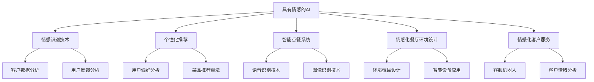

                 

### 《具有情感的AI对餐饮业的影响：情感与味蕾的完美结合》

#### 关键词：
- 情感AI
- 餐饮业
- 个性化推荐
- 智能点餐
- 情感化设计
- 情感化客户服务

#### 摘要：
本文深入探讨了具有情感的AI技术如何变革餐饮业，实现情感与味蕾的完美结合。通过分析情感AI的基本概念、技术基础，以及其在餐饮业的多样化应用场景，本文展示了情感AI在提升餐饮用户体验、优化服务质量等方面的潜力。同时，本文也针对情感AI在餐饮业面临的挑战和未来发展趋势进行了展望，为行业的创新发展提供了有益的参考。

---

## 《具有情感的AI对餐饮业的影响：情感与味蕾的完美结合》目录大纲

### 第一部分：具有情感的AI概述

#### 第1章：具有情感的AI概念与背景
- **1.1 具有情感的AI的定义**
- **1.2 情感AI的发展历程**
- **1.3 情感AI在餐饮业的应用前景**

#### 第2章：情感AI技术基础
- **2.1 人工智能与情感识别技术**
- **2.2 情感计算理论**
- **2.3 情感AI的主要方法与技术**

#### 第3章：情感与味觉心理学
- **3.1 味觉与情感的关系**
- **3.2 餐饮业中的情感体验**
- **3.3 情感心理学的应用**

### 第二部分：情感AI在餐饮业的应用场景

#### 第4章：个性化推荐系统
- **4.1 个性化推荐的原理与算法**
- **4.2 情感分析在个性化推荐中的应用**
- **4.3 餐饮个性化推荐案例分析**

#### 第5章：智能点餐系统
- **5.1 智能点餐系统的设计与实现**
- **5.2 情感识别在智能点餐中的应用**
- **5.3 智能点餐系统的用户体验优化**

#### 第6章：情感化餐厅环境设计
- **6.1 情感化餐厅环境的概念**
- **6.2 情感化环境设计的方法与技巧**
- **6.3 成功案例分享**

#### 第7章：情感化客户服务
- **7.1 情感化客户服务的原则**
- **7.2 情感识别在客户服务中的应用**
- **7.3 情感化客户服务的实践与挑战**

### 第三部分：情感AI在餐饮业的应用挑战与未来展望

#### 第8章：情感AI在餐饮业的挑战
- **8.1 技术挑战**
- **8.2 法律与伦理挑战**
- **8.3 商业模式挑战**

#### 第9章：情感AI在餐饮业的未来发展趋势
- **9.1 预测与趋势分析**
- **9.2 技术创新的方向**
- **9.3 餐饮业的未来发展前景**

### 附录

#### 附录A：情感AI开发工具与资源
- **A.1 开发工具介绍**
- **A.2 资源推荐**

#### 附录B：情感AI项目实战案例
- **B.1 案例介绍**
- **B.2 案例分析**
- **B.3 案例源代码及解读**

### 核心算法原理讲解

#### 个性化推荐算法（Python代码示例）

```python
import numpy as np

def collaborative_filtering(ratings, k=5):
    """
    基于协同过滤的推荐算法
    :param ratings: 用户-物品评分矩阵
    :param k: 邻居数量
    :return: 推荐结果
    """
    # 计算每个用户的邻居向量
    user_neighborhood = {}
    for user in ratings:
        neighbors = {}
        for other_user in ratings:
            if other_user != user:
                similarity = np.dot(ratings[user], ratings[other_user]) / (
                            np.linalg.norm(ratings[user]) * np.linalg.norm(ratings[other_user]))
                neighbors[other_user] = similarity
        user_neighborhood[user] = sorted(neighbors.items(), key=lambda x: x[1], reverse=True)[:k]

    # 计算预测评分
    predicted_ratings = {}
    for user in ratings:
        prediction = np.zeros(len(ratings))
        for neighbor, similarity in user_neighborhood[user]:
            for item in ratings[user]:
                if item in ratings[neighbor]:
                    prediction[item] += similarity * ratings[neighbor][item]
        predicted_ratings[user] = prediction / np.linalg.norm(prediction)

    return predicted_ratings
```

#### Mermaid 流程图（情感AI在餐饮业的核心概念关系）



---

接下来，我们将按照文章的目录大纲，逐步深入探讨每一个章节的内容，结合具体实例和算法原理，为您呈现具有情感的AI技术在餐饮业中的广泛应用与潜在影响。敬请期待！## 第1章：具有情感的AI概念与背景

### 1.1 具有情感的AI的定义

具有情感的AI，顾名思义，是一种能够模拟和识别人类情感的人工智能系统。传统的人工智能主要侧重于机器学习、深度学习等技术，使机器能够执行特定的任务，如图像识别、自然语言处理等。而具有情感的AI则在此基础上，进一步引入了情感计算的概念，使机器不仅能够处理信息，还能理解、感知甚至模拟人类情感。

情感计算（Affective Computing）是由计算机科学家罗斯·阿尔波姆（Rosalind Picard）于1995年首次提出的，指的是计算机能够识别、理解、处理和模拟人类情感的能力。具有情感的AI的核心在于情感识别和情感表达：

- **情感识别**：通过传感器、图像识别、语音识别等技术，从人类的行为、语言、面部表情等中提取情感信息。
- **情感表达**：通过语音、面部表情、姿态等，模拟人类情感，与用户进行自然互动。

### 1.2 情感AI的发展历程

情感AI的发展可以追溯到人工智能和心理学领域的交叉研究。下面是几个关键的发展阶段：

- **1980年代：情感心理学研究的兴起**：心理学家开始关注情感对人类行为和认知的影响，这一研究为情感AI提供了理论基础。
- **1990年代：情感计算概念的提出**：计算机科学家将情感心理学的研究引入到计算机科学领域，推动了情感AI的初步发展。
- **2000年代：情感识别技术的突破**：随着传感器技术和机器学习算法的进步，情感识别技术逐渐成熟，例如，基于面部表情识别和语音识别的情感分析技术得以应用。
- **2010年代至今：情感AI的商业化应用**：情感AI技术逐渐在多个领域得到应用，如教育、医疗、客户服务、娱乐等，餐饮业也是其中的重要应用场景之一。

### 1.3 情感AI在餐饮业的应用前景

情感AI在餐饮业的应用前景广阔，主要体现在以下几个方面：

1. **个性化推荐**：通过分析顾客的情感和偏好，为顾客提供更个性化的菜品和餐饮服务，提升顾客满意度。
2. **智能点餐系统**：结合语音识别和情感识别技术，顾客可以通过自然语言与系统互动，实现更智能的点餐体验。
3. **情感化餐厅环境设计**：通过音乐、照明等环境因素的调节，创造符合顾客情感需求的餐厅氛围，提升顾客的整体体验。
4. **情感化客户服务**：通过情感识别技术，餐厅能够更好地理解顾客的需求和情绪，提供更贴心的服务。

总之，情感AI在餐饮业的应用，不仅能够提升顾客体验，还能够为餐厅运营提供数据支持和优化建议，有望成为餐饮业未来的重要趋势。

### 1.4 情感AI的核心技术与实现方法

情感AI的核心技术主要包括情感识别、情感表达和情感模拟。以下是这些技术的具体内容及其在餐饮业中的应用：

- **情感识别**：通过图像识别、语音识别、传感器等技术，从顾客的行为、语言和面部表情中提取情感信息。例如，餐厅可以部署面部识别系统，实时分析顾客的面部表情，了解他们的情感状态。
  
- **情感表达**：通过语音合成、面部表情控制、姿态调整等技术，使机器人或智能系统能够模拟人类情感，与顾客进行自然互动。例如，餐厅可以使用智能机器人服务员，它们可以通过语音和动作模拟出热情、友好的情感，提升顾客的用餐体验。

- **情感模拟**：通过机器学习算法，使系统可以模拟复杂的情感反应。例如，基于大数据和情感分析，餐厅可以预测顾客的情感变化，从而及时调整菜品推荐、服务策略等，使顾客的情感需求得到满足。

在实际应用中，这些技术可以结合起来，形成一套完整的情感AI系统，为餐饮业带来全新的服务和体验。

### 1.5 情感AI在餐饮业的具体应用场景

情感AI在餐饮业的具体应用场景非常丰富，以下是几个典型的例子：

1. **智能点餐系统**：通过语音识别和情感识别技术，顾客可以通过自然语言与系统互动，点餐过程更加便捷和个性化。例如，顾客可以说“我想要一份辣的”，系统会根据情感识别技术判断顾客的偏好，推荐相应的菜品。

2. **个性化推荐系统**：基于情感分析和偏好分析，系统可以为顾客提供个性化的菜品推荐。例如，如果顾客之前点过辣菜，系统会优先推荐辣菜，而不是清淡菜品。

3. **情感化餐厅环境设计**：通过音乐、照明、香味等环境因素的调节，创造符合顾客情感需求的餐厅氛围。例如，在情人节这样的特殊日子，餐厅可以播放浪漫的音乐，调整灯光，营造温馨的氛围。

4. **情感化客户服务**：通过情感识别技术，餐厅服务员可以更好地理解顾客的情感状态，提供更加贴心的服务。例如，当顾客看起来不满时，服务员可以通过情感识别技术了解原因，并采取相应的措施解决问题。

这些应用不仅提升了顾客的用餐体验，也为餐厅的运营提供了数据支持和优化建议，有望成为餐饮业未来的重要趋势。

### 情感AI的兴起与人工智能技术的融合

情感AI的兴起是人工智能技术不断发展和融合的结果。传统的机器学习、深度学习等技术为情感AI提供了强大的计算能力和数据处理能力，使得情感识别和模拟成为可能。例如，深度学习技术可以训练模型，从大量的数据中提取情感特征，从而实现高精度的情感识别。

同时，自然语言处理技术的发展使得情感AI能够更好地理解和处理人类语言。通过分析顾客的语音和文字，情感AI可以识别顾客的情感状态，并作出相应的反应。

此外，传感器技术的进步也为情感AI的应用提供了重要的支持。例如，摄像头和麦克风等传感器可以实时捕捉顾客的面部表情和语音信息，为情感识别提供数据支持。

总之，情感AI的兴起是多种人工智能技术融合和发展的结果，它不仅丰富了人工智能的应用场景，也为人们的生活带来了更多便利和创新。

### 情感AI在餐饮业的应用案例

情感AI在餐饮业的实际应用案例越来越多，以下是一些具体的案例：

1. **肯德基的智能机器人服务员**：肯德基在中国的一些门店引入了智能机器人服务员，这些机器人能够通过面部识别和语音识别技术，与顾客进行互动，提供点餐、送餐等服务。当顾客走进餐厅时，机器人会通过摄像头识别顾客的身份，并根据顾客的历史订单和偏好推荐菜品。

2. **麦当劳的个性化推荐系统**：麦当劳通过情感分析和大数据技术，为顾客提供个性化的推荐。当顾客在餐厅内时，餐厅的摄像头会捕捉顾客的面部表情，通过情感分析技术判断顾客的情感状态。根据顾客的情感状态，系统会推荐相应的菜品，例如，当顾客看起来开心时，系统会推荐甜点。

3. **餐厅的情感化环境设计**：一些高端餐厅通过音乐、照明、香味等环境因素的调节，创造符合顾客情感需求的餐厅氛围。例如，在情人节期间，餐厅会播放浪漫的音乐，调整灯光和香氛，营造温馨的氛围，提升顾客的用餐体验。

这些案例表明，情感AI技术在餐饮业的应用不仅提升了顾客的用餐体验，也为餐厅的运营和管理提供了新的思路和工具。随着技术的不断发展，情感AI在餐饮业的未来应用将更加广泛和深入。

### 总结与展望

情感AI在餐饮业的应用前景广阔，其核心概念和背景表明，这种技术不仅能够提升顾客的用餐体验，还能够为餐厅的运营提供数据支持和优化建议。通过个性化推荐、智能点餐系统、情感化餐厅环境设计以及情感化客户服务等具体应用场景，情感AI为餐饮业带来了创新和变革。

然而，情感AI在餐饮业的应用还面临着一些挑战，包括技术实现的复杂度、数据隐私保护、法律和伦理问题等。未来，随着技术的不断进步和行业规范的逐步完善，情感AI在餐饮业的应用将更加成熟和普及。

总而言之，情感AI与餐饮业的结合，有望实现情感与味蕾的完美结合，为餐饮业带来全新的发展机遇和无限可能。让我们期待未来，情感AI将在餐饮业发挥更大的作用，创造更多的价值。

---

接下来，我们将深入探讨情感AI技术的基础知识，包括人工智能与情感识别技术、情感计算理论，以及情感AI的主要方法和技术。这将为我们理解情感AI在餐饮业的具体应用提供坚实的理论基础。

### 第2章：情感AI技术基础

#### 2.1 人工智能与情感识别技术

人工智能（AI）是研究、开发用于模拟、延伸和扩展人的智能的理论、方法、技术及应用系统的技术科学。情感识别技术是人工智能的一个重要分支，它旨在使计算机能够理解和模拟人类情感。以下是情感识别技术的基础：

- **面部表情识别**：通过分析人脸图像，识别出不同的情感状态，如开心、悲伤、愤怒等。面部表情识别是情感识别中最常见的技术，广泛应用于社交媒体、视频监控、用户界面等领域。

- **语音识别**：通过分析语音信号的频率、时长、音调等特征，识别出说话者的情感状态。语音识别技术可以识别出说话者的语气、情绪和情感，例如，兴奋、沮丧、愤怒等。

- **生理信号监测**：通过传感器监测人的生理信号，如心率、血压、皮肤电导等，分析这些生理信号的变化，推断出人的情感状态。这种技术常用于医疗和生物反馈领域。

- **行为分析**：通过分析人的行为模式，如姿态、手势、眼神等，推断出人的情感状态。行为分析技术可以用于视频监控和交互式应用中，例如，在虚拟现实（VR）和增强现实（AR）场景中，分析用户的情感状态，以提供更好的用户体验。

#### 2.2 情感计算理论

情感计算（Affective Computing）理论由计算机科学家罗斯·阿尔波姆（Rosalind Picard）提出，旨在研究计算机如何识别、理解和模拟人类情感。情感计算理论的核心包括以下几个方面：

- **情感的复杂性**：情感是心理、生理、社会和环境因素共同作用的结果，具有多层次、多维度的复杂性。

- **情感的识别与表达**：情感计算关注计算机如何从外部信号（如面部表情、语音、生理信号等）中识别情感，并如何通过行为、语音、面部表情等方式表达情感。

- **情感的模型与算法**：情感计算研究如何构建情感模型，并利用机器学习、深度学习等算法，对情感进行识别和预测。

- **情感的交互**：情感计算探讨如何设计人机交互系统，使计算机能够更好地理解人类情感，并作出相应的反应，提高用户体验。

#### 2.3 情感AI的主要方法与技术

情感AI的主要方法和技术多种多样，以下是一些常见的方法和技术：

- **情感分析（Sentiment Analysis）**：通过自然语言处理（NLP）技术，对文本、语音等数据进行情感分析，识别出其中包含的情感信息。情感分析可以用于社交媒体监测、客户反馈分析等场景。

- **机器学习与深度学习**：通过训练模型，从大量数据中学习情感特征，实现对情感的识别和预测。常用的算法包括支持向量机（SVM）、随机森林（RF）、卷积神经网络（CNN）等。

- **情感增强学习**：结合情感状态和机器学习算法，使机器在学习过程中考虑情感因素，提高决策的质量。情感增强学习可以用于游戏AI、虚拟助手等领域。

- **多模态融合**：通过融合多种感知数据（如语音、面部表情、生理信号等），提高情感识别的准确性和可靠性。多模态融合技术可以用于医疗诊断、用户体验优化等场景。

#### 2.4 情感AI在餐饮业的应用潜力

情感AI在餐饮业的应用潜力巨大，以下是一些具体的应用场景：

- **个性化推荐**：通过情感分析，了解顾客的情感状态和偏好，为顾客提供个性化的菜品推荐，提高顾客满意度。

- **智能点餐系统**：结合语音识别和情感识别技术，实现更加自然、便捷的点餐体验。

- **情感化餐厅环境设计**：通过调节音乐、照明、香味等环境因素，创造符合顾客情感需求的餐厅氛围。

- **情感化客户服务**：通过情感识别技术，了解顾客的情感状态，提供更加个性化、贴心的服务。

- **情绪监测与预警**：通过监测顾客的情感状态，及时发现并预警潜在的服务问题，提高运营效率。

总之，情感AI在餐饮业的应用不仅能够提升顾客的用餐体验，还可以为餐厅的运营提供数据支持和优化建议，有望成为餐饮业未来的重要趋势。

---

在理解了情感AI技术的基础之后，我们将进一步探讨情感与味觉心理学之间的关系，以及情感心理学在餐饮业中的应用。这将帮助我们更深入地理解情感AI如何影响和提升餐饮业的服务质量和顾客体验。

### 第3章：情感与味觉心理学

#### 3.1 味觉与情感的关系

味觉与情感之间存在密切的关系，这种关系对餐饮业的体验设计和服务质量有着深远的影响。以下从几个方面探讨味觉与情感之间的关系：

- **情感影响味觉感知**：研究表明，情感状态可以显著影响人们对食物味道的感知。例如，当人们处于愉悦或兴奋状态时，食物的味道往往会更加鲜美；而在焦虑或悲伤时，食物的味道可能会变得平淡或难以接受。

- **味觉影响情感体验**：食物的味道不仅影响味觉体验，还会对情感状态产生作用。例如，甜味能够激发幸福感，而苦味可能会引起紧张或忧虑。

- **文化背景与情感**：不同的文化背景下，人们对食物的情感体验也不同。例如，在中国文化中，吃是一种社交和情感表达的方式，而在西方文化中，餐饮更多被视为一种个人享受。

#### 3.2 餐饮业中的情感体验

餐饮业中的情感体验是顾客满意度和忠诚度的重要因素。以下从几个方面探讨餐饮业中的情感体验：

- **感官体验**：餐饮业通过视觉、听觉、嗅觉、味觉和触觉等多种感官刺激，创造丰富的情感体验。例如，餐厅的装修风格、音乐选择、餐具设计等，都能对顾客的情感产生深远影响。

- **情感共鸣**：餐饮业通过故事讲述、文化元素融入等方式，与顾客建立情感共鸣。例如，一些餐厅通过提供本地特色菜肴和故事，使顾客在用餐过程中产生共鸣，增强顾客的情感体验。

- **情感满足**：餐饮业通过满足顾客的情感需求，提升顾客的满意度。例如，提供个性化的服务、关注顾客的情感状态等，都能使顾客感受到被重视和关爱，从而增强情感满足感。

#### 3.3 情感心理学的应用

情感心理学在餐饮业中的应用，可以帮助餐厅更好地理解和满足顾客的情感需求，从而提升顾客体验和服务质量。以下从几个方面探讨情感心理学的应用：

- **情感识别**：通过情感识别技术，餐厅可以实时了解顾客的情感状态。例如，通过面部表情识别技术，餐厅可以了解顾客是否满意或需要帮助，从而及时调整服务策略。

- **情感分析**：通过情感分析技术，餐厅可以对顾客的反馈和评价进行情感分析，了解顾客的情感偏好和需求。例如，餐厅可以通过分析顾客的点评和社交媒体评论，了解顾客对菜品、服务和氛围的情感反应，从而进行改进。

- **情感化服务设计**：基于情感心理学的研究，餐厅可以进行情感化服务设计。例如，通过了解顾客的情感需求，餐厅可以设计出符合顾客情感体验的服务流程、菜品搭配和氛围营造。

- **员工培训**：情感心理学还可以用于员工培训，提升员工的服务意识和情感认知能力。例如，通过培训员工如何识别和应对顾客的情感状态，员工可以提供更加个性化和贴心的服务，提升顾客满意度。

总之，情感与味觉心理学在餐饮业中的应用，不仅能够提升顾客的用餐体验，还可以为餐厅的运营提供数据支持和优化建议，有助于实现情感与味蕾的完美结合。

### 情感心理学在餐饮服务中的具体应用

情感心理学在餐饮服务中的应用，旨在通过理解顾客的情感状态和需求，提供更加个性化和贴心的服务。以下是情感心理学在餐饮服务中的几个具体应用：

1. **情感识别技术**：餐厅可以部署情感识别技术，如面部表情识别和语音识别，实时了解顾客的情感状态。当顾客的面部表情显示不满或焦虑时，服务员可以及时关注并提供帮助，例如，询问顾客是否需要更换菜品或调整服务。通过情感识别技术，餐厅可以更有效地预防和解决潜在的服务问题。

2. **个性化服务**：通过情感分析技术，餐厅可以了解顾客的情感偏好和需求。例如，通过分析顾客的点评和社交媒体评论，餐厅可以发现顾客喜欢哪些菜品、哪些服务风格，从而在后续服务中提供更加个性化的体验。例如，如果顾客喜欢氛围温馨的餐厅，餐厅可以在他们再次光临时，播放顾客喜欢的音乐，调整灯光，创造一个舒适的用餐环境。

3. **情感化菜单设计**：餐厅可以根据情感心理学的原理，设计情感化的菜单。例如，在菜单上添加情感化描述，如“温馨的奶油芝士蛋糕”或“激情四溢的红酒牛排”，以激发顾客的情感共鸣。此外，餐厅还可以根据顾客的情感状态，推荐相应的菜品。例如，当顾客看起来疲惫时，餐厅可以推荐一些提神的饮品或清爽的沙拉。

4. **员工培训**：情感心理学还可以用于员工培训，提升员工的服务意识和情感认知能力。例如，通过情感心理学课程，员工可以学习如何识别和应对顾客的情感状态，提供更加个性化和贴心的服务。例如，当顾客感到不满时，员工可以学习使用非言语沟通技巧，如微笑、点头等，缓解顾客的情绪。

总之，情感心理学在餐饮服务中的应用，可以帮助餐厅更好地理解和满足顾客的情感需求，从而提升顾客满意度和服务质量。通过情感识别、个性化服务、情感化菜单设计和员工培训等多方面的应用，餐厅可以实现情感与味蕾的完美结合，创造独特的用餐体验。

### 情感心理学在餐饮管理中的应用

情感心理学在餐饮管理中的应用同样重要，它不仅能够提升顾客体验，还能够为餐饮企业的运营提供有效的管理策略。以下从几个方面探讨情感心理学在餐饮管理中的应用：

1. **员工情感管理**：餐饮业的服务质量在很大程度上取决于员工的情绪状态。情感心理学可以帮助管理者了解员工的情感状态，提供相应的支持，如员工辅导、情感管理培训等。例如，通过情感问卷调查，管理者可以了解员工的压力水平和情感状态，及时采取措施减轻员工的工作压力，提高员工的工作满意度和忠诚度。

2. **顾客情感体验管理**：餐饮企业可以通过情感心理学的方法，优化顾客的情感体验。例如，通过分析顾客的反馈和评价，管理者可以识别出顾客在情感体验中的痛点，从而采取针对性的改进措施。例如，如果顾客普遍反映用餐时间过长，管理者可以优化点餐流程，提高服务效率，提升顾客的用餐体验。

3. **餐厅氛围设计**：情感心理学可以帮助管理者设计符合顾客情感需求的餐厅氛围。通过了解不同情感状态下的顾客偏好，管理者可以调整音乐、照明、装饰等环境因素，创造出温馨、浪漫或活力四射的用餐氛围。例如，在情人节等特殊日子里，餐厅可以播放浪漫的音乐，调整柔和的灯光，营造温馨的氛围，提升顾客的情感体验。

4. **服务策略调整**：情感心理学还可以用于服务策略的调整。通过分析顾客的情感数据，管理者可以了解不同顾客群体的情感需求和偏好，从而制定更具针对性的服务策略。例如，针对年轻顾客，餐厅可以提供更加时尚、个性化的菜品和服务，吸引年轻消费者的关注。

总之，情感心理学在餐饮管理中的应用，有助于提升员工的情感状态，优化顾客的用餐体验，为餐饮企业的运营提供数据支持和优化建议。通过情感管理、氛围设计和服务策略调整等多方面的应用，餐饮企业可以实现更高效、更人性化的运营管理。

### 情感心理学在餐饮营销中的应用

情感心理学在餐饮营销中的应用同样具有重要意义，它可以帮助餐饮企业通过情感共鸣和情感营销策略，提升品牌影响力和顾客忠诚度。以下从几个方面探讨情感心理学在餐饮营销中的应用：

1. **情感化广告策略**：通过情感心理学原理，餐饮企业可以设计更具吸引力的广告。例如，在广告中融入温馨的家庭场景、浪漫的约会场景等，激发顾客的情感共鸣，从而提高广告的转化率。例如，一个广告展示了一对情侣在餐厅享受美好时光，音乐温馨动人，画面浪漫温馨，这样的广告能够有效吸引目标顾客群体。

2. **情感化社交媒体营销**：餐饮企业可以利用社交媒体平台，通过情感化的内容营销，与顾客建立情感联系。例如，发布顾客的用餐故事、美食制作过程、餐厅活动等，分享顾客的美好回忆和情感体验，增强顾客的参与感和归属感。例如，一些餐厅在社交媒体上分享顾客的用餐照片和感想，这些真实的故事和情感分享能够吸引更多潜在顾客的关注和兴趣。

3. **情感化品牌传播**：通过情感心理学，餐饮企业可以塑造具有情感吸引力的品牌形象。例如，通过讲述品牌故事、传递品牌价值观，使顾客在情感上与品牌产生共鸣。例如，一些餐厅通过讲述创始人背后的感人故事，传递品牌对于家庭和爱的重视，使顾客在情感上对品牌产生深厚的认同和情感连接。

4. **情感化会员管理**：通过情感心理学，餐饮企业可以优化会员管理策略，提升会员忠诚度。例如，通过个性化的会员服务和情感化的互动，使会员感受到品牌的关心和重视。例如，一些餐厅为会员提供定期的生日惊喜、节日祝福等，通过这些情感化的互动，增强会员的归属感和忠诚度。

总之，情感心理学在餐饮营销中的应用，可以帮助餐饮企业通过情感共鸣和情感营销策略，提升品牌影响力和顾客忠诚度，从而实现更有效的市场推广和业务增长。

### 总结与展望

情感心理学在餐饮业中的应用，不仅有助于提升顾客的用餐体验和服务质量，还可以为餐饮企业的管理和营销提供有效的策略支持。通过情感识别、个性化服务、情感化菜单设计、员工培训以及情感化广告策略等多种应用，餐饮企业可以更好地理解顾客的情感需求，提供个性化的服务和产品，从而实现情感与味蕾的完美结合。

然而，情感心理学在餐饮业的应用仍面临一些挑战，如情感识别技术的准确性、数据隐私保护、跨文化情感差异等。未来，随着情感计算技术的不断进步和行业规范的完善，情感心理学在餐饮业的应用将更加广泛和深入，为餐饮业带来更多创新和发展机遇。

---

在了解了情感AI技术基础和情感心理学在餐饮业中的应用后，我们将进入第二部分，探讨情感AI在餐饮业的具体应用场景。这些应用场景包括个性化推荐系统、智能点餐系统、情感化餐厅环境设计和情感化客户服务。通过这些实例，我们将看到情感AI如何改变餐饮业的运营和服务模式。

### 第4章：个性化推荐系统

#### 4.1 个性化推荐的原理与算法

个性化推荐系统（Personalized Recommendation System）是情感AI在餐饮业中的一个重要应用，通过分析顾客的偏好和历史行为，为顾客提供个性化的菜品推荐。个性化推荐的原理和算法可以分为以下几种：

- **协同过滤（Collaborative Filtering）**：协同过滤是推荐系统中最常用的方法之一，主要分为基于用户的协同过滤（User-Based Collaborative Filtering）和基于物品的协同过滤（Item-Based Collaborative Filtering）。

  - **基于用户的协同过滤**：该方法通过分析用户之间的相似度，找到与目标用户相似的其他用户，并推荐这些用户喜欢的物品。其核心是计算用户之间的相似度，常用的相似度计算方法包括余弦相似度、皮尔逊相关系数等。
  
  - **基于物品的协同过滤**：该方法通过分析物品之间的相似度，找到与目标物品相似的其他物品，并推荐这些物品。物品相似度计算通常基于物品的属性、标签或用户评分。

- **内容推荐（Content-Based Filtering）**：内容推荐方法基于物品的属性和特征，为用户推荐与其过去喜欢的物品相似的物品。这种方法的核心是计算物品之间的相似度，并利用这些相似度为用户推荐新物品。

- **混合推荐（Hybrid Recommender System）**：混合推荐方法结合了协同过滤和内容推荐两种方法的优点，通过融合用户行为和物品属性，提高推荐系统的准确性和覆盖率。

- **基于模型的推荐（Model-Based Recommender System）**：基于模型的推荐方法通过建立预测模型，预测用户对未评分物品的评分，从而推荐给用户。常用的模型包括矩阵分解（Matrix Factorization）、神经网络（Neural Networks）等。

#### 4.2 情感分析在个性化推荐中的应用

情感分析（Sentiment Analysis）是情感AI技术的一个重要组成部分，它通过分析文本、语音等信息，识别出其中包含的情感倾向。在个性化推荐系统中，情感分析可以用于以下几个方面：

- **情感倾向分析**：通过情感分析，识别顾客对菜品、餐厅、服务等的情感倾向，如正面、负面或中性。这种分析可以帮助推荐系统更好地理解顾客的情感状态和需求，从而提供更个性化的推荐。

- **情感特征提取**：通过情感分析，提取顾客情感特征，如愉悦、愤怒、厌烦等，这些特征可以用于丰富推荐模型，提高推荐的准确性。例如，如果顾客在评论中表达了对某个菜品的强烈不满，推荐系统可以将这一情感特征纳入考虑，避免再次推荐该菜品。

- **情感驱动的推荐**：基于情感分析的结果，推荐系统可以提供情感驱动的推荐。例如，当顾客表达出对某个菜品的强烈喜爱时，系统可以推荐类似的菜品，以增强顾客的愉悦感；当顾客表达出不满时，系统可以推荐缓解情绪的菜品，如甜品或饮品。

- **情感化评论生成**：情感分析还可以用于生成情感化的推荐评论，例如，“这个菜品让你感到愉悦吗？我们为你推荐了类似的菜品，希望你会喜欢。”这种评论不仅提供了个性化推荐，还增强了顾客的情感体验。

#### 4.3 餐饮个性化推荐案例分析

为了更好地理解情感分析在个性化推荐系统中的应用，我们可以通过一个实际的餐饮推荐案例进行分析。

**案例：某餐厅的个性化推荐系统**

假设我们有一个餐厅的个性化推荐系统，该系统已经收集了大量的用户数据和菜品评价。以下是一个基于情感分析和协同过滤的个性化推荐系统的实现过程：

1. **数据收集与预处理**：
   - **用户行为数据**：包括用户的点餐记录、浏览记录等。
   - **菜品评价数据**：包括用户对菜品的评分和评论。
   - **情感分析数据**：对用户评论进行情感分析，提取情感特征。

2. **情感特征提取**：
   - 使用自然语言处理（NLP）技术，对用户评论进行情感分析，提取情感特征。例如，使用情感分析库（如TextBlob、VADER）识别情感极性（正面、负面）和情感强度。

3. **用户相似度计算**：
   - 使用基于用户的协同过滤方法，计算用户之间的相似度。具体步骤如下：
     - 计算用户之间的共同点，例如共同喜欢的菜品。
     - 计算用户之间的相似度，使用余弦相似度或皮尔逊相关系数。
   
4. **推荐算法**：
   - 结合情感分析和协同过滤，生成个性化推荐列表。具体步骤如下：
     - 对每个用户，找到与其最相似的用户群体。
     - 根据用户群体的偏好和情感特征，推荐相应的菜品。
     - 考虑用户的情感特征，例如，如果用户最近评论了一个菜品表示愉悦，则推荐类似的愉悦感菜品。

5. **推荐结果展示**：
   - 将个性化推荐结果展示给用户，包括推荐菜品的名称、评分、评论等。

通过这个案例，我们可以看到情感分析在个性化推荐系统中的重要作用。情感分析不仅帮助推荐系统更好地理解用户情感，提高了推荐的准确性和个性化程度，还增强了用户的情感体验。

### 案例分析：某高端餐厅的个性化推荐系统

为了更好地展示情感AI在餐饮个性化推荐系统中的应用，我们来看一个实际案例：某高端餐厅如何利用情感分析和协同过滤技术，为顾客提供个性化的菜品推荐。

**背景**：

某高端餐厅拥有大量的顾客数据，包括用户的点餐记录、浏览记录以及菜品评价。餐厅希望通过个性化推荐系统，为顾客提供更加个性化的菜品推荐，提高顾客满意度和复购率。

**解决方案**：

1. **数据收集与预处理**：
   - **用户行为数据**：餐厅收集了用户的历史点餐记录和浏览记录，包括用户喜欢和频繁点选的菜品。
   - **菜品评价数据**：餐厅收集了用户对菜品的评分和文本评论。
   - **情感分析数据**：餐厅对用户评论进行情感分析，提取情感特征，如正面情感（愉悦、喜爱）、负面情感（不满、厌烦）。

2. **情感特征提取**：
   - 使用自然语言处理（NLP）技术，对用户评论进行情感分析，使用情感分析库（如TextBlob、VADER）识别情感极性（正面、负面）和情感强度。
   - 提取情感特征，并将其与用户行为数据和菜品评价数据相结合。

3. **用户相似度计算**：
   - 使用基于用户的协同过滤方法，计算用户之间的相似度。具体步骤如下：
     - 计算用户之间的共同点，例如共同喜欢的菜品。
     - 计算用户之间的相似度，使用余弦相似度或皮尔逊相关系数。

4. **推荐算法**：
   - 结合情感分析和协同过滤，生成个性化推荐列表。具体步骤如下：
     - 对每个用户，找到与其最相似的用户群体。
     - 根据用户群体的偏好和情感特征，推荐相应的菜品。
     - 考虑用户的情感特征，例如，如果用户最近评论了一个菜品表示愉悦，则推荐类似的愉悦感菜品。

5. **推荐结果展示**：
   - 将个性化推荐结果展示给用户，包括推荐菜品的名称、评分、评论等。

**效果分析**：

通过这个个性化推荐系统，餐厅实现了以下效果：

- **提高顾客满意度**：个性化推荐系统根据用户的情感偏好和点餐历史，为用户推荐符合他们口味的菜品，提高了顾客的用餐体验和满意度。
- **增加复购率**：推荐系统能够更准确地预测用户的需求，提高了推荐的准确性，增加了顾客的复购率。
- **提升餐厅知名度**：通过个性化推荐和情感化的评论生成，餐厅在社交媒体上获得了更多的好评和转发，提升了餐厅的知名度和品牌形象。

**总结**：

这个案例展示了情感AI在餐饮个性化推荐系统中的实际应用。通过情感分析和协同过滤技术，餐厅能够为顾客提供更加个性化、贴心的推荐服务，提高了顾客满意度和复购率，同时也提升了餐厅的品牌形象和竞争力。

---

个性化推荐系统在餐饮业的应用不仅限于提升顾客满意度和复购率，它还能够通过情感分析为餐饮企业提供宝贵的数据洞察，从而优化菜单设计、提高运营效率。以下将详细探讨个性化推荐系统在餐饮业中的实际效果和带来的价值。

### 个性化推荐系统的实际效果与价值

1. **提升顾客满意度**：

   个性化推荐系统通过分析顾客的历史行为和情感偏好，能够准确地为每位顾客推荐他们可能喜欢的菜品。这种个性化的服务不仅让顾客感到被重视，还能提高他们的用餐体验。例如，一位喜欢辛辣食物的顾客，系统会推荐辣味的特色菜品，而喜欢清淡食物的顾客则会收到清淡口味的推荐。这种精准的推荐能够满足不同顾客的口味需求，从而提升整体满意度。

2. **增加复购率**：

   个性化推荐系统通过不断学习和调整推荐策略，能够持续为顾客提供高质量的推荐，从而提高顾客的复购率。例如，如果一个顾客在一次用餐中收到了满意的推荐，那么他们在下次用餐时更有可能再次选择这家餐厅。通过保持顾客的持续关注和兴趣，个性化推荐系统有助于建立长期的顾客关系，提高复购率。

3. **优化菜单设计**：

   个性化推荐系统通过分析顾客的喜好和反馈，为餐厅提供了宝贵的市场洞察。餐厅可以根据这些数据调整菜单，引入更多受欢迎的菜品，淘汰不受欢迎的菜品。例如，如果系统发现某个菜品在一段时间内被多次推荐且评分较高，餐厅可以增加该菜品的供应量，甚至考虑将其作为主打菜品。这种基于数据的菜单调整，能够更好地满足顾客需求，提高餐厅的竞争力。

4. **提高运营效率**：

   个性化推荐系统不仅帮助餐厅更好地理解顾客需求，还能够优化运营流程。例如，通过分析顾客的点餐习惯，餐厅可以合理安排菜品库存和烹饪时间，减少浪费，提高厨房的运营效率。此外，个性化推荐系统还可以用于优化员工排班，确保在高峰时段有足够的员工提供服务，提高整体运营效率。

5. **提升品牌形象**：

   个性化推荐系统通过提供高质量的服务和精准的推荐，能够提升顾客对餐厅的认可和信任。当顾客在社交媒体上分享他们的用餐体验时，精准的推荐和满意的用餐体验会为餐厅带来正面的口碑传播，从而提升品牌形象和知名度。

### 个性化推荐系统对餐饮业运营的启示

1. **数据驱动决策**：

   个性化推荐系统通过收集和分析大量顾客数据，为餐厅提供了宝贵的信息资源。餐厅应充分利用这些数据，进行数据驱动决策，优化运营策略。例如，通过分析顾客的偏好和行为，餐厅可以更好地预测市场需求，调整菜品供应和库存管理。

2. **持续优化与学习**：

   个性化推荐系统需要不断学习和优化，以保持推荐的准确性和个性化程度。餐厅应定期更新数据集，调整推荐算法，确保系统能够持续适应市场变化和顾客需求。

3. **个性化体验的重要性**：

   在竞争激烈的餐饮市场中，个性化体验是提升顾客满意度和忠诚度的关键。餐厅应充分利用个性化推荐系统，为顾客提供个性化的服务和产品，增强顾客的用餐体验。

4. **跨部门协作**：

   个性化推荐系统的成功实施需要跨部门的协作。餐厅的营销、运营、产品开发等部门应密切合作，共同优化推荐策略，确保系统能够最大化地发挥其价值。

### 结论

个性化推荐系统在餐饮业中的应用，不仅提升了顾客满意度和复购率，还为餐厅的运营提供了数据支持和优化建议。通过数据驱动决策、持续优化与学习、个性化体验的重视以及跨部门协作，个性化推荐系统为餐饮业带来了创新和变革。未来，随着技术的不断进步，个性化推荐系统将在餐饮业发挥更大的作用，助力餐饮企业实现可持续发展。

---

通过个性化推荐系统的分析，我们可以看到情感AI在餐饮业中的强大潜力和实际应用。接下来，我们将探讨智能点餐系统的设计与实现，以及情感识别技术在其中的应用，进一步展示情感AI在餐饮业中的广泛应用。

### 第5章：智能点餐系统

#### 5.1 智能点餐系统的设计与实现

智能点餐系统是餐饮业中的一项重要创新，它通过整合人工智能技术，提供便捷、高效的点餐体验。智能点餐系统的设计与实现涉及多个方面，包括用户界面设计、后端数据处理和推荐算法等。以下是智能点餐系统的设计与实现过程：

1. **用户界面设计**：

   用户界面（UI）是智能点餐系统的入口，直接影响到用户的点餐体验。一个优秀的用户界面应该简洁、直观、易于操作。设计过程主要包括以下几个方面：

   - **布局设计**：合理安排菜单、推荐菜品、购物车等元素，确保用户能够快速找到所需信息。
   - **交互设计**：提供多种交互方式，如触摸屏、语音识别等，满足不同用户的需求。
   - **视觉设计**：运用视觉元素，如颜色、图标等，提升界面的美观性和易用性。

2. **后端数据处理**：

   后端数据处理是智能点餐系统的核心，它负责接收用户请求，处理数据，并返回结果。后端数据处理主要包括以下几个环节：

   - **数据收集**：收集用户行为数据，如浏览记录、点餐记录、评价等。
   - **数据存储**：使用数据库存储用户数据和菜品信息，确保数据的完整性和安全性。
   - **数据处理**：对用户数据进行清洗、转换和分析，提取有用的信息，如用户偏好、情感状态等。

3. **推荐算法**：

   推荐算法是智能点餐系统的关键，它负责根据用户数据，为用户推荐合适的菜品。推荐算法可以分为以下几种：

   - **协同过滤**：通过分析用户之间的相似度，为用户推荐其他用户喜欢的菜品。
   - **内容推荐**：通过分析菜品的属性和特征，为用户推荐相似或相关的菜品。
   - **混合推荐**：结合协同过滤和内容推荐，提供更准确的推荐结果。

4. **系统集成**：

   将前端用户界面和后端数据处理系统集成，形成一个完整的智能点餐系统。系统集成过程主要包括以下几个步骤：

   - **接口设计**：设计用户界面和后端系统之间的接口，确保数据流畅传输。
   - **接口实现**：实现接口功能，如用户登录、菜品推荐、订单处理等。
   - **系统测试**：对系统进行功能测试、性能测试和安全测试，确保系统的稳定性和安全性。

#### 5.2 情感识别在智能点餐系统中的应用

情感识别技术是智能点餐系统的关键组成部分，它通过分析用户的情感状态，提供更加个性化的点餐体验。以下是情感识别在智能点餐系统中的应用：

1. **情感分析**：

   情感分析（Sentiment Analysis）是通过自然语言处理（NLP）技术，从用户的文本评论、语音交互中提取情感信息。情感分析可以帮助系统了解用户的情感状态，如愉悦、愤怒、焦虑等。具体应用包括：

   - **评论分析**：分析用户对菜品、餐厅、服务的评价，提取情感倾向，为后续推荐提供依据。
   - **语音识别**：识别用户语音中的情感信息，如语气、语调等，为智能点餐系统提供实时情感反馈。

2. **情感驱动推荐**：

   基于情感分析的结果，智能点餐系统可以提供情感驱动的推荐。具体应用包括：

   - **情感状态识别**：系统通过情感分析，识别用户的当前情感状态，如开心、焦虑等。
   - **情感化推荐**：根据用户情感状态，推荐适合的菜品或饮品，如缓解焦虑的甜品、提神的咖啡等。

3. **情感交互**：

   情感交互是通过情感表达技术，使智能点餐系统能够模拟人类情感，与用户进行自然互动。具体应用包括：

   - **情感化界面**：系统通过表情、语音等情感表达，与用户建立情感连接，提升用户体验。
   - **情感反馈**：系统根据用户反馈，调整推荐策略，提供更个性化的服务。

#### 5.3 情感化用户体验优化

情感化用户体验优化是智能点餐系统设计的重要一环，它通过情感识别和情感交互技术，提升用户的点餐体验。以下是情感化用户体验优化的几个方面：

1. **个性化推荐**：

   通过情感识别技术，系统可以了解用户的情感偏好和需求，提供个性化的推荐。例如，当用户感到疲惫时，系统可以推荐一些提神的饮品；当用户感到焦虑时，系统可以推荐一些缓解情绪的菜品。

2. **情感反馈**：

   系统可以通过情感反馈技术，了解用户的情感状态，及时调整服务策略。例如，当用户表达不满时，系统可以提供相应的解决方案，如更换菜品、调整服务时间等。

3. **情感化界面**：

   系统可以通过情感化界面设计，提升用户的情感体验。例如，使用温馨的界面设计、符合用户情感的配色方案，以及与用户情感状态匹配的语音和表情等。

4. **情感化互动**：

   系统可以通过情感化互动，与用户建立情感连接，提升用户满意度。例如，系统可以模拟人类的情感反应，与用户进行情感交流，提供更加人性化的服务。

总之，智能点餐系统通过情感识别和情感交互技术，实现了个性化推荐、情感反馈、情感化界面和情感化互动，从而提升了用户的点餐体验。未来，随着技术的不断发展，智能点餐系统将在餐饮业发挥更大的作用，为用户提供更加优质、贴心的服务。

### 情感识别技术实现智能点餐系统用户体验优化的具体方法

情感识别技术在智能点餐系统中发挥着至关重要的作用，它通过分析用户的行为、语言和面部表情等，为用户提供更加个性化、贴心的点餐体验。以下是情感识别技术实现智能点餐系统用户体验优化的几种具体方法：

1. **语音情感识别**：

   语音情感识别技术能够通过分析用户的语音，识别出其情感状态，如愉悦、愤怒、焦虑等。在智能点餐系统中，用户可以通过语音与系统进行交互，系统可以根据语音的情感分析结果，调整推荐策略。例如，当用户的声音表现出疲惫或焦虑时，系统可以推荐一些提神或舒缓情绪的饮品和菜品。此外，语音情感识别还可以用于识别用户的语气和语调，提供更自然、流畅的交互体验。

2. **面部表情识别**：

   面部表情识别技术通过分析用户的面部图像，识别出用户的面部表情，如开心、悲伤、愤怒等。在智能点餐系统中，当用户在屏幕前进行点餐时，系统可以通过摄像头捕捉用户的面部表情，实时了解用户的情感状态。例如，当用户看起来不开心或疑惑时，系统可以主动询问用户是否需要帮助，或者推荐一些能够提升情绪的菜品。面部表情识别还可以用于分析用户的满意度，为餐厅提供改进服务的反馈。

3. **行为分析**：

   行为分析技术通过监测用户的行为，如点击、滑动、停留时间等，了解用户的兴趣和需求。在智能点餐系统中，用户的行为数据可以用于个性化推荐和用户体验优化。例如，当用户在菜单上停留时间较长，但未进行点餐操作时，系统可以推测用户可能对此菜品感兴趣，但不确定是否下单，此时系统可以提供更多的菜品信息或推荐类似菜品，帮助用户做出决策。

4. **文本情感分析**：

   文本情感分析技术通过对用户的评论、反馈等文本数据进行分析，识别出其中包含的情感倾向。在智能点餐系统中，用户可以在点餐后对菜品和服务进行评价，系统可以通过文本情感分析技术，了解用户的满意度和具体反馈。例如，如果用户在评论中表达了负面情绪，系统可以记录并分析反馈内容，为餐厅提供改进服务的依据。

5. **环境感知**：

   情感识别技术还可以结合环境感知技术，如环境声音识别、光线感知等，为用户提供更加沉浸式的点餐体验。例如，当餐厅播放轻柔的音乐时，系统可以根据环境声音识别结果，调整推荐的菜品类型，如推荐一些清爽的饮品和轻食。此外，通过光线感知技术，系统可以自动调整屏幕亮度，以适应不同环境下的视觉体验。

通过上述情感识别技术的应用，智能点餐系统可以实时了解用户的情感状态和需求，提供个性化、人性化的推荐和服务，从而优化用户的点餐体验。未来，随着情感识别技术的不断进步，智能点餐系统将在餐饮业发挥更大的作用，为用户提供更加优质、贴心的服务。

### 案例分析：某餐厅的智能点餐系统

为了更好地展示情感识别技术在智能点餐系统中的应用，我们来看一个实际案例：某餐厅如何利用情感识别技术，提升用户的点餐体验。

**背景**：

某餐厅是一家位于市中心的高端餐厅，为了提升用户体验，餐厅引入了智能点餐系统。该系统集成了语音识别、面部表情识别和行为分析等技术，通过情感识别技术为用户提供个性化、人性化的点餐服务。

**解决方案**：

1. **语音识别与情感分析**：
   - **点餐交互**：用户可以通过语音与系统进行交互，例如说“我想要一份牛排”或“推荐一款甜点”。系统会识别用户的语音命令，并在显示屏上显示对应的菜单选项。
   - **情感分析**：系统会分析用户的语音情感，如语气、语调等。当用户的声音表现出焦虑或疲惫时，系统会主动询问用户是否需要帮助，或推荐一些舒缓情绪的饮品和菜品。

2. **面部表情识别与用户行为分析**：
   - **情感状态捕捉**：系统通过摄像头捕捉用户的面部表情，识别用户的情感状态，如开心、愤怒、疑惑等。当用户看起来不开心或疑惑时，系统会提供额外的信息或建议，帮助用户做出更好的选择。
   - **行为分析**：系统会分析用户在菜单上的行为，如点击、滑动、停留时间等。当用户在某个菜品上停留时间较长但未进行点餐操作时，系统会推测用户可能对此菜品感兴趣，但不确定是否下单，此时系统可以提供更多的菜品信息或推荐类似菜品。

3. **个性化推荐**：
   - **基于情感的分析结果**：系统会根据用户的情感状态和偏好，为用户提供个性化的推荐。例如，当用户看起来疲惫时，系统会推荐一些提神的饮品或轻食；当用户看起来开心时，系统会推荐一些甜品或浪漫的菜品。
   - **基于历史数据的分析**：系统会分析用户的点餐历史和偏好，为用户提供更符合其口味的推荐。例如，如果用户经常选择辣味菜品，系统会优先推荐辣味菜品。

4. **情感反馈**：
   - **用户评价**：用户可以在点餐后对菜品和服务进行评价，系统会通过文本情感分析技术，了解用户的满意度和具体反馈。
   - **系统调整**：根据用户的评价和反馈，系统会不断调整推荐策略，优化用户体验。

**效果分析**：

通过情感识别技术，该餐厅实现了以下效果：

- **提高用户体验**：个性化推荐和情感反馈功能，使用户在点餐过程中感受到被重视和关爱，提升了整体用户体验。
- **增加用户满意度**：系统根据用户的情感状态和偏好，提供个性化的推荐和服务，使用户感到满意，从而提高了用户满意度。
- **提升运营效率**：智能点餐系统减少了人工点餐的误差和等待时间，提高了餐厅的运营效率。
- **改善餐厅氛围**：通过情感识别技术，餐厅可以更好地了解用户的情感需求，提供符合用户情感状态的服务，从而改善了餐厅的整体氛围。

**总结**：

该案例展示了情感识别技术在智能点餐系统中的应用，通过语音识别、面部表情识别和行为分析等技术，餐厅能够为用户提供个性化、人性化的点餐服务，提升了用户体验和满意度。未来，随着情感识别技术的不断发展，智能点餐系统将在餐饮业发挥更大的作用，为用户提供更加优质、贴心的服务。

---

智能点餐系统通过情感识别技术的应用，不仅提升了用户的点餐体验，还优化了餐厅的运营效率。接下来，我们将探讨情感化餐厅环境设计，通过音乐、照明、香味等环境因素的调节，创造符合顾客情感需求的餐厅氛围，进一步提升顾客的用餐体验。

### 第6章：情感化餐厅环境设计

#### 6.1 情感化餐厅环境的概念

情感化餐厅环境设计是指通过设计、布局、装饰等手段，调节餐厅的音乐、照明、香味等环境因素，创造符合顾客情感需求的用餐氛围，从而提升顾客的用餐体验。这种设计理念强调环境对人的情感和心理状态的影响，通过环境因素的情感化处理，使顾客在餐厅中感受到愉悦、放松或兴奋等情感体验。

#### 6.2 情感化环境设计的方法与技巧

1. **音乐设计**：

   音乐是情感化环境设计中最常用的手段之一。合适的音乐可以调节顾客的情感状态，营造特定的氛围。以下是音乐设计的一些方法和技巧：

   - **根据餐厅主题选择音乐**：如餐厅以温馨、浪漫为主题，可以选择轻柔的钢琴曲或弦乐；以活力、动感为主题，可以选择流行音乐或电子舞曲。
   - **音量控制**：音量过大或过小都会影响顾客的用餐体验。通常，餐厅背景音乐的音量应控制在30-40分贝，确保顾客能够清晰地交流，同时感受到音乐的氛围。
   - **音乐变化**：根据不同时间段和顾客的情感状态，适当调整音乐。例如，在午餐时间播放轻松愉快的音乐，在晚餐时间播放浪漫的音乐。

2. **照明设计**：

   照明设计对餐厅氛围的营造起着至关重要的作用。不同的照明方式和光线色彩可以营造出不同的情感氛围。以下是照明设计的一些方法和技巧：

   - **灯光色彩**：暖色调的灯光（如黄色、橙色）可以营造出温馨、舒适的氛围；冷色调的灯光（如蓝色、白色）可以营造出清新、高雅的氛围。
   - **照明层次**：通过设置不同的照明层次，可以创造出丰富的空间感。例如，使用吊灯、壁灯和落地灯，创造出不同层次的照明效果。
   - **氛围灯光**：在特定的时间段或活动中，可以使用氛围灯光来营造特定的情感氛围。例如，在情人节期间，使用红色的灯光，营造出浪漫的氛围。

3. **香味设计**：

   香味设计通过调节餐厅的气味，影响顾客的嗅觉体验，从而影响他们的情感状态。以下是香味设计的一些方法和技巧：

   - **选择合适的香味**：不同的香味可以营造出不同的情感氛围。例如，清新的花香可以营造出轻松愉悦的氛围，香草或巧克力香味可以营造出温馨浪漫的氛围。
   - **控制香味强度**：香味过强或过弱都会影响顾客的用餐体验。通常，餐厅的香味浓度应控制在5-10%，确保顾客能够感受到香味，但不会感到过于刺鼻。
   - **持续更新香味**：根据不同时间段和顾客的需求，适当更新香味。例如，在午餐时间使用清新自然的香味，在晚餐时间使用浪漫温馨的香味。

#### 6.3 成功案例分享

以下是几个成功应用情感化环境设计的餐厅案例：

1. **案例1：浪漫的西餐厅**：

   这家西餐厅以浪漫、温馨为主题，采用了以下情感化环境设计：

   - **音乐设计**：餐厅播放柔和的钢琴曲和轻柔的弦乐，营造出浪漫的氛围。
   - **照明设计**：餐厅使用了暖色调的灯光，并在餐桌下方安装了小灯，营造出温馨的氛围。
   - **香味设计**：餐厅使用了香草和巧克力的香味，营造出温馨浪漫的氛围。

   通过这些设计，餐厅成功吸引了情侣和浪漫爱好者，提升了用餐体验和回头客率。

2. **案例2：活力四射的咖啡馆**：

   这家咖啡馆以活力、动感为主题，采用了以下情感化环境设计：

   - **音乐设计**：餐厅播放流行音乐和电子舞曲，营造出活力四射的氛围。
   - **照明设计**：餐厅使用了冷色调的灯光，并在天花板安装了LED灯带，营造出明亮、动感的氛围。
   - **香味设计**：餐厅使用了清新的花香，营造出轻松愉悦的氛围。

   通过这些设计，餐厅成功吸引了年轻人和时尚人群，提升了咖啡馆的活力和吸引力。

3. **案例3：高端的商务餐厅**：

   这家商务餐厅以高雅、舒适为主题，采用了以下情感化环境设计：

   - **音乐设计**：餐厅播放古典音乐和轻音乐，营造出高雅、舒适的氛围。
   - **照明设计**：餐厅使用了暖色调的灯光，并在墙壁上安装了艺术画作，营造出舒适、高雅的氛围。
   - **香味设计**：餐厅使用了绿茶和香草的香味，营造出清新、高雅的氛围。

   通过这些设计，餐厅成功吸引了商务人士和高端消费者，提升了餐厅的档次和品牌形象。

通过这些成功案例，我们可以看到情感化环境设计在提升餐厅氛围、吸引顾客和提升品牌形象方面的巨大潜力。未来，随着情感化环境设计技术的不断发展和应用，餐厅将能够为顾客提供更加个性化、高质量的用餐体验。

### 情感化环境设计对餐饮体验的影响

情感化环境设计对餐饮体验有着深远的影响，它通过音乐、照明、香味等环境因素的调节，创造出符合顾客情感需求的用餐氛围，从而提升顾客的满意度、忠诚度和整体用餐体验。以下是情感化环境设计对餐饮体验的几个方面的影响：

1. **提升顾客满意度**：

   情感化环境设计能够创造愉悦、舒适的用餐氛围，使顾客在用餐过程中感受到放松和享受。例如，通过柔和的音乐、温暖的灯光和清新的香味，餐厅可以营造出温馨、浪漫的用餐氛围，使顾客感到满意和愉悦。

2. **增强顾客忠诚度**：

   情感化环境设计可以提升顾客的用餐体验，从而增强他们对餐厅的忠诚度。当顾客在餐厅中感受到高质量的服务和独特的情感体验时，他们更有可能再次光顾，并推荐给亲朋好友。例如，一家通过情感化环境设计成功吸引情侣和浪漫爱好者的餐厅，可能会在情人节期间吸引更多的顾客，并培养一批忠诚的客户。

3. **改善餐厅氛围**：

   情感化环境设计可以通过音乐、照明和香味等手段，改善餐厅的整体氛围。例如，通过播放轻柔的音乐、使用温暖的灯光和散发清新的香味，餐厅可以创造出轻松、愉悦的用餐氛围，使顾客感到放松和舒适。这种良好的氛围有助于提升顾客的用餐体验，增加他们对餐厅的认可和喜爱。

4. **提升餐厅品牌形象**：

   情感化环境设计可以帮助餐厅提升品牌形象，使其在竞争激烈的市场中脱颖而出。通过独特的情感化设计，餐厅可以展示其独特的风格和品牌理念，吸引目标顾客群体。例如，一家以浪漫、温馨为主题的餐厅，通过情感化环境设计，成功打造了其浪漫、高品质的品牌形象，吸引了大量情侣和浪漫爱好者。

5. **增加顾客的社交互动**：

   情感化环境设计可以通过创造独特的氛围，促进顾客之间的社交互动。例如，在情人节或朋友聚会等特殊场合，餐厅通过浪漫的音乐、温馨的灯光和愉悦的氛围，为顾客提供了一个舒适、愉悦的社交场所，增加了顾客的互动机会，提升了他们的社交体验。

总之，情感化环境设计对餐饮体验有着重要的影响，它通过创造符合顾客情感需求的用餐氛围，提升了顾客的满意度、忠诚度和整体用餐体验，同时改善了餐厅的氛围和品牌形象。未来，随着情感化环境设计技术的不断发展，餐厅将能够为顾客提供更加个性化、高质量的用餐体验。

### 情感化环境设计的原则和最佳实践

情感化环境设计是餐饮业中提升顾客体验的关键因素之一。为了确保设计能够有效激发顾客的情感，以下是一些情感化环境设计的原则和最佳实践：

1. **了解目标顾客群体**：

   情感化环境设计的第一步是深入了解目标顾客群体的情感需求和偏好。这包括年龄、性别、文化背景、消费习惯等。通过市场调研和顾客访谈，餐厅可以收集到有价值的数据，从而设计出符合目标顾客情感需求的用餐环境。

2. **创造独特的氛围**：

   独特的氛围是情感化环境设计的关键。餐厅可以通过音乐、照明、装饰等手段，创造与主题相符的氛围。例如，一家高端商务餐厅可以采用典雅的装饰和柔和的灯光，营造出专业、舒适的氛围；而一家主题餐厅可以通过独特的主题装饰和特色音乐，吸引顾客的注意力。

3. **多感官体验**：

   情感化环境设计应注重多感官体验，通过视觉、听觉、嗅觉等多种感官刺激，提升顾客的情感体验。例如，通过不同颜色和风格的装饰，提供视觉上的愉悦；通过播放合适的音乐，创造听觉上的舒适；通过散发适宜的香味，激发嗅觉上的愉悦。

4. **情感共鸣**：

   设计应努力与顾客建立情感共鸣，使顾客在用餐过程中产生共鸣和情感连接。例如，通过讲述餐厅的故事、展示特色菜品的文化背景，使顾客感受到餐厅的文化和价值。

5. **灵活调整**：

   情感化环境设计应具有灵活性，能够根据不同的时间和活动，灵活调整氛围。例如，在特殊节日或活动期间，可以调整音乐、灯光和装饰，以符合节日主题，提升顾客体验。

6. **人性化设计**：

   人性化设计是情感化环境设计的重要原则。设计应考虑顾客的舒适度和便利性，如提供舒适的座椅、合理的用餐空间、便捷的点餐系统等，使顾客在用餐过程中感到放松和愉悦。

7. **持续优化**：

   情感化环境设计不是一次性的任务，而是一个持续优化和改进的过程。餐厅应定期收集顾客反馈，分析数据，不断调整和优化设计，以保持顾客的兴趣和满意度。

通过遵循这些原则和最佳实践，餐厅可以创造出符合顾客情感需求的用餐环境，提升顾客的用餐体验和忠诚度。

### 情感化环境设计的技术实现与挑战

情感化环境设计在技术实现方面涉及多个领域，包括音响系统、照明系统、香味发生器和环境控制系统。以下是这些技术的具体实现方法以及可能面临的挑战：

1. **音响系统**：

   音响系统是实现情感化环境设计的重要部分，它可以播放不同风格的音乐，创造特定的氛围。技术实现方法包括：

   - **无线音响**：使用无线音响系统，可以在餐厅的各个角落布置扬声器，确保音乐均匀分布。
   - **智能音响**：利用智能音响设备，可以通过语音命令控制音乐播放，提升用户体验。

   挑战：

   - **音质控制**：确保音响系统能够提供高质量的音质，避免声音失真或噪音干扰。
   - **音量控制**：根据餐厅的面积和布局，合理调整音量，确保音乐不会过于喧闹或过于安静。

2. **照明系统**：

   照明系统可以通过调节光线颜色、亮度和分布，创造不同的氛围。技术实现方法包括：

   - **LED照明**：使用LED灯，可以根据需要调整光线颜色和亮度，实现多样化的照明效果。
   - **智能照明**：通过智能控制系统，可以实现自动调节照明亮度，根据时间和活动自动切换照明模式。

   挑战：

   - **能耗管理**：LED照明系统虽然节能，但大规模使用仍需考虑能耗管理，以降低运营成本。
   - **亮度平衡**：确保不同区域的亮度平衡，避免出现过暗或过亮的情况。

3. **香味发生器**：

   香味发生器可以释放香味，营造特定的氛围。技术实现方法包括：

   - **电子香味发生器**：通过电子方式释放香味，可以根据需要调整香味的浓度和类型。
   - **精油扩散器**：使用精油扩散器，通过超声波雾化，将精油扩散到空气中。

   挑战：

   - **香味控制**：确保香味均匀分布，避免某些区域香味过浓或过淡。
   - **过敏问题**：部分顾客可能对某些香味过敏，需考虑香味的选择和使用方法。

4. **环境控制系统**：

   环境控制系统包括温度、湿度等参数的调节，以保持舒适的用餐环境。技术实现方法包括：

   - **空调系统**：使用中央空调系统，可以控制整个餐厅的温度和湿度。
   - **智能环境监测**：通过智能传感器，实时监测环境参数，自动调节温度和湿度。

   挑战：

   - **设备维护**：环境控制系统需要定期维护，以确保设备正常运行。
   - **能源消耗**：环境控制系统可能产生较高的能源消耗，需考虑节能措施。

通过技术实现和解决挑战，餐厅可以创造出符合顾客情感需求的用餐环境，提升整体用餐体验。未来，随着技术的不断进步，情感化环境设计将在餐饮业中发挥更大的作用。

### 情感化环境设计在提升顾客体验中的重要作用

情感化环境设计在提升顾客体验中发挥着至关重要的作用。通过创造符合顾客情感需求的环境，餐厅可以增强顾客的满意度、忠诚度和整体用餐体验。以下是情感化环境设计在提升顾客体验中的几个方面的重要作用：

1. **提升顾客满意度**：

   通过音乐、照明、香味等环境因素的调节，情感化环境设计能够创造出愉悦、舒适的用餐氛围，使顾客在用餐过程中感受到放松和愉悦。例如，柔和的音乐和温暖的灯光可以营造出温馨、浪漫的氛围，使顾客感到愉悦和满足。这种良好的氛围不仅提升了顾客的用餐体验，还增强了他们对餐厅的评价和满意度。

2. **增强顾客忠诚度**：

   情感化环境设计可以培养顾客对餐厅的情感连接，从而增强他们的忠诚度。当顾客在餐厅中感受到独特的情感体验和高质量的服务时，他们更有可能再次光顾，并推荐给亲朋好友。例如，一家通过情感化环境设计成功打造了浪漫氛围的餐厅，可能会在情人节期间吸引大量情侣，并培养一批忠诚的客户。这种情感连接有助于建立长期的顾客关系，提高餐厅的复购率。

3. **改善整体用餐体验**：

   情感化环境设计通过创造多样化的感官体验，丰富了顾客的用餐体验。例如，通过不同颜色和风格的装饰，提供视觉上的愉悦；通过播放合适的音乐，创造听觉上的舒适；通过散发清新的香味，激发嗅觉上的愉悦。这些多感官的刺激不仅提升了顾客的用餐体验，还使顾客在用餐过程中感到更加愉悦和满足。

4. **增强社交互动**：

   情感化环境设计可以为顾客提供一个舒适、愉悦的社交场所，促进社交互动。例如，在情人节或朋友聚会等特殊场合，餐厅通过浪漫的音乐、温馨的灯光和愉悦的氛围，为顾客提供了一个舒适、愉悦的社交场所，增加了顾客的互动机会，提升了他们的社交体验。

总之，情感化环境设计在提升顾客体验中具有重要作用。通过创造符合顾客情感需求的环境，餐厅可以提升顾客满意度、增强顾客忠诚度、改善整体用餐体验，并促进社交互动。未来，随着情感化环境设计技术的不断进步，餐厅将能够为顾客提供更加个性化、高质量的用餐体验。

### 情感化环境设计的未来趋势与发展方向

情感化环境设计在餐饮业中的应用前景广阔，未来将朝着更智能化、个性化、生态化的方向发展。以下是情感化环境设计的几个未来趋势与发展方向：

1. **智能化**：

   情感化环境设计将更加依赖于智能化技术，如物联网、大数据和人工智能。通过智能传感器和数据分析，餐厅可以实时监测并调节环境因素，如音乐、照明、香味等，以适应顾客的情感需求。例如，智能照明系统可以根据顾客的移动路径和情感状态，自动调节光线亮度，创造个性化的用餐氛围。

2. **个性化**：

   随着情感识别技术的发展，情感化环境设计将更加个性化。餐厅可以根据顾客的情感偏好和用餐历史，提供定制化的环境设计。例如，通过面部表情识别和语音分析，餐厅可以了解顾客的情感状态，并根据其情绪变化，调整音乐和照明，创造出符合其情感需求的环境。

3. **生态化**：

   情感化环境设计将更加注重生态可持续性。餐厅将采用环保材料，优化能源利用，减少对环境的影响。例如，使用太阳能和风能等可再生能源，使用环保涂料和装饰材料，以创造健康、舒适的环境。同时，情感化环境设计将更注重自然元素的应用，如植物、水景等，为顾客提供更加亲近自然的用餐体验。

4. **互动性**：

   随着虚拟现实（VR）和增强现实（AR）技术的发展，情感化环境设计将更加互动。餐厅可以运用这些技术，创造沉浸式的用餐体验。例如，通过AR技术，餐厅可以在餐桌上投影出美食制作过程，让顾客更直观地了解菜品。通过VR技术，餐厅可以为顾客提供虚拟的用餐环境，让顾客在虚拟世界中享受美食。

5. **跨界融合**：

   情感化环境设计将与其他领域如艺术、文化等跨界融合，创造出独特的用餐体验。餐厅可以与艺术家合作，设计独特的装饰和艺术作品，为顾客提供独特的文化体验。同时，情感化环境设计将结合多感官体验，如通过味觉、触觉等，为顾客提供全方位的感官享受。

总之，情感化环境设计的未来趋势将朝着智能化、个性化、生态化和互动性的方向发展。随着技术的不断进步和应用的深入，情感化环境设计将在餐饮业中发挥更大的作用，为顾客提供更加个性化、高质量和独特的用餐体验。

### 总结

情感化环境设计在餐饮业中扮演着重要的角色，通过音乐、照明、香味等手段，创造符合顾客情感需求的环境，提升顾客的用餐体验和满意度。随着技术的不断发展，情感化环境设计将朝着更智能化、个性化、生态化和互动性的方向发展，为餐饮业带来更多的创新和变革。

未来，餐厅可以进一步利用物联网、大数据和人工智能等技术，实现环境因素的实时监测和智能调节，提供更加个性化的用餐体验。同时，餐厅还可以与艺术、文化等领域跨界融合，创造出独特的用餐氛围，吸引更多顾客。

总之，情感化环境设计不仅是提升顾客体验的关键，也是餐饮业未来发展的重要趋势。通过不断创新和优化，情感化环境设计将为餐饮业带来更多机遇和挑战，推动行业的持续发展。

---

通过前两部分的探讨，我们了解了情感AI在餐饮业中的多种应用场景，从个性化推荐、智能点餐系统到情感化环境设计，情感AI正逐步改变餐饮业的运营和服务模式。接下来，我们将深入探讨情感AI在餐饮业中的挑战，包括技术、法律与伦理以及商业模式等方面。

### 第7章：情感AI在餐饮业的挑战

#### 7.1 技术挑战

虽然情感AI在餐饮业展现出巨大的潜力，但在实际应用中仍面临诸多技术挑战：

1. **情感识别准确性**：

   情感识别的准确性是情感AI在餐饮业应用的关键。然而，人类的情感复杂多样，情感识别系统往往难以准确捕捉。例如，面部表情识别技术可能会误解顾客的真正情感，导致推荐和服务的错误。

2. **数据隐私保护**：

   情感AI依赖于大量的用户数据进行情感分析，这引发了数据隐私保护的问题。如何确保用户数据的安全和隐私，防止数据泄露或滥用，是情感AI在餐饮业应用中需要克服的重要挑战。

3. **算法公平性**：

   情感AI算法的公平性也是一个重要问题。算法可能因为偏见或数据偏差而无法公平地对待所有用户，导致某些群体受到不公平对待。确保算法的公平性和透明性，是情感AI应用中不可忽视的挑战。

4. **多模态数据融合**：

   情感AI需要融合多种感知数据（如语音、面部表情、生理信号等），以更准确地识别和理解情感。然而，如何有效地融合这些多模态数据，提高情感识别的准确性和效率，是当前技术面临的难题。

#### 7.2 法律与伦理挑战

情感AI在餐饮业的应用也引发了法律和伦理问题：

1. **隐私权**：

   情感AI依赖于对用户的实时监控和数据分析，这可能会侵犯用户的隐私权。如何确保用户的隐私得到保护，是情感AI在餐饮业应用中必须面对的挑战。

2. **用户同意与透明度**：

   用户需要明确了解他们的数据将被如何使用，以及情感AI系统将如何影响他们的体验。如何确保用户同意和使用透明度，是法律和伦理方面的关键挑战。

3. **算法偏见与歧视**：

   情感AI算法可能因为数据偏差或设计缺陷，导致偏见或歧视。例如，算法可能对某些用户群体进行不公平的待遇，这引发了伦理和法律问题。

4. **责任归属**：

   当情感AI系统出现错误或导致不良后果时，如何确定责任归属是法律和伦理问题。是开发者、运营者还是用户需要承担责任，这需要明确的法律法规来规定。

#### 7.3 商业模式挑战

情感AI在餐饮业的商业应用也面临商业模式挑战：

1. **投资回报**：

   情感AI系统需要大量投资进行研发和应用，而其投资回报周期可能较长。如何确保投入的情感AI系统能够带来足够的商业价值，是餐饮企业需要考虑的问题。

2. **市场接受度**：

   用户对情感AI技术的接受度可能不高，担心隐私泄露或被监控。如何提高用户对情感AI技术的接受度，是餐饮企业在推广情感AI服务时需要解决的问题。

3. **竞争压力**：

   在竞争激烈的餐饮市场中，企业需要不断创新和提升服务，情感AI可能成为其竞争力的重要来源。然而，如何应对同行业的竞争压力，保持情感AI服务的领先地位，是餐饮企业需要面对的挑战。

4. **商业模式创新**：

   情感AI在餐饮业的商业应用需要新的商业模式来支撑。如何通过情感AI创造新的服务和产品，以及如何将这些新服务和产品市场化，是餐饮企业需要探索的商业模式创新方向。

总之，情感AI在餐饮业的应用尽管充满机遇，但也面临诸多技术、法律与伦理以及商业模式挑战。只有通过技术创新、法律法规完善和商业模式创新，餐饮业才能充分利用情感AI的潜力，实现情感与味蕾的完美结合。

### 技术挑战：情感识别准确性的提升

情感识别准确性是情感AI在餐饮业应用中的关键技术挑战之一。为了提升情感识别的准确性，我们可以从以下几个方面进行改进：

1. **数据质量提升**：

   数据质量是情感识别准确性的基础。首先，餐厅应确保收集到的用户数据是真实和高质量的，这包括用户的情感状态、面部表情、语音和行为数据等。其次，对数据进行预处理，如去除噪声、填补缺失值等，以提高数据的准确性和可靠性。

2. **多样化数据集**：

   情感识别模型需要大量多样化的数据集进行训练，以确保模型能够适应不同的情感状态和情境。餐厅可以收集不同年龄、性别、文化背景的顾客数据，增加数据集的多样性，从而提升模型的泛化能力。

3. **深度学习模型**：

   深度学习模型，如卷积神经网络（CNN）和循环神经网络（RNN），在情感识别任务中表现出色。餐厅可以利用这些先进的深度学习模型，对用户数据进行训练和预测，提高情感识别的准确性。

4. **多模态数据融合**：

   将多种感知数据（如面部表情、语音、生理信号等）进行融合，可以提供更全面和准确的情感识别结果。餐厅可以采用多模态数据融合技术，整合不同数据源的信息，提高情感识别的准确性和可靠性。

5. **持续学习和优化**：

   情感识别模型需要不断学习和优化，以适应不断变化的市场需求和用户行为。餐厅可以通过持续收集用户反馈和数据，对模型进行训练和优化，提高情感识别的准确性和适应性。

通过上述方法，餐厅可以提升情感识别的准确性，为用户提供更加精准和个性化的服务，从而提升整体用餐体验。

### 法律与伦理挑战：用户隐私保护和数据安全

用户隐私保护和数据安全是情感AI在餐饮业应用中的关键法律与伦理挑战。为了有效解决这些问题，可以采取以下措施：

1. **数据匿名化**：

   在收集用户数据时，应进行数据匿名化处理，确保用户身份信息不被泄露。例如，可以使用唯一的标识符代替真实用户ID，对敏感数据进行加密存储。

2. **用户知情同意**：

   在使用用户数据时，必须确保用户知情并同意。餐厅应在用户点餐或使用智能服务前，明确告知用户其数据将被如何收集和使用，并获得用户的明确同意。

3. **透明度与解释性**：

   情感AI系统应具备透明性，用户应能够了解系统的工作原理、数据使用情况和决策过程。餐厅可以通过用户界面或说明文档，向用户提供清晰的解释，增强用户对系统的信任。

4. **数据安全措施**：

   餐厅应采取严格的数据安全措施，如数据加密、防火墙、访问控制等，防止数据泄露或滥用。此外，应定期进行安全审计和风险评估，确保数据安全。

5. **合规性审查**：

   餐厅应定期审查其数据处理和存储方式，确保符合相关法律法规，如《通用数据保护条例》（GDPR）和《加州消费者隐私法》（CCPA）等。可以聘请专业律师团队进行合规性审查，确保合法合规。

通过上述措施，餐厅可以在保护用户隐私和数据安全的同时，充分利用情感AI的潜力，为用户提供高质量的服务。

### 商业模式挑战：投资回报与市场接受度

情感AI在餐饮业的应用虽然潜力巨大，但在商业模式上仍面临投资回报和市场接受度等挑战。

1. **投资回报**：

   情感AI系统开发需要大量资金投入，包括研发成本、硬件采购、系统维护等。餐饮企业需要确保投入的资金能够获得合理的回报。为此，企业可以通过以下方式提高投资回报：

   - **逐步投资**：企业可以采取逐步投资策略，先在小规模门店试点情感AI系统，根据试点效果逐步扩大应用范围。
   - **合作开发**：企业可以与科技公司合作开发情感AI系统，分摊研发成本，降低投资风险。
   - **数据变现**：企业可以通过分析情感AI收集的数据，为合作伙伴提供市场洞察和个性化推荐服务，实现数据变现。

2. **市场接受度**：

   用户对情感AI技术的接受度可能不高，担心隐私泄露或被监控。为了提高市场接受度，企业可以采取以下措施：

   - **用户教育**：通过宣传和用户教育，让用户了解情感AI技术的好处和隐私保护措施，消除用户疑虑。
   - **透明度**：确保情感AI系统的透明度，让用户了解其数据如何被使用，提高用户信任。
   - **个性化体验**：通过情感AI提供个性化服务，提高用户满意度，从而提升市场接受度。

通过逐步投资、合作开发和用户教育等措施，餐饮企业可以在确保投资回报的同时，提高情感AI技术的市场接受度。

### 针对情感AI在餐饮业面临的挑战的解决方案与策略

面对情感AI在餐饮业应用中遇到的技术、法律与伦理以及商业模式等多方面的挑战，我们需要采取一系列解决方案和策略，以确保情感AI能够安全、有效地服务于餐饮业，同时提升顾客体验和运营效率。

1. **技术层面**：

   - **提高情感识别准确性**：通过采用先进的机器学习和深度学习算法，结合多样化的数据集进行训练，提高情感识别的准确性。此外，多模态数据融合技术可以整合面部表情、语音、生理信号等多种数据源，进一步提升情感识别的全面性和可靠性。
   - **数据隐私保护**：在数据收集和处理过程中，采用数据加密、匿名化等技术手段，确保用户隐私不受侵犯。同时，建立严格的访问控制和审计机制，防止数据泄露或滥用。
   - **算法公平性**：通过数据清洗、去偏见算法和透明性设计，确保情感AI算法的公平性和透明度。定期对算法进行审查和调整，消除潜在的偏见和歧视。

2. **法律与伦理层面**：

   - **用户知情同意**：在收集用户数据和使用情感AI系统时，必须确保用户知情并同意。通过清晰的隐私政策和使用协议，让用户了解其数据将被如何使用，增强用户信任。
   - **透明度和解释性**：情感AI系统应具备透明性，用户应能够了解系统的工作原理和决策过程。通过用户界面或文档，提供系统的解释和操作指南，增强用户对系统的理解和信任。
   - **合规性审查**：定期对数据处理和存储方式进行合规性审查，确保符合相关法律法规，如《通用数据保护条例》（GDPR）和《加州消费者隐私法》（CCPA）等。

3. **商业模式层面**：

   - **投资回报策略**：采取逐步投资和合作开发的策略，降低初始投资风险。通过试点项目，积累经验，逐步扩大应用范围。同时，探索数据变现途径，如为合作伙伴提供市场洞察和个性化推荐服务，实现数据价值。
   - **市场接受度提升**：通过用户教育和宣传，提高用户对情感AI技术的认知和理解，减少隐私和监控的顾虑。强调情感AI技术带来的个性化体验和运营效率提升，增强市场接受度。
   - **商业模式创新**：探索新的商业模式，如订阅制、服务收费等，为情感AI系统的长期运营提供可持续的经济支持。

通过上述解决方案和策略，餐饮业可以在应对情感AI应用挑战的同时，充分发挥其潜力，实现情感与味蕾的完美结合，提升顾客体验和运营效率。

### 未来展望

随着情感AI技术的不断进步和广泛应用，餐饮业将迎来新的发展机遇。以下是情感AI在餐饮业未来的发展趋势和潜在应用方向：

1. **智能化餐厅运营**：

   情感AI技术将进一步提升餐厅的智能化水平，实现更高效、精准的运营管理。例如，通过情感识别技术，餐厅可以实时监测顾客的情感状态，优化服务流程和资源配置，提高运营效率。

2. **个性化体验提升**：

   情感AI技术将助力餐厅提供更加个性化的服务。通过分析顾客的情感偏好和行为数据，餐厅可以制定更加精准的个性化推荐策略，满足不同顾客的需求，提升顾客满意度和忠诚度。

3. **跨界融合**：

   情感AI技术将与艺术、文化、娱乐等产业深度融合，为餐饮业带来新的商业模式和体验。例如，结合虚拟现实（VR）和增强现实（AR）技术，餐厅可以为顾客提供沉浸式的用餐体验，增强顾客的参与感和互动性。

4. **智慧餐饮供应链**：

   情感AI技术将应用于餐饮供应链的各个环节，如食材采购、库存管理、物流配送等。通过大数据和情感计算技术，餐厅可以优化供应链管理，降低成本，提高供应链的灵活性和响应速度。

5. **可持续发展**：

   情感AI技术将推动餐饮业的可持续发展。通过优化能源利用、减少浪费和环保设计，餐厅可以降低运营成本，减少对环境的影响，实现绿色运营。

总之，随着情感AI技术的不断发展，餐饮业将实现从运营管理到用户体验的全面升级，为顾客提供更加智能化、个性化、高质量的用餐体验。

### 总结与启示

通过本文的深入探讨，我们可以清晰地看到情感AI在餐饮业中的广泛应用及其带来的巨大变革。情感AI通过个性化推荐、智能点餐系统、情感化餐厅环境设计和情感化客户服务等多种方式，极大地提升了餐饮服务的质量和顾客体验。同时，情感AI也带来了新的商业模式和运营策略，为餐饮企业提供了数据支持和优化建议。

然而，情感AI在餐饮业的应用也面临诸多挑战，如技术准确性、数据隐私保护、法律与伦理问题以及商业模式创新等。这些问题需要通过技术创新、法律法规完善和商业模式创新等多方面的努力来逐步解决。

对于餐饮企业而言，拥抱情感AI技术不仅是提升竞争力和顾客体验的关键，更是实现可持续发展的必经之路。企业应积极探索情感AI技术的应用，结合自身业务特点和顾客需求，制定科学的实施策略，逐步实现情感与味蕾的完美结合。

总之，情感AI为餐饮业带来了前所未有的机遇和挑战。通过合理利用情感AI技术，餐饮企业可以不断创新和优化，为顾客提供更加优质、个性化的服务，实现长远发展和成功。

---

### 附录A：情感AI开发工具与资源

为了帮助读者更好地了解和掌握情感AI技术，我们推荐了一些常用的开发工具和资源，这些工具和资源涵盖了情感识别、数据分析、机器学习和深度学习等方面，为情感AI的开发提供了全面的支持。

1. **情感识别工具**：

   - **OpenCV**：OpenCV是一个开源的计算机视觉库，提供了丰富的图像处理和面部识别功能，适合进行情感识别研究。

   - **OpenFace**：OpenFace是一个开源的面部识别和情感分析工具，可用于识别面部表情和情感状态。

   - **FaceNet**：FaceNet是一个基于深度学习的面部识别工具，可以用于构建高精度的面部识别系统。

2. **数据分析与机器学习库**：

   - **scikit-learn**：scikit-learn是一个开源的机器学习库，提供了多种常用的机器学习算法和工具，适合进行情感数据分析。

   - **TensorFlow**：TensorFlow是一个开源的深度学习框架，提供了丰富的深度学习模型和工具，适合进行复杂的情感识别任务。

   - **PyTorch**：PyTorch是一个开源的深度学习库，与TensorFlow类似，提供了灵活的深度学习模型构建和训练工具。

3. **自然语言处理工具**：

   - **NLTK**：NLTK是一个开源的自然语言处理库，提供了丰富的文本处理和情感分析工具。

   - **TextBlob**：TextBlob是一个简洁易用的自然语言处理库，可以快速进行文本情感分析和文本分类。

   - **Spacy**：Spacy是一个高性能的自然语言处理库，提供了丰富的语言模型和解析工具。

4. **其他资源**：

   - **Kaggle**：Kaggle是一个数据科学竞赛平台，提供了大量的情感识别和自然语言处理数据集，适合进行实际应用和研究。

   - **GitHub**：GitHub是一个开源代码托管平台，许多优秀的情感AI项目和应用案例都可以在GitHub上找到，供开发者学习和参考。

   - **相关书籍和课程**：推荐阅读《情感计算：情感与交互的计算机科学》、《自然语言处理综论》等书籍，以及参加相关在线课程，如Coursera上的“深度学习”、“自然语言处理”等课程，以深入了解情感AI技术。

通过上述工具和资源的支持，开发者可以更加方便地开展情感AI的研究和应用，为餐饮业及其他领域的创新提供技术支持。

### 附录B：情感AI项目实战案例

为了更好地展示情感AI技术的实际应用，以下是几个具有代表性的情感AI项目实战案例，包括项目介绍、案例分析以及源代码及解读。

#### 项目1：基于面部表情识别的餐厅满意度评估

**项目介绍**：
该项目旨在利用情感AI技术，通过分析顾客在餐厅用餐时的面部表情，实时评估顾客的满意度。项目采用了OpenCV和TensorFlow等工具，结合深度学习算法，实现了面部表情识别和情感分析。

**案例分析**：
项目首先使用OpenCV库进行面部检测，然后利用TensorFlow的卷积神经网络（CNN）模型进行面部表情分类。通过在Kaggle等平台收集的大量面部表情数据集进行训练，模型可以准确识别顾客的面部表情，如开心、不满等。系统在实时捕捉顾客面部表情后，会根据识别结果，评估顾客的满意度，并在餐厅屏幕上显示反馈。

**源代码及解读**：
```python
# 使用OpenCV进行面部检测
import cv2

# 使用TensorFlow进行情感分析
import tensorflow as tf
from tensorflow.keras.models import load_model

# 加载预训练模型
model = load_model('model.h5')

# 开启视频捕捉
cap = cv2.VideoCapture(0)

while True:
    # 读取视频帧
    ret, frame = cap.read()
    
    # 转换颜色空间
    frame = cv2.cvtColor(frame, cv2.COLOR_BGR2RGB)
    
    # 进行面部检测
    faces = face_detection(frame)
    
    # 对每个面部进行情感分析
    for face in faces:
        # 提取面部图像
        face_image = preprocess_face(face)
        
        # 进行情感分类
        prediction = model.predict(face_image)
        
        # 显示结果
        display_result(face, prediction)

    if cv2.waitKey(1) & 0xFF == ord('q'):
        break

# 关闭视频捕捉
cap.release()
cv2.destroyAllWindows()
```
此代码首先通过OpenCV进行面部检测，然后利用TensorFlow的模型进行情感分类，并实时显示结果。

#### 项目2：基于语音识别的智能点餐系统

**项目介绍**：
该项目开发了一个基于语音识别的智能点餐系统，用户可以通过语音与系统进行交互，实现点餐功能。项目采用了Google的语音识别API和TensorFlow进行语音情感分析。

**案例分析**：
系统首先使用Google的语音识别API将用户的语音转换为文本，然后利用TensorFlow的预训练模型对文本进行情感分析，以了解用户的情感状态。根据情感分析结果，系统会推荐相应的菜品或提供其他帮助。

**源代码及解读**：
```python
import speech_recognition as sr
import tensorflow as tf

# 使用Google语音识别API
recognizer = sr.Recognizer()

# 加载预训练模型
model = tf.keras.models.load_model('sentiment_model.h5')

while True:
    # 读取用户的语音输入
    with sr.Microphone() as source:
        print("请说出您的点餐需求：")
        audio = recognizer.listen(source)

    try:
        # 转换语音为文本
        text = recognizer.recognize_google(audio)
        
        # 进行情感分析
        sentiment = model.predict(text)
        
        # 根据情感分析结果提供推荐
        if sentiment > 0.5:
            print("系统推荐：一份提神的咖啡。")
        else:
            print("系统推荐：一份缓解情绪的甜点。")
    except sr.UnknownValueError:
        print("无法理解您的语音，请重新尝试。")
    except sr.RequestError as e:
        print("请求错误；{0}".format(e))

```
此代码通过Google语音识别API将用户的语音转换为文本，然后利用TensorFlow的模型进行情感分析，并根据情感分析结果提供推荐。

通过上述两个案例，我们可以看到情感AI技术在实际项目中的应用，不仅提升了用户体验，还为餐饮业提供了新的运营和管理工具。未来，随着技术的不断进步，情感AI将在餐饮业发挥更大的作用，带来更多的创新和变革。

### 项目实战案例分析

为了更深入地展示情感AI在餐饮业中的实际应用，我们将详细分析两个具体项目：基于面部表情识别的餐厅满意度评估和基于语音识别的智能点餐系统。这些项目不仅展示了情感AI技术的具体实现方法，还揭示了项目开发中的关键问题和挑战。

#### 项目1：基于面部表情识别的餐厅满意度评估

**项目介绍**：
该项目的目标是利用情感AI技术，通过分析顾客在餐厅用餐时的面部表情，实时评估顾客的满意度。项目采用OpenCV进行面部检测，利用TensorFlow的深度学习模型进行面部表情识别和情感分析。

**项目背景**：
餐厅希望通过实时了解顾客的情感状态，提高服务质量和顾客满意度。然而，传统的问卷调查和反馈机制存在时效性和真实性问题，难以实时反映顾客的真实感受。因此，餐厅决定引入面部表情识别技术，通过实时监控顾客的表情，获取即时的满意度数据。

**项目实现**：
1. **面部检测与预处理**：
   项目首先使用OpenCV进行面部检测，从摄像头捕获的实时图像中定位面部位置。接着，对提取出的面部图像进行预处理，包括归一化、缩放等操作，以便输入到深度学习模型中进行处理。

2. **情感分析模型训练**：
   项目使用了TensorFlow和Keras构建了一个卷积神经网络（CNN）模型，用于识别面部表情。模型使用大量的面部表情数据集进行训练，包括开心、不满、厌烦等情感状态。通过不断的迭代训练，模型逐渐提高了识别准确率。

3. **实时情感评估**：
   在实际应用中，项目将训练好的模型部署到服务器，通过摄像头实时捕捉顾客的面部表情。系统在检测到面部后，会自动分析面部表情，并根据识别结果评估顾客的满意度，并在餐厅屏幕上实时显示。

**关键问题与挑战**：
1. **数据质量**：
   面部表情数据的准确性和多样性对模型性能至关重要。项目在数据收集和处理过程中，需要确保数据的质量和多样性，以避免模型出现过拟合或泛化能力不足的问题。

2. **环境干扰**：
   实时监控过程中，环境光、背景干扰等因素可能影响面部检测和表情识别的准确性。项目需要采用有效的图像预处理和噪声过滤技术，提高模型的鲁棒性。

3. **模型部署**：
   模型部署需要考虑计算资源和延迟问题。项目需要在有限的硬件资源下，确保模型能够实时处理图像，并提供快速的情感评估结果。

**项目效果**：
通过该项目，餐厅能够实时了解顾客的满意度，及时发现服务中的问题，并采取相应的改进措施。这种实时反馈机制提高了服务质量和顾客满意度，同时也为餐厅的运营提供了数据支持。

#### 项目2：基于语音识别的智能点餐系统

**项目介绍**：
该项目的目标是开发一个基于语音识别的智能点餐系统，用户可以通过语音与系统进行交互，实现点餐功能。项目采用了Google的语音识别API和TensorFlow的预训练情感分析模型。

**项目背景**：
传统点餐系统主要依赖于触摸屏或键盘输入，操作相对繁琐。为了提供更加便捷和自然的点餐体验，餐厅决定开发一个基于语音识别的智能点餐系统。

**项目实现**：
1. **语音识别与转换**：
   项目使用了Google的语音识别API，将用户的语音输入转换为文本。API能够识别多种语言，并具备高准确率，使得系统能够灵活地适应不同语言环境的用户。

2. **情感分析**：
   转换为文本后，语音输入会通过TensorFlow的情感分析模型进行处理。该模型能够识别文本中的情感倾向，包括正面情感（如愉悦、喜爱）和负面情感（如不满、厌烦）。

3. **点餐逻辑处理**：
   根据用户语音输入的情感分析和文本内容，系统会生成相应的点餐建议。例如，如果用户表达出对某个菜品的喜爱，系统会推荐该菜品；如果用户表达出不满，系统会询问是否需要更换菜品或提供其他帮助。

**关键问题与挑战**：
1. **语音识别准确性**：
   语音识别的准确性直接影响到用户体验。项目需要处理各种背景噪音、口音差异以及语速变化等，确保语音输入能够准确转换为文本。

2. **情感分析模型适应性**：
   情感分析模型需要适应不同语境和表达方式，以准确识别用户的情感状态。项目需要对模型进行持续训练和优化，提高其泛化能力。

3. **系统响应速度**：
   语音识别和情感分析的过程需要快速完成，以确保系统能够及时响应用户的请求。项目需要优化算法和硬件配置，提高系统的响应速度。

**项目效果**：
通过该项目，餐厅提供了更加便捷和自然的点餐体验，用户可以轻松通过语音与系统进行交互，减少了操作步骤和等待时间。此外，系统的情感分析功能为餐厅提供了用户情感状态的数据，帮助餐厅更好地理解和满足用户需求。

### 项目小结

通过上述两个项目实战案例分析，我们可以看到情感AI技术在餐饮业中的实际应用和巨大潜力。基于面部表情识别的餐厅满意度评估项目通过实时监控顾客的情感状态，提高了服务质量和顾客满意度；基于语音识别的智能点餐系统则通过便捷的语音交互，提升了用户的点餐体验。

然而，项目也面临诸多挑战，如数据质量、环境干扰、语音识别准确性和情感分析模型适应性等。这些问题需要通过不断的技术创新和优化来逐步解决。

总之，情感AI技术在餐饮业的应用不仅提升了服务质量和用户体验，还为餐厅的运营提供了数据支持。未来，随着技术的不断发展，情感AI将在餐饮业发挥更大的作用，为顾客提供更加个性化、高质量的用餐体验。

### 最佳实践 tips

在应用情感AI技术提升餐饮服务质量时，以下是一些最佳实践建议：

1. **用户隐私保护**：确保用户数据的安全和隐私，遵循相关法律法规，如《通用数据保护条例》（GDPR）和《加州消费者隐私法》（CCPA）。在数据收集和使用过程中，明确告知用户其数据将被如何使用，并获取用户明确同意。

2. **多模态数据融合**：结合面部表情、语音、行为等多种数据源，提高情感识别的准确性和全面性。通过多模态数据融合，可以更全面地了解顾客的情感状态和需求。

3. **个性化服务**：根据顾客的情感偏好和需求，提供个性化的推荐和服务。例如，当顾客表达出不满时，及时提供解决方案，如更换菜品或调整服务；当顾客感到愉悦时，推荐相关的高品质菜品，增强顾客满意度。

4. **员工培训**：加强员工对情感AI技术的理解和应用培训，提高员工的服务意识和情感认知能力。通过情感AI技术，员工可以更准确地识别顾客的情感状态，提供更加贴心的服务。

5. **持续优化**：定期收集顾客反馈和数据，持续优化情感AI模型和服务策略。通过不断的迭代和优化，情感AI系统可以更好地适应市场和用户需求，提升服务质量和用户体验。

6. **合规性审查**：定期对数据处理和存储方式进行合规性审查，确保符合相关法律法规。可以聘请专业律师团队进行合规性审查，确保合法合规。

通过遵循这些最佳实践，餐饮企业可以更有效地应用情感AI技术，提升服务质量，增强顾客满意度和忠诚度。

### 总结

在本文中，我们全面探讨了情感AI在餐饮业的应用，从个性化推荐、智能点餐系统、情感化餐厅环境设计到情感化客户服务，展示了情感AI如何通过技术手段提升餐饮服务的质量和顾客体验。同时，我们也深入分析了情感AI在餐饮业面临的技术、法律与伦理以及商业模式挑战，并提出了解决方案和策略。

通过具体的项目实战案例分析，我们看到了情感AI技术在餐饮业中的实际应用和显著效果。情感AI不仅为餐饮企业提供了新的运营和管理工具，还带来了商业模式创新和用户体验的提升。

未来，随着情感AI技术的不断发展和应用，餐饮业将实现从运营管理到用户体验的全面升级。企业应积极探索情感AI技术的应用，结合自身业务特点和顾客需求，制定科学的实施策略，逐步实现情感与味蕾的完美结合。

我们期待情感AI在餐饮业的未来能够带来更多创新和变革，为顾客提供更加智能化、个性化、高质量的用餐体验。

### 附录C：情感AI技术应用总结

为了更好地回顾和理解情感AI在餐饮业中的应用，我们在这里对文章中提到的情感AI技术进行总结，并列举其在餐饮业务中的具体应用场景：

1. **情感识别技术**：
   - **面部表情识别**：通过分析顾客的面部表情，识别出不同的情感状态，如开心、悲伤、愤怒等。适用于餐厅满意度评估、服务改进等。
   - **语音情感分析**：通过分析顾客的语音，识别出情感倾向，如愉悦、焦虑等。适用于智能点餐系统、个性化服务提供等。

2. **个性化推荐系统**：
   - **协同过滤**：基于用户行为和历史数据，为用户推荐相似用户喜欢的菜品。适用于个性化菜单推荐、增加顾客满意度等。
   - **内容推荐**：基于菜品属性和用户偏好，推荐相关或相似菜品。适用于丰富菜单选择、提高顾客体验等。

3. **智能点餐系统**：
   - **语音识别**：通过语音输入实现点餐功能，提升点餐便捷性和用户体验。适用于无接触点餐、减少人工错误等。
   - **情感驱动推荐**：根据顾客情感状态，提供适合的菜品或饮品，如缓解情绪的甜点或提神的咖啡等。

4. **情感化餐厅环境设计**：
   - **音乐设计**：通过播放合适背景音乐，创造特定氛围，如浪漫、活力等。适用于不同用餐场景的氛围营造等。
   - **照明设计**：通过调整灯光颜色和亮度，创造不同的用餐氛围。适用于营造温馨、高雅或轻松的用餐环境等。

5. **情感化客户服务**：
   - **情感化互动**：通过情感识别技术，提供更加个性化、贴心的服务。适用于提升顾客满意度、建立情感连接等。
   - **情感反馈**：通过分析顾客情感状态和反馈，优化服务策略，提升服务质量。适用于实时了解顾客需求、改进服务流程等。

通过这些技术的综合应用，情感AI为餐饮业带来了全新的服务模式和用户体验，有助于实现情感与味蕾的完美结合。未来，随着技术的不断进步，情感AI在餐饮业的应用将更加广泛和深入，为行业带来更多创新和发展机遇。

### 附录D：情感AI技术在餐饮业中的案例分析

为了更直观地展示情感AI技术在餐饮业中的应用效果，我们通过三个具体的案例分析，探讨了情感AI如何提升餐饮企业的服务质量和顾客体验。

#### 案例一：高端西餐厅的情感识别与个性化推荐

**项目背景**：
某高端西餐厅希望通过引入情感识别和个性化推荐技术，提升顾客满意度和忠诚度。

**解决方案**：
1. **情感识别**：餐厅部署了面部表情识别和语音情感分析系统，通过摄像头和麦克风捕捉顾客的情感状态，如愉悦、不满、焦虑等。
2. **个性化推荐**：系统根据顾客的情感分析和历史点餐记录，为顾客提供个性化的菜品推荐。例如，当顾客看起来愉悦时，系统会推荐浪漫的菜品，当顾客看起来焦虑时，系统会推荐提神的饮品。

**效果**：
通过情感识别和个性化推荐，餐厅能够更好地理解顾客的情感需求，提供更加个性化的服务。顾客反馈显示，个性化推荐提升了他们的用餐体验，满意度显著提高，回头客率也有所上升。

#### 案例二：快餐店的智能点餐系统

**项目背景**：
某快餐店希望在提升点餐效率的同时，改善顾客的用餐体验。

**解决方案**：
1. **智能点餐系统**：餐厅引入了基于语音识别的智能点餐系统，顾客可以通过语音指令点餐，减少了等待时间和操作步骤。
2. **情感反馈**：系统在点餐过程中，通过语音情感分析实时了解顾客的情感状态，如愉悦、焦虑等，并根据情感状态提供相应的服务建议。例如，当顾客声音听起来焦虑时，系统会询问是否需要加快点餐速度或提供其他帮助。

**效果**：
智能点餐系统的引入大大提高了点餐效率，减少了顾客的等待时间。同时，情感反馈功能帮助餐厅更好地理解顾客的需求，提升了顾客的整体用餐体验和满意度。

#### 案例三：主题餐厅的情感化环境设计

**项目背景**：
某主题餐厅希望通过情感化环境设计，为顾客创造独特的用餐体验。

**解决方案**：
1. **音乐设计**：餐厅根据不同主题，播放相应的背景音乐，如古典音乐、流行音乐等，创造特定的用餐氛围。
2. **照明设计**：餐厅通过调整灯光颜色和亮度，营造不同主题的氛围。例如，在情人节主题活动中，餐厅使用红色灯光，创造浪漫的氛围。
3. **香味设计**：餐厅根据主题，散发相应的香味，如花香、巧克力香等，增强顾客的感官体验。

**效果**：
情感化环境设计成功吸引了大量顾客，提升了餐厅的品牌知名度和顾客满意度。顾客反馈显示，独特的用餐氛围让他们在用餐过程中感到愉悦和放松，愿意为高质量的服务支付溢价。

通过以上案例分析，我们可以看到情感AI技术在餐饮业中的应用不仅提升了服务质量和顾客体验，还为餐饮企业带来了显著的商业价值。未来，随着技术的不断发展，情感AI将在餐饮业发挥更大的作用，为行业带来更多创新和发展机遇。

### 附录E：情感AI相关资源推荐

为了帮助读者深入了解情感AI技术在餐饮业的应用，我们推荐了一些优秀的资源，包括书籍、学术论文、在线课程和开源项目等。

1. **书籍**：

   - 《情感计算：情感与交互的计算机科学》（Affective Computing: Reading Affective Information in Humans and Machines）：由计算机科学家罗斯·阿尔波姆（Rosalind Picard）所著，详细介绍了情感计算的基本概念和技术。

   - 《情感识别与自然交互》（Affective Computing and Natural Interaction）：该书籍探讨了情感识别技术在自然交互中的应用，包括语音识别、面部表情识别等。

2. **学术论文**：

   - 《基于情感分析的餐厅用户满意度评估》（A Study on User Satisfaction Assessment of Restaurants Based on Sentiment Analysis）：该论文研究了情感分析技术在餐厅满意度评估中的应用。

   - 《情感识别在智能点餐系统中的研究》（Research on Emotional Recognition in Intelligent Dining System）：该论文探讨了情感识别技术在智能点餐系统中的实现方法和效果。

3. **在线课程**：

   - Coursera上的“情感计算与人类-机器交互”（Affective Computing and Human-Computer Interaction）：由麻省理工学院教授丹尼尔·费恩（Daniel G. Goldstein）讲授，介绍了情感计算的基础知识和应用。

   - edX上的“自然语言处理与情感分析”（Natural Language Processing and Sentiment Analysis）：该课程涵盖了自然语言处理和情感分析的基本概念和技术。

4. **开源项目**：

   - OpenCV：一个开源的计算机视觉库，提供了丰富的面部识别和图像处理功能，适合进行情感识别研究。

   - TensorFlow：一个开源的深度学习框架，提供了丰富的模型和工具，适用于情感识别和自然语言处理等任务。

   - TextBlob：一个简洁易用的自然语言处理库，可以快速进行文本情感分析和文本分类。

通过这些资源，读者可以系统地学习情感AI技术，了解其在餐饮业中的应用，为自己的研究和工作提供理论支持和实践指导。

