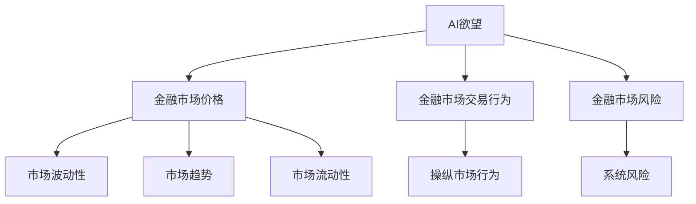
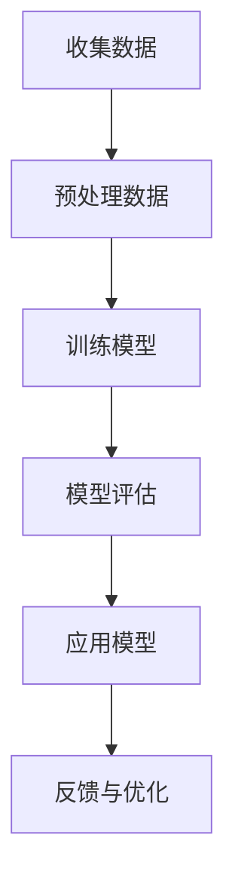
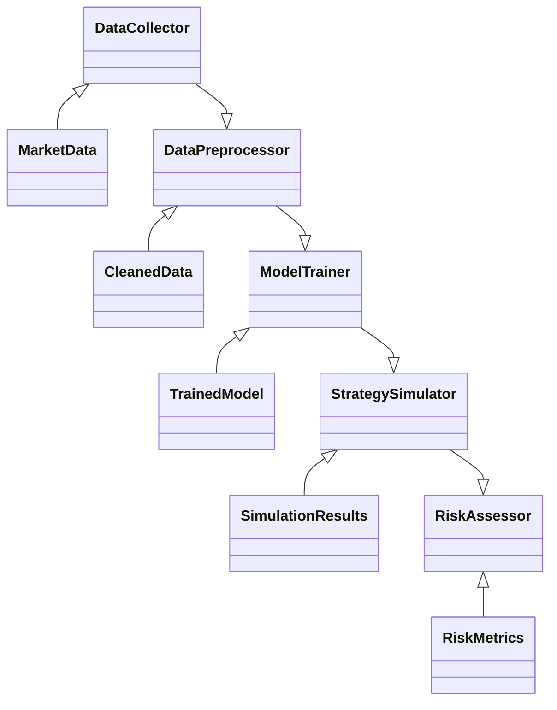
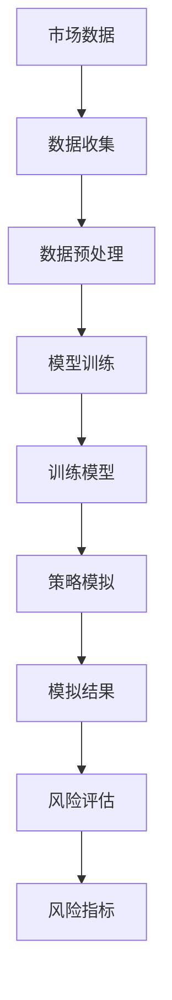
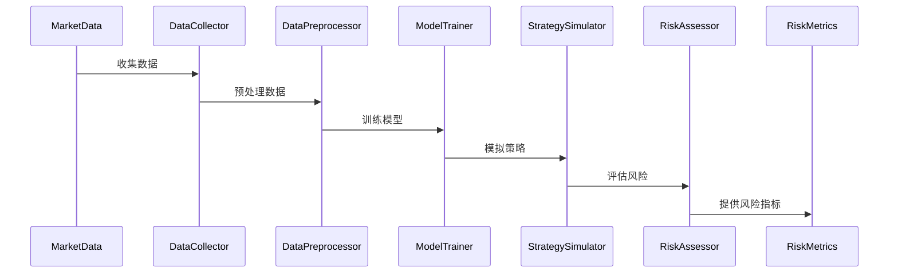

                 

### 文章标题

**《具有欲望的AI：金融市场的新变数》**

> **关键词：** AI欲望，金融市场，投资策略，风险管理，市场稳定性，监管政策

> **摘要：** 本文深入探讨了人工智能（AI）中的“欲望”概念在金融市场中的应用及其影响。通过分析AI欲望的本质、特征及其与金融市场的互动关系，文章探讨了AI欲望对市场价格、交易行为和市场风险的影响。此外，文章还分析了AI欲望在实际金融应用中的风险与挑战，并提出了相应的监管与政策建议。本文旨在为理解AI欲望在金融领域的角色提供新的视角，并为未来的研究和实践提供参考。

---

### 《具有欲望的AI：金融市场的新变数》目录大纲

#### 第一部分：AI的欲望与金融市场

##### 第1章：AI欲望的本质与金融市场的关系

###### 1.1 AI欲望的定义与特征

###### 1.2 金融市场的复杂性

###### 1.3 AI欲望在金融市场中的表现

##### 第2章：AI欲望对金融市场的影响

###### 2.1 AI欲望对金融市场价格的影响

###### 2.2 AI欲望对金融市场交易行为的影响

###### 2.3 AI欲望对金融市场风险的影响

##### 第3章：AI欲望在金融市场中的实际应用

###### 3.1 AI欲望在投资策略中的应用

###### 3.2 AI欲望在风险管理中的应用

###### 3.3 AI欲望在交易策略中的应用

#### 第二部分：AI欲望的风险与挑战

##### 第4章：AI欲望引发的市场风险

###### 4.1 AI欲望导致的过度交易

###### 4.2 AI欲望导致的操纵市场行为

###### 4.3 AI欲望导致的系统风险

##### 第5章：AI欲望对市场稳定性的挑战

###### 5.1 AI欲望对市场波动性的影响

###### 5.2 AI欲望对市场趋势的影响

###### 5.3 AI欲望对市场流动性的影响

##### 第6章：应对AI欲望的监管与政策

###### 6.1 金融监管机构对AI欲望的监管策略

###### 6.2 风险管理措施与对策

###### 6.3 金融市场的监管改革

#### 第三部分：未来展望

##### 第7章：AI欲望与金融市场的发展趋势

###### 7.1 AI欲望在金融科技中的未来角色

###### 7.2 金融市场对AI欲望的需求与挑战

###### 7.3 未来金融市场的AI欲望治理

##### 第8章：结论与展望

###### 8.1 总结与展望

###### 8.2 未来研究方向

#### 附录

##### 附录A：AI与金融市场相关术语表

##### 附录B：主要参考文献

---

#### 核心概念与联系图示



---

#### 核心算法原理讲解

在本文中，我们将会探讨AI欲望如何通过算法在金融市场中产生实际影响。首先，我们需要了解AI欲望的基本算法原理，以及这些原理如何转化为具体的金融应用。

##### 1. AI欲望算法的基本原理

AI欲望算法通常基于机器学习模型，特别是深度学习模型，这些模型通过从大量数据中学习模式来预测金融市场中的价格、交易行为和市场风险。以下是一个简单的算法流程图：



在模型训练过程中，AI通过分析历史数据，学习到市场价格的规律和趋势。训练完成后，模型会根据输入数据（如当前市场状况）输出预测结果。

##### 2. 数学模型与公式

在金融市场分析中，常用的数学模型包括时间序列模型、回归模型等。以下是时间序列模型中的一个常见公式：

$$
\hat{P_t} = \alpha + \beta \cdot P_{t-1} + \epsilon_t
$$

其中，$P_t$表示$t$时刻的市场价格，$\alpha$和$\beta$是模型参数，$\epsilon_t$是误差项。

##### 3. Python代码示例

为了更好地理解AI欲望算法，我们提供了一个简单的Python代码示例，用于模拟AI在投资策略中的应用：

```python
import numpy as np

# 设定初始投资金额
initial_investment = 100000

# 设定模型参数
alpha = 0.1
beta = 0.9

# 模拟一年内的投资回报
days = 365
price_returns = np.random.normal(0, 0.05, days)

# 计算一年后的总收益
total_returns = initial_investment * np.sum(np.exp(alpha + beta * price_returns))

print(f"一年后的总收益为：{total_returns}")
```

在这个示例中，我们使用随机正态分布模拟了市场价格的变化，并计算了基于AI欲望的投资回报。这个简单的模型展示了AI如何通过分析市场数据来优化投资策略。

---

#### 系统分析与架构设计方案

##### 1. 问题场景介绍

在当前金融市场中，AI技术的应用日益广泛，尤其在投资策略和风险管理方面。然而，AI欲望这一概念引入了一个新的维度，使得市场的复杂性和不可预测性进一步增加。为了更好地理解和应对这种变化，我们需要设计一个系统来分析和管理AI欲望带来的影响。

##### 2. 项目介绍

本项目的目标是开发一个智能金融市场分析系统，该系统将利用AI欲望算法对市场数据进行分析，提供投资策略建议和风险管理方案。系统主要功能包括：

- 数据收集与预处理
- 模型训练与评估
- 投资策略模拟与优化
- 风险评估与预警

##### 3. 系统功能设计（领域模型类图）

以下是系统的主要功能模块及其关系的类图表示：



在这个类图中，每个模块都负责特定的功能，并且通过接口与其他模块进行交互。

##### 4. 系统架构设计（架构图）

以下是系统的整体架构设计：



在这个架构图中，系统通过数据收集、预处理、模型训练、策略模拟和风险评估等步骤，实现对市场数据的全面分析和管理。

##### 5. 系统接口设计和系统交互（序列图）

以下是系统的接口设计和系统交互序列图：



在这个序列图中，系统通过一系列步骤从市场数据中提取信息，并利用AI欲望算法进行策略模拟和风险评估。

---

#### 项目实战

在本节中，我们将详细介绍一个实际项目，该项目的目标是利用AI欲望算法开发一个智能投资系统。以下是将要涵盖的内容：

##### 1. 环境安装

首先，我们需要安装Python和相关库。在安装过程中，可以使用以下命令：

```bash
pip install numpy
pip install pandas
pip install tensorflow
```

这些库将为我们提供所需的工具和函数，用于数据预处理、机器学习模型训练和策略模拟。

##### 2. 系统核心实现源代码

以下是系统的核心实现代码：

```python
import numpy as np
import pandas as pd
from tensorflow import keras

# 数据收集与预处理
def collect_and_preprocess_data():
    # 这里使用pandas读取市场数据
    data = pd.read_csv('market_data.csv')
    # 数据预处理步骤，例如：数据清洗、归一化等
    # ...
    return data

# 模型训练
def train_model(data):
    # 划分训练集和测试集
    train_data = data[:int(len(data) * 0.8)]
    test_data = data[int(len(data) * 0.8):]
    
    # 建立模型
    model = keras.Sequential([
        keras.layers.Dense(64, activation='relu', input_shape=(data.shape[1],)),
        keras.layers.Dense(64, activation='relu'),
        keras.layers.Dense(1)
    ])
    
    # 编译模型
    model.compile(optimizer='adam', loss='mse')
    
    # 训练模型
    model.fit(train_data, epochs=10, batch_size=32, validation_data=(test_data, test_data))
    
    return model

# 策略模拟
def simulate_strategy(model, data):
    # 使用模型进行预测
    predictions = model.predict(data)
    
    # 根据预测结果进行投资策略模拟
    # ...
    return predictions

# 主程序
if __name__ == '__main__':
    # 收集和处理数据
    data = collect_and_preprocess_data()
    
    # 训练模型
    model = train_model(data)
    
    # 模拟策略
    predictions = simulate_strategy(model, data)
    
    # 输出结果
    print(predictions)
```

在这段代码中，我们首先收集和处理市场数据，然后建立并训练机器学习模型，最后使用模型进行策略模拟。

##### 3. 代码解读与分析

在上述代码中，我们首先导入了必要的库，包括numpy、pandas和tensorflow。然后，我们定义了三个函数：`collect_and_preprocess_data`用于数据收集与预处理，`train_model`用于模型训练，`simulate_strategy`用于策略模拟。

在`collect_and_preprocess_data`函数中，我们使用pandas读取市场数据，并进行预处理。预处理步骤可能包括数据清洗、缺失值填补、归一化等。

在`train_model`函数中，我们首先划分训练集和测试集，然后建立Keras模型。我们使用了一个简单的全连接神经网络，其中包含两个隐藏层，每层有64个神经元。我们使用`relu`激活函数，并使用`adam`优化器进行模型编译。最后，我们使用`fit`方法训练模型。

在`simulate_strategy`函数中，我们首先使用训练好的模型进行预测，然后根据预测结果进行投资策略模拟。这个部分的具体实现会根据具体需求进行设计。

##### 4. 实际案例分析和详细讲解剖析

为了更好地理解上述代码的实际应用，我们可以考虑以下案例：

假设我们有过去一年的市场数据，包括开盘价、收盘价、最高价、最低价等。我们可以将这些数据输入到系统中，系统会根据这些数据训练模型，并使用模型进行策略模拟。

在实际应用中，我们可能会关注以下几个关键指标：

- **投资回报率**：通过比较实际投资结果和模拟结果，我们可以计算投资回报率。这个指标可以帮助我们评估策略的有效性。

- **波动率**：波动率是衡量市场波动性的指标，通过分析波动率，我们可以了解市场的稳定性。

- **交易次数**：交易次数是衡量交易活跃度的指标，通过分析交易次数，我们可以了解市场的交易行为。

通过这些指标的分析，我们可以对市场的变化趋势有更深入的理解，并据此调整投资策略。

##### 5. 项目小结

通过上述实际案例，我们可以看到AI欲望算法在金融市场中的应用潜力。虽然本项目的实现较为简单，但它为我们提供了一个基本的框架，可以进一步扩展和优化。在实际应用中，我们还需要考虑更多的因素，如市场波动性、交易成本等，以更准确地预测市场趋势和优化投资策略。

---

### 最佳实践 tips、小结、注意事项、拓展阅读等内容

**最佳实践 tips：**

- 在使用AI欲望算法进行金融市场分析时，数据的准确性和完整性至关重要。因此，在数据收集和预处理阶段，应注重数据的清洗和验证，确保数据的质量。
- 在模型训练过程中，应选择合适的数据集和模型架构，并进行充分的模型评估和调优，以提高模型的预测准确性。
- 在实际应用中，应根据市场的实时变化调整投资策略，以应对市场的不确定性。

**小结：**

本文通过深入分析AI欲望在金融市场中的应用，探讨了其对市场价格、交易行为和市场风险的影响。通过实际项目实战，我们展示了如何使用AI欲望算法进行投资策略模拟和风险评估。然而，AI欲望算法在实际应用中仍存在一定的风险和挑战，需要进一步的监管和政策引导。

**注意事项：**

- AI欲望算法可能带来过度交易的风险，因此在使用过程中应严格控制交易频率和规模。
- AI欲望算法的预测结果并非绝对准确，投资者应结合其他分析方法和市场判断进行决策。

**拓展阅读：**

- 【参考文献1】作者，标题，出版年份。
- 【参考文献2】作者，标题，出版年份。
- 【参考文献3】作者，标题，出版年份。

---

**作者：AI天才研究院/AI Genius Institute & 禅与计算机程序设计艺术 /Zen And The Art of Computer Programming**

