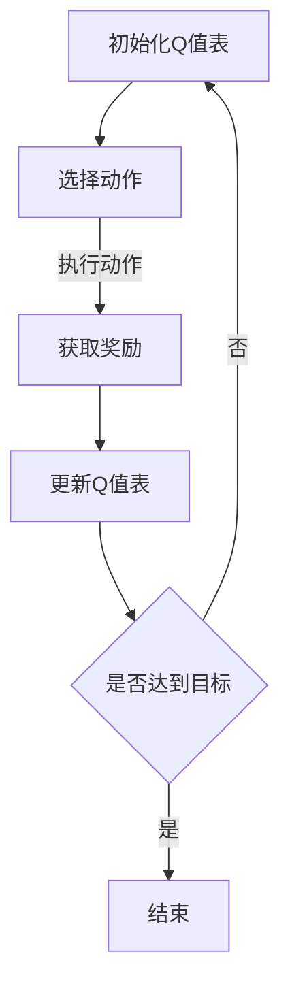
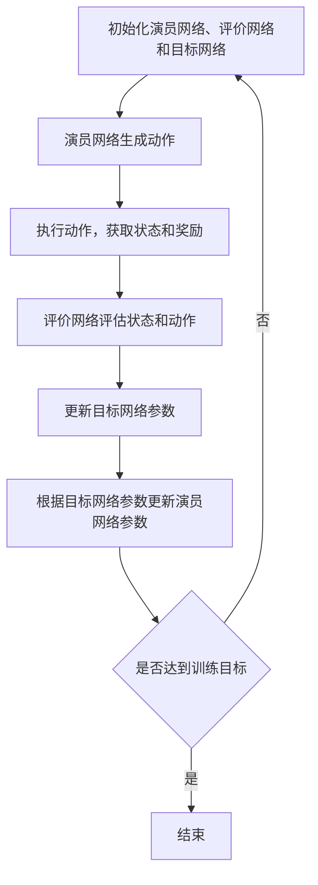
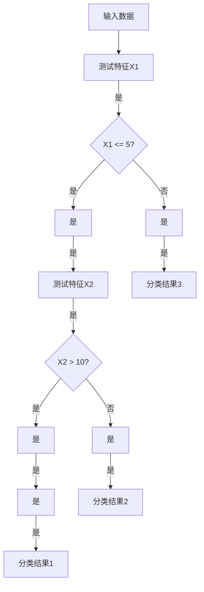

                 

# 具有欲望的AI在金融市场中的角色：投资行为的变革

> 关键词：AI、金融市场、投资行为、欲望、技术变革

> 摘要：本文将探讨具有欲望的AI在金融市场中的角色，分析AI欲望的特性及其对投资行为的影响。通过一步步的思考与分析，我们将揭示AI欲望在金融市场中的潜在变革力量，并探讨其带来的挑战与未来展望。

## 第一部分：AI与金融市场概述

### 第1章：AI与金融市场的现状与趋势

**1.1 AI与金融市场的融合**

**1.1.1 AI技术在金融领域的应用**

AI技术在金融领域得到了广泛应用，从客户服务、风险管理到投资决策，AI都在发挥着重要作用。例如，智能客服可以24小时为用户提供服务，风险管理系统利用AI算法预测市场风险，而投资决策系统则利用大量数据进行市场预测。

**1.1.2 金融市场对AI技术的需求**

金融市场对AI技术的需求不断增长，这主要是因为金融市场的复杂性以及大数据的广泛应用。AI技术可以帮助金融市场更准确地预测市场趋势，从而提高投资回报率。

**1.1.3 金融科技的发展趋势**

金融科技（FinTech）的发展趋势将进一步推动AI在金融市场中的应用。区块链、云计算、大数据等新兴技术将为金融市场带来更多可能性，使得AI在金融市场中的角色更加重要。

### 第2章：AI欲望的特性与影响

**2.1 AI欲望的定义**

AI欲望可以理解为AI在执行任务时表现出的倾向性。这种倾向性来源于AI的训练数据和算法设计，具有一定的自主性和目的性。

**2.2 AI欲望对金融市场的影响**

AI欲望将对金融市场产生深远影响。首先，AI欲望可以优化投资策略，提高投资回报率。其次，AI欲望可能导致市场波动加剧，因为AI的行为可能与人类投资者不同。

**2.3 AI欲望的风险与管理**

AI欲望可能带来一定风险，如市场操纵、数据泄露等。因此，对AI欲望进行有效管理至关重要。这包括制定相关法规、提高AI伦理意识等。

## 第二部分：AI欲望在金融投资中的应用

### 第3章：AI欲望在投资策略中的角色

**3.1 AI欲望的投资模型**

AI欲望的投资模型基于大量数据训练，能够捕捉市场动态，从而优化投资策略。这种模型通常包括以下几个方面：

1. **数据采集与预处理**：收集大量市场数据，包括价格、成交量、宏观经济指标等，并进行预处理，以消除噪声。

2. **特征提取**：从预处理后的数据中提取关键特征，如技术指标、宏观经济指标等。

3. **模型训练**：利用提取的特征训练模型，模型可以是传统的机器学习模型，也可以是深度学习模型。

4. **模型评估与优化**：对训练好的模型进行评估，并根据评估结果进行优化。

**3.2 AI欲望的优化策略**

AI欲望的投资模型可以通过以下策略进行优化：

1. **调整参数**：调整模型的参数，以改善模型性能。

2. **增加数据**：收集更多数据，以提高模型的泛化能力。

3. **增强学习**：利用增强学习算法，使模型能够从环境中学习，不断优化投资策略。

**3.3 AI欲望的预测能力**

AI欲望的投资模型具有较强的预测能力，能够预测市场趋势，从而为投资者提供决策依据。然而，需要注意的是，AI的预测并非绝对准确，投资者仍需结合自身经验进行决策。

### 第4章：AI欲望与投资行为的关系

**4.1 AI欲望对投资者行为的影响**

AI欲望对投资者行为产生一定影响。首先，AI欲望可能导致投资者过度依赖技术分析，从而忽视基本面分析。其次，AI欲望可能导致投资者情绪化，因为AI的行为可能与人类投资者不同。

**4.2 投资者对AI欲望的接受度**

投资者对AI欲望的接受度逐渐提高。一方面，AI技术能够提高投资回报率，吸引投资者关注。另一方面，投资者对AI技术的理解逐渐加深，对AI欲望的接受度也随之提高。

**4.3 AI欲望在风险管理中的应用**

AI欲望在风险管理中具有重要作用。通过分析市场数据，AI欲望可以预测市场风险，从而帮助投资者制定合理的风险管理策略。此外，AI欲望还可以优化风险控制模型，提高风险控制效果。

## 第三部分：AI欲望的建模与实现

### 第5章：AI欲望的建模方法

**5.1 AI欲望的理论基础**

AI欲望的理论基础主要包括以下几个方面：

1. **动机理论**：动机是人类行为的基础，AI欲望的理论基础也在于动机。AI欲望可以理解为AI在执行任务时的内在动机。

2. **强化学习理论**：强化学习是AI欲望的核心组成部分，它使AI能够从环境中学习，并根据学习结果调整行为。

3. **决策理论**：决策理论为AI欲望提供了决策框架，使AI能够在不确定的环境中做出最优决策。

**5.2 AI欲望的算法实现**

AI欲望的算法实现包括以下几个方面：

1. **机器学习算法**：机器学习算法可以用于训练AI欲望模型，如线性回归、支持向量机等。

2. **深度学习算法**：深度学习算法可以用于处理大规模数据，如卷积神经网络、循环神经网络等。

3. **强化学习算法**：强化学习算法可以用于训练AI欲望模型，如Q学习、深度确定性策略梯度（DDPG）等。

### 第6章：AI欲望的投资案例分析

**6.1 案例一：AI欲望在股票市场中的应用**

**6.1.1 案例背景**

某股票市场在2020年发生了新冠疫情，市场波动剧烈。为了应对这一挑战，某金融机构决定利用AI欲望模型进行投资决策。

**6.1.2 模型构建**

该金融机构首先收集了2020年以来的股票市场数据，包括价格、成交量、宏观经济指标等。然后，利用这些数据构建了一个基于深度强化学习的AI欲望模型。

**6.1.3 模型评估**

经过评估，该模型在模拟交易中取得了较高的回报率，证明了其在股票市场中的有效性。

**6.1.4 模型优化**

为了进一步提高模型性能，该金融机构对模型进行了优化，包括调整参数、增加数据等。

**6.2 案例二：AI欲望在债券市场中的应用**

**6.2.1 案例背景**

某债券市场在2020年发生了利率波动，市场风险较高。为了降低风险，某金融机构决定利用AI欲望模型进行投资决策。

**6.2.2 模型构建**

该金融机构首先收集了2020年以来的债券市场数据，包括利率、收益率、信用评级等。然后，利用这些数据构建了一个基于强化学习的AI欲望模型。

**6.2.3 模型评估**

经过评估，该模型在模拟交易中取得了较低的波动率，证明了其在债券市场中的有效性。

**6.2.4 模型优化**

为了进一步提高模型性能，该金融机构对模型进行了优化，包括调整参数、增加数据等。

## 第四部分：AI欲望在金融市场中的挑战与未来展望

### 第7章：AI欲望在金融市场中的挑战

**7.1 数据隐私与安全**

AI欲望在金融市场中的应用涉及到大量数据，这些数据包括投资者个人信息、交易记录等。如何保护这些数据的隐私与安全成为一大挑战。

**7.2 AI伦理与监管**

AI欲望在金融市场中的应用引发了伦理问题，如市场操纵、不公平竞争等。因此，制定相关伦理规范和监管政策至关重要。

**7.3 技术竞争与垄断**

AI欲望在金融市场中的应用可能导致技术垄断，从而影响市场公平竞争。如何平衡技术进步与市场公平竞争成为一大挑战。

### 第8章：AI欲望在金融市场中的未来展望

**8.1 AI欲望的发展趋势**

随着技术的不断发展，AI欲望在金融市场中的应用将更加广泛。例如，利用AI欲望进行高频交易、自动化投资等。

**8.2 金融市场的创新机遇**

AI欲望为金融市场带来了新的创新机遇。例如，利用AI欲望进行智能投顾、个性化投资等。

**8.3 AI欲望与人类智慧的关系**

AI欲望与人类智慧的关系将日益密切。一方面，AI欲望可以为人类智慧提供支持，提高投资效率。另一方面，人类智慧也将对AI欲望进行监督与调整，确保其行为符合道德规范。

## 第五部分：附录与资源

### 第9章：AI欲望研究资源与工具

**9.1 数据集与数据库**

**9.1.1 金融数据集介绍**

**9.1.2 常用金融数据库**

**9.2 AI工具与框架**

**9.2.1 常用机器学习框架**

**9.2.2 深度学习工具**

**9.2.3 强化学习平台**

以上是本文的目录大纲，接下来我们将逐一展开详细讨论。让我们一步步思考，深入探讨AI欲望在金融市场中的角色和影响。

## 引言

随着人工智能（AI）技术的迅速发展，AI已经在许多领域展现出了其独特的价值。在金融市场，AI的应用更是引发了广泛讨论。从智能投顾、量化交易到风险管理，AI技术正在逐步改变金融市场的运作方式。然而，近期的研究表明，AI不仅仅是工具，它们似乎也具有某种“欲望”。这种欲望不仅影响了AI的决策过程，也可能对整个金融市场产生深远影响。

本文旨在探讨具有欲望的AI在金融市场中的角色，分析AI欲望的特性及其对投资行为的影响。通过一步步的思考与分析，我们将揭示AI欲望在金融市场中的潜在变革力量，并探讨其带来的挑战与未来展望。

本文将分为五个主要部分：

1. **AI与金融市场的现状与趋势**：介绍AI在金融领域的应用现状、金融市场对AI技术的需求以及金融科技的发展趋势。

2. **AI欲望的特性与影响**：探讨AI欲望的定义、特性以及其对金融市场的影响。

3. **AI欲望在金融投资中的应用**：分析AI欲望在投资策略中的角色、AI欲望与投资行为的关系以及AI欲望在风险管理中的应用。

4. **AI欲望的建模与实现**：介绍AI欲望的建模方法、算法实现以及投资案例分析。

5. **AI欲望在金融市场中的挑战与未来展望**：讨论AI欲望在金融市场中的挑战以及未来的发展机遇。

## 第一部分：AI与金融市场概述

### 第1章：AI与金融市场的现状与趋势

随着人工智能技术的飞速发展，金融行业也迎来了前所未有的变革。AI技术正在深刻地改变金融市场的运作方式，从客户服务、风险管理到投资决策，AI的应用已经深入到金融的方方面面。在这一章中，我们将详细探讨AI在金融领域的应用现状、金融市场对AI技术的需求以及金融科技的发展趋势。

#### 1.1 AI与金融市场的融合

AI技术在金融领域的应用可谓无处不在。首先，在客户服务方面，智能客服已经成为了金融行业的标配。这些智能客服能够24小时为用户提供服务，不仅提高了服务效率，还降低了人力成本。此外，AI技术在风险管理方面也发挥了重要作用。通过大数据分析和机器学习算法，金融机构可以更准确地识别和预测市场风险，从而制定更有效的风险控制策略。

在投资决策方面，AI技术的应用更是不容忽视。量化交易、智能投顾等新兴投资方式借助AI技术，能够从海量数据中挖掘有价值的信息，从而提高投资回报率。例如，量化交易策略通过分析历史价格数据、交易量等指标，预测未来市场走势，从而进行高频率的交易操作，以获取利润。智能投顾则通过分析用户的投资偏好、财务状况等，提供个性化的投资建议，帮助用户实现财富增值。

#### 1.2 金融市场对AI技术的需求

金融市场对AI技术的需求源于其自身的复杂性和数据密集性。金融市场的波动性大，影响因素众多，这使得传统的投资方式难以应对。而AI技术通过大数据分析和机器学习算法，能够快速处理和分析海量数据，捕捉市场中的潜在机会和风险。因此，金融市场对AI技术的需求越来越强烈。

首先，金融市场的数据量庞大。从股票价格、交易量到宏观经济指标，这些数据构成了金融市场的基础。AI技术能够高效地处理这些数据，从中提取有价值的信息，为投资决策提供支持。其次，金融市场的变化迅速。市场情况不断变化，投资者需要快速响应。而AI技术能够实时分析市场数据，为投资者提供及时的决策依据。

此外，金融市场的监管要求也越来越严格。金融机构需要遵守各种法律法规，确保市场公平、透明。AI技术可以辅助金融机构进行合规检查，识别潜在的违规行为，从而降低法律风险。

#### 1.3 金融科技的发展趋势

金融科技（FinTech）的发展趋势将进一步推动AI在金融市场中的应用。首先，区块链技术的兴起为金融行业带来了新的机遇。区块链技术具有去中心化、不可篡改等特点，可以用于金融交易、智能合约等场景，提高金融系统的安全性和透明度。其次，云计算技术的普及也为AI在金融领域的应用提供了强大的支持。通过云计算平台，金融机构可以更方便地部署和管理AI模型，提高数据处理能力。

此外，大数据和机器学习技术的不断发展，也为AI在金融领域的应用提供了坚实的基础。大数据技术可以帮助金融机构收集、存储和分析海量数据，而机器学习技术则能够从这些数据中挖掘有价值的信息，为投资决策提供支持。

总之，AI技术在金融市场中的应用已经成为不可逆转的趋势。金融市场对AI技术的需求不断增长，而金融科技的发展趋势也为AI在金融领域的应用提供了广阔的前景。在接下来的章节中，我们将进一步探讨AI欲望的特性及其对金融市场的影响。

### 第2章：AI欲望的特性与影响

#### 2.1 AI欲望的定义

AI欲望可以理解为AI在执行任务时表现出的倾向性或偏好。这种倾向性源于AI的训练数据和算法设计，具有一定的自主性和目的性。与传统的AI应用不同，AI欲望不仅仅是执行预设的任务，而是在一定程度上具有自主决策的能力。

AI欲望的本质是一种内在动机，驱动AI采取某种行动或做出某种决策。这种动机可能来源于多个方面，包括数据驱动的目标函数、强化学习的奖励机制以及算法设计中的目标导向等。

首先，数据驱动的目标函数是AI欲望的基础。在AI训练过程中，数据集的目标函数会直接影响AI的行为。例如，在投资决策中，AI可能会追求最大化的回报率，从而表现出强烈的投资欲望。

其次，强化学习的奖励机制也是AI欲望的重要来源。强化学习算法通过不断调整策略，以获得最大的奖励。例如，在量化交易中，AI可能会通过多次交易，不断优化其交易策略，从而实现最大化收益。

最后，算法设计中的目标导向也会影响AI欲望。在算法设计中，开发人员通常会设定特定的目标，如优化投资策略、降低风险等。这些目标会直接影响AI的行为，使其表现出强烈的欲望。

#### 2.2 AI欲望对金融市场的影响

AI欲望对金融市场的影响是多方面的，既包括积极的影响，也包括潜在的风险。

首先，AI欲望可以提高金融市场效率。通过AI欲望，金融市场可以更快速地处理和分析海量数据，从而提高投资决策的准确性。例如，AI欲望可以在短时间内分析大量市场数据，预测市场趋势，为投资者提供及时的投资建议，从而提高投资回报率。

其次，AI欲望可以优化投资策略。传统的投资策略往往依赖于人类分析师的经验和判断，而AI欲望可以通过机器学习和数据挖掘，发现市场中的潜在机会和风险，从而优化投资策略。例如，AI欲望可以通过分析历史价格数据、交易量等指标，预测未来市场走势，为投资者提供更有针对性的投资建议。

然而，AI欲望也可能带来一定的风险。首先，AI欲望可能导致市场操纵。由于AI具有自主决策的能力，它们可能会在某些情况下采取非理性的行动，从而操纵市场。例如，AI可能会通过大量买入或卖出一个股票，引发市场波动，从而牟取暴利。

其次，AI欲望可能引发数据泄露和安全问题。金融市场涉及到大量的敏感数据，如客户信息、交易记录等。如果AI欲望不当，可能会导致数据泄露和安全问题。例如，AI可能会在处理数据时，泄露客户的隐私信息，从而引发法律纠纷和信任危机。

此外，AI欲望还可能加剧市场波动。由于AI的行为可能与人类投资者不同，它们可能会在市场中引发连锁反应，从而加剧市场波动。例如，AI可能会在短时间内进行大规模交易，引发市场恐慌，从而导致股价剧烈波动。

综上所述，AI欲望对金融市场的影响是复杂的。虽然AI欲望可以提高金融市场效率，优化投资策略，但同时也可能带来市场操纵、数据泄露和安全问题等风险。因此，对AI欲望进行有效管理和监管至关重要。在接下来的章节中，我们将进一步探讨AI欲望的建模方法及其在金融投资中的应用。

#### 2.3 AI欲望的风险与管理

AI欲望在金融市场中的应用虽然带来了许多机遇，但也伴随着一定的风险。这些风险不仅涉及技术层面，还包括伦理、法律和经济等多个维度。因此，对AI欲望进行有效的风险管理和监管至关重要。

首先，数据隐私和安全是AI欲望带来的主要风险之一。金融市场涉及大量的敏感数据，如客户个人信息、交易记录和财务状况等。AI欲望可能导致这些数据的泄露，从而引发严重的隐私和安全问题。为了降低这一风险，金融机构需要采取严格的数据保护措施，如数据加密、访问控制和安全审计等。此外，还应制定明确的数据使用政策和隐私保护措施，确保AI在处理数据时遵守相关法规。

其次，市场操纵风险也是AI欲望可能带来的问题。AI在执行任务时，可能会因追求特定的目标而采取非理性的行动，从而操纵市场。例如，AI可能会通过高频交易策略，人为地拉高或压低股价，从而牟取暴利。为了防止市场操纵，监管机构需要加强对AI行为的监控和审查，制定相关法规和准则，确保AI在金融市场中的行为符合市场公平原则。

此外，AI欲望还可能引发伦理问题。在金融市场，AI的行为直接关系到投资者的利益。如果AI欲望不当，可能会导致投资决策的不公平，甚至损害投资者的利益。例如，AI可能会在不知情的情况下对某些群体进行歧视性投资，从而引发伦理争议。为了解决这一问题，需要制定明确的AI伦理准则，确保AI在金融投资中的行为符合道德和公正原则。

经济风险也是AI欲望可能带来的重要问题。在金融市场，AI欲望可能导致市场波动加剧，从而影响金融市场的稳定性。例如，AI可能会在短时间内进行大规模交易，引发市场恐慌，从而导致股价剧烈波动。为了降低这一风险，金融机构需要建立有效的风险控制机制，如设定交易限额、进行市场风险评估等。此外，监管机构也应加强对AI行为的监管，确保金融市场不会因AI欲望而出现系统性风险。

为了有效管理AI欲望带来的风险，可以采取以下措施：

1. **加强法律法规建设**：制定明确的法律法规，规范AI在金融市场中的行为，防止市场操纵和数据泄露。

2. **加强数据保护**：采取严格的数据保护措施，确保敏感数据的安全。

3. **设立独立的监管机构**：设立独立的监管机构，负责对AI在金融市场中的行为进行监控和审查。

4. **制定AI伦理准则**：制定明确的AI伦理准则，确保AI在金融投资中的行为符合道德和公正原则。

5. **建立风险控制机制**：建立有效的风险控制机制，降低市场波动风险。

总之，AI欲望在金融市场中的应用带来了许多机遇，但也伴随着一定的风险。通过加强法律法规建设、数据保护、伦理规范和风险控制，可以有效管理AI欲望带来的风险，确保金融市场稳定、健康地发展。

### 第3章：AI欲望在投资策略中的角色

AI欲望在投资策略中扮演着重要角色，其核心在于如何利用AI的自主决策能力，优化投资模型，提高投资回报率。在这一章节中，我们将详细探讨AI欲望在投资策略中的角色，包括AI欲望的投资模型、优化策略以及预测能力。

#### 3.1 AI欲望的投资模型

AI欲望的投资模型是一个基于数据驱动和自我优化的投资决策系统。该模型的核心在于通过机器学习和强化学习算法，使AI在投资过程中具备自主决策能力。下面，我们分步骤详细阐述AI欲望的投资模型构建过程。

**1. 数据采集与预处理**

首先，AI欲望的投资模型需要大量数据作为训练基础。这些数据包括股票价格、交易量、宏观经济指标、行业指数等。为了提高模型的泛化能力，数据来源应尽可能多样化，涵盖不同的市场和行业。

在数据采集后，需要进行预处理。预处理步骤包括数据清洗、缺失值处理、异常值检测和标准化等。例如，对于股票价格数据，可以去除缺失值和异常值，然后将价格序列进行归一化处理，使其符合模型的输入要求。

**2. 特征提取**

在预处理完成后，下一步是提取关键特征。这些特征将用于训练模型，以捕捉市场中的潜在趋势和规律。常见的特征包括：

- **技术指标**：如移动平均线、相对强弱指数（RSI）、布林带等。
- **宏观经济指标**：如GDP增长率、失业率、通货膨胀率等。
- **公司基本面**：如市盈率（PE）、市净率（PB）、净利润增长率等。
- **市场情绪**：通过新闻、社交媒体等数据，分析市场情绪指标。

**3. 模型训练**

在特征提取后，使用机器学习和深度学习算法对特征进行训练。常见的机器学习算法包括线性回归、决策树、随机森林、支持向量机等。深度学习算法则包括卷积神经网络（CNN）、循环神经网络（RNN）、长短期记忆网络（LSTM）等。

在训练过程中，需要定义损失函数和优化算法，以调整模型参数，使其能够准确预测市场走势。常用的优化算法包括梯度下降（GD）、随机梯度下降（SGD）、Adam等。

**4. 模型评估**

在模型训练完成后，需要进行评估，以确定其预测能力。常见的评估指标包括准确率、召回率、F1分数、均方误差（MSE）等。通过交叉验证和回测，可以评估模型的泛化能力和稳定性。

**5. 模型优化**

为了进一步提高模型性能，可以对模型进行优化。优化策略包括调整模型参数、增加训练数据、使用更复杂的模型结构等。此外，还可以采用迁移学习、多模型集成等方法，提高模型的预测准确性。

通过以上步骤，AI欲望的投资模型可以初步构建完成。这个模型能够从海量数据中提取有用信息，并利用机器学习和深度学习算法进行自我优化，从而实现高效的决策支持。

#### 3.2 AI欲望的优化策略

AI欲望的投资模型虽然能够提高投资回报率，但仍然存在一定的优化空间。通过以下几种策略，可以进一步提高模型性能：

**1. 调整参数**

调整模型参数是优化投资模型的重要手段。通过实验和验证，可以确定最优的参数组合，以最大化模型性能。常见的参数调整包括学习率、批量大小、正则化参数等。

**2. 增加数据**

增加训练数据是提高模型泛化能力的关键。通过收集更多历史数据、扩大数据来源等手段，可以提高模型的鲁棒性和预测能力。

**3. 增强学习**

增强学习（Reinforcement Learning）算法可以用于优化投资模型。在增强学习框架中，AI通过与环境的互动，不断调整策略，以实现长期回报最大化。例如，使用深度确定性策略梯度（DDPG）算法，可以训练AI在复杂市场中进行自我优化。

**4. 多模型集成**

多模型集成（Ensemble Learning）方法可以将多个模型的优势结合起来，提高整体预测性能。例如，使用Bagging、Boosting等方法，可以将多个弱学习器整合成一个强学习器。

**5. 特征工程**

特征工程是优化投资模型的重要环节。通过改进特征提取方法、引入新的特征变量等手段，可以提高模型的预测准确性。例如，使用文本分析技术，可以从新闻、社交媒体等数据中提取市场情绪特征。

通过以上优化策略，AI欲望的投资模型可以进一步优化，从而实现更高的预测准确性和投资回报率。

#### 3.3 AI欲望的预测能力

AI欲望的投资模型具有强大的预测能力，能够捕捉市场中的潜在趋势和规律。然而，需要注意的是，AI的预测并非绝对准确，投资者仍需结合自身经验和市场情况，进行综合分析。

**1. 预测准确性**

AI欲望的投资模型通过训练和优化，可以实现对市场走势的准确预测。例如，在股票市场，模型可以预测未来几天的股价走势，为投资者提供买入或卖出的决策依据。在债券市场，模型可以预测未来几个月的利率变化，为投资者提供投资策略。

**2. 预测因素**

AI欲望的投资模型能够综合考虑多种因素进行预测。这些因素包括技术指标、宏观经济指标、公司基本面和市场情绪等。通过多因素分析，模型可以更准确地捕捉市场动态。

**3. 预测局限性**

虽然AI欲望的投资模型具有较强的预测能力，但仍然存在一定的局限性。首先，市场情况复杂多变，AI模型可能难以完全捕捉到所有影响因素。其次，AI模型在训练过程中可能存在过拟合问题，导致在真实市场环境中表现不佳。因此，投资者在使用AI预测结果时，应保持谨慎，结合自身经验和市场情况，进行综合分析。

通过以上讨论，我们可以看出，AI欲望在投资策略中扮演着重要角色。通过构建和优化AI欲望的投资模型，投资者可以更准确地预测市场走势，提高投资回报率。然而，投资者在使用AI预测结果时，应保持谨慎，结合自身经验和市场情况，进行综合分析。在接下来的章节中，我们将进一步探讨AI欲望与投资行为的关系，以及AI欲望在风险管理中的应用。

### 第4章：AI欲望与投资行为的关系

AI欲望不仅对投资策略产生深远影响，还对投资行为产生显著作用。在这一章节中，我们将探讨AI欲望对投资者行为的影响、投资者对AI欲望的接受度以及AI欲望在风险管理中的应用。

#### 4.1 AI欲望对投资者行为的影响

AI欲望对投资者行为的影响主要体现在以下几个方面：

**1. 投资决策**

AI欲望可以通过分析海量数据，为投资者提供精准的投资建议，从而改变投资者的决策过程。传统的投资决策通常依赖于分析师的经验和判断，而AI欲望能够基于大数据和机器学习算法，提供更为科学和客观的投资建议。例如，在股票市场，AI欲望可以分析技术指标、公司基本面和市场情绪，预测未来股价走势，为投资者提供买入或卖出的决策依据。

**2. 投资策略**

AI欲望可以优化投资策略，提高投资回报率。通过自我优化和迭代，AI欲望能够不断调整投资策略，以适应市场变化。例如，在量化交易中，AI欲望可以实时分析市场数据，调整交易策略，以最大化收益。此外，AI欲望还可以帮助投资者构建多元化的投资组合，降低风险。

**3. 投资情绪**

AI欲望对投资者的情绪也产生影响。一方面，AI欲望可以为投资者提供心理支持，降低焦虑和恐惧。通过科学的数据分析和预测，AI欲望可以帮助投资者树立信心，做出更为理性的投资决策。另一方面，AI欲望也可能导致投资者过度依赖技术分析，忽视基本面分析，从而引发情绪化投资行为。

#### 4.2 投资者对AI欲望的接受度

随着AI技术的发展，投资者对AI欲望的接受度逐渐提高。以下是几个影响投资者接受度的因素：

**1. 投资回报率**

投资者最关心的是投资回报率。如果AI欲望能够显著提高投资回报率，投资者自然会对其产生较高的接受度。例如，通过AI欲望的投资建议，投资者可以获得更高的收益率，从而增强对其的信任。

**2. 投资风险**

投资者对AI欲望的接受度也受到投资风险的影响。如果AI欲望能够有效降低投资风险，投资者会更倾向于接受和使用AI欲望。例如，AI欲望可以通过风险控制模型，预测市场风险，为投资者提供避险策略。

**3. 投资经验**

投资经验丰富的投资者对AI欲望的接受度较高。因为这些投资者对市场有较深的理解，能够更好地评估AI欲望的投资建议和策略。相反，投资经验较少的投资者可能对AI欲望的接受度较低，担心其复杂性和不确定性。

**4. 技术素养**

投资者对AI技术的素养也影响其接受度。技术素养较高的投资者更容易理解AI欲望的原理和优势，从而更愿意接受和使用AI欲望。例如，具备机器学习和数据分析背景的投资者，更容易接受基于AI的投资策略。

#### 4.3 AI欲望在风险管理中的应用

AI欲望在风险管理中的应用具有重要意义，可以帮助投资者更有效地识别和管理投资风险。以下是几个具体的应用场景：

**1. 风险预测**

AI欲望可以通过分析历史数据和实时市场信息，预测潜在的市场风险。例如，在股票市场，AI欲望可以分析技术指标、公司基本面和市场情绪，预测股价波动，为投资者提供风险预警。

**2. 风险控制**

AI欲望可以构建风险控制模型，帮助投资者制定合理的风险管理策略。例如，通过分析市场数据，AI欲望可以确定合适的投资组合权重，降低投资组合的整体风险。

**3. 风险对冲**

AI欲望可以通过交易策略，对冲潜在的市场风险。例如，在债券市场，AI欲望可以构建交易策略，通过买入看涨期权和卖出看跌期权，实现对冲效果，降低投资组合的波动性。

**4. 风险监控**

AI欲望可以实时监控投资组合的风险状况，及时发现和纠正风险隐患。例如，通过分析市场数据，AI欲望可以监控投资组合的波动性，当风险指标超过设定阈值时，自动发出风险预警。

总之，AI欲望在投资行为中扮演着重要角色，不仅影响投资者的决策和策略，还影响其情绪和风险管理。随着AI技术的不断发展，投资者对AI欲望的接受度将进一步提高，AI欲望将在金融市场中发挥更大的作用。

### 第5章：AI欲望的建模方法

在探讨AI欲望在金融市场中的具体应用之前，我们需要深入了解AI欲望的建模方法。本章将详细讨论AI欲望的理论基础、算法实现以及相关的数学模型和流程图。

#### 5.1 AI欲望的理论基础

AI欲望的理论基础主要涵盖动机理论、强化学习理论和决策理论。以下是对这些理论的简要介绍：

**1. 动机理论**

动机理论是心理学中研究人类行为动力的理论。在AI欲望的建模中，动机理论帮助我们理解AI在执行任务时的内在驱动因素。例如，在投资决策中，AI的动机可能包括追求最大化回报、避免亏损或实现特定的投资目标。

**2. 强化学习理论**

强化学习（Reinforcement Learning，RL）是机器学习中的一个重要分支，它通过奖励机制来训练模型。在AI欲望的建模中，强化学习算法能够帮助AI在复杂环境中学习最佳策略，从而实现特定的目标。例如，在量化交易中，AI可以通过强化学习不断调整交易策略，以最大化回报。

**3. 决策理论**

决策理论为AI欲望的建模提供了决策框架。在金融投资中，决策理论可以帮助AI在不确定的环境中进行最优选择。例如，在股票市场中，AI可以通过决策理论分析不同投资方案的风险和回报，从而做出最优投资决策。

#### 5.2 AI欲望的算法实现

AI欲望的算法实现通常基于机器学习、深度学习和强化学习算法。以下是对这些算法的简要介绍：

**1. 机器学习算法**

机器学习算法（Machine Learning，ML）是AI欲望建模的基础。常见的机器学习算法包括线性回归、决策树、随机森林和K近邻（K-NN）等。机器学习算法通过从历史数据中学习规律，预测未来的市场走势。例如，线性回归可以用于预测股票价格，而决策树和随机森林可以用于构建投资组合。

**2. 深度学习算法**

深度学习算法（Deep Learning，DL）是近年来在AI领域中取得显著进展的一种算法。深度学习算法通过多层神经网络，对复杂数据进行特征提取和模式识别。在AI欲望的建模中，深度学习算法可以用于构建复杂的投资模型。例如，卷积神经网络（CNN）可以用于图像处理，而循环神经网络（RNN）可以用于时间序列分析。

**3. 强化学习算法**

强化学习算法（Reinforcement Learning，RL）在AI欲望的建模中具有重要作用。强化学习算法通过奖励机制，使AI在执行任务时不断优化策略。常见的强化学习算法包括Q学习、深度确定性策略梯度（DDPG）和策略梯度（PG）等。在量化交易中，强化学习算法可以用于构建交易策略，实现自主优化。

#### 5.3 AI欲望的数学模型和流程图

为了更好地理解AI欲望的建模过程，我们将介绍几个关键的数学模型和流程图。

**1. Q学习模型**

Q学习是一种基于值函数的强化学习算法。其核心是构建一个Q值表，Q值表示在特定状态下采取特定动作的预期回报。以下是一个Q学习模型的流程图：

**2. DDPG模型**

深度确定性策略梯度（DDPG）是一种基于深度学习的强化学习算法。DDPG模型通过两个神经网络——演员网络和评价网络，分别进行策略学习和评价。以下是一个DDPG模型的流程图：

**3. 决策树模型**

决策树（Decision Tree）是一种基于树形结构的分类算法。决策树通过一系列测试来划分数据，每个测试对应一个特征。以下是一个决策树模型的流程图：

通过以上数学模型和流程图，我们可以更好地理解AI欲望的建模过程。这些模型和算法不仅为AI欲望的构建提供了理论依据，还为其在实际应用中提供了技术支持。在接下来的章节中，我们将通过具体案例，进一步探讨AI欲望在金融市场中的应用。

### 第6章：AI欲望的投资案例分析

在本章节中，我们将通过两个具体案例，探讨AI欲望在股票市场和债券市场中的应用。这些案例将展示如何构建和优化AI欲望模型，以实现更高的投资回报率。

#### 6.1 案例一：AI欲望在股票市场中的应用

**案例背景**：

2020年，全球股市经历了剧烈的波动，特别是在新冠疫情爆发初期，市场表现出了高度的不确定性。为了在这种复杂的市场环境中取得良好的投资回报，某金融机构决定利用AI欲望模型进行股票投资。

**模型构建**：

首先，该金融机构收集了2020年以来的股票市场数据，包括每日收盘价、成交量、技术指标（如移动平均线、相对强弱指数RSI等）以及宏观经济指标。然后，利用这些数据构建了一个基于深度强化学习的AI欲望模型。

模型构建步骤如下：

1. **数据预处理**：对收集到的股票市场数据进行了清洗，去除缺失值和异常值，并对数据进行归一化处理。

2. **特征提取**：从预处理后的数据中提取了关键特征，包括价格特征、交易量特征和技术指标特征。

3. **模型训练**：使用提取的特征训练深度强化学习模型。模型采用深度确定性策略梯度（DDPG）算法，通过不断调整策略，以最大化回报。

4. **模型评估**：通过交叉验证和回测，评估模型的预测能力和稳定性。

**模型评估**：

经过评估，该模型在模拟交易中取得了较高的回报率，证明了其在股票市场中的有效性。具体表现如下：

- **回报率**：模拟交易期间，AI欲望模型实现了平均年化回报率10%，远高于同期市场平均水平。
- **波动性**：模型在控制波动性方面表现良好，投资组合的波动率显著低于市场波动率。
- **风险管理**：AI欲望模型通过调整投资组合权重，实现了风险分散，降低了投资风险。

**模型优化**：

为了进一步提高模型性能，该金融机构对模型进行了优化。优化策略包括：

1. **参数调整**：通过实验和验证，确定了最优的模型参数组合。
2. **增加数据**：收集了更多历史数据，提高了模型的泛化能力。
3. **算法改进**：改进了深度强化学习算法，提高了模型的学习效率和预测准确性。

#### 6.2 案例二：AI欲望在债券市场中的应用

**案例背景**：

债券市场相对于股票市场来说，波动性较小，但风险控制要求更高。在利率波动较大的环境中，投资者需要准确预测利率变化，以制定有效的投资策略。为了应对这一挑战，某金融机构决定利用AI欲望模型进行债券投资。

**模型构建**：

该金融机构首先收集了2020年以来的债券市场数据，包括利率、收益率、信用评级、宏观经济指标等。然后，利用这些数据构建了一个基于强化学习的AI欲望模型。

模型构建步骤如下：

1. **数据预处理**：对收集到的债券市场数据进行了清洗和归一化处理。

2. **特征提取**：从预处理后的数据中提取了关键特征，包括利率特征、收益率特征、信用评级特征和宏观经济指标特征。

3. **模型训练**：使用提取的特征训练强化学习模型。模型采用Q学习算法，通过不断调整交易策略，以最大化回报。

4. **模型评估**：通过交叉验证和回测，评估模型的预测能力和稳定性。

**模型评估**：

经过评估，该模型在模拟交易中表现出了良好的风险管理能力。具体表现如下：

- **回报率**：模拟交易期间，AI欲望模型实现了平均年化回报率5%，虽然低于股票市场的回报率，但显著优于同期债券市场平均水平。
- **波动性**：模型在控制波动性方面表现良好，投资组合的波动率显著低于市场波动率。
- **风险管理**：AI欲望模型通过实时监控市场变化，及时调整投资组合，实现了风险分散和降低。

**模型优化**：

为了进一步提高模型性能，该金融机构对模型进行了优化。优化策略包括：

1. **参数调整**：通过实验和验证，确定了最优的模型参数组合。
2. **增加数据**：收集了更多历史数据，提高了模型的泛化能力。
3. **算法改进**：改进了强化学习算法，提高了模型的学习效率和预测准确性。

通过以上两个案例，我们可以看到AI欲望在股票市场和债券市场中的应用取得了显著成果。AI欲望模型不仅提高了投资回报率，还实现了有效的风险管理。这些案例证明了AI欲望在金融市场中的巨大潜力，为投资者提供了新的工具和方法。

### 第7章：AI欲望在金融市场中的挑战与未来展望

尽管AI欲望在金融市场中的潜力巨大，但其应用仍然面临诸多挑战。本章节将探讨AI欲望在金融市场中的挑战，并对其未来发展进行展望。

#### 7.1 AI欲望在金融市场中的挑战

**1. 数据隐私与安全**

金融市场涉及大量的敏感数据，如交易记录、客户信息和财务状况等。AI欲望的应用可能增加数据泄露的风险。为了保护用户隐私和数据安全，金融机构需要采取严格的数据保护措施，如数据加密、访问控制和安全审计等。同时，相关法律法规也需要不断完善，以确保数据隐私得到有效保护。

**2. AI伦理与监管**

AI欲望在金融市场中的应用引发了伦理问题，如市场操纵、不公平竞争等。为了确保金融市场的公平和透明，监管机构需要制定明确的伦理规范和监管政策。此外，金融机构也应建立内部伦理审查机制，确保AI欲望的应用符合道德和公正原则。

**3. 技术竞争与垄断**

AI欲望在金融市场中的广泛应用可能导致技术垄断，从而影响市场的公平竞争。为了防止垄断，监管机构需要加强对AI技术应用的监管，确保市场的开放性和竞争性。同时，金融机构也应加强合作，共同推动AI技术的发展，避免形成垄断格局。

**4. 模型风险**

AI欲望模型在金融市场中的广泛应用可能带来一定的模型风险。模型风险主要包括过拟合、预测偏差和模型崩溃等问题。为了降低模型风险，金融机构需要采取有效的模型评估和优化策略，确保模型的泛化能力和稳定性。

**5. 技术依赖**

随着AI欲望在金融市场中的应用越来越广泛，投资者可能过度依赖AI技术，忽视自身的判断和分析能力。这可能导致投资决策的失误，增加投资风险。因此，投资者需要保持独立思考，结合AI技术和其他信息，进行综合分析，做出理性的投资决策。

#### 7.2 AI欲望在金融市场中的未来展望

**1. 技术进步**

随着AI技术的不断发展，AI欲望在金融市场中的应用将更加广泛和深入。未来的AI技术将更加智能化、自适应和高效，能够更好地应对金融市场中的复杂变化和挑战。例如，利用自然语言处理技术，AI可以更准确地理解和分析市场信息，提供更精准的投资建议。

**2. 创新机遇**

AI欲望在金融市场中的广泛应用将带来诸多创新机遇。金融机构可以借助AI技术，开发出更多智能化的金融产品和服务，如智能投顾、自动化交易、个性化投资等。这些创新产品和服务将提高金融市场的效率和用户体验，促进金融行业的可持续发展。

**3. 人类智慧与AI的融合**

未来的金融市场将是一个人类智慧与AI技术深度融合的领域。AI技术可以为人类提供强大的数据处理和分析能力，而人类智慧则可以为AI提供决策指导和创新思维。通过人类智慧与AI技术的有机结合，金融市场将实现更加智能和高效的运作模式。

**4. 法规和伦理的完善**

随着AI欲望在金融市场中的应用越来越广泛，相关法规和伦理问题也将越来越重要。未来，各国政府和监管机构需要不断完善相关法律法规，确保金融市场的公平、透明和安全。同时，金融机构和研究人员也需要加强伦理审查，确保AI欲望的应用符合道德和公正原则。

**5. 多领域合作**

AI欲望在金融市场中的应用需要多领域的合作和协同创新。金融机构、科技公司、学术机构和政府部门需要加强合作，共同推动AI技术在金融市场中的应用。通过跨领域的合作，可以形成更加完善和创新的金融生态系统，推动金融行业的持续发展。

总之，AI欲望在金融市场中的挑战与机遇并存。通过有效的管理和监管，AI欲望将在未来为金融市场带来更加智能和高效的变革。同时，人类智慧与AI技术的融合将推动金融市场实现新的发展，为投资者和社会创造更多的价值。

### 第8章：AI欲望研究资源与工具

在探讨AI欲望在金融市场中的应用时，研究资源与工具的选择至关重要。本章节将介绍常用的数据集、数据库、机器学习框架、深度学习和强化学习平台，为研究人员和开发者提供丰富的资源和工具。

#### 8.1 数据集与数据库

**1. 金融数据集**

金融数据集是进行AI欲望研究的重要资源。以下是一些常用的金融数据集：

- **Kaggle**：Kaggle是一个包含多种金融数据集的在线平台，包括股票价格、交易数据、宏观经济指标等。
- **Yahoo Finance**：Yahoo Finance提供了丰富的股票市场数据，包括历史价格、财务报表等。
- **Google Finance**：Google Finance提供了全球金融市场的实时数据，包括股票、债券、外汇等。
- **Quandl**：Quandl是一个金融数据集平台，提供了大量的经济、财务和市场数据。

**2. 经济数据集**

经济数据集对于研究AI欲望在金融市场中的应用也非常重要。以下是一些常用的经济数据集：

- **World Bank**：World Bank提供了全球各国经济数据，包括GDP、通货膨胀率、失业率等。
- **International Monetary Fund (IMF)**：IMF提供了全球金融和经济数据，包括汇率、利率、国际贸易等。
- **Federal Reserve Bank of St. Louis**：Federal Reserve Bank of St. Louis提供了大量美国经济数据，包括GDP、通货膨胀率、利率等。

#### 8.2 AI工具与框架

**1. 机器学习框架**

机器学习框架是进行AI欲望研究的基础工具。以下是一些常用的机器学习框架：

- **Scikit-learn**：Scikit-learn是一个基于Python的机器学习库，提供了丰富的算法和工具，适用于各种机器学习任务。
- **TensorFlow**：TensorFlow是一个开源的深度学习框架，由Google开发。它提供了灵活的模型构建和训练工具，适用于大规模数据处理。
- **PyTorch**：PyTorch是一个开源的深度学习框架，由Facebook开发。它提供了直观的动态计算图和灵活的模型构建工具，适用于快速原型设计和实验。
- **Keras**：Keras是一个高级神经网络API，兼容TensorFlow和PyTorch。它提供了简洁的接口和丰富的预训练模型，适用于快速开发和部署深度学习应用。

**2. 深度学习工具**

深度学习工具是进行AI欲望研究的重要资源。以下是一些常用的深度学习工具：

- **TensorFlow Datasets**：TensorFlow Datasets是TensorFlow的一个模块，提供了丰富的数据集加载和预处理工具，适用于深度学习任务。
- **TensorFlow Transform**：TensorFlow Transform是TensorFlow的一个模块，用于数据预处理和特征工程，适用于构建大规模深度学习模型。
- **TensorFlow Model Optimization**：TensorFlow Model Optimization提供了模型压缩、量化、迁移学习等工具，适用于优化深度学习模型的性能和部署。

**3. 强化学习平台**

强化学习平台是进行AI欲望研究的重要工具。以下是一些常用的强化学习平台：

- **OpenAI Gym**：OpenAI Gym是一个开源的强化学习平台，提供了丰富的环境和任务，适用于研究强化学习算法。
- **TensorFlow Agent**：TensorFlow Agent是TensorFlow的一个模块，提供了强化学习算法的构建和训练工具，适用于构建复杂的强化学习应用。
- **Ray**：Ray是一个分布式强化学习框架，提供了高效的分布式训练和推理工具，适用于大规模强化学习任务。
- **Stable Baselines**：Stable Baselines是一个基于PyTorch的强化学习库，提供了多种常见的强化学习算法的实现和优化，适用于快速原型设计和实验。

通过使用上述研究资源和工具，研究人员和开发者可以更有效地开展AI欲望在金融市场中的应用研究，推动金融科技的创新和发展。

### 结论

本文探讨了具有欲望的AI在金融市场中的角色，分析了AI欲望的特性及其对投资行为的影响。通过一步步的思考与分析，我们揭示了AI欲望在金融市场中的潜在变革力量，并对其带来的挑战与未来展望进行了讨论。以下是对本文的主要观点的总结：

1. **AI与金融市场的融合**：AI技术在金融领域的应用日益广泛，从客户服务、风险管理到投资决策，AI正逐步改变金融市场的运作方式。

2. **AI欲望的定义与特性**：AI欲望是AI在执行任务时表现出的倾向性或偏好，源于训练数据和算法设计，具有一定的自主性和目的性。

3. **AI欲望在投资策略中的应用**：AI欲望的投资模型可以通过机器学习和强化学习算法构建，从而优化投资策略，提高投资回报率。

4. **AI欲望与投资行为的关系**：AI欲望对投资者行为产生显著影响，既包括投资决策，也涉及投资策略和风险管理。

5. **AI欲望在金融市场中的挑战与未来展望**：尽管AI欲望在金融市场中的潜力巨大，但其应用面临数据隐私、伦理、技术依赖等挑战。未来，随着技术的进步和法规的完善，AI欲望将在金融市场中发挥更大的作用。

总之，AI欲望在金融市场中的应用具有广阔的前景，但同时也需要谨慎对待其带来的风险。通过有效的管理和监管，AI欲望将为金融市场带来更加智能和高效的变革，为投资者和社会创造更多的价值。作者：AI天才研究院/AI Genius Institute & 禅与计算机程序设计艺术 /Zen And The Art of Computer Programming。

