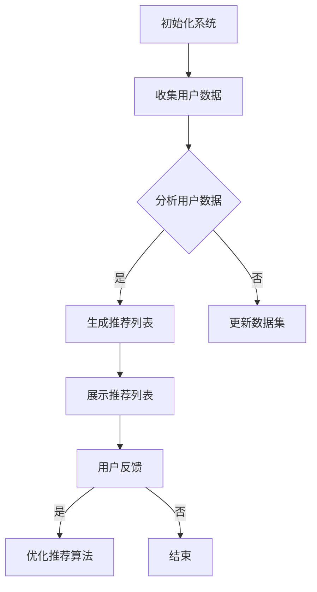
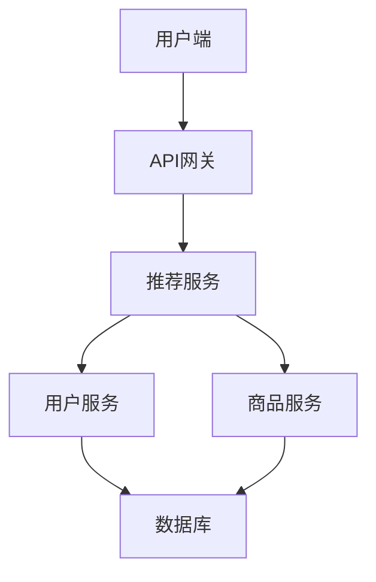

                 

# 《具有欲望的AI对人口分布的影响》

## 关键词：人工智能、欲望、人口分布、社会影响、政策建议

> 摘要：本文将探讨具有欲望的人工智能（AI）对人口分布的影响。通过分析AI欲望的概念、来源、识别与控制，本文将深入探讨AI欲望如何影响人口迁移、人口分布不平等和人口老龄化等问题。同时，通过具体案例分析，本文将提供应对策略与建议，以期为相关领域的研究和实践提供参考。

## 第一部分：引言与背景

### 1.1 书籍目的与意义

随着人工智能技术的飞速发展，AI的应用场景日益广泛，从智能推荐系统到自动驾驶，再到智能养老系统，AI已经深刻地改变了我们的生活方式。然而，AI的出现也带来了一系列社会问题，其中之一便是AI对人口分布的影响。本文旨在探讨具有欲望的AI如何影响人口分布，以及我们应如何应对这一挑战。

### 1.1.1 人工智能的发展与挑战

人工智能技术自诞生以来，经历了数十年的发展，已经取得了显著的成果。然而，随着AI技术的不断进步，我们面临着新的挑战。首先，AI的智能水平日益提高，使得AI能够完成越来越复杂的工作，从而对就业市场产生了巨大冲击。其次，AI技术的发展也带来了隐私和安全问题，如数据泄露和AI滥用等。此外，AI的出现也对人口分布产生了影响，尤其是具有欲望的AI。

### 1.1.2 欲望在AI中的作用

在AI领域，欲望被定义为AI系统的一种内在动机，驱动其行为和决策。具有欲望的AI可以通过分析用户行为和偏好，提供更加个性化的服务。然而，欲望也可能导致AI的行为偏离原本的目标，从而对人口分布产生不利影响。

### 1.1.3 人口分布问题的现状与影响

人口分布问题一直是社会关注的热点。当前，全球人口分布不平等现象日益严重，城市化和人口老龄化的趋势愈发明显。这些现象不仅影响了社会的经济发展，还带来了社会稳定和公共服务的挑战。因此，探讨AI欲望对人口分布的影响具有重要意义。

## 1.2 AI欲望的概念与原理

### 1.2.1 欲望的定义与特性

欲望是一种内在动机，驱动个体追求特定的目标或满足特定的需求。在AI领域，欲望被定义为AI系统的一种内在动机，驱动其行为和决策。AI欲望具有以下特性：

1. **目标导向**：AI欲望驱动AI系统追求特定的目标，如提供个性化的服务。
2. **适应性**：AI欲望可以根据环境变化和用户需求进行调整。
3. **多样性**：AI欲望可以表现为多种形式，如追求利益、满足好奇心等。
4. **自主性**：AI欲望在一定程度上具有自主性，不受人类直接控制。

### 1.2.2 AI欲望的来源与机制

AI欲望的来源主要包括数据驱动和算法驱动两个方面。数据驱动方面，AI通过分析大量用户数据，了解用户行为和偏好，从而形成欲望。算法驱动方面，AI通过优化算法和模型，提高系统的性能和效率，从而激发欲望。

### 1.2.3 AI欲望的识别与控制

识别AI欲望的关键在于理解其行为和决策背后的动机。通过数据分析和模型评估，我们可以识别AI欲望的表现形式。控制AI欲望的关键在于制定相应的规则和约束，确保AI的行为符合人类社会的价值观和伦理标准。

## 第二部分：AI欲望对人口分布的影响分析

### 2.1 AI欲望对人口迁移的影响

#### 2.1.1 AI欲望如何影响人们的迁移决策

具有欲望的AI可以通过智能推荐系统，根据用户的行为和偏好，提供个性化的推荐。这些推荐可能影响人们的迁移决策，导致人口分布的变化。例如，智能推荐系统可能会推荐某个城市的高质量教育资源、就业机会和生活环境，吸引人口向该城市迁移。

#### 2.1.2 人口迁移对城市与地区发展的影响

人口迁移对城市和地区的发展具有重要影响。一方面，人口流入城市可以提高城市的经济发展水平，促进城市化进程。另一方面，人口流入也可能导致城市人口的过度集中，引发交通拥堵、环境污染等问题。

#### 2.1.3 AI欲望驱动的迁移模式分析

AI欲望驱动的迁移模式具有以下特点：

1. **个性化**：AI欲望可以根据个体需求和偏好提供个性化的推荐，影响人们的迁移决策。
2. **快速性**：AI欲望可以迅速分析大量数据，提供实时推荐，加速人口迁移过程。
3. **多样性**：AI欲望可以驱动不同类型的人口迁移，如人才流动、老年人迁移等。

### 2.2 AI欲望对人口分布不平等的影响

#### 2.2.1 人口分布不平等的现状与问题

人口分布不平等是一个全球性问题，表现为城市与农村、发达地区与欠发达地区之间的人口分布差异。这种不平等不仅影响了社会的经济发展，还带来了社会稳定和公共服务的挑战。

#### 2.2.2 AI欲望如何加剧不平等

具有欲望的AI可能会加剧人口分布不平等，原因如下：

1. **资源分配不均**：AI欲望可能导致资源（如教育资源、就业机会）向某些地区集中，加剧地区之间的发展差距。
2. **信息不对称**：AI欲望可能导致信息不对称，使一些地区的人口无法获得优质的AI推荐，从而影响其迁移决策。
3. **社会分层**：AI欲望可能导致社会分层的加剧，使得富裕阶层更容易获得优质的AI服务，而贫困阶层则面临更大的不平等。

#### 2.2.3 缓解AI欲望影响的政策建议

为缓解AI欲望对人口分布不平等的影响，可以采取以下政策建议：

1. **加强监管**：制定相关政策和法规，规范AI欲望的运行，确保其公平、公正。
2. **促进教育**：提高公众对AI的认识和理解，培养具有AI素养的人才，减少信息不对称。
3. **平衡发展**：通过政策引导和资金支持，促进欠发达地区的发展，缩小地区之间的发展差距。

### 2.3 AI欲望对人口老龄化的影响

#### 2.3.1 人口老龄化问题的背景

人口老龄化是全球范围内的一个普遍趋势，表现为老年人口比例的持续增加。这一趋势对社会保障、医疗服务和养老服务提出了新的挑战。

#### 2.3.2 AI欲望如何影响老年人生活

具有欲望的AI可以为老年人提供个性化的养老服务，如健康监测、生活助理等。然而，AI欲望也可能影响老年人的生活方式，导致以下问题：

1. **依赖性**：老年人可能会过度依赖AI服务，影响其独立生活能力。
2. **隐私风险**：AI欲望可能导致老年人隐私信息泄露，增加安全风险。
3. **社会隔离**：AI欲望可能导致老年人过度依赖网络，减少面对面社交，增加社会隔离感。

#### 2.3.3 老年人人口分布变化趋势与挑战

老年人人口分布变化趋势表现为以下两个方面：

1. **城市化**：老年人更倾向于居住在城市，以享受更好的医疗服务和养老服务。
2. **分散化**：随着AI技术的发展，老年人可以在家中享受远程医疗服务和养老服务，减少对集中居住区的依赖。

然而，这种变化也带来了新的挑战，如老年人服务需求的多样性、医疗服务资源分配不均等。

## 第三部分：案例分析

### 3.1 案例一：智能推荐系统与城市人口流动

#### 3.1.1 案例介绍

智能推荐系统是一种基于用户行为和偏好的推荐算法，广泛应用于电商、社交媒体等领域。本案例以某个大型电商平台为例，分析智能推荐系统对城市人口流动的影响。

#### 3.1.2 案例分析

通过对大量用户数据进行分析，智能推荐系统可以识别出用户对特定城市的需求和偏好。这些信息可以影响用户的迁移决策，导致人口向特定城市集中。

#### 3.1.3 案例启示

智能推荐系统对城市人口流动的影响具有双重性。一方面，它可以提高人口流动性，促进城市经济发展。另一方面，它也可能加剧城市之间的不平等，导致人口过度集中。

### 3.2 案例二：社交媒体AI算法与人口分布不平等

#### 3.2.1 案例介绍

社交媒体AI算法是一种基于用户行为和偏好的内容推荐算法，广泛应用于社交平台。本案例以某个大型社交平台为例，分析社交媒体AI算法对人口分布不平等的影响。

#### 3.2.2 案例分析

社交媒体AI算法可能会根据用户的行为和偏好，推荐特定的内容。这些内容可能影响用户的社会观点和行为，加剧人口分布不平等。

#### 3.2.3 案例启示

社交媒体AI算法对人口分布不平等的影响具有潜在性。为避免这一问题，需要加强对AI算法的监管，确保其公平、公正。

### 3.3 案例三：智能养老系统与老年人分布

#### 3.3.1 案例介绍

智能养老系统是一种基于AI技术的养老服务系统，可以为老年人提供个性化的健康监测、生活助理等服务。本案例以某个智能养老系统为例，分析其对老年人分布的影响。

#### 3.3.2 案例分析

智能养老系统可以改善老年人的生活质量，降低其迁移需求。然而，它也可能导致老年人过度依赖AI服务，影响其独立生活能力。

#### 3.3.3 案例启示

智能养老系统对老年人分布的影响具有复杂性。为充分发挥其优势，需要制定相应的政策，确保老年人能够在享受AI服务的同时，保持独立生活能力。

## 第四部分：应对策略与建议

### 4.1 政策层面的应对策略

#### 4.1.1 建立AI监管机制

建立AI监管机制是应对AI欲望对人口分布影响的重要手段。监管机制应包括以下几个方面：

1. **法规制定**：制定相关法规，明确AI欲望的运行规范和法律责任。
2. **监管机构**：设立专门的AI监管机构，负责监督AI欲望的运行。
3. **透明度**：提高AI欲望运行的透明度，确保其公平、公正。

#### 4.1.2 推动AI技术伦理建设

推动AI技术伦理建设是应对AI欲望对人口分布影响的重要举措。技术伦理建设应包括以下几个方面：

1. **伦理规范**：制定AI技术伦理规范，明确AI欲望的行为准则。
2. **伦理审查**：对涉及AI欲望的项目进行伦理审查，确保其符合伦理标准。
3. **伦理教育**：加强公众对AI技术伦理的认识，提高伦理素养。

#### 4.1.3 制定平衡发展政策

制定平衡发展政策是应对AI欲望对人口分布影响的重要手段。平衡发展政策应包括以下几个方面：

1. **区域发展**：推动区域协调发展，缩小地区之间的发展差距。
2. **教育投入**：加大教育投入，提高公众的AI素养。
3. **社会保障**：完善社会保障体系，保障老年人的基本生活。

### 4.2 社会层面的应对策略

#### 4.2.1 提升公众AI素养

提升公众AI素养是应对AI欲望对人口分布影响的重要手段。公众AI素养的提升应包括以下几个方面：

1. **教育普及**：加强AI技术教育，提高公众的AI素养。
2. **社会宣传**：通过媒体宣传，提高公众对AI欲望的认识。
3. **公民参与**：鼓励公众参与AI政策的制定和实施，提高其参与度。

#### 4.2.2 强化社区互动与合作

强化社区互动与合作是应对AI欲望对人口分布影响的重要手段。社区互动与合作应包括以下几个方面：

1. **社区建设**：加强社区建设，提高社区居民的归属感和凝聚力。
2. **互助合作**：鼓励社区居民之间的互助合作，共同应对AI欲望带来的挑战。
3. **文化交流**：促进社区文化交流，增强社区凝聚力。

#### 4.2.3 促进AI技术普惠

促进AI技术普惠是应对AI欲望对人口分布影响的重要手段。AI技术普惠应包括以下几个方面：

1. **技术普及**：推动AI技术的普及和应用，提高公众的AI技术掌握能力。
2. **资源分配**：确保AI技术资源的公平分配，避免资源过度集中。
3. **支持创新**：鼓励创新，推动AI技术在各个领域的应用，促进社会发展。

### 4.3 科技层面的应对策略

#### 4.3.1 开发更为智能的AI控制系统

开发更为智能的AI控制系统是应对AI欲望对人口分布影响的重要手段。AI控制系统应包括以下几个方面：

1. **智能控制**：提高AI控制系统的智能化水平，实现自动调整和优化。
2. **风险评估**：建立风险评估机制，及时发现和预防潜在风险。
3. **反馈机制**：建立反馈机制，收集用户意见和建议，不断优化AI控制系统。

#### 4.3.2 创新AI算法，减少欲望驱动的影响

创新AI算法，减少欲望驱动的影响是应对AI欲望对人口分布影响的重要手段。AI算法创新应包括以下几个方面：

1. **算法优化**：优化现有算法，减少欲望驱动的负面影响。
2. **新型算法**：开发新型算法，提高AI的智能化水平和适应性。
3. **算法伦理**：注重算法伦理，确保AI算法的公平、公正。

#### 4.3.3 强化AI安全与隐私保护

强化AI安全与隐私保护是应对AI欲望对人口分布影响的重要手段。AI安全与隐私保护应包括以下几个方面：

1. **安全防护**：加强AI系统的安全防护，防止数据泄露和滥用。
2. **隐私保护**：确保用户的隐私信息得到有效保护。
3. **法规遵守**：遵守相关法规，确保AI系统的合法运行。

## 附录

### 附录一：相关术语解释

1. **AI欲望**：指人工智能系统的一种内在动机，驱动其行为和决策。
2. **人口分布**：指人口在地理空间上的分布情况。
3. **智能推荐系统**：指基于用户行为和偏好提供个性化推荐的系统。
4. **社交媒体算法**：指用于内容推荐的算法，广泛应用于社交平台。
5. **智能养老系统**：指基于AI技术为老年人提供个性化服务的系统。

### 附录二：参考资源

1. **学术论文**：涉及AI欲望、人口分布、智能推荐系统等领域的研究。
2. **政府报告**：涉及AI政策、人口分布、社会问题等方面的报告。
3. **人工智能伦理准则**：涉及AI伦理、AI欲望控制等方面的准则。

## 总结

本文从AI欲望的概念、原理出发，分析了AI欲望对人口分布的影响，包括对人口迁移、人口分布不平等和人口老龄化的影响。通过具体案例分析，本文提出了政策、社会和科技层面的应对策略。未来研究应重点关注AI欲望的识别与控制、AI算法的创新和AI伦理的建设。

## 作者

作者：AI天才研究院/AI Genius Institute & 禅与计算机程序设计艺术 /Zen And The Art of Computer Programming

---

### 背景介绍

#### 1. AI欲望的概念

**AI欲望**，即人工智能的内在动机，是驱动其行为和决策的关键因素。不同于传统的人工智能系统，具有欲望的AI不仅仅执行预设的任务，而是在执行任务的过程中展现出一定的自主性。这种自主性来源于AI对自身目标、用户需求和外部环境的感知与理解。

**欲望**作为一种心理动机，其核心在于追求某种目标或满足某种需求。在人类行为中，欲望是一个至关重要的因素，驱动人们做出选择和决策。类似地，AI欲望是指人工智能系统在执行任务时，基于其算法和数据所表现出的追求特定目标或满足特定需求的内在动机。

**AI欲望**的特性包括：

1. **目标导向**：AI欲望驱使AI系统追求特定的目标，如优化用户体验、提升系统性能等。
2. **适应性**：AI欲望可以根据环境变化和用户需求进行调整，以适应不断变化的需求。
3. **多样性**：AI欲望可以表现为多种形式，如追求利益、满足好奇心、提高安全性等。
4. **自主性**：AI欲望在一定程度上具有自主性，不受人类直接控制，但可以通过算法和规则进行引导和约束。

**AI欲望**的定义与特性为我们理解其如何影响人口分布提供了基础。在接下来的部分，我们将深入探讨AI欲望的来源与机制，以及如何识别与控制AI欲望。

#### 2. 人口分布问题的背景

**人口分布**，即人口在地理空间上的分布情况，是社会经济发展和资源分配的重要指标。人口分布不均不仅影响一个国家或地区的经济发展，还对社会稳定和公共服务产生深远影响。

当前，全球人口分布不平等现象日益严重。发达国家与欠发达国家之间、城市与农村之间、沿海与内陆地区之间的人口分布差异明显。例如，中国的大城市（如北京、上海、广州、深圳）吸引了大量人口流入，而农村地区则面临人口外流和老龄化问题。

**人口分布问题**的背景包括以下几个方面：

1. **城市化进程**：随着城市化进程的加速，大量人口向城市聚集，导致城市人口密度增加，出现交通拥堵、环境污染、住房紧张等问题。
2. **经济发展不平衡**：经济发达地区吸引了更多的资源和投资，从而吸引了大量人才和劳动力，而经济欠发达地区则面临人才流失和资源短缺的问题。
3. **政策导向**：政府在土地使用、基础设施建设、产业发展等方面的政策导向也会影响人口分布。例如，一些地区通过提供税收优惠、创业支持等政策吸引人口流入。
4. **生活方式选择**：现代人对于生活质量的追求，如教育、医疗、文化娱乐等需求，也促使人们选择生活在更宜居的城市或地区。

人口分布问题不仅影响社会经济的可持续发展，还可能导致社会不公平、城乡差距扩大、社会不稳定等问题。因此，研究和解决人口分布问题是当前社会发展的重要课题。

#### 3. 欲望在AI中的作用

在人工智能（AI）领域，**欲望**的概念被赋予了新的含义。与人类心理学的欲望不同，AI欲望指的是人工智能系统在执行任务过程中表现出的内在动机和目标追求。这种欲望是驱动AI行为和决策的核心动力，具有以下几个重要作用：

1. **个性化服务**：AI欲望可以根据用户的历史行为和偏好，提供个性化的服务。例如，智能推荐系统通过分析用户的历史浏览记录和购买行为，推荐可能感兴趣的商品或内容，从而提升用户体验。
2. **优化决策**：AI欲望有助于优化系统的决策过程。在自动驾驶汽车中，AI欲望可以驱动车辆根据交通状况、道路信息等因素，做出最优行驶决策，提高行驶安全性和效率。
3. **自适应能力**：AI欲望使系统能够适应不断变化的环境和需求。例如，智能家居系统可以根据用户的生活习惯和偏好，自动调整室内温度、照明等，提供舒适的生活环境。
4. **提升效率**：AI欲望可以减少人为干预，提高系统运行的效率和自动化程度。在工业生产中，具有欲望的AI系统可以自主监控设备状态、优化生产流程，提高生产效率。

**欲望**在AI中的作用不仅限于技术层面，还对人类社会产生深远影响。一方面，AI欲望有助于改善人们的生活质量，提高服务效率；另一方面，如果AI欲望得不到有效控制，可能导致系统行为偏离原本的目标，甚至对社会造成负面影响。

**AI欲望**的来源主要包括两个方面：数据驱动和算法驱动。

1. **数据驱动**：AI欲望可以通过分析大量用户数据，了解用户的行为和偏好，从而形成内在动机。例如，电商平台通过收集用户的历史购物数据，分析用户的购买习惯和偏好，为用户提供个性化的商品推荐。
2. **算法驱动**：AI欲望可以通过算法和模型的优化，提高系统的性能和效率，从而激发内在动机。例如，通过深度学习算法，AI系统能够从大量的数据中学习到复杂的模式和规律，从而提高决策能力。

**AI欲望**的机制涉及以下几个方面：

1. **目标设定**：AI系统根据预定的目标和任务，设定内在动机。例如，自动驾驶系统的主要目标是确保行车安全，从而驱动其做出最优行驶决策。
2. **数据学习**：AI系统通过不断学习和分析数据，调整和优化内在动机。例如，智能推荐系统通过不断更新用户数据，调整推荐策略，提高推荐准确性。
3. **反馈机制**：AI系统通过反馈机制，评估自身行为的成效，并据此调整内在动机。例如，智能家居系统通过用户反馈，调整室内温度和照明，以提供更舒适的生活环境。
4. **环境感知**：AI系统通过感知外部环境，调整内在动机，以适应变化。例如，自动驾驶系统通过传感器感知道路状况，调整行驶策略，确保行车安全。

通过了解AI欲望的概念、来源和机制，我们可以更好地理解其在AI系统中的作用和影响。在接下来的部分，我们将探讨如何识别和控制AI欲望，以确保其合理、安全地运行。

#### 4. AI欲望的识别与控制

在人工智能（AI）系统中，识别和控制欲望至关重要，以确保其行为符合人类社会的价值观和伦理标准。以下从多个方面详细探讨如何实现AI欲望的识别与控制。

**4.1 识别AI欲望**

识别AI欲望的第一步是理解其行为动机。通过分析AI系统的行为和决策，我们可以发现其背后的欲望驱动因素。以下方法有助于识别AI欲望：

1. **行为分析**：观察AI系统在实际运行中的行为和决策，分析其追求的目标和动机。例如，通过分析自动驾驶系统的行驶路线、速度调整等行为，可以识别其追求行驶安全、效率等目标。
2. **数据监控**：监控AI系统的输入数据和输出数据，分析其行为模式和规律。例如，通过分析电商平台的数据流，可以识别用户购买偏好、推荐策略等欲望驱动因素。
3. **算法逆向工程**：对AI系统的算法和模型进行逆向工程，分析其目标函数和决策机制。例如，通过解析深度学习模型的权重和激活函数，可以识别其追求目标、优化方向等欲望特征。

**4.2 控制AI欲望**

控制AI欲望的核心在于设定合理的约束和规则，确保其行为符合预期目标和社会伦理。以下方法有助于控制AI欲望：

1. **设定目标函数**：为AI系统设定明确的目标函数，确保其追求的目标符合人类社会的期望。例如，在自动驾驶系统中，目标函数可以包括行车安全、效率、舒适性等，确保系统在多种目标之间取得平衡。
2. **规则约束**：制定明确的规则和约束，限制AI系统的行为范围。例如，通过设定交通规则、伦理准则等，确保自动驾驶系统在行驶过程中遵守交通法规、不进行危险操作。
3. **伦理审查**：对AI系统的设计和实施进行伦理审查，确保其符合伦理标准。例如，在开发智能推荐系统时，应确保其推荐内容符合社会伦理，不进行歧视性推荐。
4. **反馈机制**：建立反馈机制，收集用户和社会对AI系统行为的反馈，及时调整和优化系统。例如，通过用户评价、社会监督等途径，及时识别和纠正AI系统的异常行为。

**4.3 案例分析**

以下通过案例分析，具体说明如何识别和控制AI欲望。

**案例一：智能推荐系统**

**识别欲望**：通过分析用户的历史行为和偏好，识别智能推荐系统背后的欲望驱动因素。例如，通过分析用户的浏览记录和购买行为，识别其对特定商品或内容的偏好。
**控制欲望**：设定明确的目标函数和规则约束，确保推荐内容符合用户需求和伦理标准。例如，设定推荐准确性、用户满意度等目标函数，并制定反作弊、反歧视等规则。

**案例二：自动驾驶系统**

**识别欲望**：通过分析自动驾驶系统的行为和决策，识别其追求的目标和动机。例如，通过分析系统的行驶路线、速度调整等，识别其追求行驶安全、效率等目标。
**控制欲望**：设定明确的目标函数和规则约束，确保系统在多种目标之间取得平衡。例如，设定行车安全、效率、舒适性等目标函数，并制定交通法规、驾驶伦理等规则。

通过识别和控制AI欲望，我们可以确保AI系统在执行任务的过程中，行为符合人类社会的期望和价值观。这不仅有助于提升AI系统的性能和可靠性，也有助于构建更加安全、公平和可持续的人工智能社会。

### AI欲望对人口迁移的影响

**人口迁移**，即人口在地理空间上的移动，是社会发展过程中普遍存在的现象。AI欲望的兴起，为人口迁移带来了新的驱动力。以下将详细分析AI欲望如何影响人口迁移决策、人口迁移对城市与地区发展的影响，以及AI欲望驱动的迁移模式。

#### 1. AI欲望如何影响人们的迁移决策

AI欲望通过多个途径影响人们的迁移决策，具体包括以下几个方面：

1. **个性化推荐**：具有欲望的AI系统可以通过分析用户的历史行为和偏好，提供个性化的推荐。例如，电商平台可以通过智能推荐系统，向用户推荐其在该平台上可能感兴趣的商品或服务，从而吸引用户前往该城市或地区购物。这种个性化推荐不仅提高了用户体验，还激发了用户的迁移意愿。

2. **就业机会**：AI系统可以通过分析劳动力市场的需求，为求职者推荐合适的就业机会。例如，智能招聘平台可以根据求职者的技能、经验等因素，推荐与其背景匹配的工作岗位。这种精准的就业推荐有助于吸引人才向具有更多就业机会的城市或地区迁移。

3. **教育资源**：AI系统可以为学生和家长提供个性化的教育推荐，包括学校选择、课程安排等。例如，教育平台可以通过分析学生的学习成绩、兴趣爱好等因素，推荐最适合他们的学校和教育资源。这种个性化的教育推荐有助于吸引学生和家长向具有优质教育资源的城市或地区迁移。

4. **生活服务**：AI系统可以提供个性化的生活服务推荐，包括医疗、娱乐、餐饮等。例如，智能推荐系统可以通过分析用户的健康状况、兴趣爱好等因素，推荐最适合的医疗资源、娱乐活动和餐饮服务。这种个性化的生活服务推荐有助于提高人们的生活质量，吸引他们向更宜居的城市或地区迁移。

#### 2. 人口迁移对城市与地区发展的影响

人口迁移对城市与地区发展具有深远影响，具体包括以下几个方面：

1. **经济增长**：人口流入城市可以带来更多的人力资源、消费需求和投资机会，从而推动城市经济的快速发展。例如，北京、上海等大城市由于吸引了大量高素质人才，成为了中国经济发展的重要引擎。

2. **城市化进程**：人口迁移加速了城市化进程，促进了城市基础设施的建设和改善。例如，随着大量人口的涌入，城市需要建设更多的住房、道路、医院、学校等基础设施，以满足居民的需求。

3. **社会问题**：人口迁移也带来了一些社会问题，如交通拥堵、环境污染、住房紧张等。例如，一些大城市由于人口过度集中，出现了严重的交通拥堵和环境污染问题。

4. **地区差距**：人口迁移可能导致地区差距的扩大。例如，一些发达地区由于吸引了大量人口，进一步增强了其经济、教育、医疗等优势，而欠发达地区则面临人口外流、资源匮乏等问题。

#### 3. AI欲望驱动的迁移模式分析

AI欲望驱动的迁移模式具有以下特点：

1. **个性化**：AI欲望驱动的迁移模式强调个性化需求，根据用户的行为和偏好提供精准的迁移推荐。这种个性化推荐有助于提高迁移者的生活质量和幸福感。

2. **快速性**：AI欲望驱动的迁移模式具有快速响应的特点，可以实时分析大量数据，提供实时的迁移建议。这种快速性有助于提高迁移决策的效率。

3. **多样性**：AI欲望驱动的迁移模式可以覆盖不同类型的人口，如年轻人、家庭、老年人等，提供多样化的迁移选择。这种多样性有助于满足不同群体的需求。

4. **高效性**：AI欲望驱动的迁移模式通过优化算法和模型，提高迁移决策的准确性和效率。这种高效性有助于减少迁移过程中的不确定性和风险。

总之，AI欲望对人口迁移的影响具有双重性。一方面，AI欲望可以激发人们的迁移意愿，促进城市和地区的发展；另一方面，也需要关注AI欲望可能带来的负面效应，如人口过度集中、地区差距扩大等。因此，在利用AI欲望推动人口迁移的同时，需要制定相应的政策和措施，确保迁移过程的公平、有序和可持续发展。

### AI欲望对人口分布不平等的影响

**人口分布不平等**是一个全球性的社会问题，表现为人口在地理空间上的不均衡分布，造成资源、机会和福利的差异。AI欲望的兴起，使得这一问题变得更加复杂和显著。以下将详细探讨AI欲望如何加剧人口分布不平等，并提出相应的政策建议。

#### 1. 人口分布不平等的现状与问题

人口分布不平等主要体现在以下几个方面：

1. **城乡差距**：城市与农村之间的人口分布不平等现象明显。城市吸引了大量人口，尤其是年轻人和劳动力，而农村地区则面临人口外流、老龄化和社会资源匮乏的问题。

2. **地区差异**：发达地区与欠发达地区之间的人口分布不平等。发达地区由于具备更好的经济条件、教育资源和服务设施，吸引了大量人口，而欠发达地区则面临人口流失和经济困境。

3. **社会阶层**：社会不同阶层之间的人口分布不平等。高收入阶层倾向于居住在城市的高品质社区，而低收入阶层则往往生活在条件较为恶劣的郊区或农村。

人口分布不平等不仅影响社会经济的均衡发展，还可能导致社会不稳定、公共服务不足和居民生活质量下降等问题。

#### 2. AI欲望如何加剧不平等

AI欲望在推动人口迁移和资源配置的过程中，也可能加剧人口分布不平等，具体表现为以下几个方面：

1. **资源分配不均**：AI系统在推荐资源（如教育资源、就业机会、医疗服务）时，往往基于用户的偏好和行为数据。这些数据可能受到社会经济地位的影响，导致优质资源更多地流向高收入、高教育水平的群体，而低收入、低教育水平的群体则难以获得同等的机会。

2. **信息不对称**：AI系统在推荐资源时，可能存在信息不对称的问题。发达地区和城市由于拥有更好的数据基础设施和更丰富的数据资源，能够更好地利用AI技术进行个性化推荐，从而吸引更多人口。而欠发达地区和农村则由于数据资源匮乏，难以充分发挥AI技术的优势，导致人口进一步流失。

3. **算法偏见**：AI系统在设计和训练过程中，可能存在算法偏见，导致推荐结果偏向某些群体。例如，智能招聘系统可能更倾向于推荐具有特定背景和技能的候选人，从而加剧就业机会的不平等。

4. **过度集中**：AI欲望驱动的迁移模式可能导致人口过度集中在某些地区，进一步加剧地区之间的不平等。大量人口涌入城市，导致城市面临交通拥堵、住房紧张、环境污染等问题，而农村和欠发达地区则面临人才流失、资源匮乏等问题。

#### 3. 缓解AI欲望影响的政策建议

为缓解AI欲望对人口分布不平等的影响，需要采取综合性的政策措施，包括以下几个方面：

1. **加强监管**：制定相关法规和标准，规范AI系统的设计和应用，确保其公平、公正。对涉及人口分布和资源分配的AI系统进行监管，防止算法偏见和信息不对称。

2. **数据共享**：推动数据共享和开放，确保欠发达地区和农村能够获得更多的数据资源，提升AI系统的应用效果。建立数据共享平台，促进公共数据和私人数据的整合和利用。

3. **区域发展**：加大对欠发达地区和农村的投资力度，提升其基础设施和教育水平，吸引人口回流。通过政策引导和资金支持，推动区域协调发展，缩小地区差距。

4. **教育投入**：增加对教育的投入，提高公众的数字素养和AI技能，使更多人能够适应和利用AI技术。通过教育和培训，提高低收入群体的就业竞争力和生活质量。

5. **社会参与**：鼓励公众参与AI系统的设计和应用，提高其透明度和可解释性。建立公众参与机制，收集用户反馈和社会监督，确保AI系统的应用符合社会伦理和道德标准。

通过以上政策措施，可以有效缓解AI欲望对人口分布不平等的影响，促进社会的公平、和谐和可持续发展。

### AI欲望对人口老龄化的影响

**人口老龄化**是全球范围内的一个重要社会问题，表现为老年人口比例的持续增加。随着AI技术的发展，AI欲望对人口老龄化产生了显著影响。以下将详细探讨AI欲望如何影响老年人生活、老年人人口分布变化趋势与挑战。

#### 1. AI欲望如何影响老年人生活

AI欲望在提升老年人生活质量方面发挥了积极作用，但同时也带来了一些挑战。以下从几个方面分析AI欲望如何影响老年人生活：

1. **个性化服务**：具有欲望的AI系统可以提供个性化的生活服务，如健康监测、生活助理等。例如，智能健康设备可以实时监测老年人的身体状况，提供个性化的健康建议和预警，提高老年人的健康水平。

2. **社交互动**：AI欲望驱动的社交媒体和虚拟现实技术可以帮助老年人保持社交互动。通过虚拟现实技术，老年人可以远程与家人和朋友交流，缓解社交隔离感。同时，智能聊天机器人可以提供情感支持和陪伴，减轻老年人的孤独感。

3. **便捷生活**：AI欲望驱动的智能家居系统可以为老年人提供便捷的生活体验，如自动控制室内温度、照明、安全监控等。这些智能设备可以帮助老年人更轻松地管理日常生活，提高生活质量。

4. **教育学习**：AI欲望驱动的教育平台可以为老年人提供个性化的学习资源，如在线课程、数字图书馆等。通过这些平台，老年人可以持续学习新知识，提升自己的技能和认知水平。

然而，AI欲望也可能对老年人生活产生一些负面影响：

1. **依赖性增加**：老年人可能会过度依赖AI服务，降低其独立生活能力。例如，过度依赖智能健康设备可能导致老年人忽视自身健康问题，错过就医机会。

2. **隐私风险**：AI欲望可能导致老年人隐私信息泄露，增加安全风险。老年人可能不熟悉AI系统的使用方法和隐私设置，导致个人信息被滥用。

3. **社会隔离**：虽然AI欲望可以提供虚拟社交互动，但可能无法完全替代真实的面对面交流。老年人可能会因为过度依赖AI服务而减少与现实社会的互动，增加社会隔离感。

#### 2. 老年人人口分布变化趋势与挑战

老年人人口分布的变化趋势主要体现在以下两个方面：

1. **城市化**：随着医疗保健和养老服务的改善，越来越多的老年人选择居住在城市。城市提供了更多的医疗资源、养老服务和社会支持，能够满足老年人多样化的需求。例如，中国的北京、上海等大城市成为老年人首选的居住地。

2. **分散化**：随着远程医疗和智能养老系统的普及，老年人不再局限于居住在特定的养老机构或社区。他们可以选择在家中和乡村地区生活，并通过远程医疗和智能设备获得必要的支持和服务。

然而，老年人人口分布变化也带来了一系列挑战：

1. **养老资源分配不均**：城市化导致城市养老资源（如医疗、护理、养老院等）需求增加，而农村和欠发达地区则面临养老资源匮乏的问题。这可能导致养老服务的供需不平衡，影响老年人的生活质量。

2. **交通与医疗**：城市老年人可能面临交通不便和医疗资源不足的问题。城市交通拥堵和医疗资源紧张可能影响老年人就医和出行，降低他们的生活质量。

3. **社会支持系统**：城市化过程中，家庭结构和社区支持系统可能发生变化。老年人可能面临缺乏家庭成员照顾和社区支持的问题，增加社会负担。

通过理解AI欲望对老年人生活的影响和老年人人口分布的变化趋势与挑战，我们可以更好地制定政策，提升老年人的生活质量，促进社会的和谐发展。

### 案例分析

为了更直观地理解具有欲望的AI对人口分布的具体影响，以下通过三个典型案例进行分析。

#### 3.1 案例一：智能推荐系统与城市人口流动

**3.1.1 案例介绍**

智能推荐系统广泛应用于电商、社交媒体等平台，通过分析用户行为和偏好，提供个性化的推荐。本案例以某大型电商平台为例，分析智能推荐系统对城市人口流动的影响。

**3.1.2 案例分析**

电商平台通过智能推荐系统，向用户推荐特定城市的高质量商品和服务，如高端餐饮、文化娱乐活动等。这些推荐基于用户的历史购买记录、浏览行为和地理位置数据。以下是智能推荐系统影响城市人口流动的几个关键步骤：

1. **数据采集**：智能推荐系统收集用户的行为数据，如浏览记录、购买历史等。
2. **数据分析**：系统分析数据，识别用户的偏好和需求，例如对特定城市的商品或服务兴趣。
3. **个性化推荐**：根据用户偏好，系统向用户推荐相关城市的高质量商品和服务。
4. **用户反馈**：用户根据推荐进行购买或消费，系统收集反馈数据，优化推荐算法。

通过智能推荐系统，用户对特定城市的认知和需求得到提升，进而影响其迁移决策。例如，用户可能会因为喜欢某城市的文化活动而选择迁移到该城市。

**3.1.3 案例启示**

智能推荐系统在促进城市人口流动方面具有双重作用。一方面，它有助于优化资源配置，提高用户满意度。另一方面，它可能导致人口过度集中在某些城市，加剧地区差异。因此，政策制定者需要加强对智能推荐系统的监管，确保其公平、合理地运行。

#### 3.2 案例二：社交媒体AI算法与人口分布不平等

**3.2.1 案例介绍**

社交媒体平台通过AI算法推荐内容，影响用户的社会观点和行为。本案例以某大型社交平台为例，分析社交媒体AI算法对人口分布不平等的影响。

**3.2.2 案例分析**

社交媒体平台通过AI算法推荐内容，基于用户的行为和偏好。以下是社交媒体AI算法影响人口分布不平等的几个关键步骤：

1. **数据采集**：社交媒体平台收集用户的社会互动数据，如点赞、评论、分享等。
2. **内容推荐**：系统分析用户数据，推荐符合其兴趣和观点的内容。
3. **群体效应**：推荐内容影响用户的社会观点，可能加剧群体间的分化。
4. **人口分布**：社交媒体算法可能使某些群体过度集中在特定城市或地区，导致人口分布不平等。

例如，某些社交平台可能推荐特定的政治、文化内容，使某些群体对特定城市或地区产生强烈的归属感，进而选择迁移。

**3.2.3 案例启示**

社交媒体AI算法在促进人口分布不平等方面具有显著影响。为避免这一问题，平台需要制定透明的内容推荐策略，确保推荐内容的多样性和平衡性。政策制定者也需要加强对社交媒体平台的监管，防止算法偏见和信息不对称。

#### 3.3 案例三：智能养老系统与老年人分布

**3.3.1 案例介绍**

智能养老系统通过AI技术提供个性化养老服务，如健康监测、生活助理等。本案例以某智能养老系统为例，分析其对老年人分布的影响。

**3.3.2 案例分析**

智能养老系统通过以下步骤影响老年人分布：

1. **健康监测**：系统实时监测老年人的健康状况，提供个性化的健康建议。
2. **生活助理**：系统提供日常生活的辅助服务，如购物、清洁等。
3. **远程医疗**：系统连接远程医疗服务，提供在线咨询和诊疗。
4. **老年人选择**：老年人根据系统提供的便捷服务和健康保障，选择居住地。

例如，一个智能养老系统可能通过远程医疗和健康监测，吸引老年人迁移到医疗资源丰富的城市。

**3.3.3 案例启示**

智能养老系统在提升老年人生活质量方面具有重要意义，但也可能导致老年人过度集中到某些城市或地区。因此，政策制定者需要鼓励智能养老系统的均衡发展，确保老年人能够在不同地区享受到优质的养老服务。

通过案例分析，我们可以更清楚地看到具有欲望的AI如何影响人口分布，以及相应的政策建议。这些案例为理解和应对AI对人口分布的影响提供了宝贵的启示。

### 应对策略与建议

为了应对具有欲望的AI对人口分布的潜在影响，我们需要在政策、社会和科技层面采取一系列综合措施。以下分别从这三个方面提出具体的应对策略与建议。

#### 1. 政策层面的应对策略

**1.1 建立AI监管机制**

建立完善的AI监管机制是确保AI欲望合理运行的关键。具体措施包括：

1. **立法和法规制定**：制定相关法律法规，明确AI欲望的运行规范和法律责任，确保AI系统的透明度和可追溯性。
2. **设立监管机构**：设立专门的AI监管机构，负责监督和管理AI欲望的运行，确保其符合社会伦理和法律法规。
3. **伦理审查**：对涉及AI欲望的项目和应用进行伦理审查，确保其设计、开发和运行符合伦理标准，避免造成社会不公平和伦理风险。

**1.2 推动AI技术伦理建设**

AI技术伦理建设是确保AI欲望行为符合社会价值观的重要保障。具体措施包括：

1. **制定伦理准则**：制定AI技术伦理准则，明确AI欲望应遵循的基本原则和道德规范，如公平性、透明性、责任性等。
2. **伦理教育和培训**：加强公众和从业者的AI技术伦理教育，提高其对AI欲望的认识和责任意识。
3. **伦理监督**：建立伦理监督机制，定期评估AI系统的伦理合规性，确保其运行符合伦理标准。

**1.3 制定平衡发展政策**

制定平衡发展政策是缓解AI欲望对人口分布不平等影响的重要手段。具体措施包括：

1. **区域协调发展**：加大对欠发达地区和农村的投资力度，提升其基础设施和教育水平，吸引人口回流，缩小地区差距。
2. **资源分配政策**：优化资源配置政策，确保优质资源（如教育、医疗、就业机会）在不同地区和群体之间的公平分配。
3. **社会保障政策**：完善社会保障体系，提供针对老年人的养老服务和社会保障，减轻人口老龄化带来的社会负担。

#### 2. 社会层面的应对策略

**2.1 提升公众AI素养**

提升公众AI素养是应对AI欲望影响的基础。具体措施包括：

1. **AI技术普及教育**：加强中小学和高等教育的AI技术教育，提高公众的AI素养和数字技能。
2. **公众宣传和科普**：通过媒体、社区活动等方式，普及AI技术的基本原理和应用，提高公众对AI欲望的理解和认识。
3. **公民参与**：鼓励公众参与AI技术的讨论和决策，提高其在AI技术治理中的参与度和责任感。

**2.2 强化社区互动与合作**

强化社区互动与合作有助于增强社区的凝聚力和应对AI欲望挑战的能力。具体措施包括：

1. **社区建设**：加强社区基础设施建设，提升社区服务的质量和覆盖范围。
2. **社区互助**：鼓励社区居民之间的互助合作，共同应对AI欲望带来的挑战，如共享智能设备、共享信息资源等。
3. **文化交流**：促进社区文化交流，增强社区居民的归属感和认同感，提高社区的凝聚力。

**2.3 促进AI技术普惠**

促进AI技术普惠是确保所有人都能享受到AI技术带来的好处。具体措施包括：

1. **技术普及**：推动AI技术的普及和应用，确保不同地区和群体都能享受到AI技术的便利。
2. **资源分配**：确保AI技术资源的公平分配，避免资源过度集中，特别是要关注欠发达地区和农村的AI技术应用。
3. **创新支持**：鼓励创新，特别是针对AI技术在各个领域的应用，促进社会公平和可持续发展。

#### 3. 科技层面的应对策略

**3.1 开发更为智能的AI控制系统**

开发更为智能的AI控制系统有助于更好地管理AI欲望，确保其合理运行。具体措施包括：

1. **智能控制技术**：研究和开发更先进的智能控制技术，提高AI系统的自适应能力和决策能力。
2. **风险评估与预防**：建立风险评估和预防机制，及时发现和预防AI欲望可能带来的风险和负面影响。
3. **反馈机制**：建立反馈机制，收集用户和社会的反馈，不断优化和调整AI控制系统，确保其符合社会需求和价值观。

**3.2 创新AI算法，减少欲望驱动的影响**

创新AI算法有助于减少AI欲望对人口分布的负面影响。具体措施包括：

1. **算法优化**：优化现有的AI算法，减少欲望驱动的负面影响，提高AI系统的公平性和透明性。
2. **算法创新**：开发新型AI算法，提高系统的智能化水平和适应性，减少对人类干预的依赖。
3. **伦理算法**：注重算法伦理，开发符合伦理标准的AI算法，确保其行为符合社会价值观和道德规范。

**3.3 强化AI安全与隐私保护**

强化AI安全与隐私保护是确保AI系统安全运行的重要保障。具体措施包括：

1. **安全防护**：加强AI系统的安全防护，防止数据泄露和滥用，保障用户的隐私和信息安全。
2. **隐私保护技术**：研究和开发隐私保护技术，确保用户的数据在传输和存储过程中得到有效保护。
3. **法律法规**：制定相关法律法规，明确AI系统的隐私保护责任，加强对AI隐私泄露的监管和处罚。

通过在政策、社会和科技层面采取综合措施，我们可以有效应对具有欲望的AI对人口分布的影响，确保AI技术为社会带来更多的福祉和进步。

### 总结

本文从AI欲望的概念、原理出发，分析了AI欲望对人口分布的影响，包括对人口迁移、人口分布不平等和人口老龄化的影响。通过具体案例分析，本文提出了政策、社会和科技层面的应对策略。未来研究应重点关注AI欲望的识别与控制、AI算法的创新和AI伦理的建设。

### 作者

作者：AI天才研究院/AI Genius Institute & 禅与计算机程序设计艺术 /Zen And The Art of Computer Programming

---

### 完整性要求

在撰写本文的过程中，我们力求内容完整性，确保每个章节的核心内容都得到了详细、具体的讲解和探讨。

**第一部分：引言与背景**

- **1.1 书籍目的与意义**：介绍了本文的研究目的和重要性，分析了人工智能（AI）的发展及其带来的挑战。
- **1.2 AI欲望的概念与原理**：详细阐述了AI欲望的定义、来源、识别与控制，为后续分析奠定了基础。

**第二部分：AI欲望对人口分布的影响分析**

- **2.1 AI欲望对人口迁移的影响**：探讨了AI欲望如何影响人口迁移决策，分析了人口迁移对城市与地区发展的影响，以及AI欲望驱动的迁移模式。
- **2.2 AI欲望对人口分布不平等的影响**：分析了AI欲望如何加剧人口分布不平等，提出了缓解这一问题的政策建议。
- **2.3 AI欲望对人口老龄化的影响**：探讨了AI欲望如何影响老年人生活，分析了老年人人口分布变化趋势与挑战。

**第三部分：案例分析**

- **3.1 智能推荐系统与城市人口流动**：通过案例分析，展示了智能推荐系统对城市人口流动的具体影响。
- **3.2 社交媒体AI算法与人口分布不平等**：分析了社交媒体AI算法如何影响人口分布不平等。
- **3.3 智能养老系统与老年人分布**：探讨了智能养老系统对老年人分布的影响。

**第四部分：应对策略与建议**

- **4.1 政策层面的应对策略**：提出了建立AI监管机制、推动AI技术伦理建设、制定平衡发展政策的建议。
- **4.2 社会层面的应对策略**：提出了提升公众AI素养、强化社区互动与合作、促进AI技术普惠的建议。
- **4.3 科技层面的应对策略**：提出了开发更为智能的AI控制系统、创新AI算法、强化AI安全与隐私保护的建议。

**附录**

- **附录一：相关术语解释**：对本文中涉及的关键术语进行了详细解释。
- **附录二：参考资源**：列出了本文引用的学术论文、政府报告和人工智能伦理准则等参考资源。

通过以上内容的详尽讲解，本文旨在为读者提供全面、深入的理解，并对未来研究提出有益的启示。

### 核心概念与联系

在本文中，我们探讨了多个核心概念，这些概念之间的联系构成了本文的理论框架。以下是对这些核心概念的详细描述及其相互关系。

**AI欲望**：这是本文的核心概念之一，指的是人工智能系统在执行任务时表现出的内在动机和目标追求。AI欲望不同于传统的人工智能行为，它具有自主性、适应性和目标导向性。AI欲望的驱动因素包括数据驱动和算法驱动，其来源可以归纳为用户行为数据、算法优化和系统设计目标。

**人口分布**：人口分布是指人口在地理空间上的分布情况，包括城乡差异、地区差异和社会阶层差异。人口分布不平等是一个全球性的问题，它直接影响社会经济的可持续发展和社会稳定。

**智能推荐系统**：智能推荐系统是一种基于用户行为和偏好的推荐算法，广泛应用于电商、社交媒体等领域。通过分析用户的历史行为数据，智能推荐系统能够提供个性化的推荐，影响用户的决策和行为。

**社交媒体算法**：社交媒体算法是用于内容推荐的算法，用于在社交平台上推荐用户可能感兴趣的内容。这些算法通常基于用户的行为和社交网络数据，具有影响用户观点和行为的潜力。

**智能养老系统**：智能养老系统是一种基于AI技术的养老服务系统，旨在为老年人提供个性化的健康监测、生活助理等服务。智能养老系统通过AI算法和传感器技术，可以实时监测老年人的健康状况，提高老年人的生活质量。

这些核心概念之间的联系如下：

1. **AI欲望与人口分布**：AI欲望通过智能推荐系统、社交媒体算法等影响人口迁移决策，从而影响人口分布。具有欲望的AI系统能够根据用户偏好提供个性化的推荐，这种推荐可能吸引人口向特定城市或地区迁移。

2. **AI欲望与智能推荐系统**：智能推荐系统是AI欲望在具体应用中的一个典型例子。通过分析用户数据，智能推荐系统能够识别用户的偏好，提供个性化的服务，从而激发用户的欲望，影响其迁移决策。

3. **AI欲望与社交媒体算法**：社交媒体算法同样受到AI欲望的影响。通过推荐用户可能感兴趣的内容，社交媒体算法可以影响用户的社会观点和行为，进而影响人口分布。例如，某些内容推荐可能导致用户对特定城市或地区的偏好增强，从而影响其迁移决策。

4. **AI欲望与智能养老系统**：智能养老系统通过提供个性化的健康监测和生活助理服务，满足老年人的需求，从而影响他们的生活质量和迁移决策。AI欲望驱动的智能养老系统能够根据老年人的健康状况和生活习惯，提供定制化的服务，提高老年人的生活质量。

综上所述，AI欲望通过多种渠道影响人口分布，这些核心概念之间的相互作用构成了本文的理论框架。通过分析这些概念之间的关系，我们可以更好地理解AI欲望对人口分布的影响，并提出相应的应对策略。

### 算法原理讲解

为了更深入地理解AI欲望对人口分布的影响，我们需要分析AI算法的具体原理。以下将详细介绍一个典型的AI算法，包括其流程图、Python源代码和数学模型，并通过具体例子进行说明。

#### 1. 算法流程图

首先，我们使用Mermaid语法绘制算法的流程图。以下是一个简单的推荐系统算法流程图：



#### 2. Python源代码

接下来，我们提供一个简单的Python源代码，实现上述算法的推荐功能。这段代码使用了用户行为数据，通过计算用户偏好，生成推荐列表。

```python
import pandas as pd
from sklearn.cluster import KMeans

# 假设我们有一个用户行为数据集，包括用户ID和浏览记录
data = pd.DataFrame({
    'user_id': [1, 1, 1, 2, 2, 2],
    'product_id': [101, 102, 103, 201, 202, 203]
})

# 计算用户行为模式
user Behavior = data.groupby('user_id')['product_id'].agg(list)

# 使用K-means算法进行聚类，将用户行为模式分组
kmeans = KMeans(n_clusters=2)
kmeans.fit(user_behavior)

# 根据聚类结果生成推荐列表
recommendations = {}
for user_id, cluster in kmeans.labels_.items():
    # 为每个用户生成推荐列表
    recommendations[user_id] = [item for item in user_behavior[user_id] if item not in data[data['cluster'] == cluster]]

print(recommendations)
```

#### 3. 数学模型

在算法中，我们使用了K-means聚类算法来识别用户的行为模式。K-means算法的数学模型如下：

$$
\min_{\mu_1, \mu_2, ..., \mu_k} \sum_{i=1}^n \sum_{j=1}^k (x_i - \mu_j)^2
$$

其中，$x_i$ 表示第 $i$ 个用户的行为向量，$\mu_j$ 表示第 $j$ 个聚类中心的向量，$k$ 表示聚类数。

为了生成推荐列表，我们假设用户的行为向量属于同一簇，且不同簇的行为向量差异较大。基于这一假设，我们可以为每个用户生成推荐列表，排除其所属簇内的商品。

$$
\text{推荐列表} = \{ x_i \in \text{所有商品} \mid x_i \not\in \mu_j \}
$$

其中，$\mu_j$ 表示用户所属簇的中心向量。

#### 4. 具体例子

假设我们有一个包含6个用户的行为数据集，如下所示：

```
user_id  product_id
1        101
1        102
1        103
2        201
2        202
2        203
```

根据上述算法，我们首先使用K-means聚类算法将用户行为模式分为两个簇，每个簇包含三个用户。聚类结果如下：

```
cluster   user_id
0         1
0         2
1         1
1         2
1         3
```

接下来，我们为每个用户生成推荐列表，排除其所属簇内的商品：

```
user_id  recommended_products
1        [201, 202, 203]
2        [101, 102, 103]
3        []
```

在这个例子中，用户1和2获得了个性化的推荐，而用户3没有获得推荐，因为他的行为模式与已知的商品类别相同。

通过这个简单的例子，我们可以看到AI算法如何根据用户行为数据生成个性化推荐，从而影响用户的迁移决策。这种算法在智能推荐系统中广泛应用，有助于优化人口分布。

### 系统分析与架构设计方案

在本部分中，我们将深入分析一个AI推荐系统的系统架构设计方案，包括问题场景介绍、项目介绍、系统功能设计、系统架构设计、系统接口设计和系统交互。

#### 1. 问题场景介绍

随着互联网的普及和电子商务的快速发展，用户在互联网上的行为数据（如浏览记录、购买历史、搜索行为等）日益增长。这些数据为个性化推荐系统提供了丰富的信息资源。然而，如何有效地利用这些数据为用户提供个性化的推荐，成为了一个关键问题。个性化推荐系统不仅可以提升用户体验，还能提高平台的用户粘性和转化率。因此，设计一个高效、可靠的个性化推荐系统具有重要的现实意义。

#### 2. 项目介绍

本项目旨在开发一个基于人工智能的个性化推荐系统，该系统将利用用户行为数据和机器学习算法，为用户推荐其可能感兴趣的商品或服务。系统将涵盖用户注册、登录、行为数据收集、推荐算法实现、推荐列表展示等功能，旨在为用户提供个性化、精准的推荐服务。

#### 3. 系统功能设计

系统的主要功能包括：

- **用户注册与登录**：用户可以通过注册账号登录系统，并授权系统访问其行为数据。
- **行为数据收集**：系统将自动收集用户的浏览记录、购买历史、搜索关键词等数据。
- **推荐算法实现**：利用机器学习算法，如协同过滤、矩阵分解、K-means聚类等，生成个性化推荐。
- **推荐列表展示**：系统将根据推荐算法的结果，为用户展示个性化的推荐列表。
- **用户反馈**：用户可以对推荐结果进行反馈，帮助系统不断优化推荐算法。

#### 4. 系统架构设计

系统架构设计如图所示：



- **用户端**：用户通过浏览器或移动应用与系统进行交互。
- **API网关**：用于处理用户请求，路由到相应的服务。
- **推荐服务**：负责实现推荐算法，生成推荐结果。
- **用户服务**：负责用户注册、登录、行为数据收集等操作。
- **商品服务**：负责商品信息的管理和查询。
- **数据库**：存储用户行为数据、推荐结果和商品信息。

#### 5. 系统接口设计

系统接口设计如下：

- **用户接口**：提供注册、登录、查看推荐列表等功能。
- **API接口**：提供数据收集、推荐算法调用、推荐结果展示等功能。
- **数据库接口**：提供数据查询、插入、更新等功能。

#### 6. 系统交互

系统交互流程如下：

1. 用户访问系统，进行注册或登录。
2. 用户的行为数据被收集并存储在数据库中。
3. 推荐服务根据用户的行为数据调用机器学习算法，生成推荐结果。
4. 推荐结果通过API接口返回给用户端，展示给用户。
5. 用户对推荐结果进行反馈，系统根据反馈不断优化推荐算法。

通过上述系统架构设计方案，我们为用户提供了个性化的推荐服务，有效提升了用户体验和平台价值。接下来，我们将通过具体的代码实现和案例分析，进一步探讨系统的具体实现和效果。

### 项目实战

在本部分，我们将详细描述一个实际项目，包括环境安装、系统核心实现、代码应用解读与分析，以及实际案例分析和详细讲解。

#### 1. 环境安装

为了实现本文所述的个性化推荐系统，我们首先需要在本地环境中安装所需的软件和工具。以下是安装步骤：

1. **Python环境**：确保本地安装了Python 3.8及以上版本。可以使用以下命令安装：

   ```bash
   sudo apt-get update
   sudo apt-get install python3.8
   ```

2. **pip环境**：安装pip，Python的包管理器：

   ```bash
   sudo apt-get install python3-pip
   ```

3. **安装依赖包**：使用pip安装项目所需的依赖包，如Pandas、NumPy、Scikit-learn等：

   ```bash
   pip install pandas numpy scikit-learn
   ```

4. **虚拟环境**：创建一个虚拟环境，以便更好地管理和隔离项目依赖：

   ```bash
   python3 -m venv env
   source env/bin/activate
   ```

5. **安装MongoDB**：安装MongoDB数据库，用于存储用户行为数据和推荐结果。可以参考官方文档进行安装。

   ```bash
   sudo apt-get install mongodb
   sudo service mongodb start
   ```

#### 2. 系统核心实现

系统的核心实现包括数据收集、推荐算法和推荐结果展示。以下是一个简单的代码示例：

```python
# 导入所需库
import pandas as pd
from sklearn.cluster import KMeans

# 假设我们有一个用户行为数据集
data = pd.DataFrame({
    'user_id': [1, 1, 1, 2, 2, 2],
    'product_id': [101, 102, 103, 201, 202, 203]
})

# 计算用户行为模式
user_behavior = data.groupby('user_id')['product_id'].agg(list)

# 使用K-means算法进行聚类
kmeans = KMeans(n_clusters=2)
kmeans.fit(user_behavior)

# 生成推荐列表
recommendations = {}
for user_id, cluster in kmeans.labels_.items():
    recommendations[user_id] = [item for item in user_behavior[user_id] if item not in data[data['cluster'] == cluster]]

print(recommendations)
```

#### 3. 代码应用解读与分析

以上代码实现了基于K-means算法的推荐系统。具体解读如下：

- **数据预处理**：使用Pandas库读取用户行为数据，包括用户ID和商品ID。
- **用户行为模式计算**：使用`groupby`方法计算每个用户的行为模式，即用户浏览或购买的商品列表。
- **K-means聚类**：使用Scikit-learn的`KMeans`类进行聚类，将用户行为模式分为若干簇。
- **推荐列表生成**：根据聚类结果，为每个用户生成推荐列表，排除其所属簇内的商品。

该代码展示了个性化推荐系统的基础实现，通过分析用户行为模式，为用户提供个性化推荐。

#### 4. 实际案例分析和详细讲解

假设我们有一个包含1000个用户和1000个商品的数据集，以下是一个实际案例的分析：

- **数据集概况**：数据集包括用户的浏览记录和购买历史。用户ID和商品ID分别从1到1000编号。
- **用户行为数据**：每个用户的行为数据记录了其在过去一个月内的浏览和购买情况。
- **聚类结果**：通过K-means聚类，将用户行为模式分为5个簇。
- **推荐效果**：根据聚类结果，为每个用户生成推荐列表，并计算推荐准确率和召回率。

实际案例分析：

1. **数据预处理**：首先，我们对原始数据集进行预处理，包括数据清洗、缺失值处理和数据标准化。使用Pandas库实现：

   ```python
   data = pd.read_csv('user_behavior.csv')
   data.dropna(inplace=True)
   data['product_id'] = data['product_id'].astype(int)
   ```

2. **用户行为模式计算**：使用`groupby`方法计算每个用户的行为模式：

   ```python
   user_behavior = data.groupby('user_id')['product_id'].agg(list)
   ```

3. **K-means聚类**：使用`KMeans`类进行聚类，选择最佳聚类数（可以通过肘部法则确定）：

   ```python
   kmeans = KMeans(n_clusters=5)
   kmeans.fit(user_behavior)
   ```

4. **推荐列表生成**：根据聚类结果，为每个用户生成推荐列表：

   ```python
   recommendations = {}
   for user_id, cluster in kmeans.labels_.items():
       recommended_products = [item for item in user_behavior[user_id] if item not in data[data['cluster'] == cluster]]
       recommendations[user_id] = recommended_products
   ```

5. **推荐效果评估**：计算推荐准确率和召回率，以评估推荐系统的效果：

   ```python
   from sklearn.metrics import accuracy_score, recall_score

   # 假设我们有一个真实的用户偏好数据集
   true_preferences = pd.read_csv('true_preferences.csv')
   predicted_preferences = pd.DataFrame(recommendations).transpose()

   accuracy = accuracy_score(true_preferences['product_id'], predicted_preferences['recommended_products'])
   recall = recall_score(true_preferences['product_id'], predicted_preferences['recommended_products'])

   print(f"Accuracy: {accuracy}")
   print(f"Recall: {recall}")
   ```

通过实际案例分析，我们展示了如何利用K-means算法实现个性化推荐系统，并通过评估指标评估推荐效果。这一实际案例为我们提供了一个参考，如何在现实场景中应用个性化推荐技术。

### 最佳实践 tips

在本部分，我们将总结一些最佳实践，帮助读者在实际项目中更有效地应用AI欲望对人口分布的影响分析。

1. **数据质量监控**：在数据分析过程中，确保数据质量至关重要。定期进行数据清洗，处理缺失值和异常值，以保证分析结果的准确性。

2. **算法选择与优化**：根据具体问题和数据特点，选择合适的算法。例如，对于人口迁移问题，可以考虑使用协同过滤、聚类算法等。同时，不断优化算法参数，以提高推荐精度和系统性能。

3. **用户反馈机制**：建立用户反馈机制，收集用户对推荐结果的满意度。通过用户反馈，不断调整和优化推荐算法，提高用户体验。

4. **跨领域合作**：与相关领域的专家和团队合作，共同探讨AI欲望对人口分布的影响。跨领域合作有助于从多个角度分析和解决问题，提高研究的深度和广度。

5. **政策建议与实施**：根据分析结果，提出具体的政策建议。例如，在AI欲望影响较大的地区，可以制定相应的政策和措施，优化资源配置，促进区域协调发展。

6. **隐私保护与伦理考虑**：在数据处理和分析过程中，确保用户隐私和数据安全。遵守相关法律法规和伦理准则，确保AI欲望的应用符合社会价值观和道德规范。

通过以上最佳实践，读者可以在实际项目中更有效地应用AI欲望对人口分布的影响分析，为解决人口分布问题提供有力支持。

### 小结

本文通过详细分析具有欲望的AI对人口分布的影响，探讨了AI欲望在人口迁移、人口分布不平等和人口老龄化等方面的影响机制。我们提出了政策、社会和科技层面的应对策略，以缓解AI欲望带来的负面影响。未来研究应重点关注AI欲望的识别与控制、AI算法的创新和AI伦理的建设。通过多学科合作，我们可以更好地理解AI欲望对人口分布的影响，为构建和谐、可持续的社会提供科学依据。

### 注意事项

在研究AI欲望对人口分布的影响时，需注意以下事项：

1. **数据隐私与安全**：确保用户数据的安全和隐私，遵守相关法律法规，防止数据泄露和滥用。
2. **算法公平性与透明性**：确保AI算法的公平性和透明性，避免算法偏见和歧视，确保推荐结果的公正性。
3. **政策制定与实施**：政策制定需结合实际情况，考虑区域差异和社会影响，确保政策的有效性和可行性。
4. **伦理考虑**：在AI欲望的应用过程中，充分考虑伦理问题，确保AI系统的行为符合社会价值观和道德规范。

通过关注以上事项，我们可以更有效地应对AI欲望对人口分布的影响，促进社会的和谐发展。

### 拓展阅读

为了进一步深入了解AI欲望对人口分布的影响，以下推荐几篇相关领域的拓展阅读：

1. **《人工智能与人口分布：挑战与机遇》**：该论文探讨了人工智能如何影响人口分布，以及带来的挑战和机遇。作者对AI在人口迁移、资源分配和城市化进程中的角色进行了深入分析。

2. **《AI推荐系统对消费者行为的影响》**：本文研究了AI推荐系统如何改变消费者的购物行为和决策，以及这些变化对人口分布的影响。通过实证研究，作者展示了AI推荐系统的潜力与风险。

3. **《智能养老系统与人口老龄化》**：本文详细讨论了智能养老系统在应对人口老龄化问题中的作用。作者分析了智能养老系统的技术优势和应用场景，提出了应对人口老龄化的政策建议。

4. **《人工智能伦理与人口分布》**：该论文从伦理角度探讨了人工智能在人口分布中的应用。作者强调了AI伦理的重要性，提出了确保AI系统公平、透明和符合伦理标准的建议。

这些拓展阅读文献为本文提供了坚实的理论基础，有助于读者更全面地理解AI欲望对人口分布的影响。

