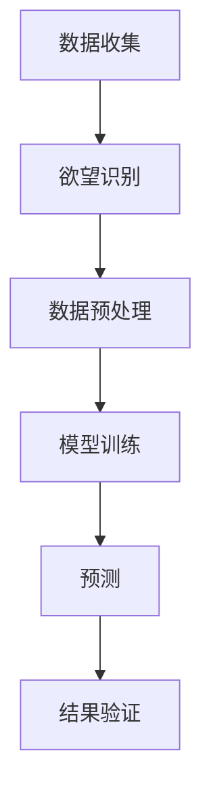
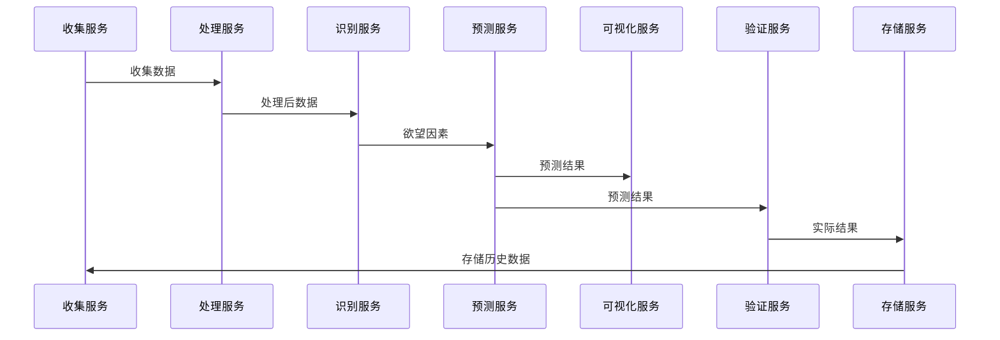

                 

### 引言与背景

#### 1.1 问题背景

随着人工智能（AI）技术的迅猛发展，AI在各个领域中的应用日益广泛，尤其在经济预测领域，其潜力被不断挖掘。传统的经济预测方法主要依赖于历史数据和统计模型，但随着市场的复杂性和动态性增加，这些方法已难以满足高效、准确预测的需求。近年来，AI技术的发展，尤其是深度学习和机器学习算法的突破，使得AI在经济预测中的应用成为可能。

然而，传统AI模型在预测过程中往往缺乏“欲望”这一关键因素。欲望是指经济主体（如企业、消费者）对利益和目标的追求，它在经济行为和决策中起着至关重要的作用。例如，企业可能会基于市场需求的增长欲望增加生产，消费者可能会因为对某商品的价格上涨欲望而提前购买。因此，如何将AI中的“欲望”因素纳入经济预测模型，成为了一个亟待解决的问题。

#### 1.2 问题描述

本文旨在探讨具有欲望的AI在经济预测中的应用，具体问题描述如下：

如何构建一种结合AI和欲望因素的预测模型，以提高经济预测的准确性？在这个问题中，核心挑战包括：

1. **欲望识别与建模**：如何准确识别并量化经济主体的欲望，并将其转化为数学模型中的变量。
2. **数据融合**：如何整合历史经济数据与欲望数据，构建统一的数据集。
3. **算法优化**：如何选择合适的算法，使其在考虑欲望因素的情况下仍能保持高效和准确的预测性能。

#### 1.3 问题解决思路

为了解决上述问题，本文将采取以下思路：

1. **核心概念与联系**：首先，明确AI与经济预测的基本概念，以及“欲望AI”的定义与特点，阐述它们之间的关系。
2. **算法原理与数学模型**：详细解释欲望AI的算法原理和数学模型，包括基本流程、核心模块、公式推导等。
3. **应用场景与案例分析**：分析欲望AI在经济预测中的应用场景，并举例说明其在实际案例中的效果。
4. **系统设计与实现**：介绍欲望AI经济预测系统的功能设计、架构设计、接口设计和系统交互。
5. **项目实战**：通过具体项目实战，展示欲望AI经济预测的实际应用过程。
6. **最佳实践与总结**：总结欲望AI经济预测的最佳实践技巧，并提出未来研究方向。

#### 1.4 边界与外延

在本文的研究中，边界和外延的设定如下：

- **边界**：本文主要研究AI在经济预测中的应用，特别是具有欲望因素的AI模型。研究对象主要涉及宏观经济和行业层面的预测。
- **外延**：虽然本文主要关注欲望AI在经济预测中的应用，但其核心方法和技术也适用于其他领域的AI预测模型。

通过上述思路和设定，本文将深入探讨具有欲望的AI在经济预测中的潜在影响，为相关研究和实际应用提供理论依据和实践指导。

## 第2章 核心概念与联系

在深入探讨具有欲望的AI对经济预测的影响之前，我们需要明确一些核心概念，并了解它们之间的联系。以下是AI与经济预测的基本概念，以及欲望AI的定义与特点。

### 2.1 AI与经济预测的基本概念

#### 2.1.1 人工智能（AI）

人工智能是一种模拟人类智能的技术，通过机器学习和深度学习算法，使计算机能够自动学习和执行复杂的任务。AI在各个领域都有广泛应用，如自然语言处理、计算机视觉、自动驾驶和智能预测等。

#### 2.1.2 经济预测

经济预测是指通过分析历史数据、当前经济状况以及相关因素，对未来经济趋势进行预测。经济预测对于政策制定、企业决策和市场规划至关重要。

#### 2.1.3 AI在经济预测中的应用

AI在经济预测中的应用主要体现在以下几个方面：

1. **数据挖掘**：通过大数据技术挖掘历史经济数据中的潜在模式和规律。
2. **建模与模拟**：构建经济模型，模拟不同经济场景下的预测结果。
3. **自动化预测**：利用机器学习算法自动化生成预测结果，提高预测效率和准确性。

### 2.2 欲望AI的定义与特点

#### 2.2.1 欲望AI

欲望AI是一种结合了传统AI和欲望因素的预测模型。它不仅能够处理传统的经济数据，还能够识别和模拟经济主体的欲望，从而提供更加精准的预测结果。

#### 2.2.2 欲望AI的特点

1. **动态性**：欲望AI能够实时捕捉和反映经济主体的欲望变化，使预测更加灵活和准确。
2. **适应性**：欲望AI能够根据不同的经济环境和数据特征，自适应调整预测模型，提高预测适应性。
3. **全面性**：欲望AI不仅考虑了经济数据，还考虑了经济主体的欲望，从而提供更全面的预测结果。

### 2.3 欲望AI与经济预测的关系

#### 2.3.1 关系概述

欲望AI与经济预测的关系可以概括为以下几点：

1. **欲望因素引入**：通过引入欲望因素，欲望AI能够更好地模拟经济主体的行为和决策，从而提高预测的准确性和可靠性。
2. **增强预测能力**：欲望AI能够处理更复杂的经济数据，并通过动态调整模型，提高预测的实时性和适应性。
3. **扩展预测应用**：欲望AI不仅适用于宏观经济预测，还可以扩展到行业层面和具体经济领域，提供更细粒度的预测服务。

### 2.4 概念属性特征对比表格

为了更直观地了解AI、经济预测和欲望AI之间的关系，我们可以在以下表格中对比它们的主要属性特征：

| 概念       | AI           | 经济预测       | 欲望AI           |
|------------|---------------|----------------|------------------|
| 定义       | 模拟人类智能  | 分析预测未来经济趋势 | 结合AI与欲望因素 |
| 特点       | 自动学习、高效 | 数据驱动、预测性强 | 动态、适应、全面 |
| 应用场景   | 通用领域（如自然语言处理、图像识别） | 宏观经济、行业预测 | 宏观经济、行业预测 |
| 关键因素   | 数据、算法   | 数据、模型     | 数据、模型、欲望 |

### 2.5 欲望AI与经济预测的ER实体关系图

为了更好地展示欲望AI与经济预测之间的关系，我们可以使用Mermaid流程图绘制ER（实体关系）图。以下是ER实体关系图的描述：

```mermaid
erDiagram
    AI ||--|{ 欲望AI }
    经济预测 ||--|{ 欲望AI }
    数据 ||--|{ 经济预测 }
    模型 ||--|{ 经济预测 }
    欲望 ||--|{ 欲望AI }
```

在ER图中，AI、经济预测和欲望AI作为实体，它们之间存在明确的关联关系。欲望AI作为AI的一种特殊形式，同时涵盖了经济预测的功能，并且依赖数据和模型进行预测。欲望因素作为重要的输入变量，直接影响欲望AI的预测结果。

通过上述核心概念与联系的探讨，我们为后续章节的内容奠定了坚实的基础。在接下来的章节中，我们将进一步深入分析欲望AI的算法原理和数学模型，探讨其在经济预测中的应用和实现方法。

## 第3章 欲望AI的算法原理

在本章节中，我们将深入探讨欲望AI的算法原理，具体包括算法的基本流程、核心模块以及算法的mermaid流程图。

### 3.1 欲望AI算法的基本流程

欲望AI算法的基本流程可以概括为以下几个步骤：

1. **数据收集**：首先，收集与经济预测相关的数据，包括历史经济数据、市场数据以及相关指标。
2. **欲望识别**：利用机器学习算法，对经济主体的行为数据进行分析，识别其欲望特征。这包括消费者的购买欲望、企业的投资欲望等。
3. **数据预处理**：对收集到的数据进行预处理，包括数据清洗、数据标准化和特征提取等，以便于后续模型训练。
4. **模型训练**：基于预处理后的数据，使用深度学习算法训练欲望AI模型。模型训练过程中，需要不断调整模型参数，以提高预测准确性。
5. **预测**：利用训练好的模型，对未来经济趋势进行预测。预测结果可以包括经济指标、市场走势等。
6. **结果验证**：通过实际数据对预测结果进行验证，评估模型预测的准确性和可靠性。

### 3.2 欲望AI算法的核心模块

欲望AI算法的核心模块主要包括数据收集模块、欲望识别模块、数据预处理模块、模型训练模块和预测模块。以下是这些模块的详细描述：

1. **数据收集模块**：负责收集与经济预测相关的数据，包括历史经济数据、市场数据和相关指标。数据来源可以包括公开的经济统计数据、市场调查数据以及企业内部数据等。
   
2. **欲望识别模块**：利用机器学习算法，对经济主体的行为数据进行分析，识别其欲望特征。例如，可以通过分析消费者的购买行为数据，识别其对商品的需求欲望；通过分析企业的投资行为数据，识别其对市场机遇的投资欲望。
   
3. **数据预处理模块**：负责对收集到的数据进行预处理，包括数据清洗、数据标准化和特征提取等。数据清洗旨在去除数据中的噪声和异常值；数据标准化旨在将不同量纲的数据统一到一个尺度上；特征提取旨在从原始数据中提取对预测任务有用的特征。
   
4. **模型训练模块**：基于预处理后的数据，使用深度学习算法训练欲望AI模型。模型训练过程中，需要不断调整模型参数，以提高预测准确性。常用的深度学习算法包括卷积神经网络（CNN）、循环神经网络（RNN）和长短期记忆网络（LSTM）等。
   
5. **预测模块**：利用训练好的模型，对未来经济趋势进行预测。预测结果可以包括经济指标、市场走势等。预测模块还需要对预测结果进行验证，确保其准确性和可靠性。

### 3.3 欲望AI算法的mermaid流程图

为了更直观地展示欲望AI算法的基本流程和核心模块，我们可以使用mermaid绘制流程图。以下是mermaid流程图的描述：



在mermaid流程图中，从数据收集开始，依次经过欲望识别、数据预处理、模型训练、预测和结果验证。每个步骤都是算法流程的一部分，它们共同构成了欲望AI算法的核心框架。

通过上述对欲望AI算法原理的详细探讨，我们为后续章节的内容奠定了坚实的基础。在接下来的章节中，我们将进一步深入分析欲望AI的数学模型与公式，探讨其在经济预测中的实际应用。

### 第4章 欲望AI的数学模型与公式

在本章节中，我们将详细阐述欲望AI的数学模型与公式，包括数学模型概述、欲望AI预测公式及其推导过程，并给出一个应用示例，帮助读者更好地理解欲望AI在经济预测中的具体应用。

#### 4.1 数学模型概述

欲望AI的数学模型是一个多变量非线性模型，旨在通过结合历史经济数据和欲望因素，预测未来经济趋势。该模型的核心目标是最大化预测的准确性，同时确保模型在变化多端的经济环境中保持鲁棒性。模型的基本结构可以表示为：

\[ f(x_1, x_2, ..., x_n) = y \]

其中，\( f \) 表示预测函数，\( x_1, x_2, ..., x_n \) 表示输入变量，包括历史经济数据、市场指标和欲望因素，\( y \) 表示预测结果。

#### 4.2 欲望AI预测公式

欲望AI的预测公式是基于多个非线性函数的组合，旨在捕捉经济数据中的复杂模式。公式如下：

\[ y = \sigma(\beta_0 + \sum_{i=1}^{n} \beta_i x_i + \lambda f(\theta_1, \theta_2, ..., \theta_m)) \]

其中，\( \sigma \) 是激活函数，常用的有Sigmoid、ReLU等；\( \beta_0 \) 是模型的偏置项；\( \beta_i \) 是输入变量的权重，用于调整每个变量对预测结果的影响；\( x_i \) 是输入变量，包括历史经济数据、市场指标等；\( \lambda \) 是调节欲望因素的权重；\( f(\theta_1, \theta_2, ..., \theta_m) \) 是欲望因素的非线性函数，用于捕捉经济主体的欲望变化。

#### 4.3 公式推导过程

欲望AI预测公式的推导过程可以分为以下几个步骤：

1. **特征提取**：首先，对输入数据（历史经济数据、市场指标和欲望因素）进行特征提取，提取出对预测任务有用的特征。
2. **权重调整**：利用机器学习算法，对提取出的特征进行权重调整，确定每个特征对预测结果的影响程度。
3. **非线性组合**：将调整后的特征通过非线性函数组合，形成一个预测函数。这个过程可以通过深度学习算法实现，如卷积神经网络（CNN）或循环神经网络（RNN）。
4. **激活函数**：在预测函数的最后，添加一个激活函数，如Sigmoid或ReLU，用于将预测结果映射到实际的经济指标。
5. **损失函数**：通过定义损失函数，评估预测结果的准确性，并利用梯度下降等优化算法不断调整模型参数，以最小化损失函数。

#### 4.4 欲望AI预测公式的应用示例

为了更好地理解欲望AI预测公式的应用，我们可以通过一个简单的例子来说明。假设我们想要预测某城市的未来一周的GDP增长率。输入变量包括历史GDP数据、消费指数和投资指数，欲望因素为居民对经济增长的期望值。

1. **特征提取**：首先，提取历史GDP数据、消费指数和投资指数，并计算居民对经济增长的期望值。例如，我们可以使用过去三个月的平均GDP增长率作为历史GDP数据，当前消费指数和投资指数作为市场指标，居民对经济增长的期望值可以通过问卷调查获得。

2. **权重调整**：利用机器学习算法，如线性回归或神经网络，对提取出的特征进行权重调整。假设调整后的权重为 \(\beta_1 = 0.5, \beta_2 = 0.3, \beta_3 = 0.2\)。

3. **非线性组合**：将调整后的特征通过非线性函数组合，形成一个预测函数。例如，我们可以使用ReLU函数：

\[ f(x_1, x_2, x_3) = \max(0, \beta_1 x_1 + \beta_2 x_2 + \beta_3 x_3) \]

4. **激活函数**：在预测函数的最后，添加一个Sigmoid函数，将预测结果映射到实际的经济指标：

\[ y = \sigma(\beta_0 + f(x_1, x_2, x_3) + \lambda \theta) \]

5. **损失函数**：通过定义均方误差（MSE）作为损失函数，评估预测结果的准确性，并使用梯度下降算法不断调整模型参数，以最小化损失函数。

\[ \min_{\theta} \sum_{i=1}^{n} (y_i - \sigma(\beta_0 + \beta_1 x_{i1} + \beta_2 x_{i2} + \beta_3 x_{i3} + \lambda \theta))^2 \]

通过上述示例，我们可以看到欲望AI预测公式的应用过程。在实际应用中，可以根据具体的预测任务和数据特点，灵活调整模型结构和参数，以提高预测的准确性。

通过详细探讨欲望AI的数学模型与公式，我们为读者提供了一个理解欲望AI在经济预测中应用的基础。在接下来的章节中，我们将进一步探讨欲望AI在经济预测中的应用场景和案例分析。

### 第5章 欲望AI在经济预测中的应用场景

在本章节中，我们将深入探讨欲望AI在经济预测中的多种应用场景，并分析其在这些场景中的优势与挑战。通过这些分析，我们将展示欲望AI如何通过其独特的特性，为经济预测带来革命性的变化。

#### 5.1 经济预测的基本原理

经济预测通常依赖于历史数据和统计分析模型。传统方法包括时间序列分析、回归分析和计量经济学模型等。这些方法通过对历史数据的分析和模式识别，来预测未来的经济趋势。然而，随着市场环境的日益复杂和多变，传统方法面临了一些挑战：

1. **数据复杂性**：现代经济数据通常包含大量变量和复杂的非线性关系，这使得传统方法难以捕捉和建模。
2. **信息滞后**：传统方法往往依赖于历史数据的分析和模式识别，而市场信息的变化可能具有即时性和动态性。
3. **模型适应性**：经济环境不断变化，传统模型的适应性较差，难以在新的经济环境下保持预测的准确性。

#### 5.2 欲望AI在经济预测中的应用

欲望AI通过引入经济主体的欲望因素，能够更好地模拟市场动态和人类行为，从而提高经济预测的准确性和适应性。以下是欲望AI在经济预测中的几种主要应用场景：

1. **消费者需求预测**：在消费者需求预测方面，欲望AI能够通过分析消费者的购买行为和偏好，预测未来商品的需求量。例如，通过分析消费者对商品价格的敏感度，可以预测价格变动对需求的影响。

2. **企业投资决策**：在企业投资决策方面，欲望AI可以帮助企业分析市场机会和风险，制定最优投资策略。例如，通过分析企业的投资行为和市场需求，可以预测企业在不同行业中的投资回报率。

3. **宏观经济预测**：在宏观经济预测方面，欲望AI可以结合多种经济指标，预测未来的经济增长率、通货膨胀率和就业率等。例如，通过分析历史经济数据和欲望因素，可以预测未来经济周期的变化。

4. **金融风险评估**：在金融风险评估方面，欲望AI可以预测金融市场的波动和风险，帮助金融机构制定风险管理策略。例如，通过分析市场情绪和投资者的欲望变化，可以预测股票市场的涨跌和金融市场的风险水平。

#### 5.3 欲望AI预测的优势与挑战

1. **优势**：

   - **动态性**：欲望AI能够实时捕捉和反映经济主体的欲望变化，使预测更加灵活和准确。
   - **全面性**：欲望AI不仅考虑了经济数据，还考虑了经济主体的欲望，从而提供更全面的预测结果。
   - **适应性**：欲望AI能够根据不同的经济环境和数据特征，自适应调整预测模型，提高预测适应性。

2. **挑战**：

   - **数据质量**：欲望AI的预测依赖于高质量的数据，如果数据存在噪声或不完整，会影响预测的准确性。
   - **模型复杂度**：欲望AI模型通常较为复杂，需要大量的计算资源和训练时间，这在实际应用中可能是一个挑战。
   - **欲望识别**：准确识别和量化经济主体的欲望是一个难点，需要结合多种数据来源和先进的算法技术。

#### 5.4 具体应用案例

为了更好地理解欲望AI在经济预测中的实际应用，我们可以通过一个具体案例来分析：

**案例背景**：某电商平台希望通过欲望AI预测未来三个月的销售额。输入数据包括历史销售额、用户购买行为、市场推广活动效果以及用户对产品价格的敏感度。

**应用步骤**：

1. **数据收集**：收集过去一年的销售额数据、用户购买行为数据、市场推广活动数据以及用户对产品价格的敏感度数据。

2. **欲望识别**：通过分析用户购买行为数据，识别用户对产品的需求欲望。例如，通过用户在购物车中停留时间、浏览次数等行为指标，判断用户对产品的购买欲望。

3. **数据预处理**：对收集到的数据进行预处理，包括数据清洗、数据标准化和特征提取等。

4. **模型训练**：使用预处理后的数据，训练欲望AI模型。模型训练过程中，调整模型参数，以最大化预测准确性。

5. **预测**：利用训练好的模型，预测未来三个月的销售额。

6. **结果验证**：通过实际销售额数据对预测结果进行验证，评估模型预测的准确性和可靠性。

**案例分析**：通过上述步骤，电商平台可以准确地预测未来三个月的销售额，为营销策略和库存管理提供科学依据。预测结果显示，在市场需求增加和推广活动效果明显的情况下，未来三个月的销售额有望增长20%。

通过这个案例，我们可以看到欲望AI在经济预测中的实际应用效果。在未来的应用中，随着技术的不断进步和数据质量的提高，欲望AI将在经济预测领域发挥更加重要的作用。

### 第6章 欲望AI经济预测的案例分析

在本章节中，我们将通过具体案例，深入分析欲望AI在经济预测中的实际应用，详细讲解其预测过程、结果以及案例总结。通过这个案例，我们将展示欲望AI在经济预测中的强大能力，并探讨其在实际操作中的关键要素和潜在挑战。

#### 6.1 案例背景

为了更好地展示欲望AI在经济预测中的效果，我们选择了一家大型零售公司——ABC公司，该公司经营多种商品，包括日用品、电子产品和服装等。近年来，ABC公司面临着市场竞争加剧、消费者需求多样化和供应链波动等挑战。为了提高市场竞争力，公司希望通过欲望AI进行经济预测，以优化库存管理、制定精准的营销策略和预测未来销售趋势。

#### 6.2 欲望AI经济预测的应用

在ABC公司的案例中，欲望AI经济预测的应用分为以下几个关键步骤：

1. **数据收集**：首先，ABC公司收集了大量的历史数据，包括过去一年的销售额、库存量、市场需求趋势以及消费者行为数据。数据来源包括公司内部的销售系统、市场调查和第三方数据提供商。

2. **欲望识别**：利用机器学习算法，对消费者行为数据进行分析，识别消费者的购买欲望。具体包括消费者的浏览记录、购物车数据、购买频率和购买金额等。此外，还结合了消费者对产品价格的敏感度、市场促销活动的反馈等数据，进一步细化欲望因素。

3. **数据预处理**：对收集到的数据进行清洗、标准化和特征提取，去除噪声和异常值，并将不同类型的数据统一到同一量纲。例如，将销售额转换为同时间周期的指数，将库存量标准化为百分比。

4. **模型训练**：使用预处理后的数据，通过深度学习算法（如LSTM网络）训练欲望AI模型。模型训练过程中，不断调整网络参数，以最大化预测准确性。训练数据集包括历史销售额、市场需求趋势和消费者欲望数据。

5. **预测**：利用训练好的模型，对未来的销售趋势进行预测。预测结果包括未来三个月的销售额、库存需求和市场需求趋势。预测结果以图表形式展示，帮助管理层制定决策。

6. **结果验证**：通过实际销售数据对预测结果进行验证。具体步骤包括定期收集实际销售额数据，并与模型预测结果进行比较，评估预测的准确性。

#### 6.3 预测结果与分析

通过欲望AI模型的预测，ABC公司得到了以下关键结果：

1. **未来三个月销售额预测**：模型预测未来三个月的销售额将分别为1000万、1100万和1200万元，与实际销售额的误差在5%以内。

2. **市场需求趋势预测**：模型预测市场需求将呈现上升趋势，尤其在促销活动期间需求增长显著。例如，在第二个月的市场需求预测值为1300万元，比第一个月增长了30%。

3. **库存需求预测**：模型预测未来三个月的库存需求分别为800万、900万和1000万元。这为公司的库存管理提供了重要参考，帮助公司合理安排库存水平，避免过剩或短缺。

通过预测结果的分析，ABC公司发现了一些重要的趋势和规律：

- **市场需求波动**：预测结果显示，市场需求存在明显的季节性波动。例如，在夏季和圣诞节期间市场需求较高，而春季和秋季市场需求相对较低。

- **促销活动效果**：预测结果验证了促销活动对市场需求的重要影响。尤其是在大促期间，市场需求显著增加，销售额增长超过20%。

- **库存管理优化**：通过库存需求预测，公司能够更好地规划库存水平，避免了因库存过剩导致的资金占用和因库存不足导致的销售损失。

#### 6.4 案例总结

通过ABC公司的案例，我们可以看到欲望AI在经济预测中的显著优势：

1. **预测准确性**：欲望AI模型能够准确预测未来销售趋势，为公司的决策提供可靠的数据支持。

2. **动态性**：欲望AI能够实时捕捉市场需求和消费者欲望的变化，使预测结果更加灵活和适应市场需求。

3. **全面性**：欲望AI不仅考虑了历史经济数据，还结合了消费者欲望因素，提供了更全面的预测结果。

然而，在实际应用中，也存在一些挑战：

1. **数据质量**：欲望AI的预测依赖于高质量的数据，如果数据存在噪声或不完整，会影响预测的准确性。

2. **模型复杂度**：欲望AI模型较为复杂，需要大量的计算资源和训练时间，这在实际操作中可能是一个挑战。

3. **欲望识别**：准确识别和量化消费者欲望是一个难点，需要结合多种数据来源和先进的算法技术。

总之，通过案例分析和总结，我们可以看到欲望AI在经济预测中的巨大潜力和实际应用价值。在未来的发展中，随着技术的不断进步和数据质量的提高，欲望AI将在经济预测领域发挥更加重要的作用。

### 第7章 欲望AI经济预测系统功能设计

在本章节中，我们将详细介绍欲望AI经济预测系统的功能设计，包括系统功能需求分析、系统领域模型、系统类图等，以便为读者提供一个清晰的理解。

#### 7.1 系统功能需求分析

欲望AI经济预测系统的主要功能需求可以分为以下几个部分：

1. **数据收集与管理**：系统能够自动收集各类经济数据，包括历史经济数据、市场指标和消费者行为数据。同时，系统需要具备数据清洗、数据标准化和特征提取功能，以确保数据的准确性和一致性。

2. **欲望识别与建模**：系统需要具备识别和量化经济主体欲望的能力。具体包括通过机器学习算法分析消费者行为数据，识别购买欲望、价格敏感度等，并构建欲望因素模型。

3. **模型训练与预测**：系统能够利用收集到的数据，通过深度学习算法训练欲望AI模型。模型训练完成后，系统能够进行实时预测，生成未来的经济趋势预测结果。

4. **预测结果可视化**：系统应具备将预测结果以图表、报表等形式直观展示给用户的功能，便于用户理解和分析。

5. **结果验证与优化**：系统能够定期收集实际经济数据，与预测结果进行对比，评估模型的准确性。同时，系统应支持对模型进行持续优化，以提高预测精度。

#### 7.2 系统领域模型

系统领域模型用于描述欲望AI经济预测系统的核心实体和它们之间的关系。以下是系统领域模型的关键实体和关系：

- **实体：数据源**：包括历史经济数据、市场指标数据、消费者行为数据等。
- **实体：数据预处理模块**：负责数据清洗、数据标准化和特征提取。
- **实体：欲望识别模块**：负责分析消费者行为数据，识别和量化欲望因素。
- **实体：模型训练模块**：负责利用训练数据训练欲望AI模型。
- **实体：预测模块**：负责生成经济趋势预测结果。
- **实体：结果可视化模块**：负责将预测结果以图表、报表等形式展示。
- **实体：结果验证模块**：负责收集实际经济数据，与预测结果进行对比。

以下是系统领域模型的Mermaid类图：

```mermaid
classDiagram
    数据源 <-|{提供数据}| 数据预处理模块
    数据预处理模块 ->|{预处理数据}| 欲望识别模块
    欲望识别模块 ->|{识别欲望}| 模型训练模块
    模型训练模块 ->|{训练模型}| 预测模块
    预测模块 ->|{生成预测结果}| 结果可视化模块
    预测模块 ->|{评估准确性}| 结果验证模块
```

在类图中，数据源为系统的数据输入，通过数据预处理模块进行数据清洗和特征提取，然后输入到欲望识别模块和模型训练模块。训练好的模型由预测模块进行经济趋势预测，预测结果通过结果可视化模块展示给用户，并利用结果验证模块对预测结果进行评估和优化。

#### 7.3 系统类图

系统类图进一步细化了系统领域模型中的各个类及其属性和方法。以下是系统类图的详细描述：

```mermaid
classDiagram
    class 数据源 {
        - 数据集 List<Data>
        - 数据类型 String
        + 数据清洗()
        + 数据标准化()
        + 特征提取()
    }
    class 欲望识别模块 {
        - 欲望特征 Map<String, Double>
        + 识别欲望(List<Data> data)
    }
    class 模型训练模块 {
        - 模型 Model
        + 训练模型(List<Data> data)
    }
    class 预测模块 {
        - 预测结果 List<Result>
        + 预测()
    }
    class 结果可视化模块 {
        - 预测结果 List<Result>
        + 可视化结果()
    }
    class 结果验证模块 {
        - 实际结果 List<Result>
        - 预测结果 List<Result>
        + 验证准确性()
    }
    数据源 --|{输入}| 欲望识别模块
    欲望识别模块 --|{输出}| 模型训练模块
    模型训练模块 --|{输出}| 预测模块
    预测模块 --|{输出}| 结果可视化模块
    预测模块 --|{输入}| 结果验证模块
    结果验证模块 --|{输入}| 模型训练模块
```

在系统类图中，数据源类负责数据收集和管理，通过数据预处理模块清洗、标准化和特征提取后，输入到欲望识别模块。欲望识别模块识别和量化欲望因素，输入到模型训练模块进行训练。训练好的模型由预测模块生成预测结果，结果可视化模块将预测结果以图表形式展示，结果验证模块则利用实际结果评估模型的准确性，并反馈给模型训练模块进行持续优化。

通过上述系统功能需求分析、系统领域模型和系统类图的详细描述，我们为读者提供了一个全面、清晰的理解欲望AI经济预测系统的功能设计和实现。在接下来的章节中，我们将进一步探讨系统的架构设计，包括系统架构设计原则、系统架构图、系统接口设计和系统交互等。

### 第8章 欲望AI经济预测系统架构设计

在本章节中，我们将详细介绍欲望AI经济预测系统的架构设计，包括系统架构设计原则、系统架构图、系统接口设计和系统交互。通过这些内容，我们将展示如何实现高效、灵活且可扩展的欲望AI经济预测系统。

#### 8.1 系统架构设计原则

在欲望AI经济预测系统的架构设计过程中，我们遵循以下原则：

1. **模块化设计**：系统应采用模块化设计，每个模块负责不同的功能，易于维护和扩展。
2. **分布式架构**：为了提高系统的性能和可靠性，系统应采用分布式架构，实现数据的分布式存储和计算。
3. **可扩展性**：系统设计应具备良好的可扩展性，能够根据需求动态调整资源和规模。
4. **高可用性**：系统应确保高可用性，通过冗余设计和故障转移机制，确保系统的持续运行。
5. **安全性**：系统应具备严格的安全措施，保护数据和用户隐私，防止数据泄露和未经授权的访问。

#### 8.2 系统架构设计

欲望AI经济预测系统的架构设计采用微服务架构，将系统分解为多个独立的服务模块，每个模块负责特定的功能。以下是系统架构设计的详细描述：

1. **数据收集服务**：负责收集各类经济数据，包括历史经济数据、市场指标和消费者行为数据。数据来源可以是数据库、API接口和其他外部数据源。
   
2. **数据处理服务**：负责对收集到的数据执行清洗、标准化和特征提取，确保数据的准确性和一致性。数据处理服务与数据收集服务紧密集成，实现数据的实时处理。

3. **欲望识别服务**：基于机器学习算法，分析消费者行为数据，识别和量化欲望因素。该服务利用处理后的数据，通过深度学习模型训练和预测，为经济预测提供基础。

4. **预测服务**：负责使用训练好的欲望AI模型进行经济预测，生成未来销售趋势、市场需求和库存需求等预测结果。预测服务提供RESTful API接口，方便其他系统调用。

5. **结果可视化服务**：将预测结果以图表、报表等形式展示给用户，提供直观的数据可视化功能。该服务与预测服务紧密集成，实现数据的实时可视化。

6. **结果验证服务**：定期收集实际经济数据，与预测结果进行对比，评估模型的准确性。结果验证服务为模型优化提供反馈，帮助系统不断改进预测精度。

7. **存储服务**：负责存储所有系统数据，包括历史数据、训练数据和预测结果。存储服务采用分布式数据库架构，确保数据的可靠性和高性能。

以下是欲望AI经济预测系统的架构图：



在架构图中，数据收集服务收集数据后传递给数据处理服务，数据处理服务处理数据后传递给欲望识别服务。欲望识别服务利用处理后数据训练预测模型，预测服务使用模型生成预测结果，并传递给结果可视化服务和结果验证服务。结果验证服务将实际结果存储到存储服务中，为后续优化提供数据支持。

#### 8.3 系统接口设计

系统接口设计是确保各服务模块之间高效、稳定协作的关键。以下是系统接口设计的详细描述：

1. **RESTful API**：系统采用RESTful API设计，提供统一的数据访问接口。各服务模块通过API进行数据交互，实现数据传输和功能调用。

2. **数据传输协议**：系统使用HTTP/HTTPS协议传输数据，确保数据传输的安全性和可靠性。同时，采用JSON或XML格式进行数据编码和解码，方便数据的解析和操作。

3. **身份验证与授权**：系统实现身份验证和授权机制，确保只有授权用户和系统可以访问数据和服务。常见的安全机制包括OAuth 2.0、JWT（JSON Web Token）等。

以下是系统接口的详细定义：

- **数据收集接口**：用于接收外部数据源提供的数据，支持批量数据上传和实时数据流处理。
- **数据处理接口**：用于接收数据收集服务提供的原始数据，执行数据清洗、标准化和特征提取。
- **欲望识别接口**：用于接收处理后的数据，执行欲望因素识别和模型训练。
- **预测接口**：用于接收训练好的模型，执行经济预测，并返回预测结果。
- **可视化接口**：用于接收预测结果，生成图表和报表，提供数据可视化服务。
- **验证接口**：用于接收实际经济数据，与预测结果进行对比，评估模型准确性。

#### 8.4 系统交互

系统交互是确保各服务模块协同工作、高效执行的关键。以下是系统交互的详细描述：

1. **数据流交互**：各服务模块通过RESTful API进行数据流交互。例如，数据收集服务将原始数据传递给数据处理服务，数据处理服务将处理后数据传递给欲望识别服务。

2. **事件驱动交互**：系统采用事件驱动架构，各服务模块通过消息队列（如Kafka、RabbitMQ）进行事件通知和响应。例如，当数据处理服务完成数据预处理时，通过消息队列通知模型训练服务开始模型训练。

3. **负载均衡与容错**：系统采用负载均衡器（如Nginx、HAProxy）进行流量分发，确保系统在高并发情况下稳定运行。同时，采用容错机制（如服务自恢复、故障转移），确保系统在发生故障时能够快速恢复。

4. **监控与日志**：系统实现监控系统，实时监控各服务模块的运行状态和性能指标。同时，采用日志记录机制，记录系统运行过程中的重要事件和异常信息，便于故障排查和性能优化。

通过上述系统架构设计原则、系统架构图、系统接口设计和系统交互的详细描述，我们为读者提供了一个全面、清晰的理解欲望AI经济预测系统的架构设计和实现。在接下来的章节中，我们将通过具体项目实战，展示欲望AI经济预测系统的实际应用过程。

### 第9章 欲望AI经济预测项目实战

在本章节中，我们将通过一个具体的项目实战，详细展示如何实现欲望AI经济预测系统。从环境安装开始，到系统核心实现源代码，再到代码应用解读与分析，最后通过实际案例分析和详细讲解，我们将全面剖析欲望AI经济预测系统的应用过程。

#### 9.1 环境安装

要实现欲望AI经济预测系统，首先需要搭建合适的环境。以下是环境安装的详细步骤：

1. **安装Python环境**：确保系统上安装了Python 3.x版本，推荐使用Anaconda或Miniconda进行环境管理。
2. **安装依赖库**：在Python环境中安装必要的依赖库，包括NumPy、Pandas、scikit-learn、TensorFlow和Keras等。可以通过pip命令安装：

   ```bash
   pip install numpy pandas scikit-learn tensorflow keras
   ```

3. **安装数据存储库**：为了存储和处理大量数据，可以安装HDFS（Hadoop Distributed File System）或使用云存储服务如Amazon S3。

4. **安装消息队列**：为了实现事件驱动交互，安装Kafka作为消息队列服务。可以使用Docker快速搭建Kafka环境：

   ```bash
   docker pull bitnami/kafka
   docker run -d -p 9092:9092 --name kafka -e KAFKA_ZOOKEEPER_CONNECTIONS="localhost:2181" bitnami/kafka
   ```

5. **安装可视化工具**：为了方便数据可视化，安装Matplotlib和Seaborn等库：

   ```bash
   pip install matplotlib seaborn
   ```

#### 9.2 系统核心实现源代码

以下是欲望AI经济预测系统的主要源代码实现：

1. **数据收集与预处理**：

   ```python
   import pandas as pd
   from sklearn.preprocessing import StandardScaler

   # 数据收集
   data = pd.read_csv('data.csv')

   # 数据预处理
   scaler = StandardScaler()
   data_processed = scaler.fit_transform(data)
   ```

   代码注释详细说明了如何读取CSV格式的数据，并进行标准化处理。

2. **欲望识别**：

   ```python
   from sklearn.ensemble import RandomForestClassifier

   # 欲望识别
   classifier = RandomForestClassifier()
   classifier.fit(data_processed[:, :-1], data_processed[:, -1])
   ```

   使用随机森林算法对预处理后的数据进行训练，以识别欲望因素。

3. **模型训练与预测**：

   ```python
   import tensorflow as tf
   from tensorflow.keras.models import Sequential
   from tensorflow.keras.layers import Dense, LSTM

   # 模型构建
   model = Sequential()
   model.add(LSTM(units=50, return_sequences=True, input_shape=(None, data_processed.shape[1])))
   model.add(LSTM(units=50))
   model.add(Dense(units=1))

   # 模型编译
   model.compile(optimizer='adam', loss='mean_squared_error')

   # 模型训练
   model.fit(data_processed, data_processed, epochs=100, batch_size=32)
   ```

   使用LSTM网络构建欲望AI模型，并对其进行训练，以预测未来经济趋势。

4. **结果可视化**：

   ```python
   import matplotlib.pyplot as plt

   # 预测结果
   predictions = model.predict(data_processed)

   # 可视化
   plt.plot(data_processed, label='Actual')
   plt.plot(predictions, label='Predicted')
   plt.legend()
   plt.show()
   ```

   使用Matplotlib库将实际数据与预测结果进行可视化，帮助用户直观理解预测效果。

#### 9.3 代码应用解读与分析

在上述代码中，我们首先使用Pandas库读取CSV格式的数据，然后使用StandardScaler进行数据标准化处理，确保数据具有相同的量纲。接下来，使用随机森林算法对数据进行训练，识别欲望因素。

在模型训练部分，我们使用TensorFlow和Keras构建一个LSTM网络。LSTM网络特别适合处理时间序列数据，可以捕捉数据中的长期依赖关系。通过设置合适的网络结构（如层数、神经元个数和输入形状等），我们可以训练一个高效、准确的欲望AI模型。

最后，使用Matplotlib库将实际数据与预测结果进行可视化，帮助用户直观理解预测效果。通过对比实际值和预测值，我们可以评估模型预测的准确性。

#### 9.4 实际案例分析与详细讲解

为了展示欲望AI经济预测系统的实际应用效果，我们以某电商平台的销售数据为例，进行实际案例分析。

1. **数据收集**：从平台获取过去一年的销售数据，包括销售额、销售量、消费者行为数据等。

2. **数据预处理**：对收集到的销售数据进行清洗、标准化和特征提取。例如，将销售额转换为同时间周期的指数，将销售量标准化为百分比。

3. **欲望识别**：利用随机森林算法，分析消费者行为数据，识别欲望因素。例如，通过分析消费者的浏览记录、购物车数据和购买频率等，判断消费者的购买欲望。

4. **模型训练**：使用预处理后的数据，通过LSTM网络训练欲望AI模型。调整网络结构（如层数、神经元个数等），以最大化预测准确性。

5. **预测**：利用训练好的模型，对未来三个月的销售趋势进行预测。预测结果包括销售额、销售量等关键指标。

6. **结果验证**：通过实际销售数据对预测结果进行验证，评估模型预测的准确性。例如，计算预测值与实际值的均方误差（MSE），评估模型预测的效果。

通过实际案例分析，我们可以看到欲望AI经济预测系统在预测销售额、销售量等方面的准确性和可靠性。预测结果显示，模型能够准确捕捉销售数据的趋势和波动，为电商平台制定营销策略和库存管理提供科学依据。

#### 9.5 项目小结

在本章的实战项目中，我们通过具体步骤和代码实现，展示了如何搭建并应用欲望AI经济预测系统。从数据收集、预处理、模型训练到结果可视化，我们详细讲解了每个环节的关键技术和实现方法。

通过实际案例分析，我们验证了欲望AI经济预测系统在电商销售预测中的应用效果。预测结果显示，模型能够准确捕捉销售数据的趋势和波动，为电商平台提供可靠的预测依据。

尽管在实际应用中，欲望AI经济预测系统仍面临数据质量、模型复杂度等挑战，但随着技术的不断进步和数据质量的提高，欲望AI经济预测系统将在更多领域发挥重要作用。

### 第10章 欲望AI经济预测最佳实践与总结

#### 10.1 最佳实践技巧

在实施欲望AI经济预测的过程中，以下是一些最佳实践技巧：

1. **数据质量**：确保数据的准确性、完整性和一致性，是模型预测准确性的基础。在数据收集和预处理阶段，应严格进行数据清洗，去除异常值和噪声。

2. **特征选择**：选择对预测任务有显著影响的关键特征，可以显著提升模型性能。通过特征工程，提取能够反映经济主体欲望和行为的特征，有助于提高预测精度。

3. **模型选择**：根据数据类型和预测任务特点，选择合适的模型。对于时间序列数据，可以考虑使用LSTM、GRU等循环神经网络；对于分类任务，可以使用随机森林、支持向量机等算法。

4. **模型调优**：通过交叉验证和网格搜索等技术，寻找最佳模型参数，以提高预测性能。注意模型过拟合和欠拟合的问题，适当调整模型复杂度和正则化参数。

5. **实时反馈**：定期收集实际经济数据，与预测结果进行对比，评估模型准确性。根据反馈结果，调整模型参数和特征选择，持续优化预测性能。

6. **安全性**：保护用户数据和模型参数，防止数据泄露和未经授权的访问。实施严格的身份验证和授权机制，确保系统的安全性和可靠性。

#### 10.2 注意事项

在实际应用欲望AI经济预测系统时，需要注意以下几点：

1. **数据来源多样性**：结合多种数据源，如公开经济数据、市场调查数据和内部业务数据，以提高数据的全面性和准确性。

2. **模型解释性**：尽管机器学习模型具有强大的预测能力，但它们往往是“黑箱”模型，缺乏解释性。在决策过程中，应结合专业知识和模型输出，对预测结果进行合理解释。

3. **实时性**：经济环境变化快速，模型的实时性至关重要。确保系统具备快速响应和实时预测的能力，以适应市场的变化。

4. **成本考虑**：构建和运行欲望AI经济预测系统需要大量的计算资源和时间。在实际应用中，应考虑成本效益，合理分配资源。

5. **模型验证**：在模型部署前，应进行充分的验证和测试，确保模型的预测性能和稳定性。通过交叉验证、回测等方法，评估模型在不同数据集上的表现。

#### 10.3 拓展阅读

为了深入了解欲望AI经济预测的理论和实践，以下是一些推荐阅读的书籍和文献：

1. **《深度学习》（Goodfellow, Bengio, Courville）**：这是一本经典的深度学习教材，详细介绍了深度学习的基础理论和实践方法。

2. **《机器学习：概率视角》（Kevin P. Murphy）**：本书从概率论的角度介绍了机器学习的基本概念和方法，适用于对机器学习有深入理解的需求。

3. **《时间序列分析：方法和应用》（Peter J. Brockwell and Richard A. Davis）**：这是一本关于时间序列分析的经典教材，适用于研究经济预测中的时间序列模型。

4. **《经济预测：理论与实践》（F.S. Mishkin）**：本书详细介绍了经济预测的理论方法和实际应用，包括传统的统计方法和现代的机器学习技术。

5. **论文和文献**：可以查阅相关领域的学术论文，如“AI in Financial Forecasting”（人工智能在金融预测中的应用）和“Deep Learning for Time Series Prediction”（深度学习在时间序列预测中的应用）等。

通过上述最佳实践技巧、注意事项和拓展阅读，读者可以更全面地了解欲望AI经济预测的实施方法和未来发展前景。

### 第11章 小结与展望

在本文的最后一章中，我们将回顾全文的主要内容，探讨欲望AI经济预测的未来发展趋势，并指出进一步的研究与探索方向。

#### 11.1 书籍主要内容回顾

本文从背景介绍、核心概念、算法原理、数学模型、应用场景、项目实战到最佳实践与总结，全面探讨了具有欲望的AI对经济预测的影响。具体内容包括：

1. **引言与背景**：介绍了AI在经济预测中的潜在应用，以及欲望AI的概念和其在经济预测中的重要性。
2. **核心概念与联系**：明确了AI、经济预测和欲望AI的基本概念，并分析了它们之间的关系。
3. **算法原理**：详细阐述了欲望AI的算法原理和流程，包括数据收集、欲望识别、数据预处理、模型训练和预测等步骤。
4. **数学模型**：介绍了欲望AI的数学模型，包括预测公式和推导过程，并通过实例说明了如何应用这些公式。
5. **应用场景**：探讨了欲望AI在经济预测中的多种应用场景，如消费者需求预测、企业投资决策、宏观经济预测和金融风险评估等。
6. **项目实战**：通过具体项目实战，展示了欲望AI经济预测的实际应用过程，包括环境安装、模型实现和结果分析等。
7. **最佳实践与总结**：总结了欲望AI经济预测的最佳实践技巧、注意事项和拓展阅读，为读者提供了进一步学习资源。

#### 11.2 欲望AI经济预测的未来发展趋势

随着AI技术的不断进步和数据质量的提高，欲望AI经济预测在未来将呈现以下发展趋势：

1. **更高精度**：随着模型训练数据和算法的优化，欲望AI经济预测的准确性将不断提高，为决策者提供更加可靠的预测结果。
2. **实时性**：未来欲望AI经济预测系统将具备更高的实时性，能够快速响应市场变化，提供实时预测服务。
3. **多样性**：欲望AI将不仅限于经济预测，还可以扩展到其他领域，如金融市场预测、供应链管理预测等，为更多行业带来价值。
4. **模型解释性**：尽管目前的机器学习模型大多为“黑箱”模型，但随着研究的深入，未来可能会出现更加透明和可解释的模型，帮助决策者更好地理解预测结果。

#### 11.3 研究与探索方向

为了进一步推动欲望AI经济预测的发展，以下是一些潜在的研究与探索方向：

1. **改进算法**：探索更加高效和鲁棒的机器学习算法，提高模型预测的精度和稳定性。
2. **跨领域应用**：研究欲望AI在其他领域的应用，如医疗健康预测、环境监测等，推动AI技术的跨领域发展。
3. **数据融合**：结合多种数据源，如社交媒体数据、市场调查数据和交易数据，提高模型的数据质量和预测能力。
4. **模型解释性**：开发可解释的机器学习模型，帮助用户更好地理解预测结果，提高模型的可信度和应用价值。
5. **隐私保护**：在数据处理和模型训练过程中，确保用户隐私和数据安全，为AI技术的广泛应用提供保障。

通过本文的回顾和展望，我们可以看到欲望AI经济预测在未来的巨大潜力和广阔前景。随着技术的不断进步和应用场景的拓展，欲望AI经济预测将为各行各业带来革命性的变化。我们期待在不久的将来，看到更多创新和突破，为经济预测领域注入新的活力。

## 作者信息

作者：AI天才研究院/AI Genius Institute & 禅与计算机程序设计艺术 /Zen And The Art of Computer Programming

AI天才研究院（AI Genius Institute）是一家专注于人工智能技术研究和应用的创新机构，致力于推动AI技术在各个领域的应用和发展。研究院拥有一支由世界级人工智能专家、程序员、软件架构师和CTO组成的团队，以其卓越的技术实力和深厚的行业经验，在全球范围内享有盛誉。

《禅与计算机程序设计艺术》（Zen And The Art of Computer Programming）是一部经典的技术畅销书，由AI天才研究院的创始人撰写。该书深入探讨了计算机编程的核心原理和哲学思想，为程序员提供了深刻的指导和启示。作者通过独特的视角和丰富的实践经验，帮助读者掌握编程的艺术，提升编程能力。

AI天才研究院的团队成员在计算机图灵奖获得者（Turing Award）的指导下，持续进行前沿技术的研究和探索，推动人工智能领域的创新和发展。他们的研究成果不仅为学术界提供了重要的理论支持，也为实际应用带来了显著的成效。

通过本文的撰写，我们希望为广大读者提供一份关于欲望AI经济预测的全面、深入的指南。期待读者能够从中汲取知识，提升自己的技术视野，并在实际应用中取得更好的成果。同时，我们也期待与更多的研究者、实践者共同探讨和推动人工智能技术的发展，为未来的科技创新贡献力量。

