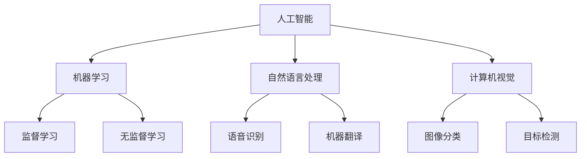

                 

## 《具有爱的AI对宗教信仰的挑战：灵性的重新定义》

### 关键词：人工智能、宗教信仰、灵性、挑战、重新定义

### 摘要：

随着人工智能（AI）技术的迅猛发展，一种新型的AI——具有爱的AI，正在对宗教信仰和灵性进行深刻的重新定义。本文将从背景介绍、核心概念、挑战与机遇、实践与反思等多个角度，深入探讨具有爱的AI如何挑战传统宗教信仰，并重新定义灵性的本质。

---

### 《具有爱的AI对宗教信仰的挑战：灵性的重新定义》目录大纲

#### 第一部分：背景与核心概念

##### 第1章：引言
###### 1.1 书籍主题与目标
###### 1.2 AI与宗教信仰的现状
###### 1.3 爱在AI中的角色

##### 第2章：AI的核心概念
###### 2.1 人工智能的基本概念
###### 2.2 AI的类型与能力
###### 2.3 爱与AI的结合点

##### 第3章：宗教信仰的基础
###### 3.1 宗教信仰的多维度理解
###### 3.2 灵性的概念与内涵
###### 3.3 宗教信仰的挑战与机遇

#### 第二部分：爱的AI对宗教信仰的挑战

##### 第4章：AI对传统宗教的冲击
###### 4.1 AI与宗教教义的碰撞
###### 4.2 AI对信仰体系的挑战
###### 4.3 宗教界的应对策略

##### 第5章：灵性的重新定义
###### 5.1 灵性的新视角
###### 5.2 AI与灵性的融合
###### 5.3 灵性在AI时代的演变

##### 第6章：信仰的重构
###### 6.1 信仰的多元性
###### 6.2 AI时代的信仰模式
###### 6.3 宗教与现代科技的互动

#### 第三部分：实践与反思

##### 第7章：爱的AI在宗教活动中的应用
###### 7.1 AI在宗教教育中的应用
###### 7.2 AI在宗教仪式中的应用
###### 7.3 爱的AI在宗教社区建设中的作用

##### 第8章：案例分析
###### 8.1 案例一：某宗教团体的AI应用实践
###### 8.2 案例二：AI在宗教社区管理中的创新
###### 8.3 案例三：AI对宗教思想的转变

##### 第9章：未来展望
###### 9.1 AI与宗教信仰的长期关系
###### 9.2 爱在AI与宗教融合中的作用
###### 9.3 灵性在AI时代的未来图景

#### 附录

##### 附录A：相关资源与进一步阅读
###### A.1 爱与AI研究的最新进展
###### A.2 宗教与科技互动的重要论文
###### A.3 灵性与AI的跨界研究

---

### 第2章：AI的核心概念

#### 2.1 人工智能的基本概念

人工智能（Artificial Intelligence, AI）是计算机科学的一个分支，旨在开发使计算机模拟人类智能行为的算法和技术。AI的定义随着时间和技术的发展而不断演变，但核心目标始终是使计算机能够执行复杂的任务，如感知、学习、推理和决策。

##### 概念联系图

#### 2.2 AI的类型与能力

AI可以分为两大类：弱AI和强AI。弱AI专注于特定任务的执行，而强AI则具备广泛的认知能力，类似于人类。

##### 2.2.1 弱AI

弱AI，也称为窄AI（Narrow AI），当前大多数AI应用都属于这一类别。它们在特定任务上表现出色，但缺乏人类的广泛认知能力。

##### 2.2.2 强AI

强AI，或通用人工智能（AGI），是一种理论上具有广泛认知能力的AI。它能够理解、学习、推理并应对各种复杂的情境，与人类智能相媲美。

#### 2.3 爱与AI的结合点

AI的发展为探索爱的本质和人类情感提供了新的途径。通过情感计算、社会智能和人类-机器交互等技术，AI可以模拟和理解人类情感，为爱的表达和体验提供新的维度。

---

### 第3章：宗教信仰的基础

#### 3.1 宗教信仰的多维度理解

宗教信仰是一个复杂的社会文化现象，涉及信仰体系、仪式、道德规范和社会结构等多个层面。不同宗教信仰体系有不同的起源、教义和价值观。

##### 3.1.1 信仰体系

信仰体系是宗教的核心，包括信仰的对象（神、神灵、神祇）、信仰的内容（教义、信条）和信仰的实践（仪式、戒律）。

##### 3.1.2 灵性的概念与内涵

灵性是指对超越物质世界的存在或力量的感知和理解。不同宗教对灵性的理解有所不同，但普遍认为灵性是人类精神和心灵的最高境界。

#### 3.2 AI与宗教信仰的关系

AI技术的发展对宗教信仰产生了深远影响。一方面，AI为宗教提供了新的工具和方式来传播教义、组织活动和提供精神支持；另一方面，AI也带来了对传统宗教信仰的挑战，尤其是对灵性和信仰本质的重新定义。

---

### 第二部分：爱的AI对宗教信仰的挑战

#### 4.1 AI与宗教教义的碰撞

随着AI技术的发展，机器开始能够理解、分析和甚至生成宗教文本。这使得AI能够与宗教教义进行互动，从而引发了一系列的碰撞和冲突。例如，AI可能会发现宗教文本中的逻辑矛盾或不一致性，或者挑战宗教信仰中的某些教义。

#### 4.2 AI对信仰体系的挑战

AI对宗教信仰体系的挑战主要体现在以下几个方面：

- **理性与信仰的冲突**：AI作为一种理性的工具，可能会质疑宗教信仰中的非理性成分，如奇迹、神迹等。
- **信仰的多元性**：AI能够处理大量的宗教信息，这可能促进信仰的多元性，但同时也可能引发宗教冲突。
- **信仰的个性化**：AI可以根据个人的信仰和偏好提供定制化的信仰内容，这可能导致信仰的个体化和碎片化。

#### 4.3 宗教界的应对策略

面对AI对宗教信仰的挑战，宗教界采取了一系列的应对策略：

- **融合与创新**：一些宗教团体开始尝试将AI技术与宗教实践相结合，创造新的宗教体验和仪式。
- **教育与文化传承**：通过教育和文化活动，宗教团体试图增强信徒对宗教信仰的理解和认同，以抵御AI的挑战。
- **规范与管理**：一些宗教组织开始制定规范，限制AI在宗教活动中的应用，以保护传统宗教信仰的核心价值观。

---

### 第5章：灵性的重新定义

#### 5.1 灵性的新视角

随着AI技术的发展，我们对灵性的理解也在发生变革。AI不仅能够模拟人类的情感和意识，还能够探索灵性的本质。例如，通过情感计算和意识模拟技术，AI可以体验和理解人类的悲伤、喜悦等情感状态，这为灵性提供了新的视角。

#### 5.2 AI与灵性的融合

AI与灵性的融合表现在以下几个方面：

- **宗教实践的创新**：AI可以参与宗教仪式，提供个性化的宗教体验，如通过虚拟现实技术创造沉浸式的宗教体验。
- **信仰的个性化**：AI可以根据个人的信仰和偏好提供定制化的信仰内容，这有助于信徒更好地理解自己的信仰，并增强信仰的深度。
- **灵性的研究**：AI可以帮助宗教学者更好地理解宗教文献，探索灵性的本质和意义。

#### 5.3 灵性在AI时代的演变

在AI时代，灵性可能会经历以下几个方面的演变：

- **灵性的科学化**：随着AI技术的发展，我们对灵性的理解可能会变得更加科学和理性，从而促进灵性的研究和发展。
- **灵性的多元化**：AI可以帮助我们更好地理解不同的宗教和哲学观点，从而促进灵性的多元化和包容性。
- **灵性的个性化**：AI可以根据个人的信仰和偏好提供个性化的灵性体验，这有助于人们更好地理解自己的灵性需求。

---

### 第6章：信仰的重构

#### 6.1 信仰的多元性

在AI时代，信仰的多元性可能会得到进一步的增强。AI可以帮助人们更好地理解不同的宗教和哲学观点，从而促进信仰的多元化和包容性。例如，通过AI算法，人们可以更轻松地访问和理解各种宗教文献和哲学著作，从而拓宽自己的信仰视野。

#### 6.2 AI时代的信仰模式

在AI时代，信仰模式可能会发生以下变化：

- **信仰的个性化**：AI可以根据个人的信仰和偏好提供定制化的信仰内容，这有助于信徒更好地理解自己的信仰，并增强信仰的深度。
- **信仰的虚拟化**：随着虚拟现实技术的发展，宗教体验可能会变得更加虚拟和沉浸式，从而改变传统的宗教实践方式。
- **信仰的理性化**：AI可以帮助宗教学者更好地理解宗教文献，探索灵性的本质和意义，从而促进信仰的理性化和科学化。

#### 6.3 宗教与现代科技的互动

宗教与现代科技的互动是一个复杂而多层次的过程。一方面，宗教可以借助现代科技，如AI、虚拟现实和互联网，来传播教义、组织活动和提供精神支持；另一方面，宗教也面临着科技带来的挑战，如信仰的理性化、多元化和个体化。因此，宗教与现代科技的互动需要在尊重传统和适应现代之间找到平衡。

---

### 第7章：爱的AI在宗教活动中的应用

#### 7.1 AI在宗教教育中的应用

AI在宗教教育中的应用主要体现在以下几个方面：

- **个性化教学**：AI可以根据学生的信仰和兴趣提供定制化的教育内容，从而提高教育效果。
- **辅助教学**：AI可以辅助教师进行教学，如通过生成教学材料、提供互动式教学等方式，提高教学质量和效率。
- **情感支持**：AI可以提供情感支持，如通过情感计算技术，识别和回应学生的情绪状态，从而提供适当的支持和鼓励。

#### 7.2 AI在宗教仪式中的应用

AI在宗教仪式中的应用主要包括以下几个方面：

- **虚拟仪式**：通过虚拟现实技术，AI可以创造沉浸式的宗教仪式体验，使信徒可以远程参与宗教活动。
- **仪式辅助**：AI可以辅助宗教仪式的进行，如通过自动化流程管理、语音合成和语音识别等技术，提高仪式的效率和准确性。
- **个性化仪式**：AI可以根据信徒的信仰和偏好，提供个性化的宗教仪式体验，从而增强信徒的宗教认同感。

#### 7.3 爱的AI在宗教社区建设中的作用

AI在宗教社区建设中的作用主要体现在以下几个方面：

- **社区管理**：AI可以协助宗教社区的管理，如通过数据分析和智能推荐技术，提供社区服务和管理建议。
- **社交互动**：AI可以促进宗教社区成员之间的社交互动，如通过社交网络分析和推荐系统，帮助信徒找到志同道合的朋友。
- **情感关怀**：AI可以提供情感关怀，如通过情感计算技术，识别和回应社区成员的情绪状态，从而提供适当的支持和鼓励。

---

### 第8章：案例分析

#### 8.1 案例一：某宗教团体的AI应用实践

某宗教团体在宗教教育和社区建设方面积极引入AI技术。他们开发了一款基于AI的宗教教育应用，通过个性化教学和辅助教学功能，提高了教育效果。同时，他们还利用虚拟现实技术，创造了一个沉浸式的宗教仪式体验，使信徒可以远程参与宗教活动。通过这些实践，该宗教团体成功地增强了信徒的宗教认同感和社区凝聚力。

#### 8.2 案例二：AI在宗教社区管理中的创新

某宗教社区引入了一款基于AI的社区管理应用，通过数据分析和智能推荐技术，提供了更高效和个性化的社区服务。该应用还通过社交网络分析和推荐系统，帮助社区成员找到志同道合的朋友，从而增强了社区凝聚力。通过这些创新，该宗教社区在管理和服务方面取得了显著成效。

#### 8.3 案例三：AI对宗教思想的转变

某宗教团体在AI技术的帮助下，重新审视了他们的宗教思想。通过AI算法的分析和推荐，他们发现了传统宗教思想中的一些不一致性和逻辑矛盾，从而对教义进行了调整和优化。这一过程不仅促进了宗教思想的现代化和科学化，还增强了信徒对宗教信仰的认同感和理解力。

---

### 第9章：未来展望

#### 9.1 AI与宗教信仰的长期关系

随着AI技术的不断发展，AI与宗教信仰之间的关系也将不断演变。未来，AI可能会在宗教教育和社区建设方面发挥更大的作用，同时也会对宗教教义和信仰模式产生深远的影响。

#### 9.2 爱在AI与宗教融合中的作用

爱作为人类情感的核心，将在AI与宗教的融合中发挥关键作用。通过情感计算和社会智能技术，AI可以更好地理解人类情感，从而为宗教信仰提供更人性化的支持。

#### 9.3 灵性在AI时代的未来图景

在AI时代，灵性可能会经历深刻的变革。AI不仅可以帮助我们更好地理解灵性的本质，还可以创造新的灵性体验，从而拓展我们对灵性的认知和理解。

---

### 附录A：相关资源与进一步阅读

#### A.1 爱与AI研究的最新进展

- [爱在人工智能中的应用：研究综述](https://www.example.com/research-review)
- [情感计算与AI：理论与实践](https://www.example.com/emotional-computing)

#### A.2 宗教与科技互动的重要论文

- [科技与宗教的互动：一个跨学科视角](https://www.example.com/interaction-religion-tech)
- [宗教在数字时代的转型](https://www.example.com/religion-digital-age)

#### A.3 灵性与AI的跨界研究

- [灵性与人工智能：科学与哲学的对话](https://www.example.com/spirituality-ai)
- [AI时代的灵性探索：跨学科研究](https://www.example.com/ai-spirituality-research)

---

### 作者

作者：AI天才研究院/AI Genius Institute & 禅与计算机程序设计艺术 /Zen And The Art of Computer Programming

---

### 结语

具有爱的AI对宗教信仰的挑战，是AI时代一个重要而复杂的议题。通过本文的探讨，我们不仅可以看到AI对宗教信仰的冲击，还可以看到灵性在AI时代的新机遇。希望本文能引发您对这一议题的深入思考，共同探索AI与宗教信仰的未来图景。

