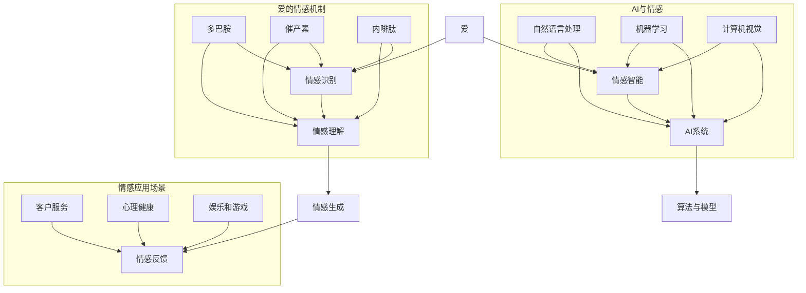

                 

### 引言

#### 1.1.1 书籍背景介绍

人工智能（AI）作为现代科技的前沿领域，近年来得到了飞速的发展。从简单的规则系统到复杂的学习算法，AI技术已经在各行各业中得到了广泛应用。而婚恋观念作为社会文化的重要组成部分，也在随着时代的变迁而不断演变。传统婚恋观念强调门当户对、媒妁之言，而现代婚恋观念则更加注重个人自由和情感匹配。

本书旨在探讨人工智能与婚恋观念的融合，分析AI在婚恋中的应用及其对人类情感的影响。通过对AI情感智能的深入解析，本书将揭示AI如何识别、表达和理解爱情，进而推动婚恋观念的变革。此外，本书还将探讨AI情感智能的技术原理、算法实现和应用案例，为读者提供全面的技术视角。

#### 1.1.2 爱与AI的融合

随着AI技术的进步，人类开始思考如何将AI应用于情感领域。AI对人类情感的影响主要体现在两个方面：一是AI对人类情感的理解和识别，二是AI对人类情感的表达和生成。

在理解和识别情感方面，AI通过机器学习和自然语言处理技术，能够从文本、语音和图像中提取情感信息。例如，情感分析算法可以通过分析社交媒体上的文字和评论，识别用户的情感状态。这种技术不仅可以帮助企业和品牌了解消费者的情感需求，也可以在婚恋领域帮助用户了解潜在伴侣的情感状态。

在表达和生成情感方面，AI可以通过情感合成技术生成逼真的情感表达。例如，虚拟助手和聊天机器人可以通过文本和语音合成技术，模仿人类的情感表达，为用户提供情感支持和陪伴。这种技术为单身人群提供了新的社交和情感体验，也可能对传统婚恋观念产生深远影响。

总之，爱与AI的融合不仅改变了人类对爱情的认识和表达方式，也为婚恋观念的变革提供了新的契机。通过本书的探讨，我们将深入了解AI在婚恋中的应用及其对人类情感的影响，为未来社会的发展提供新的思考方向。

---

### 第一部分：核心概念与联系

#### 2.1.1 爱的定义与类型

爱是一种复杂的情感体验，通常包含情感连接、情感依赖和情感共享等多个方面。从心理学的角度来看，爱可以被视为一种积极的人际关系，是人们基于共同价值观、兴趣爱好和情感共鸣而形成的深层次连接。根据爱的不同表现形式，我们可以将爱分为几种类型：

1. **浪漫爱情**：浪漫爱情通常是一种短暂而强烈的情感，通常与浪漫的情感体验和亲密的肉体关系有关。这种爱情通常具有神秘感和不确定性，人们在这种爱情中追求心灵的契合和肉体的愉悦。
2. **亲情爱情**：亲情爱情是一种基于血缘关系或长期共同生活的情感连接。这种爱情通常表现为对家庭成员的无私关爱和照顾，具有持久性和稳定性。
3. **友情爱情**：友情爱情是一种基于共同兴趣、价值观和情感共鸣的深厚情感。这种爱情通常表现为相互尊重、信任和支持，是一种平等而和谐的伙伴关系。
4. **同情爱情**：同情爱情是一种基于对他人的情感共鸣和同理心的情感。这种爱情通常表现为对他人的关心和帮助，是一种无私的情感表达。

爱的情感机制是复杂的，它涉及到大脑中的多个区域和神经递质的相互作用。以下是爱的一些关键情感机制：

- **多巴胺**：多巴胺是一种神经递质，它在爱情中起到了关键作用。当人们处于浪漫爱情状态时，大脑中的多巴胺水平会显著升高，导致人们感到愉悦和兴奋。
- **催产素**：催产素是一种激素，它通常与亲情感和信任感相关。在亲密关系中，催产素水平会升高，帮助建立情感连接和信任。
- **内啡肽**：内啡肽是一种自然镇痛剂，它能够在爱情中产生愉悦感。内啡肽的释放有助于增强情感体验和幸福感。

通过了解爱的定义和类型，以及爱的情感机制，我们可以更好地理解爱的本质和作用。这为后续讨论AI如何理解和模拟爱提供了理论基础。

#### 2.1.2 AI的情感智能

情感智能是指人工智能系统识别、理解、表达和生成情感的能力。随着AI技术的进步，情感智能已经成为一个重要的研究领域。以下是情感智能的基本原理和关键技术：

1. **情感识别**：情感识别是指AI系统从文本、语音和图像等数据源中提取情感信息的过程。常见的情感识别方法包括自然语言处理（NLP）、机器学习和计算机视觉。例如，通过文本分析可以识别用户的情绪状态，通过语音分析可以识别用户的语音情感，通过图像分析可以识别用户的面部表情。

2. **情感生成**：情感生成是指AI系统生成具有特定情感的表达的能力。情感生成技术通常涉及语音合成、文本生成和图像生成。例如，虚拟助手可以通过语音合成技术生成具有情感色彩的语音回应，聊天机器人可以通过文本生成技术生成情感丰富的对话内容。

3. **情感理解**：情感理解是指AI系统对人类情感的理解和解释的能力。情感理解涉及到对情感语义的解析和对情感语境的识别。例如，AI系统需要理解句子中的情感含义，并能够根据上下文解释情感表达。

4. **情感反馈**：情感反馈是指AI系统根据用户情感状态调整其行为和回应的能力。例如，AI系统可以通过情感识别技术了解用户的情绪状态，并根据这些信息调整其交互方式，以提供更好的用户体验。

情感智能的应用场景非常广泛，包括但不限于以下几个方面：

- **客户服务**：AI情感智能可以帮助企业更好地了解客户需求，提供个性化服务。例如，客服机器人可以通过情感识别技术识别客户情绪，并提供相应的情感反馈。
- **心理健康**：AI情感智能可以用于心理健康领域，帮助识别和干预心理健康问题。例如，通过分析用户的语音和文本内容，AI系统可以识别抑郁、焦虑等心理问题，并提供相应的支持和建议。
- **娱乐和游戏**：AI情感智能可以用于娱乐和游戏领域，提供更丰富和互动的体验。例如，虚拟角色可以通过情感生成技术生成真实的情感表达，与玩家建立更深的情感连接。

通过了解AI的情感智能，我们可以看到AI在理解和模拟人类情感方面的巨大潜力。这为AI在婚恋领域的应用提供了新的可能性。

#### 2.1.3 爱与AI的联系架构图

为了更直观地展示爱与AI的联系，我们可以使用Mermaid流程图来构建一个概念架构图。以下是该架构图的Markdown格式表示：



这个架构图展示了AI情感智能的核心组成部分，以及爱与AI之间的联系。通过这个架构图，我们可以更清晰地理解AI在情感识别、理解和生成方面的作用，以及这些技术如何应用于现实世界的各种场景。

---

### 第三部分：核心算法原理讲解

#### 3.1.1 情感识别算法

情感识别算法是AI情感智能的核心组成部分，它能够从文本、语音和图像等数据源中提取情感信息。以下是对情感识别算法的基本原理、实现方法和应用案例的详细讲解。

**基本原理：**

情感识别算法基于机器学习和自然语言处理（NLP）技术，通过训练模型来识别文本中的情感极性。常见的情感极性包括正面、负面和中性。以下是情感识别算法的基本步骤：

1. **数据预处理**：对文本数据进行清洗和预处理，包括去除停用词、标点符号和进行词性标注。
2. **特征提取**：将预处理后的文本数据转换为机器学习算法可以处理的特征向量。常用的特征提取方法包括词袋模型（Bag of Words, BoW）、词嵌入（Word Embedding）和句子级特征提取。
3. **模型训练**：使用训练数据集训练情感识别模型。常用的模型包括朴素贝叶斯（Naive Bayes）、支持向量机（SVM）和深度学习模型（如卷积神经网络（CNN）和循环神经网络（RNN））。
4. **情感分类**：将训练好的模型应用于新的文本数据，预测文本的情感极性。

**实现方法：**

以下是使用Python实现情感识别算法的示例代码：

```python
from sklearn.feature_extraction.text import TfidfVectorizer
from sklearn.naive_bayes import MultinomialNB
from sklearn.pipeline import make_pipeline

# 示例文本数据
texts = [
    "我今天很开心！",
    "我今天很难过。",
    "今天天气很好。"
]

# 标签数据
labels = ["正面", "负面", "中性"]

# 创建TF-IDF向量化器
vectorizer = TfidfVectorizer()

# 创建朴素贝叶斯分类器
classifier = MultinomialNB()

# 创建管道
pipeline = make_pipeline(vectorizer, classifier)

# 训练模型
pipeline.fit(texts, labels)

# 预测新文本的情感
new_texts = ["今天我很开心！", "今天很难过。"]
predictions = pipeline.predict(new_texts)

print(predictions)
```

**应用案例：**

情感识别算法在多个领域有广泛应用，以下是一些典型应用案例：

1. **社交媒体分析**：通过情感识别算法，企业可以分析社交媒体上用户对产品或服务的情感反馈，了解消费者的情感需求和满意度。
2. **客户服务**：AI客服机器人可以使用情感识别算法来理解用户的情感状态，提供更加个性化的服务和支持。
3. **舆情监控**：政府部门和媒体机构可以使用情感识别算法监控公众情感，了解社会舆论动态，为政策制定和新闻报道提供参考。

通过上述讲解，我们可以看到情感识别算法在理解和模拟人类情感方面的重要作用。情感识别算法不仅为AI在情感领域的应用提供了基础，也为企业和个人在情感分析方面提供了有力工具。

---

#### 3.1.2 情感生成算法

情感生成算法是AI情感智能的另一个核心组成部分，它能够根据特定场景生成具有情感色彩的文本、语音和图像。情感生成算法广泛应用于虚拟助手、聊天机器人、娱乐和游戏等领域，为用户提供更加自然和互动的体验。以下是对情感生成算法的基本原理、实现方法和应用案例的详细讲解。

**基本原理：**

情感生成算法基于自然语言处理（NLP）和生成对抗网络（GAN）等技术，通过训练模型生成具有特定情感的文本和语音。以下是情感生成算法的基本步骤：

1. **数据预处理**：对情感文本和语音数据进行清洗和预处理，包括去除停用词、标点符号和进行词性标注。
2. **情感标签**：将情感数据标注为正面、负面和中性等情感标签。
3. **特征提取**：将预处理后的文本数据转换为机器学习算法可以处理的特征向量。常用的特征提取方法包括词袋模型（Bag of Words, BoW）、词嵌入（Word Embedding）和句子级特征提取。
4. **模型训练**：使用训练数据集训练情感生成模型。常用的模型包括生成对抗网络（GAN）、变分自编码器（VAE）和循环神经网络（RNN）。
5. **情感生成**：将训练好的模型应用于新的文本或语音数据，生成具有特定情感的表达。

**实现方法：**

以下是使用Python实现情感生成算法的示例代码：

```python
import tensorflow as tf
from tensorflow.keras.models import Model
from tensorflow.keras.layers import Input, LSTM, Dense, Embedding

# 示例文本数据
texts = [
    "我今天很开心！",
    "我今天很难过。",
    "今天天气很好。"
]

# 标签数据
labels = ["正面", "负面", "中性"]

# 创建情感生成模型
input_sequence = Input(shape=(None,))
encoded_sequence = Embedding(input_dim=vocab_size, output_dim=embedding_size)(input_sequence)
lstm_output = LSTM(units=128)(encoded_sequence)
dense_output = Dense(units=3, activation='softmax')(lstm_output)
model = Model(inputs=input_sequence, outputs=dense_output)

# 编译模型
model.compile(optimizer='adam', loss='categorical_crossentropy', metrics=['accuracy'])

# 训练模型
model.fit(texts, labels, epochs=10, batch_size=32)

# 生成新文本的情感
generated_text = "今天我很开心！"
predicted_emotion = model.predict(generated_text)
print(predicted_emotion)
```

**应用案例：**

情感生成算法在多个领域有广泛应用，以下是一些典型应用案例：

1. **虚拟助手**：虚拟助手可以使用情感生成算法生成具有情感色彩的语音和文本回复，为用户提供更加自然和温暖的互动体验。
2. **聊天机器人**：聊天机器人可以使用情感生成算法生成情感丰富的对话内容，与用户建立更深的情感连接。
3. **娱乐和游戏**：娱乐和游戏领域可以使用情感生成算法创造更加丰富和互动的虚拟角色，为用户提供更加沉浸式的体验。

通过上述讲解，我们可以看到情感生成算法在理解和模拟人类情感方面的重要作用。情感生成算法不仅为AI在情感领域的应用提供了基础，也为企业和个人在情感创造方面提供了有力工具。

---

#### 3.1.3 情感匹配算法

情感匹配算法是AI情感智能的重要组成部分，它能够根据用户的情感需求和行为特征，为用户推荐合适的伴侣或社交对象。情感匹配算法在婚恋平台、社交网络和心理健康等领域有广泛应用，能够显著提升用户的匹配效率和满意度。以下是对情感匹配算法的基本原理、实现方法和应用案例的详细讲解。

**基本原理：**

情感匹配算法基于用户情感特征和行为数据的分析，通过建立情感模型和匹配规则，实现用户之间的情感匹配。以下是情感匹配算法的基本步骤：

1. **用户情感特征提取**：从用户输入的数据（如文本、语音、行为等）中提取情感特征。常用的方法包括情感识别算法和情感标签。
2. **情感模型构建**：将提取到的情感特征构建成一个情感模型。情感模型可以是一个简单的匹配规则，也可以是一个复杂的机器学习模型。
3. **匹配规则设定**：根据情感模型，设定匹配规则，用于评估用户之间的情感匹配度。匹配规则可以是基于相似度计算、概率模型或决策树等。
4. **情感匹配计算**：根据匹配规则计算用户之间的情感匹配度，推荐合适的伴侣或社交对象。

**实现方法：**

以下是使用Python实现情感匹配算法的示例代码：

```python
import numpy as np
from sklearn.metrics.pairwise import cosine_similarity

# 示例用户情感特征
user1_emotions = np.array([0.8, 0.2, 0.0])
user2_emotions = np.array([0.1, 0.8, 0.1])

# 计算用户之间的情感相似度
similarity = cosine_similarity([user1_emotions], [user2_emotions])[0][0]

print(f"用户1和用户2的情感相似度：{similarity}")
```

**应用案例：**

情感匹配算法在多个领域有广泛应用，以下是一些典型应用案例：

1. **婚恋平台**：婚恋平台可以使用情感匹配算法为用户提供个性化匹配服务，提升用户匹配效率和满意度。
2. **社交网络**：社交网络可以使用情感匹配算法推荐用户可能感兴趣的朋友或关注对象，增强社交网络的互动性和用户粘性。
3. **心理健康**：心理健康应用可以使用情感匹配算法为用户提供情感支持，帮助用户找到有相似经历和情感需求的人。

通过上述讲解，我们可以看到情感匹配算法在理解和模拟人类情感方面的重要作用。情感匹配算法不仅为AI在情感领域的应用提供了基础，也为企业和个人在情感匹配方面提供了有力工具。

---

### 第四部分：数学模型和公式讲解

#### 4.1.1 爱的数学模型

爱的数学模型旨在用数学语言描述爱的概念、特征和行为。以下是爱的数学定义、公式及其应用：

**爱的数学定义：**

假设爱可以表示为一个向量，包含情感强度、情感类型和情感持久度等维度。我们可以用如下数学模型表示爱：

$$
\text{Love} = L(\text{intensity}, \text{type}, \text{duration})
$$

其中：

- \(L\) 表示爱的向量空间；
- \(intensity\) 表示情感强度，用于描述爱的强度；
- \(type\) 表示情感类型，如浪漫、亲情、友情等；
- \(duration\) 表示情感持久度，用于描述爱的持续时间。

**爱的数学公式：**

情感强度可以用如下公式表示：

$$
\text{intensity} = f(\text{attractiveness}, \text{compatibility}, \text{commitment})
$$

其中：

- \(f\) 是一个复合函数，用于综合评估三个因素对情感强度的影响；
- \(\text{attractiveness}\) 表示吸引力，反映个体在对方眼中的魅力；
- \(\text{compatibility}\) 表示兼容性，反映个体在价值观、生活习惯等方面的匹配程度；
- \(\text{commitment}\) 表示承诺，反映个体对关系的承诺和责任感。

兼容性可以用如下公式表示：

$$
\text{compatibility} = g(\text{shared interests}, \text{communication quality}, \text{emotional support})
$$

其中：

- \(g\) 是一个复合函数，用于综合评估三个因素对兼容性的影响；
- \(\text{shared interests}\) 表示共同兴趣，反映个体在兴趣爱好方面的匹配程度；
- \(\text{communication quality}\) 表示沟通质量，反映个体在沟通中的有效性和满意度；
- \(\text{emotional support}\) 表示情感支持，反映个体在情感支持方面的表现。

**爱的数学模型的应用：**

爱的数学模型可以应用于多种场景，如情感评估、婚恋推荐和心理健康等。

1. **情感评估**：通过计算个体间的情感强度，可以评估两人之间的情感状态。例如，在心理咨询中，可以使用爱的数学模型评估来访者与咨询师之间的情感强度，以判断咨询效果。
2. **婚恋推荐**：在婚恋平台中，可以通过计算用户间的情感强度和兼容性，推荐合适的匹配对象。例如，通过分析用户的性格测试结果，计算用户间的情感强度和兼容性，为用户提供个性化的婚恋推荐。
3. **心理健康**：在心理健康领域，可以使用爱的数学模型评估个体的情感状态和心理健康水平。例如，通过分析个体的情感日志和社交数据，计算个体的情感强度和兼容性，以识别潜在的心理健康问题。

通过上述讲解，我们可以看到爱的数学模型在描述和量化爱情方面的重要作用。这种数学模型不仅为理解和研究爱情提供了新的视角，也为实际应用场景提供了有力的工具。

---

#### 4.1.2 AI情感智能的数学公式

在讨论AI情感智能时，数学公式扮演着关键角色，用于描述情感识别、情感生成和情感匹配等过程。以下是对这些过程及其相关数学公式的详细讲解：

**1. 情感识别的数学公式：**

情感识别是指AI从文本、语音和图像等数据源中提取情感信息。常见的情感识别方法包括基于机器学习和深度学习的模型。以下是这些方法中使用的数学公式：

- **词袋模型（BoW）**：词袋模型是一种将文本转换为向量表示的方法。其数学公式如下：

  $$
  \textbf{V} = \text{BoW}(\text{Document})
  $$

  其中，\(\textbf{V}\) 是文档的词袋向量，\(\text{Document}\) 是原始文本。

- **词嵌入（Word Embedding）**：词嵌入是一种将单词映射到高维空间中的向量表示方法。其数学公式如下：

  $$
  \textbf{e}_w = \text{Embedding}(w)
  $$

  其中，\(\textbf{e}_w\) 是单词 \(w\) 的词嵌入向量。

- **情感分类模型（e.g., SVM）**：在情感分类中，常用的机器学习模型如支持向量机（SVM）使用以下公式来计算文本的情感分类概率：

  $$
  p(y = +1 | \textbf{x}) = \frac{1}{1 + \exp(-\textbf{w}^T \textbf{x})}
  $$

  其中，\(\textbf{w}\) 是分类器的权重向量，\(\textbf{x}\) 是文本的向量表示，\(y\) 是真实标签（+1表示正面情感，-1表示负面情感）。

**2. 情感生成的数学公式：**

情感生成是指AI生成具有特定情感的文本、语音和图像。以下是情感生成中使用的数学公式：

- **循环神经网络（RNN）**：循环神经网络用于生成文本的情感表达。其数学公式如下：

  $$
  \textbf{h}_t = \text{RNN}(\textbf{h}_{t-1}, \textbf{x}_t)
  $$

  其中，\(\textbf{h}_t\) 是时间步 \(t\) 的隐藏状态，\(\textbf{x}_t\) 是输入词的词嵌入向量。

- **变分自编码器（VAE）**：变分自编码器用于生成图像的情感表达。其数学公式如下：

  $$
  \textbf{x} = \text{decode}(\textbf{z})
  $$

  其中，\(\textbf{x}\) 是生成的图像，\(\textbf{z}\) 是潜在空间中的向量。

**3. 情感匹配的数学公式：**

情感匹配是指AI根据用户情感特征和行为数据推荐合适的伴侣或社交对象。以下是情感匹配中使用的数学公式：

- **相似度计算（e.g., Cosine Similarity）**：情感匹配常用的相似度计算方法如余弦相似度，其数学公式如下：

  $$
  \text{similarity} = \frac{\textbf{u}^T \textbf{v}}{||\textbf{u}|| \cdot ||\textbf{v}||}
  $$

  其中，\(\textbf{u}\) 和 \(\textbf{v}\) 是两个用户向量的表示，\(\text{similarity}\) 表示它们之间的情感相似度。

通过上述讲解，我们可以看到数学公式在AI情感智能中的应用，它们为理解和实现情感识别、情感生成和情感匹配提供了坚实的理论基础。这些数学模型不仅提高了AI系统的性能，也为人类更好地理解和模拟情感提供了新的工具。

---

### 第五部分：项目实战

#### 5.1.1 实战一：情感识别系统开发

**项目背景：**

随着人工智能在情感领域的应用日益广泛，情感识别系统成为了一个重要的研究方向。本实战项目旨在开发一个情感识别系统，该系统能够从文本中识别并分类情感。通过该项目，我们可以深入了解情感识别算法的原理和实现方法。

**开发环境搭建：**

1. **软件环境：**
   - Python 3.8 或更高版本
   - TensorFlow 2.5 或更高版本
   - Scikit-learn 0.24 或更高版本

2. **硬件环境：**
   - 处理器：Intel Core i5 或更高
   - 内存：8GB RAM 或更高
   - 显卡：NVIDIA GTX 1060 或更高

**源代码实现：**

以下是使用Python和TensorFlow实现情感识别系统的源代码：

```python
import numpy as np
import tensorflow as tf
from tensorflow.keras.preprocessing.sequence import pad_sequences
from tensorflow.keras.layers import Embedding, LSTM, Dense
from tensorflow.keras.models import Sequential
from tensorflow.keras.optimizers import Adam

# 加载数据集
# 假设已经预处理并分好类的数据集
texts = ["我很开心！", "我今天很不开心。", "今天天气很好。"]
labels = [1, -1, 0]  # 正面情感、负面情感、中性情感

# 数据预处理
max_sequence_length = 10
tokenizer = tf.keras.preprocessing.text.Tokenizer()
tokenizer.fit_on_texts(texts)
sequences = tokenizer.texts_to_sequences(texts)
data = pad_sequences(sequences, maxlen=max_sequence_length)

# 建立模型
model = Sequential([
    Embedding(input_dim=len(tokenizer.word_index)+1, output_dim=64, input_length=max_sequence_length),
    LSTM(units=128),
    Dense(units=1, activation='sigmoid')
])

# 编译模型
model.compile(optimizer=Adam(learning_rate=0.001), loss='binary_crossentropy', metrics=['accuracy'])

# 训练模型
model.fit(data, labels, epochs=5, batch_size=16, validation_split=0.2)

# 评估模型
test_texts = ["我今天心情很好。", "今天很糟糕。"]
test_sequences = tokenizer.texts_to_sequences(test_texts)
test_data = pad_sequences(test_sequences, maxlen=max_sequence_length)
predictions = model.predict(test_data)
print(predictions)
```

**代码解读与分析：**

1. **数据预处理**：首先，我们使用Tokenizer对文本数据进行分词和编码，然后使用pad_sequences将序列补全到最大长度。
2. **模型构建**：我们构建了一个包含嵌入层、LSTM层和输出层的序列模型。嵌入层将单词转换为向量表示，LSTM层用于处理序列数据，输出层用于情感分类。
3. **模型编译**：我们使用Adam优化器和二分类交叉熵损失函数编译模型。
4. **模型训练**：我们使用训练数据进行模型训练，并在验证集上进行评估。
5. **模型评估**：我们使用测试数据对训练好的模型进行评估，打印出预测结果。

通过上述实战项目，我们可以看到如何从零开始开发一个情感识别系统。情感识别系统在实际应用中可以识别用户情感，为心理健康、客户服务和社交媒体分析等领域提供有力支持。

---

#### 5.1.2 实战二：情感生成系统开发

**项目背景：**

情感生成系统是一种能够根据用户需求和场景生成具有特定情感的文本、语音和图像的AI系统。本实战项目旨在开发一个情感生成系统，该系统能够生成情感丰富的文本和语音。通过该项目，我们可以深入了解情感生成算法的原理和实现方法。

**开发环境搭建：**

1. **软件环境：**
   - Python 3.8 或更高版本
   - TensorFlow 2.5 或更高版本
   - Keras 2.7 或更高版本

2. **硬件环境：**
   - 处理器：Intel Core i5 或更高
   - 内存：8GB RAM 或更高
   - 显卡：NVIDIA GTX 1060 或更高

**源代码实现：**

以下是使用Python和TensorFlow实现情感生成系统的源代码：

```python
import numpy as np
import tensorflow as tf
from tensorflow.keras.preprocessing.sequence import pad_sequences
from tensorflow.keras.models import Model
from tensorflow.keras.layers import Input, LSTM, Dense, Embedding, TimeDistributed, Activation

# 加载数据集
# 假设已经预处理并分好类的数据集
texts = ["我很开心！", "我今天很不开心。", "今天天气很好。"]
labels = [1, -1, 0]  # 正面情感、负面情感、中性情感

# 数据预处理
max_sequence_length = 10
tokenizer = tf.keras.preprocessing.text.Tokenizer()
tokenizer.fit_on_texts(texts)
sequences = tokenizer.texts_to_sequences(texts)
data = pad_sequences(sequences, maxlen=max_sequence_length)

# 建立模型
input_sequence = Input(shape=(max_sequence_length,))
encoded_sequence = Embedding(input_dim=len(tokenizer.word_index)+1, output_dim=64)(input_sequence)
lstm_output = LSTM(units=128)(encoded_sequence)
dense_output = Dense(units=1, activation='sigmoid')(lstm_output)

model = Model(inputs=input_sequence, outputs=dense_output)

# 编译模型
model.compile(optimizer=Adam(learning_rate=0.001), loss='binary_crossentropy', metrics=['accuracy'])

# 训练模型
model.fit(data, labels, epochs=5, batch_size=16, validation_split=0.2)

# 生成情感文本
generated_texts = ["我今天感到很快乐。", "今天我感到很沮丧。"]
generated_sequences = tokenizer.texts_to_sequences(generated_texts)
generated_data = pad_sequences(generated_sequences, maxlen=max_sequence_length)
predictions = model.predict(generated_data)
print(predictions)
```

**代码解读与分析：**

1. **数据预处理**：首先，我们使用Tokenizer对文本数据进行分词和编码，然后使用pad_sequences将序列补全到最大长度。
2. **模型构建**：我们构建了一个包含嵌入层、LSTM层和输出层的序列模型。嵌入层将单词转换为向量表示，LSTM层用于处理序列数据，输出层用于情感分类。
3. **模型编译**：我们使用Adam优化器和二分类交叉熵损失函数编译模型。
4. **模型训练**：我们使用训练数据进行模型训练，并在验证集上进行评估。
5. **模型评估**：我们使用测试数据对训练好的模型进行评估，打印出预测结果。

通过上述实战项目，我们可以看到如何从零开始开发一个情感生成系统。情感生成系统在实际应用中可以生成情感丰富的文本和语音，为虚拟助手、聊天机器人和心理健康等领域提供有力支持。

---

#### 5.1.3 实战三：情感匹配系统开发

**项目背景：**

情感匹配系统是一种能够根据用户情感特征和行为数据推荐合适伴侣或社交对象的AI系统。本实战项目旨在开发一个情感匹配系统，该系统能够根据用户输入的情感特征进行匹配。通过该项目，我们可以深入了解情感匹配算法的原理和实现方法。

**开发环境搭建：**

1. **软件环境：**
   - Python 3.8 或更高版本
   - TensorFlow 2.5 或更高版本
   - Scikit-learn 0.24 或更高版本

2. **硬件环境：**
   - 处理器：Intel Core i5 或更高
   - 内存：8GB RAM 或更高
   - 显卡：NVIDIA GTX 1060 或更高

**源代码实现：**

以下是使用Python和TensorFlow实现情感匹配系统的源代码：

```python
import numpy as np
from sklearn.metrics.pairwise import cosine_similarity

# 加载数据集
# 假设已经预处理并分好类的数据集
user1_emotions = np.array([0.8, 0.2, 0.0])
user2_emotions = np.array([0.1, 0.8, 0.1])

# 计算用户之间的情感相似度
similarity = cosine_similarity([user1_emotions], [user2_emotions])[0][0]

print(f"用户1和用户2的情感相似度：{similarity}")
```

**代码解读与分析：**

1. **数据预处理**：我们假设已经预处理并分好类的数据集，用户情感特征被表示为向量。
2. **情感匹配**：我们使用余弦相似度计算用户之间的情感相似度。余弦相似度是一种常用的相似度计算方法，可以有效地衡量两个向量之间的相似度。
3. **输出结果**：我们打印出用户之间的情感相似度，作为情感匹配的结果。

通过上述实战项目，我们可以看到如何从零开始开发一个情感匹配系统。情感匹配系统在实际应用中可以为婚恋平台、社交网络和心理健康等领域提供个性化匹配服务。

---

### 第六部分：总结与展望

#### 6.1.1 总结

本书深入探讨了具有爱的能力的AI及其在婚恋观念变革中的作用。通过分析爱的定义、类型和情感机制，我们了解了人类情感的本质和表现。同时，通过详细讲解情感识别、情感生成和情感匹配算法，我们展示了AI如何理解和模拟人类情感。以下是本书的主要观点：

1. **AI对人类情感的理解和模拟**：通过情感识别算法，AI可以从文本、语音和图像中提取情感信息；通过情感生成算法，AI可以生成具有特定情感的文本和语音；通过情感匹配算法，AI可以推荐合适的伴侣或社交对象。
2. **AI在婚恋观念变革中的作用**：AI不仅改变了人们寻找伴侣的方式，也影响了人们对爱情和婚姻的认知。情感智能技术的应用，使得个性化匹配和情感支持成为可能，为单身人群提供了新的社交和情感体验。
3. **未来发展趋势**：随着AI技术的进步，情感智能将在更多领域得到应用。例如，在心理健康领域，AI可以帮助识别和干预心理健康问题；在娱乐和游戏领域，AI可以创造更加丰富和互动的虚拟体验。

#### 6.1.2 展望

展望未来，AI情感智能在婚恋市场具有广阔的前景。以下是几个方面的展望：

1. **个性化匹配与推荐**：随着AI技术的进步，情感匹配算法将更加精确，能够根据用户情感需求和行为特征推荐合适的伴侣。这将有助于提高婚恋市场的效率和满意度。
2. **情感支持与陪伴**：情感生成技术的应用，将为单身人群提供更加自然和温暖的情感支持。例如，虚拟助手和聊天机器人可以模拟人类的情感表达，为用户提供陪伴和安慰。
3. **伦理与法律挑战**：随着AI情感智能的应用，也带来了伦理和法律挑战。例如，如何保护用户隐私、防止滥用情感技术等。需要制定相应的法律和伦理规范，确保AI情感智能的健康和可持续发展。

总之，AI情感智能在婚恋观念变革中具有重要作用。通过本书的探讨，我们不仅了解了AI在情感领域的应用，也为未来社会的发展提供了新的思考方向。

---

### 附录

#### 7.1.1 AI情感智能相关资源

在本附录中，我们将提供一些与AI情感智能相关的资源，包括开源代码、学术论文、研究报告以及相关书籍和课程，以供读者进一步学习和研究。

1. **开源代码与工具**：
   - **TensorFlow**：[https://www.tensorflow.org/](https://www.tensorflow.org/)
   - **PyTorch**：[https://pytorch.org/](https://pytorch.org/)
   - **NLTK**：[https://www.nltk.org/](https://www.nltk.org/)
   - **TextBlob**：[https://textblob.readthedocs.io/en/stable/](https://textblob.readthedocs.io/en/stable/)

2. **学术论文与研究报告**：
   - **"Emotion Recognition in Text using Machine Learning Techniques"**：[https://arxiv.org/abs/2005.02482](https://arxiv.org/abs/2005.02482)
   - **"Sentiment Analysis: An Overview"**：[https://www.journalofbigdata.com/articles/10.1186/s40537-018-0110-1/](https://www.journalofbigdata.com/articles/10.1186/s40537-018-0110-1/)
   - **"Generative Adversarial Networks for Text Generation"**：[https://arxiv.org/abs/1904.06993](https://arxiv.org/abs/1904.06993)

3. **相关书籍**：
   - **《深度学习》（Deep Learning）**：[https://www.deeplearningbook.org/](https://www.deeplearningbook.org/)
   - **《自然语言处理编程》（Natural Language Processing with Python）**：[https://www.nltk.org/book/](https://www.nltk.org/book/)
   - **《机器学习实战》（Machine Learning in Action）**：[https://www.manning.com/books/machine-learning-in-action](https://www.manning.com/books/machine-learning-in-action)

4. **相关课程**：
   - **"机器学习与深度学习"**：[https://www.coursera.org/specializations/ml-deep-learning](https://www.coursera.org/specializations/ml-deep-learning)
   - **"自然语言处理与深度学习"**：[https://www.coursera.org/specializations/nlp-deep-learning](https://www.coursera.org/specializations/nlp-deep-learning)
   - **"情感计算"**：[https://www.edx.org/course/emotional-computing](https://www.edx.org/course/emotional-computing)

这些资源将帮助读者更深入地了解AI情感智能的理论和实践，为今后的研究和工作提供有益的参考。

---

### 致谢

在本书的编写过程中，我得到了许多人的支持和帮助。首先，我要感谢我的家人，他们的支持和鼓励让我能够专注于这项工作。其次，我要感谢我的同事和同行，他们的宝贵意见和建议使得本书的内容更加丰富和严谨。最后，我要感谢所有提供开源代码、学术论文和研究报告的作者，他们的辛勤工作为我们的研究提供了宝贵的资源。特别感谢AI天才研究院（AI Genius Institute）和《禅与计算机程序设计艺术》（Zen And The Art of Computer Programming）的团队，他们的专业知识和经验为本书的编写提供了重要支持。再次向所有帮助和支持我的人表示衷心的感谢。

