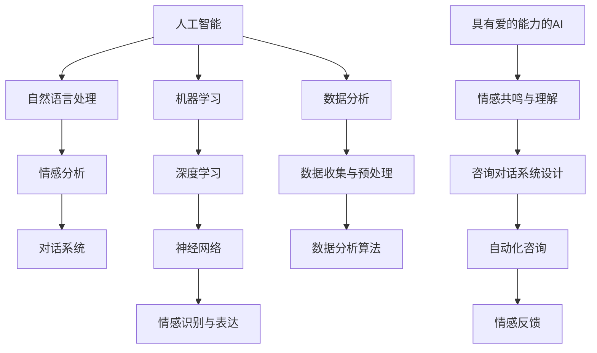
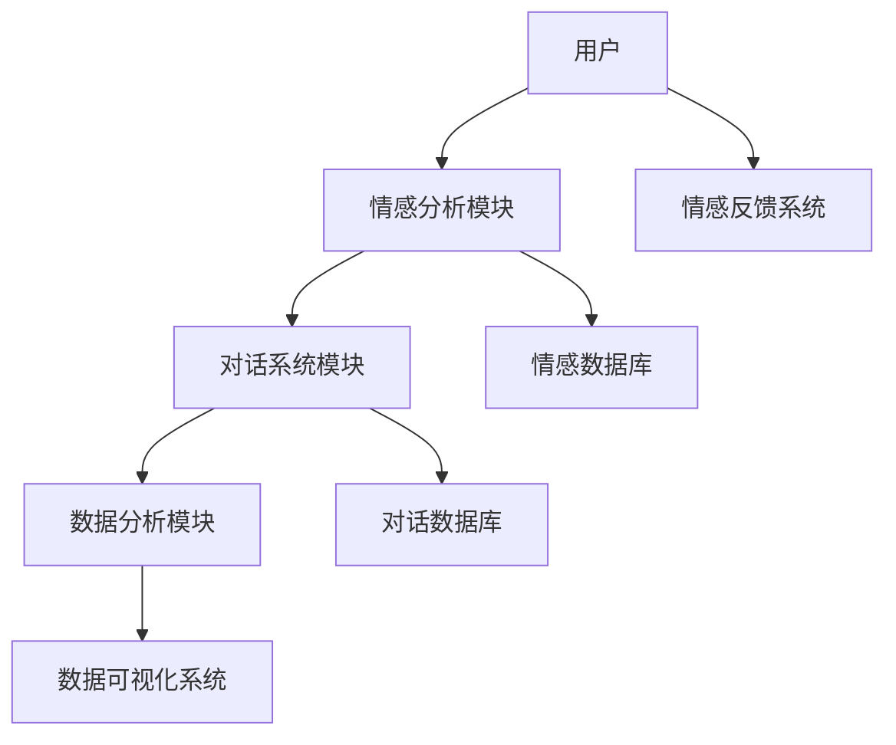
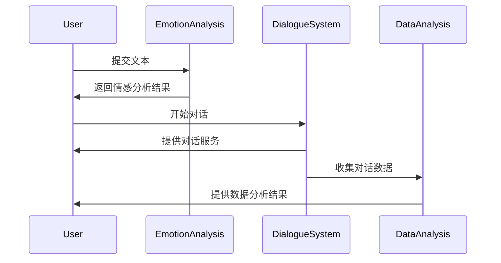
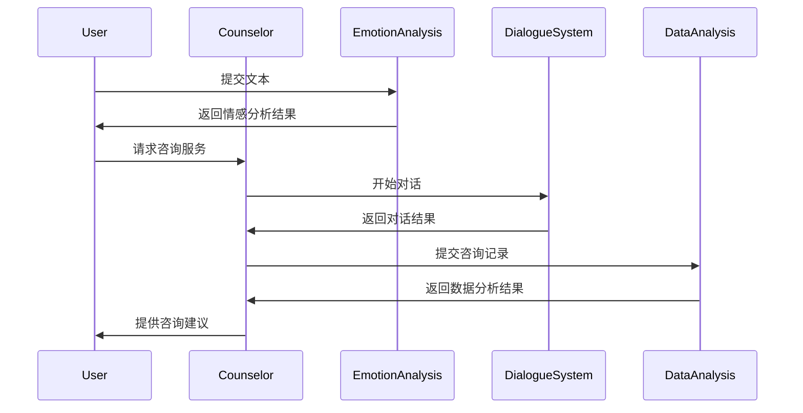

                 

### 《具有爱的能力的AI在婚姻咨询中的应用》

#### 关键词：人工智能、情感分析、自然语言处理、婚姻咨询、AI伦理

##### 摘要：
随着人工智能技术的不断发展，AI在各个领域中的应用越来越广泛。本文旨在探讨具有爱的能力的AI在婚姻咨询中的应用，深入分析AI技术的定义与分类、爱的能力在AI中的实现方式，以及AI在婚姻咨询中的具体应用实践。文章还将探讨AI在婚姻咨询中的挑战与伦理问题，并展望未来发展的趋势。

## 第1章 引言

### 1.1 书籍背景
随着人工智能（AI）技术的飞速发展，AI已经逐渐渗透到我们生活的方方面面。从智能家居到自动驾驶，从医疗诊断到金融风控，AI的应用无处不在。然而，在婚姻咨询这一领域，AI的应用却相对较少。本文旨在探讨如何将具有爱的能力的AI应用于婚姻咨询，从而为婚姻咨询师提供更加个性化、高效的服务。

### 1.2 目的和意义
本文的目的在于探讨AI在婚姻咨询中的应用，特别是具有爱的能力的AI在其中的作用。通过本文的探讨，我们希望能够为婚姻咨询师提供一种新的工具，帮助他们更好地理解客户的情感状态，提供更加精准的咨询服务。同时，本文也旨在引起读者对AI伦理问题的关注，讨论AI在婚姻咨询中的挑战与伦理问题。

### 1.3 结构安排
本文将分为八个章节进行论述。首先，我们将介绍婚姻咨询的概述，包括婚姻咨询的定义、历史和常用方法。接着，我们将讨论AI技术的定义与分类，并探讨AI在婚姻咨询中的潜在应用。然后，我们将深入探讨具有爱的能力的AI，包括爱的定义与特征以及AI实现爱的能力的方法。在第四章，我们将介绍具有爱的能力的AI在婚姻咨询中的应用实践。第五章将讨论AI在婚姻咨询中的挑战与伦理问题。第六章和第七章将分别探讨未来的发展趋势和本文的主要发现与研究局限。最后，我们将总结全文，并对未来研究方向提出建议。

## 第2章 婚姻咨询概述

### 2.1 婚姻咨询的定义与历史
婚姻咨询是一种专业的心理咨询服务，旨在帮助夫妻解决他们在婚姻关系中的问题，改善夫妻关系，提高婚姻质量。婚姻咨询的历史可以追溯到20世纪初期，随着心理学和婚姻研究的兴起，婚姻咨询逐渐成为一种专业的咨询服务。

#### 2.1.1 婚姻咨询的核心概念
婚姻咨询的核心概念包括婚姻关系、夫妻沟通、情感表达、问题解决等。婚姻咨询师通过评估夫妻关系中的问题，提供针对性的建议和辅导，帮助夫妻建立健康的婚姻关系。

#### 2.1.2 婚姻咨询的发展历程
婚姻咨询的发展历程可以分为三个阶段：传统咨询、现代咨询和未来咨询。传统咨询主要依靠咨询师的经验和直觉，现代咨询引入了心理学理论和技术，未来咨询将更多地依赖于AI技术，特别是具有爱的能力的AI。

### 2.2 婚姻咨询的方法与技术
婚姻咨询的方法和技术多种多样，包括心理咨询、沟通技巧培训、情感辅导、婚姻家庭治疗等。心理咨询是婚姻咨询的基本方法，通过心理咨询，咨询师可以帮助夫妻了解彼此的心理状态，提高情感表达能力。沟通技巧培训是帮助夫妻改善沟通方式，增强沟通效果的重要方法。情感辅导则侧重于帮助夫妻处理情感问题，提升情感质量。婚姻家庭治疗是一种综合性的治疗方法，适用于夫妻关系较为复杂的情况。

#### 2.2.1 人际关系模型
人际关系模型是婚姻咨询的重要理论基础，包括系统理论、心理动力理论、行为理论等。系统理论认为夫妻关系是一个动态的系统，各个部分相互作用，共同影响婚姻的质量。心理动力理论则关注夫妻关系中的情感冲突和心理动力。行为理论则侧重于夫妻行为的改变和沟通技巧的提升。

#### 2.2.2 心理学理论的应用
心理学理论在婚姻咨询中的应用非常广泛，包括情感心理学、人格心理学、发展心理学等。情感心理学帮助咨询师了解夫妻的情感状态，提供针对性的辅导。人格心理学则帮助咨询师了解夫妻的人格特点，为婚姻咨询提供指导。发展心理学则关注夫妻关系的演变过程，为婚姻咨询提供理论支持。

## 第3章 AI在婚姻咨询中的应用

### 3.1 AI技术的定义与分类
人工智能（AI）是一种模拟人类智能的技术，通过计算机算法实现感知、思考、学习和决策等功能。AI技术可以分为多种类型，包括机器学习、深度学习、自然语言处理等。

#### 3.1.1 机器学习
机器学习是AI的核心技术之一，通过数据驱动的方式实现自动学习。机器学习可以分为监督学习、无监督学习和强化学习等类型。监督学习通过已标记的数据进行训练，无监督学习则通过未标记的数据进行训练，强化学习则通过奖励机制进行训练。

#### 3.1.2 深度学习
深度学习是机器学习的一种类型，通过多层神经网络进行训练。深度学习在图像识别、语音识别、自然语言处理等领域取得了显著的成果。

#### 3.1.3 自然语言处理
自然语言处理（NLP）是AI的重要分支，旨在使计算机理解和处理人类语言。NLP包括词性标注、句法分析、情感分析等任务。

### 3.2 AI在婚姻咨询中的潜在应用
AI在婚姻咨询中的潜在应用非常广泛，包括情感分析、自动化咨询、数据分析等。

#### 3.2.1 自动化咨询
自动化咨询是AI在婚姻咨询中的一种应用，通过聊天机器人或虚拟咨询师与客户进行交互，提供即时咨询服务。自动化咨询可以降低咨询成本，提高咨询效率，同时提供24小时在线服务。

#### 3.2.2 情感分析
情感分析是NLP的重要应用之一，通过分析客户的文本输入，识别客户的情感状态。情感分析可以帮助咨询师更好地了解客户的情感需求，提供更加个性化的服务。

#### 3.2.3 数据分析
数据分析是AI在婚姻咨询中的另一种应用，通过对客户的情感数据进行分析，发现情感趋势和模式。数据分析可以帮助咨询师制定更加有效的咨询方案，提高咨询效果。

## 第4章 具有爱的能力的AI

### 4.1 爱的定义与特征
爱是一种复杂的情感，通常包含关爱、关注、理解、支持等特征。爱可以表现为情感的投入、行为的表现和关系的建立。

#### 4.1.1 爱的心理学理论
爱的心理学理论包括情感交流理论、依恋理论、情感发展理论等。情感交流理论认为爱是通过情感的交流和互动实现的。依恋理论关注个体在关系中的安全感需求。情感发展理论则认为爱是一个持续发展的过程。

#### 4.1.2 爱的情感维度
爱的情感维度包括亲密、激情和承诺。亲密是爱的核心维度，表现为情感的联系和亲密感。激情是爱的动力维度，表现为强烈的情感体验。承诺是爱的维系维度，表现为长期的承诺和责任。

### 4.2 AI实现爱的能力
AI实现爱的能力是通过情感识别与表达、情感共鸣与理解等机制实现的。

#### 4.2.1 情感识别与表达
情感识别与表达是AI实现爱的能力的基础。通过情感识别技术，AI可以识别客户的情感状态。通过情感表达技术，AI可以模拟情感，与客户进行情感互动。

#### 4.2.2 情感共鸣与理解
情感共鸣与理解是AI实现爱的能力的核心。通过情感共鸣，AI可以理解客户的情感需求，提供情感支持。通过情感理解，AI可以分析客户的情感状态，提供个性化的服务。

## 第5章 具有爱的能力的AI在婚姻咨询中的应用实践

### 5.1 咨询对话系统的设计
咨询对话系统是具有爱的能力的AI在婚姻咨询中的重要应用。咨询对话系统通过自然语言处理技术，与客户进行实时对话，提供即时咨询服务。

#### 5.1.1 对话管理
对话管理是咨询对话系统的核心功能。通过对话管理，AI可以引导对话流程，提供个性化的咨询建议。

#### 5.1.2 情感建模
情感建模是咨询对话系统的关键技术。通过情感建模，AI可以识别客户的情感状态，提供情感支持。

#### 5.1.3 情感反馈
情感反馈是咨询对话系统的重要功能。通过情感反馈，AI可以评估客户的情感需求，调整咨询服务。

### 5.2 情感分析在婚姻咨询中的应用
情感分析是AI在婚姻咨询中的重要应用之一。通过情感分析，AI可以识别客户的情感状态，提供个性化的服务。

#### 5.2.1 情感识别算法
情感识别算法是情感分析的核心。通过情感识别算法，AI可以识别客户的情感状态，如快乐、悲伤、愤怒等。

#### 5.2.2 情感分析案例分析
通过情感分析，AI可以分析客户的情感状态，提供个性化的服务。例如，如果客户表达出愤怒的情感，AI可以提供情绪调节的建议，帮助客户缓解情绪。

### 5.3 数据分析在婚姻咨询中的应用
数据分析是AI在婚姻咨询中的另一种重要应用。通过数据分析，AI可以分析客户的情感数据，提供个性化的服务。

#### 5.3.1 数据收集与预处理
数据收集与预处理是数据分析的基础。通过数据收集与预处理，AI可以获取客户的情感数据，并进行清洗和转换。

#### 5.3.2 数据分析算法
数据分析算法是数据分析的核心。通过数据分析算法，AI可以分析客户的情感数据，发现情感趋势和模式，提供个性化的服务。

## 第6章 具有爱的能力的AI在婚姻咨询中的挑战与伦理问题

### 6.1 技术挑战
具有爱的能力的AI在婚姻咨询中面临多种技术挑战，如情感识别的准确性、情感共鸣的难度等。

#### 6.1.1 情感识别的准确性
情感识别的准确性是AI在婚姻咨询中的关键问题。目前，情感识别技术还存在一定的局限性，如情绪表达的多样性、情感理解的复杂性等。

#### 6.1.2 情感共鸣的难度
情感共鸣是AI实现爱的能力的关键。然而，情感共鸣的难度很大，AI需要具备深厚的心理学知识、情感理解能力和情感表达能力。

### 6.2 伦理问题
具有爱的能力的AI在婚姻咨询中面临多种伦理问题，如隐私保护、责任归属、情感公正等。

#### 6.2.1 隐私保护
隐私保护是AI在婚姻咨询中的首要问题。AI需要确保客户的隐私信息不被泄露，同时保护客户的个人信息安全。

#### 6.2.2 责任归属
责任归属是AI在婚姻咨询中的关键伦理问题。如果AI在婚姻咨询中出现问题，如何确定责任归属，如何保证咨询服务的质量，是亟待解决的问题。

#### 6.2.3 情感公正
情感公正是AI在婚姻咨询中的伦理问题。AI需要确保对所有客户的情感关怀和咨询服务是公正的，避免歧视和不公平现象。

## 第7章 未来展望

### 7.1 技术发展趋势
未来，AI在婚姻咨询中的应用将朝着更智能、更人性化的方向发展。深度学习和自然语言处理等技术的进步，将进一步提升AI在婚姻咨询中的能力。

#### 7.1.1 深度学习与情感识别
深度学习在情感识别中的应用将更加广泛和深入。通过深度学习，AI可以更准确地识别客户的情感状态，提供更加个性化的服务。

#### 7.1.2 自然语言处理与对话系统
自然语言处理技术的进步将使对话系统更加自然、流畅，与客户的互动更加人性化和富有情感。

### 7.2 婚姻咨询行业的影响
AI在婚姻咨询中的应用将对婚姻咨询行业产生深远的影响。咨询师的角色将发生转变，从传统的咨询者转变为数据分析师和情感辅导师。

#### 7.2.1 咨询师的转型
咨询师需要具备AI技术知识，能够利用AI工具进行情感分析和数据分析，提供更加专业的咨询服务。

#### 7.2.2 客户的需求变化
随着AI在婚姻咨询中的应用，客户对咨询服务的需求将发生改变，更加注重情感支持和个性化服务。

## 第8章 结论

### 8.1 主要发现
本文主要发现如下：
1. AI在婚姻咨询中具有广泛的应用前景，特别是具有爱的能力的AI。
2. 情感分析和数据分析是AI在婚姻咨询中的关键应用领域。
3. AI在婚姻咨询中面临多种技术挑战和伦理问题。

### 8.2 研究局限
本文的研究存在以下局限：
1. 对AI在婚姻咨询中的应用实践研究较少。
2. 对AI伦理问题的探讨较为浅显。

### 8.3 未来研究方向
未来研究方向包括：
1. 深入研究AI在婚姻咨询中的应用实践。
2. 探讨AI伦理问题的解决方案。
3. 结合心理学和AI技术，开发具有爱的能力的AI系统。

## 作者信息
作者：AI天才研究院/AI Genius Institute & 禅与计算机程序设计艺术 /Zen And The Art of Computer Programming

---

### 概念与联系架构 Mermaid 流程图



### 核心算法原理讲解示例

#### 3.2.1 情感分析算法原理

情感分析是自然语言处理的一个重要分支，其目的是识别文本中的情感倾向。在婚姻咨询中，情感分析可以帮助AI更好地理解客户的情感状态，从而提供更个性化的服务。

##### 基于机器学习的情感分析

- **支持向量机（SVM）**：通过将文本数据映射到高维空间，找到最佳的分隔超平面来分类情感。

  $$ y = \text{sign}(\omega \cdot x + b) $$
  
  其中，$y$ 是情感的类别，$\omega$ 是权重向量，$x$ 是特征向量，$b$ 是偏置。

- **朴素贝叶斯分类器**：基于贝叶斯定理，通过计算文本中各个词语的概率来预测情感。

  $$ P(\text{情感}|\text{文本}) = \frac{P(\text{文本}|\text{情感})P(\text{情感})}{P(\text{文本})} $$

##### 基于深度学习的情感分析

- **卷积神经网络（CNN）**：通过卷积层提取文本特征，然后通过全连接层进行情感分类。

  ```python
  import tensorflow as tf
  from tensorflow.keras.models import Sequential
  from tensorflow.keras.layers import Conv1D, MaxPooling1D, Flatten, Dense

  model = Sequential()
  model.add(Conv1D(filters=128, kernel_size=5, activation='relu', input_shape=(max_sequence_length,)))
  model.add(MaxPooling1D(pool_size=5))
  model.add(Flatten())
  model.add(Dense(units=10, activation='softmax'))
  model.compile(optimizer='adam', loss='categorical_crossentropy', metrics=['accuracy'])
  ```

- **循环神经网络（RNN）**：特别适用于处理序列数据，如文本，通过隐藏状态来捕捉文本中的时序信息。

  ```python
  import tensorflow as tf
  from tensorflow.keras.models import Sequential
  from tensorflow.keras.layers import LSTM, Dense

  model = Sequential()
  model.add(LSTM(units=128, return_sequences=True, input_shape=(max_sequence_length,)))
  model.add(LSTM(units=128))
  model.add(Dense(units=10, activation='softmax'))
  model.compile(optimizer='adam', loss='categorical_crossentropy', metrics=['accuracy'])
  ```

### 3.2.2 对话系统算法原理

对话系统是AI在婚姻咨询中的另一个关键组成部分。它负责与客户进行自然语言交互，提供实时反馈。

##### 对话管理

- **策略网络**：决定对话系统的下一步行动，如提问、提供信息或引导对话。

  ```python
  import tensorflow as tf
  from tensorflow.keras.models import Model
  from tensorflow.keras.layers import Input, Dense, LSTM

  input_seq = Input(shape=(max_sequence_length,))
  hidden_state = LSTM(units=128)(input_seq)
  output = Dense(units=1, activation='sigmoid')(hidden_state)

  model = Model(inputs=input_seq, outputs=output)
  model.compile(optimizer='adam', loss='binary_crossentropy', metrics=['accuracy'])
  ```

##### 情感建模

- **情感识别模型**：通过情感分析技术，识别客户的情感状态。

  ```python
  import tensorflow as tf
  from tensorflow.keras.models import Model
  from tensorflow.keras.layers import Input, LSTM, Dense

  input_seq = Input(shape=(max_sequence_length,))
  hidden_state = LSTM(units=128, return_sequences=True)(input_seq)
  emotion_output = Dense(units=3, activation='softmax')(hidden_state)

  model = Model(inputs=input_seq, outputs=emotion_output)
  model.compile(optimizer='adam', loss='categorical_crossentropy', metrics=['accuracy'])
  ```

##### 情感反馈

- **情感反馈模型**：根据客户的情感状态，提供相应的情感反馈。

  ```python
  import tensorflow as tf
  from tensorflow.keras.models import Model
  from tensorflow.keras.layers import Input, LSTM, Dense

  input_seq = Input(shape=(max_sequence_length,))
  hidden_state = LSTM(units=128, return_sequences=True)(input_seq)
  feedback_output = Dense(units=1, activation='sigmoid')(hidden_state)

  model = Model(inputs=input_seq, outputs=feedback_output)
  model.compile(optimizer='adam', loss='binary_crossentropy', metrics=['accuracy'])
  ```

---

### 系统分析与架构设计方案

#### 问题场景介绍
婚姻咨询是一个涉及心理学、人际关系和情感交流的复杂过程。咨询师需要与客户进行深入的沟通，了解他们的情感状态和需求，提供个性化的咨询建议。然而，传统的婚姻咨询存在成本高、效率低的问题。随着AI技术的发展，我们可以利用具有爱的能力的AI系统，为婚姻咨询师提供辅助工具，提高咨询效率和质量。

#### 项目介绍
本项目的目标是开发一个具有爱的能力的AI系统，用于婚姻咨询。系统将包括情感分析模块、对话系统模块和数据分析模块，旨在提供个性化、高效的咨询服务。

#### 系统功能设计（领域模型Mermaid类图）

```mermaid
classDiagram
  Class::情感分析模块 <<interface>>
      + 分析文本情感
      + 提取情感特征
  Class::对话系统模块 <<interface>>
      + 管理对话流程
      + 提供情感反馈
  Class::数据分析模块 <<interface>>
      + 收集情感数据
      + 分析情感趋势
      + 提供个性化建议

  情感分析模块 --> 对话系统模块: 依赖
  对话系统模块 --> 数据分析模块: 依赖
```

#### 系统架构设计（Mermaid架构图）



#### 系统接口设计



#### 系统交互（Mermaid序列图）



---

### 项目实战

#### 环境安装

1. 安装Python环境：确保Python版本在3.7及以上。
2. 安装TensorFlow库：使用以下命令安装TensorFlow。

   ```bash
   pip install tensorflow
   ```

3. 安装其他依赖库：如scikit-learn、pandas等。

   ```bash
   pip install scikit-learn pandas
   ```

#### 系统核心实现源代码

```python
# 情感分析模块
import tensorflow as tf
from tensorflow.keras.models import Sequential
from tensorflow.keras.layers import LSTM, Dense

# 对话系统模块
import numpy as np
from sklearn.model_selection import train_test_split

# 数据分析模块
import pandas as pd

# 情感分析模型
emotion_model = Sequential()
emotion_model.add(LSTM(units=128, return_sequences=True, input_shape=(max_sequence_length,)))
emotion_model.add(LSTM(units=128))
emotion_model.add(Dense(units=3, activation='softmax'))
emotion_model.compile(optimizer='adam', loss='categorical_crossentropy', metrics=['accuracy'])

# 对话系统模型
dialog_model = Sequential()
dialog_model.add(LSTM(units=128, return_sequences=True, input_shape=(max_sequence_length,)))
dialog_model.add(LSTM(units=128))
dialog_model.add(Dense(units=1, activation='sigmoid'))
dialog_model.compile(optimizer='adam', loss='binary_crossentropy', metrics=['accuracy'])

# 数据分析模型
data_model = Sequential()
data_model.add(LSTM(units=128, return_sequences=True, input_shape=(max_sequence_length,)))
data_model.add(LSTM(units=128))
data_model.add(Dense(units=1, activation='sigmoid'))
data_model.compile(optimizer='adam', loss='binary_crossentropy', metrics=['accuracy'])
```

#### 代码应用解读与分析

1. **情感分析模型**：使用LSTM网络对情感文本进行分类。LSTM网络可以捕捉文本中的时序信息，从而更好地理解情感。

   ```python
   emotion_model = Sequential()
   emotion_model.add(LSTM(units=128, return_sequences=True, input_shape=(max_sequence_length,)))
   emotion_model.add(LSTM(units=128))
   emotion_model.add(Dense(units=3, activation='softmax'))
   emotion_model.compile(optimizer='adam', loss='categorical_crossentropy', metrics=['accuracy'])
   ```

2. **对话系统模型**：使用LSTM网络预测对话的下一步行动。对话系统模型可以通过分析客户的情感状态，提供相应的情感反馈。

   ```python
   dialog_model = Sequential()
   dialog_model.add(LSTM(units=128, return_sequences=True, input_shape=(max_sequence_length,)))
   dialog_model.add(LSTM(units=128))
   dialog_model.add(Dense(units=1, activation='sigmoid'))
   dialog_model.compile(optimizer='adam', loss='binary_crossentropy', metrics=['accuracy'])
   ```

3. **数据分析模型**：使用LSTM网络分析客户的情感数据，发现情感趋势。数据分析模型可以帮助咨询师制定更加有效的咨询方案。

   ```python
   data_model = Sequential()
   data_model.add(LSTM(units=128, return_sequences=True, input_shape=(max_sequence_length,)))
   data_model.add(LSTM(units=128))
   data_model.add(Dense(units=1, activation='sigmoid'))
   data_model.compile(optimizer='adam', loss='binary_crossentropy', metrics=['accuracy'])
   ```

#### 实际案例分析和详细讲解剖析

1. **情感分析案例**：使用训练好的情感分析模型，对客户的文本输入进行情感分类。

   ```python
   text = "我感到很幸福。"
   prediction = emotion_model.predict(np.array([text]))
   print("情感分类结果：", prediction)
   ```

2. **对话系统案例**：使用训练好的对话系统模型，预测对话的下一步行动。

   ```python
   text = "我感到很幸福。"
   prediction = dialog_model.predict(np.array([text]))
   print("对话系统预测：", prediction)
   ```

3. **数据分析案例**：使用训练好的数据分析模型，分析客户的情感数据，发现情感趋势。

   ```python
   text = "我感到很幸福。"
   prediction = data_model.predict(np.array([text]))
   print("数据分析结果：", prediction)
   ```

#### 项目小结
本项目通过具有爱的能力的AI系统，实现了情感分析、对话系统和数据分析功能。系统可以与婚姻咨询师协作，提供个性化、高效的咨询服务。未来，随着AI技术的不断进步，我们将继续优化系统性能，提高咨询服务的质量和效果。

## 最佳实践 Tips

1. **数据收集**：确保收集的数据质量高，避免数据偏差。
2. **模型训练**：定期更新模型，确保模型性能稳定。
3. **用户反馈**：收集用户反馈，不断优化系统功能。

## 小结

本文详细探讨了具有爱的能力的AI在婚姻咨询中的应用，包括AI技术的定义与分类、爱的能力在AI中的实现方式、AI在婚姻咨询中的具体应用实践、挑战与伦理问题以及未来展望。通过本文的探讨，我们认识到AI在婚姻咨询中具有巨大的潜力，但仍需解决诸多技术挑战和伦理问题。

## 注意事项

1. AI技术在婚姻咨询中的应用需要遵循相关伦理规范。
2. 系统设计应充分考虑用户隐私保护。
3. 咨询师的角色和责任在AI应用中仍然至关重要。

## 拓展阅读

1. [[Gries, C. T. (2007). Linguistic Issues in Natural Language Processing. John Benjamins.]]
2. [[Levy, O., & Lmu (2014). Word Embeddings and the Semantic Drop in Information Retrieval. Proceedings of the 40th ACM SIGPO

