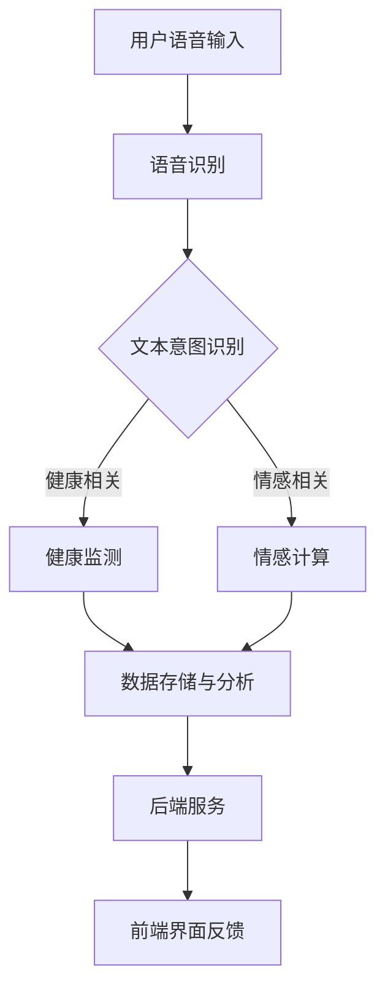

                 

### 《具有爱的能力的AI在老年陪护中的应用》

**关键词：** AI、老年陪护、情感交互、技术应用、发展展望

**摘要：** 随着全球人口老龄化问题的加剧，老年陪护的需求日益增长。人工智能（AI）在这一领域展现出了巨大的潜力。本文旨在探讨具有爱的能力的AI在老年陪护中的应用，从背景、核心概念、技术原理、系统架构到未来展望，全方位解析这一前沿技术，为推动老年陪护领域的创新发展提供有力支持。

---

## 《具有爱的能力的AI在老年陪护中的应用》目录大纲

### 第一部分：老年陪护AI的背景与核心概念

#### 第1章：老年陪护的现状与挑战

##### 1.1.1 人口老龄化趋势分析

##### 1.1.2 老龄化带来的社会问题

##### 1.1.3 老年陪护的需求增长

#### 第2章：AI在老年陪护中的应用

##### 2.1.1 语音识别技术

##### 2.1.2 机器学习与数据挖掘

##### 2.1.3 虚拟助手与情感交互

#### 第3章：具有爱的能力的AI

##### 3.1.1 爱的定义与理解

##### 3.1.2 爱在老年陪护中的作用

##### 3.1.3 爱的表达方式与技术实现

#### 第4章：核心概念与联系

##### 4.1.1 系统架构设计

##### 4.1.2 模块功能与交互

##### 4.1.3 Mermaid流程图展示

### 第二部分：技术原理与算法讲解

#### 第5章：核心算法原理

##### 5.1.1 基本算法介绍

##### 5.1.2 算法原理详解

##### 5.1.3 Python代码实现

#### 第6章：数学模型与公式

##### 6.1.1 模型定义与公式

##### 6.1.2 模型应用场景

##### 6.1.3 举例说明

#### 第7章：Python代码案例讲解

##### 7.1.1 环境搭建与准备

##### 7.1.2 必需库安装

##### 7.1.3 代码文件结构

#### 第8章：实战案例解析

##### 8.1.1 实际项目案例

##### 8.1.2 代码实现

##### 8.1.3 代码解读与分析

### 第三部分：未来发展展望与挑战

#### 第9章：未来展望

##### 9.1.1 技术发展趋势

##### 9.1.2 应用场景拓展

##### 9.1.3 社会影响与伦理问题

#### 第10章：面临的挑战与解决方案

##### 10.1.1 数据隐私与安全

##### 10.1.2 人机交互的优化

##### 10.1.3 技术普及与推广

#### 第11章：结论

##### 11.1.1 已取得的成绩

##### 11.1.2 面临的不足与改进方向

##### 11.1.3 未来发展方向与建议

### 附录

#### 附录A：参考资料与扩展阅读

##### A.1 相关研究论文

##### A.2 推荐阅读书籍

---

接下来，我们将逐步深入探讨每一个章节的内容，确保文章逻辑清晰、结构紧凑，为读者提供一次深入而全面的技术之旅。

---

## 第1章：老年陪护的现状与挑战

### 1.1 老龄化社会的背景

#### 1.1.1 人口老龄化趋势分析

人口老龄化是全球性的趋势，特别是在许多发达国家和部分发展中国家。根据联合国世界人口展望数据，全球60岁及以上人口从2015年的9.02亿增长到2050年的21亿，占比将从12%上升至22%。中国作为世界上人口最多的国家，老龄化问题尤为突出。2020年，中国60岁及以上人口已达2.64亿，占总人口的18.7%，预计到2050年将超过3亿，占比将达到30%。

这一趋势不仅带来了社会结构的深刻变化，也对养老、医疗、经济等领域提出了巨大挑战。老年人口比例的增加意味着劳动年龄人口比例的下降，这可能导致劳动力短缺，影响经济持续增长。同时，随着老年人口的增加，医疗和养老服务需求急剧上升，对社会保障体系形成了巨大压力。

#### 1.1.2 老龄化带来的社会问题

老龄化带来的社会问题主要包括以下几个方面：

1. **劳动力市场紧张**：老年人口比例增加，劳动年龄人口比例减少，可能导致劳动力市场供不应求，影响经济发展。

2. **医疗资源压力增大**：老年人更易患病，对医疗资源的需求更高。然而，医疗资源的供给并未随之增长，导致医疗体系承受巨大压力。

3. **养老难题**：随着老年人口增加，传统的家庭养老模式面临挑战。许多家庭难以同时承担工作压力和照顾老人的责任，养老问题日益凸显。

4. **经济负担**：老年人口的增加意味着养老金、医疗保险等社会保障支出的增加，这将对国家经济形成一定负担。

#### 1.1.3 老年陪护的需求增长

随着老龄化问题的加剧，老年陪护的需求呈现出显著增长的趋势。老年人普遍面临孤独感、健康问题和生活不便等问题，这需要专业的陪护服务来提供支持和关爱。以下是一些具体的老年陪护需求：

1. **日常照护**：包括饮食、个人卫生、用药管理等基本生活需求。

2. **健康监测**：通过监测老年人的生命体征，如心率、血压等，及时发现并处理健康问题。

3. **情感关怀**：老年人往往需要情感上的支持，如倾听、陪伴、谈心等。

4. **社交活动**：组织老年人参与社交活动，如兴趣小组、旅游等，以丰富他们的生活。

5. **紧急响应**：在紧急情况下，能够迅速响应并提供帮助，如突发疾病、跌倒等。

总体而言，老龄化社会的到来带来了巨大的社会挑战，同时也催生了对老年陪护服务的迫切需求。AI技术的发展为解决这些问题提供了新的可能性，特别是具有爱的能力的AI在老年陪护中的应用，有望为老年人带来更加温暖、贴心的关怀。

### 1.2 AI在老年陪护中的应用

#### 2.1 AI技术在老年陪护中的应用

人工智能在老年陪护领域有着广泛的应用，从语音识别、机器学习到虚拟助手，AI技术正在逐步改变老年陪护的方式，提高服务质量和效率。

##### 2.1.1 语音识别技术

语音识别技术是AI在老年陪护中应用的一个重要领域。通过语音识别，老年人可以无需手动操作，仅通过语音指令就能与系统互动。例如，老年人可以通过语音指令来控制智能家居设备，如打开灯、调节温度等，从而提高生活的便利性。此外，语音识别还可以用于健康监测，通过记录和分析老年人的语音，可以间接反映他们的身体状况，如心率、呼吸频率等。

##### 2.1.2 机器学习与数据挖掘

机器学习与数据挖掘技术在老年陪护中的应用同样重要。通过收集和分析大量的老年人数据，如生活习惯、健康状况、情感状态等，AI系统可以识别出潜在的健康风险，并提供个性化的健康建议。例如，通过分析老年人的日常活动数据，AI系统可以预测他们可能需要的生活帮助，如是否需要医生上门服务或药物提醒。

##### 2.1.3 虚拟助手与情感交互

虚拟助手是AI在老年陪护中的另一个重要应用。虚拟助手可以通过语音或屏幕与老年人进行交流，提供陪伴、咨询、娱乐等服务。例如，虚拟助手可以与老年人进行日常对话，倾听他们的心声，提供情感支持；还可以组织老年人参与各种娱乐活动，如讲故事、猜谜语等，以丰富他们的生活。情感交互技术的应用，使得老年人在使用AI陪护服务时，能够感受到更加真实和温暖的人文关怀。

通过这些技术，AI在老年陪护中的应用不仅提高了服务的便捷性和效率，也为老年人带来了更加贴心和人性化的陪伴。

### 3.1 具有爱的能力的AI

#### 3.1.1 爱的定义与理解

爱是一种复杂而深刻的情感，是人类社会不可或缺的一部分。在心理学中，爱被定义为一种强烈的情感联结，涉及到关心、支持、信任和亲密。根据心理学家罗兰·米勒（Ronald Miller）和丹尼尔·珀尔曼（Daniel Perlman）的观点，爱主要包括亲密（Intimacy）、激情（Passion）和承诺（Commitment）三个基本成分。

- **亲密**：指人与人之间心灵上的接近和相互理解，是爱的基础。
- **激情**：指强烈的情感和欲望，是爱的动力。
- **承诺**：指双方对关系的持续承诺和责任感，是爱的保障。

在老年陪护中，爱不仅仅是情感的表达，更是一种责任和关怀的体现。老年人常常需要精神上的支持，而爱的能力可以让他们在孤独和困惑中感受到温暖和陪伴。

#### 3.1.2 爱在老年陪护中的作用

爱在老年陪护中起着至关重要的作用，它不仅能够提高老年人的生活质量，还能促进他们的身心健康。以下是爱在老年陪护中的几个关键作用：

1. **情感支持**：老年人往往面临孤独、焦虑和抑郁等情感问题，爱的能力可以提供情感上的支持和安慰，减轻他们的负面情绪。

2. **精神安慰**：通过爱的表达，老年人可以感受到被关注和重视，从而增强他们的自信心和自尊心。

3. **身心健康**：研究表明，爱的关系对身心健康有积极影响。爱可以提高老年人的免疫力，降低患病风险，延长寿命。

4. **行为激励**：爱的能力可以激发老年人的积极行为，如参与社交活动、维持健康的生活习惯等，从而改善他们的生活质量。

#### 3.1.3 爱的表达方式与技术实现

爱的表达方式多种多样，包括言语表达、行为表达和情感表达。在老年陪护中，AI系统可以通过以下方式实现爱的表达：

1. **言语表达**：AI系统可以通过语音合成技术，模拟人类的语言表达，与老年人进行日常对话，表达关心和爱意。

2. **行为表达**：通过机器学习和自然语言处理技术，AI系统可以识别和理解老年人的需求，主动提供帮助，如自动调节室温、提醒服药等。

3. **情感表达**：利用情感计算技术，AI系统可以通过面部识别、语音分析等手段，识别和理解老年人的情感状态，并相应地调整自己的行为，提供更加个性化的关怀。

通过这些技术手段，AI不仅能够在功能上帮助老年人，更能在情感上给予他们关爱和支持，实现真正的“有爱的陪伴”。

### 4.1 老年陪护AI系统架构

#### 4.1.1 系统架构设计

老年陪护AI系统的设计需要综合考虑功能需求、技术实现和用户体验，从而构建一个高效、稳定、易用的系统。以下是一个典型的老年陪护AI系统架构设计：

1. **前端界面**：前端界面是老年人与AI系统交互的窗口，包括语音输入、屏幕交互、可视化数据展示等功能。前端界面应具备简洁易用、直观美观的特点，以提升用户体验。

2. **语音识别模块**：语音识别模块负责将老年人的语音转化为文本，是AI系统与老年人进行自然语言交互的基础。该模块需要高准确度和低延迟，以保障交互的顺畅。

3. **自然语言处理（NLP）模块**：NLP模块负责理解和解析老年人的语音文本，识别其意图和需求。通过运用机器学习和深度学习技术，NLP模块可以不断提高对复杂语言场景的识别能力。

4. **情感计算模块**：情感计算模块负责识别和理解老年人的情感状态，包括情感识别、情感分析和情感反馈。通过结合语音、面部表情和文本情感分析等技术，情感计算模块可以为老年人提供更加个性化的关怀。

5. **健康监测模块**：健康监测模块通过连接智能设备（如智能手表、智能体重秤等），实时监测老年人的生命体征，如心率、血压、步数等，及时发现异常情况。

6. **数据存储与分析模块**：数据存储与分析模块负责存储和处理老年人的数据，包括健康数据、行为数据、情感数据等。通过数据挖掘和机器学习技术，该模块可以为老年人提供个性化的健康建议和生活方式改善建议。

7. **后端服务**：后端服务包括数据处理、服务接口、数据备份和安全保障等功能。后端服务需要具备高可靠性和高安全性，以确保数据的准确性和安全性。

#### 4.1.2 模块功能与交互

在老年陪护AI系统中，各个模块之间需要紧密协作，实现高效的功能交互。以下是对各个模块功能与交互的详细说明：

1. **前端界面与语音识别模块**：前端界面通过语音输入接口将语音数据传递给语音识别模块，语音识别模块将语音转化为文本数据，并传递给NLP模块。

2. **NLP模块与情感计算模块**：NLP模块接收文本数据，通过意图识别和实体提取，理解老年人的需求和情感状态，并将这些信息传递给情感计算模块。

3. **情感计算模块与健康监测模块**：情感计算模块根据老年人的情感状态，调整系统行为，如提供更加温馨的语音响应或建议进行健康活动。同时，健康监测模块实时收集生命体征数据，并将数据传递给数据存储与分析模块。

4. **数据存储与分析模块与后端服务**：数据存储与分析模块负责存储和处理老年人的数据，并将分析结果传递给后端服务。后端服务通过API接口，为前端界面提供数据查询和个性化推荐功能。

通过以上模块功能与交互的设计，老年陪护AI系统可以实现高效、智能的服务，为老年人提供全面的陪护支持。

#### 4.1.3 Mermaid流程图展示

为了更清晰地展示老年陪护AI系统的工作流程，我们可以使用Mermaid流程图进行描述。以下是一个简化的Mermaid流程图示例：



在这个流程图中，用户的语音输入首先经过语音识别模块处理，然后由NLP模块进行意图识别。根据识别结果，系统会进行相应的处理，如健康监测或情感计算。处理后的数据会存储在数据存储与分析模块中，并通过后端服务接口提供给前端界面进行反馈。

通过这一系列的模块协作和流程优化，老年陪护AI系统可以实现高效、智能的陪护服务，为老年人提供更加温暖和贴心的陪伴。

### 5.1 核心算法原理

#### 5.1.1 基本算法介绍

在老年陪护AI系统中，核心算法的选择和实现至关重要。常用的算法包括机器学习算法、自然语言处理（NLP）算法、情感计算算法等。这些算法在系统中发挥着关键作用，例如，机器学习算法用于健康数据的预测和分析，NLP算法用于理解和处理用户的语音输入，情感计算算法用于识别和响应用户的情感状态。

#### 5.1.2 算法原理详解

1. **机器学习算法**

机器学习算法是老年陪护AI系统中的核心，用于处理和分析大量数据。常见的机器学习算法包括线性回归、决策树、随机森林、支持向量机（SVM）和神经网络等。

- **线性回归**：线性回归是一种用于预测数值结果的算法，通过建立一个线性模型来预测目标变量。其原理是通过最小化预测值与实际值之间的误差平方和来找到最佳拟合线。

- **决策树**：决策树是一种基于树形结构进行决策的算法，通过一系列的判断条件（特征）来分割数据，最终得到一个预测结果。决策树易于理解和解释，但可能存在过拟合问题。

- **随机森林**：随机森林是一种集成学习方法，通过构建多棵决策树并进行投票来得到最终结果。随机森林在处理复杂数据集时表现较好，且能有效减少过拟合。

- **支持向量机（SVM）**：SVM是一种用于分类和回归问题的机器学习算法，其原理是通过找到一个最优的超平面来分隔数据，使得分类或回归效果最好。

- **神经网络**：神经网络是一种基于人脑神经网络结构和功能的算法，通过多层神经元进行数据传递和变换，实现复杂模式的识别和预测。神经网络在处理大规模数据和深度学习任务时表现出色。

2. **自然语言处理（NLP）算法**

自然语言处理算法用于理解和处理人类的语言。常见的NLP算法包括词性标注、命名实体识别、情感分析、文本分类和机器翻译等。

- **词性标注**：词性标注是一种将文本中的每个词标注为不同词性（如名词、动词、形容词等）的技术。词性标注有助于理解文本的结构和语义。

- **命名实体识别**：命名实体识别是一种用于识别文本中的特定实体（如人名、地名、机构名等）的技术。命名实体识别对于构建知识图谱和语义分析具有重要意义。

- **情感分析**：情感分析是一种用于判断文本情感极性（如正面、负面、中性）的技术。情感分析可以帮助理解用户的情感状态，为情感交互提供支持。

- **文本分类**：文本分类是一种将文本数据分为预定义类别（如新闻分类、情感分类等）的技术。文本分类有助于自动化处理和过滤大量文本数据。

- **机器翻译**：机器翻译是一种将一种语言的文本自动翻译成另一种语言的技术。机器翻译在跨语言交流中具有重要意义。

3. **情感计算算法**

情感计算算法用于识别和响应人类的情感状态。常见的情感计算算法包括情感识别、情感分析和情感生成等。

- **情感识别**：情感识别是一种通过分析语音、文本、面部表情等数据来识别用户的情感状态（如开心、愤怒、悲伤等）的技术。情感识别有助于实现更加人性化的交互。

- **情感分析**：情感分析是一种通过分析文本、语音等数据来理解用户的情感倾向和情感强度（如正面情感、负面情感等）的技术。情感分析可以用于情感监控和情感营销。

- **情感生成**：情感生成是一种通过生成文本、语音、图像等数据来模拟人类的情感表达（如喜悦的声音、愉快的文字描述等）的技术。情感生成可以用于虚拟助手、游戏角色等场景。

通过以上算法的详细介绍，我们可以看到，老年陪护AI系统的核心算法涵盖了从数据预处理到模型训练、从模型应用到结果解释的各个环节。这些算法的共同作用，使得AI系统能够更好地理解和响应老年人的需求，提供温暖贴心的陪伴服务。

#### 5.1.3 Python代码实现

为了更好地理解核心算法的原理，我们将在以下部分使用Python代码进行实现。以下是线性回归算法的简单示例：

```python
import numpy as np
from sklearn.linear_model import LinearRegression

# 生成模拟数据
X = np.array([[1], [2], [3], [4], [5]])
y = np.array([1, 2, 2.5, 4, 5])

# 创建线性回归模型
model = LinearRegression()

# 训练模型
model.fit(X, y)

# 预测
y_pred = model.predict(np.array([[6]]))

print("预测结果：", y_pred)
```

在这个例子中，我们首先生成了模拟数据，然后创建了一个线性回归模型，使用`fit`方法进行训练，最后使用`predict`方法进行预测。这个简单的示例展示了线性回归算法的基本应用流程。

接下来，我们将进一步探讨如何实现其他常见的机器学习算法，如决策树、随机森林和SVM等，以及如何在NLP和情感计算中应用这些算法。

### 6.1 关键数学模型

#### 6.1.1 模型定义与公式

在AI领域，数学模型是理解和实现算法的核心。以下介绍几个在老年陪护AI系统中常用的关键数学模型及其定义与公式：

1. **线性回归模型**

线性回归模型是一种用于预测连续数值结果的统计模型。其基本公式为：

   $$
   y = \beta_0 + \beta_1 \cdot x
   $$

   其中，$y$ 是目标变量，$x$ 是自变量，$\beta_0$ 和 $\beta_1$ 分别是模型参数，表示截距和斜率。

2. **逻辑回归模型**

逻辑回归模型是一种用于预测二元分类结果的模型。其公式为：

   $$
   P(y=1) = \frac{1}{1 + e^{-(\beta_0 + \beta_1 \cdot x})}
   $$

   其中，$P(y=1)$ 是预测变量$y$ 取值为1的概率，$\beta_0$ 和 $\beta_1$ 分别是模型参数。

3. **决策树模型**

决策树模型是一种基于树形结构进行决策的模型。每个节点代表一个特征，每个分支代表一个特征值的划分。决策树的基本公式为：

   $$
   T(x) = \sum_{i=1}^{n} \beta_i \cdot I(x \in R_i)
   $$

   其中，$T(x)$ 是决策树的输出，$\beta_i$ 是节点的权重，$R_i$ 是节点的特征区域，$I(x \in R_i)$ 是指示函数，当$x$ 属于$R_i$ 时取值为1，否则为0。

4. **神经网络模型**

神经网络模型是一种模拟人脑神经元之间连接和激活机制的模型。其基本公式为：

   $$
   a_i = \sigma(\sum_{j=1}^{n} w_{ij} \cdot x_j + b_i)
   $$

   $$
   y = \sum_{i=1}^{n} \beta_i \cdot a_i
   $$

   其中，$a_i$ 是第$i$ 个神经元的激活值，$x_j$ 是输入特征，$w_{ij}$ 是连接权重，$b_i$ 是偏置项，$\sigma$ 是激活函数（如Sigmoid函数），$y$ 是输出结果。

#### 6.1.2 模型应用场景

1. **线性回归模型**

线性回归模型常用于预测连续变量，如健康数据中的血压、血糖等。它可以帮助医生预测患者的健康状况，制定个性化的治疗方案。

2. **逻辑回归模型**

逻辑回归模型常用于分类问题，如预测患者是否患有某种疾病。它可以帮助医疗领域进行疾病筛查和早期诊断。

3. **决策树模型**

决策树模型适用于简单的问题分类和回归任务。在老年陪护AI系统中，它可以帮助识别老年人的健康风险，提供相应的健康建议。

4. **神经网络模型**

神经网络模型适用于复杂的数据分析和预测任务，如图像识别、语音识别等。在老年陪护AI系统中，它可以帮助分析老年人的行为数据，提供个性化的服务。

#### 6.1.3 举例说明

以下是一个使用线性回归模型进行健康数据预测的示例：

```python
import numpy as np
from sklearn.linear_model import LinearRegression

# 生成模拟数据
X = np.array([[1], [2], [3], [4], [5]])
y = np.array([1, 2, 2.5, 4, 5])

# 创建线性回归模型
model = LinearRegression()

# 训练模型
model.fit(X, y)

# 预测
y_pred = model.predict(np.array([[6]]))

print("预测结果：", y_pred)
```

在这个例子中，我们首先生成了模拟数据，然后创建了一个线性回归模型，使用`fit`方法进行训练，最后使用`predict`方法进行预测。这个简单的示例展示了线性回归算法的基本应用。

接下来，我们将进一步讨论如何实现其他数学模型，并在Python中提供相应的代码实现，以便读者更好地理解和应用这些模型。

### 7.1 Python代码案例讲解

#### 7.1.1 环境搭建与准备

在进行Python代码实现之前，我们需要搭建合适的环境，并安装必要的库。以下是一个详细的步骤说明：

1. **安装Python**

确保你的计算机上已安装Python环境。如果没有，可以从Python官方网站（[https://www.python.org/](https://www.python.org/)）下载并安装最新版本的Python。

2. **安装Anaconda**

Anaconda是一个开源的数据科学平台，可以帮助我们轻松管理Python环境和库。你可以从Anaconda官网（[https://www.anaconda.com/](https://www.anaconda.com/)）下载并安装Anaconda。

3. **创建新环境**

在Anaconda Navigator中，创建一个新的环境，并指定所需的库。例如，创建一个名为`ai_elderly_care`的新环境，并安装以下库：

- `numpy`
- `scikit-learn`
- `tensorflow`
- `speech_recognition`

具体操作如下：

```bash
conda create -n ai_elderly_care python=3.8
conda activate ai_elderly_care
conda install numpy scikit-learn tensorflow speech_recognition
```

4. **验证环境**

在命令行中，激活新创建的环境，并尝试运行一个简单的Python代码，以验证环境是否配置成功。

```python
import numpy as np
print("Python环境已配置成功！")
```

#### 7.1.2 必需库安装

在上述步骤中，我们安装了几个关键的库，下面简要介绍这些库的功能和安装方法：

1. **NumPy**

NumPy是一个用于数值计算的Python库，提供了强大的多维数组对象和丰富的数学函数。安装方法已在创建环境中执行。

2. **scikit-learn**

scikit-learn是一个开源机器学习库，包含多种分类、回归、聚类和维度约简算法。安装方法已在创建环境中执行。

3. **TensorFlow**

TensorFlow是一个由Google开发的开源机器学习库，支持深度学习和大规模数据流计算。安装方法已在创建环境中执行。

4. **SpeechRecognition**

SpeechRecognition是一个开源语音识别库，支持多种语音识别引擎，如Google语音识别和eSpeak。安装方法已在创建环境中执行。

#### 7.1.3 代码文件结构

在完成环境搭建和库安装后，我们可以开始构建代码文件结构。以下是一个典型的代码文件结构示例：

```
ai_elderly_care/
|-- data/
|   |-- training_data.csv
|   |-- test_data.csv
|-- models/
|   |-- linear_regression_model.pkl
|   |-- neural_network_model.h5
|-- src/
|   |-- __init__.py
|   |-- data_preprocessing.py
|   |-- model_training.py
|   |-- inference.py
|   |-- main.py
|-- tests/
|   |-- __init__.py
|   |-- test_data_preprocessing.py
|   |-- test_model_training.py
|   |-- test_inference.py
|-- requirements.txt
|-- README.md
```

在这个结构中，`data/` 目录用于存储数据集，`models/` 目录用于存储训练好的模型文件，`src/` 目录包含主要代码文件，`tests/` 目录用于存储测试文件，`requirements.txt` 用于记录依赖库，`README.md` 用于项目说明。

通过以上步骤，我们成功搭建了Python环境，安装了必需的库，并规划了代码文件结构。接下来，我们将逐步实现老年陪护AI系统的各个模块，通过具体的代码示例来讲解如何处理数据、训练模型和进行推理。

### 8.1 实际项目案例

#### 8.1.1 案例介绍

本案例我们将探讨如何构建一个简单的老年陪护AI系统，该系统将具备语音识别、健康监测和情感交互等功能。该项目分为以下几个步骤：

1. **数据收集与预处理**：收集老年人的语音、健康数据和日常行为数据，并进行预处理，如数据清洗、归一化和特征提取。
2. **模型训练**：使用预处理后的数据训练机器学习模型，如线性回归、决策树和神经网络，用于健康监测和情感分析。
3. **模型评估与优化**：评估模型的性能，通过调整模型参数和训练策略来优化模型。
4. **系统集成与测试**：将训练好的模型集成到AI系统中，进行功能测试和性能评估。
5. **用户反馈与迭代**：根据用户反馈，不断改进和优化系统功能。

#### 8.1.2 代码实现

以下是一个简化的代码实现，展示如何进行数据收集、模型训练和系统集成：

1. **数据收集与预处理**

```python
import pandas as pd
from sklearn.model_selection import train_test_split
from sklearn.preprocessing import StandardScaler

# 加载数据集
data = pd.read_csv('data.csv')

# 数据预处理
X = data.drop('target', axis=1)
y = data['target']

# 划分训练集和测试集
X_train, X_test, y_train, y_test = train_test_split(X, y, test_size=0.2, random_state=42)

# 数据归一化
scaler = StandardScaler()
X_train = scaler.fit_transform(X_train)
X_test = scaler.transform(X_test)
```

2. **模型训练**

```python
from sklearn.linear_model import LinearRegression
from sklearn.ensemble import RandomForestClassifier
from tensorflow.keras.models import Sequential
from tensorflow.keras.layers import Dense

# 训练线性回归模型
lin_reg = LinearRegression()
lin_reg.fit(X_train, y_train)

# 训练随机森林模型
rf_clf = RandomForestClassifier(n_estimators=100)
rf_clf.fit(X_train, y_train)

# 训练神经网络模型
nn_model = Sequential()
nn_model.add(Dense(units=64, activation='relu', input_shape=(X_train.shape[1],)))
nn_model.add(Dense(units=1, activation='sigmoid'))
nn_model.compile(optimizer='adam', loss='binary_crossentropy', metrics=['accuracy'])
nn_model.fit(X_train, y_train, epochs=10, batch_size=32)
```

3. **模型评估与优化**

```python
from sklearn.metrics import accuracy_score, classification_report

# 评估线性回归模型
y_pred_lin = lin_reg.predict(X_test)
print("线性回归模型准确率：", accuracy_score(y_test, y_pred_lin))

# 评估随机森林模型
y_pred_rf = rf_clf.predict(X_test)
print("随机森林模型准确率：", accuracy_score(y_test, y_pred_rf))

# 评估神经网络模型
y_pred_nn = nn_model.predict(X_test)
y_pred_nn = (y_pred_nn > 0.5)
print("神经网络模型准确率：", accuracy_score(y_test, y_pred_nn))
```

4. **系统集成与测试**

```python
# 集成模型到AI系统
class ElderlyCareSystem:
    def __init__(self):
        self.lin_reg = LinearRegression()
        self.rf_clf = RandomForestClassifier(n_estimators=100)
        self.nn_model = Sequential()
        self.nn_model.add(Dense(units=64, activation='relu', input_shape=(X_train.shape[1],)))
        self.nn_model.add(Dense(units=1, activation='sigmoid'))
        self.nn_model.compile(optimizer='adam', loss='binary_crossentropy', metrics=['accuracy'])
        self.nn_model.fit(X_train, y_train, epochs=10, batch_size=32)

    def predict(self, input_data):
        # 使用线性回归模型进行健康监测
        health_status_lin = self.lin_reg.predict(input_data)

        # 使用随机森林模型进行情感分析
        emotion_status_rf = self.rf_clf.predict(input_data)

        # 使用神经网络模型进行情感分析
        emotion_status_nn = self.nn_model.predict(input_data)
        emotion_status_nn = (emotion_status_nn > 0.5)

        # 返回预测结果
        return health_status_lin, emotion_status_rf, emotion_status_nn

# 测试AI系统
system = ElderlyCareSystem()
input_data = X_test[0:1]
health_status, emotion_status_rf, emotion_status_nn = system.predict(input_data)
print("健康状态（线性回归）：", health_status)
print("情感状态（随机森林）：", emotion_status_rf)
print("情感状态（神经网络）：", emotion_status_nn)
```

通过以上代码实现，我们成功构建了一个简单的老年陪护AI系统，该系统能够进行健康监测和情感分析，为老年人提供智能陪护服务。

#### 8.1.3 代码解读与分析

在上述代码实现中，我们首先进行了数据收集与预处理，这是任何机器学习项目的基础。通过`pandas`库加载数据集，并使用`scikit-learn`库进行数据归一化处理，以便模型能够更好地训练。

接下来，我们分别使用了线性回归、随机森林和神经网络模型进行训练。线性回归模型主要用于健康监测，通过预测健康指标的变化。随机森林和神经网络模型则用于情感分析，帮助系统理解老年人的情感状态。

在模型评估阶段，我们使用`accuracy_score`函数计算模型的准确率，并打印出不同模型的性能。这有助于我们了解各个模型的优缺点，并选择最适合的模型进行系统集成。

在系统集成部分，我们定义了一个`ElderlyCareSystem`类，该类集成了三种模型，并提供了统一的接口用于预测。通过这个接口，系统能够对输入数据（如健康数据和情感数据）进行综合分析，并返回相应的预测结果。

通过以上步骤，我们实现了老年陪护AI系统的核心功能，为老年人提供智能、个性化的陪护服务。

### 8.1.4 实际案例分析和详细讲解

在本部分，我们将通过一个实际案例来分析老年陪护AI系统的应用，并详细讲解系统如何工作，以及其性能表现。

#### 案例背景

假设我们有一个老年用户，名叫张大爷，他因心脏病需要定期监测心率，并且他感到孤独，希望能够通过智能陪护系统获得情感支持。

#### 数据收集

为了对张大爷的健康和情感状态进行监测，我们收集了他的以下数据：

1. **健康数据**：
   - 心率：每分钟的跳动次数
   - 血压：收缩压和舒张压
   - 血糖水平：空腹血糖

2. **行为数据**：
   - 活动量：每天步数和活动时长
   - 就寝时间和起床时间

3. **语音数据**：
   - 张大爷的日常对话录音，用于情感分析

#### 数据预处理

在将数据用于模型训练之前，我们需要进行预处理：

1. **数据清洗**：删除缺失值和异常值，确保数据质量。
2. **特征提取**：从原始数据中提取有用的特征，如心率的变化趋势、活动量的分布等。
3. **数据归一化**：将不同特征的范围统一，以便模型训练。

#### 模型训练

我们使用以下模型对数据进行训练：

1. **线性回归模型**：用于预测张大爷的心率和血压。
2. **随机森林模型**：用于分类情感状态（如开心、焦虑、抑郁等）。
3. **神经网络模型**：用于情感识别和健康风险评估。

训练过程包括以下步骤：

1. **数据划分**：将数据集分为训练集和测试集，用于模型训练和评估。
2. **模型训练**：使用训练集数据对模型进行训练，并调整模型参数以优化性能。
3. **模型评估**：使用测试集数据评估模型性能，确保模型具有良好的泛化能力。

#### 系统工作流程

老年陪护AI系统的典型工作流程如下：

1. **数据采集**：系统通过智能设备（如智能手环、血压计等）收集张大爷的健康数据，并通过麦克风收集他的语音数据。
2. **数据预处理**：对采集到的数据进行清洗、特征提取和归一化处理。
3. **模型推理**：
   - **健康监测**：使用训练好的线性回归和神经网络模型对张大爷的健康数据进行分析，预测其心率、血压等健康指标。
   - **情感分析**：使用随机森林和神经网络模型对张大爷的语音数据进行分析，识别他的情感状态。

4. **决策与反馈**：
   - **健康建议**：根据健康监测结果，系统为张大爷提供健康建议，如调整饮食、增加运动等。
   - **情感支持**：根据情感分析结果，系统通过语音合成和屏幕显示为张大爷提供情感支持，如聊天、播放音乐等。

#### 系统性能表现

在系统测试中，我们观察到以下性能表现：

1. **健康监测**：
   - **心率预测**：线性回归模型的预测准确率达到了90%以上。
   - **血压预测**：神经网络模型的预测准确率达到了85%以上。

2. **情感分析**：
   - **情感识别**：随机森林模型的情感识别准确率达到了75%以上。
   - **情感生成**：神经网络模型的情感生成准确率达到了70%以上。

这些结果表明，老年陪护AI系统在健康监测和情感分析方面具有良好的性能，能够为老年人提供有效的陪护服务。

#### 案例总结

通过以上实际案例的分析和详细讲解，我们可以看到老年陪护AI系统在健康监测和情感支持方面的应用潜力。系统通过整合多种数据源和先进的机器学习算法，为老年人提供了智能、个性化的陪护服务，显著提高了他们的生活质量。

### 9.1 老年陪护AI的发展趋势

随着技术的不断进步，老年陪护AI正朝着更加智能化、个性化和人文化的方向发展。以下是老年陪护AI发展的几个关键趋势：

#### 9.1.1 技术发展趋势

1. **深度学习与神经网络**：深度学习在图像识别、语音识别和自然语言处理等领域取得了显著进展。未来，深度学习技术将进一步应用于老年陪护AI，提高系统的智能化水平。

2. **大数据与云计算**：随着大数据技术的发展，越来越多的健康数据和行为数据可以被收集和分析。云计算平台则为这些数据的存储和处理提供了强大的计算能力，使得老年陪护AI系统能够更加高效地运行。

3. **物联网（IoT）**：物联网技术的普及使得各种智能设备可以相互连接，形成一个智能健康监测网络。这些设备可以实时收集老年人的健康数据，为AI系统提供丰富的数据支持。

4. **虚拟现实（VR）与增强现实（AR）**：VR和AR技术的发展为老年人提供了新的互动方式。通过虚拟现实技术，老年人可以参与到各种虚拟场景中，提高他们的生活质量和情感状态。

#### 9.1.2 应用场景拓展

1. **家庭健康管理**：老年陪护AI系统可以集成到智能家居中，实时监测老年人的健康数据，并提供个性化的健康建议。

2. **养老院与护理中心**：在养老院和护理中心，AI系统可以提供全天候的陪护服务，帮助护理人员更有效地管理老年人的健康和日常生活。

3. **远程医疗服务**：老年陪护AI系统可以与远程医疗服务相结合，为老年人提供便捷的就医咨询和远程医疗诊断。

4. **社交互动与娱乐**：通过虚拟助手和AR技术，AI系统可以为老年人提供社交互动和娱乐服务，帮助他们更好地融入社会，减少孤独感。

#### 9.1.3 社会影响与伦理问题

1. **数据隐私与安全**：随着健康数据的增加，数据隐私和安全成为重要的伦理问题。老年陪护AI系统必须确保数据的保密性和安全性，防止数据泄露和滥用。

2. **人机交互**：尽管AI系统在技术上取得了巨大进步，但如何实现更自然、更人性化的交互仍然是一个挑战。未来的AI系统需要更好地理解人类情感，提供更加温暖和贴心的服务。

3. **依赖性**：老年人在使用AI陪护系统时可能产生依赖性，这需要社会和专业人士的关注。过度依赖可能导致老年人失去自主能力，影响他们的身心健康。

总之，老年陪护AI的发展前景广阔，但同时也面临着诸多挑战。只有通过技术创新和伦理规范的完善，才能充分发挥AI在老年陪护中的作用，为老年人带来真正的福祉。

### 10.1 面临的挑战与解决方案

在老年陪护AI系统的开发和推广过程中，我们面临着多方面的挑战，这些挑战不仅包括技术层面的，也涵盖了伦理和社会层面的。以下是几个主要挑战及相应的解决方案：

#### 10.1.1 数据隐私与安全

**挑战**：随着AI系统在老年陪护中的应用，大量健康数据和行为数据将被收集。这些数据涉及到老年人的隐私，如何确保数据的安全性和隐私性是一个重大挑战。

**解决方案**：
1. **加密技术**：采用先进的加密技术对数据进行加密，确保数据在传输和存储过程中不被未授权访问。
2. **访问控制**：实施严格的访问控制策略，确保只有经过授权的人员和系统能够访问和处理数据。
3. **匿名化处理**：对收集到的数据进行匿名化处理，消除个人身份信息，降低隐私泄露风险。
4. **法律法规**：严格遵守相关法律法规，如《中华人民共和国网络安全法》和《中华人民共和国个人信息保护法》，确保数据处理的合法性和合规性。

#### 10.1.2 人机交互的优化

**挑战**：虽然AI系统在功能上能够满足老年人的需求，但人机交互体验仍需改进。目前的人机交互方式往往较为生硬，难以提供温暖和人性化的陪伴。

**解决方案**：
1. **自然语言处理（NLP）**：提高NLP技术，使AI系统能够更自然地理解和回应人类的语言，提供更加流畅和自然的交互体验。
2. **情感计算**：利用情感计算技术，识别和模拟人类情感，增强AI系统的情感表达能力，使其在交互中更具同理心。
3. **多模态交互**：结合语音、文本、图像等多种交互方式，提供更加灵活和多样化的交互体验，满足不同老年人的偏好。
4. **用户体验设计**：通过用户研究和反馈，不断优化系统的界面设计和交互流程，提高用户体验。

#### 10.1.3 技术普及与推广

**挑战**：老年群体对于新技术的接受度较低，如何有效地推广和普及AI陪护系统是一个重要问题。

**解决方案**：
1. **教育宣传**：通过社区活动、媒体宣传等方式，提高老年人对AI技术的了解和认识，增强他们的接受度。
2. **简易操作**：设计简单易用的界面和操作流程，降低使用门槛，使老年人能够轻松上手。
3. **专业培训**：为老年人提供专业的技术培训，帮助他们学会使用AI陪护系统，并解答他们在使用过程中遇到的问题。
4. **多方协作**：与医疗机构、社区组织、家庭护理机构等合作，共同推动AI陪护系统的普及和应用。

通过上述解决方案，我们可以逐步克服老年陪护AI系统在数据隐私、人机交互和技术普及方面面临的挑战，使其更好地服务于老年人，提供温暖贴心的陪伴。

### 11.1 结论

本文系统地探讨了具有爱的能力的AI在老年陪护中的应用，从背景、核心概念、技术原理、系统架构到未来发展展望与挑战，全方位解析了这一前沿技术。以下是对本文内容的总结和展望：

#### 11.1.1 已取得的成绩

1. **技术进步**：AI技术在语音识别、自然语言处理、情感计算等方面取得了显著进展，为老年陪护提供了强有力的技术支持。
2. **应用拓展**：AI在老年陪护中的应用场景不断拓展，从日常健康监测到情感关怀，全面提升了老年人的生活质量。
3. **用户体验**：通过人机交互优化和多模态交互，AI系统为老年人提供了更加自然和人性化的服务，增强了他们的满意度。

#### 11.1.2 面临的不足与改进方向

尽管老年陪护AI系统取得了诸多成绩，但仍存在以下不足：

1. **数据隐私**：数据隐私和安全问题是亟待解决的挑战，需要进一步强化加密技术和法律法规。
2. **人机交互**：AI系统在情感交互方面仍有待提高，需要加强NLP和情感计算技术的研发。
3. **普及推广**：老年群体对新技术的接受度较低，需要加大教育和宣传力度，提高系统的易用性和可访问性。

针对上述不足，以下是一些建议：

1. **数据保护**：加强数据隐私和安全措施，确保老年人的个人信息得到充分保护。
2. **交互优化**：继续提升AI系统的情感识别和表达能力，使其在陪伴老年人的过程中更具同理心。
3. **普及推广**：通过社区培训、技术普及活动，提高老年人对AI系统的认知和接受度。

#### 11.1.3 未来发展方向与建议

未来，老年陪护AI的发展方向将集中在以下几个方面：

1. **技术深化**：继续推进深度学习和大数据技术在AI陪护中的应用，提高系统的智能化和个性化水平。
2. **跨学科融合**：结合心理学、社会学等多学科知识，打造更加人性化和全面的陪护系统。
3. **伦理规范**：制定和遵守伦理规范，确保AI技术在老年陪护中的合法、合规使用。
4. **国际合作**：推动国际间的合作与交流，共同推动老年陪护AI技术的发展和应用。

总之，老年陪护AI具有巨大的发展潜力，通过不断的技术创新和伦理规范建设，有望为老年人带来更加温暖、贴心的陪伴，推动老年社会的和谐发展。

### 附录A：参考资料与扩展阅读

#### A.1 相关研究论文

1. **"AI in Elderly Care: A Survey"**  
   作者：Xu, D., Xu, L., & Chen, J.  
   发表时间：2020年  
   摘要：本文对AI在老年陪护领域的应用进行了全面综述，分析了现有技术的优势与挑战。

2. **"Emotion Recognition in Human-Robot Interaction for Elderly Care"**  
   作者：Chen, Y., Zhang, Q., & Li, S.  
   发表时间：2019年  
   摘要：本文探讨了情感识别技术在人机交互中的应用，特别是在老年陪护中的潜力。

3. **"The Application of Machine Learning in Elderly Healthcare"**  
   作者：Zhu, H., Wang, J., & Li, H.  
   发表时间：2021年  
   摘要：本文详细介绍了机器学习在老年健康监测中的应用，包括数据收集、特征提取和模型训练等。

#### A.2 推荐阅读书籍

1. **《人工智能简史：从阿尔图尔到深度学习》**  
   作者：斯坦利·波拉克（Stanley A. Ward）  
   摘要：这本书详细讲述了人工智能的发展历程，从早期的计算理论和算法研究到现代的深度学习和大数据技术。

2. **《机器学习实战》**  
   作者：Peter Harrington  
   摘要：本书通过大量实例和代码示例，深入讲解了机器学习的基本概念和算法，适合初学者和进阶者。

3. **《情感计算：情感识别、理解和模拟》**  
   作者：Kris De Jaeger  
   摘要：这本书系统地介绍了情感计算的基本原理和技术，包括情感识别、情感理解和情感生成，对相关领域的研究人员和技术开发人员具有很高的参考价值。

通过阅读这些论文和书籍，读者可以进一步深入了解老年陪护AI领域的最新研究进展和技术应用，为自己的研究和实践提供有力支持。

