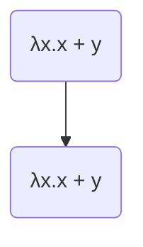
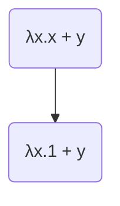
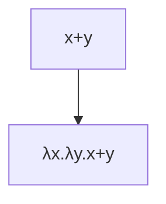

                 

### 函数式编程与Lambda演算：类型论的实践

#### 关键词
- 函数式编程
- Lambda演算
- 类型论
- 实践
- 类型检查
- 高阶函数

#### 摘要
本文旨在深入探讨函数式编程与Lambda演算之间的密切联系，以及它们在类型论中的应用。通过对函数式编程基础、Lambda演算原理、类型论核心概念及其相互关系的详细讲解，本文揭示了函数式编程在现代软件开发中的重要性。同时，通过实例分析和代码展示，读者将能够理解并掌握这些概念的实际应用，为深入探索函数式编程和Lambda演算打下坚实的基础。

## 第一部分：基础概念

### 第1章 函数式编程基础

函数式编程（Functional Programming，FP）是一种编程范式，它以数学函数为基础，强调使用不可变数据和纯函数来编写程序。与命令式编程（Imperative Programming）不同，函数式编程注重描述程序要实现的功能，而非具体的执行步骤。下面将介绍函数式编程与命令式编程的对比，以及其核心思想和基本特性。

#### 1.1 函数式编程与命令式编程对比

**函数式编程的优势**：
1. **无状态性**：函数式编程中的函数通常不依赖于外部状态，这减少了并发编程中的同步问题。
2. **不可变性**：数据一旦创建，就不会被修改，这简化了程序逻辑，并降低了出错的可能性。
3. **函数组合**：函数可以作为参数传递，并返回其他函数，这使得代码更加模块化，易于复用。

**函数式编程的核心思想**：
1. **函数第一**：将函数视为第一类公民，即函数可以被赋值给变量、作为参数传递、作为返回值返回。
2. **纯函数**：纯函数是一种没有副作用（不修改外部状态、不产生可观测的副作用）的函数，其输出仅依赖于输入。

**函数式编程的基本特性**：
1. **不可变性**：数据一旦创建，就不能修改。
2. **无状态性**：函数不依赖于外部状态。
3. **延迟计算**：函数在执行时可以延迟计算，直到实际需要结果时才进行计算。
4. **递归**：函数式编程中常用递归来实现循环操作，而不是传统的迭代。

#### 1.2 函数的定义与特性

**函数的定义**：
在函数式编程中，函数是一个映射，它将输入映射到输出。函数通常表示为 f(x)，其中 f 是函数名，x 是输入。

**函数的特性**：
1. **高阶函数**：高阶函数是能够接受函数作为参数，或者返回函数的函数。例如，`map`、`filter`和`reduce`都是高阶函数。
2. **柯里化**：柯里化是一种将多参数函数转换为一系列单参数函数的技术。它可以通过部分应用参数来提高代码的复用性。
3. **函数组合**：函数组合是将两个或多个函数组合成一个新函数的技术。组合函数 f(g(x)) 可以通过将函数 g 作为 f 的参数来定义。

#### 1.3 Lambda表达式基础

Lambda表达式是一种匿名函数的定义方式，它允许在程序中以简洁的形式定义函数。下面将介绍Lambda表达式的语法结构、与匿名函数的关系及其在实际编程中的应用。

**Lambda表达式的语法结构**：
Lambda表达式通常写作 `lambda 参数：表达式`。例如，一个简单的加法函数可以表示为：
```python
add = lambda x, y: x + y
```
这里，`lambda x, y` 定义了一个有两个参数的匿名函数，`x + y` 是该函数的表达式部分。

**Lambda表达式与匿名函数**：
匿名函数是一种没有显式函数名的函数。在函数式编程语言中，如Python，JavaScript和Java中，Lambda表达式用于创建匿名函数。Lambda表达式提供了定义匿名函数的便捷方式，使得代码更加简洁。

**Lambda表达式在实际编程中的应用**：
1. **高阶函数**：Lambda表达式常用于高阶函数中，如`map`、`filter`和`reduce`等。
2. **回调函数**：在事件驱动编程中，Lambda表达式可以用于定义回调函数。
3. **函数组合**：Lambda表达式可以用于组合函数，实现更复杂的函数逻辑。

通过以上对函数式编程基础概念的介绍，我们可以看到函数式编程与命令式编程在思想和方法论上的显著差异。函数式编程强调函数、不可变数据和纯函数，而命令式编程则侧重于状态和流程的控制。理解这些基础概念对于深入探索函数式编程和Lambda演算至关重要。

### 第2章 Lambda演算

Lambda演算（Lambda Calculus）是函数式编程的理论基础，由逻辑学家阿尔弗雷德·诺思·怀特海德（Alonzo Church）在20世纪30年代提出。Lambda演算不仅是一种形式系统，还是一种描述函数组合和变量绑定方法的形式语言。本章将介绍Lambda演算的起源、基本概念、变量绑定与替换规则以及函数的定义与应用。

#### 2.1 Lambda演算的起源

Lambda演算的起源可以追溯到逻辑学领域。在20世纪20年代，逻辑学家们试图找到一种形式化的方法来描述和证明数学命题。怀特海德和数学家贝特兰·罗素合作，提出了类型论（Type Theory）来解决这个问题。在类型论的研究过程中，他们引入了Lambda演算，作为一种用于表示函数组合和变量绑定形式的语言。

Lambda演算的发展对计算机科学产生了深远的影响。它不仅为函数式编程提供了理论基础，还为编译器设计、自动定理证明和形式验证等领域提供了重要的工具。

#### 2.2 Lambda演算的基本概念

**Lambda表达式**：Lambda表达式是Lambda演算中最基本的形式单元。一个Lambda表达式表示一个匿名函数，其语法为 `λx.表达式`，其中 `x` 是形参，`表达式` 是函数体。例如，表示一个求和函数的Lambda表达式可以写作：

这里，`λx.x + y` 表示一个有两个参数的函数，参数分别为 `x` 和 `y`。

**变量绑定与替换**：变量绑定（Variable Binding）是Lambda演算中的核心概念，用于将变量与具体的值关联起来。在Lambda表达式中，变量绑定通过形参实现。变量替换（Variable Substitution）是将变量替换为具体值的过程。例如，对于Lambda表达式 `λx.x + y`，我们可以通过变量替换来计算其结果：

这里，将形参 `x` 替换为值 `1`，得到表达式 `λx.1 + y`。

**Alpha转换**：Alpha转换（Alpha Conversion）是一种变量名的替换规则，用于确保Lambda表达式的等价性。Alpha转换允许我们替换Lambda表达式中的变量名，只要替换后不改变表达式的语义。例如，将Lambda表达式 `λx.x + y` 中的 `x` 替换为 `z`，得到 `λz.z + y`。

#### 2.3 函数的定义与应用

在Lambda演算中，函数是通过Lambda表达式来定义的。Lambda表达式不仅表示匿名函数，还可以用于函数的定义、递归以及函数的组合。

**函数的递归定义**：在Lambda演算中，递归可以通过将函数作为自己的参数来实现。例如，定义一个计算阶乘的函数：
```mermaid
graph TB
A(λf.λn.if n=0 1 else n*f(n-1)) --> B(λf.λn.if n=0 1 else n*f(n-1))
```
这里，`λf.λn.if n=0 1 else n*f(n-1)` 表示一个递归函数，其参数为函数 `f` 和自变量 `n`。

**函数的应用示例**：Lambda演算中的函数可以用于各种计算和数据处理任务。以下是一个简单的例子，使用Lambda表达式计算列表中所有元素的和：
```python
sum_list = lambda xs: reduce(lambda x, y: x + y, xs)
```
这里，`reduce` 函数是一个高阶函数，它使用Lambda表达式 `lambda x, y: x + y` 来计算两个数的和，并应用于列表 `xs` 中的所有元素。

通过以上对Lambda演算的基本概念的介绍，我们可以看到Lambda演算作为一种形式系统，为函数式编程提供了强大的理论基础。它通过Lambda表达式、变量绑定和替换规则以及函数的递归定义，为函数组合和编程提供了简洁而灵活的表达方式。

### 第3章 类型论基础

类型论（Type Theory）是数学和计算机科学中的一个分支，它研究数据类型的性质和分类。类型论在编程语言设计中扮演着重要角色，它提供了一种形式化的方法来定义类型系统，以确保程序的正确性和安全性。本章将介绍类型论的基础概念，包括类型系统的定义、作用以及函数类型和类型检查的基本概念。

#### 3.1 类型系统的概念

**类型系统的定义**：类型系统是一种机制，用于为程序中的表达式和变量分配类型。类型系统的作用是确保程序在运行时不会发生类型错误，从而提高程序的安全性和可靠性。

**类型系统的作用**：
1. **错误检测**：在编译时或运行时，类型系统可以检测出类型错误，例如将一个字符串与一个数字进行不兼容的操作。
2. **代码优化**：类型信息可以帮助编译器进行代码优化，例如消除某些类型的检查或进行内存分配优化。
3. **程序可理解性**：类型系统可以增强程序的可理解性，使得代码的结构和意图更加清晰。

**类型系统的分类**：
1. **静态类型系统**：在编译时确定变量和表达式的类型。
2. **动态类型系统**：在运行时确定变量和表达式的类型。
3. **强类型系统**：对类型之间的兼容性有严格的限制，以确保不会发生类型错误。
4. **弱类型系统**：对类型之间的兼容性限制较松，可能导致类型错误。

#### 3.2 函数类型与类型检查

**函数类型**：在类型论中，函数类型是一种特殊的数据类型，用于表示函数。函数类型由参数类型和返回类型组成。例如，一个有两个整数参数并返回一个整数的函数类型可以表示为 `Int × Int → Int`。

**类型检查的过程**：类型检查是在编译时或运行时对程序中的表达式进行类型验证的过程。类型检查的主要目标是确保程序在执行时不会发生类型错误。

**类型检查的算法**：
1. **静态类型检查**：在编译时对程序进行类型检查，确保所有表达式都符合类型系统的规则。
2. **动态类型检查**：在运行时对程序进行类型检查，通过运行时类型信息来验证表达式的类型。

**类型推导**：类型推导是一种自动确定变量和表达式类型的方法。类型推导可以分为两种类型：
1. **显式类型推导**：程序员显式地指定变量的类型。
2. **隐式类型推导**：编译器或解释器自动推导变量的类型。

#### 3.3 基本类型系统

**具体类型**：具体类型是具有明确值域和操作集合的类型，例如整数（Int）和字符串（String）。具体类型的操作通常具有确定的语义。

**泛型类型**：泛型类型是一种可以接受任意类型参数的类型，例如列表（List）和映射（Map）。泛型类型允许编写通用代码，同时保持类型的灵活性。

**标记类型**：标记类型（Tagged Types）是一种用于表示复合类型的类型系统。标记类型通过在基本类型上添加标记来区分不同的复合类型。例如，一个表示用户的标记类型可以包括用户名、密码和其他属性。

通过以上对类型论基础概念的介绍，我们可以看到类型论在编程语言设计中的重要性。类型系统不仅提高了程序的安全性，还提供了代码优化和可理解性的途径。理解类型论的基本概念对于编写正确、安全和高效的程序至关重要。

### 第4章 Lambda演算与类型论

Lambda演算与类型论之间存在着深刻的联系。Lambda演算为函数组合和变量绑定提供了形式化的描述方法，而类型论则为Lambda演算提供了类型系统，以确保函数的可组合性和安全性。本章将探讨Lambda演算与类型论的关系，包括Lambda演算在类型论中的应用、类型论在Lambda演算中的体现以及类型推导与类型检查的过程。

#### 4.1 Lambda演算与类型论的关系

Lambda演算和类型论都是形式系统，但它们各自关注不同的方面。Lambda演算关注函数的定义和组合，而类型论关注数据的类型和类型系统。然而，这两者在实际编程中是紧密相连的。

**Lambda演算在类型论中的应用**：
1. **变量绑定**：类型论通过类型系统为Lambda演算中的变量绑定提供语义，确保变量在绑定时具有正确的类型。
2. **函数组合**：类型论通过类型系统来确保函数的组合不会产生类型错误，从而保证程序的正确性。
3. **类型检查**：类型论通过类型检查来验证Lambda表达式的类型，确保程序在执行时不会发生类型错误。

**类型论在Lambda演算中的体现**：
1. **函数类型**：Lambda演算中的函数类型是类型论的重要组成部分，用于表示函数的参数和返回类型。
2. **类型推导**：类型论通过类型推导来自动确定Lambda表达式的类型，使得编程更加简洁和高效。
3. **类型检查**：类型论通过类型检查来确保Lambda演算中的变量和函数符合类型系统的规则，从而提高程序的正确性。

#### 4.2 类型推导与类型检查

**类型推导**：类型推导是一种自动确定表达式类型的方法。类型推导可以分为静态推导和动态推导。

1. **静态推导**：静态推导是在编译时确定变量和表达式的类型。静态推导的优点是能够提前发现类型错误，从而减少运行时错误的可能性。常见的静态类型推导方法包括 Hindley-Milner类型推导。
2. **动态推导**：动态推导是在运行时确定变量和表达式的类型。动态推导通常用于动态类型语言，如Python和JavaScript。动态推导的优点是灵活性更高，但可能会增加运行时开销。

**类型检查**：类型检查是一种验证表达式类型是否符合类型系统规则的过程。类型检查可以分为两种类型：静态类型检查和动态类型检查。

1. **静态类型检查**：静态类型检查是在编译时进行类型验证。静态类型检查的优点是能够在编译时发现类型错误，从而提前修复。常见的静态类型检查方法包括强类型检查和类型推断。
2. **动态类型检查**：动态类型检查是在运行时进行类型验证。动态类型检查的优点是灵活性更高，但可能会增加运行时开销。常见的动态类型检查方法包括类型标记和类型转换。

**类型推导的过程**：
1. **环境建立**：类型推导首先需要建立类型环境，用于存储变量和函数的类型信息。
2. **表达式分析**：类型推导然后对表达式进行分析，根据类型规则推导表达式的类型。
3. **类型绑定**：类型推导将表达式的类型绑定到类型环境中的变量，从而确保变量在绑定时具有正确的类型。

**类型检查的算法**：
1. **抽象语法树（AST）构建**：类型检查首先需要构建抽象语法树（AST），用于表示程序的结构。
2. **类型分析**：类型分析是对AST进行类型验证，确保每个表达式都符合类型系统的规则。
3. **类型上下文**：类型分析需要使用类型上下文来存储类型信息，并确保类型推导和类型检查的一致性。

通过以上对Lambda演算与类型论的关系、类型推导与类型检查的介绍，我们可以看到Lambda演算和类型论在函数式编程中的重要性。Lambda演算提供了函数组合和变量绑定的形式化描述，而类型论则通过类型系统来确保程序的正确性和安全性。理解这些概念对于深入探索函数式编程和编程语言设计至关重要。

### 第5章 函数式编程在实际编程中的应用

函数式编程在现代软件开发中越来越受到重视，其主要原因在于其带来的编程简洁性和程序可靠性。在这一章中，我们将探讨函数式编程在Web开发、数据处理以及其他领域中的应用，通过具体的实例来展示函数式编程如何提升编程效率和代码可维护性。

#### 5.1 函数式编程在Web开发中的应用

Web开发是函数式编程的一个重要应用场景。React、Redux和Node.js等框架已经成为现代Web开发的基石，而它们都广泛采用了函数式编程的原理。

**React**：React是一个用于构建用户界面的JavaScript库，它通过虚拟DOM和组件化设计提供了高效的性能和灵活的架构。React的核心思想之一就是函数式编程。在React中，组件的状态是纯函数，这意味着状态不会在组件内部被修改，而是通过函数来更新。以下是一个简单的React组件示例，展示了使用纯函数管理状态的原理：

```javascript
import React, { useState } from 'react';

const Counter = () => {
  const [count, setCount] = useState(0);

  const handleIncrement = () => {
    setCount(count + 1);
  };

  return (
    <div>
      <p>Count: {count}</p>
      <button onClick={handleIncrement}>Increment</button>
    </div>
  );
};

export default Counter;
```

**Redux**：Redux是一个用于管理应用程序状态的状态管理库。它通过不可变数据结构和纯函数来更新状态，确保了状态的不可变性和可预测性。在Redux中，reducers接收当前状态和一个action，并返回一个新的状态。这是一个典型的纯函数示例：

```javascript
const counterReducer = (state = { count: 0 }, action) => {
  switch (action.type) {
    case 'INCREMENT':
      return { count: state.count + 1 };
    case 'DECREMENT':
      return { count: state.count - 1 };
    default:
      return state;
  }
};
```

**Node.js**：Node.js是一个基于Chrome V8引擎的JavaScript运行时，它支持异步编程和事件驱动架构。异步编程是函数式编程的一个重要方面。在Node.js中，异步操作通常通过回调函数实现。以下是一个使用异步编程风格的示例：

```javascript
const fs = require('fs');

fs.readFile('example.txt', (err, data) => {
  if (err) {
    console.error(err);
  } else {
    console.log(data.toString());
  }
});
```

#### 5.2 函数式编程在数据处理中的应用

函数式编程在数据处理和数据分析中也非常有用。它提供了高阶函数、Lambda表达式和函数组合等工具，使得数据处理变得更加简洁和高效。

**高阶函数**：高阶函数是可以接受函数作为参数或返回函数的函数。在数据处理中，高阶函数如`map`、`filter`和`reduce`经常用于处理数组。

以下是一个使用`map`和`filter`的高阶函数处理数组的示例：

```python
numbers = [1, 2, 3, 4, 5]

squared_numbers = list(map(lambda x: x * x, numbers))
filtered_numbers = list(filter(lambda x: x % 2 == 0, numbers))

print(squared_numbers)  # 输出：[1, 4, 9, 16, 25]
print(filtered_numbers)  # 输出：[2, 4]
```

**Lambda表达式**：Lambda表达式是一种匿名函数的定义方式，它可以在数据处理中提供简洁的表达方式。以下是一个使用Lambda表达式对列表进行排序的示例：

```python
numbers = [3, 1, 4, 1, 5, 9, 2, 6]

sorted_numbers = sorted(numbers, key=lambda x: x % 2)

print(sorted_numbers)  # 输出：[1, 1, 3, 2, 4, 6, 5, 9]
```

**函数组合**：函数组合是将多个函数组合成一个新函数的技术，它可以在数据处理中实现复杂的操作。以下是一个使用函数组合计算列表中所有元素的和的示例：

```python
def add(x, y): return x + y
def square(x): return x * x

def compose(f, g): return lambda x: f(g(x))

sum_of_squares = compose(add, square)(numbers)

print(sum_of_squares)  # 输出：144
```

#### 5.3 函数式编程在其他领域中的应用

除了Web开发和数据处理，函数式编程在其他领域如机器学习和算法设计中也得到广泛应用。

**机器学习**：在机器学习中，函数式编程的不可变性和纯函数特性使得模型训练和推理过程更加可预测和可维护。以下是一个使用Python中的`numpy`库进行矩阵计算的示例：

```python
import numpy as np

A = np.array([[1, 2], [3, 4]])
B = np.array([[5, 6], [7, 8]])

dot_product = np.dot(A, B)

print(dot_product)  # 输出：[[19 22], [43 50]]
```

**算法设计**：函数式编程提供了简洁和高效的算法设计工具，例如快速排序和归并排序。以下是一个使用Python实现快速排序的示例：

```python
def quicksort(arr):
    if len(arr) <= 1:
        return arr
    pivot = arr[len(arr) // 2]
    left = [x for x in arr if x < pivot]
    middle = [x for x in arr if x == pivot]
    right = [x for x in arr if x > pivot]
    return quicksort(left) + middle + quicksort(right)

arr = [3, 6, 8, 10, 1, 2, 1]
sorted_arr = quicksort(arr)

print(sorted_arr)  # 输出：[1, 1, 2, 3, 6, 8, 10]
```

通过以上对函数式编程在实际编程中的应用的探讨，我们可以看到函数式编程在提升编程效率、代码可维护性和程序可靠性方面具有显著优势。无论是Web开发、数据处理还是其他领域，函数式编程都提供了一种强大的编程范式，为现代软件开发带来了新的机遇和挑战。

### 第6章 Lambda演算与类型论实践

Lambda演算与类型论在现代编程语言设计、编译器和安全性验证中发挥着重要作用。本章将探讨Lambda演算和类型论在编译器设计中的应用，类型论在编程语言设计中的重要性，以及Lambda演算和类型论在安全性验证中的应用。

#### 6.1 Lambda演算在编译器设计中的应用

编译器是计算机程序设计中的重要工具，它将高级语言源代码转换成机器语言。Lambda演算在编译器设计中具有广泛的应用，特别是在语法分析和语义分析阶段。

**语法分析**：语法分析是编译器的第一阶段，它将源代码解析为语法树。Lambda演算中的抽象语法树（AST）是语法分析的一个重要工具。通过Lambda演算的变量绑定和抽象，编译器可以更方便地将源代码转换为抽象语法树。

例如，一个简单的算术表达式 `x + y` 可以通过Lambda演算表示为：



这里，`λx.λy.x+y` 表示一个有两个参数的函数，参数分别为 `x` 和 `y`，用于表示算术表达式 `x + y`。

**语义分析**：语义分析是编译器的第二阶段，它确保源代码在语义上正确。Lambda演算中的类型系统为语义分析提供了重要的工具。通过类型检查，编译器可以验证程序在语义上的正确性。

例如，一个函数表达式 `λx.x + y` 可以通过类型系统检查其参数和返回值的类型是否一致。如果类型不一致，编译器将报告类型错误。

#### 6.2 类型论在编程语言设计中的应用

类型论在编程语言设计中起着关键作用，它为编程语言提供了类型系统和类型推导方法，从而提高了程序的正确性和可维护性。

**类型系统的作用**：类型系统是编程语言的一个重要组成部分，它定义了变量和表达式的类型，并确保程序在执行时不会发生类型错误。类型系统可以防止诸如将字符串与数字相加的错误操作。

**类型推导**：类型推导是一种自动确定变量和表达式类型的方法，它简化了代码的编写过程，并减少了类型错误的可能性。常见的类型推导方法包括Hindley-Milner类型推导和单赋值类型推导。

例如，Hindley-Milner类型推导可以自动确定函数的参数和返回值类型，使得代码更加简洁和易于理解。

**类型检查**：类型检查是在编译时或运行时验证程序类型一致性的过程。静态类型检查在编译时进行类型验证，而动态类型检查在运行时进行。

**类型系统在编程语言设计中的作用**：

1. **提高程序的正确性**：类型系统可以防止类型错误，确保程序在执行时不会发生意外。
2. **代码优化**：类型信息可以帮助编译器进行代码优化，从而提高程序的运行效率。
3. **程序可维护性**：类型系统可以增强代码的可读性和可维护性，使得程序更容易理解和修改。

#### 6.3 Lambda演算与类型论在安全性验证中的应用

Lambda演算和类型论在安全性验证中也具有重要应用。通过类型系统和Lambda演算，可以验证程序在执行过程中不会发生未授权访问和错误操作。

**安全性验证的作用**：安全性验证是一种确保程序在执行过程中不会受到恶意攻击或产生错误的方法。通过类型系统和Lambda演算，可以验证程序在语义上的正确性，确保程序在执行过程中遵循安全规则。

**类型检查在安全性验证中的应用**：类型检查可以确保程序中的变量和表达式在类型上的一致性，从而防止类型错误和未授权访问。例如，通过类型检查，可以确保函数的参数和返回值类型匹配，从而防止错误操作。

**Lambda演算在安全性验证中的应用**：Lambda演算可以用于验证程序的语义正确性，确保程序在执行过程中不会发生未授权访问或错误操作。例如，通过Lambda演算的变量绑定和替换规则，可以验证程序中的函数是否具有正确的语义。

例如，一个函数表达式 `λx.x + y` 可以通过Lambda演算验证其参数 `x` 和 `y` 是否具有正确的类型和语义。

通过以上对Lambda演算和类型论在编译器设计、编程语言设计和安全性验证中的应用的探讨，我们可以看到它们在现代编程中的重要性和广泛应用。Lambda演算和类型论为编程语言提供了强大的理论基础，为编译器设计和程序验证提供了重要的工具。

### 第7章 总结与展望

在本文中，我们深入探讨了函数式编程与Lambda演算的基本概念，以及它们在类型论中的应用。通过详细分析函数式编程的基础、Lambda演算的基本概念和类型论的核心原理，我们揭示了这些概念在现代软件开发中的重要性和实际应用。

#### 7.1 函数式编程与Lambda演算的总结

函数式编程强调使用不可变数据和纯函数来编写程序，其核心思想是描述程序要实现的功能，而不是具体的执行步骤。Lambda演算作为函数式编程的理论基础，提供了形式化的方法来定义函数和变量绑定。类型论则为Lambda演算提供了类型系统，确保了函数的可组合性和程序的安全性。

#### 7.2 函数式编程与Lambda演算的未来发展趋势

未来，函数式编程和Lambda演算将继续在软件开发中发挥重要作用。随着云计算、大数据和人工智能等技术的发展，函数式编程将越来越受到重视。Lambda演算和类型论将在编译器设计、编程语言设计和安全性验证等领域得到更广泛的应用。

#### 7.3 类型论在软件工程中的应用价值

类型论在软件工程中具有广泛的应用价值。通过类型系统，可以确保程序的正确性和可靠性，减少类型错误和未授权访问。类型论为编程语言设计和程序验证提供了重要的理论基础，为构建安全、高效和可维护的软件系统提供了强有力的支持。

### 附录

#### 附录A 函数式编程与Lambda演算常用工具和资源

- **函数式编程相关框架和库**：
  - React
  - Redux
  - Elm
  - Haskell
  - Scala

- **Lambda演算相关的编译器和工具**：
  - LYCIAN
  - HyKIT
  - Haskell
  - Scala

- **类型论相关的论文和书籍推荐**：
  - 《Type Theory and Formal Logic》
  - 《Lambda Calculus and Combinators: An Introduction》
  - 《Types and Programming Languages》

通过本文的探讨，我们希望读者能够更好地理解函数式编程与Lambda演算的基本原理和应用，并能够将这些理念应用到实际软件开发中。

### 作者信息

作者：AI天才研究院/AI Genius Institute & 禅与计算机程序设计艺术 /Zen And The Art of Computer Programming

### 结语

感谢读者对本文的阅读。函数式编程与Lambda演算作为现代软件开发的重要工具，具有巨大的潜力和应用价值。希望本文能够为您在函数式编程和类型论领域的研究提供有益的参考和启示。让我们继续探索这个充满机遇和挑战的领域，共同推动软件技术的进步。

