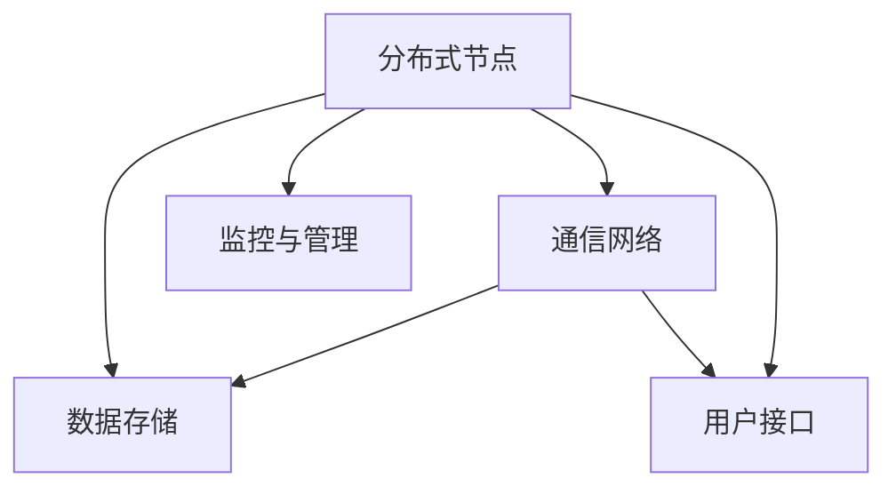
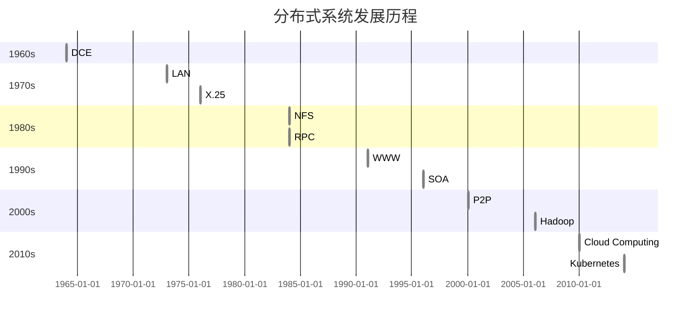
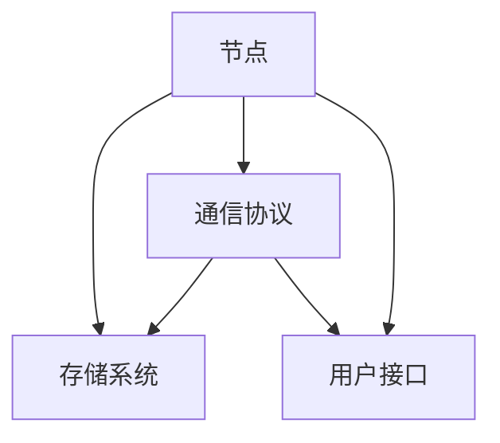

                 

# 分布式系统理论：一致性与可用性的权衡

> 关键词：分布式系统、一致性、可用性、CAP理论、分布式算法

> 摘要：本文探讨了分布式系统理论中的核心问题——一致性与可用性的权衡。通过详细的案例分析、算法讲解和性能优化策略，揭示了分布式系统在实际应用中的挑战和解决方案。文章旨在为读者提供对分布式系统一致性问题和可用性设计有深入理解和应用能力的指导。

## 目录大纲设计：《分布式系统理论：一致性与可用性的权衡》

## 第一部分：分布式系统基础

### 第1章：分布式系统的概述

- 1.1 分布式系统的定义与特点
  - **概念联系图**：[分布式系统概念实体关系图](#分布式系统概念实体关系图)
  - **例子说明**：通过电商平台的分布式架构说明分布式系统的优势和挑战。

- 1.2 分布式系统的历史与发展
  - **时间线图**：[分布式系统发展历程图](#分布式系统发展历程图)

- 1.3 分布式系统的核心组件
  - **组件关系图**：[分布式系统核心组件关系图](#分布式系统核心组件关系图)

### 第2章：一致性模型

- 2.1 一致性的定义与重要性
  - **数学模型**：使用LaTeX格式定义一致性模型。
  - **例子说明**：举例说明一致性在分布式数据库中的应用场景。

- 2.2 一致性模型分类
  - **CAP理论**：详细解释CAP理论，使用Python代码演示。
  - **一致性级别**：讨论不同的分布式一致性级别，如强一致性、最终一致性等。

### 第3章：可用性设计

- 3.1 可用性的定义与度量
  - **数学模型**：使用LaTeX格式定义可用性度量。
  - **例子说明**：通过实例说明可用性在分布式存储系统中的重要性。

- 3.2 可用性设计策略
  - **冗余技术**：讨论冗余技术在提高可用性中的应用。
  - **故障转移与恢复**：阐述故障转移与恢复机制的设计与实现。

### 第4章：分布式算法与协议

- 4.1 分布式算法基本原理
  - **一致性算法**：介绍常见的分布式一致性算法，如Raft、Paxos等。
  - **例子说明**：通过实例说明分布式算法在实际系统中的应用。

- 4.2 分布式数据一致性协议
  - **数据复制与分片**：讨论数据复制与分片策略。
  - **分布式锁与事务管理**：介绍分布式锁与事务管理机制。

## 第二部分：一致性与可用性的权衡

### 第5章：一致性机制与性能优化

- 5.1 一致性与性能的权衡
  - **性能模型**：使用LaTeX格式定义一致性机制的性能模型。
  - **优化策略**：讨论如何优化一致性机制以平衡性能和一致性。

- 5.2 实际系统的案例分析
  - **案例研究**：分析多个分布式系统在一致性与性能上的权衡。

### 第6章：可用性提升与弹性设计

- 6.1 可用性提升的关键因素
  - **冗余与负载均衡**：讨论如何通过冗余和负载均衡提高系统的可用性。
  - **弹性设计**：介绍弹性设计的原则和方法。

- 6.2 实际系统的可用性优化
  - **案例分析**：分析分布式系统在可用性优化方面的实际应用。

### 第7章：一致性与可用性在实践中的应用

- 7.1 云计算环境中的分布式系统
  - **案例研究**：探讨云计算环境中一致性与可用性的实现与挑战。

- 7.2 分布式数据库系统
  - **设计原则**：讨论分布式数据库系统的一致性与可用性设计原则。
  - **案例研究**：分析分布式数据库系统的应用场景与挑战。

### 第8章：未来趋势与研究方向

- 8.1 分布式系统的未来发展趋势
  - **技术展望**：预测分布式系统的未来发展方向。

- 8.2 研究方向与挑战
  - **研究热点**：讨论分布式系统理论的研究热点和未来挑战。

## 附录

### 附录A：分布式系统技术资源

- **工具与框架**：介绍常用的分布式系统工具和框架。
- **开源资源**：提供相关的开源资源和参考文档。

### 附录B：数学模型与算法代码示例

- **Python代码示例**：提供关键算法的Python代码实现和解释。
- **LaTeX公式示例**：展示如何使用LaTeX格式编写数学模型和公式。

---

## 分布式系统的概述

### 1.1 分布式系统的定义与特点

分布式系统是一种计算机架构，其中多个独立的计算机节点通过网络连接，共同工作以提供单一系统的功能。分布式系统旨在提高系统的整体性能、可靠性和扩展性，通过分布式的数据管理和计算任务来应对大规模的数据处理需求。

**概念联系图**：以下是一个使用Mermaid语法绘制的分布式系统概念实体关系图，展示了系统组件、数据流和通信机制：



**例子说明**：以一个电商平台为例，该平台采用分布式架构来应对大量的用户请求和数据存储需求。用户请求通过分布式节点路由到数据库存储系统，并通过分布式缓存系统提高响应速度。在数据不一致性或节点故障的情况下，分布式系统通过一致性算法和故障转移机制来保障系统的可靠性和可用性。

### 1.2 分布式系统的历史与发展

分布式系统的概念最早在20世纪60年代由微软的Distributed Computing Environment (DCE)提出。随着时间的推移，分布式系统在互联网和云计算环境中得到了广泛的应用和进一步的发展。以下是一个使用Mermaid语法绘制的分布式系统发展历程图，标明了关键事件和技术突破：



### 1.3 分布式系统的核心组件

分布式系统的核心组件包括节点、通信协议和存储系统。以下是一个使用Mermaid语法绘制的分布式系统核心组件及其关系图：



- **节点**：分布式系统中的计算和数据存储单元，通常包括服务器和客户端。
- **通信协议**：用于节点间数据传输和通信的规则和标准，如TCP/IP、HTTP、gRPC等。
- **存储系统**：用于存储和管理数据的系统，可以是关系数据库、NoSQL数据库或分布式文件系统。

## 分布式系统的历史与发展

分布式系统的发展历程是计算机科学和技术进步的一个重要标志。从最早的概念提出到现代云计算环境中的应用，分布式系统经历了多次重大技术突破和概念创新。以下，我们将回顾分布式系统的发展历程，重点关注几个关键事件和里程碑。

### 1960s: 分布式系统的概念和初步尝试

在20世纪60年代，分布式系统的概念开始萌芽。1964年，微软推出了Distributed Computing Environment (DCE)，这是早期分布式系统的一个尝试。DCE旨在提供一种跨平台、跨操作系统的分布式计算框架，它引入了远程过程调用（RPC）和分布式目录服务，为后来的分布式计算技术奠定了基础。

### 1970s: 网络和协议的发展

1973年，局域网（LAN）的出现标志着分布式系统在物理上的连接变得更加紧密。同年，X.25协议也被提出，这是一种用于广域网的分组交换技术，为分布式系统提供了更可靠的通信方式。1976年，以太网的发明进一步推动了局域网的发展，使得分布式系统中的节点连接变得更加高效和灵活。

### 1980s: 分布式文件系统和网络服务的兴起

1984年，Sun Microsystems推出了网络文件系统（NFS），这是一个重要的分布式文件系统协议，使得不同计算机上的文件可以像本地文件一样访问和管理。同年，远程过程调用（RPC）也得到了广泛应用，成为分布式系统中节点间通信的一种标准方式。

### 1990s: 互联网和分布式计算架构

1991年，万维网（WWW）的诞生标志着互联网的普及，分布式系统得以在更广泛的范围内应用。1996年，服务导向架构（SOA）的概念被提出，它强调服务之间的松耦合和互操作性，为分布式系统设计提供了新的思路。

### 2000s: 大数据和分布式存储系统

进入21世纪，分布式系统的应用领域进一步扩大。2000年，点对点（P2P）文件共享技术的流行，使得分布式计算和存储变得更加普及。2006年，Hadoop的推出成为了分布式存储和处理的代表，它使得大规模数据处理成为可能，也为分布式系统的进一步发展奠定了基础。

### 2010s: 云计算和容器化技术的兴起

2010年，云计算的兴起标志着分布式系统进入了一个新的时代。云服务提供商如Amazon Web Services（AWS）和Google Cloud Platform（GCP）提供了弹性可扩展的分布式计算和存储服务，使得企业可以更加高效地利用资源。2014年，Kubernetes的推出为容器化技术的分布式管理提供了强大的工具，进一步推动了分布式系统的普及和应用。

### 2020s: 分布式系统的未来趋势

随着边缘计算、物联网和区块链技术的发展，分布式系统将继续在更广泛的领域中发挥作用。未来的分布式系统将更加注重安全性、隐私保护和智能决策，以应对日益复杂的计算和数据处理需求。

通过回顾分布式系统的发展历程，我们可以看到，分布式系统的演进是技术不断进步和需求驱动的结果。从最初的概念尝试到现代的云计算环境，分布式系统已经成为支撑现代互联网基础设施和新兴技术的重要基石。

## 分布式系统的核心组件

分布式系统的成功运行依赖于其核心组件的协同工作。以下是分布式系统的三个关键组件及其功能和相互关系：

### 1. 节点

节点是分布式系统中的基本计算和数据存储单元，可以是物理服务器、虚拟机或容器。每个节点独立运行，负责处理本地任务和存储数据。节点的主要功能包括：

- **计算任务**：节点执行分布式计算任务，如数据处理、分析和计算。
- **数据存储**：节点存储本地数据，并通过网络与其他节点共享数据。
- **通信**：节点通过通信协议与其他节点交换数据和控制信息。

**关系**：节点通过通信网络连接，形成分布式计算网络。节点间的通信是实现分布式系统协同工作的关键。

### 2. 通信协议

通信协议是分布式系统中节点间通信的规则和标准。常用的通信协议包括：

- **TCP/IP**：互联网协议，提供可靠的数据传输和连接管理。
- **HTTP/HTTPS**：超文本传输协议及其安全版，用于Web服务和应用通信。
- **gRPC**：Google开发的远程过程调用协议，提供高性能、低延迟的通信。

**功能**：通信协议确保数据在网络中的可靠传输，并提供必要的认证和加密机制。

### 3. 存储系统

存储系统是分布式系统中负责数据存储和管理的关键组件。存储系统可以包括以下类型：

- **关系数据库**：如MySQL、PostgreSQL，提供结构化数据存储和查询功能。
- **NoSQL数据库**：如MongoDB、Cassandra，适用于大规模非结构化数据存储。
- **分布式文件系统**：如HDFS、Ceph，提供分布式文件存储和管理。

**功能**：存储系统提供数据持久化、数据一致性和数据访问控制等功能。分布式文件系统通过多节点协作，实现数据的分布式存储和高可用性。

**相互关系**：节点通过通信协议与存储系统交互，获取和存储数据。节点和存储系统之间的数据传输和同步是分布式系统数据一致性和可靠性的关键。

通过上述组件的协同工作，分布式系统能够实现高效的计算和数据处理，应对大规模的应用场景。

## 一致性的定义与重要性

一致性是分布式系统中的一个核心概念，它涉及到系统中多个节点之间如何同步和共享数据。在分布式系统中，由于网络延迟、节点故障等因素，数据的一致性变得尤为关键。以下是一致性的定义、数学模型以及在实际分布式系统中的应用场景。

### 2.1 一致性的定义

一致性指的是系统中的多个副本或节点在操作完成后，能够达到相同的系统状态。在分布式系统中，一致性确保了数据的准确性和可靠性，从而保证了系统对外界请求的响应一致。

**数学模型**：

我们使用以下LaTeX格式定义一致性模型：

```latex
\begin{equation}
I = \{S_1, S_2, \ldots, S_n\} \text{ such that } S_i \rightarrow S_j \text{ for all } i, j
\end{equation}

其中，$I$ 表示一致性集，$S_i$ 表示第 $i$ 个节点的状态，箭头 "$\rightarrow$" 表示状态转移。
```

### 2.2 一致性在实际系统中的应用场景

一致性在分布式系统中至关重要，以下是通过实际应用场景来说明日的一致性重要性：

**分布式数据库**：在分布式数据库系统中，如Apache Cassandra和MongoDB，一致性保证了对数据的查询操作返回正确的结果。例如，当多个客户端同时对数据库进行读写操作时，一致性确保所有客户端看到的数据是一致的。

**分布式缓存**：分布式缓存系统如Redis集群，也需要保持一致性。当缓存节点发生故障时，一致性算法确保新的节点能够正确地接管缓存数据，防止数据丢失。

**分布式文件系统**：在分布式文件系统如HDFS和Ceph中，一致性确保数据在不同节点间的复制过程中不会出现错误或丢失。例如，当文件被多个节点同时修改时，一致性算法确保所有节点的文件副本是一致的。

**例子说明**：以电商平台的订单处理为例，当用户在购物网站下单时，订单信息需要同步更新到多个分布式数据库节点上。如果没有一致性保障，可能导致订单状态不一致，例如，一个节点显示订单已支付，而另一个节点显示订单未支付，这将导致严重的错误和用户不满。

通过上述定义和实际应用场景，我们可以看到一致性在分布式系统中的重要性。它不仅保证了数据的准确性，还确保了系统对外界请求的稳定和一致响应。

## 一致性模型分类

一致性模型是分布式系统中协调多个节点操作的重要工具。在分布式系统中，一致性确保数据在多个副本之间保持同步，从而保证系统的正确性和可靠性。以下，我们将讨论一致性模型的分类，重点介绍CAP理论，并使用Python代码示例来演示一致性模型的实现。

### CAP理论

CAP理论是分布式系统设计中的一个基本理论，由Eric Brewer提出。CAP理论指出，分布式系统在任何时候只能保证一致性（Consistency）、可用性（Availability）和分区容错性（Partition Tolerance）中的两个。具体来说：

- **一致性（Consistency）**：所有节点在同一时间看到的数据是一致的。
- **可用性（Availability）**：系统始终响应请求，即使部分节点发生故障。
- **分区容错性（Partition Tolerance）**：系统在分区故障的情况下仍能继续运行。

CAP理论的核心思想是，在分布式系统中，无法同时保证这三个特性。在设计分布式系统时，必须根据应用需求在这三个特性之间做出权衡。

#### 2.2.1 CAP理论示例

以下是一个简单的Python代码示例，展示了如何在分布式系统中实现一致性模型的CAP理论：

```python
import threading

class Node:
    def __init__(self):
        self.data = None
        self.is_available = True

    def update_data(self, new_data):
        self.data = new_data
        threading.Event().wait()  # 等待一致性操作完成

    def read_data(self):
        return self.data

def consistency_example():
    node1 = Node()
    node2 = Node()

    # 更新数据
    node1.update_data("New Data")
    node1.is_available = False  # 模拟节点故障

    # 同步数据到另一个节点
    node2.update_data(node1.read_data())

    print("Node1 Data:", node1.read_data())
    print("Node2 Data:", node2.read_data())

if __name__ == "__main__":
    consistency_example()
```

在这个示例中，`Node` 类表示分布式系统中的节点。`update_data` 方法用于更新节点的数据，并等待一致性操作完成。`read_data` 方法用于读取节点的数据。通过这个示例，我们可以看到如何在分布式系统中实现一致性。

#### 2.2.2 一致性级别

除了CAP理论外，分布式系统还有其他的一致性级别，如强一致性、最终一致性等。以下是对不同一致性级别的简要介绍：

- **强一致性**：所有操作在所有节点上立即生效，系统始终保持一致状态。这种一致性级别在金融系统和关键业务系统中广泛应用，但牺牲了可用性。
- **最终一致性**：系统最终会在所有节点上达成一致状态，但可能存在一段时间内的不一致性。这种一致性级别在大多数Web应用中广泛使用，因为它在保证一致性的同时，提高了系统的可用性。

### 总结

通过上述讨论，我们可以看到一致性模型在分布式系统设计中的重要性。CAP理论为我们提供了在一致性、可用性和分区容错性之间进行权衡的工具，而不同的一致性级别则根据应用需求提供了灵活的选择。理解这些一致性模型和级别，有助于我们在设计分布式系统时做出明智的决策，确保系统在复杂环境下保持稳定和可靠。

## 可用性的定义与度量

可用性是分布式系统设计中的一个关键指标，它反映了系统在面对各种故障和异常情况时的稳定性和可靠性。一个高可用性的分布式系统能够在大部分时间保持正常运行，即使在部分节点或服务出现故障时，也能快速恢复并提供服务。

### 3.1 可用性的定义

可用性指的是系统能够正常运行的时间比例。具体来说，可用性度量了系统在规定时间内保持正常运行的能力。通常，可用性以百分比表示，例如，99.9%的可用性意味着系统每年只能有8.76小时的非正常工作时间。

**数学模型**：

我们使用以下LaTeX格式定义可用性度量：

```latex
\begin{equation}
A = \frac{T_{available}}{T_{total}} \times 100\%
\end{equation}

其中，$A$ 表示可用性百分比，$T_{available}$ 表示系统正常运行时间，$T_{total}$ 表示系统总运行时间。
```

### 3.2 可用性在实际系统中的应用场景

可用性在分布式系统中至关重要，以下是通过实际应用场景来说明其重要性的例子：

**云服务提供商**：云服务提供商如Amazon Web Services（AWS）和Google Cloud Platform（GCP）对可用性有严格的要求。高可用性确保用户在大部分时间都能访问服务，从而提升用户体验和客户满意度。

**金融系统**：金融交易系统需要在高可用性的环境下运行，确保交易数据的完整性和准确性。例如，银行交易系统必须保证在发生网络故障或服务器故障时，交易数据不会丢失或出现错误。

**电商平台**：电商平台如亚马逊和阿里巴巴需要确保其网站在高峰期仍能正常运行，以满足大量用户的需求。高可用性不仅提高了用户体验，还减少了因系统故障导致的交易损失。

### 3.3 可用性设计策略

为了提高系统的可用性，分布式系统设计可以采用以下策略：

- **冗余技术**：通过冗余设计，系统可以在一个组件或服务出现故障时自动切换到备用组件或服务。常见的冗余技术包括节点冗余、数据冗余和服务冗余。

- **故障转移与恢复**：故障转移机制确保在主节点或服务出现故障时，能够迅速切换到备用节点或服务。恢复机制则用于在故障解决后，将系统恢复正常状态。

- **负载均衡**：负载均衡技术通过分散请求到多个节点或服务，减少单个组件的负载，提高系统的整体可用性。

通过上述定义、应用场景和设计策略，我们可以看到可用性在分布式系统设计中的重要性。高可用性不仅能够提升用户体验，还能提高系统的整体可靠性和稳定性。

### 3.2 可用性设计策略

为了确保分布式系统在面临故障和异常情况时仍能提供稳定、可靠的服务，可用性设计成为系统架构中不可或缺的一部分。以下将讨论几种关键的可

