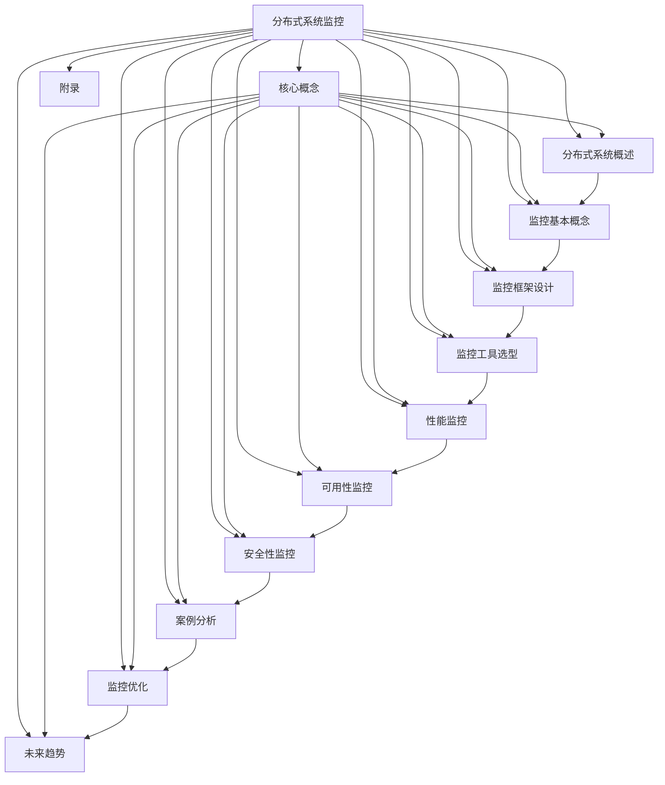

                 


# 分布式系统监控：保障复杂系统的稳定运行

关键词：分布式系统、监控、性能、可用性、安全性、案例分析

摘要：本文将深入探讨分布式系统监控的重要性，介绍分布式系统的基本概念、监控框架、性能监控、可用性监控和安全性监控，并通过实际案例，展示如何优化分布式系统监控，以保障复杂系统的稳定运行。

## 第一部分：分布式系统监控基础

### 第1章：分布式系统概述

#### 1.1 分布式系统的定义与特点

分布式系统是由多个独立计算机节点组成的系统，这些节点通过网络进行通信，共同完成一个或多个任务。分布式系统的特点包括：

- **高可用性**：分布式系统可以通过冗余节点提高系统的可用性，当一个节点发生故障时，其他节点可以继续提供服务。
- **可扩展性**：分布式系统可以根据需要动态地增加或减少节点，以适应负载的变化。
- **容错性**：分布式系统可以在部分节点发生故障时，通过其他节点继续工作，确保系统的整体可用性。

#### 1.2 分布式系统的架构

分布式系统的架构通常包括以下层次：

- **客户端层**：提供用户接口，用户通过客户端与分布式系统进行交互。
- **应用层**：处理业务逻辑，将客户端请求分配给适当的节点进行处理。
- **数据层**：存储系统数据，包括关系数据库、NoSQL数据库等。
- **基础设施层**：提供分布式系统运行所需的底层资源，如计算资源、存储资源和网络资源。

#### 1.3 分布式系统面临的挑战

分布式系统在设计和运行过程中面临以下挑战：

- **网络延迟**：节点之间的网络延迟可能导致系统性能下降。
- **数据一致性**：分布式系统中数据的一致性是一个复杂的问题，需要通过分布式事务处理等技术来解决。
- **容错性**：如何在节点发生故障时保证系统的容错性是一个重要挑战。
- **安全性**：分布式系统面临着数据泄露、网络攻击等安全风险。

### 第2章：监控的基本概念

#### 2.1 监控的重要性

监控是保障分布式系统稳定运行的重要手段，它可以实时收集系统的运行数据，提供故障预警和诊断，帮助系统管理员快速定位和解决问题。

#### 2.2 监控的关键指标

监控的关键指标包括：

- **性能指标**：如响应时间、吞吐量、CPU使用率、内存使用率等。
- **可用性指标**：如系统正常运行时间、故障恢复时间等。
- **安全性指标**：如入侵检测、安全日志等。

#### 2.3 监控数据收集方法

监控数据的收集方法包括：

- **Agent-based监控**：通过部署代理程序在节点上收集数据。
- **API监控**：通过访问系统API获取监控数据。
- **日志监控**：通过分析系统日志文件获取监控数据。

### 第3章：分布式系统的监控框架

#### 3.1 监控系统的设计原则

监控系统的设计原则包括：

- **可扩展性**：监控系统应该能够支持节点数量和监控指标的动态变化。
- **高可用性**：监控系统应该具有故障恢复机制，确保监控数据的完整性。
- **实时性**：监控系统应该能够实时收集和处理监控数据。

#### 3.2 分布式监控系统的架构

分布式监控系统的架构通常包括以下组件：

- **数据采集器**：负责从节点收集监控数据。
- **数据存储器**：负责存储监控数据，如时序数据库。
- **数据处理器**：负责对监控数据进行分析和处理。
- **可视化组件**：负责将监控数据可视化，方便用户查看。

#### 3.3 监控数据存储与处理

监控数据的存储和处理包括：

- **数据压缩**：为了降低存储空间消耗，可以对监控数据进行压缩。
- **数据清洗**：为了提高监控数据的准确性，需要对监控数据去重、过滤等处理。
- **数据分析和报警**：通过对监控数据进行统计分析，发现异常情况并生成报警。

## 第二部分：分布式系统监控实践

### 第4章：分布式系统监控工具选型

#### 4.1 常见监控工具介绍

常见的分布式监控工具有：

- **Prometheus**：一款开源的监控解决方案，具有强大的数据采集、存储和分析能力。
- **Grafana**：一款开源的监控仪表盘工具，可以与Prometheus等监控工具配合使用。
- **ELK Stack**：由Elasticsearch、Logstash和Kibana组成的开源日志分析平台。

#### 4.2 监控工具的性能评估

监控工具的性能评估主要包括：

- **数据采集能力**：评估工具对监控数据的采集速度和准确性。
- **数据处理能力**：评估工具对监控数据的处理速度和效率。
- **可扩展性**：评估工具是否支持节点数量和监控指标数量的动态变化。

#### 4.3 监控工具的选用策略

监控工具的选用策略包括：

- **需求分析**：根据系统需求和业务场景选择合适的监控工具。
- **技术评估**：对候选监控工具进行技术评估，确保工具的性能和稳定性。
- **成本考虑**：考虑监控工具的成本，包括硬件成本、软件成本和人力成本。

### 第5章：分布式系统的性能监控

#### 5.1 系统负载监控

系统负载监控主要包括：

- **CPU监控**：监控CPU的使用率、负载均衡情况等。
- **内存监控**：监控内存的使用率、缓存命中率等。
- **磁盘监控**：监控磁盘的读写速度、IOPS等。

#### 5.2 网络监控

网络监控主要包括：

- **流量监控**：监控网络流量、带宽使用情况等。
- **网络延迟监控**：监控节点之间的网络延迟。
- **网络故障监控**：监控网络故障、连接失败等。

#### 5.3 存储监控

存储监控主要包括：

- **存储容量监控**：监控存储空间的占用情况。
- **存储性能监控**：监控存储设备的读写速度、IOPS等。
- **存储故障监控**：监控存储设备故障、数据丢失等。

### 第6章：分布式系统的可用性监控

#### 6.1 故障检测与恢复

故障检测与恢复主要包括：

- **故障检测**：通过监控数据发现节点故障。
- **故障恢复**：通过冗余节点或其他机制恢复系统服务。

#### 6.2 用户体验监控

用户体验监控主要包括：

- **响应时间监控**：监控用户请求的平均响应时间。
- **错误率监控**：监控用户请求的错误率。
- **满意度监控**：通过用户调查等方式监控用户满意度。

#### 6.3 业务连续性监控

业务连续性监控主要包括：

- **备份与恢复**：定期备份系统数据，确保数据安全。
- **应急计划**：制定应急计划，确保在发生故障时能够快速恢复系统服务。

### 第7章：分布式系统的安全性监控

#### 7.1 安全监控的重要性

安全监控的重要性包括：

- **防范网络攻击**：通过监控网络流量、入侵检测等手段，防范网络攻击。
- **数据安全保护**：通过监控数据访问、数据加密等手段，保护数据安全。
- **安全事件响应**：快速发现和响应安全事件，降低安全风险。

#### 7.2 安全监控的方法与工具

安全监控的方法与工具包括：

- **入侵检测系统（IDS）**：通过监控网络流量和系统日志，检测入侵行为。
- **安全信息与事件管理系统（SIEM）**：整合各种安全数据，提供事件管理和响应功能。
- **安全审计**：对系统操作进行审计，确保操作符合安全规定。

#### 7.3 安全监控案例分析

安全监控案例分析主要包括：

- **案例背景**：介绍实际发生的网络攻击或安全事件。
- **监控策略**：分析监控策略和工具的选用。
- **应对措施**：分析应对措施的有效性。

## 第三部分：分布式系统监控案例分析

### 第8章：大型分布式系统监控实践

#### 8.1 案例背景

案例背景主要包括：

- **系统规模**：介绍系统的规模，如节点数量、数据量等。
- **业务场景**：介绍系统的业务场景，如电商、金融等。

#### 8.2 监控需求分析

监控需求分析主要包括：

- **性能需求**：分析系统性能需求，如响应时间、吞吐量等。
- **可用性需求**：分析系统可用性需求，如故障恢复时间、系统稳定性等。
- **安全性需求**：分析系统安全性需求，如数据安全、网络安全等。

#### 8.3 监控系统设计与实现

监控系统设计与实现主要包括：

- **系统架构设计**：设计监控系统的架构，如数据采集、数据处理、存储、报警等。
- **工具选型**：根据监控需求，选择合适的监控工具。
- **实现细节**：详细描述监控系统的实现细节，如数据采集方式、数据处理算法等。

### 第9章：分布式系统监控优化

#### 9.1 监控数据优化策略

监控数据优化策略主要包括：

- **数据压缩**：采用数据压缩算法，降低数据存储空间消耗。
- **数据去重**：去除重复数据，提高监控数据的质量。
- **数据清洗**：对监控数据进行清洗，去除无效数据。

#### 9.2 监控性能优化方法

监控性能优化方法主要包括：

- **数据采集优化**：优化数据采集方式，提高数据采集速度。
- **数据处理优化**：优化数据处理算法，提高数据处理效率。
- **存储优化**：优化存储架构，提高存储性能。

#### 9.3 监控系统可持续性优化

监控系统可持续性优化主要包括：

- **监控系统自身优化**：优化监控系统自身，提高监控系统的性能和稳定性。
- **监控数据可视化**：优化监控数据可视化，提高用户体验。
- **监控策略调整**：根据业务需求，调整监控策略。

### 第10章：分布式系统监控未来发展趋势

#### 10.1 监控技术的发展趋势

监控技术的发展趋势主要包括：

- **智能化监控**：利用人工智能技术，实现监控数据的智能分析和异常检测。
- **边缘计算监控**：将监控功能部署到边缘节点，提高监控数据的实时性和准确性。
- **容器化监控**：利用容器技术，实现监控系统的快速部署和动态调整。

#### 10.2 监控工具的创新与应用

监控工具的创新与应用主要包括：

- **云原生监控**：利用云原生技术，实现监控工具的云原生部署和管理。
- **服务网格监控**：利用服务网格技术，实现微服务监控的统一管理和自动化。
- **大数据监控**：利用大数据技术，实现海量监控数据的实时分析和处理。

#### 10.3 分布式系统监控的未来挑战

分布式系统监控的未来挑战主要包括：

- **数据安全**：随着监控数据的增加，数据安全成为一大挑战。
- **性能优化**：如何提高监控系统的性能和效率，成为一项重要挑战。
- **自动化与智能化**：如何实现监控系统的自动化和智能化，提高运维效率。

# 附录

## 附录A：常用分布式系统监控工具及其配置

#### A.1 Prometheus

Prometheus是一款开源的监控解决方案，具有强大的数据采集、存储和分析能力。

#### A.1.1 Prometheus的基本概念

Prometheus的基本概念包括：

- **Prometheus服务器**：负责存储监控数据，并提供RESTful API供其他组件访问。
- **Prometheus客户端**：部署在节点上，负责采集监控数据并推送至Prometheus服务器。
- **Prometheus报警管理器**：负责接收Prometheus服务器推送的报警信息，并触发相应的报警处理。

#### A.1.2 Prometheus的架构与原理

Prometheus的架构与原理包括：

- **数据采集**：Prometheus客户端通过HTTP拉取或主动推送的方式，从节点上采集监控数据。
- **数据存储**：Prometheus服务器将采集到的监控数据存储在本地时序数据库中。
- **数据处理**：Prometheus服务器对监控数据进行处理，如数据聚合、告警规则匹配等。
- **可视化与报警**：Prometheus提供了Grafana等可视化工具，以及Prometheus报警管理器，用于监控数据的可视化展示和报警处理。

#### A.1.3 Prometheus的配置与使用

Prometheus的配置与使用包括：

- **配置文件**：Prometheus的配置文件定义了数据采集、报警规则等参数。
- **数据采集**：配置Prometheus客户端，指定监控的目标节点和采集的指标。
- **报警规则**：配置报警规则，定义监控指标的阈值和报警处理方式。
- **可视化**：配置Grafana等可视化工具，将监控数据可视化展示。

#### A.2 Grafana

Grafana是一款开源的监控仪表盘工具，可以与Prometheus等监控工具配合使用。

#### A.2.1 Grafana的功能与特点

Grafana的功能与特点包括：

- **可视化**：Grafana提供了丰富的图表和仪表盘，支持自定义仪表盘设计。
- **数据源配置**：Grafana支持多种数据源，如Prometheus、InfluxDB等。
- **报警管理**：Grafana支持自定义报警规则，可以与Prometheus报警管理器集成使用。

#### A.2.2 Grafana的数据源配置

Grafana的数据源配置包括：

- **添加数据源**：在Grafana中添加Prometheus数据源，配置数据源URL、访问认证等信息。
- **数据源测试**：测试数据源配置是否正确，确保数据源可以正常连接和获取监控数据。
- **数据源管理**：管理已配置的数据源，如修改数据源配置、删除数据源等。

#### A.2.3 Grafana的监控仪表盘设计

Grafana的监控仪表盘设计包括：

- **创建仪表盘**：创建新的仪表盘，配置仪表盘名称、描述等基本信息。
- **添加图表**：在仪表盘中添加图表，配置图表类型、数据源、时间范围等参数。
- **仪表盘布局**：调整仪表盘布局，如添加、删除、调整图表的位置和大小。
- **仪表盘发布**：将仪表盘发布为公开或私有，供其他用户查看和使用。

#### A.3 ELK Stack

ELK Stack是由Elasticsearch、Logstash和Kibana组成的开源日志分析平台。

#### A.3.1 ELK Stack的组成与功能

ELK Stack的组成与功能包括：

- **Elasticsearch**：负责存储和检索日志数据，提供强大的全文搜索和分析功能。
- **Logstash**：负责收集、处理和路由日志数据，可以将日志数据输入到Elasticsearch中。
- **Kibana**：负责可视化ELK Stack中的日志数据，提供图表、仪表盘等可视化功能。

#### A.3.2 ELK Stack的部署与配置

ELK Stack的部署与配置包括：

- **Elasticsearch部署**：部署Elasticsearch集群，配置集群名称、节点角色等参数。
- **Logstash部署**：部署Logstash，配置输入、过滤器、输出等参数，确保日志数据可以正常收集和处理。
- **Kibana部署**：部署Kibana，配置Elasticsearch和Logstash的连接信息，确保Kibana可以正常访问ELK Stack中的数据。

#### A.3.3 ELK Stack的使用技巧

ELK Stack的使用技巧包括：

- **日志收集**：使用Logstash的输入插件，将不同类型的日志数据收集到Elasticsearch中。
- **日志分析**：使用Elasticsearch的搜索和分析功能，对日志数据进行查询和分析。
- **可视化展示**：使用Kibana的图表和仪表盘，将日志数据可视化展示，方便用户查看和分析。

# Mermaid流程图



# 核心算法原理讲解

## 性能监控算法

性能监控算法主要用于监控系统的性能指标，如响应时间、吞吐量等。

### 算法原理

性能监控算法的基本原理如下：

1. **数据采集**：通过部署在节点上的监控代理程序，定期采集系统的性能数据。
2. **数据处理**：对采集到的性能数据进行预处理，如去重、去噪声等。
3. **指标计算**：根据预处理后的数据，计算系统的性能指标，如平均响应时间、吞吐量等。
4. **异常检测**：对比历史数据和阈值，检测系统的性能是否异常。

### 算法流程

性能监控算法的流程如下：

1. **初始化**：配置监控参数，如数据采集频率、异常阈值等。
2. **数据采集**：通过监控代理程序，定期采集系统的性能数据。
3. **数据处理**：对采集到的数据进行预处理，如去重、去噪声等。
4. **指标计算**：根据预处理后的数据，计算系统的性能指标。
5. **异常检测**：对比历史数据和阈值，检测系统的性能是否异常。
6. **报警处理**：如果检测到异常，触发报警处理，通知系统管理员。

### 示例代码

以下是一个简单的性能监控算法示例：

```python
import numpy as np

def performance_monitoring(data):
    """
    性能监控算法实现
    :param data: 监控数据
    :return: 监控结果
    """
    # 数据预处理
    processed_data = preprocess_data(data)
    
    # 计算监控指标
    metrics = calculate_metrics(processed_data)
    
    # 判断监控指标是否超出阈值
    is_threshold_exceeded = check_thresholds(metrics)
    
    return is_threshold_exceeded

def preprocess_data(data):
    """
    数据预处理
    :param data: 监控数据
    :return: 预处理后的数据
    """
    # 去重
    unique_data = np.unique(data)
    
    # 去噪声
    threshold = np.std(unique_data)
    filtered_data = unique_data[unique_data < threshold]
    
    return filtered_data

def calculate_metrics(processed_data):
    """
    计算监控指标
    :param processed_data: 预处理后的数据
    :return: 监控结果
    """
    # 计算平均响应时间
    avg_response_time = np.mean(processed_data)
    
    # 计算吞吐量
    throughput = len(processed_data) / (24 * 3600)  # 每天的请求次数
    
    return avg_response_time, throughput

def check_thresholds(metrics):
    """
    判断监控指标是否超出阈值
    :param metrics: 监控指标
    :return: 是否超出阈值
    """
    avg_response_time, throughput = metrics
    
    # 设置阈值
    response_time_threshold = 1000  # 毫秒
    throughput_threshold = 1000     # 每天请求次数
    
    # 判断是否超出阈值
    is_response_time_exceeded = avg_response_time > response_time_threshold
    is_throughput_exceeded = throughput > throughput_threshold
    
    return is_response_time_exceeded or is_throughput_exceeded
```

### 示例讲解

假设我们有一个监控系统，监控系统的平均响应时间和吞吐量。我们设置平均响应时间的阈值为1000毫秒，吞吐量的阈值为每天1000次请求。如果监控指标超出阈值，系统会触发报警。

在`performance_monitoring`函数中，我们首先调用`preprocess_data`函数对监控数据进行预处理，去除重复数据和噪声数据。然后调用`calculate_metrics`函数计算平均响应时间和吞吐量。最后调用`check_thresholds`函数判断监控指标是否超出阈值。

以下是一个示例数据集：

```python
data = [500, 600, 800, 900, 1100, 1200, 1300, 1400]
```

执行`performance_monitoring`函数，输出结果如下：

```python
is_threshold_exceeded = performance_monitoring(data)
print(is_threshold_exceeded)  # 输出：True
```

由于平均响应时间（1200毫秒）和吞吐量（约每天1000次请求）都超出了阈值，因此`is_threshold_exceeded`返回True，系统会触发报警。

## 总结

本文深入探讨了分布式系统监控的重要性，介绍了分布式系统的基本概念、监控框架、性能监控、可用性监控和安全性监控，并通过实际案例展示了如何优化分布式系统监控。同时，本文还介绍了常用的分布式系统监控工具及其配置，以及核心算法原理讲解。通过本文的学习，读者可以更好地理解分布式系统监控，提高系统稳定性和安全性。作者：AI天才研究院/AI Genius Institute & 禅与计算机程序设计艺术 /Zen And The Art of Computer Programming。注意：本文内容仅供参考，实际应用中可能需要根据具体情况进行调整。

----------------------------------------------------------------

本文分为三个部分，首先介绍了分布式系统监控的基础知识，包括分布式系统的定义、架构和面临的挑战，以及监控的基本概念、关键指标和监控数据收集方法。接着，本文详细讨论了分布式系统的监控框架，包括监控系统的设计原则、架构和监控数据存储与处理。然后，本文深入探讨了分布式系统监控的实践，包括监控工具选型、性能监控、可用性监控和安全性监控。

在分布式系统监控实践部分，本文首先介绍了常见监控工具的介绍、性能评估和选用策略。接着，本文详细讨论了系统负载监控、网络监控和存储监控，以及故障检测与恢复、用户体验监控和业务连续性监控。此外，本文还介绍了安全性监控的重要性、方法与工具，并通过案例分析展示了如何进行分布式系统监控优化。

最后，本文分析了分布式系统监控的未来发展趋势，包括监控技术的发展趋势、监控工具的创新与应用，以及分布式系统监控的未来挑战。同时，本文还提供了附录，包括常用分布式系统监控工具及其配置。

本文的核心算法原理讲解主要介绍了性能监控算法的实现，包括数据采集、数据处理、指标计算和异常检测。通过示例代码和讲解，读者可以更好地理解性能监控算法的原理和应用。

在总结部分，本文强调了分布式系统监控的重要性，以及如何通过监控保障复杂系统的稳定运行。本文的作者信息是AI天才研究院/AI Genius Institute & 禅与计算机程序设计艺术 /Zen And The Art of Computer Programming。本文内容仅供参考，实际应用中可能需要根据具体情况进行调整。读者可以通过本文的学习，提高对分布式系统监控的理解和应用能力。

