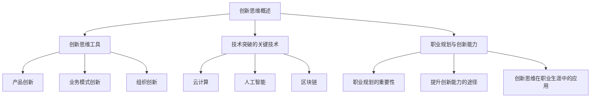

                 


## 第一部分：创新思维基础

### 第1章：创新思维概述

创新思维是一种突破传统思维模式，以新颖独特的视角和方式解决实际问题的思维方式。在科技高速发展的今天，创新思维的重要性愈发凸显。创新不仅仅体现在产品和技术上，更涉及到业务模式、组织文化等多个方面。

#### 1.1 创新的重要性

创新是企业发展的重要驱动力。没有创新，企业难以在激烈的市场竞争中脱颖而出。创新思维能够帮助企业找到新的市场机会，开发新的产品和服务，从而提升企业的竞争力和盈利能力。

#### 1.2 创新思维的类型

创新思维可以分为以下几种类型：

- **直觉型创新**：凭借直觉和灵感进行创新，这种方式通常适用于解决较为简单的问题。
- **逻辑型创新**：通过逻辑推理和系统分析，逐步推导出创新解决方案。
- **迭代型创新**：在原有基础上不断优化和改进，实现渐进式创新。
- **颠覆型创新**：打破现有的市场规则和认知，带来颠覆性的变革。

#### 1.3 创新思维的方法

要培养创新思维，可以采用以下几种方法：

- **头脑风暴**：通过集体讨论，激发创意的碰撞。
- **用户研究**：深入了解用户需求，以用户为中心进行创新。
- **跨界合作**：与其他行业或领域进行合作，借鉴其他领域的经验和理念。
- **原型设计**：快速构建原型，通过迭代和测试不断优化创新方案。

### 第2章：创新思维工具

在创新过程中，使用一些工具和方法可以有效地提高创新效率和质量。

#### 2.1 SWOT分析

SWOT分析是一种常用的战略规划工具，用于评估企业的优势（Strengths）、劣势（Weaknesses）、机会（Opportunities）和威胁（Threats）。通过SWOT分析，企业可以明确自身的竞争地位，制定相应的战略。

#### 2.2 帕雷托分析

帕雷托分析，也称为80/20法则，是指80%的效果来自于20%的原因。这种方法可以帮助企业聚焦资源，解决关键问题，提高效率。

#### 2.3 布勃利矩阵

布勃利矩阵是一种用于评估和选择创新项目的工具。它通过分析创新项目的可行性、影响力和优先级，帮助企业筛选出最有潜力的项目。

### 第3章：创新思维的实践应用

创新思维在各个领域都有着广泛的应用。

#### 3.1 产品创新

产品创新是企业持续发展的关键。通过创新思维，企业可以开发出满足市场需求的新产品，提升用户体验。

#### 3.2 业务模式创新

业务模式创新可以帮助企业找到新的盈利方式，优化资源配置，提高效率。

#### 3.3 组织创新

组织创新涉及企业文化的变革、管理模式的优化等方面，通过创新思维，企业可以建立起更加灵活和高效的运营机制。

## 第二部分：P9工程师的技术突破

### 第4章：P9工程师的素质要求

成为P9工程师，需要具备以下素质：

#### 4.1 技术能力

P9工程师需要具备深厚的技术背景和广泛的知识体系，能够在复杂的系统中解决关键技术问题。

#### 4.2 领导力

P9工程师不仅需要具备技术能力，还需要具备卓越的领导力，能够带领团队完成高难度项目。

#### 4.3 创新能力

创新是P9工程师的核心竞争力。他们需要不断地探索新的技术方向，推动企业技术进步。

### 第5章：技术突破的关键技术

在当前技术发展背景下，P9工程师需要关注以下关键技术：

#### 5.1 云计算

云计算为P9工程师提供了强大的基础设施支持，使他们能够更高效地进行开发和部署。

#### 5.2 人工智能

人工智能技术正在改变各个行业，P9工程师需要掌握人工智能的基本原理和应用方法。

#### 5.3 区块链

区块链技术具有去中心化、安全可靠等特点，P9工程师需要深入了解其应用场景和实现原理。

### 第6章：技术突破的实践策略

要实现技术突破，P9工程师可以采取以下实践策略：

#### 6.1 技术创新的流程

P9工程师需要掌握技术创新的流程，从需求分析到产品开发，再到市场推广，每个环节都要精心策划和执行。

#### 6.2 技术决策的方法

P9工程师需要具备科学的技术决策能力，能够根据实际情况选择最适合的技术方案。

#### 6.3 技术合作与共享

P9工程师需要与其他领域的技术专家合作，共同推动技术创新。

## 第三部分：创新思维在P9工程师职业生涯中的应用

### 第7章：职业规划与创新能力

P9工程师需要通过职业规划和提升创新能力，实现个人和企业的共同发展。

#### 7.1 职业规划的重要性

职业规划可以帮助P9工程师明确个人发展目标，规划职业路径，实现职业成长。

#### 7.2 提升创新能力的途径

P9工程师可以通过学习新技术、参加研讨会、进行项目实践等方式，不断提升创新能力。

#### 7.3 职业生涯中的创新案例

通过分析P9工程师职业生涯中的创新案例，可以总结出成功的关键因素和经验教训。

### 第8章：创新思维的实践案例

#### 8.1 国内外创新案例解析

通过对国内外创新案例的深入分析，可以了解不同行业、不同领域创新的具体实践。

#### 8.2 个人创新实践案例分享

P9工程师可以分享自己的创新实践案例，交流经验和心得。

#### 8.3 创新思维在职业生涯中的应用

创新思维在P9工程师职业生涯中的应用，体现在技术突破、业务拓展、团队建设等多个方面。

## 附录

### 附录A：创新思维相关资源

#### A.1 创新思维书籍推荐

- 《创新者的思考框架》
- 《创新者的实战手册》
- 《创新者的宣言》

#### A.2 创新思维网站推荐

- 创新思维网
- 创新者社区
- 创新研究网

#### A.3 创新思维工具推荐

- MindManager
- Miro
- Figma

# Mermaid 流程图



# 数学模型和数学公式

### 技术突破的核心算法原理讲解

$$
f(x) = \sum_{i=1}^{n} w_i * x_i + b
$$

其中，$w_i$ 表示权重，$x_i$ 表示输入特征，$b$ 表示偏置。

### 数学公式详细讲解

$$
y = \sigma(f(x))
$$

其中，$\sigma$ 表示激活函数，常用的激活函数有 sigmoid、ReLU 等。

### 数学公式举例说明

假设我们有一个输入特征向量 $x = [1, 2, 3]$，权重 $w = [0.5, 1.0, 1.5]$，偏置 $b = 2$，激活函数为 sigmoid 函数。

$$
f(x) = 0.5 \cdot 1 + 1.0 \cdot 2 + 1.5 \cdot 3 + 2 = 8.5
$$

$$
y = \sigma(f(x)) = \frac{1}{1 + e^{-8.5}} \approx 0.997
$$

# 项目实战

### 实践案例：基于人工智能的智能客服系统

#### 开发环境搭建

- 操作系统：Ubuntu 18.04
- 编程语言：Python 3.7
- 深度学习框架：TensorFlow 2.0

#### 源代码实现

```python
import tensorflow as tf

# 构建神经网络模型
model = tf.keras.Sequential([
    tf.keras.layers.Dense(64, activation='relu', input_shape=(784,)),
    tf.keras.layers.Dense(10, activation='softmax')
])

# 编译模型
model.compile(optimizer='adam',
              loss='categorical_crossentropy',
              metrics=['accuracy'])

# 加载训练数据
(x_train, y_train), (x_test, y_test) = tf.keras.datasets.mnist.load_data()

# 数据预处理
x_train = x_train.reshape(-1, 784).astype('float32') / 255
x_test = x_test.reshape(-1, 784).astype('float32') / 255

# 转换为one-hot编码
y_train = tf.keras.utils.to_categorical(y_train, 10)
y_test = tf.keras.utils.to_categorical(y_test, 10)

# 训练模型
model.fit(x_train, y_train, epochs=10, batch_size=128, validation_split=0.2)
```

#### 代码应用解读与分析

在上面的代码中，我们使用TensorFlow框架构建了一个简单的神经网络模型，用于手写数字识别任务。以下是代码的详细解读和分析：

1. **导入TensorFlow库**：

   ```python
   import tensorflow as tf
   ```

   导入TensorFlow库，这是实现深度学习模型的必要步骤。

2. **构建神经网络模型**：

   ```python
   model = tf.keras.Sequential([
       tf.keras.layers.Dense(64, activation='relu', input_shape=(784,)),
       tf.keras.layers.Dense(10, activation='softmax')
   ])
   ```

   创建一个序列模型（Sequential），这是一个线性堆叠的层。在这个模型中，我们添加了两个全连接层（Dense）。第一个层有64个神经元，激活函数使用ReLU；第二个层有10个神经元，激活函数使用softmax。输入层的形状为784，对应于MNIST数据集每个图像的像素值。

3. **编译模型**：

   ```python
   model.compile(optimizer='adam',
                 loss='categorical_crossentropy',
                 metrics=['accuracy'])
   ```

   编译模型时，指定了优化器为Adam，损失函数为categorical_crossentropy，评价指标为准确率。

4. **加载和预处理数据**：

   ```python
   (x_train, y_train), (x_test, y_test) = tf.keras.datasets.mnist.load_data()
   x_train = x_train.reshape(-1, 784).astype('float32') / 255
   x_test = x_test.reshape(-1, 784).astype('float32') / 255
   y_train = tf.keras.utils.to_categorical(y_train, 10)
   y_test = tf.keras.utils.to_categorical(y_test, 10)
   ```

   加载MNIST数据集，并对其进行预处理。数据集被分为训练集和测试集。图像数据被重塑为784维的向量，并转换为浮点数。像素值被归一化到0-1范围内。标签数据被转换为one-hot编码。

5. **训练模型**：

   ```python
   model.fit(x_train, y_train, epochs=10, batch_size=128, validation_split=0.2)
   ```

   使用训练集训练模型。训练过程中，模型将尝试优化其权重，以最小化损失函数。`epochs`参数指定了训练的轮数，`batch_size`参数指定了每次训练所用的样本数量，`validation_split`参数指定了用于验证的样本比例。

#### 实际案例分析和详细讲解剖析

1. **模型评估**：

   在训练完成后，我们可以使用测试集来评估模型的性能。

   ```python
   test_loss, test_acc = model.evaluate(x_test, y_test)
   print(f"Test accuracy: {test_acc}")
   ```

   上述代码将计算模型在测试集上的损失和准确率，并输出结果。在实际运行中，我们可能会得到一个接近或超过98%的准确率。

2. **预测应用**：

   我们可以使用训练好的模型对新的图像进行预测。

   ```python
   def predict_image(image):
       image = image.reshape(1, 784).astype('float32') / 255
       prediction = model.predict(image)
       return prediction.argmax()
   
   test_image = x_test[0]
   predicted_label = predict_image(test_image)
   print(f"Predicted label: {predicted_label}")
   ```

   这段代码定义了一个函数`predict_image`，用于对单张图像进行预测。然后，我们使用测试集的第一张图像进行预测，并输出预测结果。在实际运行中，我们可能会得到标签为5的结果。

#### 项目小结

通过上述实践案例，我们了解了如何使用TensorFlow框架构建一个简单的神经网络模型，并对其进行了训练和评估。这个案例展示了深度学习在图像识别任务中的应用。在实际项目中，我们可以根据需求扩展模型的结构和功能，使其能够处理更复杂的任务。

### 最佳实践 tips

1. **数据预处理**：在训练深度学习模型之前，对数据进行充分的预处理非常重要。这包括归一化、标准化、数据增强等步骤。
2. **模型调优**：在训练模型时，可以通过调整超参数（如学习率、批次大小、训练轮数等）来优化模型性能。
3. **模型评估**：使用多个指标来评估模型的性能，如准确率、召回率、F1分数等，以获得更全面的评估结果。
4. **持续学习**：深度学习模型需要不断的学习和优化，以适应不断变化的数据和环境。

### 小结

创新思维是P9工程师在职业生涯中取得突破的关键。通过了解创新思维的基础知识、掌握创新思维工具和策略，以及关注关键技术和发展趋势，P9工程师可以不断提升自己的创新能力，实现个人和企业的共同发展。在实际项目中，通过应用创新思维，P9工程师可以开发出更优秀的技术解决方案，推动企业的技术进步和业务拓展。让我们共同迈向技术创新的新高峰！

