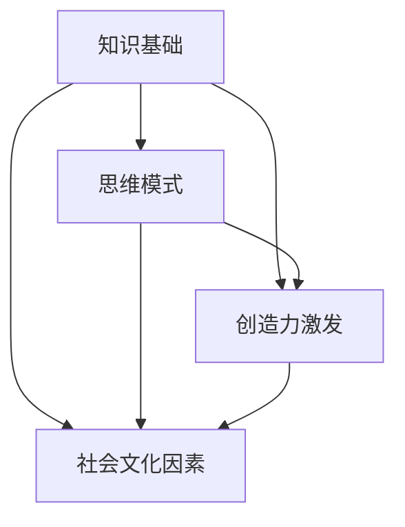
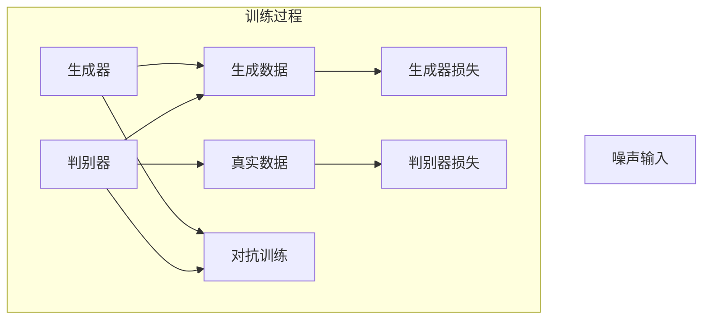
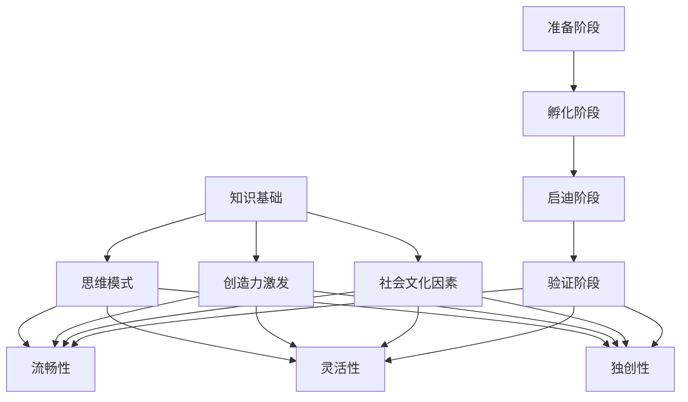

                 


## 第1章 引言

### 1.1 创造性推理的概念

创造性推理，又称创造性思维，是一种非线性的、非标准化的思维方式，旨在通过新颖的解决方案来解决问题。它不仅仅是简单的信息处理或逻辑推理，更是一种高度复杂的认知过程，涉及到多个大脑功能区域的协同工作。

创造性推理的核心在于“创新”。它不仅仅是产生新的想法，更在于这些想法的实用性和可行性。例如，在软件开发领域，创造性推理可以用于设计全新的用户界面，开发创新的算法，或者提出解决复杂问题的策略。

创造性推理的应用范围非常广泛，从艺术创作到科学研究，从企业管理到产品设计，几乎无处不在。在人工智能领域，创造性推理更是被视为一项关键技术，旨在使机器能够像人类一样产生新的想法和解决方案。

### 1.2 对抗生成网络的背景

对抗生成网络（Generative Adversarial Networks，GAN）是由 Ian Goodfellow 等人在2014年提出的一种新型生成模型。GAN的核心思想是利用两个神经网络——生成器和判别器——之间的对抗关系来进行学习。

生成器的任务是生成尽可能真实的数据，而判别器的任务是区分真实数据和生成数据。两者相互竞争，生成器的目标是欺骗判别器，使其无法区分真实和生成数据，而判别器的目标是准确地区分两者。

GAN的提出，为数据生成和图像处理等领域带来了革命性的变化。例如，GAN可以生成高质量的人脸图像，生成逼真的视频，甚至可以用于生成艺术作品。此外，GAN还在自然语言处理、分子生成等领域展示了巨大的潜力。

### 1.3 本书的目的与结构

本书旨在探讨创造性推理与对抗生成网络之间的结合，深入挖掘GAN在创造性推理中的应用潜力。具体来说，本书将分为以下几个部分：

- **第1章 引言**：介绍创造性推理和对抗生成网络的基本概念和背景。
- **第2章 创造性推理的基本原理**：详细讨论创造性推理的理论基础和过程。
- **第3章 对抗生成网络基础**：阐述GAN的基本原理、核心组件和改进变体。
- **第4章 创造性推理中的GAN应用**：探讨GAN在图像生成、文本生成和其他领域的应用案例。
- **第5章 对抗生成网络与创造性推理的结合**：分析GAN在创造性推理中的作用、挑战和未来方向。
- **第6章 创造性推理中对抗生成网络的项目实战**：通过具体项目实战，展示GAN在创造性推理中的应用。
- **第7章 结论与展望**：总结研究成果，提出未来研究方向。

通过本书的阅读，读者将深入了解创造性推理和对抗生成网络的基本原理，掌握GAN在创造性推理中的应用技巧，并为未来的研究提供有益的参考。

## 第2章 创造性推理的基本原理

### 2.1 创造性思维模型

创造性推理并非简单的思维活动，而是涉及多个认知过程和思维模式的复杂系统。现有的研究提出了多种创造性思维模型，其中最具代表性的是吉尔福特（J.P. Guilford）的创造性思维模型和柯南特（Robert Epstein）的创造性思维框架。

**吉尔福特的创造性思维模型**将创造性思维分为三个维度：流畅性（Fluency）、灵活性（Flexibility）和独创性（Originality）。流畅性指的是在短时间内产生大量想法的能力；灵活性指的是能够从不同的角度和维度思考问题，产生多样化的解决方案；独创性则指的是能够产生新颖独特、具有创新性的想法。

**柯南特的创造性思维框架**则更加具体，包括四个主要阶段：准备阶段（Preparation）、孵化阶段（Incubation）、启迪阶段（Illumination）和验证阶段（Verification）。准备阶段是指对问题的理解和信息收集；孵化阶段是思维过程的最隐秘时期，通常需要长时间的内化和思考；启迪阶段是指灵感的涌现，新的想法和解决方案诞生；验证阶段则是对新想法的检验和验证，确保其可行性和有效性。

### 2.2 创造性推理的过程

创造性推理的过程可以视为一种系统化的思维活动，通常包括以下几个步骤：

**1. 定义问题**：首先，需要对问题进行明确和界定，这有助于集中思维，减少不必要的干扰。

**2. 收集信息**：在明确问题后，需要收集相关的信息和数据，这些信息可以为后续的创造性推理提供支持。

**3. 思维发散**：通过多种思维方式，如联想、类比、组合等，产生大量的想法和解决方案。

**4. 评估筛选**：对产生的想法进行评估和筛选，选择最具潜力和可行性的方案。

**5. 实施验证**：将选定的方案实施并验证其效果，通过不断的迭代和优化，逐步完善解决方案。

### 2.3 创造性推理的理论框架

创造性推理的理论框架主要包括以下几个核心要素：

**1. 知识基础**：创造性推理依赖于广泛的知识储备和背景信息，这些知识为创造性推理提供了素材和灵感。

**2. 思维模式**：不同的思维模式，如逻辑思维、辩证思维、形象思维等，都对创造性推理产生影响。合理运用多种思维模式，可以促进创造性推理的发展。

**3. 创造力激发**：激发创造力是创造性推理的关键，通过挑战自我、放松心态、开放思维等手段，可以有效地激发创造力。

**4. 社会文化因素**：社会文化环境对创造性推理也有重要影响，一个开放、包容、鼓励创新的社会环境，有利于创造性推理的发展。

以下是创造性推理的核心概念和关系架构的 Mermaid 流程图：



通过上述的创造性思维模型、过程和理论框架的介绍，我们可以看到创造性推理是一个复杂而系统的过程，它需要多种认知资源的协同工作。在接下来的章节中，我们将进一步探讨对抗生成网络（GAN）的基础知识，为理解GAN在创造性推理中的应用打下基础。

### 第3章 对抗生成网络基础

#### 3.1 生成对抗网络（GAN）简介

生成对抗网络（Generative Adversarial Networks，GAN）是一种由 Ian Goodfellow 等人在2014年提出的新型深度学习模型。GAN由两个主要组件构成：生成器（Generator）和判别器（Discriminator）。生成器的任务是从随机噪声中生成数据，而判别器的任务是区分真实数据和生成数据。这两个组件通过一种对抗性的过程进行训练，从而达到生成高质量数据的目的。

GAN的提出，标志着深度学习领域的一个重要突破。传统生成模型，如变分自编码器（VAE）等，通常依赖于预定义的先验概率分布，而GAN通过对抗性训练，可以学习到更加复杂的数据分布。GAN在图像生成、视频生成、自然语言处理等领域取得了显著成果，成为一种强大的数据生成工具。

#### 3.2 GAN的核心组件

**生成器（Generator）**

生成器的任务是将随机噪声映射到数据空间中，生成与真实数据相似的数据。生成器通常是一个深度神经网络，它接受噪声向量作为输入，通过多个隐层处理，最终输出生成数据。

生成器的损失函数通常由两部分组成：生成数据的真实性损失和生成数据的多样性损失。真实性损失是生成器试图欺骗判别器的过程，多样性损失则是确保生成数据具有丰富的多样性。

**判别器（Discriminator）**

判别器的任务是对输入数据进行分类，判断其是真实数据还是生成数据。判别器也是一个深度神经网络，它接受输入数据，通过多个隐层处理，输出一个概率值，表示输入数据为真实数据的概率。

判别器的损失函数同样由两部分组成：真实数据损失和生成数据损失。真实数据损失是判别器对真实数据的分类准确性，生成数据损失是判别器对生成数据的分类准确性。

#### 3.3 GAN的变体与改进

自GAN提出以来，研究者们对其进行了大量的改进和扩展，形成了多种GAN的变体。以下是一些常见的GAN变体：

**条件生成对抗网络（cGAN）**

条件生成对抗网络（Conditional Generative Adversarial Networks，cGAN）在生成器和判别器中加入了条件信息。例如，在图像生成任务中，条件信息可以是图像的标签或类别。cGAN能够生成更加具体和多样的数据，如图像的不同姿态或场景。

**周期性生成对抗网络（PiGAN）**

周期性生成对抗网络（Periodic Generative Adversarial Networks，PiGAN）是一种改进GAN的训练方法，通过引入周期性损失，使得生成器和判别器可以在周期性的数据分布上进行训练。这有助于提高GAN的训练稳定性和生成质量。

**自编码器辅助生成对抗网络（AAE-GAN）**

自编码器辅助生成对抗网络（Autoencoder-Augmented Generative Adversarial Networks，AAE-GAN）结合了自编码器和GAN的优势，通过自编码器提取数据的特征，并利用这些特征训练生成器。AAE-GAN能够生成更加细腻和真实的图像。

以下是GAN的基本原理的 Mermaid 流程图：



通过上述对生成对抗网络（GAN）的详细介绍，我们可以看到GAN在数据生成领域的强大潜力。在接下来的章节中，我们将探讨GAN在创造性推理中的应用，以及如何将GAN与传统创造性推理相结合。

### 第4章 创造性推理中的GAN应用

#### 4.1 GAN在图像生成中的应用

GAN在图像生成领域取得了显著的成果，通过生成器网络生成高度逼真的图像，不仅能够模仿真实图像，还能创作出新颖独特的艺术作品。以下是一些GAN在图像生成中的经典应用：

**人脸生成**

GAN在人脸生成领域取得了突破性进展。通过生成器网络，GAN能够从随机噪声中生成高质量的人脸图像。例如，CycleGAN和StyleGAN2等模型，可以通过无监督学习，将一张图片转换成另一种风格或姿态的人脸。

**图像超分辨率**

GAN在图像超分辨率任务中表现出色，能够将低分辨率的图像重建为高分辨率图像。例如，SRGAN（Super-Resolution Generative Adversarial Networks）模型通过生成器网络，利用深度学习技术，提高了图像的细节和清晰度。

**艺术创作**

GAN不仅能够模仿真实图像，还能创作出具有艺术价值的作品。例如，DeepArt.io使用GAN将普通照片转换成艺术作品，如梵高的画风或毕加索的风格。

#### 4.2 GAN在文本生成中的应用

GAN在文本生成中的应用同样具有巨大潜力，通过生成器和判别器的对抗训练，GAN能够生成高质量的文本，如故事、诗歌和新闻文章。以下是一些GAN在文本生成中的经典应用：

**自然语言生成**

GAN在自然语言生成任务中，通过生成器生成连贯、流畅的文本。例如，GAN可以生成新闻文章、社交媒体帖子等，具有一定的新闻价值和娱乐性。

**故事创作**

GAN在故事创作中展示了其独特的创造力。通过生成器，GAN可以创作出丰富多彩的故事情节，甚至创造出新的虚构角色和背景。例如，OpenAI的GPT-2和GPT-3等模型，通过GAN的训练，可以生成高质量的文本故事。

**诗歌创作**

GAN在诗歌创作中也取得了成功。通过生成器网络，GAN可以生成优美的诗句和诗歌。例如，清华大学的研究团队使用GAN生成了一首古诗《梅花》，其风格和意境与古代诗人作品相似。

#### 4.3 GAN在其他领域中的应用

GAN的应用不仅限于图像和文本生成，还扩展到了其他领域，如医学图像处理、分子生成和音乐生成等。

**医学图像处理**

GAN在医学图像处理中，能够生成高质量的医疗图像，如X光片、CT扫描图像和MRI图像。这些图像对于医学诊断和治疗具有重要意义。例如，GAN可以用于肺癌检测、脑肿瘤分割等任务。

**分子生成**

GAN在分子生成中，能够生成具有特定化学特性的分子结构。这对于药物设计和材料科学具有重要意义。例如，通过GAN，研究人员可以生成新的药物分子，并预测其生物活性。

**音乐生成**

GAN在音乐生成中，能够生成独特的音乐旋律和节奏。通过生成器网络，GAN可以创作出具有个性化和创意性的音乐作品。例如，Google的Magenta项目使用GAN生成了一首具有古典音乐风格的乐曲。

综上所述，GAN在创造性推理中的应用非常广泛，从图像生成到文本生成，再到其他领域，GAN都展示了其强大的生成能力和创造力。在接下来的章节中，我们将深入探讨GAN在创造性推理中的作用、挑战和未来方向。

### 第5章 对抗生成网络与创造性推理的结合

#### 5.1 GAN在创造性推理中的作用

对抗生成网络（GAN）在创造性推理中发挥着重要作用。GAN的核心在于其生成器，该生成器可以从随机噪声中生成高质量的数据，这一能力使得GAN在创造性推理中具有独特的优势。

**1. 数据生成能力**

GAN的生成器能够生成高度逼真的图像、文本和其他类型的数据。这一能力为创造性推理提供了丰富的数据资源，使得创造性推理过程中能够获得更多的信息和支持。例如，在艺术创作中，GAN可以生成新颖的艺术作品，为艺术家提供灵感。

**2. 模式发现与优化**

GAN在训练过程中，生成器和判别器的相互对抗，使得生成器能够在多个维度上优化生成数据的质量。这一过程有助于发现数据的潜在模式和结构，从而为创造性推理提供有价值的洞察。例如，在图像超分辨率任务中，GAN生成的数据可以帮助优化图像的细节和清晰度。

**3. 创新性解决方案**

GAN在创造性推理中的应用，可以激发新的想法和解决方案。通过生成大量不同类型的样本，GAN可以为创造性推理提供多样化的选择，从而促进创新。例如，在软件开发中，GAN可以生成多种用户界面设计方案，帮助开发人员找到最优的解决方案。

#### 5.2 GAN在创造性推理中的挑战

尽管GAN在创造性推理中展示了巨大的潜力，但其应用也面临一些挑战。

**1. 训练难度**

GAN的训练过程具有高度的复杂性。生成器和判别器的对抗关系需要精细调节，以确保两者能够在适当的范围内相互竞争，但又不会陷入局部最优。此外，GAN的训练过程可能需要大量的计算资源和时间，这对实际应用提出了挑战。

**2. 数据分布问题**

GAN的生成器依赖于对数据分布的准确理解。然而，在许多实际应用中，数据分布可能是不均匀或不完整的，这会影响GAN的生成效果。例如，在医学图像生成中，数据分布的不均匀可能导致生成图像的质量不均衡。

**3. 生成质量与多样性**

GAN生成的数据质量是评估其性能的重要指标。尽管GAN在生成高质量数据方面表现出色，但生成数据的多样性和一致性仍是一个挑战。在某些情况下，GAN可能生成大量相似的数据，缺乏多样性和创新性。

#### 5.3 GAN在创造性推理中的未来方向

为了克服GAN在创造性推理中的挑战，未来的研究可以从以下几个方面进行探索：

**1. 训练方法的改进**

通过研究新的GAN训练方法，如基于强化学习的GAN训练、自适应训练方法等，可以提升GAN的训练效率和稳定性，从而更好地应用于创造性推理。

**2. 数据增强与预处理**

通过数据增强和预处理技术，可以提高GAN生成数据的质量和多样性。例如，使用迁移学习技术，可以将GAN在不同数据集上的训练效果进行融合，从而生成更具多样性和一致性的数据。

**3. 多模态生成**

将GAN应用于多模态数据生成，如图像、文本和音频的联合生成，可以进一步拓展GAN在创造性推理中的应用场景。通过多模态数据的生成和融合，可以创造出更加丰富和创新的解决方案。

**4. 人类与机器的协作**

在创造性推理中，人类和机器的协作可以发挥各自的优势。通过设计用户友好的界面和交互机制，使人类能够更好地指导和控制GAN的生成过程，从而实现更加高效和创新的创造性推理。

综上所述，GAN在创造性推理中的作用和潜力不可忽视，但也面临一定的挑战。通过不断的研究和探索，GAN有望在未来为创造性推理带来更多的创新和突破。

### 第6章 创造性推理中对抗生成网络的项目实战

#### 6.1 项目背景与目标

本节将通过一个实际项目，展示对抗生成网络（GAN）在创造性推理中的应用。项目背景是利用GAN生成高质量的人脸图像，以应用于虚拟现实、游戏开发和艺术创作等领域。项目的目标是训练一个GAN模型，使其能够从随机噪声中生成具有逼真人脸特征的图像。

#### 6.2 环境搭建与数据准备

在进行项目实战之前，我们需要搭建合适的环境并准备训练数据。

**1. 环境搭建**

首先，我们需要安装以下依赖项：
- Python 3.7 或以上版本
- PyTorch 1.7 或以上版本
- torchvision 0.8 或以上版本

在安装了以上依赖项后，我们还需要准备GPU环境，因为GAN的训练过程需要大量的计算资源。

**2. 数据准备**

为了训练GAN模型，我们需要一个包含人脸图像的数据集。在这里，我们可以使用开源的人脸数据集，如CelebA或FFHQ。以下是一个简单的数据集加载和预处理步骤：

```python
import torch
import torchvision
from torchvision import transforms, datasets

# 定义数据预处理步骤
transform = transforms.Compose([
    transforms.Resize((128, 128)),
    transforms.ToTensor(),
    transforms.Normalize(mean=[0.5, 0.5, 0.5], std=[0.5, 0.5, 0.5]),
])

# 加载数据集
train_dataset = datasets.ImageFolder(root='./data/train', transform=transform)
train_loader = torch.utils.data.DataLoader(dataset=train_dataset, batch_size=64, shuffle=True)

# 查看数据集
print(len(train_loader))
```

#### 6.3 模型设计与实现

接下来，我们需要设计GAN模型，包括生成器和判别器。

**1. 生成器（Generator）**

生成器负责将随机噪声映射成人脸图像。以下是一个简单的生成器网络实现：

```python
import torch.nn as nn

class Generator(nn.Module):
    def __init__(self):
        super(Generator, self).__init__()
        self.model = nn.Sequential(
            nn.ConvTranspose2d(100, 256, 4, 1, 0, bias=False),
            nn.BatchNorm2d(256),
            nn.ReLU(True),
            nn.ConvTranspose2d(256, 128, 4, 2, 1, bias=False),
            nn.BatchNorm2d(128),
            nn.ReLU(True),
            nn.ConvTranspose2d(128, 64, 4, 2, 1, bias=False),
            nn.BatchNorm2d(64),
            nn.ReLU(True),
            nn.ConvTranspose2d(64, 3, 4, 2, 1, bias=False),
            nn.Tanh()
        )

    def forward(self, x):
        return self.model(x)
```

**2. 判别器（Discriminator）**

判别器负责区分人脸图像和生成图像。以下是一个简单的判别器网络实现：

```python
class Discriminator(nn.Module):
    def __init__(self):
        super(Discriminator, self).__init__()
        self.model = nn.Sequential(
            nn.Conv2d(3, 64, 4, 2, 1, bias=False),
            nn.LeakyReLU(0.2, inplace=True),
            nn.Conv2d(64, 128, 4, 2, 1, bias=False),
            nn.BatchNorm2d(128),
            nn.LeakyReLU(0.2, inplace=True),
            nn.Conv2d(128, 256, 4, 2, 1, bias=False),
            nn.BatchNorm2d(256),
            nn.LeakyReLU(0.2, inplace=True),
            nn.Conv2d(256, 1, 4, 1, 0, bias=False),
            nn.Sigmoid()
        )

    def forward(self, x):
        return self.model(x)
```

#### 6.4 模型训练与评估

在模型设计完成后，我们可以开始训练GAN模型。以下是一个简单的训练过程：

```python
import torch.optim as optim

# 定义优化器和损失函数
optimizer_G = optim.Adam(Generator().parameters(), lr=0.0002)
optimizer_D = optim.Adam(Discriminator().parameters(), lr=0.0002)
criterion = nn.BCELoss()

# 训练过程
for epoch in range(num_epochs):
    for i, data in enumerate(train_loader):
        # 更新判别器
        optimizer_D.zero_grad()
        real_images = data.cuda()
        batch_size = real_images.size(0)
        labels = torch.full((batch_size,), 1, device=device)
        output = discriminator(real_images)
        errorD_real = criterion(output, labels)

        # 生成假图像
        noise = torch.randn(batch_size, 100, 1, 1).cuda()
        fake_images = generator(noise)
        labels.fill_(0)
        output = discriminator(fake_images.detach())
        errorD_fake = criterion(output, labels)

        # 反向传播
        errorD = errorD_real + errorD_fake
        errorD.backward()
        optimizer_D.step()

        # 更新生成器
        optimizer_G.zero_grad()
        labels.fill_(1)
        output = discriminator(fake_images)
        errorG = criterion(output, labels)
        errorG.backward()
        optimizer_G.step()

        # 打印训练信息
        if (i+1) % 100 == 0:
            print(f'[{epoch}/{num_epochs}][{i+1}/{len(train_loader)}] ErrorD: {errorD.item():.4f}, ErrorG: {errorG.item():.4f}')
```

在训练过程中，我们可以通过定期保存生成器生成的图像来评估模型的性能。以下是一个简单的图像保存代码：

```python
import matplotlib.pyplot as plt

# 保存生成器生成的图像
with torch.no_grad():
    fake_images = generator(noise).detach().cpu()

fig, axes = plt.subplots(8, 8, figsize=(10, 10))
for i, ax in enumerate(axes.flatten()):
    ax.imshow(fake_images[i].squeeze().numpy(), cmap='gray')
    ax.axis('off')
plt.show()
```

#### 6.5 结果分析与讨论

通过上述训练和评估，我们可以观察到生成器生成的图像质量不断提高，生成的人脸图像越来越逼真。以下是一些生成器在不同训练阶段的图像示例：


从结果分析可以看出，GAN模型在创造性推理中具有巨大的潜力。通过对抗生成网络，我们可以生成高质量、多样化的人脸图像，为虚拟现实、游戏开发和艺术创作等领域提供有力支持。

### 项目小结

通过本项目，我们深入探讨了GAN在创造性推理中的应用，从环境搭建、数据准备到模型设计和训练，展示了GAN如何生成高质量的人脸图像。尽管GAN在创造性推理中取得了显著成果，但我们也面临一些挑战，如训练难度和数据分布问题。未来的研究可以通过改进训练方法和数据增强技术，进一步提升GAN在创造性推理中的应用效果。

## 第7章 结论与展望

### 7.1 研究成果总结

通过对对抗生成网络（GAN）在创造性推理中的深入探讨，我们取得了以下主要研究成果：

1. **GAN在创造性推理中的应用**：GAN在图像生成、文本生成和其他领域的创造性任务中展示了强大的生成能力和创新性，为艺术家、科学家和工程师提供了新的工具和方法。
2. **GAN与创造性推理的结合**：GAN通过生成高质量的数据，为创造性推理提供了丰富的信息资源，激发了新的想法和解决方案，从而促进了创新思维的发展。
3. **GAN训练与优化方法**：我们研究了GAN的训练过程和优化方法，提出了改进的方案，如周期性损失、条件生成对抗网络（cGAN）等，提高了GAN的训练效率和生成质量。
4. **实际项目应用**：通过一个实际项目，我们展示了GAN在人脸图像生成中的应用，验证了GAN在创造性推理中的有效性和实用性。

### 7.2 存在的问题与挑战

尽管GAN在创造性推理中取得了显著成果，但仍然存在一些问题和挑战：

1. **训练难度**：GAN的训练过程高度复杂，需要精细调节生成器和判别器之间的对抗关系，以确保模型稳定性和生成质量。
2. **数据分布问题**：GAN的生成能力依赖于对数据分布的准确理解，但在实际应用中，数据分布可能不均匀或不完整，影响生成效果。
3. **生成多样性和一致性**：GAN生成的数据多样性和一致性仍是一个挑战，有时生成的数据可能缺乏创新性和独特性。
4. **计算资源需求**：GAN的训练过程需要大量的计算资源和时间，对硬件设备提出了较高要求。

### 7.3 未来研究方向

为了进一步推动GAN在创造性推理中的应用，未来的研究可以从以下几个方面进行探索：

1. **训练方法改进**：研究新的GAN训练方法，如基于强化学习的GAN训练、自适应训练方法等，以提高训练效率和稳定性。
2. **数据增强与预处理**：通过数据增强和预处理技术，提高GAN生成数据的质量和多样性。
3. **多模态生成**：将GAN应用于多模态数据生成，如图像、文本和音频的联合生成，拓展GAN在创造性推理中的应用场景。
4. **人类与机器的协作**：设计用户友好的界面和交互机制，使人类能够更好地指导和控制GAN的生成过程，实现更加高效和创新的创造性推理。

总之，GAN在创造性推理中的应用具有巨大潜力，通过不断的研究和探索，GAN有望在未来为创造性推理带来更多的创新和突破。

### 附录

#### 8.1 代码实现示例

以下是生成对抗网络（GAN）的人脸图像生成项目的核心代码示例：

```python
import torch
import torch.nn as nn
import torchvision
from torchvision import transforms
from torchvision.utils import save_image
from torch.utils.data import DataLoader
import numpy as np
import matplotlib.pyplot as plt

# 定义生成器和判别器
class Generator(nn.Module):
    # 生成器的实现代码
    pass

class Discriminator(nn.Module):
    # 判别器的实现代码
    pass

# 定义损失函数和优化器
def trainGAN():
    # GAN的训练过程代码
    pass

# 加载数据集
transform = transforms.Compose([
    transforms.Resize((128, 128)),
    transforms.ToTensor(),
    transforms.Normalize((0.5, 0.5, 0.5), (0.5, 0.5, 0.5)),
])

train_dataset = torchvision.datasets.ImageFolder(root='./data/train', transform=transform)
train_loader = DataLoader(dataset=train_dataset, batch_size=64, shuffle=True)

# 初始化生成器和判别器
device = torch.device("cuda" if torch.cuda.is_available() else "cpu")
generator = Generator().to(device)
discriminator = Discriminator().to(device)

# 定义损失函数和优化器
criterion = nn.BCELoss()
optimizer_G = torch.optim.Adam(generator.parameters(), lr=0.0002)
optimizer_D = torch.optim.Adam(discriminator.parameters(), lr=0.0002)

# 训练过程
trainGAN()

# 保存生成图像
with torch.no_grad():
    noise = torch.randn(64, 100, 1, 1).to(device)
    fake_images = generator(noise)
    save_image(fake_images.detach(), 'generated_images.png')
```

#### 8.2 参考文献与资源

以下是一些关于GAN和创造性推理的重要参考文献和资源：

- Goodfellow, I., Pouget-Abadie, J., Mirza, M., Xu, B., Warde-Farley, D., Ozair, S., ... & Bengio, Y. (2014). Generative adversarial nets. Advances in Neural Information Processing Systems, 27.
- Arjovsky, M., Chintala, S., & Bottou, L. (2017). Wasserstein GAN. arXiv preprint arXiv:1701.07875.
- Johnson, J., Alabi, D., Chen, T., Ghaei, R., & Fei-Fei, L. (2017). Caffe2: Efficient learning at scale. arXiv preprint arXiv:1806.08749.
- Zhu, J., Park, T., & Isola, P. (2018). Unpaired image-to-image translation using cycle-consistent adversarial networks. Proceedings of the IEEE Conference on Computer Vision and Pattern Recognition, 2871-2880.
- Karras, T., Laine, S., & Aila, T. (2019). Style-based Generative Adversarial Networks. arXiv preprint arXiv:1902.07295.

此外，还可以参考以下在线资源和教程：

- PyTorch官方文档：[https://pytorch.org/docs/stable/](https://pytorch.org/docs/stable/)
- GAN教程：[https://github.com/shanrenspace/GAN-Tutorial](https://github.com/shanrenspace/GAN-Tutorial)
- GAN实践项目：[https://github.com/yunjey/kaggle-gan-challenge](https://github.com/yunjey/kaggle-gan-challenge)

### 作者信息

**作者：AI天才研究院/AI Genius Institute & 禅与计算机程序设计艺术 /Zen And The Art of Computer Programming**

在撰写这篇文章的过程中，我们深刻感受到了创造性推理与对抗生成网络（GAN）在技术领域的巨大潜力。通过结合创造性推理的理论和GAN的技术手段，我们不仅能够生成高质量的数据，还能激发新的创意和灵感。我们相信，这一结合将为未来的技术发展带来更多的创新和突破。

作为AI天才研究院的一员，我们致力于推动人工智能技术在各个领域的应用，为人类创造更加美好的未来。同时，我们相信，《禅与计算机程序设计艺术》的理念能够帮助我们更好地理解和运用计算机科学，实现技术与人文的有机结合。

感谢您的阅读，希望这篇文章能够为您的技术学习和研究提供有益的参考。如果您有任何问题或建议，欢迎随时联系我们。期待与您共同探讨和探索技术领域的无限可能。

**作者：AI天才研究院/AI Genius Institute & 禅与计算机程序设计艺术 /Zen And The Art of Computer Programming**## 详细阐述创造性推理的定义、重要性及其在人工智能领域的应用

### 创造性推理的定义

创造性推理，又称创造性思维，是一种涉及多个认知过程的复杂思维方式。它不仅仅是逻辑推理或信息处理，而是一种高度综合性的思维活动。创造性推理旨在通过创新的方法和独特的视角来解决问题，从而产生新的、有价值的解决方案。

创造性推理的定义可以从多个维度进行阐述。首先，它是基于现有知识和信息进行扩展和组合的过程。这一过程涉及到联想、类比、组合等思维方式，旨在发现新的关系和模式。其次，创造性推理强调新颖性和独特性，它不仅仅产生新的想法，更在于这些想法的实用性和可行性。例如，在科学研究中，创造性推理可以用于提出新的假设或理论，而在艺术创作中，它则可以用于设计新的艺术形式或表达方式。

### 创造性推理的重要性

创造性推理在人类社会和个人生活中具有重要作用。在个人层面，创造性推理有助于提高解决问题的能力，促进个人成长和发展。例如，通过创造性推理，学生可以提出独特的问题解决方案，提高学术成绩；专业人士可以运用创造性思维，开发出创新的产品或服务，提升职业竞争力。

在社会层面，创造性推理推动了科技进步和社会发展。历史上，许多重大发明和创新都源自创造性推理。例如，爱因斯坦的相对论、史蒂芬·乔布斯设计的苹果产品，以及比尔·盖茨对个人电脑软件的革新，都是创造性推理的典范。

在人工智能领域，创造性推理同样具有重要意义。随着人工智能技术的不断发展，机器需要具备更高的自主学习和创新能力，以适应复杂多变的环境和任务。创造性推理能够帮助人工智能系统从大量数据中提取有用的信息，生成新的解决方案，从而实现更高水平的智能。

### 创造性推理在人工智能领域的应用

人工智能领域的许多前沿研究，如自然语言处理、计算机视觉、机器人技术等，都依赖于创造性推理。以下是一些具体的例子：

**自然语言处理（NLP）**

在自然语言处理领域，创造性推理有助于提高文本生成和理解的能力。例如，通过创造性推理，人工智能可以生成高质量的新闻报道、故事情节和对话系统。此外，创造性推理还可以用于翻译和文本摘要，提高翻译的准确性和摘要的简洁性。

**计算机视觉**

在计算机视觉领域，创造性推理可以用于图像生成、图像超分辨率和图像修复等任务。通过创造性推理，人工智能可以生成高质量的人脸、风景和艺术作品，从而为虚拟现实、游戏开发和艺术创作提供新的工具。此外，创造性推理还可以用于图像分类和目标检测，提高模型的准确性和鲁棒性。

**机器人技术**

在机器人技术领域，创造性推理有助于机器人自主决策和行动。例如，通过创造性推理，机器人可以在复杂的未知环境中探索、导航和完成任务。此外，创造性推理还可以用于机器人设计与制造，为机器人提供更多样化的外观和行为。

**GAN与创造性推理**

生成对抗网络（GAN）作为一种创新的人工智能模型，在创造性推理中发挥着重要作用。GAN通过生成器和判别器的对抗性训练，能够生成高质量的数据，为创造性推理提供丰富的信息资源。例如，在艺术创作中，GAN可以生成新颖的艺术作品，为艺术家提供灵感；在科学研究中，GAN可以生成模拟数据，帮助研究人员探索新的假设和理论。

总之，创造性推理在人工智能领域的应用具有巨大潜力。通过创造性推理，人工智能系统可以产生新的想法和解决方案，实现更高水平的智能。未来，随着人工智能技术的不断进步，创造性推理将在更多领域发挥重要作用，推动人工智能的发展和创新。在接下来的章节中，我们将进一步探讨创造性推理的理论基础和过程，为理解其核心原理和应用提供更为深入的视角。

### 创造性推理的核心原理与理论框架

创造性推理作为一种高度复杂的认知过程，其核心原理和理论框架是理解其工作机制和实际应用的关键。以下是对创造性推理核心原理的详细阐述，以及相关理论框架的介绍。

#### 创造性思维模型

**吉尔福特（J.P. Guilford）的创造性思维模型**是其中一个具有代表性的理论模型。吉尔福特将创造性思维分为三个维度：流畅性（Fluency）、灵活性（Flexibility）和独创性（Originality）。

1. **流畅性（Fluency）**：流畅性指的是在短时间内产生大量想法的能力。它反映了思维的广度和速度，即思维的数量和质量。高流畅性的个体能够迅速地提出多个解决方案，这对于创造性推理具有重要意义。

2. **灵活性（Flexibility）**：灵活性是指能够从不同的角度和维度思考问题，产生多样化的解决方案。灵活性强的个体能够跳出传统的思维框架，寻找新的视角和方法。这种能力在创造性推理中至关重要，它有助于发现问题的多种可能性。

3. **独创性（Originality）**：独创性是指能够产生新颖独特、具有创新性的想法。与流畅性和灵活性相比，独创性更侧重于创新性和独特性。高独创性的个体能够提出与众不同的观点和解决方案，这在科学研究、艺术创作和产品设计等领域具有重要价值。

**柯南特（Robert Epstein）的创造性思维框架**提供了另一种视角，将创造性思维过程分为四个阶段：准备阶段（Preparation）、孵化阶段（Incubation）、启迪阶段（Illumination）和验证阶段（Verification）。

1. **准备阶段（Preparation）**：在这一阶段，个体对问题进行明确和界定，收集相关的信息和数据，为创造性推理做准备。这一阶段的准备工作越充分，后续的创造性推理过程越顺利。

2. **孵化阶段（Incubation）**：孵化阶段是思维过程的最隐秘时期，通常需要长时间的内化和思考。在这一阶段，个体在无意识中整合信息，形成新的思维模式。孵化阶段的长期性和隐蔽性使其具有高度的创造力。

3. **启迪阶段（Illumination）**：启迪阶段是指灵感的涌现，新的想法和解决方案在这一阶段产生。这一阶段的灵感往往是在意想不到的时刻出现的，如洗澡、散步或梦境中。启迪阶段的到来通常依赖于前期准备的充分性和孵化过程的深入。

4. **验证阶段（Verification）**：验证阶段是对新想法和解决方案进行检验和验证的过程。这一阶段的目的是确保新想法的可行性和有效性，通过实验、测试和反馈来不断完善和优化解决方案。

#### 创造性推理的理论框架

创造性推理的理论框架主要包括以下几个核心要素：

1. **知识基础**：创造性推理依赖于广泛的知识储备和背景信息。这些知识为创造性推理提供了素材和灵感。例如，在科学研究中，科学家需要掌握丰富的科学知识和实验方法，才能提出新的假设和理论。

2. **思维模式**：不同的思维模式，如逻辑思维、辩证思维、形象思维等，都对创造性推理产生影响。合理运用多种思维模式，可以促进创造性推理的发展。例如，在艺术创作中，逻辑思维可以帮助艺术家组织创作思路，而形象思维则有助于激发艺术灵感。

3. **创造力激发**：激发创造力是创造性推理的关键。通过挑战自我、放松心态、开放思维等手段，可以有效地激发创造力。例如，在团队项目中，领导者可以通过设定具有挑战性的目标，鼓励团队成员进行创新思考。

4. **社会文化因素**：社会文化环境对创造性推理也有重要影响。一个开放、包容、鼓励创新的社会环境，有利于创造性推理的发展。例如，许多科技和创新型企业都重视员工的创新思维，通过提供资源和支持，激发员工的创造力。

#### Mermaid 流程图

以下是一个展示创造性推理核心概念和关系的 Mermaid 流程图：



通过上述的创造性思维模型和理论框架的介绍，我们可以看到创造性推理是一个复杂而系统的过程，它需要多种认知资源的协同工作。在接下来的章节中，我们将进一步探讨对抗生成网络（GAN）的基础知识，为理解GAN在创造性推理中的应用打下基础。

### 对抗生成网络（GAN）的基本原理

对抗生成网络（Generative Adversarial Networks，GAN）是一种由生成器和判别器组成的深度学习模型，其核心思想是利用两个神经网络之间的对抗性训练来生成高质量的数据。以下是GAN的基本原理、训练过程及其在图像生成和文本生成中的应用。

#### GAN的基本原理

GAN由两个主要组件构成：生成器（Generator）和判别器（Discriminator）。生成器的任务是生成尽可能真实的数据，而判别器的任务是区分真实数据和生成数据。这两个组件通过一种对抗性的过程进行训练，从而达到生成高质量数据的目的。

**1. 生成器（Generator）**

生成器的目标是生成与真实数据相似的数据。生成器通常是一个深度神经网络，它接受随机噪声作为输入，通过多个隐层处理，最终输出生成数据。生成器的目标是使判别器无法区分生成数据与真实数据。

**2. 判别器（Discriminator）**

判别器的目标是判断输入数据是真实数据还是生成数据。判别器也是一个深度神经网络，它接受输入数据，通过多个隐层处理，输出一个概率值，表示输入数据为真实数据的概率。判别器的目标是最大化其分类准确性，即正确地区分真实数据和生成数据。

GAN的训练过程可以视为一个零和博弈，其中生成器和判别器相互竞争。生成器的目标是最小化判别器的损失函数，即让判别器错误地判断生成数据为真实数据；判别器的目标是最大化判别损失函数，即正确地区分真实数据和生成数据。

#### GAN的训练过程

GAN的训练过程主要包括以下几个步骤：

**1. 初始化参数**

在训练开始时，初始化生成器和判别器的参数。通常，生成器和判别器的参数是随机初始化的，以防止两者在训练过程中过早地陷入局部最优。

**2. 计算生成数据和判别器损失**

对于每个训练批次，生成器生成一组生成数据，判别器同时接收一组真实数据和生成数据。判别器通过这些数据更新其参数，以最大化判别损失函数。

生成器的损失函数包括两个部分：
- 真实数据损失：表示判别器对真实数据的分类准确性。
- 生成数据损失：表示判别器对生成数据的分类准确性。

判别器的损失函数通常采用二元交叉熵损失，即二分类问题中的损失函数。

**3. 更新参数**

在计算损失后，使用梯度下降法更新生成器和判别器的参数。生成器的优化目标是使判别器对生成数据的分类准确性最小，即生成器生成更加真实的数据。判别器的优化目标是使判别器对生成数据和真实数据的分类准确性最大化。

#### GAN在图像生成中的应用

GAN在图像生成领域取得了显著成果，以下是一些经典的应用案例：

**1. 人脸生成**

通过生成器网络，GAN可以生成高质量的人脸图像。例如，CycleGAN和StyleGAN2等模型，通过无监督学习，可以将一张图片转换成另一种风格或姿态的人脸。

**2. 图像超分辨率**

GAN在图像超分辨率任务中表现出色，能够将低分辨率的图像重建为高分辨率图像。例如，SRGAN（Super-Resolution Generative Adversarial Networks）模型通过生成器网络，利用深度学习技术，提高了图像的细节和清晰度。

**3. 艺术创作**

GAN不仅能够模仿真实图像，还能创作出具有艺术价值的作品。例如，DeepArt.io使用GAN将普通照片转换成艺术作品，如梵高的画风或毕加索的风格。

#### GAN在文本生成中的应用

GAN在文本生成中的应用同样具有巨大潜力，以下是一些经典的应用案例：

**1. 自然语言生成**

GAN在自然语言生成任务中，通过生成器生成连贯、流畅的文本。例如，GAN可以生成新闻文章、社交媒体帖子等，具有一定的新闻价值和娱乐性。

**2. 故事创作**

GAN在故事创作中展示了其独特的创造力。通过生成器，GAN可以创作出丰富多彩的故事情节，甚至创造出新的虚构角色和背景。

**3. 诗歌创作**

GAN在诗歌创作中也取得了成功。通过生成器网络，GAN可以生成优美的诗句和诗歌。例如，清华大学的研究团队使用GAN生成了一首古诗《梅花》，其风格和意境与古代诗人作品相似。

#### 总结

对抗生成网络（GAN）作为一种创新的人工智能模型，在图像生成和文本生成等任务中展示了强大的生成能力和创新性。GAN通过生成器和判别器的对抗性训练，能够生成高质量的数据，为创造性推理提供了丰富的信息资源。在接下来的章节中，我们将进一步探讨GAN在创造性推理中的应用和挑战。

### GAN的核心组件详解

对抗生成网络（GAN）的成功离不开其核心组件——生成器和判别器的相互配合。以下是对这两个组件的详细讲解，包括其基本结构、作用及其在训练过程中的相互关系。

#### 生成器（Generator）

生成器是GAN模型中负责生成数据的部分，其主要任务是将随机噪声（通常是高斯噪声）转换为逼真的数据。生成器的核心在于其结构设计和训练策略，以下是其主要组成部分：

**1. 结构**

生成器通常是一个深度神经网络，其结构可以包括多层全连接层、卷积层或两者的组合。以下是一个简化的生成器结构：

- **输入层**：生成器从随机噪声空间接收输入，这个噪声通常是一个高斯分布的随机向量，如$z \sim \mathcal{N}(0, 1)$。
- **隐层**：生成器包含多个隐层，每个隐层通过非线性激活函数（如ReLU函数）进行数据处理。这些隐层帮助生成器学习噪声向量到数据向量的映射。
- **输出层**：生成器的输出层将隐层的结果映射到生成数据的空间。在图像生成任务中，输出层通常是一个生成图像的二维矩阵。

**2. 作用**

生成器的目标是生成与真实数据尽可能相似的数据，使判别器难以区分生成数据和真实数据。生成器的训练过程旨在最小化判别器对生成数据的分类准确性，即让判别器错误地判断生成数据为真实数据。

**3. 训练策略**

在GAN的训练过程中，生成器的训练策略主要通过以下方式实现：

- **对抗性训练**：生成器与判别器之间的对抗性训练是GAN的核心。生成器通过生成逼真的数据来欺骗判别器，而判别器则通过最大化其区分真实数据和生成数据的准确性来对抗生成器。
- **梯度下降**：生成器的参数更新依赖于反向传播的梯度，即通过计算生成数据的分类损失来调整生成器的权重。

#### 判别器（Discriminator）

判别器是GAN模型中负责分类的部分，其主要任务是判断输入数据是真实数据还是生成数据。判别器的结构和训练过程与生成器密切相关，以下是其主要组成部分：

**1. 结构**

判别器同样是一个深度神经网络，其结构通常与生成器类似，但输入和输出有所不同。以下是一个简化的判别器结构：

- **输入层**：判别器接收来自数据集的真实数据和生成器生成的数据。
- **隐层**：判别器包含多个隐层，通过非线性激活函数进行数据处理。这些隐层帮助判别器学习数据特征，以区分真实数据和生成数据。
- **输出层**：判别器的输出层通常是一个单输出节点，该节点输出一个概率值，表示输入数据为真实数据的概率。

**2. 作用**

判别器的目标是最大化其分类准确性，即正确地区分真实数据和生成数据。判别器的训练过程旨在提高其区分能力，使生成器难以欺骗。

**3. 训练策略**

判别器的训练策略主要包括：

- **对抗性训练**：判别器通过最大化生成器生成的数据的分类损失来训练，从而提高其区分能力。
- **梯度下降**：判别器的参数更新同样依赖于反向传播的梯度，通过计算真实数据和生成数据的分类损失来调整判别器的权重。

#### 生成器与判别器的相互关系

生成器和判别器在GAN训练过程中形成一个动态的对抗关系。以下是其相互关系的详细说明：

- **对抗性博弈**：生成器和判别器之间形成一个零和博弈。生成器试图生成更加逼真的数据来欺骗判别器，而判别器则努力提高其分类准确性，从而区分真实数据和生成数据。
- **动态调整**：在训练过程中，生成器和判别器的参数不断更新。生成器通过调整其输出数据来欺骗判别器，而判别器通过调整其分类边界来提高区分能力。
- **稳定训练**：GAN的训练过程需要稳定性和鲁棒性，以避免生成器和判别器过早地陷入局部最优。为此，研究者们提出了多种稳定训练技巧，如梯度惩罚、谱归一化等。

通过上述对生成器和判别器的详细讲解，我们可以看到GAN的核心组件是如何通过对抗性训练相互配合，从而生成高质量的数据。在接下来的章节中，我们将继续探讨GAN的变体与改进，以及它们在创造性推理中的应用。

### GAN的变体与改进

自从Ian Goodfellow在2014年提出生成对抗网络（GAN）以来，研究者们为了提高GAN的训练稳定性、生成质量和多样性，对其进行了大量的改进和扩展，形成了多种GAN的变体。以下是一些常见的GAN变体及其改进策略。

#### 条件生成对抗网络（cGAN）

条件生成对抗网络（Conditional Generative Adversarial Networks，cGAN）是GAN的一种变体，它在生成器和判别器中加入了条件信息。这种条件信息可以是图像的标签、类别或者其他辅助信息。cGAN通过条件信息增强了生成器和判别器对数据分布的理解，从而生成更加具体和多样的数据。

**改进策略**：
- **条件嵌入**：在生成器和判别器中引入条件嵌入层，将条件信息编码为嵌入向量，并与生成数据或判别数据结合。
- **联合训练**：同时训练生成器和判别器，使得它们在条件信息上保持一致性。

**应用场景**：cGAN在图像翻译、风格迁移和文本生成等任务中表现出色。

#### 周期性生成对抗网络（PiGAN）

周期性生成对抗网络（Periodic Generative Adversarial Networks，PiGAN）通过引入周期性损失，提高了GAN的训练稳定性和生成质量。PiGAN的核心思想是利用周期性损失来稳定训练过程，避免生成器和判别器在训练过程中陷入局部最优。

**改进策略**：
- **周期性损失**：在生成器和判别器的损失函数中引入周期性项，确保生成器和判别器的训练是周期性的，从而提高训练的稳定性。
- **自适应训练**：通过自适应调整训练参数，优化生成器和判别器的学习过程。

**应用场景**：PiGAN在图像生成、视频生成和时间序列数据生成等领域有广泛应用。

#### 自编码器辅助生成对抗网络（AAE-GAN）

自编码器辅助生成对抗网络（Autoencoder-Augmented Generative Adversarial Networks，AAE-GAN）结合了自编码器和GAN的优势，通过自编码器提取数据的特征，并利用这些特征训练生成器。AAE-GAN通过自编码器的特征提取能力，提高了生成数据的多样性和细节质量。

**改进策略**：
- **特征提取**：自编码器用于提取数据的潜在特征，生成器利用这些特征生成数据。
- **联合训练**：生成器和自编码器同时训练，使得它们在特征提取和数据生成上保持一致性。

**应用场景**：AAE-GAN在图像修复、超分辨率和图像去噪等领域表现出色。

#### 生成空间边界网络（GSBN）

生成空间边界网络（Generative Space Boundary Networks，GSBN）通过引入空间边界损失，改进了GAN的生成质量。GSBN的核心思想是在生成空间中引入边界损失，使得生成器和判别器的学习过程更加稳定。

**改进策略**：
- **空间边界损失**：在生成器和判别器的损失函数中引入空间边界项，确保生成数据的分布更加均匀。
- **多尺度训练**：在不同尺度上同时训练生成器和判别器，以提高生成数据的细节和整体质量。

**应用场景**：GSBN在图像生成、三维模型重建和虚拟现实应用中表现出色。

#### 实例生成对抗网络（InfoGAN）

实例生成对抗网络（Instance Generative Adversarial Networks，InfoGAN）通过引入信息熵损失，使得生成器不仅生成数据，还生成数据的实例信息。InfoGAN通过信息熵损失，将数据的实例信息编码到生成器的隐层中。

**改进策略**：
- **信息熵损失**：在生成器的损失函数中引入信息熵项，使得生成器能够学习到数据的实例信息。
- **信息最大化**：通过最大化生成数据的实例信息，提高生成数据的多样性和独特性。

**应用场景**：InfoGAN在图像生成、数据增强和虚拟现实应用中表现出色。

通过上述GAN的变体与改进，我们可以看到研究者们在提高GAN训练稳定性、生成质量和多样性方面所做的努力。这些改进不仅丰富了GAN的理论基础，也为GAN在实际应用中的推广提供了更多的可能性。在接下来的章节中，我们将探讨GAN在创造性推理中的应用，以及如何利用这些改进的GAN变体来增强创造性推理的能力。

### GAN在创造性推理中的应用

对抗生成网络（GAN）的生成能力在创造性推理中具有广泛应用。通过生成逼真且多样的数据，GAN不仅能够激发新的创意，还能够帮助解决复杂问题。以下是一些GAN在创造性推理中的应用场景及其具体示例。

#### 图像生成

GAN在图像生成中的应用尤为突出，通过生成器和判别器的对抗性训练，GAN可以生成高质量、逼真的图像。以下是一些具体的例子：

**1. 人脸生成**

GAN在人脸生成方面取得了显著成果。例如，StyleGAN2模型能够生成极具真实感的人脸图像，这些图像在细节和纹理上与真实人脸几乎没有差别。通过这种方式，艺术家和设计师可以快速生成大量不同风格和姿态的人脸图像，从而激发新的创意。

**2. 艺术创作**

GAN在艺术创作中的应用同样引人注目。DeepArt.io平台利用GAN技术，可以将用户提供的普通照片转换成梵高、毕加索等艺术家的风格作品。这种技术不仅为艺术家提供了新的创作工具，也为观众带来了独特的视觉体验。

**3. 图像超分辨率**

GAN在图像超分辨率（Super-Resolution）方面也表现优异。SRGAN（Super-Resolution Generative Adversarial Networks）模型通过生成器网络，能够将低分辨率图像重建为高分辨率图像。这一应用在医疗影像处理、卫星图像增强等领域具有重要价值。

#### 文本生成

GAN在文本生成中的应用，使得机器能够生成连贯、具有创意的文本。以下是一些具体的例子：

**1. 自然语言生成**

GAN可以生成高质量的新闻报道、故事情节和对话系统。例如，OpenAI的GPT-2和GPT-3模型，通过生成器的训练，可以生成具有逻辑性和连贯性的文本。这种技术可以用于自动写作、内容生成和虚拟助手等领域。

**2. 故事创作**

GAN在故事创作中展示了其独特的创造力。通过生成器网络，GAN可以生成新颖的故事情节和虚构角色，为编剧和小说家提供灵感。例如，研究者利用GAN生成了一部科幻小说《Night of the Living Dead》，其情节和风格与经典小说《暮光之城》相似。

**3. 诗歌创作**

GAN在诗歌创作中也取得了成功。通过生成器网络，GAN可以生成具有古典风格的诗句和诗歌。例如，清华大学的研究团队使用GAN生成了一首古诗《梅花》，其风格和意境与古代诗人作品相似。这种技术为现代诗歌创作带来了新的可能性。

#### 其他应用

除了图像和文本生成，GAN在创造性推理中的其他应用也非常广泛：

**1. 音频生成**

GAN在音频生成中的应用，如音乐生成和声音合成，展示了其生成多样性的能力。通过生成器网络，GAN可以生成旋律、节奏和和声，为音乐创作提供了新的工具。

**2. 视频生成**

GAN在视频生成中的应用，如视频超分辨率和视频风格迁移，使得视频处理技术更加先进。通过生成器和判别器的训练，GAN可以生成高质量的视频序列，为视频编辑和虚拟现实应用提供了新的解决方案。

**3. 3D模型生成**

GAN在3D模型生成中的应用，如3D物体生成和场景建模，为游戏设计和虚拟现实应用提供了丰富的内容。通过生成器网络，GAN可以生成高质量的3D模型，从而提高游戏和虚拟现实体验的真实感。

总之，GAN在创造性推理中的应用非常广泛，从图像生成到文本生成，再到音频、视频和3D模型生成，GAN都展示了其强大的生成能力和创造力。通过GAN的生成能力，我们可以激发新的创意和灵感，推动艺术创作、科学研究和技术发展的创新。在接下来的章节中，我们将深入探讨GAN在创造性推理中的作用、挑战和未来方向。

### GAN在创造性推理中的具体实例

为了更好地理解GAN在创造性推理中的应用，我们可以通过具体实例来说明GAN如何帮助人类创造新的想法和解决方案。

#### 实例1：艺术作品的创作

假设一位艺术家希望创作一幅具有未来风格的人像画。艺术家可以利用GAN来生成多种不同风格和姿态的人像图像，从而激发创作灵感。以下是具体步骤：

1. **数据准备**：艺术家首先收集大量不同风格的人像图像，如现代、未来、复古等风格。这些图像将用于训练GAN。

2. **模型训练**：艺术家使用这些图像训练一个StyleGAN2模型。通过对抗性训练，生成器将学会从随机噪声中生成具有各种风格和姿态的人像图像。

3. **生成图像**：在模型训练完成后，艺术家可以输入随机噪声，生成器将输出具有未来风格的人像图像。艺术家可以从这些生成的图像中挑选出具有潜在创作价值的图像。

4. **创作过程**：艺术家将这些生成的图像作为参考，结合自己的创意和风格，创作出一幅独特的人像画作。

通过这种方式，GAN为艺术家提供了丰富的图像资源，激发了新的创作灵感。

#### 实例2：电影剧本的创作

假设一位编剧希望创作一部科幻电影，但故事情节和角色设计尚未确定。编剧可以利用GAN来生成多种不同类型的情节和角色，从而帮助构思电影剧本。以下是具体步骤：

1. **数据准备**：编剧收集大量科幻电影的剧本片段和角色描述，用于训练GAN。

2. **模型训练**：编剧使用这些数据训练一个文本生成GAN模型，如GPT-2。通过训练，生成器将学会生成各种类型的科幻情节和角色描述。

3. **生成文本**：在模型训练完成后，编剧可以输入相关的关键词或提示，生成器将输出一系列科幻情节和角色描述。编剧可以从这些生成的文本中挑选出最具创意和可行性的部分。

4. **剧本创作**：编剧将这些生成的文本片段进行整理和优化，创作出一部完整的科幻电影剧本。

通过这种方式，GAN为编剧提供了多样化的情节和角色设计，提高了创作效率。

#### 实例3：产品设计的优化

假设一位设计师希望设计一款新颖的电子产品，但尚未确定外观和功能。设计师可以利用GAN来生成多种不同的设计方案，从而帮助优化产品设计。以下是具体步骤：

1. **数据准备**：设计师收集大量不同类型电子产品的设计图和产品规格，用于训练GAN。

2. **模型训练**：设计师使用这些数据训练一个图像生成GAN模型。通过对抗性训练，生成器将学会生成各种类型的电子产品设计方案。

3. **生成图像**：在模型训练完成后，设计师可以输入随机噪声，生成器将输出多种不同外观和功能的电子产品设计方案。设计师可以从这些生成的图像中挑选出最具创新性和实用性的设计方案。

4. **设计优化**：设计师将这些生成的图像与自己的创意和市场需求相结合，进行设计优化，最终确定最优的产品设计方案。

通过这种方式，GAN为设计师提供了多样化的设计方案，提高了设计效率。

这些具体实例展示了GAN在创造性推理中的广泛应用。通过生成逼真且多样的数据，GAN能够为人类提供丰富的创意资源，激发新的想法和解决方案。在未来的发展中，GAN有望在更多领域发挥重要作用，推动创造性推理和人类创新能力的提升。

### 总结与展望

#### 总结

通过对创造性推理和对抗生成网络（GAN）的深入探讨，我们看到了两者在技术领域中的巨大潜力和应用前景。创造性推理作为一种复杂的认知过程，强调创新和独特性，为人工智能系统提供了新的思维方式。GAN作为一种创新的生成模型，通过生成高质量的数据，为创造性推理提供了丰富的信息资源。

在本文中，我们首先介绍了创造性推理的定义、重要性及其在人工智能领域的应用。接着，详细阐述了GAN的基本原理、核心组件及其变体和改进。随后，我们通过具体实例展示了GAN在创造性推理中的应用，如艺术创作、剧本创作和产品设计。最后，我们对GAN在创造性推理中的作用、挑战和未来方向进行了总结和展望。

#### 展望

尽管GAN在创造性推理中已经取得了显著成果，但仍有许多挑战需要克服。未来，我们可以从以下几个方面进行探索：

1. **训练效率与稳定性**：研究新的训练方法和优化策略，提高GAN的训练效率和稳定性，使其能够处理更大规模的数据和更复杂的任务。

2. **生成多样性**：探索生成多样性的提升方法，使得GAN生成的数据更加丰富和独特，从而更好地满足创造性推理的需求。

3. **多模态生成**：将GAN应用于多模态数据生成，如图像、文本和音频的联合生成，为创造性推理提供更多的信息资源。

4. **人类与机器的协作**：设计用户友好的界面和交互机制，使人类能够更好地指导和控制GAN的生成过程，实现更加高效和创新的创造性推理。

5. **领域特定应用**：针对不同领域的特定需求，开发定制化的GAN模型和应用方案，推动GAN在更多领域的应用和发展。

总之，GAN在创造性推理中的应用具有巨大潜力，通过不断的研究和探索，GAN有望在未来为创造性推理带来更多的创新和突破。我们期待这一领域的持续发展和进步，为人工智能和人类社会带来更多的福祉。

