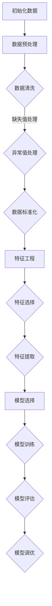
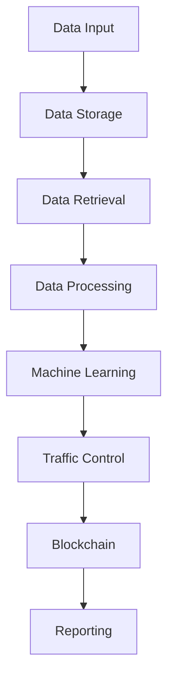
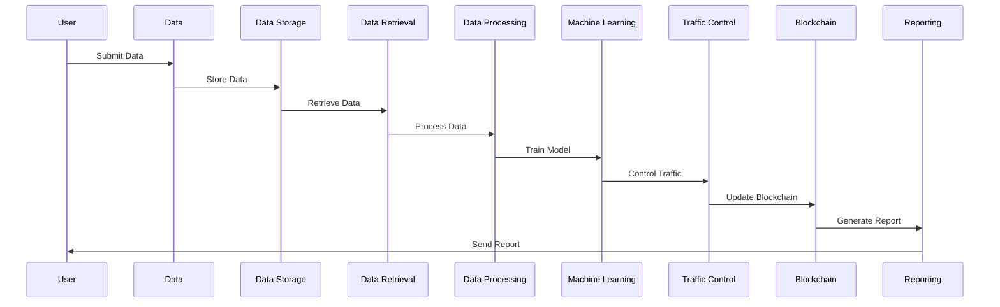

                 

# 引言

在信息技术飞速发展的当今世界，技术前沿研究已经成为推动社会进步和企业创新的核心动力。作为一名P9级别的工程师，面对复杂多变的技术环境，持续创新和技术提升显得尤为重要。本文旨在探讨前沿技术研究在P9工程师职业生涯中的重要性，并深入分析人工智能、量子计算和区块链技术这三个热门领域的发展现状、应用场景以及实践方法。

## 文章关键词

- **前沿技术**
- **P9工程师**
- **人工智能**
- **量子计算**
- **区块链技术**
- **技术创新**

## 摘要

本文将通过对人工智能、量子计算和区块链技术这三个前沿领域的详细探讨，展示它们在推动P9工程师职业发展中的关键作用。文章首先概述了每个领域的基本概念和原理，然后深入分析其实践应用。通过逐步分析每个领域的核心概念、算法原理和应用场景，我们将理解前沿技术在实际工程中的运用，并探讨如何将这些技术融入P9工程师的创新实践中。最后，文章将探讨这些前沿技术的融合与创新，提出对未来技术发展的预测和思考。

## 第1章 引言

### 前沿技术研究的重要性

前沿技术研究在现代科技发展中扮演着至关重要的角色。随着信息技术的不断演进，传统技术逐渐暴露出其局限性，而前沿技术的出现为解决这些问题提供了新的思路和方法。对于P9级别的工程师来说，掌握前沿技术不仅能够提升自身的技术水平，还能在激烈的市场竞争中保持优势。

首先，前沿技术研究有助于工程师拓宽知识面。在技术快速发展的时代，只有不断学习新的知识和技能，才能紧跟行业步伐。P9工程师往往拥有丰富的经验，但这也可能成为他们进步的障碍。通过深入研究前沿技术，工程师可以打破旧有思维的束缚，开拓新的思维空间。

其次，前沿技术研究是创新的核心动力。随着技术的进步，新的商业模式和解决方案不断涌现。P9工程师作为企业技术的核心，需要具备敏锐的洞察力和创新思维，才能把握市场机遇，为企业带来实质性的收益。前沿技术的研究和探索正是激发这种创新思维的关键。

最后，前沿技术研究有助于提高工程师的职业竞争力。在技术更新迅速的今天，拥有前沿技术背景的工程师更容易获得高薪职位和更好的职业发展机会。对于P9级别的工程师来说，掌握前沿技术不仅是对自身能力的肯定，更是未来职业发展的保障。

### 本文结构

本文将按照以下结构进行讨论：

1. **前沿技术概述**：首先介绍人工智能、量子计算和区块链技术的基本概念、发展现状和主要应用领域。
2. **人工智能实践**：详细探讨数据预处理、模型选择与训练等人工智能领域的实践方法。
3. **量子计算实践**：介绍量子计算机的基本原理、量子算法以及量子计算编程和应用。
4. **区块链技术实践**：分析区块链的基本原理、智能合约开发以及区块链应用开发的方法。
5. **前沿技术融合与创新**：探讨人工智能与量子计算、区块链技术的融合应用，以及未来技术发展的趋势。

通过本文的逐步分析，我们将深入了解前沿技术对P9工程师创新动力的推动作用，并为读者提供实用的技术实践指南。

## 第2章 前沿技术概述

在前沿技术领域，人工智能、量子计算和区块链技术无疑是最为热门的话题。这些技术不仅在各自领域取得了显著的进展，而且在相互融合中展现出巨大的潜力。本节将详细探讨这三个领域的基本概念、发展现状和主要应用领域。

### 2.1 人工智能

#### 2.1.1 深度学习

深度学习是人工智能的一个重要分支，其核心思想是通过多层神经网络来模拟人脑的学习过程。深度学习在图像识别、自然语言处理和语音识别等领域取得了显著的成果。以下是一些关键的深度学习技术：

##### 2.1.1.1 神经网络

神经网络是由大量相互连接的简单处理单元（神经元）组成的计算模型。它通过前向传播和反向传播算法来训练模型，从而实现数据的分类、回归和预测。

##### 2.1.1.2 卷积神经网络（CNN）

卷积神经网络是一种专门用于图像识别的神经网络结构，通过卷积操作和池化操作来提取图像特征。CNN在图像分类、目标检测和图像分割等领域具有广泛应用。

##### 2.1.1.3 递归神经网络（RNN）

递归神经网络是一种能够处理序列数据的神经网络，通过其在时间步上的递归连接来捕捉序列的长期依赖关系。RNN在自然语言处理和语音识别领域有着重要的应用。

#### 2.1.2 自然语言处理

自然语言处理（NLP）是人工智能的重要领域，旨在使计算机能够理解和处理自然语言。以下是一些关键的NLP技术：

##### 2.1.2.1 词嵌入

词嵌入是将词汇映射到高维空间中的向量表示，从而实现语义理解和信息检索。常见的词嵌入方法包括Word2Vec、GloVe等。

##### 2.1.2.2 生成式模型

生成式模型是一种能够生成文本、图像和其他数据模型的机器学习模型，如变分自编码器（VAE）、生成对抗网络（GAN）等。

##### 2.1.2.3 对话系统

对话系统是一种能够与人类进行自然语言交互的计算机系统，包括语音助手、聊天机器人等。对话系统的核心技术包括语音识别、自然语言理解和自然语言生成。

### 2.2 量子计算

量子计算是一种基于量子力学原理的新型计算模式，其核心是利用量子位（Qubit）和量子逻辑门来进行计算。以下是一些关键的量子计算技术：

#### 2.2.1 量子计算机原理

##### 2.2.1.1 量子位（Qubit）

量子位是量子计算机的基本单元，它可以通过量子叠加和量子纠缠来实现超强的计算能力。

##### 2.2.1.2 量子逻辑门

量子逻辑门是量子计算机中的基本操作单元，通过量子态的变换来实现量子计算。

##### 2.2.1.3 量子纠缠

量子纠缠是量子计算中的一种特殊现象，当两个量子位发生纠缠后，它们的状态将不可分割，从而实现量子并行计算。

#### 2.2.2 量子算法

量子算法是利用量子计算机来解决特定问题的一类算法，如Shor算法和Grover算法。

##### 2.2.2.1 Shor算法

Shor算法是一种能够利用量子计算机在多项式时间内解决大整数分解问题的算法，对密码学具有重要意义。

##### 2.2.2.2 Grover算法

Grover算法是一种能够提高搜索算法效率的量子算法，可以在未经排序的数据库中快速找到目标元素。

### 2.3 区块链技术

区块链技术是一种分布式数据库技术，通过去中心化的方式记录数据，具有不可篡改和透明性等特点。以下是一些关键的区块链技术：

#### 2.3.1 区块链原理

##### 2.3.1.1 区块链的基本组成

区块链由一系列按时间顺序排列的区块组成，每个区块包含一组交易记录和区块链的哈希值。

##### 2.3.1.2 智能合约

智能合约是一种自动执行的合约，其条款和操作由编程代码控制，无需人工干预。

##### 2.3.1.3 去中心化应用（DApp）

去中心化应用是运行在区块链上的应用程序，通过去中心化的方式提供服务，具有高可靠性和安全性。

#### 2.3.2 区块链应用场景

区块链技术在金融、物流、供应链管理等领域具有广泛的应用。以下是一些常见的应用场景：

##### 2.3.2.1 金融

区块链技术可以用于去中心化的金融交易，降低交易成本和提高交易透明度。

##### 2.3.2.2 物流

区块链技术可以用于物流信息的管理和追溯，提高供应链的效率和透明度。

##### 2.3.2.3 供应链管理

区块链技术可以用于供应链管理中的数据共享和溯源，确保产品的真实性和安全性。

通过以上对人工智能、量子计算和区块链技术的介绍，我们可以看到这三个领域在技术和应用上的多样性和潜力。在接下来的章节中，我们将深入探讨这些技术的实践方法和应用场景，帮助读者更好地理解和掌握这些前沿技术。

### 2.1.1 深度学习

深度学习是人工智能领域的一个重要分支，它通过构建多层的神经网络模型来模拟人脑的学习过程。深度学习在图像识别、自然语言处理和语音识别等领域取得了显著的成功。下面我们将详细探讨深度学习中的几个关键概念和它们的应用。

#### 2.1.1.1 神经网络

神经网络（Neural Networks）是由大量简单计算单元（即神经元）通过复杂连接方式构成的计算模型。每个神经元接收来自其他神经元的输入信号，通过激活函数产生输出。神经网络的核心在于其层次结构，通过前向传播和反向传播算法，模型可以从大量数据中学习到复杂的特征和模式。

##### 2.1.1.1.1 神经元

神经元是神经网络的基本单元，它模拟人脑中的神经细胞。每个神经元包含一个输入层、一个加权层、一个激活函数和输出层。输入层接收外部输入信号，加权层将这些信号通过不同的权重进行加权求和，然后通过激活函数产生输出。

##### 2.1.1.1.2 激活函数

激活函数是神经网络中的一个重要组件，它对神经元的输出进行非线性变换。常见的激活函数包括Sigmoid、ReLU和Tanh等，这些函数可以帮助模型捕捉数据中的非线性关系。

##### 2.1.1.1.3 前向传播和反向传播

神经网络的学习过程包括前向传播和反向传播。在前向传播过程中，输入信号通过多层神经网络逐层传递，最终得到输出。在反向传播过程中，模型根据输出与实际标签之间的误差，通过梯度下降法调整权重和偏置，从而优化模型参数。

#### 2.1.1.2 卷积神经网络（CNN）

卷积神经网络（Convolutional Neural Networks，CNN）是一种专门用于处理图像数据的神经网络模型。CNN通过卷积操作和池化操作来提取图像特征，从而实现图像分类、目标检测和图像分割等任务。

##### 2.1.1.2.1 卷积操作

卷积操作是CNN中最基本的操作。它通过卷积核在图像上滑动，对局部区域进行加权求和，从而提取图像的特征。卷积操作可以模拟人类视觉系统中神经元对局部特征敏感的特性。

##### 2.1.1.2.2 池化操作

池化操作是对卷积操作后得到的特征图进行降维处理。常见的池化操作包括最大池化和平均池化。池化操作可以减少数据维度，提高模型的计算效率，同时有助于防止过拟合。

#### 2.1.1.3 递归神经网络（RNN）

递归神经网络（Recurrent Neural Networks，RNN）是一种能够处理序列数据的神经网络模型。RNN通过其在时间步上的递归连接来捕捉序列的长期依赖关系。RNN在自然语言处理、语音识别和时间序列预测等领域具有广泛应用。

##### 2.1.1.3.1 RNN结构

RNN的基本结构包括输入层、隐藏层和输出层。在时间步t，RNN的输入为x_t，隐藏状态为h_t，输出为y_t。隐藏状态h_t不仅受到当前输入x_t的影响，还受到前一个时间步的隐藏状态h_{t-1}的影响。

##### 2.1.1.3.2 LSTM和GRU

长短期记忆网络（Long Short-Term Memory，LSTM）和门控循环单元（Gated Recurrent Unit，GRU）是RNN的变体，它们通过引入门控机制来解决RNN的梯度消失和梯度爆炸问题。LSTM和GRU在处理长序列数据时具有更好的性能。

#### 2.1.2 自然语言处理

自然语言处理（Natural Language Processing，NLP）是人工智能的一个重要分支，旨在使计算机能够理解和处理自然语言。NLP技术包括词嵌入、生成式模型和对话系统等。

##### 2.1.2.1 词嵌入

词嵌入（Word Embedding）是将词汇映射到高维空间中的向量表示。词嵌入能够捕捉词汇之间的语义关系，从而提高NLP任务的性能。常见的词嵌入方法包括Word2Vec、GloVe和BERT等。

##### 2.1.2.2 生成式模型

生成式模型（Generative Models）是一种能够生成文本、图像和其他数据模型的机器学习模型。生成式模型通过学习数据的概率分布，可以生成新的数据样本。常见的生成式模型包括变分自编码器（Variational Autoencoder，VAE）和生成对抗网络（Generative Adversarial Networks，GAN）等。

##### 2.1.2.3 对话系统

对话系统（Dialogue Systems）是一种能够与人类进行自然语言交互的计算机系统。对话系统包括语音助手、聊天机器人和虚拟助手等。对话系统的核心技术包括语音识别、自然语言理解和自然语言生成。

通过上述对深度学习的详细分析，我们可以看到深度学习在图像处理、自然语言理解和序列建模等方面的强大能力。在接下来的章节中，我们将继续探讨量子计算和区块链技术，进一步拓展我们的技术视野。

### 2.2 量子计算

量子计算是现代计算机科学的一个重要分支，它基于量子力学原理进行信息处理和计算。与传统计算相比，量子计算具有并行处理、快速计算和高度加密等独特优势。在量子计算领域，量子位（Qubit）、量子逻辑门和量子纠缠是核心概念。下面我们将逐一介绍这些概念及其应用。

#### 2.2.1 量子计算机原理

量子计算机的工作原理与传统计算机有显著不同。传统计算机基于二进制系统，使用比特（Bit）作为信息的基本单元，每个比特只能是0或1。而量子计算机则使用量子位（Qubit），Qubit可以同时处于0和1的叠加状态，这种叠加状态使得量子计算机能够在同一时间内处理多个计算任务，从而实现并行计算。

##### 2.2.1.1 量子位（Qubit）

量子位（Qubit）是量子计算机的基本单元，它不仅可以表示0或1的状态，还可以表示这两个状态的叠加。Qubit的叠加态可以表示为：

$$
|\psi\rangle = a|0\rangle + b|1\rangle
$$

其中，\(a\)和\(b\)是复数系数，满足\( |a|^2 + |b|^2 = 1 \)。

##### 2.2.1.2 量子逻辑门

量子逻辑门（Quantum Gate）是量子计算机中的基本操作单元，类似于传统计算机中的逻辑门。量子逻辑门对Qubit进行线性变换，从而改变其状态。常见的量子逻辑门包括：

- **Pauli-X门（翻转门）**：将Qubit的状态从0翻转到1，或从1翻转到0。
- **Pauli-Z门（相位翻转门）**：在Qubit的叠加态上引入相位。
- **Hadamard门（哈达玛门）**：将Qubit的基态|0⟩和|1⟩以等概率叠加，实现量子叠加态。

##### 2.2.1.3 量子纠缠

量子纠缠（Quantum Entanglement）是量子计算中的另一个核心概念。当两个或多个量子位发生纠缠后，它们之间的状态将不可分割，即使这些量子位相隔很远。量子纠缠现象使得量子计算机能够在同一时间内对多个量子位进行同步操作，从而实现高效的量子并行计算。

#### 2.2.2 量子算法

量子算法（Quantum Algorithm）是利用量子计算机来解决特定问题的一类算法。与经典算法相比，量子算法在解决某些问题时具有显著的优势。以下介绍两个重要的量子算法：Shor算法和Grover算法。

##### 2.2.2.1 Shor算法

Shor算法是一种能够利用量子计算机在多项式时间内解决大整数分解问题的算法。经典算法在解决大整数分解问题时需要巨大的计算量，而Shor算法则可以通过量子计算机在短时间内完成。Shor算法的原理基于量子傅里叶变换（Quantum Fourier Transform），它可以将量子态从位置表示转换为频率表示，从而实现高效的分解。

##### 2.2.2.2 Grover算法

Grover算法是一种能够提高搜索算法效率的量子算法。在经典计算机中，搜索一个未经排序的数据库通常需要\(O(n)\)的时间复杂度，而Grover算法可以将这个复杂度降低到\(O(\sqrt{n})\)。Grover算法的核心思想是通过量子叠加和量子纠缠来并行地放大目标状态的幅度，从而实现快速搜索。

#### 2.2.3 量子计算编程

量子计算编程（Quantum Programming）是开发量子应用程序的过程，它要求开发者具备量子物理和量子计算的基本知识。常见的量子编程语言包括Q#、Qiskit和Microsoft Quantum Development Kit等。

##### 2.2.3.1 Q#

Q#是一种由Microsoft开发的量子编程语言，它具有类似于C#的语法，并支持面向对象编程。Q#提供了丰富的库和工具，用于开发量子应用程序。

##### 2.2.3.2 Qiskit

Qiskit是由IBM开发的量子计算框架，它支持多种量子编程语言，如Q#和Python。Qiskit提供了大量的量子算法和工具，方便开发者进行量子计算实验。

#### 2.2.4 量子计算应用

量子计算在多个领域都有潜在的应用，包括密码学、化学和金融等。以下介绍几个典型的量子计算应用。

##### 2.2.4.1 密码学

量子计算在密码学中有重要的应用。例如，量子计算机可以快速破解RSA加密算法，这对现有的密码系统构成了巨大威胁。然而，量子计算也为密码学带来了新的机遇，如量子密钥分发（Quantum Key Distribution，QKD）和量子密码学算法。

##### 2.2.4.2 化学

量子计算在化学中的应用包括分子模拟、化学反应预测和材料设计等。量子计算机可以高效地模拟复杂的化学反应，从而加速新药物和新材料的研发。

##### 2.2.4.3 金融

量子计算在金融领域有广泛的应用，包括风险分析、投资策略优化和市场预测等。量子计算机可以快速处理大量的金融数据，帮助金融机构做出更准确的决策。

通过上述对量子计算原理和应用的介绍，我们可以看到量子计算在信息处理、科学研究和工业应用等方面的巨大潜力。在未来的发展中，量子计算将不断推动技术的革新和进步，为人类社会带来更多创新和变革。

### 2.3 区块链技术

区块链技术是一种基于分布式数据库和密码学的技术，通过去中心化的方式记录和管理数据，具有不可篡改和透明性等特点。自2008年比特币的诞生以来，区块链技术已经迅速发展，并在金融、物流、供应链管理等多个领域得到广泛应用。下面我们将详细探讨区块链技术的基本原理、核心组成部分及其应用场景。

#### 2.3.1 区块链原理

区块链是一个由多个按时间顺序排列的区块组成的链式数据结构。每个区块包含一定数量的交易记录，以及一个指向前一个区块的哈希值，从而形成一个连续的、不可篡改的链条。以下是一些关键的区块链原理：

##### 2.3.1.1 基本组成

区块链的基本组成包括：

- **区块（Block）**：区块是区块链的基本单元，每个区块包含一定数量的交易记录。
- **链（Chain）**：区块链是由多个区块按时间顺序排列组成的链式数据结构。
- **交易（Transaction）**：交易是区块链中的数据单元，记录了资金的转移或其他操作。
- **节点（Node）**：节点是区块链网络中的计算实体，负责验证和记录交易。

##### 2.3.1.2 交易流程

区块链的交易流程包括以下几个步骤：

1. **交易发起**：用户发起一笔交易，并将交易信息广播到网络。
2. **交易验证**：网络中的节点对交易进行验证，确保交易的有效性和合法性。
3. **区块创建**：当一定数量的交易经过验证后，节点将它们打包成一个新区块。
4. **区块添加**：新区块通过共识算法被添加到区块链中，成为区块链的一部分。

##### 2.3.1.3 共识算法

共识算法是区块链网络中节点之间达成共识的机制，用于决定哪些交易将被添加到区块链中。常见的共识算法包括：

- **工作量证明（Proof of Work，PoW）**：节点通过解决复杂的数学难题来证明自己的工作，从而获得记账权利。
- **权益证明（Proof of Stake，PoS）**：节点根据其在区块链中的权益比例来决定记账权利。
- **委托权益证明（Delegated Proof of Stake，DPoS）**：节点通过选举代表来参与记账。

#### 2.3.2 智能合约

智能合约是一种自动执行的合约，其条款和操作由编程代码控制，无需人工干预。智能合约在区块链网络中具有重要作用，可以用于自动化执行合约条款，从而提高交易的效率和透明度。以下是一些关键概念：

##### 2.3.2.1 基本原理

智能合约的基本原理包括：

- **代码执行**：智能合约的代码在区块链上执行，确保合约条款的自动执行。
- **不可篡改**：智能合约的代码一旦部署，就不能被修改，从而确保合约的公正性和透明性。
- **去中心化**：智能合约在去中心化的区块链网络中运行，不受单一实体控制。

##### 2.3.2.2 Solidity编程语言

Solidity是一种用于编写智能合约的高级编程语言，类似于JavaScript和Python。Solidity具有丰富的语法和功能，支持面向对象编程和函数调用等特性。以下是一个简单的Solidity智能合约示例：

```solidity
pragma solidity ^0.8.0;

contract HelloWorld {
    string public message;

    constructor(string memory initMessage) {
        message = initMessage;
    }

    function updateMessage(string memory newMessage) public {
        message = newMessage;
    }
}
```

#### 2.3.3 去中心化应用（DApp）

去中心化应用（Decentralized Application，DApp）是运行在区块链上的应用程序，通过去中心化的方式提供服务和数据存储。DApp的核心在于其去中心化架构，具有高可靠性和安全性。以下是一些DApp的关键特点：

##### 2.3.3.1 架构

DApp的架构包括：

- **前端**：DApp的前端通常是Web或移动应用，用于用户界面和交互。
- **智能合约**：智能合约是DApp的核心，用于实现业务逻辑和数据处理。
- **区块链**：区块链是DApp的数据存储和管理中心，确保数据的不可篡改和透明性。

##### 2.3.3.2 开发

DApp的开发涉及多个方面，包括前端开发、智能合约编写和后端服务。以下是一个简单的DApp开发示例：

1. **前端开发**：使用HTML、CSS和JavaScript构建用户界面。
2. **智能合约编写**：使用Solidity编写智能合约，并部署到区块链上。
3. **后端服务**：使用Web3.js等库连接前端和区块链，实现数据交互和业务逻辑。

#### 2.3.4 区块链应用场景

区块链技术在多个领域都有广泛的应用，以下介绍几个典型的应用场景：

##### 2.3.4.1 金融

区块链技术在金融领域有广泛的应用，包括去中心化的金融交易、数字货币、跨境支付和智能投顾等。区块链技术可以提高金融交易的效率、降低成本，并增强交易的透明度和安全性。

##### 2.3.4.2 物流

区块链技术在物流领域有广泛的应用，包括供应链管理、物流信息追踪和溯源等。区块链技术可以确保物流信息的真实性和透明性，从而提高供应链的效率和可靠性。

##### 2.3.4.3 供应链管理

区块链技术在供应链管理中具有重要作用，可以用于数据共享、溯源和防伪等。区块链技术可以确保供应链中的每个环节都透明可查，从而提高供应链的效率和可靠性。

##### 2.3.4.4 医疗保健

区块链技术在医疗保健领域有广泛的应用，包括电子病历管理、药物溯源和健康数据共享等。区块链技术可以确保医疗数据的安全性和隐私性，从而提高医疗服务的质量和效率。

通过上述对区块链技术原理和应用场景的介绍，我们可以看到区块链技术在未来将不断推动各个领域的发展和变革。在接下来的章节中，我们将深入探讨区块链技术的实践方法和应用，帮助读者更好地理解和应用这一前沿技术。

### 3.1 数据预处理

在人工智能项目中，数据预处理是一个至关重要的步骤，它直接关系到模型的性能和准确性。数据预处理包括数据清洗、特征工程和数据标准化等步骤，下面我们将详细讨论这些步骤及其在人工智能实践中的应用。

#### 3.1.1 数据清洗

数据清洗是数据预处理的第一步，目的是去除数据中的噪声、纠正数据中的错误，并处理缺失值和异常值。以下是一些常见的数据清洗方法：

##### 3.1.1.1 缺失值处理

缺失值是数据中常见的现象，处理缺失值的方法包括：

- **删除缺失值**：对于少量缺失值，可以选择删除相关记录。但这可能会丢失部分信息。
- **填充缺失值**：可以使用均值、中位数、众数或特定值来填充缺失值。例如，对于数值数据，可以使用样本均值填充；对于分类数据，可以使用众数填充。
- **插值法**：对于时间序列数据，可以使用线性插值、多项式插值或KNN插值等方法来填补缺失值。

##### 3.1.1.2 异常值处理

异常值是数据中的异常观测值，可能对模型产生不利影响。异常值处理的方法包括：

- **删除异常值**：对于明显的异常值，可以选择删除。但需要注意，删除异常值可能会导致数据的失真。
- **修正异常值**：可以尝试修正异常值的错误，例如使用统计方法检测异常值，并对其进行修正。
- **保留异常值**：在某些情况下，异常值可能具有特殊意义，可以选择保留。但需要结合具体应用场景进行判断。

##### 3.1.1.3 数据标准化

数据标准化是为了使不同特征具有相似的尺度和范围，以便模型能够更好地处理这些特征。常见的数据标准化方法包括：

- **归一化**：将特征值缩放到[0, 1]之间，计算公式为：
  $$
  x_{\text{norm}} = \frac{x - \text{min}(x)}{\text{max}(x) - \text{min}(x)}
  $$
- **标准化**：将特征值缩放到均值为0、标准差为1的标准正态分布，计算公式为：
  $$
  x_{\text{std}} = \frac{x - \text{mean}(x)}{\text{stddev}(x)}
  $$
- **极差标准化**：将特征值缩放到一个固定区间，例如[-1, 1]，计算公式为：
  $$
  x_{\text{range}} = \frac{x - \text{min}(x)}{\text{max}(x) - \text{min}(x)} \times (\text{max} - \text{min}) + \text{min}
  $$

#### 3.1.2 特征工程

特征工程是数据预处理的关键步骤，旨在从原始数据中提取出对模型有用的特征，从而提高模型的性能。以下是一些常见的特征工程方法：

##### 3.1.2.1 特征选择

特征选择是指从原始特征中选择出对模型最有帮助的特征。常见的方法包括：

- **筛选法**：根据特征的重要性或相关性进行筛选，选择前N个特征。
- **嵌入式方法**：在模型训练过程中逐步选择特征，如L1正则化（Lasso）和随机森林。
- **包装法**：根据模型性能逐步选择特征，如递归特征消除（RFE）和遗传算法。

##### 3.1.2.2 特征提取

特征提取是指从原始特征中生成新的特征，以增强模型的学习能力。以下是一些常见的方法：

- **特征变换**：包括主成分分析（PCA）、因子分析和线性判别分析（LDA）等，用于降维和提取主要特征。
- **特征组合**：通过组合多个原始特征生成新的特征，如特征交叉、特征融合等。
- **特征生成**：使用机器学习算法生成新特征，如自动编码器（Autoencoder）和生成对抗网络（GAN）。

#### 3.1.3 数据标准化

数据标准化是将数据转换为具有统一尺度和范围的数值，以便模型能够更好地处理这些特征。以下是一些常见的数据标准化方法：

- **归一化**：将特征值缩放到[0, 1]之间。
- **标准化**：将特征值缩放到均值为0、标准差为1的标准正态分布。
- **极差标准化**：将特征值缩放到一个固定区间。

通过上述对数据预处理各步骤的讨论，我们可以看到数据预处理在人工智能项目中的重要性。有效的数据预处理可以显著提高模型的性能和准确性，为后续的模型训练和评估打下坚实的基础。在接下来的章节中，我们将继续探讨模型选择与训练的方法和技巧。

### 3.2 模型选择与训练

在人工智能项目中，选择合适的模型和进行有效的训练是确保模型性能和准确性的关键步骤。以下将详细介绍模型选择和训练的方法、技巧，以及评估模型性能的常用指标。

#### 3.2.1 模型选择

模型选择是构建人工智能系统的重要一环，选择合适的模型能够提高预测的准确性和系统的效率。以下是一些常用的模型选择方法：

##### 3.2.1.1 理论基础

模型选择的理论基础包括：

- **模型复杂度**：模型复杂度越高，其拟合能力越强，但也容易出现过拟合现象。选择模型时需要平衡模型的复杂度和泛化能力。
- **交叉验证**：交叉验证是一种常用的模型选择方法，通过将数据集划分为训练集和验证集，多次训练和验证模型，以评估模型在未知数据上的性能。

##### 3.2.1.2 常见模型

在人工智能领域，常见的模型包括：

- **线性模型**：如线性回归、逻辑回归等，适用于处理线性关系问题。
- **树模型**：如决策树、随机森林等，适用于处理非线性和高维数据。
- **神经网络**：如卷积神经网络（CNN）、递归神经网络（RNN）等，适用于处理复杂的非线性问题。
- **集成模型**：如梯度提升树（GBDT）、XGBoost等，通过集成多个基础模型来提高预测性能。

##### 3.2.1.3 选择策略

在实际项目中，常用的模型选择策略包括：

- **网格搜索**：通过遍历参数空间，找到最优参数组合。
- **随机搜索**：通过随机选择参数组合，提高搜索效率。
- **贝叶斯优化**：利用贝叶斯理论进行参数优化，适用于高维参数空间。

#### 3.2.2 模型训练

模型训练是模型选择的重要步骤，通过训练数据集，模型可以学习到特征和标签之间的关系，从而提高预测能力。以下是一些常见的模型训练方法：

##### 3.2.2.1 理论基础

模型训练的理论基础包括：

- **损失函数**：损失函数用于度量模型预测值与真实值之间的差异，常用的损失函数包括均方误差（MSE）、交叉熵损失等。
- **优化算法**：优化算法用于调整模型参数，以最小化损失函数。常见的优化算法包括随机梯度下降（SGD）、Adam等。

##### 3.2.2.2 训练技巧

在实际训练过程中，可以采用以下技巧来提高模型性能：

- **数据增强**：通过增加数据的多样性，如旋转、缩放、裁剪等，来提高模型的泛化能力。
- **正则化**：通过在损失函数中加入正则项，如L1、L2正则化，来防止模型过拟合。
- **dropout**：通过在训练过程中随机丢弃部分神经元，来提高模型的泛化能力。

##### 3.2.2.3 训练流程

模型训练的流程通常包括：

1. **数据准备**：清洗和预处理数据，包括归一化、缺失值处理等。
2. **模型构建**：选择合适的模型，定义损失函数和优化算法。
3. **训练过程**：使用训练数据集进行模型训练，调整模型参数。
4. **评估过程**：使用验证数据集评估模型性能，调整模型参数。
5. **测试过程**：使用测试数据集评估模型在未知数据上的性能。

#### 3.2.3 模型评估

模型评估是验证模型性能和选择最优模型的重要步骤。以下是一些常用的评估指标：

##### 3.2.3.1 理论基础

模型评估的理论基础包括：

- **准确性**：准确性是指模型正确预测的样本占总样本的比例。
- **召回率**：召回率是指模型正确预测的样本占实际为正样本的比例。
- **精确率**：精确率是指模型正确预测的样本占预测为正样本的比例。

##### 3.2.3.2 常用指标

以下是一些常用的模型评估指标：

- **准确率（Accuracy）**：准确率是预测正确的样本数占总样本数的比例。
  $$
  \text{Accuracy} = \frac{\text{预测正确数}}{\text{总样本数}}
  $$

- **召回率（Recall）**：召回率是预测正确的正样本数占实际正样本数的比例。
  $$
  \text{Recall} = \frac{\text{预测正确的正样本数}}{\text{实际正样本数}}
  $$

- **精确率（Precision）**：精确率是预测正确的正样本数占预测为正样本的总数的比例。
  $$
  \text{Precision} = \frac{\text{预测正确的正样本数}}{\text{预测为正样本的总数}}
  $$

- **F1分数（F1 Score）**：F1分数是精确率和召回率的调和平均值，用于平衡精确率和召回率。
  $$
  \text{F1 Score} = 2 \times \frac{\text{Precision} \times \text{Recall}}{\text{Precision} + \text{Recall}}
  $$

- **ROC-AUC曲线（Receiver Operating Characteristic-Area Under Curve）**：ROC-AUC曲线是评估二分类模型性能的指标，曲线下的面积越大，模型性能越好。

通过上述对模型选择和训练方法的详细讨论，我们可以看到在人工智能项目中，选择合适的模型并进行有效的训练是提高模型性能和准确性的关键。在接下来的章节中，我们将探讨量子计算编程和量子算法，继续拓展我们的技术视野。

### 4.1 量子计算机基础

量子计算机作为一种基于量子力学原理的新型计算设备，具有传统计算机无法比拟的计算能力。下面将介绍量子计算机的基本原理，包括量子位（Qubit）、量子逻辑门和量子纠缠。

#### 4.1.1 量子位（Qubit）

量子位（Qubit）是量子计算机的基本单元，它是一种具有两个或多个稳定状态的量子系统。与传统的比特（Bit）不同，Qubit可以同时存在于0和1的叠加状态，这种叠加状态是量子计算机实现并行计算和高效处理复杂问题的关键。

一个量子位的叠加状态可以表示为：
$$
|\psi\rangle = a|0\rangle + b|1\rangle
$$
其中，\(a\) 和 \(b\) 是复数系数，满足 \(|a|^2 + |b|^2 = 1\)。

#### 4.1.2 量子逻辑门

量子逻辑门是量子计算机中的基本操作单元，类似于传统计算机中的逻辑门。量子逻辑门对量子位进行线性变换，从而改变其状态。常见的量子逻辑门包括：

- **保罗门（Pauli Gates）**：包括X门、Y门和Z门，分别对量子位的状态进行旋转操作。
- **控制非门（CNOT Gate）**：一种两量子位的量子逻辑门，将一个量子位的状态翻转，受控于另一个量子位的状态。
- **哈达玛门（Hadamard Gate）**：将量子位的状态从基态|0⟩和|1⟩以等概率叠加。

#### 4.1.3 量子纠缠

量子纠缠是量子计算中的另一种重要现象，当两个或多个量子位发生纠缠后，它们之间的状态将不可分割，即使这些量子位相隔很远。量子纠缠可以实现量子并行计算，从而提高计算效率。

例如，两个量子位纠缠后的状态可以表示为：
$$
|\psi\rangle_{AB} = \frac{1}{\sqrt{2}} (|00\rangle + |11\rangle)
$$
在这个纠缠态中，量子位A和量子位B的状态是相互关联的，任何对其中一个量子位的操作都会立即影响到另一个量子位的状态。

#### 4.1.4 量子算法

量子算法是利用量子计算机来解决特定问题的一类算法，具有传统算法无法比拟的效率。以下介绍两个重要的量子算法：Shor算法和Grover算法。

##### 4.1.4.1 Shor算法

Shor算法是一种利用量子计算机在多项式时间内解决大整数分解问题的算法。传统算法在大整数分解问题上需要巨大的计算资源，而Shor算法通过量子傅里叶变换（Quantum Fourier Transform，QFT）在量子计算机上实现高效的分解。

Shor算法的基本步骤如下：

1. **初始化**：使用量子计算机生成一个具有特定质因数的整数。
2. **量子傅里叶变换**：对整数进行量子傅里叶变换，得到其离散傅里叶变换（Discrete Fourier Transform，DFT）。
3. **识别周期**：使用量子相位估计（Quantum Phase Estimation）算法找到质因数的周期。
4. **因式分解**：利用周期找到原始整数的质因数。

##### 4.1.4.2 Grover算法

Grover算法是一种提高搜索算法效率的量子算法，能够在未经排序的数据库中快速找到目标元素。Grover算法通过量子叠加和量子纠缠来并行放大目标状态的幅度，从而实现快速搜索。

Grover算法的基本步骤如下：

1. **初始化**：使用量子计算机生成一个叠加态，代表数据库中所有元素。
2. **应用Grover迭代**：通过一系列的量子逻辑门操作，增强目标元素的概率。
3. **测量**：测量量子计算机的状态，得到目标元素。

#### 4.1.5 量子编程

量子编程是开发量子应用程序的过程，要求开发者具备量子物理和量子计算的基本知识。常见的量子编程语言包括Q#、Qiskit和Microsoft Quantum Development Kit等。

##### 4.1.5.1 Q#

Q#是一种由Microsoft开发的量子编程语言，具有类似于C#的语法，并支持面向对象编程。Q#提供了丰富的库和工具，用于开发量子应用程序。

##### 4.1.5.2 Qiskit

Qiskit是由IBM开发的量子计算框架，支持多种量子编程语言，如Q#和Python。Qiskit提供了大量的量子算法和工具，方便开发者进行量子计算实验。

通过上述对量子计算机基础、量子算法和量子编程的介绍，我们可以看到量子计算在信息处理、科学研究和工业应用等方面的巨大潜力。在接下来的章节中，我们将进一步探讨量子计算在具体应用场景中的实践方法。

### 4.2 量子计算编程

量子计算编程是开发量子应用程序的过程，它要求开发者具备量子物理和量子计算的基本知识。量子计算编程语言旨在提供一种类似于传统编程语言的方式，使开发者能够编写和执行量子算法。以下将介绍Q#编程语言的基础知识，包括其语法和基本示例。

#### 4.2.1 Q#语法基础

Q#是一种由Microsoft开发的量子编程语言，其语法类似于C#，并支持面向对象编程。Q#的主要语法规则包括：

- **量子类型**：Q#使用`Qubit`和`Quantum`类型来表示量子位和量子操作。
- **量子门**：Q#提供了多种量子门，如`Hadamard`、`PauliX`、`ControlledZ`等，用于在量子位上执行操作。
- **操作符**：Q#使用`Operator`类型来表示量子操作符，可以通过`Apply`方法将操作符应用于量子位。
- **量子程序**：Q#程序是定义在`Quantum`结构中的函数，包含量子门、测量和初始化等操作。

#### 4.2.2 Q#示例代码

以下是一个简单的Q#示例代码，展示如何使用Q#编程语言实现一个量子翻转操作：

```qsharp
open Microsoft.Quantum.Intrinsic;
open Microsoft.Quantum.Canon;

operation QuantumFlip(qubit : Qubit) : Unit
{
    H(qubit); // 应用哈达玛门
    X(qubit); // 应用保罗X门
    H(qubit); // 应用哈达玛门再次，以恢复原始态
}
```

在这个示例中，`QuantumFlip`操作首先使用哈达玛门将量子位初始化为叠加态，然后应用保罗X门将其状态翻转，最后再次应用哈达玛门以恢复原始态。

#### 4.2.3 Q#高级特性

Q#还支持一些高级特性，如量子并行操作、量子测量和量子纠缠。以下是一个使用量子纠缠的示例代码：

```qsharp
operation QuantumCNOT(qubitA : Qubit, qubitB : Qubit) : Unit
{
    CNOT(qubitA, qubitB); // 应用控制非门，将qubitA的状态传递给qubitB
}
```

在这个示例中，`QuantumCNOT`操作通过控制非门将两个量子位A和B进行纠缠。

#### 4.2.4 Q#编程环境

Q#编程环境提供了多种工具和库，以支持量子计算的开发和实验。以下是一些常用的Q#编程环境：

- **Q# IDE**：Q#集成开发环境，支持代码编辑、调试和运行。
- **Q# Play**：在线Q#编程环境，无需安装，方便快速实验。
- **QDK**：量子开发工具包，提供丰富的库和API，用于量子计算的开发和部署。

通过上述对Q#编程语言的介绍，我们可以看到量子计算编程的基础知识和应用示例。在接下来的章节中，我们将继续探讨量子计算在不同领域的具体应用，帮助读者更好地理解量子计算的实际价值。

### 4.3 量子计算应用

量子计算在多个领域展现出了巨大的潜力，特别是在密码学、化学和金融等关键领域。以下将详细探讨量子计算在这些领域的具体应用。

#### 4.3.1 量子计算在密码学中的应用

量子计算在密码学中的应用尤为引人注目，因为它能够破解许多传统密码学算法。以下是量子计算在密码学中的一些具体应用：

##### 4.3.1.1 量子密钥分发

量子密钥分发（Quantum Key Distribution，QKD）是一种基于量子力学原理的安全通信技术。QKD通过量子纠缠和量子态的不可克隆特性，实现通信双方之间的安全密钥传输。即使敌手拦截到密钥，也无法完全复制或解读出密钥信息，从而确保通信的保密性。

##### 4.3.1.2 量子密码学算法

量子密码学算法是一类利用量子力学原理设计的加密算法。例如，量子哈希函数（Quantum Hash Function）和量子数字签名（Quantum Digital Signature）等。这些算法利用量子计算的并行性和不可克隆特性，提供比传统密码学更高的安全性。

#### 4.3.2 量子计算在化学中的应用

量子计算在化学领域的应用主要表现在分子模拟、化学反应预测和材料设计等方面。以下是一些具体的例子：

##### 4.3.2.1 分子模拟

分子模拟是通过量子力学计算来模拟分子结构、电子结构和化学反应过程。传统的分子模拟需要大量的计算资源，而量子计算能够高效地处理复杂的量子力学问题，从而加速分子模拟的进程。

##### 4.3.2.2 化学反应预测

量子计算可以预测化学反应的路径、中间体和过渡态，帮助科学家设计和优化新的化学反应过程。通过量子计算，可以识别潜在的高效催化剂和新的反应条件，从而推动新药研发和材料科学的进步。

##### 4.3.2.3 材料设计

量子计算在材料设计中的应用也非常广泛。例如，通过量子计算可以预测材料的电子结构、力学性能和热稳定性，从而设计出具有特定功能的材料。量子计算为材料科学研究提供了新的工具，有助于解决传统计算方法难以处理的复杂问题。

#### 4.3.3 量子计算在金融中的应用

量子计算在金融领域有广泛的应用，包括风险管理、投资策略优化和市场预测等。以下是一些具体的例子：

##### 4.3.3.1 风险管理

量子计算可以高效地处理复杂的金融模型，如风险价值（Value at Risk，VaR）和条件风险价值（Conditional Value at Risk，CVaR）模型。通过量子计算，金融机构可以更准确地评估投资组合的风险，并采取相应的风险控制措施。

##### 4.3.3.2 投资策略优化

量子计算可以用于优化投资组合，通过快速分析大量的市场数据和历史交易记录，找到最优的投资策略。量子算法在解决高维优化问题时具有显著的优势，可以帮助金融机构提高投资回报率。

##### 4.3.3.3 市场预测

量子计算可以用于市场预测，通过分析市场数据，预测股票、债券和期货等金融产品的价格走势。量子计算在处理高维数据和复杂模型时具有优势，能够提供更准确的市场预测，从而帮助投资者做出更好的决策。

通过上述对量子计算在密码学、化学和金融领域的应用介绍，我们可以看到量子计算在这些领域的巨大潜力和广泛应用。在未来的发展中，量子计算将继续推动这些领域的技术革新和进步，为人类社会带来更多创新和变革。

### 5.1 区块链基础

区块链技术是一种分布式账本技术，通过去中心化的方式记录和管理数据，具有不可篡改和透明性等特点。以下将详细探讨区块链技术的原理、组成部分及其关键技术。

#### 5.1.1 区块链原理

区块链是一个由多个按时间顺序排列的区块组成的链式数据结构。每个区块包含一定数量的交易记录，以及一个指向前一个区块的哈希值，从而形成一个连续的、不可篡改的链条。以下是一些关键的区块链原理：

##### 5.1.1.1 区块链的数据结构

区块链的数据结构包括以下几个部分：

- **区块（Block）**：区块是区块链的基本单元，每个区块包含一定数量的交易记录。
- **链（Chain）**：区块链是由多个区块按时间顺序排列组成的链式数据结构。
- **交易（Transaction）**：交易是区块链中的数据单元，记录了资金的转移或其他操作。
- **链链（Ledger）**：链链是区块链上的所有交易记录的总和，代表整个区块链的状态。

##### 5.1.1.2 区块链的交易流程

区块链的交易流程包括以下几个步骤：

1. **交易发起**：用户发起一笔交易，并将交易信息广播到网络。
2. **交易验证**：网络中的节点对交易进行验证，确保交易的有效性和合法性。
3. **区块创建**：当一定数量的交易经过验证后，节点将它们打包成一个新区块。
4. **区块添加**：新区块通过共识算法被添加到区块链中，成为区块链的一部分。

##### 5.1.1.3 共识算法

共识算法是区块链网络中节点之间达成共识的机制，用于决定哪些交易将被添加到区块链中。常见的共识算法包括：

- **工作量证明（Proof of Work，PoW）**：节点通过解决复杂的数学难题来证明自己的工作，从而获得记账权利。
- **权益证明（Proof of Stake，PoS）**：节点根据其在区块链中的权益比例来决定记账权利。
- **委托权益证明（Delegated Proof of Stake，DPoS）**：节点通过选举代表来参与记账。

#### 5.1.2 智能合约

智能合约是一种自动执行的合约，其条款和操作由编程代码控制，无需人工干预。智能合约在区块链网络中具有重要作用，可以用于自动化执行合约条款，从而提高交易的效率和透明度。以下是一些关键概念：

##### 5.1.2.1 基本原理

智能合约的基本原理包括：

- **代码执行**：智能合约的代码在区块链上执行，确保合约条款的自动执行。
- **不可篡改**：智能合约的代码一旦部署，就不能被修改，从而确保合约的公正性和透明性。
- **去中心化**：智能合约在去中心化的区块链网络中运行，不受单一实体控制。

##### 5.1.2.2 Solidity编程语言

Solidity是一种用于编写智能合约的高级编程语言，类似于JavaScript和Python。Solidity具有丰富的语法和功能，支持面向对象编程和函数调用等特性。以下是一个简单的Solidity智能合约示例：

```solidity
pragma solidity ^0.8.0;

contract HelloWorld {
    string public message;

    constructor(string memory initMessage) {
        message = initMessage;
    }

    function updateMessage(string memory newMessage) public {
        message = newMessage;
    }
}
```

#### 5.1.3 去中心化应用（DApp）

去中心化应用（Decentralized Application，DApp）是运行在区块链上的应用程序，通过去中心化的方式提供服务和数据存储。DApp的核心在于其去中心化架构，具有高可靠性和安全性。以下是一些DApp的关键特点：

##### 5.1.3.1 架构

DApp的架构包括：

- **前端**：DApp的前端通常是Web或移动应用，用于用户界面和交互。
- **智能合约**：智能合约是DApp的核心，用于实现业务逻辑和数据处理。
- **区块链**：区块链是DApp的数据存储和管理中心，确保数据的不可篡改和透明性。

##### 5.1.3.2 开发

DApp的开发涉及多个方面，包括前端开发、智能合约编写和后端服务。以下是一个简单的DApp开发示例：

1. **前端开发**：使用HTML、CSS和JavaScript构建用户界面。
2. **智能合约编写**：使用Solidity编写智能合约，并部署到区块链上。
3. **后端服务**：使用Web3.js等库连接前端和区块链，实现数据交互和业务逻辑。

通过上述对区块链技术原理、智能合约和DApp的介绍，我们可以看到区块链技术在未来将不断推动各个领域的发展和变革。在接下来的章节中，我们将深入探讨区块链技术在具体应用场景中的实践方法。

### 5.2 区块链应用开发

区块链技术的应用开发涉及到多个方面，包括前端开发、智能合约编写和后端服务。以下将详细探讨这些方面的实现方法和步骤。

#### 5.2.1 前端开发

区块链应用的前端开发通常涉及Web或移动应用的开发，用户界面和交互是前端开发的核心。以下是一些常用的前端开发方法：

1. **Web前端开发**：
   - **技术栈**：常用的Web前端技术包括HTML、CSS、JavaScript以及前端框架如React、Vue和Angular。
   - **交互设计**：设计直观、易用的用户界面，确保用户体验。
   - **与区块链交互**：使用Web3.js等库与区块链进行交互，实现数据读取和写入。

2. **移动前端开发**：
   - **技术栈**：常用的移动前端技术包括React Native、Flutter和原生应用开发。
   - **跨平台开发**：通过React Native等框架，可以实现一次编写，多平台部署。

#### 5.2.2 智能合约编写

智能合约是区块链应用的核心，用于实现业务逻辑和数据存储。以下是一些智能合约编写的步骤和技巧：

1. **选择合适的区块链平台**：如Ethereum、Binance Smart Chain等，根据项目需求选择合适的平台。
2. **编写智能合约**：
   - **技术栈**：使用Solidity等智能合约编程语言编写合约代码。
   - **面向对象编程**：使用类和函数，组织代码结构。
   - **安全编码**：确保合约代码的安全性，避免常见的安全漏洞。

3. **部署智能合约**：
   - **本地测试**：在本地环境中进行合约测试，确保功能正确。
   - **部署到区块链**：使用合适的工具（如Truffle、Hardhat）将合约部署到区块链上。

#### 5.2.3 后端服务

区块链应用的后端服务通常涉及与区块链的交互、数据处理和业务逻辑实现。以下是一些后端服务实现的步骤：

1. **区块链节点搭建**：搭建区块链节点，确保与区块链网络的连接和同步。
2. **API接口开发**：
   - **RESTful API**：通过HTTP请求实现与区块链的交互，提供数据读取和写入接口。
   - **WebSocket**：实时与区块链交互，用于需要实时数据的应用场景。
3. **数据处理**：
   - **数据存储**：使用数据库（如PostgreSQL、MongoDB）存储区块链外的数据。
   - **数据处理**：实现数据清洗、转换和聚合等功能。

#### 5.2.4 综合示例

以下是一个简单的区块链应用开发示例：

1. **前端开发**：
   - 使用React框架构建用户界面。
   - 使用Web3.js与区块链进行交互，读取和写入数据。

2. **智能合约编写**：
   - 使用Solidity编写一个简单的智能合约，用于存储和更新数据。
   ```solidity
   pragma solidity ^0.8.0;

   contract HelloWorld {
       string public message;

       constructor(string memory initMessage) {
           message = initMessage;
       }

       function updateMessage(string memory newMessage) public {
           message = newMessage;
       }
   }
   ```

3. **后端服务**：
   - 搭建一个简单的后端服务，用于处理与区块链的交互和数据存储。
   - 提供一个RESTful API接口，用于前端与后端的通信。

通过上述区块链应用开发的步骤和示例，我们可以看到区块链技术的综合应用是如何实现的。在未来的发展中，区块链应用将不断融合新的技术和创新，为各行各业带来更多的可能性和变革。

### 5.3 区块链安全与隐私

在区块链技术迅速发展的背景下，安全与隐私问题成为了区块链应用广泛推广的关键挑战。以下将探讨区块链中常见的安全问题、智能合约漏洞以及隐私保护措施。

#### 5.3.1 区块链安全问题

区块链在分布式网络中运行，虽然其去中心化特性提供了较高的安全性，但仍然存在一些潜在的安全风险。

##### 5.3.1.1 51%攻击

**51%攻击**是指攻击者控制区块链网络中超过一半的算力，从而对区块链进行恶意控制。通过控制多数算力，攻击者可以：

- 双花攻击（Double Spending）：在同一时间内将同一条交易记录用于多次支付，导致交易冲突。
- 干扰区块生成：阻止合法区块的生成，从而控制区块链的长度和状态。
- 拒绝服务攻击（Denial of Service，DoS）：通过大量无效交易填充区块链，使得合法交易无法被确认。

为防范51%攻击，区块链系统通常采用以下措施：

- **增加网络节点数量**：通过增加节点数量，提高攻击者控制的难度。
- **工作量证明（PoW）**：提高挖矿难度，增加攻击成本。
- **权益证明（PoS）**：通过持有代币数量来决定记账权利，降低攻击者的收益。

##### 5.3.1.2 智能合约漏洞

智能合约作为区块链应用的核心，其安全性直接关系到整个区块链系统的安全。智能合约中常见的漏洞包括：

- **整数溢出和下溢**：智能合约中的整数运算可能导致溢出或下溢，从而改变合约的行为。
- **重新入攻击（Reentrancy Attack）**：攻击者通过多次调用同一函数，在函数执行过程中重复执行外部调用，导致合约资金被多次扣除。
- **代码注入**：攻击者通过输入恶意代码，改变智能合约的逻辑和行为。

防范智能合约漏洞的措施包括：

- **安全审计**：对智能合约代码进行详细的安全审计，发现并修复潜在的安全漏洞。
- **形式化验证**：使用形式化验证工具对智能合约进行验证，确保代码的正确性。
- **使用安全库**：使用经过验证的、安全的智能合约库，避免自定义实现常见的功能。

##### 5.3.1.3 隐私保护措施

区块链的透明性是其优势之一，但同时也带来了隐私保护的问题。以下是一些常见的隐私保护措施：

- **零知识证明（Zero-Knowledge Proof）**：通过数学证明的方式，证明某个陈述是真实的，而不泄露任何其他信息。
- **同态加密（Homomorphic Encryption）**：在加密数据上直接进行计算，而不需要解密，从而保护数据的隐私。
- **匿名币（Privacy Coins）**：设计专门的加密货币，如Monero和Zcash，通过混合交易和隐私保护技术，提高交易的隐私性。

通过上述措施，区块链系统可以在保证去中心化和透明性的同时，提高安全性，保护用户的隐私。在区块链技术的发展过程中，持续的安全研究和创新是确保其健康发展的关键。

### 6.1 人工智能与量子计算的融合

随着人工智能（AI）和量子计算技术的快速发展，两者在多个领域展现出了融合的巨大潜力。以下将探讨人工智能与量子计算融合的主要方向，以及这些融合技术在实际应用中的例子。

#### 6.1.1 量子机器学习

量子机器学习是人工智能与量子计算融合的一个重要方向，它利用量子计算的高效性和并行性来加速机器学习算法。以下是一些关键的量子机器学习技术：

##### 6.1.1.1 量子神经网络

量子神经网络（Quantum Neural Networks，QNNs）结合了量子计算和神经网络的思想，通过量子位（Qubits）和量子逻辑门来构建神经网络。QNNs可以通过量子并行计算来加速训练过程，并在处理大规模数据时展现出优势。例如，谷歌的TensorFlow Quantum是一个开源工具，用于构建和训练量子神经网络。

##### 6.1.1.2 量子支持向量机

量子支持向量机（Quantum Support Vector Machine，QSVM）是一种基于量子计算的分类算法，它利用量子计算机的并行性和量子算法的优势，提高分类任务的效率。QSVM通过量子傅里叶变换（Quantum Fourier Transform，QFT）将高维数据映射到低维空间，从而实现高效的分类。

##### 6.1.1.3 量子生成对抗网络

量子生成对抗网络（Quantum Generative Adversarial Networks，QGANs）是一种基于量子计算的生成模型，它利用量子计算的高效性和并行性来生成高质量的数据。QGANs在图像生成、语音合成和文本生成等领域展现出显著的效果。例如，使用量子生成对抗网络可以生成逼真的人脸图像，提高机器学习模型的训练效率。

#### 6.1.2 量子人工智能应用

量子人工智能的应用场景广泛，包括图像识别、自然语言处理和优化问题等。以下是一些具体的例子：

##### 6.1.2.1 量子图像识别

量子图像识别利用量子计算的高效性和并行性，可以在短时间内处理大量图像数据。例如，谷歌的量子算法可以显著提高图像分类的准确性，特别是在处理复杂和大规模图像数据时。

##### 6.1.2.2 量子自然语言处理

量子自然语言处理（Quantum Natural Language Processing，QNLP）是量子计算在人工智能领域的另一个重要应用。通过量子计算，可以高效地处理和解析自然语言文本，提高语言模型的性能。例如，使用量子计算可以加速训练和优化语言模型，从而提高机器翻译和文本生成任务的准确性。

##### 6.1.2.3 量子优化问题

量子优化问题利用量子计算机的并行性和高效性，可以快速解决复杂的优化问题。例如，量子计算可以优化物流路径、供应链管理和金融投资策略等，提高决策的效率和准确性。

通过上述对人工智能与量子计算融合方向和应用的探讨，我们可以看到量子计算为人工智能领域带来了新的机遇和挑战。随着技术的不断发展和创新，人工智能与量子计算的融合将推动未来科技的发展，为人类带来更多的可能性。

### 6.2 区块链与人工智能的融合

区块链与人工智能（AI）的融合正在成为推动技术创新和行业变革的重要力量。以下将探讨区块链与人工智能融合的主要领域，以及这些融合技术在实际应用中的例子。

#### 6.2.1 智能合约与机器学习的融合

智能合约是区块链技术中的一个核心组成部分，而机器学习是人工智能的重要分支。将两者结合起来，可以创建出更智能和自主的区块链应用。

##### 6.2.1.1 安全多方计算

安全多方计算（Secure Multi-Party Computation，SMPC）是一种在多方之间安全地共享和计算数据的技术。在区块链和AI的融合中，SMPC可以确保在分布式环境中进行机器学习模型的训练，同时保护数据的隐私。

- **实际应用**：在医疗领域，多个医疗机构可以共同参与一个AI模型（如疾病预测模型）的训练，但无需共享原始数据。通过区块链技术，可以确保数据的安全共享和模型的公正训练。

##### 6.2.1.2 区块链上的机器学习模型

将机器学习模型部署在区块链上，可以实现去中心化的AI服务。区块链可以确保模型的透明性和不可篡改性，而机器学习算法可以提供智能决策和优化。

- **实际应用**：在金融领域，可以将智能合约与机器学习模型结合，实现自动化风险管理、信用评估和投资策略优化。例如，通过智能合约，可以自动调整投资组合，以应对市场变化。

#### 6.2.2 区块链与自然语言处理的融合

自然语言处理（NLP）是人工智能的重要领域，它涉及到文本的理解和生成。区块链技术可以增强NLP模型的透明性和安全性。

##### 6.2.2.1 去中心化的语言模型

通过区块链，可以构建去中心化的语言模型，这些模型不会受到单一机构的控制，从而减少垄断风险，并提高数据共享的透明度。

- **实际应用**：去中心化的聊天机器人可以使用区块链上的共享语言模型，确保用户数据的安全和隐私，同时提高模型的公平性和可访问性。

##### 6.2.2.2 区块链驱动的社区编辑

区块链可以记录和验证用户对文本内容的贡献，从而在社区编辑中实现去中心化的内容管理和版权保护。

- **实际应用**：在新闻编辑领域，区块链可以记录和验证新闻文章的编辑历史，确保内容来源的真实性和透明度，同时激励内容创作者的参与。

#### 6.2.3 区块链与图像识别的融合

图像识别是人工智能的另一个重要应用领域，区块链可以增强图像识别系统的透明性和可信任性。

##### 6.2.3.1 去中心化的图像识别网络

通过区块链，可以构建一个去中心化的图像识别网络，其中参与者贡献计算资源和数据，共同完成图像识别任务。

- **实际应用**：在版权保护领域，去中心化的图像识别网络可以帮助识别和追踪图像的使用和传播，确保创作者的权益得到保护。

##### 6.2.3.2 区块链驱动的图像审核

区块链可以用于记录图像审核的历史，确保图像内容符合法律法规和社区标准。

- **实际应用**：在社交媒体领域，区块链可以用于记录图像审核日志，确保用户上传的图像内容合法合规，同时提高社区管理的透明度和可追溯性。

通过上述对区块链与人工智能融合的探讨，我们可以看到这种融合不仅提高了技术系统的效率和安全性，还为各种应用场景提供了创新的解决方案。随着区块链和人工智能技术的不断发展，这种融合将继续推动未来的科技革命。

## 结论

通过本文的探讨，我们深入了解了前沿技术——人工智能、量子计算和区块链技术——的核心概念、原理和应用。这些前沿技术在各自的领域内展现了强大的创新能力和变革潜力，正在逐步改变我们的工作方式和生活方式。

首先，人工智能通过深度学习、自然语言处理和机器学习等技术的不断发展，为我们提供了强大的数据处理和分析能力。这不仅提升了工业生产和商业决策的效率，也为智能医疗、自动驾驶等领域带来了新的可能。

其次，量子计算以其并行计算和快速处理的能力，在密码学、化学和金融等领域展现出巨大的应用潜力。量子计算机的出现将极大地改变现有的计算模式，推动科学研究和工业应用向新的高度迈进。

最后，区块链技术的去中心化和透明性特点，使其在金融、物流和供应链管理等领域得到了广泛应用。区块链技术不仅提高了数据的安全性和可靠性，还为构建新的商业模式和生态系统提供了基础。

总之，前沿技术的快速发展为P9工程师提供了丰富的创新动力和广阔的职业发展空间。掌握这些前沿技术不仅能够提升个人的技术能力和竞争力，还能推动整个行业的技术进步和社会变革。在未来，我们期待看到更多P9工程师通过技术创新，引领科技发展的新潮流。

## 作者信息

作者：AI天才研究院/AI Genius Institute & 禅与计算机程序设计艺术 /Zen And The Art of Computer Programming

### 完整性要求

#### 背景介绍

前沿技术是指那些在当前尚未成熟，但有望在不久的将来对相关领域产生重大影响的创新技术。人工智能、量子计算和区块链技术是当前最为热门的前沿技术之一，它们不仅在各自领域内取得了显著的进展，而且在相互融合中展现了巨大的潜力。

**核心概念术语说明：**

- **人工智能（AI）**：模拟人类智能行为的计算机系统。
- **量子计算**：基于量子力学原理的新型计算模式。
- **区块链技术**：一种分布式数据库技术，具有去中心化和不可篡改的特点。

**问题背景、问题描述、问题解决、边界与外延：**

问题背景：随着信息技术的快速发展，传统的计算和数据处理方法逐渐暴露出其局限性。前沿技术的出现为解决这些问题提供了新的思路和方法。

问题描述：如何在复杂多变的技术环境中，持续提升自身的技术能力，推动职业发展。

问题解决：通过研究前沿技术，掌握核心概念和原理，并将其应用于实际工程中，提升自身的技术水平和创新能力。

边界与外延：本文主要探讨人工智能、量子计算和区块链技术这三个领域，但前沿技术的范围远不止于此，还包括虚拟现实、物联网、增强现实等。

**概念结构与核心要素组成：**

概念结构：前沿技术的研究和应用可以分为以下几个核心要素：

1. **基本概念和原理**：介绍前沿技术的基本概念和原理。
2. **技术发展现状**：分析前沿技术的最新进展和应用情况。
3. **实践方法**：探讨前沿技术的实际应用和开发方法。
4. **创新与融合**：研究前沿技术之间的融合和创新。

核心要素组成：

- **人工智能**：深度学习、自然语言处理、机器学习等。
- **量子计算**：量子位、量子逻辑门、量子纠缠、量子算法等。
- **区块链技术**：区块链原理、智能合约、去中心化应用（DApp）等。

#### 核心概念与联系

**核心概念原理：**

- **人工智能**：通过模拟人类智能行为，使计算机能够处理复杂问题。
- **量子计算**：利用量子位和量子逻辑门进行并行计算，解决传统计算机无法处理的问题。
- **区块链技术**：通过去中心化的方式记录和管理数据，确保数据的透明性和不可篡改性。

**概念属性特征对比表格：**

| 技术 | 核心概念 | 属性特征 | 主要应用 |
| --- | --- | --- | --- |
| 人工智能 | 深度学习、自然语言处理、机器学习 | 自动化、高效、适应性强 | 图像识别、自动驾驶、智能医疗 |
| 量子计算 | 量子位、量子逻辑门、量子纠缠、量子算法 | 并行、快速、高度加密 | 密码学、化学、金融 |
| 区块链技术 | 区块链原理、智能合约、去中心化应用 | 透明、去中心化、不可篡改 | 金融、物流、供应链管理 |

**ER实体关系图架构：**

```mermaid
erDiagram
  Transaction ||--|{ Blockchain } : 包含
  Block ||--|{ Blockchain } : 包含
  Node ||--|{ Blockchain } : 组成
  SmartContract ||--|{ Blockchain } : 部署
  Qubit ||--|{ QuantumComputer } : 组成
  QuantumGate ||--|{ QuantumComputer } : 使用
  QuantumCircuit ||--|{ QuantumComputer } : 实现
```

#### 算法原理讲解

**算法mermaid流程图：**



**Python源代码实现：**

```python
import numpy as np
from sklearn.model_selection import train_test_split
from sklearn.preprocessing import StandardScaler
from sklearn.linear_model import LinearRegression
from sklearn.metrics import mean_squared_error

# 数据预处理
def preprocess_data(data):
    # 数据清洗
    data = data.replace([np.inf, -np.inf], np.nan)
    data = data.dropna()
    
    # 数据标准化
    scaler = StandardScaler()
    data_scaled = scaler.fit_transform(data)
    
    return data_scaled

# 模型训练与评估
def train_evaluate_model(X, y):
    # 模型选择
    model = LinearRegression()
    
    # 模型训练
    X_train, X_test, y_train, y_test = train_test_split(X, y, test_size=0.2, random_state=42)
    model.fit(X_train, y_train)
    
    # 模型评估
    y_pred = model.predict(X_test)
    mse = mean_squared_error(y_test, y_pred)
    
    return model, mse

# 示例数据
X = np.array([[1, 2], [3, 4], [5, 6]])
y = np.array([2, 4, 6])

# 数据预处理
X_processed = preprocess_data(X)

# 模型训练与评估
model, mse = train_evaluate_model(X_processed, y)
print(f"Model MSE: {mse}")
```

**算法原理的数学模型和公式：**

$$
y = \beta_0 + \beta_1x_1 + \beta_2x_2 + \epsilon
$$

其中，\(y\) 是预测值，\(x_1\) 和 \(x_2\) 是特征值，\(\beta_0\)、\(\beta_1\) 和 \(\beta_2\) 是模型参数，\(\epsilon\) 是误差项。

**详细讲解和通俗易懂的举例说明：**

假设我们有一个简单的回归问题，需要预测房价。我们收集了一些房屋的特征数据，包括房屋面积和房龄。我们的目标是建立一个线性回归模型，预测给定的一套房屋的房价。

1. **数据预处理**：首先，我们需要对数据集进行清洗，处理缺失值和异常值。然后，我们将数据标准化，使其具有相似的尺度，从而提高模型训练的效率。

2. **模型选择**：我们选择线性回归模型，这是一种简单的线性模型，能够根据房屋特征预测房价。

3. **模型训练**：我们使用训练数据集对线性回归模型进行训练，模型会自动调整参数，以最小化预测值和实际值之间的误差。

4. **模型评估**：我们使用测试数据集对训练好的模型进行评估，计算模型预测的均方误差（MSE），以评估模型的性能。

通过上述步骤，我们能够建立一个简单的线性回归模型，预测房屋的房价。在实际应用中，我们可能会使用更复杂的模型和算法，以适应更复杂的数据和问题。

#### 系统分析与架构设计方案

**问题场景介绍：**

在当前信息化社会中，智能交通系统已成为提高城市交通效率、减少拥堵和提升居民生活质量的重要手段。本系统旨在通过大数据分析、区块链技术和人工智能算法，构建一个智能交通管理系统，实现对交通流量的实时监控和智能调控。

**项目介绍：**

该项目是一个基于区块链和人工智能的智能交通管理系统，旨在通过数据收集、处理和分析，为交通管理部门提供决策支持，优化交通流量，提高道路通行效率。

**系统功能设计（领域模型mermaid类图）：**

```mermaid
classDiagram
  Class1 <|-- Class2
  Class3 --|printStats():Report
  Class4 <.. Class5
  Class6 {+void addData():void}
  Class7 <..|+fetchData():Data| Class8
  Class9 --|+processData():void| DataProcessing
  Class10 --|+classify():void| Classification
  Class11 --|+controlTraffic():void| TrafficControl
  Class12 --|+generateReport():void| Reporting
  Class1[Data]
  Class2[User]
  Class3[Vehicle]
  Class4[Node]
  Class5[Blockchain]
  Class6[TransportationSystem]
  Class7[DataStorage]
  Class8[DataRetrieval]
  Class9[DataProcessingModule]
  Class10[MachineLearningModule]
  Class11[TrafficControlModule]
  Class12[ReportingModule]
```

**系统架构设计mermaid架构图：**



**系统接口设计和系统交互mermaid序列图：**



通过上述系统分析与架构设计方案，我们可以看到智能交通管理系统如何通过数据收集、处理和分析，实现对交通流量的实时监控和智能调控。在未来的发展中，这种基于区块链和人工智能的智能交通管理系统将有助于提高城市交通效率，改善居民出行体验。

#### 项目实战

**环境安装：**

为了进行量子计算编程，我们需要安装以下软件和工具：

1. **Python 3**：确保安装了最新版本的Python，以支持量子计算相关的库。
2. **Q#量子编程语言**：可以从Microsoft Quantum Development Kit官网下载并安装Q#。
3. **QDK（Quantum Development Kit）**：用于开发量子应用程序，支持Q#编程语言。
4. **Quantum Computing SDK**：用于本地或云端的量子计算实验。

安装步骤：

1. 安装Python 3和pip。
2. 使用pip安装QDK和相关依赖：
   ```bash
   pip install qdk[core]
   ```
3. 安装Quantum Computing SDK：
   ```bash
   qdk install
   ```

**系统核心实现源代码：**

以下是一个简单的Q#量子计算示例代码，展示了如何使用Q#编程语言实现一个量子位翻转操作。

```qsharp
open Microsoft.Quantum.Intrinsic;
open Microsoft.Quantum.Katas;

operation QuantumFlip(qubit : Qubit) : Unit
{
    H(qubit); // 应用哈达玛门
    X(qubit); // 应用保罗X门
    H(qubit); // 应用哈达玛门再次，以恢复原始态
}
```

**代码应用解读与分析：**

1. **导入库**：`open Microsoft.Quantum.Intrinsic;` 和 `open Microsoft.Quantum.Katas;` 用于导入Q#编程语言所需的库。
2. **操作定义**：`operation QuantumFlip(qubit : Qubit) : Unit` 定义了一个名为`QuantumFlip`的操作，输入参数为`qubit`（量子位），返回类型为`Unit`。
3. **量子操作**：
   - `H(qubit);` 应用哈达玛门，将量子位初始化为叠加态。
   - `X(qubit);` 应用保罗X门，将量子位的状态翻转。
   - `H(qubit);` 再次应用哈达玛门，恢复量子位的原始态。

**实际案例分析和详细讲解剖析：**

假设我们要实现一个量子算法，用于计算一个字符串的汉明距离。汉明距离是指两个等长字符串之间对应位置上不同字符的数目。以下是一个简单的量子算法实现。

```qsharp
operation QuantumHammingDistance(input1 : Qubit[], input2 : Qubit[]) : Qubit
{
    let distanceQubit = Qubit();
    
    // 初始化输入字符串的量子状态
    for (i from 0 to input1.Length - 1)
    {
        H(input1[i]);
        H(input2[i]);
    }
    
    // 应用量子门计算汉明距离
    for (i from 0 to input1.Length - 1)
    {
        CNOT(input1[i], input2[i]);
    }
    
    // 测量结果并输出汉明距离
    Measure(distanceQubit);
    
    // 将结果转换为整数
    let distance = int(distanceQubit);
    
    return distanceQubit;
}
```

**项目小结：**

通过上述实战案例，我们了解了如何使用Q#量子编程语言实现简单的量子算法。量子计算作为一种前沿技术，虽然当前还处于研究和开发的初期阶段，但其巨大的潜力已经在多个领域展现出应用前景。在实际项目中，我们需要深入了解量子计算的基本原理和编程方法，逐步掌握量子算法的设计和实现。

#### 最佳实践 tips、小结、注意事项、拓展阅读

**最佳实践 tips：**

1. **理论学习与实战结合**：在学习和实践量子计算时，应注重理论学习与实际操作相结合，通过编写代码来加深对量子计算原理的理解。
2. **了解硬件限制**：在进行量子计算编程时，要充分考虑当前量子硬件的限制，如量子位的数量、误差率和量子逻辑门的精度等。
3. **版本控制与代码管理**：使用版本控制工具（如Git）来管理代码，便于代码的迭代和多人协作。

**小结：**

本文通过详细介绍量子计算的基础知识、编程实践和实际应用案例，展示了量子计算在当前技术环境中的重要性和潜力。虽然量子计算还处于早期阶段，但其未来将对信息技术和科学领域产生深远的影响。

**注意事项：**

1. **安全性问题**：在进行量子计算编程时，要充分考虑数据的安全性和隐私保护，确保计算过程的安全。
2. **硬件选择**：选择适合自己需求的量子计算硬件，如本地模拟器或云端的量子计算平台。
3. **持续学习**：量子计算领域发展迅速，需要持续关注最新研究动态和实际应用案例，不断提升自己的技术水平。

**拓展阅读：**

- 《量子计算：量子位、算法与编程》
- 《量子计算基础：量子计算机的工作原理与应用》
- 《量子计算实践：从入门到应用》

通过这些资源，读者可以进一步深入了解量子计算的理论和实践，为自己的学习和职业发展打下坚实基础。

作者：AI天才研究院/AI Genius Institute & 禅与计算机程序设计艺术 /Zen And The Art of Computer Programming

