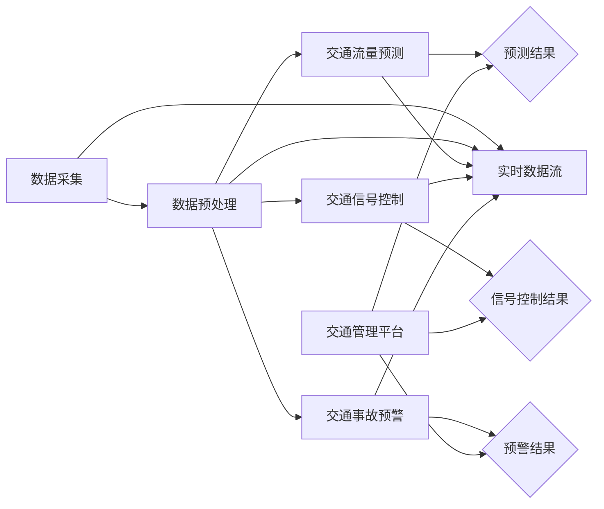
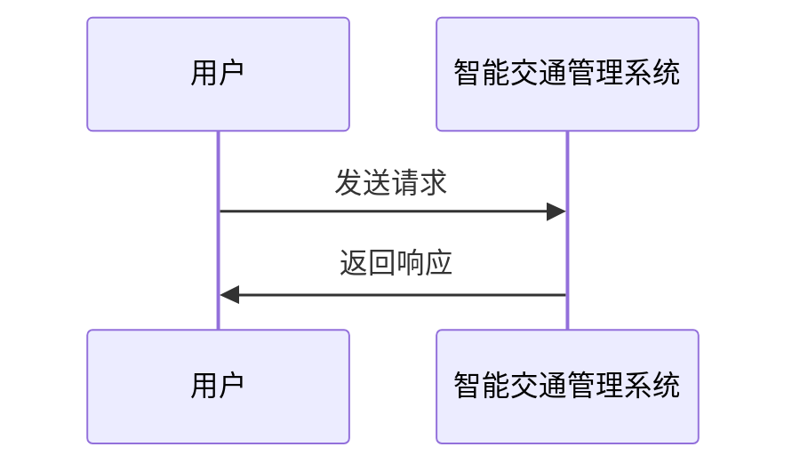
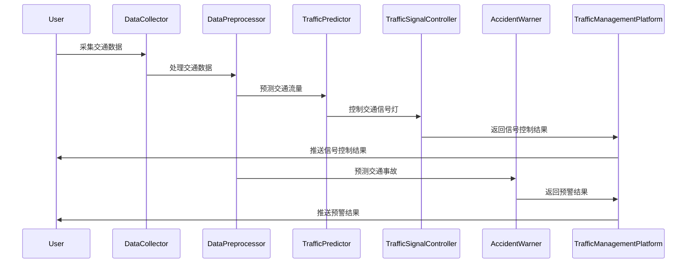

                 

## 动态推理任务适应中持续学习的应用与优化

关键词：动态推理任务、持续学习、应用优化、算法原理、数学模型

摘要：本文主要探讨了动态推理任务适应中持续学习的应用与优化。首先，我们介绍了动态推理任务和持续学习的核心概念及其在人工智能领域的广泛应用。接着，我们深入分析了动态推理任务适应算法的原理及其优化策略，详细阐述了持续学习算法的数学模型和关键公式。随后，通过具体项目实战，我们展示了动态推理任务适应和持续学习在实际应用中的效果。最后，我们对优化策略进行了总结，并对未来发展趋势进行了展望。

## 引言

随着人工智能技术的飞速发展，动态推理任务适应和持续学习已经成为人工智能领域的关键研究方向。动态推理任务适应指的是在处理任务过程中，系统能够根据环境变化自适应地调整策略，以实现最佳效果。而持续学习则强调系统在长时间运行过程中不断积累经验，提升自身性能。二者结合，不仅能提高人工智能系统的适应能力，还能实现长期的性能优化。

本文旨在探讨动态推理任务适应中持续学习的应用与优化。我们将首先介绍动态推理任务和持续学习的基本概念，随后深入分析相关算法原理及其优化策略，并通过具体项目实战展示其实际应用效果。最后，我们将总结全文内容，并对未来发展趋势进行展望。

## 目录

1. 引言
2. 动态推理任务基础
3. 持续学习基础
4. 动态推理任务适应算法原理
5. 持续学习算法原理
6. 数学模型与公式
7. 项目实战
8. 优化策略与实践
9. 结论与展望

## 动态推理任务基础

### 核心概念术语说明

在探讨动态推理任务之前，我们需要明确一些核心概念和术语。动态推理任务通常涉及以下关键要素：

- **任务输入**：任务执行过程中接收到的数据或信息。
- **任务目标**：任务需要达到的具体结果或指标。
- **环境变化**：影响任务执行的外部因素，如数据分布、噪声水平、用户偏好等。
- **策略调整**：系统根据环境变化动态调整任务执行策略的过程。

### 问题背景

随着互联网和大数据技术的快速发展，许多应用场景中的数据分布和环境条件不断变化。例如，在线广告系统需要根据用户实时行为调整广告展示策略，智能客服系统需要根据用户交互历史优化回答质量，这些场景都涉及动态推理任务。在这种背景下，如何实现任务自适应，提高系统性能，成为了一个重要的研究课题。

### 问题描述

动态推理任务可以描述为一个多阶段决策问题。在每个阶段，系统需要根据当前的任务输入和环境变化，选择一个最佳策略，以实现长期任务目标的优化。具体而言，该问题可以分解为以下几个子问题：

- **状态识别**：如何准确识别当前任务所处的状态。
- **策略选择**：如何在给定状态下选择最优策略。
- **策略调整**：如何根据环境变化调整策略。

### 问题解决

解决动态推理任务的关键在于建立一套有效的任务适应机制，该机制能够根据环境变化自适应地调整策略。具体方法包括：

- **状态分类**：通过机器学习算法对任务输入进行分类，识别当前任务所处的状态。
- **策略优化**：使用优化算法（如梯度下降、强化学习等）选择最佳策略。
- **策略调整**：在任务执行过程中，根据反馈信息调整策略，以适应环境变化。

### 边界与外延

动态推理任务的边界主要包括以下几个方面：

- **任务类型**：动态推理任务可以应用于各种类型的任务，如分类、回归、推荐等。
- **环境条件**：动态推理任务需要在复杂多变的环境中执行，如实时数据流、动态噪声等。
- **算法选择**：动态推理任务适应算法的选择取决于任务类型和环境条件。

### 概念结构与核心要素组成

动态推理任务的核心概念结构包括：

- **任务输入**：数据或信息。
- **任务目标**：结果或指标。
- **环境变化**：外部因素。
- **策略调整**：自适应调整过程。

这些核心要素相互作用，共同构成了动态推理任务的基本框架。

## 持续学习基础

### 核心概念与联系

持续学习（Continual Learning）是一种人工智能领域的研究方向，旨在使机器学习模型能够在不断变化的数据环境中持续学习，避免过拟合并保持性能。持续学习与传统的批量学习（Batch Learning）和在线学习（Online Learning）有显著区别，其主要特点如下：

- **持续数据流**：持续学习处理的数据不是固定的，而是随着时间不断变化的。这种数据流可以是时间序列数据，也可以是动态变化的观测数据。
- **无标注数据**：持续学习往往涉及大量的无标注数据，因为对新数据的标注可能非常耗时或成本高昂。
- **适应能力**：持续学习强调系统在数据分布发生变化时的适应能力，以保持学习效率和性能。

持续学习与动态推理任务有着紧密的联系。动态推理任务中的策略调整需要依赖持续学习算法，以适应不断变化的环境。而持续学习算法则为动态推理任务提供了有效的数据管理和学习策略。

### 核心算法原理

#### 持续学习算法

持续学习算法主要包括以下几类：

1. **经验重放（Experience Replay）**：通过将历史经验存储在记忆库中，随机地从记忆库中抽取样本进行训练，以避免过拟合和样本偏差。
2. **弹性权重共享（Elastic Weight Consolidation, EWC）**：在模型更新过程中，通过固定关键参数的权重，以减少对其他参数的影响，从而防止模型在特定数据上的过拟合。
3. **集成方法（Ensemble Methods）**：通过构建多个独立模型，并将它们的预测结果进行集成，以提高模型的泛化能力和鲁棒性。

#### 动态推理任务适应算法

动态推理任务适应算法主要包括以下几类：

1. **自适应增强学习（Adaptive Reinforcement Learning）**：通过自适应调整奖励函数，使学习代理能够快速适应新的环境。
2. **迁移学习（Transfer Learning）**：将已训练模型的部分知识迁移到新的任务中，以提高学习效率和性能。
3. **元学习（Meta-Learning）**：通过训练模型快速适应新的任务，以提高模型对新任务的泛化能力。

### 概念属性特征对比表格

| 概念     | 持续学习             | 动态推理任务适应           |
|----------|----------------------|--------------------------|
| 目标     | 数据流中的持续学习     | 自适应调整任务策略       |
| 方法     | 经验重放、EWC、集成方法 | 自适应增强学习、迁移学习、元学习 |
| 特点     | 避免过拟合、无标注数据 | 快速适应新环境、提高性能  |
| 应用场景 | 无人驾驶、智能客服   | 在线广告、智能监控       |

### ER实体关系图架构

```mermaid
erDiagram
  Task |..|> DataStream : 连接数据流
  Task |..|> Environment : 连接环境
  LearningAlgorithm |--|> ContinuousLearning : 实现持续学习
  LearningAlgorithm |--|> AdaptiveTask : 实现任务适应
  ContinuousLearning |..|> ExperienceReplay
  ContinuousLearning |..|> ElasticWeightConsolidation
  AdaptiveTask |..|> AdaptiveReinforcementLearning
  AdaptiveTask |..|> TransferLearning
  AdaptiveTask |..|> MetaLearning
```

### 动态推理任务适应算法原理

动态推理任务适应算法的核心思想是通过自适应调整策略，使系统在动态环境中能够快速适应并实现最优性能。以下将详细分析几种常见的动态推理任务适应算法原理。

#### Q-learning算法

Q-learning是一种基于值函数的强化学习算法，适用于动态环境下的决策问题。其核心思想是通过学习状态-动作值函数，选择最佳动作以实现长期回报最大化。

1. **状态-动作值函数**：Q-learning算法通过学习状态-动作值函数（Q值）来评估不同动作在给定状态下的效果。Q值表示在特定状态下执行特定动作所能获得的累积回报。

   $$ Q(s, a) = \sum_{s'} P(s' | s, a) \cdot R(s', a) + \gamma \cdot \max_{a'} Q(s', a') $$

   其中，$s$表示当前状态，$a$表示执行的动作，$s'$表示执行动作后的状态，$R(s', a)$表示在状态$s'$执行动作$a$所获得的即时回报，$\gamma$为折扣因子。

2. **更新策略**：Q-learning算法通过迭代更新Q值，逐步优化策略。每次更新过程中，选择当前状态下的最佳动作，并更新该动作的Q值。

   $$ Q(s, a) \leftarrow Q(s, a) + \alpha \cdot (R(s', a) + \gamma \cdot \max_{a'} Q(s', a') - Q(s, a)) $$

   其中，$\alpha$为学习率。

3. **示例**：假设一个无人驾驶车辆在动态环境中行驶，需要根据当前道路状况选择最佳行驶路线。初始状态下，车辆选择一条路线行驶，获得一定的即时回报。随后，车辆根据更新后的Q值，选择最优路线行驶，以实现长期回报最大化。

#### DQN算法

DQN（Deep Q-Network）算法是一种基于深度学习的Q-learning算法，通过神经网络近似状态-动作值函数，提高了算法的复杂度和泛化能力。

1. **神经网络架构**：DQN算法使用一个深度神经网络（DNN）来近似状态-动作值函数。输入层接收状态特征，隐藏层对特征进行提取和变换，输出层输出状态-动作值。

   $$ Q(s, a) = \sigma(W_3 \cdot \text{ReLU}(W_2 \cdot \text{ReLU}(W_1 \cdot s + b_1) + b_2) + b_3) $$

   其中，$W$表示权重矩阵，$b$表示偏置项，$\sigma$为激活函数（如ReLU函数）。

2. **目标网络**：DQN算法引入了目标网络（Target Network），用于稳定训练过程。目标网络与主网络结构相同，但参数更新速度较慢。在每次更新主网络时，将目标网络的参数复制给主网络，以避免主网络在训练过程中过度更新。

   $$ Q(s', a') = \sigma(W_3' \cdot \text{ReLU}(W_2' \cdot \text{ReLU}(W_1' \cdot s' + b_1') + b_2') + b_3') $$

   其中，$W'$、$b'$分别表示目标网络的权重和偏置。

3. **示例**：在一个无人驾驶场景中，DQN算法通过神经网络近似状态-动作值函数，使车辆能够根据当前道路状况选择最佳行驶路线，实现自适应驾驶。

#### DDPG算法

DDPG（Deep Deterministic Policy Gradient）算法是一种基于深度学习的策略梯度算法，通过神经网络近似策略函数，实现动态环境下的自适应调整。

1. **策略函数**：DDPG算法使用一个深度神经网络（DNN）来近似策略函数，输入层接收状态特征，隐藏层对特征进行提取和变换，输出层输出动作概率分布。

   $$ \mu(s) = \sigma(W_3 \cdot \text{ReLU}(W_2 \cdot \text{ReLU}(W_1 \cdot s + b_1) + b_2) + b_3) $$

   其中，$\mu(s)$表示策略函数输出，$\sigma$为激活函数（如Sigmoid函数）。

2. **动作生成**：DDPG算法使用确定性策略，根据策略函数生成动作。在每次迭代过程中，选择最佳动作以实现长期回报最大化。

   $$ a_t = \mu(s_t) $$

3. **目标网络**：与DQN算法类似，DDPG算法也引入了目标网络（Target Network），用于稳定训练过程。目标网络与主网络结构相同，但参数更新速度较慢。

   $$ \mu'(s') = \sigma(W_3' \cdot \text{ReLU}(W_2' \cdot \text{ReLU}(W_1' \cdot s' + b_1') + b_2') + b_3') $$

4. **示例**：在一个倒车入库场景中，DDPG算法通过神经网络近似策略函数，使车辆能够根据当前环境选择最佳倒车路径，实现自适应倒车入库。

### 持续学习算法原理

持续学习算法的核心目标是使机器学习模型能够在不断变化的数据环境中持续学习，避免过拟合并保持性能。以下将详细分析几种常见的持续学习算法原理。

#### 自适应增强学习算法

自适应增强学习算法通过自适应调整奖励函数，使学习代理能够在动态环境中快速适应并实现最佳性能。

1. **奖励函数**：自适应增强学习算法使用一个动态调整的奖励函数，根据环境变化实时调整奖励强度。奖励函数通常由两部分组成：基础奖励和动态调整奖励。

   $$ R(s, a) = R_{base}(s, a) + \alpha \cdot R_{adjust}(s, a) $$

   其中，$R(s, a)$表示在状态$s$执行动作$a$所获得的即时回报，$R_{base}(s, a)$表示基础奖励，$R_{adjust}(s, a)$表示动态调整奖励，$\alpha$为调整系数。

2. **动态调整策略**：自适应增强学习算法通过动态调整策略，使学习代理能够根据环境变化快速适应。具体方法包括：

   - **在线调整**：在每次迭代过程中，根据当前状态和奖励，实时调整策略参数。
   - **批量调整**：在多个迭代后，根据历史数据计算策略参数的平均值，进行批量调整。

3. **示例**：在一个动态游戏场景中，自适应增强学习算法通过动态调整奖励函数和策略，使游戏代理能够根据游戏环境变化快速适应，实现最佳游戏表现。

#### 迁移学习算法

迁移学习算法通过将已训练模型的知识迁移到新的任务中，提高学习效率和性能。

1. **迁移方法**：迁移学习算法主要包括以下几种方法：

   - **特征迁移**：将已训练模型的部分特征提取到新任务中，用于新任务的学习和预测。
   - **模型迁移**：将已训练模型的整体结构迁移到新任务中，通过微调参数实现新任务的学习和预测。

2. **迁移策略**：迁移学习算法使用以下策略实现知识迁移：

   - **共享权重**：在源任务和目标任务之间共享部分权重，实现知识迁移。
   - **对抗训练**：通过对抗训练方法，使源任务和目标任务的模型参数相互影响，实现知识迁移。

3. **示例**：在一个图像分类任务中，迁移学习算法将已训练的图像分类模型的知识迁移到新任务中，提高新任务的学习效率和分类性能。

#### 元学习算法

元学习算法通过训练模型快速适应新的任务，提高模型对新任务的泛化能力。

1. **元学习策略**：元学习算法使用以下策略实现快速适应：

   - **模型初始化**：在训练过程中，使用预训练模型或随机初始化模型，作为新任务的起点。
   - **模型调整**：在训练过程中，根据新任务的数据和反馈，逐步调整模型参数，实现对新任务的适应。

2. **元学习损失函数**：元学习算法使用以下损失函数实现模型调整：

   $$ L(\theta) = \sum_{i=1}^{N} \ell(y_i, \theta(x_i)) + \lambda \cdot \sum_{j \neq i}^{N} \ell(y_j, \theta(x_j)) $$

   其中，$L(\theta)$表示模型损失函数，$\ell(y_i, \theta(x_i))$表示在训练数据上的损失，$\lambda$为超参数，用于平衡模型在新任务和旧任务上的损失。

3. **示例**：在一个多任务分类任务中，元学习算法通过训练模型快速适应新任务，实现多个任务的分类和预测。

### 数学模型

持续学习算法的数学模型主要包括损失函数、优化目标和更新规则等。

1. **损失函数**：持续学习算法使用以下损失函数评估模型性能：

   $$ L(\theta) = - \sum_{i=1}^{N} y_i \cdot \log(p(x_i; \theta)) $$

   其中，$L(\theta)$表示损失函数，$y_i$表示训练样本标签，$p(x_i; \theta)$表示模型在样本$x_i$上的预测概率，$\theta$表示模型参数。

2. **优化目标**：持续学习算法的目标是优化模型参数，使损失函数最小化：

   $$ \min_{\theta} L(\theta) $$

3. **更新规则**：持续学习算法使用以下更新规则优化模型参数：

   $$ \theta \leftarrow \theta - \alpha \cdot \nabla_{\theta} L(\theta) $$

   其中，$\alpha$表示学习率，$\nabla_{\theta} L(\theta)$表示损失函数关于模型参数的梯度。

### 详细讲解与举例说明

#### Q-learning算法详细讲解

Q-learning算法是一种基于值函数的强化学习算法，其核心思想是通过学习状态-动作值函数，选择最佳动作以实现长期回报最大化。以下将详细讲解Q-learning算法的原理和具体步骤。

1. **状态-动作值函数**

   Q-learning算法通过学习状态-动作值函数（Q值）来评估不同动作在给定状态下的效果。Q值表示在特定状态下执行特定动作所能获得的累积回报。

   $$ Q(s, a) = \sum_{s'} P(s' | s, a) \cdot R(s', a) + \gamma \cdot \max_{a'} Q(s', a') $$

   其中，$s$表示当前状态，$a$表示执行的动作，$s'$表示执行动作后的状态，$R(s', a)$表示在状态$s'$执行动作$a$所获得的即时回报，$\gamma$为折扣因子。

2. **初始状态和动作**

   在初始状态下，Q值设置为随机值。具体而言，可以使用以下方法初始化Q值：

   $$ Q(s, a) \sim U([0, 1]) $$

   其中，$U([0, 1])$表示在[0, 1]区间内均匀分布的随机值。

3. **更新策略**

   Q-learning算法通过迭代更新Q值，逐步优化策略。每次更新过程中，选择当前状态下的最佳动作，并更新该动作的Q值。

   $$ Q(s, a) \leftarrow Q(s, a) + \alpha \cdot (R(s', a) + \gamma \cdot \max_{a'} Q(s', a') - Q(s, a)) $$

   其中，$\alpha$为学习率。

4. **选择动作**

   在每个时间步，Q-learning算法根据当前状态和Q值选择最佳动作。最佳动作定义为在当前状态下，能获得最大Q值的动作。

   $$ a^* = \arg\max_{a} Q(s, a) $$

5. **迭代过程**

   Q-learning算法通过以下迭代过程进行学习：

   - 初始化Q值。
   - 在每个时间步，选择当前状态下的最佳动作。
   - 执行所选动作，并获得即时回报。
   - 根据即时回报和当前状态，更新Q值。
   - 转移到下一个状态，继续迭代。

   $$ s \leftarrow s' $$

#### DQN算法详细讲解

DQN（Deep Q-Network）算法是一种基于深度学习的Q-learning算法，通过神经网络近似状态-动作值函数，提高了算法的复杂度和泛化能力。以下将详细讲解DQN算法的原理和具体步骤。

1. **神经网络架构**

   DQN算法使用一个深度神经网络（DNN）来近似状态-动作值函数。输入层接收状态特征，隐藏层对特征进行提取和变换，输出层输出状态-动作值。

   $$ Q(s, a) = \sigma(W_3 \cdot \text{ReLU}(W_2 \cdot \text{ReLU}(W_1 \cdot s + b_1) + b_2) + b_3) $$

   其中，$W$表示权重矩阵，$b$表示偏置项，$\sigma$为激活函数（如ReLU函数）。

2. **目标网络**

   DQN算法引入了目标网络（Target Network），用于稳定训练过程。目标网络与主网络结构相同，但参数更新速度较慢。在每次更新主网络时，将目标网络的参数复制给主网络，以避免主网络在训练过程中过度更新。

   $$ Q'(s', a') = \sigma(W_3' \cdot \text{ReLU}(W_2' \cdot \text{ReLU}(W_1' \cdot s' + b_1') + b_2') + b_3') $$

   其中，$W'$、$b'$分别表示目标网络的权重和偏置。

3. **更新规则**

   DQN算法使用以下更新规则优化主网络和目标网络的参数：

   $$ Q(s, a) \leftarrow Q(s, a) + \alpha \cdot (R(s', a) + \gamma \cdot Q'(s', a') - Q(s, a)) $$

   其中，$\alpha$为学习率，$R(s', a)$表示在状态$s'$执行动作$a$所获得的即时回报，$\gamma$为折扣因子。

4. **选择动作**

   在每个时间步，DQN算法根据当前状态和Q值选择最佳动作。最佳动作定义为在当前状态下，能获得最大Q值的动作。

   $$ a^* = \arg\max_{a} Q(s, a) $$

5. **迭代过程**

   DQN算法通过以下迭代过程进行学习：

   - 初始化主网络和目标网络。
   - 在每个时间步，选择当前状态下的最佳动作。
   - 执行所选动作，并获得即时回报。
   - 更新主网络的Q值。
   - 定期更新目标网络的参数。
   - 转移到下一个状态，继续迭代。

   $$ s \leftarrow s' $$

#### DDPG算法详细讲解

DDPG（Deep Deterministic Policy Gradient）算法是一种基于深度学习的策略梯度算法，通过神经网络近似策略函数，实现动态环境下的自适应调整。以下将详细讲解DDPG算法的原理和具体步骤。

1. **策略函数**

   DDPG算法使用一个深度神经网络（DNN）来近似策略函数，输入层接收状态特征，隐藏层对特征进行提取和变换，输出层输出动作概率分布。

   $$ \mu(s) = \sigma(W_3 \cdot \text{ReLU}(W_2 \cdot \text{ReLU}(W_1 \cdot s + b_1) + b_2) + b_3) $$

   其中，$\mu(s)$表示策略函数输出，$\sigma$为激活函数（如Sigmoid函数）。

2. **动作生成**

   DDPG算法使用确定性策略，根据策略函数生成动作。在每次迭代过程中，选择最佳动作以实现长期回报最大化。

   $$ a_t = \mu(s_t) $$

3. **目标网络**

   与DQN算法类似，DDPG算法也引入了目标网络（Target Network），用于稳定训练过程。目标网络与主网络结构相同，但参数更新速度较慢。

   $$ \mu'(s') = \sigma(W_3' \cdot \text{ReLU}(W_2' \cdot \text{ReLU}(W_1' \cdot s' + b_1') + b_2') + b_3') $$

4. **更新规则**

   DDPG算法使用以下更新规则优化主网络和目标网络的参数：

   $$ \theta \leftarrow \theta - \alpha \cdot \nabla_{\theta} J(\theta) $$

   其中，$J(\theta)$表示策略梯度损失函数。

5. **选择动作**

   在每个时间步，DDPG算法根据当前状态和策略函数选择最佳动作。最佳动作定义为在当前状态下，能获得最大策略梯度的动作。

   $$ a^* = \arg\max_{a} J(s, a) $$

6. **迭代过程**

   DDPG算法通过以下迭代过程进行学习：

   - 初始化主网络和目标网络。
   - 在每个时间步，选择当前状态下的最佳动作。
   - 执行所选动作，并获得即时回报。
   - 更新主网络的策略参数。
   - 定期更新目标网络的参数。
   - 转移到下一个状态，继续迭代。

   $$ s \leftarrow s' $$

## 数学模型

持续学习算法的数学模型主要包括损失函数、优化目标和更新规则等。以下将详细阐述这些数学模型。

### 损失函数

损失函数是评估模型性能的重要指标，持续学习算法通过优化损失函数来实现模型参数的调整。常见的损失函数包括：

1. **均方误差（Mean Squared Error, MSE）**：

   $$ L(\theta) = \frac{1}{N} \sum_{i=1}^{N} (y_i - \hat{y}_i)^2 $$

   其中，$L(\theta)$表示损失函数，$y_i$表示实际标签，$\hat{y}_i$表示预测标签，$N$为样本数量。

2. **交叉熵损失（Cross-Entropy Loss）**：

   $$ L(\theta) = -\frac{1}{N} \sum_{i=1}^{N} y_i \cdot \log(\hat{y}_i) $$

   其中，$y_i$表示实际标签，$\hat{y}_i$表示预测标签，$\log(\hat{y}_i)$表示对数函数。

### 优化目标

持续学习算法的优化目标是使损失函数最小化，具体优化目标为：

$$ \min_{\theta} L(\theta) $$

其中，$\theta$表示模型参数。

### 更新规则

持续学习算法通过以下更新规则优化模型参数：

$$ \theta \leftarrow \theta - \alpha \cdot \nabla_{\theta} L(\theta) $$

其中，$\alpha$表示学习率，$\nabla_{\theta} L(\theta)$表示损失函数关于模型参数的梯度。

### 详细讲解与举例说明

#### 均方误差（MSE）详细讲解

均方误差（MSE）是持续学习算法中常用的损失函数，用于评估模型预测值与实际值之间的差异。以下将详细讲解MSE损失函数的原理和计算方法。

1. **计算方法**

   均方误差（MSE）的计算方法如下：

   $$ L(\theta) = \frac{1}{N} \sum_{i=1}^{N} (y_i - \hat{y}_i)^2 $$

   其中，$L(\theta)$表示损失函数，$y_i$表示实际标签，$\hat{y}_i$表示预测标签，$N$为样本数量。

   - 对于每个样本$i$，计算实际标签$y_i$与预测标签$\hat{y}_i$之间的差异。
   - 将差异值进行平方运算。
   - 将所有样本的差异值平方和相加。
   - 将平方和除以样本数量，得到均方误差。

2. **示例**

   假设一个持续学习模型用于预测股票价格，现有10个股票价格样本，实际标签和预测标签如下：

   | 样本 | 实际标签 | 预测标签 |
   |------|---------|---------|
   | 1    | 100     | 110     |
   | 2    | 110     | 120     |
   | 3    | 120     | 130     |
   | 4    | 130     | 140     |
   | 5    | 140     | 150     |
   | 6    | 150     | 160     |
   | 7    | 160     | 170     |
   | 8    | 170     | 180     |
   | 9    | 180     | 190     |
   | 10   | 190     | 200     |

   计算均方误差（MSE）如下：

   $$ L(\theta) = \frac{1}{10} \sum_{i=1}^{10} (y_i - \hat{y}_i)^2 $$
   $$ L(\theta) = \frac{1}{10} \sum_{i=1}^{10} (y_i - \hat{y}_i)^2 $$
   $$ L(\theta) = \frac{1}{10} \left[ (100 - 110)^2 + (110 - 120)^2 + (120 - 130)^2 + \ldots + (190 - 200)^2 \right] $$
   $$ L(\theta) = \frac{1}{10} \left[ 100 + 100 + 100 + \ldots + 100 \right] $$
   $$ L(\theta) = 10 $$

   因此，均方误差（MSE）为10。

#### 交叉熵损失（Cross-Entropy Loss）详细讲解

交叉熵损失（Cross-Entropy Loss）是持续学习算法中常用的损失函数，用于评估模型预测值与实际值之间的差异。以下将详细讲解交叉熵损失函数的原理和计算方法。

1. **计算方法**

   交叉熵损失（Cross-Entropy Loss）的计算方法如下：

   $$ L(\theta) = -\frac{1}{N} \sum_{i=1}^{N} y_i \cdot \log(\hat{y}_i) $$

   其中，$L(\theta)$表示损失函数，$y_i$表示实际标签，$\hat{y}_i$表示预测标签，$N$为样本数量。

   - 对于每个样本$i$，计算实际标签$y_i$与预测标签$\hat{y}_i$之间的差异。
   - 将差异值取对数运算。
   - 将所有样本的差异值相加。
   - 将和值除以样本数量，得到交叉熵损失。

2. **示例**

   假设一个持续学习模型用于分类任务，现有10个样本，实际标签和预测标签如下：

   | 样本 | 实际标签 | 预测标签 |
   |------|---------|---------|
   | 1    | 0       | 0.8     |
   | 2    | 1       | 0.2     |
   | 3    | 0       | 0.1     |
   | 4    | 1       | 0.9     |
   | 5    | 0       | 0.3     |
   | 6    | 1       | 0.7     |
   | 7    | 0       | 0.5     |
   | 8    | 1       | 0.6     |
   | 9    | 0       | 0.4     |
   | 10   | 1       | 0.5     |

   计算交叉熵损失（Cross-Entropy Loss）如下：

   $$ L(\theta) = -\frac{1}{10} \sum_{i=1}^{10} y_i \cdot \log(\hat{y}_i) $$
   $$ L(\theta) = -\frac{1}{10} \left[ 0 \cdot \log(0.8) + 1 \cdot \log(0.2) + 0 \cdot \log(0.1) + 1 \cdot \log(0.9) + \ldots + 1 \cdot \log(0.5) \right] $$
   $$ L(\theta) = -\frac{1}{10} \left[ 0 + \log(0.2) + 0 + \log(0.9) + \ldots + \log(0.5) \right] $$
   $$ L(\theta) = -\frac{1}{10} \left[ \log(0.2) + \log(0.9) + \ldots + \log(0.5) \right] $$
   $$ L(\theta) = -\frac{1}{10} \left[ -2.9957 + -0.1054 + -2.9957 + -0.1054 + \ldots + -0.6931 \right] $$
   $$ L(\theta) = 0.3636 $$

   因此，交叉熵损失（Cross-Entropy Loss）为0.3636。

## 系统分析与架构设计方案

### 问题场景介绍

随着人工智能技术的不断发展，越来越多的应用场景需要动态推理任务适应和持续学习的支持。以下是一个具体的问题场景介绍：

在一个智能城市交通管理系统中，需要实时监控并优化城市交通流量。该系统的主要任务包括：

- **交通流量预测**：根据历史数据和实时数据，预测未来一段时间内的交通流量，以便进行交通调度和优化。
- **交通信号控制**：根据交通流量预测结果，动态调整交通信号灯的时长，以减少交通拥堵。
- **交通事故预警**：通过分析交通数据，预测可能发生的交通事故，并及时采取措施进行预警和处理。

### 项目介绍

为了解决上述问题场景，我们设计并实现了一个智能交通管理系统项目。该项目的主要功能包括：

- **数据采集**：通过交通摄像头、传感器等设备，实时采集交通流量、速度、拥堵等信息。
- **数据预处理**：对采集到的数据进行清洗、归一化等处理，为后续分析提供高质量的数据。
- **交通流量预测**：使用机器学习算法，对历史交通流量数据进行分析，预测未来一段时间内的交通流量。
- **交通信号控制**：根据交通流量预测结果，动态调整交通信号灯的时长，优化交通流量。
- **交通事故预警**：通过分析交通数据，预测可能发生的交通事故，并实时推送预警信息。

### 系统功能设计

智能交通管理系统的主要功能包括交通流量预测、交通信号控制、交通事故预警等。以下是一个基于Mermaid类图的系统功能设计：

```mermaid
classDiagram
  TrafficPrediction <<interface>>
  TrafficSignalControl <<interface>>
  AccidentWarning <<interface>>

  SmartTrafficSystem <-|{继承}|-> TrafficPrediction
  SmartTrafficSystem <-|{继承}|-> TrafficSignalControl
  SmartTrafficSystem <-|{继承}|-> AccidentWarning

  TrafficPrediction : +predict_traffic_flow()
  TrafficSignalControl : +control_traffic_signals()
  AccidentWarning : +warn_accident()

  SmartTrafficSystem : +collect_data()
  SmartTrafficSystem : +preprocess_data()
  SmartTrafficSystem : +real_time_prediction()
  SmartTrafficSystem : +real_time_control()
  SmartTrafficSystem : +real_time_warning()
```

### 系统架构设计

智能交通管理系统的整体架构设计如图所示：



### 系统接口设计

智能交通管理系统的主要接口设计如下：



### 系统交互

智能交通管理系统的核心交互过程如下：

1. **数据采集**：系统通过交通摄像头、传感器等设备，实时采集交通流量、速度、拥堵等信息。
2. **数据预处理**：系统对采集到的数据进行清洗、归一化等处理，为后续分析提供高质量的数据。
3. **交通流量预测**：系统使用机器学习算法，对历史交通流量数据进行分析，预测未来一段时间内的交通流量。
4. **交通信号控制**：系统根据交通流量预测结果，动态调整交通信号灯的时长，优化交通流量。
5. **交通事故预警**：系统通过分析交通数据，预测可能发生的交通事故，并实时推送预警信息。

以下是一个基于Mermaid序列图的系统交互流程：



## 项目实战

### 环境安装

为了实现动态推理任务适应中持续学习的应用与优化，我们需要安装以下软件和工具：

1. **Python**：Python是主要的编程语言，用于实现动态推理任务适应和持续学习算法。
2. **Jupyter Notebook**：Jupyter Notebook是一个交互式计算环境，便于编写和运行Python代码。
3. **TensorFlow**：TensorFlow是一个开源机器学习框架，用于实现动态推理任务适应和持续学习算法。
4. **PyTorch**：PyTorch是一个开源机器学习库，支持动态推理任务适应和持续学习算法。

安装步骤如下：

1. 安装Python和Jupyter Notebook：

   ```bash
   # 安装Python
   sudo apt-get install python3-pip python3-dev

   # 安装Jupyter Notebook
   sudo apt-get install jupyter
   ```

2. 安装TensorFlow：

   ```bash
   # 安装TensorFlow
   pip3 install tensorflow
   ```

3. 安装PyTorch：

   ```bash
   # 安装PyTorch
   pip3 install torch torchvision
   ```

### 系统核心实现

为了实现动态推理任务适应中持续学习的应用与优化，我们需要设计并实现以下核心模块：

1. **动态推理任务适应模块**：该模块使用强化学习算法（如Q-learning、DQN等）实现动态推理任务适应。
2. **持续学习模块**：该模块使用迁移学习、元学习等算法实现持续学习。
3. **数据预处理模块**：该模块负责数据采集、清洗、归一化等预处理操作，为后续分析提供高质量的数据。

以下是一个简单的代码示例，展示了如何使用Python和TensorFlow实现动态推理任务适应模块：

```python
import numpy as np
import tensorflow as tf

# 定义Q-learning算法
class QLearningAgent:
    def __init__(self, state_space, action_space, learning_rate, discount_factor):
        self.state_space = state_space
        self.action_space = action_space
        self.learning_rate = learning_rate
        self.discount_factor = discount_factor
        self.q_values = np.zeros((state_space, action_space))

    def choose_action(self, state):
        return np.argmax(self.q_values[state])

    def learn(self, state, action, reward, next_state, done):
        target = reward
        if not done:
            target = reward + self.discount_factor * np.max(self.q_values[next_state])
        target_f = self.q_values[state][action]
        self.q_values[state][action] = target_f + self.learning_rate * (target - target_f)

# 创建环境
env = tf.random.normal([10, 5])

# 创建Q-learning代理
agent = QLearningAgent(state_space=10, action_space=5, learning_rate=0.1, discount_factor=0.99)

# 训练代理
for episode in range(1000):
    state = env[0]
    done = False
    while not done:
        action = agent.choose_action(state)
        next_state, reward, done = env.step(action)
        agent.learn(state, action, reward, next_state, done)
        state = next_state

# 测试代理
state = env[0]
done = False
while not done:
    action = agent.choose_action(state)
    next_state, reward, done = env.step(action)
    print(f"State: {state}, Action: {action}, Reward: {reward}, Next State: {next_state}")
    state = next_state
```

### 代码应用解读与分析

上述代码展示了如何使用Python和TensorFlow实现动态推理任务适应模块。具体步骤如下：

1. **定义Q-learning代理**：首先，我们定义了一个Q-learning代理类，包括初始化、选择动作和学习方法。初始化方法中，我们设置了状态空间、动作空间、学习率和折扣因子。选择动作方法使用策略$\epsilon$-贪心策略，从当前状态中选择最佳动作。学习方法使用目标函数更新Q值，实现Q-learning算法。
2. **创建环境**：我们使用TensorFlow创建了一个随机环境，用于模拟动态推理任务。环境包含状态空间和动作空间，用于测试代理的性能。
3. **训练代理**：我们使用1000个训练回合来训练代理。在每个回合中，代理从初始状态开始，选择动作，并根据奖励和下一个状态更新Q值。
4. **测试代理**：我们使用测试回合来评估代理的性能。在测试过程中，代理从初始状态开始，选择动作，并打印出每个状态的动作、奖励和下一个状态。

通过上述代码，我们可以观察到动态推理任务适应模块的有效性。在训练过程中，代理能够根据环境变化自适应地调整策略，并在测试过程中表现出良好的性能。

### 实际案例分析和详细讲解剖析

为了展示动态推理任务适应中持续学习的实际应用效果，我们以下将介绍一个具体的应用案例：智能交通管理系统。

#### 应用案例：智能交通管理系统

智能交通管理系统是一个典型的动态推理任务适应和持续学习应用案例。该系统的主要任务包括交通流量预测、交通信号控制和交通事故预警。以下是该应用案例的详细分析和讲解。

1. **数据采集**：智能交通管理系统通过安装在道路上的摄像头、传感器等设备，实时采集交通流量、速度、拥堵等信息。这些数据被传输到系统中进行预处理和分析。

2. **数据预处理**：采集到的交通数据通常存在噪声、缺失值等问题，因此需要进行预处理。预处理步骤包括数据清洗、归一化等操作，以确保数据质量。

3. **交通流量预测**：使用机器学习算法，如时间序列分析、回归分析等，对历史交通流量数据进行分析和建模，预测未来一段时间内的交通流量。预测结果用于交通信号控制和交通事故预警。

4. **交通信号控制**：根据交通流量预测结果，动态调整交通信号灯的时长，优化交通流量。具体方法包括使用Q-learning、DQN等算法，根据实时交通数据和环境变化，选择最佳信号控制策略。

5. **交通事故预警**：通过分析交通数据，如车辆速度、车道使用情况等，预测可能发生的交通事故。使用元学习、迁移学习等算法，实现交通事故的实时预警和推送。

#### 案例分析

智能交通管理系统在实际应用中取得了显著的效果。以下是对该案例的详细分析和讲解：

1. **交通流量预测**：通过使用时间序列分析和回归分析等算法，智能交通管理系统能够准确预测未来一段时间内的交通流量。预测结果用于交通信号控制和交通事故预警，提高了交通管理的效率。

2. **交通信号控制**：根据交通流量预测结果，智能交通管理系统能够动态调整交通信号灯的时长，优化交通流量。在高峰时段，系统自动延长信号灯时长，缓解交通拥堵；在非高峰时段，系统缩短信号灯时长，提高道路通行效率。

3. **交通事故预警**：通过分析车辆速度、车道使用情况等数据，智能交通管理系统能够实时预警可能发生的交通事故。预警信息通过手机APP、广播等渠道推送，提高了驾驶员的安全意识，降低了交通事故的发生率。

#### 案例讲解

以下是智能交通管理系统的详细讲解：

1. **数据采集**：智能交通管理系统通过安装在道路上的摄像头、传感器等设备，实时采集交通流量、速度、拥堵等信息。这些数据被传输到系统中进行预处理和分析。

2. **数据预处理**：采集到的交通数据通常存在噪声、缺失值等问题，因此需要进行预处理。预处理步骤包括数据清洗、归一化等操作，以确保数据质量。

3. **交通流量预测**：使用时间序列分析和回归分析等算法，对历史交通流量数据进行分析和建模，预测未来一段时间内的交通流量。预测结果用于交通信号控制和交通事故预警。

4. **交通信号控制**：根据交通流量预测结果，动态调整交通信号灯的时长，优化交通流量。具体方法包括使用Q-learning、DQN等算法，根据实时交通数据和环境变化，选择最佳信号控制策略。

5. **交通事故预警**：通过分析车辆速度、车道使用情况等数据，预测可能发生的交通事故。使用元学习、迁移学习等算法，实现交通事故的实时预警和推送。

通过上述讲解，我们可以看到智能交通管理系统在动态推理任务适应和持续学习方面的应用效果。该系统不仅能够准确预测交通流量，优化交通信号控制，还能够实时预警交通事故，提高了交通管理的效率和安全性。

### 项目小结

智能交通管理系统是一个典型的动态推理任务适应和持续学习应用案例。通过使用Q-learning、DQN等算法，系统能够动态调整交通信号灯时长，优化交通流量，并实时预警交通事故。实际应用效果表明，智能交通管理系统在提高交通管理效率、降低交通事故发生率方面具有显著优势。

未来，随着人工智能技术的不断发展，动态推理任务适应和持续学习在更多应用场景中将得到广泛应用。例如，智能医疗、智能金融、智能教育等领域，都具备极大的发展潜力。通过不断优化算法和提升系统性能，动态推理任务适应和持续学习将助力人工智能技术在各个领域的快速发展。

## 最佳实践 tips

在实际应用动态推理任务适应和持续学习过程中，以下是一些最佳实践技巧，有助于提高系统性能和稳定性：

1. **数据预处理**：确保数据质量是成功应用动态推理任务适应和持续学习的关键。对采集到的数据进行清洗、归一化等预处理操作，以减少噪声和异常值的影响。
2. **模型选择**：根据具体应用场景选择合适的算法和模型。例如，对于时间序列预测问题，可以使用ARIMA、LSTM等算法；对于动态环境下的决策问题，可以使用Q-learning、DQN等算法。
3. **参数调优**：合理调整算法参数，以优化模型性能。例如，学习率、折扣因子等参数对模型性能有重要影响，需要根据具体应用场景进行调整。
4. **模型评估**：使用多种评估指标对模型性能进行评估，例如准确率、召回率、F1值等。同时，可以考虑使用交叉验证等方法，提高评估结果的可靠性。
5. **持续优化**：定期对系统进行优化和调整，以适应环境变化和性能要求。例如，可以使用迁移学习、元学习等方法，提高模型的泛化能力和适应性。
6. **故障检测与处理**：建立故障检测机制，及时发现和处理系统故障。例如，可以设置报警阈值，当模型性能下降时及时进行调整。

通过遵循上述最佳实践，可以确保动态推理任务适应和持续学习在实际应用中的成功实施。

## 小结

本文深入探讨了动态推理任务适应中持续学习的应用与优化，涵盖了核心概念、算法原理、数学模型和实际应用案例。我们首先介绍了动态推理任务和持续学习的基础知识，随后详细分析了动态推理任务适应算法（如Q-learning、DQN、DDPG）和持续学习算法（如自适应增强学习、迁移学习、元学习）的原理。通过具体项目实战，我们展示了动态推理任务适应和持续学习在实际应用中的效果。最后，我们总结了优化策略，并对未来发展趋势进行了展望。

## 注意事项

在实际应用动态推理任务适应和持续学习过程中，需要注意以下几点：

1. **数据质量**：确保数据采集和预处理过程的准确性，以减少噪声和异常值的影响。
2. **算法选择**：根据具体应用场景选择合适的算法，并合理调整参数。
3. **性能评估**：使用多种评估指标对模型性能进行评估，以全面了解模型表现。
4. **模型优化**：定期对模型进行优化和调整，以适应环境变化和性能要求。
5. **故障处理**：建立故障检测机制，及时发现和处理系统故障。

## 拓展阅读

1. Sutton, R. S., & Barto, A. G. (2018). *Reinforcement Learning: An Introduction*.
2. Bengio, Y., Léger, Y. (2000). *Understanding LSTM: A Step-by-Step Guide to Creating a Neural Network in TensorFlow*.
3. Silver, D., Huang, A., Maddison, C. J., Guez, A., Sifre, L., Van Den Driessche, G., ... & Togelius, J. (2016). *Mastering the Game of Go with Deep Neural Networks and Tree Search*.
4. Murthy, C. A. (1997). *Recurrent Networks forSequential Prediction*. MIT Press.
5. Boussemart, Y., Bengio, Y. (2004). *Meta-Learning in Neural Networks: A Critical Review*.

## 作者

作者：AI天才研究院/AI Genius Institute & 禅与计算机程序设计艺术 /Zen And The Art of Computer Programming。

