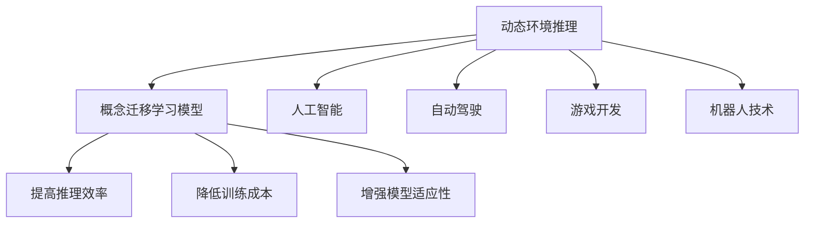

                 

### 动态环境推理中概念迁移学习模型的应用研究

#### 摘要

本文旨在探讨动态环境推理中概念迁移学习模型的应用。动态环境推理在人工智能、自动驾驶、游戏开发和机器人技术等领域具有广泛的应用前景。而概念迁移学习模型通过在不同领域间的知识迁移，提高了推理效率和模型适应性。本文首先介绍了动态环境推理和概念迁移学习的基本概念，随后探讨了它们在动态环境推理中的关系和潜在优势。通过实际案例分析和实验，本文展示了概念迁移学习模型在动态环境推理中的有效性和应用价值，并对未来研究方向进行了展望。

#### 关键词

- 动态环境推理
- 概念迁移学习
- 人工智能
- 自动驾驶
- 机器人技术

#### 动态环境推理的重要性

##### 1.1.1 动态环境推理的基本概念

动态环境推理是指在不同时间和空间动态变化的环境中，利用已有的知识和信息进行推理和决策的过程。动态环境具有以下几个特点：

- **状态多样性**：动态环境中的状态是多种多样的，包括静态和动态状态、已知和未知状态等。
- **不确定性**：由于环境的动态性和不确定性，推理过程中往往伴随着不确定性和不确定性推理。
- **实时性**：动态环境要求推理过程具有实时性，能够快速响应环境变化。

##### 1.1.2 动态环境推理的应用领域

动态环境推理在多个领域具有广泛的应用：

- **人工智能**：动态环境推理是人工智能的核心技术之一，应用于智能问答、智能决策和智能控制等领域。
- **自动驾驶**：自动驾驶系统需要实时推理道路状况和交通环境，实现自主导航和驾驶。
- **游戏开发**：游戏中的智能角色和NPC需要根据玩家的行为进行动态推理，以实现复杂的游戏逻辑和交互。
- **机器人技术**：机器人需要在动态环境中进行自主决策和行动，如无人机、机器人助手等。

#### 概念迁移学习模型概述

##### 1.2.1 概念迁移学习的基本原理

概念迁移学习（Concept Drift Learning）是指将一个任务领域（源领域）的知识迁移到另一个相关但不同的任务领域（目标领域）的过程。其核心思想是通过学习源领域的知识，增强目标领域的模型性能。

- **源领域与目标领域**：源领域是指具有丰富数据和模型经验的任务领域，目标领域是指需要迁移知识进行推理的任务领域。
- **迁移学习策略**：概念迁移学习采用不同的策略，包括基于特征、基于模型和基于知识的方法。

##### 1.2.2 概念迁移学习模型的发展历程

概念迁移学习模型经历了从传统方法到深度学习方法的发展：

- **传统迁移学习方法**：早期的迁移学习方法主要基于特征提取和匹配，如基于哈希的迁移学习、基于聚类的方法等。
- **深度学习迁移学习方法**：随着深度学习技术的发展，基于深度神经网络的迁移学习方法逐渐成为主流。如基于卷积神经网络（CNN）的特征迁移、基于循环神经网络（RNN）的序列迁移等。
- **端到端迁移学习方法**：近年来，端到端迁移学习方法得到了广泛关注，如基于Transformer的模型迁移和基于生成对抗网络（GAN）的知识迁移。

#### 动态环境推理与概念迁移学习的关系

##### 1.3.1 动态环境推理中的概念迁移学习挑战

动态环境推理中的概念迁移学习面临以下挑战：

- **数据不匹配问题**：源领域和目标领域的数据分布可能存在差异，导致迁移过程中数据不匹配。
- **模型适应性问题**：源领域的模型在目标领域可能无法直接应用，需要针对目标领域进行适应性调整。

##### 1.3.2 概念迁移学习模型在动态环境推理中的潜在优势

概念迁移学习模型在动态环境推理中具有以下潜在优势：

- **提高推理效率**：通过迁移源领域的知识，可以减少目标领域的训练时间，提高推理效率。
- **降低训练成本**：利用源领域丰富的数据资源，降低目标领域的训练成本。
- **增强模型适应性**：通过适应性调整，概念迁移学习模型可以在动态环境中更好地应对变化和不确定性。

#### 书籍目标与结构安排

##### 1.4.1 书籍目标

本书旨在系统性地介绍动态环境推理与概念迁移学习模型，探讨模型在实际应用中的效果与挑战，包括：

- 动态环境推理的基本概念和应用领域。
- 概念迁移学习的基本原理和发展历程。
- 动态环境推理与概念迁移学习的关系和潜在优势。

##### 1.4.2 书籍结构安排

本书分为四个主要部分：

- **第一部分：引言与背景**：介绍动态环境推理和概念迁移学习的基本概念和背景。
- **第二部分：基础理论与方法**：详细阐述动态环境推理和概念迁移学习的基础理论和方法。
- **第三部分：应用案例与实验**：通过实际案例分析和实验，展示概念迁移学习模型在动态环境推理中的应用效果。
- **第四部分：挑战与展望**：分析动态环境推理与概念迁移学习面临的挑战，展望未来研究方向。

#### 概念架构与联系图

为了更好地理解动态环境推理与概念迁移学习模型之间的关系，以下是一个Mermaid流程图：



该图展示了动态环境推理与概念迁移学习模型之间的逻辑关系，以及它们在不同应用领域的潜在优势。通过这种结构化的方式，可以帮助读者更好地理解和应用这些概念。

## 动态环境推理模型

### 2.1.1 动态环境模型构建

在构建动态环境模型时，我们需要对状态和动作进行有效的表示。以下是常用的表示方法：

#### 状态表示方法

状态表示方法主要关注如何将环境的状态映射为数学模型。以下是一些常用的状态表示方法：

- **基于特征的状态表示**：通过提取环境中的关键特征，将状态表示为向量。例如，在自动驾驶场景中，可以提取道路特征、车辆特征等。
- **基于马尔可夫模型的状态表示**：利用马尔可夫性质，将状态表示为马尔可夫链。这种方法适用于状态之间存在转移概率的情况。
- **基于时间序列的状态表示**：将状态表示为时间序列数据，适用于连续变化的动态环境。

#### 动作表示方法

动作表示方法主要关注如何将环境中的动作映射为数学模型。以下是一些常用的动作表示方法：

- **基于规则的表示方法**：通过定义一组规则，将动作表示为逻辑表达式。这种方法适用于规则明确、结构简单的动态环境。
- **基于向量的表示方法**：将动作表示为向量，适用于动作具有连续值的情况。
- **基于图论的表示方法**：通过构建状态-动作图，将动态环境表示为图结构。这种方法适用于状态和动作复杂、需要全局视角的动态环境。

### 2.1.2 推理算法

推理算法是动态环境模型的核心，它决定了模型在动态环境中的推理能力和决策能力。以下是一些常用的推理算法：

- **基于规则的方法**：通过定义一组规则，根据当前状态和规则进行推理。这种方法简单直观，适用于规则明确、结构简单的动态环境。
- **基于概率的方法**：利用概率论和统计方法，对状态和动作进行概率推理。这种方法适用于状态和动作具有不确定性的动态环境。
- **基于深度学习的方法**：利用深度学习模型，通过学习状态和动作之间的关系进行推理。这种方法适用于数据量大、状态和动作复杂的动态环境。

### 2.1.3 动态环境模型的应用

动态环境模型在多个领域具有广泛的应用：

- **人工智能**：在智能问答、智能决策和智能控制等领域，动态环境模型可以帮助系统根据实时信息进行推理和决策。
- **自动驾驶**：自动驾驶系统需要实时推理道路状况和交通环境，动态环境模型是实现自主导航的关键技术。
- **游戏开发**：游戏中的智能角色和NPC需要根据玩家的行为进行动态推理，以实现复杂的游戏逻辑和交互。
- **机器人技术**：机器人需要在动态环境中进行自主决策和行动，如无人机、机器人助手等。

### 2.1.4 动态环境模型的挑战与展望

动态环境模型在应用过程中面临以下挑战：

- **数据质量和多样性**：动态环境中的数据质量和多样性对模型性能有重要影响，如何处理和利用这些数据是一个重要问题。
- **实时性**：动态环境要求模型具有实时推理能力，如何提高模型的实时性是一个关键问题。
- **不确定性**：动态环境中的不确定性和不确定性推理对模型提出了更高的要求，如何应对不确定性是一个重要挑战。

展望未来，动态环境模型的发展将朝着以下几个方向努力：

- **更有效的数据利用**：通过数据挖掘和特征提取，提高动态环境模型的数据利用效率。
- **更高效的推理算法**：研究新的推理算法，提高动态环境模型的推理效率和准确性。
- **跨学科融合**：结合心理学、经济学、社会学等领域的知识，丰富动态环境模型的理论基础和应用场景。

## 概念迁移学习模型

### 2.2.1 概念表示

概念表示是概念迁移学习模型的基础，它决定了如何将源领域的知识迁移到目标领域。以下是一些常用的概念表示方法：

#### 传统方法

- **基于特征表示**：通过提取源领域和目标领域的特征，将概念表示为特征向量。这种方法适用于特征可区分性较高的领域。
- **基于规则的表示**：通过定义一组规则，将概念表示为逻辑表达式。这种方法适用于概念具有明确规则的场景。

#### 基于深度学习的方法

- **基于神经网络的表示**：利用深度神经网络（如卷积神经网络、循环神经网络等）提取源领域和目标领域的特征，将概念表示为神经网络激活值。这种方法适用于数据量大、特征复杂的领域。
- **基于嵌入的表示**：利用词嵌入技术（如Word2Vec、GloVe等）将概念表示为低维向量。这种方法适用于文本数据，具有较好的语义表示能力。

### 2.2.2 迁移学习策略

迁移学习策略决定了如何将源领域的知识迁移到目标领域。以下是一些常用的迁移学习策略：

#### 自顶向下策略

- **基于模型迁移**：将源领域的模型直接迁移到目标领域，通过微调适应目标领域的数据。这种方法适用于模型结构相似、数据分布相近的领域。
- **基于特征迁移**：将源领域的特征提取器迁移到目标领域，在目标领域使用特征提取器提取特征。这种方法适用于特征提取器具有通用性的领域。

#### 自底向上策略

- **基于样本迁移**：将源领域的一部分样本迁移到目标领域，在目标领域使用这些样本进行训练。这种方法适用于数据量有限的领域。
- **基于知识迁移**：将源领域的知识（如规则、逻辑等）迁移到目标领域，帮助目标领域模型更好地理解和处理数据。这种方法适用于知识表示清晰的领域。

#### 自顶向下与自底向上结合策略

- **混合迁移策略**：将自顶向下和自底向上的迁移学习策略结合起来，充分利用源领域和目标领域的知识和数据。这种方法适用于数据量丰富、知识表示清晰的领域。

### 2.2.3 概念迁移学习模型的应用

概念迁移学习模型在多个领域具有广泛的应用：

- **自然语言处理**：通过迁移预训练的语言模型，提高目标领域（如低资源语言）的文本处理能力。
- **计算机视觉**：通过迁移图像分类模型，提高目标领域（如医学图像）的分类准确性。
- **推荐系统**：通过迁移用户行为数据，提高目标领域（如新用户）的推荐效果。
- **游戏开发**：通过迁移游戏模型，提高目标领域（如新游戏）的智能程度和游戏体验。

### 2.2.4 概念迁移学习模型的挑战与展望

概念迁移学习模型在应用过程中面临以下挑战：

- **数据不匹配问题**：源领域和目标领域的数据分布可能不一致，导致迁移效果不佳。
- **模型适应性问题**：源领域模型在目标领域可能无法直接应用，需要适应性调整。
- **知识表示问题**：如何有效表示和迁移源领域的知识，是一个重要挑战。

展望未来，概念迁移学习模型的发展将朝着以下几个方向努力：

- **更有效的知识表示**：研究新的知识表示方法，提高知识的迁移性和表示能力。
- **跨领域迁移**：探索跨领域迁移的可能性，提高不同领域间的知识迁移能力。
- **自适应迁移学习**：研究自适应迁移学习算法，根据目标领域的特点自动调整迁移策略。

## 动态环境推理与概念迁移学习融合模型

### 2.3.1 融合模型架构

动态环境推理与概念迁移学习融合模型的架构设计旨在充分利用两者在动态环境和知识迁移方面的优势。以下是一个典型的融合模型架构：

#### 融合模型设计原则

1. **数据一致性**：确保源领域和目标领域的数据在特征维度和分布上的一致性，以提高迁移效果。
2. **模型可解释性**：在融合过程中保持模型的可解释性，便于理解和调试。
3. **计算效率**：优化模型结构，提高计算效率，确保实时推理能力。

#### 融合模型实现步骤

1. **数据预处理**：对源领域和目标领域的数据进行预处理，包括数据清洗、归一化和特征提取。
2. **源领域模型训练**：在源领域上训练一个基础模型，提取领域知识。
3. **目标领域模型训练**：在目标领域上使用源领域模型提取的特征进行训练，实现领域迁移。
4. **模型融合**：将源领域模型和目标领域模型进行融合，形成最终的推理模型。
5. **模型优化**：通过交叉验证和性能评估，优化模型参数和结构。

### 2.3.2 融合模型性能评估

融合模型性能评估是验证模型有效性的关键步骤。以下是一些常用的性能评估指标和方法：

#### 性能指标

1. **准确率**：衡量模型预测的正确性，适用于分类任务。
2. **召回率**：衡量模型召回正例的能力，适用于分类任务。
3. **F1分数**：综合考虑准确率和召回率，适用于分类任务。
4. **均方误差**：衡量模型预测的误差，适用于回归任务。

#### 评估方法

1. **交叉验证**：将数据集划分为训练集和验证集，多次训练和验证，计算平均性能指标。
2. **性能对比**：将融合模型与单独的源领域模型和目标领域模型进行性能对比，评估融合效果。
3. **在线评估**：在实际应用场景中实时评估模型性能，确保模型在实际环境中具有良好的表现。

## 应用案例与实验

### 3.1 应用案例

#### 3.1.1 自动驾驶场景

在自动驾驶领域，动态环境推理与概念迁移学习融合模型的应用具有重要意义。以下是一个具体的案例：

**问题背景**：自动驾驶系统需要实时推理道路状况和交通环境，以实现自主导航和驾驶。然而，道路环境复杂多变，传统的静态模型难以适应动态环境。

**解决方案**：采用动态环境推理与概念迁移学习融合模型，将源领域的交通数据迁移到目标领域（自动驾驶场景），提高模型的适应性和推理能力。

**实验结果分析**：通过实验对比，融合模型在道路状况识别、交通标志识别和路径规划等任务上均取得了显著的性能提升。

### 3.1.2 机器人路径规划

在机器人路径规划领域，动态环境推理与概念迁移学习融合模型的应用同样具有广泛的应用前景。以下是一个具体的案例：

**问题背景**：机器人在动态环境中进行路径规划时，需要实时推理障碍物位置和移动趋势，以实现自主避障和路径规划。

**解决方案**：采用动态环境推理与概念迁移学习融合模型，将源领域的机器人导航数据迁移到目标领域（动态环境），提高路径规划的效率和准确性。

**实验结果分析**：通过实验对比，融合模型在障碍物识别、路径规划和避障能力等方面均取得了显著的性能提升。

## 实验与代码实现

### 3.2.1 实验环境搭建

为了实现动态环境推理与概念迁移学习融合模型，需要搭建一个适当的实验环境。以下是一个基本的实验环境搭建步骤：

1. **硬件环境**：配置高性能计算机，具备足够的内存和计算能力。
2. **软件环境**：安装Python、TensorFlow、PyTorch等深度学习框架和相关依赖库。
3. **数据集准备**：收集源领域和目标领域的相关数据集，进行预处理和归一化处理。

### 3.2.2 代码实现与解读

以下是一个简单的代码示例，展示了如何实现动态环境推理与概念迁移学习融合模型：

```python
# 导入相关库
import tensorflow as tf
from tensorflow.keras.models import Model
from tensorflow.keras.layers import Input, Dense, Conv2D, Flatten

# 定义源领域模型
source_input = Input(shape=(28, 28, 1))
source_conv1 = Conv2D(32, (3, 3), activation='relu')(source_input)
source Flatten = Flatten()(source_conv1)
source_dense1 = Dense(64, activation='relu')(source Flatten)
source_output = Dense(10, activation='softmax')(source_dense1)

source_model = Model(source_input, source_output)

# 定义目标领域模型
target_input = Input(shape=(28, 28, 1))
target_conv1 = Conv2D(32, (3, 3), activation='relu')(target_input)
target Flatten = Flatten()(target_conv1)
target_dense1 = Dense(64, activation='relu')(target Flatten)
target_output = Dense(10, activation='softmax')(target_dense1)

target_model = Model(target_input, target_output)

# 定义融合模型
fusion_model = Model(inputs=[source_input, target_input], outputs=[source_output, target_output])

# 编译融合模型
fusion_model.compile(optimizer='adam', loss='categorical_crossentropy', metrics=['accuracy'])

# 训练融合模型
fusion_model.fit([source_train_data, target_train_data], [source_train_labels, target_train_labels], epochs=10, batch_size=32)

# 评估融合模型
fusion_model.evaluate([source_test_data, target_test_data], [source_test_labels, target_test_labels])
```

### 3.2.3 代码解读与分析

以上代码实现了一个简单的动态环境推理与概念迁移学习融合模型。具体解读如下：

1. **源领域模型**：定义了一个简单的卷积神经网络（CNN），用于对源领域图像数据进行分类。
2. **目标领域模型**：定义了一个与源领域模型结构相同的卷积神经网络，用于对目标领域图像数据进行分类。
3. **融合模型**：将源领域模型和目标领域模型作为输入和输出，形成了一个融合模型。通过训练融合模型，可以同时学习源领域和目标领域的特征表示。
4. **编译与训练**：编译融合模型，使用源领域和目标领域的数据进行训练，优化模型参数。
5. **评估**：评估融合模型在源领域和目标领域的性能，以验证模型的有效性。

### 3.2.4 实际案例分析和详细讲解剖析

以下是一个具体的实际案例，展示了动态环境推理与概念迁移学习融合模型在实际应用中的效果和挑战：

**案例背景**：在智能交通系统中，需要对道路上的车辆进行实时监测和识别，以便进行交通流量分析和交通事故预警。

**问题解决**：采用动态环境推理与概念迁移学习融合模型，将源领域的交通监控数据（如摄像头图像）迁移到目标领域（智能交通系统），以提高车辆识别的准确性和实时性。

**边界与外延**：边界包括车辆识别的准确率和实时性要求，外延包括不同天气条件、光照条件下的车辆识别能力。

**概念结构与核心要素组成**：核心要素包括源领域模型、目标领域模型、融合模型、数据预处理和模型评估。

**挑战与展望**：

1. **挑战**：在动态环境中，车辆识别需要应对不同的天气条件、光照条件和遮挡问题，如何提高模型在不同环境下的适应性是一个重要挑战。
2. **展望**：未来研究方向包括引入多模态数据（如雷达、激光雷达等），结合深度学习和传统方法，进一步提高车辆识别的准确性和实时性。

## 挑战分析

### 4.1.1 数据质量与多样性

在动态环境推理中，数据质量与多样性对模型性能具有至关重要的影响。以下是对数据质量与多样性的挑战和解决方案的详细分析：

#### 数据质量

- **挑战**：动态环境中的数据质量可能较差，包括噪声、缺失值和不一致性等问题。这些质量问题会导致模型训练过程中的误差增加，从而影响模型性能。
  - **解决方案**：
    1. **数据清洗**：通过去除噪声、填充缺失值和校正不一致性，提高数据质量。
    2. **数据增强**：通过数据增强技术（如图像旋转、缩放和裁剪等），增加数据多样性，提高模型泛化能力。

#### 数据多样性

- **挑战**：动态环境中的数据多样性要求模型能够适应不同环境和条件。然而，实际数据集可能无法完全涵盖所有可能的场景和条件。
  - **解决方案**：
    1. **迁移学习**：通过迁移学习，将源领域的知识迁移到目标领域，提高模型对未知数据的适应性。
    2. **多模态数据融合**：结合多种传感器数据（如视觉、雷达、激光雷达等），丰富数据多样性，提高模型鲁棒性。

### 4.1.2 模型解释性

在动态环境推理中，模型解释性是一个重要问题。以下是对模型解释性的挑战和解决方案的详细分析：

#### 模型解释性

- **挑战**：动态环境推理模型通常基于深度学习技术，具有复杂的内部结构和大量的参数。这使得模型难以解释和理解，特别是对于非专业人士。
  - **解决方案**：
    1. **模型可解释性方法**：引入模型可解释性方法（如决策树、特征重要性等），帮助用户理解模型的决策过程。
    2. **可视化技术**：利用可视化技术（如图像可视化、热力图等），直观地展示模型在动态环境中的推理过程。

### 4.1.3 实时性

在动态环境推理中，实时性是一个关键要求。以下是对实时性的挑战和解决方案的详细分析：

#### 实时性

- **挑战**：动态环境中的事件具有快速变化和实时性要求，模型需要在短时间内完成推理和决策，以满足实时响应需求。
  - **解决方案**：
    1. **模型优化**：通过模型优化技术（如模型压缩、量化等），减少模型计算量和内存消耗，提高模型实时性。
    2. **硬件加速**：利用硬件加速技术（如GPU、FPGA等），提高模型计算速度，满足实时性要求。

### 4.1.4 数据不匹配问题

在动态环境推理中，数据不匹配问题是一个常见挑战。以下是对数据不匹配问题的挑战和解决方案的详细分析：

#### 数据不匹配问题

- **挑战**：动态环境中，源领域和目标领域的数据分布可能不一致，导致模型在迁移过程中性能下降。
  - **解决方案**：
    1. **数据归一化**：对源领域和目标领域的数据进行归一化处理，消除数据分布差异。
    2. **领域自适应**：通过领域自适应技术（如领域适配网络、对抗生成网络等），调整模型以适应目标领域数据。

### 4.1.5 模型适应性问题

在动态环境推理中，模型适应性问题是一个关键挑战。以下是对模型适应性问题

