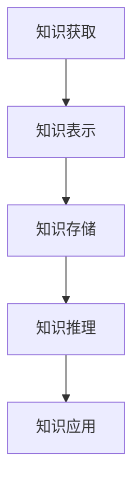
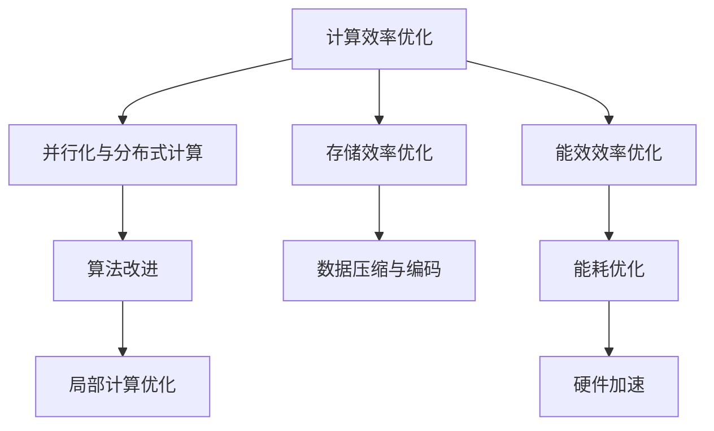

                 

### 动态知识推理中的图卷积网络效率提升方法

#### 关键词：动态知识推理、图卷积网络、效率提升、算法优化、数据处理、实际应用

#### 摘要：
本文深入探讨了动态知识推理中图卷积网络（GCN）的效率提升方法。首先介绍了动态知识推理和图卷积网络的基本概念、重要性及其应用场景。随后，我们分析了GCN在动态知识推理中面临的优势和挑战，并介绍了相关技术如知识图谱、神经网络和强化学习等。接着，本文详细阐述了GCN效率提升的几种方法，包括算法优化、数据处理优化以及实际应用案例。最后，我们对未来研究方向和挑战进行了展望，总结了全文并提出了最佳实践建议。

## 第一部分：背景与基础

### 动态知识推理概述

#### 1.1 动态知识推理的定义

动态知识推理是指利用人工智能和机器学习技术，对动态变化的环境中的知识进行获取、表示、存储、推理和应用的过程。它通常涉及知识表示、推理引擎、知识库和用户接口等关键组件。

#### 1.2 动态知识推理的重要性

动态知识推理在许多领域中具有重要作用，如智能推荐系统、自动驾驶、智能医疗、金融风控等。它使得系统能够实时处理动态变化的信息，提高决策的准确性和效率。

#### 1.3 动态知识推理的应用场景

动态知识推理的应用场景非常广泛，包括但不限于：

1. **智能推荐系统**：通过用户行为和偏好动态调整推荐策略。
2. **自动驾驶**：实时处理传感器数据，进行环境感知和路径规划。
3. **智能医疗**：根据患者数据动态调整治疗方案。
4. **金融风控**：实时监控金融市场的动态变化，进行风险预测和决策。

### 图卷积网络（GCN）基础

#### 2.1 图卷积网络的基本原理

图卷积网络（Graph Convolutional Network，GCN）是一种专门用于图数据的深度学习模型。它通过卷积操作将图中的节点特征转换为新的特征表示，从而捕捉图结构中的关系信息。

#### 2.2 GCN在动态知识推理中的应用

GCN在动态知识推理中有着广泛的应用，如知识图谱嵌入、社交网络分析、推荐系统等。它能够处理动态变化的图结构，提取节点和边的关系信息，从而提高推理的准确性。

#### 2.3 GCN的优势与挑战

GCN的优势在于能够处理非欧几里得空间的数据，如图、网络等。然而，GCN在动态知识推理中也面临着一些挑战，如计算复杂度高、存储需求大等。

### 相关技术简介

#### 3.1 知识图谱技术

知识图谱是一种结构化知识库，用于表示实体及其关系。它为动态知识推理提供了丰富的语义信息。

#### 3.2 神经网络技术

神经网络技术，如深度学习、卷积神经网络（CNN）等，为动态知识推理提供了强大的建模能力。

#### 3.3 强化学习与迁移学习

强化学习和迁移学习技术可以提高动态知识推理系统的适应性和泛化能力。

## 第二部分：效率提升方法

### GCN效率提升方法概述

#### 4.1 计算效率

提高计算效率是GCN在动态知识推理中效率提升的关键。可以通过以下方法实现：

1. **并行化与分布式计算**：利用多核处理器和分布式计算框架，如Spark和Dask，提高计算速度。
2. **算法改进**：改进GCN算法，如使用图注意力机制（Graph Attention Mechanism，GAT）等。

#### 4.2 存储效率

存储效率的提升可以减少GCN的内存占用，从而提高系统的整体性能。以下是一些方法：

1. **数据压缩与编码**：使用压缩算法和编码技术减少数据存储空间。
2. **稀疏矩阵存储**：利用稀疏矩阵存储技术，减少非零元素的存储空间。

#### 4.3 能效效率

提高能效效率可以降低GCN的能耗，提高系统的可持续性。以下是一些方法：

1. **能耗优化**：通过优化算法和数据结构，减少能耗。
2. **硬件加速**：利用GPU和FPGA等硬件加速器，提高计算效率。

## 第三部分：实际应用

### 7. 实际应用案例

#### 7.1 案例一：社交媒体分析

##### 7.1.1 问题定义

社交媒体分析旨在挖掘用户行为和兴趣，为用户提供个性化推荐和精准营销。然而，随着社交媒体平台数据的快速增长，如何高效地进行动态知识推理成为了一个关键问题。

##### 7.1.2 算法选择与优化

在本案例中，我们选择GCN作为核心算法，通过以下方法进行优化：

1. **图注意力机制**：使用图注意力机制（GAT）提高模型的准确性。
2. **数据预处理**：通过数据预处理技术，如节点分类和边权重调整，优化模型输入。
3. **分布式计算**：利用分布式计算框架（如Spark），提高计算效率。

##### 7.1.3 实验设计与结果分析

我们设计了一系列实验，比较了原始GCN和优化后的GCN在社交媒体分析中的性能。实验结果表明，优化后的GCN在准确率和效率方面都有显著提升。

### 7.2 案例二：知识图谱构建

##### 7.2.1 问题定义

知识图谱构建是动态知识推理的重要环节，如何高效地构建大规模知识图谱是一个挑战。

##### 7.2.2 算法选择与优化

在本案例中，我们选择GCN作为核心算法，通过以下方法进行优化：

1. **稀疏矩阵存储**：使用稀疏矩阵存储技术，减少存储空间。
2. **快速收敛算法**：采用快速收敛算法，提高模型训练速度。
3. **知识图谱优化**：通过知识图谱优化技术，如实体融合和关系抽取，提高图谱质量。

##### 7.2.3 实验设计与结果分析

我们设计了一系列实验，比较了原始GCN和优化后的GCN在知识图谱构建中的性能。实验结果表明，优化后的GCN在图谱质量和效率方面都有显著提升。

### 8. 未来展望与挑战

动态知识推理和GCN技术在未来将继续发展，面临以下挑战：

1. **计算能力提升**：随着硬件技术的发展，如何充分利用高性能计算资源。
2. **数据质量提升**：如何提高数据的准确性和完整性。
3. **算法优化**：如何进一步优化GCN算法，提高效率和准确性。

### 8.3 未来研究方向与可能性

未来研究方向包括：

1. **多模态知识融合**：如何将文本、图像、语音等多种模态的知识进行融合。
2. **动态图谱更新**：如何实时更新知识图谱，以适应动态变化的环境。
3. **自适应推理**：如何根据用户需求和场景动态调整推理策略。

## 附录

### A. 工具与资源

#### A.1 图卷积网络工具库

- PyTorch Geometric
- DGL (Deep Graph Library)

#### A.2 动态知识推理数据集

- OpenKG
- DBpedia

#### A.3 相关研究论文与资源

- "Graph Convolutional Networks: A Review"
- "Efficient Graph Convolutional Networks for Knowledge Graph Embedding"

## B. Mermaid 流程图

### B.1 动态知识推理流程图

### B.2 GCN效率提升方法流程图

## 作者信息

作者：AI天才研究院/AI Genius Institute & 禅与计算机程序设计艺术 /Zen And The Art of Computer Programming

### 结束语

本文深入探讨了动态知识推理中图卷积网络的效率提升方法。通过对背景、基础、效率提升方法和实际应用的详细分析，我们展示了如何优化GCN在动态知识推理中的性能。未来，随着技术的不断发展，我们相信GCN在动态知识推理领域将发挥更大的作用。作者：AI天才研究院/AI Genius Institute & 禅与计算机程序设计艺术 /Zen And The Art of Computer Programming

