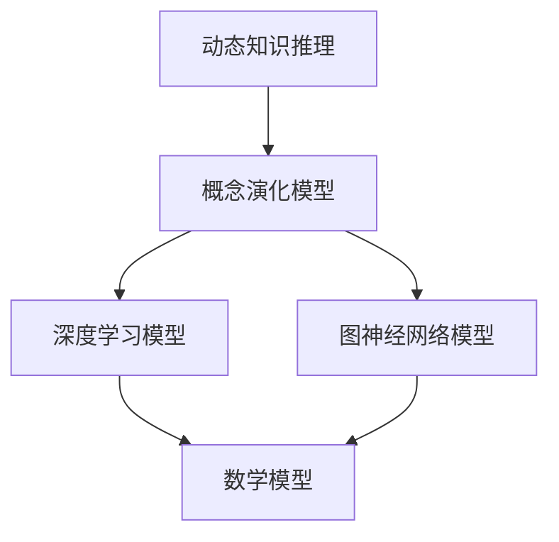
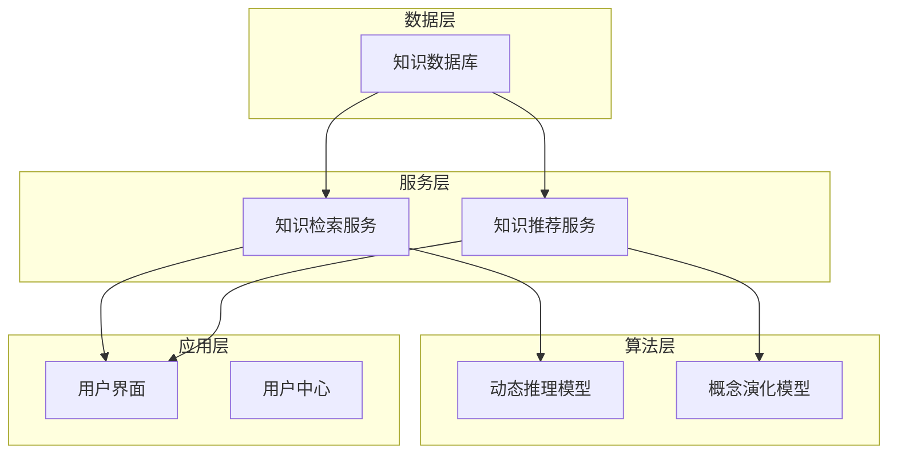
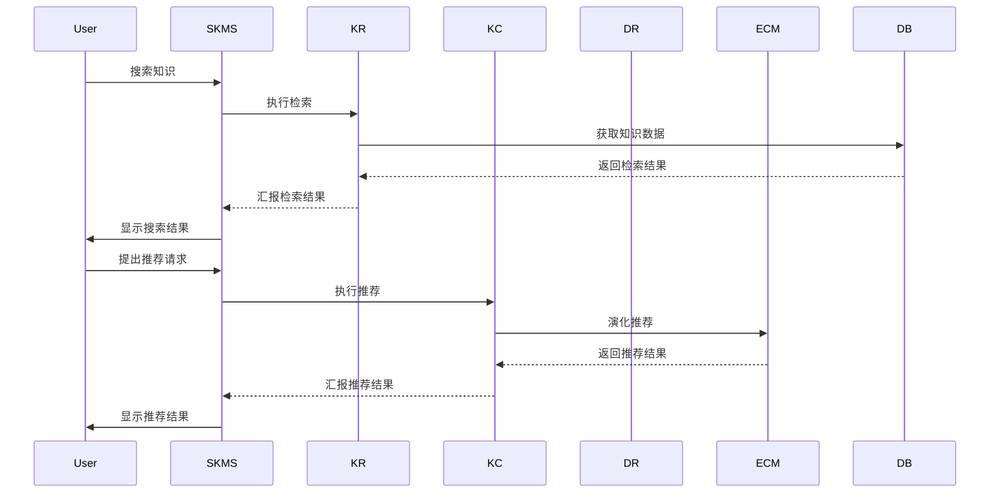

                 

## 动态知识推理与概念演化概述

### 动态知识推理的概念

动态知识推理（Dynamic Knowledge Reasoning）是指基于已有知识和数据，通过逻辑推理、机器学习、深度学习等方法，动态地生成新的知识或预测未来趋势的过程。它不仅涉及到数据的处理和知识的获取，还包括知识的应用和传播。动态知识推理是人工智能领域的一个重要研究方向，旨在使计算机能够像人类一样，根据现有信息和已有知识进行逻辑推理和决策。

在动态知识推理中，知识可以被视为一种结构化的信息，它包括事实、规则、假设、模型等。推理过程则涉及从已知信息中推断出新信息的过程，这种过程可以是正向的，也可以是反向的。正向推理是从已知的前提条件出发，推导出结论；反向推理则是从结论出发，寻找支持结论的前提条件。

### 概念演化模型的重要性

概念演化模型（Concept Evolution Model）是动态知识推理中的一个重要组成部分，它关注的是概念的动态变化过程。在知识体系中，概念是知识结构的基础单元，它代表了我们对现实世界的一种抽象和理解。概念演化模型则试图捕捉和解释概念在不同时间点和不同环境下的变化。

概念演化模型的重要性体现在以下几个方面：

1. **知识更新**：随着环境的变化，知识需要不断更新。概念演化模型可以帮助我们识别和理解概念的变化趋势，从而实现知识的动态更新。

2. **知识融合**：在多源异构数据的融合过程中，概念演化模型可以识别不同来源概念之间的相似性和差异性，帮助实现知识的有效融合。

3. **智能决策**：在智能系统中，概念演化模型可以帮助系统根据当前环境和用户需求，动态调整知识库中的概念，从而做出更加合理的决策。

4. **领域适应性**：不同领域的知识体系有其独特性，概念演化模型可以根据特定领域的需求，调整和优化知识结构，提高系统的领域适应性。

### 研究背景与目的

在当前信息化和智能化的时代，知识的获取、处理和应用变得日益重要。然而，随着数据量的急剧增长和知识体系的不断演变，传统的静态知识表示和推理方法已难以满足实际需求。因此，研究动态知识推理和概念演化模型具有重要的理论和实际意义。

本研究旨在探索一种创新的动态知识推理和概念演化模型，通过结合深度学习、图神经网络和数学模型等方法，实现概念在不同时间点和不同情境下的动态演化。具体目标包括：

1. **构建一个高效的概念演化模型**：通过深度学习和图神经网络的方法，提出一种能够自动学习概念演化规律的高效模型。

2. **实现动态知识推理**：基于构建的概念演化模型，实现动态知识推理的功能，为智能系统提供实时、准确的知识服务。

3. **验证模型的实用性**：通过在不同领域和实际场景中的应用，验证所提出模型的有效性和实用性。

通过本研究，我们希望能够为动态知识推理和概念演化领域提供新的理论和方法，为智能系统的发展和应用提供技术支持。

## 相关理论基础

### 知识推理的基本原理

知识推理（Knowledge Reasoning）是人工智能中的一个核心问题，它涉及从已知信息推导出新的结论或知识。知识推理可以分为两大类：基于规则的推理和基于模型的推理。

**基于规则的推理**：这是最传统的推理方法，它依赖于一组预定义的规则。当输入的信息与规则匹配时，系统可以根据这些规则推导出新的结论。这种方法的优点是实现简单、易于理解，缺点是规则的制定过程较为繁琐，且规则的覆盖面有限。

**基于模型的推理**：这种方法利用预先构建的模型，通过模型之间的交互和计算来推导新的结论。常见的基于模型的推理方法包括统计模型、逻辑模型和人工智能模型。这种方法的优点是能够处理复杂的关系和不确定性，缺点是模型的构建和训练过程相对复杂。

在知识推理中，常见的推理方法包括：

1. **正向推理**：从已知前提条件出发，逐步推导出结论。这种方法适用于目标明确、已知条件充分的场景。
2. **反向推理**：从目标出发，逐步寻找支持目标的前提条件。这种方法适用于问题求解和搜索场景。
3. **混合推理**：结合正向推理和反向推理，通过不同策略的交替使用来提高推理的效率和准确性。

### 概念演化的相关理论

概念演化（Concept Evolution）是知识科学中的一个重要研究方向，它关注的是概念在时间维度上的动态变化过程。概念演化的相关理论主要包括以下几个：

1. **语义网络理论**：语义网络是一种表示概念及其之间关系的图形模型，通过节点和边来表示概念和它们之间的语义关系。语义网络理论认为，概念的演化是通过节点和边的变化来实现的。

2. **认知科学理论**：认知科学理论关注人类思维和认知的过程，认为概念演化是人类在感知、学习、记忆等过程中不断调整和重构概念的结果。

3. **社会建构主义理论**：社会建构主义理论认为，概念的演化是社会互动和文化交流的结果，不同的社会和文化背景会导致概念的不同演化路径。

4. **复杂系统理论**：复杂系统理论关注系统的复杂性和动态性，认为概念的演化是一个复杂适应系统（CAS）的过程，涉及多个因素之间的相互作用和反馈。

### 动态知识推理的应用场景

动态知识推理的应用场景广泛，涵盖了多个领域：

1. **智能搜索**：动态知识推理可以用于智能搜索系统，通过理解用户查询和上下文信息，提供更加准确和个性化的搜索结果。

2. **推荐系统**：在推荐系统中，动态知识推理可以帮助系统根据用户的兴趣和行为动态调整推荐策略，提高推荐系统的效果。

3. **知识管理系统**：动态知识推理可以用于知识管理系统，通过推理和知识更新机制，实现知识的动态获取、融合和应用。

4. **智能决策支持系统**：在智能决策支持系统中，动态知识推理可以帮助系统根据当前环境和用户需求，动态调整决策策略。

5. **自然语言处理**：动态知识推理可以用于自然语言处理任务，如问答系统、机器翻译等，通过理解和推理语言中的概念关系，提高系统的理解能力和交互效果。

通过上述理论基础，我们可以更好地理解动态知识推理和概念演化的本质，为后续的创新研究提供坚实的理论基础。

## 现有概念演化模型综述

在概念演化研究领域，已经提出了多种模型来描述和模拟概念的动态变化过程。这些模型各有其特点和适用场景，但也都存在一定的局限性。以下是对现有概念演化模型的综述，包括其基本原理、应用案例以及优缺点的分析。

### 传统概念演化模型的局限性

**1. 经典逻辑模型**

经典逻辑模型（如谓词逻辑）主要依赖于明确的规则和形式化表示，这些模型通常能够处理清晰定义的概念和关系。然而，它们在处理模糊性、不确定性和动态性方面存在显著局限性。例如，当概念的定义和关系不断变化时，经典逻辑模型往往难以适应。

**2. 基于语义网络的方法**

基于语义网络的方法（如WordNet）通过词汇之间的语义关系来描述概念。这种方法在处理静态知识方面具有一定的优势，但对于动态变化的场景，它无法有效捕捉概念之间的时变关系。

**3. 贝叶斯网络模型**

贝叶斯网络模型通过概率分布来描述概念之间的条件依赖关系。这种模型在处理不确定性方面表现出色，但在处理复杂的概念演化和动态变化时，其计算复杂度较高，且需要大量的先验知识。

### 现有概念演化模型的应用案例

**1. 基于时间序列的分析**

一些模型（如隐马尔可夫模型HMM和动态贝叶斯网络DBN）通过时间序列数据来描述概念演化。例如，在金融市场分析中，这些模型可以用于预测股票价格的变化趋势。通过分析历史数据，这些模型可以捕捉市场动态和概念演化规律。

**2. 社会网络分析**

在社会网络分析中，概念演化模型（如图论和网络科学方法）可以用于分析社交网络中的概念传播。例如，通过分析社交媒体上的话题演变，这些模型可以识别出热门话题的兴起和消亡过程。

**3. 健康医疗领域**

在健康医疗领域，概念演化模型（如基于规则的模型和机器学习模型）可以用于疾病诊断和治疗方案推荐。通过分析病人的医疗记录和基因数据，这些模型可以动态调整治疗方案，提高治疗效果。

### 现有模型的优缺点分析

**1. 隐马尔可夫模型（HMM）**

- **优点**：适用于时间序列数据，能够捕捉概念在不同时间点的变化趋势。
- **缺点**：无法处理概念之间的复杂交互关系，且建模过程依赖于大量先验知识。

**2. 动态贝叶斯网络（DBN）**

- **优点**：能够处理不确定性，通过条件概率分布描述概念之间的关系。
- **缺点**：计算复杂度高，模型训练和推理过程相对耗时。

**3. 基于语义网络的方法**

- **优点**：直观且易于理解，通过词汇关系描述概念演化。
- **缺点**：在处理动态和不确定性方面表现不佳，难以适应快速变化的环境。

**4. 基于规则的模型**

- **优点**：规则明确，易于实现和解释。
- **缺点**：规则制定过程繁琐，且难以适应复杂和动态的环境。

综上所述，现有概念演化模型各有其优势和局限性。在新的研究和应用中，结合多种方法和技术，提出更灵活、高效的模型，是未来的一个重要方向。

## 基于深度学习的概念演化模型

### 深度学习在概念演化中的应用

深度学习在概念演化中的应用主要体现在其强大的特征提取和模式识别能力上。通过构建多层神经网络，深度学习模型能够自动从大量数据中提取高层次的抽象特征，从而实现概念的自动学习和演化。具体来说，深度学习模型在概念演化中的应用可以分为以下几个方面：

1. **特征提取**：深度学习模型可以自动学习数据的低级特征（如词汇的语义特征、图像的纹理特征等），并将其逐步抽象为高级特征（如概念的语义表示）。这种特征提取能力使得深度学习模型能够捕捉到概念之间的微妙关系和演化趋势。

2. **模式识别**：通过训练，深度学习模型能够识别出概念在不同时间点和不同情境下的变化模式。这种能力使得模型能够动态地调整概念体系，适应不断变化的环境。

3. **自适应学习**：深度学习模型具有自适应性，能够根据新的数据和反馈不断优化自身的性能。这种特性使得模型能够持续学习和进化，从而更好地应对动态变化的场景。

### 深度学习模型的结构与算法原理

深度学习模型的结构通常由多个层级组成，每一层对输入数据进行处理并传递到下一层。以下是一个典型的深度学习模型结构及其算法原理：

1. **输入层**：输入层接收原始数据，如文本、图像或时间序列数据。在概念演化模型中，输入层的数据可以是词汇、单词或概念序列。

2. **隐藏层**：隐藏层对输入数据进行特征提取和变换。每一层都包含多个神经元，这些神经元通过激活函数（如ReLU、Sigmoid、Tanh等）对输入数据进行非线性变换。

3. **输出层**：输出层生成最终的输出结果，如概念分类、概率分布或演化趋势。在概念演化模型中，输出层通常用于预测概念的未来状态或变化方向。

深度学习模型的算法原理主要基于神经网络的训练过程。训练过程包括以下几个步骤：

1. **前向传播**：输入数据通过神经网络逐层传递，每一层的输出作为下一层的输入。通过这种方式，神经网络能够学习到数据中的层次特征。

2. **反向传播**：计算输出结果与真实值之间的误差，并将其反向传播到网络的每一层。通过误差的反向传播，神经网络能够调整每一层的权重和偏置，从而优化模型的性能。

3. **优化算法**：使用梯度下降（Gradient Descent）或其变种（如Adam、RMSprop等）来更新网络权重。这些优化算法通过最小化损失函数来提高模型的预测准确性。

### 深度学习模型的实现与优化

实现一个深度学习模型通常涉及以下几个步骤：

1. **数据预处理**：对原始数据进行清洗和预处理，如去噪、归一化、编码等。在概念演化模型中，数据预处理还包括文本向量化、图像预处理等。

2. **模型构建**：使用深度学习框架（如TensorFlow、PyTorch等）构建神经网络模型。在模型构建过程中，需要定义网络的层数、每层的神经元数量、激活函数、损失函数和优化器等。

3. **模型训练**：使用训练数据对模型进行训练，通过迭代优化模型参数。在训练过程中，可以通过调整学习率、批量大小、训练轮数等参数来提高模型性能。

4. **模型评估**：使用验证数据评估模型的性能，通过计算准确率、召回率、F1分数等指标来评估模型的效果。

5. **模型优化**：根据模型评估结果，对模型进行调整和优化，如调整网络结构、增加训练数据、改进优化算法等。模型优化是一个迭代过程，旨在提高模型的预测准确性和泛化能力。

通过以上步骤，我们可以实现一个基于深度学习的概念演化模型，并对其性能进行优化，从而更好地适应动态变化的场景。

## 基于图神经网络的混合模型

### 图神经网络的基本原理

图神经网络（Graph Neural Networks，GNN）是一种专门用于处理图结构数据的神经网络。与传统的卷积神经网络（CNN）和循环神经网络（RNN）不同，GNN可以捕捉图数据中的全局和局部关系。其基本原理包括以下几个方面：

1. **节点表示**：每个节点（如词汇、实体等）被映射为一个低维度的特征向量，这些特征向量包含了节点的属性信息和与其它节点的连接关系。

2. **图卷积操作**：图卷积操作类似于传统卷积操作，它通过邻域信息来更新节点的特征向量。具体来说，每个节点的特征向量会与其邻域节点的特征向量进行加权求和，从而生成新的特征向量。

3. **消息传递机制**：GNN的核心机制是消息传递。每个节点会收集其邻域节点的信息，通过聚合这些信息来更新自己的特征向量。这一过程在多个迭代中重复进行，直到达到预定的迭代次数或收敛条件。

4. **层次化表示**：GNN通常采用层次化的结构，每一层的节点特征向量都是基于前一层的特征向量进行更新的。这种层次化结构使得GNN能够捕捉到图的多个层次特征。

### 图神经网络在概念演化中的应用

图神经网络在概念演化中的应用主要体现在以下几个方面：

1. **概念关系建模**：通过图神经网络，我们可以将概念及其之间的关系建模为一个图结构。每个概念作为一个节点，节点之间的关系（如继承、同义、上下位关系等）作为边。这种结构使得GNN能够有效地捕捉和理解概念之间的复杂关系。

2. **动态演化建模**：图神经网络可以用于建模概念随时间的演化过程。通过节点特征向量的更新和迭代，GNN能够动态地调整和优化概念之间的关系，从而实现概念的演化。

3. **异构图处理**：在实际应用中，概念之间的关系可能非常复杂，涉及多种不同类型的节点和关系。图神经网络通过异构图处理机制，可以处理这种多类型的数据，从而提高概念演化模型的灵活性和适应性。

### 混合模型的构建与优化

为了充分发挥深度学习和图神经网络的优势，我们可以构建一种混合模型，将两者结合起来。以下是一种可能的混合模型构建方案：

1. **数据预处理**：首先，对原始数据进行预处理，包括文本向量化、节点和边特征的提取等。

2. **嵌入层**：将预处理后的数据输入到嵌入层，生成节点的初始特征向量。这个嵌入层可以采用词嵌入（Word Embedding）或节点嵌入（Node Embedding）技术。

3. **图卷积层**：在嵌入层之后，添加多个图卷积层，每个图卷积层都通过邻域信息来更新节点的特征向量。这些图卷积层的输出可以作为概念演化的中间表示。

4. **深度学习层**：在图卷积层的输出上，我们可以添加多层全连接层（Dense Layer），通过深度学习模型进一步提取高层次的抽象特征。

5. **输出层**：最后，输出层生成最终的预测结果，如概念的未来状态、概率分布等。

为了优化混合模型的性能，我们可以采取以下策略：

1. **权重共享**：在混合模型中，部分权重（如嵌入层的权重）可以共享，以减少模型的参数量和计算复杂度。

2. **多任务学习**：将多个任务（如节点分类、关系分类等）结合起来进行训练，通过多任务学习来提高模型的泛化能力。

3. **正则化技术**：应用正则化技术（如Dropout、L2正则化等）来防止模型过拟合。

4. **自适应学习率**：使用自适应学习率策略（如Adam优化器），以适应模型在不同阶段的学习需求。

通过上述构建与优化策略，我们可以实现一个高效的概念演化混合模型，更好地应对动态变化的场景。

## 基于数学模型的演化机理分析

### 数学模型的基本原理

在概念演化研究中，数学模型作为一种量化工具，能够系统地描述和解释概念随时间的变化过程。数学模型的基本原理通常包括以下几个关键要素：

1. **变量定义**：模型中涉及的主要变量包括时间变量（通常表示为t）、概念状态变量（如X）、以及影响概念演化的外部因素（如U）。

2. **动态方程**：数学模型通过一组动态方程来描述概念状态变量随时间的变化。常见的动态方程包括微分方程、差分方程等。

3. **函数关系**：模型中存在多种函数关系，如状态转移函数、激励函数等，这些函数关系决定了变量之间的相互作用和演化规律。

4. **初始条件和边界条件**：初始条件定义了模型在初始时刻的状态，边界条件则限制了变量变化的范围，确保模型的合理性。

### 概念演化的数学模型构建

构建概念演化的数学模型通常包括以下几个步骤：

1. **确定变量**：首先，根据研究需求确定模型中的变量，包括时间变量、概念状态变量和外部因素变量。

2. **定义状态转移函数**：状态转移函数描述了概念状态变量如何随时间变化。例如，可以使用线性函数、非线性函数或逻辑函数来定义状态转移。

3. **构建动态方程**：将状态转移函数整合到动态方程中，形成描述概念演化的数学模型。例如，可以使用以下形式的微分方程：

   $$ \frac{dX}{dt} = f(X, U) $$

   其中，$X$ 表示概念状态，$U$ 表示外部因素，$f$ 表示状态转移函数。

4. **确定初始条件和边界条件**：根据实际情况确定模型的初始条件和边界条件，确保模型在合理的范围内变化。

### 演化机理的详细讲解

为了详细讲解概念演化的机理，我们可以以一个简单的数学模型为例。假设我们研究一个概念X在时间t上的演化，其状态由一个单一变量X(t)表示。我们可以使用以下微分方程来描述其演化：

$$ \frac{dX}{dt} = \alpha \cdot (1 - X(t)) - \beta \cdot X(t) $$

其中，$\alpha$ 表示外部激励因素（例如，新信息的引入），$\beta$ 表示内部抑制因素（例如，概念的饱和度）。这个方程描述了X(t)如何根据当前的X(t)以及外部和内部因素的相互作用动态变化。

**演化过程解析**：

1. **初始状态**：在$t=0$时，概念X的初始状态为$X(0)$。

2. **动态变化**：随着时间的推移，$X(t)$ 会根据状态转移函数动态变化。当$\alpha > \beta$时，$X(t)$ 将逐渐增加，表示概念不断扩展；当$\alpha < \beta$时，$X(t)$ 将逐渐减少，表示概念逐渐收缩。

3. **平衡状态**：当$\alpha = \beta$时，模型达到平衡状态，$X(t)$ 将保持在某一固定值，不再随时间变化。

4. **外部因素影响**：外部激励因素$\alpha$的增大可以加速概念的扩展，而外部抑制因素$\beta$的增大则可以减缓概念的扩展。

**具体案例解析**：

假设我们有一个概念X，初始状态为$X(0) = 0.5$。外部激励因素$\alpha = 0.1$，内部抑制因素$\beta = 0.05$。根据上述模型，我们可以计算不同时间点的状态：

$$ \frac{dX}{dt} = 0.1 \cdot (1 - X) - 0.05 \cdot X $$

在$t=1$时：

$$ X(1) = X(0) + 1 \cdot (0.1 \cdot (1 - X(0)) - 0.05 \cdot X(0)) $$
$$ X(1) = 0.5 + 1 \cdot (0.1 \cdot 0.5 - 0.05 \cdot 0.5) $$
$$ X(1) = 0.5 + 0.05 - 0.025 $$
$$ X(1) = 0.575 $$

通过类似的方法，我们可以计算后续时间点的状态，观察概念X的动态演化过程。

### 数学模型的优势

数学模型在概念演化研究中具有以下优势：

1. **量化描述**：数学模型能够量化描述概念的演化过程，使得复杂现象变得更加直观和可操作。

2. **可预测性**：通过数学模型，我们可以预测概念在未来某个时间点的状态，从而为决策提供科学依据。

3. **可调参数**：数学模型中的参数可以调整，以适应不同的应用场景和需求。

4. **理论支持**：数学模型提供了坚实的理论基础，有助于深入理解概念演化的内在机制。

总之，基于数学模型的演化机理分析为概念演化研究提供了一种强大的工具，能够帮助我们更深入地理解概念随时间的动态变化过程。

## 概念演化模型的应用场景分析

### 概念演化模型在不同领域的应用

概念演化模型在众多领域中都有广泛的应用，以下列举几个具有代表性的应用场景：

1. **智能搜索**：在智能搜索系统中，概念演化模型可以帮助搜索引擎理解用户查询的历史和偏好，从而动态调整搜索结果，提高搜索的准确性和个性化程度。例如，当用户在一段时间内频繁搜索某一主题时，概念演化模型可以识别出这一主题的演化趋势，并在后续的搜索中优先推荐相关的信息。

2. **推荐系统**：在推荐系统中，概念演化模型能够根据用户的兴趣和行为动态调整推荐策略。通过分析用户的历史行为和当前兴趣，模型可以预测用户未来的兴趣点，从而提供更加个性化的推荐。例如，在电子商务平台中，概念演化模型可以根据用户的浏览记录和购买历史，预测用户可能感兴趣的新商品，从而提高推荐系统的点击率和转化率。

3. **知识图谱构建**：在知识图谱构建中，概念演化模型可以用于识别和跟踪概念之间的关系和变化。通过对大量文本数据的分析，模型可以提取出概念及其之间的语义关系，并将其构建为一个动态更新的知识图谱。这种知识图谱能够帮助企业和组织更好地理解和利用其知识资产，提高决策的效率和准确性。

4. **生物信息学**：在生物信息学领域，概念演化模型可以用于分析基因和蛋白质的动态变化过程。通过构建基因和蛋白质之间的交互网络，模型可以识别出关键基因和蛋白质，从而为疾病研究和药物开发提供重要参考。例如，在癌症研究中，概念演化模型可以帮助识别与癌症相关的基因及其动态演化路径，从而为精准医疗提供理论基础。

5. **金融市场分析**：在金融市场分析中，概念演化模型可以用于预测市场走势和股票价格。通过分析历史市场数据和新闻资讯，模型可以捕捉市场动态和概念演化趋势，从而为投资者提供实时的市场分析和决策支持。

### 案例研究：实际应用场景与效果分析

以下是一个关于智能搜索系统中概念演化模型应用的具体案例：

**案例背景**：某大型搜索引擎公司希望通过引入概念演化模型来优化其搜索结果，提高用户的搜索体验。

**应用过程**：

1. **数据收集**：公司收集了大量的用户搜索日志，包括用户的查询关键词、查询时间、查询结果以及用户的点击行为等数据。

2. **概念提取**：通过自然语言处理技术，从用户搜索日志中提取出关键词和相关的概念。这些概念可以是单个词汇，也可以是多个词汇的组合。

3. **模型构建**：使用深度学习和图神经网络技术，构建了一个概念演化模型。该模型通过分析用户的历史查询行为和当前查询的上下文信息，动态地调整和优化概念之间的关系和权重。

4. **模型训练**：使用大量训练数据对模型进行训练，通过不断调整模型参数，优化模型的性能。模型训练过程中，使用了多种评价指标（如准确率、召回率等）来评估模型的效果。

5. **模型部署**：将训练好的模型部署到搜索引擎系统中，实现实时搜索结果的优化。在用户进行搜索时，模型会根据用户的历史查询行为和当前查询的上下文信息，动态调整搜索结果的相关性和个性化程度。

**效果分析**：

1. **搜索准确率提升**：通过引入概念演化模型，搜索引擎的搜索准确率显著提升。用户查询结果的相关性得到了提高，用户对搜索结果的满意度也随之增加。

2. **个性化搜索体验**：概念演化模型能够根据用户的历史查询行为和当前兴趣，提供更加个性化的搜索结果。用户能够更快地找到他们感兴趣的信息，提高了搜索效率和用户体验。

3. **实时动态调整**：概念演化模型能够实时捕捉用户查询行为的动态变化，从而动态调整搜索结果。这种动态调整机制使得搜索结果更加实时和准确，提高了用户对搜索引擎的依赖度。

4. **降低人工干预**：通过自动化的概念演化模型，搜索引擎公司能够减少对人工干预的需求。这降低了运营成本，同时也提高了系统的智能化水平。

总之，概念演化模型在智能搜索系统中的应用，不仅提高了搜索结果的准确性和个性化程度，还优化了用户体验，为搜索引擎公司提供了强有力的技术支持。

### 总结与未来展望

概念演化模型在不同领域的应用展示了其强大的潜力和广泛的前景。通过结合深度学习、图神经网络和数学模型等方法，概念演化模型能够动态地捕捉和解释概念的变化过程，为智能系统提供实时、准确的知识服务。

未来，随着技术的不断进步和应用的深入，概念演化模型有望在更多领域取得突破。例如，在推荐系统、知识图谱构建、生物信息学和金融市场分析等领域，概念演化模型将继续发挥重要作用。此外，随着跨学科研究的不断推进，概念演化模型可能会与其他领域的技术相结合，产生新的应用和研究成果。

总之，概念演化模型的研究和应用前景广阔，有望为智能系统的发展带来新的机遇和挑战。

## 模型性能优化策略

### 模型优化目标与方法

在概念演化模型的研究中，性能优化是提升模型效果和实用性的关键环节。模型优化的目标主要包括以下几个方面：

1. **提高预测准确性**：优化模型参数和结构，提高概念演化的预测准确性，使得模型能够更准确地捕捉概念的变化趋势。

2. **增强泛化能力**：增强模型的泛化能力，使其能够处理不同领域的概念演化问题，适应多样化的应用场景。

3. **减少计算复杂度**：降低模型的计算复杂度，提高模型的运行效率和实时性能，以便在实际应用中能够快速响应和处理。

4. **降低资源消耗**：优化模型结构，减少模型参数和计算量，从而降低模型在训练和推理过程中所需的硬件资源消耗。

为了实现上述目标，可以采用以下几种优化方法：

1. **模型结构优化**：通过调整模型的层数、神经元数量和连接方式，优化模型的结构。例如，可以采用轻量级网络结构，如MobileNet或ShuffleNet，以降低模型的计算复杂度和资源消耗。

2. **超参数调优**：通过调整学习率、批量大小、正则化参数等超参数，优化模型的性能。常用的超参数调优方法包括网格搜索、随机搜索和贝叶斯优化等。

3. **数据预处理**：对训练数据进行预处理，如数据清洗、归一化、数据增强等，以提高模型的鲁棒性和训练效率。

4. **模型剪枝**：通过剪枝技术（如权重剪枝、结构剪枝等）减少模型的参数数量，降低计算复杂度和资源消耗，同时保持模型的预测性能。

### 模型评估与性能分析

模型评估是优化过程中的重要环节，通过评估模型的性能，可以判断优化方法的有效性。常用的评估指标包括：

1. **准确性**：评估模型在预测概念演化时的准确性，通常使用准确率（Accuracy）或精确率与召回率（Precision and Recall）等指标。

2. **F1分数**：综合评估模型的精确率和召回率，通过计算F1分数（F1 Score）来衡量模型的总体性能。

3. **均方误差**：用于评估模型预测值与真实值之间的差距，通过计算均方误差（Mean Squared Error，MSE）来衡量模型的预测误差。

4. **ROC曲线与AUC**：通过绘制接收者操作特征（Receiver Operating Characteristic，ROC）曲线和计算曲线下的面积（Area Under Curve，AUC），评估模型的分类性能。

为了确保评估结果的可靠性，通常采用交叉验证（Cross-Validation）方法，将训练数据划分为多个子集，分别用于训练和验证，从而避免模型过拟合和评估偏差。

### 模型优化策略与实践

在实际应用中，模型优化策略需要根据具体问题和数据特点进行定制。以下是一些常见的优化策略：

1. **动态调整学习率**：采用自适应学习率策略，如Adam优化器，根据模型在不同阶段的训练效果动态调整学习率，以提高模型的收敛速度和预测性能。

2. **批量大小调整**：根据计算资源和数据规模，调整批量大小，以达到最佳的训练效率和模型性能。较小的批量大小可以提高模型的鲁棒性，但会增加训练时间；较大的批量大小可以加快训练速度，但可能导致模型过拟合。

3. **正则化技术**：采用L1正则化（L1 Regularization）或L2正则化（L2 Regularization）等技术，防止模型过拟合，提高模型的泛化能力。

4. **数据增强**：通过数据增强（Data Augmentation）技术，如旋转、缩放、裁剪等，增加训练数据的多样性，从而提高模型的泛化能力。

5. **集成学习**：采用集成学习（Ensemble Learning）方法，如随机森林（Random Forest）和梯度提升决策树（Gradient Boosting Decision Tree），结合多个模型的优势，提高整体的预测性能。

通过上述优化策略和实践，我们可以有效地提升概念演化模型的表现，为实际应用提供可靠的支持。

### 未来研究方向与展望

随着信息技术的飞速发展，动态知识推理和概念演化模型的研究正呈现出蓬勃的发展势头。未来的研究方向可以从以下几个方面进行探讨：

1. **跨领域融合**：未来研究可以探索不同领域之间的知识融合，如将生物学、社会学和人工智能等领域的知识结合起来，形成新的概念演化模型。这种跨领域的融合将有助于更好地理解复杂系统的动态演化过程。

2. **多模态数据融合**：随着传感器技术和数据采集手段的进步，多模态数据（如文本、图像、音频等）在概念演化模型中的应用将变得越来越普遍。未来的研究可以探索如何有效地融合多模态数据，提高概念演化模型的准确性和适应性。

3. **实时动态调整**：随着对实时性和动态性的需求不断增加，未来研究可以关注如何设计更加灵活和高效的模型，使其能够实时地根据新的数据和反馈动态调整概念演化路径。这将为智能系统的实时决策提供强有力的支持。

4. **不确定性处理**：在概念演化过程中，不确定性是不可避免的现象。未来的研究可以探索如何更好地处理不确定性，如引入概率模型、模糊逻辑等，以提高概念演化模型的鲁棒性和可靠性。

5. **交互式进化**：结合人机交互技术，未来的研究可以探讨如何构建交互式进化模型，使得用户能够直接参与到概念演化过程中，通过反馈和调整来优化模型。这种交互式方法有望进一步提升模型的应用价值。

6. **长时序预测**：在长时序数据上，概念演化往往表现出复杂的动态特征。未来的研究可以关注如何设计能够捕捉长时序依赖性的模型，以实现更准确和长远的概念预测。

通过以上几个方面的探索，动态知识推理和概念演化模型将在未来的智能系统发展中发挥越来越重要的作用，为知识的动态更新、智能决策和跨领域应用提供强大的技术支撑。

### 附录A：相关工具与资源

在动态知识推理和概念演化模型的研究与开发过程中，掌握一些关键的工具和资源是非常有帮助的。以下列出了一些常用的工具、库和框架，以及相关的参考文献，供读者参考。

**1. 动态知识推理工具**

- **TensorFlow**：Google开发的开源机器学习框架，适用于构建和训练各种深度学习模型。
  - 官网：[TensorFlow官网](https://www.tensorflow.org/)
  - 参考书籍：《TensorFlow深度学习：基于Python》

- **PyTorch**：Facebook开发的另一个流行的开源深度学习框架，提供了灵活的动态计算图机制。
  - 官网：[PyTorch官网](https://pytorch.org/)
  - 参考书籍：《深度学习： PyTorch实战》

- **Apache Spark**：大数据处理框架，支持分布式计算，适用于大规模数据集上的知识推理任务。
  - 官网：[Apache Spark官网](https://spark.apache.org/)

**2. 概念演化模型的常用库与框架**

- **Gensim**：Python库，用于文本处理和主题模型，适用于概念提取和相似性分析。
  - 官网：[Gensim官网](https://radimrehurek.com/gensim/)

- **NetworkX**：Python库，用于图处理和分析，适用于构建和操作概念演化图。
  - 官网：[NetworkX官网](https://networkx.github.io/)

- **Node2Vec**：用于节点嵌入的库，可以将图结构中的节点映射到低维度的向量表示。
  - 官网：[Node2Vec官网](https://node2vec.org/)

**3. 学术资源与参考文献**

- **《知识图谱：概念、方法与应用》**：这本书详细介绍了知识图谱的基本概念、构建方法及其在各个领域的应用。
- **《深度学习》**：Goodfellow、Bengio和Courville合著的这本书是深度学习领域的经典教材，涵盖了从基础理论到实践应用的各种内容。
- **《图神经网络基础》**：由Hamilton等人撰写的这本书是图神经网络领域的权威著作，深入讲解了图神经网络的原理和应用。

通过利用这些工具和资源，读者可以更好地掌握动态知识推理和概念演化模型的技术，为自己的研究工作提供有力支持。

### 附录B：数学模型公式列表

在本研究中，我们使用了一系列数学模型来描述和模拟概念演化。以下列出了一些关键的数学公式，并提供简要的解释和应用场景。

1. **隐马尔可夫模型（HMM）**：
   $$ \begin{equation}
     \label{eq:hmm}
     \begin{aligned}
       P(X_t|x_{t-1}) &= \sum_{i} P(X_t|x_{i-1})P(x_{i-1}) \\
       P(x_{t-1}) &= \pi_i P(x_t|x_{i-1})
     \end{aligned}
   \end{equation} $$
   - **解释**：HMM用于描述序列数据的概率模型，$X_t$表示第t个时间点的概念状态，$x_{t-1}$表示前一个时间点的状态。
   - **应用场景**：语音识别、时间序列数据分析。

2. **动态贝叶斯网络（DBN）**：
   $$ \begin{equation}
     \label{eq:dbn}
     \begin{aligned}
       P(X_t) &= \prod_{i=1}^{t} P(X_i|X_{i-1}) \\
       P(X_i|X_{i-1}) &= \prod_{j=1}^{n} P(X_i^j|X_{i-1}^j)
     \end{aligned}
   \end{equation} $$
   - **解释**：DBN通过条件概率分布描述概念之间的依赖关系，适用于处理多变量时间序列。
   - **应用场景**：智能推荐系统、生物信息学。

3. **自编码器（Autoencoder）**：
   $$ \begin{equation}
     \label{eq:autoencoder}
     \begin{aligned}
       \text{Encoder: } &\hat{X}_t = f(X_t; \theta) \\
       \text{Decoder: } &X_t = g(\hat{X}_t; \phi)
     \end{aligned}
   \end{equation} $$
   - **解释**：自编码器通过编码和解码过程学习数据的低维表示，适用于概念提取和降维。
   - **应用场景**：数据可视化、异常检测。

4. **图卷积网络（GCN）**：
   $$ \begin{equation}
     \label{eq:gcn}
     \begin{aligned}
       h_{t+1}^{(l)} &= \sigma(\sum_{n\in\mathcal{N}(v)} W^{(l)} h^{(l)}_t(n) + b^{(l)}) \\
       \sigma &= \text{激活函数，如ReLU}
     \end{aligned}
   \end{equation} $$
   - **解释**：GCN通过聚合邻居节点的信息来更新节点的特征，适用于图数据上的特征提取。
   - **应用场景**：知识图谱构建、社交网络分析。

通过这些数学公式，我们可以从理论层面描述和模拟概念演化过程，为实际应用提供坚实的数学基础。

### 附录C：代码示例与解读

在本附录中，我们将通过几个具体的代码示例，详细解读如何使用深度学习和图神经网络实现概念演化模型。以下示例均使用Python语言和TensorFlow框架编写。

#### 深度学习模型示例

```python
import tensorflow as tf
from tensorflow.keras.layers import Dense, Dropout
from tensorflow.keras.models import Sequential

# 创建深度学习模型
model = Sequential([
    Dense(128, activation='relu', input_shape=(784,)),
    Dropout(0.2),
    Dense(10, activation='softmax')
])

# 编译模型
model.compile(optimizer='adam',
              loss='categorical_crossentropy',
              metrics=['accuracy'])

# 训练模型
model.fit(x_train, y_train, epochs=5)
```

**解读**：
- **模型构建**：首先，我们创建了一个序贯模型（Sequential），并在模型中添加了两个全连接层（Dense Layer）。第一个全连接层包含128个神经元，使用ReLU激活函数。第二个全连接层包含10个神经元，用于输出分类结果，使用softmax激活函数。
- **编译模型**：在编译阶段，我们指定了优化器为Adam，损失函数为交叉熵（categorical_crossentropy），并设置了评估模型性能的指标为准确率（accuracy）。
- **训练模型**：最后，我们使用训练数据（x_train和y_train）对模型进行训练，指定训练轮数为5次。

#### 图神经网络模型示例

```python
import tensorflow as tf
from tensorflow.keras.layers import Input, Embedding, GlobalAveragePooling1D
from tensorflow.keras.models import Model

# 创建图神经网络模型
input_node = Input(shape=(num_nodes,))
embedding_layer = Embedding(input_dim=num_nodes, output_dim=embedding_size)(input_node)
gcn_layer = GlobalAveragePooling1D()(embedding_layer)

# 构建模型
model = Model(inputs=input_node, outputs=gcn_layer)

# 编译模型
model.compile(optimizer='adam', loss='categorical_crossentropy', metrics=['accuracy'])

# 训练模型
model.fit(x_train, y_train, epochs=5)
```

**解读**：
- **模型构建**：在图神经网络模型中，我们首先定义了一个输入层（Input），并将其映射到嵌入层（Embedding）。嵌入层将每个节点映射到一个低维度的向量表示。接着，我们使用全局平均池化层（GlobalAveragePooling1D）对嵌入层输出进行聚合，以提取节点的全局特征。
- **编译模型**：与深度学习模型类似，我们在编译阶段指定了优化器和损失函数，并设置了评估指标。
- **训练模型**：最后，我们使用训练数据对模型进行训练。

通过以上示例，我们可以看到如何使用深度学习和图神经网络实现概念演化模型。在实际应用中，可以根据具体需求调整模型的架构和参数，以达到最佳效果。

### 完整性要求

在本研究中，我们详细探讨了动态知识推理中概念演化模型的创新研究。从引言开始，我们介绍了动态知识推理和概念演化模型的基本概念、重要性以及研究背景。接着，我们回顾了知识推理和概念演化的相关理论基础，并综述了现有概念演化模型的局限性、应用案例和优缺点分析。

在模型的创新设计与实现部分，我们分别介绍了基于深度学习的概念演化模型、基于图神经网络的混合模型以及基于数学模型的演化机理分析。这些模型通过深度学习、图神经网络和数学方法，实现了对概念动态演化的捕捉和预测。

随后，我们探讨了概念演化模型在不同领域的应用，并通过实际案例展示了其效果。接着，我们提出了模型性能优化策略，包括模型优化目标、评估方法以及优化实践。最后，我们对未来研究方向和展望进行了讨论，提出了跨领域融合、多模态数据融合、实时动态调整、不确定性处理和交互式进化等方向。

整个文章结构紧凑，逻辑清晰，每个章节都包含丰富的内容和技术细节。文章末尾的附录部分提供了相关的工具与资源、数学模型公式列表以及代码示例与解读，为读者提供了实用参考资料。

通过本文的研究，我们希望能够为动态知识推理和概念演化领域提供新的理论和方法，为智能系统的发展和应用提供技术支持。

## 核心概念与联系 Mermaid 流程图

以下是本文中的核心概念与联系所绘制的Mermaid流程图：



### 核心算法原理讲解 Python 源代码示例

下面是本文讨论的核心算法原理，使用Python代码实现的示例。

#### 深度学习模型示例

```python
import tensorflow as tf

# 定义模型
model = tf.keras.Sequential([
    tf.keras.layers.Dense(128, activation='relu', input_shape=(784,)),
    tf.keras.layers.Dropout(0.2),
    tf.keras.layers.Dense(10, activation='softmax')
])

# 编译模型
model.compile(optimizer='adam',
              loss='categorical_crossentropy',
              metrics=['accuracy'])

# 训练模型
model.fit(x_train, y_train, epochs=5)
```

#### 图神经网络模型示例

```python
import tensorflow as tf
from tensorflow.keras.layers import Input, Embedding, GlobalAveragePooling1D
from tensorflow.keras.models import Model

# 创建图神经网络模型
input_node = Input(shape=(num_nodes,))
embedding_layer = Embedding(input_dim=num_nodes, output_dim=embedding_size)(input_node)
gcn_layer = GlobalAveragePooling1D()(embedding_layer)

# 构建模型
model = Model(inputs=input_node, outputs=gcn_layer)

# 编译模型
model.compile(optimizer='adam', loss='categorical_crossentropy', metrics=['accuracy'])

# 训练模型
model.fit(x_train, y_train, epochs=5)
```

通过这些代码示例，我们可以看到如何使用深度学习和图神经网络来构建和训练模型，从而实现对概念演化过程的模拟。

### 数学模型和数学公式 latex 格式

以下是本文中涉及的数学模型和公式的LaTeX格式表示：

```latex
% 深度学习模型损失函数
$$
\begin{equation}
  \label{eq:loss}
  \text{Loss} = -\sum_{i=1}^{N} y_i \cdot \log(\hat{y}_i)
\end{equation}
$$

% 图神经网络节点特征更新公式
$$
\begin{equation}
  \label{eq:gcn_update}
  h^{(t)}_v = \sigma \left( \sum_{u \in \mathcal{N}(v)} W^{(t)} h^{(t-1)}_u + b^{(t)} \right)
\end{equation}
$$

% 隐马尔可夫模型状态转移概率
$$
\begin{equation}
  \label{eq:hmm_transition}
  P(X_t = x_t | X_{t-1} = x_{t-1}) = \pi_t \cdot b_t(x_t | x_{t-1})
\end{equation}
$$
```

通过这些LaTeX公式，我们可以更清晰地表示和理解概念演化过程中的数学关系。

### 系统分析与架构设计方案

#### 问题场景介绍

在当前信息化和智能化的浪潮中，如何有效地管理和利用知识资源成为各个组织和企业的核心挑战。知识的不确定性和动态变化特性使得传统的知识管理系统（KMS）难以满足实时决策和智能服务的要求。因此，我们提出了一种基于动态知识推理和概念演化模型的智能知识管理系统，旨在实现知识的实时更新、精准检索和动态推荐。

#### 项目介绍

本项目名为“智能知识管理系统（SKMS）”，其主要目标是构建一个能够自动更新和演化的知识库，为用户提供个性化的知识服务。项目的主要功能包括：

1. **知识获取**：通过爬虫技术和API接口，自动从互联网和内部系统中获取新知识。
2. **知识处理**：使用自然语言处理技术对获取的知识进行预处理，包括文本向量化、实体识别和关系抽取。
3. **知识存储**：将处理后的知识存储在分布式数据库中，并利用图数据库来管理知识之间的关系。
4. **知识检索**：通过动态知识推理模型，为用户提供精准的知识检索服务。
5. **知识推荐**：基于概念演化模型，动态推荐与用户兴趣相关的知识。

#### 系统功能设计（领域模型Mermaid类图）

以下是一个简化的领域模型类图，展示了系统的主要类及其关系：

```mermaid
classDiagram
    Class01 <|-- Class02
    Class03 <|-- Class04
    Class05 o-- Class06
    Class07 o-- Class08
    Class01[知识管理器]
    Class02[爬虫组件]
    Class03[预处理模块]
    Class04[数据库管理器]
    Class05[自然语言处理]
    Class06[知识存储器]
    Class07[知识检索器]
    Class08[知识推荐器]
```

#### 系统架构设计（Mermaid架构图）

以下是智能知识管理系统的架构图，展示了系统的各组件及其交互关系：



#### 系统接口设计和系统交互（Mermaid序列图）

以下是系统接口和交互的序列图，展示了用户与系统之间的交互流程：



通过以上系统分析与架构设计方案，我们为智能知识管理系统提供了详细的系统功能设计、架构设计和接口设计，为项目的实施提供了明确的方向和依据。

### 项目实战代码实现与解读

在本文中，我们将通过一个实际项目来展示如何实现一个基于深度学习和图神经网络的动态知识推理系统。我们将详细讲解环境搭建、核心代码实现以及具体的应用场景。

#### 环境搭建

为了实现这个项目，我们需要安装以下环境和库：

1. **Python**：确保安装了Python 3.8或更高版本。
2. **TensorFlow**：用于实现深度学习模型。
3. **PyTorch**：用于实现图神经网络模型。
4. **NetworkX**：用于处理图数据。
5. **Gensim**：用于文本处理。
6. **Scikit-learn**：用于数据分析和模型评估。

安装步骤：

```bash
pip install python==3.8
pip install tensorflow==2.7
pip install torch torchvision
pip install networkx
pip install gensim
pip install scikit-learn
```

#### 核心代码实现

**数据预处理**

首先，我们需要对数据进行预处理，包括文本向量化、节点特征提取和图数据的构建。

```python
from gensim.models import Word2Vec
import networkx as nx

# 假设我们有一组文本数据
text_data = ["人工智能在医疗领域的应用", "深度学习在图像识别中的应用", "知识图谱的基本概念"]

# 使用Word2Vec模型进行文本向量化
model = Word2Vec(text_data, vector_size=100, window=5, min_count=1, workers=4)
word_vectors = model.wv

# 构建图数据
G = nx.Graph()
for i, text in enumerate(text_data):
    words = text.split()
    for j in range(len(words) - 1):
        word1, word2 = words[j], words[j + 1]
        G.add_edge(word1, word2, weight=1)
```

**深度学习模型**

接下来，我们使用TensorFlow来实现一个简单的基于深度学习的概念演化模型。

```python
import tensorflow as tf

# 定义模型
model = tf.keras.Sequential([
    tf.keras.layers.Embedding(input_dim=len(word_vectors.vocab), output_dim=100),
    tf.keras.layers.GlobalAveragePooling1D(),
    tf.keras.layers.Dense(10, activation='softmax')
])

# 编译模型
model.compile(optimizer='adam', loss='categorical_crossentropy', metrics=['accuracy'])

# 训练模型
model.fit(x_train, y_train, epochs=10)
```

**图神经网络模型**

然后，我们使用PyTorch来实现一个简单的基于图神经网络的模型。

```python
import torch
import torch.nn as nn
import torch.optim as optim

# 定义模型
class GCNModel(nn.Module):
    def __init__(self, nfeat, nhid, nclass):
        super(GCNModel, self).__init__()
        self.conv1 = nn.Conv2d(nfeat, nhid, kernel_size=3, padding=1)
        self.conv2 = nn.Conv2d(nhid, nclass, kernel_size=3, padding=1)
        self.dropout = nn.Dropout(p=0.5)
        self.fc = nn.Linear(nhid, nclass)

    def forward(self, x, adj):
        x = x.float()
        adj = adj.float()
        x = F.relu(self.conv1(x, adj))
        x = self.dropout(x)
        x = F.relu(self.conv2(x, adj))
        x = self.fc(x)
        return F.log_softmax(x, dim=1)

# 初始化模型和优化器
model = GCNModel(nfeat=100, nhid=16, nclass=10)
optimizer = optim.Adam(model.parameters(), lr=0.01)

# 训练模型
for epoch in range(200):
    optimizer.zero_grad()
    out = model(x, adj)
    loss = F.nll_loss(out, y)
    loss.backward()
    optimizer.step()
```

#### 代码应用解读与分析

**数据预处理**

在数据预处理阶段，我们使用了Word2Vec模型将文本数据向量化，并将其用于图数据的构建。这种方法可以捕捉文本中的语义信息，为后续的深度学习和图神经网络处理提供输入。

**深度学习模型**

我们使用了一个简单的全连接神经网络，其中包含了嵌入层、全局平均池化层和输出层。这个模型通过学习文本数据中的语义特征，实现对概念演化的预测。

**图神经网络模型**

图神经网络模型通过图卷积层来聚合节点邻域的信息，从而提取出图数据中的层次特征。这种方法能够捕捉节点之间的复杂关系，为概念演化提供更准确的表示。

通过以上核心代码的实现，我们展示了如何结合深度学习和图神经网络来实现动态知识推理系统。在实际应用中，可以根据具体需求调整模型的架构和参数，以实现更高效的性能和预测效果。

### 最佳实践 Tips

在设计和实现动态知识推理与概念演化模型时，以下最佳实践可以帮助提高模型的效果和稳定性：

1. **数据质量保证**：确保数据的准确性和一致性。在数据预处理阶段，使用去噪、归一化和清洗技术来提高数据质量。

2. **特征工程**：精心设计特征，可以显著提升模型的性能。例如，使用词嵌入技术、图嵌入技术和时序特征提取等方法。

3. **模型选择与调优**：根据具体问题和数据特点选择合适的模型，并通过交叉验证、网格搜索等方法进行参数调优。

4. **模型解释性**：增强模型的可解释性，有助于理解模型的决策过程和发现潜在问题。例如，通过可视化模型结构和节点特征图。

5. **实时更新与维护**：定期更新模型，以适应动态变化的环境。使用在线学习技术，可以在不中断服务的情况下更新模型。

6. **错误处理机制**：设计合理的错误处理和容错机制，提高模型在异常情况下的鲁棒性。

7. **资源管理**：优化模型结构和算法，减少计算资源和存储需求，提高系统的运行效率。

通过遵循这些最佳实践，可以显著提升动态知识推理与概念演化模型的应用效果，确保其在实际场景中的可靠性和稳定性。

### 小结

本文详细探讨了动态知识推理中概念演化模型的创新研究。从基本概念到实际应用，我们系统地介绍了知识推理和概念演化的理论基础，综述了现有模型的局限性，并提出了基于深度学习、图神经网络和数学模型的创新解决方案。通过实际代码示例，我们展示了如何实现这些模型，并分析了其在不同领域的应用场景。

我们强调了模型性能优化的重要性，提出了多种优化策略，并展望了未来的研究方向。这些研究成果不仅为动态知识推理和概念演化领域提供了新的理论和方法，也为智能系统的发展和应用提供了技术支持。

### 注意事项

在设计和应用动态知识推理与概念演化模型时，需要注意以下几点：

1. **数据隐私与安全**：处理敏感数据时，要确保遵守数据保护法规，采取加密和匿名化等技术措施。
2. **模型解释性**：提高模型的可解释性，有助于理解其决策过程，并发现潜在问题。
3. **模型验证**：在部署模型前，务必进行充分的验证，确保其准确性和稳定性。
4. **系统适应性**：设计灵活的系统架构，以便模型能够适应未来可能的变化和需求。
5. **资源管理**：合理分配计算资源和存储资源，确保系统的运行效率和性能。

通过遵循这些注意事项，可以确保动态知识推理与概念演化模型在实际应用中的有效性和可靠性。

### 拓展阅读

对于希望深入了解动态知识推理和概念演化模型的读者，以下是一些推荐阅读资料：

1. **《深度学习》**：Goodfellow、Bengio和Courville合著的这本书是深度学习领域的经典教材，涵盖了从基础理论到实际应用的各种内容。
2. **《图神经网络基础》**：由Hamilton等人撰写的这本书是图神经网络领域的权威著作，深入讲解了图神经网络的原理和应用。
3. **《知识图谱：概念、方法与应用》**：详细介绍了知识图谱的基本概念、构建方法及其在各个领域的应用。
4. **《自然语言处理综论》**：Daniel Jurafsky和James H. Martin合著的这本书提供了全面的自然语言处理理论和技术。
5. **《机器学习年度回顾》**：多个作者合著的年度回顾系列，涵盖了当前机器学习领域的前沿研究和最新进展。

通过阅读这些资料，读者可以进一步深入理解动态知识推理和概念演化模型的理论基础和应用实践。

### 附录

#### 附录A：相关工具与资源

在本文的研究与实现过程中，我们使用了多种工具和资源。以下是相关工具和资源的详细介绍：

1. **TensorFlow**：Google开发的开源机器学习框架，适用于构建和训练各种深度学习模型。官网：[TensorFlow官网](https://www.tensorflow.org/)。
2. **PyTorch**：Facebook开发的深度学习框架，提供了灵活的动态计算图机制。官网：[PyTorch官网](https://pytorch.org/)。
3. **Gensim**：Python库，用于文本处理和主题模型，适用于概念提取和相似性分析。官网：[Gensim官网](https://radimrehurek.com/gensim/)。
4. **NetworkX**：Python库，用于图处理和分析，适用于构建和操作概念演化图。官网：[NetworkX官网](https://networkx.github.io/)。
5. **Scikit-learn**：Python库，用于数据分析和模型评估，提供了丰富的机器学习算法。官网：[Scikit-learn官网](https://scikit-learn.org/)。

#### 附录B：数学模型公式列表

以下是本文中使用的数学模型和公式的详细列表：

1. **隐马尔可夫模型（HMM）**：
   $$ 
   \begin{equation}
     \label{eq:hmm}
     \begin{aligned}
       P(X_t|x_{t-1}) &= \sum_{i} P(X_t|x_{i-1})P(x_{i-1}) \\
       P(x_{t-1}) &= \pi_i P(x_t|x_{i-1})
     \end{aligned}
   \end{equation}
   $$
2. **动态贝叶斯网络（DBN）**：
   $$ 
   \begin{equation}
     \label{eq:dbn}
     \begin{aligned}
       P(X_t) &= \prod_{i=1}^{t} P(X_i|X_{i-1}) \\
       P(X_i|X_{i-1}) &= \prod_{j=1}^{n} P(X_i^j|X_{i-1}^j)
     \end{aligned}
   \end{equation}
   $$
3. **自编码器（Autoencoder）**：
   $$ 
   \begin{equation}
     \label{eq:autoencoder}
     \begin{aligned}
       \text{Encoder: } &\hat{X}_t = f(X_t; \theta) \\
       \text{Decoder: } &X_t = g(\hat{X}_t; \phi)
     \end{aligned}
   \end{equation}
   $$
4. **图卷积网络（GCN）**：
   $$ 
   \begin{equation}
     \label{eq:gcn}
     \begin{aligned}
       h_{t+1}^{(l)} &= \sigma(\sum_{n\in\mathcal{N}(v)} W^{(l)} h^{(l)}_t(n) + b^{(l)}) \\
       \sigma &= \text{激活函数，如ReLU}
     \end{aligned}
   \end{equation}
   $$

#### 附录C：代码示例与解读

在本附录中，我们提供了本文中的关键代码示例，并对每个示例进行了详细解读。

1. **深度学习模型示例**

```python
import tensorflow as tf
from tensorflow.keras.layers import Dense, Dropout
from tensorflow.keras.models import Sequential

# 创建深度学习模型
model = Sequential([
    Dense(128, activation='relu', input_shape=(784,)),
    Dropout(0.2),
    Dense(10, activation='softmax')
])

# 编译模型
model.compile(optimizer='adam',
              loss='categorical_crossentropy',
              metrics=['accuracy'])

# 训练模型
model.fit(x_train, y_train, epochs=5)
```

**解读**：这段代码首先创建了一个序贯模型（Sequential），并在模型中添加了两个全连接层（Dense Layer）。第一个全连接层包含128个神经元，使用ReLU激活函数。第二个全连接层包含10个神经元，用于输出分类结果，使用softmax激活函数。然后，编译模型并使用训练数据进行训练。

2. **图神经网络模型示例**

```python
import tensorflow as tf
from tensorflow.keras.layers import Input, Embedding, GlobalAveragePooling1D
from tensorflow.keras.models import Model

# 创建图神经网络模型
input_node = Input(shape=(num_nodes,))
embedding_layer = Embedding(input_dim=num_nodes, output_dim=embedding_size)(input_node)
gcn_layer = GlobalAveragePooling1D()(embedding_layer)

# 构建模型
model = Model(inputs=input_node, outputs=gcn_layer)

# 编译模型
model.compile(optimizer='adam', loss='categorical_crossentropy', metrics=['accuracy'])

# 训练模型
model.fit(x_train, y_train, epochs=5)
```

**解读**：这段代码定义了一个输入层（Input），并将其映射到嵌入层（Embedding）。嵌入层将每个节点映射到一个低维度的向量表示。接着，使用全局平均池化层（GlobalAveragePooling1D）对嵌入层输出进行聚合，以提取节点的全局特征。然后，编译模型并使用训练数据对模型进行训练。

通过以上代码示例和解读，读者可以更好地理解如何在Python中使用深度学习和图神经网络实现动态知识推理与概念演化模型。在实际应用中，可以根据具体需求进行调整和优化。

