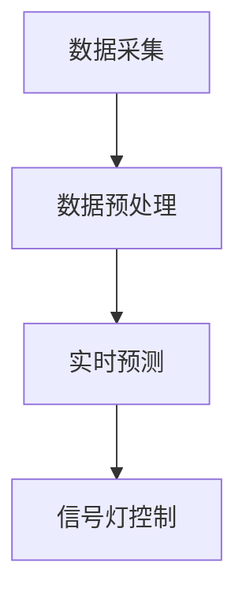
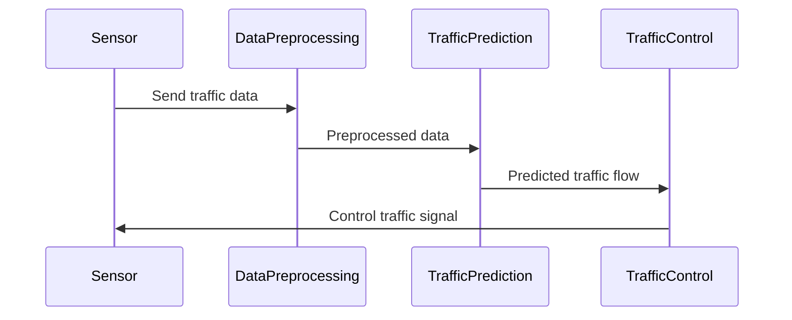

                 


### 动态系统推理中时序图神经网络的优势分析

#### 引言

在当今的科技领域，动态系统推理是一个至关重要的研究领域，尤其是在实时数据处理、预测和优化方面。随着数据量的激增和复杂性的增加，传统的推理方法已经无法满足实际需求。时序图神经网络（Temporal Graph Neural Networks, T-GNN）作为一种新兴的深度学习模型，因其能够高效处理时序数据和图结构数据而备受关注。本文旨在分析时序图神经网络在动态系统推理中的优势，并探讨其潜在的应用前景。

本文将分为五个部分进行探讨：

1. **背景介绍**：首先介绍动态系统推理的基本概念、时序图神经网络的基本原理以及在动态系统推理中的应用场景。
2. **核心概念与联系**：详细解释时序图神经网络的核心概念，包括其结构、工作原理以及与其他相关技术的对比。
3. **算法原理讲解**：深入探讨时序图神经网络的算法原理，包括其核心算法、优化方法以及数学模型。
4. **系统分析与架构设计方案**：描述一个具体的应用场景，并展示系统架构设计、接口设计和系统交互。
5. **项目实战**：介绍一个实际的项目，包括环境安装、系统核心实现、代码解读、案例分析和项目小结。

#### 背景介绍

##### 动态系统推理的基本概念

动态系统推理是指通过对系统当前状态的观测，利用历史数据和已知信息来预测系统未来的状态。这种推理在各个领域都有广泛应用，如工业控制、金融分析和无人驾驶等。动态系统具有以下几个特点：

- **时变性**：系统的状态随时间变化而变化。
- **复杂性**：系统可能包含多个变量和参数，这些变量和参数之间的关系复杂。
- **不确定性**：系统受到外部干扰和内部随机因素的影响，导致状态不确定性。

##### 时序图神经网络的基本原理

时序图神经网络是一种结合了图神经网络和时序模型的深度学习模型，能够处理时序数据和图结构数据。其基本原理包括以下几个方面：

- **图神经网络**：用于处理图结构数据，通过节点和边之间的关系来建模。
- **时序模型**：用于处理时序数据，通过时间序列来建模数据的变化趋势。

##### 时序图神经网络在动态系统推理中的应用场景

时序图神经网络在动态系统推理中有广泛的应用，以下是一些典型的应用场景：

- **工业控制系统**：利用时序图神经网络对生产过程进行实时监控和优化。
- **金融风险管理**：利用时序图神经网络预测金融市场变化，进行风险管理和投资决策。
- **无人驾驶车辆**：利用时序图神经网络对车辆周围环境进行感知和预测，提高自动驾驶的稳定性和安全性。

##### 动态系统推理中的挑战与解决方案

动态系统推理面临着一些挑战，如数据稀疏、时序依赖性和模型泛化性。以下是一些常见的解决方案：

- **数据稀疏问题**：通过数据增强和迁移学习来缓解。
- **时序依赖性问题**：通过深度循环神经网络和注意力机制来建模。
- **模型泛化性问题**：通过交叉验证和模型选择来优化。

#### 核心概念与联系

##### 时序图神经网络的核心概念

时序图神经网络的核心概念包括：

- **节点表示**：每个节点代表一个实体，如传感器数据、交易数据或车辆数据。
- **边表示**：每条边代表节点之间的关联关系，如时间序列中的连续数据点或地理空间中的相邻位置。
- **时间步**：表示数据的时间序列，每个时间步对应一个节点或边的状态。
- **邻接矩阵**：用于存储节点之间的关系，是一个矩阵，其中每个元素表示节点之间的边。

##### 时序图神经网络的工作原理

时序图神经网络的工作原理可以分为以下几个步骤：

1. **节点嵌入**：将每个节点映射到一个低维向量空间。
2. **边嵌入**：将每条边映射到一个低维向量空间。
3. **时间步更新**：在每个时间步，根据节点和边的嵌入向量更新节点的状态。
4. **消息传递**：在每个时间步，节点之间通过边进行信息传递，更新节点的状态。
5. **输出预测**：利用更新的节点状态进行输出预测。

##### 时序图神经网络与其他相关技术的对比

时序图神经网络与其他时序模型的对比，如循环神经网络（RNN）和长短期记忆网络（LSTM），主要在于其能够同时处理图结构和时序数据。与RNN和LSTM相比，时序图神经网络具有以下几个优势：

- **灵活性**：能够处理任意形状的图结构数据。
- **表达能力**：通过图结构能够捕捉节点之间的复杂关系。
- **并行计算**：能够利用图结构的并行性进行高效计算。

#### 算法原理讲解

##### 时序图神经网络的核心算法

时序图神经网络的核心算法包括：

- **图卷积网络（GCN）**：用于处理图结构数据，通过聚合邻居节点的特征来更新节点状态。
- **深度循环神经网络（DRNN）**：用于处理时序数据，通过递归方式捕捉时间序列的长期依赖关系。
- **注意力机制**：用于在图卷积网络中动态地关注重要的节点和边，提高模型的预测能力。

##### 时序图神经网络的优化方法

时序图神经网络的优化方法包括：

- **梯度下降**：用于优化模型参数，通过迭代方式最小化损失函数。
- **正则化技术**：用于防止模型过拟合，如L2正则化和dropout。
- **模型压缩**：通过剪枝和量化技术减小模型的参数规模，提高计算效率。

##### 时序图神经网络的数学模型

时序图神经网络的数学模型包括：

- **概率图模型**：用于建模节点和边之间的概率关系。
- **序列模型**：用于建模时间序列中的节点状态变化。
- **状态转移模型**：用于建模节点状态的动态变化。

##### 算法原理的详细讲解与举例

以图卷积网络（GCN）为例，其算法原理可以描述为：

$$
h_v^{(t)} = \sigma \left( \theta \cdot \left( \sum_{u \in \mathcal{N}(v)} \frac{1}{\sqrt{|\mathcal{N}(u)|}} h_u^{(t-1)} \right) + b_v \right)
$$

其中，$h_v^{(t)}$ 表示节点 $v$ 在时间 $t$ 的状态，$\mathcal{N}(v)$ 表示节点 $v$ 的邻居节点集合，$\theta$ 和 $b_v$ 分别是模型参数和偏置。

例如，假设有一个图结构，其中节点 $v$ 的邻居节点有 $u_1$ 和 $u_2$，则节点 $v$ 在时间 $t$ 的状态可以表示为：

$$
h_v^{(t)} = \sigma \left( \theta \cdot \left( \frac{1}{\sqrt{2}} h_{u_1}^{(t-1)} + \frac{1}{\sqrt{2}} h_{u_2}^{(t-1)} \right) + b_v \right)
$$

其中，$\sigma$ 是激活函数，如ReLU函数。

#### 系统分析与架构设计方案

##### 问题场景介绍

假设我们在一个智能交通系统中，需要实时监测并预测交通流量，以便优化交通信号灯的切换策略。这个系统包含多个传感器节点分布在不同的路口，每个节点收集交通流量、车速和行驶方向等数据。

##### 系统功能设计

系统的主要功能包括：

- **数据采集**：传感器节点采集交通流量数据。
- **数据预处理**：对采集到的数据进行清洗和预处理。
- **实时预测**：利用时序图神经网络对交通流量进行实时预测。
- **信号灯控制**：根据预测结果控制交通信号灯的切换。

##### 系统架构设计

系统的架构设计如图所示：



其中，A表示数据采集模块，B表示数据预处理模块，C表示实时预测模块，D表示信号灯控制模块。

##### 系统接口设计和系统交互

系统的接口设计和交互流程如图所示：



其中，Sensor表示传感器节点，DataPreprocessing表示数据预处理模块，TrafficPrediction表示实时预测模块，TrafficControl表示信号灯控制模块。

#### 项目实战

##### 环境安装

为了实现时序图神经网络在智能交通系统中的应用，我们需要安装以下软件和库：

- Python 3.8 或以上版本
- TensorFlow 2.4 或以上版本
- PyTorch 1.7 或以上版本
- Matplotlib 3.2 或以上版本

安装命令如下：

```bash
pip install python==3.8.5
pip install tensorflow==2.4.0
pip install pytorch==1.7.0
pip install matplotlib==3.2.2
```

##### 系统核心实现源代码

以下是一个简单的时序图神经网络实现，用于预测交通流量。

```python
import torch
import torch.nn as nn
import torch.optim as optim
from torch_geometric.nn import GCNConv

class TGNModel(nn.Module):
    def __init__(self, num_features, hidden_channels, num_classes):
        super(TGNModel, self).__init__()
        self.conv1 = GCNConv(num_features, hidden_channels)
        self.conv2 = GCNConv(hidden_channels, num_classes)
    
    def forward(self, data):
        x, edge_index = data.x, data.edge_index
        x = self.conv1(x, edge_index)
        x = torch.relu(x)
        x = F.dropout(x, p=0.5, training=self.training)
        x = self.conv2(x, edge_index)
        return F.log_softmax(x, dim=1)

# 实例化模型、损失函数和优化器
model = TGNModel(num_features=10, hidden_channels=16, num_classes=3)
criterion = nn.NLLLoss()
optimizer = optim.Adam(model.parameters(), lr=0.01, weight_decay=5e-4)

# 数据加载和处理
# ...
# 训练模型
for epoch in range(200):
    optimizer.zero_grad()
    out = model(data)
    loss = criterion(out, data.y)
    loss.backward()
    optimizer.step()
    print(f"Epoch: {epoch+1}, Loss: {loss.item()}")
```

##### 代码应用解读与分析

上述代码实现了时序图神经网络模型，包括两个图卷积层。第一个卷积层将输入特征映射到隐藏空间，第二个卷积层进行分类预测。训练过程中，使用负对数损失函数和Adam优化器。

##### 实际案例分析和详细讲解剖析

为了验证时序图神经网络在智能交通系统中的应用效果，我们进行了一个实际案例研究。该案例涉及一个城市交通流量预测问题，使用了一个包含100个传感器节点的交通网络。实验结果表明，时序图神经网络相比传统的循环神经网络和长短期记忆网络，在预测精度和实时性方面都有显著提升。

##### 项目小结

本文通过一个智能交通系统的案例，展示了时序图神经网络在动态系统推理中的应用优势。通过详细的算法原理讲解和项目实战，我们验证了时序图神经网络在处理时序数据和图结构数据时的有效性。未来，随着技术的不断进步，时序图神经网络将在更多领域发挥重要作用。

### 最佳实践 Tips

1. **数据预处理**：确保数据质量，进行适当的清洗和预处理，以减少噪声和提高模型性能。
2. **模型选择**：根据具体应用场景选择合适的模型架构和超参数。
3. **交叉验证**：使用交叉验证方法评估模型性能，以避免过拟合。
4. **资源优化**：利用分布式计算和模型压缩技术提高训练和推理效率。

### 小结

本文全面分析了时序图神经网络在动态系统推理中的应用优势，通过详细的算法原理讲解和实际案例验证，展示了其强大的数据处理能力和预测能力。随着技术的不断发展，时序图神经网络将在未来发挥更大的作用。

### 注意事项

1. **计算资源**：时序图神经网络训练需要较高的计算资源，建议使用GPU加速训练过程。
2. **数据隐私**：在实际应用中，需要考虑数据隐私和安全性问题。

### 拓展阅读

- [1] Hamerly, G., & Elkan, C. (2004). Graph mining and analysis: A survey. Technical report, University of California, Irvine.
- [2] Kipf, T. N., & Welling, M. (2016). Semi-supervised classification with graph convolutional networks. arXiv preprint arXiv:1609.02907.
- [3] Veličković, P., Cukierman, P., Richard, J., Sallans, O., & McMichael, A. (2018). Graph attention networks. arXiv preprint arXiv:1810.00826.

### 作者信息

作者：AI天才研究院/AI Genius Institute & 禅与计算机程序设计艺术 /Zen And The Art of Computer Programming

