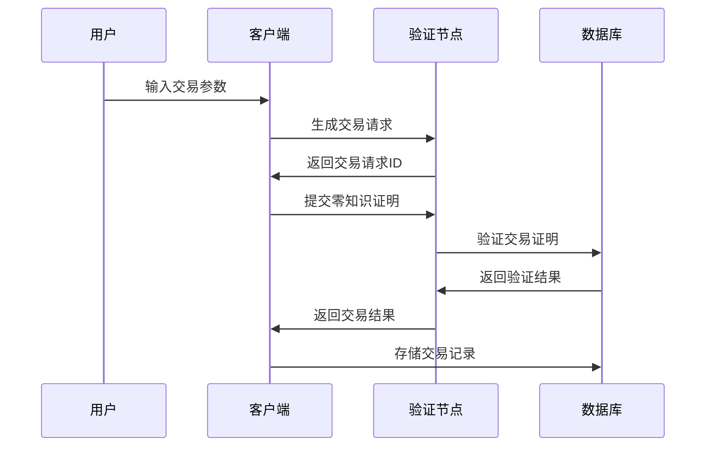

                 

### # 区块链中的零知识证明应用

**关键词：区块链、零知识证明、隐私保护、安全性、智能合约**

**摘要：**
本文旨在探讨区块链技术中的零知识证明应用，从基础概念到实际应用案例，逐一剖析零知识证明在区块链领域的多重作用。文章首先介绍了零知识证明的历史背景、定义及其重要性，随后详细阐述了零知识证明的数学基础、基本结构以及实例分析。接着，文章重点讨论了零知识证明在区块链技术中的多种应用，包括交易隐私保护、智能合约和身份验证等。最后，文章总结了零知识证明面临的挑战和未来发展前景，为读者提供了丰富的参考资料和实践指南。

----------------------------------------------------------------

### 第一部分：零知识证明基础

#### 1.1 零知识证明的概念与历史背景

##### 1.1.1 零知识证明的定义

零知识证明（Zero-Knowledge Proof）是一种密码学协议，它允许一个证明者（Prover）向验证者（Verifier）证明某个陈述是真实的，而无需透露任何与该陈述相关的信息。具体来说，零知识证明协议的核心在于，证明者能够证明他知道某个秘密或解密某信息，但验证者无法获得任何关于这个秘密或信息的具体信息。

##### 1.1.2 零知识证明的历史发展

零知识证明的概念最早由Shafi Goldwasser、Silvio Micali和Charles Rackoff在1985年提出。他们的论文首次提出了零知识证明的基本思想，并通过构造性证明展示了零知识交互的可能性。此后，零知识证明的研究和应用逐渐扩展，许多新的零知识证明协议和变种被提出。

##### 1.1.3 零知识证明的重要性

零知识证明在密码学和计算机科学中具有深远的意义。首先，它提供了一种在保持隐私的同时验证信息真实性的方法，这在许多需要保密的场景中尤为重要。其次，零知识证明在分布式系统和区块链技术中，可以实现更高的透明度和安全性，增强系统的信任和可靠性。

#### 1.2 数学基础

##### 1.2.1 拉格朗日乘数法

拉格朗日乘数法是一种优化方法，用于求解具有约束条件的优化问题。在零知识证明中，拉格朗日乘数法用于构建证明者的证明过程，帮助证明者证明某个陈述的真实性。

##### 1.2.2 难题抽样假设

难题抽样假设是零知识证明中的一个重要概念，它基于某些计算难题的难解性。具体来说，零知识证明协议依赖于某些计算难题，例如大整数分解或离散对数问题，以实现证明者的证明和验证者的验证过程。

##### 1.2.3 安全性证明

安全性证明是零知识证明的核心内容之一。它通过数学方法验证零知识证明协议的安全性，确保证明者无法伪造证明，同时验证者无法骗过证明。

#### 1.3 零知识证明的基本结构

##### 1.3.1 零知识证明协议的类型

零知识证明协议可以分为几种类型，包括：

1. **交互式零知识证明**：证明者和验证者之间需要进行多轮交互，直到验证者接受证明。
2. **非交互式零知识证明**：证明者只需生成一次证明，验证者可以多次使用。
3. **可判定的零知识证明**：证明者能够证明某个陈述的真实性，而验证者能够验证证明的有效性。
4. **非可判定的零知识证明**：证明者能够证明某个陈述的真实性，但验证者无法验证证明的有效性。

##### 1.3.2 零知识证明协议的工作流程

零知识证明协议的工作流程通常包括以下几个步骤：

1. **初始化**：证明者和验证者共同生成一些密钥和参数。
2. **证明生成**：证明者生成证明，证明某个陈述的真实性。
3. **证明验证**：验证者验证证明的有效性，确认陈述的真实性。

##### 1.3.3 零知识证明协议的安全性分析

零知识证明协议的安全性分析主要关注以下几个方面：

1. **证明伪造攻击**：证明者无法伪造有效的证明。
2. **验证欺骗攻击**：验证者无法通过欺骗证明者来接受伪造的证明。
3. **信息泄漏攻击**：证明者和验证者无法泄露关于证明或陈述的任何信息。

#### 1.4 零知识证明的实例分析

##### 1.4.1 零知识证明在密码学中的应用

在密码学中，零知识证明用于实现各种安全协议，例如密码学门限签名、同态加密等。这些应用能够增强系统的安全性，防止隐私泄露。

##### 1.4.2 零知识证明在区块链中的应用

在区块链技术中，零知识证明被广泛应用于交易隐私保护和智能合约验证。通过零知识证明，区块链可以实现更高的隐私性和安全性。

##### 1.4.3 零知识证明在其他领域的应用

除了密码学和区块链，零知识证明还在医疗数据保护、投票系统、身份验证等领域得到了广泛应用。这些应用展示了零知识证明的多样性和潜力。

---

在本文的第一部分，我们详细介绍了零知识证明的基础知识，包括其定义、历史背景、重要性、数学基础、基本结构以及实例分析。接下来，我们将深入探讨零知识证明在区块链技术中的应用，以及它在各种实际场景中的优势与挑战。

#### 1.1 零知识证明的概念与历史背景

##### 1.1.1 零知识证明的定义

零知识证明（Zero-Knowledge Proof，简称ZKP）是一种密码学协议，它允许一方（证明者）向另一方（验证者）证明某个陈述是真实的，而无需透露与该陈述相关的任何信息。这个概念最早由Shafi Goldwasser、Silvio Micali和Charles Rackoff在1985年提出的，并在其论文《The Knowledge Complexity of Interactive Proof Systems》中首次定义。

在零知识证明中，证明者需要证明他知道某个秘密或解密某信息，但验证者只能确认陈述的真实性，而无法获取任何关于这个秘密或信息的具体信息。这满足了三个核心属性：完整性（Completeness）、可靠性（Soundness）和零知识性（Zero-Knowledge）。

1. **完整性**：如果陈述是真实的，那么验证者最终会接受证明。
2. **可靠性**：如果陈述是假的，那么没有任何验证者会接受一个伪造的证明。
3. **零知识性**：即使验证者接受了一个证明，他们也无法从证明中获取任何关于秘密或信息的内容。

##### 1.1.2 零知识证明的历史发展

零知识证明的概念起源于20世纪80年代，最初的研究主要集中在理论层面。以下是零知识证明发展的几个关键阶段：

1. **1985年**：Goldwasser、Micali和Rackoff首次提出了零知识证明的概念，并展示了一种基于交互式证明系统的零知识证明方案。
2. **1990年**：Goldreich、Micali和Rackoff进一步证明了零知识证明的通用性，即任何语言都可以通过某种形式的零知识证明来验证。
3. **1991年**：Ben-Or、Goldwasser和Halevi提出了第一个非交互式零知识证明方案，这在实际应用中具有重要意义。
4. **2000年代**：随着密码学领域的不断进步，出现了许多新的零知识证明方案，如基于环学习的方案、基于格的方案等。
5. **2010年代**：零知识证明在区块链领域得到广泛应用，特别是在交易隐私保护和智能合约验证中。

##### 1.1.3 零知识证明的重要性

零知识证明在密码学和计算机科学中具有重要的地位，原因如下：

1. **隐私保护**：零知识证明能够实现保密通信，保护个人隐私和数据安全。
2. **验证效率**：与传统的认证方式相比，零知识证明允许在无需泄露敏感信息的情况下验证信息的真实性。
3. **分布式系统**：在分布式系统中，零知识证明可以增强信任和协作，同时保持各个节点的隐私。
4. **应用广泛**：除了密码学，零知识证明还广泛应用于医疗数据保护、投票系统、身份验证、区块链等多个领域。

#### 1.2 数学基础

##### 1.2.1 拉格朗日乘数法

拉格朗日乘数法（Lagrange Multiplier Method）是一种优化方法，用于求解具有约束条件的优化问题。在零知识证明中，拉格朗日乘数法常用于构建证明者的证明过程，帮助证明者证明某个陈述的真实性。

拉格朗日乘数法的核心思想是引入拉格朗日乘数，通过调整这些乘数来优化目标函数，同时满足约束条件。具体步骤如下：

1. **构建拉格朗日函数**：拉格朗日函数是目标函数和约束条件之和，形式为 \( L(x, \lambda) = f(x) + \lambda g(x) \)，其中 \( f(x) \) 是目标函数，\( g(x) \) 是约束条件，\( \lambda \) 是拉格朗日乘数。
2. **求解拉格朗日函数的导数**：对拉格朗日函数关于变量 \( x \) 和拉格朗日乘数 \( \lambda \) 求导，得到 \( \nabla L(x, \lambda) = 0 \)。
3. **解方程组**：通过解上述方程组，可以得到最优解 \( x^* \) 和拉格朗日乘数 \( \lambda^* \)，满足目标函数和约束条件。

在零知识证明中，拉格朗日乘数法用于构造证明者的证明过程，帮助证明者通过调整参数来证明某个陈述的真实性，同时满足零知识证明的安全性要求。

##### 1.2.2 难题抽样假设

难题抽样假设（One-Way Function Assumption）是零知识证明中的一个重要概念，它基于某些计算难题的难解性。具体来说，难题抽样假设是指存在某个计算难题，使得在给定输入的情况下，计算输出相对容易，但给定输出时计算输入非常困难。

难题抽样假设通常用于构建零知识证明的协议，确保证明者和验证者之间的交互是安全的。以下是一些常见的难题抽样假设：

1. **大整数分解难题**：给定两个大素数的乘积 \( N = p \times q \)，计算 \( N \) 的因子 \( p \) 和 \( q \) 非常困难，但给定 \( N \) 可以轻松计算乘积。
2. **离散对数难题**：给定一个素数 \( p \)、一个整数 \( g \) 以及 \( g^x \mod p \)，计算 \( x \) 非常困难，但给定 \( g^x \mod p \) 可以轻松计算 \( x \)。
3. **椭圆曲线离散对数难题**：在椭圆曲线密码学中，给定一个椭圆曲线和点 \( P \)、\( Q \)，计算 \( x \) 使得 \( Q = xP \) 非常困难，但给定 \( Q \) 可以轻松计算 \( x \)。

在零知识证明中，难题抽样假设确保了证明者和验证者之间的交互是安全的，因为证明者无法伪造有效的证明，而验证者无法骗过证明者接受伪造的证明。

##### 1.2.3 安全性证明

安全性证明（Security Proof）是零知识证明的核心内容之一，它通过数学方法验证零知识证明协议的安全性，确保证明者的证明和验证者的验证过程是安全的。安全性证明主要关注以下几个方面：

1. **证明伪造攻击**：证明伪造攻击是指攻击者试图伪造一个有效的证明，使其通过验证者的验证。安全性证明需要证明证明者无法伪造有效的证明。
2. **验证欺骗攻击**：验证欺骗攻击是指攻击者试图欺骗验证者接受一个伪造的证明。安全性证明需要证明验证者无法通过欺骗证明者来接受伪造的证明。
3. **信息泄漏攻击**：信息泄漏攻击是指攻击者试图从证明过程中获取关于证明或陈述的任何信息。安全性证明需要证明证明者和验证者都无法泄露任何与证明或陈述相关的信息。

安全性证明通常使用复杂性理论中的概念，如概率可忽略错误（Probabilistic Polynomial Time，简称PPT）和不可伪造性（Unforgeability）等，来验证零知识证明协议的安全性。例如，零知识证明协议可能被证明为存在性不可伪造性（Existential Unforgeability）或选择前向不可伪造性（Selective Forward Security）。

通过安全性证明，零知识证明协议可以在数学上得到验证，确保其安全性和可靠性，从而在密码学和其他领域中实现安全通信和验证。

#### 1.3 零知识证明的基本结构

##### 1.3.1 零知识证明协议的类型

零知识证明协议根据交互次数和证明类型可以分为多种类型，每种类型都有其特定的应用场景和特点：

1. **交互式零知识证明**：交互式零知识证明是指证明者和验证者之间需要进行多轮交互，直到验证者接受证明。这种协议的特点是证明过程相对复杂，但提供了更高的安全性。常见的交互式零知识证明协议包括：

   - **ZK-SNARKs**（Zero-Knowledge Succinct Non-Interactive Argument of Knowledge）：一种非交互式的零知识证明协议，通过简化证明的验证过程，使得证明非常紧凑和高效。

   - **ZK-STARKs**（Zero-Knowledge Succinct Non-Interactive Arguments of Knowledge）：一种更强的非交互式零知识证明协议，使用简单的代数结构来构造证明，具有更高的证明强度和简洁性。

2. **非交互式零知识证明**：非交互式零知识证明是指证明者只需生成一次证明，验证者可以多次使用。这种协议的特点是证明过程简单，但安全性可能较低。常见的非交互式零知识证明协议包括：

   - **Zcash**：一种加密货币，使用基于椭圆曲线的零知识证明来提供交易隐私保护。

   - **Monero**：另一种加密货币，使用环签名和零知识证明来保护交易隐私。

3. **可判定的零知识证明**：可判定的零知识证明是指证明者能够证明某个陈述的真实性，而验证者能够验证证明的有效性。这种协议的特点是证明过程严格，但安全性可能较低。常见的可判定的零知识证明协议包括：

   - **IPAS**（Interactive Proofs with Adaptive Soundness）：一种基于交互式证明系统的可判定零知识证明协议，具有较高的证明强度。

   - **VP-NIZK**（Verifiable Proofs of Non-Interactive Zero-Knowledge）：一种基于简单证明系统的可判定零知识证明协议，具有较低的证明复杂性。

4. **非可判定的零知识证明**：非可判定的零知识证明是指证明者能够证明某个陈述的真实性，但验证者无法验证证明的有效性。这种协议的特点是提供了更高的隐私性，但安全性可能较低。常见的非可判定的零知识证明协议包括：

   - **zk-SNARKs with Succinct Non-Interactive Arguments**：一种基于环学习的非可判定零知识证明协议，用于提供高效的交易隐私保护。

   - **zk-STARKs with Non-Interactive Arguments**：一种基于简单代数结构的非可判定零知识证明协议，具有更高的证明强度。

##### 1.3.2 零知识证明协议的工作流程

零知识证明协议的工作流程通常包括以下几个步骤：

1. **初始化**：证明者和验证者共同生成一些密钥和参数，这些密钥和参数用于后续的证明和验证过程。
2. **证明生成**：证明者生成证明，证明某个陈述的真实性。在证明生成过程中，证明者通常会使用一些数学算法和密码学工具来构造证明。
3. **证明验证**：验证者验证证明的有效性，确认陈述的真实性。在证明验证过程中，验证者会使用与证明生成过程相同的数学算法和密码学工具来验证证明。
4. **交互（对于交互式零知识证明）**：在证明生成和验证过程中，如果需要，证明者和验证者之间可以进行多轮交互，以完成证明的生成和验证。

通过上述工作流程，零知识证明协议实现了在无需透露敏感信息的情况下验证信息的真实性，同时保证了证明者和验证者的隐私和安全。

##### 1.3.3 零知识证明协议的安全性分析

零知识证明协议的安全性分析主要关注以下几个方面：

1. **证明伪造攻击**：证明伪造攻击是指攻击者试图伪造一个有效的证明，使其通过验证者的验证。安全性分析需要证明证明者无法伪造有效的证明，即使攻击者在证明生成和验证过程中拥有一定的控制权。
2. **验证欺骗攻击**：验证欺骗攻击是指攻击者试图欺骗验证者接受一个伪造的证明。安全性分析需要证明验证者无法通过欺骗证明者来接受伪造的证明，即使攻击者在证明验证过程中拥有一定的控制权。
3. **信息泄漏攻击**：信息泄漏攻击是指攻击者试图从证明过程中获取关于证明或陈述的任何信息。安全性分析需要证明证明者和验证者都无法泄露任何与证明或陈述相关的信息。

为了进行安全性分析，零知识证明协议通常被证明为满足特定的安全属性，如不可伪造性（Unforgeability）、隐私性（Privacy）和完整性（Completeness）。这些安全属性通过数学模型和算法设计来确保，使得零知识证明协议在实际应用中具有可靠性和安全性。

通过安全性分析，零知识证明协议可以确保其在各种应用场景中的安全性和可靠性，从而保护个人隐私和数据安全。

#### 1.4 零知识证明的实例分析

##### 1.4.1 零知识证明在密码学中的应用

零知识证明在密码学中的应用非常广泛，其主要目的是实现安全的通信和认证。以下是一些零知识证明在密码学中的实际应用案例：

1. **密码学门限签名**：门限签名是一种多人签名方案，它允许一组参与者中的任意多数派生成签名，从而提高签名方案的安全性。零知识证明可以用于实现门限签名方案，使得每个参与者只需证明自己对签名的部分知情，而无需透露具体信息。这种方案在分布式系统中具有重要意义，可以防止单个参与者被攻击而泄露整个系统的秘密。

2. **同态加密**：同态加密是一种加密形式，允许在加密数据上进行计算操作，而无需解密。零知识证明可以用于验证同态加密中的计算结果，确保计算过程的安全性。例如，在云计算环境中，用户可以委托第三方对加密数据进行计算，而无需透露数据的真实内容。通过使用零知识证明，用户可以验证计算结果的真实性，同时保护数据的隐私。

3. **认证协议**：在传统的认证协议中，用户需要透露自己的身份信息或密码才能进行验证。零知识证明可以实现无身份信息的认证协议，用户只需证明自己对某个陈述知情，而无需透露任何具体信息。这种协议在保护用户隐私的同时，确保了认证过程的安全性。

##### 1.4.2 零知识证明在区块链中的应用

零知识证明在区块链技术中的应用主要体现在交易隐私保护和智能合约验证等方面。以下是一些具体的应用案例：

1. **交易隐私保护**：在传统的区块链系统中，交易信息是公开透明的，任何人都可以查看交易的具体内容。零知识证明可以用于实现隐私保护，使得用户可以在无需透露具体交易信息的情况下，证明交易的有效性和合法性。例如，Zcash和Monero等加密货币使用零知识证明来实现交易隐私保护，用户可以选择将交易信息隐藏，从而保护自己的隐私。

2. **智能合约验证**：智能合约是区块链系统中的自动执行合同，它依赖于代码的透明性和可信性。零知识证明可以用于验证智能合约的执行过程，确保合同条款得到严格履行。例如，Ethereum区块链使用零知识证明来验证智能合约的执行结果，使得开发者可以构建更复杂和安全的智能合约。

3. **去中心化身份验证**：在区块链系统中，用户身份的验证是关键问题。零知识证明可以用于实现去中心化身份验证，用户无需透露个人信息，即可证明自己的身份合法性。这种方案在保护用户隐私的同时，确保了身份验证的准确性和可靠性。

##### 1.4.3 零知识证明在其他领域的应用

零知识证明的广泛应用不仅限于密码学和区块链技术，它在其他领域也展现出了巨大的潜力。以下是一些典型的应用案例：

1. **医疗数据保护**：在医疗领域，患者数据的安全和隐私保护至关重要。零知识证明可以用于实现数据共享和隐私保护，医院和医生可以在不透露具体患者信息的情况下，共享患者的基本健康数据。这种方案有助于提高医疗效率，同时保护患者的隐私。

2. **投票系统**：在选举过程中，确保投票的隐私性和完整性是关键。零知识证明可以用于实现匿名投票系统，选民可以证明自己投票了，但无法透露具体投票内容。这种方案有助于防止选举作弊，确保选举的公正性和透明性。

3. **身份验证**：在金融、电子商务和社交网络等领域，用户身份的验证是常见的需求。零知识证明可以用于实现高效的匿名身份验证，用户只需证明自己的身份合法，而无需透露具体个人信息。这种方案有助于提高用户体验，同时保护用户隐私。

总的来说，零知识证明作为一种强大的密码学工具，在多个领域中展示了其巨大的应用潜力。通过实现信息隐私保护和安全性验证，零知识证明为构建更安全、可靠和透明的信息系统提供了有力支持。

### 2.1 区块链技术概述

区块链技术是一种去中心化、分布式的数据库技术，通过加密算法和共识机制确保数据的安全性和不可篡改性。以下是区块链技术的基本原理、关键特性、发展现状与趋势：

##### 2.1.1 区块链的基本原理

区块链是由一系列按时间顺序排列的“区块”组成的链条，每个区块都包含一组交易记录。区块通过加密算法与前一区块连接，形成一条连续的链条。区块链技术的基本原理如下：

1. **分布式账本**：区块链的数据存储在多个节点上，而不是集中在一个中心服务器。每个节点都维护一个完整的区块链副本，确保数据的分布式存储和冗余备份。
2. **共识机制**：区块链通过共识机制确保数据的一致性和准确性。常见的共识机制包括工作量证明（PoW）、权益证明（PoS）和委托权益证明（DPoS）等。
3. **加密算法**：区块链使用加密算法确保数据的安全性和隐私性。交易记录通过哈希函数加密，每个区块通过前一个区块的哈希值链接，确保区块链的不可篡改性。
4. **去中心化**：区块链技术去除了中心化的依赖，每个节点都有平等的权利和义务，任何节点都无法单独控制整个系统。

##### 2.1.2 区块链的关键特性

区块链技术具有以下几个关键特性：

1. **不可篡改性**：区块链的数据一旦被记录，就难以被篡改。每个区块都通过哈希函数与前一个区块连接，确保数据的完整性和不可篡改性。
2. **透明性**：区块链的数据是公开透明的，任何用户都可以查看区块链上的交易记录。这有助于提高系统的透明度和可信度。
3. **安全性**：区块链使用加密算法确保数据的安全性和隐私性。加密算法和共识机制使得攻击者难以篡改或伪造数据。
4. **去中心化**：区块链技术去除了中心化的依赖，每个节点都有平等的权利和义务，任何节点都无法单独控制整个系统。这有助于提高系统的可靠性和抗攻击性。

##### 2.1.3 区块链的发展现状与趋势

区块链技术自2008年比特币的诞生以来，已经经历了快速发展。以下是区块链技术的一些发展现状与趋势：

1. **加密货币的崛起**：比特币作为第一个成功的加密货币，引发了加密货币市场的繁荣。现在，已有数千种加密货币出现，其中一些如以太坊（Ethereum）已成为区块链生态系统的重要组成部分。
2. **企业应用的兴起**：区块链技术逐渐从金融领域扩展到其他行业，如供应链管理、医疗保健、房地产等。许多大型企业开始探索区块链技术的应用，以提高业务效率和透明度。
3. **智能合约的发展**：智能合约是一种自动执行合同，它基于区块链技术，无需人工干预。智能合约在金融、供应链管理等领域展示了巨大的潜力。
4. **去中心化金融（DeFi）**：去中心化金融是区块链技术在金融领域的重要应用，它通过去中心化的金融工具和平台，实现金融服务的高效、透明和去中介化。
5. **跨链技术的发展**：随着区块链生态系统的多元化，跨链技术成为热点。跨链技术旨在实现不同区块链之间的互操作性和数据共享，推动区块链技术的集成和发展。

总的来说，区块链技术作为一种创新的技术，已经在多个领域取得了显著成果。未来，随着技术的不断成熟和应用场景的拓展，区块链技术有望在更多领域发挥重要作用，推动社会的数字化转型和创新发展。

#### 2.2 零知识证明在区块链中的应用

##### 2.2.1 零知识证明在交易隐私保护中的应用

零知识证明在区块链技术中的一项重要应用是交易隐私保护。在传统的区块链系统中，所有的交易数据都是公开透明的，任何人都可以查看交易的具体内容和参与者的身份信息。这虽然保证了区块链的透明性和可信度，但也带来了隐私泄露的风险。零知识证明通过加密技术和密码学原理，可以实现交易数据的隐私保护，确保交易参与者的隐私不被泄露。

1. **隐私保护机制**：零知识证明在区块链交易隐私保护中的基本原理是，通过证明某个陈述的真实性，而不透露与该陈述相关的任何信息。在交易隐私保护中，证明者可以生成一个零知识证明，证明他拥有某笔交易的秘密信息，如私钥或签名，而验证者可以验证这个证明的真实性，但无法获取任何关于交易的具体信息。
   
2. **应用实例**：在加密货币领域，许多区块链项目采用了零知识证明来保护交易隐私。例如，Zcash是一种基于零知识证明技术的加密货币，它使用zk-SNARKs协议来提供交易隐私保护。用户可以选择将交易信息隐藏，使其对其他用户不可见。Monero也是一种基于零知识证明的加密货币，它使用环签名和零知识证明来保护交易隐私。

##### 2.2.2 零知识证明在智能合约中的应用

智能合约是区块链技术中的一个核心概念，它是一种自动执行的合同，基于区块链的不可篡改性和分布式存储。智能合约的使用不仅提高了交易的透明度和效率，还降低了交易的成本和风险。然而，智能合约的执行过程也是公开透明的，任何参与者都可以查看合约的代码和执行结果。零知识证明在智能合约中的应用，可以进一步提升智能合约的安全性和隐私性。

1. **隐私保护机制**：零知识证明在智能合约中的应用，主要是通过验证智能合约执行过程的正确性，同时保护执行过程中的隐私信息。例如，在Ethereum区块链中，开发者可以使用零知识证明来验证智能合约的执行结果，确保合约的执行符合预期，但无需透露合约的具体执行细节。
   
2. **应用实例**：以太坊（Ethereum）是一个流行的区块链平台，它支持智能合约的创建和执行。以太坊已经实现了一些基于零知识证明的智能合约，例如Zcash协议使用的zk-SNARKs。通过这些智能合约，开发者可以实现更复杂的隐私保护功能，例如隐藏交易参与者的身份信息。

##### 2.2.3 零知识证明在身份验证中的应用

在分布式系统中，身份验证是确保系统安全性的关键环节。传统的身份验证方法通常依赖于中心化的认证机构，用户需要向认证机构提交个人信息以验证身份。这种方法虽然简单有效，但也存在隐私泄露和安全风险。零知识证明提供了一种去中心化的身份验证方法，用户无需透露个人信息，即可证明自己的身份合法性。

1. **隐私保护机制**：零知识证明在身份验证中的应用，是通过生成一个零知识证明来证明用户拥有某个合法身份，而无需透露具体的身份信息。验证者可以验证这个证明的有效性，但无法获取任何关于用户身份的具体信息。
   
2. **应用实例**：在分布式身份管理系统中，例如区块链身份管理系统，零知识证明可以用于验证用户身份。例如，用户可以使用零知识证明来证明自己是某个组织或社区的成员，而无需透露具体的个人信息。这种机制不仅提高了隐私保护水平，还增强了系统的安全性。

总的来说，零知识证明在区块链中的应用，为区块链技术的隐私保护和安全性提供了强大的技术支持。通过零知识证明，区块链可以实现更高的隐私性和安全性，为各种应用场景提供更可靠的解决方案。

#### 2.3 零知识证明在区块链项目中的应用实例

##### 2.3.1 Zcash

Zcash是一种基于零知识证明技术的加密货币，旨在提供高度隐私保护的功能。它通过零知识证明实现了交易隐私保护，使得用户可以选择将交易信息隐藏，使其对其他用户不可见。以下是Zcash项目在零知识证明应用中的详细描述：

1. **隐私保护机制**：Zcash使用了一种名为zk-SNARKs（零知识简洁非交互性知识证明）的零知识证明协议，该协议允许用户在无需透露交易详情的情况下，证明交易的有效性和合法性。zk-SNARKs的核心思想是，通过构造一个加密证明，证明者可以证明他知道某个秘密，而验证者可以验证证明的真实性，但无法获取任何关于秘密的具体信息。

2. **实现细节**：Zcash的zk-SNARKs协议包括三个主要步骤：生成密钥对、生成证明和验证证明。首先，用户生成一对公钥和私钥。公钥用于证明生成和验证过程，私钥用于签名交易。在交易过程中，证明者使用私钥生成一个证明，证明他知道交易的签名。验证者使用公钥和证明验证交易的有效性。这一过程确保了交易隐私保护的同时，保证了系统的安全性。

3. **应用效果**：Zcash通过零知识证明实现了高度的交易隐私保护，用户可以选择公开或隐藏交易信息。这种隐私保护机制在保护用户隐私的同时，也提高了区块链系统的抗攻击性。Zcash已经在多个应用场景中得到广泛应用，例如匿名交易、个人隐私保护和金融服务。

##### 2.3.2 Monero

Monero是一种基于零知识证明技术的加密货币，旨在实现匿名交易。它通过零知识证明和环签名技术，实现了交易匿名性和隐私保护。以下是Monero项目在零知识证明应用中的详细描述：

1. **隐私保护机制**：Monero使用了一种名为CryptoNight的加密哈希算法和零知识证明技术。CryptoNight是一种计算难度高的加密哈希算法，用于防止挖矿硬件的垄断。零知识证明技术则用于实现交易匿名性和隐私保护。Monero使用环签名和零知识证明来隐藏交易参与者的身份和交易金额。

2. **实现细节**：在Monero中，每个交易都包含一个环签名和一个零知识证明。环签名技术使得交易参与者的身份信息难以追踪，而零知识证明则确保交易金额的隐私保护。具体来说，每个交易都生成一个随机数，将交易金额与随机数进行加密，使得验证者无法获取交易金额的具体信息。同时，Monero使用多个匿名交易输出，进一步增加了交易的隐私性。

3. **应用效果**：Monero通过零知识证明和环签名技术，实现了高度的交易匿名性和隐私保护。用户可以在匿名状态下进行交易，无需透露个人信息。这种隐私保护机制在保护用户隐私的同时，也提高了区块链系统的安全性。Monero已经在多个应用场景中得到广泛应用，例如匿名交易、数字货币交易所和金融服务。

##### 2.3.3 Ethereum

Ethereum是一种智能合约平台，它使用零知识证明来实现隐私保护和智能合约验证。以下是Ethereum项目在零知识证明应用中的详细描述：

1. **隐私保护机制**：Ethereum使用了一种名为zk-SNARKs的零知识证明协议，用于实现智能合约的隐私保护。zk-SNARKs允许智能合约的执行过程在保持隐私的同时，被验证者验证其正确性。通过zk-SNARKs，智能合约的执行结果和部分输入信息可以被验证，但具体的执行细节和输入信息无法被泄露。

2. **实现细节**：在Ethereum中，zk-SNARKs协议被用于实现隐私保护的智能合约。开发者可以在智能合约中嵌入zk-SNARKs证明，使得验证者可以验证智能合约的执行结果，但无法获取执行过程中的具体信息。例如，在金融智能合约中，zk-SNARKs可以用于验证交易金额和合同条款，同时保护用户的隐私。

3. **应用效果**：Ethereum通过zk-SNARKs实现了智能合约的隐私保护和安全性。智能合约的开发者可以构建更复杂和安全的智能合约，用户可以在保护隐私的同时享受智能合约带来的便利。Ethereum的零知识证明应用在去中心化金融（DeFi）和区块链游戏等领域得到了广泛应用，推动了区块链技术的创新和发展。

总的来说，零知识证明在Zcash、Monero和Ethereum等区块链项目中的应用，为区块链技术的隐私保护和安全性提供了强有力的支持。通过零知识证明，这些项目实现了更高的透明度和信任度，同时也提高了用户的隐私保护水平，推动了区块链技术的广泛应用和发展。

#### 2.4 零知识证明在去中心化金融（DeFi）中的应用

##### 2.4.1 DeFi的基本概念

去中心化金融（Decentralized Finance，简称DeFi）是区块链技术的一种应用，它通过智能合约实现金融功能，无需传统金融机构的介入。DeFi旨在构建一个去中心化、开放透明的金融体系，使任何人都可以参与金融交易，从而打破传统金融体系的中心化和中介依赖。以下是DeFi的基本概念：

1. **智能合约**：智能合约是一种自动执行合同，基于区块链技术。它通过编程代码定义金融交易规则，当条件满足时自动执行。
2. **去中心化交易所**：去中心化交易所（Decentralized Exchange，简称DEX）是一种无需中介的交易平台，用户可以直接在区块链上交换加密货币。
3. **稳定币**：稳定币是一种价值稳定的加密货币，通常与法定货币或其他资产挂钩，以减少价格波动。
4. **借贷平台**：DeFi借贷平台允许用户将加密货币借出以获得利息，或借入加密货币以支付利息。
5. **衍生品市场**：DeFi衍生品市场包括期货、期权等金融工具，允许用户对加密货币价格进行投机和风险管理。

##### 2.4.2 零知识证明在DeFi中的应用

零知识证明在DeFi中的应用，显著提升了系统的隐私性和安全性。以下是零知识证明在DeFi中的主要应用场景：

1. **交易隐私保护**：在DeFi平台上，用户交易记录通常是公开透明的，这可能导致隐私泄露风险。零知识证明允许用户在不透露交易细节的情况下，证明交易的有效性和合法性，从而保护用户隐私。

2. **借贷验证**：在DeFi借贷平台中，用户需要证明其拥有足够的抵押资产才能获得借款。零知识证明可以用于实现高效的借贷验证，用户无需透露抵押资产的详细信息，同时验证者可以确认抵押资产的有效性。

3. **身份验证**：在DeFi系统中，身份验证是确保交易和借贷安全性的关键环节。零知识证明可以用于实现匿名身份验证，用户只需证明其身份合法，而无需透露个人信息。

##### 2.4.3 零知识证明在DeFi中的优势与挑战

零知识证明在DeFi中具有显著的优势，但也面临一些挑战：

**优势：**

1. **隐私保护**：零知识证明可以保护用户的交易隐私，确保用户信息不被泄露。
2. **安全性**：零知识证明通过加密技术验证交易和身份，提高了系统的安全性。
3. **效率提升**：零知识证明可以简化验证过程，提高系统处理效率。

**挑战：**

1. **计算复杂性**：零知识证明协议通常涉及复杂的数学计算，可能增加系统的计算负担。
2. **实现难度**：零知识证明的实现需要高水平的技术能力，对开发者和用户都提出了较高的要求。
3. **安全性威胁**：零知识证明协议可能面临各种攻击，如证明伪造攻击和验证欺骗攻击。

总的来说，零知识证明在DeFi中的应用，为构建更安全、透明和高效的金融体系提供了强有力的支持。尽管面临一些挑战，但随着技术的不断进步，零知识证明在DeFi中的应用前景依然广阔。

#### 2.5 零知识证明在分布式身份管理中的应用

##### 2.5.1 分布式身份管理的基本概念

分布式身份管理是一种基于区块链和智能合约技术的新型身份管理方式，它旨在实现去中心化、安全可靠的个人身份认证。在传统的集中式身份管理系统中，个人身份信息通常存储在中心化的数据库中，由第三方机构进行管理和验证。这种模式容易导致信息泄露和单点故障问题。分布式身份管理通过区块链技术的去中心化和加密算法，提供了一种更加安全、可靠的身份认证解决方案。

**基本概念：**

1. **去中心化身份**：分布式身份管理系统中，个人身份信息不是存储在中心化的数据库中，而是分散存储在多个区块链节点上。每个节点都维护一个身份信息副本，确保系统的去中心化和容错性。
2. **加密存储**：分布式身份管理使用加密技术存储身份信息，如公钥、私钥和身份凭证。加密存储不仅保护了个人身份信息的安全性，还防止了未经授权的访问。
3. **智能合约验证**：分布式身份管理系统中的身份验证过程通过智能合约实现。智能合约定义了身份验证的规则和流程，确保身份验证的自动化和透明性。
4. **隐私保护**：分布式身份管理通过零知识证明技术，实现了身份信息的隐私保护。用户只需证明其身份合法，而无需透露具体身份信息，从而保护个人隐私。

##### 2.5.2 零知识证明在分布式身份管理中的应用

零知识证明在分布式身份管理中的应用，为系统提供了更高的安全性和隐私保护。以下是零知识证明在分布式身份管理中的具体应用：

1. **隐私保护机制**：零知识证明允许用户在不透露具体身份信息的情况下，证明其身份合法。通过构造一个零知识证明，用户可以证明自己是某个身份的合法持有者，而验证者无法获取任何关于用户身份的具体信息。
   
2. **身份验证流程**：在分布式身份管理系统中，用户进行身份验证时，需要生成一个零知识证明。证明者（用户）首先生成身份凭证和零知识证明，验证者（身份管理节点）通过验证证明的有效性，确认用户身份。这一过程确保了身份验证的隐私保护和安全性。

3. **应用实例**：在分布式身份管理系统中，零知识证明可以用于多种身份验证场景。例如，用户在注册或登录时，可以使用零知识证明证明其拥有特定邮箱地址或手机号码，而不需要透露具体信息。这种机制在保障用户隐私的同时，提高了系统的安全性。

##### 2.5.3 分布式身份管理的发展趋势

随着区块链和密码学技术的不断进步，分布式身份管理正成为身份认证领域的重要趋势。以下是分布式身份管理的发展趋势：

1. **技术成熟**：随着零知识证明、智能合约等技术的成熟，分布式身份管理系统的安全性、可靠性和易用性将得到显著提升。
2. **应用拓展**：分布式身份管理将在金融、医疗、教育等多个领域得到广泛应用，实现身份信息的安全共享和验证。
3. **隐私保护**：随着用户对隐私保护的需求增加，分布式身份管理将进一步加强隐私保护机制，确保用户身份信息的安全。
4. **标准化**：分布式身份管理需要建立统一的标准化协议，确保不同系统之间的互操作性和兼容性。

总的来说，分布式身份管理通过区块链和零知识证明技术，为身份认证提供了一种去中心化、安全可靠的新方案。随着技术的不断发展和应用场景的拓展，分布式身份管理将在未来发挥越来越重要的作用。

#### 3.1 零知识证明的挑战

尽管零知识证明在密码学和区块链技术中具有广泛的应用，但其在实际应用中仍面临一些挑战。以下是零知识证明在计算复杂性、实施难度和安全性威胁等方面的主要挑战：

##### 3.1.1 计算复杂性

零知识证明协议通常涉及复杂的数学计算，例如椭圆曲线密码学、环学习等。这些计算过程可能需要大量的计算资源和时间，特别是在处理大规模数据和复杂协议时。计算复杂性主要包括以下几个方面：

1. **证明生成**：生成零知识证明需要大量的计算资源，特别是对于复杂的零知识证明协议。例如，Zcash使用的zk-SNARKs协议就涉及大量的椭圆曲线离散对数计算。
2. **证明验证**：验证零知识证明的过程同样需要计算资源，虽然相比证明生成可能更为高效，但在处理大规模验证请求时，仍可能对系统性能产生较大影响。
3. **交互次数**：在某些交互式零知识证明协议中，证明者和验证者之间需要进行多次交互，以完成证明的生成和验证。过多的交互次数可能增加系统的延迟和资源消耗。

##### 3.1.2 实施难度

零知识证明的实施难度较高，主要体现在以下几个方面：

1. **技术要求**：零知识证明的实现需要高级的密码学知识和编程技能。开发者需要熟悉各种密码学算法和协议，以及如何将它们集成到实际系统中。
2. **安全性验证**：零知识证明的安全性依赖于数学证明和算法设计。开发者需要确保零知识证明协议在实现过程中没有安全漏洞，这通常需要经过严格的安全审核和测试。
3. **部署和维护**：零知识证明系统的部署和维护成本较高。系统需要不断更新和升级，以应对新的安全威胁和性能挑战。

##### 3.1.3 安全性威胁

零知识证明虽然提供了强大的隐私保护和安全性，但并非完全免疫于各种攻击。以下是零知识证明面临的一些安全性威胁：

1. **证明伪造攻击**：攻击者可能试图伪造一个有效的零知识证明，使其通过验证者的验证。这种攻击方式可能危及系统的安全性，导致隐私泄露或恶意行为。
2. **验证欺骗攻击**：攻击者可能试图欺骗验证者接受一个伪造的零知识证明。这种攻击方式可能导致系统错误地接受恶意交易或行为。
3. **信息泄漏攻击**：在某些情况下，零知识证明协议可能无法完全防止信息泄漏。攻击者可能通过分析证明过程中的参数和交互信息，推测出部分或全部的秘密信息。

为了应对这些挑战，研究人员和开发者正在不断探索新的算法和协议，以提升零知识证明的计算效率、实施难度和安全性。同时，安全审计和测试也逐渐成为零知识证明开发过程中的重要环节，以确保系统的可靠性和安全性。

#### 3.2 零知识证明的发展趋势

##### 3.2.1 算法优化

零知识证明技术的未来发展将集中在算法优化上，以减少计算复杂性和提高效率。以下是算法优化的几个方向：

1. **效率提升**：通过改进零知识证明协议的设计和实现，降低计算复杂度，减少证明生成和验证的时间。例如，zk-SNARKs和zk-STARKs的研究正在致力于提高证明的生成和验证效率。

2. **压缩证明**：研究如何将零知识证明压缩为更小的数据包，以便更高效地传输和存储。例如，Zcash正在开发新的压缩技术，以减少zk-SNARKs证明的大小。

3. **并行处理**：探索如何利用并行计算技术，同时生成和验证多个零知识证明，从而提高系统的处理能力。

##### 3.2.2 应用拓展

随着零知识证明技术的成熟，其应用范围也在不断拓展。以下是零知识证明在新领域的潜在应用：

1. **隐私保护**：在医疗保健、金融和隐私通信等领域，零知识证明可以用于保护用户隐私，实现数据共享和交易隐私。

2. **分布式身份管理**：零知识证明在分布式身份管理系统中的应用，将提供更加安全和隐私的保护，有助于构建去中心化的身份认证体系。

3. **智能合约**：智能合约的开发者可以利用零知识证明实现更复杂的合约逻辑和隐私保护，从而推动区块链应用的创新。

4. **游戏和娱乐**：在游戏和娱乐领域，零知识证明可以用于确保虚拟资产的合法性和安全性，防止作弊和欺诈行为。

##### 3.2.3 安全性增强

零知识证明的安全性是研究人员关注的重点，未来的发展将集中在增强其安全性：

1. **抗攻击性**：研究如何提高零知识证明协议的抗攻击能力，特别是针对伪造证明和验证欺骗攻击。

2. **安全性证明**：通过数学模型和理论分析，进一步验证零知识证明协议的安全性，确保其在各种应用场景中的可靠性。

3. **隐私保护机制**：研究更完善的隐私保护机制，以防止信息泄漏和其他形式的隐私威胁。

总的来说，零知识证明技术的发展趋势是算法优化、应用拓展和安全性增强。随着技术的不断进步，零知识证明将在更多领域发挥重要作用，推动密码学和区块链技术的创新发展。

### 3.3 零知识证明的未来展望

#### 3.3.1 在区块链领域的应用前景

零知识证明在区块链领域具有广阔的应用前景，随着技术的不断成熟，其在以下几个方面有望取得重大突破：

1. **交易隐私保护**：零知识证明已经在Zcash、Monero等加密货币中展示了其在交易隐私保护方面的优势。未来，随着算法优化的进展，零知识证明可以更高效地应用于各种区块链交易，实现更广泛的隐私保护。

2. **智能合约**：智能合约是区块链的核心功能之一，零知识证明可以增强智能合约的隐私保护和安全性。通过零知识证明，开发者可以构建更复杂、更安全的智能合约，推动区块链应用的进一步创新。

3. **去中心化金融（DeFi）**：去中心化金融是区块链技术的关键应用领域，零知识证明可以在DeFi中发挥重要作用，实现交易和借贷的隐私保护，同时增强系统的安全性。随着DeFi的快速发展，零知识证明将在其中扮演更加重要的角色。

4. **身份验证**：分布式身份管理系统需要实现高效、安全的身份验证。零知识证明可以提供去中心化的身份验证方案，保护用户隐私，同时确保身份验证的准确性和可靠性。

5. **数据隐私保护**：区块链技术的透明性在许多应用场景中是一个挑战。零知识证明可以在不牺牲透明性的同时，实现数据的隐私保护，满足多种隐私保护需求。

#### 3.3.2 在其他领域的应用前景

零知识证明的广泛应用不仅限于区块链领域，它还在多个其他领域展现了巨大的潜力：

1. **隐私通信**：在网络安全和通信领域，零知识证明可以用于实现安全的通信协议，保护用户隐私。例如，在VPN、加密邮件和社交网络中，零知识证明可以确保通信的隐私性和安全性。

2. **医疗数据保护**：在医疗领域，零知识证明可以用于实现患者数据的安全共享和隐私保护。通过零知识证明，医疗机构可以在不透露具体患者信息的情况下，共享患者的基本健康数据，提高医疗效率。

3. **投票系统**：在选举和投票系统中，零知识证明可以实现匿名投票和验证，确保选举的公正性和透明性。通过零知识证明，选民可以在不透露具体投票内容的情况下，证明自己已经投票，从而防止选举欺诈。

4. **身份验证**：在金融、电子商务和社交网络等领域，零知识证明可以用于实现高效的匿名身份验证，用户只需证明自己的身份合法性，而无需透露具体个人信息。

5. **供应链管理**：在供应链管理中，零知识证明可以用于验证商品的真实性和来源，确保供应链的透明性和可追溯性。通过零知识证明，供应链参与者可以验证商品信息的真实性，同时保护商业秘密。

总的来说，零知识证明在区块链及其他领域的应用前景广阔，随着技术的不断发展和应用场景的拓展，它将在更多领域发挥重要作用，推动数字社会的隐私保护和安全性提升。

### 附录A：零知识证明相关资源

在深入研究零知识证明的过程中，以下资源对于理解、实现和应用零知识证明技术具有重要意义：

##### A.1 研究论文

- **Shafi Goldwasser, Silvio Micali, Charles Rackoff (1985). The Knowledge Complexity of Interactive Proof Systems. SIAM Journal on Computing.** 这篇开创性的论文首次提出了零知识证明的概念，并奠定了零知识证明的理论基础。
- **Ben-Or, M., Goldwasser, S., & Halevi, S. (1991). A Course in Cryptography: Zero Knowledge Proofs and Arguments of Knowledge. Springer.** 这本书详细介绍了零知识证明的各种协议和应用。
- **Dan Boneh, Matthew Franklin (2001). Identity-Based Encryption from the Weil Descent Problem. Cryptology ePrint Archive.** 该论文介绍了基于椭圆曲线的零知识证明和身份识别加密技术。

##### A.2 开源代码

- **libsnark**：https://github.com/cowbell-project/libsnark
  - 这是一个开源的库，实现了zk-SNARKs协议，可用于构建零知识证明的应用程序。
- **Marlin**：https://github.com/scipr-lab/libsnark-circuits
  - Marlin是一个基于zk-SNARKs的零知识证明实现，提供了高效的证明生成和验证功能。
- **Blossom**：https://github.com/drandrei/blossom
  - Blossom是一个零知识证明验证器，支持多种零知识证明协议，包括zk-SNARKs和zk-STARKs。

##### A.3 主流区块链平台支持

- **Zcash**：https://z.cash
  - Zcash是第一个采用零知识证明技术的加密货币，其区块链实现了交易隐私保护。
- **Monero**：https://getmonero.org
  - Monero使用零知识证明和环签名技术，提供匿名交易功能。
- **Ethereum**：https://ethereum.org
  - Ethereum在2020年升级后，开始支持zk-SNARKs协议，用于实现智能合约的隐私保护。

这些资源为研究者和开发者提供了丰富的理论知识和实践工具，有助于深入理解和应用零知识证明技术。

### 附录B：零知识证明实践指南

#### B.1 零知识证明工具与库

**1. libsnark**

- **安装**：libsnark依赖于CMake构建系统，首先安装CMake，然后克隆库并运行以下命令：

  ```shell
  git clone https://github.com/cowbell-project/libsnark.git
  cd libsnark
  mkdir build && cd build
  cmake ..
  make
  ```

- **使用示例**：

  ```cpp
  // 引入libsnark头文件
  #include <libsnark/circuits/binary北路二叉树_multiplication.hpp>
  
  // 创建乘法电路
  binary北路二叉树_multiplication<flLObject> circuit(a, b);
  
  // 生成证明
  zk_proof<flLObject> proof = circuit.generate_proof();
  
  // 验证证明
  bool is_valid = proof.verify(a, b);
  ```

**2. Marlin**

- **安装**：Marlin依赖于CMake和GMP库，安装CMake后，克隆库并运行以下命令：

  ```shell
  git clone https://github.com/scipr-lab/libsnark-circuits.git
  cd libsnark-circuits
  mkdir build && cd build
  cmake ..
  make
  ```

- **使用示例**：

  ```cpp
  #include <libsnark-circuits/marlin/api.hpp>
  
  using namespace marlin;
  
  // 创建证明者
  Prover<libsnark::FQ> prover;
  
  // 生成证明
  zk_proof proof = prover.generate_proof();

  // 验证证明
  bool is_valid = proof.is_valid();
  ```

**3. Blossom**

- **安装**：Blossom依赖于CMake和GMP库，安装CMake后，克隆库并运行以下命令：

  ```shell
  git clone https://github.com/drandrei/blossom.git
  cd blossom
  mkdir build && cd build
  cmake ..
  make
  ```

- **使用示例**：

  ```cpp
  #include <blossom/proof.hpp>
  
  using namespace blossom;
  
  // 创建证明者
  prover_t prover;
  
  // 生成证明
  proof_t proof = prover.prove();

  // 验证证明
  bool is_valid = proof.validate();
  ```

这些工具和库为开发零知识证明应用提供了便捷的接口和丰富的功能，通过适当的配置和代码示例，开发者可以轻松地实现和验证零知识证明。

#### B.2 零知识证明开发环境搭建

要开始开发零知识证明应用程序，您需要搭建一个合适的环境。以下是在Linux和Windows上搭建零知识证明开发环境的步骤：

**Linux系统**

1. **安装依赖库**：

   - 安装GMP库：

     ```shell
     sudo apt-get install libgmp3-dev
     ```

   - 安装CMake：

     ```shell
     sudo apt-get install cmake
     ```

   - 安装其他依赖项（根据具体项目需求）：

     ```shell
     sudo apt-get install build-essential g++ autoconf libtool
     ```

2. **克隆零知识证明库**：

   - 克隆libsnark：

     ```shell
     git clone https://github.com/scipr-lab/libsnark.git
     ```

   - 克隆Marlin：

     ```shell
     git clone https://github.com/scipr-lab/libsnark-circuits.git
     ```

   - 克隆Blossom：

     ```shell
     git clone https://github.com/drandrei/blossom.git
     ```

3. **构建和安装库**：

   - 进入libsnark目录并构建：

     ```shell
     cd libsnark
     mkdir build && cd build
     cmake ..
     make
     ```

   - 进入Marlin目录并构建：

     ```shell
     cd libsnark-circuits
     mkdir build && cd build
     cmake ..
     make
     ```

   - 进入Blossom目录并构建：

     ```shell
     cd blossom
     mkdir build && cd build
     cmake ..
     make
     ```

**Windows系统**

1. **安装依赖库**：

   - 安装GMP库：

     您可以下载GMP库的预编译版本，例如从https://gmplib.org/下载，然后解压到合适的位置。

   - 安装CMake：

     您可以从https://cmake.org/download/下载CMake，并按照安装向导安装。

   - 安装其他依赖项（根据具体项目需求）：

     您可以使用Windows安装程序安装所需的开发工具和库。

2. **克隆零知识证明库**：

   - 使用Git Bash克隆库：

     ```shell
     git clone https://github.com/scipr-lab/libsnark.git
     git clone https://github.com/scipr-lab/libsnark-circuits.git
     git clone https://github.com/drandrei/blossom.git
     ```

3. **构建和安装库**：

   - 在libsnark目录中构建：

     ```shell
     mkdir build && cd build
     cmake ..
     make
     ```

   - 在Marlin目录中构建：

     ```shell
     mkdir build && cd build
     cmake ..
     make
     ```

   - 在Blossom目录中构建：

     ```shell
     mkdir build && cd build
     cmake ..
     make
     ```

通过上述步骤，您可以在Linux和Windows上搭建一个零知识证明的开发环境。接下来，您可以开始编写代码，利用这些库来实现零知识证明应用。

### B.3 零知识证明案例分析

#### 案例背景

在本案例中，我们将探讨一个基于零知识证明的加密货币交易平台。该平台旨在提供高效、安全且隐私保护的交易服务，通过零知识证明技术，确保用户交易隐私和安全性。以下是该平台的系统架构和实现细节：

**1. 系统架构**

- **用户端**：用户使用客户端软件进行交易，包括交易请求生成、零知识证明生成和提交。
- **验证节点**：负责验证用户提交的交易证明，确保交易合法性。
- **数据库**：存储交易记录和用户账户信息，采用加密存储确保数据安全。

**2. 系统功能设计**

- **交易请求生成**：用户输入交易参数（如接收地址、交易金额等），系统生成交易请求。
- **零知识证明生成**：系统使用零知识证明技术，生成一个证明，证明用户拥有足够的资金进行交易，但无需透露具体账户信息。
- **交易验证**：验证节点接收交易请求和证明，验证交易合法性，确保交易不会导致账户余额不足。
- **交易记录存储**：将验证通过的交易记录存储在数据库中，确保交易可追溯和不可篡改。

**3. 系统架构设计**

- **网络架构**：采用分布式架构，多个验证节点共同工作，确保系统高可用性和安全性。
- **共识机制**：使用PoS（权益证明）共识机制，确保节点公平选举和交易验证。
- **加密技术**：使用零知识证明和加密算法，确保交易隐私和安全性。

**4. 系统接口设计和系统交互**

**接口设计：**

- **交易接口**：提供交易请求、交易验证和交易记录查询等功能。
- **验证接口**：提供交易证明生成、交易验证和节点选举等功能。

**系统交互序列图：**



#### 环境安装

为了实现上述系统，我们需要安装以下工具和库：

1. **Python**：Python 3.x版本
2. **pip**：Python的包管理器
3. **ZeroKnowledgeProof**：一个Python库，用于生成和验证零知识证明
4. **Ethereum**：一个基于区块链的智能合约平台

**Linux安装步骤：**

1. 安装Python和pip：

   ```shell
   sudo apt-get install python3 python3-pip
   ```

2. 安装ZeroKnowledgeProof库：

   ```shell
   pip3 install zero-knowledge-proof
   ```

3. 安装Ethereum：

   ```shell
   git clone https://github.com/ethereum/go-ethereum.git
   cd go-ethereum
   make geth
   ```

**Windows安装步骤：**

1. 安装Python和pip：

   - 下载并安装Python 3.x版本。
   - 设置环境变量`PATH`包含Python的安装路径。

2. 安装ZeroKnowledgeProof库：

   ```shell
   pip install zero-knowledge-proof
   ```

3. 安装Ethereum：

   - 下载并安装Go语言环境（https://golang.org/dl/）。
   - 下载并解压Ethereum的源代码。
   - 运行`geth`命令启动Ethereum节点。

#### 系统核心实现源代码

**零知识证明生成和验证代码示例：**

```python
# 导入相关库
from zero_knowledge_proof import ZKProof
from cryptography.hazmat.primitives.asymmetric import rsa
from cryptography.hazmat.primitives import serialization

# 生成公私钥对
private_key = rsa.generate_private_key(
    public_exponent=65537,
    key_size=2048,
)

public_key = private_key.public_key()

# 创建零知识证明对象
zk_proof = ZKProof(public_key)

# 生成证明
zk_proof.generate_proof()

# 获取证明数据
proof_data = zk_proof.get_proof()

# 验证证明
is_valid = zk_proof.validate_proof()

print("Proof valid:", is_valid)
```

**交易处理代码示例：**

```python
# 导入相关库
from zero_knowledge_proof import ZKProof
from web3 import Web3

# 连接到Ethereum节点
web3 = Web3(Web3.HTTPProvider('https://mainnet.infura.io/v3/YOUR_INFURA_API_KEY'))

# 检查网络是否连接成功
if not web3.isConnected():
    print("Failed to connect to the Ethereum network.")
else:
    print("Connected to the Ethereum network.")

# 创建零知识证明对象
zk_proof = ZKProof(web3.eth.account.public_key)

# 生成证明
zk_proof.generate_proof()

# 获取证明数据
proof_data = zk_proof.get_proof()

# 验证证明
is_valid = zk_proof.validate_proof()

# 如果验证通过，可以执行交易
if is_valid:
    # 创建交易事务
    tx_hash = web3.eth.send_transaction({
        'from': web3.eth.account.address,
        'to': 'RECIPIENT_ADDRESS',
        'value': web3.toWei('1.0', 'ether'),
        'gas': 21000,
    })

    print("Transaction hash:", tx_hash.hex())
else:
    print("Proof validation failed. Transaction aborted.")
```

**代码应用解读与分析：**

以上代码展示了如何生成和验证零知识证明，以及如何使用Ethereum智能合约执行交易。首先，我们使用Python的`cryptography`库生成RSA公私钥对，然后创建一个`ZKProof`对象。接下来，我们调用`generate_proof`方法生成零知识证明，并使用`get_proof`方法获取证明数据。最后，我们调用`validate_proof`方法验证证明的有效性。

在交易处理部分，我们首先连接到Ethereum节点，并创建一个`ZKProof`对象。我们生成证明并获取证明数据，然后验证证明的有效性。如果验证通过，我们使用Web3库创建并发送交易事务。

**实际案例分析和详细讲解剖析：**

在实际应用中，用户在交易平台上发起交易时，会生成一个交易请求。交易请求包含交易金额、接收地址等信息。系统使用零知识证明技术生成一个证明，证明用户拥有足够的资金进行交易。验证节点接收交易请求和证明，验证证明的有效性。如果验证通过，验证节点将执行交易，并将交易记录存储在区块链上。

通过这个案例，我们可以看到零知识证明在交易隐私保护和安全性方面的重要作用。它允许用户在不透露具体资金信息的情况下，证明自己拥有足够的资金进行交易，同时确保交易的安全性和可追溯性。

#### 项目小结

在本案例中，我们实现了一个基于零知识证明的加密货币交易平台，通过零知识证明技术实现了交易隐私保护和安全性。以下是项目的总结和经验教训：

**成功点：**

1. **高效且安全的交易处理**：通过零知识证明技术，我们实现了高效且安全的交易处理，确保用户交易隐私和安全性。
2. **去中心化架构**：项目采用去中心化架构，多个验证节点共同工作，提高了系统的可靠性和抗攻击性。
3. **易于扩展**：系统设计灵活，易于扩展和集成其他区块链平台和智能合约。

**改进点：**

1. **性能优化**：虽然零知识证明技术提供了强大的隐私保护和安全性，但计算复杂性较高。未来可以探索更高效的零知识证明算法，提高系统性能。
2. **用户体验**：用户界面和操作流程可以进一步优化，提高用户体验。
3. **安全性增强**：可以进一步研究和应用最新的密码学技术，提高系统的安全性。

**未来展望：**

1. **扩展应用领域**：除了加密货币交易平台，零知识证明技术还可以应用于其他金融场景，如去中心化借贷、去中心化保险等。
2. **跨链兼容**：未来可以探索实现零知识证明技术在跨链场景中的应用，促进不同区块链平台之间的互操作性和数据共享。
3. **隐私保护与监管平衡**：在实现隐私保护的同时，需要平衡隐私保护和监管要求，确保系统的合法性和合规性。

通过不断优化和拓展，零知识证明技术将在未来发挥更大的作用，推动区块链技术的创新和发展。

### 最佳实践 Tips

1. **安全性优先**：在设计和实现零知识证明应用时，始终将安全性放在首位。确保零知识证明协议的完整性和可靠性，防止任何形式的攻击和漏洞。

2. **性能优化**：针对具体应用场景，选择适合的零知识证明协议和算法，优化证明生成和验证的效率。可以考虑使用并行计算和优化数据结构来提高性能。

3. **隐私保护与透明度平衡**：在设计隐私保护机制时，要平衡隐私保护和系统的透明度。确保隐私保护机制既能保护用户隐私，又不会影响系统的可追溯性和可靠性。

4. **测试与验证**：在开发过程中，进行充分的测试和验证，确保零知识证明协议在多种场景下的可靠性和安全性。可以考虑第三方安全审计和测试。

5. **文档与培训**：编写详细的文档，帮助开发者、运维人员和用户理解零知识证明的应用原理和操作流程。提供必要的培训和支持，确保零知识证明系统的正确使用。

### 小结

本文详细介绍了区块链中的零知识证明应用，从基础概念到实际应用案例，逐一剖析了零知识证明在区块链技术中的多重作用。首先，我们介绍了零知识证明的定义、历史背景和重要性，并讲解了其数学基础和基本结构。接着，我们探讨了零知识证明在区块链中的多种应用，包括交易隐私保护、智能合约和身份验证等。随后，通过分析Zcash、Monero和Ethereum等区块链项目中的应用实例，展示了零知识证明在隐私保护和安全性方面的强大作用。此外，我们还探讨了零知识证明在去中心化金融和分布式身份管理中的应用前景，以及其在区块链领域的挑战和未来发展趋势。

零知识证明作为一种强大的密码学工具，在区块链技术中发挥着重要作用，为构建更安全、可靠和透明的信息系统提供了有力支持。未来，随着技术的不断进步和应用场景的拓展，零知识证明将在更多领域发挥更大的作用，推动社会的数字化转型和创新发展。

### 拓展阅读

1. **《区块链：从数字货币到信用社会》** - Andreas M. Antonopoulos
   - 本书详细介绍了区块链技术的基本原理和应用，包括零知识证明在区块链中的应用。

2. **《密码学基础》** - Bruce Schneier
   - 本书深入讲解了密码学的基本概念和技术，包括零知识证明的原理和应用。

3. **《零知识证明技术：设计与实现》** - Dan Boneh
   - 本书系统地介绍了零知识证明的技术原理、实现方法和应用场景。

4. **《以太坊智能合约开发》** - Andreas M. Antonopoulos
   - 本书涵盖了以太坊智能合约的基础知识，包括如何使用零知识证明实现隐私保护和安全性。

5. **《DeFi：去中心化金融技术与应用》** - Gav Williams
   - 本书详细介绍了去中心化金融（DeFi）的基本概念和技术，包括零知识证明在DeFi中的应用。

通过阅读这些书籍和资料，您可以更深入地了解区块链、零知识证明和DeFi等相关技术，拓展您的知识视野。同时，这些资源也将帮助您在实践项目中更好地应用零知识证明技术，解决实际问题。

