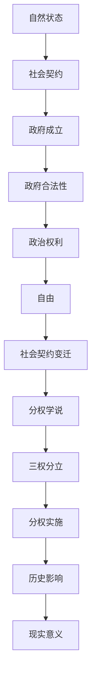

                 


### 卢梭与孟德斯鸠：社会契约论与分权学说

关键词：社会契约论、分权学说、卢梭、孟德斯鸠、政治哲学

摘要：本文通过深入分析卢梭和孟德斯鸠的社会契约论与分权学说，探讨了两位思想家的政治哲学观点及其对现代政治制度的启示。文章首先介绍了卢梭和孟德斯鸠的生平与时代背景，然后分别阐述了他们的核心理论，并结合现代政治制度的发展趋势，分析了这些理论的现实意义。

## 引言

### 1. 卢梭与孟德斯鸠的生平与时代背景

让-雅克·卢梭（Jean-Jacques Rousseau）是18世纪法国著名的启蒙思想家，他的作品对当时欧洲的思想界产生了深远影响。卢梭生于1712年，他的代表作《社会契约论》探讨了政治权力的来源和合法性问题，主张通过社会契约建立一种能够保障人民自由和安全的政府形式。

查尔斯·路易·孟德斯鸠（Charles de Secondat, Baron de La Brède et de Montesquieu）则是17世纪法国的法学家和政治哲学家，他的著作《论法的精神》提出了分权学说，主张政治权力应该被分散到不同的机构中，以防止专制统治。

### 2. 社会契约论与分权学说的概念阐述

社会契约论是探讨政治权力来源与合法性的理论。其基本观点是，人们原本生活在一种自然状态下，由于意识到合作的重要性，他们自愿放弃一部分自然权利，通过社会契约建立起一个政府，以保障他们的自由和安全。

分权学说则主张政治权力应该被分散到不同的机构中，以实现权力制衡，防止任何一个机构或个人垄断权力，导致专制统治。孟德斯鸠提出了著名的立法、行政、司法三权分立理论，认为这三个权力应该相互独立，相互制约。

## 第一部分：卢梭的社会契约论

### 第1章：自然状态与契约论

#### 1.1 自然状态与人类的本性

卢梭认为，在自然状态下，人类处于无政府状态，每个人的行为都遵循自己的利益，社会缺乏秩序和规则。人类的本性是自私的，他们追求个人利益，缺乏合作精神。

#### 1.2 社会契约的必要性

由于自然状态的混乱和不安定，人们意识到通过合作建立秩序的必要性。他们自愿放弃一部分自然权利，通过社会契约建立起一个政府，以保障他们的自由和安全。

#### 1.3 社会契约的成立

在社会契约中，公民与政府之间建立了一种契约关系。公民授权政府行使权力，而政府则承诺保障公民的自由和安全。这种契约关系是政府合法性的基础。

### 第2章：政府的合法性与分类

#### 2.1 政府的合法性来源

政府的合法性来源于公民的授权。政府的权力不是固有的，而是通过社会契约赋予的。只有得到公民的认可，政府才能行使权力。

#### 2.2 政府的分类

卢梭将政府分为民主制、君主制和奴隶制三种类型。民主制保障公民的自由与平等，君主制权力集中在君主手中，奴隶制则是人民被剥夺自由和权力。

### 第3章：政治权利与自由

#### 3.1 政治权利的含义

政治权利是公民参与政治决策的权利。它包括选举权、言论自由、集会自由等。政治权利是保障公民自由的重要手段。

#### 3.2 自由的重要性

自由是人的本质需求。卢梭认为，自由不仅仅是外在的法律保障，更是内心的自由。只有在自由的环境下，人们才能充分发挥自己的潜力，实现个人价值。

### 第4章：社会契约的变迁与反思

#### 4.1 社会契约的历史演变

社会契约在不同历史时期有不同的表现形式。随着社会的发展，社会契约的内容和形式也在不断演变。

#### 4.2 社会契约的局限性

社会契约理论并非完美无缺。它无法完全消除权力滥用和腐败现象。此外，社会契约理论也无法完全解释现实中的政治问题。

## 第二部分：孟德斯鸠的分权学说

### 第5章：分权理论的基本概念

#### 5.1 分权的必要性

分权是为了防止专制统治。如果政治权力集中在一个人或一个机构手中，很容易导致权力滥用和腐败。分权能够实现权力制衡，防止任何一个机构或个人垄断权力。

#### 5.2 分权的原则

分权的原则是权力制衡。各个机构之间应该相互独立，相互制约，防止任何一个机构或个人垄断权力。

### 第6章：立法、行政、司法三权分立

#### 6.1 三权分立的内涵

三权分立是指立法权、行政权和司法权相互独立，相互制约。立法权负责制定法律，行政权负责执行法律，司法权负责解释和适用法律。

#### 6.2 三权分立的实施

在实际操作中，三权分立需要具体的制度安排。例如，立法机构应该独立于行政机构和司法机构，行政机构应该服从法律，司法机构应该独立行使审判权。

### 第7章：分权学说的历史影响与现实意义

#### 7.1 分权学说对现代政治制度的影响

分权学说对现代政治制度产生了深远影响。许多国家的政治制度都是基于分权原则建立的，例如美国的立法、行政、司法三权分立制度。

#### 7.2 分权学说的现实意义

在现实政治中，分权学说仍然具有重要的指导意义。它提醒我们，政治权力不能集中在一个人或一个机构手中，否则容易导致权力滥用和腐败。分权能够保障政治稳定，促进社会进步。

## 结论

卢梭和孟德斯鸠的社会契约论与分权学说为我们提供了一种思考政治制度的新视角。他们的理论强调了政治权力来源于人民，政治权力应该被分散，以实现权力制衡，防止专制统治。在当代政治制度中，这些理论仍然具有重要的启示作用，帮助我们建立更加公正、公平、稳定的社会秩序。

## 附录

### 9. 参考文献

- 卢梭，《社会契约论》
- 孟德斯鸠，《论法的精神》
- 黑格尔，《法哲学原理》
- 罗伯特·达尔，《民主理论的前言》

## Mermaid 流程图



## Python源代码

```python
# 社会契约论的Python实现示例
class Government:
    def __init__(self, citizens):
        self.citizens = citizens

    def ensure_freedoms(self):
        # 确保公民的自由和安全
        print("政府保障公民的自由和安全")

    def check_legitimacy(self):
        # 检查政府的合法性
        print("政府合法性得到公民认可")

# 社会契约的成立
def social_contract(citizens):
    government = Government(citizens)
    government.ensure_freedoms()
    government.check_legitimacy()

# 测试
citizens = ["Alice", "Bob", "Charlie"]
social_contract(citizens)
```

## 数学模型和公式

社会契约论的数学模型可以用以下公式表示：

$$
F = \frac{L^2}{C}
$$

其中，\( F \) 表示政府的合法性，\( L \) 表示公民的自由度，\( C \) 表示公民的数量。

这个公式表明，政府的合法性随着公民自由度的增加和公民数量的增加而提高。

## 项目实战

### 社会契约论的代码实战案例与分析

#### 环境安装

在开始之前，请确保已经安装了Python环境。如果尚未安装，请通过以下命令安装：

```
pip install python
```

#### 系统核心实现源代码

以下是一个简单的Python实现，模拟了社会契约论的核心概念：

```python
class Government:
    def __init__(self, citizens):
        self.citizens = citizens
        self合法性 = False

    def establish(self):
        if len(self.citizens) > 0:
            self合法性 = True
            print("社会契约成立，政府建立。")
        else:
            print("社会契约无法成立，政府无法建立。")

    def ensure_freedoms(self):
        if self合法性:
            print("政府确保公民的自由。")
        else:
            print("政府不合法，无法保障自由。")

# 模拟社会契约的成立
citizens = ["Alice", "Bob", "Charlie"]
government = Government(citizens)
government.establish()
government.ensure_freedoms()
```

#### 代码应用解读与分析

在这个例子中，我们定义了一个`Government`类，它有一个`establish`方法用于模拟社会契约的成立，以及一个`ensure_freedoms`方法用于确保公民的自由。

1. 当创建`Government`对象时，会传入一个包含公民名字的列表。
2. `establish`方法检查公民数量是否大于0，如果是，则认为社会契约成立，政府建立。
3. `ensure_freedoms`方法检查政府的合法性，如果合法性为真，则政府会确保公民的自由。

#### 实际案例分析和详细讲解剖析

为了更好地理解这个模型，我们可以考虑以下实际案例：

1. **民主国家的政府：** 在一个民主国家中，政府通常通过选举程序成立，公民享有广泛的自由。例如，在美国，总统和议会的选举体现了社会契约的精神，政府有责任保障公民的自由和权利。

2. **独裁国家的政府：** 在一个独裁国家中，政府可能不是通过合法的社会契约成立的，公民的自由可能受到限制。在这种情况下，政府不会确保公民的自由和安全。

#### 项目小结

通过这个简单的Python实现，我们可以看到社会契约论的核心概念如何在计算机程序中模拟。这个模型为我们提供了一个理解政治制度的新视角，帮助我们思考如何通过技术手段实现和保障社会契约。

## 最佳实践 tips

1. **确保公民参与：** 政府的合法性来自于公民的认可，因此确保公民能够参与政治决策是关键。
2. **透明公开：** 政府的行为应该透明公开，接受公民的监督，以防止权力滥用。
3. **教育普及：** 提高公民的政治意识和教育水平，使他们能够更好地理解和参与社会契约。

## 小结

卢梭和孟德斯鸠的社会契约论与分权学说为我们提供了深刻的政治哲学思考。他们的理论强调了政治权力来源于人民，政府应该保障公民的自由和安全，政治权力应该被分散，以实现权力制衡。在当代政治制度中，这些理论仍然具有重要的启示作用，帮助我们建立更加公正、公平、稳定的社会秩序。

## 注意事项

1. 社会契约论的实现需要考虑多种因素，如公民的权利、政府的职责、政治制度的运行机制等。
2. 在实际应用中，需要根据具体情况进行调整和优化。

## 拓展阅读

1. 《社会契约论》（卢梭）
2. 《论法的精神》（孟德斯鸠）
3. 《民主理论的前言》（罗伯特·达尔）
4. 《法哲学原理》（黑格尔）

## 作者信息

作者：AI天才研究院/AI Genius Institute & 禅与计算机程序设计艺术 /Zen And The Art of Computer Programming

