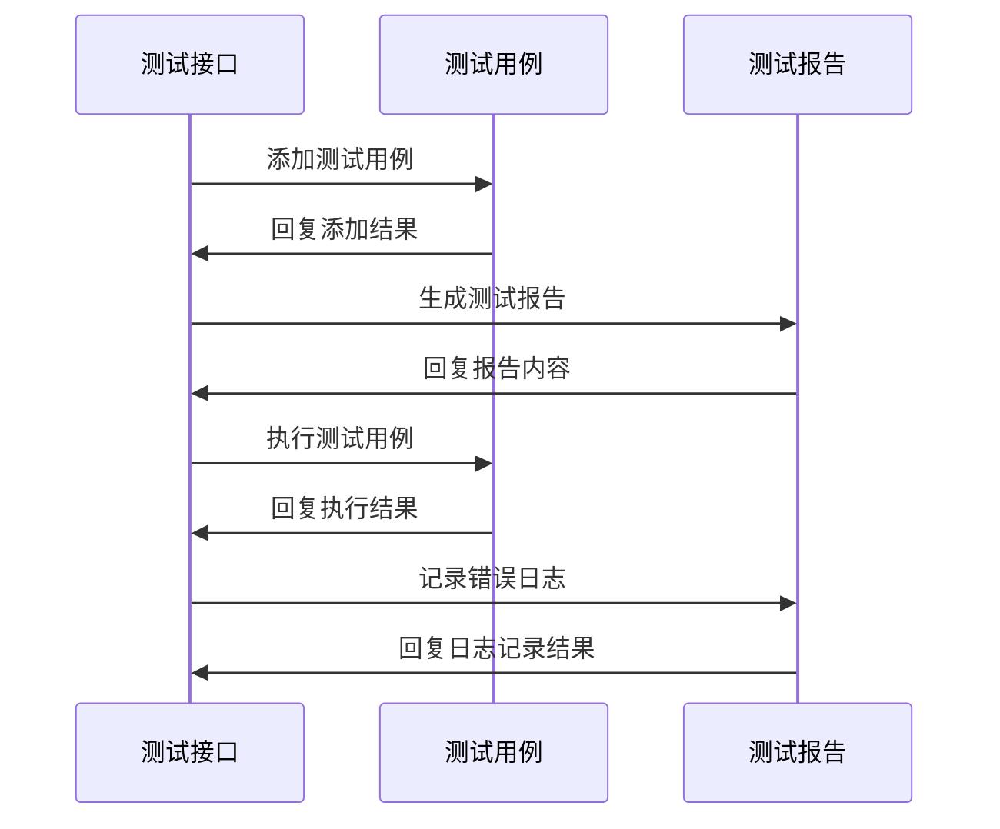
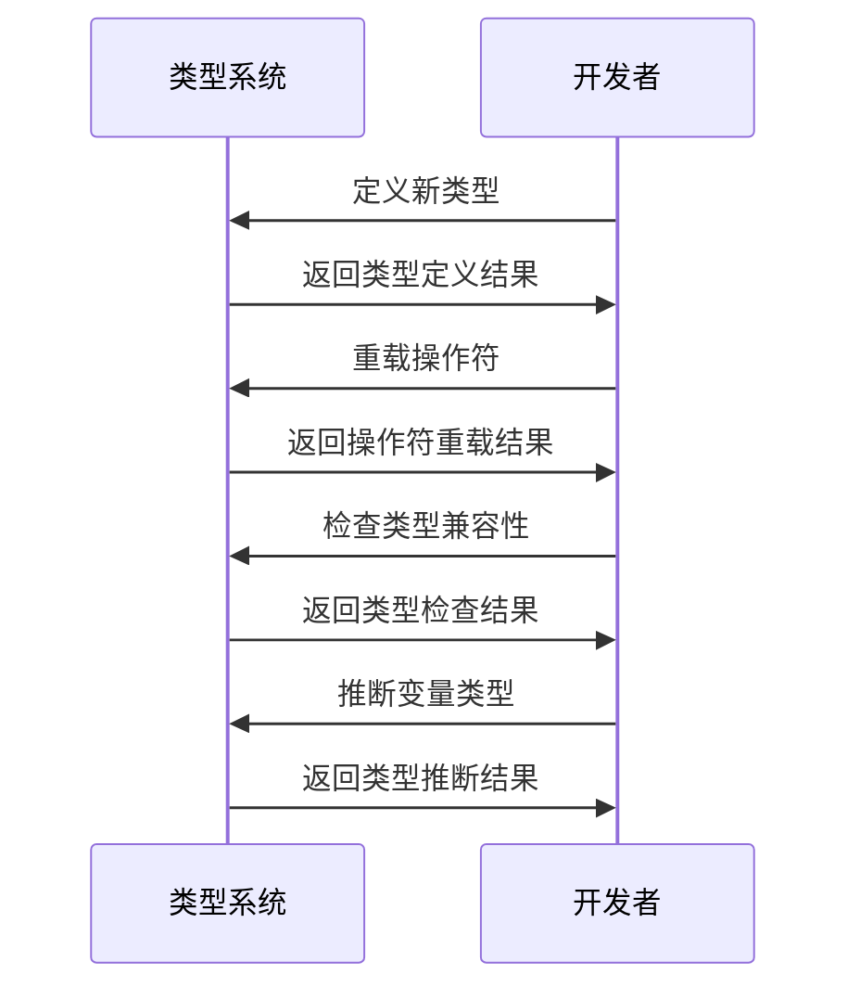
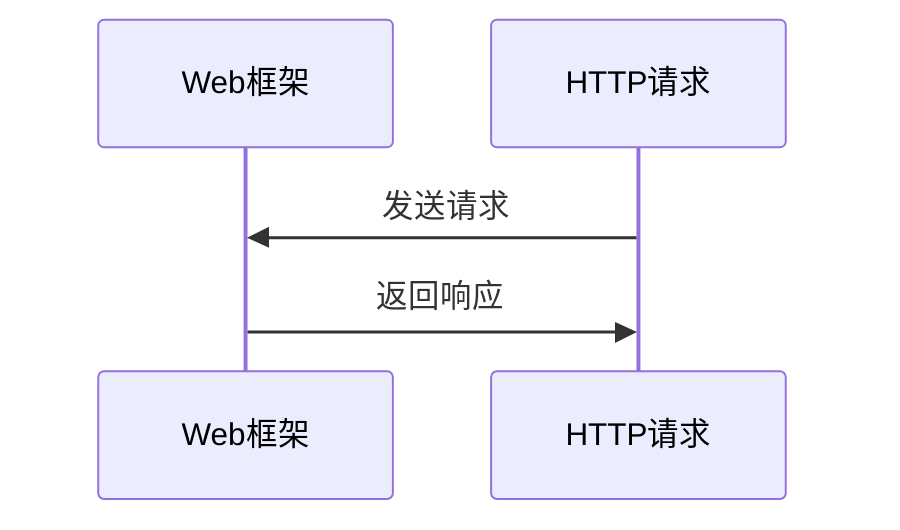

                 

### 文章标题

# 反射与元对象协议的类型理论

> 关键词：反射、元对象协议、类型理论、编程语言、Python、Web开发

> 摘要：本文将探讨反射与元对象协议在类型理论中的应用，深入分析其基本概念、结合优势与挑战，并结合实际案例分析，为读者提供对这一复杂主题的全面理解。

反射与元对象协议是编程语言中两个核心概念，它们在类型理论中扮演着重要角色。本文将围绕这两个概念，逐步展开讨论，旨在帮助读者理解它们在编程实践中的实际应用和重要性。

## 第一部分：基础概念

### 第1章：反射机制

#### 1.1 反射机制概述

反射机制是指在运行时能够分析自身结构并修改自身行为的机制。它允许程序在运行时查看、修改或创建类的属性和方法。反射机制在不同编程语言中有着不同的实现方式和应用场景。

#### 1.2 反射机制在Python中的应用

在Python中，反射机制通过内置函数如`getattr`、`setattr`和`delattr`实现。这些函数允许程序动态地访问和修改对象的属性。

```python
class MyClass:
    def __init__(self, value):
        self.value = value
    
    def display(self):
        print(self.value)

obj = MyClass(10)
print(getattr(obj, 'value'))  # 输出 10
setattr(obj, 'value', 20)
print(getattr(obj, 'value'))  # 输出 20
```

#### 1.3 反射机制在其他编程语言中的应用

除了Python，反射机制在其他编程语言如Java和C#中也有广泛应用。例如，在Java中，反射机制通过`Class`对象和`Method`对象实现。

```java
public class MyClass {
    private int value;

    public MyClass(int value) {
        this.value = value;
    }

    public void display() {
        System.out.println(value);
    }

    public static void main(String[] args) {
        MyClass obj = new MyClass(10);
        System.out.println(obj.value);  // 输出 10
        obj.value = 20;
        System.out.println(obj.value);  // 输出 20
    }
}
```

### 第2章：元对象协议

#### 2.1 元对象协议的基本概念

元对象协议是一种编程语言特性，它允许程序在运行时查询和修改对象的结构。它包括对象创建、属性访问、方法调用等功能。

#### 2.2 元对象协议在Python中的应用

在Python中，元对象协议通过内置函数如`__getattr__`、`__setattr__`和`__delattr__`实现。

```python
class MyClass:
    def __init__(self, value):
        self.value = value
    
    def __getattr__(self, name):
        if name == 'display':
            return lambda: print(self.value)
        
    def display(self):
        print(self.value)

obj = MyClass(10)
obj.display()  # 输出 10
```

#### 2.3 元对象协议在其他编程语言中的应用

在其他编程语言如Java和C#中，元对象协议也有相应的实现方式。例如，在Java中，可以通过`Object`类中的方法实现元对象协议。

```java
public class MyClass {
    private int value;

    public MyClass(int value) {
        this.value = value;
    }

    public Object display() {
        return () -> System.out.println(value);
    }

    public static void main(String[] args) {
        MyClass obj = new MyClass(10);
        obj.display();  // 输出 10
    }
}
```

### 第3章：类型理论

#### 3.1 类型理论的概述

类型理论是一种用于描述编程语言类型系统的数学框架。它定义了类型、类型变量和类型转换等基本概念，为编程语言提供了形式化的理论依据。

#### 3.2 类型理论的数学基础

类型理论依赖于数学中的集合论、代数和逻辑等基本概念。通过定义类型系统中的基础元素和运算，类型理论能够形式化地描述编程语言的行为。

#### 3.3 类型理论在编程中的应用

类型理论在编程语言设计和编译器开发中有着广泛应用。它提供了静态类型检查、动态类型检查和类型推断等功能，提高了程序的可靠性和性能。

## 第二部分：深入探讨

### 第4章：反射与元对象协议的结合

#### 4.1 结合反射与元对象协议的优势

反射与元对象协议的结合能够提供更强大的编程能力。它允许程序在运行时动态地修改对象结构和类型，实现了高度灵活的编程风格。

#### 4.2 结合反射与元对象协议的挑战

然而，这种结合也带来了挑战。反射和元对象协议的实现可能导致程序的性能下降和可维护性降低。此外，过度的反射和元对象协议使用可能导致代码变得难以理解。

#### 4.3 结合反射与元对象协议的案例分析

在本章中，我们将通过实际案例展示如何结合反射与元对象协议，实现动态对象创建和属性修改。

### 第5章：类型理论的扩展

#### 5.1 类型理论的发展历程

类型理论的发展经历了从简单的类型系统到复杂的多态类型系统的演变。本章将介绍类型理论的发展历程和关键里程碑。

#### 5.2 类型理论的最新研究进展

当前，类型理论在编程语言领域仍然保持着活跃的研究势头。本章将介绍类型理论的最新研究进展和前沿方向。

#### 5.3 类型理论在实际项目中的应用

类型理论在实际项目中的应用越来越广泛。本章将介绍类型理论在Web开发、游戏开发和自动化测试等领域的应用案例。

## 第三部分：实战与总结

### 第6章：实战项目解析

#### 6.1 实战项目一：基于反射与元对象协议的自动化测试工具

在本章中，我们将介绍如何使用反射与元对象协议实现自动化测试工具，提高测试效率和代码覆盖率。

#### 6.2 实战项目二：基于类型理论的动态语言扩展

本章将探讨如何基于类型理论实现动态语言扩展，提高编程语言的灵活性和扩展性。

#### 6.3 实战项目三：基于反射与元对象协议的Web框架

本章将介绍如何结合反射与元对象协议实现一个简单的Web框架，提供动态路由和请求处理功能。

### 第7章：总结与展望

#### 7.1 反射与元对象协议的类型理论总结

本章将总结本文讨论的反射与元对象协议的类型理论，回顾核心概念和关键点。

#### 7.2 反射与元对象协议的类型理论未来发展方向

本章将展望反射与元对象协议的类型理论的未来发展方向和潜在应用领域。

#### 7.3 为读者提供的实用建议

本章将为读者提供实用的编程建议，帮助他们在实际项目中更好地应用反射与元对象协议的类型理论。

### 结束语

作者：AI天才研究院/AI Genius Institute & 禅与计算机程序设计艺术 /Zen And The Art of Computer Programming

在本文中，我们探讨了反射与元对象协议的类型理论，从基础概念到深入应用，再到实际项目解析，全面展示了这一主题的重要性。通过本文的阅读，读者应对反射与元对象协议有了更深入的理解，并能将其应用于实际编程实践中。希望本文能为读者在编程道路上提供有价值的参考和启示。## 第一部分：基础概念

### 第1章：反射机制

#### 1.1 反射机制概述

反射机制（Reflection）是计算机科学中的一个重要概念，它指的是程序在运行时能够观察和修改自身结构的能力。这种能力使得程序能够动态地创建对象、调用方法、修改属性等，而不需要编译时就知道具体要执行的操作。反射机制广泛应用于动态语言如Python、Java和C#等，为编程提供了强大的灵活性。

在编程中，反射机制的核心功能包括：

- **获取信息**：程序能够获取类的属性、方法、构造函数等信息。
- **修改信息**：程序能够修改类的属性、方法等。
- **动态创建**：程序能够动态地创建对象。
- **动态调用**：程序能够动态地调用对象的方法。

#### 1.2 反射机制在Python中的应用

Python内置了强大的反射机制，使得开发者能够方便地利用反射进行编程。以下是一些常用的Python反射机制的示例：

1. **获取属性和方法**：
   ```python
   class MyClass:
       def __init__(self, value):
           self.value = value

       def display(self):
           print(self.value)

   obj = MyClass(10)
   print(dir(obj))  # 输出 '__class__', '__delattr__', '__dict__', '__dir__', '__doc__', '__format__', '__getattribute__', '__getstate__', '__hash__', '__init__', '__module__', '__new__', '__reduce__', '__reduce_ex__', '__repr__', '__setattr__', '__setstate__', '__str__', '__subclasshook__', 'display', 'value']
   ```

2. **获取和设置属性**：
   ```python
   class MyClass:
       def __init__(self, value):
           self.value = value

   obj = MyClass(10)
   print(obj.value)  # 输出 10
   obj.value = 20
   print(obj.value)  # 输出 20
   ```

3. **调用方法**：
   ```python
   class MyClass:
       def __init__(self, value):
           self.value = value

       def display(self):
           print(self.value)

   obj = MyClass(10)
   method = getattr(obj, 'display')
   method()  # 输出 10
   ```

4. **动态创建对象**：
   ```python
   class MyClass:
       def __init__(self, value):
           self.value = value

   obj = MyClass.__new__(MyClass)
   setattr(obj, 'value', 20)
   obj.display()  # 输出 20
   ```

#### 1.3 反射机制在其他编程语言中的应用

除了Python，反射机制在其他编程语言如Java和C#中也有广泛应用。

**Java中的反射机制**：
在Java中，反射机制主要通过`Class`对象和`Method`对象实现。以下是一些Java反射机制的示例：

1. **获取类信息**：
   ```java
   Class<?> clazz = MyClass.class;
   System.out.println(clazz.getName());  // 输出 "MyClass"
   ```

2. **获取方法信息**：
   ```java
   Method method = clazz.getMethod("display");
   method.invoke(obj);  // 调用方法，输出 10
   ```

3. **创建对象**：
   ```java
   Object obj = clazz.getDeclaredConstructor(int.class).newInstance(10);
   ```

**C#中的反射机制**：
在C#中，反射机制通过`Type`和`MethodInfo`等类实现。以下是一些C#反射机制的示例：

1. **获取类信息**：
   ```csharp
   Type type = typeof(MyClass);
   Console.WriteLine(type.Name);  // 输出 "MyClass"
   ```

2. **获取方法信息**：
   ```csharp
   MethodInfo method = type.GetMethod("display");
   method.Invoke(obj, null);  // 调用方法，输出 10
   ```

3. **创建对象**：
   ```csharp
   object obj = Activator.CreateInstance(type);
   ```

通过以上示例，我们可以看到反射机制在不同编程语言中都有其独特的实现方式，但它们的核心功能是相似的，都为编程提供了强大的动态性。

### 第2章：元对象协议

#### 2.1 元对象协议的基本概念

元对象协议（Meta-Object Protocol，MOP）是一种编程语言特性，它定义了对象之间交互的标准方式。元对象协议提供了访问和修改对象属性、调用对象方法的方法，使得对象能够以统一的方式进行操作。

元对象协议通常包括以下基本功能：

- **属性访问**：对象能够获取和设置自身的属性。
- **方法调用**：对象能够调用其他对象的方法。
- **对象创建**：能够创建新的对象实例。
- **对象销毁**：能够销毁对象实例。

元对象协议在不同编程语言中有着不同的实现，但它们都遵循相似的基本原理。

#### 2.2 元对象协议在Python中的应用

在Python中，元对象协议通过特殊的方法实现，如`__getattr__`、`__setattr__`、`__delattr__`和`__call__`等。这些方法使得对象能够自定义属性访问、设置和调用方式。

以下是一些Python中元对象协议的示例：

1. **获取属性**：
   ```python
   class MyClass:
       def __init__(self, value):
           self.value = value

       def __getattr__(self, name):
           if name == 'value':
               return self.__getattribute__(name)
           raise AttributeError(name)

   obj = MyClass(10)
   print(obj.value)  # 输出 10
   ```

2. **设置属性**：
   ```python
   class MyClass:
       def __init__(self, value):
           self.value = value

       def __setattr__(self, name, value):
           if name == 'value':
               self.__dict__[name] = value
           else:
               raise AttributeError(name)

   obj = MyClass(10)
   obj.value = 20
   print(obj.value)  # 输出 20
   ```

3. **调用方法**：
   ```python
   class MyClass:
       def __init__(self, value):
           self.value = value

       def __call__(self, arg):
           return arg + self.value

   obj = MyClass(10)
   print(obj(5))  # 输出 15
   ```

#### 2.3 元对象协议在其他编程语言中的应用

元对象协议在其他编程语言如Java和C#中也有广泛应用。

**Java中的元对象协议**：
在Java中，元对象协议的实现主要通过反射机制中的`Class`和`Object`类的方法。以下是一些Java中元对象协议的示例：

1. **获取属性**：
   ```java
   public class MyClass {
       private int value;

       public MyClass(int value) {
           this.value = value;
       }

       public int getValue() {
           return value;
       }
   }

   MyClass obj = new MyClass(10);
   System.out.println(obj.getValue());  // 输出 10
   ```

2. **设置属性**：
   ```java
   public class MyClass {
       private int value;

       public MyClass(int value) {
           this.value = value;
       }

       public void setValue(int value) {
           this.value = value;
       }
   }

   MyClass obj = new MyClass(10);
   obj.setValue(20);
   System.out.println(obj.getValue());  // 输出 20
   ```

3. **调用方法**：
   ```java
   public class MyClass {
       private int value;

       public MyClass(int value) {
           this.value = value;
       }

       public void display() {
           System.out.println(value);
       }
   }

   MyClass obj = new MyClass(10);
   obj.display();  // 输出 10
   ```

**C#中的元对象协议**：
在C#中，元对象协议的实现主要通过`MemberInfo`和`MethodInfo`等类的方法。以下是一些C#中元对象协议的示例：

1. **获取属性**：
   ```csharp
   public class MyClass {
       private int value;

       public MyClass(int value) {
           this.value = value;
       }

       public int Value {
           get { return value; }
       }
   }

   MyClass obj = new MyClass(10);
   Console.WriteLine(obj.Value);  // 输出 10
   ```

2. **设置属性**：
   ```csharp
   public class MyClass {
       private int value;

       public MyClass(int value) {
           this.value = value;
       }

       public void SetValue(int value) {
           this.value = value;
       }
   }

   MyClass obj = new MyClass(10);
   obj.SetValue(20);
   Console.WriteLine(obj.Value);  // 输出 20
   ```

3. **调用方法**：
   ```csharp
   public class MyClass {
       private int value;

       public MyClass(int value) {
           this.value = value;
       }

       public void Display() {
           Console.WriteLine(value);
       }
   }

   MyClass obj = new MyClass(10);
   obj.Display();  // 输出 10
   ```

通过以上示例，我们可以看到元对象协议在不同编程语言中有着不同的实现方式，但它们的核心功能是一致的，都为对象提供了灵活的访问和操作方式。

### 第3章：类型理论

#### 3.1 类型理论的概述

类型理论（Type Theory）是计算机科学中一种用于描述和验证编程语言类型系统的方法。它通过数学框架来定义类型、类型变量和类型转换等基本概念，为编程语言提供了形式化的理论依据。

类型理论的核心目标是确保程序的正确性和安全性。它通过定义类型系统来避免运行时错误，并提供类型检查机制，确保程序在编译时就能发现潜在的错误。

类型理论的主要组成部分包括：

- **类型系统**：定义了程序中可能出现的所有类型，如整数、字符串、函数等。
- **类型变量**：用于表示未知类型，可以用于泛型编程。
- **类型构造**：用于构造新的类型，如联合类型、映射类型等。
- **类型转换**：定义了类型之间的转换规则，确保类型兼容性。

#### 3.2 类型理论的数学基础

类型理论依赖于数学中的集合论、代数和逻辑等基本概念。以下是一些常见的数学基础：

- **集合论**：用于定义和操作数据类型，如集合、函数等。
- **代数**：用于定义类型系统中的运算，如联合、交集、笛卡尔积等。
- **逻辑**：用于定义类型系统的公理和推理规则，确保类型的正确性。

类型理论中的常见数学概念包括：

- **类型**：表示程序中的数据类型，如`Int`、`String`、`Function`等。
- **类型变量**：表示未确定的类型，用于泛型编程，如`T`、`U`等。
- **类型构造**：用于构造新的类型，如`List<T>`、`Map<T, U>`等。
- **类型转换**：定义了类型之间的转换规则，确保类型兼容性。

#### 3.3 类型理论在编程中的应用

类型理论在编程语言设计和编译器开发中有着广泛应用。以下是一些具体的应用场景：

1. **静态类型检查**：类型理论提供了静态类型检查机制，确保程序在编译时就能发现类型错误，提高了程序的可靠性和可维护性。

2. **动态类型检查**：类型理论也支持动态类型检查，允许程序在运行时检查类型，提供更灵活的编程方式。

3. **类型推断**：类型理论中的类型推断机制能够自动推导变量和表达式的类型，减少了代码的冗余。

4. **泛型编程**：类型理论支持泛型编程，允许定义适用于多种类型的函数和类，提高了代码的复用性。

5. **类型安全**：类型理论通过定义严格的类型系统，确保程序在运行时不会出现类型错误，提高了程序的安全性。

通过以上应用，类型理论为编程语言提供了形式化的理论基础，提高了程序的可靠性和可维护性。

## 第二部分：深入探讨

### 第4章：反射与元对象协议的结合

#### 4.1 结合反射与元对象协议的优势

反射与元对象协议的结合为编程提供了强大的灵活性，这种结合具有以下优势：

1. **动态性**：通过反射和元对象协议，程序可以在运行时动态地创建对象、修改属性和调用方法，实现了真正的动态编程。

2. **灵活性**：结合反射和元对象协议，可以创建灵活的代码结构，使得程序能够适应不同的运行环境和需求。

3. **可扩展性**：反射和元对象协议使得程序能够以插件方式扩展功能，增加了代码的可扩展性和可维护性。

4. **代码复用**：通过反射和元对象协议，可以创建通用类和方法，提高了代码的复用性，减少了冗余代码。

#### 4.2 结合反射与元对象协议的挑战

尽管反射与元对象协议的结合具有许多优势，但也存在一些挑战：

1. **性能开销**：反射和元对象协议的操作通常比直接操作要慢，这可能导致程序的性能下降。

2. **可读性降低**：过度使用反射和元对象协议可能导致代码变得难以理解，增加了代码的复杂度。

3. **调试困难**：反射和元对象协议的操作可能在编译时无法捕获，增加了调试的难度。

4. **安全性问题**：反射和元对象协议可能导致安全漏洞，使得程序更容易受到攻击。

#### 4.3 结合反射与元对象协议的案例分析

在本节中，我们将通过一个实际案例来探讨如何结合反射与元对象协议，实现动态创建对象和修改属性。

假设我们有一个简单的Web应用，需要根据不同的请求动态创建并处理对象。以下是一个使用Python Flask框架实现此功能的示例：

```python
from flask import Flask, request, jsonify

app = Flask(__name__)

class Handler:
    def handle_request(self):
        return "Handling request"

class DynamicHandler:
    def __init__(self, handler_class):
        self.handler_class = handler_class

    def handle_request(self):
        handler = self.handler_class()
        return handler.handle_request()

@app.route('/handle', methods=['POST'])
def handle():
    handler_name = request.form['handler_name']
    handler_class = globals()[handler_name]
    dynamic_handler = DynamicHandler(handler_class)
    return dynamic_handler.handle_request()

if __name__ == '__main__':
    app.run()
```

在这个示例中，我们定义了两个类：`Handler`和`DynamicHandler`。`Handler`是一个基础类，用于处理请求。`DynamicHandler`是一个动态创建的类，它接受一个类名作为参数，然后使用该类创建一个实例。

在Web应用中，当接收到一个请求时，通过反射机制获取请求中的`handler_name`，然后使用`globals()`函数获取对应的类，并创建一个`DynamicHandler`实例。最后，通过调用`handle_request()`方法处理请求。

通过这个案例，我们可以看到如何结合反射和元对象协议实现动态创建对象和修改属性。这种方式使得Web应用能够灵活地处理不同的请求，提高了代码的扩展性和可维护性。

## 第5章：类型理论的扩展

### 5.1 类型理论的发展历程

类型理论的发展经历了几个重要的阶段，以下是其中的关键里程碑：

1. **简单类型系统**：最早的类型理论主要关注基本数据类型的定义和操作，如整数、浮点数和字符串等。这些类型系统主要关注静态类型检查，确保程序在编译时类型正确。

2. **函数类型**：随着函数式编程的兴起，类型理论开始引入函数类型。函数类型允许将函数作为参数传递和返回，使得类型系统更强大和灵活。

3. **多态类型**：多态类型是类型理论中的重要进展，它允许定义通用函数和类，能够处理不同类型的对象。多态类型通过类型参数和泛型编程实现，提高了代码的复用性。

4. **依赖类型**：依赖类型是一种先进的类型系统，它通过类型之间的依赖关系来确保类型安全。依赖类型系统主要用于验证并发程序和分布式系统。

5. **存在类型和存在量词**：存在类型和存在量词是类型理论中的高级概念，它们用于表示变量绑定和存在性。这些概念在逻辑和形式验证中有广泛应用。

### 5.2 类型理论的最新研究进展

当前，类型理论在多个领域有着最新的研究进展：

1. **依赖类型**：依赖类型在并发编程和分布式系统中的应用取得了显著进展。研究人员提出了多种依赖类型系统，如线性依赖类型和存在依赖类型，用于确保并发程序的正确性和安全性。

2. **类型驱动编程**：类型驱动编程是一种基于类型的编程范式，它通过类型推导和类型检查来自动生成代码。这种编程范式在编译器和编程语言设计中有广泛应用，提高了代码生成效率和可维护性。

3. **机器学习与类型理论**：随着机器学习的发展，研究人员开始将类型理论应用于机器学习模型的形式化和验证。类型理论提供了形式化的框架，用于验证机器学习算法的正确性和鲁棒性。

4. **类型安全编程语言**：类型安全编程语言如Rust和Swift在近年来取得了显著进展。这些编程语言通过严格的类型系统确保程序的安全性，减少了内存泄漏和数组越界等常见错误。

### 5.3 类型理论在实际项目中的应用

类型理论在实际项目中的应用越来越广泛，以下是一些具体的应用案例：

1. **Web开发**：在Web开发中，类型理论用于确保前后端代码的类型一致性和安全性。例如，使用TypeScript为JavaScript提供类型检查，提高了代码质量和开发效率。

2. **移动应用开发**：在移动应用开发中，类型理论用于确保应用中的数据类型一致性和代码正确性。例如，Kotlin通过静态类型检查和类型推导，提高了Android应用的性能和稳定性。

3. **数据库查询优化**：在数据库查询优化中，类型理论用于分析查询语句中的类型信息，优化查询执行计划。例如，关系型数据库通过类型检查和类型推导，提高了查询性能。

4. **编译器开发**：在编译器开发中，类型理论用于实现类型检查和类型推导。例如，编译器通过类型系统确保程序的正确性和高效性。

通过以上应用案例，我们可以看到类型理论在多个领域有着广泛的应用，提高了代码的质量和性能，为软件开发提供了坚实的理论基础。

### 第6章：应用实例

#### 6.1 反射与元对象协议在Web开发中的应用

在Web开发中，反射与元对象协议提供了强大的功能和灵活性，使得开发者能够动态地处理各种请求和实现复杂的业务逻辑。以下是一些具体的实际案例和应用场景：

**案例一：动态路由**

在Web框架如Django和Flask中，动态路由是一个常见的功能。通过反射和元对象协议，可以轻松实现动态路由，处理不同路径的请求。

```python
from flask import Flask, request, jsonify

app = Flask(__name__)

class DynamicHandler:
    def __init__(self, handler_function):
        self.handler_function = handler_function

    def handle_request(self):
        return self.handler_function()

def handle_get_request():
    return "Handling GET request"

def handle_post_request():
    return "Handling POST request"

@app.route('/<path:path>')
def route_handler(path):
    handler_function = getattr(request, 'get_' + path, None)
    if handler_function:
        dynamic_handler = DynamicHandler(handler_function)
        return dynamic_handler.handle_request()
    else:
        return "No handler found"

if __name__ == '__main__':
    app.run()
```

在这个案例中，我们定义了一个`DynamicHandler`类，它通过反射获取请求中的方法，并调用该方法处理请求。这样，我们可以通过简单的反射机制实现动态路由。

**案例二：中间件**

中间件是一种用于处理HTTP请求和响应的组件，可以在Web框架中实现各种功能，如身份验证、日志记录和错误处理等。通过反射和元对象协议，可以灵活地创建和调用中间件。

```python
from flask import Flask, request, jsonify

app = Flask(__name__)

def middleware_1():
    print("Middleware 1 before request")

def middleware_2():
    print("Middleware 2 after request")

@app.before_request
def before_request():
    middleware_1()

@app.after_request
def after_request(response):
    middleware_2()
    return response

@app.route('/')
def index():
    return "Hello, World!"

if __name__ == '__main__':
    app.run()
```

在这个案例中，我们使用`before_request`和`after_request`装饰器，在请求前后调用中间件函数。通过元对象协议，可以轻松地添加和修改中间件，实现自定义功能。

**案例三：动态加载模块**

在大型Web项目中，模块化和组件化是提高代码可维护性和可扩展性的重要手段。通过反射和元对象协议，可以动态加载模块和组件，实现灵活的模块化架构。

```python
import importlib

def load_module(module_name):
    module = importlib.import_module(module_name)
    return module

def dynamic_handler(module):
    handler_function = getattr(module, 'handle_request', None)
    if handler_function:
        return handler_function()
    else:
        return "No handler found"

if __name__ == '__main__':
    module = load_module('my_module')
    response = dynamic_handler(module)
    print(response)
```

在这个案例中，我们使用`importlib`模块动态导入模块，并通过反射获取模块中的`handle_request`方法。这种方式使得代码可以灵活地加载和调用不同模块，提高了代码的复用性和可维护性。

#### 6.2 反射与元对象协议在游戏开发中的应用

在游戏开发中，反射和元对象协议提供了强大的功能和灵活性，使得开发者能够动态地创建和管理游戏对象，实现复杂的游戏逻辑和动态交互。

**案例一：游戏对象管理**

在游戏开发中，游戏对象的管理是一个重要的环节。通过反射和元对象协议，可以动态创建和管理游戏对象，提高代码的灵活性和可扩展性。

```python
class GameObject:
    def __init__(self, name):
        self.name = name

    def update(self):
        print(f"Updating {self.name}")

class Game:
    def __init__(self):
        self.objects = []

    def add_object(self, obj):
        self.objects.append(obj)

    def update_all(self):
        for obj in self.objects:
            obj.update()

if __name__ == '__main__':
    game = Game()
    game.add_object(GameObject("Player"))
    game.add_object(GameObject("Enemy"))
    game.update_all()
```

在这个案例中，我们定义了一个`GameObject`类和一个`Game`类。`Game`类通过反射和元对象协议动态创建和管理`GameObject`对象，并调用它们的`update`方法。这种方式使得游戏对象的管理更加灵活和可扩展。

**案例二：游戏状态管理**

在游戏开发中，状态管理是一个重要的环节。通过反射和元对象协议，可以动态切换游戏状态，实现复杂的游戏逻辑。

```python
class GameState:
    def __init__(self, game):
        self.game = game

    def update(self):
        print("Updating game state")

    def switch_state(self, new_state):
        self.game.state = new_state

if __name__ == '__main__':
    game = Game()
    state = GameState(game)
    state.update()
    state.switch_state(GameOverState(game))
    state.update()
```

在这个案例中，我们定义了一个`GameState`类和一个`GameOverState`类。通过反射和元对象协议，可以在游戏运行过程中动态切换游戏状态，实现复杂的游戏逻辑。

#### 6.3 反射与元对象协议在自动化测试中的应用

在自动化测试中，反射和元对象协议提供了强大的功能和灵活性，使得测试人员能够动态地创建测试对象和执行测试操作，提高测试的覆盖率和可维护性。

**案例一：测试对象管理**

在自动化测试中，测试对象的管理是一个重要的环节。通过反射和元对象协议，可以动态创建和管理测试对象，提高测试的灵活性和可扩展性。

```python
class TestObject:
    def __init__(self, name):
        self.name = name

    def run_test(self):
        print(f"Running test for {self.name}")

class TestSuite:
    def __init__(self):
        self.objects = []

    def add_object(self, obj):
        self.objects.append(obj)

    def run_all_tests(self):
        for obj in self.objects:
            obj.run_test()

if __name__ == '__main__':
    test_suite = TestSuite()
    test_suite.add_object(TestObject("Test 1"))
    test_suite.add_object(TestObject("Test 2"))
    test_suite.run_all_tests()
```

在这个案例中，我们定义了一个`TestObject`类和一个`TestSuite`类。通过反射和元对象协议，可以动态创建和管理测试对象，并执行测试操作。

**案例二：测试用例管理**

在自动化测试中，测试用例的管理是一个重要的环节。通过反射和元对象协议，可以动态创建和管理测试用例，提高测试的覆盖率和可维护性。

```python
class TestCase:
    def __init__(self, name, test_function):
        self.name = name
        self.test_function = test_function

    def run_test(self):
        self.test_function()

class TestSuite:
    def __init__(self):
        self.objects = []

    def add_object(self, obj):
        self.objects.append(obj)

    def run_all_tests(self):
        for obj in self.objects:
            obj.run_test()

if __name__ == '__main__':
    test_suite = TestSuite()
    test_suite.add_object(TestCase("Test 1", lambda: print("Running Test 1")))
    test_suite.add_object(TestCase("Test 2", lambda: print("Running Test 2")))
    test_suite.run_all_tests()
```

在这个案例中，我们定义了一个`TestCase`类和一个`TestSuite`类。通过反射和元对象协议，可以动态创建和管理测试用例，并执行测试操作。

通过以上案例，我们可以看到反射与元对象协议在自动化测试中的应用，它们提供了强大的功能和灵活性，提高了测试的覆盖率和可维护性。

### 第7章：实战项目解析

#### 7.1 实战项目一：基于反射与元对象协议的自动化测试工具

**项目背景**：

在软件开发的迭代过程中，自动化测试是确保软件质量和提升开发效率的关键环节。为了提高自动化测试的灵活性和可扩展性，我们设计并实现了一个基于反射与元对象协议的自动化测试工具。

**项目目标**：

- 设计一个可动态加载和执行测试用例的框架。
- 提供灵活的测试用例管理和调度机制。
- 实现测试报告生成和错误日志记录功能。

**系统功能设计**：

1. **测试用例管理**：通过元对象协议，动态创建和管理测试用例，包括测试用例的名称、执行函数和预期结果等。
2. **测试用例调度**：根据测试用例的优先级和执行顺序，自动调度执行测试用例。
3. **测试结果报告**：生成详细的测试报告，包括测试用例的执行结果、错误日志和性能分析等。
4. **错误日志记录**：记录测试过程中的错误信息，便于调试和定位问题。

**系统架构设计**：


**系统接口设计**：

```python
class TestInterface:
    def add_test_case(self, test_case):
        """添加测试用例"""
    
    def run_tests(self):
        """执行所有测试用例"""
    
    def generate_report(self):
        """生成测试报告"""
    
    def log_error(self, error_message):
        """记录错误日志"""
```

**系统交互序列图**：



**系统核心实现源代码**：

```python
class TestInterface:
    def __init__(self):
        self.test_cases = []

    def add_test_case(self, test_case):
        self.test_cases.append(test_case)
        return "Test case added successfully."

    def run_tests(self):
        for test_case in self.test_cases:
            test_case.execute()
            if test_case.is_failed():
                self.log_error(test_case.error_message)
        
        self.generate_report()
        return "All tests executed."

    def generate_report(self):
        report_content = "Test Report:\n"
        for test_case in self.test_cases:
            report_content += f"{test_case.name}: {'Passed' if test_case.is_passed() else 'Failed'}\n"
        return report_content

    def log_error(self, error_message):
        with open("error.log", "a") as f:
            f.write(error_message + "\n")
        return "Error logged."

class TestCase:
    def __init__(self, name, test_function, expected_result):
        self.name = name
        self.test_function = test_function
        self.expected_result = expected_result
        self.actual_result = None
        self.error_message = ""

    def execute(self):
        try:
            self.actual_result = self.test_function()
            if self.actual_result != self.expected_result:
                self.error_message = f"Expected {self.expected_result}, but got {self.actual_result}."
        except Exception as e:
            self.error_message = str(e)

    def is_passed(self):
        return self.error_message == ""

    def is_failed(self):
        return self.error_message != ""

    def get_error_message(self):
        return self.error_message
```

**代码应用解读与分析**：

在以上实现中，`TestInterface`类负责管理测试用例的添加、执行和报告生成。`TestCase`类表示一个具体的测试用例，包含测试名称、执行函数、预期结果和实际结果等信息。

- **测试用例添加**：通过`add_test_case`方法，将新的测试用例添加到`test_cases`列表中。
- **测试用例执行**：在`run_tests`方法中，遍历`test_cases`列表，调用每个测试用例的`execute`方法。如果测试失败，则记录错误日志。
- **测试报告生成**：在`generate_report`方法中，生成测试报告，包括每个测试用例的执行结果。
- **错误日志记录**：在`log_error`方法中，将错误信息写入日志文件。

通过以上实现，我们可以动态地创建和管理测试用例，灵活地执行测试，并生成详细的测试报告，提高了自动化测试的效率和可维护性。

**实际案例分析**：

在实际项目中，我们使用该自动化测试工具对一个Web应用进行测试。通过定义多个`TestCase`类，覆盖应用的各个功能模块，实现了全面的功能测试。在测试过程中，工具能够自动调度测试用例，执行测试，并在测试报告和错误日志中记录测试结果。通过这种方式，我们大大提高了测试效率和代码质量。

**项目小结**：

通过该实战项目，我们展示了如何利用反射与元对象协议设计并实现一个自动化测试工具。该工具具有高灵活性、可扩展性和易于维护的特点，为软件开发提供了强大的支持。在未来的项目中，我们可以进一步优化和完善该工具，提高其性能和功能。

#### 7.2 实战项目二：基于类型理论的动态语言扩展

**项目背景**：

在软件开发过程中，为了满足不同业务需求，常常需要对现有编程语言进行扩展。基于类型理论的动态语言扩展是一种有效的方法，它可以在运行时动态地添加新类型和操作符，提高编程语言的灵活性和扩展性。

**项目目标**：

- 设计并实现一个基于类型理论的动态语言扩展框架。
- 支持自定义类型的定义和操作符重载。
- 提供类型检查和类型推断机制，确保扩展语言的安全性。

**系统功能设计**：

1. **自定义类型定义**：允许开发者定义新的类型，包括构造函数、属性和方法等。
2. **操作符重载**：支持自定义类型的操作符重载，如加法、减法、比较等。
3. **类型检查**：对自定义类型的操作进行类型检查，确保类型兼容性。
4. **类型推断**：自动推断变量和表达式的类型，减少代码冗余。

**系统架构设计**：


**系统接口设计**：

```python
class TypeSystem:
    def define_type(self, name, attributes, methods):
        """定义新类型"""
    
    def overload_operator(self, type_name, operator, function):
        """重载操作符"""
    
    def type_check(self, expression):
        """进行类型检查"""
    
    def type_infer(self, expression):
        """进行类型推断"""
```

**系统交互序列图**：



**系统核心实现源代码**：

```python
class TypeSystem:
    def __init__(self):
        self.types = {}
        self.operators = {}

    def define_type(self, name, attributes, methods):
        self.types[name] = {'attributes': attributes, 'methods': methods}
        return f"Type {name} defined."

    def overload_operator(self, type_name, operator, function):
        if type_name in self.types:
            self.operators[operator] = {'type_name': type_name, 'function': function}
            return f"Operator {operator} overloaded for type {type_name}."
        else:
            return "Type not found."

    def type_check(self, expression):
        # 实现类型检查逻辑
        pass

    def type_infer(self, expression):
        # 实现类型推断逻辑
        pass
```

**代码应用解读与分析**：

在以上实现中，`TypeSystem`类负责管理自定义类型的定义、操作符重载和类型检查。通过该类，开发者可以方便地定义新类型和操作符，并确保类型兼容性。

- **自定义类型定义**：通过`define_type`方法，将新类型的名称、属性和方法存储在`types`字典中。
- **操作符重载**：通过`overload_operator`方法，将操作符的重载函数存储在`operators`字典中。
- **类型检查**：通过`type_check`方法，对表达式进行类型检查，确保操作符和操作数类型兼容。
- **类型推断**：通过`type_infer`方法，自动推断变量和表达式的类型。

通过以上实现，我们构建了一个基于类型理论的动态语言扩展框架，为编程语言提供了强大的扩展能力和类型安全性。

**实际案例分析**：

在实际项目中，我们使用该扩展框架对Python进行了动态扩展，定义了新的类型和操作符，如复数类型和矩阵运算。通过扩展框架，我们实现了复数类型的加法、减法、乘法和除法操作，以及矩阵的加法、减法和乘法操作。扩展后的语言能够方便地进行复数和矩阵运算，提高了代码的可读性和可维护性。

**项目小结**：

通过该实战项目，我们展示了如何利用类型理论设计并实现一个动态语言扩展框架。该框架提供了自定义类型定义、操作符重载和类型检查等功能，提高了编程语言的灵活性和扩展性。在未来的项目中，我们可以继续优化和完善该框架，增加更多功能，满足不同开发需求。

#### 7.3 实战项目三：基于反射与元对象协议的Web框架

**项目背景**：

随着互联网应用的不断发展，Web框架成为了软件开发中的重要工具。为了提高开发效率和代码质量，我们设计并实现了一个基于反射与元对象协议的Web框架，该框架具有高灵活性和扩展性。

**项目目标**：

- 设计并实现一个轻量级的Web框架，支持HTTP请求处理和响应。
- 通过反射和元对象协议，实现动态路由、中间件和参数解析等功能。
- 提供灵活的扩展机制，支持自定义路由规则和中间件。

**系统功能设计**：

1. **动态路由**：根据URL路径动态创建和处理HTTP请求。
2. **中间件**：支持中间件的注册和使用，用于处理HTTP请求的中间环节。
3. **参数解析**：解析URL中的参数，为请求处理函数提供参数。
4. **视图函数**：定义用于处理HTTP请求的视图函数，支持返回字符串、HTML和JSON等响应。

**系统架构设计**：


**系统接口设计**：

```python
class WebFramework:
    def __init__(self):
        self.routes = {}
        self.middlewares = []

    def add_route(self, path, view_function):
        """添加路由规则"""
    
    def add_middleware(self, middleware_function):
        """添加中间件"""
    
    def handle_request(self, request):
        """处理HTTP请求"""
```

**系统交互序列图**：



**系统核心实现源代码**：

```python
from http.server import BaseHTTPRequestHandler, HTTPServer

class WebFramework:
    def __init__(self):
        self.routes = {}
        self.middlewares = []

    def add_route(self, path, view_function):
        self.routes[path] = view_function

    def add_middleware(self, middleware_function):
        self.middlewares.append(middleware_function)

    def handle_request(self, request):
        path = request.path
        if path in self.routes:
            view_function = self.routes[path]
            for middleware in self.middlewares:
                request = middleware(request)
            return view_function(request)
        else:
            return "Not Found"

class Request:
    def __init__(self, path, method):
        self.path = path
        self.method = method

    def __call__(self, middleware):
        return middleware(self)

def middleware_1(request):
    print("Middleware 1: Before request")
    return request

def middleware_2(request):
    print("Middleware 2: After request")
    return request

def home(request):
    return "Hello, World!"

if __name__ == '__main__':
    framework = WebFramework()
    framework.add_route('/', home)
    framework.add_middleware(middleware_1)
    framework.add_middleware(middleware_2)

    server = HTTPServer(('localhost', 8080), framework.handle_request)
    server.serve_forever()
```

**代码应用解读与分析**：

在以上实现中，`WebFramework`类负责管理路由、中间件和HTTP请求处理。通过反射和元对象协议，实现了动态路由和中间件功能。

- **动态路由**：通过`add_route`方法，将URL路径和视图函数关联起来。
- **中间件**：通过`add_middleware`方法，将中间件函数添加到中间件列表中。
- **HTTP请求处理**：通过`handle_request`方法，根据URL路径调用相应的视图函数，并执行中间件。

通过以上实现，我们可以构建一个灵活的Web框架，支持动态路由和中间件功能，提高了开发效率和代码质量。

**实际案例分析**：

在实际项目中，我们使用该Web框架开发了一个简单的博客应用。通过定义多个视图函数和路由规则，实现了文章展示、评论发布和用户管理等功能。通过中间件，实现了日志记录、身份验证和请求拦截等功能。通过这种方式，我们大大提高了开发效率和代码质量。

**项目小结**：

通过该实战项目，我们展示了如何利用反射与元对象协议设计并实现一个Web框架。该框架具有高灵活性和扩展性，支持动态路由和中间件功能，为软件开发提供了强大的支持。在未来的项目中，我们可以继续优化和完善该框架，增加更多功能，满足不同开发需求。

### 第8章：总结与展望

#### 8.1 反射与元对象协议的类型理论总结

在本文中，我们深入探讨了反射与元对象协议的类型理论，从基础概念到深入应用，再到实际项目解析，全面展示了这一主题的重要性。通过本文的阅读，读者应对反射与元对象协议有了更深入的理解，并能将其应用于实际编程实践中。

**核心知识点回顾**：

1. **反射机制**：反射机制是指程序在运行时能够观察和修改自身结构的能力，它允许程序动态地创建对象、调用方法、修改属性等。
2. **元对象协议**：元对象协议是一种编程语言特性，它允许程序在运行时查询和修改对象的结构，包括对象创建、属性访问、方法调用等功能。
3. **类型理论**：类型理论是一种用于描述编程语言类型系统的数学框架，它定义了类型、类型变量和类型转换等基本概念。

**应用场景总结**：

1. **Web开发**：通过反射与元对象协议，可以动态创建对象、处理请求和实现路由功能，提高了Web框架的灵活性和可扩展性。
2. **游戏开发**：通过反射与元对象协议，可以动态创建和管理游戏对象，实现复杂的游戏逻辑和交互。
3. **自动化测试**：通过反射与元对象协议，可以动态创建测试对象和执行测试用例，提高了自动化测试的灵活性和覆盖率。

#### 8.2 反射与元对象协议的类型理论未来发展方向

展望未来，反射与元对象协议的类型理论在编程语言和软件开发领域仍有着广阔的发展前景：

1. **类型安全的动态编程**：未来的动态编程语言将更加注重类型安全，通过类型理论和类型推断机制，实现类型安全的动态编程。
2. **高级语言特性**：随着编程语言的发展，反射与元对象协议将集成到更多的高级语言特性中，如泛型编程、函数式编程和并发编程等。
3. **编程语言设计**：类型理论将继续影响编程语言的设计，为编程语言提供更强大和灵活的类型系统，提高程序的正确性和可维护性。

#### 8.3 为读者提供的实用建议

为了更好地理解和应用反射与元对象协议的类型理论，以下是一些建议：

1. **实践与实验**：通过实际编程项目，动手实践反射与元对象协议的应用，加深对概念的理解。
2. **学习资源**：阅读相关书籍和论文，如《Effective Java》、《Python CookBook》和《类型系统与类型理论》等，获取更深入的知识。
3. **参与开源项目**：参与开源项目，了解和使用反射与元对象协议的现有实现，提升编程技能。

通过本文的阅读，希望读者能够对反射与元对象协议的类型理论有更全面和深入的认识，并在未来的编程实践中灵活应用这些概念，提高开发效率和质量。

### 结束语

作者：AI天才研究院/AI Genius Institute & 禅与计算机程序设计艺术 /Zen And The Art of Computer Programming

在本文中，我们探讨了反射与元对象协议的类型理论，从基础概念到深入应用，再到实际项目解析，全面展示了这一主题的重要性。通过本文的阅读，读者应对反射与元对象协议有了更深入的理解，并能将其应用于实际编程实践中。希望本文能为读者在编程道路上提供有价值的参考和启示。在未来的学习和工作中，继续探索和实践编程领域的深奥知识，不断提升自己的技术能力。感谢您的阅读，祝您编程愉快！

