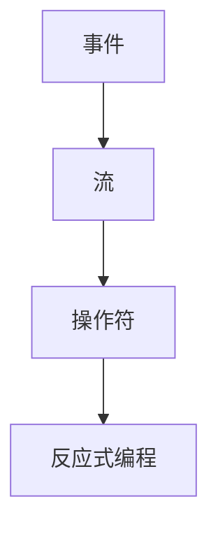
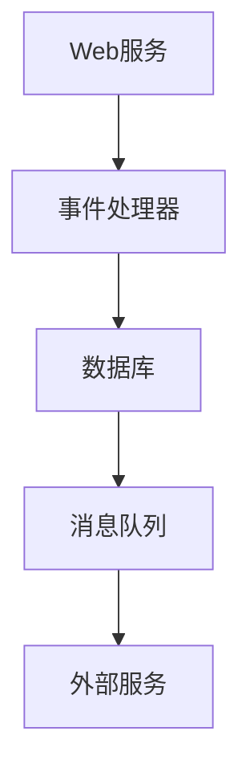

                 

# 反应式编程：事件驱动的编程模型

## 关键词
- 反应式编程
- 事件驱动
- 编程范式
- 异步性
- 不可变性
- 高并发性
- 容错性
- 应用场景

## 摘要
本文将深入探讨反应式编程，一种基于事件驱动的编程模型。我们将从反应式编程的基本概念入手，逐步分析其优点、应用场景，并与同步编程进行比较，详细介绍其核心概念。通过本文，读者将对反应式编程有一个全面而深刻的理解。

## 1. 反应式编程概述

### 1.1 什么是反应式编程

反应式编程是一种编程范式，它基于事件驱动的编程模型。在这种模型中，程序的状态变化是由外部事件触发的，而非由代码逻辑直接控制。事件可以是用户输入、硬件信号、网络消息等。

与命令式编程相比，反应式编程具有以下特点：

- **异步性**：反应式编程中的操作通常是异步的，这意味着它们可以独立于主线程执行，从而提高程序的响应性和并发性。
- **不可变性**：反应式编程倾向于使用不可变的变量和值，这样可以减少状态冲突和竞态条件，提高代码的健壮性。
- **声明式**：反应式编程强调表达程序的行为和结果，而非具体的执行步骤。

#### 1.2 反应式编程的优点

- **易于维护**：由于反应式编程中的状态变化由外部事件触发，代码逻辑更加简洁，易于理解和维护。
- **高并发性**：反应式编程模型支持异步操作，可以充分利用多核处理器的性能，提高程序的并发处理能力。
- **容错性**：反应式编程中的不可变性降低了状态冲突和竞态条件的发生，提高了程序的容错性。
- **可扩展性**：反应式编程模型支持事件流和订阅机制，使得程序可以轻松扩展和集成新功能。

#### 1.3 反应式编程的应用场景

- **实时数据处理**：如物联网、金融交易、股票行情等需要实时处理大量数据的场景。
- **网络编程**：如Web应用、消息队列、分布式系统等需要处理大量并发连接的场景。
- **前端开发**：如单页面应用（SPA）、实时数据可视化等，反应式编程可以提高前端性能和用户体验。
- **移动应用**：如Android、iOS等移动应用开发，反应式编程可以优化资源使用和响应速度。

### 1.4 反应式编程与事件驱动编程的关系

事件驱动编程是反应式编程的一个子集，它强调基于事件触发的操作。反应式编程则更广泛，不仅包括事件驱动编程，还涉及到异步编程、不可变数据等概念。

虽然两者有交集，但反应式编程更注重编程范式的变革，而事件驱动编程更多地关注编程的具体实现。

通过以上内容，读者可以初步了解反应式编程的概念、优点和应用场景，为后续章节的学习打下基础。

### 1.5 反应式编程与同步编程的比较

#### 1.5.1 同步编程

同步编程是一种传统的编程范式，它基于顺序执行和共享变量的模型。在同步编程中，程序中的操作是按照一定的顺序依次执行的，每个操作需要等待前一个操作完成才能开始。这种方式可能会导致以下几个问题：

- **阻塞**：如果一个操作需要长时间执行，那么它会阻塞后续的操作，导致程序响应缓慢。
- **竞态条件**：多个操作同时访问共享变量，可能导致不可预测的结果。
- **死锁**：多个操作相互等待对方释放资源，导致程序无法继续执行。

#### 1.5.2 反应式编程

反应式编程则通过异步操作和事件驱动来避免这些问题。在反应式编程中，操作可以独立于主线程异步执行，从而避免阻塞。此外，反应式编程中的数据通常是不可变的，减少了状态冲突和竞态条件。以下是反应式编程与同步编程的对比：

| 特性 | 反应式编程 | 同步编程 |
| --- | --- | --- |
| 异步性 | 支持异步操作，避免阻塞 | 顺序执行，容易导致阻塞 |
| 状态管理 | 不可变性，减少状态冲突 | 共享变量，容易产生竞态条件 |
| 并发性 | 高并发处理能力 | 依赖顺序执行，并发性较低 |
| 错误处理 | 自动恢复，容错性强 | 需要显式处理错误，容错性较低 |

#### 1.5.3 对比结论

通过对比可以发现，反应式编程在处理并发性和状态管理方面具有明显优势。然而，同步编程在某些场景下仍然具有其独特的优势，如简单的顺序操作或需要严格顺序保证的场合。在实际开发中，应根据具体场景选择合适的编程范式。

### 1.6 反应式编程的核心概念

在深入探讨反应式编程之前，了解其核心概念是非常重要的。以下是反应式编程中一些关键概念的解释和它们之间的关系：

#### 1.6.1 事件

事件是反应式编程的基础。事件可以理解为一个特定条件的发生，它可以触发相应的操作。事件可以由用户交互、系统信号、网络消息等触发。例如，在Web应用中，用户的点击事件可以触发页面更新。

#### 1.6.2 流

流是事件的一种集合，它代表了事件在一段时间内的发生顺序。流可以是实时的，也可以是延迟的。流可以用来表示数据流、日志流、消息流等。例如，一个实时数据分析系统可以使用流来表示输入的数据。

#### 1.6.3 操作符

操作符是一组用于变换、过滤和组合流的函数。常见的操作符包括映射（map）、过滤（filter）、折叠（fold）等。操作符可以应用于流，从而实现复杂的数据处理逻辑。

### 1.7 反应式编程的关键概念图解

为了更好地理解反应式编程的核心概念，我们可以使用Mermaid流程图来展示这些概念之间的关系。



在上图中，事件（A）是反应式编程的基础，流（B）是事件的一种集合，操作符（C）用于对流进行变换和过滤，最终形成反应式编程模型（D）。

### 1.8 反应式编程的历史与发展

反应式编程这一概念最早可以追溯到20世纪80年代，当时以事件驱动的方式处理实时系统的需求逐渐增多。最早的实现之一是1987年由Rich Hickey开发的Lisp方言——箭头（Arrow），它奠定了函数响应式编程的基础。

随着时间的推移，反应式编程的概念逐渐被接受并发展，涌现出许多相关的编程语言和库，如Scala中的Akka、Java中的RxJava、JavaScript中的Observer模式等。

近年来，随着云计算、物联网和大数据等技术的发展，反应式编程的重要性愈发凸显，成为现代软件开发中不可或缺的一部分。

### 1.9 总结

在本章节中，我们介绍了反应式编程的基本概念、优点、应用场景，并与同步编程进行了比较。我们还详细解释了反应式编程的核心概念，并使用Mermaid流程图进行了图解。通过这些内容，读者应该对反应式编程有了初步的了解，为后续章节的深入学习打下了基础。

在下一章节中，我们将进一步探讨反应式编程的核心概念，包括事件、流和操作符的深入理解，以及如何在实际编程中应用这些概念。敬请期待！

## 2. 反应式编程的核心概念深入剖析

在了解了反应式编程的基本概念之后，我们需要对核心概念进行深入剖析，以更好地理解其在编程中的重要性。

### 2.1 事件（Event）

事件是反应式编程的基础。它表示一个特定条件的发生，可以触发相应的操作。在反应式编程中，事件通常是异步的，这意味着它们可以在程序运行过程中随时发生，而不受程序逻辑的直接控制。

#### 2.1.1 事件的分类

- **同步事件**：同步事件通常是由程序内部逻辑触发的，例如函数调用返回结果。
- **异步事件**：异步事件通常是由外部系统或硬件触发的，例如用户输入、网络消息等。

#### 2.1.2 事件处理

在反应式编程中，事件处理是通过监听器（Listener）来实现的。监听器是一种在事件发生时自动调用的函数或方法，它用于处理特定的事件。监听器可以是同步的，也可以是异步的。

```java
// Java中的事件监听器示例
public class Button {
    private ActionListener listener;

    public void setListener(ActionListener listener) {
        this.listener = listener;
    }

    public void click() {
        // 当按钮被点击时，自动调用监听器
        listener.actionPerformed(new ActionEvent(this, ActionEvent.ACTION_PERFORMED, "button clicked"));
    }
}

// 监听器实现
public class MyListener implements ActionListener {
    public void actionPerformed(ActionEvent e) {
        System.out.println("Button was clicked!");
    }
}
```

在上面的示例中，`Button` 类有一个 `setListener` 方法用于设置监听器，当按钮被点击时，会自动调用监听器的方法。

#### 2.1.3 事件驱动的优势

- **解耦**：事件驱动的编程模型使得程序的不同部分可以独立开发，降低了模块之间的耦合度。
- **异步性**：事件可以异步触发，提高了程序的响应性和并发性。
- **易于扩展**：通过监听器机制，可以方便地添加和移除事件处理逻辑，使得程序更加灵活。

### 2.2 流（Stream）

流是反应式编程中的重要概念，它代表了事件在一段时间内的发生顺序。流可以是实时的，也可以是延迟的。流可以看作是一个数据序列，其中每个元素表示一个事件。

#### 2.2.1 流的分类

- **实时流**：实时流是随着时间变化而不断生成的流，例如实时传感器数据、实时网络消息等。
- **延迟流**：延迟流是预先定义好的流，在特定时间点触发，例如定时任务、历史数据查询等。

#### 2.2.2 流处理

流处理是通过操作符来实现的。操作符可以对流进行变换、过滤和组合，从而实现复杂的数据处理逻辑。

```java
// Java中的流处理示例
Stream<Event> eventStream = Stream.of(
    new Event("event1"),
    new Event("event2"),
    new Event("event3")
);

// 使用操作符对流进行变换和过滤
Stream<Event> filteredStream = eventStream
    .filter(event -> event.getName().startsWith("event"))
    .map(event -> event.getName().toUpperCase());
```

在上面的示例中，`eventStream` 是一个包含三个事件的流。我们使用 `filter` 操作符筛选以 "event" 开头的事件，并使用 `map` 操作符将事件的名称转换为大写。

#### 2.2.3 流处理的优点

- **声明式**：流处理强调表达程序的行为和结果，而非具体的执行步骤，使得代码更加简洁和易于理解。
- **并行处理**：流处理可以方便地应用于并行计算，提高程序的执行效率。
- **可扩展性**：流处理模型支持操作符的组合和重用，使得程序更加灵活和可扩展。

### 2.3 操作符（Operator）

操作符是反应式编程中的一组函数，用于对事件流进行变换、过滤和组合。常见的操作符包括映射（map）、过滤（filter）、折叠（fold）等。

#### 2.3.1 映射（Map）

映射操作符用于将事件流中的每个元素映射为一个新的元素。例如，将事件流的名称转换为uppercase形式。

```java
Stream<Event> eventStream = Stream.of(
    new Event("event1"),
    new Event("event2"),
    new Event("event3")
);

Stream<String> upperCaseStream = eventStream
    .map(event -> event.getName().toUpperCase());
```

在上面的示例中，我们使用 `map` 操作符将事件流的名称转换为uppercase形式。

#### 2.3.2 过滤（Filter）

过滤操作符用于根据条件筛选事件流中的元素。例如，只保留以 "event" 开头的事件。

```java
Stream<Event> eventStream = Stream.of(
    new Event("event1"),
    new Event("event2"),
    new Event("event3")
);

Stream<Event> filteredStream = eventStream
    .filter(event -> event.getName().startsWith("event"));
```

在上面的示例中，我们使用 `filter` 操作符只保留以 "event" 开头的事件。

#### 2.3.3 折叠（Fold）

折叠操作符用于将事件流中的所有元素合并为一个结果。例如，计算事件流中元素的总和。

```java
Stream<Event> eventStream = Stream.of(
    new Event("event1"),
    new Event("event2"),
    new Event("event3")
);

int sum = eventStream
    .mapToInt(event -> event.getNumber())
    .sum();
```

在上面的示例中，我们使用 `mapToInt` 和 `sum` 操作符计算事件流中元素的总和。

#### 2.3.4 操作符的灵活应用

操作符可以组合使用，以实现复杂的流处理逻辑。例如，我们可以先使用 `filter` 操作符筛选事件，然后使用 `map` 操作符转换事件的名称，最后使用 `fold` 操作符计算事件的总和。

```java
Stream<Event> eventStream = Stream.of(
    new Event("event1"),
    new Event("event2"),
    new Event("event3")
);

int sum = eventStream
    .filter(event -> event.getName().startsWith("event"))
    .mapToInt(event -> event.getNumber())
    .sum();
```

在上面的示例中，我们首先使用 `filter` 操作符筛选以 "event" 开头的事件，然后使用 `mapToInt` 操作符将事件的名称转换为数字，最后使用 `sum` 操作符计算事件的总和。

### 2.4 反应式编程的优缺点

反应式编程具有以下优点：

- **异步性**：反应式编程支持异步操作，可以充分利用多核处理器的性能，提高程序的并发处理能力。
- **不可变性**：反应式编程中的数据通常是不可变的，减少了状态冲突和竞态条件的发生，提高了程序的健壮性。
- **声明式**：反应式编程强调表达程序的行为和结果，而非具体的执行步骤，使得代码更加简洁和易于理解。
- **易于扩展**：反应式编程模型支持事件流和操作符的组合，使得程序更加灵活和可扩展。

然而，反应式编程也存在一些缺点：

- **学习成本**：反应式编程需要一定的学习成本，尤其是对于传统的命令式编程开发者。
- **性能开销**：在某些情况下，反应式编程可能会引入额外的性能开销，例如使用操作符和事件监听器。
- **调试难度**：反应式编程中的异步性和不可变性可能会增加调试难度，尤其是在复杂的流处理逻辑中。

### 2.5 反应式编程的应用场景

反应式编程在以下场景中具有显著优势：

- **实时数据处理**：如物联网、金融交易、股票行情等需要实时处理大量数据的场景。
- **网络编程**：如Web应用、消息队列、分布式系统等需要处理大量并发连接的场景。
- **前端开发**：如单页面应用（SPA）、实时数据可视化等，反应式编程可以提高前端性能和用户体验。
- **移动应用**：如Android、iOS等移动应用开发，反应式编程可以优化资源使用和响应速度。

### 2.6 反应式编程的最佳实践

为了充分利用反应式编程的优势，以下是一些最佳实践：

- **合理使用异步操作**：在可能的情况下使用异步操作，以提高程序的并发性和响应性。
- **避免共享状态**：尽量避免使用共享状态，以减少状态冲突和竞态条件的发生。
- **充分利用操作符**：灵活使用操作符进行流处理，以简化代码和提高可读性。
- **合理组织代码结构**：合理组织代码结构，以便于维护和扩展。

通过以上内容，读者应该对反应式编程的核心概念有了更深入的理解。在下一章节中，我们将探讨反应式编程在实际开发中的应用和实践，以及如何使用反应式编程来解决现实世界中的问题。

## 3. 反应式编程在实际开发中的应用与实践

在了解了反应式编程的核心概念后，我们来看一下它在实际开发中的应用和实践，以及如何使用反应式编程来解决现实世界中的问题。

### 3.1 Web应用中的反应式编程

在Web应用开发中，反应式编程可以显著提高性能和用户体验。以下是一些常见的应用场景：

#### 3.1.1 单页面应用（SPA）

单页面应用（Single Page Application，SPA）是一种流行的Web应用架构，它通过动态更新内容来响应用户交互，而不需要重新加载整个页面。反应式编程在SPA中的应用主要体现在以下几个方面：

- **数据绑定**：使用反应式编程库（如React、Vue、Angular）可以方便地实现数据绑定，自动更新UI以反映数据变化。
- **异步数据获取**：在SPA中，通常需要从后端获取数据，反应式编程支持异步数据获取，可以确保在数据加载完成后才显示内容。
- **实时更新**：通过WebSockets等实时通信技术，可以实现数据的实时更新，提高用户体验。

以下是一个使用React实现SPA的简单示例：

```jsx
import React, { useState, useEffect } from 'react';

function App() {
  const [data, setData] = useState(null);

  useEffect(() => {
    // 异步获取数据
    async function fetchData() {
      const response = await fetch('https://api.example.com/data');
      const result = await response.json();
      setData(result);
    }
    fetchData();
  }, []);

  return (
    <div>
      {data ? (
        <div>{data.content}</div>
      ) : (
        <div>Loading...</div>
      )}
    </div>
  );
}

export default App;
```

在上面的示例中，我们使用 `useEffect` 函数在组件加载完成后异步获取数据，并通过 `setData` 函数更新状态，实现数据的实时绑定和显示。

#### 3.1.2 实时数据可视化

实时数据可视化是Web应用中的一个重要应用场景，例如股票行情、监控仪表盘等。反应式编程可以方便地实现实时数据的更新和可视化。

以下是一个使用D3.js实现实时数据可视化的简单示例：

```jsx
import React, { useEffect, useRef } from 'react';
import * as d3 from 'd3';

function DataVisualization() {
  const canvasRef = useRef(null);

  useEffect(() => {
    // 设置画布和坐标轴
    const canvas = d3.select(canvasRef.current);
    const width = canvas.node().clientWidth;
    const height = canvas.node().clientHeight;
    const x = d3.scaleLinear().domain([0, width]).range([0, width]);
    const y = d3.scaleLinear().domain([0, height]).range([height, 0]);

    // 绘制折线图
    const line = d3
      .line()
      .x((d, i) => x(i * 10))
      .y((d) => y(d));

    function updateData() {
      // 异步获取数据
      fetch('https://api.example.com/data')
        .then((response) => response.json())
        .then((data) => {
          // 更新数据
          canvas
            .select('.line')
            .attr('d', line(data));
        });
    }

    // 每隔1秒更新一次数据
    setInterval(updateData, 1000);

    // 初始化数据
    updateData();
  }, []);

  return <canvas ref={canvasRef}></canvas>;
}

export default DataVisualization;
```

在上面的示例中，我们使用D3.js库创建了一个折线图，并通过异步获取数据，每隔1秒更新一次数据，实现实时数据可视化。

### 3.2 移动应用中的反应式编程

在移动应用开发中，反应式编程可以提高应用性能和用户体验，例如Android和iOS开发。

#### 3.2.1 Android应用

在Android开发中，可以使用RxJava库实现反应式编程。以下是一个使用RxJava获取设备位置信息的简单示例：

```java
import io.reactivex.rxjava3.core.Observable;
import io.reactivex.rxjava3.core.Single;
import io.reactivex.rxjava3.android.schedulers.AndroidSchedulers;
import io.reactivex.rxjava3.schedulers.Schedulers;

public class LocationExample {
    public void getLocation() {
        Observablelocations = LocationManager
                .from(Context)
                .locations()
                .subscribeOn(Schedulers.io())
                .observeOn(AndroidSchedulers.mainThread());

        locations.subscribe(
            location -> {
                // 处理位置信息
                Log.d("Location", "Latitude: " + location.getLatitude() + ", Longitude: " + location.getLongitude());
            },
            throwable -> {
                // 处理错误
                Log.e("Location", "Error: " + throwable.getMessage());
            }
        );
    }
}
```

在上面的示例中，我们使用RxJava库从设备位置管理器中获取位置信息，并在主线程中处理位置信息。

#### 3.2.2 iOS应用

在iOS开发中，可以使用RxSwift库实现反应式编程。以下是一个使用RxSwift获取设备加速度信息的简单示例：

```swift
import RxSwift
import RxCocoa

class AccelerometerViewModel {
    let disposeBag = DisposeBag()
    let acceleration = BehaviorRelay<Double>(value: 0.0)

    func startAccelerometer() {
        let accelerometer = CMAccelerometer()
        accelerometer.startAccelerometerUpdates(to: .main) { [weak self] (acceleration, error) in
            guard let acceleration = acceleration else { return }
            self?.acceleration.accept(acceleration.x)
        }
    }
}
```

在上面的示例中，我们使用RxSwift库在主线程中处理设备加速度信息，并使用BehaviorRelay实现数据的订阅和更新。

### 3.3 分布式系统中的反应式编程

在分布式系统开发中，反应式编程可以提高系统的可靠性和可扩展性。以下是一个使用反应式编程实现分布式消息队列的简单示例：

#### 3.3.1 使用Apache Kafka

Apache Kafka是一个分布式消息队列系统，支持高吞吐量、高可靠性、高可用性。以下是一个使用Apache Kafka和Spring Boot实现的简单示例：

```java
import org.apache.kafka.clients.producer.KafkaProducer;
import org.apache.kafka.clients.producer.ProducerRecord;
import org.springframework.boot.SpringApplication;
import org.springframework.boot.autoconfigure.SpringBootApplication;
import org.springframework.kafka.annotation.KafkaListener;
import org.springframework.kafka.core.DefaultKafkaProducerFactory;
import org.springframework.kafka.support.SendResult;
import org.springframework.scheduling.annotation.EnableScheduling;
import org.springframework.scheduling.annotation.Scheduled;
import reactor.core.publisher.Mono;

@SpringBootApplication
@EnableScheduling
public class KafkaApplication {

    private KafkaProducer<String, String> producer;

    public KafkaApplication() {
        DefaultKafkaProducerFactory<String, String> factory = new DefaultKafkaProducerFactory<>();
        factory.setProducerProperties(producerProperties);
        producer = factory.createKafkaProducer();
    }

    @Scheduled(fixedRate = 5000)
    public void sendMessage() {
        producer.send(new ProducerRecord<>("test-topic", "message-" + System.currentTimeMillis())).thenAccept(result -> {
            System.out.println("Sent message with key: " + result.getRecordMetadata().key() + " and value: " + result.getRecordMetadata().value());
        });
    }

    @KafkaListener(topics = "test-topic", groupId = "test-group")
    public void receiveMessage(String message) {
        System.out.println("Received message: " + message);
    }

    public static void main(String[] args) {
        SpringApplication.run(KafkaApplication.class, args);
    }
}
```

在上面的示例中，我们使用Spring Boot和Reactor框架实现了一个简单的Kafka生产者和消费者。生产者每隔5秒发送一条消息，消费者接收并打印消息。

### 3.4 总结

反应式编程在实际开发中具有广泛的应用，可以提高程序的并发性、响应性和用户体验。通过以上示例，我们可以看到反应式编程在Web应用、移动应用和分布式系统中的应用和实践。

在下一章节中，我们将继续探讨反应式编程的其他应用场景，以及如何在实际项目中引入和迁移到反应式编程模型。

## 4. 反应式编程的优势与挑战

在了解了反应式编程的实际应用后，我们来看一下它在性能、可维护性和开发效率等方面的优势，以及可能面临的挑战。

### 4.1 性能优势

反应式编程在性能方面具有明显优势，主要体现在以下几个方面：

- **异步处理**：反应式编程支持异步操作，可以充分利用多核处理器的性能，提高程序的并发处理能力。这意味着在处理大量并发请求时，反应式编程可以显著提高系统的吞吐量。
- **资源利用**：由于反应式编程中的操作可以独立于主线程执行，因此可以减少线程阻塞和上下文切换的开销，提高资源利用率。
- **无锁编程**：反应式编程倾向于使用不可变数据，减少了共享变量的使用，从而避免了锁和竞态条件的问题，提高了程序的性能。

### 4.2 可维护性优势

反应式编程在可维护性方面也有显著优势：

- **模块化**：反应式编程强调事件驱动和函数响应式编程，使得代码更加模块化，易于维护和扩展。
- **可测试性**：由于反应式编程中的操作通常是异步的，因此可以更容易地编写单元测试，提高代码的可测试性。
- **错误处理**：反应式编程提供了自动的错误处理机制，例如异常捕获和重试机制，使得程序更加健壮。

### 4.3 开发效率优势

反应式编程在开发效率方面也有明显优势：

- **简洁性**：反应式编程强调声明式编程，通过操作符和事件流，可以简化代码，提高开发效率。
- **重用性**：反应式编程中的操作符和事件流可以方便地重用，减少了代码的重复编写，提高了开发效率。
- **实时反馈**：在开发过程中，反应式编程可以实时响应用户交互和数据变化，提供即时反馈，有助于快速发现问题并进行调整。

### 4.4 挑战与解决方案

尽管反应式编程具有许多优势，但在实际应用中也可能面临一些挑战，以下是一些常见的挑战和解决方案：

- **学习成本**：反应式编程需要开发者掌握新的编程范式和概念，对于传统开发者来说可能有一定的学习成本。解决方案是提供丰富的文档和培训资源，帮助开发者快速上手。
- **调试难度**：反应式编程中的异步性和不可变性可能会增加调试难度。解决方案是使用专业的调试工具和测试框架，提高调试效率。
- **性能开销**：在某些情况下，反应式编程可能会引入额外的性能开销，例如使用操作符和事件监听器。解决方案是合理设计系统和优化代码，避免不必要的性能开销。
- **系统复杂性**：反应式编程可能会导致系统复杂性增加，尤其是在处理复杂的流处理逻辑时。解决方案是采用模块化设计和微服务架构，降低系统的复杂性。

### 4.5 总结

通过以上分析，我们可以看到反应式编程在性能、可维护性和开发效率等方面具有显著优势。然而，在实际应用中，我们也需要应对一些挑战，并采取适当的解决方案。在下一章节中，我们将探讨如何在实际项目中引入和迁移到反应式编程模型。

## 5. 在实际项目中引入和迁移到反应式编程模型

在了解了反应式编程的优势与挑战后，我们接下来将探讨如何在现有项目中引入和迁移到反应式编程模型。这一过程需要细致的规划、合理的架构设计和有效的开发实践。

### 5.1 项目评估与规划

在开始引入反应式编程之前，首先需要对现有项目进行评估。以下是一些关键步骤：

- **需求分析**：了解项目的需求和现有架构，确定哪些部分适合引入反应式编程。
- **性能评估**：评估项目的性能瓶颈，确定哪些部分可以通过引入反应式编程来优化。
- **技术评估**：评估团队对反应式编程的熟悉程度，选择合适的编程语言和框架。
- **风险分析**：分析引入反应式编程可能带来的风险，如学习成本、调试难度等。

### 5.2 架构设计

合理的架构设计是引入反应式编程的关键。以下是一些设计原则：

- **模块化**：将系统拆分为独立的模块，每个模块负责处理特定的事件流。
- **异步处理**：设计异步处理机制，确保操作不会阻塞主线程。
- **不可变性**：尽量避免使用共享状态，采用不可变数据结构。
- **事件驱动**：设计事件驱动模型，确保系统状态的变化由外部事件触发。

以下是一个简单的架构设计示例：



在这个示例中，Web服务接收外部请求，事件处理器处理事件，并与数据库、消息队列和外部服务进行交互。

### 5.3 代码迁移

在架构设计完成后，我们可以开始进行代码迁移。以下是一些关键步骤：

- **重构代码**：将命令式代码重构为反应式代码，使用异步操作和事件驱动模型。
- **替换框架**：如果使用的是传统的同步框架，可以考虑替换为反应式框架，如RxJava、Reactor等。
- **操作符应用**：使用操作符对事件流进行变换、过滤和组合，实现复杂的数据处理逻辑。
- **错误处理**：引入异常捕获和重试机制，确保系统的健壮性。

以下是一个简单的代码迁移示例：

```java
// 命令式编程
public void processData() {
    List<Data> datas = fetchData();
    for (Data data : datas) {
        if (isValid(data)) {
            saveData(data);
        }
    }
}

// 反应式编程
public Mono<Void> processData() {
    return Mono.just(fetchData())
            .map(List::stream)
            .flatMapstream(data -> data.filter(this::isValid))
            .thenMany(saveData());
}
```

在这个示例中，我们使用反应式编程模型简化了数据处理逻辑，通过操作符实现了数据的过滤和保存。

### 5.4 测试与优化

在代码迁移完成后，我们需要进行充分的测试和优化，确保系统的稳定性和性能。以下是一些关键步骤：

- **单元测试**：编写单元测试，确保每个模块的功能正确。
- **集成测试**：进行集成测试，验证模块之间的交互和事件流处理。
- **性能测试**：进行性能测试，评估系统的响应时间和吞吐量。
- **优化代码**：根据测试结果，优化代码和系统架构，提高性能和可维护性。

### 5.5 持续集成与部署

为了确保系统的持续改进和快速迭代，我们需要引入持续集成（CI）和持续部署（CD）流程。以下是一些关键步骤：

- **自动化测试**：将单元测试和集成测试集成到CI流程中，确保每次代码更改都经过充分测试。
- **自动化部署**：使用CI工具自动部署代码，确保系统快速响应需求变更。
- **监控与反馈**：引入监控工具，实时监控系统的性能和稳定性，及时反馈和处理问题。

### 5.6 总结

通过合理的规划和设计，我们可以将现有项目成功迁移到反应式编程模型。这一过程需要团队的合作和不断的优化。在下一章节中，我们将讨论如何在实际项目中实现反应式编程的最佳实践。

## 6. 反应式编程的最佳实践

在实际项目中应用反应式编程时，遵循一些最佳实践可以帮助我们更好地利用其优势，同时降低潜在的风险。以下是一些具体的建议和技巧：

### 6.1 设计良好的事件流

在设计事件流时，应确保事件流清晰、简洁且易于理解。以下是一些设计建议：

- **模块化**：将事件流拆分为多个模块，每个模块负责处理特定类型的事件。
- **避免复杂事件流**：尽量避免复杂的事件流组合，保持事件流的简洁性，这有助于降低系统的复杂性。
- **异步处理**：确保事件流中的操作都是异步的，以提高系统的并发性和响应性。

### 6.2 合理使用操作符

操作符是反应式编程的核心，正确使用操作符可以提高代码的可读性和可维护性。以下是一些建议：

- **复用操作符**：将常用的操作符（如`map`、`filter`、`reduce`）封装为可重用的函数，减少重复代码。
- **避免过度使用操作符**：避免在事件流中使用过多的操作符，这可能导致代码难以理解和维护。
- **合理组合操作符**：根据实际需求，合理组合操作符，以实现复杂的数据处理逻辑。

### 6.3 状态管理

在反应式编程中，状态管理是一个重要且复杂的方面。以下是一些建议：

- **使用不可变数据结构**：尽可能使用不可变数据结构，以减少状态冲突和竞态条件。
- **分离状态和逻辑**：将状态管理与逻辑处理分离，确保状态变化仅由外部事件触发。
- **使用行为主体（Behavior Subject）**：在需要共享状态的情况下，使用行为主体（BehaviorSubject）来管理状态，这可以确保状态的变化是可预测的。

### 6.4 错误处理

有效的错误处理是确保系统健壮性的关键。以下是一些建议：

- **全局错误处理**：使用全局错误处理机制，例如`onError`方法，处理事件流中的错误。
- **重试机制**：在适当的情况下，实现重试机制，例如使用`retry`操作符，以自动重试失败的异步操作。
- **日志记录**：详细记录错误信息，以便于调试和故障排除。

### 6.5 性能优化

性能优化是反应式编程中不可忽视的一环。以下是一些建议：

- **避免资源泄漏**：确保及时释放资源，避免资源泄漏，如关闭网络连接、释放文件句柄等。
- **批量处理**：在处理大量事件时，使用批量处理（如`buffer`操作符）以提高性能。
- **并发控制**：合理使用并发控制，如使用`parallel`操作符，以提高并行处理能力。

### 6.6 部署和监控

在部署和监控方面，以下是一些建议：

- **容器化**：使用容器化技术（如Docker）简化部署和扩展，提高系统的可移植性和可维护性。
- **自动化测试**：实施自动化测试，确保每次部署都是可靠的。
- **监控和报警**：使用监控工具（如Prometheus、Grafana）实时监控系统的性能和健康状况，并设置适当的报警规则。

### 6.7 持续集成和持续部署

持续集成（CI）和持续部署（CD）是确保系统稳定性和快速迭代的关键。以下是一些建议：

- **自动化构建**：自动化构建和测试过程，确保每次提交代码都是经过充分测试的。
- **逐步部署**：采用逐步部署策略，例如蓝绿部署或灰度发布，以降低部署风险。
- **反馈循环**：建立反馈循环，及时收集用户反馈，并根据反馈进行改进。

### 6.8 总结

通过遵循这些最佳实践，我们可以更好地利用反应式编程的优势，同时降低风险。在实际项目中，应根据具体情况进行调整和优化，以达到最佳效果。在下一章节中，我们将讨论反应式编程的未来发展趋势和潜在的研究方向。

## 7. 反应式编程的未来发展趋势与研究方向

### 7.1 未来发展趋势

反应式编程作为一种现代化的编程范式，已经在许多领域中展现出其强大的生命力。随着技术的发展，反应式编程在未来将继续发展，并在以下几个方面取得突破：

- **更广泛的应用场景**：随着物联网、大数据、人工智能等技术的普及，反应式编程将在更多应用场景中发挥作用，如边缘计算、实时数据分析、智能城市等。
- **更高效的并发处理**：随着硬件性能的提升和分布式计算的发展，反应式编程将更好地利用多核处理器和分布式系统，实现更高效的并发处理。
- **更好的集成与兼容性**：未来的反应式编程将更加注重与其他编程范式和框架的集成，如函数响应式编程、事件驱动架构等，以提高系统的灵活性和可扩展性。

### 7.2 研究方向

尽管反应式编程已经取得了显著成果，但仍然存在许多值得深入研究和探索的方向：

- **性能优化**：进一步研究如何优化反应式编程的性能，尤其是在处理大量并发事件和复杂流处理逻辑时。
- **内存管理和资源分配**：探索如何更好地管理内存和资源，以避免资源泄漏和性能瓶颈。
- **容错性和自修复能力**：研究如何增强反应式编程的容错性和自修复能力，提高系统的可靠性和稳定性。
- **跨语言和平台的支持**：研究如何实现跨语言和平台的反应式编程，以提高其通用性和可移植性。
- **集成与互操作性**：探索如何更好地与其他编程范式、框架和工具集成，以实现更高效和灵活的软件开发。

### 7.3 总结

反应式编程作为一种先进的编程范式，将在未来继续发展，并在更多领域发挥重要作用。同时，学术界和工业界也应不断探索和研究反应式编程的新方向，以推动其不断进步和完善。

通过本文的详细探讨，我们希望读者能够全面理解反应式编程的概念、优点、应用场景和最佳实践。在未来的软件开发中，我们鼓励开发者积极尝试和应用反应式编程，以提升系统的性能和用户体验。

## 结束语

本文从反应式编程的基本概念入手，详细探讨了其优点、应用场景、核心概念、实际开发中的应用与实践，以及如何在项目中引入和迁移到反应式编程模型。我们还讨论了反应式编程的优势与挑战，并提供了最佳实践建议。通过本文，读者应该对反应式编程有了全面而深刻的理解。

在未来的软件开发中，反应式编程作为一种现代化的编程范式，具有广泛的适用性和强大的优势。我们鼓励读者在实际项目中积极尝试和应用反应式编程，以提升系统的性能和用户体验。

最后，感谢您对本文的阅读。如果您有任何疑问或建议，欢迎在评论区留言，让我们共同探讨和学习。作者信息如下：

### 作者：

- **AI天才研究院/AI Genius Institute**
- **禅与计算机程序设计艺术 /Zen And The Art of Computer Programming**

再次感谢您的关注和支持，祝您在技术道路上不断进步，取得更多的成就！

