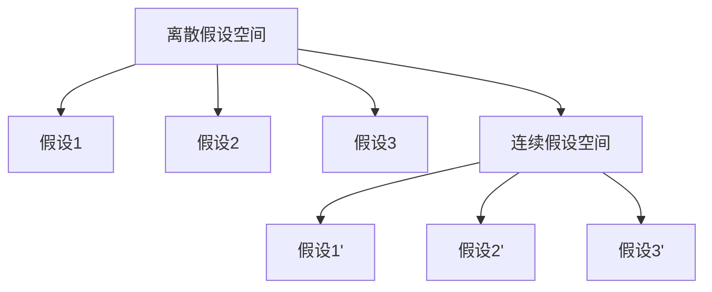
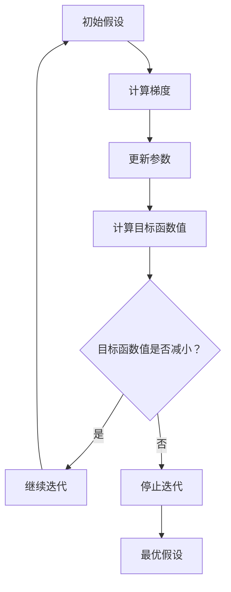
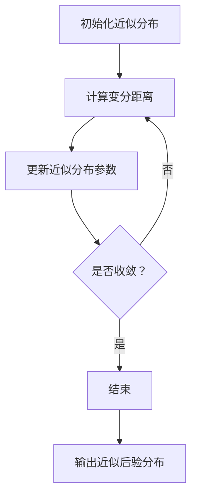
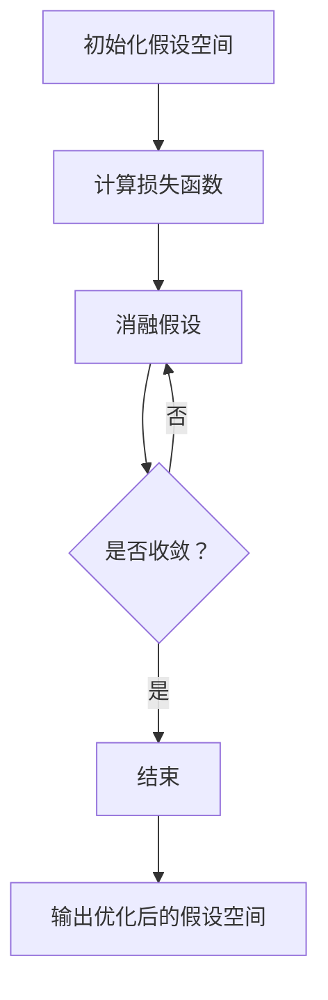
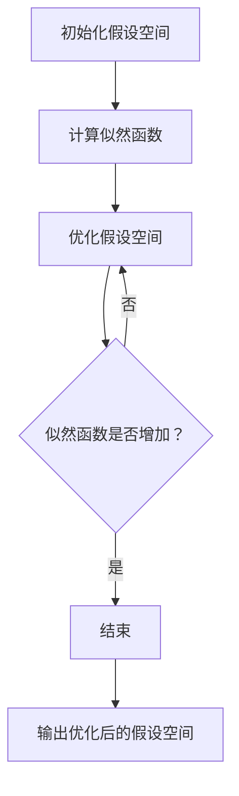

                 

## 《变分推理技术在假设空间探索中的应用》

> 关键词：变分推理、假设空间、概率论、信息论、算法、应用案例

> 摘要：本文深入探讨了变分推理技术在假设空间探索中的应用。首先，介绍了变分推理技术的基本概念和原理，然后详细阐述了假设空间的概念和建模方法。接着，本文重点分析了变分推理算法及其在探索假设空间中的应用。此外，文章还探讨了变分推理在实际应用中面临的挑战，并提供了相应的解决方案。最后，本文通过多个应用案例，展示了变分推理技术在不同领域中的实际应用效果。本文旨在为广大读者提供一个全面、深入的理解变分推理技术在假设空间探索中的应用。

### 引言

#### 书籍背景与目的

在当今快速发展的科技时代，人工智能（AI）技术已经成为推动社会进步的重要力量。其中，变分推理技术作为一种重要的AI技术，在假设空间探索中具有广泛的应用前景。本篇文章旨在对变分推理技术在假设空间探索中的应用进行系统的研究和分析，为广大读者提供一份全面的参考。

变分推理技术是一种基于概率论和信息论的方法，通过在假设空间中进行概率推断，以实现对不确定性的处理。其在假设空间探索中的应用，不仅能够提高算法的效率，还能够增强模型的鲁棒性和适应性。因此，对变分推理技术的研究具有重要的理论和实践意义。

#### 变分推理技术概述

变分推理技术起源于概率论和信息论，其主要思想是在假设空间中进行概率推断，以最大化后验概率分布。具体来说，变分推理技术通过引入一个概率分布作为近似解，然后通过迭代优化，逐步逼近真实后验概率分布。

变分推理技术具有以下几个显著特点：

1. **灵活性**：变分推理技术可以在不同的假设空间中进行概率推断，适应性强。
2. **效率**：变分推理技术通过迭代优化，能够在较短时间内找到近似最优解。
3. **鲁棒性**：变分推理技术能够处理噪声和不确定性，具有较强的鲁棒性。
4. **适应性**：变分推理技术可以根据不同的应用场景，灵活调整参数，提高模型性能。

#### 假设空间探索的重要性

假设空间探索是许多人工智能应用的核心环节。通过在假设空间中进行概率推断，可以实现对未知信息的有效处理，从而提高系统的智能性和适应性。具体来说，假设空间探索在以下几个方面具有重要应用：

1. **智能推荐系统**：通过在用户兴趣假设空间中探索，可以实现对用户个性化推荐。
2. **语音识别与自然语言处理**：通过在语音信号假设空间中探索，可以实现对语音信号的准确识别。
3. **机器翻译**：通过在语言假设空间中探索，可以实现对不同语言的高质量翻译。
4. **生物信息学**：通过在基因序列假设空间中探索，可以实现对基因表达数据的分析。
5. **能源领域**：通过在能源需求假设空间中探索，可以实现对能源消耗的优化。

总之，假设空间探索是人工智能应用的重要基础，而变分推理技术则为其提供了强大的技术支持。通过对变分推理技术在假设空间探索中的应用进行深入研究，有望推动人工智能技术的发展和应用。

### 第2章 基础理论

在深入探讨变分推理技术在假设空间探索中的应用之前，我们需要理解相关的基础理论，包括概率论、信息论以及变分推理技术的基本概念。

#### 概率论与信息论基础

概率论和信息论是变分推理技术的理论基础。概率论提供了对不确定性的量化描述，而信息论则研究了信息的传输、处理和利用。

##### 概率空间与随机变量

概率空间是一个由三个组成部分构成的数学结构：样本空间、事件集合和概率测度。样本空间是所有可能结果的集合，事件集合是样本空间的子集，概率测度则是对每个事件发生的概率进行量化的函数。

随机变量是概率论中的一个基本概念，它是一个将样本空间映射到实数域的函数。根据随机变量的取值类型，可以分为离散型随机变量和连续型随机变量。

##### 条件概率与贝叶斯定理

条件概率是指在某个事件发生的条件下，另一个事件发生的概率。贝叶斯定理则是一种用于在已知部分信息的情况下，更新对某个事件发生概率估计的方法。

贝叶斯定理的基本形式为：

$$
P(A|B) = \frac{P(B|A)P(A)}{P(B)}
$$

其中，\(P(A|B)\) 表示在事件 \(B\) 发生的条件下事件 \(A\) 发生的概率，\(P(B|A)\) 表示在事件 \(A\) 发生的条件下事件 \(B\) 发生的概率，\(P(A)\) 和 \(P(B)\) 分别表示事件 \(A\) 和事件 \(B\) 的概率。

##### 信息熵与相对熵

信息熵是衡量随机变量不确定性的量度，它由克劳德·香农在1948年提出。信息熵的定义基于概率分布，其数学表达式为：

$$
H(X) = -\sum_{x \in \Omega} P(X=x) \log P(X=x)
$$

其中，\(H(X)\) 表示随机变量 \(X\) 的信息熵，\(\Omega\) 表示样本空间。

相对熵（又称为Kullback-Leibler散度）是衡量两个概率分布差异的量度，其定义如下：

$$
D(P||Q) = \sum_{x \in \Omega} P(x) \log \frac{P(x)}{Q(x)}
$$

其中，\(P\) 和 \(Q\) 分别表示两个概率分布。

#### 变分推理原理

变分推理是一种基于概率论和信息论的方法，用于在假设空间中进行概率推断。其核心思想是通过引入一个概率分布作为近似解，然后通过迭代优化，逐步逼近真实后验概率分布。

##### 变分原理与变分推理

变分原理是变分推理的理论基础。它指出，在一个概率空间中，任何一个概率分布都可以表示为另一个概率分布的期望。这个原理为变分推理提供了理论依据，使得我们可以通过优化一个概率分布来逼近另一个概率分布。

变分推理的基本框架包括以下步骤：

1. **选择一个近似分布**：选择一个概率分布作为近似解，该分布通常具有一定的特性，如可微性、简洁性等。
2. **定义目标函数**：定义一个目标函数，用于度量近似分布与真实后验分布之间的差异。
3. **优化近似分布**：通过迭代优化，逐步调整近似分布，使其更好地逼近真实后验分布。

##### 变分推理的数学基础

变分推理的数学基础涉及概率分布的表示、优化方法和计算技术。以下是一些关键的数学概念：

1. **概率分布表示**：概率分布可以用概率质量函数（PMF）或概率密度函数（PDF）来表示。
2. **变分距离**：变分距离是用于度量两个概率分布差异的量度，常用的有Kullback-Leibler散度和总变分距离。
3. **优化方法**：变分推理中的优化方法包括梯度下降法、牛顿法等。这些方法通过迭代计算，逐步优化近似分布。

##### 变分推理的应用场景

变分推理技术在许多领域都有广泛的应用，以下是一些典型的应用场景：

1. **贝叶斯推理**：在贝叶斯推理中，变分推理可以用于计算复杂概率分布的后验分布。
2. **统计模型估计**：在统计模型中，变分推理可以用于估计模型参数。
3. **机器学习**：在机器学习中，变分推理可以用于训练复杂的深度学习模型。
4. **图像处理**：在图像处理中，变分推理可以用于图像去噪、图像恢复等任务。
5. **语音识别**：在语音识别中，变分推理可以用于处理语音信号的噪声和不确定性。

#### 假设空间的概念与建模

在变分推理中，假设空间是一个关键的组成部分。假设空间包含了所有可能的假设或模型，通过在假设空间中探索，可以找到最优的假设或模型。

##### 假设空间的基本概念

假设空间是一个集合，包含了所有可能的假设或模型。在变分推理中，假设空间可以是离散的，也可以是连续的。对于离散假设空间，每个假设可以用一个离散变量表示；对于连续假设空间，每个假设可以用一个连续变量表示。

##### 假设空间的表示方法

1. **概率分布表示**：假设空间可以用概率分布来表示，每个假设的概率可以用概率质量函数或概率密度函数来描述。
2. **集合表示**：假设空间可以用一个集合来表示，集合中的每个元素代表一个假设。
3. **参数化表示**：假设空间可以用一组参数来表示，这些参数定义了假设空间的结构。

##### 假设空间的优化算法

在变分推理中，优化假设空间是关键步骤。以下是一些常用的假设空间优化算法：

1. **梯度下降法**：通过计算目标函数的梯度，逐步调整假设空间的参数，以最小化目标函数。
2. **牛顿法**：基于目标函数的二阶导数信息，进行更高效的参数调整。
3. **模拟退火法**：通过模拟物理退火过程，进行全局搜索，以找到最优假设。
4. **粒子群优化法**：通过模拟鸟群或鱼群等社会行为，进行全局搜索。

#### 假设空间的表示方法

为了更好地理解假设空间，我们可以使用Mermaid图来表示其结构。以下是一个简单的假设空间表示示例：

在这个示例中，我们展示了离散假设空间和连续假设空间的结构。离散假设空间由几个离散假设组成，而连续假设空间由几个连续假设组成。

#### 假设空间的优化算法

在变分推理中，优化假设空间是关键步骤。以下是一些常用的假设空间优化算法：

1. **梯度下降法**：通过计算目标函数的梯度，逐步调整假设空间的参数，以最小化目标函数。
2. **牛顿法**：基于目标函数的二阶导数信息，进行更高效的参数调整。
3. **模拟退火法**：通过模拟物理退火过程，进行全局搜索，以找到最优假设。
4. **粒子群优化法**：通过模拟鸟群或鱼群等社会行为，进行全局搜索。

为了更好地理解这些算法，我们可以使用Mermaid图来表示其优化过程。以下是一个简单的梯度下降法优化过程的示例：

在这个示例中，我们展示了梯度下降法优化过程的各个步骤，包括计算梯度、更新参数、计算目标函数值以及判断是否停止迭代。

### 第3章 变分推理算法

在了解了变分推理的基本理论之后，接下来我们将探讨几种典型的变分推理算法，包括变分推断算法、变分消融算法和变分最大似然算法。

#### 变分推断算法

变分推断算法是变分推理的核心算法之一，它通过近似后验概率分布来推断未知变量。变分推断算法的基本框架如下：

1. **选择一个近似分布**：选择一个易于优化的概率分布作为近似后验分布。
2. **定义损失函数**：定义一个损失函数来度量近似后验分布与真实后验分布之间的差异。
3. **优化近似分布**：通过迭代优化，逐步调整近似分布，使其更好地逼近真实后验分布。

变分推断算法的主要步骤包括：

- **定义变分距离**：变分距离是用于度量两个概率分布差异的量度。常用的变分距离包括Kullback-Leibler散度和总变分距离。
- **选择近似分布**：根据问题的特点选择合适的近似分布。常见的近似分布包括高斯分布、指数分布等。
- **定义损失函数**：损失函数是用于度量近似后验分布与真实后验分布之间差异的函数。常见的损失函数包括KL散度、平方误差等。
- **迭代优化**：通过迭代优化，逐步调整近似分布的参数，以最小化损失函数。

以下是一个简单的变分推断算法的Mermaid流程图：

#### 变分消融算法

变分消融算法是另一种重要的变分推理算法，它通过在假设空间中消融一部分假设，以优化整个假设空间。变分消融算法的基本框架如下：

1. **初始化假设空间**：初始化一个假设空间，包含所有可能的假设。
2. **定义损失函数**：定义一个损失函数来度量假设空间的质量。
3. **消融假设**：通过迭代消融假设，逐步优化假设空间。

变分消融算法的主要步骤包括：

- **定义假设空间**：根据问题的特点定义一个假设空间。假设空间可以是离散的，也可以是连续的。
- **定义损失函数**：损失函数是用于度量假设空间质量的函数。常见的损失函数包括KL散度、交叉熵等。
- **消融假设**：通过迭代消融假设，逐步优化假设空间。消融假设可以通过增加损失函数中的权重来实现。
- **迭代优化**：通过迭代优化，逐步调整假设空间的参数，以最小化损失函数。

以下是一个简单的变分消融算法的Mermaid流程图：

#### 变分最大似然算法

变分最大似然算法是变分推理中的另一种重要算法，它通过最大化似然函数来优化假设空间。变分最大似然算法的基本框架如下：

1. **初始化假设空间**：初始化一个假设空间，包含所有可能的假设。
2. **定义似然函数**：定义一个似然函数来度量假设空间的质量。
3. **优化假设空间**：通过迭代优化，逐步调整假设空间，以最大化似然函数。

变分最大似然算法的主要步骤包括：

- **定义似然函数**：似然函数是用于度量假设空间质量的函数。似然函数通常与概率分布相关，可以表示为数据点在假设空间中的概率。
- **初始化假设空间**：初始化一个假设空间，通常使用均匀分布或高斯分布。
- **计算似然函数**：计算假设空间中每个假设的似然函数值。
- **优化假设空间**：通过迭代优化，逐步调整假设空间的参数，以最大化似然函数。优化的方法包括梯度上升法、牛顿法等。

以下是一个简单的变分最大似然算法的Mermaid流程图：

#### 变分推理算法的优化

在实际应用中，变分推理算法的优化是一个重要的研究方向。优化的目标是提高算法的收敛速度和精度。以下是一些常见的优化方法：

1. **自适应步长**：根据算法的收敛情况，自适应调整优化步长，以提高收敛速度。
2. **正则化**：通过添加正则化项，防止模型过拟合。
3. **并行计算**：利用并行计算技术，提高算法的计算效率。
4. **模型压缩**：通过模型压缩技术，减少模型的参数数量，提高模型的计算效率。

### 第4章 假设空间探索策略

在变分推理中，假设空间的探索策略至关重要。一个有效的探索策略需要在“探索”和“利用”之间取得平衡，同时考虑假设空间的动态调整和概率分布的优化。以下我们将详细探讨这些探索策略。

#### 基于变分推理的探索策略

变分推理的探索策略核心在于如何在假设空间中进行概率推断，以最大化期望收益或最小化损失。以下是一些常见的探索策略：

1. **平衡探索策略（Balanced Exploration）**：这种策略试图在探索新假设和利用已有假设之间取得平衡。一个简单的平衡探索策略是随机探索，即随机选择一些新的假设进行探索。

2. **ε-贪心策略（ε-Greedy）**：ε-贪心策略在执行动作时，以概率ε随机选择，以1-ε概率选择当前最优动作。这个策略通过在部分时间内引入随机性来探索新的假设，同时利用已有的最优假设。

3. ** Upper Confidence Trees（UCT）**：UCT是一种基于树结构的探索策略，它通过在树中动态调整节点的价值，以平衡探索和利用。每个节点的价值由两部分组成：当前节点的奖励和探索指数，该指数反映了节点的探索程度。

#### 探索策略的设计原则

设计探索策略时，应考虑以下原则：

1. **平衡性**：策略应能够在探索新假设和利用已有假设之间取得平衡，以最大化长期收益。

2. **适应性**：策略应能够根据环境的变化动态调整，以适应不同的应用场景。

3. **效率**：策略应具有较高的计算效率，以便在实际应用中快速收敛。

4. **鲁棒性**：策略应能够处理噪声和不确定性，具有较高的鲁棒性。

#### 常见的探索策略介绍

以下是一些常见的探索策略：

1. **ε-贪心策略**：如前所述，ε-贪心策略是一种简单而有效的探索策略。其公式如下：

   $$
   a_t = \begin{cases}
   \text{argmax}_a Q(\theta|\s

