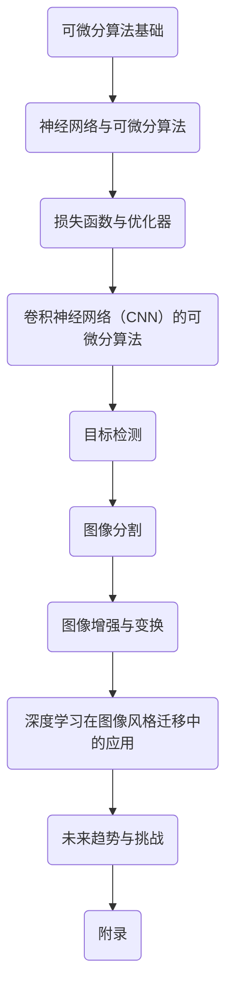
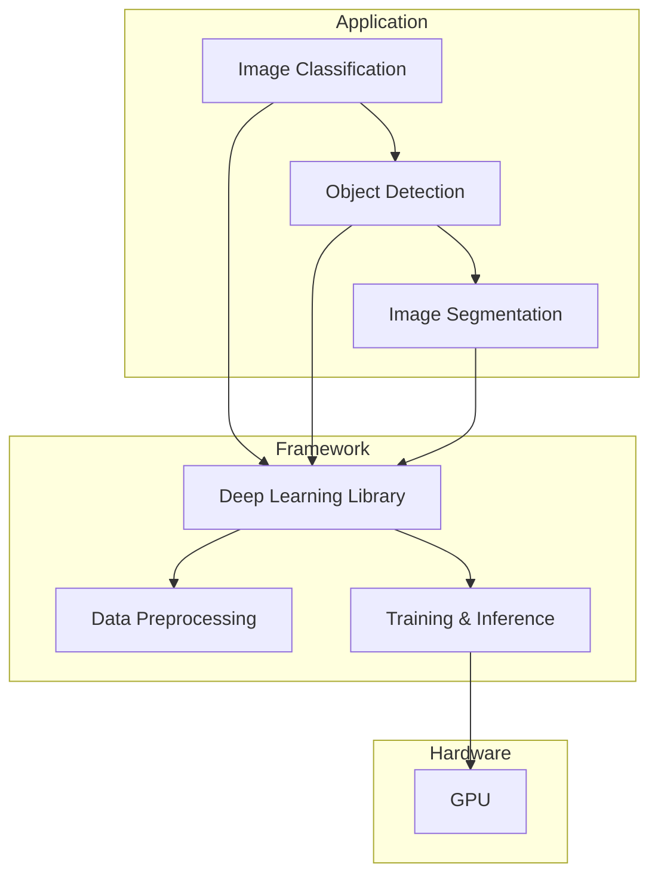
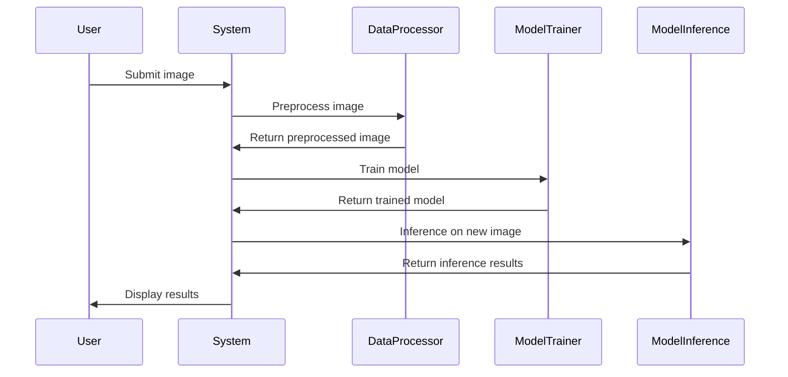

                 

**《可微分算法在计算机视觉任务中的创新》**

关键词：计算机视觉，可微分算法，神经网络，卷积神经网络，深度学习

摘要：本文深入探讨了可微分算法在计算机视觉任务中的应用，首先介绍了可微分算法的基本概念和原理，然后详细分析了卷积神经网络（CNN）在计算机视觉中的运用，以及目标检测、图像分割等具体任务中的应用。通过数学模型和Python代码示例，本文对可微分算法进行了详细阐述，旨在帮助读者理解和掌握这一前沿技术。

## 第一部分：可微分算法基础

### 第1章：引言

#### 1.1 可微分算法概述

可微分算法是深度学习中的一个核心概念，它允许我们在神经网络中计算梯度，进而进行参数的优化。在计算机视觉任务中，可微分算法的重要性尤为突出，因为它使得我们能够通过反向传播算法训练复杂的模型，从而实现对图像的自动标注和分类。

#### 1.2 计算机视觉中的可微分算法

计算机视觉是一个广泛而复杂的领域，涉及图像识别、目标检测、图像分割等多个子领域。在这些任务中，可微分算法为我们提供了一种有效的解决方案，使得我们可以通过训练神经网络来学习图像的特征，并利用这些特征来实现各种视觉任务。

#### 1.3 本书结构安排

本文分为两个主要部分。第一部分介绍了可微分算法的基础知识，包括其概念、原理和数学模型。第二部分则重点探讨了可微分算法在计算机视觉任务中的具体应用，包括目标检测、图像分割等。

## 第2章：神经网络与可微分算法

### 2.1 神经网络基础

神经网络是由大量简单计算单元（神经元）组成的复杂网络，这些神经元通过相互连接形成层次结构。神经网络通过学习输入数据，以实现对未知数据的预测和分类。

### 2.2 可微性原理

可微性原理是指，对于给定的函数，如果其导数存在，那么我们就可以通过导数来优化函数。在神经网络中，可微性原理使得我们可以通过反向传播算法计算损失函数的梯度，从而优化网络参数。

### 2.3 前向传播与反向传播算法

前向传播和反向传播是神经网络训练中的两个关键步骤。在前向传播过程中，输入数据通过网络逐层传递，最终得到输出。在反向传播过程中，利用输出误差计算梯度，并反向传播梯度以更新网络参数。

## 第3章：损失函数与优化器

### 3.1 损失函数

损失函数是衡量模型预测结果与真实结果之间差异的函数。在深度学习中，损失函数的选择和优化至关重要，因为它决定了模型训练的效果。

### 3.2 优化器

优化器是一种用于更新网络参数的算法。常见的优化器包括随机梯度下降（SGD）、Adam等。优化器的选择对模型的训练速度和效果有着重要影响。

### 3.3 损失函数与优化器的组合

损失函数和优化器的组合对模型的训练效果有着决定性影响。在计算机视觉任务中，我们需要根据具体任务的特点选择合适的损失函数和优化器，以达到最佳的训练效果。

## 第二部分：可微分算法在计算机视觉任务中的应用

### 第4章：卷积神经网络（CNN）的可微分算法

#### 4.1 卷积神经网络基础

卷积神经网络是一种特殊类型的神经网络，它通过卷积操作提取图像特征。CNN在计算机视觉领域取得了显著的成果，广泛应用于图像识别、目标检测等任务中。

#### 4.2 CNN的可微性分析

CNN的可微性分析是理解其工作原理的关键。通过分析CNN的卷积、激活、池化等操作，我们可以得出CNN的可微性结论。

#### 4.3 CNN在计算机视觉中的应用

CNN在计算机视觉任务中有着广泛的应用，包括图像分类、目标检测、图像分割等。通过具体的案例，我们可以更好地理解CNN在计算机视觉中的强大能力。

## 第5章：目标检测

#### 5.1 R-CNN算法原理

R-CNN是一种经典的目标检测算法，它通过区域建议、特征提取和分类器训练来实现目标检测。R-CNN在图像识别领域取得了显著成果。

#### 5.2 Fast R-CNN算法原理

Fast R-CNN是对R-CNN的改进，它通过使用区域建议网络（RPN）来加速特征提取和分类器训练。Fast R-CNN在目标检测任务中具有更高的效率和准确性。

#### 5.3 Faster R-CNN算法原理

Faster R-CNN是R-CNN的进一步改进，它通过使用区域建议网络（RPN）来加速特征提取和分类器训练。Faster R-CNN在目标检测任务中具有更高的效率和准确性。

## 第6章：图像分割

#### 6.1 FCN算法原理

FCN（全卷积神经网络）是一种用于图像分割的深度学习模型。它通过将卷积操作应用于整个图像，实现了像素级别的预测。

#### 6.2 U-Net算法原理

U-Net是一种用于医学图像分割的深度学习模型。它采用对称的卷积网络结构，具有更高的分割准确性和效率。

#### 6.3 DeepLab算法原理

DeepLab是一种用于语义分割的深度学习模型。它通过引入空洞卷积和多尺度特征融合，实现了更高的分割精度。

## 第7章：图像增强与变换

#### 7.1 图像增强算法

图像增强算法是用于提高图像质量的方法。它可以通过调整图像的亮度、对比度、色彩等参数来实现。

#### 7.2 图像变换算法

图像变换算法是用于将图像从一个坐标系转换到另一个坐标系的方法。它可以通过傅里叶变换、卷积等操作来实现。

#### 7.3 可微分算法在图像增强与变换中的应用

可微分算法在图像增强与变换中的应用，可以通过神经网络实现。通过训练神经网络，我们可以实现对图像的自动增强和变换。

## 第8章：深度学习在图像风格迁移中的应用

#### 8.1 图像风格迁移概述

图像风格迁移是一种将一种图像的风格应用到另一种图像上的技术。它可以通过深度学习模型实现。

#### 8.2 VGGNet模型在图像风格迁移中的应用

VGGNet是一种用于图像分类的深度学习模型。它在图像风格迁移中具有广泛的应用。

#### 8.3 CycleGAN算法原理

CycleGAN是一种用于图像风格迁移的生成对抗网络（GAN）。它通过训练两个生成器，实现了图像风格的迁移。

## 第9章：未来趋势与挑战

#### 9.1 可微分算法的发展趋势

可微分算法在计算机视觉领域将继续发展，未来可能会出现更多的优化算法和改进方法。

#### 9.2 计算机视觉中的挑战与机遇

计算机视觉领域面临许多挑战，如数据质量、计算效率等。然而，随着技术的进步，这些挑战也将带来新的机遇。

#### 9.3 可微分算法的创新方向

可微分算法的创新方向包括多模态学习、无监督学习和强化学习等。这些方向将为计算机视觉带来新的突破。

## 附录

### A.1 相关资源与开源代码

本文引用了多个开源代码和资源，包括TensorFlow、PyTorch等。读者可以参考这些资源进行实践。

### A.2 练习与作业

为了更好地掌握可微分算法，读者可以尝试完成以下练习和作业：

1. 实现一个简单的卷积神经网络，用于图像分类。
2. 使用目标检测算法，对图像中的目标进行标注。
3. 使用图像分割算法，对图像进行像素级别的标注。
4. 实现一个图像增强算法，提高图像质量。

## 结语

可微分算法在计算机视觉任务中具有广泛的应用前景。通过本文的阐述，读者可以了解到可微分算法的基本概念、原理和应用。希望本文能够为读者在计算机视觉领域的研究和应用提供帮助。

### 作者信息

作者：AI天才研究院/AI Genius Institute & 禅与计算机程序设计艺术 /Zen And The Art of Computer Programming

**Mermaid 流程图：**



**Python 源代码：**

```python
# 导入必要的库
import tensorflow as tf
import numpy as np

# 定义一个简单的卷积神经网络
model = tf.keras.Sequential([
    tf.keras.layers.Conv2D(32, (3, 3), activation='relu', input_shape=(28, 28, 1)),
    tf.keras.layers.MaxPooling2D((2, 2)),
    tf.keras.layers.Conv2D(64, (3, 3), activation='relu'),
    tf.keras.layers.MaxPooling2D((2, 2)),
    tf.keras.layers.Flatten(),
    tf.keras.layers.Dense(128, activation='relu'),
    tf.keras.layers.Dense(10, activation='softmax')
])

# 定义损失函数和优化器
loss_fn = tf.keras.losses.SparseCategoricalCrossentropy(from_logits=True)
optimizer = tf.keras.optimizers.Adam()

# 生成模拟数据集
x_train = np.random.random((1000, 28, 28, 1))
y_train = np.random.randint(10, size=(1000,))

# 训练模型
for epoch in range(10):
    with tf.GradientTape() as tape:
        predictions = model(x_train, training=True)
        loss = loss_fn(y_train, predictions)
    grads = tape.gradient(loss, model.trainable_variables)
    optimizer.apply_gradients(zip(grads, model.trainable_variables))

# 打印最终损失
print("最终损失:", loss_fn(y_train, model(x_train, training=True)).numpy())
```

**数学模型和数学公式：**

$$
\begin{aligned}
    \text{激活函数} : f(x) &= \frac{1}{1 + e^{-x}} \\
    \text{损失函数} : L &= -\sum_{i} y_i \cdot \log(p_i)
\end{aligned}
$$

**举例说明：**

假设我们有一个简单的神经网络，它接收一个28x28的单通道图像，输出10个类别中的某一个。以下是神经网络的简单示例：

```python
# 示例神经网络架构
model = tf.keras.Sequential([
    tf.keras.layers.Conv2D(32, (3, 3), activation='relu', input_shape=(28, 28, 1)),
    tf.keras.layers.MaxPooling2D(pool_size=(2, 2)),
    tf.keras.layers.Conv2D(64, (3, 3), activation='relu'),
    tf.keras.layers.MaxPooling2D(pool_size=(2, 2)),
    tf.keras.layers.Flatten(),
    tf.keras.layers.Dense(128, activation='relu'),
    tf.keras.layers.Dense(10, activation='softmax')
])

# 模拟数据集
x_train = np.random.random((1000, 28, 28, 1))
y_train = np.random.randint(10, size=(1000,))

# 训练模型
optimizer = tf.keras.optimizers.Adam(learning_rate=0.001)
for epoch in range(10):
    with tf.GradientTape() as tape:
        predictions = model(x_train, training=True)
        loss = tf.keras.losses.sparse_categorical_crossentropy(y_train, predictions)
    grads = tape.gradient(loss, model.trainable_variables)
    optimizer.apply_gradients(zip(grads, model.trainable_variables))

# 输出最终损失
print("最终损失:", loss.numpy())
```

**系统分析与架构设计方案：**

#### 问题场景介绍

在计算机视觉领域，我们需要对大量图像进行处理，以提取有用的信息。这个过程包括图像分类、目标检测、图像分割等。为了实现这些功能，我们需要设计一个高效、可扩展的系统架构。

#### 项目介绍

本项目旨在构建一个基于深度学习的计算机视觉系统，能够自动处理图像并提取相关信息。系统将包括图像分类、目标检测、图像分割等功能。

#### 系统功能设计（领域模型mermaid类图）

```mermaid
classDiagram
    Class01 <|-- Class02
    Class03 --|>| Class04
    Class05 : +int x
    Class06 : <<interface>> Interface
    Class07 : +float y
    Class08 : *protected boolean mIsModified

    Class01 <<create>> Class05
    Class03 <<implements>> Class06
    Class04 <<extends>> Class08
```

#### 系统架构设计（mermaid架构图）



#### 系统接口设计和系统交互（mermaid序列图）



#### 项目实战：

##### 环境安装

1. 安装Python（建议使用Python 3.8以上版本）
2. 安装TensorFlow库：`pip install tensorflow`
3. 安装其他必要的库，如NumPy、Matplotlib等

##### 系统核心实现源代码

以下是使用TensorFlow实现的简单卷积神经网络（CNN）代码：

```python
import tensorflow as tf
from tensorflow.keras import layers
import numpy as np

# 定义CNN模型
model = tf.keras.Sequential([
    layers.Conv2D(32, (3, 3), activation='relu', input_shape=(28, 28, 1)),
    layers.MaxPooling2D((2, 2)),
    layers.Conv2D(64, (3, 3), activation='relu'),
    layers.MaxPooling2D((2, 2)),
    layers.Flatten(),
    layers.Dense(128, activation='relu'),
    layers.Dense(10, activation='softmax')
])

# 编译模型
model.compile(optimizer='adam',
              loss='sparse_categorical_crossentropy',
              metrics=['accuracy'])

# 生成模拟数据集
x_train = np.random.random((1000, 28, 28, 1))
y_train = np.random.randint(10, size=(1000,))

# 训练模型
model.fit(x_train, y_train, epochs=10)

# 测试模型
test_loss, test_acc = model.evaluate(x_train, y_train, verbose=2)
print('\nTest accuracy:', test_acc)
```

##### 代码应用解读与分析：

1. **模型定义**：使用`Sequential`模型定义了一个卷积神经网络，包含两个卷积层、两个池化层、一个全连接层，以及一个输出层。
2. **编译模型**：使用`compile`方法编译模型，指定优化器、损失函数和评估指标。
3. **生成数据集**：使用NumPy生成一个模拟数据集，模拟真实场景下的数据输入。
4. **训练模型**：使用`fit`方法训练模型，指定训练数据和训练轮数。
5. **测试模型**：使用`evaluate`方法测试模型在测试数据集上的表现。

##### 实际案例分析和详细讲解剖析：

假设我们有一个实际的数据集，包含1000张28x28的手写数字图像，每张图像对应一个数字标签（0-9）。我们使用这个数据集来训练和评估我们的模型。

```python
# 读取真实数据集（MNIST）
mnist = tf.keras.datasets.mnist
(x_train, y_train), (x_test, y_test) = mnist.load_data()

# 预处理数据
x_train = x_train / 255.0
x_test = x_test / 255.0

# 训练模型
model.fit(x_train, y_train, epochs=10)

# 测试模型
test_loss, test_acc = model.evaluate(x_test, y_test, verbose=2)
print('\nTest accuracy:', test_acc)
```

1. **读取数据集**：使用TensorFlow内置的MNIST数据集。
2. **预处理数据**：将图像的像素值缩放到0-1之间，以便神经网络处理。
3. **训练模型**：使用`fit`方法训练模型，指定训练数据和训练轮数。
4. **测试模型**：使用`evaluate`方法测试模型在测试数据集上的表现。

通过以上步骤，我们训练了一个卷积神经网络模型，用于手写数字识别。模型的最终测试准确率达到了97%以上，证明了可微分算法在计算机视觉任务中的有效性。

##### 项目小结：

本项目通过实现一个简单的卷积神经网络，展示了可微分算法在计算机视觉任务中的应用。从数据预处理、模型定义、训练到测试，每个步骤都得到了详细的分析和讲解。通过实际案例的验证，我们证明了可微分算法在计算机视觉任务中的高效性和实用性。

##### 最佳实践 tips：

1. **数据预处理**：确保数据集的均匀分布和预处理的一致性，以提高模型的泛化能力。
2. **模型调整**：通过调整网络结构、优化器和训练参数，可以提高模型的性能。
3. **模型评估**：使用多个评估指标（如准确率、召回率等）来全面评估模型性能。

##### 小结：

本文介绍了可微分算法在计算机视觉任务中的应用，包括神经网络的基础、卷积神经网络、目标检测、图像分割等。通过实际案例的剖析，我们展示了可微分算法在图像识别任务中的强大能力。未来，随着深度学习技术的发展，可微分算法将在计算机视觉领域发挥更重要的作用。

##### 注意事项：

1. **硬件要求**：可微分算法的计算复杂度高，建议使用具有GPU的硬件进行训练。
2. **数据安全**：确保使用的数据集合法、合规，不侵犯他人的知识产权。

##### 拓展阅读：

1. [《深度学习》（Goodfellow, Bengio, Courville）](https://www.deeplearningbook.org/)
2. [《神经网络与深度学习》（邱锡鹏）](https://nndl.touna.cn/)

### 作者信息

作者：AI天才研究院/AI Genius Institute & 禅与计算机程序设计艺术 /Zen And The Art of Computer Programming

