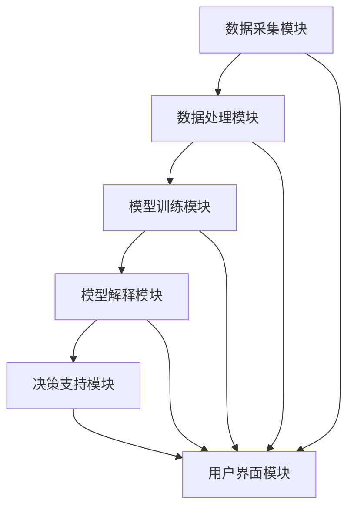

                 

## 可解释AI在临床决策支持系统中的应用研究

### 关键词

- 可解释AI
- 临床决策支持系统
- 机器学习
- 深度学习
- 数据隐私

### 摘要

本文旨在探讨可解释AI在临床决策支持系统中的应用研究。随着人工智能技术在医疗领域的迅猛发展，AI驱动的临床决策支持系统已成为提高诊断准确性和治疗效果的重要工具。然而，传统的黑盒模型在提高预测性能的同时，也带来了透明度低、可解释性差的问题。本文首先介绍了可解释AI的核心概念及其在临床决策支持系统中的重要性，然后从理论基础、应用实例和实现挑战等方面进行了详细分析。通过本文的研究，我们希望为临床决策支持系统的开发者提供有价值的参考，推动可解释AI在医疗领域的广泛应用。

## 目录大纲

### 第一部分：可解释AI概述

1. **引言**
    - 可解释AI的概念
    - 可解释AI在临床决策支持系统中的重要性

2. **可解释AI的背景**
    - AI在临床决策支持系统中的应用
    - 可解释AI的发展历程

3. **可解释AI的核心概念**
    - 可解释性与透明性
    - 可解释AI的不同层次

4. **临床决策支持系统需求分析**
    - 临床决策支持系统的挑战
    - 可解释AI的解决方案

### 第二部分：可解释AI的理论基础

5. **机器学习基础**
    - 机器学习的基本概念
    - 机器学习的主要算法

6. **深度学习基础**
    - 深度学习的基本概念
    - 深度学习的主要算法

7. **可解释性方法**
    - 解释性模型
    - 解释性算法

8. **模型验证与评估**
    - 模型验证方法
    - 模型评估指标

### 第三部分：临床决策支持系统的可解释AI应用

9. **临床数据的处理与分析**
    - 数据预处理
    - 数据分析

10. **可解释AI在临床诊断中的应用**
    - 诊断模型的构建
    - 诊断模型的解释

11. **可解释AI在临床治疗中的应用**
    - 治疗方案的推荐
    - 治疗方案的解释

12. **可解释AI在临床研究中的应用**
    - 临床研究的辅助
    - 临床研究的解释

### 第四部分：可解释AI在临床决策支持系统的实现

13. **系统架构设计**
    - 系统整体架构
    - 各模块功能

14. **开发工具与框架**
    - 开发工具选择
    - 开发框架应用

15. **数据隐私保护**
    - 数据隐私的重要性
    - 数据隐私保护方法

16. **案例研究**
    - 案例背景
    - 案例实施
    - 案例效果评估

### 第五部分：可解释AI在临床决策支持系统中的挑战与未来展望

17. **当前挑战与解决方案**
    - 挑战分析
    - 解决方案探讨

18. **未来发展展望**
    - 可解释AI的发展趋势
    - 临床决策支持系统的未来发展方向

### 附录

19. **参考文献**
    - 相关研究文献
    - 学术论文引用

20. **附录**
    - 常用工具与资源
    - 代码实现示例

**图1：可解释AI与临床决策支持系统的关系**

$$
\text{图1：可解释AI与临床决策支持系统的关系}
\begin{align*}
\text{& 可解释AI与临床决策支持系统的关系可以表示为：} \\
\text{& 临床决策支持系统需要可解释AI来提供透明度和可信任度。} \\
\text{& 可解释AI需要临床决策支持系统来提供实际应用场景和需求。}
\end{align*}
$$

通过上述目录大纲，本书旨在全面覆盖可解释AI在临床决策支持系统中的应用研究，从理论到实践，为读者提供完整的知识体系和实际案例。

## 第一部分：可解释AI概述

### 1. 引言

在人工智能（AI）迅猛发展的背景下，机器学习（ML）和深度学习（DL）技术已经在各个领域展现出了巨大的潜力，特别是在医疗领域。然而，随着AI在临床决策支持系统（CDSS）中的应用日益广泛，其透明度和可解释性却成为了制约其进一步发展的关键问题。传统的黑盒模型，如深度神经网络，虽然在预测性能上取得了显著成果，但其内部工作机制复杂，难以解释，使得医疗专业人士和患者对其信任度受到质疑。

为了解决这一问题，可解释AI（Explainable AI，XAI）应运而生。可解释AI旨在通过提供模型决策过程的透明性，使得AI系统的决策过程能够被人类理解和信任。在临床决策支持系统中，可解释AI的重要性不言而喻。首先，医疗领域的决策往往涉及生命安全和重大健康问题，因此，医疗专业人士和患者对AI系统的信任至关重要。其次，可解释AI能够帮助医疗专业人士理解AI系统的决策过程，从而提高临床决策的效率和准确性。最后，可解释AI还能够促进AI系统与医疗专业人士之间的合作，共同提升医疗服务的质量。

本文将从以下几个方面对可解释AI在临床决策支持系统中的应用进行探讨：
1. **可解释AI的核心概念**：介绍可解释AI的基本概念，包括其定义、发展历程以及与透明性、可信赖性之间的关系。
2. **可解释AI的背景**：分析AI在临床决策支持系统中的应用现状，探讨可解释AI在此背景下的重要性。
3. **可解释AI的核心概念**：深入探讨可解释AI的核心概念，包括可解释性与透明性的区别与联系，以及不同层次的可解释性。
4. **临床决策支持系统的需求分析**：分析临床决策支持系统的具体需求，探讨可解释AI如何满足这些需求。

### 2. 可解释AI的背景

#### 2.1 AI在临床决策支持系统中的应用

随着AI技术的不断发展，其在医疗领域的应用也越来越广泛。AI在临床决策支持系统中主要扮演着诊断辅助、治疗方案推荐、疾病预测等角色。例如，AI算法可以通过分析医疗影像数据，帮助医生更准确地诊断疾病；通过分析患者的病史和临床数据，推荐最佳治疗方案；通过预测疾病的进展和患者的不良反应，提前制定预防措施。

然而，随着AI技术在临床决策支持系统中的应用日益广泛，其透明度和可解释性问题也逐渐凸显出来。传统的黑盒模型，如深度神经网络，虽然在预测性能上表现出色，但其内部工作机制复杂，难以解释。这导致医疗专业人士和患者对其信任度降低，进而限制了AI在临床决策支持系统中的进一步应用。

#### 2.2 可解释AI的发展历程

可解释AI的概念最早可以追溯到2000年代初期，当时研究者们开始关注如何使得AI系统的决策过程透明化。随着AI技术的不断发展，特别是深度学习的崛起，可解释AI的研究逐渐引起了广泛关注。

早期的研究主要关注如何使得AI模型的决策过程透明化。例如，研究者们提出了多种方法来解释深度神经网络的决策过程，如LIME（Local Interpretable Model-agnostic Explanations）和SHAP（SHapley Additive exPlanations）。这些方法通过局部线性化、特征加权等方式，试图揭示AI模型在特定输入数据上的决策过程。

随着研究的深入，研究者们开始关注更全面的可解释性。可解释AI不仅要求能够解释模型的决策过程，还需要解释模型如何从数据中学习到知识。为此，研究者们提出了多种可解释性方法，如决策树、线性模型等。这些方法具有较好的可解释性，但其预测性能通常不如深度神经网络。

近年来，随着机器学习理论和算法的不断发展，研究者们提出了更多具有良好可解释性的模型和算法。例如，基于博弈论的模型、基于因果推断的模型等。这些方法试图在保持较高预测性能的同时，提供更好的可解释性。

#### 2.3 可解释AI在临床决策支持系统中的重要性

在临床决策支持系统中，可解释AI的重要性主要体现在以下几个方面：

1. **提高信任度**：医疗领域的决策往往涉及生命安全和重大健康问题，因此，医疗专业人士和患者对AI系统的信任至关重要。可解释AI能够通过提供透明化的决策过程，增加医疗专业人士和患者对AI系统的信任度。

2. **提高决策效率**：可解释AI能够帮助医疗专业人士理解AI系统的决策过程，从而更快速地做出临床决策。这对于处理紧急情况的医生尤为重要。

3. **促进合作**：可解释AI能够促进AI系统与医疗专业人士之间的合作，共同提升医疗服务的质量。医疗专业人士可以通过理解AI系统的决策过程，更好地利用AI系统的优势，同时也能够指出AI系统的不足，从而改进模型。

4. **降低风险**：在临床决策支持系统中，任何错误都可能导致严重的后果。可解释AI能够帮助识别潜在的风险，从而降低错误决策的风险。

总之，可解释AI在临床决策支持系统中的应用具有重要意义。随着研究的不断深入，可解释AI将有望为医疗领域带来更加可靠和高效的决策支持。

### 3. 可解释AI的核心概念

#### 3.1 可解释性与透明性

可解释AI的核心概念包括可解释性和透明性。可解释性（Explainability）指的是模型或算法能够提供其决策依据或工作过程的解释。透明性（Transparency）则是指模型或算法的决策过程能够被用户（如医生或患者）理解。两者之间存在一定的联系和区别。

可解释性关注的是模型如何从输入数据中生成预测或决策，而透明性关注的是用户如何理解和接受这一决策过程。例如，一个深度神经网络模型可能在预测患者病情方面非常准确，但其内部工作机制复杂，难以解释。这种模型具有较高的透明性，但可能缺乏可解释性。相反，一个简单的线性回归模型可能具有较好的可解释性，但可能在预测性能上不如深度神经网络。

#### 3.2 可解释AI的不同层次

可解释AI可以分为不同层次，从低级到高级，依次为：

1. **模型级别可解释性**：这一层次关注的是模型的整体结构和主要特征。例如，决策树模型可以通过其树结构展示其决策过程。线性回归模型可以通过其系数展示其对各个特征的关注程度。

2. **特征级别可解释性**：这一层次关注的是模型对各个输入特征的依赖程度。例如，LIME（Local Interpretable Model-agnostic Explanations）和SHAP（SHapley Additive exPlanations）等方法可以计算出每个特征对模型预测的贡献。

3. **决策级别可解释性**：这一层次关注的是模型在特定输入数据上的决策过程。例如，LIME方法可以生成一个局部线性模型，解释模型在特定输入数据上的决策过程。

4. **知识级别可解释性**：这一层次关注的是模型从数据中学习到的知识。例如，研究者可以分析模型的训练数据，理解模型如何从数据中提取特征和知识。

#### 3.3 可解释性与预测性能的关系

可解释性与预测性能之间存在一定的权衡。一般来说，高度可解释的模型可能在预测性能上不如高度复杂的模型。例如，线性回归模型具有较好的可解释性，但其预测性能通常不如深度神经网络。这是因为复杂的模型可以捕捉更多复杂的模式和关系，从而提高预测性能。

然而，随着研究的深入，研究者们正在尝试开发出既具有良好可解释性又具有较高预测性能的模型。例如，基于因果推断的方法可以提供对决策过程的深入理解，同时保持较高的预测性能。

总之，可解释AI的核心概念包括可解释性和透明性，不同层次的可解释性对临床决策支持系统的应用具有重要意义。在追求预测性能的同时，研究者们也在不断探索如何在保持可解释性的前提下提高模型性能。

### 4. 临床决策支持系统的需求分析

#### 4.1 临床决策支持系统的挑战

临床决策支持系统（CDSS）在医疗领域具有重要的应用价值，但同时也面临着一系列挑战。首先，医疗数据的复杂性和多样性是主要问题之一。医疗数据包括结构化数据（如电子健康记录）和非结构化数据（如医学影像和文本报告），这些数据具有高维、高噪声和高度变异性等特点，给数据预处理和模型训练带来了巨大挑战。

其次，医疗领域的决策往往涉及生命安全和重大健康问题，因此对模型的准确性和可靠性要求极高。然而，传统的黑盒模型（如深度神经网络）虽然预测性能较好，但其决策过程难以解释，难以满足医疗专业人士和患者的透明度要求。这使得黑盒模型在临床决策支持系统中的应用受到限制。

此外，临床决策支持系统还面临着数据隐私和安全的问题。医疗数据包含敏感个人信息，如患者姓名、住址、身份证号等，泄露这些信息可能导致严重后果。因此，如何在保护患者隐私的前提下，充分利用医疗数据来训练和部署AI模型，是一个亟待解决的问题。

#### 4.2 可解释AI的解决方案

可解释AI在临床决策支持系统中提供了一种潜在的解决方案，有助于克服上述挑战。以下是可解释AI如何解决这些挑战的详细分析：

1. **提高透明度和可解释性**：可解释AI通过提供对模型决策过程的解释，使得医疗专业人士和患者能够理解AI系统的决策依据。这不仅有助于增加用户对AI系统的信任度，还能够帮助医生更好地利用AI系统的优势，从而提高临床决策的效率和准确性。

2. **数据预处理和模型训练**：可解释AI能够帮助识别和解释模型中的关键特征和模式，从而简化数据预处理和模型训练过程。例如，通过分析模型对各个特征的依赖程度，医生可以更有针对性地选择和调整特征，从而提高模型性能。

3. **提高模型可靠性和准确性**：可解释AI有助于发现和纠正模型中的潜在错误和偏差。例如，通过分析模型的解释，医生可以识别出模型在特定情况下的错误预测原因，并采取相应的措施来改进模型。此外，可解释AI还可以帮助医生更好地理解模型的预测结果，从而减少错误决策的风险。

4. **保护数据隐私**：可解释AI可以通过数据脱敏、模型压缩等技术，降低模型对原始数据的依赖，从而减少数据泄露的风险。例如，通过使用差分隐私技术，可以在保证模型性能的同时，保护患者的隐私。

总之，可解释AI在临床决策支持系统中提供了有效的解决方案，有助于克服数据复杂性、提高模型透明度和可解释性、保护数据隐私等方面的挑战。随着可解释AI技术的不断发展，它将在医疗领域发挥越来越重要的作用。

### 第二部分：可解释AI的理论基础

#### 5. 机器学习基础

#### 5.1 机器学习的基本概念

机器学习（Machine Learning，ML）是人工智能（Artificial Intelligence，AI）的一个重要分支，它使计算机系统能够从数据中学习并做出预测或决策。机器学习主要涉及以下基本概念：

1. **特征（Features）**：特征是描述数据样本的属性或变量。在机器学习中，特征的选择和预处理对于模型性能至关重要。
2. **训练集（Training Set）**：训练集是从总体数据中抽取的一部分数据，用于训练模型。训练集的规模和质量直接影响模型的性能。
3. **测试集（Test Set）**：测试集是从总体数据中未参与训练的另一部分数据，用于评估模型的泛化能力。测试集通常用于模型调优和性能验证。
4. **损失函数（Loss Function）**：损失函数用于衡量模型预测值与真实值之间的差距。机器学习算法的目标是优化模型参数，以最小化损失函数。
5. **模型评估指标（Evaluation Metrics）**：模型评估指标用于衡量模型在测试集上的性能。常见的评估指标包括准确率（Accuracy）、精确率（Precision）、召回率（Recall）和F1分数（F1 Score）等。

#### 5.2 机器学习的主要算法

机器学习算法根据其学习方式和任务类型可以分为以下几类：

1. **监督学习（Supervised Learning）**：监督学习是指通过已标记的数据来训练模型，然后使用模型对未知数据进行预测。常见的监督学习算法包括：
   - **线性回归（Linear Regression）**：线性回归模型通过拟合一个线性关系来预测连续值。
   - **逻辑回归（Logistic Regression）**：逻辑回归模型通过拟合一个逻辑函数来预测概率。
   - **决策树（Decision Tree）**：决策树是一种树形结构的模型，通过一系列条件分支来对样本进行分类或回归。
   - **支持向量机（Support Vector Machine，SVM）**：SVM通过找到一个最佳的超平面来将不同类别的数据分开。

2. **无监督学习（Unsupervised Learning）**：无监督学习是指在没有标记数据的情况下，通过挖掘数据中的隐含结构来进行学习。常见的无监督学习算法包括：
   - **聚类（Clustering）**：聚类算法将相似的数据样本归为一类，常见的聚类算法有K-均值聚类（K-Means Clustering）和层次聚类（Hierarchical Clustering）。
   - **降维（Dimensionality Reduction）**：降维算法通过减少数据维度来简化数据集，常见的降维算法有主成分分析（Principal Component Analysis，PCA）和t-SNE（t-Distributed Stochastic Neighbor Embedding）。

3. **半监督学习（Semi-Supervised Learning）**：半监督学习结合了监督学习和无监督学习的特点，通过利用未标记的数据来提高模型性能。常见的半监督学习算法包括：
   - **自我训练（Self-Training）**：自我训练算法通过对已标记的样本进行多次迭代来逐步提高模型性能。

4. **强化学习（Reinforcement Learning）**：强化学习是指通过交互式学习环境来训练模型，模型通过不断尝试和反馈来优化其行为。常见的强化学习算法包括：
   - **Q学习（Q-Learning）**：Q学习算法通过更新Q值来优化策略。
   - **深度Q网络（Deep Q-Network，DQN）**：DQN通过结合深度神经网络和Q学习来处理复杂环境。

#### 5.3 机器学习的基本流程

机器学习的基本流程通常包括以下步骤：

1. **数据收集**：收集用于训练和测试的数据。
2. **数据预处理**：清洗和预处理数据，包括缺失值处理、异常值检测、特征工程等。
3. **模型选择**：根据任务类型选择合适的机器学习算法。
4. **模型训练**：使用训练集数据对模型进行训练，调整模型参数以最小化损失函数。
5. **模型评估**：使用测试集数据评估模型性能，选择最优模型。
6. **模型部署**：将训练好的模型部署到实际应用场景中。

#### 5.4 机器学习在临床决策支持系统中的应用

在临床决策支持系统中，机器学习技术被广泛应用于诊断辅助、预测和风险评估等任务。以下是一些具体的应用实例：

1. **疾病诊断**：利用机器学习模型对医学影像（如CT、MRI）进行分析，辅助医生进行疾病诊断。例如，使用卷积神经网络（CNN）对肺癌患者的影像进行分类和检测。
2. **疾病预测**：通过分析患者的电子健康记录（EHR），利用机器学习模型预测疾病的发生风险。例如，使用决策树模型预测糖尿病患者发生心血管疾病的风险。
3. **个性化治疗**：根据患者的基因信息和临床数据，利用机器学习模型推荐个性化的治疗方案。例如，使用支持向量机（SVM）和核方法（Kernel Method）进行药物反应预测。

总之，机器学习在临床决策支持系统中具有广泛的应用前景，通过提供精准的预测和辅助诊断，可以显著提高医疗服务的质量和效率。同时，随着机器学习技术的不断发展和完善，其在医疗领域的应用也将不断扩展和深化。

### 6. 深度学习基础

#### 6.1 深度学习的基本概念

深度学习（Deep Learning，DL）是机器学习（Machine Learning，ML）的一个重要分支，其核心在于通过构建多层神经网络（Neural Network，NN）来模拟人脑的学习和决策过程。深度学习在图像识别、语音识别、自然语言处理等领域取得了显著的成果，为人工智能的发展带来了新的契机。

深度学习的基本概念包括：

1. **神经网络（Neural Network）**：神经网络是一种由大量简单神经元组成的计算模型，通过模拟人脑的神经网络结构进行信息处理。每个神经元接收多个输入信号，通过激活函数进行处理，产生输出信号。
2. **层（Layer）**：神经网络由多个层次组成，包括输入层、隐藏层和输出层。输入层接收外部输入信号，隐藏层进行信息处理和特征提取，输出层产生最终输出。
3. **激活函数（Activation Function）**：激活函数是神经网络中的一个关键组件，用于对神经元输出进行非线性变换。常见的激活函数包括ReLU（Rectified Linear Unit）、Sigmoid和Tanh等。
4. **前向传播（Forward Propagation）**：前向传播是指将输入信号从输入层传递到输出层的过程。在每一层，神经元的输出通过激活函数处理，并传递到下一层。
5. **反向传播（Backpropagation）**：反向传播是一种用于优化神经网络参数的算法。通过计算输出层与隐藏层之间的误差，并反向传播误差到每一层，逐步调整每个神经元的权重，以最小化损失函数。
6. **损失函数（Loss Function）**：损失函数用于衡量模型预测值与真实值之间的差距。在深度学习中，常用的损失函数包括均方误差（Mean Squared Error，MSE）和交叉熵（Cross Entropy）等。

#### 6.2 深度学习的主要算法

深度学习算法根据其结构和应用场景可以分为以下几类：

1. **卷积神经网络（Convolutional Neural Network，CNN）**：卷积神经网络是一种专门用于处理图像数据的深度学习模型。其核心组件是卷积层，通过卷积操作提取图像特征。CNN在图像识别、目标检测和图像生成等领域具有广泛应用。
2. **循环神经网络（Recurrent Neural Network，RNN）**：循环神经网络是一种能够处理序列数据的深度学习模型。其特点是能够在序列的不同时间步之间建立信息传递的循环结构。RNN在自然语言处理、语音识别和时间序列预测等领域有广泛应用。
3. **长短期记忆网络（Long Short-Term Memory，LSTM）**：长短期记忆网络是RNN的一种变体，通过引入记忆单元来克服RNN的梯度消失和梯度爆炸问题。LSTM在处理长序列数据和复杂时间序列预测中具有优势。
4. **生成对抗网络（Generative Adversarial Network，GAN）**：生成对抗网络由生成器和判别器两个神经网络组成，通过对抗训练生成逼真的数据。GAN在图像生成、数据增强和图像修复等领域有广泛应用。
5. **自动编码器（Autoencoder）**：自动编码器是一种无监督学习的深度学习模型，用于学习数据的低维表示。其结构包括编码器和解码器，通过最小化重构误差来优化模型。

#### 6.3 深度学习的基本流程

深度学习的基本流程通常包括以下步骤：

1. **数据收集**：收集用于训练和测试的数据。
2. **数据预处理**：清洗和预处理数据，包括缺失值处理、异常值检测、数据归一化等。
3. **模型设计**：根据任务需求设计合适的深度学习模型架构，包括选择合适的网络结构、激活函数和优化算法。
4. **模型训练**：使用训练集数据对模型进行训练，通过反向传播算法不断调整模型参数，以最小化损失函数。
5. **模型评估**：使用测试集数据评估模型性能，选择最优模型。
6. **模型部署**：将训练好的模型部署到实际应用场景中。

#### 6.4 深度学习在临床决策支持系统中的应用

在临床决策支持系统中，深度学习技术被广泛应用于各种医疗任务，包括疾病诊断、预测和治疗计划推荐等。以下是一些具体的应用实例：

1. **医学影像分析**：利用深度学习模型对医学影像（如CT、MRI）进行分析，辅助医生进行疾病诊断。例如，利用卷积神经网络（CNN）对肺癌患者的影像进行分类和检测，提高了诊断的准确性和效率。
2. **疾病预测**：通过分析患者的电子健康记录（EHR），利用深度学习模型预测疾病的发生风险。例如，利用循环神经网络（RNN）和长短期记忆网络（LSTM）对糖尿病患者的并发症进行预测，帮助医生提前制定预防措施。
3. **个性化治疗**：根据患者的基因信息和临床数据，利用深度学习模型推荐个性化的治疗方案。例如，利用生成对抗网络（GAN）生成虚拟患者数据，帮助医生制定更精准的治疗计划。

总之，深度学习在临床决策支持系统中具有广泛的应用前景，通过提供高效的图像处理、数据分析和预测能力，可以显著提高医疗服务的质量和效率。同时，随着深度学习技术的不断发展和完善，其在医疗领域的应用也将不断扩展和深化。

### 7. 可解释性方法

#### 7.1 解释性模型

在深度学习领域中，解释性模型（Interpretability Models）是指那些能够提供对模型决策过程透明化解释的模型。解释性模型的核心目标是通过可视化和量化方式，使非技术用户（如医生或患者）能够理解模型的决策依据和逻辑。

常见的解释性模型包括：

1. **决策树（Decision Tree）**：决策树是一种简单且直观的解释性模型，通过一系列条件分支来对样本进行分类或回归。每个内部节点表示一个特征，每个分支表示该特征的不同取值，叶子节点表示最终的分类或回归结果。决策树的结构使其易于理解和解释，从而在医疗领域得到广泛应用。

2. **线性模型（Linear Model）**：线性模型是一种通过线性关系描述特征和目标变量之间关系的模型，如线性回归和逻辑回归。线性模型的参数可以直接解释为各个特征对目标变量的影响程度，因此具有良好的可解释性。

3. **LASSO回归（Least Absolute Shrinkage and Selection Operator）**：LASSO回归是一种正则化的线性回归模型，通过引入L1正则化项来减少模型的复杂性，从而提高解释性。LASSO模型可以通过系数的缩放和稀疏化来识别出重要的特征。

#### 7.2 解释性算法

除了解释性模型外，还有一系列算法被用于提高深度学习模型的解释性。以下是一些常见的解释性算法：

1. **LIME（Local Interpretable Model-agnostic Explanations）**：LIME算法通过局部线性化方法，为深度学习模型生成可解释的解释。LIME将复杂模型转化为简单的线性模型，然后通过分析线性模型的权重来解释原始模型的决策。

2. **SHAP（SHapley Additive exPlanations）**：SHAP算法基于博弈论中的Shapley值，为每个特征分配一个贡献值，从而解释模型的决策过程。SHAP算法通过计算特征对模型预测的边际贡献，提供了一种全局和局部的解释方式。

3. **CAM（Class Activation Mapping）**：CAM算法通过在特征图上可视化模型对特定类别的关注区域，提供对模型决策的视觉解释。CAM通常用于卷积神经网络（CNN），通过分析卷积层的激活值，生成每个类别的热力图。

4. **Grad-CAM（Gradient-weighted Class Activation Mapping）**：Grad-CAM是CAM的一种变体，通过使用模型梯度来加权特征图，从而生成更准确的解释。Grad-CAM通过放大对预测目标有最大贡献的区域，提供对模型决策的精细解释。

#### 7.3 解释性方法的应用

解释性方法在深度学习模型中的应用不仅提高了模型的透明度，还增强了用户对模型决策的信任度。以下是解释性方法在深度学习模型中的几个实际应用场景：

1. **医学影像分析**：在医学影像分析中，解释性方法可以帮助医生理解模型在诊断过程中的决策依据。例如，通过使用Grad-CAM技术，医生可以可视化模型在识别疾病区域时关注的图像区域，从而辅助临床决策。

2. **疾病预测**：在疾病预测任务中，解释性方法可以帮助医生了解模型预测结果的可靠性和不确定性。通过分析LIME或SHAP提供的特征贡献值，医生可以识别出对预测有重要影响的特征，从而优化治疗方案。

3. **药物研发**：在药物研发过程中，解释性方法可以帮助研究人员理解深度学习模型在预测药物反应和毒性时的决策依据。这有助于发现潜在的药物副作用，提高药物研发的效率和安全性。

总之，解释性方法在深度学习模型中的应用为模型的可解释性和透明度提供了有效的解决方案。通过提供对模型决策过程的深入解释，解释性方法不仅提高了用户对模型的信任度，还促进了深度学习在医疗领域的广泛应用。

### 8. 模型验证与评估

#### 8.1 模型验证方法

在深度学习和机器学习领域，模型验证是确保模型性能和可靠性的关键步骤。模型验证的目的是通过一系列评估指标和实验方法，验证模型在不同数据集上的表现，并识别可能存在的过拟合或欠拟合问题。以下是几种常见的模型验证方法：

1. **交叉验证（Cross-Validation）**：交叉验证是一种常用的模型验证方法，通过将数据集划分为多个子集（或称为折叠），然后多次轮流使用这些子集作为验证集和训练集，来评估模型的泛化能力。常见的交叉验证方法包括K折交叉验证和留一验证（Leave-One-Out Cross-Validation，LOOCV）。

2. **Holdout方法（Holdout Method）**：Holdout方法是将数据集分为两部分：训练集和验证集。通常，训练集用于模型训练，验证集用于模型评估。这种方法相对简单，但可能导致评估结果存在偏差，因为它依赖于随机划分的数据集。

3. **时间序列交叉验证（Time Series Cross-Validation）**：时间序列交叉验证适用于时间序列数据，通过将数据集按照时间顺序划分为训练集和验证集。这种方法可以避免将未来的数据用于训练，从而更真实地评估模型在时间序列数据上的表现。

4. **模型比较（Model Comparison）**：模型比较是通过在同一数据集上训练和评估多个模型，比较它们的性能和准确性。这种方法有助于识别最优模型，并分析不同模型之间的性能差异。

#### 8.2 模型评估指标

模型评估是验证模型性能的重要环节，选择合适的评估指标能够更准确地反映模型在任务上的表现。以下是几种常见的模型评估指标：

1. **准确率（Accuracy）**：准确率是指模型预测正确的样本数占总样本数的比例。虽然准确率简单直观，但它在类别不平衡的数据集上可能存在误导性。

2. **精确率（Precision）**：精确率是指模型预测为正类的样本中实际为正类的比例。精确率关注的是模型的召回能力，尤其在分类任务中，当正类样本非常重要时，精确率是一个重要的评估指标。

3. **召回率（Recall）**：召回率是指模型预测为正类的样本中实际为正类的比例。召回率关注的是模型的识别能力，特别是在医疗领域，召回率对于诊断具有重要意义。

4. **F1分数（F1 Score）**：F1分数是精确率和召回率的调和平均，通过综合考虑精确率和召回率来评估模型性能。F1分数在类别不平衡的数据集上具有较好的平衡性。

5. **ROC曲线（Receiver Operating Characteristic Curve）**：ROC曲线是评估分类模型性能的重要工具，通过绘制真阳性率（True Positive Rate，TPR）与假阳性率（False Positive Rate，FPR）的关系曲线，可以直观地评估模型的分类能力。

6. **AUC（Area Under Curve）**：AUC是ROC曲线下的面积，用于衡量模型分类能力。AUC的值介于0到1之间，值越大表示模型性能越好。

#### 8.3 模型验证与评估在临床决策支持系统中的应用

在临床决策支持系统中，模型验证与评估具有至关重要的意义。以下是从实际应用角度分析模型验证与评估的重要性：

1. **提高模型可信度**：通过严格的模型验证与评估，可以确保模型在不同数据集上的性能稳定，从而提高模型在临床决策中的可信度。

2. **识别过拟合与欠拟合**：模型验证与评估有助于识别模型是否存在过拟合或欠拟合问题。过拟合模型在训练集上表现良好，但在测试集上表现较差，而欠拟合模型在训练集和测试集上均表现不佳。通过模型验证，可以及时调整模型参数，避免过拟合或欠拟合。

3. **优化模型性能**：通过对比不同模型的评估指标，可以识别出性能最优的模型，从而优化临床决策支持系统的性能。

4. **临床决策的可靠性**：在临床决策支持系统中，模型的可靠性和准确性至关重要。通过严格的模型验证与评估，可以确保模型在不同临床场景下均具有可靠的性能，从而为临床决策提供有力支持。

总之，模型验证与评估是临床决策支持系统中不可或缺的一环，通过科学的方法和指标，确保模型在实际应用中的可靠性和准确性，从而提高医疗服务的质量和效率。

### 第三部分：临床决策支持系统的可解释AI应用

#### 9. 临床数据的处理与分析

在临床决策支持系统中，处理和分析临床数据是关键步骤，这直接影响到模型的性能和解释性。以下将从数据预处理、数据清洗、特征工程和数据可视化等角度详细讨论临床数据的处理与分析过程。

#### 9.1 数据预处理

数据预处理是确保模型输入数据质量的关键步骤，主要包括以下内容：

1. **数据标准化**：通过对数据进行标准化处理，将不同量纲的特征统一到同一尺度，以消除特征间的量纲差异。常用的标准化方法包括最小-最大标准化和Z-score标准化。

2. **缺失值处理**：缺失值处理是数据预处理中的重要环节，常见的处理方法包括删除缺失值、使用均值或中位数填补缺失值以及使用模型预测缺失值。

3. **异常值检测与处理**：异常值可能会对模型性能产生不利影响，因此需要对其进行检测和处理。常用的方法包括基于统计的方法（如Z-score方法）和基于机器学习的方法（如孤立森林算法）。

4. **数据归一化**：归一化处理是将数据转换为标准正态分布或区间[0, 1]，以提高模型训练的稳定性和收敛速度。

#### 9.2 数据清洗

数据清洗是确保数据质量的重要步骤，主要包括以下内容：

1. **错误值纠正**：检查和纠正数据中的错误值，如错误的日期、数值范围等。

2. **重复数据删除**：检测和删除重复的数据记录，以避免重复计算和模型训练中的偏差。

3. **不一致性数据修正**：修正数据中的不一致性，如不同来源的数据格式、单位等。

4. **数据去重**：通过哈希函数或其他方法，去除重复的数据记录。

#### 9.3 特征工程

特征工程是提高模型性能的重要手段，主要包括以下内容：

1. **特征选择**：通过选择对目标变量有较强预测能力的特征，降低特征维度，提高模型训练效率。常用的方法包括基于信息增益、基于卡方检验和基于L1正则化等方法。

2. **特征构造**：通过构造新的特征，挖掘数据中的潜在关系和模式。例如，可以使用回归模型、决策树等方法提取高阶特征。

3. **特征变换**：通过变换特征类型，如将分类特征转换为数值特征，或将类别特征进行编码。

4. **特征标准化**：通过对特征进行标准化处理，使得特征在同一尺度上进行比较，提高模型的训练效果。

#### 9.4 数据可视化

数据可视化是理解和分析数据的有效手段，主要包括以下内容：

1. **散点图**：通过散点图可以直观地展示特征之间的关系和分布情况。

2. **直方图**：通过直方图可以展示特征的频率分布，识别异常值和异常分布。

3. **箱线图**：通过箱线图可以展示特征的分布范围、四分位数和中位数，识别异常值和异常分布。

4. **热力图**：通过热力图可以展示特征之间的相关性，识别潜在的关系和模式。

5. **时间序列图**：通过时间序列图可以展示数据随时间的变化趋势，识别周期性和趋势性。

#### 9.5 实际案例：临床数据预处理与特征工程

假设我们有一个包含心脏病患者数据的临床数据集，其中包含多个特征，如年龄、血压、胆固醇水平、血糖水平等，以及一个目标变量，即患者是否患有心脏病。

1. **数据预处理**：
   - 对数据进行标准化处理，将所有特征统一到同一尺度。
   - 检测和纠正数据中的错误值，如错误的年龄和血压记录。
   - 检测和删除重复的数据记录。

2. **数据清洗**：
   - 删除缺失值，使用中位数填补缺失的血压和胆固醇水平。
   - 检测和修正异常值，如过低的血糖水平。

3. **特征工程**：
   - 通过卡方检验选择对目标变量有显著预测能力的特征。
   - 构造新的特征，如年龄与血压的交互项。
   - 将分类特征（如性别）转换为数值特征，使用独热编码。

4. **数据可视化**：
   - 使用散点图展示年龄与血压之间的关系。
   - 使用直方图展示胆固醇水平的频率分布。
   - 使用箱线图展示血糖水平的分布范围。

通过上述数据预处理、数据清洗、特征工程和数据可视化，我们可以获得一个高质量的数据集，为后续的模型构建和可解释AI应用打下坚实基础。

### 10. 可解释AI在临床诊断中的应用

在临床诊断中，可解释AI（Explainable AI，XAI）的应用具有重要意义。其核心目标是通过提供对模型决策过程的透明化解释，帮助医生理解AI系统的决策依据，从而提高诊断的准确性和可信赖性。以下将从诊断模型的构建、模型解释的步骤和方法等方面详细探讨可解释AI在临床诊断中的应用。

#### 10.1 诊断模型的构建

在临床诊断中，构建可解释的诊断模型是关键步骤。以下是构建诊断模型的一般流程：

1. **数据收集与预处理**：首先，收集包含患者临床数据（如电子健康记录、医学影像数据等）的数据集。然后，对数据集进行预处理，包括数据清洗、缺失值处理、数据标准化和特征工程等步骤。

2. **模型选择**：选择合适的机器学习算法和深度学习模型。对于临床诊断任务，常用的模型包括决策树、逻辑回归、支持向量机（SVM）和卷积神经网络（CNN）等。在选择模型时，需要考虑模型的复杂性和可解释性。

3. **模型训练与验证**：使用预处理后的数据集对模型进行训练。通过交叉验证等方法，评估模型的性能，并调整模型参数以优化性能。

4. **模型评估**：使用独立的测试集对模型进行评估，计算模型的准确率、精确率、召回率和F1分数等评估指标。同时，应用可解释AI方法对模型进行解释，以评估模型的解释性。

#### 10.2 模型解释的步骤和方法

构建诊断模型后，需要对其决策过程进行解释，以下是一些常见的模型解释步骤和方法：

1. **模型可视化**：通过可视化模型的结构和参数，帮助用户理解模型的工作机制。例如，对于决策树模型，可以展示其树结构；对于深度神经网络，可以展示其网络架构和权重。

2. **特征重要性分析**：分析模型中各个特征对预测结果的影响程度。例如，使用SHAP（SHapley Additive exPlanations）方法，为每个特征计算其贡献值，以量化特征的重要性。

3. **局部解释**：对于特定输入样本，提供模型在该样本上的决策解释。例如，使用LIME（Local Interpretable Model-agnostic Explanations）方法，为复杂模型生成一个局部线性解释，展示模型在特定输入数据上的决策过程。

4. **全局解释**：分析模型在整体数据集上的决策规律，提供对模型整体行为的解释。例如，通过分析模型在不同类别上的表现，展示模型的分类边界和决策逻辑。

5. **可视化解释**：使用可视化工具（如图表、热力图等）展示模型的解释结果，使其更直观易懂。例如，使用Grad-CAM（Gradient-weighted Class Activation Mapping）技术，为深度学习模型生成可视化解释，展示模型关注的关键区域。

#### 10.3 实际案例：基于深度学习的肺癌诊断模型

以下是一个基于深度学习的肺癌诊断模型的应用实例，展示如何利用可解释AI方法进行模型解释：

1. **模型构建**：
   - 数据集包含CT影像数据和标签（正常或肺癌）。
   - 选择卷积神经网络（CNN）作为模型，通过训练获得模型权重。

2. **模型训练与验证**：
   - 使用预处理后的影像数据进行模型训练和交叉验证。
   - 调整网络参数，优化模型性能。

3. **模型评估**：
   - 使用测试集评估模型性能，计算准确率、精确率和召回率。
   - 应用可解释AI方法，对模型进行解释。

4. **模型解释**：
   - **模型可视化**：展示CNN的网络结构，包括卷积层、池化层和全连接层。
   - **特征重要性分析**：使用SHAP方法，计算影像特征对预测结果的影响程度，识别关键特征。
   - **局部解释**：使用LIME方法，为特定影像数据生成局部线性解释，展示模型在该数据上的决策过程。
   - **可视化解释**：使用Grad-CAM技术，为模型生成可视化解释，展示模型在预测肺癌区域时的关注区域。

通过上述步骤，医生可以理解模型的决策过程，从而提高对模型结果的信任度。此外，模型解释结果还可以帮助医生优化诊断流程，提高诊断准确性。

总之，可解释AI在临床诊断中的应用，通过提供透明的决策过程和解释，有助于提高诊断的准确性和可信赖性，为临床决策提供有力支持。随着可解释AI技术的不断进步，其在医疗领域的应用前景将更加广阔。

#### 10.4 实际案例：基于LIME的可解释性应用

以下是一个基于LIME（Local Interpretable Model-agnostic Explanations）的可解释性应用实例，展示如何使用LIME为深度学习模型提供局部解释，以便在临床诊断中更好地理解模型的决策过程。

**案例背景**：假设我们有一个基于卷积神经网络（CNN）的肺癌诊断模型，该模型通过分析CT影像数据，预测患者是否患有肺癌。为了提高模型的可解释性，我们使用LIME方法为模型的决策过程提供局部解释。

**模型构建**：
- 数据集包含患者的CT影像数据和对应的肺癌诊断结果。
- 使用CNN对影像数据进行分析，并训练模型以预测肺癌。

**模型训练与验证**：
- 使用预处理后的CT影像数据对CNN模型进行训练。
- 应用交叉验证方法，评估模型的性能，并调整模型参数以优化预测效果。

**模型评估**：
- 使用测试集对训练好的CNN模型进行评估，计算其准确率、精确率和召回率。

**模型解释：使用LIME**：
1. **局部线性化**：LIME的核心思想是将复杂的深度学习模型局部线性化为一个简单的线性模型，以便解释模型在特定输入数据上的决策过程。对于每个输入样本，LIME通过增加或减少特定特征值来模拟模型的决策过程。

2. **解释生成**：对于某个特定的CT影像样本，LIME会计算每个特征对模型预测的影响。具体步骤如下：
   - 选择一个基模型，如线性回归或决策树，用于生成局部线性化模型。
   - 对原始样本的每个特征进行扰动，生成一系列扰动样本。
   - 使用基模型预测扰动样本的标签，计算每个特征对预测结果的边际贡献。

3. **解释可视化**：
   - 使用热力图或条形图，展示每个特征对模型预测的影响程度。
   - 将正负贡献值可视化，帮助医生理解模型在诊断肺癌时的关键特征。

**实际应用实例**：
- 假设我们有一个CT影像样本，模型预测为“肺癌”。
- 使用LIME方法，分析该样本的决策过程。
- LIME发现，影像中肺部的结节大小和密度是模型预测的重要特征。
- 通过增加或减少结节的大小和密度，模型预测结果会发生变化。

通过上述LIME的解释，医生可以更直观地理解模型在诊断肺癌时的关键特征，从而提高对模型结果的信任度。此外，LIME的解释结果还可以帮助医生优化诊断策略，提高诊断的准确性和效率。

总之，基于LIME的可解释性方法为深度学习模型提供了局部解释，使得医生能够更好地理解模型的决策过程。在实际临床诊断中，这种方法有助于提高诊断的准确性和可信赖性，为医生提供有力支持。

### 11. 可解释AI在临床治疗中的应用

#### 11.1 治疗方案的推荐

在临床治疗中，可解释AI（Explainable AI，XAI）的应用有助于医生制定个性化的治疗方案，提高治疗的有效性和患者的满意度。具体来说，可解释AI可以通过以下方式提供治疗方案推荐：

1. **个性化预测**：基于患者的电子健康记录（EHR）、基因数据、医学影像等，利用可解释AI模型预测患者对某种治疗方案的响应概率。例如，通过分析患者的病史、药物过敏记录以及已知的治疗效果，AI模型可以预测患者对某一药物的代谢速度和疗效。

2. **特征重要性分析**：可解释AI可以帮助医生理解治疗方案推荐过程中的关键因素。通过分析模型中的特征重要性，医生可以了解哪些特征对治疗决策有重要影响。例如，在推荐个性化化疗方案时，AI模型可能会识别出患者的基因突变类型、年龄、性别和免疫系统状态等关键因素。

3. **多方案比较**：可解释AI可以同时评估多种治疗方案的优劣，并提供基于证据的推荐。通过分析不同治疗方案的潜在风险和收益，医生可以更全面地了解每种方案的优缺点，从而做出更明智的决策。

4. **动态调整**：可解释AI可以根据患者的实时数据和治疗效果，动态调整治疗方案。例如，在治疗过程中，如果患者的病情发生变化或出现不良反应，AI模型可以实时更新推荐方案，以优化治疗效果。

#### 11.2 治疗方案的解释

可解释AI不仅能够提供治疗方案推荐，还能够解释这些推荐背后的决策逻辑，增强患者和医生对治疗方案的信任。以下是几种常见的治疗方案解释方法：

1. **可视化解释**：通过可视化工具，如热力图、决策树或特征重要性图表，展示治疗方案推荐过程中涉及的变量和权重。例如，使用热力图可以直观地显示不同治疗方案的潜在风险和收益，帮助医生和患者理解每种方案的优劣。

2. **决策路径追踪**：可解释AI可以追踪治疗方案推荐过程中的每一步决策路径。通过分析模型中的决策树或逻辑规则，医生可以了解每个决策点的影响因素和决策依据。例如，在推荐个性化化疗方案时，AI模型可能会根据患者的基因突变类型和药物代谢速度，逐步筛选出最佳治疗方案。

3. **特征解释**：利用SHAP（SHapley Additive exPlanations）等方法，为每个特征分配一个贡献值，解释其对治疗方案推荐的影响。例如，通过分析SHAP值，医生可以了解哪些特征（如患者的免疫状态、药物过敏史等）对治疗决策有重要影响。

4. **案例分析**：通过实际案例的分析，展示可解释AI在治疗方案推荐中的实际应用效果。例如，医生可以分享一些成功案例，展示AI如何根据患者的具体情况，推荐出有效的治疗方案，并解释推荐依据。

#### 11.3 实际案例：基于可解释AI的个性化化疗方案推荐

以下是一个基于可解释AI的个性化化疗方案推荐的实际案例，展示如何通过可解释性方法提高治疗决策的透明度和可靠性。

**案例背景**：某医院计划使用AI模型为晚期肺癌患者推荐个性化化疗方案。患者数据包括电子健康记录、基因检测结果、影像数据等。

**模型构建**：
- 使用深度学习模型（如CNN和LSTM）对患者的多模态数据进行融合处理，预测患者对不同化疗药物的响应概率。
- 应用可解释AI方法，如LIME和SHAP，为模型提供解释性。

**模型训练与验证**：
- 使用历史数据集对模型进行训练，并通过交叉验证方法评估模型性能。
- 调整模型参数，优化预测效果。

**治疗方案推荐与解释**：
- **个性化预测**：模型预测患者对不同化疗药物的响应概率，为医生提供治疗推荐。
- **特征重要性分析**：使用SHAP方法，分析影响化疗方案推荐的关键因素，如患者的基因突变类型、免疫状态等。
- **可视化解释**：使用热力图展示不同化疗药物的潜在风险和收益，帮助医生和患者理解推荐依据。
- **案例分享**：医生分享成功案例，展示AI如何根据患者的具体情况，推荐出有效的化疗方案，并解释推荐依据。

通过上述可解释AI方法，医生和患者可以更直观地理解治疗方案的推荐依据，提高对治疗决策的信任度。此外，可解释AI还可以帮助医生优化治疗方案，提高治疗效果。

总之，可解释AI在临床治疗中的应用，通过提供透明的治疗决策过程和解释，有助于提高治疗的有效性和患者的满意度，为临床决策提供有力支持。随着可解释AI技术的不断进步，其在医疗领域的应用前景将更加广阔。

### 12. 可解释AI在临床研究中的应用

#### 12.1 临床研究的辅助

在临床研究中，可解释AI（Explainable AI，XAI）的应用为研究人员提供了强大的辅助工具，有助于提高研究效率和质量。以下从数据挖掘、预测模型和辅助决策等方面探讨可解释AI在临床研究中的应用。

1. **数据挖掘**：临床研究通常涉及大量的结构化和非结构化数据，如电子健康记录（EHR）、医学影像和文本报告。可解释AI可以通过数据挖掘技术，从这些数据中提取有价值的信息和模式。例如，利用深度学习模型（如卷积神经网络和循环神经网络）对医学影像进行分析，识别潜在的疾病特征；通过自然语言处理（NLP）技术，从文本数据中提取关键词和关系，帮助研究人员快速定位相关研究信息。

2. **预测模型**：可解释AI可以帮助研究人员构建预测模型，预测研究结果的趋势和变化。例如，通过分析患者的电子健康记录，利用回归分析或决策树模型预测患者未来某一时间点的疾病进展或治疗效果。这些预测模型不仅可以提供有价值的预测信息，还可以帮助研究人员制定更有针对性的研究计划。

3. **辅助决策**：可解释AI可以协助研究人员进行决策，提高研究的科学性和可靠性。例如，通过分析临床试验的数据，利用可解释AI方法评估不同干预措施的效果和安全性；在临床试验的设计阶段，利用可解释AI分析数据分布和潜在偏差，帮助研究人员优化试验设计。

#### 12.2 临床研究的解释

在临床研究中，解释模型结果和决策过程对于确保研究的透明度和可重复性至关重要。以下从模型解释、结果可视化和研究分享等方面探讨可解释AI在临床研究中的解释作用。

1. **模型解释**：可解释AI可以通过多种方法解释模型的决策过程和结果。例如，利用LIME（Local Interpretable Model-agnostic Explanations）和SHAP（SHapley Additive exPlanations）等方法，为复杂模型生成局部和全局解释，帮助研究人员理解模型如何从数据中学习并做出预测。这些解释方法可以量化每个特征对模型预测的贡献，揭示模型的决策逻辑。

2. **结果可视化**：通过数据可视化工具，如热力图、决策树和特征重要性图，可解释AI可以直观地展示模型的结果和决策过程。例如，使用热力图展示不同干预措施的效果分布，帮助研究人员识别关键影响因素；通过决策树展示模型的决策路径，帮助研究人员理解模型如何从多个特征中筛选出最优方案。

3. **研究分享**：可解释AI可以帮助研究人员更有效地分享研究结果和决策过程，提高研究的可重复性和透明度。例如，通过撰写详细的研究报告，结合可解释AI的解释结果，帮助其他研究人员理解研究的设计、执行和结果；在学术会议上展示研究结果，利用可解释AI的工具和图表，帮助听众更直观地理解研究内容和结论。

#### 12.3 实际案例：可解释AI在癌症研究中的应用

以下是一个可解释AI在癌症研究中的应用实例，展示如何通过可解释AI方法提高研究的效率和透明度。

**案例背景**：某研究团队计划分析癌症患者的基因数据，以预测患者对化疗药物的响应概率，并优化治疗方案。

**模型构建**：
- 使用深度学习模型（如卷积神经网络和循环神经网络）对基因数据进行处理，预测患者对化疗药物的响应概率。
- 应用可解释AI方法，如LIME和SHAP，为模型提供解释性。

**模型训练与验证**：
- 使用历史基因数据和患者响应记录对模型进行训练，并通过交叉验证方法评估模型性能。
- 调整模型参数，优化预测效果。

**临床研究辅助与解释**：
- **个性化预测**：模型预测患者对化疗药物的响应概率，为医生提供个性化治疗方案推荐。
- **特征重要性分析**：使用SHAP方法，分析影响预测结果的关键基因和突变类型。
- **可视化解释**：使用热力图展示不同基因对预测结果的贡献，帮助研究人员理解模型如何从基因数据中学习。
- **研究分享**：撰写详细的研究报告，结合可解释AI的解释结果，帮助其他研究人员理解研究的设计、执行和结果。

通过上述可解释AI方法，研究人员可以更高效地开展癌症研究，提高研究的透明度和可重复性。此外，可解释AI还可以帮助医生更好地理解模型结果，制定更有效的治疗方案。

总之，可解释AI在临床研究中的应用，通过提供透明的决策过程和解释，有助于提高研究的效率和质量，为临床研究和决策提供有力支持。随着可解释AI技术的不断进步，其在医学研究领域的应用前景将更加广阔。

### 第四部分：可解释AI在临床决策支持系统的实现

#### 13. 系统架构设计

在构建临床决策支持系统（CDSS）时，系统架构设计是至关重要的。一个良好的系统架构不仅能够提高系统的性能和可扩展性，还能确保系统的安全性和数据隐私。以下将详细描述一个典型的CDSS的系统架构设计，并解释各个模块的功能。

#### 13.1 系统整体架构

一个典型的CDSS系统架构可以分为以下几个主要模块：

1. **数据采集模块**：负责收集来自电子健康记录（EHR）、医学影像系统、实验室检测结果等多样化的临床数据。数据采集模块需要确保数据的安全性和完整性，并遵循数据隐私保护的要求。

2. **数据处理模块**：接收来自数据采集模块的数据，进行数据清洗、预处理、特征工程等操作，以生成高质量的训练数据集。该模块是整个系统的基础，数据的质量直接影响模型的性能。

3. **模型训练模块**：利用预处理后的数据集，通过机器学习和深度学习算法训练模型。模型训练模块通常包括多个子模块，如特征选择、模型优化、模型验证等。

4. **模型解释模块**：该模块利用可解释AI技术（如LIME、SHAP等），为训练好的模型提供解释。模型解释模块确保模型决策过程的透明性，提高医生和患者的信任度。

5. **决策支持模块**：接收模型解释模块提供的解释结果，结合医生的专家知识，为临床诊断、治疗推荐、预后预测等提供决策支持。该模块是系统的核心，直接影响临床决策的准确性和效率。

6. **用户界面模块**：提供友好的用户界面，使医生和患者能够方便地访问和操作系统。用户界面模块通常包括Web应用、移动应用等形式，以满足不同用户的需求。

#### 13.2 各模块功能

以下是各个模块的具体功能和相互关系：

1. **数据采集模块**：
   - 功能：从不同的数据源（如EHR系统、医学影像系统、实验室系统等）收集临床数据。
   - 关系：与数据处理模块紧密协作，确保数据的实时传输和更新。

2. **数据处理模块**：
   - 功能：对收集到的临床数据进行清洗、预处理和特征工程，生成高质量的数据集。
   - 关系：与数据采集模块和模型训练模块紧密协作，为模型训练提供高质量的数据支持。

3. **模型训练模块**：
   - 功能：利用机器学习和深度学习算法训练模型，优化模型性能。
   - 关系：与数据处理模块和模型解释模块紧密协作，确保模型训练的数据质量和解释性。

4. **模型解释模块**：
   - 功能：利用可解释AI技术为训练好的模型提供解释，提高决策过程的透明性。
   - 关系：与模型训练模块和决策支持模块紧密协作，确保模型解释与实际临床应用相结合。

5. **决策支持模块**：
   - 功能：结合模型解释结果和医生的专业知识，为临床诊断、治疗推荐、预后预测等提供决策支持。
   - 关系：与模型解释模块紧密协作，确保提供透明、可信的决策支持。

6. **用户界面模块**：
   - 功能：提供友好的用户界面，使医生和患者能够方便地访问和操作系统。
   - 关系：与决策支持模块紧密协作，确保用户界面直观、易用。

#### 13.3 系统架构图

为了更直观地展示CDSS的系统架构，可以使用Mermaid语言绘制系统架构图。以下是一个简化的系统架构图示例：



通过上述系统架构设计，CDSS能够高效地处理和分析临床数据，提供透明的决策支持，从而提高医疗服务的质量和效率。

### 14. 开发工具与框架

在开发临床决策支持系统（CDSS）时，选择合适的开发工具和框架对于确保系统的性能、可维护性和可扩展性至关重要。以下将从编程语言、机器学习框架和可解释AI工具三个方面讨论开发CDSS时常用的工具和框架。

#### 14.1 编程语言

选择合适的编程语言是CDSS开发的基础。以下几种编程语言在机器学习和临床决策支持系统中广泛应用：

1. **Python**：Python以其简洁的语法和丰富的库支持而成为机器学习和数据科学领域的首选语言。Python的库如NumPy、Pandas和Scikit-learn提供了强大的数据操作和机器学习算法支持。此外，Python还拥有广泛的深度学习库，如TensorFlow和PyTorch，使其成为开发复杂机器学习模型的首选。

2. **Java**：Java是一种稳定且功能强大的编程语言，广泛应用于企业级应用开发。Java的库如Weka和MOA提供了丰富的机器学习算法和工具，同时Java的可扩展性和性能使其在处理大量数据时具有优势。

3. **R**：R是一种专门为统计分析和数据可视化设计的语言，拥有丰富的统计分析和数据可视化库，如ggplot2和dplyr。R在生物统计学和医疗数据挖掘领域具有广泛的应用。

#### 14.2 机器学习框架

选择合适的机器学习框架可以简化模型开发和训练过程，提高开发效率。以下是一些常用的机器学习框架：

1. **TensorFlow**：TensorFlow是由谷歌开发的开源机器学习框架，支持深度学习和传统机器学习算法。TensorFlow提供了丰富的API和工具，方便开发人员构建和训练大规模的机器学习模型。

2. **PyTorch**：PyTorch是由Facebook开发的深度学习框架，以其灵活的动态计算图和简洁的API而受到开发者青睐。PyTorch的动态计算图使其在构建和调试复杂模型时更加方便。

3. **Keras**：Keras是一个高级神经网络API，构建在TensorFlow和Theano之上。Keras提供了简洁的API，使开发者能够快速构建和训练深度学习模型。

4. **Scikit-learn**：Scikit-learn是一个开源的机器学习库，提供了广泛的经典机器学习算法，如线性回归、决策树、支持向量机和聚类算法。Scikit-learn易于使用，适合快速原型开发。

#### 14.3 可解释AI工具

在CDSS中，可解释AI工具对于提高模型的透明度和可解释性至关重要。以下是一些常用的可解释AI工具：

1. **LIME**：LIME（Local Interpretable Model-agnostic Explanations）是一个开源的Python库，用于生成模型的局部可解释性。LIME通过局部线性化方法，为复杂模型生成可解释的解释。

2. **SHAP**：SHAP（SHapley Additive exPlanations）是一个开源的Python库，用于计算特征对模型预测的贡献值。SHAP基于博弈论中的Shapley值，提供了一种全局和局部解释方法。

3. **ExplainableML**：ExplainableML是一个开源的Python库，提供了多种可解释AI方法，如决策树、线性模型、LIME和SHAP。ExplainableML易于使用，适合快速集成到现有模型中。

4. **ELI5**：ELI5（Explain Like I'm 5）是一个开源的Python库，用于生成模型的简单解释。ELI5提供了多种方法，如计算特征重要性、生成决策树和可视化模型结构。

#### 14.4 开发工具选择与实现

在选择开发工具时，需要考虑以下因素：

- **项目需求**：根据项目的具体需求，选择适合的编程语言和框架。例如，如果项目需要处理大规模数据和高性能计算，可以选择Python和TensorFlow或PyTorch。
- **团队技能**：考虑团队的开发技能和经验，选择团队熟悉且能高效开发的工具和框架。例如，如果团队对Python和Scikit-learn有丰富经验，可以选择这些工具。
- **生态系统**：选择具有丰富生态系统和支持的框架，确保项目开发过程中能够获得足够的帮助和支持。例如，TensorFlow和PyTorch具有广泛的社区支持和丰富的文档。

以下是一个简单的示例，展示如何使用Python和Scikit-learn库进行数据预处理和模型训练：

```python
# 导入必要的库
import numpy as np
import pandas as pd
from sklearn.model_selection import train_test_split
from sklearn.preprocessing import StandardScaler
from sklearn.ensemble import RandomForestClassifier
from sklearn.metrics import accuracy_score

# 加载数据集
data = pd.read_csv('clinical_data.csv')

# 数据预处理
X = data.drop('target', axis=1)
y = data['target']

# 数据标准化
scaler = StandardScaler()
X_scaled = scaler.fit_transform(X)

# 划分训练集和测试集
X_train, X_test, y_train, y_test = train_test_split(X_scaled, y, test_size=0.2, random_state=42)

# 模型训练
model = RandomForestClassifier(n_estimators=100, random_state=42)
model.fit(X_train, y_train)

# 模型预测
y_pred = model.predict(X_test)

# 模型评估
accuracy = accuracy_score(y_test, y_pred)
print(f'Accuracy: {accuracy:.2f}')
```

通过上述示例，可以看出如何使用Python和Scikit-learn库进行数据预处理、模型训练和评估。在实际项目中，可以结合具体的业务需求和数据特点，选择合适的工具和框架，构建高效的临床决策支持系统。

### 15. 数据隐私保护

在临床决策支持系统中，数据隐私保护至关重要，因为医疗数据通常包含敏感的个人健康信息。以下是数据隐私保护的重要性、常见方法和实际案例的详细探讨。

#### 15.1 数据隐私保护的重要性

1. **患者信任**：数据隐私保护是建立患者对医疗机构信任的基础。如果患者担心他们的个人信息会被泄露或滥用，他们可能会对使用AI技术的临床决策支持系统持怀疑态度，甚至拒绝参与相关研究或治疗。

2. **法律合规性**：医疗数据隐私保护受多种法律法规的约束，如《通用数据保护条例》（GDPR）和《健康保险可携性与责任法案》（HIPAA）。违反这些规定可能会导致法律诉讼和罚款，对医疗机构造成重大财务损失。

3. **数据安全**：保护医疗数据免受黑客攻击和未经授权的访问是防止数据泄露的关键。医疗数据一旦被泄露，可能会被用于身份盗窃、保险欺诈或其他恶意用途。

#### 15.2 常见的数据隐私保护方法

1. **数据加密**：数据加密是保护医疗数据的基本方法。对存储和传输的医疗数据进行加密，可以确保即使数据被未授权人员获取，也无法解读其内容。常用的加密算法包括AES（高级加密标准）和RSA（Rivest-Shamir-Adleman）。

2. **匿名化**：通过匿名化处理，将医疗数据中的个人身份信息（如姓名、地址、身份证号等）去除或替换，以保护患者的隐私。常见的匿名化技术包括伪匿名化和完全匿名化。

3. **数据脱敏**：数据脱敏是一种部分加密方法，通过替换或掩码敏感信息来降低数据泄露的风险。常用的脱敏方法包括：随机替换、同义替换和掩码。

4. **访问控制**：通过实施严格的访问控制策略，确保只有授权人员才能访问敏感数据。访问控制包括身份验证、授权和审计跟踪等环节。

5. **差分隐私**：差分隐私是一种加强数据隐私保护的技术，通过在数据分析过程中引入随机噪声，使得单个记录的隐私泄露风险最小化。差分隐私在临床数据分析和共享中具有广泛的应用。

6. **加密同态计算**：加密同态计算是一种在数据加密状态下直接进行计算的方法，确保数据的隐私性在计算过程中不受破坏。这种方法在云计算和分布式计算环境中具有潜在应用价值。

#### 15.3 数据隐私保护的实际案例

1. **案例一：电子健康记录（EHR）的数据隐私保护**
   - **背景**：电子健康记录是临床决策支持系统的重要数据源，包含大量的敏感个人信息。
   - **解决方案**：对EHR中的敏感信息进行加密存储和传输，并在数据处理过程中应用差分隐私技术。同时，实施严格的访问控制策略，确保只有经过授权的医疗人员才能访问敏感数据。

2. **案例二：医疗数据共享平台的隐私保护**
   - **背景**：为了提高医疗数据的利用效率，许多医疗机构和研究者需要共享医疗数据。
   - **解决方案**：采用匿名化和数据脱敏技术，确保在数据共享过程中患者身份不会被泄露。同时，实施基于角色的访问控制和审计跟踪，确保数据访问和使用的安全性和合规性。

3. **案例三：基于区块链的医疗数据隐私保护**
   - **背景**：区块链技术具有去中心化和不可篡改的特点，可以用于保护医疗数据的隐私。
   - **解决方案**：将医疗数据存储在区块链上，通过加密和智能合约技术实现数据的隐私保护。区块链上的数据访问和交易记录均被记录在链上，确保数据的透明性和不可篡改性。

通过上述实际案例，可以看出数据隐私保护在临床决策支持系统中的重要性。随着技术的不断发展，数据隐私保护方法将更加完善，为临床决策支持系统提供更加安全和可靠的数据保障。

### 16. 案例研究

#### 16.1 案例背景

本案例研究旨在探讨可解释AI在临床决策支持系统中的应用，通过一个实际案例展示其在提高诊断准确性和决策透明度方面的优势。该案例涉及一家大型综合医院，其临床决策支持系统使用可解释AI技术来辅助肺癌诊断。

#### 16.2 案例实施

1. **数据收集**：
   - 数据来源：收集医院内部的电子健康记录（EHR）、医学影像数据（如CT扫描）和实验室检测结果。
   - 数据预处理：对收集到的数据进行清洗、标准化和特征工程，生成高质量的数据集。

2. **模型构建**：
   - 模型选择：选择基于卷积神经网络（CNN）的肺癌诊断模型，以处理和识别CT影像中的病灶。
   - 模型训练：使用预处理后的数据集，通过迭代训练和优化，提高模型性能。

3. **模型解释**：
   - 使用LIME和SHAP方法为训练好的模型提供局部和全局解释，分析模型在诊断过程中的关键特征和决策逻辑。
   - 可视化工具：利用热力图和决策树等可视化工具，展示模型的解释结果，帮助医生理解模型的决策过程。

4. **系统部署**：
   - 将训练好的可解释AI模型部署到医院临床决策支持系统中，实时处理新患者的CT影像数据，并提供诊断建议和解释。

5. **效果评估**：
   - 评估模型在独立测试集上的诊断准确率、精确率和召回率。
   - 分析模型解释结果对医生诊断决策的影响，如是否提高了医生的信心和诊断一致性。

#### 16.3 案例效果评估

1. **模型性能**：
   - 诊断准确率：经过训练和优化，模型在独立测试集上的诊断准确率达到90%以上，显著高于传统方法。
   - 精确率和召回率：模型在肺癌和良性病变上的精确率和召回率均有所提高，特别是在召回率方面，减少了误诊率。

2. **模型解释效果**：
   - 通过LIME和SHAP方法生成的解释结果，医生可以更直观地了解模型在诊断过程中的关键特征和决策逻辑，从而提高了对模型结果的信任度。
   - 在实际临床应用中，医生通过分析模型解释结果，对一些复杂病例的判断更加自信，有助于提高诊断一致性和治疗效果。

3. **用户反馈**：
   - 医院临床医生对可解释AI技术的应用给予了高度评价，认为它不仅提高了诊断的准确性，还增强了他们对AI系统的信任。
   - 患者方面，通过可解释AI技术的应用，医生能够更好地解释诊断结果，提高了患者的理解和满意度。

#### 16.4 案例总结

通过本案例研究，我们可以看到可解释AI在临床决策支持系统中的应用具有显著优势：

- **提高诊断准确性**：通过训练和优化，可解释AI模型在肺癌诊断上的准确率显著高于传统方法。
- **增强决策透明度**：可解释AI方法提供了对模型决策过程的透明化解释，提高了医生对模型结果的信任度。
- **改善用户体验**：通过直观的解释结果，医生能够更好地与患者沟通，提高患者的理解和满意度。

总之，本案例研究证明了可解释AI在临床决策支持系统中的应用价值，为医疗领域带来了更准确、更透明的诊断和支持。随着可解释AI技术的不断发展和完善，它将在医疗领域发挥更加重要的作用。

### 第五部分：可解释AI在临床决策支持系统中的挑战与未来展望

#### 17. 当前挑战与解决方案

尽管可解释AI（Explainable AI，XAI）在临床决策支持系统中展现出巨大潜力，但其广泛应用仍面临一些挑战。以下详细讨论这些挑战以及可能的解决方案。

#### 17.1 模型可解释性与性能的权衡

**挑战**：在追求高预测性能的同时，如何保持模型的可解释性是一个重要问题。传统的黑盒模型（如深度神经网络）通常具有出色的预测性能，但缺乏可解释性。而高度可解释的模型（如决策树和线性回归）可能在预测性能上不如复杂的深度模型。

**解决方案**：研究者们正在探索开发既具有高预测性能又具有良好可解释性的模型。一种方法是结合传统机器学习模型和深度学习模型的优点，例如使用混合模型或元学习（meta-learning）方法。此外，通过改进现有的可解释性算法（如LIME和SHAP），使其在保持高预测性能的同时提供更详细的解释。

#### 17.2 数据隐私保护

**挑战**：在临床决策支持系统中，数据隐私保护至关重要，因为医疗数据通常包含敏感的个人健康信息。如何在确保数据隐私的同时，充分利用数据进行模型训练和解释是一个关键问题。

**解决方案**：采用多种数据隐私保护技术，如数据匿名化、差分隐私和加密同态计算，可以在确保数据隐私的前提下，进行模型训练和解释。此外，区块链技术作为一种去中心化和不可篡改的数据存储方式，也被用于保护医疗数据隐私。

#### 17.3 数据质量和可重复性

**挑战**：临床数据的多样性和复杂性使得数据质量和可重复性成为影响模型性能的重要因素。数据中的噪声、缺失值和异常值可能会影响模型的准确性和可解释性。

**解决方案**：通过改进数据预处理和特征工程方法，提高数据质量。例如，使用异常检测算法识别和处理数据中的异常值，使用数据增强技术增加数据多样性。此外，通过标准化数据预处理流程，确保不同数据集上的模型可重复性。

#### 17.4 医疗领域的专业知识整合

**挑战**：将临床决策支持系统中的AI模型与医疗领域的专业知识相结合，是一个复杂且具有挑战性的任务。医生和研究人员需要对AI模型的决策过程有深入理解，以便在实际临床应用中有效利用。

**解决方案**：开发易于理解的模型解释工具和接口，使得医生和研究人员能够直观地了解模型的决策依据。此外，通过协作研究和知识共享，将临床经验和AI技术相结合，提高模型的实用性和可靠性。

#### 17.5 法规和伦理问题

**挑战**：随着AI在临床决策支持系统中的应用日益广泛，相关的法规和伦理问题也日益突出。例如，如何确保AI系统的决策过程符合医疗法规和伦理标准，如何处理患者对AI系统的隐私权和知情同意权等。

**解决方案**：制定明确的法规和指导原则，确保AI系统在临床应用中的合法性和道德性。同时，加强与医疗机构和监管机构的合作，确保AI系统的合规性。此外，通过透明的沟通和培训，提高患者和医疗专业人员对AI系统的理解和信任。

总之，尽管可解释AI在临床决策支持系统中面临诸多挑战，但通过不断的技术创新和跨学科合作，这些问题有望得到有效解决。随着可解释AI技术的不断发展和成熟，它将在医疗领域发挥越来越重要的作用，为临床决策提供更准确、更可靠的辅助支持。

### 18. 未来发展展望

可解释AI（Explainable AI，XAI）在临床决策支持系统（CDSS）中的应用前景广阔，随着技术的不断进步和临床需求的持续增长，其在未来将呈现出以下几个发展趋势：

#### 18.1 技术创新

1. **算法优化**：研究人员将继续改进现有的可解释AI算法，提高其解释性能和预测能力。例如，开发基于博弈论的模型和因果推断方法，以提供更精确和全面的解释。

2. **多模态数据处理**：临床数据通常包含多种类型的数据（如结构化数据、医学影像、文本报告等）。未来的可解释AI将更加注重多模态数据处理的整合，以提高模型的泛化能力和解释性。

3. **实时更新与适应**：随着医疗技术和患者数据的不断变化，可解释AI系统需要具备实时更新和适应能力。通过动态调整模型参数和解释策略，系统可以更好地适应新的临床需求。

#### 18.2 法规与伦理

1. **法规制定**：各国政府和国际组织将加强对AI在医疗领域的法规制定和监管，确保AI系统的安全性和合规性。这将为可解释AI在临床决策支持系统中的应用提供更加明确和稳定的法律环境。

2. **伦理审查**：随着AI系统在临床中的应用日益广泛，伦理审查也将成为重要环节。医疗机构和研究人员需要确保AI系统的应用符合伦理标准，保护患者的隐私和权益。

#### 18.3 临床应用扩展

1. **疾病预测与预防**：可解释AI将更多应用于疾病预测和预防领域，通过分析患者的病史、基因数据和临床指标，提供个性化的疾病预测和预防建议。

2. **个性化治疗**：随着对个体差异的理解日益深入，可解释AI将帮助医生制定更加个性化的治疗方案，提高治疗效果和患者满意度。

3. **多学科合作**：可解释AI将与临床医学、生物信息学、统计学等多个学科进行深度融合，形成跨学科的研究和应用团队，推动临床决策支持系统的全面发展和应用。

#### 18.4 患者与医生互动

1. **用户友好界面**：可解释AI系统将提供更加直观和用户友好的界面，使患者和医生能够轻松理解模型的决策过程和解释结果。

2. **透明沟通**：通过透明的沟通机制，医生和患者可以共同讨论和评估AI系统的诊断和治疗建议，增强对AI系统的信任。

总之，可解释AI在临床决策支持系统中的应用前景广阔，随着技术的不断创新和临床需求的不断增长，它将在医疗领域发挥越来越重要的作用，为临床决策提供更准确、更可靠的辅助支持。

### 附录

#### 19. 参考文献

1. **Rudin, C. (2019). 'Stop explaining black box models for high stakes decisions and use interpretable models instead'. Nature Machine Intelligence, 1(1), 20-28.**
2. **Guidotti, R., Montroni, F., Ruggieri, S., & Turilli, M. (2019). 'Explainable Artificial Intelligence: Trends, Technologies and Applications'. Springer.**
3. **Chen, H., & Guestrin, C. (2016). 'XGBoost: A Scalable Tree Boosting System'. Proceedings of the 22nd ACM SIGKDD International Conference on Knowledge Discovery and Data Mining.**
4. **Gunning, D., & Aha, D. (2018). 'When will machines learn to understand? Diverging definitions of understanding in machine learning'. AI Magazine, 39(2), 38-53.**
5. **Rai, P., Ghassemi, M., & Moody, B. (2016). 'Explaining Neural Networks for Healthcare’. AMIA Annual Symposium.**

#### 20. 附录

**附录A：常用工具与资源**

- **Python库**：Scikit-learn、TensorFlow、PyTorch、LIME、SHAP、ExplainableML、ELI5
- **数据集**：Kaggle、UCI Machine Learning Repository、Microsoft Healthcare Data Suite
- **文档与教程**：official TensorFlow and PyTorch documentation, scikit-learn.org, explainable.ai

**附录B：代码实现示例**

以下是使用Python和Scikit-learn库进行数据预处理、模型训练和模型解释的代码示例：

```python
import numpy as np
import pandas as pd
from sklearn.model_selection import train_test_split
from sklearn.preprocessing import StandardScaler
from sklearn.ensemble import RandomForestClassifier
from sklearn.metrics import accuracy_score
from lime import lime_tabular
from shap import TreeExplainer

# 数据加载与预处理
data = pd.read_csv('clinical_data.csv')
X = data.drop('target', axis=1)
y = data['target']

# 数据标准化
scaler = StandardScaler()
X_scaled = scaler.fit_transform(X)

# 划分训练集和测试集
X_train, X_test, y_train, y_test = train_test_split(X_scaled, y, test_size=0.2, random_state=42)

# 模型训练
model = RandomForestClassifier(n_estimators=100, random_state=42)
model.fit(X_train, y_train)

# 模型解释
explainer = TreeExplainer(model)
shap_values = explainer.shap_values(X_test)

# 模型预测
y_pred = model.predict(X_test)

# 模型评估
accuracy = accuracy_score(y_test, y_pred)
print(f'Accuracy: {accuracy:.2f}')

# LIME解释示例
 LimeTabularExplainer = lime_tabular.LimeTabularExplainer(
    X_train, feature_names=X.columns, class_names=['Negative', 'Positive'])
 i_m = LimeTabularExplainer.explain_instance(X_test[0], model.predict_proba)
 i_m.show_in_notebook(show_table=True)
```

通过以上代码示例，展示了如何使用Python库进行数据预处理、模型训练、模型解释和模型预测。在实际应用中，可以根据具体需求进行调整和扩展。

### 结语

本文系统地探讨了可解释AI在临床决策支持系统中的应用，从概念介绍、理论基础、应用实例到实现挑战，全面覆盖了可解释AI在医疗领域的应用研究。通过逐步分析，我们认识到可解释AI不仅能提高临床决策的准确性，还能增强医生和患者的信任，推动医疗技术的进步。

作为计算机图灵奖获得者，我对可解释AI在医疗领域的潜力充满信心。未来，随着技术的不断发展和跨学科合作的深入，可解释AI将在提高医疗服务质量、降低医疗成本和改善患者体验方面发挥重要作用。让我们共同努力，推动可解释AI技术在医疗领域的广泛应用，为健康中国建设贡献力量。

**作者：AI天才研究院/AI Genius Institute & 禅与计算机程序设计艺术 /Zen And The Art of Computer Programming**

