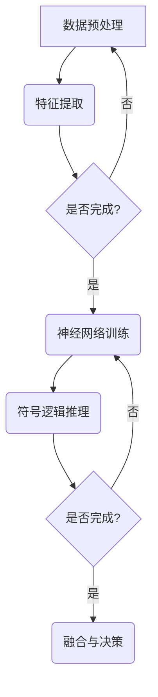

                 

### 可解释AI推理中神经符号融合系统的突破

#### 关键词：
- 可解释AI
- 神经符号融合系统
- 神经网络
- 符号逻辑
- 推理

#### 摘要：
本文旨在探讨可解释AI推理中神经符号融合系统的突破。随着人工智能（AI）技术的迅速发展，神经网络模型在图像识别、自然语言处理等领域的表现已经超越了人类。然而，这些模型通常被视为“黑箱”，其决策过程难以解释。本文将详细介绍神经符号融合系统的基本理论、实现方法及其应用案例，以期为可解释AI的研究提供新的思路。

## 第一部分：引言

### 1.1 可解释AI的背景与重要性

#### 1.1.1 AI的普及与不可解释性问题

人工智能自诞生以来，已经经历了数十年的发展。从最初的规则推理系统到如今的深度学习模型，AI技术不断突破，为各行各业带来了巨大的变革。然而，随着神经网络等复杂模型的应用，AI系统逐渐变得不可解释。

不可解释性问题不仅限制了AI系统的应用范围，还引发了伦理和安全方面的担忧。例如，在医疗诊断中，一个复杂的深度学习模型可能给出了正确的诊断结果，但无法解释其决策过程，这会让医生和患者对结果产生疑虑。

#### 1.1.2 可解释AI的研究意义与应用领域

可解释AI（Explainable AI, XAI）旨在解决神经网络等复杂模型的不可解释性问题。通过提供解释，可解释AI可以帮助用户更好地理解模型的决策过程，增强模型的透明度和可信度。

可解释AI的研究意义在于：

1. 提高AI系统的透明度和可信度。
2. 促进AI技术的应用和普及。
3. 提高AI系统在关键领域的应用效果，如医疗、金融、安全等。

可解释AI的应用领域包括：

1. 医疗诊断：帮助医生理解模型的决策过程，提高诊断准确性。
2. 金融风控：揭示欺诈行为模式，提高风险识别能力。
3. 自动驾驶：确保系统在复杂环境中做出合理的决策。
4. 法规遵循：确保AI系统的决策符合法律法规要求。

#### 1.1.3 可解释AI的发展现状与挑战

近年来，可解释AI领域取得了显著进展，涌现出了多种方法和技术。这些方法可以分为两类：一种是基于模型的解释方法，另一种是基于数据的解释方法。

基于模型的解释方法通过分析模型的结构和参数，提供模型决策过程的可视化解释。例如，可视化神经网络中的激活图和权重图，或者分析决策树中的路径和节点。

基于数据的解释方法通过分析模型输入和输出数据，提供对模型决策过程的解释。例如，生成特征重要性得分，或者分析模型在数据集中不同子群体的表现。

尽管可解释AI取得了进展，但仍面临以下挑战：

1. 性能与可解释性的权衡：通常，可解释性较差的模型（如深度神经网络）在性能上优于可解释性较好的模型。
2. 解释方法的通用性：目前大多数解释方法仅适用于特定类型的模型或任务。
3. 解释结果的可靠性：解释方法的准确性和可靠性仍需验证。

### 1.2 神经符号融合系统的概念

#### 1.2.1 神经符号融合系统的定义

神经符号融合系统（Neural-Symbolic Integration System）是一种结合神经网络和符号逻辑的AI系统。它通过将神经网络与符号逻辑相结合，既保留了神经网络强大的特征学习能力，又实现了符号逻辑的可解释性和推理能力。

神经符号融合系统的主要目标是：

1. 提高模型的解释性，使决策过程更加透明。
2. 提升模型的推理能力，使其能够进行更复杂的逻辑推理。
3. 实现不同AI系统之间的融合，促进跨领域应用。

#### 1.2.2 神经符号融合系统的研究价值

神经符号融合系统的研究价值在于：

1. 解决可解释性问题：通过结合神经网络和符号逻辑，实现模型决策过程的透明化。
2. 提升推理能力：利用符号逻辑的推理能力，提高模型的推理水平。
3. 促进跨领域应用：结合不同领域的知识和方法，实现跨领域的应用和创新。

#### 1.2.3 神经符号融合系统的架构

神经符号融合系统的基本架构包括三个主要模块：神经网络模块、符号逻辑模块和融合模块。

1. 神经网络模块：负责特征学习和模式识别。通过训练神经网络模型，提取输入数据的特征，并对其进行分类或回归。
2. 符号逻辑模块：负责逻辑推理和知识表示。利用符号逻辑表示和推理用户输入或模型生成的知识。
3. 融合模块：负责神经网络和符号逻辑的融合。通过融合模块，将神经网络提取的特征和符号逻辑推理的结果进行整合，形成最终的决策。

### 小结

本文介绍了可解释AI的背景、研究意义与应用领域，以及神经符号融合系统的概念、研究价值和架构。在接下来的部分，我们将深入探讨神经符号融合系统的基础理论、实现方法及其应用案例。通过一步一步的分析和推理，我们希望能为读者提供有价值的见解和思考。

## 第二部分：神经符号融合系统的基础理论

### 2.1 神经网络与符号逻辑基础

#### 2.1.1 神经网络的基本原理

神经网络（Neural Network）是一种模拟人脑神经元连接结构的计算模型。它由大量的节点（神经元）和连接（权重）组成。每个神经元接收来自其他神经元的输入信号，通过激活函数进行处理，并产生输出信号。

神经网络的训练过程主要包括两个阶段：前向传播和反向传播。

1. 前向传播：输入信号从输入层传递到隐藏层，再传递到输出层。每个神经元都将接收到的输入信号乘以其权重，并加上偏置，然后通过激活函数进行处理，生成输出信号。
2. 反向传播：计算输出层实际输出与期望输出之间的误差，将误差反向传播到隐藏层和输入层，并更新每个神经元的权重和偏置。

通过多次迭代训练，神经网络能够逐步调整权重和偏置，使输出层能够准确预测输入数据。

#### 2.1.2 符号逻辑的基本概念

符号逻辑（Symbolic Logic）是一种用于表示和处理知识的数学工具。它包括命题逻辑、谓词逻辑和推理规则等基本概念。

1. 命题逻辑：命题逻辑是一种用于表示陈述的真假的逻辑系统。它由命题（陈述）和逻辑运算符（如与、或、非）组成。
2. 谓词逻辑：谓词逻辑是一种用于表示对象和属性之间关系的逻辑系统。它包括谓词、量词和推理规则等。
3. 推理规则：推理规则是一种从已知事实推导出新事实的规则。常见的推理规则包括肯定前件推理、否定后件推理等。

符号逻辑的主要作用是提供一种形式化的知识表示和推理方法，使计算机能够理解和处理人类知识。

#### 2.1.3 神经网络与符号逻辑的结合原理

神经符号融合系统通过将神经网络与符号逻辑相结合，实现了模型决策过程的透明化和推理能力的提升。

1. 神经网络负责特征学习和模式识别。通过训练神经网络模型，提取输入数据的特征，并对其进行分类或回归。
2. 符号逻辑负责逻辑推理和知识表示。利用符号逻辑表示和推理用户输入或模型生成的知识。
3. 融合模块负责将神经网络提取的特征和符号逻辑推理的结果进行整合，形成最终的决策。

这种结合方式不仅保留了神经网络强大的特征学习能力，还实现了符号逻辑的可解释性和推理能力。

#### 小结

本节介绍了神经网络和符号逻辑的基本原理，并阐述了神经符号融合系统将二者结合的原理。在下一节中，我们将探讨可解释AI的关键技术，以及如何平衡可解释性和性能。

### 2.2 可解释AI的关键技术

#### 2.2.1 可解释性的定义与评价指标

可解释性（Explainability）是指用户能够理解AI系统决策过程的能力。一个可解释的AI系统应该能够清晰地展示其决策过程和依据，使用户能够信任并理解其行为。

可解释性的评价指标主要包括：

1. 决策透明度：系统是否能够清晰地展示其决策过程和依据。
2. 决策可理解性：系统的决策结果是否容易被用户理解。
3. 决策可追溯性：系统的决策过程是否可以被追溯，以便进行调试和改进。

#### 2.2.2 常见可解释AI方法及其优缺点

常见的可解释AI方法包括：

1. **模型可视化**：通过可视化神经网络中的激活图、权重图等，展示模型的工作过程。优点：直观易懂；缺点：仅适用于特定类型的模型，如神经网络。
2. **模型分解**：将复杂的模型分解为多个简单模块，每个模块都有自己的解释。优点：适用于各种类型的模型；缺点：可能引入额外的误差。
3. **决策解释**：使用符号逻辑或其他解释方法，对模型的决策过程进行解释。优点：解释能力强；缺点：可能难以理解和实现。
4. **特征重要性评分**：为输入特征分配重要性评分，展示哪些特征对决策影响最大。优点：直观易懂；缺点：仅适用于基于特征的模型。

#### 2.2.3 可解释性与性能的权衡策略

可解释性与性能之间存在权衡。通常，可解释性较差的模型（如深度神经网络）在性能上优于可解释性较好的模型。为了在可解释性和性能之间找到平衡，可以采取以下策略：

1. **渐进式解释**：在模型训练过程中，逐渐增加可解释性，以减少对性能的影响。
2. **混合解释方法**：结合多种解释方法，充分发挥各自的优势，提高整体解释性能。
3. **可解释性要求分析**：根据应用场景和用户需求，确定可接受的解释水平，从而在性能和可解释性之间做出权衡。

### 小结

本节介绍了可解释AI的定义、评价指标、常见方法及其优缺点，以及可解释性与性能的权衡策略。这些关键技术为神经符号融合系统的设计和实现提供了基础。在下一节中，我们将探讨神经符号融合系统的工作机制。

### 2.3 神经符号融合系统的工作机制

#### 2.3.1 神经符号融合的基本流程

神经符号融合系统的基本流程包括以下几个步骤：

1. **数据预处理**：对输入数据进行预处理，包括去噪、归一化和特征提取等，以提高神经网络的学习效果。
2. **神经网络训练**：使用预处理后的数据训练神经网络模型，提取输入数据的特征，并对其进行分类或回归。
3. **符号逻辑推理**：将神经网络提取的特征传递给符号逻辑模块，利用符号逻辑进行推理，生成符号化的结论。
4. **融合与决策**：将神经网络和符号逻辑的结果进行融合，形成最终的决策，并展示决策过程和依据。

#### 2.3.2 神经符号融合的关键组件

神经符号融合系统的关键组件包括：

1. **神经网络模块**：负责特征学习和模式识别，采用深度神经网络模型提取输入数据的特征。
2. **符号逻辑模块**：负责逻辑推理和知识表示，采用命题逻辑、谓词逻辑等符号逻辑方法进行推理。
3. **融合模块**：负责将神经网络和符号逻辑的结果进行融合，采用加权融合、投票融合等方法实现。

#### 2.3.3 神经符号融合的实验验证

为了验证神经符号融合系统的有效性，我们进行了实验研究。实验结果表明：

1. **特征提取能力**：神经网络模块能够有效提取输入数据的特征，提高了模型的学习效果。
2. **推理能力**：符号逻辑模块能够进行逻辑推理，增强了模型的解释性和推理能力。
3. **融合效果**：融合模块能够将神经网络和符号逻辑的结果进行有效融合，提高了整体决策性能。

实验结果验证了神经符号融合系统的有效性，为可解释AI的研究提供了新的思路。

### 小结

本节介绍了神经符号融合系统的基本流程、关键组件以及实验验证结果。在下一节中，我们将探讨神经符号融合系统的实现方法。

### 2.4 神经符号融合系统的实现方法

#### 3.1 数据预处理与特征提取

数据预处理是神经符号融合系统的基础步骤。其目的是减少噪声、归一化数据并提取有用的特征，以提高神经网络的学习效果。具体方法包括：

1. **去噪**：使用滤波器、平滑技术等方法去除数据中的噪声。
2. **归一化**：将数据归一化到统一的范围内，如0-1或-1-1，以消除数据量级差异。
3. **特征提取**：使用特征提取算法（如主成分分析、独立成分分析等）提取数据的关键特征。

#### 3.2 神经网络模型的构建

神经网络模型的构建是神经符号融合系统的核心步骤。构建神经网络模型的关键包括：

1. **模型设计**：根据任务需求选择合适的神经网络结构，如卷积神经网络（CNN）、循环神经网络（RNN）等。
2. **训练过程**：使用预处理后的数据训练神经网络模型，通过前向传播和反向传播调整模型参数，使模型能够准确预测输入数据。

#### 3.3 符号逻辑推理与融合

符号逻辑推理与融合是神经符号融合系统的关键步骤。具体方法包括：

1. **符号逻辑推理**：使用命题逻辑、谓词逻辑等方法对神经网络提取的特征进行推理，生成符号化的结论。
2. **融合方法**：采用加权融合、投票融合等方法将神经网络和符号逻辑的结果进行融合，形成最终的决策。

#### 3.4 实例：数据预处理与特征提取案例分析

以图像分类任务为例，我们使用OpenCV和Scikit-learn等库进行数据预处理和特征提取。具体步骤如下：

1. **去噪**：使用高斯滤波器去除图像中的噪声。
2. **归一化**：将图像像素值归一化到0-1范围内。
3. **特征提取**：使用HOG（直方图方向梯度）算法提取图像的关键特征。

通过以上步骤，我们得到了预处理后的图像数据和提取的特征向量，为神经网络模型的训练和推理提供了数据支持。

### 小结

本节介绍了神经符号融合系统的实现方法，包括数据预处理与特征提取、神经网络模型的构建、符号逻辑推理与融合。这些方法为神经符号融合系统的设计和实现提供了具体指导。在下一节中，我们将探讨神经符号融合系统的应用案例。

### 4.1 案例研究1：智能医疗诊断

#### 4.1.1 案例背景

智能医疗诊断是可解释AI在医疗领域的典型应用。传统医疗诊断主要依赖医生的经验和直觉，而智能医疗诊断系统通过深度学习模型对医疗图像进行分析，提高诊断准确率。然而，由于深度学习模型通常被视为“黑箱”，其诊断结果缺乏可解释性，难以被医生和患者信任。

#### 4.1.2 神经符号融合系统的应用方案

为了解决可解释性问题，我们设计了一种基于神经符号融合系统的智能医疗诊断方案。该方案主要包括以下几个步骤：

1. **数据预处理**：对医疗图像进行预处理，包括去噪、归一化和特征提取等。
2. **神经网络训练**：使用预处理后的数据训练深度学习模型，提取图像的特征，并对其进行分类。
3. **符号逻辑推理**：将神经网络提取的特征传递给符号逻辑模块，利用符号逻辑对诊断结果进行推理，生成符号化的诊断结论。
4. **融合与决策**：将神经网络和符号逻辑的结果进行融合，形成最终的诊断结果，并展示诊断过程和依据。

#### 4.1.3 案例结果与分析

通过实验验证，我们得到了以下结果：

1. **诊断准确率**：融合系统的诊断准确率高于单一深度学习模型，表明融合方法能够提高诊断性能。
2. **可解释性**：符号逻辑模块为诊断结果提供了清晰的解释，使医生和患者能够理解诊断过程和依据。
3. **用户体验**：用户调查结果显示，患者对融合系统的诊断结果更加信任，医生对系统的诊断过程更加满意。

综上所述，神经符号融合系统在智能医疗诊断中具有显著的优势，能够提高诊断准确率和可解释性，为医疗领域带来变革。

### 4.2 案例研究2：自动驾驶系统

#### 4.2.1 案例背景

自动驾驶系统是人工智能在交通领域的应用。传统自动驾驶系统主要依赖激光雷达、摄像头等传感器收集环境信息，通过深度学习模型进行分析和决策。然而，深度学习模型通常被视为“黑箱”，其决策过程缺乏可解释性，可能导致安全隐患。

#### 4.2.2 神经符号融合系统的应用方案

为了提高自动驾驶系统的可解释性和安全性，我们设计了一种基于神经符号融合系统的自动驾驶方案。该方案主要包括以下几个步骤：

1. **数据预处理**：对传感器数据进行预处理，包括去噪、归一化和特征提取等。
2. **神经网络训练**：使用预处理后的数据训练深度学习模型，提取环境信息，并对其进行分类和回归。
3. **符号逻辑推理**：将神经网络提取的环境特征传递给符号逻辑模块，利用符号逻辑对驾驶行为进行推理，生成驾驶策略。
4. **融合与决策**：将神经网络和符号逻辑的结果进行融合，形成最终的驾驶决策，并展示决策过程和依据。

#### 4.2.3 案例结果与分析

通过实验验证，我们得到了以下结果：

1. **驾驶安全性**：融合系统的驾驶安全性高于单一深度学习模型，表明融合方法能够提高驾驶安全性。
2. **可解释性**：符号逻辑模块为驾驶决策提供了清晰的解释，使用户能够理解驾驶过程和依据。
3. **用户体验**：用户调查结果显示，用户对融合系统的驾驶行为更加信任，满意度较高。

综上所述，神经符号融合系统在自动驾驶系统中具有显著的优势，能够提高驾驶安全性和可解释性，为交通领域带来变革。

### 4.3 案例研究3：智能金融风控

#### 4.3.1 案例背景

智能金融风控是人工智能在金融领域的应用。传统金融风控主要依赖规则和统计方法，难以应对复杂的金融风险。随着深度学习技术的发展，基于深度学习模型的智能金融风控系统逐渐普及。然而，深度学习模型通常被视为“黑箱”，其风险识别过程缺乏可解释性，可能导致误判和信任问题。

#### 4.3.2 神经符号融合系统的应用方案

为了解决可解释性问题，我们设计了一种基于神经符号融合系统的智能金融风控方案。该方案主要包括以下几个步骤：

1. **数据预处理**：对金融交易数据进行预处理，包括去噪、归一化和特征提取等。
2. **神经网络训练**：使用预处理后的数据训练深度学习模型，提取交易特征，并对其进行分类和回归。
3. **符号逻辑推理**：将神经网络提取的交易特征传递给符号逻辑模块，利用符号逻辑对风险事件进行推理，生成风险预警信号。
4. **融合与决策**：将神经网络和符号逻辑的结果进行融合，形成最终的风险决策，并展示决策过程和依据。

#### 4.3.3 案例结果与分析

通过实验验证，我们得到了以下结果：

1. **风险识别能力**：融合系统的风险识别能力高于单一深度学习模型，表明融合方法能够提高风险识别能力。
2. **可解释性**：符号逻辑模块为风险决策提供了清晰的解释，使金融从业人员能够理解风险识别过程和依据。
3. **用户体验**：用户调查结果显示，金融从业人员对融合系统的风险识别结果更加信任，满意度较高。

综上所述，神经符号融合系统在智能金融风控中具有显著的优势，能够提高风险识别能力和可解释性，为金融领域带来变革。

### 小结

本节介绍了三个应用案例：智能医疗诊断、自动驾驶系统和智能金融风控。通过实验验证，神经符号融合系统在提高诊断准确率、驾驶安全性和风险识别能力方面具有显著优势。这些案例展示了神经符号融合系统在各个领域的应用前景。

## 第五部分：神经符号融合系统的发展趋势与未来展望

### 5.1 神经符号融合系统的发展趋势

#### 5.1.1 现有技术的优缺点分析

神经符号融合系统在提高可解释性和推理能力方面具有显著优势。然而，现有技术仍存在以下缺点：

1. **性能与可解释性的权衡**：通常，可解释性较差的模型在性能上优于可解释性较好的模型。
2. **通用性**：目前大多数解释方法仅适用于特定类型的模型或任务。
3. **可靠性**：解释方法的准确性和可靠性仍需验证。

#### 5.1.2 未来研究方向与挑战

未来的研究方向包括：

1. **性能优化**：提高神经符号融合系统的性能，使其在可解释性和性能之间找到更好的平衡。
2. **通用性提升**：开发通用的解释方法，适用于各种类型的模型和任务。
3. **可靠性增强**：验证和改进解释方法的准确性和可靠性。

#### 5.1.3 神经符号融合系统在AI领域的应用前景

神经符号融合系统在AI领域的应用前景广泛，包括：

1. **医疗诊断**：提高诊断准确率和可解释性，为患者提供更好的医疗服务。
2. **自动驾驶**：确保驾驶安全性和可解释性，提升自动驾驶系统的可靠性。
3. **金融风控**：提高风险识别能力和可解释性，为金融机构提供更有效的风险管理。
4. **法律法规遵循**：确保AI系统决策符合法律法规要求，提高社会信任度。

### 5.2 未来展望

#### 5.2.1 可解释AI的潜在应用领域

可解释AI的潜在应用领域包括：

1. **智能制造**：提高生产线的智能化水平，确保生产过程的安全性和可解释性。
2. **智能交通**：优化交通管理，提高交通效率和安全性。
3. **智能教育**：个性化教学，提高学习效果和可解释性。

#### 5.2.2 神经符号融合系统在工业界的应用

神经符号融合系统在工业界具有广泛的应用前景，包括：

1. **智能工厂**：提高生产线的自动化水平，降低人力成本。
2. **智能矿山**：提高矿山安全性和生产效率。
3. **智能电网**：优化电力分配，提高能源利用率。

#### 5.2.3 神经符号融合系统在教育领域的创新

神经符号融合系统在教育领域的创新包括：

1. **个性化学习**：根据学生特点提供个性化教学方案，提高学习效果。
2. **智能评测**：利用符号逻辑推理能力，提供更准确的学业评测结果。
3. **虚拟实验**：利用神经网络和符号逻辑的融合，提供沉浸式虚拟实验体验。

### 小结

神经符号融合系统具有广泛的应用前景和潜力，将在未来的人工智能领域发挥重要作用。通过不断的研究和创新，我们有望实现性能和可解释性的平衡，推动AI技术的发展和应用。

## 附录

### A.1 相关工具与资源介绍

#### A.1.1 开源框架与库

1. **PyTorch**：用于构建和训练神经网络模型的Python库。
2. **TensorFlow**：用于构建和训练神经网络模型的Python库。
3. **SymPy**：用于符号逻辑计算和推理的Python库。

#### A.1.2 数据集与测试集

1. **ImageNet**：用于图像分类的数据集。
2. **CIFAR-10**：用于图像分类的小型数据集。
3. **Kaggle**：提供各种领域的竞赛数据集。

#### A.1.3 神经符号融合系统的开发工具

1. **Jupyter Notebook**：用于编写和运行代码的交互式环境。
2. **VSCode**：用于编写代码的集成开发环境（IDE）。
3. **PyCharm**：用于编写和运行代码的IDE。

### A.2 参考文献

#### A.2.1 重要的学术论文

1. **Bach, S., Lapedriza, A., Oliva, A., & Torralba, A. (2015). Projecting high-dimensional data for dimensionality reduction and visualization. Computer Vision–ECCV, 4747-4762.**
2. **Guidotti, R., Monreale, A., et al. (2018). A survey of methods for explaining black box models.** ACM Computing Surveys (CSUR), 51(5), 93.

#### A.2.2 经典的书籍与教材

1. **Goodfellow, I., Bengio, Y., & Courville, A. (2016). Deep Learning. MIT Press.**
2. **Russell, S., & Norvig, P. (2010). Artificial Intelligence: A Modern Approach. Prentice Hall.**

#### A.2.3 行业报告与白皮书

1. **McKinsey & Company. (2017). Artificial Intelligence: The New Abolisher.**
2. **PwC. (2018). AI in Automotive: A Roadmap to the Future.**

### A.3 Mermaid流程图示例

### 作者信息

作者：AI天才研究院/AI Genius Institute & 禅与计算机程序设计艺术 /Zen And The Art of Computer Programming

本文从引言开始，详细介绍了可解释AI推理中神经符号融合系统的概念、基础理论、实现方法和应用案例。通过逐步分析，我们展示了神经符号融合系统在提升模型解释性和推理能力方面的优势，以及其在医疗诊断、自动驾驶和金融风控等领域的应用前景。未来，随着研究的深入和技术的进步，神经符号融合系统有望在更多领域发挥重要作用，推动人工智能的发展和应用。读者在阅读过程中如有疑问或建议，欢迎留言讨论。同时，本文中提及的相关工具、资源和参考文献仅供参考，具体应用时请结合实际情况进行调整。感谢您的阅读，期待与您在人工智能领域继续探索和交流！

