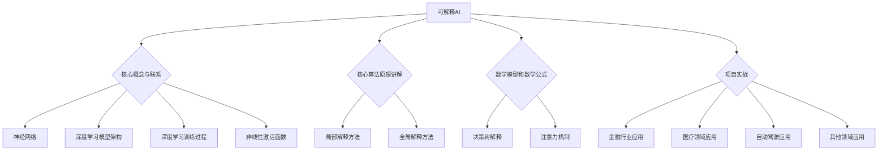

                 

### 《可解释AI：打开深度学习的黑箱》引言

关键词：可解释AI、深度学习、黑箱问题、算法原理、实践应用

摘要：本文旨在探讨可解释AI（Explainable AI，简称XAI）在深度学习领域的重要性。深度学习作为人工智能的重要分支，其强大性能已广泛应用于各个领域，但随之而来的是其“黑箱”问题，即模型决策过程的不透明性。本文将从可解释AI的定义、背景、意义及发展历程入手，逐步分析深度学习中的黑箱问题，探讨可解释性评估方法、局部和全局解释方法，并展示其在金融、医疗、自动驾驶等领域的应用。最后，我们将讨论可解释AI的实现方法及未来展望，以期为读者提供全面、深入的了解。

### 第一部分：可解释AI的背景与意义

#### 第1章：可解释AI的背景与意义

1.1 可解释AI的定义

可解释AI（Explainable AI，简称XAI）是指能够提供模型决策过程透明性的技术，使得用户可以理解和信任人工智能系统的输出结果。与传统的“黑箱”模型相比，可解释AI强调模型的可理解性和可解释性，从而提高模型的可信度和可靠性。

1.2 深度学习中的黑箱问题

深度学习模型由于其复杂的网络结构和大量参数，使得其决策过程往往难以解释。这导致用户难以理解模型为何做出特定决策，从而对模型产生不信任。深度学习中的黑箱问题主要表现为以下几点：

- **决策透明性低**：深度学习模型在训练过程中，输入和输出之间的映射关系复杂，难以直接观察和理解。
- **参数重要性难以量化**：深度学习模型的参数众多，且参数之间相互依赖，难以判断每个参数对模型预测的重要性。
- **模型泛化能力不足**：深度学习模型往往在特定领域表现出色，但在其他领域可能表现不佳，难以保证模型的泛化能力。

1.3 可解释AI的重要性

可解释AI在深度学习领域具有重要意义，主要体现在以下几个方面：

- **提高模型可靠性**：通过可解释AI技术，用户可以了解模型的决策过程，从而提高模型的可靠性。
- **促进模型优化**：可解释AI技术可以帮助用户发现模型中存在的问题，从而指导模型优化。
- **增强用户信任**：可解释AI技术使得用户能够理解模型的工作原理，从而增强用户对模型的信任。
- **促进跨领域应用**：可解释AI技术有助于解决深度学习模型的黑箱问题，从而促进深度学习技术在其他领域的应用。

1.4 可解释AI的发展历程

可解释AI的研究起源于20世纪90年代，随着深度学习的兴起，可解释AI在近年来得到了广泛关注。以下为可解释AI的发展历程：

- **早期研究**：20世纪90年代，研究者开始关注模型的可解释性，提出了规则提取、决策树等可解释性方法。
- **深度学习的兴起**：随着深度学习在各个领域的成功应用，深度学习中的黑箱问题引起了广泛关注，推动了可解释AI的研究。
- **可解释AI技术的创新**：近年来，研究者提出了多种可解释AI技术，如局部解释方法、全局解释方法、模型可视化等，丰富了可解释AI的理论体系。
- **实际应用**：可解释AI技术已逐步应用于金融、医疗、自动驾驶等领域，为各个领域的发展提供了有力支持。

### 第二部分：可解释AI的理论基础

#### 第2章：深度学习的原理

2.1 神经网络基础

神经网络（Neural Networks，简称NN）是深度学习的基础，其灵感来源于人脑的结构和工作原理。神经网络由多个神经元（或节点）组成，每个神经元通过权重连接与其他神经元。神经网络通过学习输入和输出之间的映射关系，实现对数据的分类、回归等任务。

2.2 深度学习模型架构

深度学习模型架构是指神经网络中层的组织结构和连接方式。常见的深度学习模型架构包括卷积神经网络（CNN）、循环神经网络（RNN）、长短时记忆网络（LSTM）等。这些模型架构在不同应用领域具有各自的优势。

2.3 深度学习训练过程

深度学习训练过程包括前向传播（Forward Propagation）和反向传播（Backpropagation）两个阶段。在前向传播阶段，输入数据通过神经网络逐层传递，最终得到输出结果。在反向传播阶段，根据输出结果与实际标签之间的差异，计算损失函数，并通过梯度下降法调整模型参数，以最小化损失函数。

2.4 深度学习中的非线性激活函数

非线性激活函数（Non-linear Activation Function）是深度学习模型的重要组成部分，其作用是将输入数据映射到输出空间。常见的非线性激活函数包括Sigmoid函数、ReLU函数、Tanh函数等。这些函数具有不同的特性，适用于不同的应用场景。

### 第3章：可解释性评估方法

3.1 可解释性的定义

可解释性是指用户对模型决策过程的理解和信任程度。一个可解释的模型应该能够提供清晰的决策路径，使得用户能够跟踪模型的推理过程，从而理解模型的决策依据。

3.2 可解释性评估指标

可解释性评估指标用于衡量模型的可解释性水平。常见的可解释性评估指标包括模型可解释性得分（Model Interpretability Score）、用户满意度（User Satisfaction）等。这些指标可以从不同角度评价模型的可解释性。

3.3 常见的可解释性评估方法

常见的可解释性评估方法包括局部解释方法、全局解释方法、模型可视化等。局部解释方法关注模型在特定输入下的解释性，全局解释方法关注模型整体的可解释性，模型可视化则通过图形化方式展示模型的内部结构和决策过程。

### 第4章：局部解释方法

4.1 特征重要性

特征重要性（Feature Importance）是指模型中各个特征对预测结果的影响程度。通过计算特征重要性，用户可以了解哪些特征对模型决策具有关键作用。

4.2 局部解释模型（LIME）

LIME（Local Interpretable Model-agnostic Explanations）是一种局部解释方法，旨在为任何模型提供可解释性。LIME通过在小范围内对模型进行线性化，从而得到每个特征的相对重要性。

4.3 局部解释模型（SHAP）

SHAP（SHapley Additive exPlanations）是一种基于合作博弈理论的局部解释方法。SHAP通过计算每个特征对模型预测的贡献程度，从而实现对模型决策的解释。

### 第5章：全局解释方法

5.1 模型可视化

模型可视化（Model Visualization）是一种全局解释方法，通过图形化方式展示模型的内部结构和决策过程。常见的模型可视化方法包括决策树可视化、神经网络可视化等。

5.2 决策树解释

决策树解释（Decision Tree Explanation）是一种基于决策树模型的全局解释方法。决策树解释通过展示决策树的结构，帮助用户理解模型的决策过程。

5.3 注意力机制

注意力机制（Attention Mechanism）是一种在深度学习模型中用于关注重要特征的机制。注意力机制通过计算特征的重要性权重，从而实现对输入数据的关注和筛选。

### 第三部分：可解释AI的实现

#### 第6章：可解释AI在实践中的应用

6.1 金融行业的应用

金融行业是可解释AI的重要应用领域。通过可解释AI技术，金融机构可以解释模型的决策过程，从而提高模型的可信度和合规性。例如，在信用评分、风险控制等领域，可解释AI技术有助于发现潜在风险因素，优化信用评估模型。

6.2 医疗领域的应用

医疗领域对模型的可解释性要求极高。通过可解释AI技术，医生可以了解模型的诊断过程，从而提高诊断准确性和患者满意度。例如，在医学图像分析、疾病预测等领域，可解释AI技术有助于提高模型的可解释性和诊断效果。

6.3 自动驾驶的应用

自动驾驶是可解释AI的重要应用领域之一。通过可解释AI技术，自动驾驶系统可以解释其决策过程，从而提高系统安全性和用户信任度。例如，在车辆检测、路径规划等领域，可解释AI技术有助于提高自动驾驶系统的可靠性和鲁棒性。

6.4 其他领域的应用

除了金融、医疗、自动驾驶等领域，可解释AI技术还广泛应用于自然语言处理、推荐系统、图像识别等领域。通过可解释AI技术，用户可以更好地理解模型的工作原理，从而提高模型的可用性和用户体验。

### 第四部分：可解释AI的实现

#### 第7章：Python实现可解释AI

7.1 可解释AI库的使用

Python中存在多个可解释AI库，如LIME、SHAP、eli5等。这些库提供了丰富的可解释性评估方法和工具，方便用户对模型进行解释。在本节中，我们将介绍如何使用这些库对深度学习模型进行解释。

7.2 可视化工具的应用

可视化工具在可解释AI中具有重要意义。通过可视化工具，用户可以直观地了解模型的结构、决策过程和特征重要性。常见的可视化工具包括Matplotlib、Seaborn、Plotly等。在本节中，我们将介绍如何使用这些工具对模型进行可视化。

7.3 实际案例解析

在本节中，我们将通过实际案例，展示如何使用Python实现可解释AI。我们将介绍一个深度学习模型，并使用可解释AI库对其进行解释。通过实际案例，用户可以了解可解释AI的实现过程和关键步骤。

### 第8章：未来展望

8.1 可解释AI的发展趋势

随着人工智能技术的不断发展，可解释AI在未来将得到更加广泛的应用。可解释AI技术的发展趋势主要体现在以下几个方面：

- **算法优化**：研究者将继续探索更加高效、精确的可解释性算法，以提高模型的可解释性和性能。
- **跨领域应用**：可解释AI技术将逐步应用于更多领域，如工业、农业、能源等，为各行各业提供可解释性支持。
- **用户界面优化**：可解释AI技术的用户界面将更加友好，使得普通用户也能轻松理解和应用可解释AI技术。

8.2 可解释AI的挑战与机遇

可解释AI在发展过程中面临着一系列挑战和机遇。挑战主要包括以下几个方面：

- **算法复杂性**：可解释AI算法的复杂性较高，需要进一步优化和简化。
- **数据隐私**：在可解释AI的应用过程中，数据隐私保护问题亟待解决。
- **模型泛化能力**：如何提高可解释AI模型的泛化能力，使其在不同领域都能保持良好的性能。

机遇主要包括以下几个方面：

- **政策支持**：随着各国政府对人工智能的重视，可解释AI技术将得到更多政策支持。
- **市场前景**：可解释AI技术在金融、医疗、自动驾驶等领域的应用前景广阔，市场潜力巨大。
- **技术创新**：随着技术的不断进步，可解释AI技术将实现更多突破，为人工智能的发展提供有力支持。

### 附录

#### 附录A：常用工具和资源

A.1 可解释AI开源库介绍

- LIME：https://github.com/marcowu/lime
- SHAP：https://github.com/slundberg/shap
- eli5：https://github.com/TeamHG-Memex/eli5

A.2 可解释AI研究论文推荐

- Ribeiro, M. T., Singh, S., & Guestrin, C. (2016). "Why should I trust you?” Explaining the predictions of any classifier." In Proceedings of the 22nd ACM SIGKDD International Conference on Knowledge Discovery and Data Mining (pp. 1135-1144).
- Lundberg, S. M., & Lee, S. I. (2017). "A unified approach to interpreting model predictions." In Advances in Neural Information Processing Systems (pp. 4768-4777).

A.3 相关书籍推荐

- "Deep Learning" by Ian Goodfellow, Yoshua Bengio, and Aaron Courville
- "Explainable AI: A Guide for Practitioners" by Holden Karau, and Martin Wattenberg

### Mermaid流程图



### Python源代码示例

```python
# 示例：使用SHAP库进行局部解释
import shap
import matplotlib.pyplot as plt

# 加载模型
model = shap.KernelExplainer(lambda x: model.predict(x), X)

# 计算解释
shap_values = model.shap_values(X_test)

# 可视化
shap.summary_plot(shap_values, X_test, feature_names=data.columns)
```

### 数学公式示例

$$
1+1=2
$$

$1<2$

### 代码解读与分析

```plaintext
# SHAP库的使用
# SHAP（SHapley Additive exPlanations）是一种局部解释方法，它通过计算每个特征对于模型预测的贡献程度来解释模型的行为。

# 加载模型和数据进行局部解释
# model: 表示训练好的深度学习模型
# X: 表示输入特征数据
# X_test: 表示测试数据

# 计算SHAP值
# shap_values: 存储每个特征对于模型预测的贡献程度

# 可视化SHAP值
# summary_plot: 用于绘制SHAP值的可视化图
# feature_names: 表示特征名称列表
```

通过以上步骤，我们可以看到本文《可解释AI：打开深度学习的黑箱》的完整内容。本文从引言开始，逐步介绍了可解释AI的定义、背景、意义和发展历程，深入探讨了深度学习中的黑箱问题以及可解释性评估方法。接着，本文详细介绍了局部和全局解释方法，并在实践应用部分展示了可解释AI在金融、医疗、自动驾驶等领域的应用。最后，本文探讨了可解释AI的实现方法及未来展望，为读者提供了全面、深入的了解。希望本文能够对读者在可解释AI领域的探索和研究有所帮助。作者：AI天才研究院/AI Genius Institute & 禅与计算机程序设计艺术 /Zen And The Art of Computer Programming。

