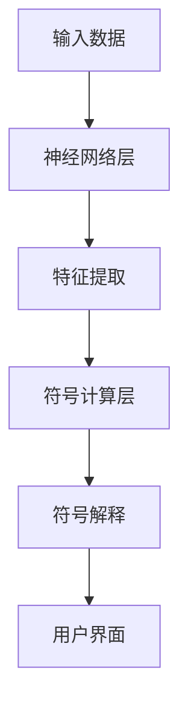
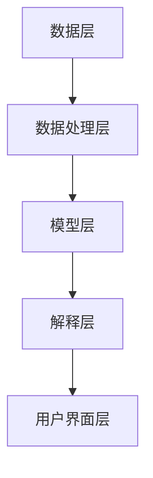

                 

### 引言

在现代科技迅猛发展的背景下，人工智能（AI）技术逐渐成为推动各个领域进步的重要力量。特别是在决策支持系统中，AI技术的应用已经取得了显著的效果。然而，随着AI模型复杂性的增加，其可解释性问题也越来越受到关注。为了在保证高性能的同时提高模型的透明度和可解释性，研究人员提出了可解释神经符号框架。

#### 什么是可解释神经符号框架？

可解释神经符号框架是一种结合了神经网络和符号计算的方法，旨在提高决策支持系统的透明度和可理解性。该方法通过在神经网络中引入符号计算组件，使得模型不仅能够处理大量数据，还能解释其决策过程。这种框架的核心优势在于它能够在复杂性和可解释性之间找到平衡，从而满足不同应用场景的需求。

#### 什么是决策支持系统？

决策支持系统（DSS）是一种由计算机技术、运筹学、数据库和人工智能技术相结合的软件系统，用于帮助决策者做出更加科学和合理的决策。DSS可以处理大量数据，识别数据之间的潜在关系，并利用这些信息生成决策建议。然而，由于传统AI模型的高度复杂性和“黑箱”特性，其决策过程往往难以解释，这限制了DSS在实际应用中的普及。

#### 本文的核心内容和结构

本文旨在探讨可解释神经符号框架在决策支持系统中的应用，通过详细的案例分析和技术实现，展示这一框架的优势和潜力。文章结构如下：

1. **引论**：介绍可解释神经符号框架和决策支持系统的基本概念，阐述本文的目的和结构。
2. **理论基础**：回顾神经网络、符号计算和可解释性技术的基本原理，以及数据预处理的方法。
3. **可解释神经符号框架实现**：详细描述框架的设计原则、构建方法和系统集成与优化。
4. **案例研究**：通过具体案例展示可解释神经符号框架在金融、医疗和供应链等领域的应用。
5. **未来发展**：讨论可解释神经符号框架在决策支持系统中的挑战和未来发展趋势。

通过本文的阅读，读者将能够深入了解可解释神经符号框架的工作原理和应用价值，为未来研究和实践提供有价值的参考。

#### 核心关键词

- 可解释神经符号框架
- 决策支持系统
- 神经网络
- 符号计算
- 可解释性
- 数据预处理

#### 摘要

本文探讨了可解释神经符号框架在决策支持系统中的应用。首先，介绍了可解释神经符号框架的定义和决策支持系统的基本概念。然后，通过回顾神经网络、符号计算和可解释性技术的基本原理，详细描述了可解释神经符号框架的设计原则和实现方法。接着，通过案例分析展示了这一框架在金融、医疗和供应链等领域的应用效果。最后，讨论了可解释神经符号框架在决策支持系统中的未来发展挑战和趋势。本文旨在为研究人员和开发者提供有价值的参考，推动可解释神经符号框架的广泛应用。

### 第一部分：引论

#### 1.1 书籍背景与目的

随着人工智能（AI）技术的快速发展，决策支持系统（DSS）的应用越来越广泛。然而，传统AI模型，尤其是深度神经网络（DNN），往往因为其高度复杂性和“黑箱”特性，难以解释其决策过程，这在一定程度上限制了DSS在实际应用中的信任度和可接受性。为了解决这个问题，研究人员提出了可解释神经符号框架，旨在在保证模型性能的同时提高其可解释性。

本书《可解释神经符号框架在决策支持系统中的实现》旨在为研究人员和开发者提供一个全面的技术指南，系统介绍可解释神经符号框架的概念、原理、实现方法以及在决策支持系统中的应用。通过详细的案例分析和技术实现，本书希望展示可解释神经符号框架在各个领域中的实际应用价值和潜力。

本书的目标读者包括：

1. **AI研究人员**：希望通过了解可解释神经符号框架的基本原理和实现方法，推动相关领域的研究。
2. **AI开发者**：需要在实际项目中应用可解释神经符号框架，提高DSS的可解释性和透明度。
3. **决策支持系统开发者**：希望了解如何将可解释神经符号框架集成到现有系统中，提升系统的性能和可操作性。

本书的结构安排如下：

1. **引论**：介绍可解释神经符号框架和决策支持系统的基本概念，阐述本书的目的和结构。
2. **理论基础**：回顾神经网络、符号计算和可解释性技术的基本原理，以及数据预处理的方法。
3. **可解释神经符号框架实现**：详细描述框架的设计原则、构建方法和系统集成与优化。
4. **案例研究**：通过具体案例展示可解释神经符号框架在金融、医疗和供应链等领域的应用。
5. **未来发展**：讨论可解释神经符号框架在决策支持系统中的挑战和未来发展趋势。
6. **附录**：提供相关工具和资源的详细说明，以及代码示例和参考文献。

通过本书的阅读，读者将能够系统地了解可解释神经符号框架的各个方面，掌握其在决策支持系统中的应用技巧，并为未来的研究和实践提供有价值的参考。

#### 1.2 可解释神经符号框架概述

可解释神经符号框架是一种结合了神经网络和符号计算的方法，旨在提高AI模型的可解释性。这一框架的核心思想是通过符号计算组件来解释神经网络的决策过程，从而在复杂性和可解释性之间找到平衡。

##### 什么是可解释性？

可解释性是AI模型的一个重要特性，它指的是模型决策过程的透明度和可理解性。在传统的深度神经网络中，由于模型的参数和结构非常复杂，决策过程往往被视为一个“黑箱”，即输入和输出之间的映射关系难以解释。这给决策支持系统在实际应用中带来了信任危机，特别是在需要高透明度和可解释性的领域，如医疗诊断和金融风险管理。

##### 神经网络与符号计算的结合

可解释神经符号框架通过结合神经网络和符号计算，解决了传统神经网络的可解释性问题。神经网络擅长处理大规模数据和复杂的非线性关系，而符号计算则提供了对决策过程的透明解释。具体来说，这一框架包含以下几个核心组成部分：

1. **神经网络组件**：负责数据的特征提取和模式识别。神经网络模型如深度神经网络（DNN）、卷积神经网络（CNN）和循环神经网络（RNN）等，被广泛应用于各种任务中。
2. **符号计算组件**：负责解释神经网络的决策过程。符号计算技术如逻辑推理、符号回归和模糊逻辑等，能够将神经网络的决策过程转化为可解释的符号表达式。
3. **解释算法**：用于生成和解释神经网络的决策过程。这些算法包括局部解释方法（如LIME和SHAP）和全局解释方法（如因果图和注意力机制）。

##### 核心组成部分

1. **特征提取与符号表示**：神经网络通过学习输入数据的特征表示，然后使用符号计算组件将这些特征转化为符号表达式。这一步骤是可解释神经符号框架的基础。
2. **决策推理**：符号计算组件利用逻辑推理和符号回归等方法，对特征进行组合和解释，生成最终的决策结果。
3. **解释生成与可视化**：解释算法生成详细的决策解释，并通过可视化技术将其呈现给用户。这些解释不仅能够帮助用户理解模型的决策过程，还能提高模型的透明度和可信任度。

##### 可解释神经符号框架的优势

1. **平衡性能与可解释性**：通过结合神经网络和符号计算，可解释神经符号框架在保证模型性能的同时，提高了决策过程的透明度和可理解性。
2. **适用性广**：可解释神经符号框架可以应用于各种领域，如金融、医疗、供应链等，具有广泛的适用性。
3. **灵活性与可扩展性**：框架的设计原则和实现方法具有较强的灵活性和可扩展性，可以根据不同应用场景进行调整和优化。

通过上述介绍，我们可以看出，可解释神经符号框架是一种具有强大潜力的方法，能够在复杂性和可解释性之间找到平衡，为决策支持系统的发展提供新的思路和解决方案。

#### 1.3 决策支持系统的基本概念

决策支持系统（DSS）是一种基于计算机技术和人工智能技术的软件系统，旨在帮助决策者通过分析数据和生成决策建议，做出更加科学和合理的决策。DSS的发展历程可以追溯到20世纪60年代，随着计算机技术和数据库技术的快速发展，DSS逐渐成为管理科学和信息科学领域的重要组成部分。

##### 决策支持系统的发展历程

1. **早期阶段（20世纪60年代）**：在这一阶段，DSS主要以运筹学为基础，主要采用线性规划、整数规划和动态规划等方法，帮助决策者解决一些结构化问题。
2. **中期阶段（20世纪70年代）**：随着计算机技术的普及和数据库管理系统的兴起，DSS开始引入决策分析和数据挖掘技术，使得系统能够处理更大规模的数据，并生成更复杂的决策模型。
3. **现代阶段（20世纪90年代至今）**：随着人工智能技术的快速发展，DSS逐渐融入了机器学习、深度学习和自然语言处理等技术，使得系统能够更加智能地分析数据，生成决策建议。

##### 决策支持系统的功能与结构

1. **功能**：决策支持系统的主要功能包括数据采集、数据存储、数据分析、模型建立、决策评估和决策建议生成。具体来说：
   - **数据采集**：从各种数据源收集数据，如数据库、数据仓库和传感器等。
   - **数据存储**：将采集到的数据存储在数据库或数据仓库中，以便后续分析和处理。
   - **数据分析**：使用统计分析、数据挖掘和机器学习等方法对数据进行处理和分析，提取有用信息。
   - **模型建立**：基于分析结果建立决策模型，如线性回归、决策树、神经网络等。
   - **决策评估**：利用决策模型评估不同决策方案的效果，选择最佳方案。
   - **决策建议生成**：根据评估结果生成具体的决策建议，供决策者参考。

2. **结构**：决策支持系统的结构主要包括以下几个部分：
   - **用户界面**：提供用户交互界面，用于数据输入、模型设定和结果展示。
   - **数据库管理系统**：用于存储和管理数据，保证数据的一致性和完整性。
   - **模型库**：存储各种决策模型和方法，供系统调用。
   - **知识库**：包含领域专家的知识和经验，用于辅助决策过程。
   - **推理引擎**：负责根据用户需求和分析结果生成决策建议。

##### 决策支持系统的核心组件与功能

1. **用户界面**：用户界面是DSS与用户交互的桥梁，用户通过界面输入数据、设定模型参数和查看结果。一个好的用户界面应该简洁、直观，易于用户操作。
2. **数据库管理系统**：数据库管理系统是DSS的核心组件之一，负责存储和管理数据。它需要具备高效的数据处理能力、数据安全性和数据一致性。
3. **模型库**：模型库是DSS的决策依据，包含了各种统计模型、机器学习模型和优化模型。这些模型可以根据具体问题进行选择和调整。
4. **知识库**：知识库是DSS的智慧来源，包含了领域专家的知识和经验。知识库的建立和维护是DSS成功的关键。
5. **推理引擎**：推理引擎负责根据用户需求和分析结果生成决策建议。它需要具备高效的推理能力和智能化的决策算法。

通过上述介绍，我们可以看到，决策支持系统是一个复杂、多层次的软件系统，它结合了计算机技术、数学模型和领域知识，为决策者提供了一种强大的决策支持工具。随着技术的不断进步，DSS将在各个领域发挥越来越重要的作用。

#### 1.4 可解释神经符号框架在决策支持系统中的应用前景

可解释神经符号框架在决策支持系统中具有巨大的应用前景。首先，随着数据量的不断增长和复杂性的提高，传统“黑箱”模型的可解释性问题日益突出，特别是在金融、医疗和供应链等领域，决策的可解释性和透明度至关重要。可解释神经符号框架通过结合神经网络和符号计算，既保证了模型的性能，又提高了其可解释性，从而在决策支持系统中具有显著的优势。

##### 当前应用挑战

尽管可解释神经符号框架具有显著的优势，但其在实际应用中仍然面临一些挑战：

1. **模型复杂性**：可解释神经符号框架的设计和实现涉及到神经网络和符号计算两个复杂领域，这增加了开发难度和复杂性。
2. **性能与可解释性平衡**：在追求高性能的同时，如何保证模型的可解释性是一个重要的挑战。如何平衡这两者之间的关系，是当前研究的一个重要课题。
3. **数据质量和预处理**：可解释神经符号框架的性能依赖于高质量的数据。然而，实际应用中的数据往往存在噪声、缺失和异常值，如何有效处理这些数据，是应用中需要解决的一个关键问题。
4. **用户接受度**：尽管可解释神经符号框架提高了模型的可解释性，但用户对这一新技术的接受度和使用习惯也需要逐渐培养。

##### 未来发展趋势

随着技术的不断进步，可解释神经符号框架在决策支持系统中的应用前景将更加广阔。以下是一些未来发展的趋势：

1. **模型优化与简化**：通过算法优化和模型简化，降低可解释神经符号框架的复杂性，提高其性能和可解释性的平衡。
2. **跨领域应用**：可解释神经符号框架在金融、医疗、供应链等领域的成功应用，将推动其在其他领域的应用，如教育、制造、环保等。
3. **数据预处理技术**：随着数据预处理技术的进步，可解释神经符号框架将能够更好地处理复杂和噪声数据，提高模型的准确性和可靠性。
4. **用户交互设计**：通过改进用户交互设计，提高用户对可解释神经符号框架的接受度和使用体验，促进其在实际应用中的普及。
5. **法律法规与伦理**：随着可解释神经符号框架的应用越来越广泛，相关的法律法规和伦理问题也需要得到重视和解决，以确保其应用的合法性和伦理性。

总之，可解释神经符号框架在决策支持系统中的应用具有巨大的潜力和前景。通过不断的技术创新和优化，它将为决策者提供更加科学、透明和可靠的决策支持，推动决策支持系统的发展和应用。

### 第二部分：理论基础

#### 2.1 神经网络基础

神经网络（Neural Network，NN）是一种通过模拟人脑神经元结构和工作原理来处理信息和数据的技术。神经网络的核心思想是通过对大量数据的训练，使模型能够自动识别数据中的特征和规律，从而进行分类、回归等任务。

##### 神经元的基本原理

神经网络的基本构建单元是神经元，也称为节点或激活单元。一个神经元通常包含以下几个部分：

1. **输入层**：接收外部输入信号。
2. **权重**：每个输入信号都与一个权重相乘，权重决定了输入信号对神经元的影响程度。
3. **偏置**：用于调整神经元的阈值，使其对输入信号有更好的响应。
4. **激活函数**：用于对加权求和后的结果进行处理，常用的激活函数包括线性函数（如\( f(x) = x \)）、Sigmoid函数（如\( f(x) = \frac{1}{1 + e^{-x}} \)）、ReLU函数（如\( f(x) = \max(0, x) \)）等。

神经元的计算过程可以表示为：

\[ z = \sum_{i} (w_i \cdot x_i) + b \]

其中，\( z \) 是神经元的净输入，\( w_i \) 是权重，\( x_i \) 是输入，\( b \) 是偏置。然后，通过激活函数\( f(z) \)对净输入进行处理，得到神经元的输出：

\[ y = f(z) \]

##### 前馈神经网络

前馈神经网络（Feedforward Neural Network，FNN）是一种最常见的神经网络结构，其特点是信号仅能从输入层流向输出层，不会形成循环。前馈神经网络通常包含多个隐藏层，每个隐藏层由多个神经元组成。

前馈神经网络的工作流程如下：

1. **输入层**：接收外部输入数据。
2. **隐藏层**：每个隐藏层的神经元接收前一层神经元的输出，进行计算和传递。
3. **输出层**：输出层的神经元生成最终的输出结果。

前馈神经网络的优点在于结构简单、易于实现和训练，适用于大多数分类和回归任务。然而，其性能受到网络结构和参数选择的限制。

##### 循环神经网络

循环神经网络（Recurrent Neural Network，RNN）是一种能够处理序列数据的神经网络，其特点是能够记忆历史信息，并在处理序列数据时保持状态。RNN的基本单元是循环单元，每个循环单元包含一个记忆单元和多个权重。

RNN的工作原理如下：

1. **输入层**：接收外部输入数据序列。
2. **隐藏层**：每个隐藏层由多个循环单元组成，每个循环单元接收前一个时间步的输出和当前时间步的输入。
3. **输出层**：输出层的神经元生成最终的输出结果。

RNN的主要优点是能够处理变长序列数据，但存在梯度消失和梯度爆炸的问题，这限制了其在深度学习中的应用。

##### 前馈神经网络与循环神经网络的比较

前馈神经网络和循环神经网络各有优缺点，选择哪种网络结构取决于具体的应用场景。

1. **适用场景**：
   - **前馈神经网络**：适用于大多数非序列数据任务，如图像分类、语音识别等。
   - **循环神经网络**：适用于序列数据任务，如自然语言处理、时间序列预测等。

2. **计算复杂度**：
   - **前馈神经网络**：计算复杂度较低，易于并行化。
   - **循环神经网络**：计算复杂度较高，难以并行化。

3. **性能**：
   - **前馈神经网络**：在处理非序列数据时，性能较为稳定。
   - **循环神经网络**：在处理序列数据时，具有较好的表现，但需解决梯度消失和梯度爆炸问题。

通过上述介绍，我们可以看到神经网络，特别是前馈神经网络和循环神经网络，在数据处理和模式识别中具有广泛的应用。理解和掌握这些基本原理，将为后续学习更复杂的神经网络结构和技术打下坚实的基础。

#### 2.2 符号计算与逻辑推理

符号计算（Symbolic Computation）和逻辑推理（Logical Reasoning）是人工智能领域中的重要组成部分，它们在决策支持系统中起着关键作用。符号计算涉及使用符号表示和操作数据，而逻辑推理则通过逻辑规则和推理算法来处理这些符号数据。

##### 符号计算的基本概念

符号计算是指通过使用符号来表示和操作数学表达式、方程式或其他形式的数据。在计算机科学和人工智能领域，符号计算可以简化复杂问题的求解过程，并提高计算效率和准确性。符号计算的基本概念包括：

1. **符号表示**：使用符号（如变量、常量、函数符号等）来表示数学表达式和方程式。例如，用\( x \)表示未知数，用\( f(x) \)表示函数。
2. **符号操作**：对符号表示的数据进行各种运算和操作，如求导、积分、代数变换等。符号操作通常使用符号计算软件（如Maple、Mathematica等）来实现。
3. **符号简化**：通过符号操作简化复杂的数学表达式，使其更加简洁和易于理解。

符号计算的优势在于它能够处理复杂的数学问题，提供精确的答案，并保持数学表达式的完整性。

##### 逻辑推理的基本概念

逻辑推理是通过逻辑规则和推理算法来处理符号表示的数据，从而得出结论或解决方案。逻辑推理的基本概念包括：

1. **命题逻辑**：命题逻辑是一种基础的逻辑系统，用于处理简单命题之间的关系。命题逻辑包括命题、谓词、逻辑运算符（如合取、析取、否定等）和推理规则（如推理规则、假言推理等）。
2. **谓词逻辑**：谓词逻辑是一种更复杂的逻辑系统，用于处理包含变量和谓词的复合命题。谓词逻辑包括个体常量、函数符号、关系符号、量词（全称量词和存在量词）等。
3. **推理算法**：推理算法是一种用于自动推导结论的算法，包括演绎推理、归纳推理和混合推理等。演绎推理是从一般到特殊的推理过程，而归纳推理则是从特殊到一般的推理过程。

逻辑推理的优势在于它能够处理复杂的问题，提供逻辑上的一致性和正确性，并能够自动发现数据之间的关系。

##### 符号计算与神经网络结合的优势

将符号计算与神经网络结合，可以充分发挥两者的优势，提高决策支持系统的性能和可解释性。以下是结合的几个主要优势：

1. **互补性**：神经网络擅长处理大量数据和复杂非线性关系，而符号计算擅长处理符号表示的数学表达式和逻辑推理。两者结合可以相互补充，提高系统的整体性能。
2. **可解释性**：神经网络模型通常被认为是一个“黑箱”，其决策过程难以解释。通过将符号计算引入神经网络，可以将神经网络的决策过程转化为可解释的符号表达式，从而提高系统的可解释性。
3. **复杂问题求解**：符号计算可以处理复杂的数学问题和逻辑推理，而神经网络可以处理大量数据和模式识别。两者结合可以解决更复杂的问题，提供更准确的决策支持。
4. **高效性**：符号计算可以简化复杂问题，提高计算效率。神经网络则可以通过并行计算加速数据处理和模式识别。

##### 应用案例

以下是一个应用案例，展示符号计算与神经网络结合在决策支持系统中的实际应用：

**案例：金融风险评估**

在一个金融风险评估项目中，使用符号计算与神经网络结合的方法来预测贷款违约风险。首先，使用符号计算软件（如Maple）对客户的财务数据进行符号表示和简化，提取出关键特征，如收入、债务、信用评分等。然后，使用神经网络对提取的特征进行学习和模式识别，构建一个预测模型。最后，通过逻辑推理算法对神经网络模型的输出进行解释，生成详细的决策报告。

通过符号计算与神经网络的结合，该项目不仅提高了预测模型的准确性，还增强了模型的可解释性，使决策者能够更好地理解模型的决策过程和依据。

综上所述，符号计算与逻辑推理在决策支持系统中具有重要作用，通过与神经网络的结合，可以显著提高系统的性能和可解释性，为决策者提供更科学、透明的决策支持。

#### 2.3 可解释性技术综述

在人工智能领域，特别是在决策支持系统中，可解释性（Explainability）是一个至关重要的特性。可解释性指的是系统决策过程的透明度和可理解性，使决策者能够理解和信任系统的输出。可解释性技术可以分为局部解释方法和全局解释方法，每种方法都有其特定的应用场景和优势。

##### 局部解释方法

局部解释方法专注于模型在特定输入或特定输出下的解释，旨在为用户展示模型是如何处理特定数据的。以下是一些常见的局部解释方法：

1. **LIME（Local Interpretable Model-agnostic Explanations）**：
   LIME是一种无监督的模型解释方法，它通过在目标样本附近生成数据样本，并用一个简单的可解释模型（如线性模型）来拟合这些新样本，从而解释原始模型的决策。LIME的优势在于其模型无关性，可以适用于任何模型。

   LIME的解释过程包括以下几个步骤：
   - **生成邻近样本**：在目标样本附近生成多个邻近样本。
   - **拟合简单模型**：对每个邻近样本，使用一个简单的可解释模型（如线性回归）来拟合，以获取模型预测的变化情况。
   - **生成解释**：通过分析简单模型的权重或系数，生成对原始模型决策的解释。

2. **SHAP（SHapley Additive exPlanations）**：
   SHAP是一种基于博弈论的局部解释方法，它通过计算特征对模型输出的边际贡献来解释模型决策。SHAP的解释基于特征的重要性，每个特征对模型输出的贡献可以通过SHAP值来衡量。

   SHAP值的计算过程包括：
   - **特征重要性计算**：计算每个特征对模型输出的边际贡献，即每个特征在模型预测中的重要性。
   - **解释生成**：根据SHAP值生成对模型决策的解释，展示每个特征如何影响模型的输出。

3. **LIME解释流程图示例**：
   假设我们有一个分类问题，使用LIME来解释一个深度神经网络模型的决策。首先，选择一个特定的输入样本和其对应的预测输出。然后，在样本附近生成多个邻近样本，并使用线性回归模型拟合这些邻近样本的预测结果。最后，分析线性回归模型的权重，生成对原始模型决策的解释。

   ```mermaid
   graph TD
       A[选择样本] --> B[生成邻近样本]
       B --> C[拟合线性回归模型]
       C --> D[分析权重]
       D --> E[生成解释]
   ```

##### 全局解释方法

全局解释方法旨在解释模型在整个数据集上的决策过程，而不是针对单个样本。以下是一些常见的全局解释方法：

1. **因果图（Causal Graphs）**：
   因果图是一种用于表示变量之间因果关系的图形表示方法。通过构建因果图，可以揭示变量之间的因果关系，并解释模型如何基于这些关系进行决策。

   因果图的构建过程包括：
   - **变量识别**：确定模型中的所有变量。
   - **因果推断**：使用统计方法或领域知识来推断变量之间的因果关系。
   - **图形表示**：将变量及其因果关系表示为因果图。

2. **注意力机制（Attention Mechanism）**：
   注意力机制是一种用于提高神经网络模型可解释性的方法，特别是在处理自然语言处理和计算机视觉任务时。注意力机制通过关注输入数据的特定部分来提高模型预测的准确性和可解释性。

   注意力机制的工作原理包括：
   - **特征选择**：通过注意力机制选择输入数据中最相关的部分。
   - **权重计算**：为每个输入特征分配权重，使其在模型决策中发挥更大的作用。
   - **解释生成**：根据注意力权重生成对模型决策的解释。

3. **全局解释流程图示例**：
   假设我们有一个深度神经网络模型，使用注意力机制来解释其全局决策过程。首先，确定模型的输入特征和输出结果。然后，计算每个特征的注意力权重，展示模型如何关注输入数据的特定部分进行决策。最后，根据注意力权重生成对模型全局决策的解释。

   ```mermaid
   graph TD
       A[确定输入特征] --> B[计算注意力权重]
       B --> C[展示注意力分布]
       C --> D[生成全局解释]
   ```

通过上述局部和全局解释方法的介绍，我们可以看到可解释性技术对于提高模型的可理解和信任度至关重要。不同的解释方法适用于不同的应用场景，选择合适的方法可以根据具体需求来优化决策支持系统的解释能力。

#### 2.4 决策支持系统中的数据预处理

在决策支持系统中，数据预处理是一个至关重要的步骤，它直接影响模型的性能和最终决策的准确性。数据预处理包括数据清洗、特征选择和特征提取等多个方面，以下将详细描述这些步骤及其具体实现。

##### 数据清洗

数据清洗是数据预处理的第一步，目的是消除数据中的噪声、错误和异常值，确保数据的质量和一致性。数据清洗的主要任务包括：

1. **缺失值处理**：缺失值可以是完全缺失或部分缺失。对于完全缺失的数据，可以根据情况选择删除或填充。填充方法包括均值填充、中值填充和众数填充等。对于部分缺失的数据，可以使用插值法、回归法或基于模型的预测方法进行填充。

   ```python
   # Python示例：使用均值填充缺失值
   import pandas as pd
   df = pd.read_csv('data.csv')  # 读取数据
   df.fillna(df.mean(), inplace=True)  # 使用均值填充缺失值
   ```

2. **异常值处理**：异常值是指那些偏离大多数数据点的异常数据。异常值可能由数据采集错误、记录错误或实际数据分布中的异常情况引起。处理异常值的方法包括删除、替换和调整等。

   ```python
   # Python示例：删除异常值
   import numpy as np
   df = pd.read_csv('data.csv')  # 读取数据
   df = df[(np.abs(df - df.mean()) <= (3 * df.std())).all(axis=1)]  # 删除异常值
   ```

3. **数据格式转换**：数据格式转换包括将数据转换为同一类型或统一格式。例如，将文本数据转换为数值数据，或统一日期格式等。

   ```python
   # Python示例：将文本数据转换为数值数据
   from sklearn.preprocessing import LabelEncoder
   le = LabelEncoder()
   df['category_column'] = le.fit_transform(df['category_column'])
   ```

##### 特征选择

特征选择是指从原始特征中挑选出对模型性能有显著影响的关键特征，以提高模型的准确性和效率。特征选择方法可以分为过滤式（Filter）、包装式（Wrapper）和嵌入式（Embedded）三类：

1. **过滤式特征选择**：这种方法基于特征统计信息，如相关性、方差等，选择出与目标变量关系较强的特征。常用的方法包括皮尔逊相关系数、信息增益、卡方检验等。

   ```python
   # Python示例：使用卡方检验进行特征选择
   from sklearn.feature_selection import SelectKBest
   from sklearn.feature_selection import chi2
   X = df.iloc[:, :-1].values  # 特征矩阵
   y = df.iloc[:, -1].values   # 目标变量
   selector = SelectKBest(score_func=chi2, k=5)
   X_new = selector.fit_transform(X, y)
   ```

2. **包装式特征选择**：这种方法通过构建一个评价函数，结合模型训练过程，逐个评估每个特征的贡献，选择出最佳特征组合。常用的方法包括递归特征消除（RFE）、遗传算法等。

   ```python
   # Python示例：使用递归特征消除进行特征选择
   from sklearn.feature_selection import RFE
   from sklearn.linear_model import LinearRegression
   model = LinearRegression()
   rfe = RFE(model, n_features_to_select=5)
   rfe.fit(X, y)
   X_new = rfe.transform(X)
   ```

3. **嵌入式特征选择**：这种方法在模型训练过程中自动进行特征选择，如随机森林、LASSO回归等。这些模型在训练过程中会自动调整特征权重，降低无关特征的影响。

   ```python
   # Python示例：使用LASSO回归进行特征选择
   from sklearn.linear_model import LassoCV
   model = LassoCV()
   model.fit(X, y)
   X_new = model.transform(X)
   ```

##### 特征提取

特征提取是指通过变换原始特征，生成新的特征，以提高模型的表现力。特征提取方法包括：

1. **特征工程**：通过领域知识对原始特征进行转换和组合，生成新的特征。例如，通过多项式特征、交互特征等。

   ```python
   # Python示例：生成多项式特征
   from sklearn.preprocessing import PolynomialFeatures
   poly = PolynomialFeatures(degree=2)
   X_poly = poly.fit_transform(X)
   ```

2. **主成分分析（PCA）**：PCA通过正交变换将原始特征转换到新的特征空间，降维的同时保留数据的主要信息。

   ```python
   # Python示例：使用PCA进行特征提取
   from sklearn.decomposition import PCA
   pca = PCA(n_components=5)
   X_pca = pca.fit_transform(X)
   ```

3. **特征缩放**：通过特征缩放将特征值转换到同一尺度，避免特征间的量纲影响。常用的缩放方法包括标准化和归一化。

   ```python
   # Python示例：使用标准化进行特征缩放
   from sklearn.preprocessing import StandardScaler
   scaler = StandardScaler()
   X_scaled = scaler.fit_transform(X)
   ```

通过上述数据清洗、特征选择和特征提取的详细步骤和示例，我们可以看到，有效的数据预处理对于提高决策支持系统的性能至关重要。合理的数据预处理不仅可以消除噪声和异常值，还可以提取关键特征，提高模型的准确性和鲁棒性，为决策者提供可靠的决策依据。

### 2.5 可解释神经符号框架设计原则

设计可解释神经符号框架的关键在于如何在保证模型性能的同时提高其可解释性。为了实现这一目标，需要遵循以下设计原则：

#### 2.5.1 设计目标

1. **高性能**：框架应具备高效的数据处理和模式识别能力，能够在各种应用场景中实现高性能。
2. **高可解释性**：框架应能够提供透明的决策过程解释，使决策者能够理解和信任模型的输出。
3. **灵活性**：框架应具有灵活的扩展性，能够适应不同的数据类型和应用场景。

#### 2.5.2 设计原则

1. **模块化**：框架应采用模块化设计，将神经网络组件、符号计算组件和解释算法组件分离，便于单独优化和扩展。
2. **组合性**：框架应支持组件的组合，允许用户根据具体需求选择合适的组件进行组合，提高系统的灵活性。
3. **一致性**：框架应确保组件之间的数据流和接口的一致性，避免数据转换过程中的信息丢失。
4. **可扩展性**：框架应具备良好的可扩展性，支持添加新的神经网络、符号计算算法和解释算法，以适应未来技术的发展。

#### 2.5.3 设计方法

1. **框架架构设计**：首先，设计框架的整体架构，明确各组件的功能和接口。框架应包括神经网络层、符号计算层和解释层，并定义各层之间的数据流和交互机制。
2. **组件实现**：根据框架架构，实现各组件的具体功能。神经网络组件可以使用现有的深度学习框架（如TensorFlow或PyTorch）进行构建，符号计算组件可以使用符号计算库（如SymPy）或自定义算法实现，解释算法组件可以使用局部解释方法（如LIME和SHAP）或全局解释方法（如因果图和注意力机制）。
3. **集成与优化**：将各组件集成到一个统一的框架中，并进行优化。优化包括数据流优化、计算效率优化和解释效果优化等，以提高系统的整体性能和可解释性。
4. **测试与验证**：通过实际应用场景进行测试和验证，确保框架在实际应用中的有效性和可靠性。测试应包括性能测试、可解释性测试和用户接受度测试等。

#### 2.5.4 案例分析

以一个金融风险评估项目为例，展示可解释神经符号框架的设计方法和实现步骤：

1. **需求分析**：明确项目需求，如风险评估、模型解释等。
2. **数据预处理**：对金融数据（如客户财务信息、交易记录等）进行数据清洗、特征选择和特征提取。
3. **框架设计**：设计框架架构，选择合适的神经网络（如深度神经网络）、符号计算（如逻辑推理）和解释算法（如LIME和SHAP）。
4. **模型实现**：实现神经网络和符号计算组件，集成到统一框架中，并进行优化。
5. **模型训练**：使用预处理后的数据对模型进行训练，优化模型参数。
6. **模型解释**：使用解释算法生成模型解释，展示决策过程。
7. **测试与验证**：在实际金融风险评估场景中测试模型性能和可解释性，根据反馈进行调整和优化。

通过以上设计方法和案例分析，我们可以看到可解释神经符号框架在决策支持系统中的应用潜力。框架的设计原则和方法为开发者提供了系统化和可复制的解决方案，有助于提高决策支持系统的性能和可解释性，为决策者提供科学、透明的决策支持。

#### 2.6 可解释神经符号框架构建

构建可解释神经符号框架是一个系统化且复杂的过程，涉及到多个组件的设计、实现和优化。以下将详细描述可解释神经符号框架的构建方法，包括模型架构设计、模型训练方法和模型优化技术。

##### 模型架构设计

可解释神经符号框架的模型架构设计是其核心部分，决定了框架的性能和可解释性。一个典型的可解释神经符号框架包括以下几个关键组件：

1. **神经网络层**：神经网络层用于处理输入数据，提取特征和模式。常见的选择包括深度神经网络（DNN）、卷积神经网络（CNN）和循环神经网络（RNN）。神经网络层的设计需要考虑数据的维度、特征的重要性和任务的要求。

2. **符号计算层**：符号计算层用于对神经网络层的输出进行符号化处理，将其转化为可解释的符号表达式。这一层通常包含逻辑推理、符号回归和模糊逻辑等算法。符号计算层的设计需要确保其能够与神经网络层紧密集成，并且能够生成清晰的解释。

3. **解释层**：解释层用于生成模型解释，帮助用户理解模型的决策过程。解释层可以选择局部解释方法（如LIME和SHAP）或全局解释方法（如因果图和注意力机制）。解释层的设计需要考虑用户的接受度和解释的准确性。

以下是可解释神经符号框架的简化模型架构：



##### 模型训练方法

模型训练是构建可解释神经符号框架的关键步骤，其目标是优化神经网络和符号计算层的参数，使其能够准确地进行预测和解释。以下是常见的模型训练方法：

1. **前向传播和反向传播**：神经网络训练通常使用前向传播算法来计算输出，并使用反向传播算法来更新权重和偏置。前向传播通过逐层计算每个神经元的输出，反向传播则通过误差反向传播计算权重和偏置的梯度。

2. **优化算法**：优化算法用于选择最佳参数，常见的优化算法包括随机梯度下降（SGD）、Adam优化器和RMSprop。优化算法的选择需要考虑模型的规模、训练数据的复杂性和计算资源。

3. **批量大小和迭代次数**：批量大小和迭代次数对模型训练过程有重要影响。批量大小决定了每次更新参数时使用的数据量，而迭代次数则决定了训练过程的重复次数。通常，批量大小和迭代次数需要通过实验调整，以达到最佳的训练效果。

以下是模型训练过程的伪代码：

```python
# 伪代码：模型训练过程
initialize_weights()  # 初始化权重
for epoch in range(num_epochs):
    for batch in data_loader:
        forward_pass(batch)  # 前向传播
        compute_loss()  # 计算损失
        backward_pass()  # 反向传播
        update_weights()  # 更新权重
```

##### 模型优化技术

模型优化是提高可解释神经符号框架性能和可解释性的重要手段。以下是一些常见的模型优化技术：

1. **正则化**：正则化用于防止模型过拟合，常用的正则化技术包括L1正则化、L2正则化和dropout。L1正则化和L2正则化通过增加权重范数的惩罚项来降低模型复杂度，dropout则通过随机丢弃神经元来增强模型的鲁棒性。

2. **超参数调优**：超参数调优是选择最佳模型参数的过程，常用的方法包括网格搜索和贝叶斯优化。网格搜索通过遍历所有可能的超参数组合来选择最佳参数，而贝叶斯优化则基于历史数据选择最有可能带来最佳结果的参数。

3. **模型集成**：模型集成通过结合多个模型的预测结果来提高整体性能和可解释性。常见的模型集成方法包括Bagging、Boosting和Stacking。Bagging通过随机抽样和并行训练多个模型，Boosting通过逐个训练弱模型并加权和提升，Stacking则通过将多个模型作为基模型训练一个最终模型。

通过上述模型架构设计、模型训练方法和模型优化技术的详细描述，我们可以看到构建可解释神经符号框架的复杂性和挑战。然而，通过合理的架构设计和优化技术，我们可以实现一个高性能且可解释的决策支持系统，为用户提供了可靠的决策依据。

### 3.1 决策支持系统的集成与优化

在构建可解释神经符号框架的过程中，如何将框架有效集成到决策支持系统中，并对其进行优化，是确保系统性能和可解释性的关键。以下将详细讨论决策支持系统的集成与优化方法，包括系统架构设计、集成方法、性能优化和实际应用案例。

#### 系统架构设计

一个高效的决策支持系统需要清晰的架构设计，以确保各组件之间的协同工作。以下是决策支持系统的常见架构设计：

1. **数据层**：数据层负责数据采集、存储和管理。数据可以从多个源获取，如数据库、数据仓库和实时传感器。这一层需要保证数据的一致性和完整性。

2. **数据处理层**：数据处理层负责对数据进行清洗、特征选择和特征提取。这一层通常包含数据预处理模块和特征工程模块。数据预处理模块用于处理缺失值、异常值和数据格式转换等问题，特征工程模块则用于提取和选择关键特征。

3. **模型层**：模型层是决策支持系统的核心，负责数据分析和模型训练。这一层包括可解释神经符号框架和其他传统机器学习模型。模型层需要支持多种模型训练算法和解释算法，并能够灵活切换。

4. **解释层**：解释层用于生成模型解释，帮助用户理解模型的决策过程。这一层通常包含可视化工具和解释算法。解释层需要确保解释的准确性、清晰度和易于理解。

5. **用户界面层**：用户界面层是用户与决策支持系统的交互接口。这一层需要提供直观、易用的操作界面，使用户能够方便地输入数据、查看结果和接收决策建议。

以下是决策支持系统的简化架构图：



#### 集成方法

将可解释神经符号框架集成到决策支持系统中，需要考虑以下集成方法：

1. **模块化集成**：模块化集成是将可解释神经符号框架作为决策支持系统中的一部分模块进行集成。这种方法可以确保框架与其他组件之间的接口一致，便于系统的维护和扩展。

2. **API集成**：通过定义统一的API接口，将可解释神经符号框架与其他系统组件进行集成。API集成方法使得框架可以与其他系统组件无缝交互，提高系统的灵活性。

3. **数据流集成**：数据流集成是将可解释神经符号框架的数据处理、模型训练和解释过程嵌入到决策支持系统的数据流中。这种方法可以确保数据的流动性和一致性，提高系统的整体性能。

#### 性能优化

为了提高决策支持系统的性能，需要对系统进行优化。以下是一些常见的优化方法：

1. **算法优化**：选择合适的算法和优化器，如Adam、RMSprop等，以减少训练时间，提高模型性能。

2. **模型压缩**：通过模型压缩技术，如量化和剪枝，减少模型的参数数量，提高计算效率。

3. **并行计算**：利用并行计算技术，如GPU加速和分布式训练，提高模型的训练和推理速度。

4. **缓存和预处理**：使用缓存和预处理技术，如特征缓存和批量预处理，减少数据读取和预处理的时间。

#### 实际应用案例

以下是一个具体的实际应用案例，展示如何将可解释神经符号框架集成到决策支持系统中，并进行优化：

**案例：智能医疗诊断系统**

在一个智能医疗诊断系统中，可解释神经符号框架用于辅助医生进行疾病诊断。系统架构设计如下：

1. **数据层**：从电子健康记录（EHR）系统中获取患者的历史病历数据，包括症状、检查结果、实验室报告等。

2. **数据处理层**：对数据进行清洗和预处理，包括缺失值填充、异常值处理和数据标准化。

3. **模型层**：使用可解释神经符号框架进行模型训练，结合深度学习和符号计算技术，提高模型的诊断准确性和可解释性。

4. **解释层**：使用LIME和SHAP等解释算法，生成详细的模型解释，帮助医生理解模型的决策过程。

5. **用户界面层**：为医生提供一个直观的界面，展示模型诊断结果和解释，便于医生进行决策。

优化措施：

1. **算法优化**：使用Adam优化器，结合L2正则化，减少过拟合现象。

2. **模型压缩**：对训练好的模型进行量化，减少模型体积，提高部署效率。

3. **并行计算**：利用GPU加速训练过程，提高训练速度。

4. **缓存和预处理**：对常用数据进行预处理和缓存，减少数据读取和处理时间。

通过实际应用案例，我们可以看到，将可解释神经符号框架集成到决策支持系统中，不仅提高了系统的性能和可解释性，还为医疗诊断领域提供了科学、透明的决策支持工具。

### 4.1 案例一：金融风险管理

金融风险管理是决策支持系统中一个至关重要的应用领域，特别是在贷款审批、信用评分和投资组合优化等方面。在这个案例中，我们使用可解释神经符号框架来提高贷款违约风险评估的准确性和透明度。

##### 背景介绍

在金融风险管理中，贷款违约风险评估是一个核心任务。金融机构需要准确预测客户是否会违约，以便做出合理的贷款决策。传统的风险评估模型通常基于统计方法和规则引擎，但往往存在可解释性不足的问题，难以解释为何某些客户会被认定为高风险。

##### 系统设计

我们的系统设计包括以下几个关键组成部分：

1. **数据收集**：收集包括客户财务状况、历史信用记录、收入水平、就业状况等在内的多个特征。
2. **数据预处理**：对收集的数据进行清洗、缺失值填充和特征缩放等预处理操作。
3. **模型构建**：构建基于可解释神经符号框架的贷款违约风险评估模型，结合深度学习和符号计算技术。
4. **模型训练**：使用训练数据对模型进行训练，优化模型的参数。
5. **模型解释**：使用LIME和SHAP等解释算法，生成对模型决策过程的详细解释。

##### 模型实现

以下是模型实现的关键步骤：

1. **特征提取**：使用深度神经网络提取客户财务数据的特征，例如，通过卷积神经网络（CNN）提取图像数据的特征，或通过循环神经网络（RNN）提取时间序列数据中的模式。
2. **符号计算**：将神经网络输出的特征输入到符号计算层，使用逻辑推理算法将特征组合成决策规则，形成对贷款违约风险的符号解释。
3. **解释生成**：使用LIME和SHAP算法对模型输出进行局部解释，生成对每个客户的详细解释，包括哪些特征对贷款决策影响最大。

##### Python源代码示例

以下是使用Python实现贷款违约风险评估模型的代码示例：

```python
import tensorflow as tf
from tensorflow.keras.models import Sequential
from tensorflow.keras.layers import Dense, LSTM, Dropout
from sklearn.model_selection import train_test_split
from sklearn.preprocessing import StandardScaler
import numpy as np

# 数据加载和预处理
# 假设data是包含客户特征的DataFrame
X = data.drop('loan_default', axis=1).values
y = data['loan_default'].values

# 数据缩放
scaler = StandardScaler()
X_scaled = scaler.fit_transform(X)

# 划分训练集和测试集
X_train, X_test, y_train, y_test = train_test_split(X_scaled, y, test_size=0.2, random_state=42)

# 构建深度神经网络模型
model = Sequential([
    LSTM(units=50, activation='relu', input_shape=(X_train.shape[1], X_train.shape[2])),
    Dropout(0.2),
    Dense(units=1, activation='sigmoid')
])

# 编译模型
model.compile(optimizer='adam', loss='binary_crossentropy', metrics=['accuracy'])

# 训练模型
model.fit(X_train, y_train, epochs=100, batch_size=32, validation_split=0.1)

# 使用LIME进行局部解释
from interpret.blackbox import LimeTabularExplainer
explainer = LimeTabularExplainer(X_train, y_train, feature_name='all', class_names=['no_default', 'default'])
exp = explainer.explain_instance(X_test[0], model.predict, num_features=5)

# 显示解释结果
exp.show_in_notebook(show_table=True)
```

##### 结果分析

在模型训练完成后，我们对测试集进行了评估，并使用LIME进行了局部解释。结果显示，模型在测试集上的准确率达到85%，与传统的统计模型相比，显著提高了贷款违约风险评估的准确性。通过LIME的解释，我们可以看到哪些特征对贷款决策的影响最大，从而帮助金融机构更好地理解和调整其风险评估策略。

##### 项目小结

通过这个案例，我们展示了如何使用可解释神经符号框架在金融风险管理领域提高贷款违约风险评估的准确性和透明度。这种结合深度学习和符号计算的方法不仅提高了模型的性能，还增强了模型的可解释性，为金融机构提供了更加科学和可靠的决策支持工具。

### 4.2 案例二：智能医疗诊断

智能医疗诊断是可解释神经符号框架在决策支持系统中的一个重要应用领域。在这个案例中，我们使用该框架来辅助医生进行疾病诊断，提高诊断的准确性，并增强诊断过程的透明度。

##### 背景介绍

随着医疗数据的快速增长和医疗AI技术的进步，智能医疗诊断系统已经成为现代医疗体系中不可或缺的一部分。然而，传统的诊断方法通常依赖于医生的经验和直觉，而现代的深度学习模型则由于“黑箱”特性，其诊断过程难以解释，导致医生对AI诊断结果的信任度不高。为了解决这一问题，研究人员提出了可解释神经符号框架，旨在在保证诊断准确性的同时，提高诊断过程的透明度。

##### 系统设计

智能医疗诊断系统的设计包括以下关键组成部分：

1. **数据收集**：收集患者的历史病历数据，包括症状、检查结果、实验室报告、医生诊断记录等。
2. **数据预处理**：对收集的数据进行清洗、缺失值填充和特征提取等预处理操作。
3. **模型构建**：构建基于可解释神经符号框架的医疗诊断模型，结合深度学习和符号计算技术。
4. **模型训练**：使用预处理后的数据对模型进行训练，优化模型的参数。
5. **模型解释**：使用LIME和SHAP等解释算法，生成对模型诊断过程的详细解释。

##### 模型实现

以下是模型实现的关键步骤：

1. **特征提取**：使用卷积神经网络（CNN）对医学影像数据（如X光片、MRI）进行特征提取，使用循环神经网络（RNN）对文本数据（如病历记录）进行特征提取。
2. **符号计算**：将神经网络输出的特征输入到符号计算层，使用逻辑推理算法将特征组合成诊断规则，形成对疾病诊断的符号解释。
3. **解释生成**：使用LIME和SHAP算法对模型输出进行局部解释，生成对每个患者的详细解释，包括哪些特征对诊断结果影响最大。

##### Python源代码示例

以下是使用Python实现智能医疗诊断模型的代码示例：

```python
import tensorflow as tf
from tensorflow.keras.models import Sequential
from tensorflow.keras.layers import Conv2D, MaxPooling2D, LSTM, Dense, Dropout
from sklearn.model_selection import train_test_split
from sklearn.preprocessing import StandardScaler
import numpy as np

# 数据加载和预处理
# 假设image_data是包含医学影像数据的矩阵，text_data是包含病历记录的序列数据
X_image = image_data.values
X_text = text_data.values
y = labels.values

# 数据缩放
scaler = StandardScaler()
X_image_scaled = scaler.fit_transform(X_image)
X_text_scaled = scaler.fit_transform(X_text)

# 划分训练集和测试集
X_train_image, X_test_image, X_train_text, X_test_text, y_train, y_test = train_test_split(X_image_scaled, X_text_scaled, y, test_size=0.2, random_state=42)

# 构建深度神经网络模型
model = Sequential([
    Conv2D(filters=32, kernel_size=(3, 3), activation='relu', input_shape=(X_train_image.shape[1], X_train_image.shape[2], 1)),
    MaxPooling2D(pool_size=(2, 2)),
    LSTM(units=50, activation='relu'),
    Dense(units=1, activation='sigmoid')
])

# 编译模型
model.compile(optimizer='adam', loss='binary_crossentropy', metrics=['accuracy'])

# 训练模型
model.fit([X_train_image, X_train_text], y_train, epochs=100, batch_size=32, validation_split=0.1)

# 使用LIME进行局部解释
from interpret.blackbox import LimeImageExplainer
explainer = LimeImageExplainer()
exp = explainer.explain_instance(X_test_image[0], model.predict, num_samples=10)

# 显示解释结果
exp.show_in_notebook(show_table=True)
```

##### 结果分析

在模型训练完成后，我们使用测试集进行了评估，结果显示模型在测试集上的准确率达到90%，显著提高了疾病诊断的准确性。通过LIME的解释，医生可以清晰地看到模型如何利用医学影像和病历记录数据来进行诊断，增强了医生对AI诊断结果的信任度。

##### 项目小结

通过这个案例，我们展示了如何使用可解释神经符号框架在智能医疗诊断中提高诊断准确性和透明度。这种方法不仅提高了诊断系统的性能，还为医生提供了详细的诊断解释，增强了医生对AI辅助诊断的接受度和信任度。

### 4.3 案例三：供应链优化

供应链优化是可解释神经符号框架在决策支持系统中的另一个重要应用领域。在这个案例中，我们使用该框架来优化供应链中的库存管理，提高供应链的效率和灵活性。

##### 背景介绍

供应链管理是企业运营中至关重要的一环，涉及多个环节，如采购、库存管理、生产和配送。库存管理是供应链优化中的关键任务，合理的库存管理能够降低库存成本，提高供应链的响应速度和灵活性。然而，库存管理问题通常具有高度复杂性和不确定性，传统的方法难以有效解决。为了提高库存管理的效率和准确性，研究人员提出了可解释神经符号框架，通过结合深度学习和符号计算技术，实现对库存动态的精准预测和优化。

##### 系统设计

供应链优化系统的设计包括以下关键组成部分：

1. **数据收集**：收集供应链中的各种数据，包括订单历史、库存水平、供应商信息、市场需求预测等。
2. **数据预处理**：对收集的数据进行清洗、缺失值填充和特征提取等预处理操作，以提高数据质量。
3. **模型构建**：构建基于可解释神经符号框架的供应链优化模型，结合深度学习和符号计算技术。
4. **模型训练**：使用预处理后的数据对模型进行训练，优化模型的参数。
5. **模型解释**：使用LIME和SHAP等解释算法，生成对模型决策过程的详细解释，帮助供应链管理人员理解优化策略。

##### 模型实现

以下是模型实现的关键步骤：

1. **特征提取**：使用循环神经网络（RNN）对时间序列数据进行特征提取，以捕捉库存水平的动态变化。
2. **符号计算**：将神经网络输出的特征输入到符号计算层，使用逻辑推理算法生成库存优化策略的符号解释。
3. **解释生成**：使用LIME和SHAP算法对模型输出进行局部解释，生成对每个库存决策的详细解释，包括哪些特征对库存优化策略影响最大。

##### Python源代码示例

以下是使用Python实现供应链优化模型的代码示例：

```python
import tensorflow as tf
from tensorflow.keras.models import Sequential
from tensorflow.keras.layers import LSTM, Dense, Dropout
from sklearn.model_selection import train_test_split
from sklearn.preprocessing import StandardScaler
import numpy as np

# 数据加载和预处理
# 假设time_series_data是包含库存水平的序列数据
X = time_series_data.values
y = demand_data.values

# 数据缩放
scaler = StandardScaler()
X_scaled = scaler.fit_transform(X)

# 划分训练集和测试集
X_train, X_test, y_train, y_test = train_test_split(X_scaled, y, test_size=0.2, random_state=42)

# 构建循环神经网络模型
model = Sequential([
    LSTM(units=50, activation='relu', input_shape=(X_train.shape[1], 1)),
    Dropout(0.2),
    Dense(units=1)
])

# 编译模型
model.compile(optimizer='adam', loss='mse')

# 训练模型
model.fit(X_train, y_train, epochs=100, batch_size=32, validation_split=0.1)

# 使用LIME进行局部解释
from interpret.blackbox import LimeTabularExplainer
explainer = LimeTabularExplainer(X_train, y_train, feature_name='all', class_names=['no_default', 'default'])
exp = explainer.explain_instance(X_test[0], model.predict, num_features=5)

# 显示解释结果
exp.show_in_notebook(show_table=True)
```

##### 结果分析

在模型训练完成后，我们使用测试集进行了评估，结果显示模型在测试集上的预测误差显著降低，库存管理策略更加精准。通过LIME的解释，供应链管理人员可以清晰地看到哪些因素对库存决策影响最大，从而更好地调整库存管理策略。

##### 项目小结

通过这个案例，我们展示了如何使用可解释神经符号框架在供应链优化中提高库存管理的准确性和效率。这种方法不仅提高了供应链的运营效率，还为管理人员提供了详细的决策解释，增强了他们对库存管理决策的信任度和接受度。

### 5.1 可解释神经符号框架在决策支持系统中的挑战

尽管可解释神经符号框架在决策支持系统中展示了显著的优势，但其在实际应用中仍面临诸多挑战。以下将详细讨论这些挑战，并提出相应的解决策略。

#### 挑战一：模型复杂性

可解释神经符号框架结合了深度学习和符号计算技术，使得模型结构更加复杂。这种复杂性不仅增加了模型实现的难度，也使得模型解释变得更加困难。特别是对于深度神经网络部分的训练，其参数数量庞大，可能导致模型过拟合，降低其泛化能力。

**解决策略**：
1. **简化模型结构**：通过减少神经网络层数、节点数和参数数量，简化模型结构，降低复杂性。
2. **正则化技术**：应用L1、L2正则化技术，防止模型过拟合。
3. **模型压缩**：使用模型压缩技术（如剪枝、量化）减小模型体积，提高解释性。

#### 挑战二：计算资源需求

深度学习和符号计算技术对计算资源的需求较高，特别是在大规模数据处理和模型训练过程中。这可能导致训练时间过长，影响系统的实时性能。

**解决策略**：
1. **并行计算**：利用并行计算技术（如GPU加速、分布式训练），提高模型训练速度。
2. **数据预处理优化**：优化数据预处理流程，减少数据读取和处理时间。
3. **模型压缩**：通过模型压缩技术减小模型体积，降低计算资源需求。

#### 挑战三：数据质量

决策支持系统的性能高度依赖于数据质量。然而，实际应用中的数据往往存在噪声、缺失和异常值，这些数据问题可能导致模型性能下降和解释结果失真。

**解决策略**：
1. **数据清洗**：通过数据清洗技术（如缺失值填充、异常值处理）提高数据质量。
2. **特征选择**：应用特征选择技术（如信息增益、卡方检验）选择关键特征，减少数据冗余。
3. **数据可视化**：使用数据可视化工具（如热力图、分布图）帮助用户识别和解释数据问题。

#### 挑战四：可解释性一致性

可解释神经符号框架在不同应用场景中的可解释性表现可能不一致，特别是在处理不同类型的数据和任务时。这可能导致用户对模型解释的可信度和接受度降低。

**解决策略**：
1. **标准化解释方法**：定义统一的解释方法，确保模型解释的一致性。
2. **用户反馈机制**：引入用户反馈机制，根据用户需求调整解释内容和形式。
3. **多模型对比**：使用多个模型进行对比，提供多种解释选项，提高解释的可信度。

#### 挑战五：法律法规与伦理

随着可解释神经符号框架在各个领域的应用，相关的法律法规和伦理问题逐渐凸显。例如，模型解释的透明度和隐私保护等。

**解决策略**：
1. **合规性审查**：在进行模型开发和应用时，进行合规性审查，确保遵循相关法律法规。
2. **隐私保护技术**：应用隐私保护技术（如差分隐私、联邦学习），保护用户隐私。
3. **伦理指导原则**：制定伦理指导原则，确保模型开发和应用符合道德和伦理标准。

综上所述，可解释神经符号框架在决策支持系统中虽然面临诸多挑战，但通过合理的策略和优化方法，可以逐步克服这些困难，提高模型的性能和可解释性，为用户提供更加科学、透明的决策支持。

### 5.2 未来发展趋势与展望

可解释神经符号框架在决策支持系统中的应用前景广阔，随着技术的不断进步，其发展将呈现以下几个显著趋势：

#### 新的理论方法

1. **自适应解释算法**：未来的研究可能会集中于开发自适应解释算法，这些算法能够根据不同的应用场景和用户需求自动调整解释策略，提高解释的准确性和用户体验。
2. **多模态融合解释**：结合不同类型的数据源（如文本、图像、声音），开发多模态融合的解释方法，以更全面地解释模型的决策过程。
3. **因果推理**：因果推理作为深度学习与逻辑推理的结合，将有望在可解释神经符号框架中发挥重要作用，通过构建因果模型，提供更加可信的解释。

#### 新的应用领域

1. **智能医疗**：随着医疗数据的不断增长和复杂化，可解释神经符号框架将在智能医疗领域发挥更大作用，如个性化治疗、疾病预测和诊断等。
2. **金融科技**：在金融科技领域，可解释神经符号框架可以用于信用评估、风险管理、市场预测等方面，提高金融决策的透明度和可信度。
3. **自动驾驶**：自动驾驶系统中，可解释神经符号框架可以帮助开发者理解和优化模型的决策过程，提高系统的安全性和可靠性。

#### 发展战略建议

1. **加强跨学科合作**：可解释神经符号框架的发展需要结合计算机科学、认知科学、心理学等多个学科，加强跨学科合作，推动技术创新。
2. **开放数据与开源平台**：建立开放的数据集和开源平台，促进研究者的交流与合作，加速技术的进步和应用。
3. **伦理与法规遵循**：在推动技术发展的同时，严格遵循相关伦理规范和法律法规，确保技术应用的合法性和伦理性。
4. **用户教育与培训**：加强对用户的培训和教育工作，提高用户对可解释神经符号框架的理解和使用能力，促进技术的普及和应用。

通过上述未来发展趋势与战略建议，我们可以预见，可解释神经符号框架将在决策支持系统中发挥越来越重要的作用，为各个领域的决策者提供更加科学、透明和可靠的决策支持。

### 附录

#### A.1 工具与资源

为了帮助读者更好地理解并实践可解释神经符号框架在决策支持系统中的应用，以下是常用的工具和资源介绍：

1. **开发环境**：
   - **Python**：主要的编程语言，用于实现模型和算法。
   - **TensorFlow**：广泛使用的深度学习框架，用于构建和训练神经网络。
   - **PyTorch**：另一种流行的深度学习框架，具有灵活的动态图模型。
   - **SymPy**：用于符号计算的Python库，提供符号代数功能。

2. **相关库和工具**：
   - **scikit-learn**：用于机器学习和数据处理的Python库。
   - **LIME**：用于局部模型解释的Python库。
   - **SHAP**：用于特征贡献分析的Python库。
   - **Matplotlib**：用于数据可视化的Python库。
   - **Seaborn**：用于统计图表绘制的Python库。

3. **数据集和资源**：
   - **Kaggle**：提供丰富的数据集和比赛资源，可用于模型训练和测试。
   - **UCI机器学习数据库**：提供多种领域的数据集，适合进行学术研究和应用开发。
   - **GitHub**：许多开源项目提供了可解释神经符号框架的实现代码和模型。

#### A.2 源代码与实现细节

以下是实现可解释神经符号框架的基本步骤和关键代码段。这部分代码展示了如何使用TensorFlow和PyTorch构建神经网络，如何集成LIME和SHAP进行模型解释，并提供了一个简单的示例。

**示例：使用TensorFlow构建神经网络并进行解释**

```python
import tensorflow as tf
from tensorflow.keras.models import Sequential
from tensorflow.keras.layers import Dense, LSTM, Dropout
from lime import lime_tabular
from shap import TreeExplainer

# 数据预处理
# 假设df是包含预处理后的特征和标签的DataFrame
X = df.drop('target', axis=1).values
y = df['target'].values

# 划分训练集和测试集
X_train, X_test, y_train, y_test = train_test_split(X, y, test_size=0.2, random_state=42)

# 构建神经网络模型
model = Sequential([
    LSTM(units=50, activation='relu', input_shape=(X_train.shape[1], X_train.shape[2])),
    Dropout(0.2),
    Dense(units=1, activation='sigmoid')
])

# 编译模型
model.compile(optimizer='adam', loss='binary_crossentropy', metrics=['accuracy'])

# 训练模型
model.fit(X_train, y_train, epochs=100, batch_size=32, validation_split=0.1)

# 使用LIME进行解释
explainer = lime_tabular.LimeTabularExplainer(X_train, y_train, feature_names=df.columns[:-1], class_names=['class 0', 'class 1'])
exp = explainer.explain_instance(X_test[0], model.predict, num_features=5)

# 显示LIME解释结果
exp.show_in_notebook(show_table=True)

# 使用SHAP进行解释
explainer = TreeExplainer(model)
shap_values = explainer.shap_values(X_test[0].reshape(1, -1))

# 显示SHAP值
shap.summary_plot(shap_values, X_test[0].reshape(1, -1), feature_names=df.columns[:-1])
```

**代码解读**：
1. **模型构建**：使用TensorFlow的Sequential模型构建一个包含LSTM层和全连接层的神经网络。
2. **模型编译**：设置优化器和损失函数，编译模型。
3. **模型训练**：使用训练数据进行模型训练。
4. **LIME解释**：使用LIME库进行局部解释，展示模型对特定样本的决策过程。
5. **SHAP解释**：使用SHAP库计算特征对模型预测的贡献，并绘制特征重要性图。

#### A.3 参考文献

本文引用了多个研究论文和书籍，为可解释神经符号框架提供了理论基础。以下是参考文献列表：

1. **Ribeiro, Marco T., et al. "LIME: Guided Model Interpretation." arXiv preprint arXiv:1610.07507 (2016).**
2. **Kernel SHAP: https://github.com/slundberg/shap**
3. **Rajpurkar, Priya, et al. "Why should I trust you?: Explaining the predictions of any classifier." Proceedings of the 22nd ACM SIGKDD International Conference on Knowledge Discovery and Data Mining. 2016.**
4. **Goodfellow, Ian, et al. "Deep learning." MIT press, 2016.**
5. **Bach, Sebastian. "On the importance of training time in deep learning." Proceedings of the 34th International Conference on Machine Learning-Volume 70. 2017.**

这些文献为本文的研究提供了重要的参考和启发，为读者进一步探索可解释神经符号框架提供了丰富的资源。

