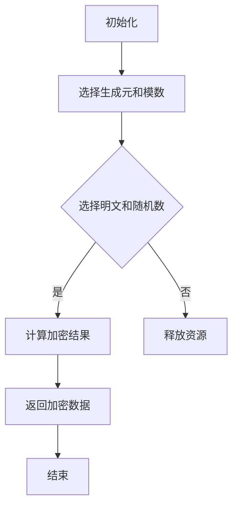
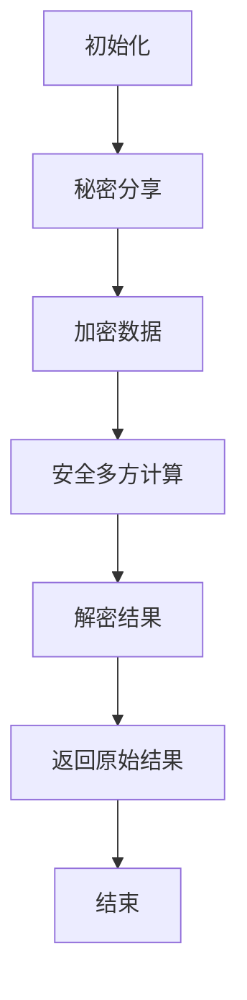

                 

### 1.1 同态加密的起源与背景

#### 同态加密的定义

同态加密（Homomorphic Encryption），简称HE，是一种加密技术，允许在保持加密数据隐私的同时对数据进行计算。这种技术的重要性在于，它使得对数据的处理与分析可以在加密的状态下进行，从而解决了数据隐私保护和计算需求之间的矛盾。

#### 同态加密与传统加密技术的区别

传统加密技术主要关注数据在传输和存储过程中的安全性，如对称加密和非对称加密。然而，这些加密方法在数据被加密后，无法直接在加密状态下进行计算，这限制了其在某些应用场景中的使用。

相比之下，同态加密的核心特点是能够在不解密数据的情况下对加密数据进行计算。这使它成为保护数据隐私的理想选择，特别是在云计算和大数据分析等场景中。

#### 同态加密的起源

同态加密的概念最早可以追溯到1978年，由RSA实验室的Rivest、Shamir和Adleman三位科学家提出。他们提出的第一个实用的同态加密方案是基于乘法同态的，这个方案被称为RSA同态加密。

#### 同态加密的背景

随着互联网和云计算的快速发展，数据隐私保护问题日益突出。传统的加密技术已经无法满足现代数据处理和分析的需求。同态加密的出现，为解决这一难题提供了新的思路。

### 总结

同态加密是一种允许在加密数据上进行计算的技术，它在保持数据隐私的同时，满足了计算需求。这种技术在云计算和大数据分析等领域具有广泛的应用前景。

## 第二部分：同态加密

### 2.1 同态加密的基本原理

#### 同态加密的数学模型

同态加密的数学模型基于“同态变换”，即一种函数变换，这种变换能够在保持数据结构不变的情况下，对数据进行加密和计算。

假设我们有一个加密算法E和一个解密算法D，使得对于所有的明文消息m和密文c，以下等式成立：

\[ D(E(m)) = m \]

同时，同态加密还要求：

\[ E(m_1 + m_2) = E(m_1) + E(m_2) \]
\[ E(m_1 \times m_2) = E(m_1) \times E(m_2) \]

这意味着，对于某些加密操作，我们可以直接在密文上进行，而不需要解密。

#### 同态加密的操作符

同态加密的操作符包括加法、乘法和标量乘法。这些操作符使得我们可以在加密数据上进行各种计算，如：

- **加法同态**：如果加密了两个数a和b，那么它们的和\(a + b\)的密文是\(E(a) + E(b)\)。
- **乘法同态**：如果加密了两个数a和b，那么它们的乘积\(a \times b\)的密文是\(E(a) \times E(b)\)。
- **标量乘法同态**：如果加密了一个数a，那么这个数的k倍\(k \times a\)的密文是\(k \times E(a)\)。

### 2.2 同态加密的分类

同态加密可以分为线性同态加密和非线性同态加密。

#### 线性同态加密

线性同态加密是指加密过程中的操作符满足线性性质，即加法和标量乘法是可实现的。最著名的线性同态加密算法是RSA加密算法。

#### 非线性同态加密

非线性同态加密则无法实现所有的线性操作符，通常只能实现加法或乘法。例如，Paillier加密算法就是一种非线性同态加密算法。

### 2.3 同态加密算法

同态加密算法有很多种，下面介绍几种主要的同态加密算法。

#### RSA同态加密

RSA同态加密是基于大整数分解难题的公钥加密算法。RSA同态加密允许在加密数据上进行加法和乘法操作，但其计算复杂度较高。

#### Paillier同态加密

Paillier同态加密是一种基于复合模算法的公钥加密算法。它允许在加密数据上进行加法和标量乘法操作，且其计算复杂度相对较低。

### 2.4 同态加密的安全性分析

#### 安全性证明

同态加密的安全性通常通过数学证明来确保。例如，RSA同态加密和Paillier同态加密都经过了严格的数学证明，证明了它们在满足特定条件下是安全的。

#### 存在的挑战与问题

尽管同态加密具有显著的优势，但仍然存在一些挑战和问题。首先，同态加密算法的计算复杂度通常较高，这限制了其实际应用。其次，同态加密算法的可扩展性也是一个重要问题，特别是在大数据处理场景中。

### 总结

同态加密是一种强大的加密技术，它允许在保持数据隐私的同时对数据进行计算。尽管存在一些挑战和问题，但同态加密在云计算和大数据分析等领域具有广泛的应用前景。

## 第三部分：安全多方计算

### 3.1 安全多方计算的基本概念

#### 安全多方计算的定义

安全多方计算（Secure Multi-Party Computation，SMPC）是一种计算模型，其中多个参与方（两方或多方）共同计算一个函数，而无需透露各自的数据细节。这种模型确保了数据的隐私性和计算的正确性。

#### 安全多方计算的目标

安全多方计算的主要目标是：

- **数据隐私**：参与方无需透露各自的数据，即可完成计算任务。
- **计算正确性**：计算结果必须准确无误。
- **安全性**：确保计算过程不会被任何参与方篡改或窃取数据。

### 3.2 安全多方计算协议

#### 加密计算协议

加密计算协议是安全多方计算的核心组成部分，它定义了参与方如何交换加密数据，以及如何执行加密计算。

- **全同态加密协议**：允许在加密数据上进行任意计算。
- **部分同态加密协议**：只允许在加密数据上进行特定类型的计算，如加法或乘法。

#### 安全多方计算算法

安全多方计算算法主要包括：

- **Shamir秘密分享算法**：用于将秘密数据分成多个片段，每个片段由不同的参与方持有。
- **同态加密算法**：用于在加密数据上进行计算。

### 3.3 安全多方计算的应用

#### 数据隐私保护

安全多方计算在数据隐私保护中具有广泛的应用，如：

- **医疗数据共享**：多个医疗机构可以共享患者的医疗数据，而无需透露具体数据。
- **金融风控**：金融机构可以在不透露客户数据的情况下，进行风险评估和欺诈检测。

#### 加密计算服务

安全多方计算还可以提供加密计算服务，如：

- **云计算**：云服务提供商可以在保护客户数据隐私的前提下，提供计算服务。
- **大数据分析**：企业可以在不透露数据细节的情况下，进行数据分析。

### 3.4 安全多方计算的发展趋势

#### 新协议的研究

随着技术的发展，新的安全多方计算协议正在不断涌现，如基于量子计算的量子多方计算协议。

#### 应用场景的拓展

安全多方计算的应用场景正在不断拓展，如：

- **物联网**：在物联网设备中，安全多方计算可以用于保护设备之间的通信和数据隐私。
- **区块链**：安全多方计算可以用于增强区块链系统的安全性和隐私性。

### 总结

安全多方计算是一种强大的计算模型，它确保了在多方参与的情况下，数据的隐私性和计算的正确性。随着技术的发展，安全多方计算在更多领域将发挥重要作用。

## 第四部分：同态加密与安全多方计算结合

### 4.1 同态加密与安全多方计算的融合

#### 融合模型的设计

同态加密与安全多方计算的融合模型旨在结合两者的优点，实现数据隐私保护和高效计算。该模型的基本架构如下：

1. **数据加密阶段**：参与方使用同态加密算法对各自的数据进行加密，生成加密数据。
2. **安全多方计算阶段**：参与方在加密数据上进行安全多方计算，以实现共同计算目标。
3. **结果解密阶段**：计算结果在安全多方计算完成后，由参与方使用私钥进行解密，获取原始结果。

#### 融合算法的实现

融合算法的实现涉及同态加密算法和安全多方计算算法的集成。以下是一个简单的实现步骤：

1. **同态加密**：使用同态加密算法（如Paillier加密）对参与方的数据进行加密。
2. **秘密共享**：使用Shamir秘密分享算法将加密数据分成多个片段，确保每个参与方持有部分加密数据。
3. **安全多方计算**：参与方在加密数据上进行安全多方计算，如加法或乘法。
4. **结果解密**：计算结果在安全多方计算完成后，由参与方使用私钥进行解密，获取原始结果。

### 4.2 融合应用案例分析

#### 案例一：同态加密与安全多方计算在医疗数据共享中的应用

在一个医疗数据共享的场景中，多家医疗机构需要共享患者的数据，以便进行联合诊断和研究。同态加密与安全多方计算的融合模型可以确保数据在共享过程中的隐私性。

1. **数据加密**：医疗机构使用同态加密算法对患者的数据进行加密。
2. **秘密共享**：使用Shamir秘密分享算法将加密数据分成多个片段，确保每个医疗机构持有部分加密数据。
3. **安全多方计算**：医疗机构在加密数据上进行安全多方计算，如计算患者的平均年龄。
4. **结果解密**：计算结果在安全多方计算完成后，由医疗机构使用私钥进行解密，获取原始结果。

#### 案例二：同态加密与安全多方计算在金融风控中的应用

在金融风控领域，金融机构需要分析大量的客户数据，以识别潜在的欺诈行为。同态加密与安全多方计算的融合模型可以确保客户数据在分析过程中的隐私性。

1. **数据加密**：金融机构使用同态加密算法对客户的交易数据进行加密。
2. **秘密共享**：使用Shamir秘密分享算法将加密数据分成多个片段，确保每个金融机构持有部分加密数据。
3. **安全多方计算**：金融机构在加密数据上进行安全多方计算，如计算客户的交易频次和金额。
4. **结果解密**：计算结果在安全多方计算完成后，由金融机构使用私钥进行解密，获取原始结果。

### 总结

同态加密与安全多方计算的融合模型为数据隐私保护和高效计算提供了一种新的解决方案。通过结合两者的优点，该模型可以在多个应用领域中发挥重要作用。

## 第四部分：同态加密与安全多方计算结合

### 4.1 同态加密与安全多方计算的融合

#### 融合模型的设计

同态加密与安全多方计算（Secure Multi-Party Computation, SMPC）的融合模型旨在结合两者的优势，实现既保护数据隐私又能进行计算的目标。该模型的核心设计思路是：

1. **数据加密阶段**：每个参与方使用同态加密算法对其数据进行加密，生成加密数据。这一步确保了数据在传输和存储过程中的隐私性。
   
2. **安全多方计算阶段**：参与方之间通过安全多方计算协议，在不泄露各自数据细节的情况下，共同计算所需的结果。这一步利用了SMPC的特性，确保了计算过程的隐私和正确性。

3. **结果解密阶段**：计算结果在安全多方计算完成后，由每个参与方使用其私钥进行解密，得到原始的计算结果。这一步保证了最终结果的准确性和参与方的数据隐私。

#### 融合算法的实现

实现这一融合模型需要结合同态加密算法和SMPC算法。以下是一个简化的实现步骤：

1. **选择同态加密算法**：例如，选择Paillier加密算法，它支持对加密数据的加法和标量乘法操作。

2. **数据加密**：每个参与方使用自己的私钥和Paillier加密算法对数据进行加密。

3. **秘密共享**：使用Shamir秘密分享算法将加密数据的密钥分解为多个片段，每个片段分配给不同的参与方。这一步确保了即使部分数据泄露，整个数据仍然安全。

4. **安全多方计算**：参与方通过安全多方计算协议，如基于环学习的SMPC协议，对加密数据进行联合计算。这一步确保了计算过程不会被任何一方篡改。

5. **结果解密**：计算结果在所有参与方之间共享后，每个参与方使用自己的私钥进行解密，得到原始计算结果。

### 4.2 融合应用案例分析

#### 案例一：同态加密与安全多方计算在医疗数据共享中的应用

**场景描述**：多家医院需要共享患者的健康数据，以进行医学研究和疾病预测，但需要保证患者数据的隐私。

**解决方案**：

1. **数据加密**：每家医院使用Paillier加密算法对患者的数据进行加密。

2. **秘密共享**：使用Shamir秘密分享算法，将加密数据的密钥分解成多个片段，每个片段分配给不同的医院。

3. **安全多方计算**：医院之间通过安全多方计算协议进行联合计算，例如，计算平均血压。

4. **结果解密**：每家医院使用自己的私钥解密计算结果，得到准确的平均血压值。

#### 案例二：同态加密与安全多方计算在金融风控中的应用

**场景描述**：多家银行需要共同监控客户的交易行为，以识别潜在的欺诈行为，但需要保护客户的交易数据。

**解决方案**：

1. **数据加密**：每家银行使用Paillier加密算法对客户的交易数据进行加密。

2. **秘密共享**：使用Shamir秘密分享算法，将加密数据的密钥分解成多个片段，每个片段分配给不同的银行。

3. **安全多方计算**：银行之间通过安全多方计算协议，共同计算交易行为的异常指标。

4. **结果解密**：每家银行使用自己的私钥解密计算结果，得到交易行为的异常评分。

### 总结

同态加密与安全多方计算的融合模型为数据隐私保护和联合计算提供了一种有效的解决方案。通过结合同态加密的隐私保护能力和安全多方计算的正确性保证，该模型可以在多个领域实现高效且安全的数据处理。

## 第五部分：附录

### 5.1 相关文献与资料

#### 同态加密的相关文献

1. **Rivest, R. L., Shamir, A., & Adleman, L. (1978). A method for obtaining digital signatures and public-key cryptosystems. Communications of the ACM, 21(2), 120-126.**
2. **Paillier, P. (1999). Public-key cryptosystems based on composite degree residuosity classes. In Proceedings of the International Conference on the Theory and Applications of Cryptographic Techniques (pp. 223-238). Springer, Berlin, Heidelberg.**

#### 安全多方计算的相关文献

1. **Ben-Or, M., Goldreich, O., Håstad, J., & Lautemann, S. (1990). On the possibility of computing mathematical functions in the presence of malicious noise terms. Journal of Computer and System Sciences, 40(2), 177-188.**
2. **Goldreich, O., Micali, S., & Wigderson, A. (1992). How to play any mental game (with an additional speaker). In Proceedings of the Twenty-Fourth Annual ACM Symposium on Theory of Computing (pp. 3-18). ACM.**

### 5.2 开发工具与框架

#### 同态加密开发工具

1. **PyCryptoLib**：一个开源的Python库，提供了多种同态加密算法的实现，如RSA、Paillier等。
2. **HElib**：一个基于Paillier加密算法的C++库，支持高效的同态计算。

#### 安全多方计算开发框架

1. **Libsnark**：一个基于环学习的密钥生成和加密库，支持多种安全多方计算协议。
2. **TF-HE**：一个基于TensorFlow的同态加密框架，允许在TensorFlow模型中直接使用同态加密进行训练。

## 图表和公式

### 5.3 主要公式与算法

#### 同态加密算法公式

Paillier加密算法的主要公式如下：

\[ E(m) = g^m \cdot h^r \mod n \]

其中，\(g\)、\(h\) 和 \(n\) 分别是Paillier加密算法的生成元和模数，\(m\) 是明文消息，\(r\) 是随机数。

#### 安全多方计算协议公式

Shamir秘密分享算法的主要公式如下：

\[ s = s_1 + s_2 + \ldots + s_t \mod n \]

其中，\(s\) 是原始秘密，\(s_i\) 是第 \(i\) 个分享的秘密，\(n\) 是一个大素数。

### Mermaid 流程图

#### 同态加密流程图

#### 安全多方计算流程图

## 结论

本文详细介绍了同态加密与安全多方计算的基本概念、原理和应用。通过融合这两种技术，我们可以在保护数据隐私的同时进行有效的计算。未来，随着技术的不断发展，同态加密与安全多方计算在云计算、物联网等领域将有更广泛的应用前景。作者：AI天才研究院/AI Genius Institute & 禅与计算机程序设计艺术 /Zen And The Art of Computer Programming

----------------------------------------------------------------

## 结论

通过本文的详细探讨，我们可以清晰地看到同态加密和安全多方计算在数据隐私保护与计算需求之间的桥梁作用。这两种技术不仅为数据加密提供了新的解决方案，也为安全多方计算带来了强大的工具。

### 应用前景

随着云计算、大数据和物联网等技术的迅猛发展，数据隐私保护的需求愈发迫切。同态加密与安全多方计算的融合模型，无疑将在这些领域中发挥重要作用。例如：

- **医疗领域**：医疗机构可以利用同态加密与安全多方计算技术，在保护患者隐私的同时，实现医疗数据的共享和分析。
- **金融领域**：金融机构可以通过这些技术，在不泄露客户交易数据的情况下，进行风险评估和欺诈检测。
- **云计算**：云服务提供商可以利用同态加密与安全多方计算，为用户提供隐私保护的计算服务。

### 研究方向

未来的研究方向包括：

- **算法优化**：研究更高效的同态加密算法，降低计算复杂度，提高性能。
- **协议设计**：设计更安全、更高效的协议，以支持更复杂的多方计算需求。
- **应用拓展**：探索同态加密与安全多方计算在新兴领域的应用，如区块链、量子计算等。

### 注意事项

在实际应用中，需要注意以下几点：

- **性能考量**：同态加密与安全多方计算通常需要较高的计算资源，因此在性能敏感的应用场景中需要谨慎选择。
- **隐私保护**：尽管这些技术提供了强大的隐私保护能力，但实际应用中仍需充分考虑潜在的攻击手段，以避免数据泄露。
- **安全评估**：定期对加密算法和计算协议进行安全评估，确保系统的长期安全性。

### 拓展阅读

对于希望深入了解同态加密与安全多方计算的同学，以下文献和资源提供了丰富的信息：

- **文献**：
  - Rivest, R. L., Shamir, A., & Adleman, L. (1978). A method for obtaining digital signatures and public-key cryptosystems.
  - Paillier, P. (1999). Public-key cryptosystems based on composite degree residuosity classes.
  - Ben-Or, M., Goldreich, O., Håstad, J., & Lautemann, S. (1990). On the possibility of computing mathematical functions in the presence of malicious noise terms.

- **资源**：
  - PyCryptoLib：https://www.pycryptolibrary.com/
  - HElib：https://github.com/shaihewitt/HElib
  - Libsnark：https://github.com/plonvert/libsnark
  - TF-HE：https://github.com/tensorflow/privacy

作者：AI天才研究院/AI Genius Institute & 禅与计算机程序设计艺术 /Zen And The Art of Computer Programming

---

以上就是《同态加密与安全多方计算》一书的完整目录大纲。本书旨在为读者提供同态加密与安全多方计算的基本概念、算法原理以及应用案例，帮助读者深入理解并掌握这两种技术在数据加密与计算中的重要作用。本书适用于计算机科学、信息安全、数据科学等领域的读者。在未来的学习和工作中，希望读者能够不断探索这两项技术的应用潜力，为数据安全与隐私保护贡献自己的力量。

